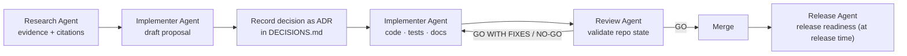

# CLAUDE.md — Zinely engineering handbook

Instructions for any engineer or AI agent working in this repository. Read this first.

**Zinely** is a privacy-first, offline-first Android app for creating printable zines. Kotlin · Jetpack Compose · Material 3 · on-device PDF/image export. No account, no cloud, no network.

---

## Documentation system

Documentation is a **first-class artifact**. The canonical documents and their *single* responsibilities:

| Document | Owns (single source of truth for…) |
|---|---|
| [README.md](README.md) | Project entry point + index of all docs |
| [docs/ARCHITECTURE.md](docs/ARCHITECTURE.md) | **Technical source of truth** — how it's built |
| [docs/PRD.md](docs/PRD.md) | Product scope — what & why, requirements |
| [docs/ROADMAP.md](docs/ROADMAP.md) | Phasing — MVP / V1 / V2 / Future |
| [docs/DECISIONS.md](docs/DECISIONS.md) | Every significant decision (ADR log) |
| [docs/RESEARCH.md](docs/RESEARCH.md) | Cited evidence base behind decisions |
| [docs/spikes/](docs/spikes/) | Pre-implementation spike designs |

### Documentation Rule (mandatory)

Before creating a new document:

1. Check whether an existing document should be updated instead.
2. Prefer extending existing documentation.
3. Avoid duplicate sources of truth.
4. Link between documents whenever possible.
5. Every decision must exist in exactly one authoritative location.

> This prevents the six-months-later failure where ARCHITECTURE.md, PRD.md, and ROADMAP.md each say something different and nobody knows which is correct.

### Consequences of the rule (how we keep it true)
- **Don't restate; link.** Reference another doc's section (e.g. `[ADR-007](docs/DECISIONS.md#adr-007)`) instead of copying its content.
- **Every major architectural decision → an ADR** in [DECISIONS.md](docs/DECISIONS.md). Reference it by ID elsewhere; never re-decide in prose.
- **Every roadmap change → [ROADMAP.md](docs/ROADMAP.md)** (and a change-log row).
- **Every scope change → [PRD.md §7](docs/PRD.md#7-scope--mvp)** (plus an ADR if it implies a decision).
- **ARCHITECTURE.md stays the technical source of truth.** Product "what/why" belongs in the PRD, not here.
- Update docs **in the same change** as the work they describe. Stale docs are bugs.

---

## Multi-agent workflow

Claude Code is the **primary implementer**. Major work — architecture, storage, rendering, export, editor, data model, UI features, releases — must be **independently reviewed by a Review Agent** before it is accepted.

### Agent roles

| Agent | Responsibility |
|---|---|
| **Implementer Agent** | Designs and implements. Updates documentation in the same change. Adds tests. **Never self-approves.** |
| **Review Agent** | Validates actual repository state; assumes implementation claims are untrusted; requests evidence when needed. Classifies findings as **Required Fix / Recommended Improvement / Observation** and produces a decision: **GO / GO WITH FIXES / NO-GO**. |
| **Release Agent** | Owns release readiness: git status, version bumps, release notes, changelog, roadmap, packaging, limitations, and blockers vs known limitations. See [Release review](#release-review-release-agent). |
| **Research Agent** | External research, citations, evidence gathering, industry best practices. Operates under [Research standards](#research-standards). |

- Surface material disagreements explicitly ("Review flagged X; chose Y because Z"); note the review outcome in the ADR.
- Skip independent review only for trivial/low-stakes changes (typos, renames, ≤5-line edits, status updates).
- If no independent Review Agent is available in a given harness, **say so** in the deliverable and flag the item for a review pass before merge.

---

## Agent handoff protocol

For any significant work item (feature, refactor, ADR, architecture change, milestone, release, or review), end with a standardized handoff. Assume future sessions have **no prior conversation history**.

### Implementer → Review Agent
- **Session Summary** — what changed, why, files/modules affected, ADRs modified/created, tests added/updated, risks/limitations/deferred work.
- **Review Package** — branch, PR number, commit range, relevant ADRs, docs updated, known concerns, claims that require verification.
- **Reviewer Prompt** — ready-to-paste; instructs the reviewer to validate the **actual repository state**, not the summary.

### Review Agent → Implementer
- **Findings** — each classified as Required Fix / Recommended Improvement / Observation.
- **Review Decision** — GO / GO WITH FIXES / NO-GO, with rationale.
- **Next Action** — the highest-priority next step.
- **Implementation Brief** — ready-to-paste: current state, decision, required fixes, known risks, relevant ADRs, affected modules, desired outcome.

### Responding to a review (Implementer)
- Reconcile findings **individually**: explicitly ACCEPT, PARTIALLY ACCEPT, or REJECT each one.
- Provide evidence for rejected findings.
- Generate the next handoff artifact.

### Review principles (Review Agent)
- Validate against actual code, commits, tests, ADRs, PRs, and documentation — **never trust summaries as ground truth**.
- Challenge assumptions; request evidence for any unverified claim.
- Verify ADR consistency and documentation consistency (per the Documentation Rule).
- Distinguish implementation defects from documentation defects.
- Identify overpromising user-facing wording (release notes, changelog, UI copy).
- Separate merge blockers from follow-up work.

---

## HTML-first UI workflow (mandatory)

**The HTML prototype is the canonical design source. Compose is an implementation of the HTML specification.**

Every UI feature follows this pipeline:

> Problem → Research → Competitive analysis → Interactive HTML prototype → Internal critique → User feedback → Design refinement → **DESIGN FREEZE** → Compose implementation → Pixel-parity verification → Device verification → Adversarial review → Merge

### DESIGN FREEZE

Once a design is frozen, the HTML specification is authoritative and stable.

**Allowed after freeze:** bug fixes · accessibility improvements · performance work · implementation parity fixes · theme compatibility.

**Not allowed after freeze:** visual redesign · interaction redesign · feature additions.

Any UX change after freeze must **first update the HTML specification**, then be implemented in Compose — never the reverse.

### Pixel parity

Before merge, every UI feature must pass parity verification:

1. Capture **device screenshots** of the Compose implementation.
2. Compare against the **frozen HTML prototype**.
3. Verify parity (layout, spacing, typography, color, interaction states).

Differences become review findings (classified per the review principles above) — they are fixed or explicitly accepted, never silently ignored.

---

## Release review (Release Agent)

Before any release, the Release Agent verifies:

- **Release scope** matches [ROADMAP.md](docs/ROADMAP.md) and the [PRD](docs/PRD.md).
- **Changelog** and **release notes** are accurate, complete, and free of overpromising wording.
- **Version numbers** are bumped consistently everywhere they appear.
- **Known limitations** are documented and honest.
- **Blockers vs deferrals** are correctly categorized (table below).
- **git status** is clean; the release commit range is what it claims to be.
- **Packaging contents** are correct (artifact naming, variant, signing).

### Release categories — never conflate

| Category | Meaning | Gate |
|---|---|---|
| **Release Blocker** | Broken or unacceptable for *this* release | Must be fixed before shipping |
| **Known Limitation** | Accepted, documented gap in this release | Must appear in release notes |
| **Technical Debt** | Internal quality issue; no immediate user impact | Track and schedule; never ships as a surprise |
| **Future Enhancement** | Out of scope by design | Belongs on the roadmap |

---

## House conventions

- **Pure helper extraction** — where logic allows, extract pure (platform-free, unit-testable) helpers rather than embedding logic in framework code.
- **Thin framework seams** — wrap platform APIs behind thin seams so core logic stays testable and platform-independent.
- **Invariant documentation** — non-obvious behavior gets its invariant documented where the code lives.
- **Repository state beats summaries** — the code, commits, and tests are authoritative; summaries are claims.
- **Docs ship with code** — documentation is updated in the same change as the implementation (see the Documentation Rule).

---

## Research standards

Research is the Research Agent's responsibility; don't rely solely on prior knowledge when research could improve accuracy. When researching product ideas, Android best practices, PDF generation, editor patterns, offline-first/storage approaches, or comparable products:

- Use **web search** for up-to-date information; validate against current industry practice.
- **Cite sources** (markdown links). Land durable findings in [RESEARCH.md](docs/RESEARCH.md) and reference them.
- Clearly label every claim:
  - ✅ **VERIFIED** (sourced) · 🟦 **RECOMMENDATION** · 🟨 **ASSUMPTION** · 🔭 **FUTURE** · ⚠️ **DISPUTED**

---

## Diagram standards

Use **Mermaid** diagrams aggressively — prefer a diagram over long prose wherever it improves understanding. Keep them in the relevant doc next to the text they clarify. Diagram types to reach for:

- System Context · Component · Data Flow · Sequence · State · Navigation Flow · Entity Relationship · Export Pipeline.

---

## Engineering conventions (summary; authority is [ARCHITECTURE.md](docs/ARCHITECTURE.md))

- **Architecture:** Clean architecture + repository pattern; unidirectional data flow. MVVM for screens; **MVI for the editor** ([ADR-005](docs/DECISIONS.md#adr-005)).
- **UI:** Jetpack Compose + Material 3; `collectAsStateWithLifecycle`; state hoisted; child composables stateless.
- **DI:** Hilt + KSP. **Async:** Coroutines/Flow; inject `CoroutineDispatcher`s; no `LiveData`.
- **Navigation:** navigation-compose, type-safe `@Serializable` routes; single Activity; navigate from UI, not ViewModels.
- **Data:** Room (KSP) for project metadata; serialized JSON for the document tree ([ADR-003](docs/DECISIONS.md#adr-003)); Coil for images.
- **Pure-Kotlin core:** `core:model`, `core:imposition`, `core:render` carry **zero Android dependencies** and are fully unit-tested.
- **Errors:** sealed `Result<T>` boundary; never swallow exceptions in repositories/data sources.
- **Privacy invariant:** no networking libraries, no analytics SDKs, no code path that uploads user content. A PR that adds network access must justify itself against [PRD principles](docs/PRD.md#5-product-principles-non-negotiable).
- **Build:** Gradle KTS + version catalog; `jvmToolchain(21)`.
- **Testing:** pure-JVM unit tests for `core` + mappers; ViewModel integration with fakes; Compose UI tests; Roborazzi screenshot/diff tests for render fidelity. Follow Given-When-Then.
- Use the `android-skills:` skills (`android-dev`, `compose`, `kotlin-flows`, etc.) for implementation detail.

## Definition of done (for a change)
1. Code + tests pass. 2. Docs updated per the Documentation Rule. 3. Major decisions recorded as ADRs (independently reviewed by the Review Agent). 4. UI features: HTML spec frozen + pixel parity verified. 5. No new network/account/cloud dependency. 6. Privacy & offline invariants intact.
