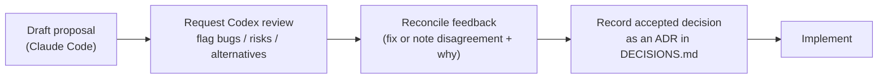

# CLAUDE.md — Zinely working conventions

Instructions for any engineer or AI agent working in this repository. Read this first.

**Zinely** is a privacy-first, offline-first Android app for creating printable zines. Kotlin · Jetpack Compose · Material 3 · on-device PDF/image export. No account, no cloud, no network.

---

## Documentation system

Documentation is a **first-class artifact**. The canonical documents and their *single* responsibilities:

| Document | Owns (single source of truth for…) |
|---|---|
| [README.md](README.md) | Project entry point + index of all docs |
| [docs/ARCHITECTURE.md](docs/ARCHITECTURE.md) | **Technical source of truth** — how it's built |
| [docs/PRD.md](docs/PRD.md) | Product scope — what & why, requirements |
| [docs/ROADMAP.md](docs/ROADMAP.md) | Phasing — MVP / V1 / V2 / Future |
| [docs/DECISIONS.md](docs/DECISIONS.md) | Every significant decision (ADR log) |
| [docs/RESEARCH.md](docs/RESEARCH.md) | Cited evidence base behind decisions |
| [docs/spikes/](docs/spikes/) | Pre-implementation spike designs |

### Documentation Rule (mandatory)

Before creating a new document:

1. Check whether an existing document should be updated instead.
2. Prefer extending existing documentation.
3. Avoid duplicate sources of truth.
4. Link between documents whenever possible.
5. Every decision must exist in exactly one authoritative location.

> This prevents the six-months-later failure where ARCHITECTURE.md, PRD.md, and ROADMAP.md each say something different and nobody knows which is correct.

### Consequences of the rule (how we keep it true)
- **Don't restate; link.** Reference another doc's section (e.g. `[ADR-007](docs/DECISIONS.md#adr-007)`) instead of copying its content.
- **Every major architectural decision → an ADR** in [DECISIONS.md](docs/DECISIONS.md). Reference it by ID elsewhere; never re-decide in prose.
- **Every roadmap change → [ROADMAP.md](docs/ROADMAP.md)** (and a change-log row).
- **Every scope change → [PRD.md §7](docs/PRD.md#7-scope--mvp)** (plus an ADR if it implies a decision).
- **ARCHITECTURE.md stays the technical source of truth.** Product "what/why" belongs in the PRD, not here.
- Update docs **in the same change** as the work they describe. Stale docs are bugs.

---

## Review workflow

Claude Code is the **primary architect and implementer**. Codex (`mcp__codex__codex`) is an **independent reviewer**.

For any **major** decision — architecture, storage, rendering, export, editor, or data model:

- Surface material disagreements explicitly ("Codex flagged X; chose Y because Z").
- Note the Codex outcome in the ADR.
- Skip the review for trivial/low-stakes changes (typos, renames, ≤5-line edits, status updates).
- If the Codex tool is unavailable in a given harness, **say so** in the deliverable and flag the item for a review pass before implementation.

---

## Research standards

Don't rely solely on prior knowledge when research could improve accuracy. When researching product ideas, Android best practices, PDF generation, editor patterns, offline-first/storage approaches, or comparable products:

- Use **web search** for up-to-date information; validate against current industry practice.
- **Cite sources** (markdown links). Land durable findings in [RESEARCH.md](docs/RESEARCH.md) and reference them.
- Clearly label every claim:
  - ✅ **VERIFIED** (sourced) · 🟦 **RECOMMENDATION** · 🟨 **ASSUMPTION** · 🔭 **FUTURE** · ⚠️ **DISPUTED**

---

## Diagram standards

Use **Mermaid** diagrams aggressively — prefer a diagram over long prose wherever it improves understanding. Keep them in the relevant doc next to the text they clarify. Diagram types to reach for:

- System Context · Component · Data Flow · Sequence · State · Navigation Flow · Entity Relationship · Export Pipeline.

---

## Engineering conventions (summary; authority is [ARCHITECTURE.md](docs/ARCHITECTURE.md))

- **Architecture:** Clean architecture + repository pattern; unidirectional data flow. MVVM for screens; **MVI for the editor** ([ADR-005](docs/DECISIONS.md#adr-005)).
- **UI:** Jetpack Compose + Material 3; `collectAsStateWithLifecycle`; state hoisted; child composables stateless.
- **DI:** Hilt + KSP. **Async:** Coroutines/Flow; inject `CoroutineDispatcher`s; no `LiveData`.
- **Navigation:** navigation-compose, type-safe `@Serializable` routes; single Activity; navigate from UI, not ViewModels.
- **Data:** Room (KSP) for project metadata; serialized JSON for the document tree ([ADR-003](docs/DECISIONS.md#adr-003)); Coil for images.
- **Pure-Kotlin core:** `core:model`, `core:imposition`, `core:render` carry **zero Android dependencies** and are fully unit-tested.
- **Errors:** sealed `Result<T>` boundary; never swallow exceptions in repositories/data sources.
- **Privacy invariant:** no networking libraries, no analytics SDKs, no code path that uploads user content. A PR that adds network access must justify itself against [PRD principles](docs/PRD.md#5-product-principles-non-negotiable).
- **Build:** Gradle KTS + version catalog; `jvmToolchain(21)`.
- **Testing:** pure-JVM unit tests for `core` + mappers; ViewModel integration with fakes; Compose UI tests; Roborazzi screenshot/diff tests for render fidelity. Follow Given-When-Then.
- Use the `android-skills:` skills (`android-dev`, `compose`, `kotlin-flows`, etc.) for implementation detail.

## Definition of done (for a change)
1. Code + tests pass. 2. Docs updated per the Documentation Rule. 3. Major decisions recorded as ADRs (Codex-reviewed). 4. No new network/account/cloud dependency. 5. Privacy & offline invariants intact.
