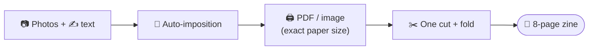

# Zinely

**A privacy-first, offline-first Android app for creating printable zines.**
Turn photos and words into a physical, foldable zine in minutes — entirely on your device. No account. No cloud. No internet required. Your photos never leave your phone.

> *Physical media instead of social media.*

---

## What it does

Zinely generates the classic **single-sheet 8-page mini-zine**: you place photos and text across 8 pages, and Zinely automatically *imposes* them — arranging each panel at the right position and rotation — so that when you print one sheet, make a single cut, and fold, you get a correctly-ordered little booklet. Export a **home-print-ready PDF** (crisp vector text) or a **300 DPI image**, print at 100%, fold, and you're done.

## Why it's different

No existing product is **offline-first + account-free + native Android + a real zine layout tool** at once — web/desktop zine tools have no native Android, and the cloud design apps wall you behind an account and upload your photos. Zinely owns that gap. ([evidence](docs/RESEARCH.md#r3-comparable-products))

- 🔒 **Private** — no network calls, no analytics, photos stay on-device
- ✈️ **Offline** — every core feature works in airplane mode
- 🆓 **Free** — no account, no paywall (MVP)
- 🧩 **Solves imposition** — the hard part, automated
- 🖨️ **Print-ready** — at home, honestly (not commercial prepress — [why](docs/DECISIONS.md#adr-002))

## Status

Pre-implementation. Architecture and documentation foundation complete; the first build step is a pure-Kotlin **imposition engine** spike. See the [roadmap](docs/ROADMAP.md).

---

## Documentation

Start here, then follow links. Each document is the **single source of truth** for its area (see the [Documentation Rule](CLAUDE.md#documentation-rule-mandatory)).

| Document | Purpose |
|---|---|
| [CLAUDE.md](CLAUDE.md) | Working conventions, documentation rule, review workflow |
| [docs/PRD.md](docs/PRD.md) | Product vision, users, scope, requirements |
| [docs/ARCHITECTURE.md](docs/ARCHITECTURE.md) | Technical source of truth — architecture, pipelines, models, diagrams |
| [docs/ROADMAP.md](docs/ROADMAP.md) | Phased plan: MVP → V1 → V2 → Future |
| [docs/DECISIONS.md](docs/DECISIONS.md) | Architecture Decision Records (ADRs) |
| [docs/RESEARCH.md](docs/RESEARCH.md) | Cited evidence base (verified / recommendation / assumption / future) |
| [docs/spikes/imposition-engine.md](docs/spikes/imposition-engine.md) | First spike: the imposition engine design |

## Tech stack

Kotlin · Jetpack Compose · Material 3 · Hilt (KSP) · Room · kotlinx.serialization · Coroutines/Flow · Coil · `android.graphics.pdf.PdfDocument` · navigation-compose. Pure-Kotlin `core` modules carry zero Android dependencies. Full rationale in [ARCHITECTURE.md](docs/ARCHITECTURE.md) and [DECISIONS.md](docs/DECISIONS.md).

## Building

> No application code yet. Build instructions land with the first module.

## Privacy

Zinely makes **no network calls**. There is no backend, no account system, and no telemetry. Imported photos are copied into the app's private storage and never uploaded. Backups are local files you control. See [PRD principles](docs/PRD.md#5-product-principles-non-negotiable).

## License

TBD (MVP is free, no monetization — [ADR-010](docs/DECISIONS.md#adr-010)). Bundled fonts/assets will be license-clear (e.g. SIL OFL).
