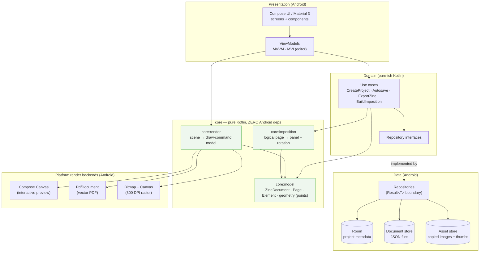
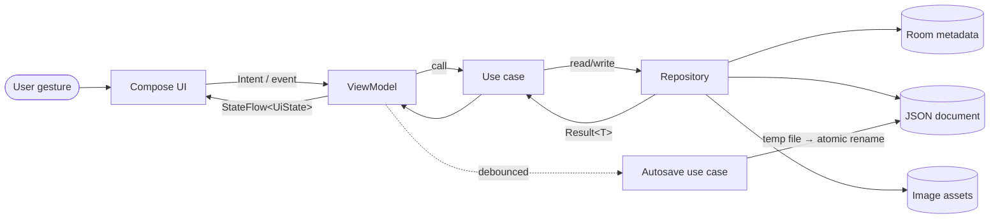
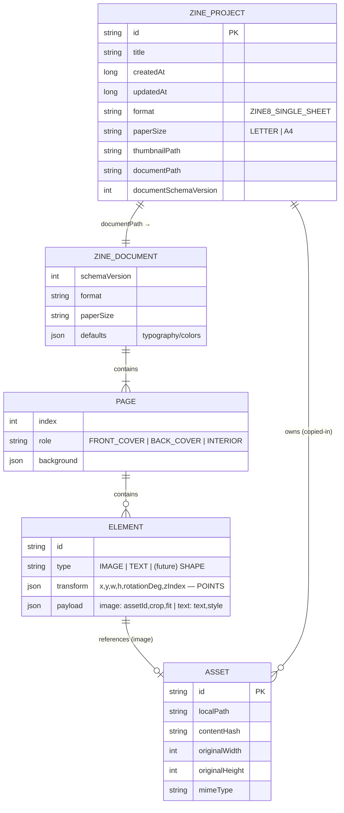
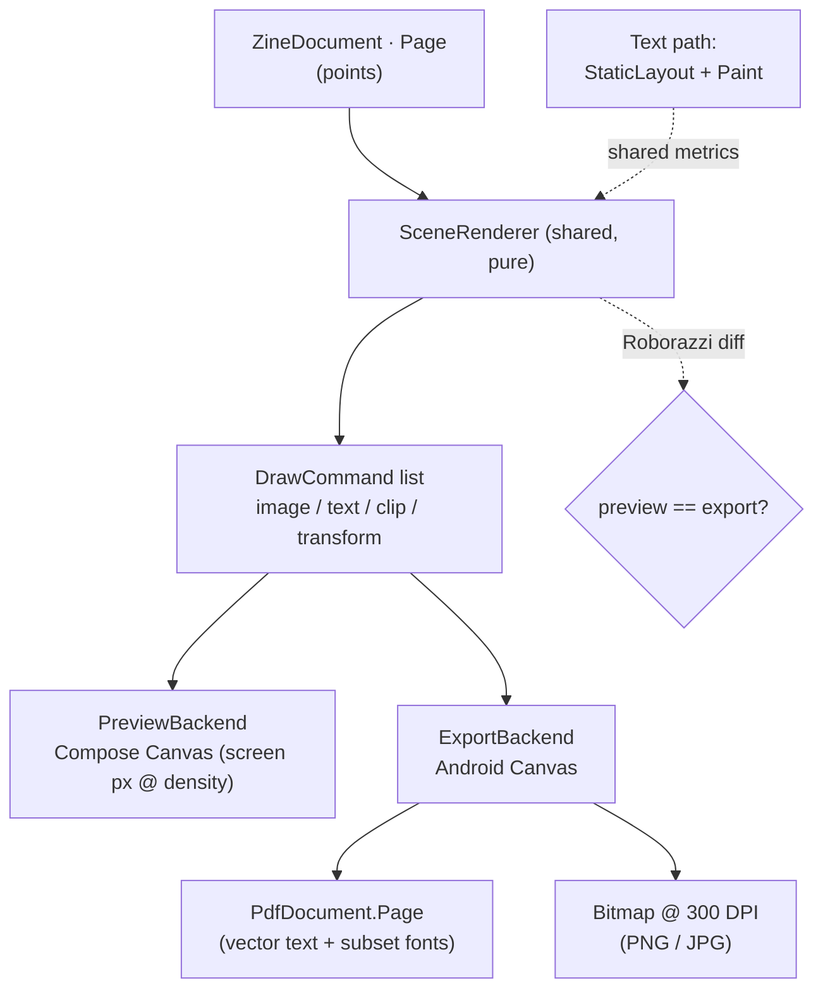
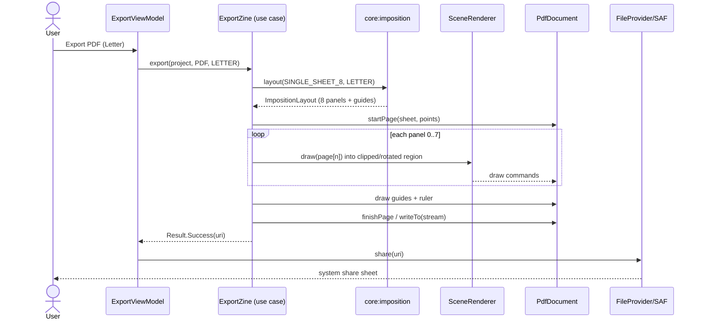
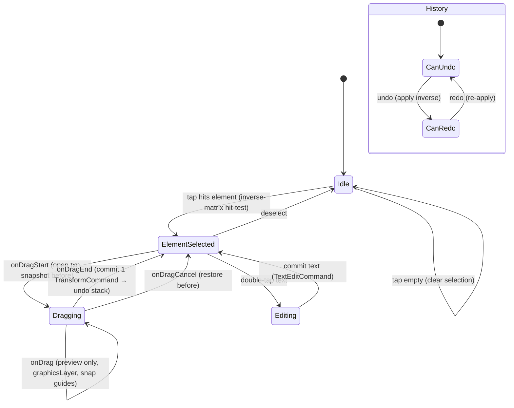
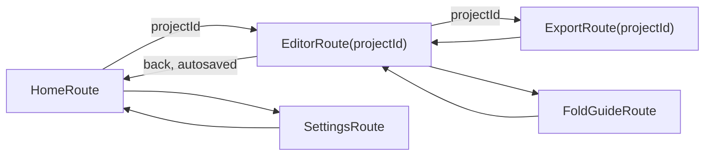
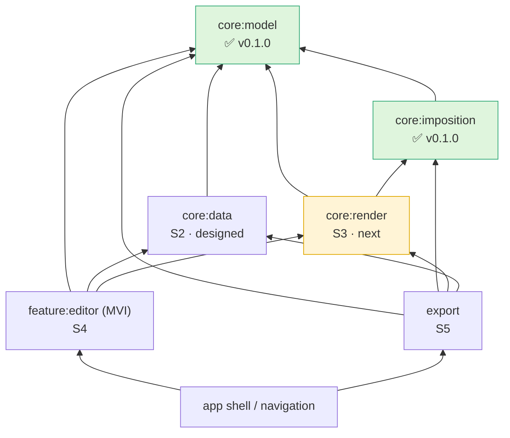
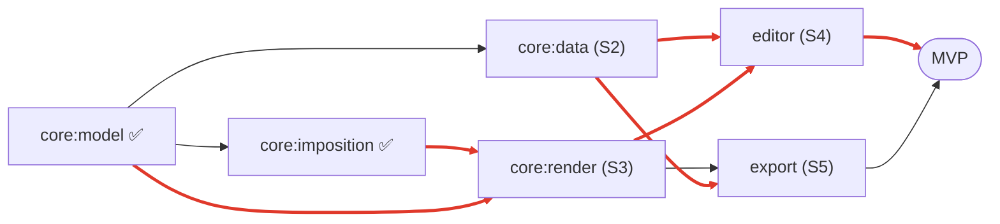

# Zinely — Architecture (v0.2)

> **The technical source of truth.** *How* Zinely is built. Product "what/why" → [PRD.md](PRD.md). Decisions → [DECISIONS.md](DECISIONS.md) (referenced by ADR id). Evidence → [RESEARCH.md](RESEARCH.md). Phasing → [ROADMAP.md](ROADMAP.md).
>
> Privacy-first, offline-first Android app for printable zines · Kotlin · Compose · Material 3 · on-device PDF/image export. **No code yet.**

> **Decisions & roadmap are not duplicated here.** Locked decisions live in [DECISIONS.md](DECISIONS.md) (ADR-001…ADR-013); phasing in [ROADMAP.md](ROADMAP.md). This document references them.

---

## 1. Architecture overview

Clean architecture, repository pattern, unidirectional data flow, single Activity. MVVM for screens; **MVI for the editor** ([ADR-013](DECISIONS.md#adr-013), [ADR-005](DECISIONS.md#adr-005)). The correctness-critical and reusable logic (document model, imposition, render-model) lives in **pure-Kotlin `core` modules with zero Android dependencies**, so it is exhaustively unit-testable and KMP-ready later.



**Layer rules**
- Presentation depends on domain; domain depends on `core:model` + repository *interfaces*; data implements interfaces.
- `core:*` never imports Android. `core:imposition` and `core:render` depend only on `core:model`.
- Errors are remapped to domain types at the repository boundary; use cases return `Result<T>` (see §9).

## 2. Module & package structure

Single Gradle module to start, packaged so it splits cleanly into modules later (1:1 mapping shown). Pure-Kotlin core isolated from day one.

> **Package root:** `com.aritr.zinely` — aligned with the existing app scaffold the project was created with (an earlier docs draft said `com.zinely`; the repo convention wins per [CLAUDE.md](../CLAUDE.md#engineering-conventions-summary-authority-is-docsarchitecturemd)).

```
com.aritr.zinely
├── core
│   ├── model        // ZineDocument, Page, Element, Transform, geometry, units (points)
│   ├── imposition   // single-sheet 8-page mapping (+ rotations, fold/cut guides, proof sheet)
│   └── render       // scene → draw-command model; Android Canvas backend adapter
├── data
│   ├── db           // Room: ZineProjectEntity, DAOs, migrations
│   ├── document     // JSON document store (atomic save, schema migration)
│   ├── asset        // image copy-in, content hashing, thumbnails, orphan cleanup
│   └── repository   // ProjectRepository, AssetRepository  (return Result<T>)
├── domain
│   ├── usecase      // CreateProject, Autosave, ExportZine, BuildImposition…
│   └── model        // domain types where they differ from core.model
├── feature
│   ├── home         // project list: create / duplicate / delete
│   ├── editor       // MVI canvas editor: state, intents, reducer, undo stack, gestures
│   ├── export       // format / paper / DPI options, progress, share
│   └── settings     // theme, defaults, storage, backup/restore
└── ui               // theme, design system, shared composables (M3)
```

Future multi-module split: `:core:model`, `:core:imposition`, `:core:render`, `:core:data`, `:core:domain`, `:core:ui`, `:feature:home|editor|export|settings`, `:app`.

## 3. Data flow



UI models are mapped from domain/data models inside ViewModels and contain only what the screen needs. Autosave is a debounced side-effect, never blocking the reducer ([ADR-009](DECISIONS.md#adr-009)).

## 4. Data models & storage

**Storage split ([ADR-003](DECISIONS.md#adr-003)):** Room stores queryable **metadata**; the zine **document tree** is `kotlinx.serialization` JSON in a per-project file (not relational). Images are **copied in** ([ADR-004](DECISIONS.md#adr-004)). Document schema is versioned **independently** of the Room schema. The diagram below is the *logical* model; only `ZINE_PROJECT` is a real table — the rest is the serialized document.



**Units rule:** the scene model is stored in **physical points (1/72")**, never pixels. Pixels exist only in cached previews/exports. `Transform` = `x, y, width, height, rotationDeg, zIndex`.

**Schema evolution:** new document fields are optional/defaulted with `ignoreUnknownKeys=true`; only the small Room metadata table uses `@AutoMigration` ([R4.2](RESEARCH.md#r42-recommendation--recommendation)). Protobuf is the [🔭 future](ROADMAP.md#future-vision) option if write-amplification matters.

## 5. Rendering pipeline — one scene, two backends

WYSIWYG by construction ([ADR-006](DECISIONS.md#adr-006)): a single pure function turns a `Page` into ordered draw commands; each backend supplies the points→target scale.



- **Critical:** text is measured/drawn through the **same Android `StaticLayout`/`Paint` path** in both preview and export (rendered into Compose via `drawIntoCanvas`) — otherwise Compose-text vs Canvas-text layout diverges ([R2.2](RESEARCH.md#r22-androidgraphicspdfpdfdocument--verified), [R5](RESEARCH.md#r5-canvas--scene-graph-editor-architecture)).
- **Images:** decode downsampled to target pixel size after **EXIF orientation normalization**; never decode a full-res photo to fill a small panel ([ADR-011](DECISIONS.md#adr-011)).
- `PdfDocument`'s Skia backend yields **true vector, selectable text with embedded subset fonts** — no third-party PDF lib needed ([ADR-001](DECISIONS.md#adr-001)).

## 6. Export pipeline

```mermaid
flowchart TD
    A["Export request\nformat · paper · DPI"] --> B["BuildImposition\n(core:imposition)"]
    B --> C["Create backend canvas\nPdfDocument.Page or Bitmap"]
    C --> D{"for each of 8 panels"}
    D --> E["Look up panel rect + rotation"]
    E --> F["Clip → translate → rotate → scale"]
    F --> G["SceneRenderer draws that logical page"]
    G --> D
    D -->|all panels done| H["Draw guides:\nsafe area · fold · cut · calibration ruler"]
    H --> I["Write output\nSAF / MediaStore (Downloads)"]
    I --> J["Share via FileProvider"]
    H -. raster only .-> K["compress() streamed → recycle()"]

    classDef nonet fill:#eef,stroke:#88a;
    class I,J nonet;
```



**Print correctness ([ADR-012](DECISIONS.md#adr-012)):** export at **exact paper size**; keep all geometry inside a ~6 mm/0.25" **safe area**; print a 1 in / 50 mm **calibration ruler**; surface **"print at 100% / Actual size, Fit-to-page OFF"**. No network at any step.

**Export sequence (PDF):**



## 7. Editor architecture (MVI)

Single immutable `EditorState` + pure reducer over a sealed `EditorIntent`. Undo = **command objects carrying field-level mementos**, coalesced per gesture ([ADR-005](DECISIONS.md#adr-005)). Live transforms run through a `Modifier.graphicsLayer{}` lambda so per-frame updates skip the reducer; snapping & hit-testing are pure functions outside history.



The drag preview is transient state (`activeGesture`) — never undoable, never persisted. Only the committed command enters history and the document.

## 8. Navigation (technical)

Single Activity (`MainActivity`) + `navigation-compose` with type-safe `@Serializable` routes; navigation triggered from UI via `NavController`, never from a ViewModel. One-shot ViewModel events use `Channel`+`receiveAsFlow()` where exactly-once delivery matters, else `SharedFlow(replay=0)`. User-facing flow map: [PRD §9](PRD.md#9-navigation-map-mvp).



## 9. Error handling

Sealed `Result<T>` boundary; never swallow exceptions in data sources/repositories.

| Layer | Behavior |
|---|---|
| Data sources | Throw platform/library exceptions (`IOException`, `SQLiteException`, decode errors) |
| Repositories | Catch & remap to a sealed `DataError` (e.g. `Storage`, `Decode`, `OutOfSpace`); never leak raw exceptions |
| Use cases | Catch domain exceptions → return `Result<T>` with a domain error model |
| ViewModels | Handle `Result<T>` → explicit `UiState` (loading / success / error) |

Export-specific: surface OOM-risk and storage-full as recoverable, user-visible errors; never crash mid-export.

## 10. Concurrency

Coroutines/Flow; inject `CoroutineDispatcher`s. Imposition/layout math on `Default`; file/PDF/bitmap writes on `IO`; UI state on the main-safe `StateFlow`. Export shows progress; promote to a foreground service / WorkManager only if batch or very large exports appear ([ROADMAP V1/V2](ROADMAP.md)). The MVI reducer stays pure and synchronous.

## 11. Testing strategy

| Tier | Target | Tooling |
|---|---|---|
| Pure unit (JVM) | `core:imposition` (golden oracle), `core:render` command model, mappers, geometry | JUnit, kotlin.test |
| Integration | ViewModels with fake repositories; document store atomic-save/recovery | JUnit + fakes, coroutines-test |
| UI | Key Compose screens, gestures | Compose UI test / `ComposeTestRule` |
| Visual regression | **Preview == export** fidelity; rendered pages | Roborazzi screenshot diff |
| Manual ground truth | Print + fold a real sheet (or SVG proof sheet when no printer) | [spike](spikes/imposition-engine.md) |

See `android-skills:android-tdd`. The imposition engine is built **test-first** against the [R1.2 oracle](RESEARCH.md#r12-page--cell-mapping-the-oracle--verified).

## 12. Major technical risks

| # | Risk | Sev | Mitigation |
|---|---|---|---|
| 1 | **Imposition correctness** — wrong panel/rotation ⇒ every zine wrong | High | Pure-Kotlin engine, golden tests vs [R1.2](RESEARCH.md#r12-page--cell-mapping-the-oracle--verified), SVG proof sheet, physical print check ([spike](spikes/imposition-engine.md)) |
| 2 | **Direct-manipulation editor** (the real iceberg) | High | MVI + command undo ([ADR-005](DECISIONS.md#adr-005)); spike gestures/undo/perf early |
| 3 | **Preview ↔ export divergence** (esp. text) | High | Shared renderer + shared Android text path; Roborazzi diffs ([ADR-006](DECISIONS.md#adr-006)) |
| 4 | **Memory / OOM at 300 DPI** | Med | Decode-to-target, EXIF-normalize, recycle, stream ([ADR-011](DECISIONS.md#adr-011)) |
| 5 | **Home-print rescaling / non-printable margins** | Med | Exact paper size, safe area, calibration ruler, guidance ([ADR-012](DECISIONS.md#adr-012)) |
| 6 | **Data durability without cloud** | Med | Autosave + atomic rename; `.zine` backup ([ADR-009](DECISIONS.md#adr-009)) |
| 7 | **Coordinate/unit math** (pt/px/mm) | Med | One geometry module; physical units in model |
| 8 | **Scope creep → full design editor** | Med | Beginner-first + progressive disclosure ([ADR-008](DECISIONS.md#adr-008)); roadmap discipline |

## 13. Technology stack

| Concern | Choice | ADR |
|---|---|---|
| Language / UI | Kotlin, Jetpack Compose, Material 3 | [013](DECISIONS.md#adr-013) |
| Architecture | MVI (editor) + MVVM (rest), clean arch | [013](DECISIONS.md#adr-013), [005](DECISIONS.md#adr-005) |
| DI | Hilt + KSP | [013](DECISIONS.md#adr-013) |
| Navigation | navigation-compose, type-safe routes | [013](DECISIONS.md#adr-013) |
| Local DB | Room (metadata only) | [003](DECISIONS.md#adr-003) |
| Document serialization | kotlinx.serialization JSON | [003](DECISIONS.md#adr-003) |
| Images | Coil; Photo Picker import; copy-in | [004](DECISIONS.md#adr-004) |
| PDF export | `android.graphics.pdf.PdfDocument` | [001](DECISIONS.md#adr-001) |
| Image export | Bitmap + Canvas @300 DPI | [011](DECISIONS.md#adr-011) |
| File I/O | SAF + MediaStore + FileProvider, no network | [009](DECISIONS.md#adr-009) |
| Build | Gradle KTS + version catalog, `jvmToolchain(21)` | — |
| Testing | JUnit, Compose UI test, Roborazzi | [ARCHITECTURE §11](#11-testing-strategy) |

**Deliberately excluded (MVP):** any networking, analytics, accounts, cloud, third-party PDF/prepress lib, CMYK/ICC.

## 14. Decision & review trail

All locked decisions and the Codex review outcomes are recorded as ADRs in [DECISIONS.md](DECISIONS.md). Major technical changes follow the [review workflow](../CLAUDE.md#review-workflow): propose → Codex review → reconcile → ADR.

## 15. Subsystem dependency map, build order & critical path

The whole-project view used to sequence implementation. Phasing definitions live in [ROADMAP.md](ROADMAP.md#guiding-sequence); this section is the *technical* dependency basis that justifies that order.

### 15.1 Dependency graph



*Arrow `A → B` = "A depends on B." `core:model` is the universal sink (pure, depends on nothing); the `app` shell is the source.*

### 15.2 Build order

| Phase | Subsystem | Direct deps | Status | Parallelizable with |
|---|---|---|---|---|
| S1 | `core:imposition` | `core:model` | ✅ shipped (v0.1.0) | — |
| S2 | `core:data` | `core:model` | 🟦 designed; gated on [ADR-021/022/023](DECISIONS.md#adr-021) | S3 (no shared dep) |
| **S3** | **`core:render`** | `core:model`, `core:imposition` | ⬜ **recommended next** | S2 finalization |
| S4 | `feature:editor` | `core:model`, `core:data`, `core:render` | ⬜ | — (needs S2 **and** S3) |
| S5 | `export` | `core:model`, `core:imposition`, `core:render`, `core:data` | ⬜ | — |
| — | `app` shell / nav | features | ⬜ | — |

### 15.3 Risk analysis

| Subsystem | Residual risk | Severity | De-risked by |
|---|---|---|---|
| `core:imposition` | — (retired) | — | shipped, 95 tests, [ADR-007](DECISIONS.md#adr-007) |
| `core:data` | corruption, schema drift, asset GC, autosave durability | Med–High | [storage spike](spikes/data-storage-layer.md), [ADR-009/021/022/023](DECISIONS.md#adr-009) |
| `core:render` | **text-layout fidelity, transform correctness, preview↔export parity** | **High** | one shared renderer ([ADR-006](DECISIONS.md#adr-006)); Roborazzi diffs ([§11](#11-testing-strategy)) |
| `feature:editor` | MVI state/undo complexity, gesture math | Med | MVI + command undo ([ADR-005](DECISIONS.md#adr-005)) |
| `export` | PDF vector-text fidelity, raster OOM, fit-to-page rescale | Med–High | [ADR-001/011/012](DECISIONS.md#adr-001) |

### 15.4 Critical path



The longest chain of *remaining* work is **`core:render` → `feature:editor` → `export` → MVP** (red). `core:data` is a **parallel feeder** into the editor and export — it shares no dependency with `core:render`, so persistence work and render work can proceed concurrently.

### 15.5 Which subsystem follows S2 — recommendation

**Build `core:render` (S3) next.** Justification:

1. **Critical-path node.** Render is the *only* prerequisite shared by **both** the editor (S4) and export (S5). Nothing downstream of S2 can ship without it: the editor has no canvas without a renderer, and export is *defined* as the second backend of the shared renderer ([ADR-006](DECISIONS.md#adr-006)). It maximises unblocking.
2. **Already unblocked.** Render depends only on `core:model` + `core:imposition` (both shipped) plus the document types S2 introduces in `core:model`. It needs the persistence layer's *types*, not its *mechanism* — so it can start immediately and **overlap** with closing the held S2 ADRs (021/022/023).
3. **Next-highest correctness risk** ([§12](#12-major-technical-risks)). After imposition, render fidelity (text layout, image transforms, preview↔export parity) is the biggest unproven risk — building it next honours the project's "prove the riskiest, most isolatable thing first" principle.
4. **Editor cannot precede it.** S4 strictly depends on S3; sequencing the editor before render is infeasible.

> **Sequencing rule:** finalize the held S2 ADRs (durable autosave, asset ownership, fidelity cap) *and* begin `core:render` design in parallel — they do not block each other. The editor (S4) starts only once **both** S2 and S3 land.
