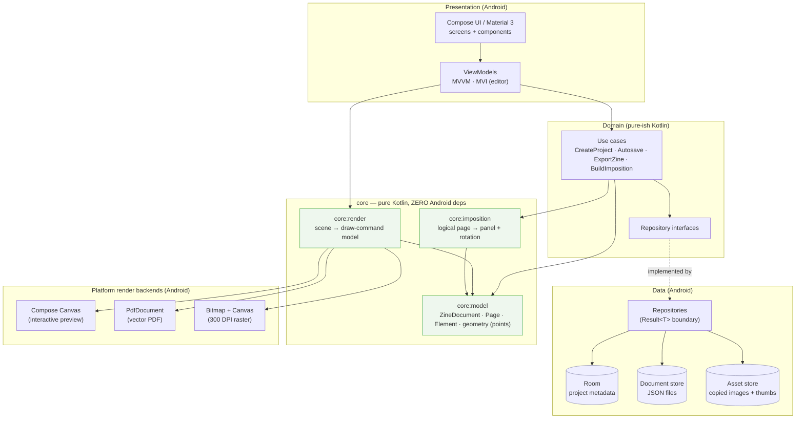
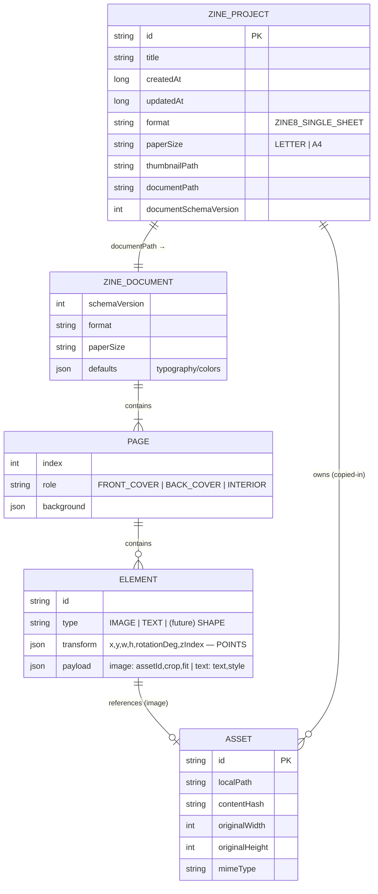
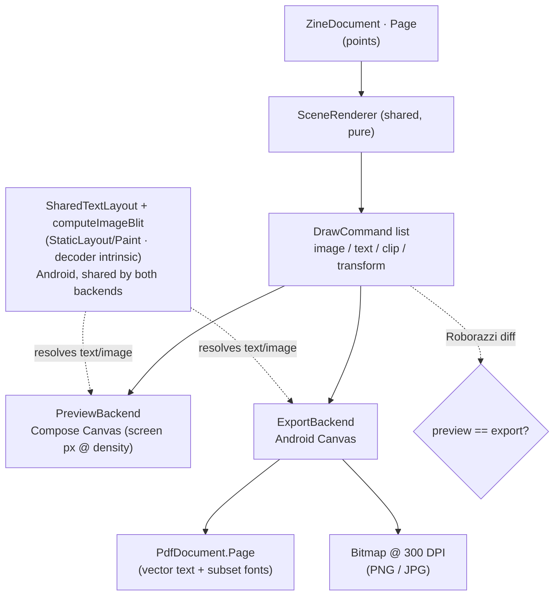
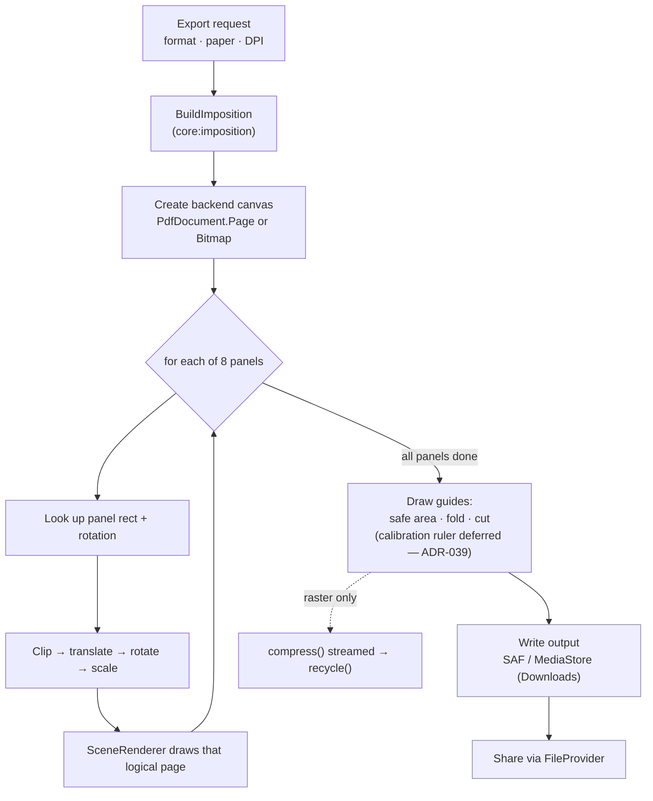
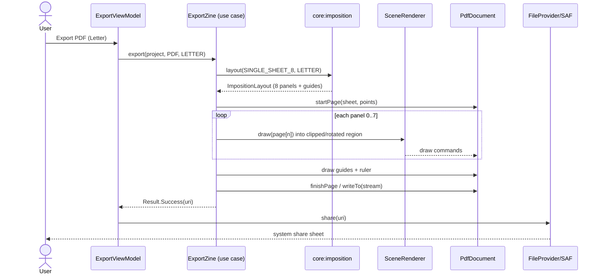
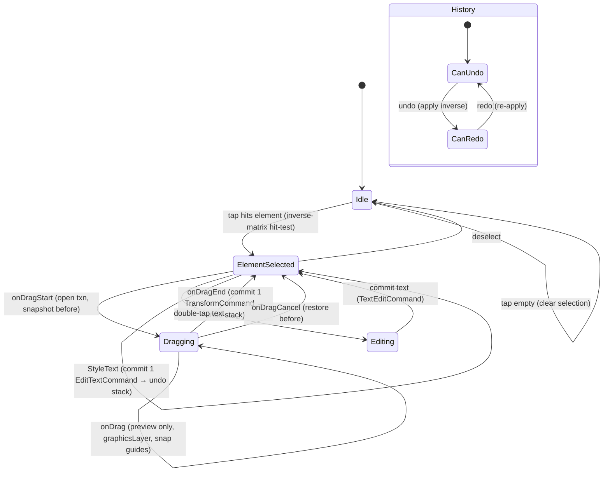
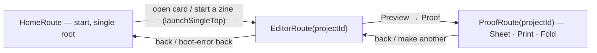
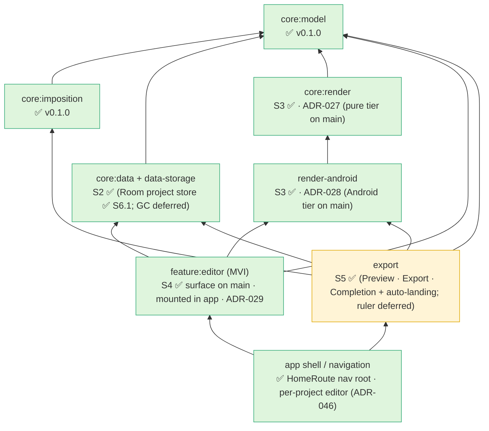
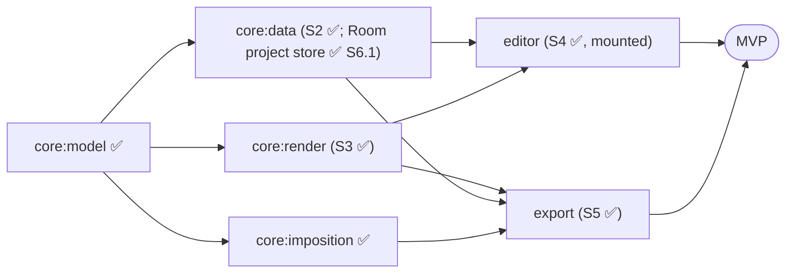

# Zinely — Architecture (v0.2)

> **The technical source of truth.** *How* Zinely is built. Product "what/why" → [PRD.md](PRD.md). Decisions → [DECISIONS.md](DECISIONS.md) (referenced by ADR id). Evidence → [RESEARCH.md](RESEARCH.md). Phasing → [ROADMAP.md](ROADMAP.md).
>
> Privacy-first, offline-first Android app for printable zines · Kotlin · Compose · Material 3 · on-device PDF/image export. **Implemented so far:** the pure-Kotlin core — `core:model` + `core:imposition` (S1, shipped `v0.1.0`), `core:data` + `core:data-storage` (S2), `core:render` (S3), `core:editor` (S4) — plus the Android-backed `data-android` (file persistence), `render-android` (PDF/raster backends), and `feature:editor` (interaction surface). The `:app` module boots onto the **Home / "My zines" shelf** (`HomeRoute` start destination, [ADR-046](DECISIONS.md#adr-046)) and mounts a working per-project **editor** with interactive image import and autosave, plus the complete S5 export/share flow: reader **Preview**, **Export · Print & fold** (vector PDF + 300 DPI PNG of the imposed sheet, shared via `FileProvider`, [ADR-039](DECISIONS.md#adr-039)), and the **Completion · fold-steps** payoff with auto post-export landing ([ADR-040](DECISIONS.md#adr-040)/[ADR-041](DECISIONS.md#adr-041)). **S6.1** landed the Room-backed `ProjectRepository` (a rebuildable index over the per-project files, [ADR-042](DECISIONS.md#adr-042)); **S6.2–S6.4** built the shelf — read-only list ([ADR-043](DECISIONS.md#adr-043)), actions ([ADR-044](DECISIONS.md#adr-044)), thumbnails ([ADR-045](DECISIONS.md#adr-045)); **S6.5** wired it as the nav root and retired the `"default"` seed-on-miss ([ADR-046](DECISIONS.md#adr-046), [§8](#8-navigation-technical)). **Still deferred:** the Settings screen, the asset GC/sweeper ([ADR-031](DECISIONS.md#adr-031) §2), and the on-sheet calibration ruler (deferred with cause, [ADR-039](DECISIONS.md#adr-039)) — see [§4](#4-data-models--storage) and [ROADMAP.md](ROADMAP.md).

> **Decisions & roadmap are not duplicated here.** Locked decisions live in [DECISIONS.md](DECISIONS.md) (ADR-001…ADR-046); phasing in [ROADMAP.md](ROADMAP.md). This document references them.

---

## 1. Architecture overview

Clean architecture, repository pattern, unidirectional data flow, single Activity. MVVM for screens; **MVI for the editor** ([ADR-013](DECISIONS.md#adr-013), [ADR-005](DECISIONS.md#adr-005)). The correctness-critical and reusable logic (document model, imposition, render-model) lives in **pure-Kotlin `core` modules with zero Android dependencies**, so it is exhaustively unit-testable and KMP-ready later.



**Layer rules**
- Presentation depends on domain; domain depends on `core:model` + repository *interfaces*; data implements interfaces.
- `core:*` never imports Android. `core:imposition` and `core:render` depend only on `core:model`.
- Errors are remapped to domain types at the repository boundary; use cases return `Result<T>` (see §9).

## 2. Module & package structure

Multi-module Gradle build; the pure-Kotlin core is isolated from day one. The package tree below is the logical layout; modules are split out incrementally (the realised vs planned split is listed under it).

> **Package root:** `com.aritr.zinely` — aligned with the existing app scaffold the project was created with (an earlier docs draft said `com.zinely`; the repo convention wins per [CLAUDE.md](../CLAUDE.md#engineering-conventions-summary-authority-is-docsarchitecturemd)).

```
com.aritr.zinely
├── core
│   ├── model        // ZineDocument, Page, Element, Transform, geometry, units (points)
│   ├── imposition   // single-sheet 8-page mapping (+ rotations, fold/cut guides, proof sheet)
│   └── render       // PURE scene → draw-command model (ADR-027); Android backends live in a platform module, NOT here
├── data
│   ├── db           // Room: ZineProjectEntity, DAOs, migrations
│   ├── document     // JSON document store (atomic save, schema migration)
│   ├── asset        // image copy-in, content hashing, thumbnails, orphan cleanup
│   └── repository   // ProjectRepository, AssetRepository  (return Result<T>)
├── domain
│   ├── usecase      // CreateProject, Autosave, ExportZine, BuildImposition…
│   └── model        // domain types where they differ from core.model
├── feature
│   ├── home         // project list: create / duplicate / delete
│   ├── editor       // MVI canvas editor: state, intents, reducer, undo stack, gestures
│   ├── export       // format / paper / DPI options, progress, share
│   └── settings     // theme, defaults, storage, backup/restore
└── ui               // theme, design system, shared composables (M3)
```

Module split (realised vs planned): **realised** — `:app` (Home-shelf nav root + per-project editor hosts, [ADR-046](DECISIONS.md#adr-046)), `:core:model`, `:core:imposition`, `:core:data` (S2A pure-Kotlin contracts), `:core:data-storage` (S2B pure-JVM durability core + content-addressed asset store, [ADR-025](DECISIONS.md#adr-025); GC/sweeper deferred — see [§4](#4-data-models--storage)), `:core:render` (S3 pure tier, [ADR-027](DECISIONS.md#adr-027)), `:render-android` (S3 Android replay/export tier, [ADR-028](DECISIONS.md#adr-028)), `:core:editor` (S4 pure MVI reducer, [ADR-029](DECISIONS.md#adr-029)), `:feature:editor` (S4 interaction surface — MVI store, gesture pipeline, selection chrome, snap guides, a11y contextbar, text-edit session, host `EditorScreen`; also hosts the unified `ProofScreen` — the S5 Preview/Export/Completion screens were retired and collapsed into it in M5 B5 ([ADR-051](DECISIONS.md#adr-051)) — and the S6.2 read-only `HomeScreen`, [ADR-043](DECISIONS.md#adr-043)), `:data-android` (S2B Android adapters: file-backed `DocumentRepository` over app-private storage + **the S6.1 Room-backed `ProjectRepository` index** (`projects` table + `meta.json` sidecar, files-as-truth, [ADR-042](DECISIONS.md#adr-042)); **WorkManager GC and SAF `.zine` restore not yet implemented**, [ADR-025](DECISIONS.md#adr-025)); **planned** — `:core:domain`, `:core:ui`, and `:feature:home|export|settings` as module *extractions* (their screens currently live in `:feature:editor`/future work; a `:feature:home` split is deferred until S6.5 or a second consumer justifies it, [ADR-043](DECISIONS.md#adr-043)).

## 3. Data flow


UI models are mapped from domain/data models inside ViewModels and contain only what the screen needs. Autosave is a debounced side-effect, never blocking the reducer ([ADR-009](DECISIONS.md#adr-009)).

## 4. Data models & storage

**Storage split ([ADR-003](DECISIONS.md#adr-003)):** Room stores queryable **metadata**; the zine **document tree** is `kotlinx.serialization` JSON in a per-project file (not relational). Images are **copied in** ([ADR-004](DECISIONS.md#adr-004)). Document schema is versioned **independently** of the Room schema. The diagram below is the *logical* model; only `ZINE_PROJECT` is a real table — the rest is the serialized document.

> **⚠️ Current implementation (checkout state).** The Room-backed `ProjectRepository` **landed in S6.1** ([ADR-042](DECISIONS.md#adr-042)): `data-android` now has a `projects` Room table (v1, schema exported) as a **rebuildable index** behind the `RoomProjectRepository` binding in [DataModule](../data-android/src/main/kotlin/com/aritr/zinely/data/android/di/DataModule.kt) — the **files stay the source of truth** (`DocumentRepositoryImpl` writes `projects/<id>/document.json` via `core:data-storage`'s atomic `AtomicFileStore`, plus an atomic `meta.json` sidecar for title/createdAt), with an idempotent reconcile scan adopting on-disk projects (including the S4 `"default"` seed) and rows re-derived from disk after every mutation. At the **UI level** the shelf is fully wired ([ADR-046](DECISIONS.md#adr-046), [§8](#8-navigation-technical)): `HomeRoute` is the start destination, cards open the editor per project, and the [ADR-030](DECISIONS.md#adr-030) §4 seed-on-miss is retired (`EditorBootstrap` is load-only; `NotFound` is an honest boot error) — shelf actions ([ADR-044](DECISIONS.md#adr-044)) and thumbnails ([ADR-045](DECISIONS.md#adr-045)) shipped on it in S6.3–S6.4. Image assets are persisted by the content-addressed `FileAssetStore`; the asset **GC/sweeper is deferred** ([ADR-031](DECISIONS.md#adr-031)).



**Units rule:** the scene model is stored in **physical points (1/72")**, never pixels. Pixels exist only in cached previews/exports. `Transform` = `x, y, width, height, rotationDeg, zIndex`.

**Schema evolution:** new document fields are optional/defaulted with `ignoreUnknownKeys=true`; only the small Room metadata table uses `@AutoMigration` ([R4.2](RESEARCH.md#r42-recommendation--recommendation)). Protobuf is the [🔭 future](ROADMAP.md#future-vision) option if write-amplification matters.

## 5. Rendering pipeline — one scene, two backends

WYSIWYG by construction ([ADR-006](DECISIONS.md#adr-006) principle; [ADR-027](DECISIONS.md#adr-027) concrete pure `:core:render` contract; [ADR-028](DECISIONS.md#adr-028) the Android replay/parity tier): a single pure function turns a `Page` into ordered, self-contained draw commands in page-local points; each backend supplies the points→target scale. Images emit *intent* and share one pure `computeImageBlit` (intrinsic from the backend's own decode); text emits *intent* and shares one Android `StaticLayout` path laid out in point space. **This guarantee is scoped to consumers of the draw-command tape** — every surface that renders a page. A transient editing affordance that paints document-owned pixels *outside* the replayer (today: the Reframe overlay, [ADR-053](DECISIONS.md#adr-053)) is not covered by it and owes its own parity proof, because sharing the pure geometry is only half the guarantee: it must also resolve that geometry from the same **inputs**. That second half is now structural too — every surface reads a master's intrinsic pixel size through the single pixel-free `readImageIntrinsics` seam ([ADR-056](DECISIONS.md#adr-056)), so the overlay and the renderer cannot resolve framing from different numbers (M7-01). The Android side ([ADR-028](DECISIONS.md#adr-028)) is a single `CanvasReplayer` invoked with two canvas providers — export PDF (drawing in **PostScript points**, with a *separate* image-decode pixel scale) and export raster (`×300/72` pixels); the editor-preview Compose host (`PagePreview`) shipped in S4 ([ADR-029](DECISIONS.md#adr-029)), replaying the same tape through the same replayer. Design + review trail: [spikes/core-render.md](spikes/core-render.md) (pure tier) + [spikes/core-render-android-backend.md](spikes/core-render-android-backend.md) (Android tier).



- **Critical:** text is measured/drawn through the **same Android `StaticLayout`/`Paint` path** in both preview and export (rendered into Compose via `drawIntoCanvas`) — otherwise Compose-text vs Canvas-text layout diverges ([R2.2](RESEARCH.md#r22-androidgraphicspdfpdfdocument--verified), [R5](RESEARCH.md#r5-canvas--scene-graph-editor-architecture)).
- **Document typography — one registry, every surface** ([ADR-057](DECISIONS.md#adr-057)). A document's `TextStyle.fontFamily` is resolved by the `:render-android` **`DocumentFontRegistry`**, the single source of truth for what a family *means*. Every surface that draws document text (editor preview, raster export, PDF export, thumbnails) reaches its typeface through it, because all of them share one `CanvasReplayer` → `SharedTextLayout` → `BundledFontResolver`; the resolver owns only the asset→`Typeface` step, the registry owns family selection. Resolution is **total and explicit**: a registered family resolves to itself, an unregistered one resolves to the declared default (never a device font, whose metrics vary per phone), and `isRegistered` lets a caller distinguish a match from a substitution rather than silently swapping a user's font. Adding a family is **data, not code** — bundle four static TTFs and add a row; *which* families ship is a curation decision, gated on the designer's font/preset freeze, not a property of this code. Before F3 the resolver discarded `fontFamily` entirely and every document rendered in Inter whatever it claimed.
- **Script coverage is two separate questions, deliberately** ([ADR-057](DECISIONS.md#adr-057)). *"Did the user type a script v1 supports?"* is a **product** question, answered purely and instantly in `:core:model` by `SupportedScripts` (the ratified set: Latin/Latin-Ext, Cyrillic, Greek — [V1](zinely-v1.md) §5) and `analyzeTextCoverage`, which the editor can call on every keystroke without touching a font, canvas, or device — that is what makes DoD 4's "flagged at typing time, **before any work is lost**" achievable. *"Can the bundled TTF actually render it?"* is a **file** question, answered in `:render-android` by `FontCoverage` parsing each font's own `cmap` (`CmapCoverage`). The guard test asserts the fonts carry the **core alphabets** of every ratified script — every letter a reader of English, another European Latin language, Russian or modern Greek would type, plus the punctuation the editor produces — across **all four faces**, since a character that renders regular but blanks in bold is still a blank on paper. It is a stated probe set, not an exhaustive proof of every classified code point: `SupportedScripts` classifies whole Unicode ranges, and the bundled faces do not carry every assigned code point in them (some combining marks, IPA letters, letterlike symbols, archaic Greek). Where the font genuinely cannot deliver, **the promise was narrowed rather than the gap hidden** — Cyrillic Supplement (Komi/Abkhaz) and polytonic Greek are classified *unsupported and named*, so a user typing them is warned rather than silently failed. Promising what the font cannot print is the Article 5 violation DoD 4 exists to prevent. Coverage is read from the font file and **never** from `Paint.hasGlyph`, which walks the device's system fallback chain and would happily pass a glyph the bundled font lacks — precisely the preview-vs-export drift the bundled-font policy removes. Out-of-scope scripts are *named* (Arabic, Han, Devanagari…) so a refusal can be specific rather than a shrug; emoji are classified separately because they fail for a different reason — colour emoji cannot be embedded in a PDF at all ([ADR-001](DECISIONS.md#adr-001)), a limit of print rather than a missing font.
- **Document typography and UI typography are deliberately separate** ([ADR-057](DECISIONS.md#adr-057)). The registry governs what is drawn *inside a zine*. Application chrome — the shelf, the editor's own controls — loads its fonts independently through Compose resources in `:feature:editor/res/font/`. The two are not merged because they answer different questions: chrome typography is a product-design choice about the app, document typography is user content that must survive export to paper and stay pixel-identical across four surfaces. The duplication this leaves (two Inter faces are byte-identical across the two homes) is a **known, accepted repository-structure cost**, not a parity risk — nothing in the document path reads the UI font home.
- **Images:** decode downsampled to target pixel size after **EXIF orientation normalization**; never decode a full-res photo to fill a small panel ([ADR-011](DECISIONS.md#adr-011)).
- `PdfDocument`'s Skia backend yields **true vector, selectable text with embedded subset fonts** — no third-party PDF lib needed ([ADR-001](DECISIONS.md#adr-001)).

## 6. Export pipeline

> **⚠️ Current implementation (checkout state).** The **user-facing export flow ships** (S5 step 2, [ADR-039](DECISIONS.md#adr-039)): a `:render-android` `SheetComposer` composites all 8 imposed panels onto ONE sheet over the shared `CanvasReplayer` (reusing `PdfPageRenderer`/`RasterPageRenderer`'s scale seams, not a parallel path), a `:app` `ZineExporter` runs it off-main through **one `export(destination)` funnel** ([ADR-054](DECISIONS.md#adr-054)) returning a sealed **`ExportOutcome`**: **Share** renders a vector **PDF** (or 300 DPI **PNG**) to the export cache and hands back an `ExportReady` scoped `FileProvider` `content://` URI dispatched via `ACTION_SEND`; **Save PDF** writes a **permanent copy to the shared Downloads** collection (`DownloadsWriter` — `MediaStore` on API 29+, legacy public-Downloads `File` on API 24–28) and hands back an `ExportSaved`. The former Save-PDF `ACTION_VIEW` (open-in-viewer) path is **retired** ([ADR-052](DECISIONS.md#adr-052) closure note → [ADR-054](DECISIONS.md#adr-054)). **Since M5 ([ADR-051](DECISIONS.md#adr-051)) the export UI host is the unified `ProofScreen`** (Act 2 "Print" `ProofPrintAct` + the `ProofDestination` edges): the former `ExportScreen` (share) and `Completion` fold-steps screen were retired in B5, and the [ADR-041](DECISIONS.md#adr-041) auto post-export landing is preserved as the intra-screen "Fold now" hand-off to Act 3. The export *backend* (SheetComposer/ZineExporter/FileProvider, ADR-039) is unchanged. **Save-to-phone shipped** ([ADR-054](DECISIONS.md#adr-054)): Save PDF writes a durable `MediaStore` Downloads copy (the transport-vs-durable split above). **Still deferred:** the on-sheet calibration ruler ([ADR-012](DECISIONS.md#adr-012) — the single-sheet-8 grid tiles edge-to-edge, no margin), first-class in-app `PrintManager` ([ADR-052](DECISIONS.md#adr-052)), and a SAF `ACTION_CREATE_DOCUMENT` folder-picker ("Save to Files", a separate future path — never the Save-PDF fallback). The pipeline below is the accepted design; the shipped path realises its export half.



**Print correctness ([ADR-012](DECISIONS.md#adr-012)):** export at **exact paper size**; keep all geometry inside a ~6 mm/0.25" **safe area**; print a 1 in / 50 mm **calibration ruler** (accepted design, **not yet shipped** — deferred with cause, [ADR-039](DECISIONS.md#adr-039): the edge-to-edge grid leaves no margin; the "Actual size" note carries the guidance); surface **"print at 100% / Actual size, Fit-to-page OFF"**. No network at any step.

**Export sequence (PDF):**



## 7. Editor architecture (MVI)

Single immutable `EditorState` + pure reducer over a sealed `EditorIntent`. Undo = **command objects carrying field-level mementos**, coalesced per gesture ([ADR-005](DECISIONS.md#adr-005)). Live transforms run through a `Modifier.graphicsLayer{}` lambda so per-frame updates skip the reducer; snapping & hit-testing are pure functions outside history.



The drag preview is transient state (`activeGesture`) — never undoable, never persisted. Only the committed command enters history and the document.

### 7.1 Text styling — `StyleText` and the Type bar ([ADR-055](DECISIONS.md#adr-055))

`Intent.StyleText` is **not a session**. Unlike inline text edit (`Editing` above) and Reframe — which open, commit, and can cancel — a style change is a self-transition on `ElementSelected`: it commits immediately, one `EditTextCommand` per change, with no session token and no cancel (cancel is undo). It reuses the existing before/after `TextElement` memento, so no new command type and no reducer merge logic exist. Every field is a **nullable patch** (`null` keeps the current value), which is what preserves `fontFamily` — the editor never writes it, and since F3 that preservation carries real weight: the `DocumentFontRegistry` (§5) resolves a declared family rather than collapsing every family to Inter, so a `fontFamily` this style path leaves untouched is one the renderer will honour. It no-ops on an absent, non-text, blank, or unchanged element; the blank guard is load-bearing, defending `endTextSession`'s assumption that a fresh blank box's `PlaceCommand` is the last undo entry.

**Coalescing lives in the surface, not the reducer** — the one place this MVI stack puts pre-commit state above `:core:editor`. The reducer performs no history merging (every `Intent.Nudge` emits its own command), so the Type bar holds a pending size index and dispatches **one** intent after a 400 ms settle: an isolated step or a whole run each cost one undo. Like `activeGesture`, that pending index is transient and never persisted — but it lives in `:feature:editor`, and it **flushes on dispose** so a size in flight when the bar closes or the selection moves still commits to the box being left.

**The canvas does not wait for that settle.** The window coalesces the *undo entry*; the block repaints on every step, matching the frozen `setSize`, which calls `applyTextStyle` synchronously and defers only `snapshot()`. The in-flight style leaves the bar through `onPreview`, is held in `EditorScreen` beside `live`/`resizeOverride` — the same feature-ephemeral tier, never the reducer — and is projected onto the render page by `LivePreview.applyStyleOverride`, the style analogue of the transform overrides an open drag uses. Because that projection feeds the ordinary `SceneRenderer` → `PagePreview` path rather than a shortcut layer, the previewed frame is the frame the commit produces, so `preview == export` (§7) is preserved by construction rather than by convention. The override is cleared on dispose, after the flush dispatch, so it can never outlive the bar that owns it.

The **Type bar** (`:feature:editor`) is the surface: four rows — size stepper · alignment segment · bold/italic · the five text inks — opened by one "Text style" (`Aa`) control on `EditorContextBar`, offered only for a single non-blank `TextElement` outside an edit session. It owns two display→model mappings the model does not constrain (the discrete pt ramp onto `sizePt: Double`; the five inks onto fixed paper-space `ColorRgba` — theme-independent, because export is ink-on-paper). `Ctrl/Cmd + B/I` route through the *same* toggle verbs the bar's buttons call, so the pointer and keyboard paths cannot drift. `:core:model`, `:core:render`, `:render-android`, persistence, and export are **unchanged** — style already round-tripped and already rendered through the single `CanvasReplayer` path, so `preview == export` holds for styled text by construction.

## 8. Navigation (technical)

Single Activity (`MainActivity`) + `navigation-compose` with type-safe `@Serializable` routes; navigation triggered from UI via `NavController`, never from a ViewModel. One-shot ViewModel events use `Channel`+`receiveAsFlow()` where exactly-once delivery matters, else `SharedFlow(replay=0)`. User-facing *target* flow map: [PRD §9](PRD.md#9-navigation-map-mvp).

**The wired graph today** (`ZinelyNavHost`, [ADR-030](DECISIONS.md#adr-030)/[ADR-039](DECISIONS.md#adr-039)/[ADR-041](DECISIONS.md#adr-041)/[ADR-046](DECISIONS.md#adr-046)/[ADR-051](DECISIONS.md#adr-051)) — start destination `HomeRoute`, the single back-stack root. The former Preview → Export → Completion triad collapsed into the **one** `ProofRoute`/`ProofScreen` (Sheet → Print → Fold internal acts, [ADR-051](DECISIONS.md#adr-051)); the ADR-041 post-export → fold payoff is preserved as an intra-screen act nudge, not a route:



**Back-stack policy ([ADR-046](DECISIONS.md#adr-046)):** returning editor → Home is only ever a *pop* (no code path navigates to Home), so two `EditorRoute` entries never coexist; a fast reopen of a just-closed project awaits the [ADR-026](DECISIONS.md#adr-026) single-writer release inside the editor bootstrap (`EditorAutosaveBinderFactory.awaitNoSession`, the same `AutosaveSessionGate` 5 s policy the repository's mutation gate uses — timeout ⇒ a warm "still saving" boot error). The [ADR-030](DECISIONS.md#adr-030) §4 `"default"` seed-on-miss is retired: a missing document is an honest boot error with a back-to-shelf action, and first run lands on the Empty-shelf **Start a zine** CTA. Leaving the shelf commits pending undoable deletes (leaving = snackbar dismissal). Welcome and Settings remain future routes ([SCREEN-INVENTORY](design/SCREEN-INVENTORY.md)).

## 9. Error handling

Sealed `Result<T>` boundary; never swallow exceptions in data sources/repositories.

| Layer | Behavior |
|---|---|
| Data sources | Throw platform/library exceptions (`IOException`, `SQLiteException`, decode errors) |
| Repositories | Catch & remap to a sealed `DataError` (e.g. `Storage`, `Decode`, `OutOfSpace`); never leak raw exceptions |
| Use cases | Catch domain exceptions → return `Result<T>` with a domain error model |
| ViewModels | Handle `Result<T>` → explicit `UiState` (loading / success / error) |

Export-specific: surface OOM-risk and storage-full as recoverable, user-visible errors; never crash mid-export.

## 10. Concurrency

Coroutines/Flow; inject `CoroutineDispatcher`s. Imposition/layout math on `Default`; file/PDF/bitmap writes on `IO`; UI state on the main-safe `StateFlow`. Export shows progress; promote to a foreground service / WorkManager only if batch or very large exports appear ([ROADMAP V1/V2](ROADMAP.md)). The MVI reducer stays pure and synchronous.

## 11. Testing strategy

| Tier | Target | Tooling |
|---|---|---|
| Pure unit (JVM) | `core:imposition` (golden oracle), `core:render` command model, mappers, geometry | JUnit, kotlin.test |
| Integration | ViewModels with fake repositories; document store atomic-save/recovery | JUnit + fakes, coroutines-test |
| UI | Key Compose screens, gestures | Compose UI test / `ComposeTestRule` |
| Visual regression | **Preview == export** fidelity; rendered pages | Roborazzi screenshot diff |
| Manual ground truth | Print + fold a real sheet (or SVG proof sheet when no printer) | [spike](spikes/imposition-engine.md) |

See `android-skills:android-tdd`. The imposition engine is built **test-first** against the [R1.2 oracle](RESEARCH.md#r12-page--cell-mapping-the-oracle--verified).

### 11.1 The four-surface verification harness (F4)

[DoD 3](zinely-v1.md) requires that all four surfaces render from the same display list and are verified. They **are** one display list by construction — every surface replays the same `:core:render` tape through the single `CanvasReplayer` ([ADR-028](DECISIONS.md#adr-028)) — so the harness's job is to catch a regression in what that one path *produces*, per surface.

**The mechanisms differ by surface, deliberately.** Uniformity was not achievable and is not the objective; verifying production output is.

| Surface | Verified by | Where it runs | Gate |
|---|---|---|---|
| **Page images** (raster) | `RasterGoldenTest`, `TextGoldenTest` — committed goldens | Headless (Robolectric NATIVE) | CI `verifyRoborazziDebug` |
| **Editor preview** | `PagePreviewGoldenTest` — committed goldens · `PagePreviewParityTest` — host≡replay pixel equality | Headless | CI `verifyRoborazziDebug` |
| **Print PDF** | `PdfSurfaceParityInstrumentedTest` — whole-raster parity against the page-image surface · `PdfExportInstrumentedTest` — write + rasterise-back | **On device** | **No CI execution** — compile-checked only; run on device before release |
| **Read mode** | — | — | Deferred until the surface exists |

**Why PDF is not headless.** `PdfDocument` throws `IllegalStateException: document is closed!` under Robolectric `graphicsMode=NATIVE` — measured directly, not inherited. A golden needs pixels and that path cannot produce any headlessly, so the print surface is verified instrumented on a real device. Its tests are compile-checked by `:render-android:compileDebugAndroidTestKotlin` in CI so they cannot bitrot.

**Reading the tolerances.** Flat-fill interiors are compared exactly; only anti-aliased edge coverage is allowed to move, because `PdfRenderer` (PDF Skia) and `Canvas(Bitmap)` (Bitmap Skia) are different rasterisers. The whole-page differing-fraction is an **AA-noise bar only** — it is a poor placement detector (translating a 36 pt block by a full point changes ~1.4 % of the page), so placement is caught by absolute colour probes positioned either side of an edge. Text is compared **within its own ink region and relative to the ink drawn**, never as a fraction of the crop: ink is ~10 % of a text box, so any crop-relative bar above ~0.20 is unfalsifiable by construction. Line breaking is asserted as an inked **band** count, so a wrapping change cannot hide inside a coverage threshold, and a bundled-vs-default font swap must exceed the bar before the bar is trusted.

**The PDF thresholds are measured, not authored** (SM-A176B, Android 16, 2026-07-21). Flat geometry is *pixel-identical* across the two surfaces — fills and z-overlap both diff at `0.00000`, rotated clip at `0.00901` against a `0.03` bar — so the points→points CTM and the clip ordering are exactly right. Text agrees structurally (3 line bands on both, ink bounding boxes within 1 px, ink mass ratio 1.14) while differing in per-pixel antialiasing coverage, which is expected between hinted Bitmap Skia and a vector PDF rasterised for print. Materially-differing ink is **0.276** against a `0.55` bar, and the font-swap discriminator measures **1.171** — a 4.2× separation between "the rasterisers disagree about coverage" and "the surfaces drew different glyphs".

**The harness's blind spot, stated so it is not over-trusted.** Cross-surface parity cannot see a bug in the *shared* path: every surface replays through one `CanvasReplayer`, so a defect there moves both rasters identically and the diff stays near zero. Parity catches backend-specific divergence; the committed goldens and the absolute colour probes are what catch shared regressions. Note also that [DoD 3](zinely-v1.md) words the PDF requirement as "pixel-verified against golden renders" — for the print surface that is realised as on-device cross-surface parity rather than a committed golden, per the accepted feasibility finding.

**Extending the harness.** Per the [Execution Plan](zinely-v1-execution-plan.md) sequencing rule, it lands first on the surfaces that exist and extends *as each new surface and font arrives*. Adding a bundled font ([ADR-057](DECISIONS.md#adr-057)) means goldening it on every surface the day it is added; adding a surface means giving it a row above. Goldens are only valid against the pinned CI baseline (`ubuntu-24.04`, `TZ=UTC`, `sdk=34`, density 1.0) — a re-record is a deliberate, reviewed act, never ambient drift.

## 12. Major technical risks

| # | Risk | Sev | Mitigation |
|---|---|---|---|
| 1 | **Imposition correctness** — wrong panel/rotation ⇒ every zine wrong | High | Pure-Kotlin engine, golden tests vs [R1.2](RESEARCH.md#r12-page--cell-mapping-the-oracle--verified), SVG proof sheet, physical print check ([spike](spikes/imposition-engine.md)) |
| 2 | **Direct-manipulation editor** (the real iceberg) | High | MVI + command undo ([ADR-005](DECISIONS.md#adr-005)); spike gestures/undo/perf early |
| 3 | **Preview ↔ export divergence** (esp. text) | High | Shared renderer + shared Android text path; Roborazzi diffs ([ADR-006](DECISIONS.md#adr-006)) |
| 4 | **Memory / OOM at 300 DPI** | Med | Decode-to-target, EXIF-normalize, recycle, stream ([ADR-011](DECISIONS.md#adr-011)) |
| 5 | **Home-print rescaling / non-printable margins** | Med | Exact paper size, safe area, calibration ruler, guidance ([ADR-012](DECISIONS.md#adr-012)) |
| 6 | **Data durability without cloud** | Med | Autosave + atomic rename; `.zine` backup ([ADR-009](DECISIONS.md#adr-009)) |
| 7 | **Coordinate/unit math** (pt/px/mm) | Med | One geometry module; physical units in model |
| 8 | **Scope creep → full design editor** | Med | Beginner-first + progressive disclosure ([ADR-008](DECISIONS.md#adr-008)); roadmap discipline |

## 13. Technology stack

| Concern | Choice | ADR |
|---|---|---|
| Language / UI | Kotlin, Jetpack Compose, Material 3 | [013](DECISIONS.md#adr-013) |
| Architecture | MVI (editor) + MVVM (rest), clean arch | [013](DECISIONS.md#adr-013), [005](DECISIONS.md#adr-005) |
| DI | Hilt + KSP | [013](DECISIONS.md#adr-013) |
| Navigation | navigation-compose, type-safe routes | [013](DECISIONS.md#adr-013) |
| Local DB | Room (metadata only) | [003](DECISIONS.md#adr-003) |
| Document serialization | kotlinx.serialization JSON | [003](DECISIONS.md#adr-003) |
| Images | Coil; Photo Picker import; copy-in | [004](DECISIONS.md#adr-004) |
| PDF export | `android.graphics.pdf.PdfDocument` | [001](DECISIONS.md#adr-001) |
| Image export | Bitmap + Canvas @300 DPI | [011](DECISIONS.md#adr-011) |
| File I/O | SAF + MediaStore + FileProvider, no network | [009](DECISIONS.md#adr-009) |
| Build | Gradle KTS + version catalog, `jvmToolchain(21)` | — |
| Testing | JUnit, Compose UI test, Roborazzi | [ARCHITECTURE §11](#11-testing-strategy) |

**Deliberately excluded (MVP):** any networking, analytics, accounts, cloud, third-party PDF/prepress lib, CMYK/ICC.

## 14. Decision & review trail

All locked decisions and the Codex review outcomes are recorded as ADRs in [DECISIONS.md](DECISIONS.md). Major technical changes follow the [review workflow](../CLAUDE.md#review-workflow): propose → Codex review → reconcile → ADR.

## 15. Subsystem dependency map, build order & critical path

The whole-project view used to sequence implementation. Phasing definitions live in [ROADMAP.md](ROADMAP.md#guiding-sequence); this section is the *technical* dependency basis that justifies that order.

### 15.1 Dependency graph



*Arrow `A → B` = "A depends on B." `core:model` is the universal sink (pure, depends on nothing); the `app` shell is the source. `data` is ✅ for the document vertical **and (S6.1, [ADR-042](DECISIONS.md#adr-042))** the Room-backed `ProjectRepository` — a rebuildable index over the per-project files; the asset GC/sweeper remains deferred ([§4](#4-data-models--storage)).*

### 15.2 Build order

| Phase | Subsystem | Direct deps | Status | Parallelizable with |
|---|---|---|---|---|
| S1 | `core:imposition` | `core:model` | ✅ shipped (v0.1.0) | — |
| S2A | `core:data` (pure core) | `core:model` | ✅ implemented — schema, serializer+migration, validation, repo/asset contracts ([spike §11](spikes/data-storage-layer.md#11-implementation-status--s2a-pure-kotlin-data-core-2026-06-19)) | S3 (no shared dep) |
| **S2B-core** | **`core:data-storage`** (pure JVM) | `core:data`, S2A | ✅ **on main** — atomic file source + autosave coordinator + content-addressed asset store (java.nio; CI-tested) ([ADR-025](DECISIONS.md#adr-025)). **Mark-and-sweep GC deferred — not yet implemented** ([ADR-031](DECISIONS.md#adr-031) §2) | S3 (no shared dep) |
| S2B-android | `data-android` (Android library) | `core:data-storage` | ✅ **on main** — file-backed `DocumentRepository` over app-private storage + autosave coordinator factory/binder + Hilt graph ([ADR-025](DECISIONS.md#adr-025)/[ADR-026](DECISIONS.md#adr-026)); **S6.1 added the Room-backed `ProjectRepository`** (`projects` index table + `meta.json` sidecar + reconcile-adoption of the `"default"` seed, [ADR-042](DECISIONS.md#adr-042)). **WorkManager GC and SAF `.zine` not yet implemented** | S3 |
| S3-core | `core:render` (pure) | `core:model` | ✅ **on main** ([ADR-027](DECISIONS.md#adr-027)) — pure-JVM render core landed (`:core:render`, 23 tests, Codex GO, PR #9 merged `60f7344`) | S2B (no shared dep) |
| **S3-android** | **`render-android`** (Android library) | `core:render` | ✅ **on main** ([ADR-028](DECISIONS.md#adr-028), G1–G6) — one `CanvasReplayer` + two export providers, `SharedTextLayout`, crop-aware `ImageBlitter`, bundled **Inter** (MVP charset + cmap coverage guard). Roborazzi raster + text parity goldens **headless-CI-gated**; image + PDF write/parity proofs on-device (compile-checked in CI) ([spike](spikes/core-render-android-backend.md)). Gated like `:data-android`. **Closes S3** | S2B (no shared dep) |
| S4 | `feature:editor` | `core:model`, `core:data`, `render-android` (→ `core:render`) | ✅ **interaction surface on main** ([ADR-029](DECISIONS.md#adr-029), PR #21) — pure `:core:editor` MVI reducer + the gated `:feature:editor` store, gesture pipeline, selection chrome + live document-order preview, opposite-anchor resize handles, live snap guides (preview==commit), a11y contextbar/element semantics (WCAG 2.5.7), race-safe text-edit session, host `EditorScreen`, and selection-chrome Roborazzi goldens (CI-gated). Preview-host `preview == export` parity proven (PR #19). **Now mounted in `:app`** (PR #23, [ADR-030](DECISIONS.md#adr-030)/[ADR-031](DECISIONS.md#adr-031)): `ZinelyNavHost` on a fixed `"default"` project, `pageSizePt` from imposition, interactive image import, autosave binder. Gated like `:render-android` | — (needs S2 **and** S3) |
| S5 | `export` | `core:model`, `core:imposition`, `core:data`, `render-android` (→ `core:render`) | ✅ **on main** | Preview → Export (vector PDF + 300 DPI PNG + share, [ADR-039](DECISIONS.md#adr-039)) → Completion with **auto post-export landing** ([ADR-040](DECISIONS.md#adr-040)/[ADR-041](DECISIONS.md#adr-041)); calibration ruler stays deferred with cause (ADR-039) |
| — | `app` shell / nav | features | ✅ **on main** | single-Activity `ZinelyNavHost`; `HomeRoute` start destination / single back-stack root ([ADR-046](DECISIONS.md#adr-046)); Welcome + Settings surfaces still deferred |

### 15.3 Risk analysis

| Subsystem | Residual risk | Severity | De-risked by |
|---|---|---|---|
| `core:imposition` | — (retired) | — | shipped, 95 tests, [ADR-007](DECISIONS.md#adr-007) |
| `core:data` | corruption, schema drift, asset GC, autosave durability | Med–High | [storage spike](spikes/data-storage-layer.md), [ADR-009/021/022/023](DECISIONS.md#adr-009) |
| `core:render` | **text-layout fidelity, transform correctness, preview↔export parity** | **High** | one shared renderer ([ADR-006](DECISIONS.md#adr-006)); Roborazzi diffs ([§11](#11-testing-strategy)) |
| `feature:editor` | MVI state/undo complexity, gesture math | Med | MVI + command undo ([ADR-005](DECISIONS.md#adr-005)) |
| `export` | PDF vector-text fidelity, raster OOM, fit-to-page rescale | Med–High | [ADR-001/011/012](DECISIONS.md#adr-001) |

### 15.4 Critical path



`core:render` depends only on `core:model` (not on `core:imposition`); **imposition is composed at export** ([ADR-006](DECISIONS.md#adr-006)). The gating node for all remaining work is therefore **`core:render`**: both the editor (S4) and export (S5) depend on it, so the critical path runs **`core:render` → {editor, export} → MVP**. `core:data` (S2) is a **parallel feeder** into the editor and export and shares no dependency with `core:render`, so persistence work and render work proceed concurrently.

### 15.5 What follows S4 — sequencing

S1–S4 have landed: the pure cores (`core:model`/`imposition`/`data`/`data-storage`/`render`/`editor`), the Android tiers (`data-android` — file persistence and, since S6.1, the Room-backed `ProjectRepository` index; `render-android` backends), and the `feature:editor` surface — now **mounted in `:app`** behind the Home shelf. Both post-S4 tracks are complete:

1. **S5 — export/share flow: ✅ complete on `main`.** Preview → Export · Print & fold (vector PDF + 300 DPI PNG over the `render-android` backends, shared via `FileProvider`) → Completion · fold-steps, with auto post-export landing ([ADR-039](DECISIONS.md#adr-039)/[ADR-040](DECISIONS.md#adr-040)/[ADR-041](DECISIONS.md#adr-041), [§6](#6-export-pipeline)). The screens live in `:feature:editor` with `:app` hosts — no separate `:feature:export` module was needed. **Save-to-phone shipped post-alpha** ([ADR-054](DECISIONS.md#adr-054)): Save PDF writes a durable copy to shared Downloads (`MediaStore` API 29+ / legacy `File` API 24–28) via the `ExportOutcome` transport-vs-durable split; `PrintManager` wiring remains future polish, and the on-sheet calibration ruler stays deferred with cause (ADR-039).
2. **Room-backed project layer (S6): ✅ complete on `main`.** The data half landed in **S6.1** ([ADR-042](DECISIONS.md#adr-042)): a Room `projects` **index** (files are the source of truth — `document.json` + a per-project `meta.json` sidecar for title/createdAt) behind the `ProjectRepository` contract, with the on-disk `"default"` seed adopted by an idempotent reconcile scan. The **read-only Home/My-zines shelf UI landed in S6.2** ([ADR-043](DECISIONS.md#adr-043)), the **shelf actions in S6.3** ([ADR-044](DECISIONS.md#adr-044)): create ("Start a zine")/rename/duplicate/confirm-less undoable delete, with the ADR-042 **open-editor exclusion enforced inside `RoomProjectRepository`** via a `ProjectSessionGate` over the autosave binder registry's by-id `awaitReleased` (a refused mutation is `DataError.Busy`); **page-1 card thumbnails in S6.4** ([ADR-045](DECISIONS.md#adr-045)) through the shared render parity path; and the **S6.5 nav re-root in [ADR-046](DECISIONS.md#adr-046)** — `HomeRoute` is the start destination and single root, the `"default"` seed-on-miss is retired, and the fast-reopen race is closed through the shared session-gate policy ([§8](#8-navigation-technical)). Still open beyond this track: the **asset GC/sweeper** ([ADR-022](DECISIONS.md#adr-022)/[ADR-031](DECISIONS.md#adr-031) §2 — enabling it stays blocked until imports pin).

> **Sequencing rule:** with S5 and the S6 multi-project/Home track shipped, the remaining MVP engineering is polish against the [PRD §10 exit criteria](PRD.md#10-functional-requirements-mvp) plus the deferred Welcome/Settings surfaces; the asset GC proceeds alongside. **Mandatory before enabling the GC sweep:** the import path must pin a hash before the document reference commits ([ADR-031](DECISIONS.md#adr-031) §2), plus the five ADR-022 race-closure tests in [spike §9.1](spikes/data-storage-layer.md#91-mandatory-s2b-tests--asset-gc-race-closure-adr-022).

### 15.6 Architectural implications surfaced by the design sprint (2026-06-28)

The [product design sprint](design/DESIGN-LANGUAGE.md) defined the full target product before building
it. Designing every screen as one coherent experience surfaced concrete technical implications. These
are **🟦 RECOMMENDATIONs / 🔭 FUTURE**, not yet decided — each non-trivial one needs an
[ADR](DECISIONS.md) (Codex-reviewed) before implementation. None introduces a network/account/upload
path; the [privacy invariant](PRD.md#5-product-principles-non-negotiable) holds across all of them.

1. **Navigation graph expansion → ✅ closed for the project layer ([ADR-046](DECISIONS.md#adr-046)).**
   The [screen inventory](design/SCREEN-INVENTORY.md) expands the type-safe single-Activity
   `ZinelyNavHost` with Welcome, Home/My-zines, Preview, Export, Completion, and Settings —
   additional type-safe `@Serializable` destinations (navigate from UI, not ViewModels). Preview /
   Export / Completion landed in S5 and were later **unified into the single `ProofRoute`** (M5,
   [ADR-051](DECISIONS.md#adr-051); the three screens/routes retired in B5); the Room-gated
   **Home/My-zines** pipeline landed across S6:
   the store (S6.1, [ADR-042](DECISIONS.md#adr-042)), the shelf (S6.2,
   [ADR-043](DECISIONS.md#adr-043)), the actions (S6.3, [ADR-044](DECISIONS.md#adr-044)), the
   thumbnails (S6.4, [ADR-045](DECISIONS.md#adr-045)), and the **S6.5 re-root**
   ([ADR-046](DECISIONS.md#adr-046)): `HomeRoute` is the start destination and single back-stack
   root, card-tap/create push `EditorRoute(id)` (fast reopen awaits the
   [ADR-026](DECISIONS.md#adr-026) single-writer release through the shared
   `AutosaveSessionGate` policy), and the [ADR-030](DECISIONS.md#adr-030) §4 `"default"`
   seed-on-miss is retired — first run lands on the Empty-shelf CTA. 🔭 Still future here:
   **Welcome and Settings** (not Room-gated — Welcome is a local first-run flag routing to Home,
   see item 4; Settings needs only the local prefs store).

2. **Sticker/decoration element type → new ADR.** Today `core:model`/`core:render` know only
   `ImageElement` and `TextElement`. The [sticker picker](design/SCREEN-INVENTORY.md#sticker-picker)
   wants a bundled, app-owned, non-GC'd decoration. 🟦 The **recommended** path (an ADR choice, not a
   design-forced inevitability) is a dedicated sticker `Element` variant in
   [`core:model`](#4-data-models--storage): a **schema version bump** (`DocumentSerializer` + a
   migration), a new `SceneRenderer` draw command in [`core:render`](#5-render-pipeline) with
   **preview==export** parity, and a **bundled sticker catalog** kept distinct from the *user*
   content-addressed asset store ([ADR-031](DECISIONS.md#adr-031)) — program assets, license-clear, not
   GC'd. 🔭 V1 expression.

3. **Template/preset model → new ADR.** The [template picker](design/SCREEN-INVENTORY.md#template-picker)
   needs a `TemplateCatalog` of pre-authored page layouts. For a *new* project, the cleanest expression
   is **seed documents / page presets** in the create action (the `EditorBootstrap` seed-on-miss path
   was retired by [ADR-046](DECISIONS.md#adr-046) §3 — seeding now belongs at project creation). 🟦 But
   the screen-inventory promise is that the picker also **applies a layout to the current page/zine from
   inside the editor** — that bootstrap path does **not** cover an in-editor mutation (Codex review). So
   it additionally needs an **editor mutation path**: a new MVI intent/command, defined **replace-vs-merge**
   semantics against existing page content, and correct **undo + autosave** behavior (applying a template
   must be a single undoable step). Templates stay editable starting content, no lock-in. 🔭 V1.

4. **Lightweight preferences / onboarding-state store → fold into a Settings ADR.** Contextual
   [one-time hints](design/DESIGN-LANGUAGE.md#4-onboarding-philosophy), reduced-motion/haptic/sound
   choices, and paper-size/theme need a small **key-value store (DataStore)** separate from the document
   store. 🟦 Local-only, no network; "seen hint X" flags live here, not in the `.zine` document.
   **First instantiation shipped — [ADR-032](DECISIONS.md#adr-032):** a Preferences DataStore in
   `:data-android` behind the `EditorOnboardingStore` seam now persists the move/resize hint's
   across-sessions "seen" flag; the Settings choices grow into the same store (the full Settings ADR is
   still pending).

5. **`:feature:preview` is a new render *consumer*, not new architecture.** The
   [preview](design/SCREEN-INVENTORY.md#preview) renders pages in **booklet reading order** (1→8), reusing
   `CanvasReplayer`/`PagePreview` — orthogonal to the imposition order used at export. ✅ No core change;
   a thin feature module.

6. **Motion/haptics as design tokens.** [Motion §10](design/DESIGN-LANGUAGE.md#10-motion) /
   [haptics §11](design/DESIGN-LANGUAGE.md#11-haptics) imply a centralized `MotionTokens`/animation-spec
   object in the theme and a reduced-motion + system-haptic-setting plumb-through, so timings/easings are
   consistent and degrade gracefully rather than being hand-tuned per screen. 🟦 Low risk, do with the
   tray slice.

7. **Microcopy as a single string source.** Every user-facing string is owned by
   [VOICE.md](design/VOICE.md) and should land as **Android string resources** (one catalog), not inline
   literals — for voice consistency and future i18n. 🟦 A discipline, enforced via
   [DESIGN-RULES.md](design/DESIGN-RULES.md).

> **Net:** nothing here blocks the current `SUX`/S5 critical path. The two items that touch the
> **document schema** (stickers) or the **bootstrap/seed path** (templates) are the ones to ADR-gate
> first, since they ripple through serialization, migration, and the render parity goldens.
