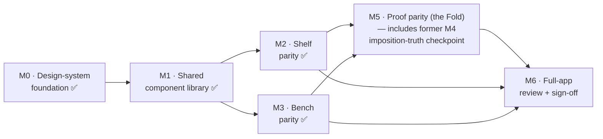

# Compose V1 Parity Plan — implementing the frozen HTML trilogy

> **Status:** planning artifact (2026-07-08). This is an **engineering execution plan**, not a
> product/scope change and not an ADR. It sequences the Compose implementation of the three
> DESIGN-FROZEN V1 surfaces — [Shelf](design/v1/shelf.html), [Bench](design/v1/bench.html),
> [Proof](design/v1/proof.html) — onto the existing, functionally-complete app. Scope authority for
> *what ships* stays with [PRD](PRD.md)/[ROADMAP](ROADMAP.md); technical authority stays with
> [ARCHITECTURE](ARCHITECTURE.md). This plan owns only *the order and shape of the parity work*.
>
> **Prime directive:** the frozen HTML is the specification. Compose **implements** it; it never
> reinterprets it. Any post-freeze UX change updates the HTML spec first, then Compose
> ([CLAUDE.md HTML-first workflow](../CLAUDE.md)).

> **Amendment (2026-07-11) — reconciled against repository reality** ([reviews/2026-07-11-m0-m3-reconciliation.md](reviews/2026-07-11-m0-m3-reconciliation.md), Review Agent **GO**). **M2 (Shelf)** and **M3 (Bench)** are now **DONE** (code) on `feat/m0-design-system`, joining M0 ([ADR-048](DECISIONS.md#adr-048)) and M1 ([ADR-049](DECISIONS.md#adr-049)). The **F1** Proof-sheet correction now has a durable home in [ADR-050](DECISIONS.md#adr-050) — it previously lived only in this artifact, which holds no ADR authority. **M4 is reshaped:** its derive-and-guard core already shipped pre-plan (S7.2 `57ed568` — `ExportScreen.decorativeImpositionRows` + `DecorativeImpositionOrderTest`), and the plan named the wrong artifact (`SvgProofSheetRenderer` emits an SVG string Compose cannot render natively), so **M4 folds into M5** as a one-test engine-truth checkpoint. Milestone bodies below are updated in place where marked; ROADMAP.md now carries the M0–M6 track.

---

## 0. The one fact that reshapes the plan

This is a **re-skin of a working app**, not a green-field migration.

The app is functionally complete through `v0.6.0-alpha.1`, and its **physical print test passed**
(100% scale, correct fold, 1→8 page order/rotation/scale — [ROADMAP version milestones](ROADMAP.md#version-milestones-semver)).
The three frozen surfaces already exist as shipped, tested screens:

| Frozen surface | Existing screen(s) | Redesign distance |
|---|---|---|
| **Shelf** | `HomeScreen` + `HomeViewModel` | Reskin only — layout/state sound |
| **Bench** | `EditorScreen` (+ ~20 sub-composables) + `EditorStore` (MVI) | Reskin of complex but sound structure |
| **Proof** | `PreviewScreen` + `ExportScreen` + `CompletionScreen` (3 screens) | Reskin **and** unify into the 3-act Proof |

Consequences for sequencing (these are the improvements over a naïve "build it up" order):

1. **The imposition engine is done and already physically validated.** `core:imposition`
   (`SingleSheet8Imposer`, `Convention.kt`, `LayoutValidator`, `GoldenProofTest`, [ADR-007](DECISIONS.md#adr-007),
   95+ tests) shipped in S1 and folded correctly in the alpha print test. "Build the imposition
   engine" is **not** a milestone. What remains is a **reconciliation checkpoint** (M4): make the
   Compose Proof *consume* `core:imposition` and prove the HTML's illustrative grid matches it.
2. **Behavior is reskin-invariant.** Nav graph + `@Serializable` routes + the shared-editor-VM seam,
   the MVI store + reducer + ViewModels, the Hilt/KSP graph, the accessibility semantics mirror, and
   the Roborazzi `preview==export` parity harness all survive the reskin untouched.
3. **The design-system layer is entirely net-new.** There is no CompositionLocal token layer, no
   shared component library, `Type.kt` is still Android-template boilerplate, and there are **zero
   haptics**. This is where nearly all the work lives — and why tokens/theme/type/motion/haptics is
   correctly the first milestone.

### ✅ Resolved — the frozen Proof sheet was corrected to the validated engine (2026-07-08)

The Proof's Act-1 "here's your printed sheet" illustration originally encoded a **different**
single-sheet-8 imposition from the **physically-validated shipping engine** — they disagreed in **6 of
8 cells**. The conflict was independently re-derived (a from-scratch fold simulation), and the HTML's
layout was proven **physically wrong**: its front cover (page 1) was back-to-back with page 4, so
opening the cover would land the reader on page 4, not page 2. The engine is correct and authoritative
(`Convention.kt` `TOP_ROW_ROTATED`; RESEARCH R1.2 VERIFIED oracle citing Chandra/NASA + Cambridge +
university guides; [ADR-007](DECISIONS.md#adr-007); alpha physical print test passed). This correction
is recorded as [ADR-050](DECISIONS.md#adr-050) (2026-07-11).

**Resolution taken — spec correction (option B).** `proof.html`'s Act-1 illustrative imposed-sheet
`LAYOUT` was corrected to mirror the engine (`[6,7,0,1,5,4,3,2]` → `[4,3,2,1,5,6,7,0]`), the only
change being the illustration and the developer comments that describe it — no interaction, motion,
typography, spacing, colour, copy, or layout change; DESIGN-FROZEN status retained with a recorded
freeze amendment. Independently reviewed cell-by-cell (all 8 cells + rotations now equal the engine)
→ **GO**.

| row | col0 | col1 | col2 | col3 | source (now identical) |
|---|---|---|---|---|---|
| top (flipped) | 5 | 4 | 3 | 2 | engine `TOP_ROW_ROTATED` **and** corrected `proof.html` |
| bottom | 6 | 7 | 8 | 1 | cover page 1 at (1,3), back cover page 8 at (1,2) |

**Consequence for the plan:** there is **no imposed-sheet parity carve-out**. The Proof's Act-1 sheet
is now a single source of truth with the engine — Compose consumes the engine, and the frozen HTML
illustration already matches it, so the imposed sheet is full pixel parity like every other region.

---

## Phase 1 — Readiness review (independent)

An independent Review Agent validated the three frozen files byte-for-byte against each other and
the design docs. **Verdict: GO.**

Key confirmations (evidence-checked, not summary-trusted):

- **Tokens byte-identical** across all three `:root` / `:root[data-theme="dark"]` blocks
  (`--paper:#F4EFE6`, `--coral:#E76F51`/`--coral-strong:#C64E34`/`--coral-text:#A63C22`,
  `--desk:#E7DECE`, shadows, `--field`, `--menu`). Bench/Proof headers say "inherited verbatim from
  the frozen Shelf" and the bytes confirm it.
- **Typography, motion, haptics, focus, reduced-motion all identical** across surfaces:
  `--shell:"Inter"` / `--voice:"Fraunces"`; `--ease:cubic-bezier(.2,.7,.3,1)`, `--fast:130ms`,
  `--base:230ms`; `HAPTIC={tick:[8],snap:[6,20,10],boundary:[24],success:[12,30,12,30]}`;
  `:focus-visible` 3px `--coral-strong`; blanket `prefers-reduced-motion` override.
- **Nav model coherent** — loss-safe back at every level, Shelf→Bench→Proof, autosave stated.
- **Freeze stamps mutually compatible**; imposition **panel numbering** consistent (0=Front cover …
  7=Back cover in both Bench and Proof). The Proof's imposed **sheet geometry** — originally an open
  item — has since been reconciled to the validated engine (see the [Resolved](#-resolved--the-frozen-proof-sheet-was-corrected-to-the-validated-engine-2026-07-08) note and F1).
- **Accepted, documented sub-AA limitations** (bench teal-as-text 2.9:1; proof dark graphical-text
  3:1 inside `role=img`; snackbar-focus-after-dismiss RI-4) — disclosed in-file, not hidden.

### Findings carried forward (reconciled by the Implementer)

| # | Finding | Class | Reconciliation |
|---|---|---|---|
| **F1** | proof.html originally declared `LAYOUT=[6,7,0,1,5,4,3,2]` a *topological* derivation "NOT physically folded" — **verified physically WRONG** (front cover's leaf-mate was page 4, not page 2), diverging from the validated engine in 6 of 8 cells. | Required (imposition) | **RESOLVED (2026-07-08).** The engine is authoritative (alpha print test). Rather than a permanent parity carve-out, the frozen `proof.html` Act-1 illustrative sheet was **corrected** to the engine layout (`→ [4,3,2,1,5,6,7,0]`) as a reviewed spec correction (option B), DESIGN-FROZEN retained. The imposed sheet is now a single source of truth with the engine — **no carve-out**; Compose consumes the engine and the frozen HTML already matches it. Recorded as [ADR-050](DECISIONS.md#adr-050) (2026-07-11). The remaining engine-truth checkpoint folds into M5 (see the M4 section below). |
| **F2** | All three files load Inter+Fraunces from `fonts.googleapis.com`. That CDN path cannot ship (privacy invariant). Fraunces not yet bundled. | Recommended | **ACCEPT.** Pulled **into M0** as a hard prerequisite — pixel parity is impossible without the bundled display face. Inter is already bundled for export ([ADR-028](DECISIONS.md#adr-028)). |
| **F3** | On-device keyboard/TalkBack pass is non-automatable; pending for all three (bench gesture-verb semantics; proof fold step-nav + climax reveal). | Recommended | **ACCEPT.** Becomes explicit device-pass gates in M2/M3/M5 and the M6 sign-off. |
| **F4** | `DESIGN-LANGUAGE.md §2` + `mockups/tokens.css` still describe the **superseded** identity (old palette `#3A3A3C`/`#E7DFD0`, "marker/handwritten" type). Single-source-of-truth risk. | Recommended | **ACCEPT as a doc task, OUT of this code plan.** Flagged as pre-M0 doc reconciliation (below). Not done here — this plan makes no documentation rewrites. |
| **F5** | Interior panels are "Page 1–6" (Bench) vs "pages 2–7" (Proof comments) — prose only; Proof never renders interior numbers. | Observation | Note only; standardize user-facing language only if Proof ever surfaces interior numbers. |

**Pre-work flagged, not performed here:** reconcile the stale `DESIGN-LANGUAGE.md §2`/`mockups/tokens.css`
palette+type to point at the v1 tokens as canonical (F4), so no future implementer trusts the dead
palette. It is a documentation edit and belongs to a separate change.

---

## Phase 3 — Architecture review (existing Compose)

### Keep as-is (reskin-invariant — do not touch)

| Area | Evidence | Why it survives |
|---|---|---|
| Navigation | `ZinelyNavHost`, `EditorRoute` — single-Activity, `navigation-compose`, type-safe `@Serializable` routes, shared-editor-VM seam via `getBackStackEntry` ([ADR-046](DECISIONS.md#adr-046)) | Graph + back-stack policy are UI-agnostic; the reskin changes pixels, not routes |
| Editor state | `EditorStore` (MVI mailbox), `EditorReducer` (pure), `EditorModel`/`EditorUiState` ([ADR-005](DECISIONS.md#adr-005)) | Reducer/undo/gesture-coalescing are behavioral; visuals sit above |
| MVVM screens | `HomeViewModel`, `ExportViewModel` — `StateFlow` + `Channel` events, `collectAsStateWithLifecycle` | Stateless-hoisted screens already; swap chrome, keep state |
| DI | Hilt + KSP, `SingletonComponent`; `EditorAppModule`, `HomeModule`, data-android modules | Presentation-independent |
| A11y semantics | `ElementSemanticsLayer` (per-element focusable mirror, [ADR-029](DECISIONS.md#adr-029)), `EditorA11y` shared step constants (one intent, three input paths), live regions, ≥48dp discipline | **Crown-jewel asset** — preserve verbatim; new chrome must re-attach these hooks |
| Render parity | `PagePreviewParityTest` hand-rolled Bitmap pixel-equality; Roborazzi + Robolectric NATIVE goldens | `preview==export` guarantee must stay green through the reskin |

### Replace / build net-new (the redesign surface)

| Gap | Current reality | Needed |
|---|---|---|
| **Design-token layer** | Palette = 9 top-level `Color` vals mapped onto **abused** M3 roles (`surface`=paper, `background`=desk, `onSurfaceVariant`=paper-ink); no on-desk family, no coral-strong/coral-text/ink-faint; spacing/motion are inline literals (`12.dp`, `tween(150)`) | A `CompositionLocal` design system: full ~14-token riso palette, spacing scale, motion tokens (`--ease`/`--fast`/`--base`), shape/radius scale, haptic vocabulary. Threaded via `LocalZ*` providers wrapped by `ZinelyTheme` |
| **Typography** | `Type.kt` is template default — `FontFamily.Default`, only `bodyLarge` set | Two bundled voices: **Fraunces** (display/`--voice`) + **Inter** (shell/`--shell`), the full type scale, weight vocabulary |
| **Haptics** | **None exist** | Four-verb haptic API (`tick`/`snap`/`boundary`/`success`) over `HapticFeedback`/`Vibrator`, reduced-motion-gated |
| **Motion** | 2 `AnimatedVisibility` fades + static decorative tilts; `rememberReduceMotion()` lives in a feature file | Shared motion spec (durations/easings/enter-exit/spring), the Proof Fold climax choreography; centralize `rememberReduceMotion()` |
| **Shared components** | **No component library** — buttons/dialogs/snackbar/cards/banners all inline per screen, duplicated (`Surface(shape,color,tonalElevation)` card pattern repeated; two near-identical banner composables) | `Z*` component layer: buttons, sheets, scrim+`inert` modal, snackbar, toast, cards, dialogs, loading/error chrome, **accessible-control wrappers** that carry the semantics pattern |
| **Prototype dock** | HTML has a review-only Act/State/Theme/Width/Motion dock | Becomes a **debug-only** `@Preview`/parity harness — **not shipped UI** |

### Tech-debt / risk notes surfaced

- `EditorScreen` takes the whole `EditorStore` and collects internally (vs pure `(uiState, dispatch)`)
  — mild preview/test friction; the reskin can optionally hoist it but **need not** (out of scope
  unless it blocks parity).
- `addTextAndEdit` is a two-dispatch UI sequence owed a single reducer intent — pre-existing,
  **not** a parity concern; leave for a behavioral change.
- **Least-protected surfaces to redesign:** `PreviewScreen` and `ExportViewModel.export` have **no
  covering tests** — Proof (M5) carries the most test-writing burden, not just reskin.
- Visual goldens (`SelectionChromeGoldenTest`, render goldens) **will need re-recording** after
  chrome changes — expected, budget for it in every UI milestone.

---

## Phase 2 + 4 — Milestone roadmap

Infrastructure before UI; then surfaces in ascending risk (Shelf → Bench → Proof); imposition
reconciliation slotted before Proof but parallelizable because `core:imposition` is a pure,
UI-independent module. No dates ([per the brief](../CLAUDE.md)); complexity is relative.

### M0 — Design-system foundation — ✅ DONE (2026-07-09, [ADR-048](DECISIONS.md#adr-048))
- **Goal:** the frozen `:root` token contract, expressed once in Compose, ready to thread. Palette,
  typography (bundled Fraunces + Inter), motion tokens, haptic vocabulary. No screen changes.
- **Files (as shipped):** the theme package moved `:app` → `:feature:editor` (same FQN
  `com.aritr.zinely.ui.theme`, because `:app` depends on `:feature:editor`, never the reverse);
  `Theme.kt` (token `CompositionLocal`s + `ZinelyTheme` accessors; `dynamicColor` **deleted**),
  `Type.kt` (bundled families); **new** `ZinelyColors.kt`, `ZinelyElevation.kt`, `ZinelyMotion.kt`,
  `ZinelyHaptics.kt`, `ZinelyDimens.kt`, `ReduceMotion.kt`; `Color.kt` **deleted**; fonts under
  `feature/editor/src/main/res/font/` + OFL licences in `assets/fonts/`; `VIBRATE` in the manifest.
- **Dependencies:** none (leaf infra). **F2 font bundling landed here.**
- **Review criteria:** every token value equals the frozen `:root` bytes (light + dark); dynamic
  color stays OFF; Fraunces/Inter load from bundled assets with **zero network**; reduced-motion
  primitive centralized; no M3-role abuse leaks into the public token API.
- **DoD:** ✅ `ZinelyTokensTest` — 15 green, every colour/shadow/duration/easing/haptic/dimension
  pinned to the frozen literals; full `:app` + `:feature:editor` suites green; `assembleDebug`
  packages all five faces with no `INTERNET` permission and no HTTP client. No `@Preview` swatch
  screen (nothing to swatch until M1 has components).
- **Deviations from the plan (recorded in ADR-048):** **no spacing scale, no radius/shape scale** —
  the frozen CSS defines neither, so shipping one would create a second source of truth beside the
  HTML. Components carry their own frozen values from M1. Elevation ships as *data*; the
  multi-layer-shadow `Modifier` lands with its first caller in M1.
- **Carried into M1/M2:** the pre-reskin M3 `colorScheme`/`Typography` are preserved byte-for-byte
  (un-migrated screens still read them); the role abuse unwinds per-screen. Fraunces is the static
  **9 pt** cut — `opsz` needs API 26, minSdk is 24 — and M2's pixel-parity gate is the check on it.
- **Complexity:** Medium.

### M1 — Shared component library — ✅ DONE (2026-07-10, [ADR-049](DECISIONS.md#adr-049))
- **Goal:** the reusable `Z*` chrome the HTML shares across surfaces (≥2 consumers), each carrying
  a11y by construction.
- **Files (as shipped):** **new** `ui/components/` — `ZinelyShadow.kt` (the M0-deferred multi-layer
  shadow `Modifier`, with the CSS-blur→BlurMaskFilter sigma conversion), `ZFocusRing.kt`,
  `ZAccessibleControl.kt`, `ZButton.kt` (`ZPrimaryButton` + `ZPrimaryButtonMetrics.{Shelf,Bench,Proof}`
  test-pinned presets, `ZStampButton`, `ZIconButton`, `ZToolButton` + five presets), `ZSheet.kt`
  (custom Dialog-hosted scrim+sheet; **no drag-to-dismiss** — the frozen grip is decorative;
  Material3 `ModalBottomSheet` rejected in ADR-049), `ZMenuItem.kt` (+ `ZSelectedStyle` — shelf and
  proof select **oppositely**, a spec-driven param), `ZSnackbar.kt` (component-owned flat 5s timer,
  focus-to-action), `ZToast.kt` (2.2s), `ZStatusPane.kt`, `ZSweep.kt` (reduced motion = the spec's
  static `.4` wash), `ZPaperSurface.kt`, `ZTextField.kt`.
- **Dependencies:** M0.
- **DoD:** ✅ `ZComponentsTest` (14) — preset pins, timers via `mainClock`, roles/selection/48dp/
  disabled/dismissal; `ZComponentGoldenTest` (2) — light+dark galleries with behavioural pixel
  asserts (golden PNGs record on the pinned CI image post-push, per the module convention). Full
  `:feature:editor` suite 164/0; `assembleDebug` green.
- **Deviations from the plan (recorded in ADR-049):** **no `ZDialog`** — the frozen trilogy contains
  zero dialogs; sheets are the only modal idiom, and HomeScreen's two inline `AlertDialog`s migrate
  to `ZSheet` in M2. **No `ZCard`** — the recurring surface is the physical `ZPaperSurface`.
  **No prototype dock** — spec marks it review scaffolding; Roborazzi drives theme/size directly.
  **Hover states skipped** (spec's own `@media (hover:none)` precedent; press transforms shipped).
- **Carried into M2:** loading/error migration happens per-screen (`zinelySweep` + `ZStatusPane`
  replace the inline spinner/error `Column`s as each screen reskins); HomeScreen's no-action
  snackbar `Message` events route to `ZToast` (frozen vocabulary); riso art field lands with M2 and
  is extracted at M3 as a golden-preserving move.
- **Complexity:** Medium.

### M2 — Shelf parity — ✅ DONE (code) (2026-07-10, `feat/m0-design-system`, ~8 feature commits …`d21a7d6`)
- Pure reskin of `HomeScreen` to the frozen Shelf; `HomeViewModel` untouched (behaviour invariant). No ADR — no architecture decision. **Open loose end:** the 10 `shelf_*.png` goldens are **untracked and misplaced** in `feature/editor/src/test/roborazzi/` (editor module, not home) and the matrix is incomplete — pixel-parity is not locked on the branch (reconciliation §8.3). HomeScreen's two inline `AlertDialog`s migrated to `ZSheet` here (per [ADR-049](DECISIONS.md#adr-049) §3).
- **Goal (original):** `HomeScreen` matches `shelf.html` pixel/motion/interaction/a11y.
- **Files:** `feature/editor/HomeScreen.kt` (+ its inline dialogs migrate to M1 `ZDialog`);
  `HomeViewModel` untouched (behavior invariant).
- **Dependencies:** M0, M1.
- **Review criteria:** parity gate (below) passes vs frozen Shelf; empty-shelf invitation, paper
  chooser, tilted cards, thumbnails, undoable delete snackbar all match; `HomeViewModel` state
  contract unchanged.
- **DoD:** parity goldens seeded from the Shelf HTML; existing Home tests green (tags preserved);
  device TalkBack/keyboard pass (F3); DESIGN-RULES 12-point checklist ✅.
- **Risks:** lowest — Home is well-tested and structurally sound. **This is the reference
  implementation that proves the parity harness for M3/M5.**
- **Complexity:** Low–Medium.

### M3 — Bench parity — ✅ DONE (code) (2026-07-10, `feat/m0-design-system`, batches B1–B4 `77bb9b5`…`f1edf45` = HEAD)
- Executed as four explicit batches (selection chrome → stage/artifact → editor chrome → overlays), reading the frozen desk tokens; `EditorStore`/reducer untouched. No ADR — pure reskin. Goldens re-record on the pinned CI image post-push. This B1–B4 split is the template recommended for M5.
- **Goal (original):** `EditorScreen` + sub-composables match `bench.html`, preserving MVI, gestures, and the
  a11y mirror.
- **Files:** `feature/editor/EditorScreen.kt` and the ~20 sub-composables (`EditorContextBar`,
  `EditorSupplyTray`, `EditorPageStrip`, `EditorPagePreview`, `SelectionChrome`, `ResizeHandles`,
  `EditorEmptyState`, saved/failure banners, `DeskText`, …); `EditorStore`/reducer untouched.
- **Dependencies:** M0, M1.
- **Review criteria:** parity gate vs frozen Bench; `ElementSemanticsLayer` + `EditorA11y`
  one-intent-three-paths preserved verbatim; gesture/undo behavior unchanged; the four haptic verbs
  wired to gesture commit/selection/snap/boundary.
- **DoD:** parity goldens; **re-recorded** `SelectionChromeGoldenTest` + editor goldens; all editor
  Compose tests green; device gesture-verb TalkBack pass (F3); 12-point checklist ✅.
- **Risks:** highest-surface-area reskin; re-attaching a11y semantics to every replaced chrome
  element; not regressing gesture/graphicsLayer performance; teal-as-text accepted-limitation stays
  documented.
- **Complexity:** High.

### M4 — Imposition-truth checkpoint — ⤳ FOLDED INTO M5 (reshaped 2026-07-11, [reconciliation](reviews/2026-07-11-m0-m3-reconciliation.md))
M4 is **no longer a standalone milestone**. Two facts from the reconciliation collapsed it:

1. **The derive-and-guard core already exists — and predates this plan.** S7.2 (`57ed568`, 2026-07-04)
   removed a hardcoded Compose layout array (it had drifted to `5·4·3·6 / 8·1·2·7`) and replaced it
   with derivation from the convention: `ExportScreen.decorativeImpositionRows(SingleSheet8.TOP_ROW_ROTATED)`
   inverts `spec.cellOf` with **no literal array**, guarded by `DecorativeImpositionOrderTest`. The
   anti-drift discipline M4 was going to introduce is already in place.
2. **The plan named the wrong artifact.** `SvgProofSheetRenderer` emits an **SVG string**, which
   Compose/Android cannot render natively — it is the L2 golden/proof artifact only. The Proof Act-1
   sheet is a **decorative thumbnail** (like the shipped `ExportScreen` `DecorativeImpositionSheet`,
   "Not a live render"), not a live imposition render. And the frozen `proof.html` grid was corrected
   to the engine ([ADR-050](DECISIONS.md#adr-050)), so there is **no spec conflict left to reconcile**.

- **What remains (executed inside M5):** relocate the convention-derived decorative Act-1 sheet into
  the unified Proof, assert its order/rotation derive from `SingleSheet8.TOP_ROW_ROTATED` (extend the
  existing drift guard), and keep **no raw imposition-layout literal anywhere in Compose**. Because the
  Act-1 sheet only exists *inside* the unified Proof, this is an M5 sub-step, not a parallel track.
- **Do NOT:** wire `SvgProofSheetRenderer` into Compose; stand up a live proof renderer for Act-1;
  port a layout array instead of deriving from the engine.
- **Complexity:** trivial (one relocation + one golden), folded into M5.

### M5 — Proof parity (the Fold)

> **🚧 In progress — batched.** M5 is decomposed into B1→B5 in [spikes/m5-proof-batching.md](spikes/m5-proof-batching.md).
> Unlike M2/M3 it is **not a pure reskin**: the frozen Proof is one 3-act surface where the app ships
> three routes, so two structural calls are recorded in **[ADR-051](DECISIONS.md#adr-051)** — **(A)**
> collapse `PreviewRoute`/`ExportRoute`/`CompletionRoute` into one `ProofRoute`/`ProofScreen`, and **(B)**
> retire the reading-order reader-booklet (`PreviewScreen`), superseded by the imposed-sheet-first Proof.
> **B1 (scaffold + route collapse + ADR-051) landed 2026-07-11** — the 3-act frame (top bar · 3 progress
> creases · one action bar · act state machine · act-status live region) over empty act bodies.
> **B2 (Act 1 — The Sheet) landed 2026-07-11** — the imposed landscape sheet (engine-ordered 8 cells with
> the top row flipped, three vertical + one horizontal crease, the one coral cut + "one cut" label, the
> calm dead-band, the honesty legend, and the front/back cover cards); `decorativeImpositionRows`
> relocated from `ExportScreen` into the Proof and its drift guard extended with the frozen-grid ↔ engine
> equivalence — **no raw imposition array in Compose** (folded-in M4 checkpoint). B3 (Act 2 print recipe +
> export wiring) · B4 (Act 3 fold + climax) · B5 (overlays + retire the old screens + parity seal) remain.

- **Goal:** unify `PreviewScreen` + `ExportScreen` + `CompletionScreen` into the frozen 3-act Proof
  (Sheet → Print → Fold), with the Fold climax getting the whole delight budget.
- **Files:** `feature/editor/PreviewScreen.kt`, `ExportScreen.kt`, `CompletionScreen.kt` (reconciled
  into the 3-act flow); derives the Act-1 sheet from the engine (the folded-in M4 checkpoint);
  `ExportViewModel` behavior invariant.
- **Dependencies:** M0, M1 (and M2/M3 patterns). The former M4 checkpoint is now an M5 sub-step.
- **Review criteria:** parity gate vs frozen Proof — the honest print recipe (100%/Actual-size,
  Landscape, paper-match, single-sided), dead-band honesty, the 5-step fold guide, and the staged
  climax reveal (settle → shelf-line callback → words → actions) with the `success` haptic; print
  honesty never overstates what the printer can do. The Act-1 imposed sheet follows the engine (M4)
  **and** matches the corrected frozen HTML — full pixel parity, no exception.
- **DoD:** parity goldens; **new** tests for the previously-untested `PreviewScreen` and
  `ExportViewModel.export`; reduced-motion path degrades to the correct static finished state;
  device pass (F3); the mandated Physical-Workflow re-review + Design-Director emotional review both
  GO; 12-point checklist ✅.
- **Risks:** highest delight/risk surface; unifying three screens into one flow without regressing
  the shipped export/share behavior or the auto-land-on-completion nav ([ADR-041](DECISIONS.md#adr-041));
  climax choreography under reduced-motion.
- **Complexity:** High.

### M6 — Full-application review + parity sign-off
- **Goal:** whole-trilogy coherence and the non-automatable gates.
- **Scope:** cross-surface motion/theme/haptic consistency; dark-theme + tablet + landscape +
  reduced-motion passes on all three; re-record and verify all goldens; on-device TalkBack/keyboard
  sweep (F3); confirm zero network / bundled fonts (F2); confirm accepted limitations still
  documented (teal-as-text, dark graphical-text, RI-4 snackbar focus).
- **Dependencies:** M2, M3, M5.
- **Review criteria:** the trilogy reads as one product; every DESIGN-RULES checklist green; parity
  goldens green in CI.
- **DoD:** adversarial full-app Review Agent GO; no open Required fixes; parity harness green.
- **Complexity:** Medium.

---

## Phase 5 — Compose parity strategy

Parity is *verified*, not asserted. Each surface passes the same gate before it is considered frozen
in Compose.

| Parity dimension | How it is validated |
|---|---|
| **Pixel** | Roborazzi goldens (Robolectric NATIVE, real Skia) **seeded from the frozen HTML** — capture the HTML surface at reference widths, diff the Compose render against it; differences become classified review findings, fixed or explicitly accepted (never silently ignored). Reuse the existing hand-rolled Bitmap-diff pattern (`PagePreviewParityTest`) where `captureToImage()` is unavailable headless. The Proof Act-1 imposed sheet is additionally guarded by the M4 engine-truth golden; since the corrected frozen HTML now matches the engine, that region has **no parity carve-out**. |
| **Motion** | Compare against the frozen `--ease`/`--fast`/`--base` tokens (M0); assert durations/easings come from the token layer, not literals; verify the Proof climax beat sequence. |
| **Interaction** | Compose UI tests exercising the same flows the HTML defines (open/back loss-safety, sheet/scrim/modal, snackbar Undo, paper chooser, fold step-nav); stable test tags preserved. |
| **Accessibility** | Automated: semantics assertions (labels, `Role.Button`, live regions, ≥48dp) in Compose tests; the `ElementSemanticsLayer` mirror preserved. Manual: on-device TalkBack + keyboard pass per surface (F3) — the non-automatable gate. |
| **Theme** | Light + dark goldens per surface; token values proven equal to both frozen `:root` blocks; accepted sub-AA limitations stay documented. |
| **Tablet / landscape** | Golden + interaction runs at phone / tablet / landscape widths matching the HTML prototype dock's Width control. |
| **Reduced-motion** | Prove the static state is already correct (the existing invariant: "motion is decoration on an already-correct static state"); both animated and reduced paths tested, gated by the centralized `rememberReduceMotion()`. |

**Freeze-in-Compose gate per surface:** pixel + motion + interaction + a11y + theme + tablet +
reduced-motion parity all green, the [DESIGN-RULES 12-point checklist](design/DESIGN-RULES.md) all ✅,
the device a11y pass done, and an independent Review Agent GO. Proof additionally re-runs the
Physical-Workflow and Design-Director reviews.

---

## Phase 6 — First milestone recommendation

**Start with M0 — the design-system foundation.** Nothing else may begin until it lands.

Why M0 first:

1. **Everything references it.** Every surface, every shared component, every golden is defined *in
   terms of* the tokens. Parity is literally undefined until the palette, the two type voices, the
   motion tokens, and the haptic vocabulary exist in Compose.
2. **It is the highest-leverage error site.** The Review Agent confirmed the frozen `:root` block is
   byte-identical across all three surfaces — a single source of truth. Encode it wrong once and
   every downstream surface inherits the divergence. Encode it right once and three surfaces inherit
   correctness.
3. **It clears a hard privacy gate.** Fraunces must be **bundled** (F2) — the CDN path in the HTML
   cannot ship. Pixel parity is impossible until the display face renders from a bundled asset with
   zero network. That gate belongs at the very front.
4. **It is pure infra — cheap to review in isolation.** No screen changes, so it is unit- and
   snapshot-testable against the frozen spec and reviewable without any UI churn, before a single
   pixel of surface work risks rework.

Why everything else waits: M1 components are *styled with* M0 tokens; M2/M3/M5 surfaces are *built
from* M1 components; M4 renders *through* M0 styling. Building any surface before the tokens exist
means restyling it twice.

**Immediately after M0:** M1 (shared components), then **M2 (Shelf) as the reference reskin** — it
is the lowest-risk, best-tested surface, so it proves the parity harness and the DS end-to-end before
the high-risk Bench (M3) and Proof (M5) consume them. M4 (imposition reconciliation) can run in
parallel on the pure-core track at any point after M0.

---

## Constraints honored by this plan

No Compose implementation begun · no ADR written · no HTML changed · no existing documentation
rewritten · no product redesign · no feature added. This is planning and readiness only. The F4 doc
reconciliation and all code milestones are **proposed**, to be executed as separate reviewed changes.

> **Amended 2026-07-11:** the paragraph above describes this plan *as originally authored* (2026-07-08).
> M0–M3 have since been implemented and this plan reconciled with repository reality — see the
> amendment banner at the top, [ADR-050](DECISIONS.md#adr-050) (the F1 correction's ADR home), and the
> M0–M6 track now recorded in [ROADMAP.md](ROADMAP.md). The F4 `DESIGN-LANGUAGE.md §2` / `mockups/tokens.css`
> stale-palette reconciliation **remains open** as a separate doc task.
