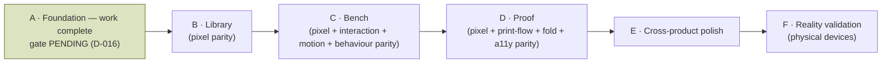

# Compose V2 Implementation Roadmap

> **Scope:** the phased plan for implementing the frozen V2 design in Jetpack Compose. This is the *execution*
> breakdown; the product-level phasing authority remains [ROADMAP.md](ROADMAP.md), and this document is its V2-UI
> child (cross-link, don't duplicate). Governed by [V2-CONSTITUTION.md](design/V2-CONSTITUTION.md) and
> [COMPOSE-IMPLEMENTATION-GUIDE.md](COMPOSE-IMPLEMENTATION-GUIDE.md).
>
> **The rule that spans every phase:** no redesign, no interpretation, no feature creep. Reproduce the frozen HTML.
> If the HTML is wrong, fix the HTML first (owner gate). Every phase ends with parity screenshots and a review gate.

---

## Ground truth this roadmap builds on

- **Three frozen surfaces:** [Library](design/mockups/v2-library.html) · [Bench](design/mockups/v2-bench.html) ·
  [Proof](design/mockups/v2-proof.html). Plus the frozen identity system ([V2-IDENTITY.md](design/V2-IDENTITY.md),
  [Bench H4 10-ink set](design/V2-IDENTITY.md), [V2-TOKENS.md](design/V2-TOKENS.md)).
- **The Bench and Proof are not greenfield.** A real editor engine already exists and **must be preserved**:
  `CanvasReplayer` (one draw path, [ADR-028](DECISIONS.md#adr-028)), `ElementSemanticsLayer` (canvas a11y),
  command-undo + `AutosaveCoordinator`, direct-manipulation resize handles, and the deliberate anti-desync
  defence. V2 is a **re-skin + interaction upgrade** of these, not a rewrite.
- **Foundation is fused with V1 conformance.** The token/spacing/motion migration is done **once**, jointly with
  the V1 conformance programme's token work (C3/C6/C7) — *not* as a second parallel migration. See
  [ROADMAP.md](ROADMAP.md) and the conformance track.
- **Staged build.** Proof ships single-sheet-8 first; booklet / saddle-stitch / duplex is a later stage on the
  same frozen room (the maker never picks a format).

---

## Phase map

> **Status (2026-07-29): Phase A's *work* is complete; its *gate* is pending an owner ruling.** All nine
> implementation packages landed and were independently reviewed. But Phase A's gate requires *"no
> parallel/duplicate design system"*, and the record below marks that criterion **❌ not met** — because it,
> and *"everything routes through tokens"*, cannot be met by a phase forbidden to touch product surface.
> That conflict is [**D-016**](design/V2-SPEC-DEFECTS.md#d-016--two-of-phase-as-acceptance-criteria-cannot-be-met-by-a-phase-forbidden-to-touch-product-surface),
> and [ADR-080](DECISIONS.md#adr-080) is `Proposed` until it is ruled on.
>
> The record of what was actually built — deliverable by deliverable, criterion by criterion — is
> [below](#phase-a-completion-record-2026-07-29). **Phase B has not started, and should not until D-016 is
> ruled on**, because the ruling decides what Phase A's gate means and therefore whether it has passed.

Each phase has an **Objective**, **Deliverables**, **Acceptance criteria**, and a **Review gate**. A phase is not
started until the previous phase's gate has passed.

---

## Phase A — Foundation

**Objective.** Build the material substrate every screen stands on, and *nothing product-facing*. When Phase A
ends there are no zines, no shelves, no editor — only a faithful, tested design system.

**Deliverables.**
- **Theme + tokens** — every value in [V2-TOKENS.md](design/V2-TOKENS.md) as Compose tokens (light + warm-charcoal
  dark, re-derived not inverted; dynamic colour off). Chrome palette only; maker inks modelled in a separate
  `content.*` namespace.
- **Typography** — Fraunces (voice) + Inter (work) type scale; no third UI face.
- **Spacing / elevation** — the 8pt rhythm and the calm elevation model as reusable primitives.
- **Motion** — the shared motion primitives (paper-settle, the calm durations/easings), all reduced-motion aware.
- **Icons + resources** — the icon set and drawable/resource pipeline.
- **CompositionLocals** — theme, tokens, motion, and haptics surfaced via locals so screens don't reach around them.
- **Paper system** — the material paper surface (grain/fleck as *material*, not decorative overlay) as a reusable
  building block for covers and pages.
- **Accessibility infrastructure** — the canvas virtual a11y node-tree scaffolding, named-custom-action plumbing,
  the CI AA-contrast gate, and the device a11y-dump recipe wired into the workflow.

**Acceptance criteria.**
- Token values are **byte-exact** to V2-TOKENS.md in both themes; AA ★ pairings pass the CI contrast gate.
- A tokens/typography/motion **catalog screen** (internal only) renders and is screenshot-tested (Roborazzi).
- No product screen exists yet. No hard-coded colours, sizes, or fonts anywhere — everything routes through tokens.
- Foundation is confirmed to be the **same** migration as the conformance token work (no duplicate system).

**Review gate.** Independent review confirms: exact token fidelity, no parallel/duplicate design system, a11y
infra present, zero product surface. **GO** required before Phase B.

---

## Phase A completion record (2026-07-29) {#phase-a-completion-record-2026-07-29}

> **Why this section exists.** The plan above is what Phase A *set out* to do. This is what it did. They are
> not the same, and the differences are decisions — recorded here so a new engineer inherits the outcome
> rather than reconstructing it from nine ADRs and a commit log. Where a deliverable was met differently
> than planned, the reason is an owner ruling or a defect entry, and it is linked.

Phase A ran as nine packages, **A1–A9**, each additive, each independently reviewed, each ending at an owner
gate. Every package is an ADR: [ADR-071](DECISIONS.md#adr-071) · [ADR-072](DECISIONS.md#adr-072) ·
[ADR-073](DECISIONS.md#adr-073) · [ADR-074](DECISIONS.md#adr-074) · [ADR-075](DECISIONS.md#adr-075) ·
[ADR-076](DECISIONS.md#adr-076) · [ADR-077](DECISIONS.md#adr-077) · [ADR-078](DECISIONS.md#adr-078) ·
[ADR-079](DECISIONS.md#adr-079). Phase A's closure and the interpretation that made it possible are
[ADR-080](DECISIONS.md#adr-080).

### Deliverables

| Planned | Delivered | Notes |
|---|---|---|
| **Theme + tokens** — every V2-TOKENS.md value, both themes, dynamic colour off; chrome only, maker inks in `content.*` | ✅ as planned | `ZinelyV2Colors` ([ADR-071](DECISIONS.md#adr-071)) + `ZinelyContentInks` ([ADR-072](DECISIONS.md#adr-072)). Dark re-derived, not inverted. |
| **Typography** — "Fraunces + Inter **type scale**" | ⚠️ **delivered as a two-family *foundation*, not a scale** | The frozen trilogy does not contain a type scale to transcribe. Publishing one would have been design work. [ADR-073](DECISIONS.md#adr-073). |
| **Spacing / elevation** — "the 8pt rhythm and the calm elevation model as reusable primitives" | ⚠️ **elevation yes; no spacing scale at all** | The frozen CSS is 16.7% on-grid. **D-007** owner ruling: §III is an aspiration, not a token inventory — nothing is published; spacing stays per-component as frozen. [ADR-074](DECISIONS.md#adr-074). |
| **Motion** — "paper-settle, the calm durations/easings", reduced-motion aware | ⚠️ **two easings + a reduced-motion policy; no duration tokens** | The design declares no durations. The policy separates one-shot motion (collapses to 0) from continuous motion (does not run) — an infinite animation at 0ms strobes. [ADR-075](DECISIONS.md#adr-075), **D-012** deferred to Phase C. |
| **Icons + resources** | ✅ as planned | 36 marks as geometry without a stroke, built into an `ImageVector` per call site, because the design makes stroke weight a property of the *container*. [ADR-077](DECISIONS.md#adr-077). |
| **CompositionLocals** — theme, tokens, motion, haptics | ✅ as planned | Nine locals in `Theme.kt`. **Haptics is V1's `ZinelyHaptics`, shared rather than duplicated** — the correct outcome under "no duplicate system". |
| **Paper system** — grain/fleck as *material* | ✅ as planned | Pre-baked 140×140 tile from the SVG 1.1 normative `feTurbulence` (`RuntimeShader` is API 33 against `minSdk` 24), drawn at `soft-light`. [ADR-076](DECISIONS.md#adr-076); **D-013**, **D-014** resolved. |
| **Accessibility infrastructure** | ✅ as planned, and the survey changed what was owed | Of the four named items, the CI AA-contrast gate was **already complete**, the canvas node tree **already existed** (in `:feature:editor`), the platform-tree harness existed but was **unreachable** from `:core:ui`, and the device a11y-dump recipe **pointed at a document that did not exist**. [ADR-078](DECISIONS.md#adr-078) built the two that were genuinely missing and wrote [DEVICE-VERIFICATION.md](DEVICE-VERIFICATION.md). |

### Acceptance criteria

| Criterion | Verdict |
|---|---|
| Token values **byte-exact** to V2-TOKENS.md in both themes; AA ★ pairings pass the CI contrast gate | ✅ **Met, and now gated against the document itself.** `ZinelyV2CatalogParityTest` parses V2-TOKENS.md at run time and asserts rendered pixels equal the stated hex exactly, both themes ([ADR-079](DECISIONS.md#adr-079)). `ZinelyV2ContrastTest` gates all six ★ pairings. |
| A tokens/typography/**motion** catalog screen (internal only) renders and is screenshot-tested | ⚠️ **Met for tokens, typography, icons and material; motion is not in the catalog.** Motion is not screenshottable — a still frame of an easing curve proves nothing. It is gated behaviourally by `ZinelyV2MotionTest` instead. The catalog lives in `core/ui/src/debug`, so it is absent from a release AAR entirely (verified: 0 of 87 `classes.jar` entries). |
| **No product screen exists yet** | ✅ **Met.** No route, no navigation, no product surface. |
| **No hard-coded colours, sizes, or fonts anywhere — everything routes through tokens** | ❌ **Not met, and not meetable in Phase A.** The gate exists (`TokenDisciplineTest`, CI-27) but [`config/token-enrolment.txt`](../config/token-enrolment.txt) enrols **zero packages**. Note the honest limit of that excuse: enrolling *most* packages means editing V1 product code, but `com.aritr.zinely.ui.a11y` was created by Phase A and carries none of the four banned literal forms — it could have been enrolled without touching V1 at all, and was not. See the conflict below. |
| Foundation is confirmed to be the **same** migration as the conformance token work (no duplicate system) | ❌ **Not met, and not meetable in Phase A.** `ZinelyColors`/`ZinelyV2Colors`, `ZinelyDimens`/`ZinelyV2Dimens` and `ZinelyTypography`/`ZinelyV2Typography` coexist today. See the conflict below. |

### The conflict this phase could not resolve, and did not resolve on its own authority

Two of the four acceptance criteria above require **editing V1 product components** — that is what "no
duplicate system" and "everything routes through tokens" mean in practice. Phase A's first criterion, its
Objective (*"nothing product-facing"*) and its review gate (*"zero product surface"*) all forbid exactly
that. **The criteria are mutually unsatisfiable within Phase A.**

The strategy actually operated for nine consecutive packages, under a standing owner instruction —
*additive only · preserve V1* — but was never written down: **V2 lands beside V1 in Phase A, and the two
systems converge surface by surface in Phases B, C and D, as each V1 screen is re-skinned and its package
is enrolled in `token-enrolment.txt` in the same commit that migrates it.**

Whether that means the two criteria **re-seat to Phase D's exit** is an owner call, not this session's:
[COMPOSE-IMPLEMENTATION-RULES.md](COMPOSE-IMPLEMENTATION-RULES.md) says to stop and raise it, and
[V2-CONSTITUTION.md §VI](design/V2-CONSTITUTION.md) reserves amendment to the owner *"never implicitly
through implementation"*. So the conflict is logged as
[**D-016**](design/V2-SPEC-DEFECTS.md#d-016--two-of-phase-as-acceptance-criteria-cannot-be-met-by-a-phase-forbidden-to-touch-product-surface)
with **two readings put forward and neither chosen** — the second being that criterion 5's *"confirmed to
be"* asks for a recorded confirmation rather than completed convergence, in which case only criterion 4
re-seats. [ADR-080](DECISIONS.md#adr-080) proposes; it does not decide. **Nothing has been written into
Phase D's acceptance criteria**, because a proposal must not acquire the force of a gate by being filed
under one.

Until then the duplication is real and should be read as *scheduled*, not accidental. Two guards exist so
it cannot quietly become permanent: `ZinelyV2CanvasNodeMinSide` was collapsed into an alias of
`ZinelyV2Dimens.MinTouchTarget` the moment a second independent `48.dp` appeared inside a single module
([ADR-079](DECISIONS.md#adr-079)), and no V1 `src/main` file was modified in any of A1–A9.

### Defect register at the close of Phase A

Sixteen defects were raised against the frozen corpus during Phase A: **seven resolved by owner ruling, nine
open**, of which three are open *by ruling* (approach settled, verification owed to a later phase) and three
await an owner. None blocks Phase B's implementation; **D-016 gates the Phase A → B transition.**

The per-defect table — status, owing phase, and a link to each entry — is
[**V2-SPEC-DEFECTS.md § Register at a glance**](design/V2-SPEC-DEFECTS.md#register-at-a-glance-verified-2026-07-29-at-the-close-of-phase-a),
which owns it. It is not reproduced here: this document owns *phasing*, the register owns *defects*, and a
second copy is how the two start disagreeing.

### What a new engineer should know that is not obvious from the code

- **The frozen corpus is the oracle, not the implementation.** A verification artifact must be *derived*
  from the design documents, never become a second source of design truth. This is the principle A9
  established and it governs every debug or verification artifact added from here on.
- **The platform `AccessibilityNodeInfo` tree is the source of truth, not Compose's merged semantics tree.**
  A control keeps its role and name on the platform only when it collapses to **one** node; any child
  contributing semantics splits it ([ADR-078](DECISIONS.md#adr-078)). Compose-level a11y tests cannot see
  this defect class at all.
- **Three packages in a row shipped an assertion blind to the defect class it claimed to gate** (A6, A7,
  A8 — and A9 made it four on first submission). Every one was caught by independent review, none by the
  suite. Assume the same failure is present in your own work until you have mutated the code and watched
  the test go red.
- **`grun`/Gradle reports `UP-TO-DATE` for inputs it does not know about.** `V2-TOKENS.md` is now a declared
  input of `:core:ui:testDebugUnitTest`; `config/token-enrolment.txt` is *not* a declared input of
  `:feature:editor`'s. Force with `--rerun-tasks` when a non-source file is what changed.

---

## Phase B — Library

**Objective.** Reproduce the frozen [Library](design/mockups/v2-library.html) exactly. **Pixel parity only — no
redesign, no interpretation.** This is the closest surface to a clean re-skin and sets the parity bar for the rest.

**Deliverables.**
- The covers-only shelf; the quiet **"Your shelf"** header (no wordmark/count); the **Maker's Cover** recipe
  (title + ink + stamp, recipe-driven — **no per-edit render**, [ADR-069](DECISIONS.md#adr-069)); riso-grain
  material covers with grounded shadow, fold spine, fore-edge; **metadata hidden until interaction** (shown in the
  action-sheet header); long-press context menu **plus a visible `⋯` fallback**; the action sheet (Open ·
  Share & export · Rename · Duplicate · separated Delete); the transformation empty state; the **"Make a zine"** CTA.

**Acceptance criteria.**
- **Side-by-side parity** against the frozen HTML: layout, spacing (8pt), type, colour (both themes), every state
  (rest/pressed/selected/empty), and the shelf's cover rendering.
- Every P3 impl-gate met: AA contrast per ink, cover-title truncation, the screen-reader path, 8pt rhythm.
- Covers are **recipes**, verified: no raster-per-zine pipeline reintroduced.
- **Both device passes** accepted.

**Review gate.** Parity screenshots (light + dark) attached; deviations logged and resolved; **GO** before Phase C.

---

## Phase C — Bench (editor)

**Objective.** Bring the running editor to the frozen [Bench](design/mockups/v2-bench.html). This is **pixel +
interaction + animation + editing-behaviour parity** on top of the **existing** engine, which is preserved, not
rebuilt. **No feature additions.**

**Deliverables.**
- Re-skin the editor to the frozen Bench: the studio surface, the morphing 1→32 page navigation as *little paper
  sheets* (persistence-of-place), the single **Art drawer** (H3), the maker riso-ink palette in `content.*` (H4),
  the holding tray, the human copy.
- **In-place text editing with a rigid whole-page pan** on `WindowInsets.ime` — caret in the real text, the page
  moves as one rigid body and returns **pixel-identical** to rest. *Conditioned on the device Pass-2 pixel-identical
  proof; fall back to hardening the bottom-sheet editor if either proof fails.* (Owner-ruled; see
  [V2-BENCH-IA-INTERACTION.md](design/V2-BENCH-IA-INTERACTION.md), [V2-BENCH-REVIEW.md](design/V2-BENCH-REVIEW.md) §E.)
- Preserved invariants wired through the new skin: **one engine** preview == export (`CanvasReplayer`), deep
  **canvas a11y** (`ElementSemanticsLayer` — per-element focusable node, custom action per gesture, traversal
  order, live regions), command-undo + debounced `AutosaveCoordinator` + the "Saved ✨" chip, direct-manipulation
  resize handles (48dp), and the anti-desync viewport defence.

**Acceptance criteria.**
- Pixel parity to the frozen Bench (both themes, all element/selection/editing states).
- **Interaction & animation parity** — direct manipulation, page-sheet navigation, and motion match the spec.
- **Editing-behaviour parity** — the page never drifts/reflows/resizes while editing; text lands where the caret
  is; the page settles back pixel-identical (verified on device, not only Robolectric).
- **Boundaries honoured:** the finished-book reveal stays with **Read**, not the Bench ([ADR-058](DECISIONS.md#adr-058));
  no per-edit render ([ADR-069](DECISIONS.md#adr-069)); MVI preserved ([ADR-005](DECISIONS.md#adr-005)).
- Canvas a11y verified against the **platform** tree; both device passes accepted.

**Review gate.** Parity + interaction + a11y evidence attached; the text-edit proof (or the documented fallback)
recorded; **GO** before Phase D.

---

## Phase D — Proof

**Objective.** Bring the Proof surface to the frozen [Proof](design/mockups/v2-proof.html): **pixel parity +
printing-flow parity + fold-guide parity + accessibility parity**, for the shipped **single-sheet-8** stage.

**Deliverables.**
- The one-room Proof, **READ-first** (opens on the chrome-free finished zine, [ADR-058](DECISIONS.md#adr-058));
  the reassurance framing ("your pages, arranged for the fold") with any sheet shown as a **filled true render**,
  never blank panels; the fold guide (fold-by-pull, one fold per screen, one camera angle, arrow + crease, cut
  stop-point + cover marked, opt-in animation with a persistent static end-state); the single weighted commit
  (**Save PDF** primary, **Share** peer), reversible-until-button; the felt privacy line.
- **Print honesty:** no fake in-app "Print"; home-print = **Save PDF + Share** ([ADR-052](DECISIONS.md#adr-052));
  **100% actual size**; export == preview == read via the one engine.

**Acceptance criteria.**
- Pixel parity to the frozen Proof (both themes, all states).
- **Print-flow parity:** the Save-PDF + Share hand-off behaves as specified; the exported PDF equals the preview
  (parity test) and prints at 100% actual size.
- **Fold-guide parity** and **accessibility parity** (the guide is fully usable via TalkBack; animation is opt-in
  and reduces gracefully).
- **Never-silent failure + loss-safe back** ([ADR-051](DECISIONS.md#adr-051)) verified.
- Booklet / saddle-stitch / duplex are **out of this stage** (next roadmap stage); the flip-edge default is flagged
  as a device-verification item, not asserted here.
- Both device passes accepted.

**Review gate.** Parity + print-flow + fold + a11y evidence; the READ-first and honesty invariants confirmed;
**GO** before Phase E.

---

## Phase E — Cross-product polish

**Objective.** Make the three screens feel like **one** product in motion and detail. No new screens, no new
features — consistency work only.

**Deliverables.** Motion consistency across surfaces · shared transitions (Library ↔ Bench ↔ Proof/Read) · haptics ·
performance passes · accessibility sweep · typographic consistency · dark-mode consistency · an initial device
validation sweep.

**Acceptance criteria.**
- Motion, transitions, haptics, and type read as one product across all three surfaces; no surface has a bespoke
  flourish the others lack.
- Dark mode is consistent and re-derived (warm charcoal) everywhere; AA holds in both themes.
- No regressions in parity or the engine invariants; performance is smooth on a mid-range device.

**Review gate.** Cross-surface consistency review; **GO** before Phase F.

---

## Phase F — Reality validation

**Objective.** Prove it on real hardware, where the paper illusion, latency, and touch actually live. **Only now**
are tiny implementation adjustments permitted — and only to serve fidelity, never to redesign.

**Deliverables / validation matrix.** Run on physical devices and validate: the **paper illusion** · **OLED**
(true-black-free warm charcoal) · **small phones** · **large phones** · **foldables** (if available) ·
**accessibility scaling** (font size, TalkBack) · **animation feel** · **latency** (especially the rigid page-pan
settle) · **touch targets** (≥48dp) · **battery**.

**Acceptance criteria.**
- The paper illusion holds on real screens (grain/material reads as intended on OLED and LCD).
- Latency and the text-edit settle feel right on a real device; touch targets pass; no battery surprises.
- Font scaling and TalkBack usable end-to-end on all three surfaces.
- Any adjustment made here is small, fidelity-serving, logged, and — if it changes what a screen *should* be —
  routed back into the frozen HTML spec first (owner gate).

**Review gate.** Device-validation report (device, OS, build, TalkBack version) with both passes per surface;
Release Agent review against [ROADMAP.md](ROADMAP.md)/[PRD.md](PRD.md) before any release.

---

## Standing gates across all phases

- **Every phase ends with parity screenshots** (light + dark) and a **side-by-side** against the frozen HTML.
- **Every PR** gets an independent Review Agent (GO / GO WITH FIXES / NO-GO); Required Fixes are reconciled.
- **No feature creep** — anything not in the frozen spec is out of scope and routed to the owner.
- **Docs ship with code**; decisions become ADRs; the privacy/offline invariants stay intact.

---

*Written 2026-07-28 by the Design Custodian. Phase scope is fixed; sequencing within a phase is the implementer's
call, subject to the review gates.*

*Phase A completion record added 2026-07-29 at the close of Phase A (package A10). The phase plans above are
left exactly as written — a plan that is edited to match its outcome stops being evidence of anything.*
