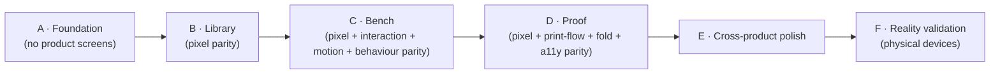

# Compose V2 Implementation Roadmap

> **Scope:** the phased plan for implementing the frozen V2 design in Jetpack Compose. This is the *execution*
> breakdown; the product-level phasing authority remains [ROADMAP.md](ROADMAP.md), and this document is its V2-UI
> child (cross-link, don't duplicate). Governed by [V2-CONSTITUTION.md](design/V2-CONSTITUTION.md) and
> [COMPOSE-IMPLEMENTATION-GUIDE.md](COMPOSE-IMPLEMENTATION-GUIDE.md).
>
> **The rule that spans every phase:** no redesign, no interpretation, no feature creep. Reproduce the frozen HTML.
> If the HTML is wrong, fix the HTML first (owner gate). Every phase ends with parity screenshots and a review gate.

---

## Ground truth this roadmap builds on

- **Three frozen surfaces:** [Library](design/mockups/v2-library.html) · [Bench](design/mockups/v2-bench.html) ·
  [Proof](design/mockups/v2-proof.html). Plus the frozen identity system ([V2-IDENTITY.md](design/V2-IDENTITY.md),
  [Bench H4 10-ink set](design/V2-IDENTITY.md), [V2-TOKENS.md](design/V2-TOKENS.md)).
- **The Bench and Proof are not greenfield.** A real editor engine already exists and **must be preserved**:
  `CanvasReplayer` (one draw path, [ADR-028](DECISIONS.md#adr-028)), `ElementSemanticsLayer` (canvas a11y),
  command-undo + `AutosaveCoordinator`, direct-manipulation resize handles, and the deliberate anti-desync
  defence. V2 is a **re-skin + interaction upgrade** of these, not a rewrite.
- **Foundation is fused with V1 conformance.** The token/spacing/motion migration is done **once**, jointly with
  the V1 conformance programme's token work (C3/C6/C7) — *not* as a second parallel migration. See
  [ROADMAP.md](ROADMAP.md) and the conformance track.
- **Staged build.** Proof ships single-sheet-8 first; booklet / saddle-stitch / duplex is a later stage on the
  same frozen room (the maker never picks a format).

---

## Phase map

Each phase has an **Objective**, **Deliverables**, **Acceptance criteria**, and a **Review gate**. A phase is not
started until the previous phase's gate has passed.

---

## Phase A — Foundation

**Objective.** Build the material substrate every screen stands on, and *nothing product-facing*. When Phase A
ends there are no zines, no shelves, no editor — only a faithful, tested design system.

**Deliverables.**
- **Theme + tokens** — every value in [V2-TOKENS.md](design/V2-TOKENS.md) as Compose tokens (light + warm-charcoal
  dark, re-derived not inverted; dynamic colour off). Chrome palette only; maker inks modelled in a separate
  `content.*` namespace.
- **Typography** — Fraunces (voice) + Inter (work) type scale; no third UI face.
- **Spacing / elevation** — the 8pt rhythm and the calm elevation model as reusable primitives.
- **Motion** — the shared motion primitives (paper-settle, the calm durations/easings), all reduced-motion aware.
- **Icons + resources** — the icon set and drawable/resource pipeline.
- **CompositionLocals** — theme, tokens, motion, and haptics surfaced via locals so screens don't reach around them.
- **Paper system** — the material paper surface (grain/fleck as *material*, not decorative overlay) as a reusable
  building block for covers and pages.
- **Accessibility infrastructure** — the canvas virtual a11y node-tree scaffolding, named-custom-action plumbing,
  the CI AA-contrast gate, and the device a11y-dump recipe wired into the workflow.

**Acceptance criteria.**
- Token values are **byte-exact** to V2-TOKENS.md in both themes; AA ★ pairings pass the CI contrast gate.
- A tokens/typography/motion **catalog screen** (internal only) renders and is screenshot-tested (Roborazzi).
- No product screen exists yet. No hard-coded colours, sizes, or fonts anywhere — everything routes through tokens.
- Foundation is confirmed to be the **same** migration as the conformance token work (no duplicate system).

**Review gate.** Independent review confirms: exact token fidelity, no parallel/duplicate design system, a11y
infra present, zero product surface. **GO** required before Phase B.

---

## Phase B — Library

**Objective.** Reproduce the frozen [Library](design/mockups/v2-library.html) exactly. **Pixel parity only — no
redesign, no interpretation.** This is the closest surface to a clean re-skin and sets the parity bar for the rest.

**Deliverables.**
- The covers-only shelf; the quiet **"Your shelf"** header (no wordmark/count); the **Maker's Cover** recipe
  (title + ink + stamp, recipe-driven — **no per-edit render**, [ADR-069](DECISIONS.md#adr-069)); riso-grain
  material covers with grounded shadow, fold spine, fore-edge; **metadata hidden until interaction** (shown in the
  action-sheet header); long-press context menu **plus a visible `⋯` fallback**; the action sheet (Open ·
  Share & export · Rename · Duplicate · separated Delete); the transformation empty state; the **"Make a zine"** CTA.

**Acceptance criteria.**
- **Side-by-side parity** against the frozen HTML: layout, spacing (8pt), type, colour (both themes), every state
  (rest/pressed/selected/empty), and the shelf's cover rendering.
- Every P3 impl-gate met: AA contrast per ink, cover-title truncation, the screen-reader path, 8pt rhythm.
- Covers are **recipes**, verified: no raster-per-zine pipeline reintroduced.
- **Both device passes** accepted.

**Review gate.** Parity screenshots (light + dark) attached; deviations logged and resolved; **GO** before Phase C.

---

## Phase C — Bench (editor)

**Objective.** Bring the running editor to the frozen [Bench](design/mockups/v2-bench.html). This is **pixel +
interaction + animation + editing-behaviour parity** on top of the **existing** engine, which is preserved, not
rebuilt. **No feature additions.**

**Deliverables.**
- Re-skin the editor to the frozen Bench: the studio surface, the morphing 1→32 page navigation as *little paper
  sheets* (persistence-of-place), the single **Art drawer** (H3), the maker riso-ink palette in `content.*` (H4),
  the holding tray, the human copy.
- **In-place text editing with a rigid whole-page pan** on `WindowInsets.ime` — caret in the real text, the page
  moves as one rigid body and returns **pixel-identical** to rest. *Conditioned on the device Pass-2 pixel-identical
  proof; fall back to hardening the bottom-sheet editor if either proof fails.* (Owner-ruled; see
  [V2-BENCH-IA-INTERACTION.md](design/V2-BENCH-IA-INTERACTION.md), [V2-BENCH-REVIEW.md](design/V2-BENCH-REVIEW.md) §E.)
- Preserved invariants wired through the new skin: **one engine** preview == export (`CanvasReplayer`), deep
  **canvas a11y** (`ElementSemanticsLayer` — per-element focusable node, custom action per gesture, traversal
  order, live regions), command-undo + debounced `AutosaveCoordinator` + the "Saved ✨" chip, direct-manipulation
  resize handles (48dp), and the anti-desync viewport defence.

**Acceptance criteria.**
- Pixel parity to the frozen Bench (both themes, all element/selection/editing states).
- **Interaction & animation parity** — direct manipulation, page-sheet navigation, and motion match the spec.
- **Editing-behaviour parity** — the page never drifts/reflows/resizes while editing; text lands where the caret
  is; the page settles back pixel-identical (verified on device, not only Robolectric).
- **Boundaries honoured:** the finished-book reveal stays with **Read**, not the Bench ([ADR-058](DECISIONS.md#adr-058));
  no per-edit render ([ADR-069](DECISIONS.md#adr-069)); MVI preserved ([ADR-005](DECISIONS.md#adr-005)).
- Canvas a11y verified against the **platform** tree; both device passes accepted.

**Review gate.** Parity + interaction + a11y evidence attached; the text-edit proof (or the documented fallback)
recorded; **GO** before Phase D.

---

## Phase D — Proof

**Objective.** Bring the Proof surface to the frozen [Proof](design/mockups/v2-proof.html): **pixel parity +
printing-flow parity + fold-guide parity + accessibility parity**, for the shipped **single-sheet-8** stage.

**Deliverables.**
- The one-room Proof, **READ-first** (opens on the chrome-free finished zine, [ADR-058](DECISIONS.md#adr-058));
  the reassurance framing ("your pages, arranged for the fold") with any sheet shown as a **filled true render**,
  never blank panels; the fold guide (fold-by-pull, one fold per screen, one camera angle, arrow + crease, cut
  stop-point + cover marked, opt-in animation with a persistent static end-state); the single weighted commit
  (**Save PDF** primary, **Share** peer), reversible-until-button; the felt privacy line.
- **Print honesty:** no fake in-app "Print"; home-print = **Save PDF + Share** ([ADR-052](DECISIONS.md#adr-052));
  **100% actual size**; export == preview == read via the one engine.

**Acceptance criteria.**
- Pixel parity to the frozen Proof (both themes, all states).
- **Print-flow parity:** the Save-PDF + Share hand-off behaves as specified; the exported PDF equals the preview
  (parity test) and prints at 100% actual size.
- **Fold-guide parity** and **accessibility parity** (the guide is fully usable via TalkBack; animation is opt-in
  and reduces gracefully).
- **Never-silent failure + loss-safe back** ([ADR-051](DECISIONS.md#adr-051)) verified.
- Booklet / saddle-stitch / duplex are **out of this stage** (next roadmap stage); the flip-edge default is flagged
  as a device-verification item, not asserted here.
- Both device passes accepted.

**Review gate.** Parity + print-flow + fold + a11y evidence; the READ-first and honesty invariants confirmed;
**GO** before Phase E.

---

## Phase E — Cross-product polish

**Objective.** Make the three screens feel like **one** product in motion and detail. No new screens, no new
features — consistency work only.

**Deliverables.** Motion consistency across surfaces · shared transitions (Library ↔ Bench ↔ Proof/Read) · haptics ·
performance passes · accessibility sweep · typographic consistency · dark-mode consistency · an initial device
validation sweep.

**Acceptance criteria.**
- Motion, transitions, haptics, and type read as one product across all three surfaces; no surface has a bespoke
  flourish the others lack.
- Dark mode is consistent and re-derived (warm charcoal) everywhere; AA holds in both themes.
- No regressions in parity or the engine invariants; performance is smooth on a mid-range device.

**Review gate.** Cross-surface consistency review; **GO** before Phase F.

---

## Phase F — Reality validation

**Objective.** Prove it on real hardware, where the paper illusion, latency, and touch actually live. **Only now**
are tiny implementation adjustments permitted — and only to serve fidelity, never to redesign.

**Deliverables / validation matrix.** Run on physical devices and validate: the **paper illusion** · **OLED**
(true-black-free warm charcoal) · **small phones** · **large phones** · **foldables** (if available) ·
**accessibility scaling** (font size, TalkBack) · **animation feel** · **latency** (especially the rigid page-pan
settle) · **touch targets** (≥48dp) · **battery**.

**Acceptance criteria.**
- The paper illusion holds on real screens (grain/material reads as intended on OLED and LCD).
- Latency and the text-edit settle feel right on a real device; touch targets pass; no battery surprises.
- Font scaling and TalkBack usable end-to-end on all three surfaces.
- Any adjustment made here is small, fidelity-serving, logged, and — if it changes what a screen *should* be —
  routed back into the frozen HTML spec first (owner gate).

**Review gate.** Device-validation report (device, OS, build, TalkBack version) with both passes per surface;
Release Agent review against [ROADMAP.md](ROADMAP.md)/[PRD.md](PRD.md) before any release.

---

## Standing gates across all phases

- **Every phase ends with parity screenshots** (light + dark) and a **side-by-side** against the frozen HTML.
- **Every PR** gets an independent Review Agent (GO / GO WITH FIXES / NO-GO); Required Fixes are reconciled.
- **No feature creep** — anything not in the frozen spec is out of scope and routed to the owner.
- **Docs ship with code**; decisions become ADRs; the privacy/offline invariants stay intact.

---

*Written 2026-07-28 by the Design Custodian. Phase scope is fixed; sequencing within a phase is the implementer's
call, subject to the review gates.*
