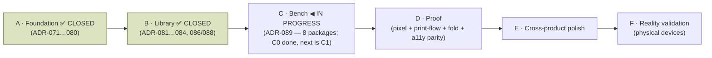

# Compose V2 Implementation Roadmap

> **Scope:** the phased plan for implementing the frozen V2 design in Jetpack Compose. This is the *execution*
> breakdown; the product-level phasing authority remains [ROADMAP.md](ROADMAP.md), and this document is its V2-UI
> child (cross-link, don't duplicate). Governed by [V2-CONSTITUTION.md](design/V2-CONSTITUTION.md) and
> [COMPOSE-IMPLEMENTATION-GUIDE.md](COMPOSE-IMPLEMENTATION-GUIDE.md).
>
> **The rule that spans every phase:** no redesign, no interpretation, no feature creep. Reproduce the frozen HTML.
> If the HTML is wrong, fix the HTML first (owner gate). Every phase ends with parity screenshots and a review gate.

---

## Ground truth this roadmap builds on

- **Three frozen surfaces:** [Library](design/mockups/v2-library.html) · [Bench](design/mockups/v2-bench.html) ·
  [Proof](design/mockups/v2-proof.html). Plus the frozen identity system ([V2-IDENTITY.md](design/V2-IDENTITY.md),
  [Bench H4 10-ink set](design/V2-IDENTITY.md), [V2-TOKENS.md](design/V2-TOKENS.md)).
- **The Bench and Proof are not greenfield.** A real editor engine already exists and **must be preserved**:
  `CanvasReplayer` (one draw path, [ADR-028](DECISIONS.md#adr-028)), `ElementSemanticsLayer` (canvas a11y),
  command-undo + `AutosaveCoordinator`, direct-manipulation resize handles, and the deliberate anti-desync
  defence. V2 is a **re-skin + interaction upgrade** of these, not a rewrite.
- **Foundation is fused with V1 conformance.** The token/spacing/motion migration is done **once**, jointly with
  the V1 conformance programme's token work (C3/C6/C7) — *not* as a second parallel migration. See
  [ROADMAP.md](ROADMAP.md) and the conformance track. Confirmed as the operative architecture by the
  **D-016** ruling of 2026-07-30 ([ADR-080](DECISIONS.md#adr-080)): V2 *is* that single migration, and V1's
  token objects retire through it, surface by surface, across Phases B–D.
- **Staged build.** Proof ships single-sheet-8 first; booklet / saddle-stitch / duplex is a later stage on the
  same frozen room (the maker never picks a format).

---

## Phase map

> **Status (2026-07-30): Phase A is CLOSED — its gate passed by owner ruling.** All nine implementation
> packages landed and were independently reviewed; the tenth (A10) is this documentation. The one condition
> that stood in the way — Phase A's gate requiring *"no parallel/duplicate design system"* while the same
> phase forbade touching product surface — was ruled on as
> [**D-016**](design/V2-SPEC-DEFECTS.md#d-016--two-of-phase-as-acceptance-criteria-cannot-be-met-by-a-phase-forbidden-to-touch-product-surface):
> the *token-routing* clause re-seats to **Phase D**, because routing existing product surfaces through V2
> tokens requires modifying them; the *"confirmed to be the same migration"* clause is **satisfied by
> confirmation** of the migration architecture and strategy. [ADR-080](DECISIONS.md#adr-080) is `Accepted`.
>
> The record of what was actually built — deliverable by deliverable, criterion by criterion — is
> [below](#phase-a-completion-record-2026-07-29).
>
> **Phase B has begun (owner GO, 2026-07-30).** Its first package, **B1 — the Maker's Cover**, is built,
> independently reviewed (GO WITH FIXES, fixes applied) and committed ([ADR-081](DECISIONS.md#adr-081),
> `Accepted`). **B2 — the shelf — is built, independently reviewed (GO WITH FIXES, fixes applied) and
> committed** ([ADR-082](DECISIONS.md#adr-082), `Accepted`); it raised **D-020**, which the owner **ruled
> the same day** in favour of the fixed two columns B2 had transcribed — the first defect this programme
> raised that cost no rework. **B3 — interaction — is built, independently reviewed (GO WITH FIXES, fixes applied) and
> committed** ([ADR-083](DECISIONS.md#adr-083), `Accepted`); it raised **D-021** and **D-022**, and the owner
> **ruled both the same day** — D-021 confirming the frozen literal characters at no code cost, D-022
> replacing the Library's stale scrim literal with the corpus token, which is the **only** V2 value not taken
> from the frozen Library file. B3 also corrected a stale B2 raster the repository was carrying
> (`v2_cover_pressed_light.png`, which failed `verify` at HEAD). **B4 — the empty state and the "Make a
> zine" dock — is built, independently reviewed (GO WITH FIXES, applied) and committed**
> ([ADR-084](DECISIONS.md#adr-084), `Accepted`). Three of the four design questions it met were already
> ruled — **D-005** names `.empty h2` by selector, **D-011** names `.start` by line, and **D-021** covers
> the `＋` the bundled fonts do not carry. The fourth is **[D-023](design/V2-SPEC-DEFECTS.md#d-023)**, which
> B4 argued closed and **review sent to the owner**: it is the register's first entry since Phase A to reach
> the owner unruled, and the fourth of the D-005/D-011/D-022 set that D-022's ruling predicted. It does not
> block B4 — the code transcribes the freeze either way. **B5 — the screen — is built and stopped at the pre-commit gate**
> ([ADR-086](DECISIONS.md#adr-086)): the V2 Library now hosts the app's Home route, real project data reaches it,
> and the D-017 cover is **assigned once at creation and persisted** through an additive Room migration. Its tests
> caught a real defect (a second, hand-built `ProjectSummary` that silently dropped the cover) and its mid-package
> review caught two rows terminating on nothing — one with no test at all. It raised
> **[D-027](design/V2-SPEC-DEFECTS.md#d-027)**, which does not block it. B1 ships `ZineCoverSurface`/`ZineCoverStamp`/`ZineCoverRecipe` and the
> renderer only — **no assigner**: independent review found the assignment guard could not hold the D-017
> ruling regardless of how it was written, so the assigner moves to **B5**, next to the persisted field it
> needs. See
> [Phase B packages](#phase-b-packages-sequencing-is-the-implementers-call-the-phases-criteria-above-are-unchanged).
> Nothing user-visible has changed yet: B1 is additive and V1's shelf is still the app's Library.
>
> **Status (2026-08-01): Phase B is CLOSED by owner ruling, and Phase C has begun.** B5 is
> committed (`03223da`) — the V2 Library **is** the app's Home route — followed by
> [ADR-088](DECISIONS.md#adr-088) (`2842603`), the paper chooser's one-scale fix, which was authored,
> reviewed **GO WITH FIXES** and device-verified on both passes. The paragraph above is left as written
> because a plan edited to match its outcome stops being evidence; read it as the record of where B5 stood
> at the pre-commit gate, not of where the repository stands.
>
> **Phase C has STARTED (owner GO, 2026-08-01). [ADR-089](DECISIONS.md#adr-089) is `Accepted`, and its first
> package — C0, documentation only — is complete.** The next package is **C1**, the studio surface. Its planning
> package is
> [ADR-089](DECISIONS.md#adr-089), which publishes the phase's [eight packages](#phase-c-packages) and a
> **complete selector-level frozen property table** for the frozen Bench, written before any production code
> per [ADR-085](DECISIONS.md#adr-085) change 2. Five new register entries were raised by that planning pass
> alone ([D-028](design/V2-SPEC-DEFECTS.md#d-028) · [D-029](design/V2-SPEC-DEFECTS.md#d-029) ·
> [D-030](design/V2-SPEC-DEFECTS.md#d-030) · [D-031](design/V2-SPEC-DEFECTS.md#d-031) ·
> [D-032](design/V2-SPEC-DEFECTS.md#d-032)), and the four rulings that opened the phase landed the same day.
>
> **After those rulings the table stood at 96 rows, of which 14 terminated in ⏳ or ✎** — an owner ruling or a
> design amendment. **C0 discharged both `✎` rows** and **OD-10 discharged row 1.9**, so it now reads **96 rows,
> 11 ⏳, no `✎` anywhere**. Every remaining ⏳ is a ruling owed to a named later package — but three rows (1.5,
> 1.8, 1.9) now carry **⛔**, a state the table did not previously need: specified, ruled where a ruling was owed,
> and still unbuildable, because [D-033](design/V2-SPEC-DEFECTS.md#d-033) has not said which rectangle they are
> measured against. The phase shrank from ten packages to eight because
> [OD-2 re-seated](#re-seated-beyond-phase-c) the capability C7 and C8 rested on. What is owed, and by which
> package, is [below](#phase-c--what-is-owed-before-it-starts).

Each phase has an **Objective**, **Deliverables**, **Acceptance criteria**, and a **Review gate**. A phase is not
started until the previous phase's gate has passed.

---

## Phase A — Foundation

**Objective.** Build the material substrate every screen stands on, and *nothing product-facing*. When Phase A
ends there are no zines, no shelves, no editor — only a faithful, tested design system.

**Deliverables.**
- **Theme + tokens** — every value in [V2-TOKENS.md](design/V2-TOKENS.md) as Compose tokens (light + warm-charcoal
  dark, re-derived not inverted; dynamic colour off). Chrome palette only; maker inks modelled in a separate
  `content.*` namespace.
- **Typography** — Fraunces (voice) + Inter (work) type scale; no third UI face.
- **Spacing / elevation** — the 8pt rhythm and the calm elevation model as reusable primitives.
- **Motion** — the shared motion primitives (paper-settle, the calm durations/easings), all reduced-motion aware.
- **Icons + resources** — the icon set and drawable/resource pipeline.
- **CompositionLocals** — theme, tokens, motion, and haptics surfaced via locals so screens don't reach around them.
- **Paper system** — the material paper surface (grain/fleck as *material*, not decorative overlay) as a reusable
  building block for covers and pages.
- **Accessibility infrastructure** — the canvas virtual a11y node-tree scaffolding, named-custom-action plumbing,
  the CI AA-contrast gate, and the device a11y-dump recipe wired into the workflow.

**Acceptance criteria.**
- Token values are **byte-exact** to V2-TOKENS.md in both themes; AA ★ pairings pass the CI contrast gate.
- A tokens/typography/motion **catalog screen** (internal only) renders and is screenshot-tested (Roborazzi).
- No product screen exists yet. No hard-coded colours, sizes, or fonts anywhere — everything routes through tokens.
- Foundation is confirmed to be the **same** migration as the conformance token work (no duplicate system).

**Review gate.** Independent review confirms: exact token fidelity, no parallel/duplicate design system, a11y
infra present, zero product surface. **GO** required before Phase B.

---

## Phase A completion record (2026-07-29) {#phase-a-completion-record-2026-07-29}

> **Why this section exists.** The plan above is what Phase A *set out* to do. This is what it did. They are
> not the same, and the differences are decisions — recorded here so a new engineer inherits the outcome
> rather than reconstructing it from nine ADRs and a commit log. Where a deliverable was met differently
> than planned, the reason is an owner ruling or a defect entry, and it is linked.

Phase A ran as nine packages, **A1–A9**, each additive, each independently reviewed, each ending at an owner
gate. Every package is an ADR: [ADR-071](DECISIONS.md#adr-071) · [ADR-072](DECISIONS.md#adr-072) ·
[ADR-073](DECISIONS.md#adr-073) · [ADR-074](DECISIONS.md#adr-074) · [ADR-075](DECISIONS.md#adr-075) ·
[ADR-076](DECISIONS.md#adr-076) · [ADR-077](DECISIONS.md#adr-077) · [ADR-078](DECISIONS.md#adr-078) ·
[ADR-079](DECISIONS.md#adr-079). Phase A's closure and the interpretation that made it possible are
[ADR-080](DECISIONS.md#adr-080).

### Deliverables

| Planned | Delivered | Notes |
|---|---|---|
| **Theme + tokens** — every V2-TOKENS.md value, both themes, dynamic colour off; chrome only, maker inks in `content.*` | ✅ as planned | `ZinelyV2Colors` ([ADR-071](DECISIONS.md#adr-071)) + `ZinelyContentInks` ([ADR-072](DECISIONS.md#adr-072)). Dark re-derived, not inverted. |
| **Typography** — "Fraunces + Inter **type scale**" | ⚠️ **delivered as a two-family *foundation*, not a scale** | The frozen trilogy does not contain a type scale to transcribe. Publishing one would have been design work. [ADR-073](DECISIONS.md#adr-073). |
| **Spacing / elevation** — "the 8pt rhythm and the calm elevation model as reusable primitives" | ⚠️ **elevation yes; no spacing scale at all** | The frozen CSS is 16.7% on-grid. **D-007** owner ruling: §III is an aspiration, not a token inventory — nothing is published; spacing stays per-component as frozen. [ADR-074](DECISIONS.md#adr-074). |
| **Motion** — "paper-settle, the calm durations/easings", reduced-motion aware | ⚠️ **two easings + a reduced-motion policy; no duration tokens** | The design declares no durations. The policy separates one-shot motion (collapses to 0) from continuous motion (does not run) — an infinite animation at 0ms strobes. [ADR-075](DECISIONS.md#adr-075), **D-012** deferred to Phase C. |
| **Icons + resources** | ✅ as planned | 36 marks as geometry without a stroke, built into an `ImageVector` per call site, because the design makes stroke weight a property of the *container*. [ADR-077](DECISIONS.md#adr-077). |
| **CompositionLocals** — theme, tokens, motion, haptics | ✅ as planned | Nine locals in `Theme.kt`. **Haptics is V1's `ZinelyHaptics`, shared rather than duplicated** — the correct outcome under "no duplicate system". |
| **Paper system** — grain/fleck as *material* | ✅ as planned | Pre-baked 140×140 tile from the SVG 1.1 normative `feTurbulence` (`RuntimeShader` is API 33 against `minSdk` 24), drawn at `soft-light`. [ADR-076](DECISIONS.md#adr-076); **D-013**, **D-014** resolved. |
| **Accessibility infrastructure** | ✅ as planned, and the survey changed what was owed | Of the four named items, the CI AA-contrast gate was **already complete**, the canvas node tree **already existed** (in `:feature:editor`), the platform-tree harness existed but was **unreachable** from `:core:ui`, and the device a11y-dump recipe **pointed at a document that did not exist**. [ADR-078](DECISIONS.md#adr-078) built the two that were genuinely missing and wrote [DEVICE-VERIFICATION.md](DEVICE-VERIFICATION.md). |

### Acceptance criteria

| Criterion | Verdict |
|---|---|
| Token values **byte-exact** to V2-TOKENS.md in both themes; AA ★ pairings pass the CI contrast gate | ✅ **Met, and now gated against the document itself.** `ZinelyV2CatalogParityTest` parses V2-TOKENS.md at run time and asserts rendered pixels equal the stated hex exactly, both themes ([ADR-079](DECISIONS.md#adr-079)). `ZinelyV2ContrastTest` gates all six ★ pairings. |
| A tokens/typography/**motion** catalog screen (internal only) renders and is screenshot-tested | ⚠️ **Met for tokens, typography, icons and material; motion is not in the catalog.** Motion is not screenshottable — a still frame of an easing curve proves nothing. It is gated behaviourally by `ZinelyV2MotionTest` instead. The catalog lives in `core/ui/src/debug`, so it is absent from a release AAR entirely (verified: 0 of 87 `classes.jar` entries). |
| **No product screen exists yet** | ✅ **Met.** No route, no navigation, no product surface. |
| **No hard-coded colours, sizes, or fonts anywhere — everything routes through tokens** | ⏭️ **Re-seated to [Phase D](#phase-d--proof) by owner ruling (D-016, 2026-07-30)** — it requires modifying existing product surfaces, which Phase A forbids. Phase A's own state: the gate mechanism exists (`TokenDisciplineTest`, CI-27) but [`config/token-enrolment.txt`](../config/token-enrolment.txt) enrols **zero packages**. Note the honest limit of that excuse: enrolling *most* packages means editing V1 product code, but `com.aritr.zinely.ui.a11y` was created by Phase A and carries none of the four banned literal forms — it could have been enrolled without touching V1 at all, and was not. That remains an available convergence increment for Phase B. |
| Foundation is confirmed to be the **same** migration as the conformance token work (no duplicate system) | ✅ **Met by confirmation (owner ruling, D-016, 2026-07-30).** The criterion's verb is *"confirmed to be"*: it asks for a recorded confirmation of the migration **architecture and strategy**, not for completed convergence. That confirmation is [ADR-080](DECISIONS.md#adr-080) Decision 2 — V2 is the single migration vehicle, V1's token objects retire through it, and each package enrols in `token-enrolment.txt` in the same commit that migrates it. `ZinelyColors`/`ZinelyV2Colors`, `ZinelyDimens`/`ZinelyV2Dimens` and `ZinelyTypography`/`ZinelyV2Typography` therefore coexist **as scheduled duplication**, retiring across Phases B–D. |

### The conflict this phase could not resolve, and the ruling that resolved it

Two of the four acceptance criteria above require **editing V1 product components** — that is what "no
duplicate system" and "everything routes through tokens" mean in practice. Phase A's first criterion, its
Objective (*"nothing product-facing"*) and its review gate (*"zero product surface"*) all forbid exactly
that. **The criteria were mutually unsatisfiable within Phase A.**

The strategy that actually operated for nine consecutive packages, under a standing owner instruction —
*additive only · preserve V1* — was never written down: **V2 lands beside V1 in Phase A, and the two
systems converge surface by surface in Phases B, C and D, as each V1 screen is re-skinned and its package
is enrolled in `token-enrolment.txt` in the same commit that migrates it.**

Rather than adjudicate that in-session, the conflict was logged as
[**D-016**](design/V2-SPEC-DEFECTS.md#d-016--two-of-phase-as-acceptance-criteria-cannot-be-met-by-a-phase-forbidden-to-touch-product-surface)
with two readings and neither chosen —
[COMPOSE-IMPLEMENTATION-RULES.md](COMPOSE-IMPLEMENTATION-RULES.md) says to stop and raise it, and
[V2-CONSTITUTION.md §VI](design/V2-CONSTITUTION.md) reserves amendment to the owner *"never implicitly
through implementation"*.

**✅ Owner ruling, 2026-07-30 — the second reading.** Only the **token-routing** clause re-seats, and it
re-seats to **Phase D**, because it *"necessarily belongs to Phase D because it requires modifying those
product surfaces."* The *"confirmed to be the same migration"* clause is *"satisfied by confirmation of the
migration architecture and strategy"* — [ADR-080](DECISIONS.md#adr-080) Decision 2 is that confirmation.
**Phase A therefore passes its gate.** ADR-080 is `Accepted`, and the re-seated clause is now written into
[Phase D's acceptance criteria](#phase-d--proof) where it is owed.

The duplication that remains is *scheduled*, not accidental. Two guards exist so
it cannot quietly become permanent: `ZinelyV2CanvasNodeMinSide` was collapsed into an alias of
`ZinelyV2Dimens.MinTouchTarget` the moment a second independent `48.dp` appeared inside a single module
([ADR-079](DECISIONS.md#adr-079)), and **no V1 product component was modified in any of A1–A9** — the
`:core:ui` additions are additive, and the one pre-existing V1 file they touch is `Theme.kt`, which gained
the new CompositionLocals (A1, A2, A3 and A5). No screen, no component, no V1 token object was edited.

### Defect register at the close of Phase A

Sixteen defects were raised against the frozen corpus during Phase A. At closeout: **ten resolved by owner
ruling** (D-002 · D-003 · D-005 · D-006 · D-007 · D-011 · D-013 · D-014 · D-015 · D-016) and **six open** —
of which **four are open by ruling**, their approach settled and verification owed to the phase that
implements the affected surface (D-008, D-009, D-010, D-012), **one is deferred to Phase D** (D-004), and
**one is a corpus-cleanup item** owed before Phase C (D-001). **Nothing is awaiting an owner, and nothing
blocks Phase B.**

*Since this closeout: [D-010](design/V2-SPEC-DEFECTS.md#d-010--the-page-shadow-is-hard-coded-to-the-light-theme-and-does-not-adapt-in-the-dark)
was **resolved on 2026-08-01** by amendment, when Phase C — the phase that implements its surface — arrived and
asked, which is exactly what "open by ruling" was meant to mean. The counts above are left as they read at the
close of Phase A.*

The per-defect table — status, owing phase, and a link to each entry — is
[**V2-SPEC-DEFECTS.md § Register at a glance**](design/V2-SPEC-DEFECTS.md#register-at-a-glance-verified-2026-07-29-at-the-close-of-phase-a),
which owns it. It is not reproduced here: this document owns *phasing*, the register owns *defects*, and a
second copy is how the two start disagreeing.

### What a new engineer should know that is not obvious from the code

- **The frozen corpus is the oracle, not the implementation.** A verification artifact must be *derived*
  from the design documents, never become a second source of design truth. This is the principle A9
  established and it governs every debug or verification artifact added from here on.
- **The platform `AccessibilityNodeInfo` tree is the source of truth, not Compose's merged semantics tree.**
  A control keeps its role and name on the platform only when it collapses to **one** node; any child
  contributing semantics splits it ([ADR-078](DECISIONS.md#adr-078)). Compose-level a11y tests cannot see
  this defect class at all.
- **Three packages in a row shipped an assertion blind to the defect class it claimed to gate** (A6, A7,
  A8 — and A9 made it four on first submission). Every one was caught by independent review, none by the
  suite. Assume the same failure is present in your own work until you have mutated the code and watched
  the test go red.
- **`grun`/Gradle reports `UP-TO-DATE` for inputs it does not know about.** `V2-TOKENS.md` is now a declared
  input of `:core:ui:testDebugUnitTest`; `config/token-enrolment.txt` is *not* a declared input of
  `:feature:editor`'s. Force with `--rerun-tasks` when a non-source file is what changed.

---

## Phase B — Library

**Objective.** Reproduce the frozen [Library](design/mockups/v2-library.html) exactly. **Pixel parity only — no
redesign, no interpretation.** This is the closest surface to a clean re-skin and sets the parity bar for the rest.

**Deliverables.**
- The covers-only shelf; the quiet **"Your shelf"** header (no wordmark/count); the **Maker's Cover** recipe
  (title + ink + stamp, recipe-driven — **no per-edit render**, [ADR-069](DECISIONS.md#adr-069)); riso-grain
  material covers with grounded shadow, fold spine, fore-edge; **metadata hidden until interaction** (shown in the
  action-sheet header); long-press context menu **plus a visible `⋯` fallback**; the action sheet (Open ·
  Share & export · Rename · Duplicate · separated Delete); the transformation empty state; the **"Make a zine"** CTA.

**Acceptance criteria.**
- **Side-by-side parity** against the frozen HTML: layout, spacing (8pt), type, colour (both themes), every state
  (rest/pressed/selected/empty), and the shelf's cover rendering.
- Every P3 impl-gate met: **cover-title contrast per ink at the 3.0:1 floor** — the level the **D-002**
  owner ruling of 2026-07-30 fixed for cover titles specifically, gated by `ZinelyContentInksTest`; no
  frozen colour changes. (The ★ chrome pairings keep the stricter 4.5:1 AA floor under
  `ZinelyV2ContrastTest` — this ruling does not touch them.) Plus cover-title truncation, the screen-reader
  path, 8pt rhythm.
- Covers are **recipes**, verified: no raster-per-zine pipeline reintroduced.
- **Both device passes** accepted.

**Review gate.** Parity screenshots (light + dark) attached; deviations logged and resolved; **GO** before Phase C.

### Phase B packages (sequencing is the implementer's call; the phase's criteria above are unchanged)

| # | Package | Depends on | Status |
|---|---|---|---|
| **B1** | **The Maker's Cover** — the printed object itself: stock, grain, band, stamp, clamped serif title, grounded rest/pressed shadow; `ZineCoverSurface`/`ZineCoverStamp`/`ZineCoverRecipe` (no assigner — see B5); and `Modifier.zinelyV2Shadow` in `:core:ui` | Phase A foundation | ✅ built, independently reviewed (**GO WITH FIXES**, fixes applied), and committed 2026-07-30 ([ADR-081](DECISIONS.md#adr-081), `Accepted`) |
| **B2** | **The shelf** — two-column grid (fixed at every width per the **D-020** ruling), frozen gaps, the quiet "Your shelf" header (a full-width cell *inside* the scroll, so it scrolls away), scroll. Paints no ground: the desk is B5's | B1 | ✅ **built, independently reviewed (GO WITH FIXES, applied) and committed 2026-07-30** (`1e097ab`, [ADR-082](DECISIONS.md#adr-082), `Accepted`); raised **D-020**, ruled the same day with no code change owed |
| **B3** | **Interaction** — long-press, the visible `⋯` fallback, the action sheet (Open · Share & export · Rename · Duplicate · separated Delete), metadata in the sheet header | B2 | ✅ **built, reviewed (GO WITH FIXES, applied) and committed 2026-07-30** ([ADR-083](DECISIONS.md#adr-083)); raised **D-021** and **D-022**, **both ruled the same day** — the scrim ruling cost one paint site, the glyph ruling cost nothing. The sheet reports a choice and does not dismiss: the frozen file wires no handler to the five rows at all, so that is a **deferral to B5**, not a transcription |
| **B4** | **Empty state + "Make a zine"** — the transformation empty state (loose sheet → arrow → little book, three lines of copy) and the `.dock` band with its primary CTA. Ships `ZineShelfEmpty` and `ZineDock`; the CTA **reports** the press and routes nowhere, because the frozen file wires no handler to `.start` at all — the paper chooser is route hand-over and therefore **B5**'s. Which of shelf/empty is shown depends on real project data, so `body.is-empty` is B5's choice too | B2 | ✅ **built, independently reviewed (GO WITH FIXES, applied) and committed 2026-07-31** ([ADR-084](DECISIONS.md#adr-084), `Accepted`); D-005, D-011 and D-021 already answered three of its four questions, and review sent the fourth to the owner as **[D-023](design/V2-SPEC-DEFECTS.md#d-023)** |
| **B5** | **The screen** — real project data, navigation, route hand-over, ~~`token-enrolment.txt`~~ (**struck 2026-07-31 and re-seated to [Phase D](#phase-d--proof)** — unreachable under D-007; see the note below this table), both device passes. **Carries two hard prerequisites, both deferred whole from B1:** (1) the **cover assigner** itself (`newZineCoverRecipe`-equivalent) — B1 shipped no assigner at all, because independent review found no reflection guard could hold "never derived from the title" against an assigner with no caller to check; and (2) the **persisted cover assignment** the D-017 ruling requires (a surface + stamp field on the project index and its `meta.json` sidecar, [ADR-042](DECISIONS.md#adr-042)) — a shelf that assigns a cover without storing it reprints every cover on every launch. B5 builds both together, so the guard has an actual call site to check | B1–B4 | ✅ **built, independently reviewed (GO WITH FIXES, applied) — awaiting owner acceptance, uncommitted.** [ADR-086](DECISIONS.md#adr-086) published B5's [frozen property table](DECISIONS.md#adr-086-fpt) *before* implementation (the first under [ADR-085](DECISIONS.md#adr-085)) and found **8 of 22 rows with no frozen source**, raising **D-024 · D-025 · D-026**. All four were ruled the same day and **all four are closed**: D-025 (reuse the existing flows; Share & export routes into the Proof), D-026 (a duplicate gets a **new** cover; legacy zines get one on first presentation), enrolment (re-seated to Phase D), and **D-024 — Loading and Error are product states, so the frozen HTML was amended** to add them. **Now built, mid-package reviewed (GO WITH FIXES, both Required Fixes applied), mutation-tested (13 applied, 13 killed) and golden-recorded (8 rasters, 4 states × 2 themes); awaiting independent review, and uncommitted.** The V2 Library is now the app's Home route. Persistence landed as an additive Room **`Migration(1,2)`** plus two `meta.json` fields, with the cover types moved to `core:model` so the persistence layer can assign without calling up into the UI. Implementation raised **[D-027](design/V2-SPEC-DEFECTS.md#d-027)** (the sheet's metadata vocabulary) and reported a **pre-existing** gap outside its scope: `EditorCoverageNoticeGoldenTest` (A9, `b0f2ad1`) has no recorded rasters at HEAD |

B1 is the leaf: the cover is the only element the frozen file specifies completely on its own, and every later
package draws it. It is **additive** — V1's shelf keeps its route and no V1 `src/main` file is touched — so the
Library becomes the app's Library at **B5**, not before.

**Raised by B3 and ruled the same day — and they went opposite ways, which is the useful reading:**

| | The gap | Why it matters here |
|---|---|---|
| [**D-021**](design/V2-SPEC-DEFECTS.md#d-021--the-sheets-icons-are-unicode-characters-and-half-of-them-are-not-in-the-apps-own-font) | The sheet's five icons and the shelf's `⋯` are **literal characters**, and `✎`, `⧉` and `⋯` are **not in the bundled Inter** (measured by parsing the font's `cmap`). The device's fallback draws them; a device with none draws tofu. | A7's icon set has no mark for *open* or *duplicate*, so substituting is a **design act**, not a parity fix. The `⋯` is also the only discoverable path to the sheet. |
| [**D-022**](design/V2-SPEC-DEFECTS.md#d-022--the-librarys-scrim-is-a-theme-invariant-literal-while-the-corpus-publishes-a-theme-aware-one) | `.scrim` is `rgba(30,25,18,.36)` written **outside** the file's `:root`, so the dark theme cannot reach it — while the corpus publishes a theme-aware `--scrim` whose dark half is *stronger*. | Same staleness shape as **D-005** and **D-011**, both ruled *the corpus wins*. Two precedents pointing one way are a hint, not a ruling, so B3 transcribed and asked. |

B3 transcribed the freeze in both cases and invented nothing, so **neither owes code until it is ruled** and
neither blocks the B3 review. Both are *visible*, which is what separates them from the register's other open
entries: a ruling that goes the other way changes what a user sees, so the device passes at **B5** should not run
before they are answered.

**Raised by B2 and ruled the same day:** [**D-020**](design/V2-SPEC-DEFECTS.md#d-020--the-shelf-states-a-fixed-two-column-grid-with-no-breakpoint-and-phase-b-verifies-on-foldables)
— the frozen shelf states `grid-template-columns:1fr 1fr` with **no media query anywhere in the file**, and was
authored at a single 392px phone, while V1's shelf is responsive (2 · 3 · 4 · 5) for the same screen. B2
transcribed the freeze and invented no breakpoint; the owner ruled that reading correct: **two columns, no
breakpoint, no responsive behaviour, no maximum cover width, and none of them to be invented** —
*"future adaptive layouts require a future frozen design rather than implementation inference"*. **No code change
was owed.** Two consequences for the device passes below: a tablet or unfolded foldable showing two large covers
is the **specified** behaviour, to be *recorded* rather than fixed, and any wish to change it is a request for a
new frozen design, not an implementation task.

**Raised by B1 and ruled the same day** — all three applied, and each settles more than the cover:

| | Ruling | Reach |
|---|---|---|
| [**D-017**](design/V2-SPEC-DEFECTS.md#d-017-ruling) | A cover is **assigned once at creation and persisted** — not derived from the title, not round-robin, not inferred from neighbours. The assignment is part of the zine's identity. | supersedes [ADR-069](DECISIONS.md#adr-069)'s title-hash *mechanism* for V2; B1 ships no assigner (review found no guard could hold the ruling without a persisted caller); B5 builds the assigner and the persistence together |
| [**D-018**](design/V2-SPEC-DEFECTS.md#d-018-ruling) | **Omit** the ink band below API 29; do not emulate `multiply` or substitute a blend mode. | extends D-014 from a *material* to a *mark*; one Known Limitation covers both |
| [**D-019**](design/V2-SPEC-DEFECTS.md#d-019-ruling) | A **printed artifact does not mirror** in any locale; chrome may. | answers B2's grid, Phase C's page sheets and Phase D's imposed sheet in advance |

**A second B5 deliverable contradicts an accepted ruling, and is reported here rather than quietly dropped —
same handling as the 8pt criterion below.** B5's row lists **`token-enrolment.txt`**, and enrolling
`com.aritr.zinely.feature.library` **cannot pass the build**. `TokenDisciplineTest` fails an enrolled package
on any raw `.dp` / `.sp` / `Color(` / `RoundedCornerShape(` literal in its `src/main`; the V2 library package
contains **119 `.dp`/`.sp` literals and 12 `RoundedCornerShape(`** — and every one of them is there *because*
the **D-007** ruling says no spacing scale is published and spacing stays **per-component exactly as frozen**.
The enrolment gate was written for the V1 conformance programme (CI-27/C1), where migrating a package *means*
replacing literals with scale tokens; V2 has no scale to migrate onto, by ruling. So the two are not merely in
tension — enrolment as currently defined is **unreachable** for any V2 surface, not just this one.

**✅ RULED 2026-07-31 — option (b), on the [ADR-080](DECISIONS.md#adr-080) precedent the conflict itself named:
*"do not weaken D-007; rescope the deliverable so it aligns with the existing constitutional rulings."*** So:

- **`token-enrolment.txt` is struck from B5's deliverables** and **re-seated to Phase D**, joining the
  token-routing criterion ADR-080 moved there on 2026-07-30 — the same destination for the same reason, which
  is that both require a convergence Phase B is forbidden to perform.
- **D-007 is untouched.** No spacing scale is published; V2 spacing stays per-component exactly as frozen.
- **`TokenDisciplineTest` is untouched.** It keeps guarding the V1 conformance programme it was written for
  (CI-27/C1). B5 removes no guard and weakens no assertion.
- **Phase D inherits one question with it,** stated here so it is not rediscovered: enrolment as currently
  defined means *"contains no raw literal"*, which presumes a scale to migrate onto. V2 has none **by ruling**,
  so enrolment is unreachable for **every** V2 surface, not just this package. Phase D must therefore define
  what token discipline *means* for a V2 surface — plausibly *"every value traces to the frozen CSS"* rather
  than *"no literal appears"* — before any V2 package can enrol. That is a Phase D design question, not a B5
  implementation one.

Nothing was invented and nothing was weakened: B5 does not enrol the package (which would break the build),
does not touch `TokenDisciplineTest`, and does not touch D-007.

**One acceptance criterion above is stale and is left as written rather than quietly amended:** *"spacing (8pt)"*
and *"8pt rhythm"* were superseded by the **D-007** owner ruling of 2026-07-28 — *no spacing scale is published;
spacing stays per-component exactly as frozen* — and the frozen Library's own cover padding (`15px 15px 18px`)
is not on an 8pt grid. Editing a phase's acceptance criteria is an owner act ([ADR-080](DECISIONS.md#adr-080)
Decision 1 is the precedent), so it is reported here for a ruling. Parity against the frozen CSS is the operative
bar B1 was built to.

---

## Phase C — Bench (editor)

**Objective.** Bring the running editor to the frozen [Bench](design/mockups/v2-bench.html). This is **pixel +
interaction + animation + editing-behaviour parity** on top of the **existing** engine, which is preserved, not
rebuilt. **No feature additions.**

> **Owner ruling OD-2, 2026-08-01 ([ADR-089](DECISIONS.md#adr-089)): Phase C is a parity phase and introduces no
> new editor capability.** The Deliverables below were written before that ruling and named four studio additions
> the shipped editor cannot express. **H1 (the holding shelf), `DecorElement`, variable page counts, page
> add/delete/reorder and H3 (the Art drawer) are re-seated beyond Phase C** — see
> [§ Re-seated beyond Phase C](#re-seated-beyond-phase-c). The struck text is left visible rather than deleted:
> this phase's objective and its deliverables contradicted each other for four days, which is the same defect
> [D-016](design/V2-SPEC-DEFECTS.md#d-016--two-of-phase-as-acceptance-criteria-cannot-be-met-by-a-phase-forbidden-to-touch-product-surface)
> recorded for Phase A, and a roadmap that erases its own contradictions cannot be audited for them.

**Deliverables.**
- Re-skin the editor to the frozen Bench: the studio surface, the page navigation as *little paper sheets*
  **over the document's real, fixed eight pages** (persistence-of-place), the maker riso-ink palette in
  `content.*` (H4), the human copy. ~~the morphing 1→32 page navigation~~ · ~~the single **Art drawer** (H3)~~ ·
  ~~the holding tray~~ — re-seated by OD-2.
- **In-place text editing with a rigid whole-page pan** on `WindowInsets.ime` — caret in the real text, the page
  moves as one rigid body and returns **pixel-identical** to rest. *Conditioned on the device Pass-2 pixel-identical
  proof; fall back to hardening the bottom-sheet editor if either proof fails.* (Owner-ruled; see
  [V2-BENCH-IA-INTERACTION.md](design/V2-BENCH-IA-INTERACTION.md), [V2-BENCH-REVIEW.md](design/V2-BENCH-REVIEW.md) §E.)
- Preserved invariants wired through the new skin: **one engine** preview == export (`CanvasReplayer`), deep
  **canvas a11y** (`ElementSemanticsLayer` — per-element focusable node, custom action per gesture, traversal
  order, live regions), command-undo + debounced `AutosaveCoordinator` + the "Saved ✨" chip, direct-manipulation
  resize handles (48dp), and the anti-desync viewport defence.

**Acceptance criteria.**
- Pixel parity to the frozen Bench (both themes, all element/selection/editing states), **excluding literal
  document-typeface parity for `.t-title` and `.t-body`** — owner ruling **OD-4**, 2026-08-01
  ([ADR-089](DECISIONS.md#adr-089)). Those two selectors draw the page's own text in `var(--serif)` = Fraunces
  and the engine draws Inter only; [D-004](design/V2-SPEC-DEFECTS.md#d-004--the-frozen-zine-content-is-set-in-fraunces-the-render-engine-can-only-draw-inter)
  stays deferred to Phase D with its three prohibitions intact, and the divergence is **stated in C1's golden
  KDoc** rather than silently baselined. **The exception is exactly these two selectors.** Everything else in
  the frozen Bench — including all four serif *chrome* headings and the "Fraunces" style chip's own type, which
  draw through `:core:ui` and reach parity today — remains literal parity.
- **Interaction & animation parity** — direct manipulation, page-sheet navigation, and motion match the spec.
- **Editing-behaviour parity** — the page never drifts/reflows/resizes while editing; text lands where the caret
  is; the page settles back pixel-identical (verified on device, not only Robolectric).
- **Boundaries honoured:** the finished-book reveal stays with **Read**, not the Bench ([ADR-058](DECISIONS.md#adr-058));
  no per-edit render ([ADR-069](DECISIONS.md#adr-069)); MVI preserved ([ADR-005](DECISIONS.md#adr-005)).
- Canvas a11y verified against the **platform** tree; both device passes accepted.

**Review gate.** Parity + interaction + a11y evidence attached; the text-edit proof (or the documented fallback)
recorded; **GO** before Phase D.

### Phase C packages {#phase-c-packages}

Published by [ADR-089](DECISIONS.md#adr-089) (2026-08-01) at the phase's planning gate, **before any production
code**, and reconciled the same day to the owner's four rulings. Sequencing within a phase is the implementer's
call; this order puts **every package whose rulings are in hand ahead of every package whose rulings are not**,
which is deliberately *not* the reading order of the frozen file.

**Phase C is eight packages.** C7 and C8 were re-seated by OD-2 and **their letters are not reused, nor is C9
renumbered** — six ADRs, this table and a property table already refer to these letters, and a label that
quietly changes meaning is how two documents start disagreeing while both look correct.

*Line references below are to `v2-bench.html` as it stands after the [D-010 amendment](design/V2-SPEC-DEFECTS.md#d-010-amendment) of 2026-08-01.*

| # | Package | Frozen regions | Depends on | Status |
|---|---|---|---|---|
| **C0** | **Corpus cleanup** — documentation only | the file's header (`:3`, and the deleted `:10`) and footer (now `:380`) | — | ✅ **DONE 2026-08-01.** Discharged [D-001](design/V2-SPEC-DEFECTS.md#d-001--v2-benchhtml-header-contradicts-the-freeze-record), whose 2026-07-28 disposition said *"clean it up in the design corpus **before Phase C begins**"*. Two lines of prose deleted; **no selector, declaration, token or script touched**, and the [D-010 amendment note](design/V2-SPEC-DEFECTS.md#d-010-amendment) directly below the stripped line preserved. Every `v2-bench.html`/`v2-proof.html` citation in the corpus was re-anchored to the current files in the same change (net +9 to +13 against the last commit, C0's own −1 included) and each re-verified against the selector it names |
| **C1** | **The studio surface** — ground, grain, the page, its shadow, page number, keep-clear, centre guide | `.phone::after`, `.canvasArea`, `.pageWrap`, `.page`, `.keepclear`, `.guide`, `.pagenum` | Phase A | ⛔ **BLOCKED 2026-08-01 by [D-033](design/V2-SPEC-DEFECTS.md#d-033)**, raised by C1's own pre-implementation blocker check: the frozen `212×326` page is not the document's `210.47×297.64` panel and the uniform `16px` cue is not its `17pt` safe area, so nothing says which rectangle the print-correctness cue draws. OD-3 amended the shadow (transcribe the amended file); OD-4 recorded the typeface divergence; **OD-10 ruled [D-032](design/V2-SPEC-DEFECTS.md#d-032)** — the warn state is transient interaction guidance. ~~D-032 fences one row — `.keepclear.warn` — not the package~~ — which held until D-033 replaced it with a blocker that fences the whole package |
| **C2** | **Selection + the contextual toolbar** — `.el`, outline, four handles, the dim, materialise, `.ctx` and its verb sets | `.el*`, `.sel`, `.handle*`, `.content.focusing`, `@keyframes mat`, `.ctx*` | C1 | ⛔ **blocked** — [D-031](design/V2-SPEC-DEFECTS.md#d-031) (Font/Size wire to nothing). Also implements the ruled approaches of [D-008](design/V2-SPEC-DEFECTS.md#d-008--two-of-the-three-frozen-surfaces-specify-no-focus-appearance-and-one-removes-it) and [D-009](design/V2-SPEC-DEFECTS.md#d-009--no-control-in-the-frozen-trilogy-declares-a-minimum-touch-target-and-most-measure-well-under-48dp), which **close here**. The `decor` verb set is unreachable while `DecorElement` is re-seated |
| **C3** | **In-place text editing + the rigid page pan** — the centrepiece | `.kbstack`, `.styletb*`, `.caret`, `edit()`/`endEdit()`, the `-96px` pan | C2 | ▶ **ready when C2 is.** Its condition is a **device proof**, not a ruling: pixel-identical return, else the documented bottom-sheet fallback |
| **C4** | **The bar, the status chip, the snackbar** | `.bar`, `.icon-btn*`, `.add*`, `.status`, `.saved*`, `.snack*` | C2 | ⛔ **blocked** — [D-031](design/V2-SPEC-DEFECTS.md#d-031) (the Read hand-off, back, redo) |
| **C5** | **Page navigation (H2)** — the filmstrip of little sheets, the summoned page grid | `.navrow`, `.gridbtn`, `.filmstrip`, `.pthumb*`, `.pgrid*`, `.pgcell*` | C1 | ▶ **unblocked by OD-2.** Built over the document's real, fixed eight; `N` is **read from the document, never a constant**. No add/delete/reorder verb, and the 1→32 morph is recorded as specified-but-unreachable |
| **C6** | **The ink popover (H4)** — the maker palette | `.inkpop*`, `.band*`, `.sw2*`, `.presets`, `.preset*`, `.inkuse*` | C2 | ⛔ **blocked** — [D-028](design/V2-SPEC-DEFECTS.md#d-028). The three bands already exist in `ZinelyContentInks` under [D-003's ruling](design/V2-SPEC-DEFECTS.md#d-003--the-maker-palette-is-ten-inks-or-nineteen-depending-on-which-document-you-read); the **presets** are the part it left to Phase C |
| ~~**C7**~~ | ~~The holding tray (H1)~~ | — | — | **re-seated beyond Phase C** by OD-2 — [below](#re-seated-beyond-phase-c) |
| ~~**C8**~~ | ~~Add / supply + the Art drawer (H3)~~ | — | — | **re-seated beyond Phase C** by OD-2, and it was already fenced by the freeze itself — [V2-BENCH-REVIEW §E.6](design/V2-BENCH-REVIEW.md): *"do NOT freeze into implementation until a review + legal pass clears them."* **The asset-layer ADR does not exist** |
| **C9** | **Integration** — the four states, the motion policy, persistence of place, both device passes, the phase gate | `@media (prefers-reduced-motion)` and the state machine across all of the above | C1–C6 | ⛔ **blocked** — [D-012](design/V2-SPEC-DEFECTS.md#d-012--the-three-frozen-files-write-three-different-reduced-motion-rules-and-one-of-them-would-strobe), whose behavioural decision was deferred *to this phase, on physical devices*, so it is answered **in** C9 rather than before it. Persistence of place is the **page half only**; the shelf half travels with H1 |

**One package remains feature-adjacent: C5.** Its frozen navigation is drawn for a page count the document
cannot have. It is built over the real eight and asserts against `format.pageCount` rather than a constant —
that is a re-skin, but it is one row away from not being one, and that row is where a phase silently doubles.

### Phase C — what is owed before it starts {#phase-c--what-is-owed-before-it-starts}

**Implementation may now legitimately begin.** Four items blocked the phase's opening; **all four were ruled on
2026-08-01**, and three of the six later-package items fell out as a consequence. **Three remain live, and none
of them blocks C0 or C1's start.** This section is the register's companion, not a second copy of it: each row
links the entry that owns the detail. The questions are kept as they were put, with the ruling beneath — a
question rewritten after its answer stops being evidence of what was asked.

#### Blocked C0 (documentation only) and C1 (the first production code) — all four ruled 2026-08-01

**C0 was blocked by OD-1 alone.** It is a documentation package: it discharges [D-001](design/V2-SPEC-DEFECTS.md#d-001--v2-benchhtml-header-contradicts-the-freeze-record), whose owner disposition of 2026-07-28 already says exactly what to do (*delete the stale header line; strip the stale footer clause, keep the stand-in sentence*), so it needed no new design ruling. **OD-2, OD-3 and OD-4 blocked C1**, not C0.

| | Question | Why it is the owner's |
|---|---|---|
| **OD-1** | **Is Phase B's gate passed, and where is that recorded?** This document says *"a phase is not started until the previous phase's gate has passed"*, and Phase B's gate wants parity screenshots (light + dark), a side-by-side, and both device passes. Meanwhile [ADR-086](DECISIONS.md#adr-086) still reads `Proposed` and *"uncommitted"* against a repository where B5 is committed at `03223da`. | Passing a phase gate is an owner act; so is reconciling an ADR's status to the repository, which is [ADR-088](DECISIONS.md#adr-088)'s own standard |
| **OD-2** | **Does Phase C build the studio additions, or re-skin the editor that exists?** H1 (the tray), H3 (the Art drawer), `DecorElement` and page add/delete are **net-new capability**, verified against the repository: `Element` is `ImageElement \| TextElement`, and `grep -ri "decorelement\|keep.\?clear"` over `core`, `feature` and `app` returns zero. The phase's Objective forbids feature additions. | This is [D-016](design/V2-SPEC-DEFECTS.md#d-016--two-of-phase-as-acceptance-criteria-cannot-be-met-by-a-phase-forbidden-to-touch-product-surface)'s shape exactly — a phase whose deliverables require what its own objective forbids — and D-016's method is *raise it, do not adjudicate it in-session* |
| **OD-3** | **[D-010](design/V2-SPEC-DEFECTS.md#d-010--the-page-shadow-is-hard-coded-to-the-light-theme-and-does-not-adapt-in-the-dark)** — the page's shadow is the light `--frame-shadow` spelled out as a literal and does not adapt in dark. Deferred **to Phase C** by ruling. **Scope, measured 2026-08-01:** exactly **two** declarations in the whole trilogy are affected — `v2-bench.html:85` (`.page`, C1) and `v2-proof.html:98` (`.zpage`, **Phase D**). Every other shadow on both screens — 13 in the Bench, 5 in the Proof — already reads `var(--frame-shadow)` and themes correctly, so **whatever is ruled here reaches Phase D as well as C1** and should be stated once for both | Both available answers are decisions: transcribing the literal ships a warm-brown shadow on a dark desk; using the token edits a frozen value. The same ruling forbade Phase A from inventing a third |
| **OD-4** | **[D-004](design/V2-SPEC-DEFECTS.md#d-004--the-frozen-zine-content-is-set-in-fraunces-the-render-engine-can-only-draw-inter)** — the Bench's page text is `var(--serif)` = Fraunces; the engine draws Inter only, and D-004 is deferred to **Phase D** with three prohibitions (*no workaround, no substitution, no second path*). **So the Bench's page cannot reach *literal* pixel parity in Phase C** — narrowed on 2026-08-01 from *"the page"* to exactly `.t-title` and `.t-body`, after checking what else on the surface draws in a serif. | Either the divergence is written into this phase's acceptance criteria, or D-004 comes forward. Editing a phase's acceptance criteria is an owner act — [ADR-080](DECISIONS.md#adr-080) Decision 1 is the precedent |

**The rulings, 2026-08-01.** All four approved; the full statements and their consequences are in
[ADR-089 §5](DECISIONS.md#adr-089).

- **OD-1 — approved.** Phase B is complete; [ADR-086](DECISIONS.md#adr-086) is `Accepted`. **C0 is unblocked.**
- **OD-2 — parity only.** No new editor capability; anything needing a new document-model concept is
  [re-seated](#re-seated-beyond-phase-c). This closed OD-5, OD-7 and OD-8 as a consequence.
- **OD-3 — amend the spec.** A dedicated `--page-shadow` / `--page-contact` pair, light preserved
  byte-for-byte, Kotlin deferred to C1 and Phase D. Applied to both frozen files;
  [D-010](design/V2-SPEC-DEFECTS.md#d-010--the-page-shadow-is-hard-coded-to-the-light-theme-and-does-not-adapt-in-the-dark)
  is **resolved**. As this row predicted, the ruling reached Phase D as well as C1 and was stated once for both.
- **OD-4 — record the divergence.** The acceptance criterion above is narrowed in writing to exclude literal
  document-typeface parity for `.t-title` and `.t-body` only. **D-004 does not move forward**, and no
  intermediate font solution is invented.

#### Blocks a named later package — three live, three closed by OD-2

| | First required by | Entry | State |
|---|---|---|---|
| **OD-5** | — | [**D-030**](design/V2-SPEC-DEFECTS.md#d-030) — 12 pages, a 1→32 morph and add/delete, against one fixed `SINGLE_SHEET_8`. At 8 pages the frozen morph never fires and two of H2's three shapes are unreachable | ✅ **closed by OD-2.** Re-seated; C5 renders the real eight. D-030 stays open against the phase that takes the capability |
| **OD-6** | **C6** | [**D-028**](design/V2-SPEC-DEFECTS.md#d-028) — the Ink verb offers all nineteen frozen swatches to a text element; `Accepted` [ADR-055](DECISIONS.md#adr-055) Decision 6 pins that control to five AA-tuned text inks and says the sets *"must not be conflated"*. And: what does a three-colour preset do to one element? | ⏳ **live** |
| **OD-7** | — | [**D-029**](design/V2-SPEC-DEFECTS.md#d-029) — the holding shelf has no data model, no persistence and no stated scope, while [§E.4](design/V2-BENCH-REVIEW.md) makes *"materials still on the shelf"* a build invariant and [ADR-025](DECISIONS.md#adr-025)'s sweeper would treat an ungathered photo as unreferenced | ✅ **closed by OD-2.** Re-seated with H1 |
| **OD-8** | — | **The asset-layer ADR and its legal pass.** Commission it, ship the drawer bundled-only (itself a design change to a frozen surface), or defer H3. This is the product's only network path | ✅ **closed by OD-2** — and it was never Phase C's to decide, because [§E.6](design/V2-BENCH-REVIEW.md) already fenced H3 |
| **OD-9** | **C2** (then C4) | [**D-031**](design/V2-SPEC-DEFECTS.md#d-031) — Font, Size, the Read/Proof hand-off and back have no destinations in the freeze; **redo** exists in the product and not in the freeze | ⏳ **live** |
| **OD-10** | ~~C1~~ (D-032 ✅ **ruled 2026-08-01**), **C9** (D-012) | [**D-032**](design/V2-SPEC-DEFECTS.md#d-032) (the keep-clear warn state has no trigger, and its written trigger needs face detection) and [**D-012**](design/V2-SPEC-DEFECTS.md#d-012--the-three-frozen-files-write-three-different-reduced-motion-rules-and-one-of-them-would-strobe) (which reduced-motion rule the corpus states — the Bench holds the trilogy's only looping animation) | ⏳ **live**, and neither half blocks a package's *start*: D-032 fences one row of C1's table, and D-012 was deferred *to Phase C on physical devices*, so C9 answers it rather than waiting on it |

**The acceptance criterion that was unreachable is now narrowed by ruling rather than left to fail.** It was
recorded here as *"not stale but unreachable"* — the same handling Phase B gave its *"8pt"* criterion — because
*"pixel parity to the frozen Bench"* could not be met on the page while D-004 stayed deferred. OD-4 resolved it
the way that costs nothing and hides nothing: the exclusion is written into the criterion, scoped to `.t-title`
and `.t-body`, and stated in C1's golden KDoc. **D-004 itself did not move.** Recording a divergence is not
fixing one, and the Phase D gate still owes the fix.

### Re-seated beyond Phase C {#re-seated-beyond-phase-c}

**Owner ruling OD-2, 2026-08-01** ([ADR-089 §2.3](DECISIONS.md#adr-089)): *"Phase C remains a parity phase. It
does NOT introduce new editor capabilities. Therefore: H1 materials shelf, DecorElement, variable page counts,
page add/delete, Art drawer, any capability requiring new document-model concepts are explicitly re-seated
beyond Phase C."*

| Re-seated | Register entry | Why it is not a re-skin |
|---|---|---|
| **H1 — the materials shelf** | [D-029](design/V2-SPEC-DEFECTS.md#d-029) | `ZineDocument` has no shelf: no store, no schema, no field, no composable — and an unresolved relationship to [ADR-025](DECISIONS.md#adr-025)'s mark-and-sweep root set |
| **`DecorElement`** | [D-029](design/V2-SPEC-DEFECTS.md#d-029) | a third `Element` subtype changes the document schema and breaks every exhaustive `when` over `ImageElement \| TextElement` |
| **Variable page counts** | [D-030](design/V2-SPEC-DEFECTS.md#d-030) | not an editor task at all: `DefaultDocumentValidator` hard-errors on `pages.count.mismatch`, `LayoutValidator` requires a bijection, and `SingleSheet8Imposer` supports one format. A 12-page document is unimposable, not merely undrawn |
| **Page add / delete / reorder** | [D-030](design/V2-SPEC-DEFECTS.md#d-030) | the same wall, plus a verb the product does not have |
| **H3 — the Art drawer** | the asset-layer ADR | [§E.6](design/V2-BENCH-REVIEW.md) fenced it at the freeze — *"do NOT freeze into implementation until a review + legal pass clears them"* — and **the asset-layer ADR does not exist**. The colour-namespace ADR that shared that sentence does ([ADR-072](DECISIONS.md#adr-072)) |

**What did *not* re-seat.** H2's navigation stays in Phase C as **C5**, over the document's real eight; H4's
maker inks stay as **C6**. The ruling fenced *capability*, not *surfaces* — a surface whose appearance can be
built over what the editor already is remains parity work.

**No phase has been assigned to this work, deliberately.** OD-2 re-seated it; scheduling it is a separate
owner act, and inventing a "Phase C.5" here would be exactly the silent decision the ruling exists to prevent.
When it is scheduled, [D-029](design/V2-SPEC-DEFECTS.md#d-029) and [D-030](design/V2-SPEC-DEFECTS.md#d-030) go
with it — both still open, both still unanswered — along with [§E.4](design/V2-BENCH-REVIEW.md)'s
*"materials still on the shelf"* build invariant, which Phase C does **not** discharge by persisting a page
index alone.

---

## Phase D — Proof

**Objective.** Bring the Proof surface to the frozen [Proof](design/mockups/v2-proof.html): **pixel parity +
printing-flow parity + fold-guide parity + accessibility parity**, for the shipped **single-sheet-8** stage.

**Deliverables.**
- The one-room Proof, **READ-first** (opens on the chrome-free finished zine, [ADR-058](DECISIONS.md#adr-058));
  the reassurance framing ("your pages, arranged for the fold") with any sheet shown as a **filled true render**,
  never blank panels; the fold guide (fold-by-pull, one fold per screen, one camera angle, arrow + crease, cut
  stop-point + cover marked, opt-in animation with a persistent static end-state); the single weighted commit
  (**Save PDF** primary, **Share** peer), reversible-until-button; the felt privacy line.
- **Print honesty:** no fake in-app "Print"; home-print = **Save PDF + Share** ([ADR-052](DECISIONS.md#adr-052));
  **100% actual size**; export == preview == read via the one engine.

**Acceptance criteria.**
- Pixel parity to the frozen Proof (both themes, all states).
- **Print-flow parity:** the Save-PDF + Share hand-off behaves as specified; the exported PDF equals the preview
  (parity test) and prints at 100% actual size.
- **Fold-guide parity** and **accessibility parity** (the guide is fully usable via TalkBack; animation is opt-in
  and reduces gracefully).
- **Never-silent failure + loss-safe back** ([ADR-051](DECISIONS.md#adr-051)) verified.
- **Re-seated from Phase A by owner ruling (D-016, 2026-07-30):** *"No hard-coded colours, sizes, or fonts
  anywhere — everything routes through tokens."* By Phase D's exit the last V1 surface is re-skinned and the
  last consumer migrated, so every product package is enrolled in
  [`config/token-enrolment.txt`](../config/token-enrolment.txt) and `TokenDisciplineTest` (CI-27) covers the
  product sources. V1's parallel token objects (`ZinelyColors`, `ZinelyDimens`, `ZinelyTypography`) are
  retired. See [ADR-080](DECISIONS.md#adr-080).
- **Also re-seated here, from B5 by owner ruling (2026-07-31):** the **`token-enrolment.txt` deliverable itself**.
  It was listed under Phase B / B5, where it is **unreachable** — the enrolment gate fails a package on any raw
  `.dp`/`.sp`/`Color(`/`RoundedCornerShape(`, and every such literal in a V2 package exists *because* **D-007**
  ruled that no spacing scale is published and spacing stays per-component exactly as frozen. Same destination
  and same reason as the criterion above. **Phase D therefore owes a prior definition:** what token discipline
  *means* for a V2 surface, given there is no scale to migrate onto — plausibly *"every value traces to the
  frozen CSS"* rather than *"no literal appears"*. Until that is defined, **no V2 package can enrol at all**,
  which is a fact about the gate rather than about any package. Full statement in
  [Phase B](#phase-b--library).
- Booklet / saddle-stitch / duplex are **out of this stage** (next roadmap stage); the flip-edge default is flagged
  as a device-verification item, not asserted here.
- Both device passes accepted.

**Review gate.** Parity + print-flow + fold + a11y evidence; the READ-first and honesty invariants confirmed;
**GO** before Phase E.

---

## Phase E — Cross-product polish

**Objective.** Make the three screens feel like **one** product in motion and detail. No new screens, no new
features — consistency work only.

**Deliverables.** Motion consistency across surfaces · shared transitions (Library ↔ Bench ↔ Proof/Read) · haptics ·
performance passes · accessibility sweep · typographic consistency · dark-mode consistency · an initial device
validation sweep.

**Acceptance criteria.**
- Motion, transitions, haptics, and type read as one product across all three surfaces; no surface has a bespoke
  flourish the others lack.
- Dark mode is consistent and re-derived (warm charcoal) everywhere; AA holds in both themes.
- No regressions in parity or the engine invariants; performance is smooth on a mid-range device.

**Review gate.** Cross-surface consistency review; **GO** before Phase F.

---

## Phase F — Reality validation

**Objective.** Prove it on real hardware, where the paper illusion, latency, and touch actually live. **Only now**
are tiny implementation adjustments permitted — and only to serve fidelity, never to redesign.

**Deliverables / validation matrix.** Run on physical devices and validate: the **paper illusion** · **OLED**
(true-black-free warm charcoal) · **small phones** · **large phones** · **foldables** (if available) ·
**accessibility scaling** (font size, TalkBack) · **animation feel** · **latency** (especially the rigid page-pan
settle) · **touch targets** (≥48dp) · **battery**.

**Acceptance criteria.**
- The paper illusion holds on real screens (grain/material reads as intended on OLED and LCD).
- Latency and the text-edit settle feel right on a real device; touch targets pass; no battery surprises.
- Font scaling and TalkBack usable end-to-end on all three surfaces.
- Any adjustment made here is small, fidelity-serving, logged, and — if it changes what a screen *should* be —
  routed back into the frozen HTML spec first (owner gate).

**Review gate.** Device-validation report (device, OS, build, TalkBack version) with both passes per surface;
Release Agent review against [ROADMAP.md](ROADMAP.md)/[PRD.md](PRD.md) before any release.

---

## Standing gates across all phases

- **Every phase ends with parity screenshots** (light + dark) and a **side-by-side** against the frozen HTML.
- **Every package opens with a [frozen property table](COMPOSE-IMPLEMENTATION-GUIDE.md#81-the-frozen-property-table)**
  in its ADR, written before production code, closed out at the gate — and **every row terminates in exactly one
  of four states** (✅ Implemented · ≡ Equivalent mutant with proof · ⏳ Owner ruling required · ✎ Canonical
  design amendment required). No row stays "blocked" ([ADR-087](DECISIONS.md#adr-087)).
- **Every package runs the verification order**: implementation → focused tests → the mid-package **"cannot fail"**
  review → mutation testing → record goldens → **verify** goldens → independent review → reconciliation → final
  verification → owner approval → commit ([ADR-085](DECISIONS.md#adr-085)). Any test added or changed during
  reconciliation re-enters at the "cannot fail" step with its own mutation.
- **Every PR** gets an independent Review Agent (GO / GO WITH FIXES / NO-GO); Required Fixes are reconciled.
- **One owner gate per package**, immediately before the commit. Design questions still go to the owner the moment
  they are found — that is unchanged and is not a gate, it is the standing rule.
- **No feature creep** — anything not in the frozen spec is out of scope and routed to the owner.
- **Docs ship with code**; decisions become ADRs; the privacy/offline invariants stay intact.
- **Read your package's section, not the whole roadmap**, and not all of [DECISIONS.md](DECISIONS.md) — the
  [handover](COMPOSE-V2-HANDOVER.md) §0 is the entry point and routes you to the ADRs that matter.

---

*Written 2026-07-28 by the Design Custodian. Phase scope is fixed; sequencing within a phase is the implementer's
call, subject to the review gates.*

*Phase A completion record added 2026-07-29 at the close of Phase A (package A10). The phase plans above are
left exactly as written — a plan that is edited to match its outcome stops being evidence of anything.*
