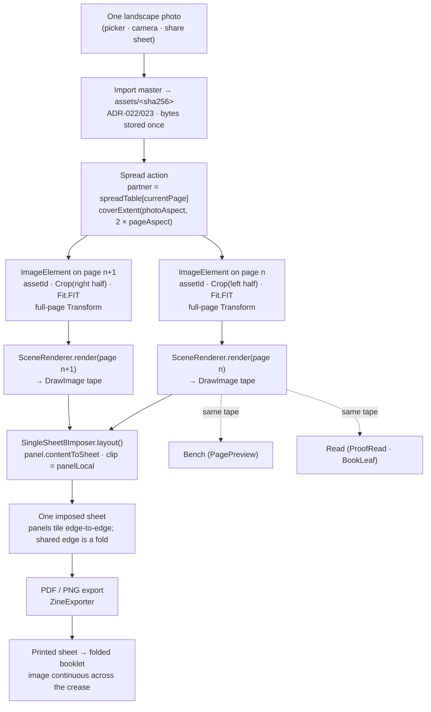

# Zinely — Architecture Decision Records (ADRs)

> **The single authoritative home for every significant decision.** If a decision is referenced anywhere else (ARCHITECTURE, PRD, ROADMAP, code comments), it links *here* by ID — it is never re-decided elsewhere. See the **Documentation Rule** in [/CLAUDE.md](../CLAUDE.md).

**How to use this log**
- One ADR per decision. Never edit an Accepted ADR's decision in place — **supersede** it with a new ADR and set the old one's status to `Superseded by ADR-NNN`.
- Status: `Proposed` → `Accepted` → (`Superseded` | `Deprecated`).
- Major decisions (architecture, storage, rendering, export, editor, data model) follow the **Review Workflow**: propose → Codex review → reconcile → record here. The Codex outcome is noted in the ADR.
- Evidence lives in [RESEARCH.md](RESEARCH.md); cite the relevant `R#` section rather than restating sources.

### Index
| ID | Decision | Status |
|---|---|---|
| [ADR-001](#adr-001) | Native `PdfDocument` for MVP PDF export (no third-party lib) | Accepted |
| [ADR-002](#adr-002) | MVP scope = home-print-ready, not commercial prepress | Accepted |
| [ADR-003](#adr-003) | Storage = Room metadata + serialized JSON document blob | Accepted |
| [ADR-004](#adr-004) | Imported photos copied-in via Photo Picker (no URI references) | Accepted |
| [ADR-005](#adr-005) | Editor = MVI + command-based undo with field-level mementos | Accepted |
| [ADR-006](#adr-006) | One shared scene renderer, two backends (preview + export) | Accepted |
| [ADR-007](#adr-007) | Pure-Kotlin imposition engine; canonical NASA/Chandra layout; SVG proof sheet | Accepted |
| [ADR-008](#adr-008) | Beginner-first UX with progressive disclosure | Accepted |
| [ADR-009](#adr-009) | Durability = autosave + atomic rename + SAF `.zine` backup; no cloud | Accepted |
| [ADR-010](#adr-010) | Free, no monetization for MVP; bundle only license-clear fonts | Accepted |
| [ADR-011](#adr-011) | Raster export = ARGB_8888 @300 DPI, decode-to-target, EXIF-normalize | Accepted |
| [ADR-012](#adr-012) | Print correctness = exact paper size, safe-area inset, calibration ruler | Accepted |
| [ADR-013](#adr-013) | App architecture = Clean + single Activity + Compose + Hilt | Accepted |
| [ADR-014](#adr-014) | Geometry & transform public-API stability (finite guarantees, `times()` visibility) | Proposed |
| [ADR-015](#adr-015) | Validation result contract — document validation returns a structured `ValidationResult`; imposition keeps its list until a unification pass | Accepted |
| [ADR-016](#adr-016) | Format & paper extensibility (closed enums vs open specs) | Proposed |
| [ADR-017](#adr-017) | Bleed, clip & safe-area semantics | Proposed |
| [ADR-018](#adr-018) | Imposition convention & guide-ID versioning | Proposed |
| [ADR-019](#adr-019) | Domain-layer threshold — no `:core:domain` until ViewModels outgrow repositories | Accepted |
| [ADR-020](#adr-020) | Document serialization = kotlinx JSON behind a swappable `DocumentSerializer` | Accepted |
| [ADR-021](#adr-021) | Autosave = single-writer debounced atomic full-save + `onStop` flush + `.bak`; no op-log (MVP) | Accepted |
| [ADR-022](#adr-022) | Asset ownership = global content-addressed store + mark-and-sweep + grace window | Accepted |
| [ADR-023](#adr-023) | Asset fidelity = one 4096 px import master, original discarded, derive tiers | Accepted |
| [ADR-024](#adr-024) | Minimum supported Android version = API 24 (Android 7.0) | Accepted |
| [ADR-025](#adr-025) | S2B layering = pure-JVM durability/GC core (`:core:data-storage`) + thin Android adapters (`:data-android`) | Accepted |
| [ADR-026](#adr-026) | Android autosave binding = app-scoped coordinator, one per project, editor-lifecycle driven; non-interruptible commit | Accepted |
| [ADR-027](#adr-027) | `:core:render` contract = pure page→draw-command tape; image fit/crop via shared `computeImageBlit`; point-space shared text layout | Accepted |
| [ADR-028](#adr-028) | S3 Android render backend = `:render-android` module, one `CanvasReplayer` + two canvas providers; PDF draws in points (separate raster scale); crop-aware region decode; bundled self-covering fonts; Robolectric-NATIVE Roborazzi parity | Accepted |
| [ADR-029](#adr-029) | S4 editor state + interaction = pure `:core:editor` MVI reducer over the existing `ZineDocument` + gated `:feature:editor` store; command/memento undo; gesture-bake + a11y twins | Accepted |
| [ADR-030](#adr-030) | S4 app-integration = `:app` mounts `EditorScreen` via single-Activity nav; `@HiltViewModel` owns the `EditorStore`; bootstrap fixed `projectId="default"` (seed-on-miss); autosave binder app-owned/lifecycle-observed; VM-held seam adapters; `allowBackup=false`; image pipeline split to Inc 2 | Accepted |
| [ADR-032](#adr-032) | Local preferences store = Preferences DataStore in `:data-android` behind an `EditorOnboardingStore` seam; first use = the one-time move/resize-hint "seen" flag (across-sessions); read as a load-aware tri-state (`null` loading / `false` unseen / `true` seen) so the hint can't flash before its state loads | Accepted |
| [ADR-031](#adr-031) | S4 Inc 2 image import = pure `FileAssetStore` (`assets/<sha256>`, GC deferred + **GC-enable blocked** until import pins) + sync direct-file `FileAssetBytesSource` render-read; `ImportMasterDecoder` (sampled decode → EXIF-consume → ≤4096px → **JPEG q90** master, ADR-023); `Effect→pickAndDecode` kept, picker bridged main-launch + single-flight; 2a storage/read then 2b interactive write | Accepted |
| [ADR-033](#adr-033) | Editor blank-page de-dup = the persistent `EditorSupplyTray` solely owns the add actions; `EditorEmptyState` becomes invitation-only (copy + ornament + privacy line, **no buttons**) pointing to the tray, so "Add a photo"/"Add words" appear exactly once (DESIGN-RULES R3/R7) | Accepted |
| [ADR-034](#adr-034) | Transient "Saved ✨" autosave confirmation = a new feature-layer `SavedSignal` seam fired off the **existing** `Effect.Autosave` (autosave-scheduled, not persistence-complete); host renders a quiet `EditorSavedConfirmation` (polite live region, reduced-motion-safe fade, yields to the move/resize hint) — no second save system, no `:core` change | Accepted |
| [ADR-035](#adr-035) | Warm save-failure surfacing = reuse the **existing** app-scoped `SaveFailureSink` (ADR-026 §5); host renders a persistent `EditorSaveFailure` banner (assertive live region, "Got it" dismiss) that **suppresses** the optimistic "Saved ✨" + move/resize hint while shown — the honest correction to ADR-034. Single flattened copy (no storage-full subtype in frozen `:core`); no auto-clear on silent recovery (no `:core` success signal) | Accepted |
| [ADR-036](#adr-036) | Storage-aware save-failure copy = classify out-of-space at the `DocumentRepositoryImpl.save` (`:data-android`) IOException seam via a **free-space probe** (`usableSpace < payloadBytes`, false-negative-biased), not errno/string sniffing (java.nio `Files.write` gives no structured ENOSPC); add a sibling `DataError.OutOfSpace` to `:core:data` + a feature-facing `SaveErrorKind` so `:feature:editor` keys the warm "low on storage" line without seeing core types. Honest as a disk-**state** assertion, not a proven proximate cause. Supersedes ADR-035's deferred "storage-full" limitation | Accepted |
| [ADR-037](#adr-037) | Silent-recovery clear for the save-failure banner = add a pure **synchronous** `outcomeListener: (DataResult<Unit>) -> Unit` seam to the frozen `:core:data-storage` `AutosaveCoordinator`, invoked inside the single-writer `drain()` once per completed save (success **after** `savedGen` advances), fault-isolated. `AutosaveCoordinatorFactory` becomes the **sole** sink feeder (`Success → clear`, `Failure → report`); the binder stops feeding the sink. Replaces the lossy advisory `failures: Flow<DataError>`. Auto-clears the banner only on a **durably-confirmed** save — never a false "Saved ✨". `failureCount` becomes a true since-last-success tally. Resolves the limitation ADR-034/035/036 each deferred. SharedFlow outcomes rejected (lossy / teardown-drop / dual-routing resurrection) | Accepted |
| [ADR-038](#adr-038) | Manual "Try now" retry on the save-failure banner = a fire-and-forget `EditorAutosaveBinder.requestFlush(): Unit` (shares the `closed`-guard + single-writer `binderMutex` helper with the lifecycle flush) forces an immediate `handle.flushNow()`; its outcome flows through the **existing** ADR-037 `outcomeListener` (sole feeder: success clears, failure re-reports), so retry adds **no** second routing path. Driven by a plain `EditorViewModel.retrySave()` (sibling of `dismissSaveError()`, **not** an `EditorStore` Intent — save lifecycle is a host concern). `Unit` return forbids caller-side result routing by construction. No `:core` change. Copy revised so "next time you make a change" no longer misdescribes the now-explicit retry. No false "Saved ✨" (the `flushNow` path never touches `SavedSignal`) | Accepted |
| [ADR-039](#adr-039) | Export product path = a `:render-android` `SheetComposer` composites all 8 imposed panels onto **one** sheet by looping the shared `CanvasReplayer` (PDF: `PdfDocument`, vector text; PNG: one ARGB_8888 @300 DPI) — the multi-panel path ADR-028 implied but never named; input is pre-built per-panel tapes + a sheet-space **overlay** tape (fold/cut guides now, calibration ruler later) so `:render-android` keeps its single `:core:render` edge. A `:app` `ZineExporter` runs Imposer + `SceneRenderer` + composer off-main on an IO dispatcher, streams to a **uniquely-named** `cacheDir/exports` file (never overwrites a live `content://`), and returns a `FileProvider` URI shared via `ACTION_SEND`. Reads the **live shared editor VM** document (export == Preview). Ruler deferred with cause (SINGLE_SHEET_8 tiles edge-to-edge; no sheet margin) | Accepted |
| [ADR-040](#adr-040) | Completion · fold-steps screen = a stateless `:feature:editor` `CompletionScreen` (payoff hero + four never-assumed **static** fold diagrams + send/open/keep-editing) hosted over the **shipped ADR-039 export seam** — no parallel path: both "Send to a friend" and "Open it" re-render the current document via the same `ExportViewModel`, and the host maps the one finished-file event to `ACTION_SEND` (chooser) or `ACTION_VIEW` (+`ClipData`, transient grant, `ActivityNotFoundException` fallback). The VM's finished-file event stays **delivery-agnostic** (`ShareRequest`→`ExportReady`); the host owns share-vs-open and correlates it with the initiating tap via single-flight + a remembered `pending` (Codex: consumption is UI, not render state). Reached from Export's "How do I fold it?"; **auto post-export landing deferred** (would alter the green ADR-039 share flow). "Keep editing" is the honest "make another" until the multi-project layer. Static → reduced-motion-safe by construction | Accepted |
| [ADR-041](#adr-041) | Auto post-export landing = Export's `ready` collector, after dispatching the ADR-039 share chooser, calls a new `onExported()` that navigates to `CompletionRoute` — the landing is **additive** (share behavior unchanged, chooser fires once) and closes the ADR-040 flow-coherence gap. No re-export/parallel path: Completion's own `ExportViewModel` is `Idle` until a Send/Open tap. No duplicate Completion (one-shot `Channel` + `repeatOnLifecycle(STARTED)` gate; `launchSingleTop` future-proofs). "Navigate after chooser returns" rejected (fire-and-forget `startActivity`, no result). Host nav glue → compile-verified + `:app` unit-green + structurally reasoned; **manual QA / instrumented back-stack test pending** (no host-nav test in `:app`, per ADR-039/040) | Accepted |
| [ADR-042](#adr-042) | S6.1 project store = Room `projects` table in `:data-android` as a **rebuildable index**; files are the source of truth and the transaction commit point (`document.json` per ADR-003 + a new per-project `meta.json` sidecar owning title/createdAt); an idempotent, re-runnable **reconcile scan** adopts pre-Room projects (the S4 `"default"` seed) with no destructive migration and drops rows without files; every mutation re-derives its row via one `syncRowFromDisk` path; GC live-roots maintained **by construction** (duplicate = new document over the same hashes, delete = document removal releases roots; no sweeper shipped, ADR-031 §2 intact); recency = `max(row.updatedAt, document mtime)` at read. `"default"` stays bootstrap-reserved until S6.5; mutations on an open editor project forbidden (S6.3 enforces) | Accepted |
| [ADR-043](#adr-043) | S6.2 Home "My zines" read-only shelf — stateless `HomeScreen`, MVVM `HomeViewModel`, deliberately unwired until S6.5 | Accepted |
| [ADR-044](#adr-044) | S6.3 Home shelf actions (create/rename/duplicate/delete) with the open-editor exclusion enforced inside the repository; stays unwired | Accepted |
| [ADR-045](#adr-045) | S6.4 Home shelf thumbnails via the shared parity path; mtime-stamped cache; degrade to a paper placeholder | Accepted |
| [ADR-046](#adr-046) | S6.5 nav re-root — `HomeRoute` becomes the start destination; retires the `"default"` seed-on-miss | Accepted |
| [ADR-047](#adr-047) | S7.1 paper choice moves to creation (Start-a-zine chooser); v0.6.0-alpha.1 scope recorded honestly | Accepted |
| [ADR-048](#adr-048) | M0 Compose design-token layer in `:feature:editor`; dynamic colour deleted, not defaulted off | Accepted |
| [ADR-049](#adr-049) | M1 shared component library = patterns the frozen trilogy shares; custom modal sheet; no ZDialog | Accepted |
| [ADR-050](#adr-050) | `proof.html` Act-1 imposed-sheet illustration corrected to match the imposition engine (freeze-amendment) | Accepted |
| [ADR-051](#adr-051) | V1 Proof = one screen, three acts (Sheet→Print→Fold); Preview/Export/Completion collapse into `ProofRoute` | Accepted |
| [ADR-052](#adr-052) | Proof export row drops in-app "Print"; home-print hand-off = Save PDF + Share; `PrintManager` deferred | Accepted |
| [ADR-053](#adr-053) | Bench image framing — fixed frame + movable picture; Reframe mode; discrete controls are the authoritative a11y path | Accepted |
| [ADR-054](#adr-054) | Save a copy to phone — `ZineExporter.export(destination)` funnel writes to Downloads; `ACTION_VIEW` retired | Proposed |
| [ADR-055](#adr-055) | Bench text styling — block-level style via a non-modal Type bar; renders in Inter; cancel is undo, no styling session | Accepted |
| [ADR-056](#adr-056) | One shared `readImageIntrinsics` seam so preview and export resolve geometry from identical dimensions | Accepted |
| [ADR-057](#adr-057) | Foundation typography — one registry; coverage split into promise (`:core:model`) vs. cmap-measured capability | Accepted |
| [ADR-058](#adr-058) | Proof surface opens on Read (chrome-free finished zine); imposed sheet becomes step 1 of "Print & fold" | Accepted |
| [ADR-059](#adr-059) | House `Role.Button` controls mis-announce as `android.view.View`; fix scheduled to the conformance C4/C6/C7 a11y gate | Accepted |
| [ADR-060](#adr-060) | User-facing copy layer = new pure-Kotlin `:core:copy` module exposing a `Copy` object (not `strings.xml`) | Accepted |
| [ADR-061](#adr-061) | CI-01 hub adjudication — `ZINELY-DESIGN-SYSTEM.md` is authoritative; `DESIGN-LANGUAGE.md` is a companion; §0.2 owns per-area authority | Accepted |
| [ADR-062](#adr-062) | CI-07 / A-3 — a fourth colour job (*consequence*, non-accent) + four control-state values; two-accent rule unchanged | Accepted |
| [ADR-063](#adr-063) | CI-08 / A-4 — a fourth motion band (*Underway*) + truthful-progress rule + §8.1's fourth job; duration deferred to CI-14 | Accepted |
| [ADR-064](#adr-064) | CI-05 / A-1 — rule-versus-rule precedence order inside the design system, accessibility ranked above the artifact's truth; escalation clause mandatory | Accepted |
| [ADR-065](#adr-065) | CI-09 / A-5 — **rejected.** The artifact and every representation of it are square-cornered; §2.7 re-affirmed, not amended; four production sites are non-conformant and are corrected in CI-73 | Accepted |
| [ADR-066](#adr-066) | CI-12 / A-8 — modality accepted in full (keyboard focus joins §11; touch rules name their equivalents; hover out of scope); the scale clause accepted as a **subordinate derivation** of §8.2, whose wording is unchanged | Accepted |
| [ADR-067](#adr-067) | CI-10 / A-6 — five type roles accepted (Value · Input · Technical · Link · List section header), each naming the §2.1 register it belongs to; **the five-register architecture is frozen** — this ADR authorises roles, not registers | Accepted |
| [ADR-069](#adr-069) | CI-18 — the shelf-thumbnail pipeline is **deleted**, not wired. It rendered, encoded, cached and decoded a PNG per zine for a field no composable read | Accepted |
| [ADR-070](#adr-070) | Direction A — the editor **warns, at typing time, before any character is lost**: an unprintable character raises a live, non-blocking notice naming its script; the character is never stripped. **Permanent product behaviour** — later script support must not weaken it | Accepted |
| [ADR-071](#adr-071) | The **V2 chrome palette lands additively** as `ZinelyV2Colors`, transcribed from the frozen V2 trilogy. The **Bench is canonical** for shared V2 implementation tokens; prototype scaffolding is named and excluded; V1 stays pinned until C0 | Accepted |
| [ADR-072](#adr-072) | The **`content.*` maker-ink namespace** lands as `ZinelyContentInks` — 4 cover inks + 10 in-page maker inks as **distinct axes**, theme-invariant (a printed object doesn't change colour in the dark), separated from chrome by the type system | Accepted |
| [ADR-073](#adr-073) | V2 typography lands as a two-family **foundation, not a type scale** — the frozen trilogy has 46 sans + 8 serif chrome styles on no ladder, so per-component values stay at their call sites. Fraunces at 400/500/600 (the 500 cut **instanced by us**, pinned by SHA-256); no italic in chrome | Accepted |
| [ADR-074](#adr-074) | V2 shape and elevation land as **two globals + one shadow primitive** — no radius scale (`--r` is dead), no shadow ladder (21 bespoke shadows), and **no spacing scale at all**: the constitutional 8pt rhythm and the frozen CSS disagree (16.7% on-grid), and that is **D-007**, closed by owner ruling: §III is an aspiration, not a token inventory, so nothing is published | Accepted |
| [ADR-075](#adr-075) | V2 motion lands as **two easings and a reduced-motion policy** — no duration tokens, since the design declares none; the policy separates one-shot motion (collapses to 0) from **continuous motion (does not run at all)**, because an infinite animation at 0ms strobes | Accepted |
| [ADR-076](#adr-076) | The V2 paper grain ships as a **pre-baked 140×140 RGBA tile** generated from the SVG 1.1 normative `feTurbulence` algorithm — `RuntimeShader` is API 33 against `minSdk` 24 — drawn through a repeating, density-scaled `ShaderBrush` at `soft-light`; tile size and strength stay per-surface | Accepted |
| [ADR-077](#adr-077) | The V2 icon set ships as **geometry without a stroke** — 36 marks on a 24-unit grid, built into an `ImageVector` per call site — because the frozen design makes stroke weight a property of the *container* (8 weights × 11 sizes), which a `VectorDrawable` cannot express | Accepted |
| [ADR-078](#adr-078) | The V2 accessibility foundation: a control seam that keeps its **role, label and enabled bit on one platform node** (the [ADR-059](#adr-059) defect, not re-inherited), a product-free **canvas virtual node tree**, and the CI-26 platform-tree harness moved into `:core:ui` test fixtures so the module that owns the components can assert the tree TalkBack reads | Accepted |
| [ADR-079](#adr-079) | The V2 foundation is verified by **two proofs, in order**: a corpus-parity suite that parses [V2-TOKENS.md](design/V2-TOKENS.md) at run time and asserts rendered pixels equal the values the frozen design states, and Roborazzi goldens that lock the result — because a golden alone can only certify that today's output equals yesterday's, and would protect a wrong value forever | Accepted |
| [ADR-080](#adr-080) | **Phase A closes.** *Everything routes through tokens* requires editing V1 product components, which Phase A forbids, so it is a **Phase D exit criterion**; *no duplicate design system* is **met by confirmation** of the migration architecture. V2 lands beside V1 until each surface is re-skinned and enrolled in the same commit that migrates it (D-016 owner ruling, 2026-07-30) | Accepted |
| [ADR-081](#adr-081) | **Phase B opens with the Maker's Cover (B1)** in a new `com.aritr.zinely.feature.library` package — additive, V1's shelf untouched and still routed. The whole printed sheet draws in **one** layer (a band in a child node found a transparent backdrop and its `multiply` degraded silently to `src-over`), and V2's box-shadow-with-spread lands in `:core:ui` as `Modifier.zinelyV2Shadow`. Three owner rulings applied: a cover is **assigned at creation and persisted**, not title-hashed (D-017, superseding ADR-069's mechanism for V2); the band is **omitted** below API 29 rather than approximated (D-018, on D-014's precedent); a **printed artifact never mirrors** (D-019) | Accepted |
| [ADR-082](#adr-082) | **B2 — the shelf**: two fixed columns at every width (D-020 ruling — no breakpoint is to be *inferred*), the "Your shelf" heading as a full-width cell **inside** the scroll so it scrolls away, and no ground painted (the desk is B5's) | Accepted |
| [ADR-083](#adr-083) | **B3 — interaction**: long-press + the always-visible `⋯` fallback, the action sheet over a theme-aware scrim (D-022 — where the Library file contradicts a corpus token, the **corpus wins**), metadata disclosed in the sheet rather than on every cover, and the frozen literal glyphs kept as frozen (D-021). **A control cannot contain a control**; a golden in record mode is not an assertion | Accepted |
| [ADR-084](#adr-084) | **B4 — the empty state and the dock**: the loose-sheet→book transformation and the inert band with the one way off the screen. The gradient inverts on transcription (CSS and Compose measure from opposite edges); a centre-aligned flex item's margin moves it by **half**; `env(safe-area-inset-bottom)` through the *consuming* seam. Raised **D-023** rather than settling it | Accepted |
| [ADR-085](#adr-085) | **Workflow V2** — the implementation process is re-shaped around where its cost actually falls: the handover becomes the package entry point, every package opens with a **frozen property table**, the "cannot fail" review moves **mid-package**, the verification order is fixed, one owner gate replaces two, and the Gradle daemon is on. **No verification standard is weakened** — fifteen are restated as unweakenable | Accepted |
| [ADR-086](#adr-086) | **B5 — the screen (planning).** The first integration package publishes its [frozen property table](#adr-086-fpt) before writing code, and the table reports that **8 of 22 rows have no frozen source**: the Library prototype has six hard-coded zines, so it never waits, never fails, wires no destination, and contains no rename input, delete confirmation or paper chooser. Raised **D-024 / D-025 / D-026** plus the `token-enrolment.txt` ↔ D-007 conflict — **all four ruled the same day**: reuse the existing flows, a duplicate gets a **new** cover, enrolment re-seats to Phase D, and Loading/Error go to the **frozen HTML** — which was **amended**. Planning approved; **no row blocked**; implementation complete, independently reviewed 2026-07-31, and closed by **owner ruling 2026-08-01** (OD-1 of [ADR-089](#adr-089)) — B5 committed at `03223da` | Accepted |
| [ADR-087](#adr-087) | **Workflow V2.1** — every frozen-property-table row terminates in exactly one of four states: ✅ Implemented · ≡ Equivalent mutant (with **proof**) · ⏳ Owner ruling required · ✎ Canonical design amendment required. No row stays "blocked", because that one word hid four different answers owed to four different people in B5's table. Extends [ADR-085](#adr-085) | Accepted |
| [ADR-088](#adr-088) | **The paper chooser draws both stocks at one scale.** The frozen `.paper .stock` sizes drew Letter ~4% oversized, which **inverted** the one relation the chooser exists to show: A4 is the physically larger sheet. Ruled a **specification bug fix**, not a redesign — the frozen HTML is corrected (Letter `56×72` → `54×70`) and Compose now *derives* both stocks from `PaperSize.portrait`, so a per-stock error is no longer expressible | Accepted |
| [ADR-089](#adr-089) | **Phase C planning** — the Bench is not one package. Publishes the phase's **eight packages** and a complete selector-level frozen property table for the frozen Bench, before any production code. Four of ten proposed packages could not legitimately begin; owner ruling **OD-2** re-seated the missing capability beyond Phase C | Accepted |
| [ADR-090](#adr-090) | **C1 — the studio surface**, Phase C's first production code: the ground, the sheet and its two-layer shadow, the grain, the keep-clear cue, the centre guide and the page number. The cue is **derived** from `Imposer.DEFAULT_SAFE_AREA_INSET_PT`, not transcribed from the frozen `18.5px`, so it keeps depicting the engine's boundary if that boundary moves; the page is centred through the **shared `pageOffset` viewport**, so all ten layers reading that seam move together. Implements [D-032](design/V2-SPEC-DEFECTS.md#d-032)'s ruled warn trigger as transient per-frame guidance. Reviewed **GO WITH FIXES** twice, every Required Fix reconciled. Its device verification failed twice and drove two amendments: [D-033](design/V2-SPEC-DEFECTS.md#d-033) gave the page real geometry, and [D-035](design/V2-SPEC-DEFECTS.md#d-035-ruling) made the sheet a **light-theme island** — the artifact does not dim, the room around it may — after the dimmed sheet left the user's own black content ink at 1.60:1. **[Both passes recorded and passed](#adr-090-device-verification)** on `SM-A176B` / Android 16 | Accepted |
| [ADR-091](#adr-091) | **C2a — selection**, the second production package of Phase C: the outline, the eight handles, the dim and the materialise. Records the pre-implementation blocker check that cleared both of its candidate owner decisions — the `--matcha` re-skin **improves** the outline's WCAG 1.4.11 figure (4.11:1 → **5.20:1**, and now in both themes, because [ADR-090](#adr-090) made the sheet an island), and the freeze's four handles versus the editor's eight is [OD-11](design/V2-SPEC-DEFECTS.md#d-034-ruling) applied, not a new ruling. Its substance is two **composites**: the frozen per-element `opacity:.4` becomes a `--paper` scrim at α 0.6 punched out at the selection, because an opacity on `Element` would reach the exported PDF and a two-pass render would break z-order; the materialise reuses that same scrim backwards plus the existing `LivePreview` seam | Accepted |
| [ADR-092](#adr-092) | **C2b - the contextual verb bar**, the second half of the OD-11 split: the freeze's `.ctx` is **added** beside the shipped `EditorContextBar` rather than replacing it, because the two are different controls and only `Delete` is shared. Records a five-question blocker check that cleared **all five** against rulings already in hand - including `Font`, which ships drawn and **disabled** because OD-9 said the freeze specifies the editing surface, not the product's whole capability. | Accepted |
| [ADR-093](#adr-093) | **C3 — in-place text editing and the rigid page pan**, opened before any production code per [ADR-089 §2.2](#adr-089). Re-verifies ADR-089's eleven planned rows against the frozen file (every reference but one had drifted) and adds four, for **15**. Its blocker check found one plan defect and **no owner decision**: ADR-089's `TypeBar.kt` re-skin would delete five style capabilities, which [OD-11](design/V2-SPEC-DEFECTS.md#d-034-ruling) forbids outright, so `.styletb` ships as the editing state's row — [D-042](design/V2-SPEC-DEFECTS.md#d-042) | Accepted |
| [ADR-094](#adr-094) | **C4 — the bar, the status chip, the snackbar.** Opened before any production code per [ADR-089 §2.2](#adr-089); its own blocker check found three plan defects, two of them owner decisions ([D-047](design/V2-SPEC-DEFECTS.md#d-047), [D-048](design/V2-SPEC-DEFECTS.md#d-048)), and it was implemented and `Accepted` only after [OD-21](design/V2-SPEC-DEFECTS.md#d-047-ruling) ruled them. | Accepted |
| [ADR-095](#adr-095) | **C5 — page navigation**: the filmstrip of little paper sheets and the summoned page grid. Two owner questions ([D-053](design/V2-SPEC-DEFECTS.md#d-053), [D-059](design/V2-SPEC-DEFECTS.md#d-059)) — the second raised *during* implementation — both ruled, both amending the frozen Bench. 31 frozen rows, 44 mutations, both device passes accepted. | Accepted |
| [ADR-096](#adr-096) | **C6 — the ink popover (H4): the maker palette.** Opened before any production code per [ADR-089 §2.2](#adr-089) and **held `Proposed` until its one owner decision was ruled** — [D-028](design/V2-SPEC-DEFECTS.md#d-028), which asked whether [ADR-055](#adr-055) Decision 6's five accepted content inks are superseded by the freeze's nineteen swatches; [OD-24](design/V2-SPEC-DEFECTS.md#d-028-ruling) ruled it on 2026-08-05, the frozen Bench's eighth amendment. Re-anchors every C6 citation (all sixteen were wrong, at four different offsets, and were wrong at the freeze commit) and audits twelve frozen properties no ADR-089 row reaches. **Both device passes run and accepted 2026-08-06** ([§9](#adr-096-device)); Pass 1 failed the first build on two frozen properties and added rows 6.2c and 6.1i. | Accepted |
| [ADR-097](#adr-097) | **C9 — integration: the four states, the motion policy, persistence of place, and the phase gate.** Phase C's **last** package, and the only one whose subject is the seams between the six already built rather than a region of the frozen file. Opened before any production code per [ADR-089 §2.2](#adr-089), with a **14-row** property table read from `v2-bench.html` itself — which is how it found the Bench's reduced-motion address wrong in three places (`:293`/`:260`/`:143` → **`:460`**), one rule ADR-089's phase table names nowhere, a caption outside the four states, and a row C3 had already discharged. Built, verified (**1603 tests green**; **15/15 mutations RED** over a GREEN control), reviewed twice (**GO WITH FIXES**, all Required Fixes reconciled) and **device-verified on both passes**. Its own invariants found two real product defects nothing else had: a **dead selection carried across undo** in `EditorReducer.stepHistory`, and a soft-delete fade **hard-coding 200ms** under a reduced-motion preference. Its row 9.5 was computed four times and wrong three times — raising and withdrawing [D-061](design/V2-SPEC-DEFECTS.md#d-061) and [D-062](design/V2-SPEC-DEFECTS.md#d-062) the same day — while the hardware was right the first time; **being wrong once is not a reason to trust the correction**. ✅ **[D-012](design/V2-SPEC-DEFECTS.md#d-012--the-three-frozen-files-write-three-different-reduced-motion-rules-and-one-of-them-would-strobe) RESOLVED by [OD-25](design/V2-SPEC-DEFECTS.md#d-012-ruling)**, option (a) — the Bench's rule ratified on device evidence, **no code changed**, discharging [OD-10](#adr-089)'s live half. **This acceptance closes Phase C.** ⚠ *Verification provenance annotated 2026-08-06 ([§6](#adr-097), [OD-37b](COMPOSE-V2-ROADMAP.md#phase-c-addendum-record-integrity)): the **1603** figure is unaltered and was reproduced on a clean tree at `fc33bca`, but the run it originally described held three uncommitted test-side fixes. No claim retracted; C9 not reopened.* | Accepted |
| [ADR-098](#adr-098) | **Phase D opens (planning).** The Proof is **already built** — as V1, against the superseded `proof.html`, with READ-first shipping and **zero V2 tokens across all five files** — so Phase D is a re-skin, and its phase-level property table sweeps all 702 lines of the frozen Proof to report **four of eleven packages fenced before any is opened**. Eleven packages ordered by **golden blast radius**, not by rulings-in-hand: the shared `Z*` components convert once, before the surface, or ~110 PNGs re-record twice. Finds the enrolment gate **unsatisfiable by ruling** (`feature.editor` holds **563** raw `.dp`, every one of them because D-007 published no spacing scale), the imposed sheet **schematic rather than rendered** so a maker never sees their own sheet before spending paper, the frozen Proof carrying **no Loading and no Error state** (D-024's exact shape), the fold animation **looping forever** where the roadmap requires it to rest, and **both of Phase D's two named deliverable addresses stale**. Raises **thirteen owner decisions (OD-29…OD-41)**. Its baseline finding — `main` red in three places inside the tagged milestone — was confirmed by audit and **closed by the maintenance commit `fc33bca`**, which retires **OD-37**; ~~and unblocks **D1**~~ **corrected 2026-08-07** — that removed D1's *baseline* blocker only, and [OD-41](#adr-098-od41) carried its scope ruling. **[OD-41](#adr-098-od41) is answered 2026-08-07, disposition (a): Phase D re-bases the shared `:core:ui` `Z*` components; D1 stands as published and is ▶ unblocked**, on [D-016](design/V2-SPEC-DEFECTS.md#d-016--two-of-phase-as-acceptance-criteria-cannot-be-met-by-a-phase-forbidden-to-touch-product-surface)'s ruling that modifying existing product surfaces *"necessarily belongs to Phase D"* — **no ADR superseded**; [ADR-097](#adr-097) §7.5 is Phase-C-scoped and is annotated, not amended. **Two of thirteen owner decisions answered, eleven owed. D0 is blocked on OD-29.** Records that ADR-089 §2.2 **audits** package proposals rather than generating them, so no derivation-methodology repair was owed ([note](#adr-098-derivation-note)) | Proposed |
| [ADR-099](#adr-099) | **V2.1 — the handmade design language re-freeze.** Re-skins the Library, Proof and Bench onto a printed-depth, published-scale, imperfect-display-face language derived from three reference sites. Supersedes the V2 trilogy **as the design source**, supersedes **no ADR**, keeps the no-fourth-chrome-hue rule intact — and **amends V2-CONSTITUTION §III Typography** to admit a third UI typeface (Amendment 1, owner, 2026-08-10). | Accepted |
| [ADR-100](#adr-100) | **Six implementation rulings the V2.1 Library re-skin forced, taken under delegated owner authority.** The overflow affordance becomes a **drawn three-dot mark** rather than the `⋯` character (emoji2 and the bundled Inter both defeat the glyph); the **two paper cover stocks stop theming** because a themed cream at 1.18:1 on the dark desk turned a maker's object into a hole cut in the desk; long titles **cap at two lines** so one zine cannot push its neighbour's cover down; the count chip moves to `butter`/`onButter` and the dock's decorative ring to `butter`, both invisible in light theme at `butterTint`'s **1.01:1**; the prototype's `:nth-child` tilt/tape phase is confirmed a **prototype artifact** and corrected to `:nth-of-type` in the frozen file; and the dead V2 `ZineCover` is **deleted**, which exposed that the only recipe test in the tree still guarded the function the shelf had stopped calling. Adds the `onButter` token. **Amends the freeze** ([V21-SPEC §4.1](design/V21-SPEC.md#41-colour), [§4.3](design/V21-SPEC.md#43-depth-geometry-motion)) and restructures `v21-library.html`'s tile from a `<button>` into an `<article>` holding two sibling buttons, because a control may not contain a control and the prototype could not otherwise carry the affordance ruling 1 ships. Reviewed twice — **GO WITH FIXES** and **NO-GO** — with all fourteen Required Fixes reconciled ([§11](#adr-100-review)); both reviews independently found the same dead CSS selector first. **Both device passes accepted 2026-08-11** on `SM-A176B` / Android 16 ([record](reviews/2026-08-11-adr-100-device-verification.md)); the two paper stocks measure the same hex in both themes on glass. | Accepted |
| [ADR-101](#adr-101) | **The Proof's climb becomes a band and two drawers.** Step 5 planning, opened before any code per [ADR-089 §2.2](#adr-089). Rules on **reconciliation, not design** — the structure was already owner-accepted with the prototype under [ADR-099](#adr-099). Audit finds the Proof is **V1 → V2.1 plus a navigation change** (24 `ZinelyTheme.colors`, **zero V2 tokens** across 2360 lines), a harder jump than the Library's re-skin. Two [ADR-100](#adr-100) ruling-4 defects found **by measurement before any code**: `.btn-save`'s `butterTint` frame ring at **1.10 / 1.13** on the band's paper ground, and `.pcount` at **1.01** light on the desk — the Library's count chip again. `.seal`'s red is kept: sealing wax is material, not signal. Names five invariants the prototype could not know about — chiefly that the frozen band has **a `.done` state and no failure state**, so [D-024](design/V2-SPEC-DEFECTS.md#d-024)'s shape is inherited — **withdrawn on reading the code**, which already replaces the whole surface on failure, a better answer than a third band state; **D-066/OD-32 are answered** on both halves (Error, and Loading via `exportBusy`). **Modifies [ADR-051](#adr-051) Decision A** — P1 retires the acts it created. Six packages, **structure before paint**: ADR-098's rule is *order by golden blast radius*, and with the structure changing that same rule yields the opposite of its usual chrome-first consequence. **Reviewed twice before any code** — evidence lens and plan lens, both GO WITH FIXES, fourteen Required Fixes reconciled ([§6](#adr-101-review)); the reviews caught §3 omitting the **print recipe**, which the frozen drawer does not contain at all, and P4 scoped at five fold steps against the frozen eight. **All six packages complete 2026-08-12**, each device-verified on both passes; P6's device Pass 1 found the surface's sharpest defect — the reader's leaf and the print drawer's imposed sheet both rendered the user's *printed output* in the room's dark palette, at 1.2:1, which no reviewer could see because it takes three separately-correct facts to produce ([§6.11](#adr-101-p6-device)). | Accepted |
| [ADR-102](#adr-102) | **The Bench re-skin, and the ruling its first draft would have reversed.** Step 6 planning, opened before any code on ADR-101's precedent — and **rewritten the same day after a NO-GO**, which is the whole value of planning in a document. Establishes first that **the freeze banners were wrong on all three prototypes**: `v21-bench.html` still called itself a *"DIRECTION PROPOSAL, NOT FROZEN"* naming the superseded `v2-bench.html` as canonical, as did `v21-proof.html` through all six ADR-101 packages built against it ([§1](#adr-102-banners)). Audit finds the Bench wearing **three palettes** — V2 (**41** references), a V2 island, and V1 remnants led by `ReframeControls` (**25**) — and a citation debt of **106 lines** in the Bench sources, **211 repo-wide**, all pointing at a superseded spec ([§2](#adr-102-audit)). **The rejected first draft ruled that `BenchSheetIsland` be retired** on the stated ground that V2 lacked a worktop token; the file it cited records the real cause — **[D-035](design/V2-SPEC-DEFECTS.md#d-035)**, an owner ruling taken after the user's own black text measured **1.60:1** on device against a dimmed sheet. Retiring it would have reinstated that defect on the surface users spend the most time on, and `EditorPageLegibilityProbeTest` exists to fail when it does. **The island stays; only its mechanism changes** ([§3](#adr-102-island)) — re-expressed as an explicit **eight-token** V2.1 island, deliberately *not* as the wholesale light palette `ProofLitPaper` provides, because wholesale is the move that reinstated D-010 the first time. **A third review then killed this draft too**, and for the better reason: the claim that ADR-101 P6’s rule *is* D-035 is circular — D-035 explicitly declined to amend the Proof, the question was open on the owner’s desk as **[OD-31](#adr-098-od31)**, and P6 shipped an answer to it three days early. **Escalated, and the owner ruled the same day: yes, and universally — *the artifact does not dim, on any surface*.** OD-31 and D-071 close, ADR-101 P6 is retroactively authorised, Phase D package D2 unblocks, and the Bench rule now rests on an owner ruling instead of on shipped code cited back to itself. The mechanism warning survives the ruling: one invariant, two correct implementations, and the Bench may not copy the Proof’s ([§10.1](#adr-102-open)). Also names **three freeze changes that are not paint** (the fourth, unselected dimming, already ships under ADR-091) ([§6](#adr-102-structural)), and puts the shelf and the network-bearing Art surface **explicitly out of scope** under OD-2 and an unresolved legal fence ([§7](#adr-102-oos)). Eight packages, dependency-ordered. Nine Required Fixes from the third review: **eight accepted, one rejected with evidence** — the 211/47 citation figure is exact under `git grep`, and the review’s smaller count came from sweeping an in-repo `.claude/` scratch tree ([§11](#adr-102-review)). | Accepted |
| [ADR-103](#adr-103) | **The world is a small press — the spatial metaphor, named.** Owner-adopted as Constitution Amendment 2; supersedes `DESIGN-LANGUAGE.md` in full | Accepted |
| [ADR-104](#adr-104) | **The asset layer — curated, generative, personal; no network, permanently.** Owner-adopted as Constitution Amendment 3; online sources closed on *provenance*, not privacy | Accepted |
| [ADR-105](#adr-105) | **The third primitive — `DecorElement`, and the draw command that does not exist yet.** Implements ADR-104's curated-supply half | Accepted |
| [ADR-106](#adr-106) | **The photocopier filter — a flag on the tape, not a filtered asset.** Adopted by the implementer under explicit owner delegation of D-082's five questions | Accepted |
| [ADR-107](#adr-107) | **A larger material library — grown inside the frozen four, searchable, composed by hand.** Grows the catalogue to ~51 inside the frozen families; upholds the randomiser ban; withdraws app-authored composites; ships search. | Proposed |
| [ADR-108](#adr-108) | ✅ **Hollow supplies — not as an axis; admissible one mark at a time.** Fill-only means a flag cannot *implement* hollow, only select a second authored outline. Rule [D-093](design/V2-SPEC-DEFECTS.md#d-093) first: the cheap end of the promise is the tile, not the catalogue | Proposed | **Accepted 2026-08-20**; R4 shipped as *generation* — the tile renders the authored outline, `BenchArtGlyphs` deleted.
| [ADR-109](#adr-109) | **One photo across two pages — a spread is two ordinary images, not a new kind of thing.** An action writes two `ImageElement`s sharing one `assetId` with complementary crops: no element type, no schema bump, no imposition change, no draw command. The open question is not rendering but *when the maker first sees the join* — no screen shows it | Proposed |
| [ADR-110](#adr-110) | **A v2 `.zine` is one whole-library backup, additive beside the v1 single-project package.** Files remain authoritative, assets remain content-addressed, and restore validates a staged archive before touching live storage. | Accepted |
| [ADR-111](#adr-111) | **The supplied collage owns launcher identity; launch is a system-only transition with no delay or marketing screen.** | Accepted |

> ADR-014, ADR-016 to ADR-018 are **follow-ups surfaced by the [ADR-007](#adr-007) release-candidate audit** (2026-06-19): rationale/risks/future only, no decision, no engine change. **ADR-015 was resolved during S2A** (2026-06-19) when document validation introduced the first real `Severity.WARNING`.
> ADR-019 to ADR-023 resolve the **S2 open questions O1–O5** from the [data-storage spike](spikes/data-storage-layer.md#8-open-questions--candidate-adrs); each records alternatives, tradeoffs, and a recommendation, was Codex-reviewed, and is Accepted where justified.

---

## ADR-001 {#adr-001}
**Native `android.graphics.pdf.PdfDocument` for MVP PDF export — no third-party PDF library.**
- **Status:** Accepted (2026-06-19)
- **Context:** We need print-quality, on-device, offline PDF export. Question was whether the platform API gives crisp vector text or whether we need iText/PdfBox-Android.
- **Decision:** Use `PdfDocument` + `Canvas`. Evidence ([R2.2](RESEARCH.md#r22-androidgraphicspdfpdfdocument--verified)) confirms its Skia backend emits **true vector, selectable text with embedded subset fonts** — sufficient for home print. No third-party lib in MVP.
- **Consequences:** Zero added bundle weight / license risk; fully offline. Hard ceiling: sRGB only, no Trim/Bleed boxes — see ADR-002. Bundle our own licensed TTFs for reproducible output.
- **Review:** Cross-model (Codex) review of the architecture flagged exactly this boundary; research corroborated. Reconciled: native is correct for MVP.

## ADR-002 {#adr-002}
**MVP scope is "home-print-ready," not "commercial print-ready."**
- **Status:** Accepted (2026-06-19) · user-confirmed
- **Context:** "Print-ready" is overloaded. `PdfDocument` cannot produce CMYK/spot/ICC color, PDF/X, or Trim/Bleed boxes ([R2.2](RESEARCH.md#r22-androidgraphicspdfpdfdocument--verified)).
- **Decision:** MVP targets correct printing on a consumer inkjet/laser at 100% scale. We never market "commercial print-ready." Prepress (CMYK/ICC/PDF-X, bleed, crop marks) is 🔭 FUTURE and likely off-device — which conflicts with offline-first and is therefore explicitly deferred.
- **Consequences:** Honest claims; lean MVP. Print-shop creators are a post-MVP audience. Scope tracked in [PRD.md](PRD.md).

## ADR-003 {#adr-003}
**Storage = Room metadata table + a versioned serialized JSON document blob per zine (not a fully relational element tree).**
- **Status:** Accepted (2026-06-19)
- **Context:** The zine document is a page→element tree with transforms. Options: relational (Room-tree) vs metadata + serialized blob ([R4.1](RESEARCH.md#r41-architectures-compared--verified)).
- **Decision:** Room holds queryable **metadata** (id, title, timestamps, paperSize, format, thumbnail, documentPath, schemaVersion). The **document** is `kotlinx.serialization` JSON in a per-project file. JSON over Protobuf for MVP: human-readable, debuggable, schema-version via optional/defaulted fields + `ignoreUnknownKeys`.
- **Consequences:** Clean 1:1 in-memory↔on-disk model that maps to Compose state, undo, and single-file export; whole-file rewrite per save (acceptable at zine scale). Document schema versioned independently of Room. **Protobuf** and **hybrid/relational** are 🔭 FUTURE if write-amplification or cross-document search ever dominates.
- **Review:** Research-backed ([R4.2](RESEARCH.md#r42-recommendation--recommendation)). To get a Codex pass before the data-model spike.

## ADR-004 {#adr-004}
**Imported photos are copied into app-specific storage; selection via the Photo Picker. No retained MediaStore URIs.**
- **Status:** Accepted (2026-06-19)
- **Context:** Referenced URIs break when the user moves/deletes the source and complicate backup ([R4.4](RESEARCH.md#r44-image-import--verified--recommendation)).
- **Decision:** Copy-in on import (no storage permission needed), dedupe by content hash, generate thumbnails, clean orphans, show per-project storage size. Select images with the **Photo Picker** (permission-free).
- **Consequences:** Self-contained, durable, privacy-strong projects; higher disk use (mitigated by dedupe + visible size). Honors "photos never leave the device."

## ADR-005 {#adr-005}
**Editor uses MVI with command-based undo/redo carrying field-level mementos; gestures coalesce via begin/update/commit.**
- **Status:** Accepted (2026-06-19)
- **Context:** The direct-manipulation editor (move/resize/rotate, snapping, z-order) is the highest-complexity component. Undo design must be right from day one ([R5.1](RESEARCH.md#r51-undoredo--verified), [R5.3](RESEARCH.md#r53-coalescing-a-drag-into-one-undo-step--verified)).
- **Decision:** Single immutable `EditorState` + pure reducer. Undo unit = **command objects** whose inverse stores only touched fields (the tldraw/Excalidraw/Figma hybrid), **not** per-frame snapshots. A drag = one command via `onDragStart`/`onDrag` (preview only) / `onDragEnd` (commit). Live transforms run through a `Modifier.graphicsLayer{}` lambda so frame updates skip the reducer. Snapping & hit-testing are pure functions outside history.
- **Consequences:** Atomic semantic undo at low memory; 60–120fps drags; testable geometry. Rest of app stays MVVM (ADR-013).
- **Review:** Research-backed; flag for Codex before the editor spike.

## ADR-006 {#adr-006}
**One shared scene renderer with two backends (Compose preview + Android `Canvas` → PDF/Bitmap); text driven through the same Android text path in both.**
- **Status:** Accepted (2026-06-19)
- **Context:** Preview↔export divergence (especially text layout) is a classic WYSIWYG bug class. A "shared renderer" only holds if text metrics/wrapping are shared too.
- **Decision:** A pure scene→draw-command function feeds both backends; coordinates in **points**. Text is measured/drawn via the **same Android `StaticLayout`/`Paint` path** in preview and export (rendered into Compose via `drawIntoCanvas`). Verified by Roborazzi diff tests (preview vs export of the same page).
- **Consequences:** WYSIWYG by construction. Slightly more plumbing for text in preview. Codex flagged this caveat in the architecture review; reconciled by mandating the shared text path.

## ADR-007 {#adr-007}
**Imposition is a pure-Kotlin, zero-Android module; canonical layout = NASA/Chandra convention (top row rotated 180°, cover at grid (1,3)); printer-free validation via an SVG proof sheet.**
- **Status:** Accepted (2026-06-19)
- **Context:** Wrong imposition = every printed zine is wrong — the #1 correctness risk. Multiple template conventions exist ([R1](RESEARCH.md#r1-imposition-geometry--single-sheet-8-page-mini-zine)).
- **Decision:** Pure-Kotlin engine, fully unit-testable, no Android deps. Adopt the VERIFIED oracle in [R1.2](RESEARCH.md#r12-page--cell-mapping-the-oracle--verified) as the golden test (pages 2–5 → 180°; 1,6,7,8 → 0°). Expose a single convention flag (default canonical). Emit a **pure-Kotlin SVG proof sheet** (panel numbers, logical pages, orientation arrows, fold + cut guides) so fold logic is validated in a browser without a printer.
- **Consequences:** Highest-risk logic is isolated, testable, and reviewable. Full design in [spikes/imposition-engine.md](spikes/imposition-engine.md).
- **Review (completed 2026-06-19):** Codex confirmed the geometry + mapping are **correct**. Accepted refinements, folded into the spike: (a) emit an explicit per-panel `contentToSheet` affine transform + panel-local safe/clip rects so the consumer never re-derives rotation (rotate-about-center contract); (b) make the rotation rule **convention-scoped** via a named `ConventionSpec`, not a format-universal invariant; (c) **drop the under-specified `BOTTOM_ROW_ROTATED` mode** from v1 (any alternate needs its own spec + goldens); (d) model the cut as lying **on** the horizontal fold (`onFoldId`) and validate topology, not just geometry; (e) deterministic, locale-independent SVG; configurable safe inset; bleed explicitly out of scope. No open disagreements. See the [reconciliation table](spikes/imposition-engine.md#review--codex-critical-review-reconciled-2026-06-19).
- **Implementation (completed 2026-06-19):** Built test-first on `feat/imposition-engine` as pure-Kotlin `:core:model` + `:core:imposition` (zero Android deps, `explicitApi()`, JDK 21). Five phases, each Codex-reviewed and reconciled: (1) geometry + `AffineTransform2D` + enums; (2) `SingleSheet8Imposer` (panel bounds, `contentToSheet`, fold/cut geometry); (3) `LayoutValidator` — strengthened after review to an **independent** transform check (corner-mapping, not engine-formula recompute), exact `1..N` page set, safe-area **margin** check, `clip == panel`, and full fold/cut topology; (4) `SvgProofSheetRenderer` (each panel placed via an SVG `matrix(...)` built from `contentToSheet`; `BigDecimal` plain-decimal formatting); (5) edge-case + jqwik property + committed golden SVG tests. **95 tests, all green.** Matrix math and the R1.2 oracle were independently confirmed correct by Codex at every phase.

## ADR-008 {#adr-008}
**Beginner-first UX with progressive disclosure.**
- **Status:** Accepted (2026-06-19) · user-confirmed
- **Decision:** Default surface is dead-simple (tap-to-place, few options, templates lead). Power features are revealed progressively, not removed. Resolves the "simple vs powerful" tension toward simplicity first.
- **Consequences:** Drives editor IA and onboarding in [PRD.md](PRD.md). Power-creator depth phases in per [ROADMAP.md](ROADMAP.md).

## ADR-009 {#adr-009}
**Data durability = autosave + write-temp-then-atomic-rename + user-initiated `.zine` backup/restore via SAF. No cloud.**
- **Status:** Accepted (2026-06-19) · user-confirmed
- **Context:** No cloud means device loss = data loss unless we make local durability first-class ([R4.3](RESEARCH.md#r43-crash-safety--verified), [R4.5](RESEARCH.md#r45-saf-backup--scoped-storage--verified)).
- **Decision:** Debounced autosave writing to a temp file then atomic-renaming over the good file; Room WAL for metadata; "restore unsaved changes" on relaunch. User-controlled backup/restore as a self-contained `.zine` zip (document + images) via `ACTION_CREATE_DOCUMENT` / `ACTION_OPEN_DOCUMENT`. Autosave/recovery in MVP; `.zine` backup in V1.
- **Consequences:** Crash-safe local-first storage; portability without a hosted service. Honors "no cloud storage."

## ADR-010 {#adr-010}
**Free, no monetization for MVP; bundle only license-clear fonts/assets.**
- **Status:** Accepted (2026-06-19) · user-confirmed
- **Decision:** No billing, ads, or paywall in MVP. Bundle only OFL/clearly-licensed fonts. Revisit monetization later.
- **Consequences:** Fits the privacy/indie ethos; no billing surface to build. Custom-font import deferred to V2 ([ROADMAP.md](ROADMAP.md)).

## ADR-011 {#adr-011}
**Raster export = ARGB_8888 at 300 DPI, decode-to-target, EXIF-normalized, recycled; PNG for line-art / JPG for photo-heavy.**
- **Status:** Accepted (2026-06-19)
- **Context:** A full sheet is ~33–35 MB ARGB; OOM risk on low-heap devices ([R2.6](RESEARCH.md#r26-raster-export-at-300-dpi--memory--verified)).
- **Decision:** Letter 2550×3300 / A4 2480×3508. Decode user images bounds-first (`inJustDecodeBounds` + `inSampleSize`) to placement size; normalize EXIF orientation; stream `compress()` to the `OutputStream`; `recycle()` immediately; one sheet at a time off-main-thread. PNG default for flat art, JPG for photo. `RGB_565` only when no alpha/gradients.
- **Consequences:** Predictable memory; correct orientation; crisp output.

## ADR-012 {#adr-012}
**Print correctness = export at exact paper size + safe-area inset (~6 mm / 0.25") + on-sheet calibration ruler + "Actual size, Fit-to-page OFF" guidance.**
- **Status:** Accepted (2026-06-19)
- **Context:** Driver "Fit to page" silently rescales fixed geometry; consumer printers can't print to the edge ([R2.4](RESEARCH.md#r24-fit-to-page-silently-breaks-imposition--verified), [R2.5](RESEARCH.md#r25-non-printable-margins--full-bleed--verified--recommendation)).
- **Decision:** Export each paper size at its exact dimensions (no cross-size reliance); keep all content, fold lines, and cut marks inside a ~6 mm safe inset; print a 1 in / 50 mm calibration ruler; surface explicit "print at 100% / Actual size, turn Fit-to-page OFF" instructions in the export flow. Full-bleed is a 🔭 FUTURE advanced option.
- **Consequences:** Folds/cuts land correctly on real home printers; white border accepted as correct behavior.

## ADR-013 {#adr-013}
**App architecture = Clean architecture + repository pattern + single Activity + Compose/Material 3 + Hilt(KSP) + type-safe Navigation Compose; MVVM everywhere except the MVI editor (ADR-005).**
- **Status:** Accepted (2026-06-19)
- **Decision:** Unidirectional data flow (Compose → ViewModel → repository → data sources). `StateFlow` UI state, injected `CoroutineDispatcher`s, `Result<T>` error boundary. Pure-Kotlin `core` modules isolated from Android. Full technical detail in [ARCHITECTURE.md](ARCHITECTURE.md).
- **Consequences:** Standard, testable, modularization-ready. MVI scoped to the editor where state-transition density justifies it.

## ADR-014 {#adr-014}
**Public-API stability rules for the geometry & affine-transform layer (`core:model`).**
- **Status:** Proposed (2026-06-19) — raised by the [ADR-007 RC audit](#adr-007).
- **Context / rationale:** `core:model` is consumed *unmodified* by the future Android render and PDF/raster export layers, so its public surface is effectively an SDK boundary once those land. Two asymmetries exist today: (1) `PtPoint`/`PtRect`/`PtSize` reject NaN/∞ at construction but `AffineTransform2D` does not, so a hand-built transform can carry invalid numeric state into validation/render paths; (2) `AffineTransform2D.times()` and the raw `a..f` fields are `public`, widening the surface more than the consumer contract (`map`, `then`, `contentToSheet`) strictly requires.
- **Options under consideration:** (a) add finite-value `require` to `AffineTransform2D` to match the primitives; (b) keep raw `a..f` public (Android/SVG/PDF consumers need matrix values) but consider `internal` for `times()`; (c) introduce an explicit `@since`/binary-compatibility policy before the first non-spike consumer.
- **Risks:** Deferring (a) lets invalid transforms reach renderers as silent garbage rather than a fail-fast error. Tightening visibility *after* a consumer ships is a breaking change, so the window to decide is before S3 (render pipeline).
- **Future considerations:** Revisit when `core:render` ([ADR-006](#adr-006)) is designed; that is the first real external consumer and the natural forcing function. The imposition engine itself only ever emits finite transforms, so this is not a correctness issue for the merged spike.

## ADR-015 {#adr-015}
**Validation result contract — document validation returns a structured `ValidationResult`; the imposition `LayoutValidator` keeps its `List<ValidationIssue>` until an explicit unification pass.**
- **Status:** Accepted (2026-06-19) — raised by the [ADR-007 RC audit](#adr-007); resolved in S2A when the first real `Severity.WARNING` appeared.
- **Context:** Two validators now exist. The imposition [`LayoutValidator`](spikes/imposition-engine.md) returns `List<ValidationIssue>` (empty = sound); the new S2A [`DocumentValidator`](spikes/data-storage-layer.md) needs explicit `isValid` gating (export/save block on errors, [ADR-021]) **and** a real warning level — `text.empty` is non-blocking. The trigger ADR-015 named ("decide when the first `WARNING` is actually used") has arrived.
- **Alternatives considered:**
  - **A — Structured `ValidationResult` for documents; imposition keeps its list for now** *(recommended)*: `ValidationResult(issues)` exposes `errors`/`warnings`/`isValid`; coded issues carry a node `path`. Imposition is untouched (out of S2A scope) and unified later. Two shapes briefly coexist, but each is the right tool for its caller today.
  - **B — Unify both validators on one shared result now**: cleanest end-state, but drags an imposition refactor (and its golden tests) into S2A, widening scope and risk for no MVP benefit.
  - **C — Keep document validation on a bare `List<ValidationIssue>` too**: rejected — it has no `isValid`/severity split, exactly the gap that blocks export-gating and forces every caller to re-derive "is this fatal?".
- **Tradeoffs:** A trades momentary duplication for scope safety and is **reversible** (a later pass folds imposition onto the same shape). The brief two-shape coexistence is acceptable because the document `ValidationResult` is deliberately designed to be that future unification target — this is a chosen shape, not accretion.
- **Recommended direction:** **A.** `core.data.validation.ValidationResult` (`Severity` ERROR/WARNING, coded `ValidationIssue` with `path`, `isValid = no errors`). Warnings never block; only errors gate. Imposition's list is unified onto this shape when the export-gating design (S5) lands.
- **Consequences:** Document validation has a real structured result and a used `WARNING` level; export/save can gate on `isValid`; the imposition validator stays as-is until S5. The unification is tracked as the trigger for the next pass.
- **Review (2026-06-19):** Codex — **promote to Accepted**; the first real warning (`text.empty`) is the right trigger, and scoping it as "document now, imposition later, do not half-unify" avoids the accretion ADR-015 warned about.

## ADR-016 {#adr-016}
**Extensibility of paper sizes and zine formats — closed enums vs open specs.**
- **Status:** Proposed (2026-06-19) — raised by the [ADR-007 RC audit](#adr-007).
- **Context / rationale:** `PaperSize` (Letter, A4) and `ZineFormat` (`SINGLE_SHEET_8`) are enums — a closed world. This is correct and safe for the MVP's "one great format" scope, but it forecloses custom paper (e.g. Legal, B5, user-defined) and new formats (4-page, 16-page saddle-stitch — [ROADMAP V2](ROADMAP.md#v2--more-formats--expression)) without a source change to the core model.
- **Options under consideration:** keep enums through MVP/V1; or introduce open `PaperSpec(widthPt, heightPt)` / `FormatSpec(rows, cols, pageCount, convention)` value types when the second format lands, with the enums kept as canonical presets.
- **Risks:** Premature generalization adds surface and validation burden now for value not realized until V2. Conversely, retrofitting open specs after several call sites assume the enum is churn. The `Imposer.convention: ConventionSpec` shape (one named convention per imposer) is workable but not elegant for multi-convention families.
- **Future considerations:** Force the decision when implementing the **second** imposition format (V2 16-page saddle-stitch is the likely trigger); single-format MVP does not need it.

## ADR-017 {#adr-017}
**Bleed, clip, and safe-area semantics.**
- **Status:** Proposed (2026-06-19) — raised by the [ADR-007 RC audit](#adr-007).
- **Context / rationale:** `clipLocalBounds == panelLocalBounds` holds today because this engine renders the full panel with no bleed ([ADR-012](#adr-012) keeps content inside a safe inset; full-bleed is explicitly 🔭 FUTURE). The `clipLocalBounds` field exists to *future-proof* for bleed, but its meaning under bleed is undefined: bleed content extends **past** the trim/panel edge, so `clip` would become larger than `panelLocalBounds`, inverting today's invariant.
- **Options under consideration:** define the invariant chain under bleed as `safe ⊆ panel ⊆ clip` (clip grows outward by the bleed amount) and relax the checker accordingly; specify how trim/crop marks interact with the safe inset and the cut line.
- ⚠ **Corrected 2026-08-18 — [D-098](design/V2-SPEC-DEFECTS.md#d-098).** The rationale above said `LayoutValidator` *"currently hard-enforces"* the equality. **It enforces nothing at runtime:** `validate()` appends a `CLIP_NOT_IN_PANEL` issue to a returned `List<ValidationIssue>` — no throw, no `require` — and it has **no production caller**; every construction site is a test. At runtime the equality is *established* by `SingleSheet8Imposer.kt:72` (`clipLocalBounds = panelLocal`) and *obeyed* by `ZineExporter.kt:170`, which clips each panel by the field. ✅ **But *"relax the checker"* is still necessary, and the Risks bullet below already says why:** three tests run the real imposer and assert the issue list is **empty** (`ImpositionPropertiesTest`'s `engine output always validates clean`, `ImpositionEdgeCaseTest` ×2), so a bleed layout turns CI red. The checker is a **test-only gate**, not a runtime guard. So this option list is **incomplete, not misdirected** — it names the checker and omits the two components that actually change behaviour: the imposer's assignment and the exporter's clip. *(An earlier wording of this note claimed the remedy was aimed at the wrong lever. That over-read "no production caller" as "gates nothing", and contradicted this ADR's own Risks bullet two lines down, which was right all along.)* The rationale is corrected in place because it was never true; `validator` → `checker` in the option above is the same correction, one word wide.
- **Risks:** Introducing bleed is a **deliberate contract change**, not an additive field — the `clip == panel` validation must be loosened in lockstep or it will reject every bleed layout. Getting the trim-vs-bleed-vs-safe relationship wrong reintroduces the #1 print-correctness risk the engine was built to retire.
- **Future considerations:** Resolve when V2 print-shop export groundwork (bleed, trim/crop marks) is scheduled ([ROADMAP V2](ROADMAP.md#v2--more-formats--expression)). No change to the MVP engine.

## ADR-018 {#adr-018}
**Versioning & stability of imposition convention names and fold/cut identifiers.**
- **Status:** Proposed (2026-06-19) — raised by the [ADR-007 RC audit](#adr-007).
- **Context / rationale:** The convention is keyed by name (`"TOP_ROW_ROTATED"`) and fold/cut guides by string id (`"H-center"`, `"V-quarter-1"`, `onFoldId`). These are an implicit contract: a stored `.zine` document, a golden test, or a render layer may key off them. There is no declared policy for how they evolve (rename, add, deprecate) without breaking persisted documents or downstream consumers.
- **Options under consideration:** treat convention names and guide ids as **stable, append-only identifiers** with a documented registry; or version the `ConventionSpec` (e.g. a `version` field) so persisted layouts can be re-resolved across changes.
- **Risks:** If a stored document or template references `"TOP_ROW_ROTATED"` and the name later changes, old projects break — a data-durability regression against [ADR-009](#adr-009). Golden tests already pin the current strings, which is good, but pinning ≠ a stability guarantee.
- **Future considerations:** Decide before any convention name/id is exposed in a persisted `.zine` schema (S2 storage layer) or a user-facing template — that is the first point where the identifier becomes a durability obligation.

## ADR-019 {#adr-019}
**Domain-layer threshold: no `:core:domain` for the MVP; repository interfaces live in `:core:data` and graduate to a domain module only when ViewModel logic outgrows them. (Resolves S2 open question O1.)**
- **Status:** Accepted (2026-06-19)
- **Context:** Clean architecture ([ADR-013](#adr-013)) permits a `:core:domain` layer (use cases + repository interfaces). For an offline, beginner-first MVP most "use cases" would be thin pass-throughs to a repository, so the layer may be ceremony before it earns its keep.
- **Alternatives considered:**
  - **A — No `:core:domain`; interfaces in `:core:data`** *(recommended)*: ViewModels depend on repository interfaces defined in `:core:data`. Fewest modules; least boilerplate. *Risk:* ViewModels can accrete business logic that should live in use cases.
  - **B — Full `:core:domain` now**: use cases + interfaces from day one. Clean separation, but most use cases are trivial wrappers today → boilerplate without payoff.
  - **C — Interfaces in `:core:model`**: keeps interfaces "central," but `:core:model` must stay a pure, dependency-free data module; repository interfaces drag in `Result`/coroutine concerns and muddy that purity.
- **Tradeoffs:** A optimizes for present simplicity and is **reversible** (extracting a domain module later is mechanical); B optimizes for a separation we don't yet need; C violates the model-purity invariant.
- **Recommended direction:** **A.** Introduce `:core:domain` only when **multiple ViewModels duplicate the same orchestration/business rules**, or a ViewModel's logic spans multiple repositories with no natural home. That duplication is the explicit extraction trigger (refined per Codex review — the signal is cross-ViewModel duplication, not a single fat ViewModel alone).
- **Consequences:** Fewer modules for S2–S4; watch cross-ViewModel rule duplication as the signal to extract. No impact on the shipped engine.
- **Review (2026-06-19):** Codex — **promote to Accepted**; sound for a beginner-first MVP, matches the `:core:data` boundary, reversible. Adopted its refinement of the extraction trigger.

## ADR-020 {#adr-020}
**Document serialization = `kotlinx.serialization` JSON, accessed only through a single `DocumentSerializer` interface so the wire format is swappable. (Resolves O2.)**
- **Status:** Accepted (2026-06-19)
- **Context:** The zine document tree ([ADR-003](#adr-003)) is persisted as a file blob. Format choice affects debuggability, schema evolution, size/speed, and future KMP.
- **Alternatives considered:**
  - **A — kotlinx JSON behind a `DocumentSerializer` interface** *(recommended)*: human-readable, diff-friendly, tolerant evolution (`ignoreUnknownKeys`), KMP-ready; the interface isolates the one swap point.
  - **B — Protobuf now**: compact and fast, but binary (hard to debug/inspect), rigid schema, and overkill for MVP document sizes.
  - **C — Moshi/Gson JSON**: reflection-based, weaker sealed-class/`@SerialName` support, not multiplatform.
  - **D — kotlinx JSON called directly (no interface)**: simplest, but couples every call site to the format, making a later swap a wide refactor.
- **Tradeoffs:** JSON trades bytes/speed for readability, debuggability, and painless additive evolution — the right priorities pre-1.0; the interface (A vs D) costs one indirection but buys a clean escape hatch to Protobuf if write-amplification is ever measured ([ADR-014](#adr-014)/[risks R5](spikes/data-storage-layer.md#7-risks--mitigations)).
- **Recommended direction:** **A.** kotlinx JSON now; all (de)serialization through `DocumentSerializer`; revisit format only with profiling evidence.
- **Boundary caveat (per Codex):** the `DocumentSerializer` boundary makes **call sites** swappable, not the persisted schema. A later Protobuf must still carry a **format marker**, retain a **legacy-JSON reader**, and own format detection/migration. Therefore: design `DocumentMigrator`s to operate on **typed/canonical document versions**, not raw `JsonElement` trees — otherwise the Protobuf escape hatch is cosmetic. The serializer (not call sites) owns legacy-format detection.
- **Consequences:** Debuggable documents; one swap point; KMP-aligned with the pure core. Migrators stay format-neutral.
- **Review (2026-06-19):** Codex — **promote to Accepted**; JSON is correct pre-1.0 for inspectability/fixtures/iteration. Adopted the boundary caveat (canonical-version migrators + serializer-owned legacy detection) so the swap claim is real, not cosmetic.
- **Amendment (2026-06-19, S2A implementation; Codex-reviewed):** the original caveat's "design migrators on typed/canonical versions, **not** raw `JsonElement` trees" is **too absolute for v1** and is refined, not reversed. For the JSON-only MVP (schema v1, zero real migrators), **JSON-tree migrators are permitted *inside* `JsonDocumentSerializer`** and are kept `internal` so they are never the app-wide migration abstraction (that remains the format-neutral `DocumentSerializer`). What keeps the Protobuf escape hatch *real* rather than cosmetic, and is implemented now: (1) an explicit persisted **format marker** (`_encoding`) that is **validated on read** — a payload declaring any non-JSON encoding (or a non-string marker) is refused (`UnsupportedFormatException`), and an absent marker is accepted as legacy implicit-JSON — so detection is serializer-owned, not heuristic; (2) the **serializer owns** format + schema-version detection and legacy dispatch; (3) a **newer-than-current document is refused** (`NewerSchemaVersionException`), never tolerantly decoded-then-saved (which would silently downgrade — [ADR-021] durability); (4) a golden **structural-migration** test proving JSON-tree migration preserves moved/renamed data (the reason it beats tolerant-decode fixup). **Revisit trigger:** the *first* of {a real structural `v1→v2` migration, or adoption of a non-JSON persisted format} forces per-version typed snapshots + a one-time legacy-JSON→typed bridge. Codex verdict: reconciliation sound; do not refactor to typed snapshots at v1.

## ADR-021 {#adr-021}
**Autosave = a single-writer, debounced *atomic full-document save* (temp → fsync → atomic rename → dir-fsync) that keeps one prior-good `.bak`, force-flushed synchronously on `ON_STOP` and explicit editor-exit. No operation log in the MVP. (Resolves O3; durability contract closed.)**
- **Status:** Accepted (2026-06-19)
- **Problem:** The document tree lives in memory and is persisted as one JSON file per project ([ADR-003](#adr-003)). We must define *how often* we save, *how* a save is made crash-atomic, and *the exact data-loss bound we promise the user* — given Android can kill the process at any time with no callback.
- **Architectural constraints:**
  - [ADR-009](#adr-009): no lost work, crash-safe, no main-thread jank.
  - [ADR-003](#adr-003): the document is a JSON tree (not relational), so the unit of persistence is the whole tree, serialized via the [ADR-020](#adr-020) `DocumentSerializer`.
  - [ADR-005](#adr-005): undo/redo is **in-memory and session-only** — it is not the durability mechanism.
  - Privacy/offline: durability is purely on-device; no remote replica to fall back on.
  - Autosave logic lives in `:core:data` (Android `FileChannel`/lifecycle), never in the pure core.
- **Future requirements it must not foreclose:** the same atomic-write primitive must serve `.zine` backup export (V1); an optional write-ahead op-log could be added later if "zero-loss"/power-loss durability or collaborative history (Future) becomes a requirement — the `DocumentSerializer` boundary and single-writer actor make that additive.
- **Alternatives considered:**
  - **A — Debounced atomic full-save + synchronous `ON_STOP` flush + single-writer** *(recommended)*: coalesces bursts; rewrites the whole (small, KB-scale) JSON tree atomically; matches local-first editors (Excalidraw/tldraw debounce a full JSON snapshot). Loss bound: *since the last completed save*.
  - **B — A + a synchronous append-only op-log / journal**: tightest bound (last committed op ≈ 0 loss) but pays a synchronous write per edit and adds replay/recovery code — the main bug surface — for marginal benefit at zine scale.
  - **C — Document (or op-log) in SQLite/Room WAL**: crash-durability + auto-recovery for free, but turns the clean JSON tree into rows/opaque blobs, hurting portability/debuggability and fighting [ADR-003](#adr-003).
  - **D — Save on every change**: zero window but write-amplifies and janks.
  - **E — Save only on background/close**: a crash mid-session loses everything since open.
- **Tradeoff matrix:**

  | Approach | Loss bound | Write cost | Recovery-code complexity | Portability / debuggability |
  |---|---|---|---|---|
  | **A (chosen)** | since last completed save (≈ ≤ debounce; 0 on clean exit) | low (1 atomic rewrite per burst) | low (`.bak` fallback only) | high (plain JSON file) |
  | B | last committed op (≈ 0) | high (sync I/O per edit) | **high** (log replay) | high |
  | C | last commit / last checkpoint | medium | low (SQLite-managed) | **low** (rows/blob) |
  | D | 0 | **very high** | low | high |
  | E | whole session | very low | low | high |

- **Decision — A, with this concrete durability contract:**
  - **Single-writer:** one per-project serialization actor (a `Mutex`/`Channel` on an injected IO dispatcher) so saves never interleave; each save reads an **immutable document snapshot** decoupled from MVI command application ([ADR-005](#adr-005)).
  - **Cadence:** debounce **1 s** after the last edit, with a hard **max-latency cap of 5 s** so a long continuous edit still flushes. A superseded debounce is cancelled (latest-wins); the cap is measured from the first un-saved edit.
  - **Atomic write, every save:** serialize → write `document.json.tmp` → `FileDescriptor.sync()` → atomic `rename` over `document.json` → best-effort directory fsync. Before the rename, the previous good file is retained as `document.json.bak`.
  - **Flush triggers:** debounce fire, max-latency cap, **a synchronous flush that awaits the in-flight save on `ON_STOP`**, and explicit "leave editor."
  - **Open-time recovery:** if `document.json` is missing/corrupt (interrupted rename / power loss), fall back to `document.json.bak`. This is the backstop for the one residual gap below.
  - **No op-log in MVP** — justified: the tree is small and undo is in-memory; the `.bak` + atomic rename guarantee a *completed save is never corrupted*, and the `ON_STOP` flush drives loss to 0 on a clean stop. **A crash before the next save completes still loses the un-saved edits in the current debounce/cap window (≤ ~5 s)** — that bounded window, not zero, is the accepted MVP cost. A write-ahead op-log (option B) is the path to literal per-edit zero-loss and is deferred; the single-writer + [ADR-020](#adr-020) `DocumentSerializer` boundary keep it additive.
- **Reconciliation with [ADR-009](#adr-009):** ADR-009's "no lost work" is satisfied as **no loss of saved/committed work** (atomic write + `.bak` never corrupt or drop a completed save) **plus a small, bounded loss of in-flight edits** (≤ the debounce/cap window; 0 on clean `ON_STOP`). It is explicitly **not** a claim that every keystroke survives an arbitrary kill — that stricter guarantee needs the deferred op-log. This interpretation is the Accepted contract; ADR-009's prose is read through it.
- **Loss bound promised to the user:** *"Your work is saved within about a second of you pausing, and always when you leave the editor. In a crash or forced close you can lose at most the last few seconds of edits since the last autosave — never the whole project."* Residual gaps: (a) an app crash during the un-saved window loses ≤ ~5 s of edits (bounded, accepted); (b) power loss interleaved with the rename, mitigated by the `.bak` fallback. `ON_STOP` is best-effort and does **not** survive a low-memory kill mid-flush ([Android process lifecycle](https://developer.android.com/guide/components/activities/process-lifecycle)), which the bound already accounts for.
- **Cross-subsystem impact:**
  - **S2 Data:** defines `DocumentRepository.save()` (atomic-write + `.bak` + dir-fsync), the per-project single-writer mutex, the debounce/cap constants, and open-time recovery. No op-log table; no document-in-SQLite.
  - **S3 Render:** none directly — the renderer reads an immutable snapshot; autosave serializes the *same* snapshot, so render and save never contend.
  - **S4 Editor:** the ViewModel feeds document changes to an `AutosaveCoordinator` (debounce + cap); it **must** invoke the synchronous flush on `ON_STOP`/`onPause` and on editor-exit. Undo stays in-memory.
  - **S5 Export:** export must run against a flushed/known document state ("save-before-export"); export itself is a read, no autosave coupling.
  - **`.zine` package:** reuses the identical atomic-write primitive for the backup archive; a half-written `.zine` is never swapped in.
- **Evidence:** atomic write = temp→fsync(file)→rename→fsync(dir), with directory fsync required for durability ([evanjones.ca](https://www.evanjones.ca/durability-filesystem.html)); `onStop` is the last guaranteed callback and abrupt kill has none ([Activity lifecycle](https://developer.android.com/guide/components/activities/activity-lifecycle)); local-first editors debounce full JSON snapshots ([tldraw persistence](https://tldraw.dev/docs/persistence)). Landed in [RESEARCH R6](RESEARCH.md#r6-local-autosave-durability--crash-safety--verified--recommendation).
- **Review (2026-06-19):** Codex — first pass **HOLD** (the original draft overclaimed ≈0 app-crash loss and left ADR-009 unreconciled). After removing the overclaim and adding the ADR-009 reconciliation (committed-save durability vs bounded in-flight loss), Codex: **ACCEPT** — "no op-log is defensible for MVP." → **Accepted.**

## ADR-022 {#adr-022}
**Asset ownership = a single *global* content-addressed store `assets/<sha256>`. Liveness is decided by *mark-and-sweep* over the union of every project document's referenced hashes plus the live in-memory undo/redo stacks — not by reference counting. A deferred WorkManager sweep deletes only orphans whose file mtime is older than a grace window. The Room asset table is an index/cache, never the source of truth. `.zine` export is a copy-projection of the project's blobs. (Resolves O4; ownership model closed.)**
- **Status:** Accepted (2026-06-19)
- **Problem:** Imported images are copied in and content-addressed by sha256 ([ADR-004](#adr-004)). We must define *who owns the bytes* and *when they may be deleted* so that we (a) dedup, (b) never delete bytes an undo could resurrect, (c) correctly handle the **same image used by two projects** (shared hash), and (d) still produce a self-contained `.zine` backup.
- **Architectural constraints:**
  - [ADR-005](#adr-005): undo/redo is in-memory, session-only — a "removed" image must keep its bytes while undo can restore it.
  - [ADR-003](#adr-003): the project **document JSON is the authoritative reference set**; any DB index is derived from it.
  - [ADR-009](#adr-009): crash-safe, no jank — deletion must be off the hot path and self-correcting after a crash.
  - Privacy/offline: all in app-private storage; reclamation matters (phone photos are large).
- **Future requirements it must not foreclose:** cross-project dedup as project count grows; portable `.zine` import/export (V1) that merges assets without collisions; possible shared-asset libraries (Future).
- **Alternatives considered:**
  - **A — Per-project store** (`projects/<id>/assets/<hash>`), dedup within a project: trivially self-contained backup, but loses cross-project dedup and duplicates the same photo across projects.
  - **B — Global store + reference counting** (global count or `project_asset` join table): immediate reclaim, but ref-counts are **fragile** — one missed increment/decrement (crash mid-update, a lost undo edge) silently deletes live bytes; needs tombstones anyway.
  - **C — Global store + mark-and-sweep from document roots + grace window** *(recommended)*: liveness is **recomputed from authoritative roots** each sweep, so it self-heals after crashes and makes shared-hash correctness automatic (reachable from *any* project ⇒ live). This is the git / Nix / IPFS / Jackrabbit-Oak consensus.
- **Tradeoff matrix:**

  | Model | Cross-project dedup | Undo-safety | Shared-hash correctness | Crash self-heal | Backup portability |
  |---|---|---|---|---|---|
  | A per-project | ✗ (duplicates) | easy (local bytes) | N/A (each owns a copy) | n/a | trivial (zip the dir) |
  | B global + refcount | ✓ | needs tombstone | only if count never desyncs (**fragile**) | ✗ (count drifts) | copy-out on export |
  | **C global + mark-sweep (chosen)** | ✓ | ✓ (undo stack is a root) | ✓ **by construction** | ✓ (recomputed from roots) | copy-projection on export |

- **Decision — C, with this concrete model:**
  - **Store:** one global `assets/<sha256>`; new blobs are written to a temp name and atomically renamed into place (no half-written content-addressed files).
  - **Roots (the live set):** the union of (i) every project document's referenced asset hashes, (ii) the hashes held by the **live in-memory undo/redo stacks** of any open project, and (iii) the hashes in the **in-flight-import set** (below). While an image sits in undo history its hash is a root, so its bytes are never swept.
  - **GC trigger:** opportunistic + deferred via a **WorkManager** worker (e.g. on background / daily), never on the delete action — deletes feel instant, reclamation is lazy.
  - **Grace window:** the sweep computes the live set, then deletes only orphan files whose on-disk **mtime is older than a grace window (≥ 24 h)**. This protects (i) an import that wrote bytes just before the document reference committed, (ii) crash mid-edit, and (iii) the window between process death (which drops the in-memory undo roots) and the next sweep. Mirrors git `gc.pruneExpire` and Cassandra `gc_grace`.
  - **Reconciliation / source of truth:** the Room `asset` index `(sha256 → localPath, w, h, mime, firstSeen, mtime)` is a **cache/optimization**. The sweep reconciles `assets/` against the document-derived live set; a Room↔disk mismatch is resolved in favour of *disk-vs-documents*, so a corrupt index can never authorize deleting live bytes — only the documents can.
  - **Backup:** the global store gives runtime dedup; `.zine` export is a **projection** — resolve the project document's hashes, copy *those* blobs into the archive. Import copies incoming blobs into the global store keyed by hash, dedup-merging with anything already present. Export and the store are not competing sources of truth.
  - **Import↔GC race (closed):** the dangerous case is an **old orphan** (already on disk, mtime past the grace window, currently unreferenced) that a new import is about to *reuse* (same hash) — a sweep that snapshotted the live set before the import's document-commit could delete it. Closure: on import, after content-addressing, the importer **(1) registers the hash in an in-flight-import set** (an additional root, item (iii) above) and **(2) touches the existing blob to refresh its mtime**, both *before* writing the document reference; deletion runs **under a store mutex** and **re-checks `mtime > grace` at unlink time**. Freshly written blobs are already protected by their new mtime; this extends the same protection to reused old orphans. The hash leaves the in-flight set once the document reference is committed.
  - **Reference counting rejected** (option B): self-healing mark-and-sweep is both safer and, given few projects and small documents, cheap enough to run periodically. A refcount may later be added purely as a *fast-path hint*, never as the authority.
- **Cross-subsystem impact:**
  - **S2 Data:** `AssetStore` over global `assets/<sha256>` (temp→rename writes, an in-flight-import set, a store mutex shared with GC); the Room `asset` table as a derived index; a `GcWorker` (WorkManager) implementing mark-and-sweep + grace with an at-unlink mtime re-check; documents reference assets by hash.
  - **S3 Render:** the renderer resolves an image element's hash → loads bytes via Coil from the store; it must degrade gracefully if a hash is unexpectedly missing, and it never triggers GC.
  - **S4 Editor:** removing an element does **not** delete bytes (undo-safe); undo restores by re-referencing the hash; the open project's undo stack is a GC root; import adds a blob + a document reference.
  - **S5 Export:** export reads referenced blobs; for `.zine` it copies the projection; it never deletes.
  - **`.zine` package:** self-contained = the document + exactly its referenced blobs; import merges by hash (dedup on the way in). Manifest lists the hashes.
- **Cross-ADR note (hashing):** assets are content-addressed by the **stored master bytes** ([ADR-023](#adr-023)), i.e. after capping/EXIF-normalisation — not the camera original. Re-encode need not be bitwise-deterministic across devices: liveness uses whatever hash the document recorded, so any non-determinism only lowers the dedup hit-rate, never breaks GC correctness.
- **Evidence:** reachability-from-roots + grace-period pruning is the git / Nix / IPFS / Oak pattern; ref-count desync silently deletes live data; tombstone grace windows prevent data resurrection. Landed in [RESEARCH R7](RESEARCH.md#r7-content-addressed-asset-ownership--garbage-collection--verified--recommendation).
- **Review (2026-06-19):** Codex — first pass **HOLD**: flagged a real race where an **old orphan** past the grace window, about to be reused by a concurrent import, could be swept before the document commit. Closed with an in-flight-import root set + mtime-refresh-before-commit + store mutex + at-unlink mtime re-check. Codex: **ACCEPT** — "reused-old-orphan race closed." → **Accepted.**
- **Amendment (2026-06-20, S2B implementation review):** The original closure anchored revive-detection on **file mtime** (refresh-before-commit + at-unlink re-check). A Codex review of the S2B implementation plan flagged mtime as **too weak to be the correctness anchor**: timestamp granularity is coarse (whole-second on some Android filesystems), rapid touch+sweep can collapse within one tick, and mtime is meaningless across process death and multi-process access. **Revised mechanism (supersedes the mtime specifics in the Decision's "Import↔GC race" bullet; the root-set model is unchanged):**
  - **Liveness anchor = explicit roots, not mtime.** The live set is the union of (i) document-referenced hashes, (ii) live undo/redo-stack hashes, and (iii) an **in-flight-import registry** persisted as **pin files** (`assets/.pins/<sha256>`) so a pin survives process death until the document reference commits (or a pin TTL lapses). An import **creates the pin before writing bytes** and removes it only **after** the document reference is durably committed.
  - **Generation counter** on the store: the sweep snapshots a generation at mark time; any `store()`/pin between snapshot and unlink bumps the generation for that hash, and the sweep **aborts the unlink** for a hash whose generation advanced — a deterministic check that does not depend on clock resolution.
  - **mtime grace window is retained only as a conservative *secondary* guard** (belt-and-suspenders against bytes written just before a pin), never as the primary race closure.
  - **Scope:** the durability/GC guarantees hold on **app-private internal storage only**. SAF/external (`DocumentsProvider`, removable/FAT/exFAT) cannot promise atomic replace or directory fsync; `.zine` SAF import/export stages internally first, then streams best-effort — durability-sensitive ops are rejected on non-conforming filesystems via an explicit `FileSystemOps` capability seam (atomic-replace? file-fsync? dir-fsync? same-dir-temp?).
  - **Multi-process:** the store mutex is process-local; the MVP is single-process (one app process), and the pin/generation scheme is the cross-*restart* guard. True multi-process access is out of MVP scope and noted as a non-goal.
  - This amendment **revises the mechanism, not the decision** (global content-addressed store + mark-and-sweep from document roots + grace window remain). Implementation + the mandatory test matrix live in [spike §9.1](spikes/data-storage-layer.md#91-mandatory-s2b-tests--asset-gc-race-closure-adr-022); layering in [ADR-025](#adr-025). Codex: **GO-WITH-CHANGES** — adopted.

## ADR-023 {#adr-023}
**Asset fidelity = store one *import master* per image, capped to 4096 px on the longest edge (EXIF-normalised on import); discard the camera original. Derive edit/preview/export bitmaps on demand. Schema and UX name it "import master," never "original," and surface that the full camera original is not retained. (Resolves O5; cap measured.)**
- **Status:** Accepted (2026-06-19)
- **Problem:** Editing wants small fast bitmaps; 300 DPI export ([ADR-011](#adr-011)) wants print fidelity. Phone photos (12–50 MP) far exceed any single panel's need, and decoding them whole risks OOM. We must pick *what bytes we keep* and *at what resolution* — an **irreversible** discard once the original is dropped.
- **Architectural constraints:**
  - [ADR-011](#adr-011): 300 DPI raster export; a full sheet ARGB_8888 ≈ 34 MB — memory is bounded.
  - [ADR-004](#adr-004): assets are content-addressed by stored bytes; the stored master *is* the addressed object ([ADR-022](#adr-022)).
  - [ADR-001](#adr-001)/[ADR-012](#adr-012): MVP papers are Letter + A4; full-bleed is future-facing.
  - Privacy: not keeping a second full-res copy of the user's photo is a privacy plus.
- **The pixel math (300 DPI):** `px = inches × 300`.

  | Surface | Letter (8.5×11″) | A4 (210×297 mm) |
  |---|---|---|
  | Full sheet, full-bleed | 2550 × 3300 (8.4 MP) | 2480 × **3508** (8.7 MP) |
  | One panel (¼ W × ½ H) | 638 × 1650 | 620 × 1754 |

  The largest longest-edge a single photo ever needs at print scale is **3508 px** (A4 full-bleed full sheet). A panel needs ~1650–1754 px.
- **Future requirements it must not foreclose:** larger formats / print-shop export (V2) may want a higher ceiling — the cap is a single named constant, and re-import is always available; full-bleed headroom is already covered by the chosen cap.
- **Alternatives considered:**
  - **A — Keep the full camera original**: maximum fidelity + crop headroom, but 15–25 MB per 50 MP photo and OOM-prone decoding.
  - **B — One capped "import master" (4096 px) + derive edit/preview/export on demand** *(recommended)*: exceeds the 3508 px worst case with crop headroom, ~5 MB/photo, OOM-safe.
  - **C — Only a downsampled edit copy**: smallest, but can underfeed a full-bleed export and kills re-export quality.
  - **D — Multi-tier (original + edit + thumb)**: max flexibility, but multiplies storage and adds tier-sync burden.
- **Tradeoff matrix:**

  | Strategy | Print quality | Crop headroom | Storage / photo | Memory / OOM |
  |---|---|---|---|---|
  | A full original | max | max | 15–25 MB | OOM-prone |
  | **B 4096 master (chosen)** | excellent (≥ full-sheet need) | good | ~5 MB | safe |
  | C edit-copy only | risky (may underfeed bleed) | poor | smallest | safe |
  | D multi-tier | max | max | highest | safe |

- **Decision — B, cap = 4096 px longest edge:**
  - **Why 4096:** it clears the 3508 px A4 full-bleed worst case (×1.17 margin) and gives real crop headroom — a 50 %-linear crop still yields 2048 px ≈ a full panel at 300 DPI / well above the 240 PPI "indistinguishable" floor. It is a power-of-two friendly to `inSampleSize`/GPU.
  - **Import pipeline:** decode-bounds → `inSampleSize` → downscale to ≤ 4096 longest edge → **normalise EXIF orientation once** → re-encode (JPEG q ≈ 90 for photos; PNG/lossless when alpha/graphics) → store as the master; **the camera original is discarded** after the master is written.
  - **Derivation:** edit/preview bitmaps are Coil-downsampled to the on-screen panel size (≈ hundreds of px, ~1 MB); export composites by sampling the master at the panel's exact target pixel box at 300 DPI — never the original, never the whole master at once where region decode suffices.
  - **Honest naming:** schema field and UX call it **import master / optimized import**; the import flow makes clear the full original is not retained, so re-crop/zoom/re-export expectations are correct.
- **Cross-subsystem impact:**
  - **S2 Data:** `AssetStore.import()` performs decode-bounds → downscale(4096) → EXIF-normalise → re-encode → hash → store; the stored asset is the master; the `asset` row records the master's dims/mime. No "original" field.
  - **S3 Render:** derives preview/edit bitmaps from the master via Coil; export samples the master at the target box; the renderer never needs the original.
  - **S4 Editor:** crop/zoom operate on the 4096 master with headroom; transforms are stored in points, applied to derived bitmaps.
  - **S5 Export:** samples the master at the exact 300 DPI panel box; quality meets full-sheet need; the cap bounds maximum print size to ≈ a zine sheet (acceptable for MVP scope).
  - **`.zine` package:** stores the master (not an original); a restored project has identical fidelity, and backups are ~5 MB/image rather than 15–25 MB.
- **Edge case (noted):** a tiny photo blown up to a full-sheet full-bleed poster sits at ≈ 4096/3508 ≈ 300 PPI — fine; a user wanting a print *larger than a zine sheet* is capped. Acceptable for a Letter/A4 home-print MVP; revisit if larger formats enter scope (ROADMAP V2).
- **Evidence:** 300 PPI is the print-quality target, 240 PPI the "indistinguishable" floor; proxy-and-master is standard in photo/video editing; Android large-bitmap decoding (`inSampleSize`, `BitmapRegionDecoder`) and EXIF normalisation are required to avoid OOM/rotation bugs. Landed in [RESEARCH R8](RESEARCH.md#r8-imported-image-fidelity--storage--verified--recommendation).
- **Review (2026-06-19):** Codex — **ACCEPT** (first pass): "4096px is justified for the stated MVP … discarding the camera original is acceptable if the UI/schema honestly call the retained file an 'import master' … hashing post-downscale/EXIF master bytes is correct; non-deterministic re-encode reduces dedupe hits but does not break liveness." → **Accepted.**

## ADR-024 {#adr-024}
**Minimum supported Android version = API 24 (Android 7.0). (Resolves [PRD Q1](PRD.md#13-open-questions).)**
- **Status:** Accepted (2026-06-20)
- **Context:** The `app` scaffold set `minSdk = 24` ([app/build.gradle.kts](../app/build.gradle.kts)) with `targetSdk = 36`, but the choice was never ratified ([PRD Q1](PRD.md#13-open-questions)). `minSdk` is a durable contract: it sets which platform APIs are available without backports and the addressable device population — both material to a beginner-first, accessibility-minded product ([ADR-008](#adr-008), [PRD principles](PRD.md#5-product-principles-non-negotiable)).
- **Alternatives considered:**
  - **A — `minSdk 24` (Android 7.0)** *(recommended)*: broadest reach (~97–98% of active devices). Every API Zinely needs works at 24 — Compose/Material 3, Room, Coil 3, WorkManager, AndroidX Photo Picker, `android.graphics.pdf.PdfDocument`, AndroidX `ExifInterface`, `FileProvider`. The pure-Kotlin core deliberately uses **epoch-millis `Long`** (not `java.time`), removing the main "26 is simpler" pressure.
  - **B — `minSdk 26` (Android 8.0)**: ~92–95% reach. Gains native `java.time`, adaptive launcher icons, and notification channels with fewer compat shims — none of which this offline, account-free, **notification-free** app needs. `ImageDecoder` is API 28 regardless.
  - **C — lower than 24 (e.g. 21)**: more reach but drags pre-7.0 fragmentation and weaker `FileProvider`/runtime-permission ergonomics; not worth it for the marginal additional share.
- **Tradeoffs:** 24 maximises accessibility (the product's stated principle) at the cost of a few platform conveniences the app does not use; 26 trades ~3–5% of devices for those conveniences. Because the core avoids `java.time`, the usual desugaring tax of 24 is not incurred; if app-layer code later wants `java.time`, enabling **core library desugaring** is a cheap, localized switch.
- **Decision — A, `minSdk 24`.** Keep `targetSdk 36`. Nothing in the planned stack forces 26.
- **Consequences:** No core-library desugaring required by the current design; if introduced later, turn on desugaring rather than raising `minSdk`. Adaptive icons / any future notifications use AndroidX compat. This is a **reversible-upward** decision (raising `minSdk` later is mechanical; lowering it is the risky direction, and we are not committing to that).
- **Amendment (2026-06-22) — core library desugaring enabled, `minSdk 24` kept.** The S2B durability core ([ADR-025](#adr-025)) is built on `java.nio.file` (`Path`/`Files`/`StandardCopyOption.ATOMIC_MOVE`), which is **API 26** — a "26 would be simpler" pressure this ADR did not foresee (it only weighed `java.time`). Per the pre-blessed resolution above ("if introduced later, turn on desugaring rather than raising `minSdk`"), **core library desugaring with the `desugar_jdk_libs_nio` variant** is now enabled on the Android modules (`:app`, `:data-android`) so `java.nio.file` is backported to API 24, preserving the ~97–98% reach. The decision (`minSdk 24`) is **unchanged**; only the previously-anticipated desugaring switch is flipped. Surfaced by Codex during the PR-A Step-2 ([ADR-026](#adr-026)) durability review.

## ADR-025 {#adr-025}
**S2B layering = a pure-JVM durability/GC core in a new `:core:data-storage` module (java.nio only, CI-tested now) + thin Android adapters in a new `:data-android` module (Room, WorkManager, Bitmap/EXIF, SAF). `:core:data` stays contracts-only. The durability/GC guarantees are scoped to app-private internal storage behind an explicit `FileSystemOps` capability seam.**
- **Status:** Accepted (2026-06-20)
- **Context:** S2A built the Android-free half of `:core:data` (contracts, serializer, validation, repository/`DataResult` + asset/`.zine` contracts), CI-tested pure-JVM. S2B must implement the Android-backed data sources behind those contracts: atomic-write document file source ([ADR-021](#adr-021)), autosave coordinator, content-addressed `AssetStore` impl + mark-and-sweep GC ([ADR-022](#adr-022)), import master pipeline ([ADR-023](#adr-023)), Room metadata/index, WorkManager GC scheduling, SAF `.zine`. Two forces shape the layering: (a) the **highest-risk logic** (atomic durability, race-closed GC, single-writer autosave) is *algorithmic*, not Android-API-bound, and is far more valuable under fast pure-JVM unit tests; (b) the **current dev/CI environment has no Android SDK** (the `:app` module is already excluded via `ZINELY_CORE_ONLY`), so Android-bound code is unverifiable until an Android-SDK CI job exists — putting risk-bearing logic behind an Android module would leave it untested for now.
- **Alternatives considered:**
  - **A — Make `:core:data` an Android library; implement everything there; test with Robolectric** : one module, but Robolectric still does not prove real `fsync`/atomic-rename, SAF, media decode, or WorkManager behaviour, it makes the core slow and Android-coupled, and it cannot run in the current no-SDK CI. Loses the pure-core invariant.
  - **B — Put the pure java.nio impls directly inside `:core:data`, Android adapters in one `:data-android` module** : CI-tested now, but file I/O in `:core:data` weakens its "contracts-only" boundary and invites churn (Codex: "acceptable but weakens the boundary").
  - **C — Three layers: `:core:data` (contracts) + `:core:data-storage` (pure java.nio impls + GC algorithm + tests) + `:data-android` (Room/WorkManager/Bitmap/EXIF/SAF adapters)** *(recommended)*: keeps `:core:data` pure-contracts, isolates the verifiable durability/GC core for CI now, and quarantines the unverifiable-here Android adapters behind the same `ZINELY_CORE_ONLY` toggle as `:app`.
- **Decision — C.** Concretely:
  - **`:core:data-storage`** (kotlin-jvm, java-library, no Android): the atomic document file source (temp → `FileChannel.force(true)` → `Files.move(ATOMIC_MOVE)` → parent-dir fsync → `.bak` rotation + crash-recovery), the autosave coordinator (injected `CoroutineDispatcher` + clock; debounce + single-writer mutex), the content-addressed asset byte-store, and the **mark-and-sweep GC algorithm** including the [ADR-022 amendment](#adr-022) pin-file + generation-counter race closure. All operate over an injected `java.nio.file.Path` + a `FileSystemOps` seam and are exercised on JVM temp dirs — the **five mandatory race-closure tests** ([spike §9.1](spikes/data-storage-layer.md#91-mandatory-s2b-tests--asset-gc-race-closure-adr-022)) live here.
  - **`FileSystemOps` capability seam:** abstracts atomic-replace / file-fsync / **directory-fsync** / same-dir-temp. The pure module ships a default java.nio impl for app-private paths; `:data-android` provides the real directory fsync (`android.system.Os.open(dir, O_RDONLY|O_DIRECTORY) → Os.fsync → close`, which java.nio cannot do portably) and **rejects durability-sensitive ops on SAF/non-conforming filesystems**.
  - **`:data-android`** (Android library, behind `ZINELY_CORE_ONLY`): Room entities/DAO + `@AutoMigration` for the project-metadata DB and the derived `asset` index; a WorkManager `CoroutineWorker` that only *schedules and delegates* to the pure GC; the import-master pipeline (Bitmap/`BitmapRegionDecoder` decode-bounds → 4096 px downscale → `ExifInterface` normalise → re-encode, [ADR-023](#adr-023)); SAF `DocumentFile` `.zine` import/export that **stages internally first**, then streams best-effort.
  - **Scope guard:** durability/atomicity guarantees hold on **app-private internal storage only**; SAF/external is best-effort ([ADR-022 amendment](#adr-022)).
- **Consequences:** The risk-bearing durability/GC logic gets real CI coverage now via the existing core-only Gradle job; the editor/export can later depend on `:core:data` contracts without pulling Android. Cost: some mapping/interface overhead and a third module; mitigated by **contract tests** so the Android adapters stay honest. **Android-SDK CI must be added when `:data-android` lands** (the adapters cannot be compiled or tested in the current environment) — until then they are gated out like `:app`. `:core:data` build comment + the ARCHITECTURE build-order table updated to reflect the two-module S2B split.
- **Review (2026-06-20):** Codex — **GO-WITH-CHANGES**: endorsed the pure-JVM/Android split over Androidifying the core ("Robolectric still will not prove real fsync, SAF, media decode, or WorkManager behavior"); required (1) scoping pure durability to app-private storage with SAF as best-effort, (2) the explicit `FileSystemOps` capability seam, (3) Android-specific directory fsync behind that seam, and (4) **replacing mtime-as-liveness with explicit pins + a generation counter** (folded into the [ADR-022 amendment](#adr-022)). Recommended a separate pure module over file-I/O-in-`:core:data`. All four adopted. → **Accepted.**

## ADR-026 {#adr-026}
**Android autosave binding = the autosave coordinator is owned at application scope, one per open project, driven by the editor *screen* lifecycle (ON_PAUSE primary flush, ON_STOP backstop), with an entered atomic commit not made coroutine-interruptible. `document.json` is the content source of truth; the metadata index is tiered (partially derived). Android-process-death durability stays best-effort for MVP.**
- **Status:** Accepted (2026-06-22)
- **Context:** [ADR-021](#adr-021) froze the debounced, single-writer autosave coordinator (`markDirty` / `flushNow` / `cancel` / `failures`) and stated its loss bound; [ADR-025](#adr-025) split S2B into the pure-JVM `:core:data-storage` core and the Android `:data-android` adapters behind a `FileSystemOps` seam. What neither pinned is the **Android binding semantics**: which lifecycle owner and events drive a flush, which coroutine scope owns the coordinator across screen teardown, and exactly how coroutine cancellation interacts with an in-flight atomic write. The coordinator is Android-free by construction (lifecycle ownership "stays with the caller"), so these are decisions for the adapter layer. They carry real tradeoffs (durability vs. platform guarantees, leak risk vs. survivability) and must be settled before `:data-android` production wiring (PR-A) is implemented. Verified facts shaping this: **as of the frozen S2B core implementation, `AtomicFileStore.write()` is synchronous with no coroutine suspension points**; `ZineDocument` carries no `title`/`createdAt`; `ProjectSummary` does.
- **Decision.**
  1. **Lifecycle binding.** A lifecycle observer bound to the **editor screen's** `LifecycleOwner` (not `ProcessLifecycleOwner`, which is too coarse and misses editor exit/navigation) drives the coordinator. **`ON_PAUSE` is the primary flush trigger**; **`ON_STOP` is a backstop**. Configuration-change re-fires (e.g. rotation) cause a redundant flush — accepted as wasteful-but-safe (idempotent), not guarded for MVP. **The lifecycle callback does not block the main thread; it launches a teardown job on `@AutosaveScope` that awaits `flushNow()` before coordinator cancellation** — so the durability semantics remain consistent with ADR-021's synchronous flush that awaits the in-flight save (it is the *launched job*, not the main-thread callback, that awaits).
  2. **Coordinator ownership.** The coordinator's parent scope is an **application-lifetime `@AutosaveScope`** (`SupervisorJob` + IO dispatcher), *not* `viewModelScope` — so a flush launched at teardown survives screen/ViewModel destruction. There is **one coordinator per open project**, keyed to the project identity; a different project is a different coordinator (never reused across a project switch). Because the coordinator no longer dies with the ViewModel, **project close must `flushNow()` (await) then `cancel()`** — in that order — to persist the last edit and release the per-coordinator job. `cancel()` disposes only that coordinator, never `@AutosaveScope`.
  3. **Cancellation & durability model.** Cancellation points genuinely exist *around* a save — mutex acquisition, `withContext(IO)` entry/exit, between drain iterations, and while resuming from `withContext`. Cancellation may occur **before** the commit begins, **after** it completes, or **while resuming** — none of which corrupts the file (prior-good content stands, or new bytes are already durable and at worst the edit re-saves idempotently). The protected invariant: **once `AtomicFileStore.write()` is entered, the commit is not made coroutine-interruptible and runs to completion.** Concretely this means the commit path is **not wrapped in `runInterruptible`** (which would map coroutine cancellation to thread-interrupt and abort the interruptible file channel), introduces **no suspend/cancellable work inside the commit**, and runs as a plain blocking call on the IO dispatcher. The **teardown flush uses `NonCancellable`** as insurance that an initiated flush reaches the (already-safe) commit even as the scope tears down. No `NonCancellable` is added inside the frozen `AtomicFileStore` (synchronous already) or the repository content path.
  4. **Repository consistency model.** `document.json` (+ `.bak`) is the **content source of truth**; the **metadata index is tiered (partially derived)**. Metadata fields split by reconstructability: derivable from the document (`format`, `paperSize`, `documentSchemaVersion`), derivable from filesystem/path (`id`, `updatedAt`, best-effort), and **not derivable from `document.json` (Tier C: `title`, `createdAt`)**. The repository guarantees content durability on save Success and rebuildability of the derivable tiers; it makes **no universal-rebuildability claim**. **Tier-C's authoritative carrier (Room-authoritative vs. metadata sidecar) is explicitly out of scope here and deferred to the metadata slice's own ADR.**
  5. **Accepted limitations.** Android **process death remains best-effort** — there is no guaranteed suspension window at stop, so the teardown job is launched (and awaits `flushNow()` on `@AutosaveScope`) rather than being awaited on the main thread; combined with the ADR-021 atomic write and normal ~1 s debounce, residual loss stays bounded and accepted. **WorkManager / operation-log durability is deferred**; **failure persistence across process death is deferred** (the failure sink is in-memory for MVP — on relaunch the editor reloads the durable file, which is itself the recovery).
- **Consequences:** Autosave content durability is well-defined and CI-verifiable at the pure-core layer; the Android binding has a single, testable shape (lifecycle observer + `@AutosaveScope` + flush-then-cancel). Costs: `@AutosaveScope` means coordinators **must** be explicitly cancelled on project close or they leak — a contract the wiring must honor and test. Rotation triggers a redundant flush. Tier-C metadata is unprotected until its carrier lands, so a metadata-index loss before then yields untitled recovered projects (placeholder, never fabricated as authoritative). Process-kill in the unsaved window can still lose ≤ the [ADR-021](#adr-021) bound. This ADR governs binding semantics only; module/class/Hilt/test specifics belong to PR-A.
- **Alternatives considered:**
  - **A — `viewModelScope` ownership with flush on `onCleared`** : rejected — `viewModelScope` is cancelled at teardown, so a flush launched there can be cancelled before or during the save exactly when durability matters; `onCleared` is also the wrong hook (not suspendable, fires after the durability-critical transition).
  - **B — `ProcessLifecycleOwner` for flush triggers** : rejected — too coarse; misses editor exit / intra-app navigation, flushing only on whole-app background.
  - **C — `runInterruptible` / forcibly cancellable commit for responsiveness** : rejected — would let cancellation abort the interruptible file channel mid-write, the one path that can actually tear bytes; correctness outranks teardown latency for a local atomic write.
  - **D — Guaranteed durable flush via WorkManager / operation log at stop** : deferred, not rejected — meaningfully stronger against process death but disproportionate for MVP given the bounded accepted loss; revisitable post-MVP.
  - **E — Single app-wide coordinator for all projects** : rejected — breaks the [ADR-021](#adr-021) single-writer-per-document model and the project-scoped `DocumentSaver` closure; per-project coordinators keep writers isolated.
  - **F — Treat all metadata as rebuildable from `document.json`** : rejected as factually wrong — `title`/`createdAt` are not present in `ZineDocument`; claiming universal rebuildability would risk silent Tier-C data loss.
- **Review (2026-06-22):** Codex — **GO-WITH-FIXES** across three rounds (architecture, follow-up, ADR wording). Architecture rounds added: `@AutosaveScope` ownership over `viewModelScope` (durability-critical flush survival), editor-screen lifecycle with ON_PAUSE primary, the orchestration-vs-entered-commit cancellation distinction (verified `AtomicFileStore.write()` is synchronous → already commit-safe; `runInterruptible` forbidden), the `AndroidFileSystemOps` fail-closed `dirFsync` contract, the Tier A/B/C metadata model replacing an overbroad rebuildability claim, and a cancellation-integrity regression test. Final wording round: reconciled the teardown flush with ADR-021 (launched job awaits, callback does not block main), headlined metadata as tiered/partially-derived, framed the commit as "not made coroutine-interruptible", and version-scoped the synchronous-write fact to the frozen core. No contradictions with [ADR-003](#adr-003) / [ADR-021](#adr-021) / [ADR-025](#adr-025). All fixes adopted. → **Accepted.**

## ADR-027 {#adr-027}
**`:core:render` (S3) contract: a pure-Kotlin function maps one `Page` → an ordered, flat list of self-contained draw commands in page-local points; image fit/crop is a shared pure `computeImageBlit` invoked by both backends with decoder-truth intrinsic size; text and image geometry are emitted as *intent* and resolved by shared backend helpers; "preview == export" is proven by a two-tier exit bar (JVM geometry tests + Roborazzi parity diffs).**
- **Status:** Accepted (2026-06-24)
- **Context:** [ADR-006](#adr-006) decided the *principle* — one shared scene renderer, two backends, text through the same Android path — to kill preview↔export divergence (risk #3, [ARCHITECTURE §12](ARCHITECTURE.md#12-major-technical-risks)). It did **not** pin the concrete module contract: the entry-point signature, the draw-command vocabulary, how a *pure* module gets an image's intrinsic pixel size without decoding, where fit/crop math runs, the text-layout coordinate space, or what closes the milestone. `:core:render` is the single critical-path node gating both the editor (S4) and export (S5) ([ARCHITECTURE §15.4](ARCHITECTURE.md#154-critical-path)), so this contract must be settled before implementation. Full design + review trail: [spikes/core-render.md](spikes/core-render.md). This ADR **references [ADR-006](#adr-006); it does not re-decide it.**
- **Decision.**
  1. **Pure page-scoped entry.** `SceneRenderer.render(page, pageSizePt, defaults): List<DrawCommand>` (via `buildScene` → `emit`) is a pure function of the document alone — no asset resolver, no I/O, no Android. The module depends **only on `:core:model`** (enforced by the `core-tests` CI gate under `ZINELY_CORE_ONLY=true`). `pageSizePt` is supplied by the caller; `:core:render` does **not** depend on `:core:imposition` (imposition is composed at export).
  2. **Flat self-contained command tape.** `List<DrawCommand>` where each command carries its own `localToPage: AffineTransform2D` + optional `localClip: PtRect?` — **no `push/pop` save/restore stack** (no balance invariant; trivially fuzzable). Vocabulary: `FillRect`, `DrawImage` (intent), `DrawTextBox` (intent). z-order is `(zIndex ASC, then list-index ASC)`, emitted back-to-front. Element `localToPage = translate(x,y) × rotateAboutCenter(deg, w/2, h/2)`; the backend draws at `pageToDevice × localToPage` (`pageToDevice` = preview screen-scale, or export `PanelPlacement.contentToSheet` ∘ sheet-pt→px@300 DPI).
  3. **Image seam (decision A).** `DrawImage` carries **intent only** (`assetId`, `crop`, `fit`, `box`) — no bytes, no intrinsic, no resolved rects. The parity-critical fit/crop math is a **pure `computeImageBlit(intrinsicWidthPx, intrinsicHeightPx, crop, fit, boxWidthPt, boxHeightPt): (srcFraction, destRect)` in `:core:render`** (JVM-tested; uses the *cropped* source aspect; guards intrinsic & box dims `> 0`/finite). **Both** backends call this one function, passing intrinsic size read from their own `inJustDecodeBounds` of the **canonical import-master bytes** ([ADR-023](#adr-023)) — the decoded bytes are the single source of truth, so intrinsic cannot drift the way a Room/ASSET record could. **Missing assets are handled backend-side** (defined placeholder on decode failure), *not* a render command: render cannot reliably detect absence (TOCTOU), and the backend must handle vanished bytes regardless.
  4. **Text seam.** `DrawTextBox` emits layout *intent* (text + resolved style + box); a single shared `SharedTextLayout` (Android `StaticLayout`/`Paint`, **outside** `:core:render`) used by both backends performs layout. **Layout happens in canonical point space and the canvas matrix applies all device scaling** — wrapping is computed once, resolution-independent, so preview and export break lines identically. `StaticLayout` knobs are fixed shared constants. PDF text is drawn via `StaticLayout.draw(Canvas)`, never rasterised, preserving [ADR-001](#adr-001) vector text. Current-schema `TextElement.style` is used **verbatim** (its fields are non-optional), so no document-default fold happens at draw time.
  5. **Two-tier exit bar.** JVM geometry tests alone do **not** close S3. Required: (a) pure-JVM unit tests for scene build, z-order, transform math, `computeImageBlit`, clip; **and** (b) Roborazzi golden diffs proving preview == export for text and image transforms, with every non-render variable pinned (output size, `pageToDevice`, fonts, asset bytes, decode/sampling policy, deterministic tolerance) and a backend conformance test that both backends route image geometry through `computeImageBlit`.
- **Consequences:** WYSIWYG by construction with a fully pure, exhaustively JVM-testable render core and no asset side-channel. The parity guarantee becomes *structural* (one shared function/helper) rather than disciplinary — but it now **rests on a backend contract** (both backends must call `computeImageBlit`/`SharedTextLayout` and decode the same import-master bytes), enforced by §9.2 tests, not the compiler. Fit/crop is computed at draw-time in the backend (intrinsic is free there), not at scene-build. The vocabulary is image/text/fill only; a future `ShapeElement` adds commands additively. Backends + `SharedTextLayout` + `computeImageBlit`'s invocation live in a platform module (placement is an implementation detail, not fixed here).
- **Alternatives considered:**
  - **B — inject an `AssetResolver`** (intrinsic from the `ASSET`/Room record; render computes & emits resolved rects + a `MissingImage` command): rejected — a second source of truth that can drift from the actual bytes, plus a metadata side-channel on every render call. (Codex's first-round review assumed and endorsed B; the seam was then strengthened to A.)
  - **C — carry intrinsic size in the document model** (`ImageElement.intrinsicW/H`): rejected — duplicates the `ASSET` record and puts pixel data into the points/normalized document tree.
  - **D — emit `(crop, fit)` and let each backend compute fit independently**: rejected — hand-rolled per-backend math re-opens the very divergence [ADR-006](#adr-006) closes. (A differs: *one shared* pure function, not per-backend code.)
  - **push/pop command stack** instead of self-contained commands: rejected — adds a stack-balance failure mode for no parity benefit.
- **Review (2026-06-24):** Codex — **GO-WITH-FIXES across two rounds**, all reconciled. Round 1 (on seam B): `DrawImage` must carry intrinsic; pin text layout space (double-scale risk); text style verbatim vs non-optional model; reconcile the `ARCHITECTURE §2` "Android Canvas backend adapter" leak; tighten Roborazzi acceptance. Round 2 (on the revised seam A): agreed A is "stronger than B on metadata correctness" and that softening the carry-intrinsic constraint is acceptable (render-side missing was never authoritative — TOCTOU); fixes — `computeImageBlit` must use the **cropped** aspect, add box-dimension guards, correct a stale test row, and require both backends to decode the same canonical import-master bytes. No contradiction with [ADR-001](#adr-001) / [ADR-006](#adr-006) / [ADR-011](#adr-011) / [ADR-012](#adr-012). All fixes adopted (spike §11/§11.1). → **Accepted.**

## ADR-028 {#adr-028}
**S3 Android render backend & parity proof: a new gated Android library `:render-android` rasterises the [ADR-027](#adr-027) `List<DrawCommand>` tape through ONE `CanvasReplayer` invoked with two canvas providers (export PDF/raster; preview host deferred to S4). The PDF canvas draws in PostScript points (its raster pixel scale is a separate input); image decode is crop-aware (region decode for cropped sources); text parity is guaranteed only for a bundled, self-covering MVP character set; S3 proves **raw `CanvasReplayer` raster/PDF parity** by Robolectric-NATIVE Roborazzi golden diffs at multiple scales (the Compose preview-host parity test is owed by S4). `:core:render` stays pure and unchanged.**
- **Status:** Accepted (2026-06-24)
- **Context:** [ADR-027](#adr-027) landed the **pure** `:core:render` tier (page → flat draw-command tape, JVM-tested) but explicitly left its §9.2 **visual-fidelity tier** open: the Android module that replays the tape, the `SharedTextLayout`/`computeImageBlit` *invocation*, and the Roborazzi proof that the editor preview and the PDF/image export are pixel-equivalent. That tier is what actually closes S3 and discharges risk #3 ([ARCHITECTURE §12](ARCHITECTURE.md#12-major-technical-risks)); JVM geometry tests alone do not. It needs the Android SDK, so it cannot live in any `:core:*` module. Full design + two-round review trail: [spikes/core-render-android-backend.md](spikes/core-render-android-backend.md). This ADR **references [ADR-027](#adr-027) / [ADR-006](#adr-006) / [ADR-001](#adr-001) / [ADR-011](#adr-011) / [ADR-023](#adr-023); it does not re-decide any of them.**
- **Decision.**
  1. **Module placement.** A new **`:render-android`** Android library, gated out of the **core-only** CI job by `ZINELY_CORE_ONLY` (and **included in the Android-SDK CI job**) exactly like `:app` / `:data-android`. It depends on **`api(:core:render)`** (→ `:core:model`) plus test-only deps — **no Compose, no Coil, no Room, no `:data-android`**. `:core:render` purity is untouched and still enforced by the `core-tests` gate; nothing `android.*` enters any `:core:*` module. Image bytes arrive through an injected `AssetBytesSource` seam (a `fun interface` returning a *fresh, independently re-openable* stream per call), which `:data-android`'s `AssetStore` implements in app wiring — so `:render-android` never depends on the persistence module.
  2. **One replayer, two canvas providers.** The two "backends" collapse into a single `CanvasReplayer.replay(canvas, tape, pageToDevice, pageClip, decodePxPerPt)` over a raw `android.graphics.Canvas`. Parity is structural (one draw path), not disciplinary. Per-command replay quad: page-level `save → concat(pageToDevice) → clip(pageClip)`, then per command `save → concat(localToPage) → clip(localClip) → draw → restore` (clip **after** the local transform, so rotated elements clip in their own frame). The CTM is `pageToDevice × localToPage` ([ADR-027](#adr-027) clause 2; column-vector `AffineTransform2D`). The Compose **preview host** is a ~5-line `drawIntoCanvas` bridge over the *same* replayer, **deferred to S4** — so S3 proves raw replayer + raster + PDF parity; **S4 owes the Compose-host parity test**.
  3. **PDF draws in points; raster scale is separate (Round-2 fix #1).** A `PdfDocument` page/canvas is a **PostScript-point** surface (1/72"), *not* device pixels. The **visual CTM** therefore differs by target: PDF export = `contentToSheet` **in points** with `PageInfo` sized in paper points; bitmap export = `contentToSheet × (300/72)` (points → pixels, [ADR-011](#adr-011)); preview = screen `px/pt`. The image **decode resolution** is a **separate** `decodePxPerPt` input (`300/72` for both exports; screen scale for preview) and is **never inferred from the points-valued PDF canvas CTM**. PDF text stays **vector** via `StaticLayout.draw(Canvas)`, never rasterised ([ADR-001](#adr-001)).
  4. **Crop-aware image decode (Round-2 fix #2).** `computeImageBlit` ([ADR-027](#adr-027), in `:core:render`) remains the *sole, pure, DPI-agnostic* fit/crop math. The backend decode is sized off `decodePxPerPt` **and the cropped source fraction**: the visible region `srcFraction × intrinsic` is decoded (preferably via `BitmapRegionDecoder`) carrying `destPx / srcFraction` pixels — inflated by `1/srcFraction` so a small crop is not starved — with a full-image-`inSampleSize` fallback when region decode is unavailable. Both backends use this one shared `ImageBlitter`; decode reads the **same canonical EXIF-normalised import-master bytes** ([ADR-023](#adr-023)). Missing/decode-failed assets paint a **defined backend placeholder** (TOCTOU — render cannot detect absence).
  5. **Text determinism is scoped, honestly (Round-2 fix #3).** `SharedTextLayout` (Android `StaticLayout`/`TextPaint`, **outside** `:core:render`, shared by both providers) lays out in **point space at a fixed internal scale `K`**; the canvas matrix does all device scaling, so wrapping is resolution-independent. Knobs are fixed shared constants (`BREAK_STRATEGY_SIMPLE`, `HYPHENATION_NONE`, `FIRSTSTRONG_LTR`, `includePad=false`, `lineSpacing add=0/mult=1`, no ellipsize/maxLines → overflow clips to the box). Because `Typeface.CustomFallbackBuilder` is **API 29+** while `minSdk` is **24** ([ADR-024](#adr-024)), forcing a bundled fallback for *uncovered* glyphs is not guaranteed below 29; therefore each bundled family is **self-covering for the MVP character set** (no system fallback is reached for in-scope text on any API), a coverage test enforces it, and **out-of-charset glyph behaviour on API 24–28 is out of MVP scope and excluded from committed goldens**. Fonts are bundled, license-clear ([ADR-010](#adr-010), [ADR-001](#adr-001)).
  6. **Two-tier exit bar.** S3 closes when, in addition to ADR-027's JVM tests: (a) backend **conformance** tests pin the clip-replay quad, the `computeImageBlit` routing, the missing-asset placeholder, and PDF-vector-text (no image XObject for a text page); and (b) **Roborazzi golden diffs** prove **raw-`CanvasReplayer` raster == PDF parity** at **multiple realistic scales** (screen density, fractional zoom, **and** 300 DPI) — the Compose preview-host parity test is owed by S4 (clause 2) — with every non-render variable pinned (output size, `pageToDevice`, `decodePxPerPt`, bundled fonts, asset bytes, decode/sampling/paint policy, deterministic tolerance) on a **pinned CI toolchain**. PDF parity is measured by rasterising the written PDF via `PdfRenderer` (explicit points→px matrix), not by diffing a `PdfDocument.canvas` against a bitmap. Tests run under **Robolectric `graphicsMode=NATIVE`** on the existing Android-SDK CI job (no emulator); escalate to instrumented Roborazzi only if NATIVE text proves non-deterministic.
- **Consequences:** S3 makes **raw `CanvasReplayer` raster/PDF parity** a *proven*, CI-gated property rather than an aspiration, with a single shared draw path; full product preview/export parity is deferred until S4 adds the Compose preview-host parity test. The parity guarantee **rests on a backend contract** (both providers route through one `CanvasReplayer` / `SharedTextLayout` / `ImageBlitter` and decode the same master bytes), enforced by §9.2 tests, not the compiler. Costs and bounded scope: one new gated module; Roborazzi goldens are toolchain-sensitive and must be recorded only on the pinned CI image (a toolchain bump is a deliberate re-record); the **Compose preview** path is only fully proven once S4 adds its host parity test; text fidelity is contractually limited to the bundled MVP charset on `minSdk 24`; export memory stays bounded by one-sheet-at-a-time region/sampled decode + `recycle()` ([ADR-011](#adr-011)). `:core:render` is unchanged.
- **Alternatives considered:**
  - **Two independent backends** (a Compose renderer and a Canvas renderer) instead of one `CanvasReplayer`: rejected — re-introduces the second draw path [ADR-006](#adr-006) exists to eliminate; parity would again be disciplinary.
  - **Fold the backend into `:data-android`**: rejected — rendering is orthogonal to persistence; it would force the editor/export to depend on Room/WorkManager to draw and entangle the screenshot harness with DB test setup.
  - **Put the backend in `:core:render`** (make it an Android library): rejected — breaks the pure-core boundary and the `core-tests` gate ([ADR-027](#adr-027) clause 1).
  - **Apply `300/72` to the PDF canvas like the bitmap path**: rejected — factually wrong; the PDF surface is already in points, so this oversizes every coordinate ~4.17× (the Round-2 fix).
  - **Size image decode off the point box / whole image**: rejected — under-samples small crops at high DPI (the Round-2 crop-aware fix).
  - **Inject intrinsic size / fit-crop rects from a record** rather than decode-truth: already rejected in [ADR-027](#adr-027) (seam A); unchanged here.
- **Review (2026-06-24):** Codex — **GO-WITH-FIXES across two rounds**, all reconciled (spike [§12](spikes/core-render-android-backend.md#12-codex-review--reconciliation-2026-06-24) / [§12.1](spikes/core-render-android-backend.md#121-codex-round-2--repo-validated-review-2026-06-24)). Round 1 (6 Required): identical-scale parity over-claims → multi-scale goldens; PDF not bitmap-diffable → rasterise via `PdfRenderer`; Compose preview unproven in S3 → S4 owes it; `AssetBytesSource` stream consumed by bounds decode → fresh-stream-per-call + close; system glyph fallback → bundled coverage; `round(boxWidthPt)` quantisation → fixed internal scale `K`. Round 2 (3 Required, repo-validated against HEAD `60f7344`, confirming `:core:render` purity and the column-vector replay order): **PDF point-coordinate model**, **crop-aware region decode**, **API-24–28 font-fallback scoping** (the decisions above). Plus Recommended: a matrix-conformance test and an explicit G1 CI-task wiring. No contradiction with [ADR-027](#adr-027) / [ADR-006](#adr-006) / [ADR-001](#adr-001) / [ADR-011](#adr-011) / [ADR-012](#adr-012) / [ADR-023](#adr-023). Codex deemed the design **ADR-ready after Round 2**. → **Accepted.** Implementation proceeds under the spike's G1–G6 gates (not started).
- **Status (2026-06-25):** S3 render tier complete (raster + text goldens headless-CI-gated; PDF + image proofs on-device). **S4 Step 1 (PR #19)** discharges the deferred **Compose preview-host parity** obligation (Codex Required-fix C): the new `:feature:editor` module ships the stateless `PagePreview` host over the **same** `CanvasReplayer` (injecting `BundledFontResolver`), and `PagePreviewParityTest` proves `preview == export` headless — fills/placeholder EXACT, AA edges ≤ 0.02, text routed through the bundled resolver — now gated in the `android-graph` CI job. Spike [§2.4](spikes/core-render-android-backend.md#24-the-compose-preview-adapter--kept-out-of-render-android-recommendation-open-q1) / R3 / Q1 / Required-fix C updated to DONE. Preview host only — editor MVI store/gestures/undo are the next S4 step.

## ADR-029 {#adr-029}
**S4 editor state + interaction: a pure `:core:editor` MVI reducer over the *existing* `ZineDocument` tree (decomposed-geometry, render-derived matrix) + an Android `:feature:editor` store; undo = command objects with field-level mementos coalesced by begin/update/commit; one `TransformGesture` baked centre-stable into committed `Transform`; every gesture transform has a single-pointer a11y twin sharing the same commit path.** Extends [ADR-005](#adr-005) (editor=MVI, command/memento undo) and [ADR-013](#adr-013) (MVVM-everywhere-except-editor, pure-core/android-feature split); does not re-decide them.
- **Status:** Accepted (2026-06-25)
- **Context:** S4 Step 1 ([ADR-028](#adr-028) status) landed the stateless [`PagePreview`](spikes/s4-editor-mvi.md) host with proven `preview == export`. The remaining S4 core is the **stateful editor**: state shape, intent set, the pure reducer, document-tree place/transform mutations, undo/redo, and the gesture→`AffineTransform2D` pipeline — plus the WCAG 2.2 AA non-gesture path. Full design + review trail: [spikes/s4-editor-mvi.md](spikes/s4-editor-mvi.md). Durable evidence is [R5/R9/R10](RESEARCH.md); this ADR records the **decisions**, not the research.
- **Decision.**
  1. **Reuse the existing model — do not fork it.** The reducer mutates the already-shipped [`:core:model`](../core/model/src/main/kotlin/com/aritr/zinely/core/model/Document.kt) tree: `Element` (sealed, `id`/`transform`/`zIndex`) + `TextElement`/`ImageElement`, `Transform(xPt,yPt,widthPt,heightPt,rotationDegrees)` (**decomposed**, points, rotate-about-centre), integer `zIndex`. This pre-settles three SEED open questions: *decomposed vs stored matrix* → **decomposed** (the matrix is derived at render by [`SceneRenderer.localToPage`](../core/render/src/main/kotlin/com/aritr/zinely/core/render/SceneRenderer.kt), no drift — [R9.4](RESEARCH.md#r94-recommendation)); *uniform `Element` + per-type properties* and *integer-zIndex reorder* are already realised ([R9.2/R9.3](RESEARCH.md#r92-documentelement-model--the-transform-commit-pattern)).
  2. **Module split.** New **pure `:core:editor`** (zero Android; `EditorModel`, `Intent`, the pure `reduce(model,intent): Reduction(model, effects)`, `Command`+mementos, `hitTest`, `snap`) runs in the **core CI** lane like `:core:render`. The Android **`:feature:editor`** store (`StateFlow<EditorUiState>` + effect `Channel`, gestures, contextbar, side-effect runner) stays **CI-gated**. History lives in the immutable `EditorModel` but is **not** exposed — the store derives a history-free `EditorUiState` (Codex rec #1).
  3. **Pure reducer; I/O on a side-effect channel.** `reduce` is pure/synchronous and returns `Reduction(model, List<Effect>)`; `Effect = Autosave(document) | PickAndDecodeImage | Announce`. `Autosave` is emitted **only** by document-mutating intents; **debounce/conflation/cancellation live in the runner** (the S2B [ADR-009](#adr-009) binder owns write timing), never the reducer (Codex required-fix #5). Image pick/decode failure is an explicit path, not a silent no-op (Codex rec #6).
  4. **Undo = command objects with field-level mementos** ([ADR-005](#adr-005), [R5.1](RESEARCH.md#r51-undoredo)) — `TransformCommand`/`ReorderCommand`/`DeleteCommand`/`PlaceCommand`/`EditTextCommand`/`AddPageCommand`/`DeletePageCommand`, each storing only touched fields; **no per-frame snapshots, no deep clones** (the [R9.3](RESEARCH.md#r93-layering-undo-imposition) perf trap). One gesture / one text session / one a11y tap = **one** command (begin/update/commit, [R5.3](RESEARCH.md#r53-coalescing-a-drag-into-one-undo-step)). Page edits are undoable; undo of an off-current-page command **navigates to that page and announces** rather than silently mutating off-screen (Codex required-fix #8 + obs). Asset GC reachability = **document ∪ history mementos** (a deleted image is still referenced by its `DeleteCommand`) (Codex required-fix #7).
  5. **Gesture → `AffineTransform2D`.** `detectTransformGestures` yields **one** `{pan,zoom,rotation}` callback → a single ephemeral preview through `Modifier.graphicsLayer{}` (frames skip the reducer, [R5.3](RESEARCH.md#r53-coalescing-a-drag-into-one-undo-step)); on end, **bake** centre-stable into committed `Transform` (uniform pinch keeps aspect; pan in **page space**; uniform-scale and centre-rotation commute, so `rotation ≠ 0` is correct). `:core:render` derives the matrix. **Anchors are input-dependent:** pinch/`ScaleBy` → element **centre**; corner/edge handles hold the **opposite anchor fixed in page space** (the only place rotation threads through resize) (Codex required-fix #2). Hit-test needs **no matrix inverse** (decomposed model): subtract centre, un-rotate, AABB — iterating `(zIndex desc, listIndex desc)` to mirror the renderer's stable draw order (Codex required-fix #3). Snap threshold `≈ 8px / screenPxPerPt` → points, preview-applied/commit-baked, guides render-only ([R5.4](RESEARCH.md#r54-scene-model-hit-testing-snapping)). `zIndex` is normalised to dense unique `0..n-1` on editor load so reorder is well-defined (Codex required-fix #4). `BeginTransform` is reducer-owned (single-source `before` snapshot) and a monotonic `token` rejects stale commits after nav/cancel (Codex required-fix #1 + rec #2). Groups: commit operates on `Map<id,Transform>` about the group-bbox centre — multi-select is additive; **MVP selects one**.
  6. **Accessibility is load-bearing on the intent set** ([R10](RESEARCH.md#r10-editor-accessibility--wcag-22-aa--androidmaterial-3-guidelines)). `Nudge`/`ScaleBy`/`RotateBy` are **first-class intents sharing the gesture commit path** (WCAG 2.5.7 dragging alternative — TalkBack/Switch-Access cannot pinch/rotate), surfaced as contextbar steppers + per-element `semantics{customActions}`; plus focusable per-element semantics on the silent Canvas, ≥48dp hit targets, `md-outline` (≥3:1) boundaries, real button/list/heading semantics, and edge-to-edge `WindowInsets`. The text-edit session is race-safe: draft text is feature-ephemeral, force-committed on `ON_PAUSE` so autosave persists the latest string before a kill (Codex required-fix #6).
- **Consequences:** The highest-complexity component gets atomic semantic undo at O(touched-fields) memory, 60–120fps drags (frames bypass the reducer), and **pure, unit-testable geometry** (reducer/hitTest/snap/bake are JVM-tested in `:core:editor`, no Android). Preview↔export parity is preserved by construction — the editor only ever writes decomposed `Transform`, and the proven `SceneRenderer`/`CanvasReplayer`/`PagePreview` path renders it. Costs: one new pure module + the gated feature module; multi-select/groups, duplicate/clipboard, and rapid-nudge coalescing are designed-in but **deferred past MVP** (single-select ships first).
- **Alternatives considered:**
  - **Fork a new editor-local geometry model** (e.g. stored matrices): rejected — re-introduces stored-matrix drift [R9.4](RESEARCH.md#r94-recommendation) warns against and a second source of truth vs the persisted `Transform`; the renderer already derives the matrix.
  - **Per-frame `UpdateTransform` intents through the reducer**: rejected — reducer frame-spam defeats [R5.3](RESEARCH.md#r53-coalescing-a-drag-into-one-undo-step); live deltas stay ephemeral in `graphicsLayer{}`.
  - **History beside the store (not in the model)** / **per-frame snapshot undo**: rejected — the former forks state-of-truth across two owners; the latter is the [R9.3](RESEARCH.md#r93-layering-undo-imposition) memory trap [ADR-005](#adr-005) already ruled out.
  - **Gesture-only transforms (no stepper twins)**: rejected — fails WCAG 2.5.7 (an AA blocker), which is exactly why the a11y twins are first-class intents.
  - **Hit-test via a `AffineTransform2D.inverse()`**: rejected — would widen the `:core:model` surface ([ADR-014](#adr-014)) for no gain; the decomposed model inverts analytically.
- **Review (2026-06-25):** Codex — **GO WITH FIXES**; all **8 Required Fixes** and the Recommended items reconciled and folded into the design ([spike §9 reconciliation table](spikes/s4-editor-mvi.md#9-codex-review--reconciliation-2026-06-25)): single-source transform snapshot, rotated-handle anchor math, hit-test tie order, dense-`zIndex` normalisation, reducer-vs-runner autosave boundary, race-safe text session, history-aware asset GC, undoable page commands; plus internal-`EditorModel`/derived-`EditorUiState` split, gesture `token`, rotation-sign goldens, explicit decode-failure path. **No disagreements.** → **Accepted.** Implementation proceeds TDD, pure `:core:editor` first.
- **Status (2026-06-25):** **Pure `:core:editor` implemented** (new core-CI module; `HitTest`/`TransformMath`/`ZOrder`/`Command`/`EditorModel`/`Intent`/`EditorReducer`/`Snap`), **43 tests green** (39 unit + 4 jqwik properties), `explicitApi`. Reducer/hit-test/snap/bake are pure JVM, no Android. The gated `:feature:editor` store (`StateFlow<EditorUiState>` + effect runner, `detectTransformGestures`→`graphicsLayer{}` preview, selection contextbar + `semantics{customActions}`, Roborazzi selection-chrome goldens) is the next S4 step. See [spike §10.1](spikes/s4-editor-mvi.md#101-implementation-status-2026-06-25).
- **Status (2026-06-26):** **Full `:feature:editor` interaction surface MERGED to `main`** (PR #21, rebase — 10 increments linear, tip `dd956f4`). Landed in gated, individually Codex-reviewed increments: store spine + effect runner, gesture pipeline, selection chrome + live **document-order** preview (approach B → preview == commit), opposite-anchor resize handles, live snap guides (single `LiveSnap.resolve` feeds preview **and** commit), a11y contextbar + element semantics (WCAG 2.5.7 twins), race-safe text-edit session, and the host **`EditorScreen`** assembling every layer over one `EditorStore`. The host added a display-only `Intent.SetViewport` (no autosave, no history) so all layers share one measured `ViewState`; Codex's 3 host-boundary concurrency fixes were reconciled (gestures/handles gated off while editing; tokenised `CancelTransform`; viewport deferred until `Idle`). **Selection-chrome Roborazzi goldens** pin the screen-space chrome (outline/guides) that `PagePreviewParityTest` structurally cannot reach — 3 goldens recorded on the pinned CI image, gated by `:feature:editor:verifyRoborazziDebug`; main CI green. **Remaining S4 (wiring):** mount `EditorScreen` in `:app` navigation + supply `pageSizePt` from imposition + a real image pipeline + the autosave binder at the app/DI layer — the *how* of that wiring (store ownership/lifecycle, projectId bootstrap, autosave binding, seam adapters) is decided in [ADR-030](#adr-030). See [spike §10.10–§10.11](spikes/s4-editor-mvi.md).

## ADR-030 {#adr-030}
**S4 app-integration: `:app` mounts the gated `:feature:editor` `EditorScreen` via a single-Activity navigation-compose graph with type-safe `@Serializable` routes; a `@HiltViewModel` owns the `EditorStore` (lifecycle = `viewModelScope`); the editor bootstraps a fixed `projectId="default"` document (seed-on-miss through `DocumentRepository`, no `ProjectRepository` yet); the app-layer adapts the editor's three pure seams (`AutosaveSink`/`Announcer`/`ImagePickDecodePipeline`) and supplies `pageSizePt` from `:core:imposition`; the autosave binder is app-owned and lifecycle-observed; `android:allowBackup=false` keeps content off cloud backup; the real image pipeline + asset-bytes source are split to a second increment.** Realises the "Remaining S4 (wiring)" item of [ADR-029](#adr-029); applies the app-architecture decision [ADR-013](#adr-013) (Clean + single Activity + Compose + Hilt) and the autosave-binding decision [ADR-026](#adr-026); does not re-decide them.
- **Status:** Accepted (2026-06-26)
- **Context:** The entire S4 editor interaction surface ([ADR-029](#adr-029)) is on `main` but unmounted — `MainActivity` is still a "Hello Android" stub and `:app` depends only on `:data-android`. The wiring requires real choices: who constructs and owns the `EditorStore` and its three injected seams; where the `initial EditorModel` + `projectId` come from given **no production `ProjectRepository` exists** (Room metadata deferred to S2B — only `DocumentRepositoryImpl.load/save` by `projectId` is real); how the pull-based [ADR-026](#adr-026) autosave binder is bound to the editor's `AutosaveSink`; and how `pageSizePt` is derived (must come from imposition, never hardcoded). Drafted by Claude, **Codex-reviewed** (read-only, high reasoning) before this record.
- **Decision.**
  1. **App shell + navigation.** `MainActivity` becomes `@AndroidEntryPoint` hosting a single-Activity `navigation-compose` `NavHost` ([ADR-013](#adr-013)); routes are type-safe `@Serializable` (`data class EditorRoute(val projectId: String)`), `startDestination = EditorRoute("default")`. Home/library is a **future** sibling route, not S4. `:app` gains deps on `:feature:editor`, `:core:editor`, `:core:imposition` (+ `navigation-compose`, `hilt-navigation-compose`, the kotlinx-serialization plugin) — all already gated alongside `:app` by `ZINELY_CORE_ONLY`, so the core-CI lane is unaffected.
  2. **Store ownership = `@HiltViewModel EditorViewModel`, scope = `viewModelScope`.** The VM constructs and owns the `EditorStore`, the `DefaultEditorEffectRunner`, and the autosave binder; all die when the screen leaves and survive config change. It exposes a `Loading → Error → Ready(store, pageSizePt)` UI state; the store and its first state are **built/published on `Dispatchers.Main.immediate`** (the seed load/save runs on IO first), because `dispatch` is main-thread-only by contract and `EditorScreen` needs a ready store synchronously (Codex B).
  3. **Bootstrap = fixed `projectId` threaded from the route; seed-on-miss.** On init: `documentRepository.load(projectId)` → `DataError.NotFound` ⇒ build a blank `ZineDocument(SINGLE_SHEET_8, LETTER, pages = (0 until 8).map { Page(index = it, role = INTERIOR) })`, `save` it (**checking the save `DataResult`** before opening — Codex B), then open; any other `DataError` ⇒ `Error` state. The route id (`"default"` for the single-project MVP) is used **consistently** for load, seed-save, binder, and autosave — never ignored (Codex E). `ZineDocument` already carries `format`+`paperSize`, so it is the single source of truth for sizing.
  4. **Autosave wiring.** The VM **constructor-injects** the [ADR-026](#adr-026) `EditorAutosaveBinderFactory` (it is `@Inject`-constructable, so no manual `EntryPoints` lookup is needed) and builds **one** `EditorAutosaveBinder` per open project through `binderFactory.create(projectId, snapshot)` (the factory eagerly registers and rejects duplicate ids), adapting it to the editor's `AutosaveSink` as `AutosaveSink { binder.markDirty() }`. `DocumentSnapshotProvider = { store.uiState.value.document }` (pull-based; the binder owns debounce/conflation). The construction cycle is broken by **inverting** it — `lateinit var binder`; `sink` closes over `binder` (only fired post-construction at `markDirty`); build the `store` (a `val`); then create `binder` from the now-assigned store — avoiding any cross-thread `lateinit` publication of the store (Codex A). **Lifecycle (Codex 2/D):** the UI calls `binder.observe(lifecycle)` from a `DisposableEffect` (re-attaches the new owner on rotation — never `dispose()` on `onDispose`, which would close the still-live VM's binder); the VM calls `binder.closeProject()` in `onCleared`. Exit durability rests on the binder's `ON_PAUSE`/`ON_STOP` + teardown flushes, **not** on the debounce timer.
  5. **`pageSizePt` from imposition.** `Imposer.layout(doc.format, doc.paperSize).panels[0].panelLocalBounds → PtSize(w,h)`. The 8 `SINGLE_SHEET_8` panels are uniform, so `panels[0]` suffices; per-page sizing on page-switch is **future**. Never hardcoded.
  6. **Seam adapters live at the app/Compose layer, not in the VM where they would capture Android UI.** `Announcer` is **not** a VM-held `LocalView` (composable-only): the VM exposes a `SharedFlow<String>` fed by `Announcer { announcements.tryEmit(it) }`, and Compose collects it and calls `LocalView.current.announceForAccessibility(...)` (Codex 1). The **image pipeline is `UnavailableImagePipeline` in Inc 1** (already exercises the failure→announce path end-to-end); the real `AndroidImagePickDecodePipeline` (`ActivityResult PickVisualMedia` → [ADR-023](#adr-023) decode/downscale → [ADR-022](#adr-022) `AssetStore`) is **Inc 2**. `imageBytes` stays the default `EmptyAssetBytes` in Inc 1 — a real `AssetBytesSource` over the content-addressed store is deferred to Inc 2 because `AssetBytesSource.open` is synchronous while `AssetStore.read` is `suspend` (and no production `AssetStore` exists yet); bridging via `runBlocking` on the render-draw path is a rejected hazard (`ImageBlitter` opens 2–3× per draw — Codex 3/C).
  7. **Privacy invariant (Codex 4 + Inc-1 RF2).** `:app` sets `android:allowBackup=false` (was `true` with empty cloud-backup shells), so project documents under `filesDir` are never cloud-backed. Because Android 12+ **device-to-device (D2D) transfer is a separate channel `allowBackup` does not gate**, `data_extraction_rules.xml` additionally **excludes every domain from both `<cloud-backup>` and `<device-transfer>`** (and `backup_rules.xml` excludes all for API ≤30) — closing a standing [PRD principles](PRD.md#5-product-principles-non-negotiable) gap surfaced during this review.
- **Increments (each: implement → Codex → reconcile → record → commit local → await proceed).** **Inc 1** — app shell + nav + bootstrap VM + `EditorScreen` mounted + autosave bound + `pageSizePt` from imposition + `Announcer` via UI + `allowBackup=false`; image add = placeholder, `imageBytes = EmptyAssetBytes`. Runnable & testable end to end. **Inc 2** — real `AndroidImagePickDecodePipeline` + off-main `AssetBytesSource` (preloaded/cached bytes or a sync asset-open API, never `runBlocking` on draw).
- **Consequences:** The editor becomes reachable and functional in the running app with real autosave persistence, imposition-correct panel sizing, and a working a11y announce path — without touching any `:core`/`:feature`/`:data-android` internals (app is pure adapter glue). Costs/limits: single fixed `"default"` project until a `ProjectRepository` + Home land (multiple `"default"` editors would collide by design); image add and on-canvas image bytes are unavailable until Inc 2; `pageSizePt` is single-panel until per-page sizing is needed.
- **Alternatives considered:**
  - **Minimal Home → Editor** (project-list screen now): rejected for S4 — adds a screen+ViewModel outside the wiring scope; Home is its own feature/spec.
  - **Persisted generated `projectId` (DataStore)** or **build the deferred `ProjectRepository` now**: rejected — a DataStore dependency buys nothing while only one project can exist, and pulling S2B Room into S4 is out of scope; the fixed `"default"` id supersedes cleanly when Home lands.
  - **Store remembered in the composable** (`remember` + `rememberCoroutineScope`): rejected — loses state on config change and complicates Hilt entry-point access vs the standard MVVM-hosts-MVI `@HiltViewModel`.
  - **Real image pipeline + `AssetBytesSource` in one increment**: rejected — the suspend↔`ActivityResult` bridge and the sync-over-suspend asset read are the riskiest pieces and deserve an isolated, separately-reviewed checkpoint.
  - **`runBlocking(io)` in `AssetBytesSource.open`**: rejected — blocks the UI draw thread 2–3× per image (Codex 3).
- **Review (2026-06-26):** Codex (read-only, high reasoning) — reviewed the integration design pre-record. Material findings, all **reconciled into this ADR**: (1) `Announcer` must not capture `LocalView` in the VM → `SharedFlow`-bridged to Compose; (2) binder lifecycle — one VM-owned binder, UI-observed, `closeProject` on `onCleared`, no dispose-on-rotation; (3) `runBlocking` `AssetBytesSource` is a real render-thread hazard → `EmptyAssetBytes` in Inc 1, off-main source in Inc 2; (4) `allowBackup=true` violated the privacy invariant → set `false`; (A) invert the construction cycle to avoid cross-thread `lateinit` store publication; (B) publish the store on `Main.immediate` behind `Loading/Error/Ready` and check the seed `save()` result; (E) thread the route `projectId` consistently. **No disagreements.** → **Accepted.** Implementation proceeds in the two increments above, TDD where the seams are unit-testable.
- **Review — Inc 1 implementation (2026-06-26):** Codex (read-only, high reasoning) reviewed the concrete Inc-1 code. Findings reconciled: **RF1 (accepted)** — the seed load/save ran on `Main` but `DocumentRepositoryImpl` does blocking nio read/write/fsync without hopping dispatchers → wrap bootstrap in `withContext(@IoDispatcher)`, then build/publish the store back on `Main` (the injected IO dispatcher was previously unused). **RF2 (accepted)** — `allowBackup=false` does not gate Android-12+ D2D transfer → exclude all domains from `<device-transfer>`/`<cloud-backup>` in `data_extraction_rules.xml` (+ `backup_rules.xml` for API ≤30); see Decision §7. **Rec2 (accepted)** — wrap `ready()` in try/catch so a construction throw becomes the `Error` boot state instead of an uncaught coroutine failure / stuck `Loading`. **Rec1 (partially accepted)** — the single-writer factory rejects a still-releasing `projectId`; for Inc 1's single `"default"` destination this is unlikely, and the Rec2 try/catch downgrades the throw to a recoverable `Error` — a proper *await-release-before-reopen* is deferred to when reopen/multi-project lands. Codex confirmed the `lateinit`-binder construction cycle, `onCleared`-during-`Loading`, the empty-`onDispose` binder lifetime, and the type-safe navigation API usage are all correct; no network/analytics surfaced.

## ADR-031 {#adr-031}
**S4 Inc 2 image-import pipeline: a pure-JVM `FileAssetStore` implements the [ADR-022](#adr-022) `AssetStore` contract over `assets/<sha256>` (atomic temp→rename, dedup-on-store), with the GC pin/generation machinery **deferred AND enabling-a-sweeper blocked** until imports adopt pin-before-reference; the render read-path is a synchronous direct-file `FileAssetBytesSource` that **bypasses** the suspend `AssetStore`; an Android `ImportMasterDecoder` produces the [ADR-023](#adr-023) import-master by *sampled* decode → EXIF-orientation **consume** → ≤4096 px longest-edge cap → **JPEG quality-90** re-encode; image-add keeps the editor's `Effect.PickAndDecodeImage → ImagePickDecodePipeline.pickAndDecode()` seam, with a one-in-flight `PhotoPicker` bridge that launches the system `PickVisualMedia` picker on the **main** thread and decodes/stores on **IO**. Delivered as two reviewed checkpoints: **2a** = store + render-read; **2b** = decode + picker + real pipeline.** Implements the "real image pipeline + asset-bytes source = Inc 2" item deferred by [ADR-030](#adr-030); realises [ADR-022](#adr-022)/[ADR-023](#adr-023) for S4; does not re-decide them.
- **Status:** Accepted (2026-06-26)
- **Context:** [ADR-030](#adr-030) Inc 1 mounted the editor with `UnavailableImagePipeline` + `EmptyAssetBytes`. Inc 2 makes image import real. Repo facts that shape it: the [ADR-022](#adr-022) `AssetStore` is a **contract with no production implementation**; the full pin-file/generation-counter/grace GC is also unbuilt (no `GcWorker`). The render seam [`AssetBytesSource`](../render-android/src/main/kotlin/com/aritr/zinely/render/android/AssetBytesSource.kt) is **synchronous** (`open(assetId): InputStream?`, called 2–3×/draw by `ImageBlitter`) and its own doc states the master "is a file, so re-opening is cheap" — i.e. the render read was always intended as a direct file open, **not** a call into the suspend store. The editor routes add-image as `Effect.PickAndDecodeImage → pickAndDecode()` (suspend, run on IO by `DefaultEditorEffectRunner`); the reducer's `CommitAddImage` mints id+zIndex but **keeps `intent.element.transform`**, so the pipeline supplies placement. Drafted by Claude, **Codex-reviewed** (high reasoning) before this record.
- **Decision.**
  1. **`FileAssetStore` (pure-JVM, `:core:data-storage`).** Implements `AssetStore` via the existing `FileSystemOps` atomic-write seam + `ContentHasher`. `store(bytes)` = sha256 → if absent, write to `assets/.tmp/<non-hex-temp>` then **atomic-rename** into `assets/<hex>`; **a pre-existing destination is `Success`, not a failure** (concurrent/dup import dedupes — Codex Rec). `contains`/`read` are direct. Android-free, TDD.
  2. **GC deferred *and a sweeper is blocked from shipping* until import is pin-safe (Codex RF3).** `FileAssetStore` writes atomically but does **not** yet create the [ADR-022](#adr-022)-amendment pin files / bump a generation counter. This is safe **only because no `GcWorker` exists**; the invariant recorded here is: **no asset sweep may be enabled until the import path pins a hash before the document reference commits** — otherwise a sweep could reclaim a freshly-`store()`d master in the window before `CommitAddImage`. The pin/generation work lands with the GC, not here.
  3. **`FileAssetBytesSource` (`:app`) — synchronous direct-file render-read, bypassing the suspend store.** `open(assetId)` = reject non-`ContentHash.isValid` ids → `FileInputStream(assets/<hex>)` or `null`. Fresh stream per call (the `ImageBlitter` contract); a missing/deleted file ⇒ `null` ⇒ defined placeholder. No `runBlocking`, no cache — the master is a local file (the [ADR-030](#adr-030) Codex-3 hazard is avoided structurally, not by caching). Wired into `EditorScreen(imageBytes = …)`.
  4. **`ImportMasterDecoder` (`:app`, Android) — [ADR-023](#adr-023) master.** `Uri` → `BitmapFactory` `inJustDecodeBounds` → `inSampleSize` → **sampled** decode (never the unsampled ARGB_8888 original — OOM guard; `OutOfMemoryError` ⇒ import Failure, Codex RF4) → `androidx.exifinterface` orientation **applied to pixels incl. mirrored variants** → cap longest edge ≤ 4096 px → re-encode **JPEG q90**. Re-encoding from a `Bitmap` writes **no** EXIF, so the orientation tag is *consumed* not preserved (Codex RF5), and original geotags/metadata are dropped (privacy plus). Runs on IO.
  5. **Picker bridge — keep the `Effect→pickAndDecode()` seam; launch on Main (Codex RF1), single-flight (Codex RF2).** `AndroidImagePickDecodePipeline(picker, decoder, assetStore, io, main, pageSizePt)`: `picker.pick()` (suspend) launches `PickVisualMedia` and awaits the `Uri` **on `main`**; `null` ⇒ `Cancelled`; else `withContext(io) { decode → assetStore.store }` ⇒ `Success(ImageElement(placeholder-id, assetId = hash.hex, transform = centered box derived from the image aspect ratio bounded to a fraction of `pageSizePt`))`; any decode/store failure ⇒ `Failure(message)` (already wired to the announce path). The `PhotoPicker` holder is **one-in-flight** with explicit lifecycle: `pick()` with no launcher bound ⇒ resume `null` immediately (no hang); `unbind()` resumes any pending continuation with `null`; a second `pick()` while one is pending returns a controlled `Cancelled` (never overwrites the continuation); `invokeOnCancellation` clears it; `deliver(uri)` atomically clears-then-resumes (no double-resume). Compose binds `rememberLauncherForActivityResult(PickVisualMedia())` to `picker.deliver` in a `DisposableEffect` (`unbind` on dispose). The VM swaps `UnavailableImagePipeline → AndroidImagePickDecodePipeline`.
  6. **`assetsDir = filesDir/assets` via a single Hilt provider** shared by the writer (`FileAssetStore`) and reader (`FileAssetBytesSource`) — no duplicated path construction; temps live under `assets/.tmp` so the reader (exact-hash-only) never sees them.
- **Increments (each: implement → Codex → reconcile → record → commit local → await proceed).** **2a** — `FileAssetStore` (TDD) + `FileAssetBytesSource` + `imageBytes` wired into `EditorScreen`; real masters render, missing ⇒ placeholder. No ActivityResult. **2b** — `ImportMasterDecoder` + `PhotoPicker` bridge + `AndroidImagePickDecodePipeline`, swapping out the placeholder; the interactive add-image path end-to-end.
- **Consequences:** Images render from real content-addressed masters and (2b) can be imported from the system photo picker, all on-device. Costs/limits: **no asset GC ships until the pin-before-reference import protocol lands** (orphaned masters accumulate until then — acceptable for MVP, bounded by usage); the JPEG-q90 master discards the camera original irreversibly ([ADR-023](#adr-023)) and loses alpha (graphics with transparency flatten on a white/opaque encode — noted; PNG-when-alpha was considered and deferred); placement is a single centered default (no drag-to-place-on-import).
- **Alternatives considered:**
  - **Picker entirely in Compose** (VM emits a "launch" event; Compose launches; callback → VM decodes/stores/dispatches `CommitAddImage`), bypassing `Effect.PickAndDecodeImage`: Codex's suggested alternative — avoids a suspend continuation crossing composition. Rejected for Inc 2 because it makes the deliberately-designed `ImagePickDecodePipeline` seam (and `UnavailableImagePipeline`) vestigial and reworks the effect-runner contract; the chosen `PhotoPicker` holder is functionally the same rendezvous packaged behind the existing seam, with the continuation made composition-safe via `unbind()`-resumes-null. Revisit if the bridge proves fragile.
  - **Render-read via the suspend `AssetStore` (cache or `runBlocking`)**: rejected — `runBlocking` on the 2–3×/draw path is the [ADR-030](#adr-030) Codex-3 hazard; a bitmap cache is unnecessary when the master is a cheap local file.
  - **Full [ADR-022](#adr-022) GC (pins/generation/grace) now**: rejected for Inc 2 — out of scope and unbuilt; deferral is safe under the **no-sweeper-until-pinned** invariant (§2).
  - **PNG-lossless or format-aware master**: rejected per the user's product call (JPEG q90) — photos dominate; smaller files; revisit if alpha/graphics fidelity becomes a need.
- **Review (2026-06-26):** Codex (high reasoning) reviewed the design pre-record (it reviewed from supplied contracts — sandbox blocked its file reads — so claims were re-grounded against the repo by Claude). Findings, all **reconciled into this ADR**: **RF1** picker must launch on Main not the editor IO → §5; **RF2** suspend-bridge lifecycle (not-bound→null, unbind-resumes, single-flight, cancellation-clear, atomic deliver) → §5; **RF3** GC deferral safe only if no sweeper runs → recorded the **no-sweeper-until-pinned** invariant §2; **RF4** sampled-decode-only + `OutOfMemoryError`→Failure → §4; **RF5** consume (not preserve) EXIF orientation incl. mirrored → §4; **Rec** temps in `assets/.tmp`, `store()` dest-exists⇒success, aspect-ratio placement, single `assetsDir` DI → §1/§5/§6. Codex confirmed the render-read bypass is sound for MVP (no internal deleter; worst future case = placeholder, not corruption), the 2a/2b split is sound, and the privacy invariant holds (local-only, EXIF/geotags dropped on re-encode). **One alternative surfaced** (picker-in-Compose) — considered and rejected with rationale above. → **Accepted.**
- **Review — Inc 2a implementation (2026-06-26):** Codex (high reasoning) reviewed the concrete `FileAssetStore` + `FileAssetBytesSource` code. Findings reconciled: **RF1 (accepted)** — dedupe/`contains`/`read` used `Files.exists`, which would accept a directory/symlink at `assets/<hex>` as a valid blob → switched all three to `Files.isRegularFile` (added a directory-squat regression test). **Rec (accepted)** — added a concurrent-identical-bytes store test, a write-failure temp-cleanup test (fake `FileSystemOps` throws), and full `FileAssetBytesSource` coverage (non-hex/traversal/missing/dir → null, existing → fresh independent streams). Implementing the concurrent test surfaced a real cross-platform issue: on the Windows dev JVM `ATOMIC_MOVE + REPLACE_EXISTING` into an extant target throws (POSIX/Android allows it) → `store()` now treats an `atomicReplace` `IOException` as **success when the target is already a complete regular-file blob** (a concurrent importer won the race; bytes are identical), closing the dedupe race on every platform. **Obs (for 2b):** wire `FileAssetStore` with the injected real `AndroidFileSystemOps` (true `Os.fsync` dir flush), not the `NioFileSystemOps` default. Tests green: 9 `FileAssetStoreTest` + 5 `FileAssetBytesSourceTest`. → **2a Accepted.**
- **Review — Inc 2b implementation (2026-06-26):** Codex (high reasoning) reviewed the concrete decoder + picker + pipeline code. Findings reconciled: **RF1 (accepted)** — `PhotoPicker.await`'s `invokeOnCancellation` cleared `pending` unconditionally, so a cancelled pick A could wipe a newer pending B → identity-guarded (`if (pending === thisResumer)`); regression test added. **RF2 (accepted, real lifecycle bug)** — `unbind()` resuming the pending pick with `null` on *composition* disposal dropped a valid redelivered `Uri` on rotation/activity-recreation (the VM survives and `ActivityResultRegistry` redelivers); `unbind()` now clears **only** the launch hook and keeps the in-flight pick, with `viewModelScope` cancellation (firing `invokeOnCancellation`) handling real teardown — so no hang; test rewritten to assert rotation-survival. **RF3 (accepted)** — `ImportMasterDecoder` leaked the decoded `Bitmap` on post-decode exception paths and ignored `compress()`'s boolean → wrapped in `try/finally` with identity-aware `recycle()`, and a `false` compress is now a decode failure (never a partial master). **Rec (accepted)** — a throwing launch action now clears the exact pending + resumes `null` so the bridge can't be poisoned. Codex confirmed threading (pick on `Main.immediate`, decode/store on IO), `ImageElement(id="")` safe (reducer re-mints), Hilt bindings present, and the privacy invariant (JPEG re-encode drops EXIF/geotags). **Caveat:** the decoder, the pipeline, and the Compose `ActivityResult` binding are **not headless-testable** (Bitmap / picker) — unit tests cover only `PhotoPicker` (8) + `defaultImagePlacement` (3); the end-to-end pick→decode→store→render path needs a **device/instrumented smoke** before release. → **2b Accepted (pending device smoke).**
- **Device smoke (2026-07-04, S7.0):** the pending smoke ran on hardware (SM-A176B, Android 16) and **failed exactly where the caveat warned** — every import returned "That image couldn't be added." Root cause (logcat: one `MediaProvider` open, then silence): `ImportMasterDecoder.readBounds` applied its null-guard to the *result* of an `inJustDecodeBounds` `BitmapFactory.decodeStream` — which is null **by contract** (it only fills `opts`) — so bounds reading failed for every image on every device (`…openInputStream(uri)?.use { decodeStream(…) } ?: return null`). Fixed by guarding the *stream* and reading dimensions from `opts`. The "not headless-testable" caveat above is **corrected**: Robolectric NATIVE (real Skia) + a shadow `ContentResolver` serving fresh streams per open covers the decoder headlessly — `ImportMasterDecoderTest` now locks the regression (valid image ⇒ master with source dimensions; EXIF consumed; corrupt/unopenable ⇒ null) — that suite is the **repo-verifiable proof**. The end-to-end on-device re-verification (pick → decode → store → element on page, SM-A176B/Android 16) is **external manual evidence from the S7.0 debugging session** (logcat + screencaps), not a repo artifact. → **2b device smoke CLOSED.**

---

## ADR-032 {#adr-032}
**The editor's first across-sessions onboarding state — the one-time move/resize hint's "seen" flag — is persisted in a local **Preferences DataStore**, owned by `:data-android` behind a small `EditorOnboardingStore` seam, read as a **load-aware tri-state** (`null` loading / `false` unseen / `true` seen) so the hint never flashes before its state loads.** This is the first instantiation of the local key-value preferences store designated by [ARCHITECTURE §15.6 item 4](ARCHITECTURE.md#156-architectural-implications-surfaced-by-the-design-sprint-2026-06-28) — separate from the `.zine` document store; it realises the "persist the hint's already-seen state" follow-up deferred by the [move/resize hint slice](design/editor-visual-direction.md#6-implementation-slices).
- **Status:** Accepted (2026-06-29)
- **Context:** The one-time move/resize hint (PR #25) was deliberately **session-local** — `EditorScreen` held a `remember { mutableStateOf(false) }` dismissed latch, so the hint re-taught on every relaunch. ARCHITECTURE §15.6 item 4 already designated a local **DataStore** key-value store (separate from the document) as the home for "seen hint X" flags and future Settings choices, "to be folded into a Settings ADR". The repo had **no preferences store yet** — persistence to date is the file-based atomic document/asset stores ([ADR-021](#adr-021)/[ADR-025](#adr-025)) behind a `FileSystemOps` seam. `EditorScreen` lives in the Android-free-of-DI `:feature:editor` module and is handed hoisted state by the app; the editor's `EditorStore` is built and owned by the `@HiltViewModel` `EditorViewModel` ([ADR-030](#adr-030)). Drafted by Claude, **Codex-reviewed** (read-only, against the repo) before this record.
- **Decision.**
  1. **`EditorOnboardingStore` seam (`:data-android`).** A tiny interface — `val moveResizeHintSeen: Flow<Boolean>` + `suspend fun markMoveResizeHintSeen()` — exposing only the one flag the hint needs (the broader Settings surface grows here later, not via a new mechanism). Reads are a cold `Flow` so a consumer gates on the *loaded* value; the write is idempotent (set-to-`true`).
  2. **Preferences DataStore impl (`DataStoreEditorOnboardingStore`).** A thin adapter over `DataStore<Preferences>`: `data.catch { IOException → emptyPreferences() }.map { it[key] ?: false }` (read robustness — a corrupt/missing store degrades to *unseen*/hint-shows, never crashes; non-IO rethrown), `edit { it[key] = true }` for the write. One `booleanPreferencesKey("move_resize_hint_seen")`.
  3. **The contract lives in `:data-android`, not `:core:data`.** DataStore is intrinsically Android, and the **only** consumer is the app VM; `:feature:editor` stays Android-free and receives only a `Boolean?` + a callback. Promote to a `:core` contract only if a non-Android consumer or a broader domain prefs surface appears (Codex-confirmed acceptable for this repo shape). This is a deliberate deviation from the [ADR-025](#adr-025) contracts-in-core / impls-in-android split, justified by the Android-only, app-scoped nature of the store.
  4. **Hilt wiring (`PreferencesModule`).** A single `@Singleton DataStore<Preferences>` via `PreferenceDataStoreFactory.create(scope = CoroutineScope(io + SupervisorJob()), produceFile = { context.preferencesDataStoreFile("editor_onboarding") })` — the singleton enforces DataStore's one-instance-per-file-per-process invariant; the store's IO runs on the app `@IoDispatcher` + a `SupervisorJob` on an **application-lifetime** scope (the file outlives any editor/VM). App-private internal storage only.
  5. **Load-aware tri-state gate, hoisted through the VM (flash-avoidance + no-lost-write).** `EditorViewModel` exposes `moveResizeHintSeen: StateFlow<Boolean?> = store.moveResizeHintSeen.stateIn(viewModelScope, Eagerly, initialValue = null)` and `markMoveResizeHintSeen()` (fire-and-forget on `viewModelScope`). `EditorScreen` takes `moveResizeHintSeen: Boolean?` + `onMoveResizeHintSeen: () -> Unit`: it **shows** the hint only when the gate is `false` (so `null` = still-loading can't flash it), and on dismissal (explicit "Got it" *or* discovery via a live drag/resize) it persists **unless the flag is positively `true`** — so a first gesture during the load window (`null`) still records seen (idempotent write), never re-teaching next launch.
- **Consequences:** The move/resize hint now shows **once per install**, surviving process death — the editor's first persisted onboarding state, on a reusable local prefs seam ready for Settings (reduced-motion/haptic/theme/paper-size) to grow into. Costs/limits: a new `androidx.datastore:datastore-preferences` dependency (local-only, no network — privacy invariant intact); a rare redundant idempotent write on a pre-load discovery (the common loaded-`true` session skips the write); a dropped write (IOException) degrades to one possible re-teach, never a crash. The `:feature:editor` hint composable stays stateless — the host still owns the gate.
- **Alternatives considered:**
  - **`SharedPreferences`** instead of DataStore: rejected — ARCHITECTURE §15.6 item 4 names DataStore; its `Flow` read is exactly the load-gate the flash-avoidance needs, and it's the modern, coroutine-native choice.
  - **Contract in `:core:data` (strict [ADR-025](#adr-025) split):** rejected for now (§3) — no non-Android consumer; DataStore is Android-only. Revisit when Settings adds non-Android-bound prefs.
  - **Seeded-`true` boolean (not a tri-state) until load:** rejected — it can't distinguish "loading" from "loaded-seen", so a first gesture during load would skip persistence and re-teach next launch (the bug Codex's RF1 caught). The `Boolean?` tri-state closes it.
  - **Keep the flag in the `.zine` document:** rejected — "seen hint X" is per-install app state, not document content (ARCHITECTURE §15.6 item 4); it must not travel with an exported/shared document.
- **Review (2026-06-29):** Codex (read-only, validated against the repo) returned **GO-WITH-FIXES**; both required fixes reconciled into this ADR + the code: **RF1 (accepted, real bug)** — the original seeded-`true` boolean lost the persisted write on a first **pre-load** discovery (drag before DataStore emits the real `false`): the gesture effect marked the session latch but skipped persistence because the seed read `true`, so the next launch re-taught a user who had already discovered the gesture → reworked to the **load-aware `Boolean?` tri-state** (`null` loading), persisting on discovery whenever the flag is not positively `true`; added a feature-test that a `null` gate keeps the hint hidden (flash-avoidance). **RF2 (accepted)** — the write was fire-and-forget with no failure policy, so an `IOException` from `edit` could reach the default handler and crash → `markMoveResizeHintSeen` now **swallows `IOException`** (best-effort flag; non-IO still propagates), with a write-failure unit test added beside the read-failure ones. Codex **confirmed**: the `catch`-IOException-only read path is correct, the DataStore singleton-per-file invariant is respected, the privacy invariant holds (local-only, `allowBackup=false`), and keeping the contract in `:data-android` is acceptable for this repo shape. **Recommendation (deferred):** qualify the injected `DataStore<Preferences>` once a second prefs file appears — noted for the Settings slice, not needed now. → **Accepted.**

---

## ADR-033 {#adr-033}
**On a blank page the add actions are owned solely by the persistent `EditorSupplyTray`; the `EditorEmptyState` overlay becomes an **invitation-only** surface (warm copy + ornament + privacy line, **no buttons**) that points to the tray.** This de-duplicates the "Add a photo" / "Add words" controls that previously appeared **twice at once** — in the centered empty-state overlay and in the always-visible supply shelf below it — resolving the de-dup follow-up tracked in [editor-visual-direction §6](design/editor-visual-direction.md#6-implementation-slices).
- **Status:** Accepted (2026-06-29)
- **Context:** The [empty-state slice](design/editor-visual-direction.md#6-implementation-slices) shipped a centered overlay carrying its own `[Add a photo] [Add words]` buttons; the [supply-tray slice](design/editor-visual-direction.md#6-implementation-slices) then made the same two actions permanent supplies in the thumb zone. On any blank page both render simultaneously (`EditorScreen` shows the overlay when the current page is empty and **always** renders the tray), so the two primary actions appear twice — directly against [DESIGN-RULES](design/DESIGN-RULES.md) **R3** (one primary action per screen; no two controls compete) and giving TalkBack two indistinguishable "Add a photo"/"Add words" buttons. The duplication was knowingly deferred as a candidate to de-dup. The buttoned empty state was, until now, encoded across [VOICE §empty-states](design/VOICE.md), [DESIGN-LANGUAGE §8](design/DESIGN-LANGUAGE.md), [SCREEN-INVENTORY](design/SCREEN-INVENTORY.md), and the `first-run-empty-state.html` mockup. Drafted by Claude, **Codex-reviewed** (read-only, against the repo) before this record.
- **Decision.**
  1. **The tray is the single action home.** `EditorSupplyTray` already is the documented "every primary action is a visible supply" shelf, in the thumb zone (DESIGN-RULES **R7**). It keeps all four supplies (add-photo coral-primary, add-words, undo, redo) unchanged and owns the add actions in **every** state, blank or not.
  2. **`EditorEmptyState` is invitation-only — no buttons.** It drops its `onAddPhoto`/`onAddText` params and its two `Button`s, becoming pure copy + the decorative sticker cluster + the privacy line. Its subcopy is reworded to **name the two ways to start and point to the supplies below** ("Grab a photo or a few words from the supplies below."), so a button-less invitation still answers "what do I do next?" (DESIGN-RULES **R2/R4**) without re-presenting the actions. It declares no pointer input, so canvas touches fall through.
  3. **Host gating unchanged in shape.** `EditorScreen` still raises the overlay exactly when `currentPageEmpty && !editing` and still always renders the tray; only the overlay's action wiring is removed. The add-text path stays `addTextAndEdit` and add-photo stays `Intent.RequestAddImage`, both now invoked only from the tray.
- **Consequences:** Each add action appears **exactly once** on a blank page — in the thumb-zone tray — so the primary-action hierarchy is unambiguous for sighted and TalkBack users alike, and the most-reachable control surface owns the first-run moment. The empty state is now purely emotional/orienting. Cost/limit: the centered overlay no longer has a tappable action, so a first-timer's eye (center) must glance down to the adjacent, always-visible shelf; mitigated by the orienting subcopy ("…from the supplies below."). The canon that encoded the buttoned empty state is updated in this same change (VOICE, DESIGN-LANGUAGE §8, SCREEN-INVENTORY, editor-visual-direction §6, mockup note).
- **Alternatives considered:**
  - **Keep the empty-state buttons; hide/dim the tray's duplicate add supplies while the overlay is up (Option B).** Rejected: on a blank page undo/redo are already disabled, so dimming add-photo/add-words leaves the tray a near-empty/all-disabled shelf — weakening the "persistent home" contract on the one screen beginners most need it — and it makes the **center** overlay (not the thumb zone) the active action surface, against **R7**. Codex concurred A beats B.
  - **Leave the duplication (status quo).** Rejected: a standing **R3** violation and a TalkBack ambiguity; it was always flagged as a de-dup candidate.
  - **A "section heading"/arrow notch tying the tray to the invitation, plus a tray a11y section label (Codex "A-plus" mitigation).** Partially accepted: the orienting *copy* is adopted now; the **tray visual notch + section semantics are deferred** as a follow-up — altering the shipped tray for all states is out of this slice's scope and carries a11y-traversal risk. Tracked in editor-visual-direction §6.
- **Review (2026-06-29):** Codex (read-only, validated against the repo) reviewed A vs B and returned **GO with A** ("A-plus"). Reconciliations: **(accepted)** A is correct — the tray is the documented persistent, thumb-reachable action home, and B weakens it on the first-run screen while violating R7; **(accepted)** the real risk of A is *orientation*, not lost buttons → adopted the tray-pointing subcopy; **(partially accepted)** Codex's tray section-label / arrow-notch → deferred (scope + a11y-traversal risk), tracked as a follow-up; **(accepted)** more canon than VOICE encodes the buttoned state (SCREEN-INVENTORY, DESIGN-LANGUAGE §8, the mockup) → all updated here; **(accepted)** flip `EditorEmptyStateTest` to the button-less contract and add the host-level "exactly one add affordance per label on a blank page" assertion *on top of* the existing tray-owns-add-text proof. **Out of scope (noted):** the first-page vs later-empty-page copy split ([VOICE §empty-states](design/VOICE.md)) is a pre-existing gap, not this slice. → **Accepted.**

## ADR-034 {#adr-034}
**The transient "Saved ✨" autosave confirmation is driven off the *existing* `Effect.Autosave` signal via a new feature-layer `SavedSignal` seam — not a new save system and not a persistence-completion callback — and rendered by a quiet `EditorSavedConfirmation` chip (polite live region, reduced-motion-safe fade) that lives out of the thumb zone and yields to the move/resize hint.** This delivers the [VOICE §3 "Saved ✨"](design/VOICE.md) reassurance and [DESIGN-LANGUAGE §10 "a soft 'Saved ✨' fade"](design/DESIGN-LANGUAGE.md#10-motion) / [§9 slice 5 "warm autosave feedback"](design/DESIGN-LANGUAGE.md#9-implementation-priority) with no new persistence plumbing.
- **Status:** Accepted (2026-06-30)
- **Context:** The editor already routes save-worthy reductions through `Effect.Autosave` → `DefaultEditorEffectRunner` → `AutosaveSink.markDirty()` → `EditorAutosaveBinder` (the pull-based, debounced, app-owned autosave of [ADR-026](#adr-026)/[ADR-030](#adr-030)), sitting next to the existing a11y `Effect.Announce` → `Announcer` (assertive `view.announceForAccessibility`) path. The slice needs a *non-blocking, transient* "your work is saving automatically" reassurance, **without** inventing a second save trigger, touching the frozen pure cores ([ADR-025](#adr-025) `:core:data-storage` owns the actual save), or changing schema/render/export/network. Drafted by Claude, **Codex-reviewed** (read-only, against the repo) before this record.
- **Decision.**
  1. **Trigger = the existing `Effect.Autosave`.** `DefaultEditorEffectRunner` gains a `SavedSignal` collaborator (a `fun interface`, mirroring `AutosaveSink`/`Announcer`) and, in the **same** `Effect.Autosave` branch that calls `autosave.markDirty()`, also calls `savedSignal.onSaved()`. One save event, two consumers (persist + reassure); the signal carries no payload.
  2. **Delivery mirrors the announcer.** `EditorViewModel` exposes `saved: SharedFlow<Unit>` (replay-free, `extraBufferCapacity = 8`, `tryEmit`), adapts `SavedSignal { _saved.tryEmit(Unit) }` into the runner, and `ZinelyNavHost` threads it into `EditorScreen(savedSignals = …)` — the same hoisting shape as `announcements`.
  3. **Host owns the transient window.** `EditorScreen` collects `savedSignals` with `collectLatest { savedVisible = true; delay(1600ms); savedVisible = false }`, so a burst of saves **coalesces** into one visible window (each save restarts the dismissal timer) and the chip auto-dismisses. State is reset on (re)subscribe so a swapped source flow can't strand it visible.
  4. **Politeness via a polite live region, not the assertive announcer.** `EditorSavedConfirmation` is a `LiveRegionMode.Polite` semantics node, so TalkBack waits its turn rather than interrupting (a save is reassurance, never urgent). The spoken label is "Saved" — the ✨ is decorative and stripped via `clearAndSetSemantics` ([VOICE rule 7](design/VOICE.md)). Deliberately **not** the existing `announceForAccessibility` path, which is assertive.
  5. **Reduced-motion safe + out of competing chrome.** The fade (≈150ms in / 200ms out) degrades to an instant appear/disappear when the system animator scale is 0; the static state (the line) is always correct, motion is decoration on top ([DESIGN-LANGUAGE §7/§10](design/DESIGN-LANGUAGE.md#10-motion)). The chip sits at the canvas **top-end** corner — clear of the thumb-zone `EditorSupplyTray` (DESIGN-RULES **R3/R7**) — and **yields** (`visible = savedVisible && !showMoveResizeHint`) while the move/resize hint (TopCenter, ≤320dp) is up, since first-element placement both selects and autosaves.
- **Consequences:** Beginners get the "it saves as you go" reassurance the voice promises, with zero new save logic and no `:core` change; the affordance is testable at the host seam (a `Flow<Unit>` param) and the runner seam in pure/Robolectric tests. **Accepted limitation (the trigger tradeoff):** `Effect.Autosave` fires when a save is **scheduled** (mark-dirty), not when the debounced write **completes** — so "Saved ✨" is optimistic. A genuine later failure is routed to the `SaveFailureSink` ([ADR-026 §5](#adr-026)); surfacing that warm error in the editor UI (and thereby correcting a false "Saved") is a **separate, deferred affordance** (the [VOICE error states](design/VOICE.md)), tracked as a follow-up — not this slice. Surfacing *true* completion would require a success signal out of the frozen `:core:data-storage` coordinator (a `:core` change, explicitly out of bounds).
- **Alternatives considered:**
  - **Trigger on real persistence completion (binder/coordinator success).** Rejected for this slice: the actual save lives in the frozen `:core:data-storage` `AutosaveCoordinator`, which surfaces failures but not per-edit success; adding a success hook is a `:core` change and new cross-module plumbing — both out of scope. Revisit if/when a persistence-receipt UX is wanted.
  - **Change the copy to "Saving…/Changes queued" to match mark-dirty semantics.** Rejected: "Saved ✨" is the **canonical** [VOICE §3](design/VOICE.md) string and the whole point is *reassurance that work is safe*; "Saving…" reads as in-progress doubt. The honest-copy concern is instead handled by the deferred failure-surfacing follow-up above.
  - **Reuse the assertive `announceForAccessibility` announcer for the spoken "Saved".** Rejected: that path interrupts; a passive confirmation must be polite (live region), per the constraint.
  - **Place the chip near the tray / bottom.** Rejected: that is the thumb-zone primary-action area (DESIGN-RULES R3/R7); a passive confirmation must not compete with it. Top-end + yield-to-hint keeps it quiet.
- **Review (2026-06-30):** Codex (read-only, validated against the repo) reviewed trigger correctness, coalescing, announcement politeness, reduced-motion, and competing chrome. Findings + reconciliations: **(1, High — "Saved" at mark-dirty is optimistic, not persistence-complete, and no editor-side failure observer corrects a false positive)** — **accepted as a documented limitation**: the trigger stays on the existing path (the constraints forbid a `:core` success hook and a second save system, and "Saved ✨" is canonical copy); the failure-surfacing UI is a deferred, separately-tracked follow-up, and a true failure is already captured by `SaveFailureSink`. **(2, Medium — chip can overlap the move/resize hint on phone-width canvases)** — **accepted**: the chip now yields while the hint is visible (`!showMoveResizeHint`), with a host test locking it. **(3, Low — `collectLatest` could stick visible if the source flow identity swaps; VM KDoc overstated replay=0 tolerance)** — **accepted**: reset `savedVisible` on (re)subscribe, and the KDoc now states signals with no subscriber are dropped by design. Codex confirmed `collectLatest` coalescing, `LiveRegionMode.Polite`, and the reduced-motion static-state path are correct. → **Accepted.**

## ADR-035 {#adr-035}
**Warm save-failure surfacing in the editor reuses the *existing* app-scoped `SaveFailureSink` ([ADR-026 §5](#adr-026)) — no new persistence plumbing — and renders a persistent `EditorSaveFailure` banner (assertive live region, "Got it" dismiss) that *suppresses* the optimistic "Saved ✨" chip and the move/resize hint while shown.** This is the honest correction ADR-034 named as its deferred follow-up: it closes the false-positive gap where a "Saved ✨" raised at autosave-*scheduled* time is contradicted by a later failed write, delivering the [VOICE §Errors](design/VOICE.md) "couldn't save" reassurance with no `:core`/schema/render/export/network change and no second save system.
- **Status:** Accepted (2026-06-30)
- **Context:** [ADR-034](#adr-034) ships "Saved ✨" off `Effect.Autosave` (mark-dirty), so it is *optimistic* — a debounced write can still fail in the frozen `:core:data-storage` `AutosaveCoordinator` ([ADR-025](#adr-025)/[ADR-026](#adr-026)). Those failures are **already** captured: the coordinator's background `failures` flow and the `EditorAutosaveBinder`'s lifecycle/teardown flushes both `report` into the application-scoped `SaveFailureSink` (a per-project, since-last-clear, **failure-only** `StateFlow<Map<String, SaveFailure>>`; in-memory, no cross-process persistence — relaunch reloads the durable `document.json`, the real recovery). Nothing in the editor *observed* that sink yet. Drafted by Claude, **Codex-reviewed** (read-only, against the repo) before this record.
- **Decision.**
  1. **Source = the existing `SaveFailureSink`.** `EditorViewModel` injects the same `@Singleton` sink the binder/coordinator report into and derives `saveErrorVisible: StateFlow<Boolean> = failures.map { projectId in it }.distinctUntilChanged().stateIn(viewModelScope, Eagerly, false)` — exactly the single-project slice the sink KDoc documents. `Eagerly` so a failure reported during a brief subscriber gap (e.g. an ON_STOP flush while backgrounded) is reflected the instant the host re-subscribes (the upstream is a hot `StateFlow`). `dismissSaveError()` calls `sink.clear(projectId)`.
  2. **Delivery mirrors ADR-034.** `ZinelyNavHost` collects the flag with `collectAsStateWithLifecycle` and threads `saveErrorVisible` + `onDismissSaveError` into `EditorScreen` — the same hoisting shape as `savedSignals`/`announcements`. The feature layer never sees `data-android` types (`SaveFailure`/`DataError`): the app maps presence → `Boolean`, keeping `:feature:editor` decoupled.
  3. **Honesty precedence (the core of the slice).** While `saveErrorVisible`, the host (a) shows the `EditorSaveFailure` banner, (b) suppresses the "Saved ✨" chip, and (c) suppresses the move/resize hint. The chip's transient window is **cancelled**, not just hidden: the `savedVisible` `LaunchedEffect` is keyed on `saveErrorVisible` and resets + stops collecting when a failure appears, so a stale in-flight 1600 ms timer cannot resurrect the chip when the user dismisses the banner (Codex Required Fix). Only a *new* save signal after the failure clears re-lights "Saved ✨". Precedence at the canvas top: **SaveError › move/resize hint › "Saved ✨"**.
  4. **Persistent, not transient.** A failure is actionable (e.g. free space), so the banner stays until the user taps **"Got it"** (`sink.clear`) — unlike the auto-dismissing chip. A recurrence re-reports and re-shows it.
  5. **a11y = assertive (deliberately stronger than the chip).** The banner's message text is a `LiveRegionMode.Assertive` region: a save failure carries asymmetric cost (possible loss of the latest edits), so it should not wait behind ongoing speech (the chip is `Polite`). The live region is scoped to the **message text only**, not the "Got it" `TextButton`, so the button stays an independent, focusable, ≥48dp control and TalkBack does not read the button label as part of the announcement.
  6. **Quiet placement + reduced-motion safe.** A tonal `errorContainer` pill at the canvas **top-center**, clear of the thumb-zone `EditorSupplyTray` (DESIGN-RULES R3/R7). The static line is always correct; the ≈150 ms/200 ms fade degrades to instant when the system animator scale is 0.
- **Consequences:** The editor stops claiming a save it knows failed; the affordance is a host-seam `Boolean` + callback, fully testable in Robolectric (banner render, chip/hint suppression, dismiss callback, and the anti-resurrection regression). No `:core`, schema, render, export, network, or account change; no second save system. **Accepted limitations:** **(a) Single flattened copy.** The seam exposes only a generic `DataError` (`Io`/`Unknown` at save time) and the frozen `:core` has no storage-full subtype, so the [VOICE](design/VOICE.md) storage-specific line ("your phone's storage is full…") cannot be keyed honestly — one warm, cause-agnostic line ("Couldn't save your latest change just now. It'll try again next time you make a change.") is shown for every autosave failure; a storage-specific variant waits on a future `:core` error classification. **(b) No auto-clear on silent recovery, and no autonomous retry.** The coordinator emits failures only (no per-edit success) and runs **no self-retry loop** — a failed `drain` leaves the document dirty and only reattempts when a new edit re-ticks the loop (or a lifecycle/explicit `flushNow`). So (i) a failure that later silently succeeds stays shown until the user dismisses it, and (ii) the copy must name the *real* retry trigger ("…next time you make a change"), never imply a background retry the code does not run. This errs toward caution (never a false "Saved"). True recovery clearing — or an actual autonomous retry — needs a `:core` change (the same frozen boundary ADR-034 hit). **The recovery-clearing half is taken up in [ADR-037](#adr-037)** (a synchronous coordinator outcome-listener seam that auto-clears the banner on a durably-confirmed save); the autonomous-retry half remains out of scope.
- **Alternatives considered:**
  - **Auto-clear the failure on the next `Effect.Autosave` (mark-dirty).** Rejected: the new save is also only *scheduled*, so clearing on it would (i) flash "Saved ✨" the same frame, then re-show the banner if that write also fails, and (ii) be optimistic about a write that hasn't happened. Keeping the failure until dismiss/recurrence is the honest bias.
  - **Add an `OutOfSpace`/`StorageFull` `DataError` to drive the storage-specific copy.** Deferred for this slice → now taken up in **[ADR-036](#adr-036)**, which *corrects* this bullet's stated reasoning: the seam *does* model the `cause` (`Io` carries it), but `java.nio Files.write` yields no structured ENOSPC `errno`, so ADR-036 detects out-of-space with a **free-space probe** rather than `cause` sniffing — and adds the taxonomy case at the `:data-android` repository boundary, with `:core:data-storage` (frozen) untouched.
  - **Polite live region (match the chip).** Rejected: a failure the user may need to act on should not wait behind other speech; assertive is the correct severity, with calm copy.
  - **A `Snackbar` / bottom placement.** Rejected: that is the thumb-zone primary-action area (DESIGN-RULES R3/R7) and a transient snackbar can be missed; a persistent top banner is honest and out of the way.
- **Review (2026-06-30):** Codex (read-only, validated against the repo) reviewed trigger honesty, the "Saved ✨" interaction, a11y, competing chrome, and the StateFlow plumbing. Findings + reconciliations: **(Required Fix — dismissing the banner could resurrect a stale "Saved ✨" from its independent 1600 ms timer, since `savedVisible` was only hidden at render by `!saveErrorVisible`, not reset)** — **accepted & fixed**: the `savedVisible` effect is now keyed on `saveErrorVisible` (resets + stops collecting while a failure is known), with a TDD'd anti-resurrection host test (`dismissing_a_failure_does_not_resurrect_a_stale_saved_chip`). **(Recommended — VM KDoc overstated `clearAll`-on-project-switch, which has no production caller while the app is single-route)** — **accepted**: KDoc softened to call `clearAll` the mechanism for a future home/library screen, not current behavior. **(Observations)** — stale-after-recovery confirmed real-but-intentional (no `:core` success hook); no simultaneous banner+chip/hint path; assertive-region scoping to the message text and the independent 48dp dismiss target confirmed correct; `Eagerly` + `@Singleton` sink sharing confirmed correct for the background-gap case. → **Accepted.**

## ADR-036 {#adr-036}
**Storage-aware save-failure copy: classify out-of-space at the `DocumentRepositoryImpl.save` (`:data-android`) `IOException` seam using a **free-space probe** — `usableSpace < payloadBytes` → a new sibling `DataError.OutOfSpace` — rather than ENOSPC errno/string sniffing, then map it (app side) to a feature-facing `SaveErrorKind` so `EditorSaveFailure` can show the specific [VOICE](design/VOICE.md) "your phone is low on storage" line instead of the generic [ADR-035](#adr-035) one.** The frozen `:core:data-storage` is untouched (the failure is a returned `DataResult.Failure`, not a thrown exception), so it flows through the coordinator/binder into the existing `SaveFailureSink` unchanged. This is the deferred storage-specific follow-up ADR-035 named — but recorded with a **corrected** detection rationale.
- **Status:** Accepted (2026-06-30) — Option B signed off (heuristic free-space probe + disk-state framing + calibrated copy); the *Open decision* below is resolved and implemented TDD-first.
- **Context:** ADR-035 ships one flattened warm line for *every* autosave failure and **deferred** the storage-specific variant, recording the reason as "reliable detection needs `cause` (ENOSPC) sniffing the seam doesn't model." Investigating the real seam shows that reason is **partly wrong and partly right**, and the correction matters:
  - **Wrong half:** the seam *does* model a cause — `DataError.Io(message, cause: Throwable?)` already carries it, and `DocumentRepositoryImpl.save` already catches the `IOException` from `store.write` and maps it to `Io` ([DocumentRepositoryImpl.kt:108](../data-android/src/main/kotlin/com/aritr/zinely/data/android/DocumentRepositoryImpl.kt)).
  - **Right half (sharpened):** the *cause is not structured for ENOSPC*. The actual byte write is pure-Kotlin `AtomicFileStore` → `java.nio Files.write` (frozen `:core:data-storage`, [AtomicFileStore.kt:112](../core/data-storage/src/main/kotlin/com/aritr/zinely/core/data/storage/AtomicFileStore.kt)). On Android a full disk surfaces there as a **plain `IOException`** carrying a `strerror` string — **not** a structured `android.system.ErrnoException` with an `errno == OsConstants.ENOSPC` field. So cause-sniffing degrades to brittle, locale/JDK-version-dependent message matching. A genuinely structured signal would require the write to go through `android.system.Os.write` — i.e. changing the **frozen** pure core — which is out of bounds.
  Drafted by Claude, **Codex-reviewed** (read-only, against the repo) before this record.
- **Decision.**
  1. **Seam = `DocumentRepositoryImpl.save`'s `IOException` catch block** (the `:data-android` platform boundary that already maps `IOException → DataError.Io`). **Not** `AtomicFileStore`: it is pure, Android-free, and frozen (ADR-025) — classification must not be smuggled into it.
  2. **Detector = a free-space probe, not errno/string sniffing.** On the caught `IOException`, probe the usable space of the target filesystem through an **injected seam** `freeSpaceProbe: (Path) -> Long` (constructor-default; a fake makes the branch deterministically unit-testable). Classify `DataError.OutOfSpace` **iff `freeSpaceProbe(path) < payloadBytes`**; otherwise keep the generic `DataError.Io`. A probe that *throws* (e.g. a `SecurityException`) degrades to `Io` — a probe failure must never *invent* a storage-full claim (no-false-positive bar). The **production default** is `{ usableSpaceNear(it) }`, which reads usable bytes at the **nearest existing ancestor** of the target rather than the target itself: on a first save the `document.json` does not exist yet and `File.getUsableSpace()` returns `0` for a non-existent abstract path on some platforms (Windows), which would otherwise misread as "no space" and mislabel every first-save IO failure as `OutOfSpace`. The app-private `filesDir` is always an existing ancestor, so a real measurement is always found.
  3. **Honesty framing = a disk-*state* assertion, not a proven proximate cause (Codex High, reconciled).** `AtomicFileStore` can throw at several steps (backup copy, temp write, fsync, atomic replace, dir fsync), so the probe cannot prove *this* failure was ENOSPC. The narrow threshold makes that irrelevant: when `usableSpace < payloadBytes` the device **verifiably cannot hold the document**, so "your phone is low on storage" is honest as a statement of the disk's *state* and "free up space" is correct advice — even if some other fault co-exists. We deliberately accept **false negatives** (real ENOSPC the probe misses — e.g. inode exhaustion with `usableSpace > 0`, or a transient `.bak`-copy overflow — falls back to the safe generic warm line) and admit **no false positives** of the strong claim (we never say "full" unless the disk demonstrably can't fit the payload).
  4. **Threshold is payload-only and deliberately under-sized (Codex Medium, accepted).** An *overwrite* save also copies the prior file to a fsync'd `.bak` before writing the `.tmp` ([AtomicFileStore.kt:54](../core/data-storage/src/main/kotlin/com/aritr/zinely/core/data/storage/AtomicFileStore.kt)), so the true transient budget is ≈ `payloadBytes + existingTargetBytes`. Comparing against `payloadBytes` alone therefore *under*-claims (a failure in the `payload < usable < payload+existing` band classifies as generic `Io`, not `OutOfSpace`) — the safe, false-negative direction. The ADR states plainly that the probe tests "not even enough space for the payload bytes," never "enough space for this whole save."
  5. **New taxonomy case = `data class OutOfSpace(message: String, cause: Throwable? = null) : DataError`** in `:core:data`, a **sibling** of `Io` (not nested), so copy can key on it and `when` exhaustiveness forces every consumer to consider it. Out-of-space is a **universal storage condition** any repository write can hit (not editor-specific), so the shared data-layer taxonomy is its honest home (Codex Medium, partially accepted — see Alternatives).
  6. **Feature surface = a feature-layer `SaveErrorKind` enum, not the raw `DataError` (preserves the ADR-035 decoupling).** The app maps `SaveFailure.error → SaveErrorKind` (`OutOfSpace → OutOfSpace`, else `Generic`); `EditorViewModel`'s `saveErrorVisible: StateFlow<Boolean>` becomes `saveError: StateFlow<SaveErrorKind?>` (`null` = no failure). `EditorSaveFailure` selects its copy by kind. `:feature:editor` still never sees `DataError`/`SaveFailure` — only its own enum.
  7. **Calibrated, honest copy (Codex Low, accepted).** The prior [VOICE](design/VOICE.md) line "Your phone's storage is full. Free up a little space and **it'll save**." carried the same overclaim ADR-035 fixed for the generic line: there is **no autonomous retry**, so it must name the real trigger; and "full" overstates a heuristic probe. **Final implemented copy** (`SaveFailureOutOfSpaceText`): **"Your phone is low on storage. Free up a little space, then keep editing — it'll save."** — "low on storage" (softer than "full") fits the disk-*state* honesty bar, and "then keep editing — it'll save" names the real retry trigger without implying a background retry.
- **Consequences:** Beginners who hit a full disk get specific, actionable guidance ("free up space") instead of a generic "couldn't save"; everyone else is unaffected. The change is **low-impact**: the only exhaustive `when (DataError)` site, the editor bootstrap ([EditorBootstrap.kt:43](../app/src/main/java/com/aritr/zinely/editor/EditorBootstrap.kt)), already has an `else ->` branch, so `OutOfSpace` is source-compatible — and an out-of-space failure at *load/seed* time correctly propagates as a boot failure via that `else`. No `:core:data-storage` (frozen) change, no schema/render/export/network/account change, no second save system; privacy/offline invariants intact (the probe is a local `statvfs`-class call, never network). **Accepted limitations:** **(a)** detection is heuristic — a disk-state assertion, never proof of proximate cause (§Decision 3); **(b)** false negatives are by-design (inode exhaustion, `.bak` overflow, locale-only ENOSPC) and degrade safely to the generic line; **(c)** the same no-autonomous-retry / no-auto-clear caveats as ADR-035 carry over (the banner persists until "Got it"; it reattempts on the next edit or a lifecycle flush) — the **no-auto-clear** half is now resolved by [ADR-037](#adr-037), which auto-dismisses the banner (generic *and* this storage line alike) once a later save is durably confirmed.
- **Resolved decision (the honesty bar — Codex's explicit fork):** **Option B signed off (2026-06-30).**
  - **Option A — stay generic (Codex's strict recommendation).** Keep ADR-035's single line; do *not* claim "full" without a structured platform signal (unobtainable without a frozen-core change). Zero risk, zero new taxonomy. Cost: never gives the specific, more-helpful storage guidance. **Not chosen.**
  - **Option B — this ADR (heuristic probe + state-assertion framing + calibrated copy). ✅ Chosen.** Honest within its stated bar, low-impact, no frozen-core change. The calibrated copy was further softened on sign-off from "full" to "**low on storage**" to match the heuristic exactly. Cost: heuristic, with documented by-design false negatives that degrade safely to the generic line.
- **Alternatives considered:**
  - **ENOSPC `cause`/message sniffing (ADR-035's stated mechanism).** Rejected: `java.nio Files.write` yields a plain `IOException` with a `strerror` string, no structured `errno`; message matching is locale/JDK-fragile and can false-positive. The free-space probe is a deterministic state signal instead. (This supersedes ADR-035's deferral reasoning.)
  - **Proactive pre-write free-space check.** Rejected: adds a `stat` to every save's hot path, still races (TOCTOU) and still cannot prove a *mid-write* exhaustion; the post-failure probe costs nothing on the success path and answers the same state question only when a failure actually occurred.
  - **Keep classification app-side via a `SaveFailureKind` at the sink, leaving `:core:data` untouched (Codex Medium).** Partially accepted: the *feature-facing* `SaveErrorKind` (§Decision 6) honours the spirit (no core types in `:feature:editor`), but **detection cannot move to the sink** — only the repository holds the `Path` + payload size the probe needs, and the repository's return contract *is* `DataResult<DataError>`. Encoding the distinction without a new case would mean a boolean flag on `Io` or a message string (both uglier/fragile). A sibling case is the minimal honest extension, and out-of-space genuinely belongs to the shared storage taxonomy.
  - **Change `AtomicFileStore` to write via `android.system.Os.write` for a real `ErrnoException`.** Rejected: that core is pure, Android-free, and frozen (ADR-025) — the exact boundary ADR-034/ADR-035 also declined to cross.
  - **Nest `OutOfSpace` under `Io`.** Rejected: a sibling keys copy cleanly and makes `when` exhaustiveness flag every consumer; nesting hides it behind an `Io` match.
- **Review (2026-06-30):** Codex (read-only, validated against the repo) reviewed the seam, detector honesty, threshold, taxonomy scope, copy, frozen-core impact, and privacy. Findings + reconciliations: **(High — the probe proves "space looks insufficient now," not "this failure was *caused* by out-of-space"; any non-ENOSPC `store.write` `IOException` coinciding with low space could mislabel)** — **partially accepted, reframed**: gate strictly on `usableSpace < payloadBytes` and make the copy a disk-*state* claim ("the device can't hold this document"), honest regardless of the proximate syscall; documented as Decision 3. **(Medium — `usableSpace < bytesAttempted` underestimates the overwrite budget that also needs the `.bak` copy)** — **accepted**: documented as deliberately payload-only / false-negative-biased (Decision 4). **(Medium — adding `OutOfSpace` expands a shared `:core` contract; an app-level kind avoids it)** — **partially accepted**: feature-facing `SaveErrorKind` adopted; the core case kept because detection must live in the repository and out-of-space is a universal storage condition (Decision 5 + Alternatives). **(Low — "free up a little space and it'll save" overclaims the no-autonomous-retry behavior)** — **accepted**: copy calibrated and further softened "full" → "low on storage" (Decision 7). Codex's closing guidance — "strict bar ⇒ keep generic; heuristic ⇒ soften the copy" — was the *Open decision* fork; **Option B was signed off and implemented TDD-first** (repository probe-classification tests, the app `DataError → SaveErrorKind` mapping test, and editor banner generic-vs-out-of-space copy tests). → **Accepted.**

## ADR-037 {#adr-037}
**Silent-recovery clear for the save-failure banner: the frozen `:core:data-storage` `AutosaveCoordinator` gains a pure, *synchronous*, ordered `outcomeListener: (DataResult<Unit>) -> Unit` seam — a sibling of the existing `DocumentSaver`/`DocumentSnapshotProvider` `fun interface`s — invoked inside the single-writer `drain()` once per completed save attempt (on success, only *after* `savedGen` advances), with listener faults defensively isolated so they can never corrupt the writer. `AutosaveCoordinatorFactory` becomes the *sole* `SaveFailureSink` feeder (`DataResult.Success → clear(projectId)`, `DataResult.Failure → report(projectId, error)`); `EditorAutosaveBinder` stops reporting lifecycle/teardown flush results to the sink. This replaces the lossy advisory `failures: Flow<DataError>` and lets the editor banner auto-clear the instant a later save is *durably confirmed* — closing the stale-banner gap ADR-034/035/036 each deferred, with no false "Saved ✨".** This is the deliberate crossing of the frozen-core boundary the three prior save-UX ADRs each declined; it is the smallest seam that observes a confirmed durable-write success in write order.
- **Status:** Accepted (2026-06-30) — design twice-Codex-reviewed and reconciled; signed off and implemented TDD-first.
- **Context:** The save-failure banner ([ADR-035](#adr-035)/[ADR-036](#adr-036)) is **persistent** — it stays until the user taps "Got it". Its source, the app-scoped in-memory `SaveFailureSink` ([ADR-026 §5](#adr-026)), is **failure-only**: the frozen `AutosaveCoordinator` ([ADR-025](#adr-025)) surfaces failures but emits **no per-edit success**, so the editor cannot learn that a later debounced save silently succeeded. Result, documented as an accepted limitation in ADR-034/035/036 and in the `EditorViewModel`/`EditorSaveFailure` KDoc: a failure that *recovers* (the dominant case — the user frees space, or a transient passes, and keeps editing → the next debounced `drain` writes durably) leaves the banner **stale** until manual dismissal. Repo facts that shape the fix: every save — background debounced (`consume()`) **and** caller flush (`flushNow()`/`close()`) — funnels through one private `drain(): DataResult<Unit>` under a `writeMutex` single writer ([AutosaveCoordinator.kt:153](../core/data-storage/src/main/kotlin/com/aritr/zinely/core/data/storage/AutosaveCoordinator.kt)); the sink is currently fed by **two** routes — the factory's `coordinator.failures` collector ([AutosaveCoordinatorFactory.kt:116](../data-android/src/main/kotlin/com/aritr/zinely/data/android/AutosaveCoordinatorFactory.kt)) and the binder's own flush-failure reporting ([EditorAutosaveBinder.kt:131](../data-android/src/main/kotlin/com/aritr/zinely/data/android/EditorAutosaveBinder.kt)). The only consumers of `failures` are that one collector and two `AutosaveCoordinatorTest` sites, so retiring it is a small, in-our-control migration. Drafted by Claude, **Codex-reviewed** (read-only, against the repo) before this record.
- **Decision.**
  1. **Seam = a synchronous outcome listener on `drain()`, not a SharedFlow.** Add a constructor param `outcomeListener: (DataResult<Unit>) -> Unit = {}` to `AutosaveCoordinator` (pure Kotlin, zero Android types — same composition-seam shape as `DocumentSaver`, ADR-025-consistent). Invoke it **once per completed save attempt inside `drain()`, while holding `writeMutex`**. Because *every* save (background and flush) passes through this one method under the single writer, listener-invocation order **equals durable-write order** by construction — no cross-flow or cross-coroutine reordering is possible.
  2. **Success fires only after the write is durable and `savedGen` advances.** On `DataResult.Success`, invoke the listener **after** `savedGen.set(gen)` in the drain loop, so any observer sees a coherent "this generation is now persisted" state. On `DataResult.Failure`, invoke it with the failure (the document stays dirty/retryable, unchanged). The listener fires per loop iteration of `drain` (so a `flushNow` `loopUntilClean` burst reports each completed write); the **terminal** outcome is the last one applied, which is the honest final state. A rare multi-iteration flush burst can produce transient `clear`-then-`report` churn within one `drain`, but (a) the **final** sink state is always the last completed attempt — correct — and (b) `clear` on an absent key emits nothing, so the churn is at most one extra `StateFlow` value, not a wrong state (Codex validation, accepted).
  3. **Fault isolation (the listener must never break the writer).** Wrap the listener call in a thin private `notifyOutcome` helper that catches **non-fatal exceptions only** — `catch (e: Exception)`, **re-throwing `CancellationException`** — exactly mirroring the bar `drain`'s own save call already uses ([AutosaveCoordinator.kt:159-165](../core/data-storage/src/main/kotlin/com/aritr/zinely/core/data/storage/AutosaveCoordinator.kt)): a misbehaving observer cannot propagate into the single-writer critical section, abort a save, or leave `writeMutex` poisoned, **but** a fatal VM `Error` (OOM/StackOverflow/AssertionError) and structured cancellation are **not** swallowed (swallowing `Throwable` would be a *weaker* safety bar than the existing save path — Codex finding, accepted). The listener **contract** is documented on the seam as: **cheap, non-blocking, non-throwing, and non-reentrant** — it must not call back into any `AutosaveCoordinator` save API (`markDirty`/`flushNow`) from inside the callback, since it runs while `writeMutex` is held. The production listener (sink `report`/`clear`) is lock-free `StateFlow.update` CAS into an app-scoped sink, which satisfies every clause.
  4. **`AutosaveCoordinatorFactory` becomes the sole sink feeder.** Replace the `coordinator.failures.collect { sink.report(...) }` launch with wiring the listener at construction: `outcomeListener = { result -> when (result) { is DataResult.Success -> failureSink.clear(projectId); is DataResult.Failure -> failureSink.report(projectId, result.error) } }`. `clear` already no-ops on an absent key (returns the same map → no `StateFlow` emission), so the overwhelmingly common all-success path is a cheap no-op and never churns the UI.
  5. **The binder stops feeding the sink.** Remove `EditorAutosaveBinder.reportIfFailure` and the `reportIfFailure(handle.flushNow()/handle.close())` calls. Lifecycle (ON_PAUSE/ON_STOP) and teardown (`close()`) flush outcomes now reach the sink **through the same synchronous listener inside `flushNow`/`drain`**, which runs *before* `flushNow` returns — and the binder already runs teardown under `NonCancellable` ([EditorAutosaveBinder.kt:112](../data-android/src/main/kotlin/com/aritr/zinely/data/android/EditorAutosaveBinder.kt)). So a teardown outcome (success **or** failure) is applied to the sink **synchronously before** `cancel()`/projectScope cancellation — it can never be dropped, and it is applied **exactly once** (no second routing path).
  6. **Retire the lossy `failures: Flow<DataError>`.** Once outcomes drive the *source-of-truth* clear/report state, a lossy transport is invalid (see Decision 7 / Alternatives). The `failures` flow is removed (or, if a future advisory observer wants it, re-added as a *derived* view that is explicitly not the sink feeder); the two `AutosaveCoordinatorTest` collector sites ([:320/:339](../core/data-storage/src/test/kotlin/com/aritr/zinely/core/data/storage/AutosaveCoordinatorTest.kt)) migrate to assert via a captured-outcomes test listener, and the test's contract prose (the class/`failures` KDoc around [:56/:67](../core/data-storage/src/test/kotlin/com/aritr/zinely/core/data/storage/AutosaveCoordinatorTest.kt)) is rewritten to the listener model.
  7. **`failureCount` semantic update.** `SaveFailure.failureCount` is documented as "failures **since the last `clear`**". Today, because nothing ever `clear`s on recovery, that is effectively "failures since the project opened (or last manual dismiss)". With the sink now `clear`ing on every durable success, `failureCount` becomes a true **failures-since-last-success (or last manual dismiss)** tally — a *consecutive-failure* count, which is strictly **more** honest and is what any future "retrying… (3rd attempt)" affordance would want. No `failureCount` *consumer* exists today (the app host maps only `SaveFailure.error`; the count is recorded, not yet rendered), so this is a semantics tightening with no UI change. **Stale-model KDoc that must move with the code (Codex finding — it is *not* only one KDoc):** the `SaveFailure`/`SaveFailureSink` "no success events ⇒ since-last-clear, not strictly-consecutive" caveat ([SaveFailureSink.kt:10](../data-android/src/main/kotlin/com/aritr/zinely/data/android/SaveFailureSink.kt)), the `EditorViewModel.saveError` "No auto-clear on recovery (accepted limitation)" block ([EditorViewModel.kt:130](../app/src/main/java/com/aritr/zinely/editor/EditorViewModel.kt)), the `EditorSaveFailure` "frozen core emits no per-edit success signal, so the editor cannot auto-clear" KDoc ([EditorSaveFailure.kt:88](../feature/editor/src/main/kotlin/com/aritr/zinely/feature/editor/EditorSaveFailure.kt)), and the factory/binder feeder comments ([AutosaveCoordinatorFactory.kt:116](../data-android/src/main/kotlin/com/aritr/zinely/data/android/AutosaveCoordinatorFactory.kt), [EditorAutosaveBinder.kt:95](../data-android/src/main/kotlin/com/aritr/zinely/data/android/EditorAutosaveBinder.kt)) all assert the old failure-only / no-auto-clear model and are updated in the same change.
  8. **Honesty (the non-negotiable).** The banner clears **only** on a confirmed `DataResult.Success` from `repository.save` → `AtomicFileStore` (fsync + atomic replace = durable). The change **adds no positive confirmation** and does **not** touch the "Saved ✨" path (ADR-034) — it only *removes* a now-resolved failure entry. A false "Saved ✨" is therefore **structurally impossible**: there is no code path in which clearing a failure raises a positive cue. Privacy/offline invariants are untouched (the listener is a pure in-process lambda; no I/O, no network).
- **Consequences:** The editor banner now auto-dismisses the moment work is genuinely safe again — the recovery UX ADR-034/035/036 each named as out-of-bounds — while remaining strictly honest (durable-confirmed only, never optimistic). The system is also **simpler**: one synchronous ordered feeder replaces two asynchronous routes (the `failures` collector **and** the binder's flush reporting), removing the collector-lifetime and teardown-cancellation edge cases entirely. This **does** change the frozen `:core:data-storage` contract (ADR-025) — the boundary ADR-034/035/036 each declined — in two ways, both Android-free: **additive** (a new defaulted, no-op `outcomeListener` constructor param — existing `AutosaveCoordinator(...)` construction without it compiles unchanged) and **subtractive** (the public `failures: Flow<DataError>` API is *removed*, not deprecated). The removal is taken deliberately rather than left as a dead/deprecated API: keeping a lossy advisory flow alongside the authoritative synchronous listener would invite a second, divergent feeder — exactly the dual-routing hazard this ADR rejects (Codex review, accepted). It is safe because every consumer is in-repo and migrated in the same change (the one factory collector + the coordinator's own test sites); no external/published API depends on it. The single-writer/debounce/cap semantics (ADR-021) are untouched. **Accepted limitations:** **(a)** the clear is *in-memory* like the sink — it does not persist across process death, but that is moot (a fresh process reloads the durable `document.json`, the real recovery, and starts with an empty sink); **(b)** the listener runs on the coordinator's IO dispatcher inside the write lock, so the production listener must stay cheap/non-blocking (documented + satisfied by lock-free `StateFlow.update`); **(c)** no autonomous *retry* is added — recovery still happens on the next edit or a lifecycle flush (ADR-021 unchanged); this slice clears the banner *when* that recovery lands, it does not make recovery happen sooner.
- **Why a SharedFlow outcome stream was rejected (explicit — the discarded first design):**
  - **Lossy transport is invalid for source-of-truth state.** The current `failures` `MutableSharedFlow` uses `onBufferOverflow = DROP_OLDEST` precisely because it is *advisory* (the sink KDoc even says counts reflect only failures actually observed). Once the same transport drives **both** `report` and `clear`, any dropped event corrupts truth: a dropped **success** leaves a resolved failure shown **forever**; a dropped **failure** suppresses a real error. A synchronous callback cannot drop.
  - **Teardown success can be dropped on collector cancellation.** With a flow, `close()` cancels the projectScope (and its collector) right after `flushNow` returns — a teardown **success** emitted to the flow could be discarded before the collector applies it, leaving a stale banner that **reappears on a same-process reopen** (the sink is an app-scoped singleton). The synchronous listener applies the clear *before* `flushNow` returns, so this race does not exist.
  - **Dual routing risks stale-failure resurrection + broken `failureCount`.** Keeping a flow for the background path **and** a direct binder report for teardown means two unordered writers to the sink: an older queued background **failure** can overwrite a newer direct **clear** (resurrecting a resolved banner), and a teardown failure can be **double-counted** (flow + binder), corrupting `failureCount`. A single synchronous feeder eliminates both by construction.
- **Alternatives considered:**
  - **`SharedFlow<DataResult<Unit>>` outcome stream (the first draft).** Rejected for the three reasons above. The synchronous listener is Codex's "least-risky shape": one combined ordered source, lossless, single feeder.
  - **Keep `failures` and add a parallel `successes: Flow<Unit>`.** Rejected: two flows collected by two coroutines have **no** cross-flow ordering guarantee even when both are emitted under `writeMutex`, so a stale failure can overtake a clear (or vice versa). Auto-clear honesty requires a *single* ordered source.
  - **Binder-only observation (clear on `flushNow` success, no `:core` change).** Rejected: the binder never sees **background** debounced saves — the dominant recovery path (R1: user keeps editing → next debounced `drain` succeeds) lives entirely in `consume()`. A binder-only fix would leave the banner stale through exactly the common case, and would clear only on a (possibly much later, or never-in-session) lifecycle flush. Honest recovery *requires* the coordinator seam.
  - **Generation-stamped outcomes + sequence-aware sink (apply only strictly-newer generations).** Rejected as over-engineered: it solves a reordering hazard the synchronous-single-feeder design does not have. Held in reserve only if a future multi-consumer/async transport is ever reintroduced.
  - **Leave it as the accepted limitation (do nothing).** Rejected: the stale banner through the common recovery case is a real honesty/UX wart the prior ADRs only deferred for scope, not on merit; the seam is now small and well-understood.
- **Edge-case test list (TDD targets on GO):**
  - **Background recovery (R1):** a failed background `drain` reports; a later **successful** background `drain` clears the sink entry — banner auto-dismisses. *(core listener + factory wiring)*
  - **Lifecycle-flush recovery:** failure, then an ON_PAUSE `flushNow` success clears.
  - **Close-time success clears a prior failure** — and is **not** lost to projectScope cancellation (the stale-on-reopen guard).
  - **Close-time failure is reported exactly once** (no flow+binder double-count) and survives teardown (`NonCancellable`).
  - **No stale resurrection:** a fail→success sequence ends with an **empty** sink entry; an older outcome can never overwrite a newer one (assert terminal state over a bursty sequence).
  - **No outcome loss under bursty saves:** N rapid dirty→drain cycles deliver N ordered outcomes to the listener.
  - **`failureCount` is consecutive:** fail, fail (count 2), success (cleared), fail (count **1**, not 3).
  - **Listener fault isolation:** a listener that throws does not abort the save, does not poison `writeMutex`, and the next save still succeeds.
  - **Default no-op listener:** an `AutosaveCoordinator` built without the param behaves exactly as today (back-compat).
  - **No false positive:** clearing a failure raises **no** "Saved ✨" cue (host-level assertion that the saved-signal path is untouched).
- **Review (2026-06-30):** Codex (read-only, validated against the repo) reviewed the seam choice, ordering, teardown race, `failureCount`, and the lossy-transport question. It returned **GO-WITH-FIXES** on the *initial SharedFlow draft*, with three **High** findings: (1) losing a teardown success-clear is **not** harmless — the app-scoped singleton sink means a stale banner can reappear on same-process reopen; (2) an outcome transport that drives clear/report **cannot** be lossy (`DROP_OLDEST`/conflation invalid); (3) dual routing (flow + sync teardown fallback) double-reports and lets an older failure overwrite a newer clear. Its prescribed least-risky shape — *one combined ordered source, lossless, single feeder, and (since there is exactly one consumer) a synchronous callback rather than a `SharedFlow`* — is adopted in full as this ADR's design (Decisions 1–6), which dissolves all three findings by construction (synchronous = lossless + ordered + pre-cancel delivery + single feeder). The dual-flow `successes` idea was likewise rejected. Codex's required test list is captured above. A **second Codex pass** then validated the *recorded ADR against the code* and returned **GO-WITH-FIXES** with two ADR-text fixes, both applied: **(1)** the migration surface is broader than one KDoc — the stale failure-only/no-auto-clear model is asserted across `SaveFailureSink`, `EditorViewModel`, `EditorSaveFailure`, the factory/binder comments, and the `AutosaveCoordinatorTest` contract prose (now enumerated in Decisions 6–7); **(2)** fault-isolation must not swallow `Throwable` (weaker than the existing save-path bar) — narrowed to non-fatal `Exception` with `CancellationException` re-thrown, plus an explicit non-reentrant/non-blocking listener contract (Decision 3). The second pass independently confirmed: per-iteration emission inside `drain()` leaves the honest terminal state; the listener belongs **inside** `writeMutex` for ordering (no production deadlock with the CAS sink); the constructor lambda needs no `projectScope` (removes a lifetime edge); the `close()` ordering gives synchronous happens-before-`cancel()` exactly-once delivery; `failureCount` becomes a true consecutive count with no live consumer; `failures` has exactly the three consumers named; clearing a failure is structurally incapable of raising a "Saved ✨"; and no privacy/offline or ADR-025 violation beyond the intended additive seam (plus the in-repo `failures` removal). → **Accepted** (implemented TDD-first; the two ADR-text fixes above were applied before code). A **third Codex pass over the implemented diff** returned GO-WITH-FIXES: **(1, Medium)** the "purely additive" framing understated that the public `failures` API is *removed* (subtractive) — the Consequences text now states both the additive seam and the deliberate `failures` removal; **(2, Low)** a core test named for "savedGen advanced" only proved post-settle cleanliness — renamed to assert exactly that observable, with the strict in-lock ordering left as a documented code invariant; plus stale-"collector" comment cleanup. It independently confirmed: correct once-per-attempt notify placement, the fault bar matches the save call, no dangling `failures` consumer, sole-feeder no-double-report, teardown exactly-once-before-cancel, safe sink concurrency, structural impossibility of a false "Saved ✨", and intact privacy/offline + Android-free core.

## ADR-038 {#adr-038}
**Manual "Try now" retry on the save-failure banner: add a user-driven retry to the persistent `EditorSaveFailure` banner (ADR-035/036) that forces an immediate save whose outcome flows through the *existing* [ADR-037](#adr-037) `outcomeListener` — the sole `SaveFailureSink` feeder — so a durable success clears the banner and a repeat failure re-reports it, with no second outcome path and no false "Saved ✨". The seam is a fire-and-forget `EditorAutosaveBinder.requestFlush(): Unit` (sharing the `closed`-guard + single-flight coalescing + single-writer `binderMutex` helper with the lifecycle flush), driven by a plain `EditorViewModel.retrySave()` and surfaced as a "Try now" button on the banner.** No `:core:data-storage` change: `flushNow()` and the outcome listener already exist.
- **Status:** Accepted (2026-07-01) — design Codex-reviewed (read-only, against the repo) and reconciled; implemented TDD-first.
- **Context:** [ADR-037](#adr-037) closed the *silent-recovery* gap: the banner auto-clears once a **later** save (a background debounced `drain`, a lifecycle flush, or teardown) is durably confirmed. But recovery still only happens when the user *keeps editing* (re-ticking the coordinator) or a lifecycle event fires — a user staring at the banner, having just freed storage, has **no** explicit "try again now" action. The repo facts that make this cheap: every save funnels through the frozen coordinator's `drain()` (`flushNow()` = `drain(loopUntilClean=true)`), which on failure leaves `savedGen` behind so the document stays **dirty/retryable**; and [ADR-037](#adr-037) already routes every completed `drain` outcome to the sink via the factory's `outcomeListener`. So a retry is just "call `flushNow()` again and let the existing listener do the clear/report."
- **Decision.**
  1. **Retry = one real `flushNow()` through the binder, not a new save path.** `EditorAutosaveBinder` gains `public fun requestFlush()`, which shares a private `enqueueFlush()` helper with the (renamed) lifecycle flush: `if (closed) return; flushJob?.let { if (it.isActive) return }; flushJob = autosaveScope.launch { binderMutex.withLock { if (closed) return@withLock; handle.flushNow() } }`. Sharing the helper means the `closed`-guard (no resurrection after teardown), the **single-flight coalescing**, and the single-writer `binderMutex` serialization (non-concurrent with the lifecycle/teardown flush) **cannot drift** between the two callers (Codex DRY note, accepted).
     - **Single-flight is a truthfulness fix, not a nicety (post-review correction).** The first cut only *serialized* on `binderMutex` — two rapid taps launched two coroutines. When the first retry **succeeds** the second sees a clean coordinator and no-ops, but when it is **failing/in-flight** the document stays dirty, so an uncoalesced second tap launches a *second real failing save* (and a second `report`). That contradicted the "double-tap saves once / no spurious outcome" claim, which the success-only test happened not to catch. The `flushJob` guard makes a further tap arriving while a flush is *pending or in-flight* coalesce onto it: you cannot retry faster than the current attempt resolves; once it does, the still-visible banner lets you tap again. Because `enqueueFlush` is called only from the main thread (lifecycle events + the UI retry callback, both `@MainThread`-annotated), the check-then-launch is single-threaded in practice; `@Volatile` publishes the completion that lands on `autosaveScope`. **The single-flight guarantee on the *failure* path rests on that main-thread confinement, not on the mutex (Codex follow-up, accepted):** the `binderMutex` + the coordinator's `!isDirty()` skip only collapse the *success* path (a second flush finds a clean coordinator and no-ops); two *genuinely* concurrent launches slipping past the `isActive` check would, on a failing `drain` (which leaves the doc dirty), still serialize into two writes. So `@MainThread` is the real invariant and is annotated on `requestFlush`/`enqueueFlush`; the mutex+dirty-check is the success-path backstop, and moving to thread-agnostic correctness (an atomic/CAS or actor queue) is deferred until an off-main caller ever exists.
  2. **`Unit` return, not `DataResult`.** `requestFlush()` hands back nothing, so a caller *cannot* branch on the retry's success/failure — structurally forbidding the dual-routing resurrection [ADR-037](#adr-037) explicitly rejected. The outcome reaches the sink solely through the coordinator's synchronous listener.
  3. **The binder is the seam, not the raw handle.** Exposing `ProjectAutosaveHandle.flushNow()` to the ViewModel would bypass the binder's `closed`-guard + `binderMutex` (or force re-implementing them elsewhere). Routing through `requestFlush()` keeps that ownership boundary intact.
  4. **`retrySave()` is a plain ViewModel function, not an `EditorStore` Intent.** `EditorViewModel.retrySave()` = `(bootState.value as? Ready)?.binder?.requestFlush()` — the exact sibling of `dismissSaveError()`. **Existing-pattern audit (android-skills, mandatory):** host UX cues on `EditorViewModel` are plain funcs (`dismissSaveError`, `markMoveResizeHintSeen`); the `Intent`/MVI sealed class in `:core:editor` is for **document** editing only. Save lifecycle is deliberately outside the document reducer (autosave is a side-effect, ADR-021/026), so an `Intent` would push a save side-effect into the wrong layer. The `as?` safe-cast is the no-op guard until the binder exists.
  5. **Honesty (the non-negotiable).** The `flushNow` path never touches the `SavedSignal`/"Saved ✨" cue (that fires only from `Effect.Autosave` on mark-dirty, in the effect runner); `EditorScreen` already suppresses the chip while a failure is shown. On success the listener only *removes* the failure — it raises no positive cue — so a false "Saved ✨" stays **structurally impossible**, exactly as in ADR-037.
  6. **Copy honesty (Codex Medium, accepted).** With an explicit "Try now" control, the old lines' "it'll try again next time you make a change" *underclaims* the affordance. Both strings are revised to name the real triggers without implying an autonomous loop: generic → *"Couldn't save your latest change just now. Tap Try now, or keep editing — it'll try again."*; out-of-space → *"Your phone is low on storage. Free up a little space, then tap Try now — or keep editing to retry."* No emoji (VOICE rule 7), no overclaim.
- **Consequences:** A user who has resolved the cause (freed space, connectivity is irrelevant — this is offline) gets an immediate, honest way to confirm the save landed, instead of having to make a throwaway edit. The change is small and additive: one new binder method (+ a shared helper extraction), one plain VM method, one banner button + param passthrough, and the two copy strings. No `:core:data-storage` (frozen) change, no schema/render/export/network/account change, no second save system; privacy/offline invariants intact (retry is a local file write). **Accepted limitations:** **(a)** still **no autonomous retry** — this is user-driven only; the coordinator runs no self-retry loop (ADR-035/037 unchanged); **(b)** a retry while the document is already clean (e.g. a tap after the first succeeded, or after silent recovery already cleared the banner) is a coordinator no-op — `drain` skips the loop when `!isDirty()`, so it emits no outcome and cannot spuriously clear/report; **(c)** taps landing while a prior retry (or a lifecycle flush) is still pending/in-flight **coalesce** onto it (single-flight, Decision 1) rather than each launching a save — the user cannot outrun the in-flight attempt, but the banner stays visible on failure so a fresh retry is available the instant it resolves.
- **Alternatives considered:**
  - **Expose `handle.flushNow()` to the ViewModel directly.** Rejected: bypasses the binder's `closed`-guard + `binderMutex`, re-implementing that ownership elsewhere (Decision 3).
  - **`requestFlush(): DataResult<Unit>` consumed by the VM.** Rejected: reopens the dual-routing resurrection ADR-037 killed (Decision 2).
  - **Route retry as an `EditorStore` Intent.** Rejected: pushes a save side-effect into the document reducer — wrong layer (Decision 4).
  - **`binder.markDirty()` instead of a flush.** Rejected: only re-ticks the debounce (no immediate attempt), and the document is already dirty, so it is a near no-op — it would not give the user a prompt confirmation.
- **Edge-case test list (TDD targets):** `requestFlush` forces an immediate save of the pending edit; success clears a prior failure (retry recovery); failure re-reports; a double-tapped retry saves once and emits no spurious outcome; **a second retry queued before the first runs is coalesced (single-flight)**; **a retry tapped while the first is still in-flight is coalesced** (gated mid-save); **an ON_PAUSE landing during a failing in-flight retry coalesces onto it** (cross-caller contract); `requestFlush` after close is inert (no resurrection); **`requestFlush` during an in-flight teardown is inert**; the banner renders the "Try now" control and taps invoke `onRetry`.
- **Review (2026-07-01):** Codex (read-only, against the repo) reviewed the seam, the `Unit`-return / dual-routing question, the double-tap and clean-flush honesty, and the "Try now" vs raw-handle boundary. **No blocker in the retry architecture.** It confirmed: (A) while the banner is visible the document is still dirty, so retry always attempts a real save; (C) retry cannot raise a false "Saved ✨" (that signal is `Effect.Autosave`-only, and the chip is already suppressed while a failure shows); (D) `Unit` return is correct to preserve ADR-037's single outcome path; (E) the binder is the right seam (it owns `closed` + `binderMutex`). One **Medium** finding — leaving the banner copy unchanged would make it *less* honest once a manual retry exists — is **accepted** and applied (Decision 6). One DRY note — share a private helper between `requestFlush` and the lifecycle flush so the `closed`/mutex logic can't drift — is **accepted** and applied (Decision 1). → **Accepted** (implemented TDD-first).
  - **Point (B) — double-tap safety — was over-stated and is corrected.** The review reasoned "the binder serializes; the second flush sees a clean coordinator and emits no extra outcome." That only holds when the **first tap succeeds**; a double-tap while the first retry is *failing/in-flight* left the document dirty and the (merely serialized, uncoalesced) second tap launched a **second real failing save + a second `report`**. The success-only double-tap test did not exercise the failing path, so the gap shipped. **Follow-up (2026-07-01):** made retry truly single-flight (`flushJob` coalescing, Decision 1), added the two distinguishing tests — a second tap *queued before the first runs* and a *gated mid-flight* tap, both asserting one save / `failureCount == 1` — plus a `requestFlush`-during-teardown inertness test, and reconciled this ADR's wording (summary, Decision 1, limitation c, this note) to the implemented behavior. The mutex + `!isDirty()` skip remain the hard guarantee; coalescing is the optimization that makes the common case match the claim.

## ADR-039 {#adr-039}
**Export / "Print & fold" product path: a new `:render-android` `SheetComposer` composites all 8 imposed panels onto ONE physical sheet by looping the *shared* `CanvasReplayer` (the multi-panel path [ADR-028](#adr-028) implied but never named — not a parallel draw model); a `:app` `ZineExporter` use-case drives `SingleSheet8Imposer` + `SceneRenderer` + the composer off the main thread, writes a uniquely-named file under `cacheDir/exports`, and shares it as a `FileProvider` `content://` URI via `ACTION_SEND`. The reader's [Preview](design/SCREEN-INVENTORY.md#preview) "Print & fold" opens a new `ExportRoute`; the export renders the *live shared editor document* so `export == preview` (ADR-006). PDF is vector ([ADR-001](#adr-001)), PNG is ARGB_8888 @300 DPI ([ADR-011](#adr-011)).**
- **Status:** Accepted (2026-07-01) — design Codex-reviewed (read-only, against the repo) and reconciled; implemented TDD-first for the pure/testable pieces.
- **Context:** [ADR-028](#adr-028) settled the render architecture — "one `CanvasReplayer`, two canvas providers (PDF points / raster x300/72)" — and shipped `PdfPageRenderer`/`RasterPageRenderer`, but each renders **one** tape onto a **fresh** surface (the single-panel golden-diff harness). Nothing composited the 8 `PanelPlacement`s of an [`ImpositionLayout`](#adr-007) onto **one** sheet, which is the actual export artifact for `SINGLE_SHEET_8` (8 pages, one fold-and-cut sheet). `:render-android` was not yet a `:app` dependency; there was no `FileProvider`, no export use-case, and Preview's "Print & fold" was a "coming soon" Toast stub (S5 step 1). This ADR records the product path that replaces that stub.
- **Decision.**
  1. **`SheetComposer` in `:render-android`, over the shared replayer (no parallel path).** New `SheetComposer(replayer: CanvasReplayer)` with `writePdf(sheetPt, panels, overlay, out)` and `writePng(sheetPt, panels, overlay, out)`. `panels: List<SheetPanel>` where `SheetPanel(contentToSheet: AffineTransform2D, clip: PtRect, tape: List<DrawCommand>)`. PDF: one `PdfDocument` page `round(w)xround(h)` pt; each panel `replayer.replay(pageCanvas, tape, ExportScale.pdfPageToDevice(contentToSheet), clip, EXPORT_PX_PER_PT)`; text stays vector (`StaticLayout.draw`, [ADR-001](#adr-001)). PNG: one `ARGB_8888` bitmap `pxExtent(w)xpxExtent(h)`; each panel via `ExportScale.rasterPageToDevice(contentToSheet)`; `bitmap.compress(PNG,100,out)`; `recycle()`. Every input is a `:core:model`/`:core:render` type, so **`:render-android` keeps its single production edge on `:core:render`** — the `Imposer` (which yields the placements) runs one layer up in `:app`. `CanvasReplayer` fully save/restores its page and per-command scopes, so repeated `replay()` onto one canvas cannot leak CTM/clip between panels.
  2. **Stream to an `OutputStream`, don't return `ByteArray` (Codex).** Composers write straight into a `FileOutputStream`; `PdfDocument.writeTo(out)` and `Bitmap.compress(..., out)` both take one. This avoids stacking a full encoded byte array on top of the ~33 MB sheet bitmap + per-image decode buffers ([ADR-011](#adr-011) memory ceiling). `OutOfMemoryError` around sheet allocation/encode is caught by the caller and surfaced as a friendly export failure.
  3. **`ZineExporter` use-case in `:app`, off-main on an injected IO dispatcher ([ADR-011](#adr-011)).** `suspend fun export(doc, pageSizePt, imageBytes, format): Uri`. Builds `CanvasReplayer(BundledFontResolver(assets), ImageBlitter(imageBytes))` ([BundledFontResolver](#adr-010) is mandatory — never `FontResolver.Default`, which drifts); `SingleSheet8Imposer().layout(doc.format, doc.paperSize)`; `panels = layout.panels.map { SheetPanel(it.contentToSheet, it.clipLocalBounds, SceneRenderer.render(doc.pages[it.bookletPage-1], pageSizePt, doc.defaults)) }`; composes to a file; returns a `FileProvider` URI. `:app` gains `implementation(project(":render-android"))`.
  4. **Unique per-export filenames + deferred pruning, never overwrite a live URI (Codex).** Files land at `cacheDir/exports/zine-<millis>.<ext>`. A previously-shared `content://.../zine.pdf` must not silently start serving newer bytes (or 404) if the user re-exports before the share target opens it — so each export writes a fresh name and prunes older exports (keep the most recent few), rather than clear-before-write over a fixed name. `FileProvider` authority `${applicationId}.fileprovider`, `<cache-path>` = `exports/`; the share `Intent` carries `FLAG_GRANT_READ_URI_PERMISSION`.
  5. **Export renders the *live* shared editor document (`export == preview`).** `ExportDestination` reuses the editor's back-stack-entry `EditorViewModel` (same seam Preview uses; the single-writer factory [ADR-026](#adr-026) forbids a second VM for the project) for `document`/`pageSizePt`/`imageBytes`, and hosts its **own** `ExportViewModel` (read-only worker — no single-writer conflict) that owns `Idle`/`Working(format)`/`Error` state and a one-shot share event. The exported sheet is exactly what Preview showed. (Uncommitted text drafts are feature-ephemeral and not in the committed document — a property Preview already has; leaving the editor commits the open session, so it is not new to export.)
  6. **UI carries zero print jargon; guides live on the sheet, not the screen.** `ExportScreen` (in `:feature:editor`, stateless + Robolectric-NATIVE-testable like `PreviewScreen`) follows [the mockup](design/mockups/export.html): lead copy, a **decorative** 4x2 imposition picture (`aria-hidden`, not a live render), a PDF-primary / PNG-secondary card pair, the **"Actual size / Fit-to-page OFF" sticky-note** ([ADR-012](#adr-012) print-scaling aid), and a deferred "How do I fold it?" seam (-> the S5 Completion screen). Fold + cut guides are drawn on the **exported sheet** via the composer `overlay` tape, in the content-free inter-panel gutters (each panel insets content by the ~17 pt safe area, so boundary guides never touch content).
- **Deferred (with cause), flagged:**
  - **The [ADR-012](#adr-012) on-sheet calibration ruler.** `SINGLE_SHEET_8` tiles the landscape sheet **edge-to-edge** (`bounds = (col*pw, row*ph, pw, ph)`; the safe area is *intra-panel*), so there is **no sheet margin** to hold a ruler without overlapping page content. Shipping the **"Actual size" text guidance** (the mockup's aid) now; the ruler needs a layout decision first (a sheet margin / bleed variant, cf. [ADR-017](#adr-017)) and drops into the composer `overlay` tape unchanged once that margin exists. This is a **known incompleteness** against ADR-012, not a silent omission (Codex Q6).
  - **`PrintManager` print dialog** — the task and this slice share via the system chooser (`ACTION_SEND` + `FileProvider`); a direct print flow is a follow-up.
  - **JPG-for-photo ([ADR-011](#adr-011))** — PNG only for MVP line-art default.
  - **Live imposition thumbnails** in the on-screen picture — decorative grid per the mockup.
- **Consequences:** Preview's "Print & fold" becomes a real, offline export producing a home-printable vector PDF and a 300 DPI PNG of the correctly-imposed sheet, shared via the OS. No network/account/cloud; the export is a local file write + a scoped read grant — privacy/offline invariants intact. `:render-android` stays pure (single `:core:render` edge); the composer is the one multi-panel path, so `preview == export` remains structural. **Accepted limitations:** no calibration ruler yet (above); export depends on the shared editor VM being alive (it is — Export sits above the Editor on the back stack, exactly like Preview); one ~33 MB sheet bitmap is allocated at a time and recycled after encode (OOM-guarded).
- **Alternatives considered:**
  - **Generalize `PdfPageRenderer` to multi-panel / refactor the existing renderers.** Rejected: they are the proven single-panel golden-diff harness with instrumented tests; a new `SheetComposer` is a smaller, lower-risk diff than reshaping them (it duplicates ~6 lines of `PdfDocument` scaffolding, marked with a `ponytail:` note).
  - **Give the composer the `ImpositionLayout` (add `:core:imposition` to `:render-android`).** Rejected: breaks the module's single `:core:render` edge. The `:app` layer runs the `Imposer` and hands the composer pre-built tapes + a plain overlay tape — all `:core:model`/`:core:render` types.
  - **Return `ByteArray` from the composer.** Rejected: needless memory peak on the 33 MB path (Decision 2).
  - **Fixed filename `zine.pdf` + clear-before-write.** Rejected: reuses a `content://` for changed bytes -> stale/broken share (Decision 4).
  - **Re-read the persisted document via the repository for export.** Rejected: would miss un-flushed edits Preview already shows; the live shared store is the `export == preview` source (Decision 5).
- **Edge-case test list (TDD targets):** `SheetComposer.writePng` composites N panels so each panel's fill lands in its own sheet cell, including a `Rotation.HALF` (top-row) panel (8-up parity, since the shipped renderers are single-panel); output bitmap size = `pxExtent(sheet)`; the overlay tape paints in the inter-panel gutter. `writePdf` emits a `%PDF-` sheet that rasterises back to the same dimensions (instrumented — Robolectric NATIVE cannot generate a `PdfDocument`). `ExportScreen`: both cards render, PDF is primary, the "Actual size" note is present, taps route to the correct callbacks, the fold-help + back callbacks fire, and the `Working` state marks the tapped card. `ZineExporter` file-lifecycle (unique name, prune) is glue verified on-device (instrumented follow-up).
- **Review (2026-07-01):** Codex (read-only, against the repo) reviewed the composition path, threading, file lifecycle, the live-store source, and the ruler question. It **confirmed** the looped shared-replayer composition is faithful to ADR-028 and leak-free (Q1), the split (`SheetComposer` in `:render-android`, `ZineExporter` in `:app`) is sound (Q7), and the live editor store is the right export source given Preview already uses it (Q5). Three findings **accepted and folded in**: (a) the composer input was too narrow to ever carry the ADR-012 guides -> added the sheet-space `overlay` tape and draw fold/cut guides now (Decision 1/6); (b) fixed-name + clear-before-write yields stale shared URIs -> unique names + deferred pruning (Decision 4); (c) `ByteArray` return is an avoidable memory peak -> stream to `OutputStream`, guard OOM (Decision 2). It also flagged (Q6) that omitting the calibration ruler makes this an **incomplete** slice against ADR-012, not a free deferral — recorded as a caused, tracked gap (the edge-to-edge tiling leaves no margin for a ruler) rather than glossed. -> **Accepted** (implemented TDD-first).

## ADR-040 {#adr-040}

**Completion · fold-steps screen — the payoff peak, hosted over the shipped export seam (S5 step 3).**

*Status: Accepted (2026-07-01); the `CompletionScreen` UI it introduced was **superseded by [ADR-051](#adr-051)** and retired in M5 B5 (2026-07-12) — the fold payoff now lives in the unified `ProofScreen` Act 3. The export-seam decisions here still stand. Builds on [ADR-039](#adr-039) (export path), [ADR-026](#adr-026) (single-writer / shared editor VM), [ADR-012](#adr-012) (print guidance), [ADR-006](#adr-006) (`export == preview`).*

### Context

S5 step 2 shipped a real Export screen ([ADR-039](#adr-039)): it imposes the live document, composites all 8 panels onto one sheet, and hands a PDF/PNG to the OS share sheet. Its "How do I fold it?" was a warm Toast stub. Step 3 replaces that stub with the **Completion · fold-steps** screen the [SCREEN-INVENTORY](design/SCREEN-INVENTORY.md#completion--fold-steps) and [mockup](design/mockups/completion.html) call the emotional peak — "you made a little book" — and the one place the physical fold is **never assumed known**.

### Decisions

1. **A stateless `:feature:editor` `CompletionScreen`** (sibling of `PreviewScreen`/`ExportScreen`, Robolectric-NATIVE tested): a celebratory hero ("Your zine is ready! 🎉" + a decorative folded-book, a11y-cleared), a "How to fold it" card of **four** plain-language steps each paired with a small **static** diagram, and three actions — primary **Send to a friend**, secondary **Open it** + **Keep editing**. The host (`:app` `CompletionDestination`) owns all Android edges; the screen makes no export/nav decision.

2. **Host it over the shipped ADR-039 export seam — no parallel path.** Both "Send to a friend" and "Open it" re-render the *current* document to a PDF through the **same** `ExportViewModel`/`ZineExporter` the Export screen uses (same shared-editor-VM back-stack-entry seam as Preview/Export, so `export == preview` still holds). Re-exporting per tap (vs caching the last URI) is deliberate: it means "export what's on screen now," bounded by the existing keep-6 prune. This satisfies the export invariant (reuse the render/imposition seams; no second export path).

3. **The finished-file event stays delivery-agnostic; the host owns share-vs-open.** The VM emits a neutral `ExportReady(uri, mime)` (renamed from `ShareRequest`) — *what* to do with the file (an `ACTION_SEND` share vs an `ACTION_VIEW` open) is UI consumption, not render state, so it does not belong in the VM (Codex). Single-flight guarantees at most one export in flight, so the host correlates the returned file with the initiating tap via a remembered `pending` action, and maps it: **SEND** → the existing share chooser; **OPEN** → `ACTION_VIEW` with `setDataAndType` + a `ClipData` + `FLAG_GRANT_READ_URI_PERMISSION` (more viewers accept the scoped cache URI), wrapped in a `try/catch ActivityNotFoundException` → warm Toast (VIEW is stricter than SEND; the fallback is necessary). Button-level spinner is keyed by `pending`; both actions disable while busy (ignore-while-busy, not queue).

4. **Reached from Export's "How do I fold it?"** — `onFoldHelp` now navigates to `CompletionRoute(projectId)`. **"Keep editing"** pops back to the editor: it is the *honest* form of the mockup's "Make another" until a multi-project layer exists (there is a single fixed `"default"` project — a true new-zine would mislead).

5. **Static illustrations → reduced-motion-safe by construction.** The mockup's confetti/sparkle and pop/settle animations are decorative and already `prefers-reduced-motion: reduce`-gated there; the Compose screen ships **no** animation at all (static Canvas fold diagrams, static hero), so it needs no reduced-motion branch and never moves for a user who asked for stillness.

### Deferred (with cause)

- **Auto post-export landing.** ~~The prompt frames Completion as "the natural post-export landing," but wiring Export's *success* to navigate here would alter the **green, shipped ADR-039** produce-and-share flow (which shares immediately on tap). Deferred as a follow-up flow decision; today Completion is reachable via the fold-help seam only.~~ **Resolved in [ADR-041](#adr-041)** — Export now auto-lands on Completion after the share is dispatched, without touching the ADR-039 share behavior.
- **True "Make another" (a fresh zine).** Awaits the multi-project / ProjectRepository layer (see [ADR-030 §4](#adr-030)); "Keep editing" stands in.
- **Host-level intent tests** (OPEN flags / `ActivityNotFoundException` fallback / share chooser) remain instrumented/manual, consistent with ADR-039's share seam — Robolectric NATIVE covers the stateless screen (actions, busy-disable, all four fold steps present), not `startActivity`.

### Alternatives rejected

- **Push a `delivery: {SHARE, OPEN}` into `ExportViewModel` state/event.** Rejected (Codex): mixes post-export consumption into render state; the neutral `ExportReady` + host-owned routing is cleaner and leaves the step-2 VM semantically unchanged (a rename only).
- **A parallel "completion export" path / cache the last exported URI on the screen.** Rejected: violates the single-export-path invariant and complicates the stateless screen; re-render-on-demand over the shared seam is simpler and always current.
- **Keep the mockup's "works offline · stays on your phone" line verbatim.** Rejected (Codex #3): it overpromises once the file is handed to another app; copy reworded to "Made on your phone — Zinely uploads nothing. It's yours until you share it." (honest: Zinely never uploads; the user chooses to share).
- **Animated celebration (confetti).** Rejected: YAGNI + accessibility; a static payoff is calmer, testable, and reduced-motion-safe with zero branching.

### Edge-case test list (TDD targets)

`CompletionScreen` (NATIVE): the hero title renders; **all four** fold-step texts are present (fold-never-assumed); the three actions route to the correct callbacks; and a `Working` action disables all three (single-flight). Host intent-mapping (SEND chooser / VIEW + ClipData / fallback Toast) is instrumented/manual glue, as with ADR-039.

### Review (2026-07-01)

Codex (read-only) reviewed the design. **Accepted and folded in:** (1) keep `delivery` out of the VM — emit a neutral `ExportReady`, host owns share-vs-open (Decision 3); (2) add `ClipData` to the `ACTION_VIEW` intent so more viewers accept the scoped URI (Decision 3); (3) reword the offline promise so it does not overpromise once a file leaves (rejected-alternatives); (4) rename "Make another" → "Keep editing" until new-project exists (Decision 4). **Noted / partially accepted:** Codex flagged that calling this "Completion" while the auto-landing is deferred risks a naming/flow gap — kept the name (it is the same payoff screen the design docs + mockup define regardless of entry point) but recorded the deferral explicitly here. Re-export-per-tap, ignore-while-busy single-flight, and the transient-grant `ACTION_VIEW` were all **confirmed** acceptable for the MVP.

## ADR-041 {#adr-041}

**Auto post-export landing — Export success lands on Completion (S5 flow-coherence gap closed).**

*Status: Accepted (2026-07-02). Resolves the "Auto post-export landing" deferral in [ADR-040](#adr-040); builds on [ADR-039](#adr-039) (share flow) and [ADR-026](#adr-026) (shared editor VM).*

### Context

[ADR-040](#adr-040) shipped the Completion · fold-steps payoff screen but **deferred** wiring Export's *success* to land there, out of caution about disturbing the green, shipped [ADR-039](#adr-039) produce-and-share flow. Completion was reachable only via Export's "How do I fold it?" seam — a naming/flow-coherence gap the design docs call the "natural post-export landing." This ADR closes it.

### Decision

1. **Land on Completion after the share is dispatched, not instead of it.** `ExportDestination`'s `ready` collector (which already launches the OS share chooser on each `ExportReady`) now calls a new `onExported()` after `startActivity(...)`; the call site navigates to `CompletionRoute(projectId)`. The ADR-039 behavior is unchanged — the chooser still fires exactly once per successful export; the landing is purely additive. The **manual** fold-help seam (`onFoldHelp`) still routes to the same Completion screen, so both entry points converge.

2. **No parallel path, no re-export on landing.** Completion hosts its **own** route-scoped `ExportViewModel` (ADR-040), which is `Idle` on entry and only exports on a Send/Open tap — so auto-landing does **not** trigger a second export or a second share. Back stack becomes `Editor → Preview → Export → Completion`; Completion "Keep editing" pops to the editor, Back returns to Export.

3. **`launchSingleTop = true` on the Completion navigation.** The no-duplicate-Completion guarantee already holds structurally — `ready` is a one-shot `Channel` (each success consumed once, never replayed) and the collector is `repeatOnLifecycle(STARTED)`-gated (Export stops collecting once Completion covers it). `launchSingleTop` is belt-and-braces so that guarantee does not silently depend on `ready` staying a non-replaying primitive (Codex).

### Deferred / not changed

- **The ADR-039 share flow itself** — untouched; this ADR only adds a destination after it.
- **"Navigate after the chooser *returns*"** — rejected: the share chooser is a fire-and-forget `startActivity(createChooser(...))` with no result callback; gating the landing on the chooser activity finishing (via `ON_RESUME`) is fragile for zero UX gain. "Share then land" is simpler and robust.

### Testing

The auto-landing is **host navigation glue** (a `navController.navigate` inside the VM-event collector). Its runtime behavior — the chooser fires exactly once, Completion does **not** auto-export, no duplicate Completion stacks, and the `Editor → Preview → Export → Completion` back stack (including Back and "Keep editing") — is **not yet covered by an automated test**. The repo has **no** app-level host-nav or instrumented test for this seam (only the placeholder `app/src/androidTest/.../ExampleInstrumentedTest.kt`), consistent with the ADR-039/ADR-040 boundary that host nav/intent glue is exercised **instrumented/manual** rather than Robolectric-NATIVE (the sibling share-chooser collector it extends is likewise untested; `:app` has zero host-nav unit tests by design).

What is actually verified today: **`:app:compileDebugKotlin` and `:app:testDebugUnitTest` pass**, and the four behavioral claims above are **structurally reasoned** (one-shot `Channel`, single-flight VM, lifecycle-gated collector) and **design-reviewed by Codex (read-only)** — *not* runtime-proven. **Manual QA and an instrumented back-stack test remain pending**, tracked as follow-up. The stateless `CompletionScreen`/`ExportScreen` remain NATIVE-tested.

### Review (2026-07-02)

Codex (read-only, against the repo) reviewed the change. **No blocker findings.** Structurally reasoned (a read-only design review of the code paths — *not* a runtime/instrumented test): (1) no double-fire — Export fires the chooser once, Completion is `Idle` until a tap; (2) no duplicate Completion stacks — the primary guarantee is the non-replaying `Channel` (lifecycle gating assists), and config-change / process-death / buffered-resume all yield at-most-once delivery; (3) the back-stack shape is sane. Navigating from the `repeatOnLifecycle` collector is idiomatic host code. **Folded in:** `launchSingleTop = true` to future-proof the dedupe against a later change of the `ready` primitive (Decision 3).

A **second Codex pass (2026-07-02, `GO-WITH-FIXES`)** flagged that the original *Testing* wording ("verified instrumented/manual") overstated the verification the repo actually holds — there is no host-nav/instrumented test, only compile + unit-test green + structural reasoning. Reconciled by narrowing the *Testing* section above to state exactly that and mark manual QA / an instrumented back-stack test as pending (no runtime-behavior change — the finding was a documentation-accuracy fix, not a code defect).

## ADR-042 {#adr-042}

**S6.1 Room-backed project store — the `projects` table is a rebuildable index in `:data-android`; the files are the source of truth and the transaction commit point; existing on-disk projects (including the S4 `"default"` seed) are adopted by an idempotent reconcile scan; GC live-roots are maintained by construction.** Implements the deferred `ProjectRepository` ([ADR-030](#adr-030) explicitly deferred it); realises [ADR-003](#adr-003)/[ADR-022](#adr-022)/[ADR-025](#adr-025) for project metadata; does not re-decide them. First slice of S6 (multi-project & Home); data layer only — no UI, no nav change.

*Status: Accepted (2026-07-02).*

### Context

The MVP requires real projects (create/open/duplicate/delete on a Home shelf), but the app runs on one fixed `"default"` id seeded by [ADR-030](#adr-030) §4, and the pure `ProjectRepository` contract in `:core:data` has **no implementation** — no Room exists anywhere in the tree. [ADR-003](#adr-003) fixed the shape (Room = queryable metadata, JSON document = authority) and [ADR-025](#adr-025) fixed the layering (Room lives in `:data-android`). Two facts sharpen the design: `ZineDocument` has **no title field**, so title is *not* derivable from the document; and the editor's autosave writes `document.json` through its own single-writer stack, outside any project-store lock.

### Decision

1. **Layering ([ADR-025](#adr-025)).** Room entities/DAO/database + `RoomProjectRepository` live in `:data-android`; the `:core:data` contract is untouched. Catalog pins: Room 2.8.4 (runtime + KSP compiler; Room 2.7+ folds coroutines/Flow into `room-runtime`, so no `room-ktx`) + the `androidx.room` Gradle plugin exporting schemas to `data-android/schemas` (checked in, `exportSchema = true`).
2. **Schema v1.** Table `projects(id TEXT PK, title, format TEXT enum-name, paperSize TEXT enum-name, createdAtEpochMs, updatedAtEpochMs, documentSchemaVersion)`, index on `updatedAtEpochMs`; DB `zinely.db`, version 1, no `fallbackToDestructiveMigration`. The [ADR-022](#adr-022) asset index table is **not** created — it is deferred with the GC.
3. **Source-of-truth split ([ADR-003](#adr-003) kept honest).** `document.json` stays the sole authority for content + format/paperSize/schemaVersion. Shelf-only metadata that the document cannot carry — **title, createdAt** — gets a per-project sidecar `projects/<id>/meta.json`, written atomically via the existing `AtomicFileStore` (inherits `.bak` recovery). **Room stays a pure rebuildable index** of (document.json + meta.json); on disagreement, files win. This *refines* ADR-003's "metadata is a derived cache": Tier-C metadata (title/createdAt) is authoritative in the **sidecar file**, never in Room. Alternatives rejected: title only in Room (Room becomes an authority; a rebuilt index loses every title); title inside `ZineDocument` (shelf rename would rewrite the document outside the editor's MVI/undo/autosave path and race its snapshot saves).
4. **Seeding = idempotent, re-runnable reconcile scan (no destructive migration).** On first repository use (and again whenever the index may have diverged): `projects/` dirs containing a `document.json` and absent from Room are **adopted** — format/paperSize/schemaVersion read from the document, title/createdAt from `meta.json` (a **missing** sidecar is backfilled with a fallback title and createdAt = document mtime, never scan time; a **present-but-unreadable** one is *never overwritten* — fallback title in the row only, bytes left for repair); rows without backing files are dropped. The S4 `"default"` project becomes an ordinary row with zero special-casing, and `EditorRoute("default")` keeps working unchanged. Unreadable documents (Corrupt/SchemaTooNew) are **skipped** — invisible to the future shelf, bytes untouched; a repair/delete surface is future work (**known limitation**).
5. **Mutations: files are the transaction; the row is derived.** All ops run under one repository mutex on the injected IO dispatcher (injected `clock`/`newId` for tests) and end by re-deriving the affected row through the **single `syncRowFromDisk` path** the scan also uses. `create` = save a blank document (via `DocumentRepository` — atomic, validated, path-safe) → write meta → sync row; `duplicate` = `load(src)` → `save(newId)` → meta `"<title> copy"` → sync; `rename` = atomic meta rewrite (the commit) → sync; `delete` = remove `document.json` **first** (the commit that releases the project's GC roots), then the dir, then the row (idempotent). A **returned failure cleans up partial files** — no adoptable orphans from failed calls; crash windows heal at the next reconcile (crash-recovery semantics, not API semantics). An index write failing *after* a committed file change returns `DataError.Io` and flags a re-reconcile, so the index converges to file truth. Path safety: the whitelist/normalise/containment chokepoint is **extracted to a shared `ProjectPaths`** used by both `DocumentRepositoryImpl` and the project store (no drift; Codex R8).
6. **GC live-roots ([ADR-022](#adr-022)) — wired by construction.** The live set derives from project *documents*, not from Room: `duplicate` creates a new document referencing the **same content hashes** (a new live root over shared blobs — blobs are never copied), `delete` removes the document (its roots vanish; orphans become reclaimable by the future sweep). **No sweeper ships here** — [ADR-031](#adr-031) §2's no-sweeper-until-pinned invariant is untouched; when the `GcWorker` lands it enumerates roots from the on-disk project documents this store maintains.
7. **Recency without autosave coupling.** Content autosaves write `document.json` without touching Room, so the row's `updatedAtEpochMs` records only metadata ops; `observeProjects()` emits `max(row.updatedAt, document mtime)` and sorts newest-first at read. An autosave **is** a durable file write, so its mtime is the honest recency signal. *Scope caveat (Codex):* valid under the current nav assumptions (a fresh subscription on shelf entry; shelf and editor never simultaneously active) — not a general live-ordering mechanism.
8. **Index corruption path (honest claim).** "Rebuildable" means a **lost/reset/deleted** DB is rebuilt from files by the scan. Open-time SQLite corruption falls to Android's default `DatabaseErrorHandler` (drops the corrupt DB file), after which the same rebuild applies. No claim that every SQLite failure self-heals.
9. **Privacy invariant.** Room is local-only in app-private storage; no network/analytics; the DB is already excluded from cloud backup and D2D transfer by [ADR-030](#adr-030) §7.

### Hard invariants recorded (owners named)

- **`"default"` stays bootstrap-reserved until S6.5**: the app shell still starts at `EditorRoute("default")` and seeds-on-miss ([ADR-030](#adr-030) §4), so a store-level delete/rename of `"default"` is re-seeded as blank on next boot. Store semantics are honoured; app semantics change only when S6.5 moves the start destination to Home.
- **Project mutations MUST NOT run against a project with an open editor session** (the autosave binder writes outside this store's mutex and could resurrect a deleted project). Enforcement = the S6.3 shelf actions layer, via the existing `EditorAutosaveBinderFactory` single-writer registry ([ADR-030](#adr-030) Rec1's await-release seam). S6.1 ships **no mutation UI**, so no reachable race exists; *if any mutation surface becomes reachable before S6.3 enforces this, that change is a NO-GO* (Codex condition).

### Non-goals (deferred to S6.2–S6.5)

Home/My-zines UI; thumbnails; create/duplicate/delete UI; nav changes (start destination, "Make another"); the sweeper/`GcWorker` and pin/generation machinery; autosave→Room `updatedAt` refresh; a repair/delete surface for unreadable documents.

### Testing

TDD, Given-When-Then. `ProjectPaths` traversal/whitelist tests (plain JVM). `RoomProjectRepositoryTest` runs Room on the JVM via **Robolectric + `inMemoryDatabaseBuilder`** (no emulator — matches the repo's no-emulator CI; Robolectric precedent from `:feature:editor`/`:render-android`) against the **real** `DocumentRepositoryImpl` + `AtomicFileStore` over a temp dir: adoption of the on-disk `"default"` seed (fallback title, mtime createdAt, sidecar backfill), empty store, stale-row drop, corrupt-document **and newer-schema** skip with bytes untouched, unreadable-sidecar fallback without overwrite, create (blank doc shape + metadata), get/rename/duplicate/delete round-trips through `observeProjects()`, delete idempotency, and mtime-driven recency ordering. The §5 failure semantics are fault-injected and runtime-proven: a `meta.json` write failure on create/duplicate returns `Io` and cleans up the partial files (a `FileSystemOps` seam fails the sidecar's atomic commit only), and a DAO upsert failure *after* the file commit returns `Io`, leaves the files as truth, and the next reconcile re-derives the row from disk. No migration tests at v1 (no migrations exist).

### Review (2026-07-02)

Codex (read-only, against the repo) first pass: **NO-GO** — five Required Fixes: (RF1) "self-healing corrupt DB" overclaimed → rescoped to lost/reset DB + default corruption handler (§8); (RF2) partial-success mutations ("failed ops may appear later") → files-as-commit-point + single sync path + cleanup-on-returned-failure + re-runnable reconcile (§5); (RF3) `"default"` adoption is not ordinary while ADR-030 §4 bootstrap stands → recorded as a named, owned limitation (invariants above); (RF4) repository mutex cannot serialize the editor's autosave writer → open-project mutation exclusion invariant with the binder-registry enforcement hook, owner S6.3; (RF5) deferring `updatedAt` breaks newest-first immediately after the first edit → read-time `max(row, document mtime)` (§7). Recommended, all adopted: amend the source-of-truth wording (§3 + `ProjectSummary` KDoc), distinct missing-vs-unreadable sidecar policy (§4), shared `ProjectPaths` resolver (§5), concrete Room pins (§1), createdAt from file mtime not scan time (§4), unreadable-project skip recorded as an explicit limitation (§4). Second pass on the reconciliation: **GO-WITH-FIXES** — "your reconciliations close the hard blockers", with the three caveats now written plainly in this record (reserved `"default"`, the open-editor invariant as NO-GO tripwire, mtime recency scoped to current nav assumptions). → **Accepted.**

## ADR-043 {#adr-043}

**S6.2 Home / "My zines" read-only shelf — a stateless `HomeScreen` in `:feature:editor` over a feature-local card model, an MVVM `HomeViewModel` in `:app` observing `ProjectRepository.observeProjects()`, and deliberately NO navigation wiring: the screen is built and fully tested but absent from `ZinelyNavHost` until the S6.5 back-stack policy exists.** Second slice of S6 (multi-project & Home); consumes the [ADR-042](#adr-042) store; does not re-decide it. Both ADR-042 hard invariants hold by construction: the nav graph is untouched (start = `EditorRoute("default")`, [ADR-030](#adr-030) §4 seed-on-miss stands) and no mutation UI exists anywhere.

*Status: Accepted (2026-07-02).*

### Context

S6.1 landed a real, observable `ProjectRepository` with the on-disk `"default"` seed adopted as an ordinary row, but the app has no surface that shows it. The Home shelf ([SCREEN-INVENTORY §Home](design/SCREEN-INVENTORY.md#home--my-zines)) is that surface — but its canonical spec includes create/duplicate/delete and a **Start a zine** CTA, all of which are S6.3+ (the ADR-042 open-editor exclusion is not yet enforced, so any reachable mutation surface is a NO-GO), and re-rooting navigation onto Home is S6.5. S6.2 must therefore ship a *read-only* shelf without violating either invariant.

### Decision

1. **Module placement + pattern.** `HomeScreen` is a stateless composable in `:feature:editor` — the repo's de-facto screens module (`ExportScreen`/`CompletionScreen`/`PreviewScreen` precedent) with the Robolectric NATIVE + compose-ui-test harness already in place; extracting a `:feature:home` module is deferred until a second consumer or S6.5 justifies the Gradle surface. The screen takes a **feature-local UI model** (`HomeZineCard(id, title, formatLabel, editedLabel)`) plus an `onOpenZine(id)` callback, so `:feature:editor` gains **no `:core:data` dependency**; `HomeViewModel` (`@HiltViewModel`, `:app` `home/` package, the `ExportViewModel` precedent) owns the `ProjectSummary → HomeZineCard` mapping. **MVVM, not MVI** — [ADR-005](#adr-005) scoped MVI to the editor; a read-only observed list has zero state-mutating interactions ([ADR-013](#adr-013) "rest of app stays MVVM").
2. **State shape + collection.** `sealed HomeUiState { Loading, Empty, Content(cards) }`; `observeProjects().map { … }.stateIn(viewModelScope, WhileSubscribed(5_000), Loading)`; UI collects via `collectAsStateWithLifecycle`. `Loading` is initial so the empty invitation can never flash before the store answers; `Empty` is distinct from a zero-card `Content`. **Ordering is passed through untouched** — newest-first is the [ADR-042](#adr-042) §7 repository contract, asserted at the VM boundary (pass-through test), never re-derived (Codex).
3. **Warm labels, computed at emission.** Format/paper → "8-page mini · Letter/A4" (never enum identities); recency → a **pure** `editedLabel(updatedAt, now)` ("Edited just now / N minutes/hours ago / yesterday / N days ago", future-timestamp clock skew clamps to "just now"). `now` is a parameter — no Hilt clock seam (Codex); labels go stale until the next emission, accepted for a shelf reached by fresh navigation (`WhileSubscribed` resubscription re-stamps them). Not a general ticking-recency mechanism.
4. **Reachability: built-but-NOT-wired (Codex Required Fix).** No `composable<HomeRoute>` is registered and no route type exists; `ZinelyNavHost` is byte-for-byte unchanged. A registered Home route inside the current editor-rooted graph would encode a known-broken path — editor(`"default"`) → Home → tap the `"default"` row → `navigate(EditorRoute("default"))` → a **second** `EditorViewModel` for the same project, rejected by the [ADR-026](#adr-026) single-writer factory into the boot-`Error` state. The correct answer (pop-to-existing vs `popUpTo` re-root) *is* the S6.5 decision and is made once, there. S6.2's tap contract (`onOpenZine(id)` → open that project) is proven by the screen/VM tests. *Original draft proposed a registered-but-unreachable route; Codex flagged it as not-harmless dead nav code — accepted.*
5. **Empty state: invitation without its CTA — a named, temporary deviation (Codex Required Fix).** The canonical Home spec pairs "Nothing here yet — let's change that." with a **Start a zine** button; that button IS the create action, so it ships in S6.3 behind the open-editor exclusion. Until then the empty shelf is warm copy + "Every zine you make will line up right here." + the privacy line, **no actions** (a disabled button reads broken; routing a CTA to the default editor is mutation-shaped confusion). This is *not* an [ADR-033](#adr-033) generalization — ADR-033 is editor-empty-state-specific; the shelf CTA returns with S6.3. In practice the state is unreachable while boot seeds `"default"` ([ADR-030](#adr-030) §4); it exists, tested, for the S6.5 re-root.
6. **No-mutation invariant, tested structurally.** The screen exposes exactly one click target per card (open) and zero on the empty shelf — asserted with `hasClickAction()` counts, plus explicit absence of Start-a-zine/Delete/Duplicate/Rename nodes. The VM references no mutating repository call; the test fake `error()`s on all of them.
7. **Privacy invariant.** No new dependencies of any kind; no network, no analytics.

### Non-goals (deferred)

S6.3 create/duplicate/delete/rename actions (+ the binder-registry exclusion, + the Start-a-zine CTA); S6.4 thumbnails; S6.5 nav re-root (Home route/destination wiring, start-destination change, back-stack policy); ticking/live recency labels.

### Testing

TDD, Given-When-Then. `HomeViewModelTest` (`:app`, plain JVM, `kotlinx-coroutines-test`, hand-written `FakeProjectRepository` over a **replaying SharedFlow** — cold-until-emitted so the Loading-first assertion is real, per Codex): Loading before first emission; Empty on an empty list (never zero-card Content); card mapping (id/title/format/paper/recency); re-emission on store change; order pass-through; `editedLabel` boundary tests (60s/60min/24h/48h edges, singular/plural, future-timestamp clamp). `HomeScreenTest` (`:feature:editor`, Robolectric NATIVE, compose rule): titles + labels render; tap delivers the right id; click-target count == card count (no mutation affordances); empty shelf = invitation with **zero** click actions; Loading shows the spinner and suppresses the empty state.

### Review (2026-07-02)

Codex (read-only, against the repo): **GO-WITH-FIXES** — "the screen/module/VM split is sound; the blocker is the nav decision." Required Fixes, both accepted: (RF1) do **not** register `composable<HomeRoute>` — a registered route inside the editor-rooted graph bakes in the `default → Home → default` second-VM path ([ADR-026](#adr-026) rejection → boot `Error`); "built-but-unwired" must mean *not in the NavHost* (→ §4). (RF2) frame the CTA-less empty state as a temporary S6.2 deviation from the canonical SCREEN-INVENTORY spec, not an [ADR-033](#adr-033) generalization, and don't update docs as though full Home shipped (→ §5 + the docs in this change). Recommended, all adopted: newest-first assertions live at the VM layer, the screen renders the order given; no Hilt clock binding — pure formatter with `now` as a parameter; the Loading-first VM test uses a cold-until-emitted fake, not a `MutableStateFlow`. Observation: module placement confirmed defensible against the repo's Gradle graph. → **Accepted.**

## ADR-044 {#adr-044}

**S6.3 Home shelf actions — create ("Start a zine"), rename, duplicate, delete land on the [ADR-043](#adr-043) shelf; the [ADR-042](#adr-042) open-editor exclusion is enforced INSIDE `RoomProjectRepository` (stronger than the shelf-layer enforcement ADR-042 assigned) via a `ProjectSessionGate` seam over the `AutosaveCoordinatorFactory` registry's new by-id `awaitReleased` (the [ADR-030](#adr-030) Rec1 seam, realised); a gate timeout returns a new `DataError.Busy`; delete is confirm-less and undoable (snackbar-window deferred commit, VOICE); Home STAYS unwired — every action is built and fully tested but reachable only in tests until S6.5.** Third slice of S6; consumes [ADR-042](#adr-042)'s already-implemented mutations (`createProject`/`renameProject`/`duplicateProject`/`deleteProject`); does not re-decide them. Ends the [ADR-043](#adr-043) §5 named empty-state deviation (the "Start a zine" CTA returns).

*Status: Accepted (2026-07-03).*

### Context

ADR-042 shipped the full mutation API behind two hard invariants owned by S6.3: (1) *"Project mutations MUST NOT run against a project with an open editor session"* — the autosave binder writes `document.json` outside the repository mutex and could resurrect a deleted project; (2) `"default"` stays bootstrap-reserved (deleting it re-seeds blank on next boot until S6.5 re-roots the start destination). ADR-043 shipped the read-only shelf, deliberately unwired, with a CTA-less empty state as a named temporary deviation. Registry facts: `AutosaveCoordinatorFactory.active` keys live sessions by `projectId`; `create()` fail-fasts on a duplicate id; release is **asynchronous** (job-completion → unregister), so the real hazard window is the teardown flush after an editor closes racing an immediate shelf mutation — `ProjectAutosaveHandle.awaitReleased()` exists but only on the handle instance, with no by-id seam.

### Decision

1. **Exclusion mechanism — enforce in the repository, not the shelf layer.** `AutosaveCoordinatorFactory` gains `suspend fun awaitReleased(projectId)` (loop: snapshot handle under the registry lock → `handle.awaitReleased()` → re-check until absent; immediate return when absent). A tiny internal `ProjectSessionGate` seam (`suspend fun awaitNoSession(id): Boolean`, impl = `withTimeout` over the factory method, timeout injectable, default 5 s) is constructor-injected into `RoomProjectRepository`; `renameProject`/`deleteProject` gate their target id and `duplicateProject` its source id **before** taking the repository mutex; `createProject` needs no gate (a fresh UUID can have no session). Gate timeout ⇒ the mutation is refused with **`DataError.Busy`** — a new sealed case in `:core:data` (an open/closing editor session is a business-rule conflict, not storage I/O; Codex). This is deliberately *stronger* than ADR-042's "enforce at the shelf actions layer": every future mutation surface is covered by construction. No self-deadlock: the editor never calls `ProjectRepository` mutations. TOCTOU (an editor opening after the gate passes) is accepted under the nav invariants (shelf and editor are never simultaneously active) and recorded.
2. **Reachability — Home stays unwired; actions are testable-only this slice.** The ADR-043 RF1 second-`EditorViewModel` hazard concerns the *open* action and is unchanged by shelf actions; an interim entry point would pre-decide the S6.5 back-stack policy. Ordering dependency recorded: **wiring Home (S6.5) must move the start destination in the same change** — which also retires the `"default"` re-seed quirk (§3).
3. **Delete — confirm-less, undoable, honest about pending state (VOICE / SCREEN-INVENTORY "gentle, undoable").** No dialog. Delete hides the card immediately (`pendingDeletes` filtered out of `Content`) and the VM emits a queued one-shot `DeletePrompt(id, title)` event; Compose shows one snackbar per event ("«title» deleted" + **Undo**, long duration) — Undo ⇒ unhide (no store call); dismiss/timeout ⇒ `deleteProject(id)` commits. Snackbar timing is owned by the Compose `SnackbarHost`, not VM timers; the event queue (not a bare set) serialises multiple deletes and survives recomposition (Codex). **Commit failure unhides the card** + warm error message — the shelf never lies about what was deleted (Codex). A store-list that is empty maps to `Empty`; a non-empty list filtered to zero by pending deletes renders as a zero-card `Content` (the invitation would be dishonest while a delete is still reversible; Codex) — this refines, not contradicts, ADR-043 §2 ("Empty on an empty *store* list"). Process death / VM clear inside the window ⇒ no commit ⇒ the zine survives (data-safe direction, accepted). **`"default"` gets no special-casing**: uniform delete is honest because no action is reachable before S6.5 and S6.5 removes the re-seed (§2 ordering dependency). Rename/duplicate get no undo window (rename is self-inverse; duplicate's inverse is delete-which-has-undo).
4. **Create + CTA — the ADR-043 §5 deviation ends.** Empty state restores the canonical invitation pairing: "Nothing here yet — let's change that." + **[ Start a zine ]** (inline button); the content shelf gets an always-visible **Start a zine** extended FAB (spec: prominent, always reachable). One tap creates immediately — no dialog (only `SINGLE_SHEET_8` exists; rename covers the title): `createProject(title = "My zine", SINGLE_SHEET_8, LETTER)`. `LETTER` matches the [ADR-030](#adr-030) bootstrap seed — a locale-aware A4 default would make create and bootstrap disagree until S6.5; if wanted later, one shared default-spec seam feeds both (Codex). The `"My zine"` default intentionally matches the repository's adoption-fallback title (separate constants, aligned copy — the repo fallback serves reconcile, not create). No navigation on create (nav is S6.5); the card appears via `observeProjects` re-emission. **Title normalisation (Codex):** the VM trims input; blank create falls back to "My zine"; blank rename keeps the existing name (and the dialog disables **Rename** on blank).
5. **Shapes.** `HomeViewModel` stays MVVM ([ADR-013](#adr-013)); gains `startZine()/rename(id, title)/duplicate(id)/delete(id)/undoDelete(id)/commitDelete(id)`, a `pendingDeletes` `StateFlow` combined into the card mapping, and a buffered `Channel`-backed one-shot event flow (`DeletePrompt`, warm failure `Message`s — `Busy` ⇒ "still saving" copy). `HomeScreen` stays stateless in `:feature:editor` with feature-local types: a new `HomeShelfEvent` model + callbacks (`onStartZine/onRenameZine/onDuplicateZine/onDeleteZine/onDeleteUndo/onDeleteCommit`), a per-card overflow menu (≥48 dp), a rename `AlertDialog` (**[ Keep name ] [ Rename ]**), and a `Scaffold`+`SnackbarHost`. No new dependencies; privacy invariant intact.

### Testing

TDD, Given-When-Then. `:data-android`: `AutosaveCoordinatorFactoryTest` — by-id `awaitReleased` (absent id returns immediately; suspends across an active session; resumes after async release). `RoomProjectRepositoryTest` — a refusing gate fails rename/duplicate/delete with `Busy` and leaves files+index untouched; the gate sees the right id (target / duplicate-source); create never consults it; existing tests run with an always-open gate. `:app` `HomeViewModelTest` — the S6.2 mutation-`error()` fake becomes a recording fake; create defaults + trim/blank fallback; rename blank-keeps-name; duplicate delegation; delete hides + emits one prompt per delete; undo unhides without a store call; commit calls `deleteProject`; **commit failure unhides + messages**; store-empty ⇒ `Empty` vs pending-filtered ⇒ zero-card `Content`; `Busy` maps to the "still saving" message. `:feature:editor` `HomeScreenTest` (Robolectric NATIVE) — empty-state CTA present and firing; FAB on content shelf; overflow menu opens and fires rename/duplicate/delete; rename dialog delivers trimmed title and disables on blank; a `DeletePrompt` event shows the snackbar, Undo ⇒ `onDeleteUndo`, dismiss ⇒ `onDeleteCommit`; the S6.2 one-click-target-per-card and zero-empty-state-action structural assertions are superseded and updated.

### Review (2026-07-03)

Codex (read-only, against the repo): repo-level enforcement endorsed over the shelf layer ("better coverage"; also flagged that the `RoomProjectRepository` KDoc still assigns the invariant to the shelf — updated in this change). The `awaitReleased` loop confirmed sound against the async-unregister contract already pinned by `AutosaveCoordinatorFactoryTest`. Required fixes, all accepted: (1) deferred delete needs an explicit **commit-failure rollback** (unhide + error) and must not show the canonical `Empty` invitation while a delete is merely pending; (2) a bare `pendingDeletes` set cannot drive snackbars reliably — **queued one-shot `DeletePrompt` events** (the repo's existing `announcements` precedent), one snackbar per token; (3) `DataError.Io` is the wrong abstraction for "session still open" — add a **`Busy`/conflict sealed case** (the taxonomy already separates actionable states, cf. `OutOfSpace`), timeout injectable; (4) `createProject`/`renameProject` persist titles verbatim — **normalise in the VM** (trim; blank-create → "My zine"; blank-rename → keep). Confirmed: `LETTER` default correct today (matches the bootstrap seed; a locale-aware default is a future shared-seam change). → **Accepted.**

## ADR-045 {#adr-045}

**S6.4 Home shelf thumbnails — each card shows a page-1 miniature produced through the proven parity path (`SceneRenderer` tape → the shared `CanvasReplayer` via a new thin `ThumbnailRenderer` provider in `:render-android`), cached as a derived, never-authoritative PNG under `cacheDir/thumbnails/<id>.png` and invalidated by one stamp — the PNG's mtime is set to the source `document.json`'s mtime, validity is exact equality; production is pull-based on shelf observation (no autosave or mutation hooks), sequential on IO under one producer mutex, with a capped in-memory LRU; any failure degrades to a warm paper placeholder, never a broken shelf.** Fourth slice of S6; fills the "project-card thumbnail production/invalidation" gap named by [ARCHITECTURE §15.6 item 1](ARCHITECTURE.md#156-architectural-implications-surfaced-by-the-design-sprint-2026-06-28). Consumes [ADR-042](#adr-042)/[ADR-043](#adr-043)/[ADR-044](#adr-044) and extends the [ADR-027](#adr-027)/[ADR-028](#adr-028) preview==export parity to the shelf; does not re-decide any of them. Home stays unwired (S6.5 untouched).

*Status: Accepted (2026-07-03).*

> **Closure note (2026-07-20) — V-03 baseline verification.** This ADR's headline — "each card shows a page-1 miniature" — **does not describe the shipped app**. The frozen Shelf prints a generated riso cover derived from a hash of the zine's *title* (`ShelfCoverRecipe.kt`, rendered by `ShelfCard.kt`); nothing on that surface reads `HomeZineCard.thumbnail`, as the field's own KDoc records (`HomeScreen.kt`). The substitution arrived with the M2 re-skin and was never recorded as a decision — [ADR-051](#adr-051)'s justification for skipping an ADR there ("M2 and M3 were pure re-skins") does not hold for a change that dropped a functional field.
>
> The pipeline itself is **not** dormant: `HomeModule` wires the full `ThumbnailRenderer(CanvasReplayer(...))` stack into the production graph unconditionally, and `HomeViewModel` requests a thumbnail for every visible card, so the app renders, encodes and caches a PNG per zine per document edit — plus a decode per zine per cold start and up to 24 bitmaps in an LRU — for output no surface displays. Orphan PNGs are never swept (§3). It is dead weight either way: wire it or delete it, but do not leave it running unread.
>
> This is **not a new tripwire.** [ZINELY V1](zinely-v1.md) §7 already carries it as ship blocker #3 ("Real shelf covers — wire ADR-045 pipeline → DoD 3, 7"), which outranks the Master Execution Plan's contrary baseline claim. V-03's role was to verify that baseline; it failed, and the plan's own row text pre-authorises the consequence ("if verification fails, it re-becomes a feature"). Disposition therefore stands with blocker #3, not with this ADR.

### Context

The [SCREEN-INVENTORY §Home](design/SCREEN-INVENTORY.md#home--my-zines) card is a "paper-card thumbnail", but S6.2/S6.3 shipped text-only cards and nothing in the repo owns thumbnail production or invalidation. Repo facts that shape the design: the parity stack is structural (one `CanvasReplayer`, shared `computeImageBlit`/`SharedTextLayout`, decode-truth master bytes — ADR-027/028), and `RasterPageRenderer` hardcodes the 300 DPI export scale with no paper-white fill (that lives in `SheetComposer.writePng`); `ProjectSummary.updatedAtEpochMs` is `max(row, document mtime)`, so a rename bumps it **without** changing content — it cannot key a content thumbnail; `deleteProject` removes `document.json` then **recursively deletes the project dir**, and a failed delete un-hides the card (ADR-044 §3); `ProjectPaths` is the single internal path chokepoint (ADR-042 R8); no sweeper may ship until imports pin ([ADR-031](#adr-031) §2). Drafted by Claude, **Codex-reviewed across two rounds** (read-only, against the repo) before this record.

### Decision

1. **Render source + size: page 1 through the parity path.** `DocumentRepository.load(id)` → `SceneRenderer.render(page(index==0), pageSizePt, document.defaults)` with `pageSizePt` from imposition panel 0 (the ADR-030 §5 `editedPageSize` rule, reused) → a new thin **`ThumbnailRenderer`** provider in `:render-android` beside `RasterPageRenderer`/`PdfPageRenderer`: paper-white `ARGB_8888` bitmap whose longest edge is a named constant (**320 px**, crisp at the card's ~72 dp on 3× displays), visual CTM = `ExportScale.uniformScale(s)` and `decodePxPerPt = s` where `s = 320 / max(page dims)`. Replayer wiring is the export stack (`BundledFontResolver` + `ImageBlitter` over `FileAssetBytesSource` on the shared `@AssetsDir`), so **a thumbnail is a miniature of the export by construction** — the ADR-027/028 structural parity, not a second draw path. `RasterPageRenderer` was rejected as-is (fixed export scale, no white fill — Codex-validated); it is unchanged.
2. **Trigger + threading: pull-based on shelf observation only.** `HomeViewModel` asks a `ShelfThumbnails.ensure(id)` seam for **every visible card on every `Content` emission** (one in-flight request per id); hidden pending-delete cards are never asked for. The producer (`ShelfThumbnailProducer`, `:app` singleton) runs on the injected IO dispatcher under **one producer-wide mutex** — renders are sequential, and a fresh thumbnail costs one mtime stat + a memory-map hit, so re-asking converges (delivery updates the VM's map only on change → one more combine pass → all memory hits → stable). **No autosave hooks, no mutation hooks**: the mtime stamp makes the cache self-invalidating, and shelf entry is a fresh `WhileSubscribed` subscription. Delivery is an `ImageBitmap` held in a **capped access-order LRU** (24 entries ≈ 4 MB worst case; Codex round-2 required fix — an uncapped singleton bitmap map grows for the process lifetime); evictees are dropped, not recycled (a composed card may still hold one), and fall back to the disk PNG.
3. **Cache: `cacheDir/thumbnails/<id>.png` — derived like the Room index, never authoritative.** No Room column, no sidecar; rebuildable at will; system-purgeable. Invalidation is **one stamp**: after a successful write the PNG's mtime is set to the source document's mtime (millisecond precision, consistently on both sides), and validity is exact equality — the stamp is read *before* the load, so a concurrent document write on either side of the render leaves stamp ≠ current mtime and the next check regenerates; a torn write (crash mid-encode) leaves a wall-clock mtime, same outcome; a stamped-fresh but *undecodable* PNG falls through to a re-render rather than pinning the placeholder. Paths: the document file comes through a **deliberately narrow new public seam** in `:data-android` — `ProjectDocumentLayout.documentFile(id)` delegating to the internal `ProjectPaths` (the ADR-042 R8 chokepoint; Codex: do **not** make `ProjectPaths` public). **ADR-031 §2 is untouched**: a thumbnail PNG is not a content-addressed blob and never a GC root; no sweeper ships; a deleted project's orphan PNG is bounded, inert (ids are UUIDs; the `"default"` re-seed changes the doc mtime, so its stale orphan self-invalidates) and lives in the one directory Android already purges.
4. **In-project-dir cache rejected — the Codex round-1 High finding.** The draft put the PNG at `projects/<id>/thumbnail.png` for lifecycle coupling (deleted with the project). Codex flagged a real race this repo cannot treat as benign: an in-flight thumbnail write landing during `deleteProject`'s `document.json`-then-`deleteRecursively` sequence can fail the dir delete **after the document commit**, which returns `DataError.Io` and makes the ADR-044 commit-failure path un-hide a card whose document is already gone — a half-deleted project the shelf then lies about. `cacheDir` removes the interaction entirely (accepted); the producer also never creates project directories.
5. **Failure semantics: null → warm placeholder, never a broken shelf.** `ensure()` answers `null` on any failure — unsafe id (refused by the chokepoint), missing project, unreadable/corrupt document (reconcile-skipped projects are never on the shelf anyway), render/encode failure (partial PNG deleted, retried on the next ask). `HomeZineCard` gains `thumbnail: ImageBitmap?`; the card shows a fixed paper-shaped slot (no layout jump when a thumbnail arrives) with a soft `surfaceVariant` placeholder for `null` — decorative (`contentDescription = null`, the title is the card's accessible name), adding **zero** tap targets (the S6.3 structural contract is unchanged). Zero decode/IO in composition (Codex round-1: off-main; resolved stronger — the VM delivers decoded bitmaps).
6. **Known, accepted staleness (recorded, not fixed).** An editor-close teardown flush landing after `ensure()` read the document leaves a stale thumbnail with no re-emission to catch it until the next shelf subscription — the same scope as the ADR-042 §7 mtime-recency caveat and ADR-043's stale labels, owned by the S6.5 nav decision. A same-millisecond document rewrite after a render can hide one regeneration; self-heals on the next document write. Rename correctly does **not** regenerate (content unchanged); duplicate's new id renders fresh on next shelf show.
7. **Privacy invariant.** No new dependencies (Coil considered and rejected — a VM-delivered `ImageBitmap` needs no async image loader); no network, no analytics; thumbnails are app-private cache derived from app-private files.

### Non-goals (deferred)

S6.5 nav re-root (route, start destination, back-stack policy — including the shelf-return staleness above); ticking/live invalidation while the shelf is open; recycling evicted bitmaps; page-navigator mini-render thumbnails (a separate deferred polish); any GC/sweeper work.

### Testing

TDD, Given-When-Then. `:render-android` `ThumbnailRendererTest` (Robolectric NATIVE, +5 — 49 green): longest-edge sizing both orientations, extreme-aspect ≥1 px clamp, paper-white ground, a fill command lands through the thumbnail CTM; image-element pixels are excluded (`BitmapRegionDecoder` is blank under NATIVE — the instrumented lane owns them, like G6a). `:data-android` `ProjectDocumentLayoutTest` (+2 — 137 green): resolves the stores' exact `document.json` path; refuses traversal/unsafe ids. `:app` `ShelfThumbnailProducerTest` (plain JVM over a real `DocumentRepositoryImpl` + temp dir, recording raster fake, +10) and `HomeViewModelTest` (+3; 63 green total): render-once + exact mtime stamp, memory-hit same instance, mtime-change re-render, fresh-process disk decode without re-render, corrupt-PNG fall-through, unknown/unsafe/corrupt-document → null with no files left, render-failure cleanup + retry, LRU eviction → disk fallback; VM: delivered bitmap rides its card, null = placeholder slot, hidden pending-delete cards never asked for. `:feature:editor` `HomeScreenTest` (+3 — 126 green): image vs placeholder rendering, and the thumbnail adds no tap target. `appc` Hilt graph green. The full render→encode→decode glue (`AndroidThumbnailRaster`) is compile-checked; its pixel correctness is the `:render-android` lane, and the end-to-end shelf visual belongs to the S6.5 instrumented/manual pass (no manual QA claimed here).

### Review (2026-07-03)

Codex (read-only, against the repo), two rounds. Round 1: **(High, accepted via relocation)** the in-project-dir cache races `deleteProject`'s recursive delete and breaks the ADR-044 commit-failure assumption → moved to `cacheDir/thumbnails` (§3/§4); **(Medium, accepted)** "VM collects visible cards" was underspecified against the real `HomeScreen` API → trigger from emitted shelf cards, no viewport seam (§2); **(Medium, accepted, resolved stronger)** `BitmapFactory.decodeFile` in composition is scroll-jank risk → the producer delivers decoded `ImageBitmap`s; zero UI-side IO (§5). Validated: the parity claim against `PagePreview`/`ZineExporter`; rejecting `RasterPageRenderer` as-is; `:render-android` as the raster-test home. Answers adopted: narrow `documentFile(id)` seam over a public `ProjectPaths`; document-mtime stamp over Room/sidecar stamps; no Coil. Round 2 on the reconciliation: F1/F2 confirmed; **one remaining blocker** — the unbounded in-memory bitmap map → the capped LRU (§2). Accepted staleness windows judged "acceptable, not blockers". → **Accepted.**

## ADR-046 {#adr-046}

**S6.5 nav re-root — `HomeRoute` becomes the start destination and Home is wired into `ZinelyNavHost` in the same change (the [ADR-044](#adr-044) §2 ordering dependency honoured); Home is the single back-stack root with plain-push card-tap navigation, and the fast reopen-same-project race against the [ADR-026](#adr-026) single-writer registry is closed in the editor bootstrap by awaiting the [ADR-044](#adr-044) release seam through one shared busy policy (`EditorAutosaveBinderFactory.awaitNoSession`, delegating to the same `AutosaveSessionGate`/5 s bound the repository uses); the [ADR-030](#adr-030) §4 `"default"` seed-on-miss is retired (`NotFound` is now an honest boot error with a back-to-shelf affordance) — an existing on-disk `"default"` needs zero migration because the [ADR-042](#adr-042) reconcile already adopted it as an ordinary row; leaving the shelf commits pending undoable deletes (leaving = snackbar dismissal); "Start a zine" becomes single-flight create-then-navigate; shelf-return freshness is fixed by dropping the shelf's `stateIn` to `WhileSubscribed(0)` so every return re-reads the store.** Final slice of S6; ends the [ADR-043](#adr-043) §4 "built-but-unwired" state, realises [ADR-030](#adr-030) Rec1's deferred *await-release-before-reopen*, and retires the [ADR-042](#adr-042) hard-invariant #1 (`"default"` bootstrap-reserved). Closes [ARCHITECTURE §15.6 item 1](ARCHITECTURE.md#156-architectural-implications-surfaced-by-the-design-sprint-2026-06-28).

*Status: Accepted (2026-07-03).*

### Context

S6.1–S6.4 built the entire Home surface — store, shelf, actions, thumbnails — deliberately unwired: [ADR-043](#adr-043) RF1 established that registering Home inside the editor-rooted graph bakes in the `default → Home → tap-default` path where a **second** `EditorViewModel` for a live project is rejected by the [ADR-026](#adr-026) single-writer registry (`check(projectId !in active)`), and [ADR-044](#adr-044) §2 recorded the ordering dependency: *wiring Home must move the start destination in the same change*, which also retires the `"default"` re-seed quirk so [ADR-044](#adr-044) §3's uniform delete honesty completes. Repo facts that shape this: binder release is **asynchronous** (teardown flush job → unregister), and the by-id `awaitReleased(projectId)` seam plus the 5 s `AutosaveSessionGate` bound already exist ([ADR-044](#adr-044) §1); the shelf's recency (`max(row, document mtime)`) and thumbnails self-refresh only on a **fresh** store subscription ([ADR-042](#adr-042) §7 caveat, [ADR-045](#adr-045) §6), but `WhileSubscribed(5_000)` keeps the upstream warm across the most common round-trip (edit → back in under 5 s); `HomeViewModel.startZine()` creates without navigating and the delete-undo snackbar's commit/undo outcomes are delivered by the shelf's composition. Drafted by Claude, **Codex-reviewed across two rounds** (read-only, against the repo) before this record.

### Decision

1. **Back-stack policy: Home is the single root; card tap is a plain push.** `@Serializable data object HomeRoute`; `startDestination = HomeRoute`; a new `HomeDestination` (`:app`) hosts `HomeViewModel` → `HomeScreen`. Opening a zine navigates `EditorRoute(id)` with `launchSingleTop = true` (double-tap guard); returning editor → Home is **only** a pop (system/up back) — no code path *navigates* to Home, so at most one editor chain exists above Home and two `EditorRoute` entries never coexist. Completion's **Keep editing** stays `popBackStack(EditorRoute(id), inclusive = false)` — pop-to-existing, never a second VM; the Preview/Export/Completion shared-VM lookup (`getBackStackEntry(EditorRoute(id))`) is untouched. Codex: the pop-to-existing vs `popUpTo` re-root question dissolves once Home is the only root and Home is never a navigation *target*.
2. **The reopen race is closed in the editor bootstrap through the one shared busy policy.** Popping the editor clears its VM → `binder.closeProject()` → **async** release; an immediate re-tap of the same card would construct a new `EditorViewModel` whose binder registration throws while release pends (today that lands as a spurious boot `Error`, not a crash — Codex observation). Before creating the binder, the VM now awaits the slot: `EditorAutosaveBinderFactory` gains `suspend fun awaitNoSession(projectId): Boolean` **delegating to the same internal `AutosaveSessionGate`** (5 s `DEFAULT_TIMEOUT_MS`) the repository's mutation gate uses — one policy class, no second timeout literal, editor and repository can never drift on what "busy" means (Codex: preferred over a fresh `withTimeoutOrNull` in `:app`; `ProjectSessionGate` stays `internal`). `false` ⇒ boot `Error` with warm "still saving" copy, never a hang. This realises [ADR-030](#adr-030) Rec1's deferred await-release-before-reopen.
3. **Seed-on-miss retired; `NotFound` becomes an honest, recoverable boot error.** `bootstrapDocument`'s `NotFound ⇒ seed blank + save` branch is deleted; `NotFound` propagates to boot `Error` like `Corrupt`/`Io`. Every editor entry now carries an id from a shelf card or a fresh create — both on disk. First run lands on the Empty shelf + **Start a zine** CTA ([ADR-044](#adr-044) §4). **Existing installs need zero migration**: the on-disk `"default"` was already adopted as an ordinary row by the [ADR-042](#adr-042) §4 reconcile (fallback title, mtime `createdAt`) and opens from its card like any project; deleting it now really deletes ([ADR-042](#adr-042) hard-invariant #1 retires; [ADR-044](#adr-044) §3 honesty completes). Because a boot `Error` at the *root* screen was previously a dead end (only Preview/Export/Completion error states had back buttons — Codex Required Fix), `EditorDestination`'s `Error` state gains a back-to-shelf button (pop). The Welcome screen stays 🔭 deferred: first run lands on the Empty shelf, whose CTA is the landing moment.
4. **Leaving the shelf commits pending undoable deletes — leaving is a snackbar dismissal.** Navigating off Home mid-undo-window would cancel the snackbar collector with neither undo nor commit delivered, stranding the card hidden while its VM survives on the back stack (Codex Required Fix). Policy: card tap and create both first **await** an internal `commitPendingDeletesNow()` helper (not the fire-and-forget UI `commitDelete` path — Codex) and then emit the navigation event. This extends [ADR-044](#adr-044) §3's *dismiss/timeout ⇒ commit* to "leaving the shelf ⇒ dismissal"; process-death/VM-clear stays no-commit/data-safe. **An unrelated pending delete's commit failure (e.g. `Busy`) never blocks the requested open/create** — the failed delete unhides + queues its warm message (visible on return), navigation proceeds (Codex). A hidden pending card is untappable, so the *opened* id can never itself be pending.
5. **Create navigates — single-flight.** `startZine()` becomes create → **one-shot `Open(id)` event** (Channel-backed, consumed by `HomeDestination`, *not* by `HomeScreen` — navigation is a destination-layer concern; card taps route through the same VM path `openZine(id)` so §4's commit-first applies uniformly) → `navigate(EditorRoute(newId), launchSingleTop)`. Matches the [SCREEN-INVENTORY nav map](design/SCREEN-INVENTORY.md#navigation-map) `Home →|start a zine| Editor`. `startZine()` is guarded single-flight in the VM (an in-flight create makes further taps no-ops — Codex Required Fix: an unguarded FAB double-tap mints two projects and two navigations; the VM guard is the contract, no UI disable). Create failure keeps the warm `Message`, no navigation. Completion is untouched — no "Make another" button exists in its spec; the back chain now terminates at the shelf, whose CTA/FAB *is* "make another".
6. **Shelf-return freshness: `WhileSubscribed(5_000)` → `WhileSubscribed(0)`.** Every return to the shelf re-subscribes the upstream → fresh store read → `max(row, document mtime)` recomputed and thumbnails re-`ensure()`d per `Content` emission — fixing the [ADR-045](#adr-045) §6 staleness on the *most common* flow (edit → back within 5 s previously showed a stale label + thumbnail for the whole visit). `stateIn` retains the last value, so no `Loading` flash; the cost is one extra cheap query on rotation. **Residual, recorded (Codex-confirmed shrunk-not-eliminated):** the editor's teardown flush is async on `@AutosaveScope`, so a resubscription read can race it (ms-scale) — one stale label/thumbnail until the next visit/emission; the window shrinks from "entire warm visit" to "flush race". Alternative (explicit refresh tick via `flatMapLatest` + `LifecycleResumeEffect`): more code, same residual race — rejected.
7. **Privacy invariant.** No new runtime dependencies; no network, no analytics. (Test-only: `navigation-testing` + Robolectric in `:app`, §Testing.)

### Non-goals (deferred)

Welcome screen (🔭); a "Make another" Completion affordance beyond the shelf CTA; eliminating the flush-race staleness residual (§6); a repair/delete surface for reconcile-skipped unreadable documents ([ADR-042](#adr-042) §4 limitation, unchanged by the re-root).

### Testing

TDD, Given-When-Then. `:data-android` `EditorAutosaveBinderFactoryTest` (+3): `awaitNoSession` — absent id answers true immediately; a live session answers false at the (virtual) bound, never hangs; an in-flight asynchronous release is ridden out to true. `:app` `EditorBootstrapTest` (plain JVM): seed tests rewritten — `NotFound` propagates as `Failure` (no save issued, fake repository asserts); other-error propagation unchanged. `:app` `HomeViewModelTest` (+10): `startZine` success emits exactly one open event with the created id; create failure emits `Message` only, no open; single-flight — taps during an in-flight create are no-ops (gated fake; one project, one event); `openZine(id)` commits pending deletes **before** emitting the open (the collector snapshots the committed list at delivery); an unrelated pending delete's commit failure unhides + messages but still emits the open; **a stale open buffered while nobody collected is discarded on re-subscription** (implementation-review RF below); **committed pending ids are pruned once the store emission drops them** (a reappearing id shows again); a second shelf subscription re-collects the upstream (collection-counting fake — proves the `WhileSubscribed(0)` refresh). `:app` **new** `ZinelyNavHostTest` (Robolectric + `HiltTestApplication` + a debug-only `@AndroidEntryPoint` `HiltTestActivity` + `TestNavHostController` — the graph's first host-level coverage; Codex: worth the infra for a back-stack-policy change; 6 tests): start destination is Home; card tap pushes `EditorRoute(id)` and back pops to the shelf; **a fast reopen of the just-closed project boots Ready, never the busy error** (the §2 regression, end-to-end over the real Hilt graph); same-route double-navigate keeps one editor entry (`launchSingleTop`, driving the controller with the destination lambda's exact call — a synthesized double-tap is nondeterministic under Robolectric); editor-error back returns to Home; Completion "Keep editing" pops to the existing editor entry (shared-VM lookup intact). Seeding writes `document.json` via a pure-nio `DocumentRepositoryImpl` and relies on the [ADR-042](#adr-042) §4 reconcile *adopting* it (the production `AndroidFileSystemOps` dir-fsync cannot open a directory handle on the Windows JVM; the production write path is the `:data-android` suite's job). `:feature:editor` `HomeScreenTest` (+1): the wiring surfaced one screen-contract addition — `HomeScreen` gains an explicit **`storeEmpty`** parameter so the [ADR-044](#adr-044) §3 honesty holds in the real UI (the invitation only when the STORE is empty; a pending-delete-filtered zero-card shelf keeps the shelf + FAB, never the invitation). No manual QA claimed; the on-device boot issue is a separate pre-existing bug.

### Review (2026-07-03)

Codex (read-only, against the repo), two rounds. Round 1: **GO-WITH-FIXES** — three Required Fixes, all accepted: (RF1) navigating off the shelf mid-undo-window strands a pending delete (collector cancelled, VM survives) → the leave-commits policy (§4); (RF2) with `NotFound` a normal user path, the root editor `Error` state is a dead end (only the stacked screens had back buttons) → back-to-shelf affordance (§3); (RF3) `startZine()` is re-entrant — double-tap mints multiple projects/events (`launchSingleTop` only guards opening an existing card) → VM single-flight guard (§5). Recommended, both adopted: reuse the one `AutosaveSessionGate` busy policy through a public factory passthrough instead of a second ad-hoc timeout in `:app` (§2); add one focused Robolectric `TestNavHostController` host test (§Testing). Observations: the reopen race today yields a spurious boot `Error`, not a crash (the fix removes a false error, §2); `WhileSubscribed(0)` shrinks but does not eliminate the staleness (recorded, §6); no deep links exist to break. Round 2 on the reconciliation: all shapes confirmed; two refinements adopted — the leave-commit must be an **awaited** internal helper, not the fire-and-forget `commitDelete()` (§4), and the ADR must state explicitly that unrelated commit failures never block the open/create (§4); optional double-tap-card nav assertion adopted into §Testing. → **Accepted.**

### Review — implementation (2026-07-03)

Codex (read-only, against the working tree) reviewed the concrete diff: **GO-WITH-FIXES**. **RF (accepted, real bug)** — the open-event `Channel` buffered events sent while the shelf destination was off-composition (e.g. a slow `startZine` create finishing behind an already-taken card tap), so backing out of the first editor auto-opened the second with no fresh user action; the VM-level tests missed it because their collectors never detached, and the nav test drives the controller directly → `openEvents` now **drains anything buffered before each (re)collection** (a stale open is discarded — navigation is a fresh user action; the drop costs one re-tap and is data-safe), with a VM regression test. **Rec (accepted)** — with Home the process-lifetime root VM, successfully-committed ids parked in `pendingDeletes` ("stale ids are inert") would accumulate forever → the combine now **prunes ids the store emission no longer contains** (converges in one extra pass), tested via a reappearing id. **Rec (accepted)** — this record's §Testing originally claimed `HomeScreenTest`/the screen contract were untouched; corrected above (the `storeEmpty` addition **is** a screen-contract change, made to keep [ADR-044](#adr-044) §3 honest in the wired UI — Codex: "the right correction"). Confirmed: `awaitNoSession` on `Main.immediate` is safe (no blocking IO); the debug-only `HiltTestActivity` footprint is acceptable (`exported="false"`, no logic, never in release); the docs updates match the code. → **Accepted.**

## ADR-047 {#adr-047}

**S7.1 — paper choice moves to creation, and the v0.6.0-alpha.1 scope is recorded honestly.** (1) The Start-a-zine **paper chooser** ends the shelf's hardcoded Letter: both create affordances (empty-shelf CTA and content FAB) open one warm dialog — *"What paper will you print on?"* · **Letter** (8.5 × 11 in) / **A4** (210 × 297 mm) — and only a picked paper fires the create; `HomeViewModel.startZine(paperSize)` hands it to the [ADR-042](#adr-042) `createProject`, which — like the imposition ([ADR-007](#adr-007)), render, and export paths — has carried `PaperSize` end-to-end since S1. The [PRD FR-1](PRD.md#10-functional-requirements-mvp) "choose Letter or A4" Must is now real, not a hardcoded default. (2) The **alpha scope** is written down as one decision instead of scattered deferrals: text *styling* (the FR-3 style clause), per-page layout presets (FR-4), the calibration ruler, and the asset GC sweeper all ship **after** the alpha; FR-6 is reconciled to the deliberate [SCREEN-INVENTORY](design/SCREEN-INVENTORY.md) reader/imposition split.

*Status: Accepted (2026-07-04).*

### Context

The v0.6.0-alpha.1 push (S7) hands the app to early testers. S7.0 fixed the import hard blocker ([ADR-031 §Review 2b](#adr-031)); what remains before packaging is (a) the one **honesty gap in the create flow** — [PRD §7.1](PRD.md#7-scope--mvp) promises Letter **and** A4 and every layer below the shelf already supports both (`SingleSheet8Imposer` A4 goldens since S1; `RoomProjectRepository.createProject(…, paperSize)`; A4 cards already label themselves), but `HomeViewModel.startZine()` hardcoded `PaperSize.LETTER`, so an A4-printer tester could never make a zine that prints right — and (b) the fact that several PRD MVP requirements are **not in the alpha** and nothing said so in one place. Deferrals must be recorded, not discovered by testers.

### Decision

1. **Paper is chosen at create, in the shelf UI.** `HomeScreen` owns a `HomePaperChooserDialog` (both create affordances open it; rename-dialog design language; VOICE: dimensions as people print them, "Not now" — never "Cancel"); tapping a paper is the create — no separate confirm, no silent default. `onStartZine: (PaperSize) -> Unit`; the VM keeps single-flight + commit-pending-deletes semantics ([ADR-046](#adr-046) §4/§5) unchanged. No settings screen, no "remember my paper" — one honest question per create is the smallest UI that stops lying (a sticky default is V1 polish if testers ask).
2. **Alpha scope (what v0.6.0-alpha.1 ships against the PRD MVP):**
   - **FR-3 (text)** — add/edit text ships; the *style* clause (bundled font choice, size/color/align) is **deferred to post-alpha S7.x**. Alpha text is single-style.
   - **FR-4 (per-page layout presets)** — **deferred** (Should-priority; freeform place/move/resize is the alpha's layout model).
   - **FR-6 (imposed-sheet preview)** — **satisfied by the shipped split**, reconciled in the PRD: Preview shows the *reader's booklet* (the thing a person can judge), the Export screen shows a friendly **decorative** sheet picture (deliberately not a live render — [ADR-039](#adr-039)), and the *real* imposed sheet with fold + cut guides and the ~17 pt safe-area inset is the exported artifact itself. The PRD's FR-6 wording ("preview the imposed sheet") predates the [SCREEN-INVENTORY](design/SCREEN-INVENTORY.md#export--print--fold) reader/imposition split; the split is the design, so the PRD moves, not the code.
   - **Calibration ruler** — stays deferred with cause ([ADR-039](#adr-039): edge-to-edge tiling leaves no margin); the "Actual size" note carries the guidance.
   - **Asset GC sweeper** — stays deferred ([ADR-031](#adr-031) §2), now with the caveat stated where testers can see it: **app storage grows monotonically** with every import (replaced/deleted photos are never reclaimed). Acceptable for an alpha; a storage-pressure complaint is the signal to prioritise it.
3. **Docs in the same change** (Documentation Rule): PRD gains §7.3 (alpha scope) + the FR-6 rewording; ROADMAP gains the change-log row and the `0.6.0-alpha.1` milestone row; SCREEN-INVENTORY §Home records the chooser.

### Non-goals (deferred)

Text styling UI (post-alpha S7.x — the next editor slice); FR-4 layout presets; a paper-size setting/preference or per-project paper *change* after create (the document model carries `paperSize`; an editor affordance to change it later is V1); the calibration ruler; the GC sweeper.

### Testing

TDD, Given-When-Then. `:app` `HomeViewModelTest` (+1 — 36 green; `:app` suite 83 green): `startZine(A4)` creates `("My zine", SINGLE_SHEET_8, A4)` — watched RED (no-parameter signature) before the fix; existing create tests updated to explicit `startZine(LETTER)`. `:feature:editor` `HomeScreenTest` (+3, 3 reworked — 21 green; `:feature:editor` suite 130 green): tapping either create affordance opens the chooser and **fires no create until a paper is picked**; choosing A4 fires exactly one A4 create and closes the chooser; "Not now" closes with no create; the empty-CTA/FAB/zero-card-shelf tests now go through the chooser. Full `:app` + `:feature:editor` suites green.

### Review (2026-07-04)

Codex (read-only, against the working tree): **GO-WITH-FIXES**. **Required Fix (accepted)** — the [PRD §8](PRD.md#8-core-user-workflow-mvp) workflow diagram still read "Preview imposed sheet + fold/cut guides", contradicting the reworded FR-6 in the same file → the diagram now shows the shipped split (Preview = reader booklet; Export = imposed sheet + guides). **Recommended (accepted)** — the chooser's open flag was plain `remember`, so a rotation mid-question dismissed the dialog → `rememberSaveable` (a lost *answer* was never at risk; only the open question). **Recommended (rejected, consistent-by-decision)** — surface the VM's single-flight create in the UI (a reopened chooser mid-slow-create is a silent no-op): [ADR-046](#adr-046) §5 already decided *"the VM guard is the contract, no UI disable"*, and this change keeps that contract; a busy indicator is UI polish that can ride any later slice. Verified by Codex against the repo: `createProject(…, paperSize)` persists the choice; editor sizing and export both derive from `document.paperSize`; the ExportScreen sheet picture is documented decorative; SheetGuides fold/cut + ~17 pt safe-area inset and the ruler deferral are real; no GC is shipped; FR-3 styling is absent from the editor surface; claimed test counts match the local result XMLs. → **Accepted.**

### Amendment (2026-07-04) — the FR-2 fit/fill clause joins the deferral list

The §Decision 2 list missed one alpha gap: [PRD §7.1](PRD.md#7-scope--mvp)'s photo-placement item
includes *"basic fit (fit/fill)"*, and the model + render layers have carried `Fit.FIT`/`Fit.FILL`
since S3 (`computeImageBlit`, [ADR-027](#adr-027)) — but the alpha editor exposes **no fit/fill
control**: every placed photo stays `Fit.FIT` (the model default; no `Intent` changes it). The
clause is **deferred post-alpha S7.x** alongside the FR-3 text-styling clause, not silently shipped.
[PRD §7.3](PRD.md#73-alpha-release-scope--v060-alpha1-adr-047) gains the matching row in the same
change.

**Resolved (2026-07-13) — [ADR-053](#adr-053).** This deferral is closed. The Bench Image-Framing
design milestone ([`bench.html`](design/v1/bench.html), frozen 2026-07-13) adds a photo Reframe mode
and makes **`Fit.FILL`** the default for newly placed photos, so FR-2's fit/fill is no longer an open
deferral — it is designed, frozen, and scheduled as the next Compose milestone (Milestone IF). The
alpha (`v0.6.0-alpha.1`, already packaged) still ships without it; new-placement `Fit.FILL` and the
existing-document migration policy are recorded in [ADR-053](#adr-053) and reconciled in
[PRD §7.3](PRD.md#73-alpha-release-scope--v060-alpha1-adr-047).

## ADR-048 {#adr-048}

**M0 — the Compose design-token layer lives in `:feature:editor`, reads the DESIGN-FROZEN HTML as its only source of truth, and dynamic color is deleted rather than defaulted off.** The V1 re-skin needs the frozen `:root` contract expressed once in Compose before any surface is rebuilt ([COMPOSE-V1-PARITY-PLAN](COMPOSE-V1-PARITY-PLAN.md) M0). Three decisions were load-bearing enough to record: **(1) placement** — no new `:core:designsystem` module; the tokens move into `:feature:editor` keeping the FQN `com.aritr.zinely.ui.theme`. **(2) scope** — only tokens the HTML states *globally* are expressed; there is no spacing scale and no radius scale, because the frozen CSS has neither. **(3) dynamic color** — the `dynamicColor` parameter is removed from `ZinelyTheme`, not merely defaulted to `false`.

*Status: Accepted (2026-07-09).*

### Context

All UI composables already live in `:feature:editor` (`HomeScreen`, `EditorScreen`, `ExportScreen`, `PreviewScreen`); the theme lived in `:app`, which **depends on** `:feature:editor` ([app/build.gradle.kts](../app/build.gradle.kts)). Screens therefore could not read the theme package at all — they only read `MaterialTheme.colorScheme`, a Compose-library CompositionLocal. A token layer left in `:app` would have been invisible to every screen that needs it.

The frozen trilogy ([docs/design/v1/](design/v1/)) declares a byte-identical `:root` block and `:root[data-theme="dark"]` block in all three files: 22 colour tokens, three `box-shadow` ladders, one easing curve, two durations, two type voices, a four-verb haptic vocabulary, a 48 px touch target and a `:focus-visible` ring. It declares **no** spacing scale and **no** radius scale — `border-radius` alone takes sixteen distinct values across the three files, on no ladder.

### Decision

1. **Placement.** `git mv` the theme package into `:feature:editor`, Kotlin package unchanged (`com.aritr.zinely.ui.theme`), so `MainActivity`'s import does not move. `:feature:editor` is de-facto the UI module — it already hosts the Shelf. A new `:core:designsystem` module was **rejected**: it costs a build file, `ZINELY_CORE_ONLY` gating, Compose + Roborazzi config and CI wiring, and buys nothing until a *second* UI module exists, which V1 does not plan. (`core:*` is also reserved for Android-free pure Kotlin — see [ADR-025](#adr-025) — so a Compose module could not take that name anyway.) **Upgrade path:** extract to a standalone module when a second UI consumer appears.
2. **Scope = what the HTML states.** `ZinelyColors` (22 tokens, light + dark), `ZinelyElevation` (shadow layers as *data* — Compose has no multi-layer coloured shadow, so the `Modifier` that draws them lands with its first caller in M1), `ZinelyMotion`, `ZinelyHaptics`, `ZinelyTypography`, and a `ZinelyDimens` holding only the touch target and the focus ring. **No spacing/radius scale**: inventing one would stand a second, competing source of truth next to the HTML, which the Documentation Rule and the HTML-first workflow both forbid. Components carry their own frozen values from M1.
3. **Dynamic color deleted.** The spec says "dynamic color OFF" and the identity is a fixed riso palette. A parameter that can repaint that identity from the user's wallpaper is a parameter that eventually gets passed `true`. Zero callers, so the API break is free.
4. **Additive, not a re-skin.** The Material 3 `colorScheme` and `Typography` keep their **pre-reskin values byte-for-byte**. Un-migrated screens still read `MaterialTheme`, and M0's brief is "infrastructure only, no visual regressions". Each screen drops its `MaterialTheme` reads as it migrates (M2–M5); the legacy scheme retires with the last of them. Its role abuse (`background` = a slate grey absent from the frozen palette; `surface` = paper) is left standing on purpose, and unwound per-screen.
5. **Fonts bundled, never fetched.** The prototypes load Inter + Fraunces from `fonts.googleapis.com`. The app bundles both under `res/font/` (SIL OFL 1.1, licences in `assets/fonts/`). `androidx.compose.ui.text.googlefonts` is a *downloadable-font provider* — a network dependency — and is therefore forbidden by the privacy invariant ([PRD §5](PRD.md#5-product-principles-non-negotiable)). Weights are exactly those the frozen CSS uses: Inter 400/500/600/700, Fraunces 600, no italic. `inter_regular.ttf` is byte-identical to the `Inter-Regular.ttf` the export path already renders with, so UI and print share one face.

### Consequences

- One token vocabulary, threaded by `staticCompositionLocalOf`, that every later milestone consumes. Reading a token outside `ZinelyTheme` throws rather than silently rendering a wrong palette.
- Reduced motion resolves **once**, in the theme, from `Settings.Global.ANIMATOR_DURATION_SCALE == 0` (Android's "Remove animations"), and silences both animation and haptics — mirroring the spec's `buzz()` guard, where reduced motion suppresses vibration too.
- **`VIBRATE` is added to the manifest.** It is a *normal* permission: no runtime prompt, no user data, no network. The privacy invariant targets networking/analytics/upload and is intact. Flagged here so a future Release Agent does not read it as a regression.
- **Known limitation — Fraunces optical size.** The spec asks for the variable face with automatic optical sizing (`opsz,wght@9..144,600`). Compose can only drive `opsz` through `FontVariation`, which the platform ignores below API 26, and [minSdk is 24](#adr-024). We bundle the static **9 pt** cut, the nearest optical size to the 19–30 px range `--voice` is actually set at. M2's pixel-parity gate is the check on that choice: if it reads wrong against the frozen Shelf, swap the cut — never the spec.
- **Known limitation — reduced motion is read once** per composition rather than observed. A `ContentObserver` is warranted only if a surface is ever seen animating after the user flips the switch without leaving the screen.

### Testing

`ZinelyTokensTest` (pure JVM, `:feature:editor`, **15 green**) pins every colour, shadow layer, duration, easing sample, haptic pattern and dimension against the frozen `:root` literals — drift fails the build. The literals are transcribed rather than parsed from `shelf.html` at run time: Gradle runs unit tests with the *module* directory as the working directory, so a path to `docs/design/v1/` does not resolve, and a test that silently skips when its input is missing is worse than no test. Full `:app` + `:feature:editor` + core suites green; `assembleDebug` packages all five faces and both licences, with no `INTERNET` permission and no HTTP client on the classpath.

### Review (2026-07-09)

Independent Review Agent, **pre-implementation**: **GO WITH FIXES** against the proposal. Four Required Fixes, all accepted. **(RF-1, a real bug)** the four haptic patterns are `navigator.vibrate` arrays, which are **ON-first**, whereas `VibrationEffect.createWaveform` and the legacy `Vibrator.vibrate(long[], int)` both read `timings[0]` as *how long to wait before turning the vibrator on* — porting the arrays verbatim would have inverted every verb, turning `tick:[8]` into an 8 ms silence. Fixed by prepending a zero-length wait (`androidTimings`), with a test asserting each verb's total on-time survives the translation. **(RF-2)** `VIBRATE` was missing from the manifest, so every `vibrate()` would have silently no-opped. **(RF-3)** re-pointing the M3 `colorScheme`/`Typography` at the frozen tokens would have restyled every un-migrated screen inside a "no visual regressions" milestone → the scheme is preserved byte-for-byte (decision 4 above). **(RF-4)** the proposed token-parity test parsed `shelf.html` from a relative path that does not resolve under Gradle's unit-test working directory → literals transcribed instead. Recommended trims accepted: the invented spacing/radius scales were dropped (decision 2), and the haptics `interface` + no-op implementation was collapsed to one concrete class, since M0 has no caller needing a test double. → **Accepted.**

Independent Review Agent, **post-implementation** (against commit `29cc2c8`, not the summary): **GO** — no Required Fixes, no material Recommended Improvements. It re-derived the cubic-bezier midpoint, independently confirmed the Android vibrator phase semantics, diffed the Material 3 scheme value-by-value against the deleted `Color.kt`/`Theme.kt` (byte-identical → no visual regression), grepped the repo for dangling references to the deleted palette (none), confirmed no `INTERNET` permission and no HTTP client on the classpath, and re-ran the token suite from a clean invocation (15/15 green). All eleven named parity axes PASS. One observation: `ZinelyHaptics.isAvailable` is the single public getter with no current caller — it is an M1 button query, kept deliberately. → **Accepted.**

## ADR-049 {#adr-049}

**M1 — the shared component library is the set of patterns the frozen trilogy actually shares (≥2 surfaces), the modal sheet is a custom Dialog-hosted implementation (not Material3 ModalBottomSheet), and there is no ZDialog because the frozen spec contains no dialogs.** New package `com.aritr.zinely.ui.components` in `:feature:editor`, consuming only M0 tokens ([ADR-048](#adr-048)).

*Status: Accepted (2026-07-10).*

### Context

The frozen trilogy shares, byte-identical or parametrically, across ≥2 of Shelf/Bench/Proof: the scrim+sheet modal system (8 sheet instances), menu items with two *opposite* selection treatments, the snackbar (5s, undo-over-confirm), the toast (2.2s, inverted), four button families, the error/empty badge scaffold, a loading shimmer, the paper-sheet surface, and the rename field. It contains **zero dialogs** — "destructive = undo, not a dialog" is in the spec's own header — and the three top bars are structurally divergent (per-surface, not shared).

### Decision

1. **Shipped:** `Modifier.zinelyShadow` (the multi-layer shadow deferred from M0, with the CSS-blur→BlurMaskFilter sigma conversion applied once: r = (b/2 − 0.5)/0.57735), `Modifier.zinelyFocusRing` (the `:focus-visible` ring, following each component's own radius), `Modifier.zinelyControl` (AccessibleControl: label + Role + ≥48dp + focus ring, for custom-drawn pressables), `Modifier.zinelySweep` (reduced motion = the spec's static `opacity:.4` wash, not removal), `ZPrimaryButton` + `ZPrimaryButtonMetrics.{Shelf,Bench,Proof}` (three distinct frozen scalar sets — named, test-pinned presets instead of loose params, so a call site cannot silently render another surface's metrics), `ZStampButton`, `ZIconButton` (44px visual in an explicit 48dp touch box), `ZToolButton` + five presets, `ZSheet`/`ZSheetSurface` + stable test tags, `ZMenuItem` + `ZSelectedStyle.{WeightAndCheck,Coral}` (spec-driven divergence: shelf selects by weight+check, proof by coral+check — opposite, so a parameter), `ZSnackbar` (component-owned flat 5s timer; focus moves to the action; no pause-on-focus — spec RI-4 accepts that), `ZToast` (2.2s), `ZStatusPane`, `ZPaperSurface`, `ZTextField`.
2. **ZSheet is custom, hosted in a Compose `Dialog`.** The frozen sheet has **no drag-to-dismiss** — the grip is decorative (zero pointer handlers); dismissal is scrim tap + Escape/back only. Material3's `ModalBottomSheet` bakes in drag, its own motion spec, and drag-handle semantics — three parity violations — and hosts itself in a separate window anyway. `Dialog` gives window-level modality (≙ the spec's `inert`), back-dismiss (≙ Escape), and TalkBack isolation; the scrim fade and `translateY(102%)` slide run on the frozen `--base` motion token, the window's own dim is zeroed, the Dialog stays mounted until the exit slide completes, and the sheet pads navigation-bar + IME insets (the spec's `env(safe-area-inset-bottom)`).
3. **No ZDialog.** The parity plan's earlier "inline dialogs migrate to M1 ZDialog" predates the freeze; HomeScreen's two `AlertDialog`s migrate to `ZSheet` in M2. Plan updated in this change.
4. **Hover states skipped.** The spec itself gates hover (`@media (hover:none)`); every target device is touch; no parity golden exercises hover. The `:active` press transforms (`translateY(1px) scale(.99)`) ARE implemented. Revisit only if a pointer target (ChromeOS) ever ships.
5. **Haptics stay at call sites.** Verified against the spec JS: verbs fire per action (Duplicate=snap, Delete=boundary, Open=nothing, savePdf=snap on *completion*), never per widget. No haptic parameters anywhere in M1.
6. **Deferred, with recorded upgrade paths:** the riso art field (tri-consumer but unvalidatable without a real screen — lands with M2, extracted at M3 as a golden-preserving move); the prototype dock (spec marks it "REVIEW SCAFFOLDING, not product chrome"; Roborazzi drives theme/size directly).

### Consequences

- Every component reads only `ZinelyTheme` tokens + its own frozen scalars; MaterialTheme is not consumed by any M1 component.
- **Goldens:** `ZComponentGoldenTest` (light + dark galleries) follows the two-proof convention — behavioural pixel assertions green headless; the committed PNGs are recorded by the pinned CI image (`record-goldens.yml`) after push, so no golden files land in this commit.
- The sheet golden captures `ZSheetSurface` in a plain host: a Dialog's window is invisible to the decor-view capture harness. Sheet *behavior* (dismissal, semantics) is covered separately.
- **Known limitation — focus-move assertion:** Robolectric runs in touch mode, where Compose refuses programmatic focus on a non-text node; the snackbar's focus-to-action is implemented and its request seam asserted, but `Focused=true` is verified on-device in M2's TalkBack pass (F3).
- **Known limitation — `ch` units:** the status-pane body caps at `32ch`/`30ch` in CSS; `ch` has no Compose analogue, so `bodyMaxWidth` is a caller parameter measured at the M2+ parity gates.

### Testing

`ZComponentsTest` (14) pins the frozen preset scalars (same transcription rationale as ZinelyTokensTest), timer constants (5000/2200ms), the blur conversion math, and behavior/semantics: roles, selection semantics in both styles, ≥48dp targets, disabled no-op, scrim-tap dismissal, `mainClock`-driven timeout boundaries. `ZComponentGoldenTest` (2) paints the full gallery light + dark and asserts the frozen coral/stamp/desk pixels actually render. Full `:feature:editor` suite: 164 tests, 0 failures; `:app:assembleDebug` green.

### Review (2026-07-10)

Independent Review Agent, **pre-implementation**: **GO WITH FIXES** — four Required Fixes, all accepted: **(RF-1)** proof's `.primary` is a *third* metric set (54/22/16/16/10), not bench's — loose scalar params replaced with named test-pinned presets; **(RF-2)** shelf's retry is `.start` metrics + stamp fill + `--shadow-2` (shelf.html:414), not `.btn-stamp` — consumer map fixed, the Stamp fill does not hardcode a shadow; **(RF-3)** "pressed border→on-desk-faint" was the *hover* state mislabelled — hover skipped (decision 4), the only real pressed rule (`translateY(1px)`, proof exportrow) implemented as a preset flag, stepnav disabled `opacity:.4` added; **(RF-4)** safe-area/IME insets added to ZSheet, and the Dialog-window vs decor-view golden conflict resolved by goldening `ZSheetSurface` in a plain host. Recommended fixes adopted: blur sigma conversion, static reduced-motion sweep, ZMenuColumn dropped (a menu is a plain Column), proof's Coral selection includes the check glyph, exit animation completes before the Dialog unmounts, HomeScreen's no-action `Message` events route to `ZToast` at M2.

Independent Review Agent, **post-implementation** (against commit `b8929b6`): **GO WITH FIXES** — one Required Fix, accepted and applied: the ZPaperSurface kdoc conflated proof’s two paper-surface consumers into one wrong tuple (mini-page is 4px @ **.10**, proof.html:242-243; the book cover is a second consumer at 5px @ .14, proof.html:318-319) — kdoc corrected; the component itself is parametric and was correct. The reviewer independently re-verified all four pre-implementation Required Fixes against the CSS, the blur-sigma math and reversed draw order, theme isolation (no MaterialTheme reads, no component→screen imports), caller-owned haptics, and doc consistency. Reviewer’s open verification gap (no Bash in its session) closed by the implementer with evidence: `git show b8929b6 --stat` = 16 files (14 new components/tests + DECISIONS.md + parity plan; no screen/manifest/gradle changes); `:feature:editor:testDebugUnitTest` = 164 tests, 0 failures.

## ADR-050 {#adr-050}

**The DESIGN-FROZEN `proof.html` Act-1 imposed-sheet illustration is corrected to match the validated imposition engine (a recorded post-freeze freeze-amendment) — the engine ([ADR-007](#adr-007)) stays authoritative and unchanged.** The correction was made 2026-07-08 but lived only in the [COMPOSE-V1-PARITY-PLAN](COMPOSE-V1-PARITY-PLAN.md), which disclaims ADR authority; this ADR gives it a durable home, per the [2026-07-11 M0–M3 reconciliation](reviews/2026-07-11-m0-m3-reconciliation.md) §8.2.

*Status: Accepted (2026-07-08; recorded as an ADR 2026-07-11).*

### Context

The V1 Proof surface's Act-1 "here is your printed sheet" illustration encoded a single-sheet-8 imposition that disagreed with the physically-validated shipping engine (`core:imposition`, `Convention.kt` `SingleSheet8.TOP_ROW_ROTATED`, [ADR-007](#adr-007)) in **6 of 8 cells**. `proof.html` declared `LAYOUT = [6,7,0,1,5,4,3,2]`, annotated as a *topological* derivation "NOT physically folded". This surfaced as finding **F1** in the Compose V1 parity readiness review ([COMPOSE-V1-PARITY-PLAN §Phase 1](COMPOSE-V1-PARITY-PLAN.md)).

Because the HTML trilogy is DESIGN-FROZEN and canonical ([CLAUDE.md HTML-first workflow](../CLAUDE.md)), a spec-vs-engine conflict cannot be left implicit: either the engine is wrong (every printed zine is wrong) or the illustration is wrong.

### Decision

An independent from-scratch fold re-derivation proved the **HTML illustration physically wrong**: its front cover (page 1) was back-to-back with page 4, so opening the cover would land the reader on page 4, not page 2. The engine is correct and authoritative — it is the alpha physical-print-validated path ([ADR-007](#adr-007); RESEARCH [R1.2](RESEARCH.md#r12-page--cell-mapping-the-oracle--verified) VERIFIED oracle).

Resolution = **spec correction (option B).** `proof.html`'s Act-1 `LAYOUT` was corrected to mirror the engine (`[6,7,0,1,5,4,3,2]` → `[4,3,2,1,5,6,7,0]`); the only change is the illustrative grid and the developer comments describing it — no interaction, motion, typography, spacing, colour, copy, or layout change. DESIGN-FROZEN status is retained with this recorded freeze amendment.

| row | col0 | col1 | col2 | col3 | source (now identical) |
|---|---|---|---|---|---|
| top (flipped 180°) | 5 | 4 | 3 | 2 | engine `TOP_ROW_ROTATED` **and** corrected `proof.html` |
| bottom | 6 | 7 | 8 | 1 | cover page 1 at grid (1,3), back cover page 8 at (1,2) |

Alternatives rejected: **(A)** change the engine to match the HTML — rejected, the engine is physically validated and the HTML was proven wrong; **(C)** keep both and carry a permanent Compose parity carve-out for the imposed sheet — rejected, it would institutionalise a known-wrong illustration and stand a second source of imposition truth beside the engine.

### Consequences

- The Proof Act-1 sheet is now a **single source of truth with the engine**. Compose consumes the engine (`SingleSheet8Imposer`/`Convention`) and the frozen HTML already matches it, so the imposed sheet has **no parity carve-out**.
- [ADR-007](#adr-007) is unchanged and remains the imposition authority; this ADR records only the freeze-amendment governance event and the direction of correction (spec → engine).
- The consumer contract holds: Compose derives the sheet from the convention and **never** re-encodes a raw layout array — already enforced for the export sheet by `DecorativeImpositionOrderTest` (S7.2), the same guard extending to the Proof Act-1 when M5 lands.

### Review (2026-07-08)

The correction was independently reviewed **cell-by-cell** — all 8 cells and rotations now equal the engine → **GO**. The [2026-07-11 M0–M3 reconciliation](reviews/2026-07-11-m0-m3-reconciliation.md) §8.2 flagged that the correction lacked an ADR home; this ADR closes that gap. No engine code changed — the change is confined to `docs/design/v1/proof.html`.

## ADR-051 {#adr-051}

**The V1 Proof surface is one screen with three internal acts (Sheet → Print → Fold), not three navigation destinations — the former `PreviewRoute` + `ExportRoute` + `CompletionRoute` collapse into a single `ProofRoute`/`ProofScreen` (Decision A), and the reading-order reader-booklet (`PreviewScreen`) is retired as superseded by the imposed-sheet-first Proof (Decision B).** The DESIGN-FROZEN [`proof.html`](design/v1/proof.html) is the specification; this ADR records the two structural consequences of implementing it, both authored inside M5 batch **B1** ([m5-proof-batching.md](spikes/m5-proof-batching.md)).

*Status: Accepted (2026-07-11).*

### Context

M2 (Shelf) and M3 (Bench) were pure re-skins — the frozen HTML mapped one-to-one onto existing screens, so neither needed an ADR. The Proof does not. The frozen `proof.html` is **one surface**: a shared top bar (loss-safe back · zine name · three progress creases), a single `.acts` container that cross-fades/slides between three acts, one bottom action bar whose primary/secondary reconfigure per act, and an act state machine (`setAct` / `configurePrimary` / `onPrimary`). The app today ships **three navigation destinations** above the editor — `PreviewRoute` (reader booklet) → `ExportRoute` → `CompletionRoute` — each with its own `*Destination` host in `ZinelyNavHost`, sharing the editor VM by the [ADR-026](#adr-026) single-writer seam, with [ADR-041](#adr-041) auto-landing on Completion after a successful export.

Two facts make M5 structural, not cosmetic:

1. The frozen progress creases, act-slide transitions, single shared action bar, and the in-spec `savePdf → snack "Fold now" → setAct(2)` hand-off all describe **intra-screen act state**, not inter-route navigation. Keeping three routes would re-encode one frozen surface as three.
2. `PreviewScreen` pages the document in **reading order** (the reader's little book). The frozen Proof Act 1 is the **imposed sheet** — a different artifact (today's *decorative* sheet in `ExportScreen`, `decorativeImpositionRows`). The frozen V1 Proof contains **no reading-order pager**; it supersedes the Preview + Export + Completion triad.

### Decision

**A — collapse the three routes into one `ProofRoute` + `ProofScreen`.** One screen holds `act: Sheet/Print/Fold` state; the three leaf routes and their `*Destination` hosts merge into a single `ProofDestination`. The [ADR-026](#adr-026) shared-editor-VM seam (`getBackStackEntry(EditorRoute)`) is **preserved** — only the three leaf routes merge. The [ADR-041](#adr-041) post-export → payoff hand-off is **preserved as intent** and becomes an **intra-screen act transition** (`export success → act = Fold`) rather than a `navigate(CompletionRoute)` — this is *closer* to ADR-041's stated intent (the fold payoff is the natural post-export landing), not a regression. Re-attaching the export/share wiring to `ProofDestination` is B3's work; B1 stands up the frame and the collapsed host only.

**B — retire the reader-booklet.** `PreviewScreen`/`PreviewRoute` are dropped: the imposed-sheet-first Proof is the frozen intent, and the frozen spec has no pager. This is an accepted **scope change** (feature supersession), user-confirmed 2026-07-11, **not** a silent deletion. The screen file and its test are removed in B5 (the plan sequences deletions late to keep each batch's diff focused); B1 stops routing to it. A PRD scope note records the supersession ([PRD §8](PRD.md#8-core-user-workflow-mvp)).

Alternatives rejected: **(A′)** keep three routes and animate between them — rejected, it re-encodes one frozen surface as three and cannot express the shared action bar / progress creases / act state machine without duplicating them across hosts. **(B-keep)** preserve the reader as a pre-Proof step — rejected, it is **not in the frozen spec**; per the HTML-first workflow, adding it would require updating the HTML spec *first*, which the frozen design intentionally does not.

### Consequences

- `ZinelyNavHost` has one destination above the editor (`ProofRoute`), down from three. `EditorDestination.onPreview` now navigates `ProofRoute`.
- The `ProofScreen` act state machine mirrors `proof.html` `setAct`/`configurePrimary` exactly: Sheet primary "Print setup" → Print; Print primary "Now fold it" + "Back" secondary → Fold / Sheet; Fold hides the global primary (the fold step nav owns it, B4). The topbar act-status line is a Compose live region announced on every act change.
- The frozen `#segAct` Sheet/Print/Fold buttons are **prototype-dock review scaffolding** — the production progress creases are passive (`aria-hidden`), never a tappable act-switcher.
- The imposition invariant is untouched: Act 1 will derive order/rotation from the engine ([ADR-007](#adr-007)) via `decorativeImpositionRows(TOP_ROW_ROTATED)` — no raw layout array in Compose — and the corrected frozen grid ([ADR-050](#adr-050)) already matches the engine, so there is **no imposed-sheet parity carve-out**. (Enforced in B2.)
- Behaviour is otherwise reskin-invariant: `ExportViewModel.export`, the OS share/open edges, and the [ADR-041](#adr-041) payoff survive; only the chrome and the route topology change.
- `PreviewRoute`/`ExportRoute`/`CompletionRoute` and `PreviewScreen`/`ExportScreen`/`CompletionScreen` remained in the tree, unreferenced by the graph, until B5 deleted them — a deliberate late-deletion to keep B1 structural. **Executed in B5 (2026-07-12):** a repository-wide retirement audit confirmed no production reference survived (only the three screens' own tests + doc/KDoc mentions), then the three screens, their three tests, and the three orphaned routes were deleted. Two behaviours the retired screens carried are **preserved in the Proof so the retirement ships no regression**: (a) the recoverable **export-error surfacing** the old `ExportScreen`/`CompletionScreen` had (`error: String?`) — now the frozen `#errwrap` overlay (`ZStatusPane`, loss-safe back retained) so a failed render is never silent; and (b) the **ADR-041 post-export → fold hand-off** (the old auto-land on Completion) — now the intra-screen "Fold now" snackbar (Decision A). The frozen loading-sweep / empty / decorative-toast overlays are **documented deferrals** — prototype-simulated states whose wired equivalents are covered by the host boot-gating / OS chooser / live recipe, or (empty) have no data signal without a new feature; recorded in [m5-proof-batching.md](spikes/m5-proof-batching.md) §B5, not silently dropped.

### Review

B1 (this ADR + the scaffold) is independently reviewed by a Review Agent before merge, per the [multi-agent workflow](../CLAUDE.md#multi-agent-workflow); the outcome is recorded here on reconciliation.

## ADR-052 {#adr-052}

**The V1 Proof export row drops the in-app "Print" button; the honest home-print handoff is Save PDF + Share (PDF → the user's own printer app). A first-class in-app print (Android `PrintManager`) is deferred to its own future ADR + batch.** The DESIGN-FROZEN [`proof.html`](design/v1/proof.html) Act 2 originally showed three export actions (Save PDF · Share · Print); the frozen `#printNow` was a prototype stub ("Sent to printer — check the tray"). This ADR records dropping the Print button when implementing Act 2 in Compose (M5 batch **B3**, [m5-proof-batching.md](spikes/m5-proof-batching.md)).

*Status: Accepted (2026-07-11).* Builds on [ADR-039](#adr-039) (export path), [ADR-041](#adr-041) (post-export payoff), [ADR-051](#adr-051) (the Proof surface + a precedent for a recorded frozen-element supersession); upholds [PRD principle #6 "Honest claims"](PRD.md#5-product-principles-non-negotiable).

### Context

The shipped app has **no OS print path** — `PrintManager`/`android.print`/`PrintDocumentAdapter` appear nowhere in production source. The export architecture ([ADR-039](#adr-039)) is: `ExportViewModel.export` renders a PDF/PNG to a cache file via `ZineExporter`, returns a `FileProvider content://` URI, and emits a delivery-agnostic `ExportReady`; the host maps it to `ACTION_SEND` (share) or `ACTION_VIEW` (open). The two real backends are **Save PDF** and **Share** — both local, no network.

The frozen Act 2 export row has **three** buttons; the third, **Print**, has no honest realization in the shipped architecture. The batch flagged this as an explicit scope call (B3 §3): does Print invoke a net-new `PrintManager` integration, or map onto the existing share edge? Two independent advisory agents (an Android-platform lens and a product-governance lens) were consulted, and the user authorized the decision below.

**The decisive platform fact:** Android's system print dialog (the only surface `PrintManager` reaches) exposes copies/paper/color/orientation/range but **no "actual size vs fit-to-page" control**. It scales content to the selected `MediaSize` implicitly. The Proof's entire thesis — "print at **100% / Actual size — not Fit to page**", pre-empting the #1 home-print failure — would be **silently undermined** by routing through the framework. So a naive `PrintManager` Print button is not just out of scope; it is *hostile to this screen's purpose*.

### Decision

**Drop the Print button.** Act 2's export row ships the two buttons with honest backends: **Save PDF** (`export(PDF) → ACTION_VIEW`, open the finished PDF) and **Share** (`export(PDF) → ACTION_SEND`, the OS chooser). The print *recipe* (100%/Actual, Landscape, paper-match, single-sided), the single-sided note, and the Act title "Print it just like this" are unchanged — the print **framing** and its confidence-building job survive intact. Real in-app print (`PrintManager` + a `PrintDocumentAdapter` that pins `MediaSize` to the zine geometry to preserve actual-size, plus device-only QA) is a **Future Enhancement** with its own ADR + batch.

Per the HTML-first workflow, the frozen [`proof.html`](design/v1/proof.html) was amended **first** (Print button + `#printNow` handler removed, freeze-amendment note added), then Compose. This mirrors ADR-051 Decision B (retiring the reader-booklet as a recorded supersession) — a frozen element removed deliberately and recorded, never silently.

Alternatives rejected: **(map Print → existing `ACTION_VIEW`/open edge)** — a button labeled "Print" that opens a document viewer overstates what it does (violating PRINT HONESTY / PRD #6), and on the existing seams it collapses into the same action as Save PDF; **(add real `PrintManager` now)** — net-new platform capability, out of a reskin batch's scope, and — per the decisive fact above — would reintroduce the fit-to-page scaling the recipe exists to prevent.

### Consequences

- Act 2's export row is **two** buttons (Save PDF · Share). Parity against the frozen spec is measured against the **amended** `proof.html` (two buttons), not the original three.
- **Known Limitation** (not a Release Blocker): V1 ships no in-app print; PDF → the user's own printer app is the home-print path. Recorded in the [PRD scope note](PRD.md#8-core-user-workflow-mvp) and surfaced in release notes when V1 ships.
- The privacy invariant is untouched: Save PDF / Share stay OS-delegated, local-file-only, no network.
- Real Android print is a [ROADMAP](ROADMAP.md) **Future Enhancement**, gated on its own ADR that first resolves the actual-size-vs-system-scaling conflict.

### Review

B3 (this ADR + the Act 2 implementation) is independently reviewed by a Review Agent before merge, per the [multi-agent workflow](../CLAUDE.md#multi-agent-workflow); the outcome is recorded here on reconciliation.

### Supersession note (2026-07-15)

The **Save PDF `→ ACTION_VIEW` (open the finished PDF)** backend recorded above is **superseded**. The DESIGN-FROZEN [`proof.html`](design/v1/proof.html) received a Save-to-phone reconciliation freeze amendment (2026-07-15) pinning Save PDF to write a real, lasting copy to the device's shared Downloads — not an open-in-viewer handoff. The frozen Proof specification is now **authoritative for Save PDF behaviour**; the original `ACTION_VIEW` phrasing here is retained for history only. The backend itself will be replaced by the implementation ADR authored during the Save-to-phone milestone. **Share (`export(PDF) → ACTION_SEND`, the OS chooser) is unchanged.** This note records the supersession only and makes no implementation decision.

### Closure note (2026-07-15)

The supersession above is now **closed**. [ADR-054](#adr-054) is the implementation ADR it anticipated, realised across batches B1–B3:

- Save PDF `→ ACTION_VIEW` is **historical only** — the `ACTION_VIEW` / open-in-viewer Save-PDF backend recorded in this ADR no longer exists in the repository; Save PDF now writes a permanent copy to shared Downloads ([ADR-054](#adr-054)).
- **[ADR-054](#adr-054) supersedes this ADR's Save-PDF backend.** Save-PDF behaviour is decided there and specified by the frozen `proof.html`.
- **Share (`ACTION_SEND`, the OS chooser) remains unchanged** — this closure touches only the Save-PDF path.
- Implementation **completed by B1–B3** (Downloads backend · export wiring · frozen Proof behaviour); this ADR remains an unaltered historical record of the retired design.

## ADR-053 {#adr-053}

**Bench image framing — a placed photo is a fixed frame plus a movable picture; new photos default to `Fit.FILL` (crop-to-cover, centered, full crop); double-tap enters a Reframe mode whose discrete on-screen controls are the authoritative accessible path and whose gestures are enhancements; Replace preserves framing and one framing session is one undo command. This un-defers the [ADR-047 amendment](#adr-047) / [PRD §7.3](PRD.md#73-alpha-release-scope--v060-alpha1-adr-047) FR-2 fit/fill clause.** Records the product-policy and editor-architecture decisions the DESIGN-FROZEN [`bench.html`](design/v1/bench.html) Image-Framing amendment (frozen 2026-07-13) introduces, ahead of the Compose Milestone IF implementation. Implementation detail (clamp math, the 3×3 nudge-pad layout, fit-axis CSS classes, coach-mark motion) is spec/PR-owned, not decided here.

*Status: Accepted (2026-07-13).* Builds on [ADR-027](#adr-027) (the pure `computeImageBlit` fit/crop math already carries `Fit.FILL` since S3), [ADR-029](#adr-029) (the `:core:editor` MVI reducer + command/memento undo + the double-tap text-edit seam this extends), and [ADR-005](#adr-005) (command-based undo). Un-defers the [ADR-047 amendment](#adr-047) fit/fill deferral. No `:core:render` or `:core:model` capability is added — only the editor surface that drives capability that already exists.

> **Closure note (2026-07-20) — INV-01 / M7-01.** This ADR's `preview == commit` claim held on a premise it never stated: that the Reframe overlay's photo aspect equals the intrinsic aspect the renderer measures. The overlay drew document-owned pixels *outside* the `CanvasReplayer`, deriving that aspect from a full-resolution decode while `ImageBlitter` derived it from a header-only `inJustDecodeBounds`. The two are not equally robust — a master the renderer could measure was one the overlay could fail on — and on failure the overlay fell back to the box ratio while the renderer used the true one, so a commit could bake a crop that letterboxed content the overlay had never displayed. The geometry itself was correct in all three commit branches; the *inputs* were not guaranteed to match. **M7-01** resolves it in three layers: the overlay and the renderer now read the intrinsic size through **one shared seam** ([ADR-056](#adr-056)), so the two inputs cannot differ by construction; a session is **refused at entry** when the photo's size cannot be read at all, rather than opening inert; and every adjustment verb is gated on the photo actually being displayed, so a framing session that shows nothing commits nothing. The decode contract is unchanged (the overlay still decodes its own pixels, independently and unsampled), so no new ADR is triggered; the unsampled decode remains a recorded backlog observation. The aspect fallback to the box ratio still exists for the *drawing* path; what M7-01 removes is its reach into anything committed. Parity is asserted by `ReframeParityTest` (both the destination rect and the **source fraction**, the half that actually varies with pan and zoom) and the header-only aspect read is pinned by `ReframeDecodeParityTest` against a master that carries a header and no pixel data — so a regression to the pre-M7-01 aspect source fails the suite rather than passing it.

### Context

The engine has been able to fit and crop an image since S3: `computeImageBlit` ([ADR-027](#adr-027)) is the sole, pure, DPI-agnostic fit/crop math, `Fit.FIT`/`Fit.FILL` both exist, and both render backends call it. But the editor never exposed a control: `:core:editor` [`Intent`](../core/editor/src/main/kotlin/com/aritr/zinely/core/editor/Intent.kt) has only `RequestAddImage`/`CommitAddImage` and no reframe/replace/fit/crop intent, so every placed photo stayed `Fit.FIT` (the model default; no `Intent` mutated it). That gap was recorded and deferred from the alpha in the [ADR-047 amendment](#adr-047) and [PRD §7.3](PRD.md#73-alpha-release-scope--v060-alpha1-adr-047). The Bench Image-Framing design milestone closes it: it completed the full HTML-first workflow (design, adversarial UX, accessibility, engineering, self-falsification, Design Director, and a Release/Architecture governance audit) and `bench.html` is DESIGN-FROZEN with the amendment. Because this **adds editor behaviour** (new intents, commands, a mode), it is not part of the behaviour-invariant M0–M6 re-skin — it is a new functional milestone (Milestone IF), and its decisions need a durable home before Compose.

### Decision

1. **A photo is a frame + a movable picture.** The panel slot is a fixed frame; the photo pans and zooms *within* it. This is the frozen `bench.html` model ("A PHOTO IS A FRAME + A MOVABLE PICTURE"), realised over the existing `ImageElement` crop/fit fields — no new model capability.

2. **Default placement = `Fit.FILL`, centered, full crop.** A newly placed photo covers its frame (crop-to-cover), centered. "Whole photo" is the opt-out (`Fit.FIT` / contain). This replaces the previous **shipped** default of `Fit.FIT` for *new* placements and is the product-policy reversal that un-defers the FR-2 "basic fit (fit/fill)" clause ([PRD §7.1](PRD.md#71-in-scope-mvp)).

3. **Migration = new placements only; existing documents are never rewritten.** The `Fit.FILL` default is applied **at placement time** — written onto the `ImageElement` when it is created — not as a render-time default flip. The model's fallback for an absent/legacy fit value **stays `Fit.FIT`**, so every already-saved zine renders byte-identically to before this milestone. No document migration, no retroactive re-framing of existing photos. (A render-time default change was rejected: it would silently alter the appearance of every previously placed photo.)

4. **Editing grammar: double-tap a photo enters Reframe mode; the mode owns the gestures.** The frozen ONE GESTURE GRAMMAR gains one verb: double-tap, previously the text-edit seam only ([ADR-029](#adr-029) §5.6, `BeginEditTextAt`), now retargets by element type — text → inline edit, photo → Reframe. Inside Reframe the same grammar retargets the *picture* within its fixed frame (drag pans it, pinch zooms it); mode, not gesture shape, disambiguates. This is an extension of the [ADR-029](#adr-029) interaction contract, not a new interaction model.

5. **Discrete controls are authoritative; gestures are enhancements (accessibility floor).** The frozen design's on-screen discrete steppers (nudge pad + zoom steppers, with keyboard mirrors) are the *authoritative* accessible path to every framing outcome — there is no single 2-D adjustable that a screen reader or switch user cannot operate. Drag/pinch are enhancements over that floor, never the only path. This upholds the [ADR-029](#adr-029) "a11y twins share the commit path" principle for the new mode.

6. **Replace preserves framing; one framing session = one undo command; Reset is its own command.** Replacing a photo in place keeps the current frame/fit/offset/scale (the picture changes, the framing does not). A Reframe session opens/commits/cancels like the text-edit and transform sessions ([ADR-029](#adr-029) §5.6/§6) — token-gated so a stale commit from a superseded session is rejected — and bakes to exactly **one** command/memento, so undo reverses a whole reframe, not each nudge. "Reset framing" is a separate undoable command that returns the photo to the `Fit.FILL` default.

### Non-goals (spec/PR-owned, not decided here)

Clamp/overflow math and the offset-percent basis; the 3×3 nudge-pad and zoom-stepper layout; fit-axis CSS classes; overflow-ghost styling; coach-mark pulse and motion tokens; the persistent-affordance discoverability treatment. These are HTML-frozen design and Compose implementation detail — they ride the Milestone IF spike/PR, and pinning them in an ADR would be documenting implementation, not a decision.

### Consequences

- New `:core:editor` intents/commands and a `:feature:editor` Reframe surface are owed by Milestone IF; `:core:render` and `:core:model` are unchanged (capability already present).
- The double-tap retarget must dispatch by the topmost element's type so it never steals the text double-tap seam — a Milestone IF regression risk, tested both ways.
- Live-drag framing is preview-only via `graphicsLayer{}` and bakes on commit ([ADR-029](#adr-029) §5.1) — per-frame transforms never reach the reducer, autosave, or undo history.
- Replace-in-place reuses the content-addressed asset pipeline; the replaced photo's old asset stays pinned until the deferred GC sweeper ships ([ADR-031 §2](#adr-031)) — storage still grows monotonically, an existing documented alpha limitation, not new debt.
- The privacy/offline invariants are untouched: no new dependency, network, or permission is required.

### Review

Milestone IF (this ADR + the Compose implementation) is independently reviewed by a Review Agent before merge, per the [multi-agent workflow](../CLAUDE.md#multi-agent-workflow). The design itself cleared the full HTML-first review chain (design · adversarial UX · accessibility · engineering · self-falsification · Design Director · Release/Architecture governance); this ADR is the governance reconciliation that audit required (an Image-Framing ADR + the ADR-047/PRD §7.3 un-deferral). The outcome of the Compose review is recorded here on reconciliation.

### Implementation outcome (reconciled 2026-07-14)

Milestone IF shipped on branch `feat/if1-image-framing-core` (unmerged) as three commits, each independently reviewed, all decisions above upheld:

- **IF1 core state** (`596d244`, reviewed **GO**) — the new `:core:editor` intents, `Interaction.Reframing`, `EditImageCommand`, and `FramingMath.clampCrop`. No `:core:model`/`:core:render` change (Decision 1, 3); `CommitAddImage` forces `Fit.FILL` at placement while the model fallback stays `Fit.FIT` (Decision 2, 3).
- **IF2 Compose surface** (`d7ea724`, reviewed **GO WITH FIXES**, reconciled) — `FramingDraft` pure math + `ReframeOverlay` + `ReframeControls`. The live draft is preview-only and never reaches the reducer mid-gesture (Consequence 3); `preview == commit` by shared math; a token-gated session bakes to exactly one command (Decision 6); untouched centred Fill re-encodes byte-identical so the no-op guard fires.
- **IF3 accessibility** (`3bd2a37`, reviewed **GO WITH FIXES**, reconciled) — discrete controls, element custom actions, and a hardware-keyboard path that all drive the same reducer verbs as the gestures (Decision 5); announcements force-speak identical repeats; first-run coach-mark gated on persisted `reframe_coach_seen` AND reduced-motion.

**IF4 release verification** returned **GO WITH FIXES**: reducer/architecture/machine-a11y are sound (independent adversarial Review Agent **GO**, zero Required Fixes), all existing Roborazzi goldens pass with no regression. Merge into `main` is gated on two human-only verifications an agent cannot truthfully certify — device pixel-parity against frozen `bench.html` (no Reframe goldens exist; recording a fresh one self-certifies) and an on-device auditory TalkBack/Switch-Access pass. Two items are recorded V1 enhancements, not release-blockers: `ReframeOverlay` decodes the full master bitmap on the UI thread (R1 — downsample/off-thread) and Replace-picture accessibility needs a new pick-for-replace effect wiring the already-implemented `Intent.ReplaceImage` reducer branch (Decision 6 is satisfied in the reducer; only the UI dispatch site is deferred).

**Pixel-parity verification executed (2026-07-14) — result: merge blocked.** The first of the two human gates was run on-device (debug build installed to a physical device; the full flow — add photo → Reframe → Fill/Whole/zoom/nudge/Done/Cancel, light + dark — was driven and screenshotted, and the a11y node tree dumped). It was **not** clean. Five confirmed divergences of the Compose Reframe chrome from the frozen `bench.html`, all in `ReframeControls.kt` (independently re-verified by a second Review Agent, line-cited in both files): **P1** fit segments drop the frozen `<small>` sub-captions "crops edges" / "may add margins" (gone from the visible chip *and* the a11y label); **P2** the frozen plus/cross `nudgepad` (spatial up=up 2-axis grid) is flattened to a single horizontal row; **P3** `rfCancel` "Cancel" text → icon-only ✕; **P4** the `rfDone` prominent coral labeled "Done" proof pill → an icon-only checkmark visually identical to Reset/Cancel (the primary commit action loses its deliberate prominence); **P5** the `reframe-aff` chip drops its corner-frame icon. Two lesser: **M1** the frozen two-surface split (floating `reframebar` popover + toolbar `reframe-tools`) is collapsed into one band; **M2** chip fill/radius differ. The **accessibility contract is separately intact** (every control labeled; fit segments expose `selected`; zoom readout relabeled — these are *visual/interaction* parity defects, not a11y defects), and the **overlay matches spec** (scrim, rule-of-thirds, overflow ghost, and the 1×–4× zoom clamp all equal `bench.html`). Under the DESIGN FREEZE ("visual/interaction redesign not allowed after freeze") P1–P4 are frozen-spec violations that block merge until reconciled **either** by fixing Compose to the frozen spec **or**, if the simplified treatment is preferred, by formally amending `bench.html` first and re-freezing — never the reverse. Scoped as milestone **IF5** (parity reconciliation; `feature:editor` only, no core/model/render/reducer change). The second human gate (auditory TalkBack/Switch-Access) remains outstanding and still cannot be agent-certified.

**IF5 completed — parity restored; merge unblocked (reconciled 2026-07-14).** Milestone IF5 shipped as commit `685f753` (reviewed **GO**), a pure `:feature:editor` visual-parity restoration of `ReframeControls.kt` — no `:core:model`/`:core:render`/reducer/`FramingDraft`/`FramingMath` change, no behaviour change. It restored all five confirmed divergences to the frozen `bench.html`: **P1** the fit-segment sub-captions "crops edges" / "may add margins" (visible chip and a11y label); **P2** the cross-shaped 3×3 nudge-pad; **P3** the full "Cancel" text; **P4** the prominent coral "Done" proof pill; **P5** the affordance-chip corner-frame icon; plus **M1** the frozen two-surface chrome (floating `reframebar` pill above the desk toolbar). Two robustness fixes landed with it (desk toolbar as a `FlowRow` so no action is crushed off-screen on the narrow test viewport; Done + chip click on `Modifier.clickable` outside `clearAndSetSemantics` so the OnClick fires under assistive tech). `:feature:editor` suite green. The first human gate then **passed**: device pixel-parity against frozen `bench.html` was re-verified on-device (device `RZCYA1VBQ2H`) — P1–P5 and M1 all match. The accessibility semantics verification also **passed**: the live semantics tree (`uiautomator dump`) confirms every Reframe control is labeled and in logical focus order, the Fill/Whole toggle exposes selected state, the zoom readout is labeled, and there is no unlabeled interactive node. **Final engineering verdict: GO.** Image Framing (IF1–IF5) is ready to merge into `main`. Residual deferrals are unchanged and carry no merge gate: `ReframeOverlay`'s full-master UI-thread decode (R1) and the Reframe Roborazzi goldens are **Technical Debt**; Replace-picture UI wiring for the existing `Intent.ReplaceImage` branch and the long-press visual context menu are **Future Enhancements**; the auditory TalkBack TTS-playback / Switch-Access scan-cadence residue is a **Known Limitation** (semantics verified; audio playback is not machine-certifiable, and no failing evidence exists).

## ADR-054 {#adr-054}

**Save a copy to your phone — the "Save PDF" backend writes a permanent copy to shared Downloads through one `ZineExporter.export(destination)` funnel that returns a sealed `ExportOutcome` (`ExportReady` retained for Intent transport + new `ExportSaved` for durable storage); an `ExportDestination { TRANSPORT, DOWNLOADS }` selects the sink, a pure `ExportNaming` helper owns the user-facing name and a `:app/export` `DownloadsWriter` owns the MediaStore (API 29+) / File-API (API 24–28, `WRITE_EXTERNAL_STORAGE` `maxSdkVersion=28`) write and its own stream lifecycle. `ACTION_VIEW` for Save PDF is retired; Share (`ACTION_SEND`) and the post-export Fold hand-off are preserved. `:render-android` and `:core:*` are untouched.** This is the implementation ADR the [ADR-052](#adr-052) supersession note anticipated: it closes that ADR's `export(PDF) → ACTION_VIEW` Save-PDF backend and realises the DESIGN-FROZEN [`proof.html`](design/v1/proof.html) Save-to-phone freeze (2026-07-15). Implementation detail (MediaStore column mechanics, permission-request UX copy, prune tuning) is spec/PR-owned, not decided here.

*Status: Proposed (2026-07-15) — architecture independently reviewed and reconciled (GO WITH FIXES, all Required Fixes accepted); no Compose/Kotlin implemented yet. Builds on [ADR-039](#adr-039) (the export path this extends), [ADR-041](#adr-041) (the post-export Fold payoff this preserves), [ADR-036](#adr-036) (Android storage-adapter boundary), [ADR-024](#adr-024) (`minSdk 24`, which forces the dual storage path); closes the [ADR-052](#adr-052) `ACTION_VIEW` Save-PDF backend per its supersession note; sibling of [ADR-053](#adr-053) as a post-freeze functional milestone off a frozen HTML spec. Upholds [PRD principle #6 "Honest claims"](PRD.md#5-product-principles-non-negotiable).*

### Context

The frozen [`proof.html`](design/v1/proof.html) Save-to-phone amendment (2026-07-15) pins "Save PDF" to write a **permanent copy to the device's shared Downloads** — one tap, no chooser — with a "Saved to Downloads" confirmation and the "Fold now" hand-off; Share stays "send a copy", and "Save to Files" is a *separate future SAF folder-picker*, never the fallback for Save PDF. The shipped backend contradicts this: [ADR-052](#adr-052) specified Save PDF as `export(PDF) → ACTION_VIEW` (open the finished PDF in a viewer), which saves nothing permanent — the divergence a 2026-07-15 supersession note on ADR-052 already flagged and pointed here.

Repository reality (authoritative): `SheetComposer.writePdf/writePng(sheetPt, panels, overlay, out: OutputStream)` already stream to an arbitrary `OutputStream` and **never close it** ([ADR-039](#adr-039) Decision 2); `ZineExporter` is the sole component that hardcodes the destination (`FileOutputStream(cacheDir/exports/zine-<millis>.<ext>)` → a `FileProvider content://` URI); `ExportViewModel` emits `ExportReady(uri, mime)` over a buffered channel; the host (`ZinelyNavHost`) maps a host-remembered `ProofExportTarget` to an Intent when the URI arrives. There is **no** MediaStore, SAF, `WRITE_EXTERNAL_STORAGE`, or `MediaScannerConnection` code anywhere. `minSdk 24` ([ADR-024](#adr-024)) means there is **no permission-free public-Downloads write below API 29** — `MediaStore.Downloads` exists only at API 29+. So the feature attaches entirely at `ZineExporter` and above, and must carry a dual storage path.

### Decision

1. **One public export API — `export(destination)`.** `ZineExporter.export(document, pageSizePt, imageBytes, format, destination: ExportDestination): ExportOutcome`. The impose → render → compose ceremony (identical for every destination) runs once; a `when(destination)` wraps **only** the write step. This preserves the existing single-funnel pipeline and keeps single-flight in one place. A second public method (`saveToDownloads()`) is rejected — it would duplicate the compose ceremony and fork single-flight.

2. **Result model — `ExportOutcome`, extend not replace.** A new `sealed interface ExportOutcome` **retains `ExportReady(uri, mime)` verbatim** as the Intent-transport case and adds **`ExportSaved(displayName, location)`** as the durable-save case. `ExportViewModel.ready` widens to `Flow<ExportOutcome>`; the single host collector branches on the subtype. `ExportReady`'s meaning ("a `content://` URI for Intent delivery") is unchanged.

3. **`ExportDestination { TRANSPORT, DOWNLOADS }` — a delivery-agnostic `:app/export` enum.** The host maps the feature-local `ProofExportTarget` onto it; the ViewModel and exporter **never import `ProofExportTarget`** (they stay delivery-agnostic, exactly as `ExportReady` already is). The host-side remembered `pending` target is **retired** — delivery now routes on the `ExportOutcome` subtype, not on a remembered enum, removing a double source of truth.

4. **Transport-vs-durable invariant (named, load-bearing).** `TRANSPORT` = the ephemeral `cacheDir/exports` file exposed via `FileProvider` for Intent delivery: opaque `zine-<millis>` token, pruned (keep the most recent few), disposable. `DOWNLOADS` = durable user-owned shared storage: permanent, user-visible display name, **never pruned by Zinely**, survives app uninstall. `SheetComposer` streams **identical bytes** to either; **neither the composer nor `:core:*` knows which destination it is** — the only seam they see is `OutputStream`. This is an architectural invariant, on par with `export == preview`, not an implementation detail.

5. **`ExportNaming` — sole owner of the user-facing name.** A pure, platform-free `ExportNaming` helper owns **sanitization** (a user-title → filename **trust boundary**: path-traversal/illegal-character guard) and **display-name generation**, for both API paths. The `TRANSPORT` `zine-<millis>` token is an internal, non-user-facing name owned by the transport path and is explicitly **outside** `ExportNaming`.

6. **`DownloadsWriter` — sole owner of the durable write and its uniqueness guarantee.** A `:app/export` `DownloadsWriter` performs the Downloads write and owns collision *resolution*: on **API 29+** it inserts into `MediaStore.Downloads` (relying on the platform's ` (N)` auto-dedup) and on **API 24–28** it writes via the File API to the public Downloads directory and applies `ExportNaming`'s suffix rule. **Invariant: the ≤28 suffix format is identical to MediaStore's ` (N)` convention**, so a collision yields the same visible name on both paths (pinned by a pure unit test). This preserves the [ADR-039](#adr-039) Decision 4 never-clobber guarantee for permanent copies.

7. **Stream-ownership invariant.** Because `SheetComposer` never closes `out`, **each writer owns its own stream**: the transport path via `ZineExporter`'s existing `FileOutputStream(...).use{}`; `DownloadsWriter` opens and `use{}`-closes its own stream (`contentResolver.openOutputStream(...)` on 29+, `FileOutputStream` on ≤28), and on 29+ sets `IS_PENDING=0` after a successful write and deletes the pending row on failure so no half-file ever surfaces in Downloads.

8. **Permission contract (explicit).** The manifest gains `<uses-permission android:name="android.permission.WRITE_EXTERNAL_STORAGE" android:maxSdkVersion="28"/>`. The Downloads write is **permission-free on API 29+** (MediaStore); on **API 24–28** the first save requests the runtime permission. This is a durable platform contract, recorded here as a decision, not a manifest afterthought.

9. **Retire `ACTION_VIEW` for Save PDF; preserve Share and the Fold hand-off.** Save PDF switches from `ProofExportTarget.OPEN` to a new `SAVE`; `OPEN`/`ACTION_VIEW` had exactly one caller (Save PDF) and is retired (`openIntent` deleted, its sole call site removed), leaving `ProofExportTarget { SEND, SAVE }`. **Share is unchanged** — `SEND → ExportReady → ACTION_SEND` (system chooser). **The [ADR-041](#adr-041) Fold hand-off is preserved**: the `ExportSaved` branch still raises the post-export `saved` signal and surfaces the "Saved to Downloads" confirmation + "Fold now", so the payoff and never-silent guarantee survive the OPEN retirement.

`DownloadsWriter` lives in `:app/export` beside `ZineExporter`, **not** in `:data-android`: best-effort shared storage is outside [ADR-036](#adr-036)'s `FileSystemOps` contract (which governs app-private atomic-save durability/GC only), and [ADR-039](#adr-039) already set the precedent of siting `ZineExporter` + `FileProvider` in `:app`.

### Consequences

- Save PDF delivers a real, user-findable, permanent Downloads copy — offline, no network, no account; the privacy invariant is intact on API 29+ (permission-free; Zinely writes only its own file).
- **Documentation-Rule reconciliation required during the implementation change** (not this ADR, and not performed here): (a) update the [PRD FR-6 scope note](PRD.md#73-alpha-release-scope--v060-alpha1-adr-047) wording, which still describes Save PDF as "→ the user's own printer app" (the superseded `ACTION_VIEW` semantics); (b) record the closure of [ADR-052](#adr-052)'s `ACTION_VIEW` Save-PDF backend. Stale docs are bugs — these land in the same change as the code.
- **Known Limitation (API 24–28 permission prompt):** the frozen "one tap, no chooser" promise is honoured verbatim on API 29+; on API 24–28 the first save triggers a one-time OS runtime-permission dialog (then subsequent saves are one-tap), and a denial routes to the existing "Couldn't make the PDF" error surface. Documented honestly for release notes; not a blocker.
- **Known Limitation (broad legacy storage permission):** `WRITE_EXTERNAL_STORAGE` on API ≤28 grants *broad* shared-storage access, not Downloads-scoped — a wider OS grant than a privacy-first app otherwise holds. Zinely only ever writes its own export file to Downloads; no read of other content, no network. Recorded per [PRD principle #6](PRD.md#5-product-principles-non-negotiable), surfaced in release notes.
- **No `:core:*` changes** and **no `:render-android` changes** — the composer already streams to an `OutputStream`; MediaStore/File policy is confined to `DownloadsWriter` in `:app`.
- **`export == preview` preserved** — the destination is chosen *after* the live document is imposed and rendered; the bytes are identical regardless of sink.
- Failure reuses the existing `ExportUiState.Error` + "Couldn't make the PDF" overlay; no new error state. PNG-to-Downloads is not built (PNG is UI-unreachable; `ext`/`mime` stay generic).

### Alternatives considered

- **Keep the cache export and copy the file into MediaStore afterward.** Rejected: writes the bytes to disk twice and leaves a transient cache artifact that prune then deletes — needless I/O given the composer already streams straight to any `OutputStream`.
- **`ZineExporter` branches on MediaStore internally (single method, no destination seam).** Rejected: accretes Android storage policy into the export use-case and creates hidden `ZineExporter → MediaStore` coupling.
- **A DI-selected `ExportSink` interface (`CacheFileSink` / `DownloadsSink`).** Rejected as over-built for two products, one of which (cache → FileProvider) is trivial; the only part that earns a type is the *delivery* branch, expressed as the sealed `ExportOutcome`, not a write-side interface.
- **Two public methods (`export()` + `saveToDownloads()`).** Rejected: duplicates the impose/render/compose ceremony and forks single-flight (Decision 1).
- **Replace `ExportReady` with a new delivery type.** Rejected: `ExportReady`'s "URI for Intent transport" concept is still correct for Share; it is retained as a member of `ExportOutcome` (Decision 2).
- **Drop the ≤28 direct write and fall back to SAF / share on old devices.** Rejected: SAF is a chooser and is reserved by the frozen spec for "Save to Files"; a share fallback is not a save. Either would break the frozen one-tap-to-Downloads promise on API 24–28 and would be a design change, which is out of scope while `proof.html` is the authority.

### Risks

- **Broad ≤28 permission** — mitigated as a documented Known Limitation (above); `maxSdkVersion=28` keeps it off API 29+ entirely.
- **MediaStore is weakly unit-testable** — the insert → `openOutputStream` → clear-`IS_PENDING` round-trip and pending-row cleanup are device/instrumented-only; the pure `ExportNaming` helpers (sanitize, collision-suffix, API-branch) are the unit-test cut.
- **Orphaned `IS_PENDING` rows** on process death before finalize — self-healing (MediaStore garbage-collects stale pending entries).
- **`ENOSPC` on the Downloads volume** — surfaces through the existing friendly export-failure path.
- **Filename collision divergence across the API split** — retired by the Decision 6 parity invariant + its pure test.

### Review

The architecture was authored, then independently falsified across four reconciliation passes by adversarial Review Agents validating actual repository state (not summaries), per the [multi-agent workflow](../CLAUDE.md#multi-agent-workflow). Findings were reconciled into the decisions above:

- **Result model** widened to *extend* `ExportReady` inside `ExportOutcome` rather than replace it (verified single consumer, non-breaking).
- **Public API** consolidated to one `export(destination)` funnel (the compose ceremony is byte-identical per destination; two methods would duplicate it and fork single-flight).
- **Double source of truth for target** eliminated — the host `pending` remembered-target is retired; delivery routes on the `ExportOutcome` subtype via an `:app`-level `ExportDestination`, and the feature enum never enters the ViewModel.
- **Filename ownership** split by concern with one owner each: `ExportNaming` (desired name) and `DownloadsWriter` (uniqueness guarantee), with a pinned ≤28-≡-MediaStore format-parity invariant.
- **Stream lifecycle** made explicit (`DownloadsWriter` owns its own `use{}`-closed stream + `IS_PENDING`), since the composer never closes `out`.
- **Fold hand-off** confirmed preserved on the `ExportSaved` branch when `OPEN` is retired.
- **Placement** (`:app/export`, not `:data-android`) confirmed consistent with ADR-036 (best-effort shared storage is outside the `FileSystemOps` durability core) and the ADR-039 precedent.

**All Required Fixes were accepted; no findings were rejected.** Final architecture verdict: **GO WITH FIXES** — the fixes are folded into this ADR; the only items left for the implementation change are the two Documentation-Rule reconciliations (PRD FR-6 wording, ADR-052 backend closure) noted in Consequences. The Compose implementation of this ADR is itself independently reviewed before merge; its outcome is recorded here on reconciliation.

### Implementation outcome (2026-07-15)

This ADR is **implemented**. No architectural decision above is altered — this section records the realised state only. Delivered in three independently-reviewed batches:

- **B1 — Downloads backend complete.** `:app/export` `DownloadsWriter` (MediaStore on API 29+, `getExternalStoragePublicDirectory` + `WRITE_EXTERNAL_STORAGE maxSdkVersion=28` + `MediaScannerConnection` on API 24–28, owning its own stream lifecycle) and the pure `ExportNaming` (sanitize · display name · `" (N)"` collision suffix); `ZineExporter` funnelled through one shared `writeSheet`; manifest permission added. Unit-tested (`ExportNamingTest`, `DownloadsWriterTest`).
- **B2 — export wiring complete.** Sealed `ExportOutcome` (`ExportReady` retained for Intent transport + `ExportSaved` for durable saves); `ExportDestination { TRANSPORT, DOWNLOADS }`; `ZineExporter.export(…, destination): ExportOutcome`; `ExportViewModel` emits `Flow<ExportOutcome>` and routes by subtype at the host — the remembered-target `pending` is retired (Decision 2). `ExportViewModelTest` green.
- **B3 — Proof behaviour complete.** Save PDF performs a real one-tap save (no chooser, no `ACTION_VIEW`); the success snackbar matches the frozen `proof.html` exactly — `Saved “<name>” to Downloads`, naming the file actually written (threaded from `ExportSaved.displayName`) — with the [ADR-041](#adr-041) "Fold now" hand-off. `ProofScreenTest` green.

Realised invariants (all as decided): **Save PDF writes a permanent Downloads copy**; **Share (`ACTION_SEND`) behaviour is unchanged**; **no `:render-android` changes**; **no `:core:*` changes**; **`export == preview` preserved** (the destination is chosen after the live document is imposed and rendered — identical bytes per sink). The two Documentation-Rule reconciliations flagged in Consequences ([PRD FR-6](PRD.md#73-alpha-release-scope--v060-alpha1-adr-047) wording, [ADR-052](#adr-052) backend closure) are completed in this same documentation change. Each implementation batch was independently reviewed (**GO WITH FIXES**, all Required Fixes reconciled) per the [multi-agent workflow](../CLAUDE.md#multi-agent-workflow).

## ADR-055 {#adr-055}

**Bench text styling — a placed text block gains block-level style (discrete point size, one of the five brand text-inks as colour, Left/Center/Right alignment, bold, italic) through a non-modal Type bar. Each instantly-committed change (alignment, bold, italic, colour) bakes to one undoable editor command over the existing before/after `TextElement` memento; a size step is surface-coalesced (a settle-debounce in `:feature:editor`) so an isolated step or a whole run commits once. There is no styling session and no commit/cancel — cancel is undo. The Type bar is opened by **one Style ("Aa") control offered only for a text selection** (Decision 2). Styled text renders in Inter (the sole bundled family), so `preview == export` holds and the frozen HTML stays truthful; the retired heading/body Fraunces "voice", line-height, and letter-spacing are NOT styled attributes and `fontFamily` is never written. This un-defers the [ADR-047 §Decision 2](#adr-047) / [PRD §7.3](PRD.md#73-alpha-release-scope--v060-alpha1-adr-047) FR-3 style clause; with font choice reclassified to V1 (it needs multi-family bundling beyond the [ADR-028](#adr-028) single-family MVP), this closes the last unimplemented MVP-Must style capability before 1.0.** Records the product-policy and editor-architecture decisions the DESIGN-FROZEN [`bench.html`](design/v1/bench.html) FR-3 Text-Styling amendment (frozen 2026-07-16) introduces. Implementation detail (the Type-bar layout, the exact style-intent granularity, the pt-ramp/ink-swatch chrome, motion tokens) is spec/PR-owned, not decided here.

*Status: **Accepted (2026-07-21)** — both §5 human gates are closed. **Gate 1, pixel parity:** the Type-bar goldens (`type_bar_light`, `type_bar_dark`) and the styled-block preview==export golden were recorded on the pinned CI image, reviewed against the frozen `bench.html` and committed (`5030a4b`); `verifyRoborazziDebug` has gated them since. **Gate 2, on-device accessibility:** run 2026-07-21 on a physical Galaxy A17 5G (Android 16 / API 36, Samsung TalkBack 16.2.00.13, 420dpi) against the signed `0.9.0-beta.1` release APK. Every control carries a real label and is focusable and operable; alignment exposes single-select (`RadioButton`) and bold/italic expose toggles (`CheckBox`), as §4 requires; the four rows share one right edge on the device as they do in the freeze. The §8 ink-swatch limitation was **measured rather than asserted** — `Ink`/`Coral`/`Teal`/`Blue` report **40×48dp** to the platform and `Ochre` 48×48 (no right neighbour to prune against), exactly as recorded. One apparent defect was raised and then withdrawn on evidence: the label and the click action sit on different platform nodes, which is how Compose exposes *any* clickable with child content — `Add a photo`, `Add words` and the page strip share the shape and passed an earlier by-ear pass (M6/F3, GO); a modifier reordering to "fix" it produced a byte-identical tree and was reverted. See the note in `TypeBar.kt`. **The gate also caught what it was not looking for**: the reopen-and-add duplicate-element-id corruption (fixed in `707290c`), which no test could see because every test built one `EditorModel` per case — the strongest available argument for keeping a human device gate. Originally Proposed (2026-07-16) — architecture independently reviewed and reconciled (Repository-Mapper verification of every seam + adversarial Review Agent: **GO WITH FIXES**, all Required Fixes accepted and folded in). **Implementation is fully landed and machine-verified** — B1 (the `:core:editor` `Intent.StyleText` verb + its immediate-commit reducer branch), B2 (the `:feature:editor` Type-bar surface), B3 (keyboard shortcuts + haptics), and B4 (the row-layout parity fix + this documentation reconciliation) are implemented, tested, and independently reviewed; the owed [PRD §7.3/§10](PRD.md#73-alpha-release-scope--v060-alpha1-adr-047) reconciliation (§8) is **paid**. Both §5 human gates are now met (see the status line above); Accepted was earned at those gates, not by passing tests. §8's **open parity divergence is CLOSED (2026-07-17)**: the 48dp-touch-target-vs-frozen-paint conflict that pushed the card edge-to-edge at `w360dp` rested on a false premise (a 48dp target does not require a 48dp layout box — expansion happens at the input layer), so it was a defect, not a freeze question; the card now measures the frozen 280dp with targets intact, the HTML is unchanged, and the pixel-parity gate has nothing left to rule on there. Its **residual** — the frozen 40dp ink pitch reports 40×48 to the a11y layer, WCAG AA but under Material's 48dp — is recorded in §8 as a Known Limitation for the on-device gate. Decision 2's entry point was reconciled to the repository post-implementation (see §9). Builds on [ADR-029](#adr-029) (the `:core:editor` MVI reducer + command/memento undo + the `EditTextCommand` before/after `TextElement` this reuses), [ADR-005](#adr-005) (command-based undo), and [ADR-028](#adr-028) (the single bundled Inter family this renders in, whose Bold/Italic/BoldItalic faces are already bundled assets). Un-defers the [ADR-047 §Decision 2](#adr-047) FR-3 text-styling deferral; sibling of [ADR-053](#adr-053) (Image Framing) and [ADR-054](#adr-054) (Save-to-phone) as a post-freeze functional milestone off a frozen HTML spec. Upholds [PRD FR-3](PRD.md#10-functional-requirements-mvp) (Must) and the [privacy/offline principles](PRD.md#5-product-principles-non-negotiable) (no new dependency/network/permission).*

### 1. Context

[PRD FR-3](PRD.md#10-functional-requirements-mvp) — "Add, edit, **style** text on any page" — is a **Must**. Add/edit shipped in the alpha, but the *style* clause was deferred post-alpha in [ADR-047 §Decision 2](#adr-047): "alpha text is single-style." That deferral is the **last open MVP-Must style gap**; FR-2 fit/fill was closed by [ADR-053](#adr-053), so once FR-3 styling ships the only remaining 1.0 gaps are a *Should* (FR-4 per-page layouts) and documented deferrals (calibration ruler, asset GC).

One scope precision, recorded honestly rather than papered over: the [PRD §7.3](PRD.md#73-alpha-release-scope--v060-alpha1-adr-047) gloss of the FR-3 style clause reads "**font choice**, size/color/align," and [ADR-047 §D2](#adr-047) likewise lumped "bundled font choice" into the deferral. This ADR **excludes font choice** (production renders a single Inter family by [ADR-028](#adr-028); offering a *choice* would require bundling more families — out of MVP scope). So FR-3's MVP-Must style capability is reconciled to **size · colour · alignment · bold · italic**, and **font choice is reclassified to V1**. That PRD reconciliation (move font choice out of the FR-3 MVP Must → V1) is a Documentation-Rule item **owed in the implementation change**, not performed in this ADR (see §8) — the headline "closes the last MVP-Must style capability" is true under that reclassification.

Repository reality (authoritative, Mapper-verified): the model has carried full text style since the core was built. [`TextElement`](../core/model/src/main/kotlin/com/aritr/zinely/core/model/Document.kt) holds a `TextStyle(fontFamily, sizePt: Double, color: ColorRgba, align: TextAlign, bold: Boolean, italic: Boolean)`; [`TextAlign`](../core/model/src/main/kotlin/com/aritr/zinely/core/model/ModelEnums.kt) is `START/CENTER/END`; the Android render path (`SharedTextLayout` → `CanvasReplayer`) already reads every field and resolves bold/italic to **real bundled Inter faces** via `BundledFontResolver` (`Inter-Regular/Bold/Italic/BoldItalic.ttf` are present under `render-android/src/main/assets/fonts/`), which also **collapsed every `fontFamily` to Inter — **superseded by F3 (2026-07-20)**, which introduced the `DocumentFontRegistry` as the single source of truth for document typography; a declared family is now resolved, not collapsed** ([ADR-028](#adr-028)); persistence serializes the whole style (`encodeDefaults = true`); undo already snapshots a whole before/after `TextElement` via `EditTextCommand` ([ADR-029](#adr-029)); and `CanvasReplayer` is the single draw path shared by preview, PNG, and PDF, so `export == preview` already holds for styled text. **The only missing layer was the editor surface**: at decision time [`:core:editor` `Intent`](../core/editor/src/main/kotlin/com/aritr/zinely/core/editor/Intent.kt) had no style verb, so no code path ever mutated a block's `sizePt/color/align/bold/italic` — every block stayed at model defaults. (That gap is now closed by the landed `Intent.StyleText` + Type bar; the rest of this Context describes the pre-implementation repository.) The `bench.html` FR-3 amendment (DESIGN-FROZEN 2026-07-16, passed HTML-mapping + independent adversarial review) closes that gap by design and is the canonical source. Because this **adds editor behaviour**, it is a new functional milestone, not part of the behaviour-invariant M0–M6 re-skin — its decisions need a durable home before Compose, exactly as [ADR-053](#adr-053) did for Image Framing.

### 2. Decision

1. **Block-level text styling — the five attributes, and only those.** A selected text block can set **size** (a discrete point-size step), **colour** (one of the five brand text-inks), **alignment** (Left/Center/Right), **bold**, and **italic** — mapping 1:1 onto the shipped `TextStyle` fields (`sizePt`, `color`, `align`, `bold`, `italic`). Styling is **block-level, never per-character** (§7): the controls set attributes on the whole element; `contenteditable` is only the text-entry surface and never carries a character range.

2. **A non-modal Type bar, opened by one Style control offered only for a text selection.** The Type bar is a non-modal popover (the live block on the canvas is the preview), not a mode that owns gestures. It is opened by **exactly one control, offered only when the selection is styleable text**, and **no second colour popover is added** — the text-ink row is embedded in the bar.

   *Entry point (reconciled to the repository post-implementation, 2026-07-16 — §9).* This decision originally read "the single select-toolbar tool is **Style** for text and **Ink** (the existing spot-ink popover) for an image — one tool, two hats, no new toolbar tool." **That premise was false against the repository**: the frozen prototype's select toolbar and its Ink popover were **never built in Compose** (the shipped editor has [`EditorContextBar`](../feature/editor/src/main/kotlin/com/aritr/zinely/feature/editor/EditorContextBar.kt) transform controls + an add/undo/redo supply tray, and no Ink tool anywhere), so there was no Ink hat to swap against and "no new toolbar tool" was unsatisfiable as written. The shipped entry point is a **"Text style" (`Aa`) disclosure control on `EditorContextBar`**, offered **only** for a **single, non-blank `TextElement` outside an inline edit session** — `null`, and therefore absent from the bar, for a photo, a multi-selection, or a still-blank box (which the reducer refuses to style anyway), so the bar a photo shows is unchanged. The **invariants** the "two hats" framing existed to protect are preserved verbatim: **one control opens the bar**, **it is offered only for text**, and **opening it never co-opens a colour popover**. If an Ink tool is ever built, restoring the two-hats swap requires a `bench.html` amendment first, then Compose — never the reverse.

3. **Undo over confirm — instantly-committed changes are one command each; no styling session.** Unlike inline text-edit and Reframe, which are *sessions* with open/commit/cancel ([ADR-029](#adr-029) §5.6, [ADR-053](#adr-053) D6), a style change is a **single atomic committed change** with no session token and no commit/cancel — **cancel is undo**. **Alignment, bold, italic, and colour** each bake to **exactly one** undoable command at the moment of the pick. **Size is the sole exception** (Decision 4).

4. **Size is surface-coalesced — this is new `:feature:editor` work, not a reused reducer merge.** A size step is not committed per-tick: the surface holds the pending size and dispatches **one** style intent on settle (the frozen `bench.html` `sizeCommit()` 400 ms settle-debounce), so an isolated step *or* a held run each become **one** undo step. This coalescing is a **new feature-layer debounce**; it is **not** an existing capability — the shipped `:core:editor` reducer performs **no** history-merge coalescing (every `Intent.Nudge` already emits its own command; there is no arrow-nudge merge to mirror). Size is the one place a style value is briefly ephemeral in the surface before it is committed.

   **The settle coalesces the undo entry, not the preview** (corrected 2026-07-18). The frozen `sizeCommit()` defers only `snapshot()` — bench's history push. `setSize` assigns `b.size` and calls `applyTextStyle(b)` **synchronously**, repainting the block before it schedules the commit, which is what makes §3's "the styled block on the live canvas IS the preview" true *during* a burst. The first port debounced the whole `Intent.StyleText` dispatch instead, leaving the canvas trailing the readout, the announcement and the haptic by the full window — a behavioural divergence from the freeze, not an implementation of it. Corrected by projecting the in-flight style onto the render page through `LivePreview.applyStyleOverride`, the **style analogue of the existing `resizeOverride` seam** an open handle-drag already uses (ADR-029 §5): a render-time projection down the same `SceneRenderer` → `PagePreview` path, hoisted in `EditorScreen` and cleared by the Type bar on dispose. It is **not** a second document state — nothing is stored, the reducer stays the sole owner of `document`, `preview == commit == export` still holds by construction, and the settle still yields exactly one undo entry per burst.

5. **Reuse the `EditTextCommand` before/after `TextElement` memento via a minimal, non-session style intent.** A style change is delivered as a minimal `:core:editor` style intent whose reducer branch **immediately commits** an `EditTextCommand` (a plain field-memento, exactly as the existing immediate-commit `Nudge`/`Delete`/`Reorder` branches do — `committing(model, cmd)`, no token, no session). Style is already a field of that memento, so **undo/redo is reused with no new command type and no reducer merge logic**. It is kept **separate from the text-edit session's token-gated `CommitText`**. The intent's `after` element is built by **copy-and-mutate — `before.copy(style = before.style.copy(<field> = …))`** — never by constructing a fresh `TextStyle`, so `fontFamily` (and any future field) is preserved, never reset from its default (Decision 7). Exact intent granularity (one `SetTextStyle(style)` vs per-attribute verbs) and naming are spec/PR-owned.

6. **The editor owns two display→model mappings from a single source of truth; the model constrains neither.** The **point-size ramp** maps onto the continuous `sizePt: Double`, and the **five brand text-inks** map onto fixed `ColorRgba` values. Both are beginner-safe *affordances the editor owns*, not model constraints. The colour mapping resolves the frozen HTML's **`INKS` text palette** (the five AA-tuned text inks) to **fixed paper-space (light/print-space) `ColorRgba`** — one concrete RGBA per ink, theme-independent, because the export is ink-on-paper and `TextStyle.color` is a single fixed value (the on-screen theme CSS vars are for editing legibility only). This is **one source of truth**, pinned by test (§5). Note: the text `INKS` palette (5) is **deliberately distinct** in the frozen design from the image spot-ink `FIELD` set (4 vivid field inks) — text inks are AA-tuned for legibility; the two are not unified and must not be conflated into a shared table.

7. **Styled text renders in Inter; voice, line-height, and letter-spacing are not styled attributes.** The frozen HTML now renders block text in **Inter** (matching production's Inter-only `BundledFontResolver`), so `preview == export` holds and the canonical source is truthful. `fontFamily` is **never written by the editor** (font choice is out — §7); it stays the model default and collapses to Inter. The prototype's former Fraunces heading/body *voice* is retired, and **line-height and letter-spacing are fixed for all text** — not styled attributes, not in scope, not editor-controlled.

### 3. Architecture — boundaries

- **`:core:model` — unchanged.** `TextStyle`'s five styled fields already exist; no field added, no enum changed, **no schema migration** (`CURRENT_SCHEMA_VERSION` unchanged). `fontFamily` remains but is never set here.
- **`:core:render` / `:render-android` — unchanged.** `SharedTextLayout`/`CanvasReplayer`/`BundledFontResolver` already consume all five attributes and resolve the (already-bundled) Inter faces; **no renderer change**.
- **Persistence — unchanged.** Style already round-trips (`encodeDefaults = true`); new documents serialize styled blocks with no serializer change; legacy documents load at their stored (default) style. **No migration.**
- **Export — unchanged; `preview == export` preserved.** `CanvasReplayer` is the single draw path for preview + PNG + PDF; a styled block renders identically to how it previews, by construction.
- **Undo — reused.** The `EditTextCommand` before/after `TextElement` memento already carries style ([ADR-029](#adr-029), [ADR-005](#adr-005)); no new command type.
- **`:core:editor` — receives one minimal style intent + its immediate-commit reducer branch** (Decision 5). This is the only core change.
- **`:feature:editor` — receives the Type-bar surface**: the `EditorContextBar` Style control, offered by selected-element type (Decision 2), the size stepper / alignment segment / bold / italic toggles / embedded text-ink row, the **size settle-debounce** (Decision 4), the style announcements (handed to the host's existing announce drain, §4), and the display→model mappings (Decision 6). This is where the bulk of the work lands. `EditTextSession` (inline editing) is **unchanged** — it already preserves style by committing `element.copy(text = …)`.
- **Surface guard/close conditions (from the frozen HTML, load-bearing contract):** the Type bar never co-opens with a colour popover (in Compose this holds trivially — no ink popover exists to co-open, so nothing enforces it in code; it re-enters as a real guard only if an Ink tool is ever built, Decision 2); a selection change to a non-text or empty element closes the Type bar; **undo/redo re-syncs an open Type bar** to the restored element's style (or closes it if the selection is gone). The style intent **no-ops on a blank/absent element** (defends the `endTextSession` fresh-blank-place invariant, which assumes the `PlaceCommand` is the last undo entry).
- **No new dependency, network, permission, or account** — privacy/offline invariants untouched.

### 4. Accessibility

- **Discrete, labelled controls are the authoritative path** ([ADR-053](#adr-053) D5 principle): every attribute is a plain-language button/segment, never a jargon dropdown or gesture-only affordance; every control carries a real, non-empty label (the IF5 unlabeled-node lesson).
- **Alignment is a single-select group — Compose `Modifier.selectable(role = Role.RadioButton)` within `selectableGroup()`**, not three independent toggles. The frozen HTML expresses alignment with three `aria-pressed` buttons (the web idiom, visually a segmented control); the **Compose semantic layer differs deliberately**: three `aria-pressed` toggles would announce "three independent switches," whereas alignment is one-of-three. This is a platform-a11y-parity choice (visual identical, allowed post-freeze) — surfaced here, not silently diverged. Bold and Italic remain **independent toggles** (they genuinely combine).
- **Size uses the −/+ button + readout + announce idiom, mirroring the Image-Framing zoom stepper** ([ADR-053](#adr-053)) — the honest 1-D adjustable that passed on-device a11y — not a bespoke slider/spinbutton with no clean Compose semantic.
- **Every style change is announced** — size / alignment / bold / italic / colour — so a change made via the discrete controls is spoken. **Mechanism (reconciled to the repository, §9):** this originally specified "a dedicated live region (Compose `liveRegion`/`stateDescription`)". The shipped surface instead speaks through **the editor's existing announcement drain** — the Type bar hands its string to the host, which routes it to `EditorViewModel.announce` → `announceForAccessibility`, the identical path Reframe and the reducer's `Announcer` already use. The spoken result is the same; the requirement is an *announcement*, and adding a second live-region mechanism alongside the shipped drain was rejected as duplicate machinery. `stateDescription` is used for the Style control's Showing/Hidden disclosure state, not for style attributes.
- **Keyboard mirrors the surface**: all Type-bar controls are focusable and operable; industry-standard bold/italic shortcuts fire only when a text block is selected-and-not-editing and are **suppressed inside the inline editor** to prevent rich-text injection. **Status: implemented** ([`EditorScreen`](../feature/editor/src/main/kotlin/com/aritr/zinely/feature/editor/EditorScreen.kt) `onPreviewKeyEvent`) — `Ctrl/Cmd + B/I` route through the *same* `toggleBold`/`toggleItalic` verbs the Type bar's toggles call, so the pointer and keyboard paths cannot drift. Inline-editor suppression is **structural rather than a second check**: the shortcut arm is gated on `styleTarget`, which is already null during an edit session, so there is no independent condition to drift. Reframe keeps the keyboard during a framing session. Bench's `Ctrl+U` arm has no counterpart and needs none — it exists only to stop `contenteditable` writing a `<u>`, and the Compose editor is plain-text.
- **Reduced motion**: the Type bar reveals without motion, introducing nothing for the reduced-motion path to suppress.

### 5. Testing Strategy (what the implementation must verify; TDD, Given-When-Then)

- **Reducer tests** — the style intent emits the correct before/after `TextElement`: setting size/colour/align/bold/italic changes only that field; **text is preserved on a style change and style is preserved on a text edit**; `fontFamily` is never mutated (copy-and-mutate, Decision 5/7); the intent no-ops on a blank/absent element.
- **Undo/redo** — an instantly-committed change (align/bold/italic/colour) is exactly one undo; redo restores it; **a coalesced size run is one undo, not one-per-tick** (guards Decision 4).
- **Persistence round-trip** — a block styled via the *new* path survives save → load with all five attributes intact (evidence for the "already round-trips / no migration" claim).
- **Parity (mapping) tests** — the pt-ramp values match the frozen `SIZES`; the five **text-ink → `ColorRgba`** values are pinned (paper-space, theme-independent, from the single `INKS` source); Left/Center/Right map to `TextAlign.START/CENTER/END`.
- **Preview == export parity** — a Roborazzi golden of a styled block (bold + italic + centered + coloured + non-default size) renders identically in preview and in the imposed PDF/PNG (single `CanvasReplayer` path).
- **Surface behaviour** — the Style control is offered for a single non-blank text selection and withheld from a photo, a multi-selection, a blank box, and an open inline edit session (Decision 2); a type/empty selection change closes the Type bar; undo re-syncs an open bar; a size burst settles into exactly one undoable commit. **Keyboard** — the shortcuts fire on Ctrl *and* Cmd, do not need the bar open, are inert without a styleable text selection, are suppressed inside an inline edit session, and yield to the Reframe keyboard grammar; a bare `B`/`I` is ignored. **The ink-popover co-open test is retired**: no ink popover exists to co-open (§3).
- **Row layout parity** — the four Type-bar rows pin their labels to one left edge and their control clusters to one shared right edge (the frozen `width:max-content` + `align-items:stretch` + `justify-content:space-between` composition), and the card hugs its widest row rather than filling its parent. Machine-checkable, and therefore checked: this guards the P1 regression where a wrap-content row rendered the four rows ragged-right.
- **Accessibility** — semantics-tree assertions: every Type-bar control labelled and in logical focus order; alignment exposes single-select (RadioButton) state; the size readout is labelled/announced; bold/italic expose toggle state; no unlabeled interactive node.
- **Device verification (human gate, per the IF precedent)** — on-device TalkBack / Switch-Access pass of the Type bar (announcements, focus order, operability) — not machine-certifiable.
- **Pixel parity (human gate)** — device screenshots of the Compose Type bar and styled text against the frozen `bench.html`, light + dark; divergences reconciled to the frozen spec (or the spec re-frozen first), never silently accepted — the explicit IF5 lesson; fresh Type-bar goldens must be recorded, not self-certified.

### 6. Risks

- **Bundled-font coverage.** Bold/italic depend on the Inter Bold/Italic/BoldItalic faces — **verified already present** as bundled assets (`render-android/src/main/assets/fonts/`), so this risk is satisfied for the five attributes. But the bundle is **Latin-first Inter** ([ADR-028](#adr-028)): non-Latin text still renders blank, and making weight/slant/colour more prominent does not change that. Expanding the charset or adding families (future font bundling) is out of scope (§7).
- **Beginner-safe colours.** The five text-inks include sub-AA authorial values (e.g. teal-as-text ~2.9:1); FR-3 makes colour more discoverable, raising the chance a beginner sets low-contrast body text. Carried as a **Known Limitation** (recorded in the frozen HTML header); a beginner-safe default remains a next-pass call, not a 1.0 gate.
- **Frozen interaction language.** The Type bar must not drift from the frozen `bench.html`; any interaction/visual change updates the HTML spec first, then Compose — never the reverse.
- **Parity regression.** IF5 showed Compose chrome can silently diverge from a frozen HTML; the golden *tests* are now wired (`TypeBarGoldenTest` light + dark, and the §5 styled-block preview==export case in `PagePreviewParityTest`), but **no Type-bar golden PNG exists yet** — there is no local Android build in this project, and a golden is only valid against the pinned image that verifies it, so `record-goldens.yml` must run and its `roborazzi-goldens` artifact be committed. Until then the pixel-parity gate remains a required human verification, and fresh goldens must be recorded, not self-certified.

### 7. Non-goals (explicitly NOT in ADR-055)

ADR-055 does **not** include, and the implementation must **not** add:

- **font choice** (family selection) — `fontFamily` stays the default; the editor never writes it (reclassified to V1, §1/§8);
- **custom fonts** (user-supplied `.ttf`);
- **font bundling** (adding/expanding bundled faces or charsets beyond the existing Latin-first Inter of [ADR-028](#adr-028));
- **underline**;
- **strikethrough**;
- **line-height** control (line-height is fixed);
- **letter-spacing** control (letter-spacing is fixed);
- **text/style presets** (or layout presets);
- **rich text** (mixed styling within one block);
- **per-character styling** (styling is strictly block-level).

These are firm exclusions, not deferrable-under-pressure scope. Any re-enters only via a new frozen-HTML amendment + its own ADR.

### 8. Consequences

**Positive**
- Closes the **last unimplemented MVP-Must style capability** (size/colour/alignment/bold/italic); after this and the PRD reclassification of font choice, 1.0 is blocked only by a *Should* (FR-4) and documented deferrals — a materially closer 1.0.
- **Zero risk to the proven pipeline**: no model/render/persistence/export/schema change; the styled attributes already round-trip and already satisfy `preview == export`, so the milestone cannot regress rendering or saved documents.
- **Undo is reused verbatim** — an instantly-committed style change is a first-class undo step with no new command machinery.
- No new dependency/network/permission; privacy and offline invariants intact.

**Neutral**
- A new `:core:editor` style-intent + immediate-commit reducer branch, and a `:feature:editor` Type-bar surface **including a new size settle-debounce** (Decision 4), are the milestone's cost (landed in B1/B2); `:core:*` render/model and `:render-android` are untouched.
- The editor owns two display→model mappings (pt ramp; text-ink → fixed paper-space RGBA), from a single source of truth, distinct from the image spot-ink set (Decision 6).
- The prototype's heading/body Fraunces *voice* is retired in the already-frozen HTML; line-height and letter-spacing are fixed. No production line-height/letter-spacing concept is added.
- The Style control must be offered by selected-element type (a `:feature:editor` concern precedented by [ADR-053](#adr-053)'s double-tap type dispatch), and it **adds a control to `EditorContextBar`** — the shipped bar grows by one, gated to text (Decision 2); the inline text-edit path (`EditTextSession`) is unchanged.
- **`sizePt` (styled point size) and the transform handle's box width/height are orthogonal** — a large box with small text (or vice-versa) is possible and intended (they answer different questions); this is not a bug to "fix" during parity review.

**Deferred work / Known Limitations**
- ~~Documentation-Rule reconciliation owed in the implementation change~~ — **paid** (B4, 2026-07-16): [PRD §7.3/§10](PRD.md#73-alpha-release-scope--v060-alpha1-adr-047) and [ROADMAP](ROADMAP.md) now move **font choice out of the FR-3 MVP Must → V1** and record FR-3's Must as satisfied by size/colour/alignment/bold/italic; [ARCHITECTURE §7](ARCHITECTURE.md#7-editor-architecture-mvi) records the `StyleText` seam.
- ~~Bold/italic keyboard shortcuts + inline-editor suppression~~ — **landed** (§4): implemented on the shared toggle verbs, suppression structural, six covering tests.
- ~~Type-bar haptics — an unreconciled surface divergence~~ — **landed**: the Type bar buzzes on every accepted style commit and per size tap, through `LocalHapticFeedback` gated by the existing reduce-motion flag (the editor's first haptics). ~~**Residual divergence, recorded not accepted:** bench also buzzes `"boundary"` at a ramp end, where it keeps the stepper button *enabled* and buzzes the refused step.~~ **Withdrawn 2026-07-17 — the premise was false. So was the first attempt to withdraw it, and that is recorded here rather than quietly overwritten, because this section has now carried three wrong mechanism claims and the pattern is the point.** Bench does *not* keep the button enabled: `syncTypeBar` sets `disabled = i<=0 / i>=SIZES.length-1` from the same index expression that guards `setSize`'s `if(ni===idx){ buzz("boundary") }`. But the buzz is *not* unreachable, as the first withdrawal asserted: `syncToolbar` closes the Type bar only for a non-text/absent block, so a **text→text** selection change leaves it open with `syncTypeBar` never re-run — the flags and the readout then describe the previously synced block while `setSize` acts on the current `sel`. Select a mid-ramp block, then a ramp-floor block, and the stale-enabled "Smaller" *does* buzz `boundary`. That is a **prototype defect against the freeze's own stated contract** ("a selection change closes it"), not a behaviour owed a port: [`EditorScreen`](../feature/editor/src/main/kotlin/com/aritr/zinely/feature/editor/EditorScreen.kt) closes the bar on any `styleTarget` id change and the bar derives `enabled` from the live element every recomposition, so the stale state is structurally impossible. Emitting no boundary haptic is correct — reaching it would mean reproducing bench's staleness. Nothing is owed to §5, and there is no call to make.
- **Type-bar typography vs. the frozen `--shell` — RESOLVED 2026-07-18, and it exposed a wider one.** The bar set no `fontFamily`, so every `Text` inherited `MaterialTheme.typography.bodyLarge` — still deliberately on `FontFamily.Default` until the last screen is reskinned ([Type.kt](../core/ui/src/main/kotlin/com/aritr/zinely/ui/theme/Type.kt)) — and painted **Roboto with 0.5sp tracking**. The frozen rules pin `font-family:var(--shell)` (Inter) directly on `.tyval`/`.tytog button`/`.fitseg button`, declare no tracking, and add `.tylab{letter-spacing:.02em}` and `.tyval{font-variant-numeric:tabular-nums}`. Roboto is only the *fifth* fallback in `--shell`'s stack, and [ADR-028](#adr-028) bundles Inter precisely so that stack is unreachable — so this painted a face the design system asserts cannot appear. Fixed with one card-level `ProvideTextStyle` plus two per-site overrides; no shared typography change, no other component touched.
  **Deferred, recorded not accepted — Technical Debt, not a release blocker.** `ReframeControls`' zoom readout ([ADR-053](#adr-053)) carries the *same* gap and two more: against frozen `.zoomval{ min-width:50px; text-align:center; font-family:var(--shell); font-weight:600; font-size:13px; font-variant-numeric:tabular-nums; }` it sets no `fontFamily`, no tabular figures **and** no centring. It is pre-existing, separately shipped and separately reviewed — out of scope for an ADR-055 parity pass — but it is a known divergence and is named here so it cannot ship as a surprise. Worth noting *why* the whole overlay family drifted: the M3 scale is opt-in per call site by design, so every reskinned surface must remember to ask for `--shell`. The Proof/Shelf surfaces do; the editor overlays did not. A `ZinelyText` wrapper or a theme-level `LocalTextStyle` provision would make the default correct — a V1 item, not this ADR's.
- **Touch-target inflation vs. the frozen layout — ~~an open parity divergence~~ RESOLVED 2026-07-17 (see the resolution note below; the analysis is kept because it was wrong in an instructive way), with a real layout consequence (found during B4 parity verification; sharpened by the B4 Review Agent).** The bar arranges **48dp touch targets**; bench arranges the **painted chips** (32dp swatch, 40dp stepper button, 46dp toggle) with the frozen gaps between them. Each target centres a smaller paint, so the divergence shows up three ways — and **the third is not cosmetic**:
  1. Painted **gaps widen**: the ink row's frozen 8dp becomes ~24dp between swatch paints, and its cluster measures **~272dp against the frozen 192dp**.
  2. Painted **right edges sit up to 8dp inside** the shared row edge the layout boxes hold (a swatch paints 32dp inside a 48dp target).
  3. **The card outgrows the frozen envelope on the majority device.** Bench pins `.typebar{ max-width:calc(100% - 24px) }` — 12px clear each side, always. Compose bounds the card nowhere (neither the `Surface` nor the [`EditorScreen`](../feature/editor/src/main/kotlin/com/aritr/zinely/feature/editor/EditorScreen.kt) call site, which pads only the bottom). Measured at **`w360dp`** — the most common Android width — the card is **360dp, edge-to-edge, zero margin**: 28dp card padding + 60dp label column + the **272dp** inflated ink cluster = exactly 360dp. Against bench's painted 192dp cluster the same card would be 280dp, comfortably inside. **The ~80dp of touch-target inflation is precisely what pushes the card past the frozen envelope**, and below 360dp the intrinsic exceeds the screen, `width(IntrinsicSize.Max)` clamps to the incoming constraint, and `SpaceBetween` distributes negative free space — the ink cluster clips.

  This is the house "grow the target, never the design" pattern ([`EditorContextBar`](../feature/editor/src/main/kotlin/com/aritr/zinely/feature/editor/EditorContextBar.kt) `BarButton` — a 48dp control wrapping a 38dp chip, committed since M1 — plus `ReframeControls` and the Type bar's own `StepButton`), so it is **pre-existing and not introduced by the B4 row-alignment fix**: the card's width is set by its widest row under both the old wrap-content rows (28+46+14+272) and the new intrinsic-max rows (28+60+272) — **360dp either way**. But it is a real, unreconciled gap against a frozen spec, and per §5 it is recorded rather than silently accepted. **The test suite structurally cannot see it**: `TypeBarTest` is pinned to the prototype's `w430dp` viewport, where the card does still hug its widest row. Resolving it means the spec re-freezes with target-sized spacing, or the paint is nudged to the frozen grid, or the card honours `max-width` and degrades gracefully — an interaction/visual call for the §5 pixel-parity gate, not a fix to be slipped in under a parity pass. **The §5 pixel-parity gate cannot pass until this is ruled on.**

  **RESOLVED (2026-07-17) — it was neither a freeze question nor a trade-off, but a defect resting on a false premise.** The premise above is that a 48dp *touch target* requires a 48dp *layout box*, forcing a choice between the frozen paint and the accessibility target. **It does not.** `minimumInteractiveComponentSize` only *reserves layout space*; the touch target is created at the **input layer**, which expands any clickable smaller than `ViewConfiguration.minimumTouchTargetSize` regardless of the modifier. This is stated in the modifier's own KDoc ("This modifier is not needed for touch target expansion to happen. It only affects layout") and implemented in `NodeCoordinator.touchBoundsInRoot`. Nor is the modifier invisible to the card's `IntrinsicSize.Max` query: `MinimumInteractiveModifierNode` overrides `measure` but **not** the intrinsics, so the default `LayoutModifierNode` intrinsics re-run `measure` and return the inflated 48dp — which is exactly how the ink row reached 272dp. (Two `TypeBar` KDoc comments asserted the opposite mechanism — that the wrapper "does not answer intrinsic queries" — and have been corrected; they were load-bearing prose defending the defect.)

  The fix is therefore a **parity fix, explicitly allowed post-freeze — the HTML is unchanged and no §5 interaction/visual call is owed**: drop `minimumInteractiveComponentSize` from `Swatch` and `StyleToggle` (the only two call sites; `StepButton` never used it), and port the frozen `max-width:calc(100% - 24px)` the first port dropped, as a symmetric 12dp host padding at the `EditorScreen` call site. All three symptoms above close — the paint returns to the frozen 32dp/8dp grid (1), the swatch and toggle painted right edges land on the shared row edge (2 — the Size row's `StepButton` was left out here and **closed separately on 2026-07-17**, see the note below), and the card measures **280dp** at `w360dp`, inside the frozen 336dp cap (3). The structural test blindness is closed too: a second card-width test pins **`w360dp`** and asserts the frozen cap and the 48dp swatch target together; reintroducing the modifier fails it (verified). The row-parity test now measures **layout** bounds rather than touch bounds — the honest ruler for a question about edges the user sees, and only equivalent to touch bounds while the defect was present. **§5 is unblocked; the two human gates (goldens, on-device a11y) still stand.**

  **What the fix does NOT buy — corrected after independent review, which probed the real `AccessibilityNodeProvider` rather than trusting this note's first draft (which claimed, wrongly, "every control's touch target is still 48dp" and that the fix "cost nothing").** Input-layer expansion is unconditional and *is* the bound the a11y layer publishes (`SemanticsOwner` → `AndroidComposeViewAccessibilityDelegateCompat.setBoundsInScreen`), so the swatch never reports its bare 32dp paint. But that same path **prunes overlapping targets** (`region.intersect(unaccountedSpace)` / `unaccountedSpace.difference(...)`), and the frozen 40dp pitch makes 48dp expansions overlap by 8dp. Measured at `w360dp`: four of five swatches report **40×48** to TalkBack (Ochre, last in the row, keeps 48×48); the toggles and steppers are unaffected (their pitch already exceeds 48dp). Pointer behaviour is sound — a hit inside a 32dp paint short-circuits as a real hit, and only the 8dp gaps are contested, resolved to the nearest edge — so no swatch is unreachable or mis-taps.
  **The Size row's `StepButton`, closed 2026-07-17 — the same defect, one call site later.** The fix above left `StepButton` alone because it never used `minimumInteractiveComponentSize`; it spelled the same inflation by hand instead, as an explicit `Modifier.size(48.dp)` box wrapping the frozen 40dp chip. Verified against the live repository: bench freezes `.tysize{gap:8px}` over `40px` buttons (a fixed flex gap, not a distributed one), so the 4dp of slack on each side of the chip painted the frozen 8dp gap as **12dp** and inflated the cluster 154 → **170dp**, standing the Size row's painted right edge 4dp inside the shared edge `.tyrow{justify-content:space-between}` freezes. It never reached the card, because Colour (192dp) is the widest row and absorbed it as `SpaceBetween` free space — which is precisely why every card-width check missed it, and why the row-parity test missed it too: that test reads `boundsInRoot`, i.e. the 48dp layout box, not the chip. **Fix:** collapse `StepButton` to one box — the 40dp chip carries the click, the label and the paint, as `Swatch` (32dp) and `StyleToggle` (46dp) already do. The 48dp target is unaffected (input-layer expansion, the mechanism this ADR establishes above), and unlike the ink row the stepper's expansions overlap **nothing** — its only neighbour is the non-clickable readout — so both buttons report a full 48×48 and the fix is strictly a11y-positive. Independently reviewed by falsification (both the defect and the fix survived; the reporting session's arithmetic did not — the gaps are 12dp, not the 16dp first claimed). Parity fix, HTML unchanged, no §5 call owed.

  **The `StepButton`'s disabled paint, closed 2026-07-17 — the border, and only the border.** Bench freezes `.tysize button:disabled{ opacity:.4 }`, which fades the whole chip as a group; the port applied the fade to the glyph alone, leaving the 1dp edge at full strength. Only the **border** actually diverged: `--field` and `--menu` are the *same* value in both themes (`#FBF8F1` light, `#2B2A28` dark), so fading the fill toward the bar behind it is a no-op, and the glyph's `.copy(alpha = .4f)` already composited exactly as group opacity does over an identical backdrop. The edge was the one layer whose colour differs from its backdrop: bench paints `#EFEADE` / `#34322F` where Compose painted `#DED4C2` / `#413E39`. **Fix:** one `Modifier.alpha(if (enabled) 1f else 0.4f)` on the chip — the frozen mechanism rather than a per-layer imitation of it — and the glyph's now-double-fading `.copy(alpha = …)` deleted. `Modifier.alpha` is `graphicsLayer(alpha = …)` under `CompositingStrategy.Auto`, which renders the subtree opaque offscreen and composites it once at the alpha: *group* opacity, which is exactly what CSS `opacity` means (an alpha modulated per drawing instruction would not be — overlapping paint would composite twice). It **is** a layout modifier, but a measure-*transparent* one: constraints pass straight through and it does not override intrinsics — unlike `minimumInteractiveComponentSize` above, which is the mechanism trap this section already fell into once — so the 40dp chip, the frozen `.tysize{gap:8px}` and the card's `IntrinsicSize.Max` query are untouched. Semantics and the input-layer 48dp target are unaffected, and at `alpha(1f)` no modifier is added at all, so the enabled state is byte-identical. **Caveat, stated because this section's mechanism claims keep aging badly:** the "only the border" *analysis* rests on `--field == --menu`; the *fix* does not (it is correct for any backdrop). A theme pass that separates the two tokens would falsify this paragraph, not the code. No test could see it — `TypeBarTest` asserts enablement only, and the golden pins 24pt (ramp index 5), mid-ramp, where neither button is disabled; **the §5 goldens should include a ramp-end state so the disabled paint is pinned.** Parity fix, HTML unchanged, no §5 call owed.

  - **Known Limitation → the on-device a11y gate:** the ink row clears **WCAG 2.5.8 AA (24×24)** but sits under **Material's 48dp** guideline, and Accessibility Scanner is expected to flag those four swatches. This is a property of the **frozen `.tyinks` 32dp/8dp grid itself**, not of this fix — *any* implementation honouring the spec has it, and the pre-fix 56dp pitch bought its 48×48 only by breaking the frozen envelope and clipping below 360dp (real unreachability). Widening the pitch is a **bench re-freeze of `.tyinks`**, not a code change, and is the gate's call to make.
- Beginner-safe colour default (sub-AA inks) — Known Limitation, next-pass call.
- Non-Latin charset / additional font faces — tied to [ADR-028](#adr-028), out of scope.
- Type-bar Roborazzi goldens and the on-device auditory a11y pass — the two human gates (as in Image Framing IF4/IF5).

**Future milestones (unchanged by this ADR)**
- Font choice / custom fonts (V1/V2); FR-4 per-page layout presets (*Should*); the calibration ruler (deferred with cause, [ADR-039](#adr-039)); the asset GC sweeper ([ADR-031 §2](#adr-031)).

### 9. Repository reconciliation (2026-07-16, post-B2 — documentation only)

This ADR and the frozen [`bench.html`](design/v1/bench.html) were written against an assumption that did not survive contact with the repository. During B2, the Repository Mapper and the independent Review Agent both established — independently, by direct inspection — that **the prototype's select toolbar and its Ink popover were never built in Compose**. There is no Ink tool, no spot-ink surface, and no five-button select toolbar anywhere in `:feature:editor`; before B2 every `ink` symbol in the editor was a *theme colour token* — the only `ink` **concept** in the shipped editor is now FR-3's own text-ink row, which lives inside the Type bar. The shipped editor has [`EditorContextBar`](../feature/editor/src/main/kotlin/com/aritr/zinely/feature/editor/EditorContextBar.kt) (transform controls) and an add/undo/redo supply tray. So Decision 2's "one tool, two hats — no new toolbar tool" was **not a constraint the implementation could satisfy or violate; it referred to a tool that does not exist**.

FR-3 was implemented, with explicit approval, by adding the Style control to `EditorContextBar` (Decision 2). The implementation is internally correct and independently reviewed; the *design contract* was what had gone stale. This documentation pass reconciles the two — **a truthfulness pass, not a redesign**: no visual change, no interaction change, no scope change, no architectural decision reversed. Decisions 1 and 3–7 are untouched and were verified still true against the code (ramp, the five fixed paper-space inks, instant commit, the 400 ms surface settle, copy-and-mutate, `fontFamily` never written).

What changed here, and only here: **Decision 2** (entry point), **§3** (the `:feature:editor` seam + the vacuous ink-popover co-open guard), **§4** (announcement *mechanism* — the shipped announce drain, not a second live region — and the honest "not yet implemented" status on keyboard shortcuts), **§5** (test obligations resting on surfaces that do not exist), **§8** (the bar grows by one; keyboard and haptics recorded as owed), and the Status line's false "no Compose/Kotlin implemented yet". The frozen `bench.html` keeps its prototype mechanics — they remain the design for the *unbuilt* image spot-ink work — but is now explicit that they are prototype mechanics rather than a Compose contract, and records the shipped entry point.

~~**Outstanding, deliberately not actioned here**~~ — **settled in B4 (2026-07-16).** The owed [PRD §7.3/§10](PRD.md#73-alpha-release-scope--v060-alpha1-adr-047) font-choice reconciliation, which §8 said lands "in the same change as the code", is **paid**: the PRD and [ROADMAP](ROADMAP.md) now reclassify font choice to V1 and state FR-3's Must as size/colour/alignment/bold/italic, and [ARCHITECTURE §7](ARCHITECTURE.md#7-editor-architecture-mvi) records the `StyleText` seam. B4 also closed the P1 row-layout parity defect (the four rows rendered ragged-right because `Arrangement.spacedBy(…, Alignment.End)` is inert in a wrap-content Row) and, in doing so, surfaced the touch-target-vs-frozen-paint divergence now recorded in §8. The Documentation-Rule debt this section opened is discharged; what remains is the two §5 human gates, which are gates, not debt.

### Review

Milestone FR-3 (this ADR + the Compose implementation) is independently reviewed by a Review Agent before merge, per the [multi-agent workflow](../CLAUDE.md#multi-agent-workflow). The design cleared the HTML-first chain (design · HTML-mapping · independent adversarial review · DESIGN FREEZE). This ADR was then verified against the live repository (every model/render/persistence/undo/editor seam confirmed, including that the Inter Bold/Italic/BoldItalic faces are physically bundled) and independently falsified by an adversarial Review Agent as a production architecture review — verdict **GO WITH FIXES**, all Required Fixes accepted and folded in:

- **Coalescing precedent corrected** — the shipped reducer has **no** arrow-nudge history-merge; size coalescing is stated as **new `:feature:editor` debounce** work, not a reused capability (Decision 4).
- **Commit-granularity contradiction resolved** — align/bold/italic/colour commit instantly (one command each); **size is the sole surface-coalesced exception** (Decisions 3–4).
- **PRD/ADR scope conflict surfaced** — font choice (listed in the PRD's FR-3 gloss) is **reclassified to V1**, and the owed PRD §7.3/§10 reconciliation is recorded in §8 (mirroring the ADR-054 pattern), so the "last MVP-Must style capability" headline is honest rather than overclaimed.
- **Compose a11y sharpened** — 3-way alignment uses `selectableGroup`/`Role.RadioButton`, not three `aria-pressed` toggles (§4).
- **Single source of truth for colour** — the text `INKS` palette → fixed paper-space RGBA, pinned by test, and explicitly distinct from the image spot-ink set (Decision 6).
- **Implementation constraints added** — copy-and-mutate `TextStyle` (never reset `fontFamily`), Type-bar guard/close/undo-resync conditions, blank-block no-op guard, and three added test categories (persistence round-trip, Style-control gating, shortcut suppression).

The outcome of the Compose implementation review is recorded here on reconciliation. B1 (`Intent.StyleText` + reducer branch) and B2 (the Type-bar surface) were each independently reviewed (**GO WITH FIXES**, Required Fixes reconciled); B2's review is what surfaced the entry-point falsehood now reconciled in §9. This Status **remains *Proposed*** and flips to *Accepted* only when the remaining work closes: the §4 keyboard shortcuts, the §5 human gates (Type-bar Roborazzi goldens + the on-device TalkBack pass), ~~the haptics call~~ (**closed 2026-07-17** — landed, and the "residual boundary divergence" §8 recorded against it is withdrawn as mis-stated), and the owed PRD reconciliation (§8). Documentation truthfulness (§9) is a precondition for that flip, not the flip itself.

---

## ADR-056 {#adr-056}

**One shared intrinsic-size seam: every surface that resolves image framing reads a master's pixel dimensions through a single `:render-android` `readImageIntrinsics`, which allocates no pixels — so preview and export cannot resolve geometry from different numbers.** Promotes the header-only bounds read from a private detail of `ImageBlitter` to the module's public, sole intrinsic-size entry point, consumed by both the render path and the editor's Reframe overlay.

*Status: Accepted (2026-07-20).* Builds on [ADR-027](#adr-027) (the pure `computeImageBlit` fit/crop maths this feeds), [ADR-028](#adr-028) (the single `CanvasReplayer` and its image seam), [ADR-006](#adr-006) (structural `preview == export`), and [ADR-053](#adr-053) (the Reframe overlay whose closure note records the defect). Arises from investigation INV-01 and backlog task M7-01. Founder-approved (RF-2, Option A).

### Context

[ADR-006](#adr-006) makes `preview == export` structural rather than disciplinary, and [ADR-027](#adr-027) delivers half of that for images: one pure `computeImageBlit` owns all fit/crop maths, so no backend can invent its own. But sharing the *geometry function* is only half a guarantee — the function's inputs must also agree.

INV-01 found they did not have to. The Reframe overlay ([ADR-053](#adr-053)) draws document-owned pixels outside the `CanvasReplayer`, and derived the photo's aspect from a **full-resolution pixel decode**, while `ImageBlitter` derived the intrinsic size from a header-only `inJustDecodeBounds`. Those two are not equally robust: a header read allocates nothing, a full decode of a master up to `4096²` allocates ~67 MB and can exhaust the heap. When the overlay's decode failed it fell back to the *frame's* aspect while the renderer used the true one, so a commit could bake a crop that letterboxed content the overlay had never displayed — a `preview != export` violation of [Constitution Article 2](zinely-constitution.md), reachable on exactly the low-memory devices [Article 6](zinely-constitution.md) protects.

M7-01's first implementation fixed the behaviour by having the overlay perform its own header-only read. That left two line-for-line copies of the same read with nothing binding them. Four attempts to pin the property with a test all failed — the decoder proved lenient in every direction (truncated bytes decode to a partial bitmap; a one-shot byte source cannot distinguish a header read from a pixel decode; an `IDAT`-less PNG is rejected outright; a corrupt-`IDAT` PNG still yields a bitmap). The property was true but unenforced and untestable, which is the same shape of defect INV-01 was raised to eliminate, one level down.

### Decision

1. **`readImageIntrinsics(assetBytes, assetId): ImageIntrinsics?` in `:render-android` is the single intrinsic-size seam.** Any surface that resolves image framing reads dimensions through it. `ImageBlitter.decodeBounds` delegates to it; the Reframe overlay calls it directly.
2. **The seam allocates no pixels.** `inJustDecodeBounds` only. This is the load-bearing property: it is what makes the seam safe to call from a surface that must not fail where the renderer succeeds.
3. **Future work on intrinsic reading lands inside the seam** — EXIF orientation, sampling, format quirks — so both callers inherit it simultaneously. Adding such handling to one caller only is the defect this ADR exists to prevent.
4. **`:feature:editor` may depend on `:render-android` for this.** The edge already exists (`AssetBytesSource`), so no new dependency and no cycle is introduced.

### Consequences

**Positive.** Divergence between the overlay's and the renderer's framing inputs becomes *unrepresentable* rather than merely absent — one implementation cannot disagree with itself. This is the same guarantee shape `computeImageBlit` already provides for the maths, now extended to the inputs, completing the structural argument for images. It also removes a hand-sync obligation that was invisible at the point of danger: someone adding EXIF handling to `ImageBlitter` had no reason to look in `:feature:editor`.

**Negative / accepted.** `:render-android`'s public API widens by one function and one value type to serve a `:feature:editor` caller. This sets a precedent that decode-seam helpers are shareable across that boundary; the boundary's integrity now rests on review discipline (reach across for *necessity*, not convenience) rather than on the module being closed. Accepted deliberately: the alternative was to keep two copies correct by convention, which is what failed.

**Testing.** The property no longer needs a test, which is the cleanest available resolution given that no fixture could express it. `ReframeDecodeParityTest` and `ImageBlitterConformanceTest` continue to cover the seam's own contract (true size, missing, corrupt).

**Not decided here.** The overlay still decodes its own *pixels* independently and **unsampled** — that remains a recorded backlog observation from INV-01, not part of this ADR. Changing it would alter the overlay's decode contract and needs its own decision.

### Alternatives considered

- **Keep the duplication, document the obligation.** Rejected by the founder (RF-2). No API change and no ADR, but it closes M7-01 by re-accepting the premise M7-01 exists to disprove — that agreement by convention is sufficient. The risk is small today and rises with any future change to the image pipeline.
- **Assert the property with a test instead of sharing the seam.** Attempted first and abandoned after four fixtures failed; the decoder cannot be made to measure-but-not-decode deterministically. A guarantee that cannot be tested should be made structural instead.
- **Move the read into `:core:render`.** Rejected: it needs `BitmapFactory`, and `:core:*` carries zero Android dependencies by house rule.

---

## ADR-057 {#adr-057}

**Foundation typography architecture: document typography is resolved through one `:render-android` registry, and coverage is answered as two separate questions — "did the user type a script we promise?" (pure, in `:core:model`, answerable at typing time) and "can the bundled font actually render it?" (measured from each font's own `cmap`) — with the promise narrowed to what the fonts deliver rather than the gap hidden.** Records the completed **Foundation** half of F3. The typography picker and the user-facing warning surface are Middle-phase work and are **not** decided here.

*Status: Accepted (2026-07-20).* Completes the Foundation scope of F3 (Execution Plan §2, which assigns "renderer + export embedding → coverage/fallback" to Foundation and "picker UI" to Middle). Builds on [ADR-027](#adr-027) (the pure render tier), [ADR-028](#adr-028) §4.2 (the single `CanvasReplayer` + `SharedTextLayout` text path, `BundledFontResolver`, and the bundled-font policy), [ADR-056](#adr-056) (the shared intrinsic-size seam — the same "one source of truth" shape applied to images), [ADR-010](#adr-010) (OFL fonts), [ADR-001](#adr-001) (vector PDF text), [ADR-024](#adr-024) (`minSdk 24`, which forbids variable-font weight axes). Supersedes ADR-028 §4.2's single-family MVP premise. Upholds [Constitution](zinely-constitution.md) Art 5 and Art 6, and [ZINELY V1](zinely-v1.md) §5 (ratified script set), §6 DoD 4, §7 blocker #1.

### Context

Two gaps sat under the typography work, and they had different shapes.

**The family gap.** `BundledFontResolver` hard-coded four Inter faces and **discarded `TextStyle.fontFamily` entirely**. A document authored in one family rendered in another with nothing recording the substitution: "the document says serif" and "the page shows Inter" were both true at once. Its own KDoc anticipated the fix — "when more families are bundled, this becomes a real name→family map".

**The honesty gap.** DoD 4 promises that every character in the ratified set (Latin/Latin-Ext, Cyrillic, Greek — V1 §5) renders on all four surfaces, and that every character outside it is *flagged at typing time, kindly, before any work is lost*. **No production coverage capability existed.** The only glyph-coverage logic in the repo was a test fixture (`MvpCharset` + `CmapReader` + `FontCoverageTest`), and `MvpCharset` was English-first Latin only — no Cyrillic, no Greek. Silent blank text is the standing Article 5 violation and V1 §7 blocker #1; nothing in production could detect it.

### Decision

1. **`DocumentFontRegistry` (`:render-android`) is the single source of truth for document typography.** Every surface that draws document text reaches its typeface through it, because all four share one `CanvasReplayer` → `SharedTextLayout` → `FontResolver`. Resolution is **total**: a registered family resolves to itself, an unregistered one to the declared default — never to a device font, whose metrics vary per phone. `isRegistered()` makes substitution *observable*, because `resolve()` alone cannot distinguish a match from a fallback and Article 5 requires that difference be knowable.

2. **`BundledFontResolver` owns only the asset→`Typeface` step.** Family selection belongs to the registry; the resolver picks the face. Faces load **eagerly** per registered family, so a missing asset fails at construction (a wiring bug) rather than mid-export (a half-rendered zine).

3. **Adding a family is data, not code** — bundle four static TTFs, add a row. Four *static* faces, never synthesised bold/italic and never a variable font (its weight axis needs API 26+; `minSdk` is 24). **Which** families ship is curation, gated on the designer's font/preset freeze — not a property of this architecture.

4. **Coverage is two questions, split by module, deliberately.** *"Did the user type a script we promise?"* is a **product** question answered purely in `:core:model` (`SupportedScripts`, `analyzeTextCoverage`) with no font, canvas, or device — which is precisely what makes "flagged at typing time, before any work is lost" achievable. *"Can the bundled TTF render it?"* is a **file** question answered in `:render-android` (`FontCoverage`) by parsing each font's own `cmap`. Conflating them is how a promise rots: one is a product decision, the other a measurement.

5. **Coverage is read from the font file, never from `Paint.hasGlyph`.** `hasGlyph` walks the device's whole system fallback chain and would pass a glyph the bundled font lacks but a device font supplies — exactly the preview-vs-export drift the bundled-font policy exists to remove. Only "does *this* TTF cover it?" survives export to a PDF on someone else's phone. The parser (`CmapCoverage`) was **promoted from the existing test helper verbatim**, not reimplemented: a second implementation of a binary format is a divergence waiting to happen.

6. **The promise is narrowed to what the fonts deliver; gaps are never hidden.** Measurement found 140 code points classified supported but absent from the bundled faces — including the entire 47-character Cyrillic Supplement block (Komi/Abkhaz). Those would have reached paper blank with no warning. Rather than exclude them from the guard, the *promise* was narrowed: Cyrillic Supplement and polytonic Greek now classify as `CYRILLIC_EXTENDED`/`GREEK_EXTENDED` — unsupported, but **named**, so a refusal can say which script it is instead of shrugging at "some characters".

7. **The coverage guard is a stated probe set, not an exhaustive proof, and says so.** It requires the *core alphabets* of every ratified script — every letter a reader of English, another European Latin language, Russian or modern Greek would type, plus the punctuation the editor produces — verified across **all four faces**, because a character that renders in regular but blanks in bold is still a blank on paper.

8. **Out-of-scope scripts are named, not lumped.** Arabic, Hebrew, Indic, CJK, Thai and Hangul classify distinctly so a refusal can be specific. **Emoji classify separately** because they fail for a different reason: colour emoji (CBDT/COLR) cannot be embedded in a PDF at all ([ADR-001](#adr-001)) — a limit of print, not a missing font, and the user deserves the accurate explanation.

### Consequences

**Positive.** Family resolution and glyph coverage each have exactly one implementation, so preview and export cannot disagree about typography by construction rather than by discipline — the same guarantee shape [ADR-056](#adr-056) established for image intrinsics. The app can now detect unprintable text *before work is lost*, the precondition for closing V1 §7 blocker #1. False positives were treated as the primary risk: a warning that fires on legitimate text teaches users to dismiss it, costing the one moment DoD 4 protects — so decomposed accents (NFD `e`+U+0301, what iOS and macOS keyboards emit), IPA Extensions and Vietnamese all classify as Latin, each with a regression test naming why.

**Negative / accepted.** `SupportedScripts`' ranges are coarse Unicode approximations, not a Unicode script database — sufficient to *name what is unsupported*, which is all DoD 4 requires. The classification ranges and the bundled fonts must be kept in step by hand; the guard test is what makes a divergence loud. Some combining marks inside the promised range are absent from Inter and survive only via composition to precomposed glyphs.

**Deliberately not closed.** `analyzeTextCoverage` has **no production caller**: the capability exists, the user-facing warning does not. `:feature:editor` keeps its own chrome fonts (`res/font/`), leaving ~832 KB of byte-identical duplication with the render assets — a known repository-structure cost, not a parity risk, since nothing in the document path reads the UI font home. `CanvasReplayer`'s `fontResolver` default parameter still permits a bypass to system fonts; every production site wires the bundled resolver explicitly and a parity test asserts it, but exclusivity is convention plus test, not the type system.

### Planned consumers (not decided here)

The typography **picker** and the **warning surface** are Middle-phase work, gated on freeze 2 (starter designs + font/preset curation), an HTML prototype, and DESIGN FREEZE. They are planned consumers of this Foundation: the picker will offer `DocumentFontRegistry.families`, and the warning surface will present `analyzeTextCoverage`'s result with founder-owned copy. Neither their design nor their behaviour is decided by this ADR. Expanding the bundled set toward V1 §5's "~8–12 OFL faces + 6–10 text presets" is curation, and each added family must pass the coverage guard before it ships.

### Alternatives considered

- **Keep one hard-coded family until the picker lands.** Rejected: it leaves the document model lying about itself (`fontFamily` persisted but ignored), and the picker would then have to build the registry *and* its UI at once, on a Middle-phase clock.
- **Answer coverage with `Paint.hasGlyph`.** Rejected — see decision 5. It passes on the developer's phone and blanks on the user's.
- **Ask the font at typing time** (resolve coverage from the actual TTF rather than a stated script set). Rejected: it needs an Android `AssetManager` on the editor's hot path, and it makes the user-facing promise drift silently whenever a font is swapped. The promise must be a stated product decision the font is then held to.
- **Exclude the 140 missing code points from the guard.** Rejected as dishonest: it turns the test green while leaving characters that reach paper blank. The promise was narrowed instead.

---

## ADR-058 {#adr-058}

**The Proof surface opens on Read — a swipeable, chrome-free view of the finished zine in reading order — and the imposed sheet becomes the first step of an explicitly-labelled "Print & fold" climb.** The document is threaded into `ProofScreen`, which un-defers the artwork gap `ProofSheet` recorded, and Read reuses the existing `SceneRenderer` → `PagePreview` path rather than introducing a second way to draw a page.

*Status: **Accepted (2026-07-22)** — earned at the device gate, not by passing tests.* Verified on a physical Galaxy A17 5G (Android 16) against a debug build of this branch: the Proof surface lands on Read with the user's own page rendered (not the imposed sheet), the caption tracks a swipe (`Page 1 of 8` → `Page 2 of 8`), `Print & fold` reaches the unchanged `Step 1 of 3 · The sheet`, back from the Sheet returns to Read while back from Read leaves to the bench. The same pass caught and fixed a platform-only accessibility defect in the sibling Reframe bar (`f4faaa4`) that the Compose test tree structurally could not see. **Outstanding, named rather than implied:** there is no Roborazzi golden for the Read act — goldens are recordable only on the pinned CI image — so Read has behavioural and device coverage but no pixel gate; and the HTML specification is back-filled *after* implementation, an accepted deviation from the [HTML-first workflow](../CLAUDE.md#html-first-ui-workflow-mandatory) rather than a silent one. Builds on [ADR-051](#adr-051) (the single 3-act Proof surface and its shared-ViewModel seam), [ADR-028](#adr-028) (the one `CanvasReplayer` every surface replays through), [ADR-006](#adr-006) (structural `preview == export`), and [ADR-052](#adr-052) (no OS print path — the honest home-print hand-off). Arises from the approved [Beta UX Review](BETA-UX-REVIEW.md) §0 and §2. Supersedes nothing; it un-defers the "real per-panel artwork needs the document tree threaded through the Proof VM seam" note in `ProofSheet.kt`.

### Context

The one-sentence finding of the beta UX review was: **you cannot see your zine.** You can see one page at a time while editing, and a schematic of where the folds go, but at no point does the app show you the thing you are making.

The single entry point out of the editor is labelled **Preview**, and it leads to *Step 1 of 3 · The sheet*: an imposition diagram with page numbers, fold lines, and blank panels — four of them upside-down. That is not a rendering bug; `ProofSheet.kt` documents the blank panels as a deliberate deferral. But the user has just placed a photo and typed a caption, tapped the only thing labelled "Preview", and been shown eight empty rectangles. The honest reading from their chair is *"it lost my work."*

The screen is a genuinely good explanation of **how a folded sheet works**. It is answering a question nobody has asked yet.

The print world already separates these: **reader spreads** (what the reader sees) from **printer spreads** (what goes through the press), with the rule stated as a slogan — *design in reader spreads, print from printer spreads*. InDesign keeps the same split; Blurb's Edit / Preview / Review triad strips production furniture in Preview specifically (*"there are no trim areas visible in Preview mode"*). Zinely shipped only the printer spread. Notably, **Zeenster — the closest comparable — has no reading mode at all**, so this is a differentiator rather than catch-up. The evidence, with citations, is [RESEARCH.md §R11](RESEARCH.md#r11-reading-a-zine-vs-printing-one--reader-spreads-printer-spreads-and-the-preview-triad----verified--recommendation); the review that gathered it is [Beta UX Review §8](BETA-UX-REVIEW.md).

The enabling fact is that the cost is far lower than the `ProofSheet` deferral implies. `ProofDestination` **already holds** `uiState.document`, `state.pageSizePt` and `state.imageBytes` — the ADR-051 shared-VM seam resolved them for the export path. `EditorPageStrip.PageThumbnail` already renders any page at any scale through `SceneRenderer.render` → `PagePreview`. Read mode is those components at full size behind a pager.

### Decision

1. **`ProofAct.READ` is added at ordinal 0 and is the default act.** The editor's existing entry point lands there. Read answers *"what did I make?"*; the sheet answers *"what comes out of the printer?"*; the fold guide answers *"how do I turn that into a book?"* One surface, four acts — not a fourth screen ([ADR-051](#adr-051) holds).
2. **Read renders through the existing path — `SceneRenderer.render(page, …)` → `PagePreview` — with no geometry of its own.** It is the same replay `EditorPageStrip` and the export use, so `read == preview == export` stays structural. A second page-drawing implementation is the one thing this ADR forbids.
3. **Pages are shown in document order, one per screen, swiped horizontally.** Document order *is* reading order; imposition is what rearranges it, and imposition stays confined to the print acts. Read shows no page numbers of the imposed sheet, no fold lines, no cut line, no editing chrome.
4. **`ProofScreen` takes the document, page size and image source as parameters.** It stays stateless. No new ViewModel, no new route, no `:core:*` change, and no change to the module graph — `:feature:editor` already depends on everything required.
5. **The climb from Read forward is labelled "Print & fold".** The three existing acts and the fold guide are otherwise untouched: same copy, same step numbering, same recorded goldens.
6. **From the Sheet, the top-bar back steps to Read rather than leaving the surface** — and its spoken label says so. This narrows [ADR-051](#adr-051)'s "the back exits everywhere" by exactly one act, deliberately: without it the Sheet is a one-way door, since Read is reachable only by leaving the surface and re-entering. The invariant that matters — *leaving never destroys work* — is untouched; from the Sheet it is one tap further away. Print already carries its own "Back" secondary and the Fold is forward-only by design, so no other act needed changing. **The better answer is a "Back" secondary in the Sheet's action bar, matching Print**; it is deferred only because that is a pixel change to an act with a committed Roborazzi golden, and goldens are recordable solely on the pinned CI image — so it could not be verified in the change that introduced it. Queued for a pass that can re-record.
7. **The imposed sheet's blank panels stay blank in this ADR.** Threading the document in makes real per-panel artwork *possible*, and it is now the obvious next step, but drawing eight rotated miniatures on the sheet is a separate change with its own parity question. Naming it here stops it being smuggled in.

### Consequences

**Positive.** The product's central artefact becomes visible for the first time, on the screen a user reaches by tapping the one button that promised it. The word "Preview" stops being a false promise without needing to be renamed away. The `ProofSheet` artwork deferral is un-blocked as a side effect of a change made for a different reason.

**Negative / accepted.** `ProofScreen`'s parameter list grows by three, and the Proof surface now depends on the document rather than only on export plumbing — a real widening of what that screen knows. Accepted: the alternative is a fourth route with its own ViewModel resolution, which [ADR-051](#adr-051) exists to prevent.

**Recorded goldens.** Nothing visible on Sheet / Print / Fold changes, and the golden tests pass their act explicitly rather than relying on the default landing — which is what they always meant. Roborazzi goldens are recordable only on the pinned CI image, so a change that shifted them would have been unverifiable locally.

**Not decided here.** Per-panel artwork on the imposed sheet (see Decision 7); a two-page spread layout on wide screens; page-turn animation; any zoom or pinch inside Read.

### Alternatives considered

- **Rename "Preview" to "Print & fold" and ship nothing else.** This was the review's recommended *beta* stopgap and it is the honest minimum — it removes the false promise for the cost of one string. Rejected now only because the release has already shipped and the enabling data is already in `ProofDestination`; the rename alone leaves the central finding ("you cannot see your zine") standing.
- **A separate Read route.** Rejected: it re-fragments the surface [ADR-051](#adr-051) deliberately collapsed, and it would need its own shared-ViewModel resolution against the editor's back-stack entry.
- **Render Read from the imposed sheet, cropping each panel.** Rejected: it inherits rotation and page-order transforms that exist for the printer, to answer a question the printer is not asking — and it would make Read depend on `:core:imposition` for nothing.
- **Show reader spreads (two facing pages) rather than single pages.** Deferred, not rejected. A mini-zine has no binding gutter, so facing pairs are genuinely contiguous — but on a phone held portrait, two pages per screen is smaller than either page deserves.

---

## ADR-059 {#adr-059}
**House `Role.Button` controls announce to the platform accessibility tree as `android.view.View`, not their role — fix scheduled to the conformance C4/C6/C7 accessibility merge gate.**
- **Status:** Accepted (2026-07-23) — records a **finding + its scheduling**; the fix *mechanism* is decided by the milestone that implements it, not here.
- **Context:** The [C1 conformance-guardrails milestone](reviews/C1-conformance-guardrails.md) built a harness that reads the *platform* `AccessibilityNodeInfo` tree (the tree TalkBack consumes), not Compose's merged-semantics tree ([V1-CONFORMANCE-INVENTORY](V1-CONFORMANCE-INVENTORY.md) CI-26; [ZINELY-DESIGN-SYSTEM §11.3](ZINELY-DESIGN-SYSTEM.md) *"the platform's tree is the truth"*). That harness surfaced — and an independent Review Agent reproduced with a direct probe — that any control setting a `Role` on a node that **merges child content** collapses to `className = android.view.View` on the platform tree. This is Compose's own `AndroidComposeViewAccessibilityDelegateCompat` behaviour (a Role's class survives only on a **leaf** or `clearAndSetSemantics` node) and is identical on-device. Affected in production, shipped in `0.9.0-beta.1`: the `ZButton` family (`ZPrimaryButton`/`ZStampButton`/`ZIconButton`/`ZToolButton`), the `TypeBar` radios/checkboxes, and Proof's `ZToolButton` — TalkBack announces these as generic "View" rather than "Button"/"Radio button". This is a [DESIGN-RULES R9](design/DESIGN-RULES.md) / §11.3 defect. The `enabled` bit is unaffected and correct (the separate [`f4faaa4`](#adr-058) class); the leaf/cleared Reframe controls correctly surface `android.widget.Button`.
- **Decision:** The fix is **not** made in C1 (a net-building milestone that ships zero `src/main` change). It is **scheduled to the existing accessibility merge gate** on the surface milestones: the `ZButton` family → **conformance C4** (the object layer, where these are consolidated into `:core:ui` by conformance C2 and restyled by conformance C4); `TypeBar` radios/checkboxes → **conformance C6**; Proof `ZToolButton` → **conformance C7**. *(Every milestone letter in this ADR belongs to the [V1 conformance programme](V1-CONFORMANCE-INVENTORY.md), not to Compose V2's Phase C — the two ladders both run C0…C9 and Phase C has no C7 at all. See [HANDOVER §0.1](COMPOSE-V2-HANDOVER.md#01-two-programmes-two-c-ladders).)* The fix mechanism (e.g. make the role-bearing node a leaf, or `clearAndSetSemantics` carrying the role) is decided by that milestone, verified on the platform tree via the CI-26 harness **and** both device passes. Deferring avoids fixing components that C2 moves and C4 restyles, then re-verifying twice.
- **Consequences:** The defect is documented and tracked rather than silently carried; conformance C4/C6/C7 inherit an explicit, evidenced mandate plus a ready acceptance test — the platform-tree Role/class assertion the CI-26 harness enables, which is the CI-30 remainder C1 could not close. **Accepted risk:** `0.9.0-beta.1` ships a known screen-reader-role defect until those milestones land; a targeted pre-C4 fix was considered and **deferred** (owner decision, 2026-07-23) absent evidence of TalkBack users in the beta cohort. Full evidence and the C1 finding ledger: [reviews/C1-conformance-guardrails.md](reviews/C1-conformance-guardrails.md).
- **Review:** Finding independently reproduced by a Review Agent's direct platform-tree probe (not an implementer claim). Scheduling is the owner's recorded decision. Supersedes nothing.
- **Addendum (2026-08-12) — three further instances, found on the Bench during [ADR-102 P1's device pass](reviews/2026-08-12-adr-102-p1-device-verification.md) and booked here rather than left in a report.** Same device and method (`uiautomator dump`, platform tree, not Compose semantics); none is P1's doing and none is fixed by it:
  1. **The nudge/transform pad reports `clickable="false"` while `enabled="true"`** — all nine controls (`Move left`…`Bring forward`). This is not the Role→View shape but the [ADR-058](#adr-058) `ReframeControls.ZoomButton` shape: the platform is told something the Compose tree does not say. It is the more serious of the two families, because a control the platform believes is not clickable offers TalkBack no activation.
  2. **The filmstrip splits label from action** — the `clickable="true"` ancestor carries no `content-desc`, the labelled child carries no action, and the *current* page has no clickable node at all. This **is** the Role→View shape, on a surface this ADR does not currently name.
  3. **`Bring forward` is clipped to 12dp of width** at the right screen edge (`[1048,1080]`) — a layout defect, not a semantics one, recorded here only because the same dump found it.
  ⚠ The device report's first draft claimed the filmstrip thumbnails failed **WCAG 2.5.8** at 26×34dp. Wrong twice: the targets are the 33×48dp ancestors, and 2.5.8's AA threshold is **24×24 CSS px** — 48dp is Material guidance, 44×44 is AAA 2.5.5. Corrected before it reached this log; noted because a false normative accessibility citation here is worse than a missing one.
  **Scheduling:** items 1 and 2 join the C4/C6/C7 gate above under the same rule (fix where the surface is restyled, verify on the platform tree plus both device passes). Item 3 belongs to whichever package next opens the transform pad. No new decision is taken here — this addendum books findings, it does not re-schedule.

---

## ADR-060 {#adr-060}
**The user-facing copy layer is a new pure-Kotlin `:core:copy` sibling module exposing a `Copy` object of `String` constants and parameterised functions — not `strings.xml` and not `:core:ui`.** Every string a user reads or a screen reader announces lives in one place, machine-embodying [VOICE](design/VOICE.md), consumed by `:app` and `:feature:editor`.
- **Status:** Accepted (2026-07-23) — the [C9 conformance milestone](V1-IMPLEMENTATION-ROADMAP.md) architecture ruling. Implements [V1-CONFORMANCE-INVENTORY](V1-CONFORMANCE-INVENTORY.md) CI-81. Records the mechanism an implementer escalation ([the copy layer has no convention: 0 `stringResource` sites, one `app_name` entry, no `Strings.kt`](V1-CONFORMANCE-INVENTORY.md)) correctly refused to choose silently.
- **Context:** C9 relocates the feature-module copy to a single VOICE-traceable source, with **zero intended visual change** (goldens byte-identical). No copy convention existed to follow: the whole repo had **zero** `stringResource` call sites, a single `strings.xml` entry (`app_name`), and no copy object — the nearest thing being two ad-hoc inline helpers, `HomeScreen.homeDeletedMessage(title)` and `EditorSaveFailure.saveFailureText(kind)`. The [roadmap §C9](V1-IMPLEMENTATION-ROADMAP.md) permits the copy source in "`:core:ui` **or a sibling**" and fixes C9's only dependency edge at **C1**.
- **Decision:** Create `:core:copy` — a pure-Kotlin (`kotlin.jvm` + `java-library`, `jvmToolchain(21)`, `explicitApi()`), Android-free module mirroring the other `:core:*` build files, **included unconditionally** in `settings.gradle.kts` (outside the `ZINELY_CORE_ONLY` gate, like every `:core:*`). It exposes a single `public object Copy` — `String` constants for fixed copy and functions for parameterised copy (mirroring the existing inline-helper shape) — grouped by surface. `:app` and `:feature:editor` depend on it. The existing `homeDeletedMessage`/`saveFailureText` helpers fold into it. A plain-JVM **no-prose-literal guard test** lives in `:core:copy`'s test source set and scans the enrolled `:feature:editor` screen sources, asserting no two-word prose literal survives outside `Copy` — the mechanically-checkable embodiment of [§13](ZINELY-DESIGN-SYSTEM.md)'s copy box. KDoc cites VOICE as the human authority.
- **Alternatives rejected:** **(a) `:core:ui`** — the roadmap's other option — would couple C9 to **C2** (in flight, the module's creator), breaking the C1-only edge; rejected. **(b) `strings.xml` + `stringResource`** — Android-standard but has zero adoption here, needs a `Context`/`@Composable` scope (so the guard could not be a plain-JVM `core-tests` job and the pure-Kotlin `:core:*` could not hold copy), and diverges from the existing Kotlin-helper seam; rejected. **(c) A copy object inside `:feature:editor`** — cannot be shared with `:app`'s nav host without a new edge, and lands in a module C2 is actively changing; rejected.
- **Consequences:** The guard runs in the Android-free `core-tests` job, making "copy comes from VOICE" checkable by machine for the first time (previously hundreds of human comparisons per review). `settings.gradle.kts` gains `include(":core:copy")` unconditionally — **expect a trivial merge with C2's `:core:ui` include**. Two Android modules gain a pure-Kotlin dependency; no Android, network, or account surface is added (privacy/offline invariants intact). **Out of scope / FUTURE:** internationalisation — `Copy` holds one locale (English) today; a resource-backed or multi-locale `Copy` is a V1+ concern, deliberately deferred so this move stays a pure relocation. Behavioural follow-ups the inventory scopes to C9 but that are **not** pure relocation — CI-82 title-threading, CI-83 `Toast`→`ZToast`, CI-84 punctuation "set, don't type" — are handled separately (CI-84 in its own commit; 82/83 as scheduled follow-ups), so this ADR governs only the mechanism.
- **Review:** Mechanism chosen by the owner/programme-director ruling after an implementer escalation that refused to invent a convention silently; to be validated by an independent Review Agent against actual repository state (module wiring, byte-identical goldens, guard efficacy). Supersedes nothing.

## ADR-061 {#adr-061}
**`ZINELY-DESIGN-SYSTEM.md` is the authoritative design-system source of truth; `DESIGN-LANGUAGE.md` is a companion reference; the [§0.2](ZINELY-DESIGN-SYSTEM.md#02-the-rank-collision-stated-rather-than-created) split table owns per-area authority.** Resolves the two-hubs rank collision that [ZINELY-DESIGN-SYSTEM §0.2](ZINELY-DESIGN-SYSTEM.md#02-the-rank-collision-stated-rather-than-created) *stated* but — correctly — refused to enact from inside a document of its own rank.
- **Status:** Accepted (2026-07-24) — owner ruling on [V1-CONFORMANCE-INVENTORY](V1-CONFORMANCE-INVENTORY.md) **CI-01** (design-system hub adjudication), **Option a**. This is the ADR that §0.2 named as its own precondition (*"until that adjudication happens — by ADR, in one change that edits DESIGN-LANGUAGE"*).
- **Context:** Two documents each self-described as "the design-system hub": [DESIGN-LANGUAGE.md](design/DESIGN-LANGUAGE.md) (its header line) and [ZINELY-DESIGN-SYSTEM.md](ZINELY-DESIGN-SYSTEM.md). Two hubs is exactly the failure the [Documentation Rule](../CLAUDE.md#documentation-rule-mandatory) exists to prevent. ZINELY-DESIGN-SYSTEM declined to resolve it unilaterally — a document may not promote itself over a peer — leaving the older document canonical where the two overlapped "until an ADR adjudicates." No such ADR existed; CI-01 is that gap.
- **Decision:** (a) **ZINELY-DESIGN-SYSTEM.md is the authoritative design-system source of truth** for the visual, interaction, composition, object, motion, microinteraction, product-specific-accessibility and anti-pattern layers. (b) **DESIGN-LANGUAGE.md is a companion reference**, keeping the "feel" layer it uniquely owns — audience & emotional goals (§1), onboarding philosophy (§4), UX principles (§5), progressive disclosure (§6), the first-time journey (§8), priorities (§9), sound (§12), brand personality (§13, itself a pointer to VOICE) — and pointing *into* ZINELY-DESIGN-SYSTEM for the areas it gives up (§2 visual identity, §3 interaction philosophy, §7 accessibility, §10 motion, §11 haptics). (c) **The [§0.2](ZINELY-DESIGN-SYSTEM.md#02-the-rank-collision-stated-rather-than-created) split table owns per-area authority** — it is the map of which document is authoritative for which area. [DESIGN-RULES.md](design/DESIGN-RULES.md) remains the per-screen merge gate and [VOICE.md](design/VOICE.md) remains the string authority, both unchanged.
- **Consequences:** §0.2 is promoted from "proposed, subordinate until adjudicated" to authoritative, and the document's header status line drops the "pending the adjudication in §0.2" qualifier. DESIGN-LANGUAGE's header is corrected to companion status. The motion overlap (DESIGN-LANGUAGE §10 durations vs. ZINELY-DESIGN-SYSTEM §3.8 intent) is now governed by §0.2's table: ZINELY-DESIGN-SYSTEM holds motion *intent*, and the *durations* remain DESIGN-LANGUAGE's implementation until the CI-14 motion baseline is recorded (see [ADR-063](#adr-063)). **DEFERRED — README hub row:** [README.md](../README.md)'s design-system index row still points at the old hub; changing it is owner-owned and rides the pending **owner README pass**. This ADR does **not** edit README.
- **Review:** Owner/programme-director ruling; to be validated by an independent Review Agent against actual repository state (does §0.2 now read authoritative? does DESIGN-LANGUAGE consistently defer?). Supersedes nothing; it *enacts* the resolution §0.2 proposed.

## ADR-062 {#adr-062}
**A fourth colour job — *consequence* — enters [§7.1](ZINELY-DESIGN-SYSTEM.md#71-every-colour-has-a-job-every-job-has-one-colour) as a non-accent semantic role, and the four control states (disabled, focused, pressed, selected) gain authoritative values. The existing two-accent rule is unchanged.** Accepts [validation A-3](ZINELY-DESIGN-SYSTEM-VALIDATION.md) in full.
- **Status:** Accepted (2026-07-24) — owner ruling accepting A-3 **in full**; resolves [V1-CONFORMANCE-INVENTORY](V1-CONFORMANCE-INVENTORY.md) **CI-07** and closes design-system defects D-22, D-23, D-24, D-17 and the drawable half of D-16.
- **Context:** §7.1's job table named six jobs — the artifact's surface, the room, the artifact's ink, the user's next action, state-that-must-be-decoded (with a legend), and the hand — and **no** job for *consequence*. Yet the product already ships a destructive colour (Delete differentiation; the [ADR-035](#adr-035) save-failure banner) and Premium Checklist #30 (*"semantic colours (destructive, warning) are never reused decoratively"*) presupposes such a colour exists. Separately, **focused**, **pressed** and **selected** had no colour job and **disabled** had a floor ([§7.3](ZINELY-DESIGN-SYSTEM.md#73-contrast)) but no colour (D-23). An earlier reading called the consequence colour a contradiction with §7.1's "no third accent role"; that reading is wrong — a consequence colour marks a *consequence*, not a *move*, so it claims neither accent role and the prohibition is untouched.
- **Decision:** (1) **One consequence colour**, added as **exactly one** new row to the §7.1 job table, whose job is *"this will remove / this has broken"* — destructive confirmation and error surfaces. It is **explicitly not a third accent**: it never marks the user's next action, so §7.1's two-accent rule and its "*there is no third accent role*" prohibition **stay exactly as written** (restated intact, byte-unchanged). (2) **Four control-state values are stated authoritatively** — **disabled** (already floored by §7.3/§5.8: reads *unavailable*, never *broken*), **focused** (a designed, non-inherited focus indication — Checklist #107), **pressed** (immediate, before any disk/computation — #108), and **selected** (visible on the object, in all three cases #106 implies: on the page, in a list, and in a gallery). These are the values [C3a / CI-36](V1-IMPLEMENTATION-ROADMAP.md) consumes; per [§0.4](ZINELY-DESIGN-SYSTEM.md) they are stated as intent, not as dp/hex — the Kotlin tokens belong to C3a/S5, not to this ADR.
- **Consequences:** §7.1 gains one job row and a control-state note; the two-accent prohibition is preserved verbatim. Premium Checklist #30/#37/#105/#106/#107/#108 acquire the vocabulary they presupposed. No new accent is introduced and no meaning is carried by colour alone (§7.2 intact — every state keeps a second signal). No `:core`/token change is made here.
- **Review:** Owner ruling accepting A-3 in full; independent Review Agent to confirm that §7.1's prohibition text is unchanged and the new row is genuinely non-accent. Supersedes nothing.

## ADR-063 {#adr-063}
**A fourth motion timing band — *Underway* — enters [§3.8](ZINELY-DESIGN-SYSTEM.md#38-timing-without-numbers), the truthful-progress rule is accepted, and [§8.1](ZINELY-DESIGN-SYSTEM.md#81-when-things-move) gains a fourth motion job. The band's duration/timing is explicitly deferred to the CI-14 motion baseline; only the band's *existence* is decided here.** Accepts [validation A-4](ZINELY-DESIGN-SYSTEM-VALIDATION.md).
- **Status:** Accepted (2026-07-24) — owner ruling accepting A-4; resolves [V1-CONFORMANCE-INVENTORY](V1-CONFORMANCE-INVENTORY.md) **CI-08** and closes D-18 plus the progress-invention defects on four screens (the truthful-progress/cancellation policy of D-4/D-19 is *named* here, mechanised elsewhere).
- **Context:** §3.8's timing bands were Instant, Brief, Deliberate — and Deliberate is ring-fenced to the ending (§9.4). There was **no band for real work the user is waiting on** (export, save, load), so four screens each invented their own progress treatment (D-18). Premium Checklist #82/#101 require loading to be a *designed* state that shows the shape of what is coming. Separately, §8.1 listed three motion jobs (causation, continuity, ending) with no job for a change the user did not cause.
- **Decision:** (1) **The Underway band exists** — a fourth §3.8 band for an operation in progress the user is waiting on. (2) **The truthful-progress rule is accepted:** *progress is truthful or absent — never decorative, never faked, and cancellable where the operation can be stopped* ([Article 5](zinely-constitution.md)'s "every failure offers an exit," applied to a running operation). The Deliberate band's ring-fence is untouched. (3) **§8.1 gains a fourth motion job — to announce a change the user did not cause** — because a system-initiated arrival and a system-initiated operation are the same family. (4) **CRITICAL — duration deferred.** The Underway band is *new* and inherits no [DESIGN-LANGUAGE §10](design/DESIGN-LANGUAGE.md) duration; its timing (band length, easing, minimum-visible window) is **explicitly deferred to the [CI-14 motion baseline](reviews/CI-14-motion-baseline-protocol.md) recorded on device.** This ADR sets **no number** — it decides existence only. The §3.8 `> Open:` duration-deferral is preserved and extended to cover this band.
- **Consequences:** §3.8 gains one band row; §8.1's job list grows from three to four; the truthful-progress rule lands with the band. **No duration is fixed until CI-14** — an implementer who needs a number before then is blocked on CI-14, not on this ADR. Reduced motion (§8.6) still applies: every band, Underway included, degrades to an already-correct static state. Cancellation of running *operations* (D-19) is named here as policy; its object and copy mechanics are C-level implementation work, not decided here.
- **Review:** Owner ruling accepting A-4; independent Review Agent to confirm the duration is actually deferred to CI-14 (no number set) and the Deliberate ring-fence is intact. Supersedes nothing.

## ADR-064 {#adr-064}
**A precedence order for rule-versus-rule collisions *inside* the design system enters [§1.7](ZINELY-DESIGN-SYSTEM.md), with **accessibility ranked above the artifact's truth**. Where the order does not uniquely resolve a collision, the collision is **recorded as a defect and escalated** — never resolved locally.** Accepts [validation A-1](ZINELY-DESIGN-SYSTEM-VALIDATION.md) with one amendment to the proposed rank order.
- **Status:** Accepted (2026-07-24) — owner ruling on [V1-CONFORMANCE-INVENTORY](V1-CONFORMANCE-INVENTORY.md) **CI-05**, **Option (b)**: the ordered list as proposed by A-1, with ranks 2 and 3 transposed so accessibility outranks the artifact's truth. Resolves design-system defects **D-2, D-3, D-7 and D-8**; **D-1 is partially resolved and its remainder escalated to CI-11**; **D-6 is expressly NOT resolved here** and remains open under **CI-09**. *(The owner's ruling directed that ADR-064 be recorded as resolving D-1, D-3, D-7 and D-8. Independent review established that a full D-1 closure would re-rank two documents against each other and grant Settings the R3 exemption that CI-11 owns — both of which this same ruling forbids, in clauses 3 and 5. D-1 is therefore recorded as partial + escalated, which is what clause 3 prescribes for exactly this case, and the departure is flagged here rather than buried. See *Consequences*.)*
- **Context:** Three precedence rules exist in the corpus and each settles a **different axis**: [DESIGN-RULES.md:71-72](design/DESIGN-RULES.md) settles **rule vs. feature** (*"the rule wins or the feature is re-scoped — escalate to an ADR, don't quietly break a rule"*); [SCREEN-INVENTORY.md:6-7](design/SCREEN-INVENTORY.md) settles **itself vs. PRD/ROADMAP**; [§0.2](ZINELY-DESIGN-SYSTEM.md#02-the-rank-collision-stated-rather-than-created) — adjudicated by [ADR-061](#adr-061) — settles **document vs. document**. **None settles rule vs. rule inside the design system.** Five defects are live instances, with accepted text on both sides: **D-1** (R2/R3/§4.2/Checklist #58 make a primary action absolute; SCREEN-INVENTORY's Settings entry says *"Primary action: none"*), **D-3** (VOICE §4 forbids version numbers; Article 5's honesty duty requires one), **D-7** (§3.6 requires a card to *become* the editor page; §8.2 says the work never moves unless the user moves it), **D-8** (§7.4 makes chrome quieter than *"any content the user brings"*; §1.5 has only two columns and our artifact-register material is in neither). The audit's own scoring table already marks rows 9 and 19 ❌ for exactly this reason. **D-6 is deliberately not in that list** — it looks like a fifth instance and is not one; see *Consequences*. Without an order, every C4–C7 item that meets two competing rules is decided by whoever meets it first, silently, in a PR.
- **Decision:**
  1. **The precedence order.** When two accepted design-system rules give opposite answers to the same question, they are resolved in this order, higher rank first:
     1. **The constitution** — Articles 1–7 and the Sacred Things.
     2. **Accessibility** — a rule that makes the product perceivable, operable and understandable.
     3. **The artifact's truth** — the user's work is shown as it is, and as it will print.
     4. **The specific over the general** — a rule written for this case beats a rule written for all cases.
     5. **The object's rule over the composition rule** — [§5](ZINELY-DESIGN-SYSTEM.md) beats [§4](ZINELY-DESIGN-SYSTEM.md) where they meet.
  2. **Accessibility outranks the artifact's truth** (the amendment to A-1's proposed order). Rationale, from repository history rather than principle: the one shipped defect a green test suite **structurally could not see** was an accessibility defect ([ADR-059](#adr-059), `Role.Button` announcing as `android.view.View`), and [§11.3](ZINELY-DESIGN-SYSTEM.md) already ranks the platform's own tree above our account of it. A list ranking accessibility third would be inconsistent with the rank §11.3 gives it in practice. **The narrow claim is the true one, and the broad one is false:** this product has shipped other design defects — the `0.9.0-beta.1` Preview screen ([ADR-058](#adr-058)), the shelf card §12.2 still flags — and those were visible to any reader who looked. The rank is earned by the *class of defect no reader and no test can report*, not by a count of shipped defects; on a raw count the Preview failure was an **artifact's-truth** failure and would argue the other way. This rank also disposes of **D-2**'s genuine remainder — the text caret and crop frame that must stay perceivable against arbitrary user photos — by rank rather than by the exemption clause A-1 declined to write.
  3. **The escalation clause is mandatory.** Where the order does **not** uniquely resolve a collision — including any collision between two rules of the *same* rank — the collision is **recorded as a defect and escalated to an ADR**. It is never resolved locally by whoever hit it first, and never resolved inside a PR. This clause is not optional and does not lapse.
  4. **Scope limit (owner ruling, stated verbatim):** *"This precedence order applies only to conflicts between accepted design-system rules. It does not alter the existing authority chain governing product requirements, roadmap sequencing, document authority, or statutory accessibility obligations."*
  5. **[ADR-061](#adr-061) is retained in full.** Every authority relationship it established stands unchanged: ZINELY-DESIGN-SYSTEM.md remains the authoritative design-system source of truth, DESIGN-LANGUAGE.md remains a companion reference, §0.2's split table remains the per-area authority map, DESIGN-RULES.md remains the per-screen merge gate and VOICE.md remains the string authority. §1.7 operates *inside* that chain; it does not re-rank it.
- **Consequences:** [§1.7](ZINELY-DESIGN-SYSTEM.md) is added immediately after [§1.6](ZINELY-DESIGN-SYSTEM.md)'s decision procedure, and §0.2 gains one cross-reference stating the division of labour — **§0.2 settles document vs. document; §1.7 settles rule vs. rule.** D-3, D-7 and D-8 are closed by rank in [the validation report](ZINELY-DESIGN-SYSTEM-VALIDATION.md), each recording *which* rank resolved it, and D-2's remainder is closed at rank 2. **D-1 lands as 🟡 partial, not closed** — and that is the escalation clause working, not failing. Rank 4 appears to hand Settings to SCREEN-INVENTORY, but doing so would let a document its own header calls *"not a parallel source of truth"* defeat [R3](design/DESIGN-RULES.md), which §0.2's ADR-061 table records as keeping **everything**. That is a document-vs-document re-ranking, which clause 5 forbids, so the collision **escalates** — and its remaining half already has an owner in **A-7 / CI-11**, which requires the exempt screen class be recorded *as an exemption* rather than as a gap closure. Recording D-1 as fully closed would have granted Settings that exemption ahead of the CI-11 ruling. **Audit row 9 is therefore 🟡, not ✅** (row 19 is ✅), and the report's summary counts are restated to 6 ✅ / 1 🟡 / 13 ❌. **D-6 is intentionally deferred to [CI-09](V1-CONFORMANCE-INVENTORY.md).** A-1 and A-5 both claimed to close D-6, and they cannot both be its closer: D-6 is a *content* gap (is a rotated page card the artifact or a representation of it?), not a *procedure* gap, so no rank order can settle it. The duplicate ownership claim is removed from A-1 and D-6 stays open under CI-09. **Two editorial follow-ons are owed and are not rulings:** (i) §1.5's split table still has two columns; D-8's rank-3 resolution implies a third — *material we supply* — and writing it in rides the next §1.5 pass; (ii) [§7.2](ZINELY-DESIGN-SYSTEM.md) and [§8.2](ZINELY-DESIGN-SYSTEM.md) now each carry a one-line pointer to §1.7, because a reader landing on an absolute rule that §1.7 has qualified must not get the wrong answer from the rule alone. **This ADR unblocks CI-09**, whose only outstanding prerequisite it was, and therefore the CI-09 → CI-12 → CI-20/CI-22 → C3b chain. **No product code changes**; no `src/main` file and no golden is touched. **No README edit** — A-1 needs no index row, and README remains owner-owned per the standing instruction.
- **Review:** Owner ruling accepting A-1 with the rank amendment; independent Review Agent to confirm (a) that §1.7 states the accepted order with accessibility at rank 2, (b) that the escalation clause is present and unqualified, (c) that the scope-limit sentence appears verbatim, (d) that ADR-061's authority relationships are unaltered anywhere in the corpus, and (e) that D-6 is genuinely left open under CI-09 rather than quietly closed. Supersedes nothing; it *adds* the axis the three existing precedence rules leave unowned.

## ADR-065 {#adr-065}
**[Validation A-5](ZINELY-DESIGN-SYSTEM-VALIDATION.md) is REJECTED. The artifact is square-cornered, and *every representation of the artifact is square-cornered too*. There is no exception based solely on something being a representation.** [§2.7](ZINELY-DESIGN-SYSTEM.md) is **re-affirmed, not amended** — this ADR supersedes nothing. The four production sites that round the artifact are recorded as **non-conformant** and are corrected in [CI-73](V1-CONFORMANCE-INVENTORY.md) at C7.
- **Status:** Accepted (2026-07-24) — owner ruling on [V1-CONFORMANCE-INVENTORY](V1-CONFORMANCE-INVENTORY.md) **CI-09**, **Option (b)**. Closes **D-5** and audit row 3. **D-6 remains open by intent**, and is re-scoped: it is **no longer a radius question** (see *Consequences*). A-5 offered two resolutions and stated *"the alternative resolution — make every representation square too — is equally valid and cheaper; the defect is the ambiguity, not the direction."* The owner took the cheaper one and kept the identity claim.
- **Context:** [§2.7](ZINELY-DESIGN-SYSTEM.md)'s corner table has two rows that both claim the same objects: *"Paper, **and anything representing paper**: Square"* and *"Chrome — trays, dialogs, **cards**, sheets: One shared radius."* A shelf card, a page thumbnail and a template card are in **both**, by the design system's own object definitions — [§5.4](ZINELY-DESIGN-SYSTEM.md) calls the card *"a small paper object"*, [§5.10](ZINELY-DESIGN-SYSTEM.md) calls thumbnails *"small paper cards."* The validation report filed this as its highest-severity finding: *"Five reviewers will not agree, and the disagreement is not about taste but about which half of one sentence applies."* Meanwhile four production sites round the artifact today — `ProofSheet.kt:156` `RoundedCornerShape(3.dp)` (**the imposed sheet itself**), `ProofSheet.kt:192-193` (6.dp ×2, the sheet's inner face), `ShelfCover.kt:158` (3/5/5/3.dp, the booklet) and `ShelfCard.kt:246` (9.dp, the card plate) — while [§5.1](ZINELY-DESIGN-SYSTEM.md) says paper **"Never: … takes a corner radius"**, [§13](ZINELY-DESIGN-SYSTEM.md)'s checklist echoes *"anything representing paper is square-cornered"*, and [V1-DESIGN-REFINEMENT RD-4](V1-DESIGN-REFINEMENT.md) files *"a rounded cream rectangle on black"* as a **defect**, citing SYS-5 by name.
- **Decision:**
  1. **The artifact is square-cornered. Every representation of the artifact is square-cornered.** The page, the imposed sheet, the sheet's inner face, the booklet cover, the shelf card, the page thumbnail and the template card all take **no corner radius**.
  2. **No exception exists on the ground that something is "a representation."** The artifact/representation distinction A-5 proposed is **rejected for corner geometry**. It is not narrowed, deferred or reserved — it is rejected.
  3. **No size threshold and no partial exception.** There is no "small tokens take the chrome radius" line, and no per-surface carve-out. [CI-73](V1-CONFORMANCE-INVENTORY.md) states why: *"rounding the sheet but not the cover is worse than either consistent answer, because the inconsistency **is** the defect A-5 names."*
  4. **§2.7's row conflict is resolved by precedence, not by new text:** where an object is claimed by both rows — it is chrome *and* it represents paper — **the paper row governs its corner.** This states which half of the existing sentence applies; it adds no rule and reverses none.
  5. **The corpus is confirmed, not edited.** [§2.7](ZINELY-DESIGN-SYSTEM.md) remains authoritative. [§5.1](ZINELY-DESIGN-SYSTEM.md)'s *"Never: … takes a corner radius"* remains authoritative. [§13](ZINELY-DESIGN-SYSTEM.md)'s checklist item remains aligned and needs no edit. [RD-4](V1-DESIGN-REFINEMENT.md) is **confirmed rather than superseded** — its *"rounded cream rectangle"* finding was correct, and this ADR cites it as evidence.
  6. **The four production sites are non-conformant** and are corrected in **CI-73** at **conformance C7** (the [V1 conformance](V1-CONFORMANCE-INVENTORY.md) ladder — Compose V2's Phase C has no C7) — all four in one commit, never split. **No code changes here.**
- **Consequences:** **No accepted rule text in the design system changes**, which is the point: unlike [ADR-064](#adr-064), this ADR is an act of confirmation. It **supersedes nothing** and carries no ⚠️ amendment flag, because the direction chosen is the one the accepted text already stated in four places. **D-5 is closed** and audit row 3 becomes decidable — a template card is square. **D-6 remains open by explicit owner intent, and is re-scoped: it is no longer a radius question at all.** With corner geometry now settled **identically** for page and thumbnail, D-6 can no longer be resolved *by* the radius answer, and what survives is a **rotation / placement semantics** question — [§8.3](ZINELY-DESIGN-SYSTEM.md) forbids *"the page rotates for effect"* while [§5.10](ZINELY-DESIGN-SYSTEM.md), [§4.3](ZINELY-DESIGN-SYSTEM.md) and [R10](design/DESIGN-RULES.md) require the page strip be hand-placed and rotated. That question **gets its own owner decision** and is **not** resolved by extending this ADR; it is filed as **[CI-98](V1-CONFORMANCE-INVENTORY.md)** so it cannot be orphaned by CI-09's closure. **This ADR unblocks [CI-20](V1-CONFORMANCE-INVENTORY.md)** (the radius re-freeze of `docs/design/v1/*.html`, which currently carries **22 distinct `border-radius` values** against §2.7's three) **and [CI-12](V1-CONFORMANCE-INVENTORY.md)**, whose last prerequisite it was. It also settles the [roadmap](V1-IMPLEMENTATION-ROADMAP.md)'s shape-count condition, deliberately left unfixed pending this ruling — settled as a **rule** (no radius on the artifact or any representation of it) rather than as a number, since this ADR specifies no count and instead removes sites. **No README edit.**
- **Review:** Owner ruling rejecting A-5; independent Review Agent to confirm (a) that **no accepted text was amended** — §2.7, §5.1 and §13 must read as they did before, save the precedence note in Decision 4; (b) that RD-4 is marked confirmed, not superseded; (c) that no size threshold or partial exception has crept in; (d) that D-6 is left open and explicitly re-scoped away from radius, with a live owner; and (e) that the four CI-73 sites are recorded as non-conformant without any code being touched. **Supersedes nothing.**

## ADR-066 {#adr-066}
**[Validation A-8](ZINELY-DESIGN-SYSTEM-VALIDATION.md)'s two clauses are ruled separately. The MODALITY clause is accepted in full — keyboard focus order joins [§11](ZINELY-DESIGN-SYSTEM.md), touch-assuming rules must name their keyboard and pointer equivalents, and hover is recorded as OUT OF SCOPE. The SCALE clause is accepted as a *clarification and derivation* of [§8.2](ZINELY-DESIGN-SYSTEM.md) — NOT as a replacement. §8.2's governing sentence remains authoritative and textually unchanged.** Plus A-8's [§5.3](ZINELY-DESIGN-SYSTEM.md) growth guidance.
- **Status:** Accepted (2026-07-24) — owner ruling on [V1-CONFORMANCE-INVENTORY](V1-CONFORMANCE-INVENTORY.md) **CI-12**, **Option (d)**. Closes **D-26**, **D-20**, and the **hover** half of **D-16**. **The scale half is NOT an amendment** — A-8 flagged it ⚠️ as one because it assumed a restatement; the owner took the derivation route instead, so nothing is superseded and no accepted sentence is reworded. **Only the modality half was ever an addition, and it is one.**
- **Context:** **(1) The keyboard gap is live, not theoretical.** [§11](ZINELY-DESIGN-SYSTEM.md)'s seven accessibility rules never mention keyboard focus; searching that section for *keyboard* or *focus* returns nothing. Yet Premium Checklist **#64** — *"Reading order matches visual order matches focus order"* — sits in the same document at §13 and is a **merge gate**. [D-26](ZINELY-DESIGN-SYSTEM-VALIDATION.md) records the shape: *"The requirement lives two documents away from the section that would be consulted for it."* It has already cost delivered coverage — [CI-31](V1-CONFORMANCE-INVENTORY.md) merged as **partial** with its own record stating *"the keyboard half stays blocked on A-8."* **(2) Hover is undefined.** The token `hover` appears exactly once in the design system, and there it means a button *hovering over* the shelf — an unrelated use. **(3) The scale question has a live consumer.** [§8.2](ZINELY-DESIGN-SYSTEM.md) calls the page resizing *"the single most damaging violation available in this product"*, and [CI-68](V1-CONFORMANCE-INVENTORY.md) — *"the single highest-value check in the milestone"* — measures against that sentence on a device. Its list enumerates four cases (tray, keyboard, selection, toolbar) and omits others, which is why audit row 18 (a tablet side panel) is still undecidable. **(4) §5.3 is silent on growth** — it defines the Shelf as *"a surface with an edge and a light source, not a grid"* and forbids self-sorting, but says nothing about 200 zines.
- **Decision:**
  1. **MODALITY — accepted in full.**
     a. **Keyboard focus order joins §11.** §11 gains a rule binding focus traversal order to the design's order and requiring a visible, designed focus indication — closing the gap between §11 and Checklist #64/#107.
     b. **A rule that assumes touch must say so, and name its keyboard and pointer equivalents.** Thumb zone, touch-down immediacy and haptics each state what the equivalent is for a keyboard user and a pointer user. A rule that cannot name its equivalents is incomplete, not universal.
     c. **Hover is OUT OF SCOPE**, explicitly and on the record — *"unless a future ADR introduces hover-specific behaviour."* This is a decision, not an omission: [ADR-049](#adr-049) decision 4 already skipped hover with a revisit trigger, and this records the skip where a reader will find it.
  2. **SCALE — accepted as a subordinate derivation, not a replacement.**
     a. **[§8.2](ZINELY-DESIGN-SYSTEM.md)'s governing sentence remains authoritative and textually unchanged**, retained verbatim: *"The page never resizes. Not for a tray, not for a keyboard, not for a selection, not for a toolbar… This is the single most damaging violation available in this product."*
     b. **Immediately beneath it, the derivation rule is added**, in the owner's words: *"The governing principle is that the page changes size only when the available space itself changes. Chrome within that space — including trays, keyboards, selections, toolbars, and equivalent interface affordances — must never cause the page to resize. This clause derives from, and does not supersede, the rule above."*
     c. **The derivation clause is SUBORDINATE, and that subordination is itself recorded.** It exists **only** to make new layouts mechanically derivable — a foldable hinge, a multi-window drag, a future affordance §8.2's list could not enumerate — *(derivable is not the same as resizable: for a tablet side panel the clause derives the answer **no**)* — **without amending the governing sentence.** Where the two could ever be read apart, **the sentence above wins.** This is the same instrument [ADR-065](#adr-065) used on §2.7: state which existing rule applies rather than rewrite it.
  3. **§5.3 growth guidance — approved.** §5.3 gains one line on how the Shelf behaves as its contents grow by an order of magnitude, consistent with its existing *"surface, not a grid"* identity and its existing prohibition on sorting or regrouping itself without the user.
- **Consequences:** **§8.2 is not amended** — its sentence is byte-identical after this change, which is the point of taking Option (d) over Option (a), and it means [CI-68](V1-CONFORMANCE-INVENTORY.md)'s device check keeps its existing authority rather than re-aiming at new wording. **§11 grows from seven rules to eight**, and its new rule is the one [ADR-064](#adr-064) ranked **second** in the precedence order. **D-26 closes** (§11 now carries what #64 requires); **D-20 closes** (the derivation clause distinguishes the space changing from chrome changing, which is what a shelf gaining a card three rows up needed); **the hover half of D-16 closes** by explicit out-of-scope ruling — its *focus and pressed* half was already closed by [ADR-062](#adr-062). **Audit row 18's *resize* half becomes derivable — and the answer is *no*:** a tablet side panel is an *"equivalent interface affordance"* under the clause, so the page does not resize for it, exactly as [§4.7](ZINELY-DESIGN-SYSTEM.md) already required. **Its second half is escalated, not closed** — the row also cited *"§4.7's remedy is impossible in two panes"*, and a rigid body still has nowhere to offset to there. Row 18 is **🟡 escalated**. **Two engineering consequences, neither scheduled here:** [CI-31](V1-CONFORMANCE-INVENTORY.md)'s keyboard-focus half becomes **schedulable** (it was blocked on precisely this clause), and [CI-33](V1-CONFORMANCE-INVENTORY.md)'s prerequisite is **corrected** — it cites *"A-8's density clause"*, but A-8 has no such clause; A-8 has **Modality** and **Scale**, and what a smallest-width/large-text golden needs is **modality**. **CI-22 is unblocked** by the accepted scale clarification, and with it **CI-40** and the C3b long pole. **One editorial follow-on is owed and is not a ruling:** §11 rule 8 creates the obligation to name keyboard and pointer equivalents; **§4.6, §3.1 and §3.7 do not yet carry theirs**, and writing them in rides the next design-system pass. **Two deviations disclosed rather than absorbed:** (i) the derivation clause is reproduced with the house's **spaced** em-dashes (`space — including`) where the owner wrote them tight (`space—including`); the design system uses 171 spaced em-dashes and 0 tight, so this is style normalisation and not a semantic change, but the instruction said *verbatim* and the owner should ratify it rather than have it ratified for them. (ii) An earlier draft of this change glossed the clause as *"a side panel changes the available space, so the page may resize"* — that reading **contradicted [§4.7](ZINELY-DESIGN-SYSTEM.md)** and was a design question this programme had no authority to decide. It is corrected: a side panel is an *equivalent interface affordance*, so the page does **not** resize for it, and the clause **narrows** what may move the page rather than widening it. **No README edit. No code changes.**
- **Review:** Owner ruling accepting A-8 under Option (d); independent Review Agent to confirm (a) that **§8.2's governing sentence is byte-identical** to its pre-commit state — this is the ruling's central instruction; (b) that the derivation clause appears immediately beneath it, **verbatim as the owner wrote it**, and is recorded as subordinate; (c) that §11's new rule genuinely covers what Checklist #64 requires; (d) that hover is recorded as out-of-scope with the future-ADR escape stated; (e) that CI-33's *"density clause"* is corrected to *modality* and CI-31's keyboard half is marked schedulable; and (f) that D-26, D-20 and hover-in-D-16 are each marked resolved **by the clause that resolved them**, with the audit and longevity tables recounted from their own rows. **Supersedes nothing.**

## ADR-067 {#adr-067}
**[Validation A-6](ZINELY-DESIGN-SYSTEM-VALIDATION.md) is accepted: [§6](ZINELY-DESIGN-SYSTEM.md) gains five semantic roles — Value · Input · Technical · Link · List section header — taking it from eleven to sixteen. Each names the [§2.1](ZINELY-DESIGN-SYSTEM.md) register it belongs to; no role enters without one. NO NEW SIZES AND NO NEW REGISTER: the five-register architecture is FROZEN by this ruling. This ADR authorises semantic roles, not registers.**
- **Status:** Accepted (2026-07-24) — owner ruling on [V1-CONFORMANCE-INVENTORY](V1-CONFORMANCE-INVENTORY.md) **CI-10**, **Option (d)**: accept in full, with every role naming its register and **A-6's unresolved "fifth role" identified now rather than deferred into C3b**. Closes **D-21** and audit **row 20**. **Unblocks [CI-21](V1-CONFORMANCE-INVENTORY.md)** — the last of the three HTML re-freezes still gated.
- **Context:** §6 defined **eleven** roles, each by purpose rather than size, under its own opening rule: *"Roles, not sizes. The implementation derives the scale; the scale never derives the roles."* [D-21](ZINELY-DESIGN-SYSTEM-VALIDATION.md) — severity **high** — records that §6 had no register for **Value** (*"A4" beside "Paper size"*), **Input** (text being typed, and its placeholder), **Technical** (filename, size, date, version), **Link**, or **List section header**, and that *"Metadata is defined narrowly as facts about the artifact and does not stretch to cover them."* These are *"what a utility screen is made of"*, and A-6 records **six invention events across four screens** already observed. Meanwhile **zero** of the eleven are implemented: [CI-41](V1-CONFORMANCE-INVENTORY.md) records `ZinelyTypography` carrying **two `FontFamily` values and no roles**, with the Material3 `Typography` defining **exactly one style**, against **80 `.sp` literals across 25 distinct sizes**. **§2.1's five registers are Display · Subhead · Body · Metadata · Caption**, and §2.1 states plainly: *"Five is enough for every screen in the product; **a sixth is a system change**."*
- **Decision:**
  1. **The five roles are accepted**, each written into §6 in the existing *Role · Its job · Rules* purpose-first form.
  2. **Every role names its register**, and **no role may enter §6 without one**:

     | New role | **§2.1 register** | Why that register |
     |---|---|---|
     | **Value** | **Body** | It is read *to act on*, and §2.1's shared-rhythm rule requires it to sit on one baseline with the Label it answers — *"two labels beside each other share a baseline, or they are not beside each other."* A value one size away from its label breaks that row. |
     | **Input** | **Body** | Text the user is typing *is* text they read to act. The placeholder is the **same register**, distinguished by colour and never by size — a smaller placeholder makes the field jump when typing begins. |
     | **Technical** | **Metadata** | Filename, size, date and version are quiet facts, which is the Metadata register's size slot. **A role may decline a treatment its purpose forbids:** Technical takes Metadata's **size slot** but **not** the Metadata *role*'s small-caps wide-tracking, which would corrupt `zine-1721.pdf`. ⚠️ **Disclosed for owner ratification — this narrows [§2.1](ZINELY-DESIGN-SYSTEM.md)'s opening sentence**, *"Purpose defines the register; the register defines the treatment,"* which read flat would carry small-caps to a filename. §2.1 is **not edited**; the narrowing is recorded here so the owner can ratify or reject it rather than have it ratified for them. Numerals are tabular so stacked figures align (§2.1's vertical rhythm). |
     | **Link** | **Body** | A link lives inside running text; any other register changes the measure and the line rhythm of the paragraph containing it. |
     | **List section header** | **Metadata** | **This is A-6's unresolved fifth — identified here rather than deferred.** See decision 3. |
  3. **The unresolved fifth role is *List section header*, and it is resolved to the Metadata register.** A-6 claimed *"four of the five can be expressed with the registers that already exist"* without naming the fifth. Working all five mappings, four are unambiguous and **List section header is the one with two live claims pointing in opposite directions**: §6's **Subhead** role *"groups content; introduces a step"*, which describes the job exactly — but §2.1 positions Subhead as the **intermediate register between Display and Body**, i.e. *larger* than body, whereas a **list** section header is a small, quiet grouping band *smaller* than the rows it heads. The two candidates differ in **direction**, which is why guessing is a visible size change on a goldened surface. **Ruling: Metadata.** A list section header labels a group of rows the way Metadata labels the artifact — quietly, above its subject, at the smallest reading size — and Subhead's job is to introduce a *step* in a reading flow, not to band a list. **It can be expressed with an existing register, so per the ruling the mapping is recorded here and no inventory item is filed.**
  4. **The register architecture is FROZEN.** No sixth register is introduced, none is renamed, and §2.1 is **not edited** by this ADR. Any future role that genuinely cannot be expressed by these five is **an owner decision and a new inventory item** — never a quietly added register, and never a role admitted without one.
  5. **No new sizes.** This ADR sets no `.sp` value. Which of the 25 shipped sizes survive is [CI-41](V1-CONFORMANCE-INVENTORY.md)'s work at C3b, bounded by the mappings above.
- **Consequences:** §6 grows from eleven roles to **sixteen**; §2.1 is untouched and still reads *"Five registers, not two."* **D-21 closes.** **Audit row 20** — *"Which type role is '2.4 MB'?"*, previously ❌ **Invention** — becomes **Technical, at the Metadata register**. **[CI-21](V1-CONFORMANCE-INVENTORY.md) is unblocked**, and with [CI-20](V1-CONFORMANCE-INVENTORY.md) (radius, freed by [ADR-065](#adr-065)) and [CI-22](V1-CONFORMANCE-INVENTORY.md) (spacing, freed by [ADR-066](#adr-066)) **all three HTML re-freezes are now gated on nothing but the owner's own pass** — they may proceed together as one coordinated change rather than three. **[CI-41](V1-CONFORMANCE-INVENTORY.md)'s size is fixed at sixteen roles.** Its reduction problem is **narrowed, not closed** — the five roles added here arrive with their register chosen, and **the other eleven do not**, so C3b still has mapping to do and [CI-41](V1-CONFORMANCE-INVENTORY.md) records that it cannot map rather than negotiate until [CI-99](V1-CONFORMANCE-INVENTORY.md) closes. **Scope of the mapping, stated exactly:** *the five roles added here* carry a register. **The original eleven do not** — §2.1 names five registers and five role names coincide with them, which leaves **Heading, Button, Label, Instruction, Warning and Empty state with no register recorded anywhere in the corpus.** Heading is the sharpest: its candidates are **Subhead or Body** — and **Display cannot simply be struck off**, because the shipped surfaces already set titles in the display serif, so ruling Heading away from Display is itself a visible change — **the same opposite-direction ambiguity decision 3 exists to eliminate**, and it is *not* eliminated for them. That gap is filed as **[CI-99](V1-CONFORMANCE-INVENTORY.md)** and is **not** resolved here. **No `.sp`, no token, no code. No README edit.**
- **Review:** Owner ruling accepting A-6 under Option (d); independent Review Agent to confirm (a) that **§2.1 is textually unchanged** and no sixth register appears anywhere; (b) that **all five roles carry a register** and none was admitted without one; (c) that the **List section header → Metadata** mapping in decision 3 is sound — *attack it specifically, since Subhead has a real claim and the two differ in direction*; (d) that **no `.sp` value or size is set** by this ADR; (e) that §6's five new rows are genuinely purpose-first and do not smuggle in treatment that belongs to C3b; and (f) that D-21, audit row 20 and the counts are updated from the rows. **Supersedes nothing.**

## ADR-069 {#adr-069}
**The shelf-thumbnail pipeline is DELETED, not wired.** It rendered, PNG-encoded, cached and decoded a page-1 thumbnail per zine — on every document edit and every cold start — into a field **no composable read**. The Shelf draws a title-hashed riso cover instead, and keeps doing so. Resolves [V1-CONFORMANCE-INVENTORY](V1-CONFORMANCE-INVENTORY.md) **CI-18**, *"wire or delete"*, and closes [zinely-v1.md §7](zinely-v1.md) **ship blocker #3**.
- **Status:** Accepted (2026-07-24) — owner ruling on CI-18. **Delete.** This is the disposition [ADR-045](#adr-045)'s closure note demanded: *"It is dead weight either way: wire it or delete it, but do not leave it running unread."*
- **Context:** `HomeModule` wired the full `ThumbnailRenderer(CanvasReplayer(…))` stack into the production graph **unconditionally**. On every shelf emission `HomeViewModel.requestThumbnail` asked for every visible card; the producer stat'd the document's mtime, replayed the page onto a `Bitmap`, encoded a PNG into `cacheDir/thumbnails`, decoded it back, and stored it in a `StateFlow` that fed `HomeZineCard.thumbnail`. **Nothing read that field.** The evidence was in the code's own KDoc, which said so plainly: *"**Not rendered.** The frozen Shelf prints a generated riso cover per zine instead of a page preview… nothing on this surface reads this field. Retiring or reviving the pipeline is an M6 owner decision."* So the app paid — per zine, per edit — a render, an encode, a disk write, a disk read and a decode, plus up to 24 bitmaps held in an LRU and a decode per zine on every cold start, **for output no surface displays**. It is the only item in the conformance inventory whose cost was being paid **right now**, on every device running the beta: battery, storage and cold-start time.
- **Decision:** **Delete the pipeline and everything that existed only to serve it.**
  1. **Deleted outright** — `app/…/home/ShelfThumbnailProducer.kt`, `AndroidThumbnailRaster.kt`, `ShelfThumbnails.kt`, `HomeModule.kt` (its sole `@Provides` was this), `ShelfThumbnailProducerTest.kt`; `render-android/…/ThumbnailRenderer.kt` and its test — **`ThumbnailRenderer` had no consumer but the dead path.**
  2. **Unwired** — `HomeViewModel` loses the `ShelfThumbnails` dependency, the `thumbnails` `StateFlow`, the in-flight set, `requestThumbnail()` and the combine's third arm; `HomeZineCard` loses its unread `thumbnail` field; `toCard` loses its parameter.
  3. **Second-order dead code removed too** — `:data-android`'s `ProjectDocumentLayout` and its DI provider existed *only* for this producer, by their own KDoc (*"The shelf-thumbnail producer in `:app` needs exactly this"*). With the producer gone they had **zero production consumers**; leaving a public API and a Hilt provider that nobody injects is the same defect one layer down.
  4. **Explicitly kept** — **`CanvasReplayer`**, which is the shared export stack used by `ZineExporter`, `PagePreview` and `ProofRead`; `BundledFontResolver`; `ImageBlitter`; and **`ShelfCover.kt` / `ShelfCoverRecipe.kt`**, which draw the riso cover the Shelf actually shows. **The deletion removes the thumbnail path, not the render path.**
- **Consequences:** **A visible performance and storage win with no visible UI change** — the Shelf looked the same before and after, because the thumbnail was never drawn. Removed per zine per edit: one page replay, one PNG encode, one file write, one file read, one decode. Removed per cold start: one decode per zine. Removed permanently: a 24-entry bitmap LRU, and all future writes to `cacheDir/thumbnails`. **The directory itself is NOT removed from existing installs, and no cleanup ships — by design.** `0.9.0-beta.1` carried this pipeline, so every device that ran it keeps its PNGs (≤ one ~160 KB file per zine). They are derived, inert, bounded, sit in the one directory Android purges under storage pressure, and are user-clearable from Settings → Storage. Shipping migration code to delete them would add more risk than it removes. **Reviving it is not free and should not be assumed cheap** — [ADR-045](#adr-045)'s design rationale (thumbnail == miniature export, by construction, over the shared replayer) is preserved in this ADR and in ADR-045 itself, so a future page-preview shelf has the argument, but it would be re-implemented against the design corpus of its day rather than restored. **`ProjectDocumentLayout`'s removal narrows `:data-android`'s public API**; `ProjectPaths` stays internal, as its KDoc required. **No file-format change, no migration, no user data touched** — the deleted cache was derived, rebuildable and system-purgeable by design.
- **Review:** Owner ruling on CI-18; independent Review Agent to confirm (a) that **nothing surviving reads a thumbnail** and the Shelf is unchanged on screen; (b) that **`CanvasReplayer` and the export path are untouched** — *this is the one thing a careless delete would break*; (c) that no Hilt binding is left dangling and the graph still builds; (d) that `ProjectDocumentLayout`'s removal breaks no consumer; and (e) that shelf goldens are **byte-identical**, since the thumbnail was never drawn. Supersedes nothing; **executes** [ADR-045](#adr-045)'s own closure instruction.

## ADR-070 {#adr-070}
**Direction A — the editor tells the user, at typing time and before anything is lost, when a character cannot be printed.** The document renderer prints only the ratified script set ([`SupportedScripts.BUNDLED_SCRIPTS`](../core/model/src/main/kotlin/com/aritr/zinely/core/model/SupportedScripts.kt) — Latin, Cyrillic, Greek). A character outside it previously reached paper **blank, with no warning** — a silent loss of the user's words. From now on, any such character in the open text session raises a **live, non-blocking notice that names its script** ("Bengali characters can't print yet…"), and the character is **never stripped**. This is **permanent product behaviour**, not a temporary mitigation: the design requirement is not "render every script" but "the user must never lose work silently." Closes the honesty half of [zinely-v1.md §7](zinely-v1.md) blocker #1 / DoD 4.
- **Status:** Accepted (2026-07-27) — owner directive: *"Direction A is mandatory. Treat it as a permanent product behaviour… Do not weaken or remove this behaviour in any future script-support work."* **Direction B** (bundling more script families) is a **separate, deferred** owner decision — [docs/proposals/expanded-script-support.md](proposals/expanded-script-support.md), per-family, not folded into this.
- **Context:** The pure classifier [`analyzeTextCoverage`](../core/model/src/main/kotlin/com/aritr/zinely/core/model/TextCoverage.kt) already existed to answer *"which characters did the user type that v1 promised not to print?"* — but it had **zero production consumers**. That was the repository defect: the honesty mechanism was written, tested, and never wired, so unprintable text still vanished at render time with nothing said. The renderer itself is correct to refuse — `BundledFontResolver` selects one bundled `Typeface` with **no system-font fallback** (deliberately: `preview == export` and reproducible-vector-PDF require the exact bundled face, [ADR-028 §4.2](#adr-028)), so an unsupported glyph resolves to `.notdef`. The fix is therefore **not** in the render path; it is to consume the classifier at the one place an unprintable character can first be *seen* — the editor draft — and surface a warning there.
- **Decision:**
  1. **Detect in the editor, at the draft.** [`EditTextSession`](../feature/editor/src/main/kotlin/com/aritr/zinely/feature/editor/EditTextSession.kt) runs `analyzeTextCoverage` on the **seed** (first composition — catches text opened from an import or a prior session) and on **every keystroke** (`draft.text` re-keys a `LaunchedEffect`), reporting the `TextCoverage` out via a new `onCoverageChanged` callback. This stays **out of the reducer** for the same reason the draft does ([ADR-029](#adr-029) §5.6): it is per-keystroke feature state, not a document mutation. The analysis is pure and allocation-light, so per-key cost is negligible and touches no font, canvas, or device.
  2. **Surface as a live, non-blocking notice.** [`EditorCoverageNotice`](../feature/editor/src/main/kotlin/com/aritr/zinely/feature/editor/EditorCoverageNotice.kt) is hoisted into `EditorScreen` beside the save-failure banner and **reuses that banner's frozen visual treatment** (bench.html `.snackbar`: the `--stamp` pill, `--paper` text) — **no new visual language**, which is why it is a legal post-freeze accessibility affordance, not a redesign. It is **live and reactive**: present while the draft contains an unprintable character, self-clearing the instant it is removed, and reset to `Covered` on the session's dispose. It carries **no dismiss control** on purpose — it is a *status of the current text*, not a persisted alert; dismissing a truth that is still true only to have it reappear on the next keystroke would be noise.
  3. **Never strip the character.** The unprintable character stays verbatim in the draft and is committed unchanged, so it **prints the day its script is supported**. The warning is the whole intervention; deletion is not.
  4. **Precedence.** The notice and the save-failure banner share the `TopCenter` slot; a real "couldn't save" is more urgent (edits may already be lost) so it **outranks** the notice — the host gates the notice off whenever the failure banner is up, and they never stack.
  5. **Copy is derived, so it auto-narrows.** The line is built from the distinct human [`Script`](../core/model/src/main/kotlin/com/aritr/zinely/core/model/SupportedScripts.kt) names present ([`Copy.Coverage.unsupported`](../core/copy/src/main/kotlin/com/aritr/zinely/core/copy/Copy.kt); [VOICE §Errors](design/VOICE.md)), **not** a frozen list. The day a script joins `BUNDLED_SCRIPTS` it stops appearing in `unsupportedScripts` and the sentence stops naming it — **the notice stays correct with no copy change**, which is what "remain useful even if additional script support is added later" requires.
  6. **Accessibility: polite.** Unlike the save-failure banner (assertive — a loss that already happened), this is *preventive*: nothing is lost yet. A `LiveRegionMode.Polite` region announces without barging over speech, and because the rendered text changes only when the *set* of unprintable scripts changes, it does not re-announce on every keystroke of the same script.
- **Consequences:** **The single-silent-loss failure DoD 4 exists to prevent is closed** — no character can reach paper blank without the user first being told, specifically, that it will. **No render, export, or PDF code is touched**, so `preview == export` and reproducible-vector-PDF output are preserved **by construction** — there is nothing in this change that can alter a drawn pixel of document content. Affected modules: `:core:copy` (new `Copy.Coverage`), `:feature:editor` (detection in `EditTextSession`, the new notice, the host mount), and docs (VOICE §Errors, this ADR). `:core:model` is **unchanged** — `analyzeTextCoverage` already existed and was already tested; this ADR gives it its first production consumer. **This behaviour is load-bearing and permanent:** any future script-support work (Direction B) may *narrow what the notice fires on*, but **may not weaken or remove the guarantee** that an unprintable character is always announced before it is lost. **No README edit.**
- **Review:** Independent Review Agent to falsify, specifically: (a) that **no render/export/PDF path is touched** — grep the diff for any change under `render-android`/export/`CanvasReplayer`/`BundledFontResolver`; if the set is empty the `preview == export` and reproducible-PDF claims hold, and if it is not, this ADR's central claim is wrong; (b) that the character is **genuinely retained** through commit (the `committing_retains_the_unsupported_character` test proves no silent loss — confirm it asserts the *committed document*, not the draft); (c) that the notice **auto-narrows** — that it is keyed off `Script` names/`BUNDLED_SCRIPTS`, not a hardcoded list, so it cannot rot when the set grows; (d) that detection covers **both** pre-existing/seed text and typed text, not only one; (e) that the save-failure **precedence** holds and the two never stack; (f) that the notice introduces **no new visual language** (it reuses the frozen `.snackbar` treatment) and so does not breach the design freeze; and (g) golden discipline — that **every pre-existing editor golden stays byte-identical** (the notice is hidden by default) and that the one new notice golden is recorded on the pinned CI image ([ADR-058](#adr-058)). Supersedes nothing.

---

## ADR-071 {#adr-071}
**The V2 chrome palette lands *additively* as `ZinelyV2Colors`, transcribed byte-for-byte from the DESIGN-FROZEN V2 trilogy — and the Bench is the canonical source wherever the three frozen files disagree about which implementation tokens exist.** This is the "governed colour ADR" [V2-TOKENS.md](design/V2-TOKENS.md) promised it would become when the palette landed in code. Work package **A1** of [COMPOSE-V2-ROADMAP.md](COMPOSE-V2-ROADMAP.md) Phase A.
- **Status:** Accepted (2026-07-28) — owner ruling on the two Phase-A questions: *"Treat Bench as the canonical source for shared V2 implementation tokens (radius, motion, elevation, etc.). Where Library omits implementation tokens, inherit the shared V2 token definitions from Bench. Record this explicitly in the implementation ADR so it is intentional, not inferred."*
- **Context:** Phase A is **not greenfield**. `:core:ui` already ships a working V1 token layer — five `staticCompositionLocalOf` locals, a re-derived dark palette, reduce-motion threaded into motion *and* haptics, and a WCAG contrast harness. Two facts constrain how V2 arrives. First, [`ZinelyColors`](../core/ui/src/main/kotlin/com/aritr/zinely/ui/theme/ZinelyColors.kt) is pinned by `ZinelyTokensTest` to the **V1** frozen trilogy (`docs/design/v1/shelf.html`) and guards **65 editor goldens**; re-palletting it in place would break both, and [V1-IMPLEMENTATION-ROADMAP.md](V1-IMPLEMENTATION-ROADMAP.md) states the opposite posture (*"accepted ADR change only when that ADR is superseded"*). Second, **C0 — specification reconciliation is the critical path and is not started** ([ROADMAP.md](ROADMAP.md)), so the authority to retire the V1 corpus does not yet exist. Separately, the three frozen V2 files declare **overlapping but unequal** token blocks: the Library alone declares `--hair`/`--shadow`/`--contact` and alone omits `--chrome`/`--chrome-line`/`--sheet`/`--scrim`/`--on-matcha`/`--accent-on-ink`/`--frame-shadow`, `--r`, and the two easings. Sourcing the Library's missing tokens from the Bench is a cross-spec inference the freeze does not itself authorise, which is why it was escalated rather than assumed.
- **Decision:**
  1. **Additive, not a replacement.** [`ZinelyV2Colors`](../core/ui/src/main/kotlin/com/aritr/zinely/ui/theme/ZinelyV2Colors.kt) is a new type provided through a new `LocalZinelyV2Colors` alongside the untouched `LocalZinelyColors`. **No call site is migrated and no V1 token value changes**, so every V1 test and golden stays green by construction. The V1 palette retires when C0 lands — deliberately *not* as a side-effect of this change.
  2. **Bench-canonical for shared implementation tokens** (the owner ruling). Where the Library omits a token the Bench declares, Compose inherits the **Bench** definition. Recorded here so it is an intentional ruling rather than an inference a later reader must reconstruct. Its first live consequence: **`scrim` takes the Bench value** (`.34` light / `.50` dark); the Proof's heavier scrim (`.42` / `.55`) is a **per-screen frozen value**, carried as a Proof-local override in Phase D rather than averaged into the shared token.
  3. **Prototype scaffolding is named and excluded.** `--stage` (the page backdrop *behind* the phone mock), `--phone` and `--phone-frame` (the fake device bezel) describe the browser mock's staging, not any in-app surface, and are **not ported**. `--frame-shadow` is explicitly **not** in this category despite its name: it draws **eleven real in-app shadows** across the Bench and Proof (material tiles, page thumbnails, the contextual toolbar, the ink popover, the bottom sheet, the page grid) — thirteen uses in total, of which exactly **two are the mock's own `.phone` bezel** and are therefore *not* counted here. An earlier draft of this work misclassified the whole token as scaffolding; the review of this ADR then caught the follow-on error of counting the two bezel uses among the real ones. Both are recorded because the second mistake is the more insidious: it inflates the evidence for the right conclusion, in the very sentence written to prevent the first mistake.
  3a. **Deferred to another namespace — named so a `:root` audit can tell deferral from omission.** The four **cover inks** (`--ink-teal`, `--ink-ochre`, `--ink-straw`, `--ink-matcha`) are the maker's palette, not chrome ([V2-TOKENS.md](design/V2-TOKENS.md) §"Cover inks"); they land in `content.*` in **A2** alongside the ten-ink Bench H4 in-page set, held apart from chrome by lint — the two-namespace split ruled in [V2-BENCH-REVIEW.md](design/V2-BENCH-REVIEW.md) §8 (*"the 4 cover inks stay for cover identity (ADR-069); the in-page maker set is distinct and larger"*), which is also why they are **not** a contradiction between V2-TOKENS.md's four and the Constitution's ten. `--grain` is a texture rather than a colour and lands with the paper system in **A6**. With these named, every custom property in all three frozen `:root` blocks is now accounted for as ported, deferred, or scaffolding.
  4. **One name per value.** The Library spells strawberry `--straw*`; the Bench, the Proof and V2-TOKENS.md spell it `--strawberry*`. Values are identical; Compose carries `strawberry*` only.
  5. **Dark is re-derived, not inverted — and that is now enforced, not asserted in prose.** All 24 tokens carry distinct dark values, stated in full rather than as `copy()` overrides. A test fails if any token ever inherits across themes, and a second test pins the *temperature* ruling (the night room stays warm: `r >= g >= b`) rather than only the hex, so "never blue-black" survives a future edit that changes the value but keeps the intent.
  6. **The AA gate ships with the palette, not after it.** `ZinelyV2ContrastTest` gates the six pairings V2-TOKENS.md marks AA-critical with a star (`ink`/`paper`, `inkSoft`/`paper`, `matchaText`/`paper`, `onMatcha`/`matcha`, `strawberryText`/`paper`, `consequence`/`paper`) in **both themes**, per the constitutional requirement that AA be *"gated in CI, not eyeballed."* The WCAG maths is factored into an internal `WcagContrast` helper that **rejects translucent input** rather than silently measuring an un-composited colour.
- **Consequences:** Two colour systems are live simultaneously and that is the intended, temporary state — the cost is a second palette to keep straight, the benefit is that the V1 regression net stays fully armed through the entire V2 migration instead of being disarmed at its start. `ZinelyV2Colors` is **added but not yet consumed**: no screen reads it until Phase B, so this change **cannot move a golden or a pixel**. The legacy Material 3 scheme in `Theme.kt` is untouched and still feeds the **9** files under `feature/editor/src/main` that read `MaterialTheme` (**11** repo-wide across all `src/main`) — it retires in Phase C, not here. **V1/V2 coexistence — owner-ruled, and settled.** Phase A's acceptance criterion in [COMPOSE-V2-ROADMAP.md](COMPOSE-V2-ROADMAP.md) reads *"no duplicate system"*, and this ADR lands a second live palette. Raised at the A1 gate and **ruled by the owner (2026-07-28)**: *"Approved. The constitutional prohibition against a duplicate system applies only to competing V2 implementations. The existing V1 design system is a temporary compatibility layer and may coexist until C0 formally retires it. Record this interpretation in ADR-071 so future phases never reopen the question."* **This question is therefore closed and must not be re-litigated in a later phase.** The prohibition targets *two competing V2 systems*; a V1 layer awaiting formal retirement is a compatibility layer, not a duplicate. The deletion of `ZinelyColors`/`LocalZinelyColors` and the legacy Material scheme remains **C0's** to trigger, and no phase between here and C0 may perform it opportunistically — the V1 regression net stays armed for exactly as long as V1 surfaces exist. **A finding this work produced, recorded because it is easy to repeat:** an early draft of the contrast gate asserted that plain `strawberry` must stay *below* the AA floor, which **failed against the frozen palette** (dark `#D98289` on dark `#2F2A22` = 5.087:1). The test was wrong, not the token — V2-TOKENS.md marks strawberry's AA column with an em-dash, meaning *no floor is required*, not *a ceiling is imposed*, and its stated rule ("accents, never actions") governs **meaning, not contrast**. The assertion was removed rather than the frozen value changed. Keeping `strawberry` out of running text is a **call-site discipline** (the token-discipline lint, A8), not a contrast fact. Affected: `:core:ui` (new palette + theme wiring + three test files) and docs (this ADR). No render, export, navigation, or product surface is touched; the privacy and offline invariants are untouched by construction. **No README edit.**
- **Review:** Independent Review Agent to falsify, specifically: (a) that the change is **genuinely additive** — that `git diff` shows **no modification to any V1 token value**, that `ZinelyTokensTest` (19), `ZComponentsTest` (14) and `ZinelyColorsContrastTest` (8) all still pass unmodified, and that no existing call site was re-pointed; (b) **transcription fidelity** — re-read the `:root` blocks of all three frozen files and confirm every one of the 24 light and 24 dark values byte-for-byte, including the five alpha-composed tokens expressed as base times alpha; (c) that the **scaffolding exclusions are right** — that `--stage`/`--phone`/`--phone-frame` really are used *only* for the mock's staging, and that `--frame-shadow` really is used for in-app surfaces (the earlier misclassification makes this the highest-risk item in the diff); (d) that **`scrim` correctly takes the Bench value** and that the Proof's divergence is recorded rather than lost; (e) that the **starred set matches V2-TOKENS.md exactly** — six pairings, no more and no fewer, and that no pairing was quietly dropped to make the gate pass; (f) that the **strawberry finding is correctly reasoned** — i.e. that removing the assertion was right and it is not in fact masking a real palette defect; and (g) that **nothing product-facing was built** (Phase A forbids product surface) and no second/parallel design system was introduced. Supersedes nothing.

---

## ADR-072 {#adr-072}
**The `content.*` maker-ink namespace lands as `ZinelyContentInks` — two distinct ink axes (4 cover inks + 10 in-page maker inks), theme-invariant, and separated from chrome by the type system rather than by convention.** Work package **A2** of [COMPOSE-V2-ROADMAP.md](COMPOSE-V2-ROADMAP.md) Phase A; continues the additive strategy ratified in [ADR-071](#adr-071).
- **Status:** Accepted (2026-07-28).
- **Context:** [V2-CONSTITUTION.md](design/V2-CONSTITUTION.md) §II.3 makes the chrome/content split load-bearing for the whole identity: the interface stays calm *so that* the creations can be loud. Implementing that requires the maker's inks to be a genuinely separate namespace, not a second section of the palette. Two things had to be resolved before writing it. First, an **apparent contradiction in the corpus**: [V2-TOKENS.md](design/V2-TOKENS.md) lists **four** cover inks (including `teal #47857B`) while the Constitution §III names *"the 10-ink Bench H4 set"* (which contains `Aqua #57B0A9` and **no** `#47857B`). This was initially escalated as a blocking conflict and that escalation was **wrong** — the reconciliation already exists in the frozen record ([V2-BENCH-REVIEW.md](design/V2-BENCH-REVIEW.md) §8: *"The 4 cover inks stay for cover identity (ADR-069); the in-page maker set is distinct and larger"*, echoed in [V2-BENCH-IA-INTERACTION.md](design/V2-BENCH-IA-INTERACTION.md)). The lesson is recorded because it is the general failure mode: *the corpus is large, and "these two documents disagree" is far more often "I have not found the document that reconciles them."* Second, the **inks are declared outside every theme block** in the frozen HTML, which had to be confirmed as intent rather than omission.
- **Decision:**
  1. **Two axes, modelled as two collections, not merged into one set.** [`ZinelyContentInks`](../core/ui/src/main/kotlin/com/aritr/zinely/ui/theme/ZinelyContentInks.kt) carries `coverInks` (the four, [ADR-069](#adr-069) — *"which zine is mine?"* on the shelf) and `makerInks` (the ten Bench H4 — what the maker draws *with* inside a page), in their frozen orders. A test pins that `teal` has not entered the maker set and `Aqua` has not entered the cover set, because the moment either crosses over the "distinct axes" reading that dissolves the 4-vs-10 puzzle stops being true and the design must be re-opened rather than silently becoming one set.
  2. **A cover ink is a frozen triple, not a colour.** `fill` + `onFill` (the title riding on it) + `band` (a deeper cut of the same ink) travel together, so a caller cannot take the fill and invent the other two. The uninked **paper cover stock** (`#F1EBDA`/`#2A251E`) is modelled separately because it is a *stock*, not an ink; the frozen Library pairs it with a cover ink for its band, and **that pairing is recipe composition and belongs to Phase B**, not to a token here.
  3. **Theme-invariant, by design and stated as such.** `zinelyContentInks()` takes no theme parameter and its local is not keyed on `darkTheme`. The frozen specs declare these outside every `:root[data-theme]` and `prefers-color-scheme` block. This is recorded explicitly because *"we forgot the dark values"* and *"there are no dark values"* look identical in code: **a printed object does not change colour when the room lights dim**, and a cover that restyled itself in dark mode would be the app lying about a physical artifact — the dishonesty §II.6 forbids. Chrome re-derives because chrome is *the room*; content does not because content is *the thing on the desk*.
  4. **The wall is enforced by types, and the one stated rule is asserted narrowly.** `ZinelyV2Colors` and `ZinelyContentInks` are separate types in separate locals, so reading across is a compile error rather than a review comment. The value-level assertion is exactly the rule the specs state — *"`consequence` red never enters the maker set"* — and **deliberately nothing broader**: a blanket "no content value equals any chrome value" check would be wrong and would fail immediately, because maker `Ink #2A251E` is *identical* to light-theme chrome `ink` and legitimately so. Black is both what the interface writes in and what a maker draws with; only the error red is reserved.
  5. **No human ink names in `:core:ui`.** The frozen Bench carries display labels (`['Matcha','#7C8A3F']`, …). Those are **user-facing copy** and belong to `:core:copy` ([ADR-060](#adr-060)); this file models identity as an enum and leaves the labels to the copy layer, which the ink popover will read from in Phase C. (`:core:ui` is not currently enrolled in `CopyNoProseLiteralTest`, so this is architectural discipline rather than a gate being obeyed — which is why it is recorded rather than left to the linter to notice later.)
  6. **The in-page palette is three bands, and they are three *categories* — not nineteen inks.** The frozen ink popover renders `Inks` (10) + `Paper tints` (5) + `Neutrals` (4) and applies **any** of the nineteen swatches (`v2-bench.html:493`, `:586-608`), while the Constitution §III and [V2-IDENTITY.md](design/V2-IDENTITY.md) §4 fix the maker set at **ten**, "verbatim, no invention". A2 initially modelled only the `INKS` band and raised the discrepancy as **D-003** rather than choosing a side. **Owner ruling (2026-07-28), which closes D-003:** *"The frozen HTML is the authority. The complete maker palette consists of: Inks · Paper Tints · Neutrals. The constitutional '10 maker inks' refers only to the INKS band. Paper Tints and Neutrals are separate categories, not additional inks. Do not merge them. Do not rename them. Implement all three groups exactly as frozen when Phase C arrives. Model them as three distinct collections so the architecture reflects the product language rather than flattening everything into a single list."* Implemented as `makerInks` / `paperTints` / `neutrals` — three collections of **three distinct types**, which is what makes the ruling enforceable rather than merely documented: there is no `List<Color>` the three can be concatenated into, so "flatten the palette" is a compile error. *(The tokens land now, in `content.*`'s own package, rather than in Phase C: the ruling settles what the namespace **contains**, and leaving a known hole in the foundation for a later phase to discover is precisely what Phase A exists to prevent. Phase C implements the three-band **popover UI** over them, together with the three `PRESETS` (`v2-bench.html:471`), which are recipes over the bands rather than tokens.)* **Three chrome/content value coincidences are now sanctioned and pinned by test**: neutral `Ink #2A251E`, `Slate #5B5347` and `Stone #8C8269` are byte-identical to light chrome `ink`, `inkSoft` and `inkFaint`. Any future "no content value equals a chrome value" lint would be wrong — the only value-level rule the corpus states remains the `consequence` exclusion. `Ink` also appears in **both** the ink and neutral bands, verbatim from source, and is pinned so it is not de-duplicated into one.
- **Consequences:** Additive exactly as A1 was — a new type, a new local, no call site migrated, nothing consuming it until Phase B, so it **cannot move a golden or a pixel**. Every **colour** custom property in the three frozen `:root` blocks is now accounted for as ported, deferred, or scaffolding; the non-colour remainder — `--serif`, `--sans`, `--r`, `--settle`, `--standard` and `--grain` — is deferred to **A3** (typography), **A4** (shape), **A5** (motion) and **A6** (paper). *(An earlier draft of this paragraph claimed a completed audit of every property with `--grain` as the sole deferral. That was false, and the way it was false is instructive: `:root` is the wrong completeness test for a **content**-colour package, because the entire maker palette lives in JavaScript at `v2-bench.html:424-427`, outside every `:root` block — which is exactly how the omission in the next sentence survived an audit that felt exhaustive.)* **A second, larger finding this work surfaced — raised as D-003, now owner-ruled and closed (see Decision 6).** **An accessibility finding this work surfaced, and deliberately did not resolve:** two of the four frozen cover inks put their title below the AA normal-text floor — Matcha **3.380:1** and Teal **3.832:1** (Strawberry 4.992, Ochre 5.535, paper stock 12.763). Three governing documents point three different ways on whether that is a defect: the title is ~18.56px semibold and so falls *just* under WCAG's 18.66px-bold large-text threshold on both counts; cover inks carry **no ★** in V2-TOKENS.md and the Constitution gates AA on ★ pairings; yet [COMPOSE-V2-ROADMAP.md](COMPOSE-V2-ROADMAP.md) Phase B lists *"AA contrast per ink"* as an impl-gate without naming a level. Implementation therefore asserted the **minimum defensible** floor (3.0:1) — strictly better than no gate, while refusing to certify at 4.5:1 a pair that does not clear it — **changed no frozen value**, and logged the question as **D-002** in the new [V2-SPEC-DEFECTS.md](design/V2-SPEC-DEFECTS.md) for an owner ruling before Phase B's gate is assessed. Every available fix (darken the fills, lighten the titles, or raise the title's size/weight) is a change to what the shelf *looks like*, and so is an owner amendment to the frozen HTML, not an implementation call. Affected: `:core:ui` (new namespace + theme wiring + one test file) and docs (this ADR, the new defect register). **No README edit.**
- **Review:** Independent Review Agent to falsify, specifically: (a) **transcription fidelity** — re-read `v2-library.html:79-84` and `v2-bench.html:424` and confirm all four cover triples, the stock pair, and all ten maker values *and their frozen order*; (b) that the **theme-invariance claim is true of the frozen source** — that no ink is redefined in any `:root[data-theme]`, `prefers-color-scheme`, or `[data-theme]` block in any of the three files, since the whole "printed objects don't change colour" argument collapses if one is; (c) that the **`consequence` assertion is neither too narrow nor too broad** — verify independently that maker `Ink` really does equal chrome light `ink` (so the blanket check would indeed have been wrong) and that no consequence value appears in any content value; (d) the **contrast numbers** — recompute all five ratios independently and confirm 3.380/3.832/4.992/5.535/12.763, and judge whether asserting 3.0 rather than 4.5 is honest gating or convenient under-gating; (e) that the change is **genuinely additive** — `git diff` shows no V1 or A1 token value altered and no call site re-pointed; (f) that **`--grain` is the only remaining unported `:root` property** and nothing else was missed; and (g) that **no product surface** was built and no recipe composition (which band pairs with which stock) was smuggled in ahead of Phase B. Supersedes nothing.

## ADR-073 {#adr-073}
**The V2 typography lands as a two-family *foundation*, not a type scale — because the frozen trilogy does not contain one. Fraunces ships at 400/500/600, one cut of which we instanced ourselves.** Work package **A3** of [COMPOSE-V2-ROADMAP.md](COMPOSE-V2-ROADMAP.md) Phase A; continues the additive strategy ratified in [ADR-071](#adr-071) and the chrome/content separation of [ADR-072](#adr-072).
- **Status:** Accepted (2026-07-28).
- **Context:** [V2-CONSTITUTION.md](design/V2-CONSTITUTION.md) §III fixes the pairing for the life of the product — *"Fraunces (voice) + Inter (work). Permanent. No third UI typeface."* — and the roadmap asks A3 for "the type scale". Three facts about the frozen corpus had to be established before a line was written. **First, there is no scale to port.** Classifying every text style across the three frozen files into app chrome / mock zine content / prototype scaffolding yields **46 distinct sans chrome styles and 8 distinct serif chrome styles**, at sizes including 8, 8.5, 9, 10, 10.5, 10.56, 11, 11.5, 12, 12.16, 12.48, 12.5, 13, 13.5, 14, 14.5, 15, 15.2, 16, 16.8, 17.92, 19.2, 20.8, 25.92 and 27.52px — no ladder, no ratio, line-heights chosen per component. **Second, the two frozen files disagree about the voice**, which became **D-005**. **Third, the frozen zine *content* is serif but the render engine bundles Inter alone**, which became **D-004**. Neither was resolved here.
- **Decision:**
  1. **A foundation, not a scale — and the difference is stated rather than smoothed over.** [`ZinelyV2Typography`](../core/ui/src/main/kotlin/com/aritr/zinely/ui/theme/ZinelyV2Typography.kt) publishes exactly four things: the two families, the inherited `base` style, and one genuinely recurring `sectionLabel`. Per-component size/weight/line-height/tracking stays at the call site from Phase B onward, exactly as [`ZinelyDimens`](../core/ui/src/main/kotlin/com/aritr/zinely/ui/theme/ZinelyDimens.kt) already ruled for spacing on the V1 trilogy. The two rejected alternatives are worth naming: publishing a 46-entry object would be a scale in name only, and inventing a tidier ladder would put a **second source of truth beside the HTML** — precisely the failure the HTML-first workflow exists to prevent ([COMPOSE-IMPLEMENTATION-GUIDE.md §4](COMPOSE-IMPLEMENTATION-GUIDE.md)). A test pins the four member names, so growing the foundation requires an ADR rather than happening by drift.
  2. **Fraunces ships at 400, 500 and 600 — and only one of those is speculative.** 400 is required by `v2-proof.html:210` (`.foldcap`, serif body at 14px, no weight); 500 by five Bench/Proof headings; 600 by three Library headings. The 500/600 split *is* D-005 and is owner-owed — so both are bundled and **nothing is prejudged**: whichever way the ruling lands, the face is already present and Phase B changes a per-component value, not the app's font inventory. This discharges the owner's A1-approval ruling on Fraunces Medium — *verify whether a 500 face exists and can be legally bundled; if it does, use it; if not, fall back to the bundled Semibold as a documented deviation and keep the typography API weight-correct.* The ruling was given in the A1 approval and is recorded here rather than cited, because no design document carries it. It does exist and can be bundled, so **no deviation is recorded and the Semibold contingency is unused** — and the API is weight-correct regardless, which is the part of the ruling that outlives the answer.
  3. **`fraunces_medium.ttf` is instanced by us, and its provenance is pinned by hash.** Upstream ships no Medium static, so the file was cut from the upstream variable font with `fonttools varLib.instancer` at `opsz=9 wght=500 SOFT=0 WONK=1`, overlaps removed. Its advances interpolate strictly between the two upstream cuts (`H`: 1661 < **1685** < 1709), which is the evidence it came off the same design rather than being synthesised. All three cuts are asserted by **SHA-256** in test, because a `FontFamily` records only what weight a resource *claims* to be — a weight table alone would pass just as happily with a Bold face sitting at `fraunces_medium.ttf`. Licensing is clear: Fraunces is SIL OFL 1.1 with **no Reserved Font Name**, so an instanced derivative may keep the family name.
  4. **All three cuts are static 9pt, and that is a platform constraint, not a preference.** The spec's variable face would let `opsz` track the point size, but Compose drives that through `FontVariation`, which the platform ignores below **API 26** — and `minSdk` is 24. 9pt is the nearest optical size to the 14–28px range the voice is actually set at. This repeats the reasoning V1's `ZinelyFonts.Voice` already recorded, and it does not improve until `minSdk` moves.
  5. **No italic in chrome, deliberately.** Italic Fraunces appears **only** in mock zine content (`v2-proof.html:111`, `:114`, `:123` — all inside the block the file labels `/* zine content (real, not lorem) */` at `:106`), never in chrome in any of the three files, and zine content is drawn by the render engine rather than by Compose ([ADR-028](#adr-028)). Bundling an italic cut into `:core:ui` would make it reachable from chrome, which no frozen spec does — so it is left out and asserted absent.
  6. **`base` leaves `lineHeight` unspecified, because the controls that inherit it do not agree on one.** No `body{font-size}` exists in any of the three files, so the browser default **16px** governs, and four real chrome controls inherit it — and they render at **three different line-heights**: Bench `.supply .opt` (`v2-bench.html:233`) sets only `font-family` and so inherits `body{line-height:1.5}`; Library `.sheet .act` (`v2-library.html:127-128`) gets `normal`, the Library body declaring no line-height at all; Proof `.btn` (`v2-proof.html:154-155`) declares `line-height:1` outright; Proof `.ready` (`:143`) gets `normal` and renders no direct text of its own. Line-height is therefore a **per-component** value in this corpus, exactly like size and tracking, and pinning any single number in the foundation would be wrong for at least two of the four. *(The first draft of this decision justified the same value by saying the inheriting controls all use the CSS `font:inherit` shorthand, which resets `line-height` to `normal`. The independent review falsified it: of the Proof's seven `font:inherit` uses, five override `font-size` and two override `line-height`, leaving `.ready` as the only clean case — and the Bench's supply rows do not use the shorthand at all and genuinely do inherit 1.5. The value survived; the reasoning did not. It is recorded because this decision is explicitly Phase-B guidance, and a session obeying the original wording would have mis-spaced the supply rows — a mechanism that explains one instance can read as a rule.)*
  7. **`sectionLabel` carries the shape but does not uppercase.** The all-caps label recurs six times across the Bench and Proof at 10–11sp / 600–700 / `.12em`–`.13em` with `text-transform:uppercase`. The uppercasing is left to the caller via the copy layer: a `text-transform` baked into a `TextStyle` would also uppercase the string handed to TalkBack, which reads as shouting rather than as a section heading.
  8. **`ZinelyV2Fonts.Work` re-declares the same four Inter resources as V1's `ZinelyFonts.Shell` rather than aliasing it.** One duplicated line, deliberately: aliasing would give the V2 layer a dependency on the V1 layer that **C0** deletes, turning a file deletion into a V2 edit. Same font resources, no shared lifetime.
- **Consequences:** Additive on the same terms as A1 and A2 — a new type, a new local, **zero lines of V1 changed**. `Type.kt` was left untouched: its KDoc claim that Fraunces is used *"at 600 only"* is scoped to the V1 frozen trilogy and remains true there, so "correcting" it would have been a false edit. Nothing consumes the new foundation until Phase B, so it **cannot move a golden or a pixel**. APK cost: **~183 KB** for the two new Fraunces cuts. `--serif` and `--sans` are now ported, leaving `--r` (**A4**), `--settle`/`--standard` (**A5**) and `--grain` (**A6**) as the non-colour remainder ADR-072 deferred. **Two defects were raised and neither was resolved by implementation** — [D-004](design/V2-SPEC-DEFECTS.md) (the frozen zine content is Fraunces, including italic and 500, while `DocumentFontRegistry.Bundled` carries Inter alone and `resolve()` falls back **silently**; this is a document-model decision with an export-format consequence under [ADR-028](#adr-028)'s one-engine rule, owner-owed before Phase D) and [D-005](design/V2-SPEC-DEFECTS.md) (the Library declares a literal `"Iowan Old Style",Palatino,Georgia` stack at weight **600** where the Bench and Proof use `var(--serif)` = Fraunces at **500**, for the same role; the *family* half is already settled by Constitution §III and is a corpus cleanup, the *weight* half needs an owner ruling before Phase B renders a Library heading). A third observation was logged against D-001: the Bench and Proof both state that *"Georgia / system-sans stand in here pending real faces at parity"* (`:7` in each), and the Library — which never names Fraunces at all — declares Georgia as a real fallback, so **none of the three prototypes renders the shipping typefaces**. A browser screenshot of them is not a type-parity target; A9's Roborazzi baselines must compare against the declared CSS, not against a rendering of it. Affected: `:core:ui` (one new source file, one new test file, theme wiring, two font resources) and docs (this ADR, two defect entries, one defect addendum). **No README edit.**
- **Review:** Independent Review Agent to falsify, specifically: (a) **the "no scale exists" claim** — re-derive the distinct-style count from the three frozen files independently and judge whether a defensible ladder was overlooked, since the entire shape of this ADR rests on there not being one; (b) **transcription fidelity** — confirm `.foldcap` really is weight-400 serif, that the five 500-weight and three 600-weight selectors are correctly attributed to their files, and that no *chrome* selector anywhere sets a serif italic; (c) **the `font:inherit` reasoning in Decision 6** — verify against the CSS that those controls do reset `line-height`, since an error here silently mis-spaces every inheriting control in Phase B; (d) **the font files** — independently confirm the three SHA-256 values, that `fraunces_regular`/`fraunces_semibold` are byte-identical to upstream statics, that `fraunces_medium` has `usWeightClass` 500 with no `fvar` table, and that the advance interpolation claim holds; (e) **licensing** — that Fraunces' OFL carries no Reserved Font Name and that an instanced derivative may keep the family name; (f) that the change is **genuinely additive** — `git diff` shows no V1 token, no A1/A2 value, and no call site altered, and that `Type.kt` is untouched; and (g) that **D-004 and D-005 were genuinely not resolved** — that no weight, family or fallback was quietly chosen in code while the register says a ruling is owed. Supersedes nothing.
- **Owner rulings on the two defects this package raised (2026-07-28, at the A3 gate).** **D-005 is closed:** *"The Constitution is the higher authority. The canonical serif family for V2 is Fraunces. The canonical weight is **500**. The Library's earlier 600 weight reflects its original fallback stack (Iowan/Georgia), not a lasting design decision. When Phase B implements the Library, use Fraunces 500 for the shared serif role unless a specific frozen component explicitly requires another weight."* Settled by **authority rather than arbitration** — two frozen files disagreeing was never a tie to be broken on the merits, because Constitution §III already outranks both. It requires **no code change**, which is the claim "bundling both prejudges nothing" was making; the 600 cut stays bundled because V1's `ZinelyFonts.Voice` needs it until C0. What remains is a corpus cleanup: `v2-library.html:37` should become `var(--serif)` and `:125` should become `500`, and **until it does, the register is the authority and the Library HTML is stale on both counts**. **D-004 is deferred to Phase D:** *"Do not solve this during Phase A. Leave the current engine unchanged… **No workaround. No temporary font substitution. No second rendering path.**"* The three prohibitions are recorded in the register for the Phase B and C sessions that will meet the defect before Phase D does, because each names a shortcut that looks locally reasonable — in particular, bridging `:core:ui`'s `res/font/` to the render module's `assets/fonts/` "just for now" is how a second path starts, and a serif-capable path added short of the registry would break [ADR-028](#adr-028) *invisibly*, since all three surfaces would still render. Until Phase D, zine content draws in Inter and the register — not a TODO — is where that is recorded.
- **Review outcome (2026-07-28): GO WITH FIXES**, all fixes applied before this ADR was accepted. The load-bearing claim survived: the reviewer re-derived the style inventory independently, by a different route, and reached the same conclusion — **8** distinct serif chrome styles exactly, sans in the mid-40s, every listed size genuinely present, and the half-step cluster (8.5 / 10.5 / 11.5 / 12.5 / 13.5 / 14.5) generated by no ratio. **No defensible ladder was overlooked.** The font work verified clean end to end: all three SHA-256s match, `fraunces_medium` has `usWeightClass` 500 and **no `fvar`**, the other two are 400 and 600, all 698 glyphs at 2000 upem, the `H` advance interpolation holds exactly (1661 < 1685 < 1709), and `name` ID 13 is SIL OFL 1.1 with **no Reserved Font Name** on all three cuts. `git diff` confirmed **+18/-0 in `Theme.kt` and nothing else in `src/main`**, `Type.kt` untouched, 82 tests green. **Three Required Fixes, all accepted and applied:** (1) Decision 6's `font:inherit` mechanism was factually wrong for three of the four controls it named and is rewritten above — the most valuable finding in the review, because the value was right and only the reasoning was wrong, which is the failure mode that survives review by being *nearly* true; (2) two dead line references in D-005 (`.dhead h3` is `:163` not `:188`; `.done h4` is `:232` not `:224`) corrected; (3) the claim that *all three* files carry the stand-in note was false for the Library, and is corrected in both places it appeared. **Four Recommended Improvements accepted:** the A1 ruling is now attributed rather than quoted as if citable; the font provenance records `Version 1.003` from the `name` table as the only in-repo-checkable claim, and marks "byte-identical to upstream" as unfalsifiable from here; the `$stable` tripwire now filters **static** fields rather than one field by name, which also covers the companion object nobody has added yet; and the Library's cover title (`.ct`, serif **600**) versus the Proof's (`.cover h2`, serif **500**) is added to D-005 as corroboration that the split is systematic across the two freeze dates — **not** as a fourth defect, since one is chrome and the other is content. **One Observation carried forward as follow-up, not fixed here:** no OFL notice ships beside `core/ui/src/main/res/font/` (the licence text lives at `feature/editor/src/main/assets/fonts/OFL-Fraunces.txt`). Pre-existing, but A3 is the change that adds a **derivative**, so the derivative's provenance currently lives only in a test comment — worth a licence file beside the fonts in **A10** (docs).

## ADR-074 {#adr-074}
**V2 shape and elevation land as two globals and one shadow primitive — no radius scale, no shadow ladder, and *no spacing scale at all*, because the constitutional 8pt rhythm and the frozen CSS disagree and that disagreement is the owner's to settle.** Work package **A4** of [COMPOSE-V2-ROADMAP.md](COMPOSE-V2-ROADMAP.md) Phase A; continues the additive strategy of [ADR-071](#adr-071) and the measure-before-modelling discipline of [ADR-073](#adr-073).
- **Status:** Accepted (2026-07-28).
- **Context:** The roadmap asks A4 for *"the 8pt rhythm and the calm elevation model as reusable primitives"*. An exhaustive inventory of the three frozen files — every `border-radius`, `box-shadow`, `padding`, `margin`, `gap`, border width, focus rule and `min-*` in the trilogy, each classified as app chrome / zine content / prototype scaffolding — found that **neither of the two things named exists in the frozen source**, and turned up three further gaps. Specifically: the only shape token (`--r:18px`) is **referenced zero times**; there are **no spacing tokens and no shadow-ladder tokens** in any `:root` (V1 had `--shadow-1/-2/-lift`; V2 has none); **16.7%** of chrome spacing values are multiples of 8; **two of three surfaces specify no focus appearance at all** and one removes it from keyboard-operable controls; **no control declares a minimum touch target**; and the zine page's shadow is hard-coded to the light theme on both surfaces that draw it.
- **Decision:**
  1. **No spacing scale is published, and this is the one item of Phase A deliberately left unfinished.** [V2-CONSTITUTION.md](design/V2-CONSTITUTION.md) §III states *"An **8pt rhythm** governs layout"* as an invariant and [V2-RESEARCH.md](design/V2-RESEARCH.md) §2.4 fixes the scale at 4/8/16/24/32/48; the frozen CSS keeps neither (16.7% on 8, 38.2% on 4, measured twice by different methods that agree to within 0.5pp). **This is not the call A3 made about the type scale.** There, "no scale exists" contradicted nothing, because no document mandated one. Here the mandate comes from the **highest authority in the corpus**, so both readings are decisions and both are expensive: transcribing the literals violates the invariant on every screen, and snapping to 8pt changes roughly three in five spacing values across **three DESIGN-FROZEN surfaces** and would guarantee Phase B fails its own parity gate. Publishing *any* scale now would be answering it, because Phase B would build against whatever shipped — so `ZinelyV2Dimens` carries no spacing value at all and the question was raised as **D-007**. *(Closed by owner ruling on 2026-07-28, after this ADR was accepted: §III is an implementation **aspiration**, not a token inventory, so no global spacing token set is introduced and spacing lives at the component level exactly as frozen. The decision above therefore stands as written — what was a held item is now the permanent answer.)* Everything in A4 that does not depend on the answer shipped normally.
  2. **`--r` is not ported, because it is dead.** Declared at `v2-bench.html:44` and `v2-proof.html:24`, referenced nowhere, and **no 18px radius exists in V2 even as a literal**; the sixteen distinct chrome radii are all written at their use sites, and the files disagree with each other (Library sheet 20px, Bench sheet 22px). Porting it would be worse than the omission: a token in the foundation reads as an intention, and it would invite a Phase B session to "restore consistency" with a radius the design never had — a change that would pass review precisely because the token existed. Logged as **D-006**.

     **✅ D-006 ruled 2026-07-30:** dead specification confirmed. The owner ordered `--r` **deleted from the frozen HTML**, and it was — so the `:24` citations above describe the pre-deletion state of both files. No 18px radius token enters the implementation, then or now; `ZinelyV2Dimens` publishes no radius at all.
  3. **The elevation model is a layer primitive, not a ladder.** V2 declares no shadow tokens; its chrome shadows are bespoke and **no two are alike**. Counted across the three `<style>` blocks: 27 `box-shadow` declarations plus one `none`, 26 of them distinct; the single duplicated pair is the `.phone` prototype bezel, leaving **25 chrome declarations, all distinct**. [`ZinelyV2ShadowLayer`](../core/ui/src/main/kotlin/com/aritr/zinely/ui/theme/ZinelyV2Shadow.kt) is therefore a separate type from V1's `ZinelyShadowLayer` rather than a reuse, for two reasons found in the measurement: **spread is required** (20 of the 25 chrome shadows, and **never once positive** — the `0 Y B -S` idiom that pulls a soft shadow back under its object is the dominant idiom of the system, where V1's KDoc states its spec *"never uses spread"*), and **`dy` may be negative** (the Bench's bottom sheet and the Proof's ready band and drawer all cast *upward* onto the content above them). It ships as **data with no Modifier**, on V1's own precedent: Compose has no multi-layer coloured shadow, and shipping draw code with no caller is a speculative abstraction.
  4. **Four shadow idioms in the frozen CSS are named as *not* elevation.** Each would otherwise be transcribed as depth and each would be wrong: `inset 0 0 0 1px` is a 1px **inner** hairline (a border); `0 0 0 1px` with no offset or blur is a 1px **outer** ring, which CSS draws as a shadow only because a real border would change layout — a constraint Compose does not share; `0 1px 0` with zero blur is a keycap bevel; and the Bench's `.pthumb i` uses `0 3px 0 / 0 6px 0 / 0 9px 0` as a **drawing trick**, faking four lines of text from one 1px div in a page thumbnail. `inset` is consequently not modelled on the layer type at all. Naming these in the KDoc is the deliverable — the transcription error they invite is silent, and would survive a screenshot diff.
  5. **Two globals, and only two, because only two are genuinely shared.** `Hairline = 1.dp` (40 uses against 8 borders of any other weight; the default weight for every rule, divider and card edge, with the 1.5px and 2px exceptions per-component) and `FocusRingWidth = 2.dp` (the width all four focus rules in the trilogy agree on — three product controls in the Library plus its prototype-only theme control). There is deliberately **no `FocusRingOffset`** — four rules use four different offsets: 6px, 3px and 0 on the product controls, 2px on the prototype one — and **`MinTouchTarget = 48.dp`**, which is the one value here not transcribed from the frozen CSS. A first draft withheld it, reasoning that the V2 spec states no minimum and asserting one would be implementation inventing a design value. The independent review falsified that and was right: **48dp is a platform floor, not a design value** — V1's `ZinelyDimens` says exactly that — and silence in the spec is not contradiction. Decisively, it **prejudges nothing**: D-009's real question is *grow the control* versus *extend the hit region*, and both answers presuppose the number. Withholding it would only have meant Phase B building 26×26 controls with nothing in the foundation naming the floor. See **D-009**.
  6. **Three accessibility and theme gaps were logged, not fixed.** **D-008** — the Bench and Proof specify no focus appearance between them (roughly two dozen controls), and the Bench sets `outline:none` on `.el`, which carries `tabindex="0"`, `role="button"` and an Enter/Space handler: a deliberately keyboard-operable control with its indicator deliberately removed. **D-009** — no control declares a minimum touch target and most measure 26–46px, down to ≈19×16 for the Bench's tray fold; [V2-RESEARCH.md](design/V2-RESEARCH.md) §2.4 predicted the coupling (*"generous 8pt spacing gives 48dp targets for free"*), so this shares a **cause** with D-007 but not a **fix**, and is logged separately because it survives either D-007 ruling. **D-010** — `v2-bench.html:105` and `v2-proof.html:98` hard-code `rgba(58,48,32,…)`, the light-theme value of `--frame-shadow`, so the zine page keeps a warm-brown shadow on a dark desk while every neighbouring surface goes black. *(Since amended: [D-010](design/V2-SPEC-DEFECTS.md#d-010) was resolved on 2026-08-01 by ruling OD-3, which replaced both literals with per-theme `--page-shadow` / `--page-contact` tokens — now `v2-bench.html:118` and `v2-proof.html:112`. The line numbers above are the pre-amendment ones, quoted as the defect was found.)* All three are gaps in the **specification**: inventing a focus treatment for the Bench, or a hit-region strategy for a dense editor, is a design act, and faithfully reproducing `outline:none` ships a known defect. Neither is implementation's call.
- **Consequences:** Additive as A1–A3 were — two new source files, one new test file, **zero lines of V1 changed and no `Theme.kt` edit at all**, since neither new type is theme-dependent and neither needs a `CompositionLocal` (`ZinelyV2Dimens` is a plain object, exactly as V1's `ZinelyDimens` is). Nothing consumes either, so neither can move a golden or a pixel. `--r` is now accounted for (as dead), leaving `--settle`/`--standard` for **A5** and `--grain` for **A6** as the last unported non-colour properties. **A4 is complete. Its one held item, the spacing scale, was closed by owner ruling on 2026-07-28 in favour of publishing nothing (see D-007); the reasoning for holding it in the first place was that** — unlike A2's contrast floor (a *minimum*, so any value ≥3.0 is monotonically defensible) or A3's weight bundling (a *superset*, so shipping both is strictly inclusive), a spacing scale has neither form: publishing 4/8/16/24/32/48 **excludes** 2, 6, 7, 9, 10, 13 and 14px, the majority of frozen values, so Phase B would either be unable to express the frozen CSS or would bypass the token silently. That is a choice, not a documented assumption. Worth noting that the *artifact* is the same either way — V1's `ZinelyDimens` already ships with no spacing scale and no radius scale, as a completed deliverable rather than a block — so the hold costs nothing and prejudges nothing; what it buys is that the ruling is recorded rather than inferred. **The test strategy is unusual and deliberate.** `ZinelyV2DimensTest` re-derives its assertions **from the frozen HTML on every run** rather than from transcribed constants, because A4's central claims are all claims about *absence* — no radius scale, no ladder, an unused token, no observable grid — and an absence cannot be pinned by transcribing it. This also makes the tests the companions to the then-open defects: D-006 and D-007 each have a test that **breaks the build the day the design answers them** (both were answered by owner ruling — D-007 on 2026-07-28, D-006 at the Phase A closeout — and each test inverted to pin the answer instead), so a logged defect cannot quietly evaporate, the same self-defeating-defect protection A2 used for D-002. Affected: `:core:ui` (two new source files, one new test file) and docs (this ADR, five new defect entries). The same working tree also carries the small `ZinelyV2Typography` edits that record the **D-005** ruling — part of this session but belonging to [ADR-073](#adr-073), not to A4. **No README edit.**
- **Review outcome (2026-07-28): GO WITH FIXES**, all fixes applied before acceptance. The load-bearing work survived: the reviewer recomputed the spacing fractions by an independent route and hit **43/252 = 17.06%** on 8 and **94/252 = 37.30%** on 4 — matching the all-CSS figures to the digit — and judged the conclusion robust to any chrome/scaffolding line, since 2, 6, 7, 9, 10, 13 and 14px together outweigh every multiple of 8. `--r` confirmed declared exactly twice, referenced zero times, with no 18px radius anywhere. Exactly three surfaces cast upward and they are precisely the three named. `.el` confirmed to carry `tabindex="0"`, `role="button"` and an Enter/Space handler while being given `outline:none` — D-008's sharpest claim. Additive confirmed, `Theme.kt` untouched, 91 tests green. **On the central question — whether holding the spacing scale was justified — the reviewer pushed the other way hard and concluded the hold stands**, on two grounds worth preserving: `v2-library.html:8`'s P3 gate list appears **only in the Library's banner** (the Bench and Proof, frozen a day later, carry no gate list at all), so reading it as an answer for three surfaces is exactly the inference implementation is forbidden to make; and a spacing scale is neither a minimum nor a superset, so there is no partial version of it to ship. **Four Required Fixes, all accepted and applied:** (1) the shadow inventory's headline counts were unreproducible and "15 of 21" was arithmetically impossible against 27 declarations of which 22 carry spread — corrected above and now **pinned by test** rather than asserted in prose, which is what should have been done first; (2) the `inset` claim was contradicted by the `.phone` bezel highlight in two files and is now qualified to chrome; (3) the Library's **fourth** focus rule (`.ctl:137`) was missing from D-008 while this ADR elsewhere said "all four", so the corpus contradicted itself in front of a pending owner ruling; (4) **`MinTouchTarget = 48.dp` now ships** — see Decision 5 for why withholding it was wrong. Five Recommended Improvements accepted: the D-007 tripwire's one-sidedness is now stated at the test (option (a) needs no corpus change, so that ruling would leave it green), the "first item genuinely held" framing is softened, the hairline count corrected 45→40, the D-005 typography edits acknowledged in Affected, and D-007's severity restated as blocking **Phase B**. Observations taken: `.handle`'s ring is 1.5px not 1px, and `.tray .fold` measures ≈23×19 rather than ≈19×16.
- **Review:** Independent Review Agent to falsify, specifically: (a) **the spacing measurement** — recompute the on-8 and on-4 fractions independently, and judge whether the chrome/scaffolding classification could plausibly move the number enough to change the conclusion; (b) **the D-007 framing** — the most important question in this ADR: is holding the spacing scale genuinely necessary, or is it an over-reading of the Constitution that could have been resolved with a documented assumption as A2 and A3 were, and does `v2-library.html:8` listing "8pt rhythm" as a P3 implementation-time gate already constitute the owner's answer?; (c) **that `--r` really is unreferenced** and no 18px radius exists, since Decision 2 refuses to port a token on that basis; (d) **the shadow inventory** — that spread really is used in most chrome shadows and always negatively, that exactly three surfaces cast upward, and that the four "not elevation" idioms are correctly identified and not actually depth; (e) **the two globals** — that 1px really dominates border widths and that all four focus rules really are 2px, and whether omitting `MinTouchTarget` is honest or is implementation ducking an accessibility floor it should assert; (f) that the change is **genuinely additive** — `git diff` shows no V1 value altered, no call site re-pointed, and `Theme.kt` untouched; and (g) that the **tests genuinely fail when they should** — that the D-006 and D-007 tripwires are calibrated to break on a real design change rather than being loose enough to pass forever. Supersedes nothing.

## ADR-075 {#adr-075}
**V2 motion lands as two easings and a reduced-motion policy — no duration tokens, because the design declares none — and the policy distinguishes one-shot motion (collapses to zero) from continuous motion (does not run at all).** Work package **A5** of [COMPOSE-V2-ROADMAP.md](COMPOSE-V2-ROADMAP.md) Phase A; the first package to apply the D-007 ruling as settled policy rather than as an open question.
- **Status:** Accepted (2026-07-28).
- **Context:** The roadmap asks A5 for *"the shared motion primitives (paper-settle, the calm durations/easings), all reduced-motion aware"*. The frozen trilogy declares **two** motion custom properties, both easings — `--settle:cubic-bezier(.05,.7,.1,1)` and `--standard:cubic-bezier(.2,0,0,1)`, in the Bench and Proof only — and **no duration token of any kind**, where V1 had `--fast:130ms` and `--base:230ms`. Durations are written at their use sites across **sixteen** distinct values — .1, .12, .13, .14, .15, .16, .18, .2, .22, .24, .25, .28, .3, .34 and .4s, plus the caret's 1.05s. Two further findings came out of reading every `transition`, `animation`, `@keyframes` and `prefers-reduced-motion` rule in the three files: the Library declares neither easing token and animates on a curve found nowhere else (**D-011**), and all three files honour reduced motion by **three different rules** (**D-012**).
- **Decision:**
  1. **Two easings, ported verbatim, with the roles the frozen CSS assigns them.** `ZinelyV2Settle` is the arrival curve — almost all its ease is at the end, so a surface leaves fast and lands slowly, which is how paper set down on a desk behaves. The axis dividing the two is **paper versus chrome**, and it holds for **all 17** frozen uses without exception: each of the nine `--settle` uses moves a paper-metaphor object (the page pan, `.el.materialize`, `.pthumb` — which the frozen source itself calls *"tiny printed pages resting in a row"* — the keyboard stack, the bottom sheet, the page grid, the Proof's page transform, the drawer, the `seal`), and each of the eight `--standard` uses is chrome mechanism or pure opacity (the autosave flash, the tray height, the context bar, the ink popover, the toggle thumb, the snackbar, the scrim). `v2-proof.html:100` states the split inside one declaration: `opacity .28s var(--standard), transform .34s var(--settle)`. *(A first draft called the axis "physical versus informational". The independent review falsified it with two counter-examples — the Bench's tray height and its toggle thumb both use `--standard` while moving physically — and supplied the axis that actually holds. The correction matters more than most: this decision argues that a foundation shipping two anonymous béziers guarantees the wrong one gets picked in Phase C, which means Phase C picks from this sentence, and a sentence that is 15/17 true is worse than none.)*
  2. **No duration tokens, and this is now settled policy rather than a judgement.** V2's `:root` declares none. Under the owner ruling closing **D-007** — *"until the design corpus explicitly defines a shared spacing scale, spacing continues to live at the component level exactly as frozen… no global token set should be introduced"* — the same reading governs here: where the design defines no shared scale, none is introduced. So durations are transcribed per component from Phase B onward, and [`ZinelyV2Motion`](../core/ui/src/main/kotlin/com/aritr/zinely/ui/theme/ZinelyV2Motion.kt) takes the frozen duration as a **parameter** rather than owning a ladder. The V2 foundation now carries **no scale of any kind** — not type ([ADR-073](#adr-073)), not radius or spacing ([ADR-074](#adr-074)), not duration — and the consistency is the finding: the frozen trilogy is a hand-tuned optical design throughout, and the foundation holds what is genuinely shared rather than imposing a system the design does not have.
  3. **The reduced-motion policy distinguishes one-shot from continuous motion, which the CSS only implies.** `durationMillis()` collapses a frozen duration to **0** under the preference — *"arrive instantly, still arrive"*, the same reading V1 took of `.01ms`. `allowsContinuousMotion` is **false** under the preference, and every `infiniteRepeatable`, shimmer, pulse or marquee is gated on it. The distinction is load-bearing rather than tidy: a one-shot at 0ms is an instant arrival, but a *repeating* animation at 0ms is an unbounded loop with no delay. The frozen Bench contains exactly that case — the text caret's `blink 1.05s steps(1) infinite` — and the Bench is, not coincidentally, the one file whose reduced-motion rule says `animation:none` rather than collapsing the duration. Since `prefers-reduced-motion` is in part a **photosensitivity** setting, collapsing an infinite animation instead of disabling it is the failure that actually harms someone. **This is a choice between three written rules, and it is owned as one.** The independent review established the fact that makes it a choice rather than a tidy-up: the three files were frozen at 09:08, 13:52 and 15:53 on 2026-07-28, so the rule adopted here is the **Bench's — the older** of the two live statements — and the corpus's most recent word, the Proof's, is the one rejected. That is disclosed in **D-012** and an earlier draft's claim that *"this is not implementation choosing between two design options"* is withdrawn. What justifies choosing rather than stopping is that one option is a **safety floor** — refusing to ship an unbounded frame-rate loop to someone who asked for less motion should not require a ruling — and that the choice is free to reverse, the API being additive and unconsumed.
  4. **The Library's easings are not ported, on the D-006 precedent.** The Library declares neither token and uses `cubic-bezier(.2,.8,.2,1)` for its sheet plus bare `ease` (or nothing at all) elsewhere. Porting the third curve into the foundation would give a stale value the same standing as a frozen token — exactly the error refusing to port `--r` avoided. It is raised as **D-011** instead, with the observation that this is the same staleness as **D-005**, from the same cause and the same day: the Library was frozen before the shared token layer existed. Note that bare `ease` is the browser *default* rather than a choice, and is the symmetric curve the settle/standard pair was chosen to move away from.
  5. **No V2 haptics are modelled.** V1's `ZinelyHaptics` exists because the V1 spec had a `buzz()` guard tied to reduced motion. **The V2 trilogy contains no haptics of any kind** — no `navigator.vibrate`, no `buzz`, nothing. Inventing a V2 haptic vocabulary here would be authoring product behaviour, so V1's remains the only one and V2 adds none. Recorded rather than left silent, because "V2 has no haptics" and "we forgot to port haptics" look identical in a diff.
- **Consequences:** Additive as A1–A4 were — one new source file, one new test file, and **+14/-0 in `Theme.kt`** for the local, accessor and provider. Zero lines of V1 changed; `ZinelyMotion` keeps its `fast`/`base` tokens and its callers, and the two types are deliberately **not** interchangeable, since V1's carry durations the V2 spec does not declare. Nothing consumes the new contract, so it cannot move a golden or a pixel. `--settle` and `--standard` are now ported, leaving **`--grain` (A6) as the single remaining custom property not yet accounted for** in the frozen trilogy — `--r` is accounted for as *dead* rather than ported ([ADR-074](#adr-074) Decision 2), which is a different thing and worth not blurring. Two defects raised and neither resolved: **D-011** (owner-owed before Phase B animates the Library) and **D-012** (a corpus cleanup — implementation adopted the Bench's rule as the only one of the three that is safe for content the design does not yet contain, and says so). Affected: `:core:ui` (one new source file, one new test file, and **+14/-0** in `Theme.kt`) and docs (this ADR, two defect entries). The same working tree also carries small edits to `ZinelyV2Dimens` and its test recording the **D-007 / D-008 / D-009** owner rulings — this session's work but belonging to [ADR-074](#adr-074), whose own text is reconciled with the D-007 closure in the same change. **No README edit.**
- **Review outcome (2026-07-28): GO WITH FIXES**, all fixes applied before acceptance. The reviewer verified the easing transcription byte-for-byte and confirmed `CubicBezierEasing`'s argument order matches CSS; confirmed **zero** duration tokens and independently counted **16** distinct durations (two more than claimed, which strengthens Decision 2); confirmed **no haptics anywhere** in the trilogy; confirmed the Bench holds the only looping animation; confirmed the change additive with `ZinelyMotion.kt` untouched and nothing consuming the new type; and confirmed `--grain` is the only property still unaccounted for. 101 tests green on a real run. **Three Required Fixes, all accepted:** (1) **the freeze ordering was missing** — the Proof froze *last* (15:53, after the Bench at 13:52), so the rule this ADR rejects is the corpus's most recent word. That is now disclosed in **D-012**, and the earlier claim that no choice was being made is **withdrawn**: three non-equivalent written rules plainly are a choice. The reviewer agreed with the *outcome* — shipping the Proof's rule would ship a photosensitivity hazard, which should need no ruling to refuse — while finding the *framing* wrong, which is the more useful half of that verdict; (2) the `ZinelyV2Dimens` edits recording the D-007/D-008/D-009 rulings were undeclared, and ADR-074 still described D-007 as open while the register already listed it Resolved — a Documentation Rule violation, reconciled here; (3) D-011 under-read the Library (seven transitions, not five) and the duration count was 14 rather than 16. **Two Recommended Improvements accepted:** the settle/standard role axis was **mis-stated** — "physical versus informational" is falsified by the Bench's tray height and toggle thumb, both of which move physically on `--standard`; the axis that holds for all 17 uses is **paper versus chrome**, and since this ADR argues that Phase C will pick its curve from that sentence, a sentence 15/17 true is worse than none. And `allowsContinuousMotion` stays a boolean — a null-returning factory cannot cover Compose's `rememberInfiniteTransition`, which is a composable rather than a spec — with its real weakness (nothing enforces the check) now named at the code and the enforcing wrapper deferred to the first Phase B call site. Observations taken: `Theme.kt` is +14/-0 not +13/-0; the Library was *authored* a day earlier but *frozen* the same morning; and "unported" is tightened, since `--r` is accounted for as dead rather than ported.
- **Review:** Independent Review Agent to falsify, specifically: (a) **the easing transcription** — that `--settle` and `--standard` are exactly the two béziers named, byte-for-byte, in both files that declare them, and that `CubicBezierEasing`'s argument order matches CSS's; (b) **the role assignment in Decision 1** — re-read every use of both tokens and judge whether "settle = comes to rest / standard = informational" is genuinely what the frozen CSS does, or a narrative imposed on it; (c) **that V2 truly declares no duration token** and that the duration spread is as wide as claimed, since Decision 2 refuses a ladder on that basis; (d) **the D-012 analysis** — verify that the three reduced-motion rules really are three, that the Bench really is the only file with an infinite animation, and judge whether adopting the Bench's rule is implementation making a safe reading or implementation choosing between design options it should have escalated; (e) **the haptics claim** — search all three files for any haptic call and confirm the absence; (f) that the change is **genuinely additive** — `git diff` shows no V1 value altered, no call site re-pointed, and `ZinelyMotion` untouched; and (g) whether `allowsContinuousMotion` is the right shape, or whether a foundation should instead refuse to construct a repeating spec at all. Supersedes nothing.

---

## ADR-076 {#adr-076}
**The V2 paper grain ships as a pre-baked 140×140 RGBA tile generated from the SVG 1.1 normative `feTurbulence` algorithm, drawn through a repeating density-scaled `ShaderBrush` at `soft-light` — with tile size and strength left at the call site, and no claim of pixel-identity with a browser.** Work package **A6** of [COMPOSE-V2-ROADMAP.md](COMPOSE-V2-ROADMAP.md) Phase A; the last of the frozen custom properties to be accounted for.

- **Status:** Accepted (2026-07-29).

- **Context:** [V2-CONSTITUTION.md](design/V2-CONSTITUTION.md) §II makes warmth a property of **materials** rather than of decoration, and `--grain` is where that stops being a metaphor: every paper surface in the frozen trilogy — the covers, the editor page, the proof page, the drawer, the desk itself — carries the same noise. All three files construct it identically, as an inline SVG data URI:

  ```
  <feTurbulence type='fractalNoise' baseFrequency='.9' numOctaves='2' stitchTiles='stitch'/>
  <feColorMatrix type='saturate' values='0'/>
  ```

  on a 140×140 rect. Ten rules draw it, across six `background-size` values (70, 90, 120, 140, 150, 180px) and five CSS opacities, and **every one blends `soft-light`**. `stitchTiles='stitch'` exists for exactly one reason: the tile repeats, so it must be seamless.

  Compose has no `feTurbulence`. The nearest equivalent is `RuntimeShader`, which is **API 33** against this project's **`minSdk` 24** — unavailable across most of the supported range, and a second code path for the rest. This is the same constraint that forced static font cuts in [ADR-073](#adr-073) (`fontVariationSettings` is API 26), and it resolves the same way: bake it.

- **Decision:**

  1. **The tile is generated from the specification's own algorithm, not sampled from a browser.** SVG 1.1 publishes normative reference code for `feTurbulence` — the lattice initialisation, the `RAND_m`/`RAND_a` generator, the `stitchTiles` frequency adjustment and per-octave wrap. That was transcribed and run at exactly the frozen parameters (`fractalNoise`, `baseFrequency` 0.9, `numOctaves` 2, `stitchTiles` stitch, default `seed` 0, 140×140), then desaturated per `feColorMatrix type="saturate" values="0"` — which acts on RGB only, so the turbulence's **fourth channel survives as per-pixel alpha** and the tile is not flat.

     Screenshotting Chrome would have been faster. It would also have pinned the material to one browser's build at one moment, with no way to regenerate it, no way to say what it *is*, and a colour-managed screenshot pipeline in the path. The generator is ~250 lines, lives at **`tools/grain/gen_grain.py`**, and reproduces the asset byte for byte. Committing it is not tidiness: an ADR that argues from measurements taken by a script nobody else has is an ADR whose central claims cannot be audited, which is precisely how two wrong numbers and a never-firing stitch survived the first review.

  2. **Stitching is verified at the generator, because it is not verifiable from the PNG — and at this frequency it buys nothing observable anyway.** What `stitchTiles='stitch'` guarantees is that the turbulence *function* is periodic across the tile boundary. Measured in the function's own [-1, 1] units, the seam is **1.8e-6** with stitching on against **0.38** with it off, and the generator asserts both — the second being the control, because a continuity check whose control also passes proves nothing. **Those are function units, not pixel deltas**, and conflating the two is exactly the error the first version of this ADR made.

     The check cannot move into the unit tests. At `baseFrequency` 0.9 the lattice cell is ~1.1px, adjacent pixels are effectively uncorrelated (measured neighbour r ≈ −0.07), and **no statistic computed on this PNG separates a stitched tile from an unstitched one** — the review proved it empirically by passing pure white noise through the test this ADR originally cited and watching it pass. Rendered to pixels the stitched tile's wrap edge in fact scores marginally *worse* than the unstitched one's (1.355 × interior against 1.227). So the honest statement is the narrow one: stitching is implemented because the frozen source asks for it and it is what the spec means, **not** because a seam was ever going to show at this frequency. The vacuous test was deleted rather than weakened.

     Separately and more importantly: **the tile is not claimed to be pixel-identical to Chrome.** It is generated from the same published algorithm, at the same parameters, in the same colour space — which is a strong claim and still not that one. Whether the two agree closely enough is a **pixel-parity question for A9 and Phase B**, against a real screenshot, recorded as open rather than assumed — the failure mode being an ADR that quietly converts "generated from the same algorithm" into "identical", which nobody then re-checks.

  3. **The tile is sRGB-encoded linear turbulence, so its midpoint is ~187 and not 128.** `color-interpolation-filters` has an initial value of **linearRGB** (SVG 1.1 §11.7.1) and none of the three frozen files overrides it, so the filter chain runs in linear light and its result is encoded to sRGB on the way to the display. Linear 0.5 is sRGB 0.735. This is not a rounding difference, and the reason is worth stating precisely because an earlier draft got it backwards. Soft-light **pivots** on 0.5 — a source below it darkens the backdrop, above it lightens, exactly at it does nothing. So a tile centred on 128 is not a *darker* grain; it is a **neutral** one, moving the `#F7F2E7` paper by 0.0000, while the correct tile sits above the pivot and **lightens** it (+0.010). The difference between the two assets is not strength, it is whether the material lifts the paper at all. That the linear-light luminance coefficients (0.2126/0.7152/0.0722) appear in `saturate` is the tell, and it was missed on the first pass. *(The irony is worth recording: the first build's "wrong" ImageIO reading of ~187 — see Decision 4 — was numerically the right answer arrived at by the wrong route, and was corrected in the wrong direction.)*

  4. **RGBA, not the smaller 8-bit grey+alpha — for a measured reason.** The first build shipped colour type 4. Java's `ImageIO` read its mid-grey as **186.8** rather than 128, because a greyscale PNG carries no colour space and ImageIO assumes *linear* grey, converting to sRGB on the way out. The asset was correct and the decoder was reasonable; the ambiguity was the defect. A material whose value depends on which decoder opened it is not a material. Writing R=G=B in sRGB costs ~13KB and removes the question. *(That this was found by a test rather than by eye is the argument for the test; a 45% brightness error in a soft-light overlay is close to invisible in isolation and obvious next to the prototype.)*

  5. **`nodpi`, and the shader scales.** The tile lives in `drawable-nodpi` so the platform never rescales it behind our back, and `rememberZinelyV2GrainBrush` applies a local matrix taking the authored 140px to the **dp** size the surface asks for. Without that, grain would be finer on a dense screen than on a sparse one — the one thing a material must never do, since it would read as a different paper stock per device.

  6. **Tile size and strength stay at the call site; neither is tokenised.** Six sizes and five strengths, chosen per surface on no ladder, is precisely the shape the **D-007** ruling addressed: absent a scale in the corpus, values stay per-component exactly as frozen. `zinelyV2Grain(tileSize, alpha)` therefore takes both, and Phase B transcribes them at their components. The KDoc carries the full effective-strength table so a future implementer transcribes rather than guesses.

  7. **One blend mode is modelled, because the grain uses one.** `BlendMode.Softlight` implements the same W3C formula CSS does. Note one real difference from the prototypes that the API silently reconciles: CSS distinguishes `background-blend-mode` (the Library — blending the noise with the element's *own* background) from `mix-blend-mode` on an `::after` overlay (the Bench and Proof — blending with whatever is painted beneath). Compose has no such split; `Modifier.zinelyV2Grain` draws after `drawContent()`, which is the `mix-blend-mode` reading and, for all ten frozen uses, the `background-blend-mode` one too, since each of those elements paints its own background first. V2 blends one other thing — `.band` at `v2-library.html:67`, the cover's colour band, on `multiply` — and that is a Phase B cover component, not the paper.

  8. **The strength divergence is raised, not averaged.** The two `--grain` definitions **do not agree**: the Bench and Proof bake `opacity='.5'` into the SVG rect, the Library bakes none. Multiplied through the CSS opacities, Library covers land at effective **1.00** while every Bench/Proof surface sits at **0.15–0.25** — a four-to-five-fold gap. It is not self-evidently a defect (soft-light over saturated cover ink is far subtler than over near-white paper, so the Library may be compensating rather than drifting), and it is not implementation's to settle. Logged as **D-013**; the API expresses either answer with one argument.

  9. **Soft-light does not exist below API 29, so below 29 the grain does not draw.** `android.graphics.BlendMode` arrived in Q; beneath it Compose composites through `PorterDuffXfermode`, which has no soft-light and falls through to **`SRC_OVER`** — the noise tile painted *opaquely*, which at the Library's effective 1.00 is a grey rectangle over a cover. This is the third API ceiling V2 has hit after `RuntimeShader` (33) and `fontVariationSettings` (26), and the only one this ADR originally missed while resting its entire framing on the other two. `Modifier.zinelyV2Grain` is therefore a **no-op below 29**: flat paper is a smaller and more legible failure than grey paper, and cannot be mistaken for a design choice. What the design *should* do on those devices is owner-owed and logged as **D-014**.

- **Consequences:** Additive, like A1–A5. One new source file, one new test file, one new drawable (`zinely_v2_grain.png`, 140×140 RGBA, 44,668 bytes, sha256 `91da701d…`) and the generator that produces it (`tools/grain/gen_grain.py`, which self-checks and is not wired into the build). **Zero lines of V1 changed**, no `Theme.kt` edit at all this time — the grain is a `Modifier`, not a token, so it needs no composition local — and nothing consumes it, so it cannot move a golden or a pixel. `--grain` was the **last unaccounted-for custom property** in the frozen trilogy: with A6, every V2 `:root` declaration is either ported or explicitly recorded as dead (`--r`, [ADR-074](#adr-074) Decision 2). The ~47KB is the only APK cost, and it is a fixed cost regardless of how many surfaces draw it. Two defects raised (**D-013**, **D-014**), **both closed by owner ruling on 2026-07-29** — and both in implementation's favour, which is worth recording because neither was raised expecting that. D-013's strength gap is **deliberate**: paper and a printed cover are different physical materials, so the table in Decision 8 is the specification and Phase B transcribes it literally rather than normalising it — notably declining to apply the "the Library froze first, so it is stale" reading that settled D-005 and D-011. D-014's no-op below API 29 is **correct behaviour, not a fallback**: emulation with another blend mode and a static stand-in tint are both explicitly refused, on the principle that an approximation of a material is a second material. Neither ruling changes a line of code; both change what the code means, and Decisions 8 and 9 now read as settled rather than provisional. The API 24–28 gap ships as a **Known Limitation**. Affected: `:core:ui`, `tools/` and docs (this ADR, two defect entries). **No README edit.** Two things are deliberately deferred rather than done: pixel-parity against a browser render (A9 / Phase B, per Decision 2), and any decision about cover grain strength (D-013).

- **Review outcome (2026-07-29): NO-GO on first submission**, five Required Fixes; all five applied and re-verified before acceptance. The reviewer confirmed reproducibility (regenerating reproduced the pinned hash byte for byte), the PNG's format and varying alpha, **every count independently re-derived** (ten rules, six sizes, five strengths, soft-light throughout, and every row of the effective-strength table), the additivity claim (`Theme.kt` untouched, no consumer, zero deleted lines), the density-scaling maths and `nodpi` choice, and the D-013 escalation as correct and honestly framed. What it falsified were the three claims the package rested on. **(1) `stitchTiles` was never implemented.** The generator masked the lattice points with `& BM` *before* the wrap comparison; the spec masks *after*. With `nWrapX` at 4222 and a masked `bx0` capped at 125, the wrap branches fired **zero times** — the reviewer proved it by building with stitching forced off and getting a pixel-identical tile. **(2) The lattice initialisation had the loops inverted** — the spec draws all 256 points for R, then G, then B, then A; the generator drew all four channels per point, which reorders the PRNG and yields a different tile from the same seed. Both were confirmed against the published reference code and fixed; the wrap now fires 1,120 times and the instrumentation asserting so is permanent. **(3) The seam test could not fail** — pure white noise passed it, as did a tile with a corrupted column, and a *correctly* stitched tile scored worse than the broken one. That test is deleted rather than tuned, for the reason in Decision 2, and replaced with a degenerate-line check that can actually fail. **(4) The cited seam figures were not the ones the test measured** (generator columns 60/61 versus the test's 70/71). **(5) `BlendMode.Softlight` is API 29** against `minSdk` 24 — the finding of the review, now Decision 9 and **D-014**; verified independently from the decompiled `ui-graphics` artifact rather than from documentation. **One Recommended Improvement was promoted to a Required Fix by the implementer**: the reviewer noted that `color-interpolation-filters` defaults to linearRGB and suggested disclosing it. Disclosure is not enough — soft-light inverts around its midpoint, so a linear-valued tile darkens paper the design lightens. It is now Decision 3 and the asset is regenerated. Also accepted: the effective-strength gap is **4× to 6.7×**, not "four to five"; and `Modifier.zinelyV2Grain` is no longer a `@Composable` modifier factory — it takes the brush, leaving `rememberZinelyV2GrainBrush` as the only composable seam. Of the reviewer's remaining observations, the 140×140 assertion now checks all three files. **Every load-bearing claim in this ADR that the review falsified was one the implementer had asserted as verified**, which is the finding behind the finding: the generator printed a plausible tile and three separate wrong claims survived on its plausibility. 109 tests green on a real run after the fixes.
- **Second review pass (2026-07-29): GO WITH FIXES**, all three applied. The re-review confirmed every repair: the algorithm now matches the SVG 1.1 reference on both counts, the wrap fires, the asset regenerates byte-identically, the API-29 finding is true from bytecode, and — the claim it most expected to break — *"seamlessness is unverifiable from the PNG"* survived a spectral test, a rank test against the interior null, and a direct stitched-versus-unstitched pixel diff. It also confirmed the sRGB encoding as correct and as moving the tile *toward* browser parity. **Three Required Fixes, all in the prose and all accepted:** (1) the 1.6e-6 / 0.38 seam figures described the continuous function while reading as though they described the PNG, and were quoted without units — relabelled in Decision 2, along with the reviewer's sharper point that at this frequency stitching buys *nothing observable* and the ADR should say so; (2) **the soft-light argument was backwards** — a tile centred on 128 is neutral, not darkening, since soft-light pivots on 0.5; verified against the W3C formula and rewritten in Decision 3, and it is the more interesting statement anyway (the two assets differ in whether the material lifts the paper, not in how strongly); (3) the generator was not in the repo, making every numeric claim here unauditable — now committed at `tools/grain/gen_grain.py` with its checks as assertions rather than prints. Recommended Improvements accepted: `IsSupported` now asks Compose's own `BlendMode.isSupported()` rather than a hand-written `SDK_INT >= 29`, so it cannot drift from the predicate it guards; the wrap counter counts all four branches; and the degenerate-line test gained the duplicate-line assertion it had named in a message but never checked. **The pattern the reviewer named is the finding worth keeping:** both surviving false claims were in text *rewritten in response to the first review*, and the structural cause was an uncommitted generator — which is why fix (3) matters more than the two numbers it caught.
- **Review:** Independent Review Agent to falsify, specifically: (a) **the generator** — that the transcribed algorithm matches SVG 1.1's published reference, that the parameters match the frozen data URIs exactly, and that regenerating reproduces the pinned hash; (b) **the seamlessness claim** — that the wrap/interior ratio is a sound test of tiling and that the measured numbers hold, since a seam is the one grain defect that looks like a design choice; (c) **the count of ten grain-drawing rules, six sizes, five strengths and the effective-strength table**, every figure of which is load-bearing for Phase B; (d) that **`BlendMode.Softlight` is the W3C `soft-light` formula** and not a near-relative; (e) the claim that the change is **additive with zero V1 impact**; and (f) whether Decision 2's disclaimer is honest — whether anything in the ADR, the KDoc or the tests implicitly claims browser parity while the ADR disclaims it. Supersedes nothing.

---

## ADR-077 {#adr-077}
**The V2 icon set ships as geometry without a stroke: 36 marks transcribed verbatim from the frozen trilogy, built into an `ImageVector` at each call site with that call site's own weight — because in V2 an icon does not own its stroke, the control containing it does.** Work package **A7** of [COMPOSE-V2-ROADMAP.md](COMPOSE-V2-ROADMAP.md) Phase A.

- **Status:** Accepted (2026-07-29).

- **Context:** The frozen trilogy draws **42 icon placements in 36 distinct marks**, every one on `viewBox="0 0 24 24"`. Most are stroked in `currentColor` over `fill="none"` — but not all, and that exception cost this package a NO-GO (see the review outcome). Reading all 42 produced one structural finding that decided the package: **no UI icon carries its own `stroke-width`.** Every one inherits it from the CSS on its container, and across those containers the weight takes **eight** values (1.0, 1.7, 1.8, 1.9, 2.0, 2.2, 2.4, 2.6) and the rendered size **eleven** (11, 12, 13, 15, 16, 17, 18, 19, 20, 22, 26px). The same `Tick` is 2.4 in the Proof's READY band and 2.6 in its checklist. Weight tracks the control, not the symbol.

  The seven artwork marks — the Library's six cover stamps and the Proof's closing leaf — invert this exactly: they carry `stroke-width="1.6"` inline and their containers set only size. They are artwork rather than controls.

  Three further marks are not stroked outlines at all, and nothing in the *markup* says so — only the container CSS does. `.rail .rl svg` (`v2-bench.html:244`) gives the favourites star **fill only**, in ochre, with no stroke of any kind; `.animtoggle svg` (`v2-proof.html:234`) gives the play/pause toggle **fill *and* stroke** at weight 1. And one mark exists only at run time: `startAnim()` (`v2-proof.html:572`) replaces `#animIcon`'s contents with two bars, which `stopAnim()` swaps back at `:583`. A set read from static `<svg>` markup alone is missing an icon and mispaints two others.

- **Decision:**

  1. **An icon is geometry, not an `ImageVector`.** This is the whole ADR. An Android `VectorDrawable`, and equally an `ImageVector` declared as a constant, **bakes `strokeLineWidth` into the asset**. Shipping 36 static vectors would mean either freezing every icon at one arbitrary weight — silently discarding the eight the design specifies — or emitting roughly 90 assets for the observed weight/size pairs. `ZinelyV2Icon` therefore holds only the shapes, and `toImageVector(size, paint)` builds the vector for one call site. It is more machinery than a `res/drawable` folder, and it is the only shape that can state the frozen design rather than a flattening of it.

  2. **Path data is verbatim, and a test proves it stays that way.** The `d` attributes are copied out of the frozen files unaltered. `ZinelyV2IconsTest` re-extracts all **42** placements from the three HTML files at run time — 40 static `<svg>` elements plus the two the page injects, reduces them to the same primitives the Kotlin models, and asserts **set equality in both directions** — every icon matches something frozen, and every frozen mark is transcribed with nothing extra. It compares **geometry and paint together**, and it must: the first version compared geometry alone, and a reviewer flipped `StampFace`'s pupils from filled to hollow without turning the suite red. Geometry was never the likely defect. Paint was — and it was the one thing the test could not see. The extractor also flattens `<g>` presentation onto its children, since `StampSun` inherits `stroke-linecap` from a group and an extractor that missed it would report the correct Kotlin as the mismatch.

  3. **`<circle>` and `<rect>` keep their own parameters.** Hand-converting a circle to an arc pair is exactly the sort of transcription a human gets subtly wrong, so the primitives survive as `Circle(cx, cy, r)` and `Rect(x, y, w, h, rx)` and the conversion to path data happens in tested code following SVG 1.1 §9.4. This also keeps the parity test able to compare like with like.

  4. **[`ZinelyV2IconPaint`](#adr-077) has three cases, because the design uses three.** Stroked, filled, and filled-and-stroked. A model with one `filled` boolean cannot say "fill *and* stroke"; a model that requires a stroke cannot say "fill only". The first draft had both flaws and would have drawn a hollow star where the design puts a solid ochre one — invisible in a diff, obvious on screen.

     `frozenPaint` records the paint that belongs to **the mark**, which is deliberately narrower than every paint the corpus states. The seven artwork marks state their stroke in their own markup. `Favourite`, `Play` and `Pause` are recorded because their containers state a **fill** — a *kind* rather than a weight, and one no call site could sensibly override without drawing the wrong object. The other 26 are null, and it is worth being exact about why, since for **24 of them the CSS does state a complete paint**: they appear in exactly one container today. That is a fact about the current corpus, not about the mark. The design puts weight on the container, and `Tick` and `ChevronLeft` already prove it by appearing under two weights each; recording a weight for the other 24 would encode a coincidence as a property and be wrong the first time Phase B reuses one. So `toImageVector` throws rather than default. Defaulting to 1.7, the most common weight, would invent a design-wide value the corpus does not have and fail silently everywhere else. The message names *where* the value comes from, because the failure is always a call site that has not read its own CSS.

  5. **Cap and join default to SVG's initial values, not to V2's most common ones.** Thirteen frozen containers set `stroke-linecap:round`; **nine set nothing at all**. Defaulting to `Round` would quietly round nine controls the design leaves square, so the defaults are `Butt`/`Miter` and an unspecified cap renders what an unspecified cap renders in a browser. Per-shape overrides exist for the four places an icon styles one element differently from its siblings.

  6. **Names come from the design where the design has them.** `v2-bench.html:414` declares `var ICON={edit, font, size, colour, reframe, replace, del}` — seven authoritative names, used as given. The rest are taken from the call site's `aria-label` or class. Invented names describe the **shape** rather than the role, because four marks are already reused across roles and a role name would be wrong at the second call site. (Three marks are reused within the static markup — `Tick` four times, `ChevronLeft` and `Close` twice each, all byte-identical — and `Play` is a fourth such mark, reused across its two placements because `stopAnim()` restores it.)

  7. **The two duplicated concepts are transcribed as found, not merged.** The trilogy draws chevron-right twice with different geometry *within one file*, and a check twice across two. Collapsing either is a redesign and choosing the survivor is a design judgement, so both are kept and raised as **D-015**. Two near-misses were checked and deliberately **not** raised: the two stars (one is stroked artwork, one a filled 12px UI mark) and `Shield`/`ShieldCheck` (an outline plus a tick, by design).

- **Consequences:** Additive, like A1–A6. One new source file, one new test file, **zero lines of V1 changed** and no `Theme.kt` edit — icons are not a token, so they need no composition local. V1 keeps using Material's `Icons.Filled.*` in `EditorContextBar` and `ReframeControls`, untouched and unaffected; the two sets are visually unrelated (Material's are filled, V2's are 1.6–2.6 strokes) and are deliberately **not** unified, which would be a V1 redesign. Nothing consumes the new API, so it cannot move a golden or a pixel. No new dependency: `PathParser` and `ImageVector` are already in use in `feature:editor`. One defect raised (**D-015**) and none resolved. Affected: `:core:ui` and docs (this ADR, one defect entry). **No README edit.** 120 tests green.

  One thing deliberately deferred: **no `Icon` composable or catalog wrapper ships here.** A7 is the icon set; how a V2 control mounts an icon — its touch target, its semantics, its focus ring — belongs to the components that use it, and the catalog that renders all 36 is **A9**. Shipping a wrapper now would be guessing at a call site that does not exist yet. For the same reason **pixel parity is deferred rather than satisfied**: this package's fidelity evidence is source-level (the transcription is proved equal to the frozen markup), and nothing renders yet, so the [CLAUDE.md](../CLAUDE.md#pixel-parity) gate is met at **A9** against the catalog — not here.

- **Review outcome (2026-07-29): NO-GO on first submission**, four fidelity defects; all fixed and re-verified before acceptance. The reviewer confirmed the load-bearing claim (no UI icon states its own weight; the eight weights and eleven sizes reproduce exactly), the circle conversion by computing the SVG arc centre rather than by eye, the rounded-rect construction against §9.4, the seven artwork marks at exactly 1.6, that no inner element carries a `stroke-width`, that 24px is never a rendered size, additivity with V1's Material icons untouched and no new dependency, and that D-015's two *declined* near-misses were correctly declined. It also confirmed the float-formatting helper is sound — a flipped sign turned the suite red. **What it falsified was the model, not the numbers.** (1) **`Favourite` is filled**, in ochre, with no stroke anywhere in the design — `.rail .rl svg` states `fill` and nothing else — so the first draft both mismodelled it and made it impossible to build at all, since `toImageVector` would throw for an icon the design never gives a weight. (2) **`Play` is fill *and* stroke**, which a single `filled` boolean cannot express. (3) **A 36th mark, `Pause`, was missing entirely** — it is injected into `#animIcon` at run time and no static `<svg>` contains it. (4) The reuse count was wrong. Fixes 1–3 produced `ZinelyV2IconPaint` with its three cases and the transcription of `Pause`. **The finding behind the findings:** the parity test — the thing this ADR called proof against drift — was blind to exactly the attribute class all three defects lived in. The reviewer demonstrated it by flipping `StampFace`'s pupils to hollow and watching 117 tests stay green. It now compares paint alongside geometry, which is the change that would have caught all three unaided. Recommended Improvements accepted: the `.foldsvg` exclusion in the CSS scan was dead code (`\bsvg\b` never matched it) and the selector filter is now correct rather than merely harmless. Observations taken: the `ICON={…}` map is declared at `v2-bench.html:414`, not `:395`. Not taken: splitting artwork and UI icons into separate types to move Decision 4's failure to compile time — with `Fill` in the paint model there is no longer a legitimate call site that throws, so the remaining case is a genuine programming error, and a second type would double the surface to catch it. 119 tests green after the fixes.
- **Second review pass (2026-07-29): GO WITH FIXES**, all applied. The re-review re-derived the whole census independently and confirmed 36 marks / 42 placements, the four reused marks byte-identical, and — the question that most needed answering after `Pause` — that **corpus coverage is now complete**: it searched `createElementNS`, `<symbol>`, `<use>`, `insertAdjacentHTML`, `outerHTML`, `DOMParser`, template literals, `@media` blocks and CSS `background-image` SVGs, and found nothing else on the 24-grid. It re-derived all 22 icon containers and confirmed **no 23rd case** the three-case paint model lacks, and confirmed `toImageVector` matches browser semantics including the per-shape override (a presentation attribute on a child outranks a value inherited from a CSS-styled ancestor, so a `Fill` shape inside a `Stroke` icon renders the same both places). Five of six corruption probes turned the suite red. **One Required Fix, and it is the important one: the sixth did not.** Dropping `cap = StrokeCap.Round` from `StampWaves`'s `frozenPaint` — a cap the frozen file states — left 119 tests green, because the parity test compared the `<svg>`'s *inner* markup and discarded the element's own attributes. That is the NO-GO's defect class relocated one level up, in the very test this ADR called proof against it. Now closed by an assertion comparing each artwork mark's `frozenPaint` against what its markup states, cap and join included. Four documentation Required Fixes also accepted: `.rail .rl svg` is at `v2-bench.html:244` not `:235`; "35"/"40" survived in five places including the sentence describing the extractor, which as written documented the behaviour the fix removed; the previous review bullet credited a `:394`/`:395` correction that had not been applied; and **Decision 4's justification for the 26 null `frozenPaint`s was false for 24 of them** — they appear in exactly one container, which does state a complete paint, so the honest line is that `frozenPaint` records what belongs to the *mark* rather than everything the corpus states. Also accepted: the reuse wording, the stale review prompt, and recording that pixel parity is deferred to A9 rather than met here. Observation taken: the single-`<g>` handling in the test cannot silently mis-attribute — a second group would fail loudly. The fix is itself mutation-tested: dropping that cap now fails with the icon named and both paints printed. 120 tests green.
- **Review:** Independent Review Agent to falsify, specifically: (a) **the central claim** — that no UI icon in the frozen HTML carries its own `stroke-width` and that the eight weights and eleven sizes are real, since Decision 1 rests entirely on it and a single counter-example would make a plain `ImageVector` the right answer; (b) **the parity test's strength** — whether the set-equality assertion could pass while an icon's geometry is wrong (check the float formatting in `kotlinShapes`, which is the seam most likely to paper over a mismatch); (c) the **circle and rect conversions**, against what a browser actually renders for those primitives; (d) the count of 36 distinct marks over 42 placements — including whether any icon markup the extractor still misses exists anywhere in the corpus — and that the four reused marks really are byte-identical rather than merely similar; (e) whether **D-015** is correctly scoped — in particular whether the two stars or `Shield`/`ShieldCheck` should also have been raised, or whether either duplicate pair is in fact the same mark at different scales; (f) that the change is **genuinely additive** and that V1's Material icon usage is untouched; and (g) whether Decision 4's throwing behaviour is right for a foundation, or whether a foundation should never throw at a call site. Supersedes nothing.

---

## ADR-078 {#adr-078}
**The V2 accessibility foundation (A8): one control seam that survives the platform tree intact, one product-free canvas node tree, and the platform-tree harness moved to where the components are.**
- **Status:** Accepted (2026-07-29) — Phase A of [COMPOSE-V2-ROADMAP.md](COMPOSE-V2-ROADMAP.md). Additive; no V1 `src/main` file is touched. (*"A8"* is this implementation's own numbering of Phase A's eight deliverable bullets, carried through A1–A7 and used by [ADR-076](#adr-076)/[ADR-077](#adr-077); the roadmap itself numbers nothing.)
- **Context:** The roadmap's Phase A names four accessibility deliverables: *"the canvas virtual a11y node-tree scaffolding, named-custom-action plumbing, the CI AA-contrast gate, and the device a11y-dump recipe wired into the workflow."* Surveying the repository against them found **two already done, one blocked by the module graph, and one pointing at a document that did not exist.**

  - The **CI AA-contrast gate is complete and genuinely gated.** `ZinelyV2ContrastTest` (A2) asserts all six ★ pairings from [V2-TOKENS.md](design/V2-TOKENS.md) in both themes, and `:core:ui:testDebugUnitTest` runs in CI. The ★ set is exactly six; the test covers exactly six. Nothing is owed here, and A8 built nothing.
  - The **canvas virtual node tree exists**, as `:feature:editor`'s `ElementSemanticsLayer` — welded to the editor's `Element`/`Intent` vocabulary and to `:core:model`'s geometry.
  - The **platform-tree harness exists** — `platformNode` / `platformTraversalStops`, built in C1 (CI-26) — but in `:feature:editor`'s **test** source set. A test source set is not published, and `:core:ui` is *upstream* of `:feature:editor`. So the module that owns every V2 component had no way to assert the tree TalkBack reads. The symptom is already in the tree: `ZButtonPlatformA11yTest` tests `:core:ui`'s button family from inside `:feature:editor`.
  - The **device a11y-dump recipe was not wired into anything.** CLAUDE.md says *"the recipe … is in the device-verification notes"*. No such document existed. The mandatory pass was, for a new reader, undocumented.

  And underneath all four sits [ADR-059](#adr-059): the V1 button family announces to TalkBack as `android.view.View` instead of its role. Its *fix* is scheduled to conformance C4/C6/C7, which is not this package's business — but every V2 surface in Phases B–D is built in `:core:ui`, and a foundation that does not solve this hands the same defect to all three.

  **The repository's own evidence is sharper than ADR-059's summary.** ADR-059 states the rule as *leaf or `clearAndSetSemantics`*. Reading the code it came from: `ReframeControls.NudgeCell` keeps `android.widget.Button` on a plain `clickable(role = …).semantics { }` — **device-verified** — because its only child is `Icon(contentDescription = null)`, which contributes no semantics. `ZoomButton` had the identical modifier chain and lost the class, because a `Text` child split it into three nodes: click and `disabled` on one, label on a second, role on a third. TalkBack landed on the labelled node, which reported `enabled = true`. So the rule is **the role survives only when the control collapses to one node**; the Z* buttons all wrap a `BasicText`, which is exactly why they collapse.

  Measured directly on a container wrapping a text child — the shipped `ZButton` shape:

  | shape | class | spoken name |
  |---|---|---|
  | `clickable(role) + semantics { contentDescription }` | `android.view.View` | `null` |
  | the same, through this seam | `android.widget.Button` | the label |

  **The label is lost as well as the class**, which ADR-059 does not record and which is arguably the worse half: a control announced as "View" is at least announced.
- **Decision:**
  1. **`Modifier.zinelyV2Control` forces the collapse, and declares only what the collapse would otherwise lose.** `clearAndSetSemantics` is the mechanism — it stops a `Text` child splitting the node — with `clickable` **outside** the clear so its action is not among the semantics discarded (the ordering IF5 had to correct on the Reframe chip). Role, label, enabled bit and click then land on one platform node.

     A first draft also re-declared `role` inside the cleared block and called `disabled()` when the control was disabled, reasoning that the clear discards what `clickable` set. **It does not**, and the review caught it: `clickable` is a separate modifier node *outside* the cleared region, so its role and its `disabled` flag reach the platform on their own. Both lines were deleted — they were inert defensive code justified by a mechanism that does not occur, and leaving them in would have meant this ADR documenting a fiction. What remains in the block is exactly what `clickable` cannot say: the label, and `selected`.

     One ordering constraint follows and is documented on the seam: because it **ends** in `clearAndSetSemantics`, anything semantic chained after it — a `testTag` included — is discarded. Tags go before the control.

     V1's `zinelyControl` is untouched: ADR-059's V1 fix stays with conformance C4/C6/C7, which will move components this package must not pre-empt.
  2. **The seam decides no appearance.** `indication` is passed through and defaults to `null`; `interactionSource` is exposed for the focus ring to hang off later. V2's focus indicator is **D-008**, owner-deferred to Phases B/C, and the frozen HTML does not answer it. A Material ripple default would be inventing an unfrozen visual — the constitutional error this workflow exists to prevent. Drawing nothing is the honest foundation state.
  3. **The canvas node tree ships as mechanism only.** `ZinelyV2CanvasSemantics` knows nothing of elements, pages or zines: it takes bounds in device pixels, a name, a selected state, an activation, and custom actions. A fold guide or a proof sheet uses it on the same terms as a page.

     It does **not** replace `ElementSemanticsLayer`, and the two roadmap sentences that look like they conflict do not. Phase A says *build the scaffolding*; Phase C and [COMPOSE-V2-HANDOVER.md](COMPOSE-V2-HANDOVER.md) §6 say *preserve `ElementSemanticsLayer`, this is not a rewrite*. Scaffolding is not the layer. A8 ships the mechanism; Phase C adapts the editor's layer onto it, keeping its behaviour and its intent vocabulary and dropping only the duplicated arithmetic — *adaptation over replacement*, which the brief prefers explicitly.
  4. **The geometry is a pure function.** `zinelyV2CanvasNodeBounds` — axis-aligned bounds of any polygon, inflated **about its own centre** to the 48dp WCAG 2.5.8 floor — is extracted and unit-tested without a composition. It decides where a screen-reader user's focus rectangle lands, and no other kind of test in this repository can see it: a Roborazzi golden cannot photograph a focus rectangle, and a semantics assertion checks that a node exists, not that it sits on the thing it names. Centre-inflation is the load-bearing part, and it is asserted directly: growing from the top-left would drift a tiny element's target off the mark it names, and two adjacent small elements would drift the same way and overlap.
  5. **The named-custom-action plumbing is a required parameter, not a new type.** `actions` on a canvas node has no default. The constitution's rule is *nothing is gesture-only*; a parameter that defaults to empty lets a call site skip every twin without ever saying so, whereas `emptyList()` is a claim, visible in the caller's own source. Wrapping `CustomAccessibilityAction` in a Zinely type would have added a name and no meaning. **The other half of that rule — the visible non-gesture fallback — is not implementable at foundation**: it is a control on a surface, and it lands per surface in B/C/D. Saying so is the honest boundary of this deliverable.
  6. **The CI-26 harness moves to `:core:ui` test fixtures**, package `com.aritr.zinely.ui.a11y`; `:feature:editor` consumes it via `testImplementation(testFixtures(project(":core:ui")))` and its nine test files change only an import. Test-only, zero `src/main` change, zero behaviour change, and it removes a duplication rather than adding one. The alternative — copying the harness into `:core:ui` — was rejected: two copies of a subtle reflection-based tree walker drift, and the one that drifts is the one that stops failing.
  7. **[docs/DEVICE-VERIFICATION.md](DEVICE-VERIFICATION.md) is written**, and CLAUDE.md's dangling reference now resolves to it. It owns the *recipe* — reference device, the `uiautomator` dump, TalkBack enable/disable and its focus-stealing first-run dialog, `run-as` needing the debug variant, and the traps. The *policy* stays in CLAUDE.md and is linked, not restated.
- **Consequences:** V2 components inherit a control that is correct on the platform tree by construction, and `:core:ui` can prove it in its own module. `:feature:editor`'s a11y tests keep working through one shared harness. The A9 catalog is the first call site for the seam, and Phase C is the first for the canvas tree — until then both are foundation with tests and no product surface, which is what Phase A is for.

  **Known and stated, not hidden:** the seam's minimum touch target reports **47×48 px** for a 7px-wide glyph at density 1.0, not 48×48. That is integer rounding of a half-pixel expansion, not a small target — under 0.4dp at a real device density — and the test allows exactly one pixel, guards the allowance from widening, and explains why. No spec defect was raised in A8; **D-008** (focus appearance) remains open and owner-deferred, and this package deliberately did not answer it.

  One documentation defect was fixed in passing: `ZinelyV2ContrastTest` promised "the token-discipline lint in A8". A8 did not build it, and the promise was wrong rather than merely unkept — `TokenDisciplineTest` (CI-27) gates raw *literals*, while "this token is used for the wrong job" is a different question that needs a call site to be asked about, and there are none until Phase B.

  Affected: `:core:ui` (two new `src/main` files, three new test files, test fixtures enabled), `:feature:editor` (build file + nine test imports), docs (this ADR, `DEVICE-VERIFICATION.md`, CLAUDE.md, and **two** README index rows). **149 tests, 0 failures in `:core:ui`; `:feature:editor` 355 run, 0 failures, 1 pre-existing skip.**

  **Two working-tree changes are NOT A8's and must be fenced out of its commit:** six further README index rows, and `docs/design/V2-SPEC-DEFECTS.md`'s D-015 owner ruling (an [A7](#adr-077) follow-up recorded after that commit landed). Both predate this package.
- **Review outcome (2026-07-29): NO-GO on first submission**, and the finding was the one this package could least afford. The reviewer mutated fourteen lines and **eight survived a fully green suite** — the same failure class as [A6](#adr-076) and [A7](#adr-077): the test written to make drift impossible was blind to the thing it claimed to gate. Everything below was re-derived rather than taken on the reviewer's word, and one of their conclusions was wrong in a way that mattered.

  **The root cause was the fixture, not the platform.** The reviewer concluded that "the Robolectric host does not reproduce the ADR-059 defect at all", which would have meant the seam was unverifiable in CI and its mechanism device-evidence only. A direct three-way probe says otherwise: the modifier had been applied *to a `Text`* rather than to a container wrapping one, which makes the text node itself the control with no child at all — the one shape that keeps its role either way. Put on a container, the plain V1 shape reports `android.view.View` with a **null** name, and the seam reports `android.widget.Button` with the label. The defect reproduces perfectly on this host; the test simply was not asking. Every test now uses a container round a text child, and one test pins the *defective* shape explicitly, so a seam that silently became a no-op cannot pass by accident — and if Compose ever stops collapsing merged roles, that control test goes red and says the seam is now unnecessary.

  **Re-running the surviving mutations against the corrected suite: six of eight now caught** — removing `clearAndSetSemantics` (four tests), making a canvas node `clickable`, swapping the node offset's x/y, deleting the offset, deleting the size, and deleting the canvas `onClick`. The two that still survived were **genuinely inert code**, and were deleted rather than defended (see Decision 1). Every line of the seam is now individually mutation-covered by *deletion*, `selected` and `contentDescription` included.

  **Four further Required Fixes accepted.** The canvas layer's geometry wiring was entirely ungated — the pure function was well tested while nothing read a node's actual position, so a swapped coordinate or a missing `.offset{}` stacking every node at the origin was invisible; a bounds assertion against the same pure function now closes it. The pointer-fall-through test tapped the *centre* of a 200dp surface while the node under test occupied the top-left 60px, so it never overlapped and proved nothing; it now taps inside the node. Nothing asserted that a canvas node could be **activated** at all — the one action a screen-reader user has on the whole layer. And the 47×48px rounding explanation said both edges round the same way, which would *preserve* the width; they round in opposite directions (`0.5` up, `48.5` down). A "guard the allowance" assertion that was a restatement of the assertion above it — and therefore could never fail — was removed rather than repaired.

  **One finding rejected on evidence, one narrowed.** The reviewer stated `ReframeControls.kt` "contains **no** `clearAndSetSemantics`"; it contains six. But the substance holds and the ADR was wrong anyway: **none of those cleared controls has an `enabled` parameter**, so "the cleared Reframe cells carry the right class and the wrong enabled bit" was a claim with nothing behind it. The sentence is gone. Recommended Improvements taken: the cross-module KDoc link the moved harness could no longer resolve, and a control's minimum target measured against the *canvas* node constant rather than the platform's own. Not taken: dropping `@Immutable` from `ZinelyV2CanvasNode` — it is accurate (every field is a `val` set at construction), and the reviewer's real point is that a class holding lambdas can have no useful `equals`, which is true of the node's callbacks by nature and not something a different annotation fixes.

  **Confirmed as holding, independently:** the harness move is behaviour-neutral (nine files, **zero** non-import changed lines, `:feature:editor` 355/0); the ★ contrast set re-derived from V2-TOKENS.md is exactly the six the test asserts, and `:core:ui:testDebugUnitTest` is a named CI task; `testFixtures` is the right mechanism and `testFixturesApi` correct for both deps; the pure geometry suite is sound at every boundary; privacy and build invariants clean; zero product surface; and `DEVICE-VERIFICATION.md` delegates policy rather than restating it.
- **Second review pass (2026-07-29): GO WITH FIXES**, both applied and mutation-verified. The re-review wrote its own probe and **settled the disputed question against the first reviewer**: this Robolectric host reproduces the ADR-059 defect exactly — a container wrapping a text child arrives as `android.view.View` with a *null* name, with or without a `semantics` block, and as `android.widget.Button` with its label through the seam. It also tried to construct a call site where the two deleted lines would have mattered — a non-`Button` role, a disabled control, a null `interactionSource`, a semantics-contributing child — and could not; `clickable`'s role and disabled flag reach the platform on their own, so the deletion is right.

  **Two Required Fixes, and the first is the one that matters.** This ADR's whole thesis is *a control must reach the platform tree as its role* — and it was asserted for the control seam and left **entirely unasserted for the canvas layer**. Deleting `role = Role.Button` from `ZinelyV2CanvasSemantics` left 146 tests green while the node it publishes reverted to `android.view.View`: the exact defect this package exists to prevent, reintroduced in the half that serves screen-reader users on a canvas, invisible to the whole suite. The cause is that every canvas test read Compose's *merged* tree — where the role is always present and always correct — and none used the platform harness, which is the thing that was moved into `:core:ui` to make this assertable. That is the same lesson as A6 and A7 arriving a third time from a new direction: the tree you assert against decides what you can see, and the merged tree cannot see this class of defect at all. Now closed by a `platformNode` assertion on class, name and hit-rect.

  Second: the KDoc promises that `selected = null` declares *nothing*, so a plain button never tells a service it is an unselected something. Only deletion of that line was caught; replacing the null-check with `this.selected = (selected == true)` survived green. Absence is now asserted directly, and the ADR's "individually mutation-covered" claim above is narrowed to what was actually tested — coverage against deletion, which is not the same as coverage against a wrong value.

  **One Recommended Improvement taken, and it was worth more than it looked:** the host runs at density 1.0, where every `dp`↔`px` conversion in the canvas layer is the identity — `toPx()` could have been `.value` with nothing noticing. A test at density 2 distinguishes all three conversions **and** exercises the inflation path in composition for the first time (a 60px node against a 96px floor), which the second review correctly identified as the residual gap behind its "is the bounds oracle circular?" question. It is not circular in aggregate — the pure suite pins the same function against literal expectations — but neither layer fixture had been below the floor. Three new gates, each mutation-verified red. **149 tests, 0 failures.**
- **Review:** Independent Review Agent to falsify, specifically: (a) **the sharpened rule** — that the role survives only on a one-node collapse, and that `clearAndSetSemantics` + re-declared `disabled` genuinely produces class, label, enabled bit and click together on the platform node, rather than passing because Robolectric's tree differs from a device's; (b) whether `ZinelyV2ControlPlatformA11yTest` can be **corrupted without turning red** — in particular whether removing the `disabled()` line, or reordering `clickable` inside the clear, is caught; (c) whether the fixture is **strong enough** — a control with no text child would pass against a seam that does nothing; (d) the **centre-inflation** claim and every boundary in the pure geometry suite, including negative coordinates and the single-point case; (e) whether the roadmap's *"build the scaffolding"* and *"preserve `ElementSemanticsLayer`"* really are compatible, or whether this ADR resolved a conflict it should have escalated; (f) that the harness move is genuinely behaviour-neutral — that no assertion in the nine moved-consumer test files changed meaning; (g) whether the **testFixtures** mechanism is the right one on this AGP version, or whether it costs a variant the CI job does not build; (h) whether the CI AA-contrast gate really is complete, by re-deriving the ★ set from V2-TOKENS.md independently; and (i) whether **DEVICE-VERIFICATION.md** restates policy the Documentation Rule says belongs to CLAUDE.md. Supersedes nothing; does **not** discharge [ADR-059](#adr-059), whose V1 fix remains scheduled to conformance C4/C6/C7.

## ADR-079 {#adr-079}
**The V2 foundation catalog (A9): parity is proved against the frozen corpus, and goldens only keep it.**
- **Status:** Accepted (2026-07-29) — Phase A of [COMPOSE-V2-ROADMAP.md](COMPOSE-V2-ROADMAP.md). Additive; no V1 `src/main` file is touched. (*"A9"* continues the local numbering [ADR-078](#adr-078) explains.)
- **Context:** Phase A has landed a palette, a type foundation, shape and elevation, motion, a paper grain, an icon set and an accessibility seam — and until now **nothing has rendered any of it**. The package that closes Phase A therefore has to answer a question the earlier packages could defer: how do we know the foundation *reproduces* the frozen design rather than merely resembling it?

  The obvious answer is the repository's existing one — a Roborazzi golden. It is the wrong answer on its own, and the reason is worth stating plainly because it decides this ADR's whole shape:

  > **A golden compares today's render to a PNG recorded from a previous render.** Record a golden of a catalog with the wrong cream in it and the gate stays green for the life of the project, faithfully protecting the defect. A golden certifies self-consistency. It cannot certify correctness, because the design was never one of its inputs.

  The V1 convention already half-anticipated this: `ZComponentGoldenTest` pairs each golden with a behavioural pixel assertion. But that assertion reads `countColour(Color(0xFFC64E34)) > 200` — a hex **transcribed into the test**. The test and the token can be wrong together and still agree, and the design document is still not an input. Both proofs are downstream of the implementation.
- **Decision:**
  1. **A `ZinelyV2Catalog` in `core/ui/src/debug`.** Phase A's gate is *zero product surface*, and this is the one thing Phase A renders. `src/debug` is the honest home: visible to `testDebugUnitTest`/`recordRoborazziDebug`, **absent from a release AAR entirely**, so it cannot become a product screen by accident and costs the shipped app nothing. Nothing navigates to it; it has no route. Four sections — palette, type specimens, all 36 marks, and the paper material — each individually tagged.

     It is built to be **measured, not looked at**. The swatches are flat, un-bordered, ungrained 48dp squares specifically so a centre-pixel read can be compared with `==` rather than a tolerance; a rounded corner or a hairline would antialias into the middle and force the comparison down to *"close enough"*, which is exactly the difference between reproduced and resembling. The type specimens are the identical word on identical grounds, differing only in the one property under test.
  2. **Parity is proved against the corpus, at run time.** `ZinelyV2CatalogParityTest` locates the repository root, **parses the semantic-role table out of [V2-TOKENS.md](design/V2-TOKENS.md)**, and asserts each rendered swatch's centre pixel equals the hex the document states — exactly, in both themes. Nothing is written down twice: edit `ZinelyV2Colors.kt` and it fails; edit the design document and it fails; only changing both, deliberately, keeps it green. The oracle is the design.
  3. **Goldens are the second proof, never the first.** Ten PNGs (four sections + the whole catalog, each in both themes) under `core/ui/src/test/roborazzi/`. Their job is the drift a pixel probe cannot see — a shifted baseline, a lost hairline, a swatch that started rounding its corners — and their standing claim is only *"nothing moved since the run in which correctness was proven separately"*.

     **And their reach is narrower than it looks.** This ADR first claimed they also catch *"a changed glyph"*. They do not, at any granularity worth relying on: the review changed one specimen row's weight and `verifyRoborazziDebug` stayed green, because a single row is well under Roborazzi's 2% `changeThreshold` on the whole type crop. A golden gates a *section*, so anything smaller than a few percent of that section is invisible to it and must be asserted behaviourally instead. That is not a threshold to tighten — 0.02 is the tolerance the V1 goldens use and the one that makes them stable — it is a limit to know.
  4. **What cannot be asserted from a bitmap is asserted as a difference.** You cannot check "this is Fraunces" headlessly, but a bundled family that silently fell back to the platform face, and a variable-font weight axis that never applied, both collapse a difference that must exist. So: voice ≠ work at the same size and weight; **all seven specimens pairwise distinct** — every weight *and* both styles the foundation actually declares (`base`, `sectionLabel`); all 36 marks draw ink and no two draw identically; the grained panel differs from the plain one ([ADR-076](#adr-076)'s entire claim, and otherwise invisible to every colour assertion).

     The pairwise form is the review's doing. The first version checked only 400 ≠ 600, which left `voice-500` and both declared styles rendered-but-unasserted — and the review showed `voice-500` could be silently downgraded to 400 while the parity suite *and* the goldens stayed green. Checking the extremes of a range is not checking the range.
- **Consequences:** Phase A closes with the foundation verified rather than assumed. **8 parity tests + 5 golden tests; `:core:ui` at 162 tests, 0 failures, 0 skipped; `verifyRoborazziDebug` green.**

  **Mutation-verified, 8 of 8 caught:** a one-bit drift in the light `paper` token, the same in dark, `Voice` silently becoming `Work`, `SemiBold` never reaching the renderer, the grain overlay not applied, a chrome role losing its swatch, two marks wired to the same glyph, and marks tinted in the ground colour. Each turned the suite red and named the right test.

  Affected: `:core:ui` (one new `src/debug` file, two new test files, two capture helpers moved into test fixtures, ten new golden PNGs, and one build-script change — `V2-TOKENS.md` declared as a test-task input, without which Gradle reports the parity gate `FROM-CACHE` on the one edit it exists to catch), `:feature:editor` (22 test files re-imported, **no** changed assertions), `.github/workflows/record-goldens.yml` (header), docs (this ADR only — A9 adds no new *document*, so the README index is unchanged; the six README rows in the working tree are the same pre-existing change fenced out of [A8](#adr-078) and must stay fenced out here).

  **Two things this package deliberately did not do.** It did not put the catalog behind a debug menu or a navigation route — Phase A's gate is zero product surface, and a route is product surface. And it did not extend the golden set to any V2 component, because no V2 component exists yet: A9 renders the *foundation*, and Phase B decides what a component looks like.

  **One A8 tidy carried here:** `ZinelyV2CanvasNodeMinSide` was a second, independent `48.dp` literal alongside `ZinelyV2Dimens.MinTouchTarget`. Two 48s in one module is the parallel design system Phase A's gate forbids and would let a canvas node and a laid-out control drift to different floors. It is now an alias.

  **One policy deviation, flagged for owner ruling rather than absorbed.** `record-goldens.yml` states goldens must be recorded on the pinned CI image, justified by *"there is no local Android build in this project (no SDK on dev machines)"*. That premise is false today, and it was load-bearing. Every CI-recorded golden in the tree was verified **green on this Windows dev machine**, which also shows Roborazzi's comparison is symmetric across the two hosts for this stack — so these ten were recorded locally rather than stalling A9 behind a CI round-trip. The pinned image remains the host that *gates*, so the correct follow-up is one `workflow_dispatch` re-record and a reviewed diff. The workflow header now says all of this instead of the stale claim.

  **A pre-existing failure found, not caused, and not absorbed:** `:feature:editor:verifyRoborazziDebug` is **red on `main` today** — `editor_coverage_notice_{dark,light}.png` were never recorded when that test landed with [ADR-070](#adr-070). That is a V1/ADR-070 follow-up, outside A9's fence.
- **Owner rulings (2026-07-29).** *Local goldens:* **approved**, provided the pinned CI environment remains the authoritative comparison environment; the `workflow_dispatch` re-record stays owed so the canonical baseline stays current. *Catalog-only values:* `CatalogIconPaint` and `CatalogGrainAlpha` are **debug presentation values only** — they must never become implementation tokens and must never migrate into the production design system. They stay `private` in a `src/debug` file, which makes that structural rather than a promise. *Pre-existing editor goldens:* stay fenced out; unrelated technical debt, outside this phase.
- **Review outcome (2026-07-29): GO WITH FIXES**, all three Required Fixes applied and each re-verified by the mutation that exposed it. The review confirmed the mechanism this package exists to introduce — it attacked the corpus parser four ways (swapped light/dark cells, renamed role, hex in a description cell, compensating add+remove) and could not break it. What it broke was the package's fidelity to its own standard.

  **The headline claim was false in one command.** This ADR states *"edit `ZinelyV2Colors.kt` and it fails; edit the design document and it fails; only changing both, deliberately, keeps it green."* The review made exactly that coordinated change and **two tests went red**, because three hexes were transcribed into the very test whose thesis is that nothing is written down twice. Two failed loudly. The third — `val ground = 0xFFF7F2E7` in the icon test — fails **silently**: with a stale ground, every pixel of every mark differs from it, so *"these marks drew nothing at all"* can never fire again. A legitimate palette re-freeze would not have turned that test red; it would have turned it permanently vacuous, retiring the only assertion that catches an invisibly-tinted mark. **That is an assertion blind to the defect class it claims to gate — the fourth package running, and this time in a package whose entire premise is not writing values down twice.** The parse guard is now structural (row count, distinct names, opaque alpha, and light ≠ dark for all fourteen — which is what a wrong-cell read actually produces), and both remaining literals read from `corpusRoles()`. Re-run: the coordinated re-freeze is now **GREEN**, as claimed.

  The second fix is Decision 4's, above. The third: `PaperPanel`'s comment claimed *"two full grain tiles wide (the tile is 140dp)"* while being **one** 140dp tile and showing zero repeat — and it was the one entry in the "these are NOT design tokens" block that duplicated a real public token. It now references `ZinelyV2Grain.SourceTileSize` and says what it actually shows.

  **Recommended Improvements taken, and one mattered more than its classification.** `CatalogIconPaint` was `Stroke(1.7f)` — a near-miss of the `1.6f` every frozen paint in `ZinelyV2Icons` uses, and 1.7 appears in the repository only as a prose example in a KDoc; a near-miss is exactly the number a future reader copies, so it is now 1.6. `CatalogGrainAlpha` was worse: 0.20, described as *"mid-band of the Bench/Proof range"*, while the default brush is the **Library's** 140px tile, which the frozen table gives at **1.00**. So the panel showed a combination no frozen surface specifies, and at 0.20 on light paper the overlay moved the sheet by a **single LSB** — making the KDoc's *"see the size of the change the frozen design asked for"* false. It now draws the Library `.cover` configuration exactly: 15 unique colours across (247,242,230)→(249,246,238), against 4 before. Also taken: `V2-TOKENS.md` declared as a task input (a doc edit previously did not invalidate the gate — every review mutation needed `--rerun`); the centre-pixel read no longer clamps an off-window swatch to an edge pixel but fails as the fixture defect it is; a light ≠ dark assertion, so a theme toggle that silently stopped recomposing cannot record two identical PNGs that both verify green forever; and a pointer, at the `onMatcha` swatch, to the tests that *do* pin it (`ZinelyV2ColorsTest` literally, `ZinelyV2ContrastTest` as one of the six ★ pairings) — it is the one swatch whose own colour the parity test cannot read, and that is now stated rather than left for a reader to notice.

  **Independently confirmed:** `src/debug` genuinely excludes the catalog on AGP 9 — `ui-release.aar`'s `classes.jar` holds 87 entries, **0** matching `catalog`; the harness move is behaviour-neutral — 22 consumer files, and `git diff -U0` filtered of `import` lines returns **zero** lines; the `w480dp-h1600dp` qualifier hides no clipping defect (removing it turns the icons test red rather than green); every number in this ADR verifies; and Phase A's constraints hold — additive, no V1 `src/main` file touched, no route, zero product surface, no networking or analytics. **162 tests, 0 failures, 0 skipped; `verifyRoborazziDebug` green on a forced `--rerun-tasks`.**
- **Review:** Independent Review Agent to falsify, specifically: (a) whether the corpus parser can **silently match nothing or the wrong cells** — a regex that yielded zero rows would make every colour assertion vacuously green, and whether the guard against that is itself strong; (b) whether the centre-pixel read is genuinely exact, or whether it passes because both sides derive from the same `Color` construction rather than from the document; (c) whether the **difference assertions** are strong enough to catch a real font fallback, or merely catch two different strings; (d) whether recording goldens locally is safe, or whether the symmetric-verify evidence is weaker than claimed; (e) whether the ten goldens are **non-vacuous** — that no section cropped to a clamp or a flat colour and recorded a PNG that asserts nothing; (f) whether `src/debug` really keeps the catalog out of a release artifact on this AGP version; (g) whether the catalog invents any value the frozen corpus does not state, in particular the icon stroke weight and grain alpha it draws at; and (h) whether the `w480dp-h1600dp` qualifier hides a clipping defect that would appear at a real device size. Supersedes nothing.

## ADR-080 {#adr-080}
**Phase A closes: one of its acceptance criteria was never satisfiable inside it and belongs to Phase D's exit; the other is met by confirming the migration architecture.**
- **Status:** **Accepted 2026-07-30 by owner ruling** — raised as `Proposed` on 2026-07-29 and held there until the owner ruled, because Decision 1 re-seats an acceptance criterion of a governing plan and that is an owner act. Documentation only; no `src/main` file is touched. The ruling is recorded in full at [**D-016**](design/V2-SPEC-DEFECTS.md#d-016--two-of-phase-as-acceptance-criteria-cannot-be-met-by-a-phase-forbidden-to-touch-product-surface): **only the token-routing clause re-seats, and it re-seats to Phase D**; the *"confirmed to be the same migration"* clause is **satisfied by confirmation of the migration architecture and strategy**, which is Decision 2 below. **Phase A passes its gate and is CLOSED.** A10 itself touched no `src/main` file; applying these rulings at closeout amended one V2 KDoc (`ZinelyV2Dimens`, comment text only) and inverted one corpus-parity assertion that the D-006 HTML deletion would otherwise have turned red (`ZinelyV2DimensTest`) — both disclosed in the register entries. (*"A10"* completes the local numbering [ADR-078](#adr-078) explains.)
- **Context:** Phase A's final package is documentation, and its job is to make the documents describe the *outcome* rather than the plan. Verifying them line by line against the repository turned up one thing that is not a documentation defect at all.

  [COMPOSE-V2-ROADMAP.md](COMPOSE-V2-ROADMAP.md)'s Phase A lists four acceptance criteria. Two of them —

  > *"No hard-coded colours, sizes, or fonts anywhere — everything routes through tokens."*
  > *"Foundation is confirmed to be the **same** migration as the conformance token work (no duplicate system)."*

  — cannot be satisfied by a phase whose Objective is *"nothing product-facing"*, whose first criterion is *"no product screen exists yet"*, and whose review gate demands *"zero product surface"*. Both require **editing V1 product components**: routing a screen onto tokens means changing that screen, and converging two token systems means deleting one of them out of the components that use it. The criteria are not merely hard in Phase A. They are **mutually exclusive with Phase A's own definition**.

  The repository shows this plainly rather than ambiguously. `ZinelyColors`/`ZinelyV2Colors`, `ZinelyDimens`/`ZinelyV2Dimens` and `ZinelyTypography`/`ZinelyV2Typography` all coexist; and [`config/token-enrolment.txt`](../config/token-enrolment.txt) — the committed file that *defines* which packages the CI-27 token-discipline gate scans — enrols **zero packages**, stating in its own header that this is "EMPTY, BY DESIGN" because "a package joins this list in the SAME commit that migrates it".

  **[COMPOSE-IMPLEMENTATION-RULES.md §"When the spec looks wrong"](COMPOSE-IMPLEMENTATION-RULES.md) is the rule that applies:** *"Still unsure, or the frozen artifact itself looks wrong? **Stop and raise it with the owner** — don't guess"*, and log it in the defect register, which exists precisely for *"two frozen files disagreeing"*. The [Constitution §VI](design/V2-CONSTITUTION.md) then says who may resolve it: amendment is *"the **owner**, deliberately, as an explicit act — never implicitly through implementation, and never by a design or engineering session on its own initiative."*

  A first draft of this ADR cited **the Constitution** for the stop-rule. It does not contain one — the rule is the implementation rules' and the register's, and the Constitution's contribution is the *opposite* point: that a session may not settle this on its own. The review caught the misattribution, and it mattered, because that sentence was the whole licence for what Decision 1 does. Corrected, the licence disappears: re-seating an acceptance criterion of a governing plan is an owner act, so Decision 1 was filed **as a proposal, not a ruling**, and this ADR stayed `Proposed` until the owner ruled — which the owner did on **2026-07-30**, taking the narrower of the two readings put forward. Decision 1 below records the ruling; this paragraph records why it was not settled here.
- **Decision:**
  1. **RULED by the owner, 2026-07-30 — the criteria split, and only one re-seats.** *"No hard-coded colours, sizes, or fonts anywhere — everything routes through tokens"* becomes a **Phase D exit criterion**, because it *"necessarily belongs to Phase D … it requires modifying those product surfaces"*; it is now written into [Phase D's acceptance criteria](COMPOSE-V2-ROADMAP.md#phase-d--proof) and marked ⏭️ *re-seated* in the [completion record](COMPOSE-V2-ROADMAP.md#phase-a-completion-record-2026-07-29). *"Foundation is **confirmed to be** the same migration as the conformance token work (no duplicate system)"* is **met**: its verb asks for a recorded confirmation of the migration **architecture and strategy**, not for completed convergence, and Decision 2 below is that confirmation. **Phase A's review gate therefore passes** — the coexistence of V1 and V2 token objects is scheduled convergence through one migration, not a parallel system.

     *This ADR was `Proposed` for a day and both readings were put forward with neither chosen, because re-seating an acceptance criterion of a governing plan is an owner act, not an implementation one. The owner took the second reading.*
  2. **V2 lands beside V1, and converges surface by surface.** Each of Phases B, C and D re-skins its surface onto V2 tokens and **enrols that package in `token-enrolment.txt` in the same commit** — the coupling the enrolment file already mandates. Convergence is therefore continuously verified by an existing gate rather than deferred to a single migration at the end.
  3. **The duplication is scheduled, not accidental, and is guarded so it cannot become permanent by drift.** (Not a governance change — a description of what already holds.) Two guards already operate: no V1 **product component** was modified in any of A1–A9 — the only pre-existing V1 file the packages touched is `Theme.kt`, which gained the new CompositionLocals in A1, A2, A3 and A5 — so nothing has silently forked; and the moment a second independent `48.dp` appeared *inside one module*, it was collapsed into an alias rather than left to diverge ([ADR-079](#adr-079)).
  4. **The plan documents are not edited to match the outcome.** Phase A's deliverable list and criteria stay exactly as written; the completion record sits beside them. A plan rewritten to agree with what happened is no longer evidence that anything was planned.
- **Consequences:** A new engineer can now read [COMPOSE-V2-HANDOVER.md](COMPOSE-V2-HANDOVER.md) §0 → the completion record → the defect register and know the state of the programme without reconstructing it from nine ADRs and a commit log. The one re-seated criterion is visible as re-seated, with the reason and the phase that now owns it; the other is visible as met by confirmation, with the confirmation linked.

  Recorded alongside: **three deliverables were met differently than planned**, each by an owner ruling — typography as a two-family foundation rather than a type scale ([ADR-073](#adr-073)), **no spacing scale at all** (D-007, [ADR-074](#adr-074)), and motion as two easings with no duration tokens ([ADR-075](#adr-075)) — and the catalog covers tokens, typography, icons and material but **not motion**, which is gated behaviourally instead because a still frame of an easing curve proves nothing.

  Affected: docs only — [COMPOSE-V2-ROADMAP.md](COMPOSE-V2-ROADMAP.md) (completion record + phase map), [COMPOSE-V2-HANDOVER.md](COMPOSE-V2-HANDOVER.md) (§0 current state; §6 and *Start here* no longer instruct a fresh session to build Phase A), [V2-SPEC-DEFECTS.md](design/V2-SPEC-DEFECTS.md) (register-at-a-glance; the note that "Open" is a location, not a status), [COMPOSE-IMPLEMENTATION-GUIDE.md](COMPOSE-IMPLEMENTATION-GUIDE.md) (one broken intra-document anchor), [README.md](../README.md) (the V2 implementation chain was **not indexed at all**, so the entry-point document did not lead to it), [ARCHITECTURE.md](ARCHITECTURE.md) (`:core:ui` was still listed as a **planned** extraction although it landed in `8a80442`, and the technical source of truth had **zero** coverage of nine packages of new public API — now §2.1, which links to the ADRs rather than restating them; plus three unambiguously wrong anchors), and this ADR. **Every markdown link and every `#adr-NNN` anchor across the eight V2 implementation documents now resolves**, verified mechanically.

  **Two disclosures the first draft of this ADR got wrong, both caught by review.** *The enrolment file's emptiness was over-explained:* the stated reason — that enrolling a package means editing V1 product code — is false for at least one package. `com.aritr.zinely.ui.a11y` was **created by Phase A** and contains none of the four banned literal forms; it could have been enrolled without touching a single V1 file. That does not rescue criterion 4 (*"anywhere"*), but the reason given for zero coverage was wrong, and enrolling that package is a real, cheap convergence increment left for Phase B. *And the working tree carries more than this ADR's Affected list describes:* `V2-SPEC-DEFECTS.md` also lands the **D-015 owner ruling** recorded after [A7](#adr-077), on which the "seven resolved" count depends; and `README.md` carries six further index rows from earlier work. Both predate A10 and are not its content — but they are uncommitted, so git cannot tell them apart, and calling them "pre-existing" is a claim about intent, not a fact about the diff.

  **Left alone, and reported rather than churned:** four intra-repository anchors in ARCHITECTURE.md point at headings that contain emoji or an arrow (`R1.2 … — ✅ VERIFIED`, `R2.2`, `R4.2`, and the S2B spike's §9.1). The target headings all exist; whether the existing links resolve depends on GitHub's exact slug rules for emoji, which this session's checker only approximates. Guessing at them would risk replacing four working links with four broken ones, so they are logged here instead.

  **One pre-existing gap left alone:** there is no ADR-068 — no heading, no anchor, and nothing in the repository references it. A gap in a numbering sequence is not a defect worth manufacturing an entry to fill.
- **Review:** Independent Review Agent to falsify, specifically: (a) whether the two criteria really are unsatisfiable inside Phase A, or whether a reading exists under which Phase A could have met them without touching product surface — if one does, this ADR is wrong and the criteria were simply missed; (b) whether the completion record's per-deliverable verdicts match the repository, especially the four marked ⚠️ and the two marked ❌; (c) whether the enrolment file really is empty and really is the definition the CI-27 gate uses; (d) whether the defect register's at-a-glance table matches every entry's own **Status** line, and whether any entry's phase attribution is invented rather than quoted; (e) whether anything in the roadmap, handover, guide or rules still describes Phase A work as pending; (f) whether re-seating the criteria to Phase D is an implementer decision that should have stopped for an owner ruling *before* being written down, rather than recorded as an interpretation and routed afterwards; and (g) whether the documents now onboard a new engineer without reconstruction — the actual test being whether a reader who has never seen Phase A could say what exists, what does not, and what is deliberately deferred. Supersedes nothing.

## ADR-081 {#adr-081}
**Phase B opens with the Maker's Cover: a new `com.aritr.zinely.feature.library` package, drawn in one layer, with two platform ceilings disclosed instead of approximated.**
- **Status:** `Accepted` — **independent review verdict GO WITH FIXES**, reconciled and all Required Fixes applied on 2026-07-30 (Decision 7). All three defects B1 raised were ruled the same day and the rulings are **applied**: [D-017](design/V2-SPEC-DEFECTS.md#d-017-ruling) (assign at creation and persist; the title hash is deleted), [D-018](design/V2-SPEC-DEFECTS.md#d-018-ruling) (omit the band below API 29), [D-019](design/V2-SPEC-DEFECTS.md#d-019-ruling) (a printed artifact never mirrors). Additive: no V1 `src/main` file is modified, no route changes, and V1's shelf remains the only Library the app shows.

  The independent review ran across a sustained Opus 5 provider outage (nine consecutive `529` failures over roughly 80 minutes and two session restarts), resumed each time from its preserved transcript rather than restarted, and completed on Sonnet 5 once the owner switched models. [CLAUDE.md](../CLAUDE.md#multi-agent-workflow)'s *"never self-approves"* held throughout: no self-review substituted for the outage, and B1 was not committed until the review's Required Fixes were applied and both suites re-ran green. Decision 7 is the reconciliation record.
- **Context:** Phase A closed ([ADR-080](#adr-080)) leaving a token, type, motion, material, icon and a11y foundation and **zero product surface**. Phase B's job is the Library: the covers-only shelf, its header, the action sheet, the empty state, and "Make a zine". The [frozen Library](design/mockups/v2-library.html) is the whole specification.

  Sequencing inside a phase is the implementer's call ([COMPOSE-V2-ROADMAP.md](COMPOSE-V2-ROADMAP.md)). Phase B is therefore split into five packages, in dependency order: **B1 the cover** (every other package composes it), **B2 the shelf** (grid, header, scroll), **B3 interaction** (long-press, the visible `⋯`, the action sheet), **B4 the empty state and "Make a zine"**, **B5 the screen** — wiring, navigation and both device-verification passes. B1 is the leaf: the cover is the only element the frozen file specifies completely on its own, and it is the one every later package draws.
- **Owner rulings taken before implementation** (four questions raised, four answered):
  1. **Placement — additive, new package, V1 untouched.** The V2 Library lands as `com.aritr.zinely.feature.library` inside `:feature:editor`; V1's `HomeScreen`/`ShelfCover` keep their route and are not edited. (A `:feature:home` split stays deferred per [ADR-043](#adr-043).)
  2. **V1 features not in the freeze — dropped.** *"The freeze is the whole screen."* V1's search, sort and shelf chrome do not carry into V2; the frozen Library shows covers, a header and one create action, and that is the screen.
  3. **Create flow — keep the paper chooser.** "Make a zine" continues to route into the existing size/paper choice rather than creating a default zine silently.
  4. **Share & export — wire to the existing export seam.** The action sheet's export entries use the shipped export path; Phase B adds no second export.
- **Decision:**
  1. **The cover is one `Canvas`, not a stack of nodes — because the frozen design's `multiply` band only composites correctly inside one layer.** A first implementation put the band in its own child node, exactly as the HTML nests `.band` inside `.cover`. It rendered **wrong** (mean red 83/255 where the frozen ink gives 47/255) and it rendered wrong *silently*: a Compose child node draws against a **transparent** backdrop, so there is nothing for `multiply` to multiply with and the blend degrades to `SrcOver` with no error. Stock, grain, inner hairline, fold spine, band and fore-edge therefore all draw in a single `DrawScope`, in the frozen paint order. Recorded because the CSS structure is a *false* guide here: nesting is how the HTML expresses it and is precisely what breaks it.

     For the same reason the cover paints its grain **inline** from `ZinelyV2Grain.IsSupported`/`.Blend` rather than through the `paperGrain` modifier, which draws noise *after* content — right for a page, wrong for a printed object whose ink must sit on top of its own grain.
  2. **V2's box-shadow lands in `:core:ui` as `Modifier.zinelyV2Shadow`.** [ADR-074](#adr-074) published `ZinelyV2ShadowLayer` as data with its KDoc promising the draw path would arrive with its first caller; B1 is that caller. It implements what CSS `box-shadow` does and Compose's `shadow()` cannot: multiple layers, painter's order (first-declared on top), **negative spread** — 20 of the 25 frozen chrome shadows carry one and none is ever positive, and both of the cover's own layers are negative — and dy without dx. Spread grows the outline's box and each corner radius additively; a `Generic` outline with non-zero spread is **refused**, because there are no corner radii to grow and silently inflating a bounding box would be a wrong shadow rather than an error. It lives in `:core:ui` because the Bench and Proof shadows need the same thing in Phases C and D.
  3. **A cover's look is assigned at creation and persisted — it is data, not a derivation. B1 ships no assigner at all.** B1 first hashed the title (the mechanism [ADR-069](#adr-069) records for V1) and filed the gap as **D-017**; the owner ruled that out the same day: *"Do not derive the cover surface from the title. Assign … once when the zine is created and persist that assignment. A physical object should retain its identity across renames. Do not use round-robin assignment. Do not infer from neighbouring zines. The persisted assignment becomes part of the zine's identity."* `zineCoverHash` and `zineCoverRecipe(title)` are **deleted**. A second draft shipped `newZineCoverRecipe(random)` here, guarded by a reflection test that scanned the package for any function mapping a `String` to a cover — and independent review found that guard **could not hold the ruling regardless of how it was written**: it checked for an exact `String` parameter type, so `newZineCoverRecipe(Random(title.hashCode()))` at a call site — a title-derived *seed*, not a title-typed parameter — satisfies every version of it while the title still reaches the cover. A signature check cannot decide an information-flow property. (That guard had already been wrong four times before review, each fix closing one bypass while leaving or opening another — see the falsification table below — and review found the fifth.) Rather than a sixth patch, the assigner and its guard are **deleted from B1 entirely** and land together in **B5**, next to the persisted surface+stamp field the ruling requires: B5 has an actual call site whose one input (the randomness) can be checked directly, which is the only thing that honestly enforces "the title must never reach the cover." **This supersedes ADR-069's title-hash *mechanism* for V2 covers only**; ADR-069's load-bearing rule — a cover is a recipe, never a rendered thumbnail — is untouched, and V1's shelf keeps its own hash until C0. Persistence remains **B5's**, and a hard prerequisite for routing the Library: assignment without storage reprints every cover on every launch — B1 now ships neither, so there is nothing partial to reprint.
  4. **Where the platform cannot print a mark, the mark is omitted.** No grain below API 29 ([D-014](design/V2-SPEC-DEFECTS.md#d-014--the-paper-material-cannot-be-drawn-at-all-on-api-2428-and-the-design-has-no-reading-for-those-devices), already ruled: flat stock is *correct*), and — found by B1 — **no `multiply` below API 29** either. B1 first drew the band anyway, reasoning that omitting a cover's only printed mark deviates further than lightening it, and filed the tension as **D-018**; the owner ruled for D-014's precedent: *"Do not emulate Multiply. Do not substitute another blend mode … omit the multiplied band rather than approximating it."* So `drawInkBand` returns early unless `BlendMode.Multiply.isSupported()`, and on API 24–28 a cover is stock, crease, fore-edge, stamp and title. The two omissions share one cause — a single API-29 ceiling reached by two blend modes — so they are **one** Known Limitation, not two. The test that asserted the `SrcOver` value now demands the opposite answer from the same pixels, and the band's geometry test moved to sdk 29, the only level where a band exists.
  5. **A printed artifact does not mirror; chrome may.** The frozen file states the cover's handedness three times and always physically — corner radii `6px 9px 9px 6px`, the crease at `left:9px`, the fore-edge at `right:0`. Compose's `RoundedCornerShape` takes **logical** corners that mirror under RTL while a `Brush` at an absolute offset does not, and the app declares `android:supportsRtl="true"`, so mixing the two put the tight bound-edge radius on the right in RTL while the crease stayed on the left: a cover creased down its own cut edge. That was found by the implementer's own review, fixed with `AbsoluteRoundedCornerShape`, and filed as **D-019**; the owner then ruled the general case: *"The printed object is physical. Do not mirror the printed cover based on locale … Future UI chrome may adapt to RTL, but the printed artifact itself does not."* The boundary is **chrome versus artifact**, not Library versus Bench, so this is already answered for the shelf grid (B2), the Bench's page sheets (Phase C) and the Proof's imposed sheet (Phase D) — it extends the Constitution's own split into layout direction. The title still follows the layout direction, as it does in CSS: text is content, not the object's geometry.
  6. **B1 enrols no package in `config/token-enrolment.txt`.** The enrolment file couples enrolment to migration, and B1 migrates no surface — the shelf is still V1's. Enrolment lands with B5, when the V2 Library is the screen. Two things are owed at that point and recorded now: `com.aritr.zinely.ui.a11y` is enrollable today ([ADR-080](#adr-080) disclosed it), and the CI-27 gate's `.dp` ban is in **tension with D-007's ruling** that spacing stays per-component exactly as frozen — a cover's `15px 15px 18px` padding has no token to route through and never will. Phase D owns that collision; naming it here is cheaper than discovering it under the gate.
- **Consequences:** `:feature:editor` gains a `library` package that draws a frozen V2 object with no dependency on any V1 shelf file, and `:core:ui` gains the shadow primitive Phases C and D will need. Nothing user-visible changes: no route, no navigation, no screen.

  **The three rulings B1 provoked settle more than B1.** Each answers a question about what a printed object *is*, in a form the remaining phases inherit: a look is **assigned data, not a derivation** (D-017); a mark the platform cannot print is **omitted, not approximated** (D-018, extending D-014 from a material to a mark); and an artifact **does not mirror** however its chrome does (D-019). Phase A's questions were about building the design system faithfully; these are product semantics, which is the shift Phase B was supposed to bring.

  Evidence, after the three rulings and the review's Required Fixes were applied: **`:core:ui` 169 tests / 0 failures** (162 at Phase A's close, plus 7 shadow tests — one added by review Recommended Improvement RI-1) and **`:feature:editor` 375 tests / 0 failures / 1 skipped** — the skip is pre-existing and V1's (`ReframeA11yTest.an undisplayable photo leaves the adjustment verbs inert and silent`), not B1's. B1 contributes 20 of those: `ZineCoverRecipeTest` 4 (down from 10 — the six assignment-dependent tests were removed with the assigner; see Decision 3 and Decision 7), `ZineCoverRenderTest` 13, `ZineCoverGoldenTest` 3. **Every guard on a ruling was falsified before being trusted** — each break was applied, run, and reverted:

  | Break | Result |
  |---|---|
  | `CoverShape` → logical `RoundedCornerShape` | `a mirrored layout does not mirror the printed object` **FAILED** |
  | delete the `BlendMode.Multiply.isSupported()` early return | `below API 29 the band is omitted rather than approximated` **FAILED** |
  | `BandTopFraction` 0.33f → 0.35f | `the band spans exactly the frozen thirty-three to forty-seven percent` **FAILED** |
  | add `titleSurface(title): ZineCoverSurface` | `no cover look can be derived from a title` **PASSED** — the guard was broken (implementer's own falsification pass) |
  | add `String.probeExtension()` and `object ProbeAssigner { forTitle(…) }` | both **PASSED** against two further versions of the guard, before a fourth version caught them by name |
  | add `probeSurfaceFor(title: CharSequence)` | **PASSED** against that fourth version too — found by the **independent reviewer**, not the implementer |

  Three of those guards held. **The fourth — D-017's reflection guard — did not, and was wrong five times across two independent falsification passes**, which is the most useful thing this package learned, and it is why the guard no longer exists (Decision 3, Decision 7): it matched only whole-`ZineCoverRecipe` returns (a title-derived *surface* walked past); then it scanned one facade class (a sibling `object` walked past); then it resolved the package against the classloader and read only the **test** classes directory, so both probes sat untouched in `src/main` while the test went green; one intermediate version crashed on Robolectric's `jar:` URL (the only honest failure of the five); a fifth version handled both `file:`/`jar:` containers and named offenders by class and method — and still passed a `CharSequence`-typed probe, because it checked parameter *type*, and "does the title reach the cover" is a question about information flow that no finite set of signature checks decides. Rather than a sixth patch, B1 ships no assigner and no guard; both move to B5 (Decision 3). Plus three parity rasters (`v2_cover_six_light.png`, `v2_cover_six_dark.png`, `v2_cover_pressed_light.png`) recorded for the gate to read beside the frozen file — the "pressed" capture's tag now wraps the desk and its padding (review RI-4), not just the cover, so the press's shadow is inside the raster it is meant to show. The pixel tests read the **rendered bitmap**, not the semantics tree: the exact frozen stock per surface, band span 33 %→47 %, fore-edge on the open side only, fold-spine highlight at x=9, a pressed cover casting less shadow than a resting one, the two-line title clamp, and grain present at API 29 / absent at API 28. A plain `captureRoboImage` run neither writes nor asserts without `-Proborazzi.test.record`/`-Proborazzi.test.verify` (the golden test's own KDoc said only "asserts nothing" until review RF-3 corrected it — confirmed by a `--rerun-tasks` run leaving the rasters' mtimes untouched), so the rasters are a review artifact and not a passing gate.

  Affected: `core/ui/.../components/ZinelyV2ShadowDraw.kt` (new), `feature/editor/.../feature/library/ZineCoverRecipe.kt` + `ZineCover.kt` (new), four new test files, [ARCHITECTURE.md §2.2](ARCHITECTURE.md#22-the-v2-library-surface), [V2-SPEC-DEFECTS.md](design/V2-SPEC-DEFECTS.md) (D-017, D-018, D-019), [COMPOSE-V2-ROADMAP.md](COMPOSE-V2-ROADMAP.md) (Phase B package breakdown + one stale acceptance criterion reported), [COMPOSE-V2-HANDOVER.md](COMPOSE-V2-HANDOVER.md) §0, and this ADR. Verified mechanically: every markdown link and anchor this package introduced resolves (18 checked, 0 broken), and the only tracked `src/main` file that `git status` shows as modified — `ZinelyV2Colors.kt` — carries **zero** content diff against HEAD.
- **Review:** Independent Review Agent to falsify, specifically: (a) whether every constant in `ZineCover.kt` matches `v2-library.html` lines 55–72 and 79–84 — any number that is *close* to the frozen one is the defect to find; (b) whether the one-layer claim is real, or whether some element still composites against a transparent backdrop and passes only because the test reads a region where the difference is small; (c) whether the two API-level pixel tests genuinely discriminate `multiply` from `SrcOver`, or whether both sides of the comparison derive from the same code path and would agree even if the blend were dropped; (d) whether `spreadPath`'s corner-radius growth matches CSS spread semantics rather than merely producing a plausible outline, and whether layer order is painter's order as claimed; (e) whether B1 is genuinely additive — that no V1 `src/main` file, route or resource is touched, and that V1's shelf still renders identically (full-suite evidence, not a claim); (f) whether drawing the band `SrcOver` below API 29 should have stopped for the owner **before** being written, given D-014's ruling, rather than being shipped-and-filed; (g) whether the three applied rulings are applied **completely** — no dead title-hash left reachable, no `SrcOver` band on any path, no logical geometry left in the printed object — and whether each is held by a test that fails when the ruling is broken; (h) whether any test asserts something that cannot fail — the failure mode the last four packages each produced at least once; and (i) whether **D-017's persistence gap** is genuinely deferrable to B5 or is a defect now — a create path that assigns without storing would reprint every cover on every launch, and B1 ships the assigner without the store. Supersedes [ADR-069](#adr-069)'s title-hash mechanism for V2 covers only (its recipe-not-thumbnail rule stands).

  **Review outcome (2026-07-30): GO WITH FIXES.** Every claim was checked against the repository, not the implementer's summary — including two spot-check falsifications (reverting `CoverShape` to logical, and deleting the `BlendMode.Multiply.isSupported()` guard) that reproduced the exact failures Decision 5's table records, and a `--rerun-tasks` run of the golden test confirming rasters keep stale mtimes without the Roborazzi record/verify flags. One finding (i) above was **confirmed as real**: the D-017 reflection guard's own falsification history (question (g)) had one gap left — a `CharSequence`-typed probe passed all four prior versions, proving a signature check cannot decide the ruling's actual concern (information flow, not parameter type).

  **Reconciliation, finding by finding:**

  | Finding | Classification | Resolution |
  |---|---|---|
  | RF-1/RF-2 — the reflection guard has a fifth bypass (`CharSequence` probe); ADR-081 overclaimed "two structural tests hold the ruling" | Required Fix | **ACCEPTED.** `newZineCoverRecipe` and its guard deleted from B1 (Decision 3); six now-obsolete tests removed from `ZineCoverRecipeTest` (10→4); this ADR's Decision 3 and evidence rewritten rather than patched in place |
  | RF-3 — `ZineCoverGoldenTest`'s KDoc claims a plain run "writes the PNG and asserts nothing"; a `--rerun-tasks` run does neither | Required Fix | **ACCEPTED.** KDoc corrected to state the plain run does not write either |
  | RI-1 — the spread-radius test only checks `getBounds()`, which cannot see corner curvature at all | Recommended Improvement | **ACCEPTED.** New test added asserting corner containment via `android.graphics.Region`, distinguishing additive growth from a uniform scale by several pixels |
  | RI-2 — `spreadPath` grows every corner unconditionally, so a sharp (zero-radius) corner would round under spread, diverging from CSS Backgrounds §7.1; negative spread near a box's half-width/height could invert the rect | Recommended Improvement | **ACCEPTED.** Zero-radius corners now stay zero; spread is clamped to `-min(width, height)/2` |
  | RI-3 — the RTL corner sample (7px inset, y=1) is inside the fill boundary for both the 6px and 9px radii, so it passes for the wrong reason (hairline antialiasing, not the radius difference) | Recommended Improvement | **ACCEPTED.** Resampled at (2px, 3px) from each corner, where the two radii genuinely disagree with a full pixel of margin on the filled side |
  | RI-4 — the "pressed" golden test's tagged `Box` sits inside its own `.padding(GAP)` in the modifier chain, so the capture crops to the cover's bounds and excludes the desk the shadow is cast on | Recommended Improvement | **ACCEPTED.** `testTag` moved to the outermost position in the modifier chain so the capture includes the desk and its padding |
  | RI-5 — the assignment mechanism itself is the risk, independent of any one guard version | Recommended Improvement | **ACCEPTED** — resolved identically to RF-1/RF-2 by removing the mechanism rather than re-guarding it |
  | O-1 — ARCHITECTURE.md §2.2 says "two properties are load-bearing" but lists more than two, and cites a non-existent `Modifier.paperGrain` | Observation | Tracked; corrected in the same documentation pass as this ADR |
  | O-2 — a stale line-number citation in this ADR's review brief | Observation | Tracked; superseded by this ADR's own rewritten sections, which cite by test/finding name rather than line number going forward |

  All Required Fixes applied; both suites re-ran green (**`:core:ui` 169/169**, **`:feature:editor` 375/375, 1 pre-existing skip**) before B1 was committed. No finding was rejected.

---

## ADR-082 {#adr-082}
**Phase B / B2 — the shelf: two columns of covers under one heading that scrolls, transcribed literally, painting no ground of its own.**
- **Status:** `Accepted` — **independent review verdict GO WITH FIXES**, reconciled and applied in full (see [Review outcome](#adr-082-review) at the foot of this ADR); committed 2026-07-30. Additive: no V1 `src/main` file is modified, no route changes, and V1's shelf remains the only Library the app shows. B2 raised one defect, **[D-020](design/V2-SPEC-DEFECTS.md#d-020--the-shelf-states-a-fixed-two-column-grid-with-no-breakpoint-and-phase-b-verifies-on-foldables)**, **ruled the same day**: two columns, no breakpoint, no responsive behaviour, no maximum cover width, and none of them to be invented. **The ruling required no code change** — B2 had transcribed the freeze rather than closing the gap, which is the first time a defect this programme raised resolved without a rework.

  The owner also directed one correction outside B2's own scope: `ZineCover.kt`'s `@param` block still described the title-hash mechanism **D-017** deleted, which made committed code contradict an accepted ruling. Corrected as documentation, with no behavioural change — recorded here rather than in [ADR-081](#adr-081) because B2 is the package that found and fixed it.

  The independent review has since run and returned **GO WITH FIXES**; every Required Fix is applied and the reconciliation is recorded [below](#adr-082-review).
- **Context:** [ADR-081](#adr-081) closed B1 with the Maker's Cover and `Modifier.zinelyV2Shadow`. B2 is the second of Phase B's five packages: the shelf the covers stand on — grid, gaps, heading, scroll. The [frozen Library](design/mockups/v2-library.html) `:46-49` and `:147-155` are the whole specification, and its own comment states the screen's thesis: *"no header chrome, no metadata line — the covers ARE the screen"* (`:45`).
- **Decision:**
  1. **A `LazyVerticalGrid` of two fixed columns, transcribed value for value.** `padding:30px 22px 152px` · `gap:28px 20px` (row-gap **first**) · `grid-template-columns:1fr 1fr` · `align-content:start`. The `152px` bottom padding is carried whole although **B4** brings the `.dock` it exists to clear: trimming it to what B2 alone appears to need would be a silent deviation for B4 to discover. Per-component literals again, for D-007's reason — this shelf is the evidence for that ruling rather than an exception to it, since exactly one of its six frozen values (`152`) sits on the 8pt grid.

     **The fixed column count is now ruled, not merely transcribed.** The frozen file carries no width `@media` rule at all, and the owner ruled that silence authoritative (**D-020**): *"No breakpoint exists. No responsive behaviour exists. No maximum cover width exists. Do not invent any of them. Future adaptive layouts require a future frozen design rather than implementation inference."* Three consequences bind later packages: V1's responsive `shelfColumns` (2 · 3 · 4 · 5) does **not** transfer, however tempting its precedent; a tablet or unfolded foldable showing two large covers is the **specified** behaviour, so the device passes record it rather than fix it; and nothing clamps a cover's width. The ruling's last sentence is the part that outlives this shelf — where the corpus is *silent* rather than contradictory, an implementation may not interpolate from a neighbouring width, screen, or from V1.
  2. **The heading is a cell in the grid, not a bar above it.** `.shelf-head` is `grid-column:1 / -1` **inside** the scrolling `.shelf`, so "Your shelf" travels up with the covers and leaves the viewport. A pinned header is one line to write, composes perfectly, reads as deliberate, and is a different screen — so it is asserted rather than assumed (`the heading scrolls away with the covers`, verified to fail when the heading is lifted out of the grid).
  3. **The heading renders in Fraunces 500 at 25.92sp, per D-005 and not per the frozen CSS.** `.shelf-head h1` is one of the three selectors the **D-005** ruling names by name (*"`.sh-ttl`, `.shelf-head h1`, `.empty h2`"*); its `font-weight:600` is an artefact of the Iowan/Georgia stack the Library was authored against, and the Constitution outranks the file. `1.62rem` is carried as `25.92.sp` unrounded, for the reason B1 carried `18.56.sp`. The `<h1>` also carries `heading()` semantics — transcription of the element, not an accessibility addition of our own.
  4. **The shelf paints no ground.** `.shelf` declares no `background`; the desk belongs to `.phone{background:var(--desk)}` — the app window, which is **B5**'s screen. So `ZineShelf` is transparent and B5 owes the desk fill. Recorded because the opposite is the tempting mistake: a `background(desk)` here would look right in every raster B2 and B3 produce and would put the room's colour in two places, which is the duplicated-design-truth failure the Documentation Rule exists to prevent. Guarded by `the shelf paints no ground of its own`, which renders the shelf over a colour no token carries.
  5. **`.zine` — the item wrapper — is deferred whole to B3, and that is a boundary rather than an omission.** The frozen `.zine` (`:51-54`) carries the press transform, the focus ring, `cursor:pointer` and the tap-highlight suppression. Every one is *interaction*, which is B3's package — the one that also brings the long-press, the `⋯` button and the action sheet those states exist to announce. **At rest `.zine` paints nothing at all**: no fill, border, padding or transform. So a cover placed straight into the grid is pixel-identical to a cover inside a resting `.zine`, and B2's parity is not weakened by the deferral. B1 already exposes `pressed` as state for this hand-off, so B3 wires a source to it rather than reworking B1.
  6. **`zineShelfCoverTestTag(index)` is published from production, following V1's `homeCardTestTag(id)`.** Not for convenience: a cover is otherwise unaddressable, because searching for a zine's title finds the `Text` **inside** the cover, inset by the cover's own `padding:15px 15px 18px`. Measuring that node is not a hypothetical error — it is what the first run of every geometry assertion in `ZineShelfTest` actually did, reporting the 20px column gap as **177px** and the 22px side padding as **37px**. Keyed by position, matching the position-keyed grid; B5 makes it a function of the project id.
  7. **The zero-zine case is not B2's.** `body.is-empty .shelf{display:none}` (`:117`) swaps the shelf for the empty state, and that state is **B4**. The frozen design gives no appearance for "a shelf holding no covers", so B2 renders the grid it is given and invents nothing for a list it has no design for.
- **Consequences:** `:feature:editor`'s `library` package gains the shelf that every remaining Library package composes into. Nothing user-visible changes: no route, no navigation, no screen — V1's Library is still the app's.

  **Two things B2 inherited from B1 unchanged**, both worth recording because neither needed rework: `ZineCover`'s `pressed` parameter is the seam B3 will drive, and the cover's own `AbsoluteRoundedCornerShape` means the **D-019** ruling holds inside a grid that is itself logical — the grid's columns mirror under RTL while each printed object does not, which is exactly the chrome-versus-artifact split D-019 drew. This ADR first *asserted* that split without testing it; independent review flagged the claim as unverified and it is now `the grid mirrors under RTL while each printed cover does not`, which reads both halves — item 0 moving to the right-hand column, and each cover's crease staying 9px from its own physical left inside that mirrored grid.

  Evidence: **`:core:ui` 169 tests / 0 failures** (untouched by B2) and **`:feature:editor` 392 tests / 0 failures / 1 skipped** — the skip is pre-existing and V1's. B2 contributes **17**: `ZineShelfTest` 15, `ZineShelfGoldenTest` 2. Both parity rasters recorded (`v2_shelf_light.png`, `v2_shelf_dark.png`) at the frozen `392×812` viewport, and read against the frozen file: two columns, six covers, the quiet heading, and — in dark — a warm-charcoal desk with an `--ink` heading over **covers whose inks do not change**, which is correct, because the frozen cover classes (`:79-84`) sit outside the `prefers-color-scheme` block. A printed object keeps its ink in a dark room.

  **Every frozen value was falsified before being trusted.** Ten mutations, each applied, run, and reverted — the discipline [COMPOSE-V2-ROADMAP.md](COMPOSE-V2-ROADMAP.md) demands after four packages shipped assertions blind to their own defect class:

  | Break | Result |
  |---|---|
  | `ShelfColumns` 2 → 3 | `the shelf stands its covers two to a row` **FAILED** (+4 more) |
  | transpose `gap` — row 20, column 28 | `the row gap and the column gap are not interchangeable` **FAILED** |
  | side padding 22 → 16 | `the covers sit inside the frozen side padding` **FAILED** |
  | bottom padding 152 → 100 | `the shelf keeps the dock's room clear below the last cover` **FAILED**, alone |
  | drop `GridItemSpan(maxLineSpan)` | `the heading spans the shelf, so no cover stands beside it` **FAILED** (+3 more) |
  | heading weight 500 → the file's stale 600 | `the heading is set in the voice face at the frozen size and weight` **FAILED** |
  | heading size 25.92sp → 16sp | the same test **FAILED** |
  | heading `ink` → `inkSoft` | `the heading is printed in ink, not in a softer grey` **FAILED** |
  | drop `heading()` | `the heading is a heading to a screen reader` **FAILED** |
  | lift the heading out of the grid (pinned) | `the heading scrolls away with the covers` **FAILED** (+4 more) |
  | add `background(desk)` to the shelf | `the shelf paints no ground of its own` **FAILED**, alone |

  **The weight guard is the one that had to be earned, and the first design of it would have been vacuous.** The obvious test — compare the heading's placed width against the same string measured at the intended style — cannot work twice over. A grid cell constrains its content to a fixed width, so the heading's `Text` measures **432px whatever type is inside it**; and Fraunces 500 and 600 differ by **1px** of advance across "Your shelf" (122 vs 121), because weight thickens strokes far more than it widens advances. A width test would therefore have passed a wrong weight *and* a wrong size, over exactly the clause **D-005** ruled on. What does separate them is how much ink the glyphs lay down, so the test counts darkened pixels against three reference renderings composed on the same ground — and asserts its **own discriminating power first** (that 500 and 600, and 25.92sp and 16sp, are more than 3% apart) before asserting parity. The mutation table above is the proof it works.
- **Review:** Independent Review Agent to falsify, specifically: (a) whether every value in `ZineShelf.kt` matches `v2-library.html:46-49` — a number merely *close* to the frozen one is the defect to find, and the row/column gap pair is where to look first; (b) whether the ink-coverage type test genuinely discriminates weight, or whether its 3% threshold and its reference renderings admit a wrong weight — and whether the three references are actually rendered on untouched ground rather than over a cover's cast shadow; (c) whether deferring `.zine` to B3 leaves any *visible* difference from the frozen file at rest, or whether some `.zine` property has a resting appearance this reasoning missed; (d) whether the heading's `heading()` semantics survive into the **platform** `AccessibilityNodeInfo` tree rather than only the merged Compose tree — the defect class [ADR-058](#adr-058) records; (e) whether `the shelf keeps the dock's room clear below the last cover` really measures the end of the scroll, or whether `performScrollToIndex` merely happens to land there at this viewport size and would silently stop testing the 152px at another; (f) whether B2 is genuinely additive — no V1 `src/main` file, route or resource touched, V1's shelf rendering identically, on full-suite evidence rather than a claim; (g) whether **D-020** is genuinely deferrable to a ruling or is a defect now; (h) whether any assertion here cannot fail — the recurring failure of the last five packages; and (i) whether the **two defects B2 reports but did not fix** are correctly classified as not-B2's, or whether either belongs in this package: the stale `ZineCover.kt` KDoc that still says a title is *"hashed into the recipe"* and links a deleted `[zineCoverRecipe]`, and the intermittent V1 `ReframeSessionTest` failure.

  ### Review outcome — GO WITH FIXES, 2026-07-30 {#adr-082-review}

  The review ran the brief above and **broke three things B2's own ten-mutation battery had not**. Two Required Fixes, two Recommended Improvements and eleven Observations; every Required Fix and both Recommended Improvements applied, none rejected.

  | # | Class | Finding | Disposition |
  |---|---|---|---|
  | RF-1 | Required Fix | **`itemsIndexed(zines)` → `itemsIndexed(zines.reversed())` left the whole suite green** — including `the shelf places every zine it is given, in the order it is given`, the test whose *name* is the claim. It asserted that the placed bounds ascend in reading order (true by construction, since `cover(i)` finds whatever was placed at index `i`) and that each title exists *somewhere*. Neither sees a permutation. | **ACCEPT.** Each cover is now matched by `hasTestTag(zineShelfCoverTestTag(i)) and hasAnyDescendant(hasText(titleOf(i)))`, binding title to position. Re-run of the mutation: the named test **FAILS**. |
  | RF-2 | Required Fix | Three places still described **D-020 as open** after it was ruled — `ZineShelf.kt`'s own KDoc (*"raises D-020 for a ruling"*), [COMPOSE-V2-ROADMAP.md](COMPOSE-V2-ROADMAP.md) and [ARCHITECTURE.md](ARCHITECTURE.md). The reviewer's sharpest point: this is *the same defect class B2 was directed to fix in `ZineCover.kt`* — a doc block describing a state a ruling superseded — reintroduced in the same package. | **ACCEPT.** All three now state the ruling, and `ZineShelf.kt` records why it holds no `BoxWithConstraints` and no width branch. |
  | RI-3 | Recommended Improvement | **Column gap 20 → 21dp left the suite green**: `assertEquals(expected, actual, delta)` passes at `\|Δ\| == delta`, so the 1f tolerance accepted an off-by-one — over the exact *"a number merely close to the frozen one"* clause the brief asked to be found. | **ACCEPT.** All nine geometry tolerances are now `HALF_PIXEL = 0.5f`, with the reason recorded on the constant. Density is pinned to `1.0` and every frozen value divides exactly at `w480dp`, so nothing is absorbed. |
  | RI-4 | Recommended Improvement | The parity rasters lack the six `⋯` buttons (`.more`, rendered *unconditionally* at rest) and the `.dock`, with no caveat — inviting a later reader to call them parity failures. | **ACCEPT.** `ZineShelfGoldenTest`'s KDoc now names both absences, their frozen line numbers and their owning packages (B3, B4). |
  | O-5 | Observation | Brief item (d) — the `heading()` role was only read off the merged Compose tree. | **ACCEPT.** New test walks the real `AndroidComposeView` provider and asserts `isHeading` on the platform `AccessibilityNodeInfo`. |
  | O-7 | Observation | `assertNotEquals(ROW_GAP, COLUMN_GAP)` compares two constants of the test file and cannot fail from anything production does — brief item (h). | **ACCEPT as documentation.** The assertion stays but now says honestly that it guards a *future edit of the test*, not the shelf. |
  | O-12 | Observation | This ADR's D-019/RTL claim was untested. | **ACCEPT.** Tested rather than softened — see Consequences above. |
  | O-13, O-15 | Observation | `sdk` pinning differs between the two B2 test files; the golden `TAG` was misnamed `"shelf-sheet"` for a whole-viewport capture. | **ACCEPT.** Renamed `"shelf-viewport"`; the `sdk` difference is deliberate and now reads as such. |

  **Confirmed by the review, on repository evidence rather than this ADR's claims:** every frozen value correct; genuine additivity (no V1 `src/main`, route or resource touched); **D-020** correctly applied (no `BoxWithConstraints`, `WindowSizeClass`, `LocalConfiguration` or width branch anywhere in `ZineShelf.kt`); the 152px assertion measuring *true* max scroll — 152.0 at 6, 7, 9, 12 and 40 items, and failing loudly at 4 — so brief item (e) is answered; the ink-coverage guard real, at measured 15% and 63% gaps against a 3% threshold; and the defect-register counts consistent.

  **This is the sixth package whose own battery missed a defect its own test name claimed to gate.** The pattern is now specific enough to state as a rule for B3: an ordering, mapping, or *identity* claim cannot be tested by asserting that each element exists and that positions ascend — both survive a permutation. The element and its position have to be asserted in one matcher.

---

## ADR-083 {#adr-083}
**Phase B / B3 — interaction: two gestures on a cover, a third way in, and the sheet they all open.**
- **Status:** `Accepted` — **independent review verdict GO WITH FIXES**, reconciled and applied in full (see [Review outcome](#adr-083-review) at the foot of this ADR); **owner-approved and committed 2026-07-30**. B3 raised **two** defects and **both were ruled the same day**: **[D-021](design/V2-SPEC-DEFECTS.md#d-021-ruling)** — keep the frozen literal characters, *"bundled-font coverage does not justify changing the design"*, platform fallback accepted, **no code change owed**; and **[D-022](design/V2-SPEC-DEFECTS.md#d-022-ruling)** — the corpus is authoritative, so the sheet's scrim takes `ZinelyV2Colors.scrim` and the Library's stale literal is **not** transcribed. Additive: no V1 `src/main` file is modified, no route changes, and V1's Library remains the only Library the app shows. The stale B2 raster `v2_cover_pressed_light.png` was also corrected here on owner direction — see [Post-review](#adr-083-rulings).
- **Context:** [ADR-081](#adr-081) built the cover; [ADR-082](#adr-082) built the shelf it stands on and deliberately deferred `.zine` — the item wrapper carrying the press transform and the focus ring — to this package, on the grounds that every one of its properties is *interaction*. B3 is that package: the frozen [Library](design/mockups/v2-library.html) `:51-77` (`.zine`, `.more`), `:119-136` (`.scrim`, `.sheet`, `.act`), `:172-178` (the sheet's markup) and `:195-209` (its behaviour) are the whole specification. The screen's own statement of intent is `:72` — the `⋯` is *"the fallback; long-press is the accelerator"* — and `:142-144`, which says where a zine's format and date live: *"Format & date are disclosed there, not stamped on every card."* **There** is the sheet, and that sentence is the argument B3 implements.
- **Decision:**
  1. **The seam grows a second gesture rather than the shelf growing a second modifier.** `Modifier.zinelyV2Control` gained `onLongClick` / `onLongClickLabel`, switching internally from `clickable` to `combinedClickable` — both still *outside* `clearAndSetSemantics`, which is the placement A8 established and the IF5 correction earned. Writing `combinedClickable` at the call site instead would have duplicated the collapse discipline that took A8 a fixture rewrite to get right, and it would have put a second, unnamed gesture on the platform node. **An unnamed long press is refused, not defaulted:** `require(onLongClickLabel != null)` fails loudly, because `ACTION_LONG_CLICK` with no label is present, invisible to a user exploring the control, and indistinguishable in a green suite from no gesture at all.
  2. **The cover carries the gestures; the `⋯` is its sibling, not its child** — and this reversed a design already half-written. The natural reading of `.zine > .more` is a nested overlay, so B1 had published an `overlay: @Composable BoxScope.() -> Unit` slot on `ZineCover` for exactly this. It cannot work: `zinelyV2Control` ends in `clearAndSetSemantics`, so a button nested underneath it is unreachable by *both* the test tree and a screen reader — **the exact opposite of what `.more` exists for**, since it is the fallback path for the user who never discovers the long press. So the seam went on the cover, the `⋯` became a sibling in the wrapping `Box`, and **B1's `overlay` slot was deleted** rather than worked around. That follows the constitutional principle directly: remove an incorrect abstraction instead of strengthening one that is fundamentally unsuitable.
  3. **The focus ring is drawn, not padded.** `.zine:focus-visible{outline:2px solid var(--matcha-text);outline-offset:6px;border-radius:9px}` — a CSS `outline` is painted *outside* the box and grows outward from `outline-offset`, which negative padding would express and Compose forbids. So it is a `drawBehind` + `drawRoundRect(style = Stroke)` outside the node's own bounds, placed **before** `graphicsLayer` so the ring does not shrink with the press. This is transcription of a frozen appearance, not an invention: **D-008** (focus is the platform's responsibility, *"visually subordinate"*, the Library's own rules are the reference) is respected because the Library **does** state one here.
  4. **A press is a translate *and* a scale.** `.zine:active{transform:translateY(2px) scale(.985)}`, driven off the same `interactionSource` the seam already owns, on **D-011**'s canonical settle easing at 160ms. Asserted off the *transformed* bounds and on both numbers, because either alone is satisfied by the wrong transform — a pure translate preserves width, and a pure scale about the centre moves the top edge down by itself.
  5. **The sheet is a `Dialog`, and choosing an action does not dismiss it.** The `Dialog` follows V1's precedent ([ADR-049](#adr-049)) and supplies the modality `aria-modal="true"` (`:171`) asks for, with system back as the platform's Escape. On the non-dismissal, the precise claim matters and an earlier draft of this ADR overstated it: `:195-209` wires the scrim and the `⋯` and *nothing else* — the five `.act` buttons carry no handler at all — so the frozen file specifies **nothing** here, and nothing is not the same as *"stays open"*. This is therefore a **deferral, not a transcription**: what follows Rename is undesigned, every one of the five leads somewhere **B5** owns, and the narrowest thing an implementation can do is report the choice and hold still. A self-dismissing sheet would be inventing the flow; saying the freeze *required* the sheet to stay open would be inventing an authority for it.
  6. **The target is latched, so the exit slide has something to draw.** `remember(target) { target } ?: return` blanks the header one frame into the dismissal; the last non-null target is held instead. A small thing, recorded because the naive version *looks* correct in every static raster and only fails in motion, which no unit test in this package can see.
  7. **Delete is separated, not merely coloured.** `.act.danger` trades the 1px hairline every other row carries for `border-top:8px solid var(--desk)` — a band of the room showing through, so the destructive row sits visibly *apart* rather than merely last in a list. Both consequences (the band and the consequence ink) ride one `danger` flag, and both are asserted, including a pixel probe that the band really is the desk showing through rather than a thicker hairline.
  8. **The scrim's fill comes from the corpus, not the Library file — [D-022](design/V2-SPEC-DEFECTS.md#d-022-ruling), ruled after review.** B3 shipped the frozen `rgba(30,25,18,.36)` and raised the gap; the owner ruled the canonical `--scrim` authoritative (`ink@.34` light, `black@.50` dark), as for the serif (**D-005**) and the easings (**D-011**). `ZineActionScrim` now takes the token. **This is the only value in B1, B2 or B3 that does not come from the frozen Library file**, and it is an exception by ruling rather than by inference — the distinction B3 was at pains to preserve by asking instead of adopting the two precedents on its own authority. Visible consequence: the dark Library now dims with the *stronger* wash the literal could not express, and `v2_sheet_dark.png` was re-recorded to show it.
  9. **`ZineActionScrim` exists because a test demanded it.** The scrim began as an inline `Box` in the `Dialog`, with the D-022 probe painting its own copy of the literal — and a mutation swapping production to the theme-aware token left that test **green**. The paint is now in one internal composable that production, the D-022 probe and the parity raster all compose, so no copy of the fill exists to agree with itself. Recorded as a decision rather than a fix because it generalises: a test that rebuilds the value it is pinning is not pinning it.
- **Consequences:** `:feature:editor`'s `library` package gains the interaction layer every remaining Library package sits on; `:core:ui`'s control seam gains a second gesture that C6's own controls can now use. Nothing user-visible changes: no route, no navigation, no screen.

  **Two platform deviations, both authorised by [COMPOSE-IMPLEMENTATION-GUIDE.md](COMPOSE-IMPLEMENTATION-GUIDE.md) §4 and neither a register entry.** The mock's `420ms` long-press threshold (`:202`) becomes `ViewConfiguration.getLongPressTimeout()`, because a gesture that fires on a different schedule than every other long press on the device is a worse transcription than the number; and the frozen `Escape` becomes system back. Haptics stay with the caller — `ZinelyHaptic.Boundary` on the long press only, following V1's `ShelfCard`, since *"Open = nothing"* is the seam's own note.

  **The `⋯` grows a touch target without growing its mark**, per **D-009**: `.more` is 34dp as frozen, and `minimumInteractiveComponentSize()` widens only what a finger hits. Asserted as two different numbers off one node — `boundsInRoot` 34dp, `touchBoundsInRoot` ≥ 48dp — which is the shape D-009's ruling requires (*"do not modify the visual design solely to satisfy these requirements"*).

  Evidence: **`:core:ui` 172 tests / 0 failures** (169 before; B3 adds 3 seam tests) and **`:feature:editor` 426 tests / 0 failures / 1 skipped** — the skip is pre-existing and V1's, and the intermittent V1 `ReframeSessionTest > an unreadable photo is refused entry to reframe` remains open and is **not** B3's. B3 contributes **37**: `ZineOnShelfTest` 15, `ZineActionSheetTest` 17, `ZineActionSheetGoldenTest` 2, and 3 in `ZinelyV2ControlPlatformA11yTest`. All four V2 golden classes pass `-Proborazzi.test.verify=true`, which for `v2_cover_pressed_light.png` is the first time that has ever been true. Two new rasters (`v2_sheet_light.png`, `v2_sheet_dark.png`) at the frozen `392×812`, composing shelf → scrim → sheet in the frozen paint order; the shelf rasters were re-recorded because they now carry the six `⋯`, which retires RI-4's caveat from [ADR-082](#adr-082).

  **Fourteen mutations, twelve runnable, twelve caught — and two of the twelve only after the tests were rewritten.**

  | Break | Result |
  |---|---|
  | press translate 2dp → 0 | `a held cover settles two pixels down and a percent and a half smaller` **FAILED** |
  | press scale .985 → 1 | the same test **FAILED** |
  | `.more` 34dp → 48dp | `the ⋯ mark stays 34dp while what a finger hits reaches the platform floor` **FAILED** |
  | `.more` inset 8dp → 16dp | `the ⋯ sits eight pixels in from the cover's bottom-right corner` **FAILED** |
  | drop `onLongClickLabel` | the seam's `require` fires — 31 tests **FAILED** |
  | transpose the separators (1px ↔ 8px) | `Delete is set apart by a band of the desk, and the others by a hairline` **FAILED** |
  | Delete's ink → plain `ink` | `Delete is printed in the consequence ink, and the other four are not` **FAILED** |
  | scrim literal → `v2Colors.scrim` | **SURVIVED, then FAILED** — see below |
  | sheet radius 20dp → 0 | **SURVIVED, then FAILED** — see below |
  | reverse the five actions | `the five actions stand in the frozen order` **FAILED** |
  | drop `minimumInteractiveComponentSize()` | `the control presents at least the platform minimum touch target…` **FAILED** |
  | `require(onLongClickLabel != null)` → no-op | `an unnamed long press is refused rather than shipped anonymous` **FAILED** |
  | long press wired to `onOpen` | **not runnable** — cannot be expressed as a compiling one-token swap; the claim is asserted directly instead, by `a long press asks for the actions, and does not also open the zine`, which reads *both* callback lists |
  | the sheet dismisses itself on choose | **not runnable**, same reason; asserted directly by `choosing an action reports it once and leaves the sheet standing`, which asserts `dismissals == 0` |

  Five more were run **after** the independent review, against the tests written to answer it — the review's two Required Fixes are not accepted on the strength of having been written:

  | Break | Result |
  |---|---|
  | focus-ring offset 6dp → 60dp | `a focused cover is ringed, clear of its own edge, with a rounded corner` **FAILED** (+1 more) |
  | focus-ring radius 9dp → 0dp | the same test **FAILED** — the corner probe is what sees this; no straight edge can |
  | paint the ring unconditionally | `an unfocused cover has no ring at all` **FAILED** |
  | `Rename`'s `✎` → a codepoint with no glyph anywhere | `every frozen glyph draws a real mark, not a tofu box` **FAILED** — the reviewer's own refutation, now caught |
  | drop `minimumInteractiveComponentSize()` | `the control presents at least the platform minimum touch target…` **FAILED** in `:core:ui`; the shelf's own `⋯` test does **not** fail, and now says so in its own comment |

  **The two survivors are the finding of this package, and both were mine.** The D-022 scrim test painted its own `Box` from a local copy of `rgba(30,25,18,.36)`, so it agreed with a constant while production painted something else — it would have passed on any scrim whatsoever. And **no test asserted the sheet's `border-radius:20px` at all**: no bound can see a corner radius, the node's rectangle is identical either way, and the parity rasters cannot catch it because Roborazzi in record mode *overwrites* the golden rather than comparing it. The first was fixed by decision 8; the second by a new test that reads the corners off the pixels — no paper inside the arc, paper on the same column a few rows below, the second half being what fails if the sheet simply is not there. Both mutations now fail.

  **This is the seventh package to find a test whose name was a claim it did not verify, and the first to find it *before* review rather than during it.** The mechanism that caught them is the one [ADR-082](#adr-082)'s review outcome demanded: a mutation battery run against production, not against the tests' own reasoning. The two classes worth carrying to B4 are narrower than B2's rule and just as mechanical — **a test that rebuilds the value it pins cannot fail**, and **a golden in record mode is not an assertion**, so any property visible only in a raster needs a pixel test of its own.

  **A glyph question that could not be answered by reading.** `.ic` holds a literal character, so whether the design renders at all depends on the bundled font. Rather than assume, the font files were parsed directly — every `cmap` subtable including the format-12 table Inter's higher planes live in (a first pass handled only format 4 and reported zero codepoints, which was the parser, not the font). Result: `↗`, `⇪`, `⌫` are present; **`✎`, `⧉` and the shelf's `⋯` are not**. That is **D-021**, and it is measured rather than suspected. The test that pins it compares each glyph against a tofu control pixel for pixel, because ink coverage cannot do the job: a tofu box is a rectangle and paints *more* ink than a thin ellipsis, so a coverage test would have called tofu a successful render.

  **And the control itself had to be measured, which is the lesson of this package's review.** The first version used one `U+E000` control, on the reasoning that a Private Use Area codepoint is one no font carries. That reasoning was wrong — the bundled Inter maps `U+E000` to a real glyph — so the "tofu box" was an ordinary character and the comparison passed for any two glyphs that merely differed. **Every other fact in this paragraph was measured; that one was assumed, and it was the only one that failed.** The fix uses two codepoints verified absent from all four weights and asserts they render *identically* before comparing anything to them: distinct codepoints look the same only because neither has a glyph, which makes the shared raster the tofu box by measurement.
- **Review:** Independent Review Agent to falsify, specifically: (a) whether every value in `ZineActionSheet.kt` and `ZineOnShelf.kt` matches `v2-library.html:51-77` and `:119-136` — and whether any frozen property has **no test at all**, which is how the 20px radius was missed and is the highest-yield question to ask of this package; (b) whether the seam's `combinedClickable` change breaks any existing A8 call site, and whether a plain one-gesture control now advertises a phantom long press; (c) whether deleting B1's `overlay` slot left `ZineCover` correct and its KDoc honest, or whether some caller or raster depended on it; (d) whether the focus ring's `drawBehind` really paints outside the bounds at the frozen offset and does not shrink under the press — it is asserted by construction and reasoning here, and a pixel test would be stronger; (e) whether the sheet's non-dismissal is genuinely the frozen behaviour or a misreading of `:195-209`; (f) whether the two hosts in `ZineActionSheetTest` (real `Dialog` vs `ZineActionSheetSurface`) let any claim be asserted against a composition that is not what ships; (g) whether the D-021 glyph test can actually distinguish a fallback-rendered glyph from a tofu box on a host where the fallback is *itself* absent, or whether it only proves the test platform has some font; (h) whether **D-021** and **D-022** are genuinely deferrable to rulings or block this package; (i) whether B3 is genuinely additive on full-suite evidence rather than a claim; and (j) whether any assertion here cannot fail — with the standing note that this package's own battery found two such assertions, so the question is not whether more exist but where.

  ### Review outcome — GO WITH FIXES, 2026-07-30 {#adr-083-review}

  The review answered brief items (a), (d), (g) and (j) by **breaking things**, not by reading: it applied its own mutations, ran them, and restored the tree. Two Required Fixes, five Recommended Improvements, two Observations; **every one applied, none rejected.**

  | # | Class | Finding | Disposition |
  |---|---|---|---|
  | RF-1 | Required Fix | **The tofu control was not a tofu box.** `U+E000` resolves to a real glyph in all four bundled Inter weights (id 1863), so the D-021 glyph test compared two ordinary characters and passed for any two that differed. Proved by mutating `Rename` to a genuinely uncovered codepoint: the test whose name says it detects tofu **passed on guaranteed tofu**. The same false claim had propagated into this ADR and into the D-021 register entry the owner is being asked to rule on. | **ACCEPT.** Two controls now, both verified absent from every weight, with `assertEquals(tofuA, tofuB)` asserted **first** — identity is what proves the raster is the notdef. Corrected in the test, in this ADR and in D-021. Re-run of the reviewer's own mutation: **FAILS**. |
  | RF-2 | Required Fix | **The focus ring had no test at all.** Offset 6dp → 60dp *and* radius 9dp → 0dp both survived the entire library suite, goldens included — the same "property with no test" class this ADR credits itself with catching for the 20px radius, repeated in the same package, and worse because no raster captures a focused state at all. | **ACCEPT.** Three tests added. Two things had to be *measured*, and both first attempts were wrong: `requestFocus()` silently does nothing because Compose declines focus in touch mode (`InputMode.Keyboard` is now requested, which is also the honest reading of `:focus-visible`), and the ground outside a cover is **not** clean — B1's shadow tints it ten pixels out, so "no ring" is asserted as *not the ring's ink*. Mutations M15/M16/M17 now all fail. |
  | RI-3 | Recommended | The `⋯` touch-target test half-verifies its name: removing `minimumInteractiveComponentSize()` leaves it green, because Compose's own pointer-input minimum already supplies 48dp. | **ACCEPT as documentation.** The seam's floor is guarded where it lives (`:core:ui`); the test now states which half of its name discriminates and what it actually guards — that satisfying **D-009** did not grow the printed mark. |
  | RI-4 | Recommended | This ADR's test counts were off by one (`ZineActionSheetTest` 16, not 15). | **ACCEPT.** Recounted from the XML rather than by hand; the figures above are now 425 and 36. |
  | RI-5 | Recommended | `an unnamed long press is refused rather than shipped anonymous` asserted only `thrown != null` — a typo or a missing theme would pass it. | **ACCEPT.** Now asserts `IllegalArgumentException` and the message text. |
  | RI-6 | Recommended | **A real parity defect:** `.more:focus-visible{outline:2px solid currentColor;outline-offset:0}` paints *outside* the 34px box, and `Modifier.border` paints inside it — so the `⋯`'s ring ate 2px of its own mark. `.zine`'s ring got the correct treatment; this one did not. | **ACCEPT.** Now a `drawBehind` circle stroked outside the bounds, like `.zine`'s. |
  | RI-7 | Recommended | The non-dismissal was over-claimed as *"the frozen file's own doing"*. The file specifies **nothing** there, and nothing is not "stays open". | **ACCEPT.** Decision 5 and ARCHITECTURE.md now say **deferral, not transcription** — see above. |
  | O-8, O-9 | Observation | Other frozen properties still untested (hover tints, `.ic{opacity:.85}`, tabular numerals, the `.more` lit wash, the three motion durations — several lit-state only); and the sheet golden hand-builds production's arrangement rather than composing `ZineActionSheet`. | **ACCEPT as recorded scope.** Named here rather than silently left out; the arrangement is separately covered by `the sheet floats ten pixels clear…`, which runs on the real `Dialog`. |

  **Confirmed by the review, on repository evidence rather than this ADR's claims:** every literal in both new files matches the frozen file, with no mismatch found; no A8 call site broken and no phantom long press; the `overlay` deletion correct with no caller or raster depending on it; the D-021 font facts and the D-022 scrim values independently re-measured and true; genuine additivity; and the documentation set mutually consistent.

  **The finding under the findings.** B3 set out to catch tests that cannot fail and *did* catch two before review — then shipped two more of exactly that kind, and one of them was a **factual claim in a defect entry awaiting an owner ruling**. The pattern across seven packages is now precise enough to be actionable: the assertions that fail this way are the ones resting on a fact nobody measured. Every font fact in this package was measured except the control's, and the control's was the one that broke. **For B4: the thing to verify is not the assertion, it is the assumption the assertion rests on.**

  ### Post-review: the owner rulings, and a stale artifact corrected {#adr-083-rulings}

  **Both defects were ruled at the approval gate**, and they went opposite ways — which is the useful reading, because both reported the same *kind* of finding. **D-021**: a bundled font's coverage is an implementation fact, so the frozen characters stand and platform fallback is accepted; no code change. **D-022**: the Library's scrim contradicts a token the corpus publishes, so the corpus wins; one paint site changed. Measuring something real licenses *asking*, not changing — and B3 asked in both cases rather than adopting the D-005/D-011 precedents on its own authority, which is precisely why one ruling could confirm and the other correct.

  **The stale B2 golden was corrected before this commit, on owner direction** — *"the repository should not knowingly carry stale verification artifacts into subsequent packages."* `v2_cover_pressed_light.png` failed `-Proborazzi.test.verify=true` at HEAD, with B3's `ZineCover.kt` edit reverted, so it was already wrong when B2 committed it; it is re-recorded here and now verifies clean. **The cause is worth more than the fix:** B1 and B2 *recorded* goldens and never *verified* them, and a Roborazzi golden in record mode overwrites rather than compares — so no raster in this repository was an assertion until something ran verify against it. Two things follow, both now in the handover: record with a **narrowly filtered** `--tests`, because a broad `*GoldenTest` filter silently rewrites unrelated V1 rasters (it rewrote 37 during this package, all restored); and treat `-Proborazzi.test.verify=true` as the only run that proves a raster means anything. Two pre-existing failures it surfaces are **not** B3's and are left as found: `EditorCoverageNoticeGoldenTest` has no committed reference rasters at all, and the intermittent V1 `ReframeSessionTest > an unreadable photo is refused entry to reframe`.
## ADR-084 {#adr-084}
**Phase B / B4 — the empty state and the "Make a zine" dock: the screen with nothing on it, and the one way off it.**
- **Status:** `Accepted` — built 2026-07-31, independently reviewed the same day (**GO WITH FIXES**, all applied), committed. Three of the four design questions B4 met had already been ruled — **[D-005](design/V2-SPEC-DEFECTS.md#d-005--the-library-and-the-bench-set-the-same-role-in-two-different-serifs-at-two-different-weights)** names `.empty h2` by selector, **[D-011](design/V2-SPEC-DEFECTS.md#d-011--the-library-declares-neither-easing-token-and-animates-on-a-curve-found-nowhere-else)** names `.start` by line, **[D-021](design/V2-SPEC-DEFECTS.md#d-021-ruling)** covers the `＋` — and the fourth is **[D-023](design/V2-SPEC-DEFECTS.md#d-023)**, which B4 first tried to answer itself and review sent to the owner. That entry is open and does not block this package: the code transcribes the freeze either way, and a ruling for the corpus costs one paint site, one assertion and two rasters. Additive: no V1 `src/main` file is modified, no route changes, and V1's Library remains the only Library the app shows.
- **Context:** [ADR-082](#adr-082) built the shelf and reserved `padding-bottom:152px` for a dock it could not yet draw; [ADR-083](#adr-083) filled the cells. B4 is the remaining half of the frozen screen: the [Library](design/mockups/v2-library.html) `:86-95` (`.dock`, `.start`), `:97-117` (`.empty` and its two illustrations) and `:157-168` (the markup of both). The frozen file states the empty state's purpose above its own rule — *"empty state — teaches the concept by showing the transformation"* (`:97`) — and the dock's above its — *"tall, full-width solid 'landing zone': content fades into the desk well ABOVE the button, so no cover title or ... can ever sit against it"* (`:86-87`). Both sentences are requirements rather than commentary, and both are the argument B4 implements.
- **Decision:**
  1. **The empty state replaces the shelf, and the choice between them is B5's.** `body.is-empty .shelf{display:none}` makes the two alternatives rather than layers, so `ZineShelfEmpty` composes no grid and occupies no slot. Which one is shown depends on whether there are any projects, and real project data is **B5**'s row — the same deferral shape B2 used when it shipped a shelf and left the desk to the screen. The dock is deliberately *outside* that choice: `.dock` sits outside `.empty` in the markup and carries no `is-empty` rule, so it stands in both states, which is the point — the empty state's only exit is that button.
  2. **The dock is inert, and that is behaviour rather than styling.** `.dock{pointer-events:none}` with `pointer-events:auto` on `.start` alone. The band covers the bottom ~150dp of the shelf, so a `ZineDock` that consumed touches would make the last row of covers unscrollable and un-tappable through a region that looks like empty desk — a defect no raster shows and no callback test finds, because the callback that never fires belongs to the *other* component. `ZineDock` therefore declares no pointer input at all, and `the dock does not swallow touches meant for the shelf` drives a real touch through the band into a `clickable` underneath it.
  3. **The gradient is inverted on transcription, because CSS and Compose measure from opposite edges.** `linear-gradient(to top,var(--desk) 80%,transparent)` measures from the bottom; `Brush.verticalGradient` measures from the top. So the frozen stop at 80% *up* is the stop at 20% *down*, and the two ends swap. Written the CSS way round the band dissolves at the button and is opaque where the covers scroll past — the exact inverse of the frozen comment's intent, and symmetrical enough to pass for deliberate in a screenshot. The test asserts the **direction**, not the stop.
  4. **`env(safe-area-inset-bottom)` is transcribed here, through the seam that *consumes* it.** The bottom padding is the frozen 22dp **plus** `WindowInsets.navigationBars ∪ displayCutout` — which is what `env(safe-area-inset-*)` names. `safeDrawing` is the wrong seam: it folds in the IME, and this screen has no text field for one to push. Applied with `Modifier.windowInsetsPadding`, **not** by reading `asPaddingValues()` and adding it: the two render identically here and behave differently in B5, because only the consuming form makes an enclosing screen that pads for the same inset a no-op instead of a double-count. The first version used the reading form and documented the risk in prose — review's point being that the idiomatic seam removes the risk rather than describing it. Untested by design: Robolectric reports a zero bottom inset at every qualifier B4 runs at, so an assertion could only prove `0 + 22 == 22`; it belongs to the B5 device passes, where a gesture bar exists.
  5. **The CTA reports the press and routes nowhere.** The frozen file wires **no handler** to `.start` — its only scripted buttons are the two prototype controls at `:181-183`. The roadmap's *"the CTA into the existing paper chooser"* is route hand-over, which is **B5**'s row. This is the same reading [ADR-083](#adr-083) decision 5 applied to the sheet's five rows, and it is a deferral rather than a transcription: the destination is B5's to wire, and inventing it here would be inventing behaviour the frozen design does not have.
  6. **`.plus{line-height:0}` is a measurement instruction, and its `margin-top:-2px` lifts the glyph by *one* pixel.** A flex item with a zero-height line box contributes nothing to the row, so `.start`'s height is `15 + label + 15` and the 19.2px plus does not enter it. Transcribed as a `Modifier.layout` that measures the glyph, reports zero height and places it at `-height/2` — which puts the baseline at `(ascent−descent)/2` exactly as a zero-height line box does. A plain `Text` in the row is taller than the label and raises the button past its frozen padding, which is the kind of miss a screenshot ratifies.

     **The margin is applied at half its value, and the first implementation was wrong about that.** `align-items:center` centres a flex item's **margin box**: with a 0-tall border box the margin box is `−2`, so centring puts the border box at `(L+2)/2 − 2 = L/2 − 1` against an unmargined `L/2`. B4 transcribed this rule correctly for `.arrow{margin-bottom:18px}` and `.lbl{margin-top:9px}`, wrote it into the handover as a session rule, and then applied the whole `−2` to the one **cross-axis** margin in the dock. Independent review found it by arithmetic; nothing in the package could see it, because no assertion touched the glyph's position at all.
  7. **The little book is an illustration, not a `ZineCover`, and it is printed in a *content* ink.** It is 52×68 where a cover is 3:4, with no ink band, no stamp, no title, a different radius and a different grain tile; reusing `ZineCover` would couple a diagram about folding to the recipe system, so a later change to how covers print would silently redraw a picture that is explaining paper. Its `#7C8A3F` is `ZinelyMakerInkId.Matcha` verbatim, read from `ZinelyContentInks` rather than restated — so it keeps its colour at night while every chrome token around it inverts. Drawn from `v2Colors.matcha` instead it would be `#5E6B2F` by day and `#93A257` by night, both plausible and both wrong. That is **D-019**'s artifact-versus-chrome split applied to colour rather than to handedness, and `the book keeps its ink at night` is what holds it.
  8. **The fore-edge is drawn outside the element's own bounds, deliberately.** `.book-ill::after{right:-3px}` puts the stacked leaves *beyond* the 52px box, so `align-items:center` centres the book and the edge overhangs. Compose does not clip a `Canvas` to its bounds unless asked, so the draw runs past `size.width` and the layout stays 52dp — which is what keeps the book optically centred under its caption instead of shunted 1.5dp left. Its `border-radius:0 4px 4px 0` is written as **1.5dp**, not 4: CSS scales a radius pair down when it overflows its side, and 4+4 over a 3px width scales by 3/8. **Skia scales it identically**, so `4.dp` renders byte-for-byte the same — measured, by mutating the constant and re-running the goldens under `verify`, which passed. The value stays 1.5 because that is what the design computes to, not because the renderer needs telling; an earlier draft of this ADR claimed the literal 4 "would round a sliver into a lozenge", which is true of the arithmetic and false of the platform. It is an **equivalent mutant** and correctly has no test.
  9. **`.start{color:var(--paper)}` is transcribed, and the divergence from the corpus is raised as [D-023](design/V2-SPEC-DEFECTS.md#d-023) rather than settled here.** Every matcha fill in the Bench and Proof takes `--on-matcha` — a token the corpus marks **AA-critical on matcha** — and the Library takes `--paper` and declares no such token. B4's first draft transcribed it and argued the divergence closed, on the test *"a divergence earns a register entry when the Library's version **cannot work**, not whenever the corpus differs"*: `--paper` is declared in both themes, inverts correctly, and clears AA both ways — **5.20:1** light (`#F7F2E7` on `#5E6B2F`) and **5.12:1** dark (`#2F2A22` on `#93A257`), against `--on-matcha`'s own 5.80 and 5.72.

     **Independent review rejected that test, and it was right.** [D-022](design/V2-SPEC-DEFECTS.md#d-022-ruling)'s ruling states the general form in terms — *"where the Library file contradicts a token the corpus publishes, the corpus wins — the Library's value is evidence of **when** it was authored, not of what was intended"* — and says in the same paragraph that **a fourth will appear**. Nor does "cannot work" describe the three it claims to distinguish: D-005's Georgia stack rendered perfectly and D-011's `ease` is a valid curve. Both were ruled stale **on authorship date**, which is exactly the argument that applies here. And B3, meeting this situation with *two* rulings pointing one way, refused to decide locally — *"two rulings pointing the same way are a strong hint, not a ruling"* — and raised D-022. B4 had three rulings **and** an explicit general rule, and decided anyway.

     So the code is unchanged and the reasoning is: the transcription stands, pinned by a test that names **D-023** in its own failure message, exactly the shape B3 gave the scrim. **This is the one owner decision B4 owes.** If it is ruled corpus-wins, the cost is one paint site, one assertion and two rasters.
- **Consequences:** `:feature:editor`'s `library` package now holds every element of the frozen Library except the screen that assembles them, which is **B5**. Nothing user-visible changes: no route, no navigation, no screen.

  **Three rulings applied without a new question being asked, which is what a working register looks like.** `.empty h2`'s frozen `font-weight:600` renders at Fraunces **500** (**D-005** names the selector); `.start`'s `transition:transform .14s` rides `ZinelyV2Standard` (**D-011**'s table names the line and assigns it *standard* — "chrome mechanism"); and the `＋` is **U+FF0B FULLWIDTH PLUS SIGN**, absent from all seven bundled faces and drawn by the platform's fallback (**D-021** — *"bundled-font coverage does not justify changing the design"*). The other three non-ASCII characters B4 draws — `→` U+2192, `—` U+2014, `’` U+2019 — **are** present in every bundled Inter weight. All four facts were measured by parsing the `cmap` tables, not assumed: that is RF-1's lesson from B3, where the single font fact nobody measured was the only one that broke.

  **`.start` clears the 48dp touch floor on its frozen padding alone** (**D-009**), so nothing about the visual design was changed to satisfy it — which is what that ruling requires. Asserted on the **layout** bounds, which is the only measure that can carry the claim: `zinelyV2Control` opens with `minimumInteractiveComponentSize()`, so `touchBoundsInRoot` is ≥48dp for any control through the seam whatever its padding. The first version asserted the touch box and this ADR read it as evidence about the design — review's finding, and a clean example of an assertion that passes for a reason unrelated to its name. Both are now asserted: the layout bounds for the design's claim, the touch bounds for the seam's guarantee.

  **The empty state's `<h2>` carries `heading()`**, on B2's evidence for `.shelf-head h1`: dropping the role costs TalkBack a landmark while looking identical on screen. Transcription of the markup, not an accessibility addition of our own.

  Evidence: **`:core:ui` 172 tests / 0 failures** — *unchanged from B3*, because B4 touched no foundation code at all — and **`:feature:editor` 471 tests / 0 failures / 1 skipped**, up from B3's 426. B4 contributes **45**: `ZineDockTest` 17, `ZineShelfEmptyTest` 26, `ZineEmptyGoldenTest` 2. The skip is pre-existing and V1's. All five V2 golden classes pass `-Proborazzi.test.verify=true`, B4's two new rasters included — recorded with a **narrowly filtered** `--tests`, which left exactly two files changed and rewrote nothing else. Additive: `git status` shows no V1 `src/main` file modified by this package.

  **Thirteen of those forty-five exist because independent review asked which frozen properties had no test at all** — the question [ADR-083](#adr-083) named as the highest-yield one to ask, put to B4 by two reviewers rather than by its author. What they found: the button's own `border-radius:16px`, its entire `:active{translateY(2px)}` press mechanic, the crease that makes the little book read as *folded*, the fore-edge's vertical inset and its two-colour alternation, the dashed rule's **period** (as opposed to its duty cycle, which was pinned) and its `opacity:.5`, the sheet's paper in **dark** (the book's theme-invariance was pinned twice and the sheet's theme-*variance* not at all), `.tf{gap:14px}`, `.lbl{margin-top:9px}`, `.empty{gap:16px}`, `.empty`'s 40px sides, and the headline's `letter-spacing`. Each is now asserted, and each was confirmed by mutation to fail when the value moves.

  **Twenty-seven mutations, twenty-seven caught — but only twenty-six on the first pass, and the twenty-seventh is the finding.**

  | Break | Result |
  |---|---|
  | gradient run the CSS way round | `the fade is above the solid, not below it` **FAILED** (+1) |
  | the 80% stop read as 20% | `the desk is solid from four fifths of the way up` **FAILED** |
  | the band consumes touches | `the dock does not swallow touches meant for the shelf` **FAILED** |
  | dock top padding 52 → 40 | `the button stands in the frozen padding…` **FAILED** |
  | dock bottom padding 22 → 30 | the same test **FAILED** |
  | the plus loses `line-height:0` | `the plus adds no height to the button` **FAILED** |
  | `＋` → the ASCII `+` | `the plus is the frozen fullwidth character, not the ASCII one` **FAILED** |
  | the label takes `--on-matcha` | both `the button is matcha and its label is paper` tests **FAILED** |
  | the focus ring is not drawn | `the focus ring surrounds the button instead of eating into it` **FAILED** |
  | the button skips the A8 seam | `the button reaches the platform tree as a button carrying its own name` **FAILED** |
  | the headline takes the stale 600 | `the headline is the voice face at the frozen size and D-005's weight` **FAILED** |
  | the dash moves to the first fold | `the dashed rule is the middle one` **FAILED** |
  | the sheet's rules run edge to edge | `the sheet's rules stop six pixels short of its edges` **FAILED** |
  | the horizontal rule moves off half height | `the horizontal rule crosses at half the sheet's height` **FAILED** |
  | the book takes the chrome matcha | `the book keeps its ink at night` **FAILED** (+1) |
  | the fore-edge is drawn inside the bounds | `the book is the frozen size, and its fore-edge hangs outside that` **FAILED** |
  | the empty state stops reserving the dock's room | `the content is centred above the dock's room, not in the screen` **FAILED** |
  | the arrow's margin becomes a full offset | `the arrow rides half its own margin above the row, not all of it` **FAILED** |
  | the book is 56px wide | `the book is the frozen size…` **FAILED** |
  | the API-29 grain guard is removed | `the illustrations are flat stock below API 29` **FAILED** (+3) |
  | the captions are not uppercased | `the captions are the frozen words, uppercased by the style…` **FAILED** (+1) |
  | the paragraph measure grows to 60ch | `the paragraph is measured in characters, not in a fraction of the screen` **FAILED** |
  | the headline loses its heading role | `the headline is a heading to a screen reader` **FAILED** (+1) |
  | the sheet is 92×80 | `the sheet is the frozen size` **FAILED** (+1) |
  | the privacy line loses its 28ch measure | `the privacy line is measured in its own characters, not the paragraph's` **FAILED** |
  | the privacy line takes the *paragraph's* measure | the same test **FAILED** (+1) |
  | the privacy line loses `line-height:1.55` | **SURVIVED, then FAILED** — see below |

  **The survivor, and the defect it was written to chase.** `.pv` is a `<p>` inside `.empty`, so `.empty p`'s **`max-width:28ch` and `line-height:1.55` apply to it** — `.pv` overrides size, colour, weight and margin, and nothing else. The first implementation applied neither, and no assertion could see it: every other claim about that line is about its width, and an unbound line simply ran to the column's edge and looked deliberate. **What found it was reading the recorded raster**, not a test and not a re-read of the CSS. Two mutations were then written to guard the measure (both caught), and a third — dropping the leading — **survived the whole suite**, which is the "which frozen properties have no test at all" question answering itself one package after ADR-083 named it the highest-yield question to ask. A leading test was added; it now fails.

  Two further notes on the measure, because both were wrong before they were right. `ch` is relative to the element's **own** font size, so 28 characters bind `.pv` far narrower than the paragraph above it — and a first attempt asserted the *ratio of the two rendered widths* against the ratio of the two font sizes and failed at 0.889 against 0.8, for two reasons that are both real: a rendered width is where the lines happened to break rather than the constraint, and SemiBold's zero is wider than Regular's, so `ch` does not scale with size alone. Each paragraph is now measured against **its own** yardstick.

  **A process defect worth recording, because it manufactured findings that looked exactly like real ones.** B4's first mutation battery outlived an aborted tool call and ran **concurrently with its own re-run**. Two drivers editing the same two files produced a survivor that was not one and two constant failures that belonged to the other process's edits; the tree was left carrying two mutations (`DockPaddingBottom = 30.dp`, `SheetHeight = 80.dp`) that a string audit caught and restored. The driver now takes a lock. The general rule, now in the handover: **a mutation result is only evidence if you know what was in the file when the test ran** — which is the same claim as ADR-083's "a golden in record mode is not an assertion", one level further out.

  **Three harness facts that cost time and are not obvious**, all now in the handover: `Modifier.padding` on a `Text` does **not** appear in that node's semantics bounds, so a CSS margin must be asserted as a displacement rather than as a taller box; the Compose rule accepts **one `setContent` per test**, so every yardstick must stand in the same composition as its subject or be its own `@Test`; and a CSS margin on a centre-aligned flex item moves it by **half** its value, because it is the margin *box* that gets centred.

  **A second battery of nineteen mutations was run after the review's fixes. Seventeen were killed and two are equivalent mutants** — `ForeEdgeRadius = 4.dp`, which Skia clamps to the same 1.5 (proved by mutating it and passing `verify` on the goldens), and dropping `.empty`'s top padding by exactly what is added to its bottom, which under `justify-content:center` produces an identical layout because **only the difference between the two reaches it**. Both are recorded as equivalent rather than as gaps, which is a distinction this programme has not previously had to draw.

  **The sharpest finding is the one B4 produced against itself.** The test written to guard the review's own Required Fix — the plus's half-margin — **could not fail**, and its first two repairs did not fix that. It measured the glyph's ink as `(firstRow + lastRow) / 2`, which quantises: a 1px shift moves the first row by one and the last by zero once antialiasing is counted, so it reported **half** the displacement. Against a half-pixel tolerance that put the *correct* rendering exactly **on** the boundary — where `assertEquals(expected, actual, delta)` passes — and left the wrong one passing too. A luminance-weighted centroid fixed the quantisation and the test still could not fail, because the two subjects were anchored on their own containers' centres and **the button's height is odd** while the reference box's was even: half a pixel of parity, accounting for exactly half the effect. It became an assertion only when the reference was rebuilt as the button's own row, so that the plus is measured against the **label beside it** in each and every property of the container cancels. **Three wrong versions, each of which passed on the defect it was written to reject** — the eighth package in a row to produce one, and the first where the blind assertion was written *by the fix for a review finding*.
- **Review:** **GO WITH FIXES — 2026-07-31, two independent agents, neither of which wrote the implementation.** One reviewed the package against the frozen HTML and this ADR's own nine-point falsification brief; the second was given a single narrower job — *find the assertions that cannot fail* — because seven consecutive packages had each shipped at least one. Between them: **nine Required Fixes and six Recommended Improvements**, all reconciled below.

  **Four findings changed production code.** (1) `.plus{margin-top:-2px}` was applied whole where `align-items:center` makes it **half** — B4's own handover rule, unapplied to the one cross-axis margin in the package. (2) The `--paper` divergence was settled in this ADR when D-022's ruling required it be **raised**; it is now **[D-023](design/V2-SPEC-DEFECTS.md#d-023)**, open. (3) The safe-area inset moved to the **consuming** seam. (4) The focus ring now paints **above** the shadow, as CSS paints `outline` above `box-shadow`.

  **Five changed what the tests can see, and three of those were assertions that could not fail**: `assertTrue(19.2f > 16f)` and two more "discrimination guards" comparing test literals to test literals; `button.left >= band.left + 20`, which at 480dp reduces to `165 >= 19.5` and was the only named test of the dock's side padding; the focus-ring probe, blind to the ring's **radius** and one-sided on its offset (3→4 survived); and the D-009 claim, which `minimumInteractiveComponentSize()` satisfies for any control through the seam regardless of the frozen padding — so this ADR was reading the framework's guarantee as evidence about the design.

  **Two findings were rejected with evidence, and both became documentation corrections.** The auditor's Required Fix that B4's goldens are untracked is true of `git status` and is not a defect: they are new files in an uncommitted package and are committed with it. And the fore-edge radius, reported as an untested frozen value, is an **equivalent mutant** — `4.dp` renders byte-identically because Skia applies CSS's own overflow clamp, which was measured rather than argued. That measurement also falsified a sentence in this ADR's first draft, now corrected.

  Everything else the two agents raised — decisions 6, 7, 8's fore-edge overhang, the `sdk = [28]` choice, the touch-through test, the dashed rule's position, and additivity — they attacked and confirmed.

---

## ADR-085 {#adr-085}
**Workflow V2 — re-shaping the implementation process around where its cost actually falls, without moving a single verification standard.**
- **Status:** `Accepted` — drafted 2026-07-31 on owner approval **in principle** of eight changes, following a process retrospective taken across Phase A (A1–A10) and Phase B (B1–B4); independently reviewed the same day (**GO WITH FIXES**, all three Required Fixes applied — see Review); **approved by the owner and committed 2026-07-31**. This ADR was itself run through the workflow it describes, and the implementer did not self-approve. **Documentation only: no production code was modified, and no B5 implementation work was begun.**
- **Context:** Fourteen implementation packages have shipped through this workflow (A1–A10, B1–B4), each independently reviewed, and the workflow has held — every package that reached a gate was correct when it got there. What the retrospective measured is what it *cost* to be correct, and where that cost bought nothing. Four measurements carry the decision:
  1. **Rework, not error, is the dominant waste.** The recurring defect class in this programme is an assertion blind to the defect class its own name claims to gate — **the last eight consecutive packages each produced at least one** (A6, A7, A8, A9 per the [roadmap's Phase A record](COMPOSE-V2-ROADMAP.md#what-a-new-engineer-should-know-that-is-not-obvious-from-the-code), then B1–B4 per [ADR-081](#adr-081)…[ADR-084](#adr-084)). It is always found. The question is *when*: B4's was found at the review gate, and by then the mutation battery, the goldens and the ADR's evidence block had all been built on top of it, so all three had to be redone. In B4 the blind assertion was written **by the fix for a review finding**, and took three versions to become an assertion at all.
  2. **Navigation cost is now a large fixed tax.** [DECISIONS.md](DECISIONS.md) is ~105k words; ADR-081…084 alone are ~13.6k. A package touches a handful of entries. Re-reading the log to find them costs a large fraction of a session and returns almost nothing the handover has not already routed to.
  3. **The build flag was a measured, recurring loss.** `--no-daemon` was carried forward from an environment note, not from a measurement. Measured here on an identical up-to-date run: **3s with the daemon, 19s with `--no-daemon`** — 16s of pure JVM startup per invocation, against a package that runs ~46 mutation invocations. That is roughly a quarter-hour per package for nothing, and more once a compile is involved. *(Two facts about that measurement, since it is the whole of decision 6: the daemon is **Gradle's own default**, so the ruling does not depend on any config file; and the working tree carries an **uncommitted** `gradle.properties` with local tuning — explicit daemon, configuration cache, parallel, heap sizes — which was present when the measurement was taken and is not in history. It is deliberately left uncommitted and is not this package's to land.)*
  4. **Documentation duplicates.** B4's Kotlin is 32.4% prose (`ZineDock.kt`: 52.4%), and the same facts appear in an ADR, a KDoc and the handover. The failure mode is already on the record: a KDoc restating a ruling was fixed in `ZineCover.kt` and reintroduced in `ZineShelf.kt` **in the same phase** — the stale copy is indistinguishable from the true one.
- **Decision:** eight changes. Each moves *when* or *where* work happens; none removes work.
  1. **The handover is the package entry point.** A kickoff reads [COMPOSE-V2-HANDOVER.md](COMPOSE-V2-HANDOVER.md) §0, the package's own section of the roadmap, **only** the ADRs those name (plus any the package will modify), and — unconditionally — the **open entries** of [V2-SPEC-DEFECTS.md](design/V2-SPEC-DEFECTS.md). The register is not routed through §0: an open entry is a live owner question that may govern a value the package is about to pin, and making the route depend on §0 remembering to mention it would put the mitigation inside the risk. Reading DECISIONS.md end to end is no longer expected. **The handover is the navigation layer, not a replacement for the ADRs** — when a decision matters, the ADR is opened and read in full, because a summary of a ruling is a claim and this workflow does not run on claims.
  2. **Every package opens with a frozen property table** — property · source location · implementation target · planned assertion · planned mutation · equivalent-mutant candidate · intentionally-untested-with-justification. Format: [COMPOSE-IMPLEMENTATION-GUIDE.md §8.1](COMPOSE-IMPLEMENTATION-GUIDE.md#81-the-frozen-property-table). It exists because *"which frozen properties have no test at all?"* — the question ADR-083 named as the highest-yield one to ask, which then found ADR-084's leading defect one package later — is asked **first** instead of at the gate. It lives in the package's ADR, and it is **subordinate to the frozen HTML**: every row names a frozen file and selector, a row that cannot is not a frozen property, and where table and freeze disagree the freeze is right. This is A9's rule for verification artifacts ([ADR-079](#adr-079)) applied — *a verification artifact is derived from the design corpus and never becomes a second source of design truth.*
  3. **The specialised "assertions that cannot fail" review moves mid-package** — after the tests exist, before the ADR, the goldens and the review package. It stays mandatory and stays separate from the independent review: in B4 the narrow lens found three blind assertions the general one did not. Moving it is the whole of measurement (1) — found here it invalidates a test; found at the gate it invalidates the battery, the rasters and the evidence block.
  4. **The verification order is fixed**: production implementation → focused tests → *("cannot fail" review)* → mutation testing → record goldens → verify goldens → independent review → reconciliation → final verification → owner approval → commit. Each step's output is the next step's input; the order is what stops work being done twice. **Any test added or changed during reconciliation re-enters at the "cannot fail" step** and gets its own planned mutation before final verification. This clause is not decoration and it was added by this ADR's own review: moving the narrow lens to step 3 would otherwise have left reconciliation-authored tests uncovered — which is precisely where B4's blind assertion was written, and final verification cannot detect one, because a full green suite is what a blind assertion looks like. B4 already ran a second nineteen-mutation battery after its fixes; the clause codifies that rather than inventing it.
  5. **One fact, one home.** ADRs own decisions, evidence, owner rulings, review outcomes and the frozen property table; KDoc owns the implementation mechanism and local reasoning; the handover owns cross-package lessons, navigation and workflow reminders; [V2-SPEC-DEFECTS.md](design/V2-SPEC-DEFECTS.md) owns defects found in the frozen artifacts. Cross-reference, never copy. **Historical ADRs are not rewritten** to match later rulings — an ADR records what was decided *when*, and editing it destroys the only evidence that it was decided at all.
  6. **Build execution:** the Gradle daemon stays **on**; filtered test runs during iteration; full affected suites at the gate; a mutation battery may run in a parallel worktree **only** with guaranteed repository isolation. The concurrency rules ADR-084 paid for are unchanged and are the condition of the worktree allowance: one driver at a time, and **a driver's files are off-limits until it exits**.
  7. **One owner gate per package**, immediately before the commit: implement → independent review → reconcile → **stop** → owner approves → commit. The intermediate approval that used to sit *before* running the review is removed — it gated a step that is mandatory anyway, so it could only ever say yes. **What the owner decides is unchanged**: every design question still goes to the owner the moment it is found (that is the standing rule, not a gate), and nothing enters history without approval.
  8. **Fifteen rules are restated as unweakenable**, in [COMPOSE-IMPLEMENTATION-RULES.md](COMPOSE-IMPLEMENTATION-RULES.md): HTML is canonical · repository truth beats memory · additive migration · preserve V1 until C0 · no duplicated design truth · no silent approximation · platform limitations fail honestly · if the frozen design is ambiguous, stop and report · never resolve an owner decision independently · tests must demonstrate discrimination before asserting parity · a recorded golden is not evidence until it has passed verify · mutation testing is mandatory · independent review is mandatory · the specialised "cannot fail" review is mandatory · device verification is mandatory. Writing them down as a closed list is the guard on the rest of this ADR: a process change that makes any of them cheaper to skip is out of scope by construction.
- **Consequences:**
  - **Positive.** The highest-cost defect class is caught one stage earlier, where it costs a test rather than a package. The pre-implementation table converts the best question this programme has found from an audit into a checklist. Navigation stops being a fixed per-session tax. Roughly a quarter-hour per package of pure JVM startup is returned. Duplicated prose has an owner, so the `ZineShelf.kt` failure has a rule to fail against.
  - **Negative / risk.** The frozen property table is new overhead **before** any code exists, and a package that writes it carelessly gets a checklist that certifies its own gaps — which is why the `∅` marker requires a justification *in the cell* and the `≡` marker requires proof, not assertion. And the entry-point change trades breadth of reading for the handover's accuracy: if §0 goes stale, packages will now miss things they used to stumble across. Mitigation is the existing rule that docs ship with code, applied to §0 specifically — this ADR's own package found §0 still calling B4 `Proposed` and at its review gate after B4 was committed, and corrected it.
  - **Neutral.** Nothing about scope, design authority, or what constitutes done has moved. Splitting DECISIONS.md was raised in the retrospective and is **not** part of this decision; it remains an open owner question.
- **Alternatives considered:** *(a) Leave the workflow alone* — it has produced eight correct packages, and the cost is real but not fatal. Rejected because the cost is **rework**, which is the one kind that grows with the size of the package, and Phase C is larger than anything shipped so far. *(b) Reduce the verification burden* — fewer mutations, sampling the frozen properties, self-review on small packages. Rejected on the evidence: every one of those steps has caught a defect that everything before it missed, and the retrospective was explicitly constrained to *optimise the process, not the standards*. *(c) Automate the frozen property table by parsing the CSS* — attractive, and it is how [ADR-079](#adr-079)'s corpus-parity suite works. Deferred, not rejected: the table's value is in the *judgement* columns (how an assertion discriminates, whether a survivor is equivalent), which no parser supplies, and a generated list of properties would invite ticking rather than thinking. Revisit once a package has run the table by hand.
- **Review:** **GO WITH FIXES — 2026-07-31**, one independent Review Agent that did not write the change, briefed to falsify rather than confirm and given the owner's constraints as the acceptance bar. **Three Required Fixes, all applied.**

  **The most valuable finding attacked the change's central claim — that nothing was weakened — and was right.** Moving the "cannot fail" review to step 3 puts it *before* reconciliation, and nothing in the four documents required re-applying it to tests written *during* reconciliation. That is the exact window B4's defect came through, and step 9 is structurally blind to it. The fix is the re-entry clause now in decision 4. Worth stating plainly: **the first draft of a change whose whole purpose was to catch blind assertions earlier had itself opened a window for one** — the same shape as ADR-084's finding that the blind assertion was written by the fix for a review finding, one level further out again.

  **The other two were factual.** The §8.1 exemplar cited `.book::after`, a selector that **does not exist** in the frozen file (it is `.book-ill::after` at `:112`, `border-radius:0 4px 4px 0` on a 3px-wide element) — a template that teaches *"a row that cannot name a frozen source is not a frozen property"* while breaking that rule in its own second row, in the block every future package copies. And *"eight of eight packages"* was a universality claim the repository refutes: the roadmap records the blind assertion appearing at **A6** ("three packages in a row … and A9 made it four"), so the true claim is the last eight **consecutive** packages of fourteen — still damning, and checkable.

  **Four Recommended Improvements, all applied**: §0's own heading was one day stale in the same edit that made staleness the change's stated principal risk; this ADR was `Accepted` while its own review was pending (now `Proposed`, which is what [CLAUDE.md](../CLAUDE.md#multi-agent-workflow)'s *"never self-approves"* requires and what B4 did); the 3s/19s measurement had been copied three times and had **already drifted** within one session (45 vs 46 mutation runs) — the one-fact-one-home rule failing against its own edit, now one statement and two links; and the spec-defect register was absent from the entry-point reading path, so D-023 reached B5 only by §0's good memory.

  **One Observation changed the template**: §8.1's first exemplar row pinned `.start{color:var(--paper)}` as settled while **D-023 is open** on exactly that value. A third marker, `⚠ contested`, now exists — because a template that shows how to pin a contested value silently is how a package ends up defending a ruling it never had, which is the failure this whole register was built to prevent.

  The attacks that **failed**, and are therefore evidence rather than assertion: no file under any `src/main` was touched; no B5 work was begun; the pre-existing uncommitted edits (`README.md`, `RESEARCH.md`, `gradle.properties`, and two stat-only touches) are untouched by this change; the gate collapse removes no owner control, because the removed gate sat before a mandatory step and the standing rule that design questions reach the owner *the moment they are found* is restated in all four documents; the ADR-081 index status change is a correction (its body has read `Accepted` since B1) and the 082–084 index rows fill a three-row-stale index; every new anchor resolves; and the ten-step order is identical in all four places it appears.

---

## ADR-086 {#adr-086}
**Phase B / B5 — the screen: the first integration package, and the frozen property table that stopped it before it started.**
- **Status:** `Accepted` — **owner ruling, 2026-08-01 (OD-1 of [ADR-089](#adr-089)), recording what the repository already showed: B5 is committed at `03223da` and [ADR-088](#adr-088) followed it at `2842603`.** Planning approved; implementation complete and independently reviewed 2026-07-31; owner acceptance given at the Phase B closeout. All four blockers were ruled the day they were raised ([D-024](design/V2-SPEC-DEFECTS.md#d-024-ruling), [D-025](design/V2-SPEC-DEFECTS.md#d-025-ruling), [D-026](design/V2-SPEC-DEFECTS.md#d-026-ruling), plus the enrolment conflict re-seated to Phase D), and the [frozen-HTML amendment](design/V2-SPEC-DEFECTS.md#d-024-amendment) adding canonical Loading and Error states is **approved and applied**. **No table row is blocked.** The condition this line carried until 2026-08-01 — *"moves to `Accepted` when the owner accepts the review and the package is committed"* — is **met on both counts**, and it was correct to hold: `Accepted` was briefly claimed here on the strength of the implementer's own mid-package review, which the independent review's first Required Fix removed. This ADR exists because [ADR-085](#adr-085) change 2 requires a package to publish its frozen property table *before* implementation; B5 is the first package to run that rule, and the table is the reason this ADR reports blockers instead of an implementation.
- **Context:** B1–B4 built the Library's parts additively — the cover, the shelf, the gestures and sheet, the empty state and the dock — against a frozen HTML that specifies each of them completely. B5 is different in kind: it is the **integration** package, and its deliverables (real project data, state selection, navigation and route hand-over, the persisted cover assignment, `token-enrolment.txt`, both device passes) are precisely the things a design prototype does not contain. The frozen [Library](design/mockups/v2-library.html) has **six hard-coded zines**: it never reads a store, so it never waits and never fails; it wires no handler to any of its six actions; and it has no rename input, no delete confirmation and no paper chooser. Every one of those is a *screen* B5 must show.
- **Decision:**
  1. **Publish the frozen property table first, and let it report what it found.** The table below is B5's implementation checklist. Twelve rows have a frozen source and are ready to build; **eight have no source at all**, and finding that out cost a paragraph each rather than a package each. That is the whole argument for ADR-085 change 2, and this is its first run.
  2. **Do not implement around the gaps.** The nearest available answer for every blocked row is *"do what V1 does"* — reuse its loading skeleton, its error state, its rename dialog, its undo snackbar, its paper chooser. That is exactly the inference [D-020](design/V2-SPEC-DEFECTS.md#d-020--the-shelf-states-a-fixed-two-column-grid-with-no-breakpoint-and-phase-b-verifies-on-foldables) forbade — *"future adaptive layouts require a future frozen design rather than implementation inference"* — and it would put V1 chrome on a V2 surface at the exact moment the V2 Library becomes the app's Library.
  3. **Raise three register entries and one roadmap note; resolve none of them.** [D-024](design/V2-SPEC-DEFECTS.md#d-024) (a two-state freeze against a four-state store), [D-025](design/V2-SPEC-DEFECTS.md#d-025) (seven actions, no destinations, four needing absent UI), [D-026](design/V2-SPEC-DEFECTS.md#d-026) (how a zine that already exists — or is *duplicated* — acquires its cover), and the **`token-enrolment.txt` conflict** recorded in the [roadmap's Phase B section](COMPOSE-V2-ROADMAP.md#phase-b--library) on the precedent the 8pt criterion set. **[D-023](design/V2-SPEC-DEFECTS.md#d-023) also remains open and B5 does not touch it** — B5 composes B4's dock unchanged, so the contested `--paper` label is not re-decided here.
  4. **The `token-enrolment.txt` deliverable is unreachable as specified, not merely awkward.** `TokenDisciplineTest` fails an enrolled package on any raw `.dp`/`.sp`/`Color(`/`RoundedCornerShape(`; `com.aritr.zinely.feature.library` has **119 dp/sp literals and 12 `RoundedCornerShape(`**, all of which exist *because* **D-007** ruled that no spacing scale is published and spacing stays per-component exactly as frozen. The gate was written for V1's conformance programme, where migrating means moving onto a scale. V2 has no scale to move onto, **by ruling** — so enrolment as defined is unreachable for *any* V2 surface, not just this one.
  5. **The rulings, applied (2026-07-31).** All four blockers were answered the day they were raised, and the answers changed what B5 builds rather than merely unblocking it:
     - **[D-024](design/V2-SPEC-DEFECTS.md#d-024-ruling) — *Loading and Error are product states; they belong in the canonical design.*** The ruling declines both "implement from prose" and "defer the error path", and sends the answer to the **frozen HTML**. This is the first amendment to a V2 surface that **adds** design rather than deleting dead specification (**D-006** removed `--r:18px`). B5 therefore stays blocked **on purpose**: parity is verified against the HTML, and building first would invert *"if the HTML is wrong, fix the HTML first."* The [draft amendment](design/V2-SPEC-DEFECTS.md#d-024-amendment) is authored and unapplied — `v2-library.html` is untouched, because amending a frozen surface is an owner act.
     - **[D-025](design/V2-SPEC-DEFECTS.md#d-025-ruling) — *reuse existing behaviour; invent no new product concept.*** Rename, Delete and Make-a-zine take their existing flows; **Share & export routes into the existing Proof**, and there is **no shelf-level export**. Two consequences worth naming: *delete keeps its undo*, because the ruling reuses the **flow** and [ADR-046](#adr-046) §4's undo is that flow; and Share & export must push `EditorRoute` **then** `ProofRoute`, because the Proof resolves the shared VM off the editor's live back-stack entry ([ADR-026](#adr-026)) and a direct navigate throws.
     - **[D-026](design/V2-SPEC-DEFECTS.md#d-026-ruling) — *a duplicate generates a NEW cover; duplicate content, not visual identity.*** Against the more intuitive reading, and it completes D-017: a cover is not from the title, not round-robin, not from neighbours, **and not inherited**. It protects the thing a covers-only shelf is most exposed to — two identical objects on the screen whose only question is *"which zine is mine?"*. The ruling does not address zines that **predate the field**; B5 will assign-on-first-draw-and-persist, which is the only candidate that contradicts nothing already ruled, and that inference is **stated in the table (row 22) and flagged for confirmation** rather than absorbed silently.
     - **Enrolment — *do not weaken D-007; rescope on the ADR-080 precedent.*** `token-enrolment.txt` is struck from B5 and re-seated to **Phase D**. D-007 and `TokenDisciplineTest` are both untouched. Phase D inherits the prior question: enrolment as defined presumes a scale to migrate onto, and V2 has none by ruling — so it is unreachable for **every** V2 surface until Phase D defines what token discipline means for one.
  6. **The navigation invariant, stated once and kept.** B5's routing is fixed by the [D-025 ruling](design/V2-SPEC-DEFECTS.md#d-025-ruling) and reduces to one sentence with one hard constraint:

     > **Every Library action hands over to an existing flow. The Library adds no destination of its own.**

     | Action | Hand-over |
     |---|---|
     | tap a cover · **Open on the bench** | `openZine(id)` → `EditorRoute` |
     | **Duplicate** | `duplicate(id)` → a new project **with a new cover** (D-026) |
     | **Rename** | the existing rename flow |
     | **Delete** | the existing delete flow — **undo included** ([ADR-046](#adr-046) §4) |
     | **Make a zine** | the existing creation flow → paper chooser ([ADR-047](#adr-047)) → `startZine(paperSize)` |
     | **Share & export** | `EditorRoute` **then** `ProofRoute` |

     **The invariant that is easy to break and expensive to break:** `ProofRoute` resolves the *shared* editor ViewModel by fetching the editor's live back-stack entry (`getBackStackEntry(EditorRoute(projectId))`, the [ADR-026](#adr-026) single-writer seam). **Share & export must therefore push the editor and then the Proof** — a direct `navigate(ProofRoute)` throws at runtime, and back from the Proof must land on the bench, not the shelf, because that is the existing flow's own behaviour and "reuse" means its behaviour too. The assertion is on the **back stack**, not on a rendered screen; the mutation is a crash rather than a wrong pixel, which is exactly why it needs a test that inspects the stack.

  7. **What is not blocked stays not blocked.** Twelve rows below are unambiguous — the desk, the state switch, the dock's placement in both states, the data mapping, the cover assigner's mechanism, the safe-area seam, the pass-through of the repository's order. They are ready the moment the blockers clear, and the table is what makes that claim checkable rather than optimistic.

  ### Frozen property table {#adr-086-fpt}

  Subordinate to the frozen HTML: every row names a frozen file and selector, or says plainly that it has none. Rows for properties **inside** B1–B4's components are deliberately absent — those are proven at the component level and re-asserting them here would be duplication ([ADR-085](#adr-085) decision 5).

  | # | Property | Source | Target | Planned assertion | Planned mutation | Note |
  |---|---|---|---|---|---|---|
  | 1 | the screen's ground is `--desk` | `v2-library.html:42` `.phone{background:var(--desk)}`; [ADR-082](#adr-082) left it unpainted (*"the desk is B5's"*) | screen root | probe bare ground (above the shelf head, clear of any cover) `== ZinelyV2Colors.desk`, both themes | ground takes `stage` / `paper` | |
  | 2 | the dock is bottom-anchored **over** the shelf | `:88` `.dock{position:absolute;left:0;right:0;bottom:0}` | `Box` + `BottomCenter` | the dock's bounds touch the screen's bottom edge **and** the shelf's bounds extend under it | place the dock in a `Column` after the shelf | |
  | 3 | the dock stands in **all four** states | `:168` — `.dock` sits outside `.empty`, and no `is-empty` rule targets it; widened from *both* to *four* by the [D-024 amendment](design/V2-SPEC-DEFECTS.md#d-024-amendment), which is row 16a | screen composition | the dock node exists in Content, Empty, Loading **and** Error | move the dock inside the shelf branch | ✅ the empty state's only exit. **Row rewritten after the amendment**: it read *both states* while the shipped assertion already covered four, which understates its own artifact — the mirror of a row overstating one, and the same ADR-087 defect either way |
  | 4 | `.empty` fills the screen | `:98` `.empty{position:absolute;inset:0}` | empty branch | the empty node's bounds `==` the screen's bounds | wrap it in a shrink-wrapping column |  |
  | 5 | empty **replaces** the shelf; they are alternatives | `:117` `body.is-empty .shelf{display:none} body.is-empty .empty{display:flex}` | state selection | zero projects → empty present **and shelf absent**; ≥1 → the exact inverse | render both | the "and absent" half is the one a `hasAnyChild` assertion would miss |
  | 6 | the cover carries the **title** and nothing else | `:149` `data-name` → `.ct`; `:45` *"no header chrome, no metadata line — the covers ARE the screen"* | `ProjectSummary.title` → `ZineCover` | the cover shows the title, and **no** cover node carries the format or the date | put the sub on the cover | |
  | 7 | format + date are disclosed **in the sheet** | `:149` `data-sub` → `:172` `.sh-sub` | sheet header | the sheet header shows both, for the zine that was long-pressed | show them for the first zine regardless of which was pressed | the element and its position must meet in one matcher ([ADR-082](#adr-082)'s rule) |
  | 8 | the sub reads `format · relative date` | `:149` `"A4 · 2 days ago"` | mapping from `ProjectSummary` | matches `<paper> · <relative>` against a fixed clock | drop the separator; use an absolute date | reuses `editedLabel`, which is already unit-tested — B5 asserts the **wiring**, not the formatter ([ADR-070](#adr-070)'s lesson). ⚠ *the wiring is asserted and holds; the **words** turned out to differ from the frozen examples — `"Edited"` appears nowhere in the freeze, and `editedLabel` has no week scale, so `1 week ago` renders as `Edited 7 days ago`. Found by the mid-package review against shipped code and raised as [**D-027**](design/V2-SPEC-DEFECTS.md#d-027); the row's own note licensed the formatter on thresholds, which is true of the boundaries and false of the vocabulary* |
  | 9 | a cover is assigned **once** and persisted | [D-017 ruling](design/V2-SPEC-DEFECTS.md#d-017-ruling) | `newZineCoverRecipe` + `ProjectMeta.coverSurface/coverStamp` + Room index + `ProjectSummary` | renaming a project does not change its recipe; the recipe survives a repository reload | re-draw the recipe on every read | the guard B1 could not write, now with a call site to check |
  | 10 | the cover is **never** derived from the title | [D-017](design/V2-SPEC-DEFECTS.md#d-017-ruling) | the assigner takes no title and no title-derived seed | two projects created with the **same** title receive independently drawn recipes over a seeded run | seed the RNG from the title | B1 proved a reflection guard cannot hold this; the assertion is now behavioural, over the real create path |
  | 11 | surface and stamp vary **independently** | `ZineCoverRecipe` KDoc; [V2-IDENTITY.md](design/V2-IDENTITY.md) §5 | the assigner draws twice | over N seeded draws both axes take ≥2 values **and** are uncorrelated | derive the stamp from the surface | ✅ `ZineCoverTest` — **and this row is B5's lesson.** It first shipped ✅ with **no test file at all**: the mid-package review applied the planned mutation (`stamp = entries[surface.ordinal]`) and **all four module suites stayed green**, because every neighbouring assertion compares whole recipes for *inequality*, which a one-axis assigner satisfies. Now asserted in both directions, plus reachability of every surface and stamp |
  | 12 | the shelf shows the repository's order, unmodified | the freeze states **no** order — its own six run 2d · today · 5d · 1w · 2w · 3w, unsorted — and `ProjectRepository.observeProjects()` documents *"newest-first by convention"* | screen passes the list straight through | a known list renders with title **and** position matched in one matcher | `.reversed()`, and separately an added `sortedBy` | B5 adds no sort. The freeze's silence is not a licence to invent one (D-020); the repository's documented order is a data-layer fact, not a design decision |
  | 13 | the safe-area inset is consumed **once** | `:88` `calc(22px + env(safe-area-inset-bottom))`; [ADR-084](#adr-084) decision 4 named this risk in terms | the screen root must **not** also pad bottom | structural: no `windowInsetsPadding`/`navigationBarsPadding` on the screen root or any ancestor of the dock | add one at the screen root | ✅ `ZineLibraryInsetTest` — **two assertions, because the obvious mutant is equivalent.** The inset is *dispatched* into the view hierarchy, so "consumed once" is asserted as a **difference** and needs no frozen pixel: the dock's control lifts by exactly one inset, **and** the shelf still fills the root. The second half is the one that matters — `Modifier.windowInsetsPadding` is consumption-aware, so a `navigationBarsPadding()` at the root does **not** move the button (the lift assertion stays green) and is ≡ to it; what it does do is shrink the workspace by 48dp of scroll room, and the region assertion sees that. ∅ *the numeric value stays device-pass only — Robolectric reports a zero bottom inset at every qualifier, so only a supplied one is measurable here* |
  | 14 | `.start`'s label colour | `:91` `.start{color:var(--paper)}` | B4's `ZineDock`, composed unchanged | **none — B4 owns it** | none | ⚠ *contested: [D-023](design/V2-SPEC-DEFECTS.md#d-023) is open. B5 re-pins nothing and re-decides nothing; if the ruling flips it, one paint site in B4 changes* |
  | 15 | **loading**: the shelf head stands, four `.ph` placeholders, no zines, not the empty state | ✅ `v2-library.html` `.ph` / `body.is-loading` — **added by the [D-024 amendment](design/V2-SPEC-DEFECTS.md#d-024-amendment)** | the loading branch | in `Loading`: placeholders present, the shelf head present, **and no empty-state node** | render the empty state while loading — the mutation that matters, since that is the defect the state exists to prevent | the "and not the empty state" half is the assertion; "placeholders appear" alone would pass on the defect |
  | 16 | **error**: the empty state's column, reassurance first, a quiet retry | ✅ `v2-library.html` `.fail` / `.retry` / `body.is-error` — **added by the amendment** | the error branch | the reassurance line precedes the explanation, retry re-asks the store, and **no pixel of the retry is `--matcha`** (it is not a second primary) | style `.retry` as `.start`; drop the reassurance line | `--consequence` deliberately unused — nothing was destroyed |
  | 16a | the **dock stands in all four states** | ✅ `v2-library.html:88` comment — ruled with the amendment: *"the dock is part of the workspace rather than the loaded content"* | screen composition | the dock node exists in **Content, Empty, Loading and Error** | hide the dock in Loading, and separately in Error | extends row 3 from two states to four |
  | 17 | **rename** → the existing rename flow | ✅ [D-025 ruling](design/V2-SPEC-DEFECTS.md#d-025-ruling) | `HomeViewModel.rename` + its existing input surface | the sheet's Rename row reaches the existing flow for the pressed zine | wire it to a different zine's id | reuse, not re-skin |
  | 18 | **delete** → the existing delete flow, **undo included** | ✅ [D-025 ruling](design/V2-SPEC-DEFECTS.md#d-025-ruling); [ADR-046](#adr-046) §4 | `delete` / `undoDelete` / `commitDelete` | deleting raises the undo affordance and the zine returns on undo | drop `undoDelete` from the wiring — a delete with no undo is a *new* concept, not a reused one | the ruling says reuse the **flow**, and the undo is the flow |
  | 19 | **make a zine** → the existing creation flow | ✅ [D-025 ruling](design/V2-SPEC-DEFECTS.md#d-025-ruling); [ADR-047](#adr-047) | the paper chooser → `startZine(paperSize)` | pressing `.start` raises the chooser; choosing reaches `onStartZine(paper)` | pass a fixed `PaperSize`, skipping the chooser | ✅ **scoped, honestly**: the screen asserts the chooser and the hand-over; *where the new project routes* is `HomeViewModel.startZine`'s existing, already-tested behaviour (ADR-047), reused whole and not re-asserted here |
  | 20 | **share & export** → **into the Proof**, no shelf-level export | ✅ [D-025 ruling](design/V2-SPEC-DEFECTS.md#d-025-ruling) | push `EditorRoute` **then** `ProofRoute` | after the row is chosen the back stack is `Home → Editor → Proof`, in that order | navigate straight to `ProofRoute` | ⚠ *`ProofRoute` resolves the shared VM via `getBackStackEntry(EditorRoute(id))` ([ADR-026](#adr-026)); a direct navigate **throws at runtime**. The mutation is therefore a crash, not a wrong pixel — assert the stack, not the screen* |
  | 21 | a **duplicate** gets a **new** cover | ✅ [D-026 ruling](design/V2-SPEC-DEFECTS.md#d-026-ruling) — *"duplicate content, not visual identity"* | the duplicate path draws a fresh recipe and persists it | duplicating a project yields a **different** persisted recipe from its original, over a seeded run | copy the source's recipe to the duplicate | completes D-017: not from the title, not round-robin, not from neighbours, **and not inherited** |
  | 22 | a **legacy** zine gets its cover **on first presentation**, persisted immediately | ✅ [D-026 ruling](design/V2-SPEC-DEFECTS.md#d-026-ruling), 2026-07-31 — ruled explicitly, not inferred | the read path assigns-and-persists on a null field | a project with no stored recipe gets one, **and the second read returns the same one** | assign without persisting | the second-read half is the assertion: "a cover appears" alone passes on a re-drawing implementation |
  | 23 | ~~`token-enrolment.txt`~~ | **struck from B5** and re-seated to **Phase D** (owner ruling, 2026-07-31) | — | — | — | *not B5's work. D-007 untouched, `TokenDisciplineTest` untouched. See the [roadmap note](COMPOSE-V2-ROADMAP.md#phase-b--library)* |

  **Row termination ([ADR-087](#adr-087)), restated after implementation.** Every row terminates in exactly one
  state: **rows 1–7 and 9–13 and 15–22 are ✅ Implemented**, each against a named test; **row 8 is ✅ Implemented
  for its wiring and ⚠ contested for its wording** ([D-027](design/V2-SPEC-DEFECTS.md#d-027)); row 14 is ⚠
  **contested** and owned by B4 (D-023, which B5 neither re-pinned nor re-decided); and row 23 is **not this
  package's work**. Rows 13 and 21 carry ≡/∅ sub-notes. **No row terminates on a comment or an intention** —
  which two of them briefly did, and that is the ruling's whole point.

  **One implementation seam, recorded here because [D-024's ruling](design/V2-SPEC-DEFECTS.md#d-024-ruling) put it here rather than in the design.** The **loading debounce** — a short threshold before the placeholders appear, so a fast read does not flash them — is *implementation behaviour, not design*. The canonical HTML can neither express nor verify a timing threshold, so encoding one there would make the design authoritative over something it cannot check. B5 owns it: the threshold is a named constant in the screen, its value is an implementation choice, and it is verified in the **device Pass 1** (does a fast read flash?) rather than by a frozen-parity assertion. What *is* asserted in unit tests is the state machine, not the clock.
- **Consequences:**
  - **Positive.** The eight gaps were found in a planning pass, before a line of production code, a test suite, a mutation battery or a golden existed to be invalidated by the answers. Every previous package in this programme found its design questions *while implementing them* — B4 found four that way and shipped an ADR trying to settle one itself. This is the first package to find them first.
  - **Positive, measured after the rulings.** All four were answered the same day, and **three of the four went against the reading an implementer would most plausibly have taken**: a duplicate does *not* inherit its cover; Share & export is a *route*, not a capability; and Loading/Error go to the **design corpus** rather than into Compose. Had B5 implemented first and asked later, all three would have been rework — and the third would have been rework of a screen, its tests, its mutations and its goldens.
  - **Negative.** B5 is still stopped, on the frozen-HTML amendment. Nothing user-visible changes until it is approved. That is the correct cost: the alternative is a Library whose behaviour when the store fails was decided by an implementer, on the screen whose one question is *"which zine is mine?"*.
  - **Neutral.** B1–B4 are unaffected and stay committed and additive. V1's Library keeps its route.
  - **Accepted as a Known Limitation.** D-025's reuse ruling puts **V1 chrome inside a V2 screen** — the rename input, the delete snackbar and the paper chooser — from the moment the V2 Library takes the route. That is [ADR-080](#adr-080)'s migration architecture working as designed, not drift, and B5's device Pass 2 records the seam rather than filing it as a defect.
- **Alternatives considered:** *(a) Build the twelve unblocked rows now and wire the blocked ones later.* Rejected — the unblocked rows are the screen's **structure**, and the blocked ones are what it *shows*; a shelf that cannot report a failed read or open a paper chooser cannot be device-verified, so the package would reach its gate unable to pass it, and both device passes are B5 deliverables. *(b) Reuse V1's surfaces unchanged for all six blocked interactions.* This is a real candidate and is offered as option (a) inside D-025 — but it is an owner call, because it puts V1 chrome inside a V2 screen at the moment that screen becomes the product. *(c) Raise only D-024 and treat D-025/D-026 as wiring.* Rejected on inspection: four of D-025's six actions need a **surface** that does not exist, which is not wiring, and D-026 is explicitly about identity, which is what D-017 reserved.
  ### What was built, and what building it found {#adr-086-implementation}

  **The architectural checkpoint came first**, on the owner's instruction, and it settled two things before any
  broad change. **Module boundary:** the cover types move to `core:model`. `feature:editor` depends on neither
  `core:data` nor `data-android`, so leaving them in the feature module would have forced the persistence layer
  to call *up* into the UI to assign a cover — the inversion B1's review already refused. `core:model` is
  `kotlin.jvm`, visible to all three parties, and already imported by 23 feature files; the move is additive and
  touches no layering. **Migration strategy:** a real additive `Migration(1,2)` rather than
  `fallbackToDestructiveMigration()`. The index *is* rebuildable ([ADR-042](#adr-042)), so destruction was a
  genuine candidate — it is rejected because it would make this and every later schema change silently
  destructive, and because a dropped table forces a full reconcile scan of every project on the next launch to
  add two columns.

  **The persistence rules, in one place.** A cover is assigned **once**, at `createProject`, in the *same atomic
  write* as the title — so a zine cannot exist without its visual identity. `renameProject` rewrites the sidecar
  **wholesale**, so the cover is carried across explicitly: dropping it there would be a silent repaint
  disguised as an unrelated edit, and it is exactly what D-017 means by *"a physical object should retain its
  identity across renames"*. `duplicateProject` **draws its own** (D-026). A legacy sidecar is given one on
  first presentation and the assignment is written straight back — and **a backfill whose write fails returns
  the meta unchanged** rather than carrying a cover that exists only in memory, because a cover that silently
  differs on every launch is worse than one that is visibly not yet assigned, and it would break D-017's
  guarantee while appearing to satisfy it.

  **The tests found a real defect on their first run.** `syncRowFromDisk` built the returned `ProjectSummary` a
  **second** time by hand, beside the row it had just written, and the hand-built one dropped the new field: a
  freshly created zine came back **coverless** while both the sidecar and the index held its cover. Two
  construction sites for one projection is the defect; the fix is one site (`toSummary`). No assertion against
  the *returned value* alone would have caught this — the test that did opens `meta.json`.

  **The mid-package review returned GO WITH FIXES, and both Required Fixes were about evidence rather than
  behaviour.** *(1)* Row 11 shipped ✅ with **no test file at all**; the reviewer applied the row's own planned
  mutation and all four module suites stayed green. *(2)* Row 13 terminated ✅ on a **code comment**, and its
  planned mutation could not have been killed by anything in the package. Both now carry real artifacts — and
  fixing the second turned up something worth keeping: the canonical "second consumer" mutation is an
  **equivalent mutant**, because `Modifier.windowInsetsPadding` is consumption-aware. The assertion that works
  measures the **workspace**, not the button. Three further findings were accepted: the DI wiring of the
  migration is now asserted (deleting `.addMigrations` from `DataModule` was invisible to every test), the
  fallback cover for an unpersistable legacy zine is now drawn **once per zine rather than once per emission**
  (an identity flicker arriving by the back door), and the retry-is-not-matcha probe now runs in both themes.
  One finding was **raised rather than fixed** — the metadata line's vocabulary, now
  [D-027](design/V2-SPEC-DEFECTS.md#d-027).

  **Mutation battery: 13 applied, 13 killed**, plus one deliberate equivalent-mutant finding. Beyond the
  reviewer's own six (ground, ground-in-dark, no-metadata-on-the-shelf, retry-ink, Share-&-export, migration
  column type): the stamp derived from the surface; the graph forgetting the migration; the backfill assigning
  without persisting; rename dropping the cover; the duplicate inheriting its source's; the dock hidden in
  Loading and Error; the shelf re-ordering what it was given; the loading state standing no placeholders; the
  shelf surviving into the error state; and both root-consumer forms of the inset defect.

  **Goldens: eight rasters recorded and verified** — four states × two themes, the whole screen rather than a
  part, which is the arrangement the frozen file's own four toggles depict and the one no component-level
  golden could show. B1–B4's existing rasters were verified **before** recording anything, so B5's changes to
  `ZineShelf` are known not to have moved them. **A pre-existing gap surfaced doing this and is reported rather
  than quietly fixed:** `EditorCoverageNoticeGoldenTest` (committed in A9, `b0f2ad1`) has **no recorded rasters
  at all** — `verify` fails for it at HEAD, independently of B5.

  **What B5 did not do.** It re-pinned nothing in B1–B4, re-decided no ruling, added no destination of its own,
  applied no sort, invented no timing threshold in the frozen file, and enrolled no package in
  `TokenDisciplineTest`. V1's `HomeScreen` and its suite stay compiled and green; what changed is which screen
  the Home **route** hosts.

- **Review:** **two reviews, and the second found what the first could not.** *Mid-package* (adversarial,
  "cannot fail") — **GO WITH FIXES**: two Required Fixes and three Recommended Improvements, all reconciled
  above, plus one finding raised to the register as D-027. *Independent* (a reviewer who wrote none of this
  code, 2026-07-31) — **GO WITH FIXES**, three mutations applied and three killed, no vacuous assertion found,
  and **two Required Fixes**:

  1. **This ADR had already flipped itself to `Accepted`** on the strength of the implementer's own mid-package
     review — while the very next sentence still said it moves to `Accepted` after *independent* review. Self-
     approval by documentation edit, which `CLAUDE.md` forbids in the same words. Status reverted to `Proposed`.
  2. **A documented invariant was false on one reachable path.** `backfillCoverIfLegacy` refuses to fabricate a
     cover it cannot persist — and three separate KDocs said that was *the single* path leaving the cover null.
     It was not: `readMetaOrBackfill` handles the project with **no sidecar at all** (a pre-Room folder adopted
     by the reconcile scan, the S4 `"default"` seed among them) by building the meta from scratch, and it built
     it **already carrying a cover**, returning that cover whether or not the write succeeded. Two consequences,
     neither tested: an unwritable sidecar left the cover in the *rebuildable* index and nowhere else (ADR-042 —
     so the next rebuild repaints it), and a *present-but-unreadable* sidecar, which must never be overwritten,
     therefore drew a **fresh cover on every single read**. The fix makes that function obey the rule its
     neighbour already did — assign only when the disk takes it — and three tests now hold the three cases
     (write refused · adoption succeeds and survives a rebuild · unreadable bytes never overwritten, never
     redrawn). Restoring the old line kills exactly the two new tests that gate it.

  **The shape of that second finding is the package's lesson.** B5 wrote a paragraph explaining that it had
  closed the identity-flicker door, and the door was standing open **one function away**, on the path a
  paragraph is least likely to be written about. A rule stated in a comment three times is not a rule stated in
  code once. The independent review's other findings are reconciled too: the roadmap cell that still opened
  *"planned, not started"*, FPT **row 3** (which read *both states* after the amendment made it four) and **row
  19** (whose assertion text overstated its scope), and `HomeUiState.Content.zines`, whose `= emptyList()`
  default made a state constructible that the screen cannot render honestly. Two observations were accepted as
  written rather than fixed: import ordering (nothing gates it — no ktlint/spotless in this repo), and — worth
  naming as **Technical Debt** rather than as a compatibility guarantee — **V1's `HomeScreen` is now dead
  production code**, referenced from `src/main` nowhere, kept compiled and green only until the roadmap retires
  it.

---

## ADR-087 {#adr-087}
**Workflow V2.1 — every frozen-property-table row terminates in exactly one of four states.**
- **Status:** `Accepted` — owner ruling, 2026-07-31. **Extends [ADR-085](#adr-085) change 2; supersedes nothing.** ADR-085 is `Accepted` and its decisions are not edited in place ([the log's own rule](#index)), so the extension lands here and ADR-085's §8.1 reference carries forward.
- **Context:** B5 published the first frozen property table ([ADR-086](#adr-086)) and eight of its rows had no frozen source. Every one of them was marked **"blocked"** — and that single word was doing four different jobs. Two rows needed a **canonical design amendment** (loading, error). Four needed an **owner routing ruling** (rename, delete, paper choice, share). One needed an **identity ruling** (the duplicate's cover). One was **not the package's work at all** (`token-enrolment.txt`, which re-seated to Phase D). Four different answers, owed by different decisions, all wearing the same label — and "blocked" says nothing about who is owed what, or what would unblock it.
- **Decision:** at the package gate, **every row terminates in exactly one of four states, and none may remain unspecified**:
  1. ✅ **Implemented** — carries the test that exists and its mutation **KILLED**.
  2. ≡ **Equivalent mutant** — carries the **proof** (byte-identical goldens, or equivalent), never the argument. ADR-084 established that an unkillable mutation is a *finding* only when it is proven; asserted equivalence is a gap wearing a marker.
  3. ⏳ **Owner ruling required** — carries the spec-defect entry **by number**.
  4. ✎ **Canonical design amendment required** — carries the entry **and** what the amendment must add.

  `∅ intentionally untested` stays a **sub-case of ✅**, not a fifth state: it is implemented-and-deliberately-unpinned, and its justification is its evidence. A row bearing only *"blocked"*, *"deferred"* or *"TBD"* means the table is unfinished and the package is not at its gate.
- **Consequences:**
  - **Positive.** The terminal state names **who owes what**. ⏳ and ✎ go to different places and produce different artifacts — a ruling is a paragraph, an amendment is a design act on a frozen file — and B5 proved they are easy to conflate: its two ✎ rows were initially indistinguishable from its five ⏳ rows, and the owner's answer to them was categorically different (*"prepare an amendment to the frozen HTML"* rather than a ruling). Separating them also makes the table a **checkable** artifact: a reviewer can now ask "does every row terminate?" instead of reading each row's prose.
  - **Negative.** One more thing to get right in an artifact that is already the most structured document a package produces, and a marginal risk that a row is given a terminal state to satisfy the rule rather than because it is true — which is the ✅-without-a-killed-mutation failure the evidence column exists to catch.
  - **Neutral.** No verification standard moves. This changes the *bookkeeping* of the table, not what any row must prove.
- **Alternatives considered:** *(a) Keep "blocked" and rely on prose.* Rejected — B5's own table is the counter-example, and the prose was written by the same person who would have had to notice the distinction. *(b) Add ⏳ only, folding amendments into rulings.* Rejected on the evidence of this very package: the owner's response to the two ✎ rows was to commission a **design artifact**, and D-006's precedent (deleting `--r:18px`) shows amendments are a distinct owner act with a distinct output. *(c) Allow a fifth "not this package's work" state.* Rejected — a row that is not the package's work belongs in another package's table, not in this one wearing a state.
- **Review:** *(none — this is an owner ruling recorded, not an implementer's decision. It is applied to [COMPOSE-IMPLEMENTATION-RULES.md](COMPOSE-IMPLEMENTATION-RULES.md) §2 and [COMPOSE-IMPLEMENTATION-GUIDE.md §8.1](COMPOSE-IMPLEMENTATION-GUIDE.md#81-the-frozen-property-table) in the same commit.)*

---

## ADR-088 {#adr-088}
**The paper chooser draws both stocks at one physical scale — a specification bug fix, not a redesign.**
- **Status:** `Accepted` — owner ruling, 2026-08-01, at closeout and on the evidence below. *(Recorded against this ADR's own standard: it was **authored** carrying `Accepted` rather than `Proposed`, which is the [ADR-086](#adr-086) RF1 lapse repeating — an ADR's status is the owner's word, not the implementer's. The end state is the owner's ruling either way; the path to it was not, and the log should say so.)* Amends the DESIGN-FROZEN [shelf spec](design/v1/shelf.html) under its own post-freeze allowance ("bug/parity fixes"), and [ADR-047](#adr-047)'s chooser is otherwise untouched.
- **Context:** `#createSheet` exists to answer one question — *which of these two sheets do I want?* — and it answers it by drawing them. The frozen CSS drew A4 at `52×74px` and Letter at `56×72px`. A4 was exactly to scale (`74px ÷ 841.890pt` = `0.087897 px/pt`; its width wants `52.3px`). Letter was not: at that scale it wants `53.8 × 69.6px`, so `56×72` is **~4% oversized on both edges**. The consequence is not a cosmetic 4%: A4 is genuinely the **larger** sheet (`595.276 × 841.890pt` = 501,157pt² against Letter's `612 × 792` = 484,704pt², **+3.4%**), and the drawing said the opposite — drawn area ratio **0.954**, an *inversion* of the only relation the tiles carry. Two `.stock` rules, written independently as literals, is exactly the shape of mistake that does not announce itself: each rule is plausible alone, and nothing in the file compares them.
- **Decision:** draw both stocks from **one** scale.
  1. **The spec is corrected first** (the freeze's own ordering): `.paper.letter .stock` becomes `54×70px`; A4 is unchanged; a comment records the scale and the real point size each dimension represents. Each stock pads itself out to the tallest of them (`margin-bottom:calc(var(--stock-slot) - var(--stock-h))`) so the two tiles' name and dimension rows stay level now that the stocks differ in height by 4px rather than 2.
  2. **Compose stops restating the numbers.** `stockWidth`/`stockHeight` are derived from [`PaperSize.portrait`](../core/model/src/main/kotlin/com/aritr/zinely/core/model/ModelEnums.kt) — the same dimensions imposition, render and export already use — times a single `StockDpPerPt`, rounded to whole dp (which reproduces the spec's whole pixels exactly: `52×74` and `54×70`). A per-stock error is then not expressible: there is one number to get wrong, and it is pinned by A4. The slot is derived too (`ShelfPaperChoices.maxOf { it.stockHeight }`) rather than written as `74.dp` — `Modifier.size` *caps* its child, so a slot literal that stopped tracking the scale would silently **clamp** the taller stock, and the tiles would still be the same height, which is the only thing the slot's own test can see.
- **Consequences:**
  - **Positive.** The chooser now tells the truth about relative size: drawn area ratio **1.018** against a true **1.034**, with the residual being whole-dp rounding on a 54px edge, not a modelling choice. Letter's own proportion error also improves, from **−0.65%** to **+0.17%**. Four tests pin the fix from four directions (one common scale · each stock's real proportion · Letter is the wider, shorter sheet · the areas are no longer inverted), plus one for the slot; each was killed by a mutation, including a straight restoration of the `56×72` literals.
  - **Negative.** UI now depends on a `core:model` enum's dimensions. That is the coupling the fix is *made of* — the alternative is a second copy of the paper sizes, which is the defect — but it means a future change to `PaperSize.portrait` moves pixels, and the tests are what will say so.
  - **Neutral.** No behaviour, flow, accessibility surface or architecture changes: same order (A4 first), same one-tap-creates semantics, same tags, same click targets. On device the whole correction is 10px wide and 5px tall at 2.625×, which is a fair description of how such a defect survives a design freeze *and* a Pass 1 verification: nothing looks wrong, and the thing that is wrong is a **relation**, not an appearance.
- **Alternatives considered:** *(a) Keep two literals, just fix Letter's.* Rejected — it repairs this instance and preserves the mechanism. *(b) Exaggerate the difference so it reads at a glance.* Rejected by owner ruling; a chooser that lies in the user's favour is still a chooser that lies, and the honest 3.4% is what the printer will produce. *(c) Redesign the chooser as a V2 surface.* Explicitly out of scope by owner ruling — this is V1 chrome under a V1 freeze.
- **Not decided here, and deliberately:** the sheets are still **top**-aligned within their tiles, as the frozen file has always drawn them. Resting them on a common bottom edge is arguably a better comparison aid, but it moves an object on a frozen surface for a reason that is aesthetic rather than corrective, so it is an owner amendment to ask for, not an implementation call to make.
- **Verification, named rather than assumed:** this is a user-visible geometry change on a UI surface, so [the Definition of Done](../CLAUDE.md#definition-of-done-for-a-change) gates it on both device-verification passes — unit geometry assertions, a mutation battery and a clean `-Proborazzi.test.verify=true` are not a parity verification, and no golden depicts `#createSheet`, so there was nothing to re-record. **Both passes are complete** (SM-A176B, Android 16 / API 36, 1080×2340, at 2.625× and 3.5×, light and dark).
  - **Pass 1 — PASS.** The pre-amendment build already on the device supplied the *before*, so the comparison is device-to-device. A4 measured **137×194px** before and after, unchanged to the pixel; Letter **147×189px → 142×184px**; drawn area ratio **0.957 → 1.017**. The tiles equalise at 418px (was 418 vs 413) and the name/dimension rows come level (were 5px apart). A full-screen pixel diff puts **every** differing app pixel inside the Letter tile — the status bar and navigation bar are the only other deltas. Touch targets, focus (TAB reaches both tiles and the ring draws), platform a11y tree, navigation and both creation paths unchanged; `document.json` reads `a4` and `letter` correctly. At 3.5× the values land on exactly `52×74` and `54×70`dp — no density artefact.
  - **Pass 2 — PASS WITH RECORDED DEFECTS,** and the two passes disagree in the way [the handbook says to record rather than average](../CLAUDE.md#device-verification-mandatory). Pass 1: the drawing is now correct. Pass 2: **the drawing is still not what informs the user** — at a true 3.4% difference the whole delta is 5px wide and 10px tall on a 1080px screen, so the tiles communicate *shape*, and the two lines of text under the names communicate *size*. That is not a regression and not a defect in this fix, which replaced a drawing that stated the relation **backwards**; it is the ceiling of what an honest drawing can say here, and the exaggeration that would break the ceiling was ruled out. Two pre-existing findings recorded, neither introduced here and neither fixed: **(P2-1)** the previews do not convey relative size unaided; **(P2-2)** in the light theme the stock sits at **1.08:1** contrast against its tile against **11.54:1** in dark, so the object carrying the screen's argument is ten times more visible in one theme than the other — frozen-palette (`--paper` on `--field`), unchanged by this ADR. Also observed and pre-existing: no visual press state (`indication = null`), no confirmation of the chosen paper after the choice, and no guidance on which paper to pick (locale ordering and defaults were ruled out of scope).
  - **What the user actually gains here** is smaller than the arithmetic and worth naming honestly: the tiles now read as a matched pair. The eye registers a 5px drift between two adjacent labels as sloppiness before it registers it as anything, and that is gone.
- **Review:** independent Review Agent, 2026-08-01 — **GO WITH FIXES**. Both Required Fixes accepted: A4's area was stated as 501,168pt² (it is 501,157 — a wrong digit in the ADR that documents an arithmetic correction is the one place it cannot stand), and the missing device/parity gate is now recorded above rather than left implied. Three Recommended Improvements accepted as written: the derived slot, and the scale test's tolerance, which anchored on the *most rounded* of the four measurements and so spent 79 % of its budget on rounding — it now anchors on the nominal scale at ±1 %.

## ADR-089 {#adr-089}

**Phase C planning — the Bench is not one package, and its frozen property table reported that four of its ten proposed packages could not legitimately begin. The owner ruled, and Phase C is now eight.** The frozen Bench specifies a *studio*; the repository ships a *document editor*. Nine of the frozen surface's regions are a re-skin of something that exists; four rested on capability, data model or licence clearance that does not exist, and one of those four was fenced by the freeze's own words. **Owner ruling OD-2 (2026-08-01) re-seated that capability beyond Phase C**, leaving a parity phase over the editor that exists. This ADR publishes the phase's package decomposition and its complete frozen property table **before any production code**, per [ADR-085](#adr-085) change 2 and [ADR-087](#adr-087).

- **Status:** `Accepted` — **owner GO, 2026-08-01**, after the four rulings below were applied and the planning documents reconciled to them. Written the same day at the opening of Phase C of [COMPOSE-V2-ROADMAP.md](COMPOSE-V2-ROADMAP.md); it was `Proposed` while it asked the owner for the rulings that blocked the phase's opening packages, and recorded the rest so each is answered at its own package's planning gate rather than all at once. **The ADR itself carries no production code, no tests and no goldens** — it is the phase's plan, and acceptance is acceptance of the plan. Each package still owes its own gate.
- **✅ OD-1 · OD-2 · OD-3 · OD-4 were ruled by the owner on 2026-08-01 and are applied throughout this ADR.** In short: **OD-1** — Phase B is complete, [ADR-086](#adr-086) is `Accepted`. **OD-2** — Phase C is a **parity phase over the existing editor architecture** and introduces **no new editor capability**; the holding shelf, `DecorElement`, variable page counts, page add/delete, the Art drawer and anything else needing a new document-model concept are **re-seated beyond Phase C**. **OD-3** — the frozen Bench and Proof are **amended** with a dedicated page cast/contact pair (spec first; Compose deferred). **OD-4** — Phase C's acceptance criteria **exclude literal document-typeface parity for `.t-title` and `.t-body` only**; [D-004](design/V2-SPEC-DEFECTS.md#d-004--the-frozen-zine-content-is-set-in-fraunces-the-render-engine-can-only-draw-inter) does **not** move forward and no intermediate font solution is invented. Of the six later-package decisions, **three were answered by those rulings and three remain live** — OD-6 (C6), OD-9 (C2) and OD-10 (C1's row 1.9, then C9). None blocks C0 — see §5.
- **Supersedes nothing. Modifies nothing.** It proposes that [ADR-055](#adr-055) Decision 6 be superseded at C6 — that is an owner act, requested as [D-028](design/V2-SPEC-DEFECTS.md#d-028) and **still open**, not performed here.

### 1. Context

Phase B closed on the Library, a surface whose frozen file draws every element completely and whose only unspecified half was *integration* — states, routes, persistence ([ADR-086](#adr-086)). The handover predicted the same shape would recur: *"expect the same shape at the first integration package of every phase."* Phase C does not repeat that shape. It has a larger one.

[`v2-bench.html`](design/mockups/v2-bench.html) is 625 lines and, unlike the Library, it is not a prototype of an existing screen. Four of its regions are the **studio additions** the pre-freeze review folded in on owner approval ([V2-BENCH-IA-INTERACTION.md](design/V2-BENCH-IA-INTERACTION.md) Part D): the holding shelf (H1), the 1→32 page navigation (H2), the one Art drawer (H3) and the maker ink palette (H4). Three of those four are **net-new product capability**, verified against the repository rather than assumed:

| Frozen thing | Repository state (verified 2026-08-01) |
|---|---|
| the tray's gathered materials (H1) | **nothing.** `ZineDocument` has no shelf; no store, no schema, no field, no composable. |
| `DecorElement` — the third element kind ([IA §A.2](design/V2-BENCH-IA-INTERACTION.md)) | **nothing.** `Element` in [`Document.kt`](../core/model/src/main/kotlin/com/aritr/zinely/core/model/Document.kt) is `ImageElement \| TextElement`. `grep -ri decorelement core feature` returns zero. |
| the bundled art library + online search (H3) | **nothing**, and the freeze itself fences it — see §2.3. |
| the keep-clear inset (`.keepclear`, [BP-4](design/V2-BENCH-PRINCIPLES.md)) | **nothing.** `grep -ri "keep.?clear"` over `core`, `feature`, `app` returns zero. |
| the 1→32 morphing nav (H2) | the product has one format: `PageFormat.SINGLE_SHEET_8(pageCount = 8, …)` in [`ModelEnums.kt`](../core/model/src/main/kotlin/com/aritr/zinely/core/model/ModelEnums.kt). The frozen file runs at `NP=12` and its page grid offers *add / delete*. |

Phase C's Objective says **"no feature additions"** and **"on top of the existing engine, which is preserved, not rebuilt."** Read against the table above, that sentence is not a constraint on the implementer — it is a **contradiction inside the roadmap**, of exactly the kind [D-016](design/V2-SPEC-DEFECTS.md#d-016--two-of-phase-as-acceptance-criteria-cannot-be-met-by-a-phase-forbidden-to-touch-product-surface) named in Phase A: a phase whose deliverables require what its own objective forbids. D-016's resolution is the precedent and the method — *raise it, do not adjudicate it in-session* ([V2-CONSTITUTION.md §VI](design/V2-CONSTITUTION.md)).

The frozen property table below is what turns that from an opinion into an inventory. It covers **every selector and every scripted behaviour in the frozen file**, and it reports the terminal state of each row. **At planning time** it stood at 120 rows, of which 96 had a frozen source and a repository target, 5 were prototype-only chrome, and **19 terminated in ⏳ or ✎** — an owner ruling or a canonical design amendment. **After the rulings of 2026-08-01** the table was **96 rows** (C7's and C8's went with the packages OD-2 re-seated), of which 3 are prototype-only and **14 terminated in ⏳ or ✎**. **C0 then discharged both `✎` rows** — the D-001 cleanup it existed to perform — so the table now stands at **96 rows, 12 of them ⏳, and no `✎` row anywhere**. Every remaining terminal state is an owner ruling owed to a named later package.

### 2. Decision

#### 2.1 Phase C runs as eight packages, and their order is the order of what is already answered

Sequencing within a phase is the implementer's call ([roadmap standing gates](COMPOSE-V2-ROADMAP.md#standing-gates-across-all-phases)); this sequencing is chosen so that **every package whose rulings are in hand runs before every package whose rulings are not**, which is the opposite of the natural reading order of the frozen file.

| # | Package | Frozen regions | Depends on | Blocked by |
|---|---|---|---|---|
| **C0** | **Corpus cleanup** — documentation only, no production code | the file header (`:3`, and the deleted `:10`) and footer (now `:424`) | — | ✅ **DONE** — [D-001](design/V2-SPEC-DEFECTS.md#d-001--v2-benchhtml-header-contradicts-the-freeze-record) resolved |
| **C1** | **The studio surface** — the screen's ground and grain, the page, its shadow, the page number, the keep-clear inset, the centre guide | `.phone`/`::after`, `.canvasArea`, `.pageWrap`, `.page`, `.page::after`, `.keepclear`, `.guide`, `.pagenum` | Phase A foundation | ✅ **UNBLOCKED 2026-08-01.** Every ruling is in hand: D-010 by the OD-3 amendment, D-004's divergence recorded by OD-4, D-032 ruled by OD-10, and **D-033 resolved by the third amendment to a frozen V2 surface**. ~~What remains is the only contested row and the resting cue is unaffected~~ — superseded: nothing remains contested |
| **C2** | **Selection and the contextual toolbar** — `.el`, the outline, four handles, the dim, the materialise, `.ctx` and its **two reachable** verb sets | `.el*`, `.sel`, `.handle*`, `.content.focusing`, `@keyframes mat`, `.ctx*` | C1 | ✅ **unblocked.** ~~D-031~~ ruled by **OD-9**; ~~D-034~~ ruled by **OD-11** (*keep both* — the frozen `.ctx` is additive and `EditorContextBar` stays as the WCAG 2.5.7 path), which also **splits the package into C2a** (`.el*`, `.sel`, `.handle*`, `.content.focusing`, `@keyframes mat`) **and C2b** (`.ctx*`, rows 2.10–2.13). **D-008** and **D-009** have their approach ruled and **close here**. The decor verb set is unreachable — see row 2.13 |
| **C3** | **In-place text editing and the rigid page pan** — the centrepiece | `.kbstack`, `.editing .kbstack`, `.styletb*`, `.caret`, `@keyframes blink`, `edit()`/`endEdit()` | C2 | — *(its condition is a device proof, not a ruling)* |
| **C4** | **The bar, the status chip, the snackbar** — Undo · Add · Done, "Saved", soft-delete + Undo | `.bar`, `.icon-btn*`, `.add*`, `.status`, `.saved*`, `.snack*` | C2 | — **unblocked by OD-9**: Read reuses [ADR-086](#adr-086)'s hand-off, back the existing stack, and **redo is kept** |
| **C5** | **Page navigation** — the filmstrip of little sheets and the summoned page grid, **over the document's real fixed eight pages** | `.navrow`, `.gridbtn`, `.filmstrip`, `.pthumb*`, `.pgrid*`, `.pgg`, `.pgcell*` | C1 | — **unblocked by OD-2.** No add/delete/reorder verb; the ≤8 shape is the only reachable one |
| **C6** | **The ink popover (H4)** — the maker palette | `.inkpop*`, `.band*`, `.swrow`, `.sw2*`, `.presets`, `.preset*`, `.inkuse*` | C2 | **D-028** (ADR-055's five text-inks vs the frozen nineteen) |
| **C9** | **Integration** — the four states end to end, the motion policy, persistence-of-place, both device passes, the phase gate | `@media (prefers-reduced-motion)`, the state machine across all of the above | C1–C6 | **D-012** (which reduced-motion rule the corpus states) |

**C7 and C8 no longer exist in Phase C** (owner ruling OD-2, 2026-08-01). The holding tray, `DecorElement`, the Art drawer, variable page counts and page add/delete are **re-seated beyond Phase C** — see §2.3. The package letters are **not renumbered**: C5 stays C5 and C9 stays C9, because six ADRs, a roadmap table, a defect register and this table already refer to them by letter, and silently shifting a label is how two documents start meaning different things by the same name.

**C0 is not ceremony.** [D-001](design/V2-SPEC-DEFECTS.md#d-001--v2-benchhtml-header-contradicts-the-freeze-record) has been open since Phase A with one instruction — *"clean it up in the design corpus **before Phase C begins**"* — and it is owed on the single most-read file in the remaining programme, which currently tells a fresh session in two places that it is *"not frozen — for critique."* Phase C is the phase that reads it.

#### 2.2 The frozen property table is published at two granularities, and both are mandatory

The phase-level table in §4 below is **complete against the frozen file** at *selector and scripted-behaviour* granularity: every rule in `<style>` and every function in `<script>` appears exactly once, assigned to exactly one package, with its terminal state at planning time. It exists to answer one question honestly — *how much of the Bench has a frozen source and how much does not* — and it answered it: **19 rows of 120 did not**, which after the 2026-08-01 rulings, the removal of C7 and C8, and C0's cleanup stands at **12 of 96**.

It does **not** replace the per-package tables. Each of C1–C6 and C9 opens its own ADR with a **property-level** table in the [§8.1 format](COMPOSE-IMPLEMENTATION-GUIDE.md#81-the-frozen-property-table) — one row per frozen *value*, with the planned assertion and the planned mutation — written before that package's production code, exactly as B5's was. A selector row here that reads `.pthumb.cur` becomes four rows there (scale, translate, shadow, border colour), each with its own mutation. Publishing the value-level table for every package at once would be writing most of it against rulings that do not exist yet, and the rows would be rewritten before they were used — which is why C6's table waits on OD-6 and C2's on OD-9, rather than being drafted now and revised later.

#### 2.3 What OD-2 re-seated beyond Phase C, and why the Art drawer was never Phase C's to decide

**✅ Owner ruling, 2026-08-01 (OD-2).** *"Phase C remains a parity phase. It does NOT introduce new editor capabilities."* Re-seated **beyond Phase C**, explicitly:

| Re-seated | Register entry | Why it could not stay |
|---|---|---|
| **H1 — the materials shelf** | [D-029](design/V2-SPEC-DEFECTS.md#d-029) | no data model, no persistence, no scope, and an unresolved relationship to [ADR-025](#adr-025)'s mark-and-sweep root set |
| **`DecorElement`** | [D-029](design/V2-SPEC-DEFECTS.md#d-029) | a third `Element` subtype breaks 14 exhaustive `when` sites across six modules and changes the document schema |
| **Variable page counts** | [D-030](design/V2-SPEC-DEFECTS.md#d-030) | `DefaultDocumentValidator` hard-errors on `pages.size != format.pageCount`; `LayoutValidator` enforces a bijective panel↔page topology; `SingleSheet8Imposer.supportedFormats` is a set of one — **a 12-page document has no imposer** |
| **Page add / delete / reorder** | [D-030](design/V2-SPEC-DEFECTS.md#d-030) | same; and `:core:editor`'s `Intent` has no page verb of any kind |
| **H3 — the Art drawer** | the asset-layer ADR (below) | see the paragraph following this table — it was already fenced by the freeze, independently of OD-2 |

**The ruling's own words on the boundary:** *"any capability requiring new document-model concepts"* is out. That is the test Phase C applies when a frozen property looks implementable but reaches into `core:model` — and it is the test that removed C7 and C8 from the phase.

**No phase has been assigned to the re-seated work, deliberately.** OD-2 re-seats; it does not schedule. Assigning a phase is a roadmap act at the time the work is scheduled, and inventing a destination here would be the broadening the ruling forbids. The five items are recorded in [COMPOSE-V2-ROADMAP.md § Re-seated beyond Phase C](COMPOSE-V2-ROADMAP.md#re-seated-beyond-phase-c) so they cannot be lost.

**What did NOT re-seat, and is easy to get wrong:** **H2's page navigation stays in Phase C** as C5. Only its *variable-count* and *add/delete* halves left. The filmstrip, the little-paper-sheet treatment, the cover/back differentiation, the current-page lift and the summoned page grid are all parity over the document's existing eight pages, and none of them touches the document model. Likewise **H4's ink popover stays** as C6: [ADR-072](#adr-072) is `Accepted`, all three bands already exist in `ZinelyContentInks`, and `TextStyle.color` is a shipped field — only the palette's *size* is contested ([D-028](design/V2-SPEC-DEFECTS.md#d-028)).

##### The Art drawer was fenced by the freeze, not by this ADR

[V2-BENCH-REVIEW §E.6](design/V2-BENCH-REVIEW.md), the owner-approved freeze itself, carries this clause verbatim:

> *"**Still governed — do NOT freeze into implementation until a review + legal pass clears them:** the asset-layer ADR (H3 online-search licensing, CC0/MIT-first) and the colour-namespace ADR (H4 `content.*` maker inks). These land behind their ADRs; the rest of the Bench does not wait on them."*

The **colour-namespace ADR exists** — [ADR-072](#adr-072), `Accepted`, which modelled the ten in-page maker inks. **The asset-layer ADR does not exist.** No ADR in this log covers the asset layer, and no legal pass is recorded anywhere in the repository. So C8 is not blocked by a judgement of this ADR; it is blocked by the freeze's own condition, which has not been met. It is also the one place in the Bench with a network path, against a constitutional invariant that reads *"no networking libraries, no analytics SDKs, no code path that uploads user content"* — the invariant anticipates the keyword-only search, but anticipating is not authorising, and the authorisation is the ADR that was never written.

**C8 is therefore not a Phase C package at all.** It was sequenced last while the question was open; OD-2 removed it from the phase, and the freeze's own unmet condition would have removed it anyway. Its property table is deliberately unwritten — planning against a design the freeze forbids implementing is work that gets thrown away.

#### 2.4 What the rulings settled, and what implementation must still not do

Three of the four questions this section was written to hold open have been answered. What replaced them:

- **C1 — the page shadow. ✅ Settled by OD-3 (2026-08-01).** The frozen Bench and Proof are **amended** to carry a dedicated pair, `--page-shadow` (cast) + `--page-contact` (contact). The ruling followed the finding that made the obvious fix wrong: substituting `--frame-shadow` would have fixed the dark **and changed the light**, because one token at `.28` cannot carry a two-layer `.4` cast + `.14` contact. Light is preserved byte-for-byte; dark is re-derived from the Library's own dark pair, not inverted. **Spec first, per [D-024](design/V2-SPEC-DEFECTS.md#d-024-amendment)'s precedent — no Kotlin was written**, and C1 transcribes the amended file.
- **C1 — the document face. ✅ Settled by OD-4 (2026-08-01).** Phase C's acceptance criteria **exclude literal document-typeface parity, for `.t-title` and `.t-body` only**. [D-004](design/V2-SPEC-DEFECTS.md#d-004--the-frozen-zine-content-is-set-in-fraunces-the-render-engine-can-only-draw-inter) does **not** move forward and its three prohibitions stand in full: *no workaround, no temporary font substitution, no second rendering path*. Everything else in the frozen Bench remains literal parity — which the evidence pass showed is nearly everything: all four serif chrome headings are already served by [ADR-073](#adr-073)'s bundled Fraunces, and even the `.styletb` "Fraunces" chip draws in `var(--sans)`, so **painting it is parity today**.
- **C5 — the page count. ✅ Settled by OD-2.** The filmstrip renders the document's real, fixed eight pages. No add/delete/reorder verb is built. The consequence stated in [D-030](design/V2-SPEC-DEFECTS.md#d-030) holds and must be recorded rather than worked around: at eight pages **the frozen morph never fires**, so the dots→filmstrip→grid component has one reachable shape and the ⊞ grid is the only way to see the zine whole.

**What implementation must still not do**, unchanged, and each still the move [D-020](design/V2-SPEC-DEFECTS.md#d-020--the-shelf-states-a-fixed-two-column-grid-with-no-breakpoint-and-phase-b-verifies-on-foldables) forbade — *silence is not an invitation to interpolate*:

- **C6** — do not map nineteen frozen swatches onto ADR-055's five inks, and do not extend the five to nineteen. One is a parity failure, the other supersedes an `Accepted` ADR by implementation. [D-028](design/V2-SPEC-DEFECTS.md#d-028) is **open**.
- **C2 / C4** — ~~do not invent a destination for Font, Size, the Read hand-off or back, and do not delete redo on the strength of the freeze's silence~~. **Superseded 2026-08-01.** [D-031](design/V2-SPEC-DEFECTS.md#d-031) is ruled (**OD-9**): the freeze specifies the editing surface, not the whole application flow, so Font and Size stay drawn without acquiring capability, the destinations reuse what ships, and redo is kept. [D-034](design/V2-SPEC-DEFECTS.md#d-034) replaced it at C2 for one day and is itself **ruled (OD-11, 2026-08-02)**. What survives as an instruction is narrower still, and it belongs to **C2b**: the frozen `.ctx` is **additive** — build it, and **leave `EditorContextBar` reachable**, because a parity phase does not remove or weaken a WCAG 2.5.7 conformance path. C2b's frozen property table must assert the transform controls survive the package, and that assertion's mutation is *delete them*.
- **C1** — ~~do not implement `.keepclear.warn`~~. **Superseded 2026-08-01.** [D-032](design/V2-SPEC-DEFECTS.md#d-032) is ruled (OD-10): the warn state is transient interaction guidance and is now specified. The resting cue turned out **not** to be unblocked either — but [D-033](design/V2-SPEC-DEFECTS.md#d-033) was ruled and the frozen Bench amended the same day, so both now build against a page box that means what it draws.
- **Anywhere** — do not reach for a re-seated capability because a frozen selector seems to need it. If a row cannot be built without a new document-model concept, it is out of the phase by OD-2, and the answer is to record the row's terminal state, not to build a smaller version of the thing.

#### 2.5 The centrepiece keeps its stated fallback, and the fallback is a design decision, not a retreat

C3 implements in-place editing with a rigid whole-page pan on `WindowInsets.ime`, **conditioned on the device Pass-2 pixel-identical proof**, with the documented fallback — *harden the bottom-sheet editor* — if either proof fails ([V2-BENCH-REVIEW §E.6](design/V2-BENCH-REVIEW.md), [EP-1](design/V2-BENCH-PRINCIPLES.md)). Two things are recorded now so they are not re-derived under time pressure at the gate:

1. **The proof is a measurement, not an impression.** "Pixel-identical" is a raster comparison of the page at rest before the pan and after the settle, and the frozen file states the mechanic exactly: `pageWrap.style.transform = translateY(-96px)` on entry, `translateY(0)` on `Done`, at `transition:transform .34s var(--settle)`. The failure mode is not a visible jump but a sub-pixel drift, which is why C3's assertion must be a **luminance-weighted centroid** rather than a bounding box — B4's rule 9, which cost a package to learn.
2. **The repository already contains the anti-desync viewport defence** and `EditTextSession`; the pan is layered onto them, not instead of them. A second viewport authority is precisely the desync the defence exists to prevent.

### 3. Consequences

- **Positive.** The phase's real shape was known before the first line of code: nineteen unsourced rows found in a planning pass, against B5's eight found the same way — and B5's eight were all closed within a day of being asked. Four rulings unblocked the phase; three of the remaining six fell out as a consequence, and three can be answered at the package that needs them. The owner was never asked to decide the Art drawer before the page had a shadow.
- **Positive.** The blocked packages had been sequenced last, so re-seating them cost sequencing rather than rework — which is precisely the outcome that sequencing was chosen for.
- **Negative, and named.** Phase C is still larger than Phase B — eight packages against five, on a surface with a live engine underneath. **One package remains feature-adjacent: C5**, whose frozen nav is drawn for a page count the document cannot have. It is built over the document's real eight (row 5.16) and asserts against the document rather than a constant; that is a re-skin, but it is one row away from not being one, and that row is where a phase silently doubles.
- **Negative.** Pixel parity on the Bench's *page* is **not literal**, by ruling: OD-4 excludes `.t-title` and `.t-body` from the typeface criterion while D-004 stays in Phase D (§2.4). The divergence is recorded in the criteria and stated in C1's golden KDoc — the failure mode this paragraph exists to prevent is a green golden that quietly baselines the wrong face.
- **Neutral.** No V1 file is touched, no test is added, no golden is recorded, and no route changes. This ADR is documentation.

### 4. Frozen property table — Phase C (complete, selector-level)

It lives here rather than in the roadmap, because [§8.1](COMPOSE-IMPLEMENTATION-GUIDE.md#81-the-frozen-property-table) puts the table in the package's ADR and the ADR owns evidence. The roadmap gets the package table and the owed rulings; it does not get a second copy of this.

**Reading the Note column:** blank = ready to build; `≡` equivalent-mutant candidate; `∅` intentionally untested with the reason in the cell; `⚠` pinned but contested by an open register entry; `⏳` owner ruling required; `✎` canonical design amendment required; `⛔` **specified but not buildable** — added 2026-08-01, when [D-033](design/V2-SPEC-DEFECTS.md#d-033) showed a row can be fully specified, and even have had its ruling, while the geometry it is measured against is still undecided. It was cleared from all three rows the same day by the amendment, and is kept in the legend because the *state* is real and will recur. `⛔` differs from `⏳` in who is blocked: `⏳` says *this row awaits an answer*, `⛔` says *this row has its answer and still cannot be built*. Prototype-only rows are marked `PROTO` and are not implemented at all — the same reading B2 applied to the Library's `.ctl`.

#### C0 — corpus cleanup (documentation only)

| # | Property | Source | Target | Planned assertion | Planned mutation | Note |
|---|---|---|---|---|---|---|
| 0.1 | header said both "🔒 DESIGN FROZEN" and "NOT frozen. For owner critique." | `v2-bench.html:3` and, before C0, `:10` | the file itself | — (documentation) | — | ✅ **DONE.** `:30` deleted; `:3` untouched. [D-001](design/V2-SPEC-DEFECTS.md#d-001--v2-benchhtml-header-contradicts-the-freeze-record) is **RESOLVED**. The [D-010 amendment note](design/V2-SPEC-DEFECTS.md#d-010-amendment) that sat directly below survived intact, which was the one risk in the edit |
| 0.2 | footer repeated the stale note, **user-visibly** | `v2-bench.html:400` (was `:381` before 0.1 removed a line above it) | the file itself | — | — | ✅ **DONE.** Only *"Not frozen — for critique"* stripped; the stand-in clause (D-005's closing note) stands verbatim |

#### C1 — the studio surface

| # | Property | Source | Target | Planned assertion | Planned mutation | Note |
|---|---|---|---|---|---|---|
| 1.1 | the screen's ground is `--paper` `#F7F2E7` / dark `#2F2A22` | `:104` `.phone{background:var(--phone)}`, `--phone`=`--paper` `:49`/`:64` | `EditorScreen` root | pixel probe outside the page, both themes | ground → `--desk` | the Bench's ground is **paper**, not the Library's desk — different screens, different grounds |
| 1.2 | grain over the whole screen, tile 150px, `soft-light`, `opacity .35` | `:107-108` `.phone::after` | `EditorScreen` root via `ZinelyV2Grain` | grain-present + density assertion, per A6's harness | `opacity` .35 → .5 (the `body::before` value) | ⚠ the two grains in this file differ (`body::before` is 180px/.5 and is PROTO); [D-013](design/V2-SPEC-DEFECTS.md#d-013--the-library-and-the-bench-bake-different-alpha-into-the-same-grain-so-a-cover-shows-it-four-to-nearly-seven-times-stronger) settled the alpha question, this is the tile size |
| 1.3 | `.canvasArea` fills the space between status and tray, clips, centres | `:154` | `EditorScreen` canvas host | the page is centred in the residual height | `align-items:center` → top | |
| 1.4 | `.pageWrap` translates on `transform .34s var(--settle)`, `will-change` | `:115-116` | C3's pan host; declared here | — (asserted at C3) | — | ∅ *the transform's only driver is C3; the declaration is transcribed here and pinned there* |
| 1.5 | `.page` **229×324px** (amended), `--paper`, 1px `--paper-edge`, radius 5px | `:117` | `EditorPagePreview` frame | size + border + radius pixel probe, both themes | radius 5→0; border colour → `--desk-edge` | ✅ **[D-033](design/V2-SPEC-DEFECTS.md#d-033) resolved by the owner amendment of 2026-08-01.** The 212×326 depiction (ratio 0.6503) is gone; the frozen page is now **229×324**, ratio 0.70679, which is **0.11px** off the ideal width for its height. The page box is the **canonical geometry** — `.keepclear`, `.guide`, `.pagenum`, D-032's intersection test and the Compose `PagePreview`/`SnapGuides`/`SelectionChrome` viewport all derive from it |
| 1.6 | `.page` two-layer shadow `0 14px 30px -14px var(--page-shadow)`, `0 2px 5px var(--page-contact)` — light `.4`/`.14`, dark `.6`/`.5` | `:158` (the amended declaration); tokens at `:50`/`:65`/`:76`/`:86` | `Modifier.zinelyV2Shadow` on the page, two layers | shadow-colour probe below the page **in both themes**, and the two layers asserted as *different* colours | collapse both layers onto one token | ✅ **[D-010](design/V2-SPEC-DEFECTS.md#d-010--the-page-shadow-is-hard-coded-to-the-light-theme-and-does-not-adapt-in-the-dark) resolved by the OD-3 amendment, 2026-08-01.** C1 transcribes the amended file. The mutation matters: a single-token implementation renders *almost* right in light and is the exact bug the amendment exists to prevent |
| 1.7 | `.page::after` grain, tile 120px, `soft-light`, `opacity .45`, clipped to radius | `:119-120` | page surface | density assertion + clip at the corner | tile 120→150 | ≡ *candidate:* a 120 vs 150 tile may be indistinguishable at 212px width — record, then measure |
| 1.8 | `.keepclear` inset **18.5px** (amended), 1px **dashed** `--ink-faint`, radius 3, `opacity .32` | `:121-122` | net-new; `EditorPagePreview` overlay | inset + dash + alpha pixel probe, **and that the inset equals the document's safe area scaled to the page box** | inset 18.5→16 (the pre-amendment literal — must fail, or the cue is decorative again) | ✅ **[D-033](design/V2-SPEC-DEFECTS.md#d-033) resolved by the owner amendment of 2026-08-01.** The cue is still net-new — `grep -ri "keep.?clear"` over `core`, `feature`, `app` returned zero — but it is now **truthful**: `18.5px` on the amended page is the engine's `safeAreaInsetPt = 17.0` scaled by 1.08803 px/pt horizontally and 1.08857 vertically, which agree to **0.01px**. That agreement is what licenses one uniform number |
| 1.9 | `.keepclear.warn` → `opacity .9`, border `--strawberry-text` | `:123` | same | warn appearance **only** while an interaction is in flight whose live geometry intersects the keep-clear rect: absent at idle, absent after the interaction ends even with content still inside | make the warn state survive the end of the interaction (must fail); border `--strawberry-text`→`--ink-faint` | ✅ **[D-032](design/V2-SPEC-DEFECTS.md#d-032) resolved by owner ruling, 2026-08-01 (OD-10, C1 half).** The warn state is **transient guidance, not document state** — it is derived per frame from the in-flight gesture, holds no persisted or reducer state, and tests the manipulated element's **bounds**, so no face detection and no content analysis of any kind is required. ✅ **Built in C1** (`BenchStudio.keepClearWarn`, [ADR-090](#adr-090)): [D-033](design/V2-SPEC-DEFECTS.md#d-033) fixed the rectangle it tests against on 2026-08-01. Two readings the ruling forced, recorded because neither is in the CSS: the **snapped** frame is tested (the same `LiveSnap.resolve` the preview renders and the commit bakes, so the cue answers for the rectangle the user can see rather than blinking inside the 8px snap threshold); and **rotation is expanded** to the drawn bounding box — `LiveSnap`/`Snap` bail on rotated elements, but a turned photo's corner enters the margin while its unrotated box clears it. Nothing *enforces* this boundary: `LayoutValidator`'s `SAFE_NOT_IN_PANEL` checks the imposer's own panel geometry, not user content |
| 1.10 | `.guide.v` 1px `--matcha`, full height less 8px, centred, `opacity .6` on `.show`, `transition .12s` | `:124-126` | `SnapGuides.kt` re-skin | guide colour + width + the 8px inset | width 1→2; opacity .6→1 | trigger comes from the **existing** `:core:editor` `Snap`/`LiveSnap` — appearance is frozen, behaviour is preserved |
| 1.11 | `.pagenum` top 7 right 10, 9px, `--ink-faint`, `letter-spacing .04em`, text `"3 / 12"` | `:167`, `:311` | `EditorPagePreview` | position + size + the `n / N` format | 9px→11px | ⚠ the *format* is frozen; the **12** is [D-030](design/V2-SPEC-DEFECTS.md#d-030)'s |
| 1.12 | `.content` inset 22px, column, `gap 12px` | `:129` | page content host | inset + gap measured as displacement | inset 22→16 | |
| 1.13 | document text draws in `var(--serif)` = Fraunces | `.t-title`/`.t-body` `font-family:var(--serif)` | `DocumentFontRegistry` — **Inter only** | — | — | ✅ **Recorded divergence, by owner ruling OD-4 (2026-08-01).** Phase C's acceptance criteria **exclude literal document-typeface parity for these two selectors only**. [D-004](design/V2-SPEC-DEFECTS.md#d-004--the-frozen-zine-content-is-set-in-fraunces-the-render-engine-can-only-draw-inter) stays in **Phase D**; its three prohibitions stand. **C1's goldens state the divergence in KDoc rather than silently baselining it** — ADR-073's rule: compare against the declared CSS, not against a rendering of it |
| 1.14 | `.t-title` 23px/1.15, weight 500, `--ink`, `letter-spacing -.01em` | `.t-title{}` | text element style | size/weight/colour probe | 500→600 | ✅ every property here **except the family** is literal parity and is built |
| 1.15 | `.t-body` 12px/1.5, `--ink-soft`, `max-width:22ch` | `.t-body{}` | text element style | the `22ch` measure, asserted in the same composition | `22ch`→`30ch` | ✅ same — the family is 1.13's, the rest is parity. `ch` needs a same-composition yardstick (B4 rule 6) |
| 1.16 | `.photo` 118×96, radius 4, `align-self:flex-start` | `:146` | image element | box + radius + alignment | `flex-start`→`center` | |
| 1.17 | `.decor` 40×40; `.sticker` `align-self:flex-end; margin-top:-6px` | `:148-149` | **`DecorElement` — does not exist** | — | — | ✅ **Re-seated beyond Phase C by owner ruling OD-2 (2026-08-01).** The third element kind is a net-new document-model concept ([IA §A.2](design/V2-BENCH-IA-INTERACTION.md)), which is exactly what the ruling fences off. The selector stays frozen and unimplemented; [D-029](design/V2-SPEC-DEFECTS.md#d-029) stays open against the phase that takes it. The half-margin trap (B4 rule 7) is recorded here so whoever builds it does not re-learn it |
| 1.18 | `body`, `body::before`, `.wrap`, `.masthead*`, `.stage`, `.phone` frame/radius/border, `.caption*`, `.legend*`, `.foot*`, `.kb*` | `:91-101`, `:104-106`, `:282-292`, `:204-207` | — | — | — | PROTO — the browser page, the device frame, the narration and the fake keyboard. The IME is the platform's |

#### C2 — selection and the contextual toolbar

| # | Property | Source | Target | Planned assertion | Planned mutation | Note |
|---|---|---|---|---|---|---|
| 2.1 | `.el` radius 4, `cursor:pointer`, `outline:none` | `:132` | `SelectionChrome.kt` / element host | radius probe | radius 4→0 | ⚠ **`outline:none` is NOT transcribed** — [D-008](design/V2-SPEC-DEFECTS.md#d-008--two-of-the-three-frozen-surfaces-specify-no-focus-appearance-and-one-removes-it)'s ruling is explicit that reproducing it ships a keyboard-operable control with no focus indicator |
| 2.2 | focus appearance for every Bench control | **absent from the file**; the Library's `:54`/`:77`/`:95` are the only authored focus in V2 | every control in C2–C6 | platform-tree focus assertion + a ring pixel test | offset 6→60dp, radius 9→0 (B3's rule 4: the ring had no test at all) | ⏳ **D-008 stays open until Phase C implements *and* verifies on device.** Approach is ruled: 2px `matchaText`, per-component offset, **visually subordinate**; the design does not move to suit the indicator |
| 2.3 | `.el .sel` inset −7px, 1.5px `--matcha`, radius 6, `transition:opacity .12s` | `:133` | `SelectionChrome.kt` | inset + stroke + radius, composed from production | inset −7→0; stroke 1.5→3 | a test that rebuilds the constant cannot fail (B3 rule 2) |
| 2.4 | `.el.selected .sel,.handle{opacity:1}` | `:134` | same | selected vs unselected in one composition | drop the `.selected` gate | |
| 2.5 | `.handle` 13×13 circle, `--paper` fill, 2px `--matcha`, halo `0 0 0 1.5px rgba(255,255,255,.7)` | `:175-176` | `ResizeHandles.kt` | fill + ring + halo probe | halo removed | the halo is the [IA §C.4](design/V2-BENCH-IA-INTERACTION.md) dual-tone that holds **3:1 over a user photo** |
| 2.6 | `.handle.tl/.tr/.bl/.br` at ∓10px | `:137` | same | each corner's offset, each against its own corner | `-10`→`-13` | never anchor two subjects on their containers' centres (B4 rule 10) |
| 2.7 | handle **hit target** ≥48dp while drawn at 13px | **absent**; [IA §C.1](design/V2-BENCH-IA-INTERACTION.md) *"handles are drawn small but carry ≥48 dp"* | `ResizeHandles.kt` | **platform-tree** bounds, not Compose semantics | shrink the extended target to the drawn box | ⏳ **[D-009](design/V2-SPEC-DEFECTS.md#d-009--no-control-in-the-frozen-trilogy-declares-a-minimum-touch-target-and-most-measure-well-under-48dp)** — approach ruled (extend the touch area, never grow the control); the **overlap** it warns about is at its worst here: four 48dp regions around a 40px sticker |
| 2.8 | `.content.focusing .el:not(.sel-focus){opacity:.4}` at `.18s` | `:130-131` | element host | unselected alpha in a two-element composition | .4→1 | the *dim* is how the Bench says "this one"; it has no equivalent in the shipped editor |
| 2.9 | `.el.materialize` = `mat .3s var(--settle)`; `@keyframes mat{scale .92→1, opacity 0→1}` | `:138-139` | insertion path | the from-scale, via a frame probe | `.92`→`1` | one-shot ⇒ collapses to 0ms under reduced motion ([ADR-075](#adr-075)) |
| 2.10 | `.ctx` left/right/bottom 12, radius 16, `--sheet`, 1px `--chrome-line`, shadow `0 12px 30px -12px`, enter `translateY(14px)→0` + opacity at `.2s var(--standard)` | `:230-233` | `EditorContextBar.kt` re-skin | anchor + radius + the 14px enter displacement | 14→0; `--standard`→`--settle` | the bar is **edge-anchored and never over the element** ([IA §C.3](design/V2-BENCH-IA-INTERACTION.md)). ⛔ **The named target is contested — [D-034](design/V2-SPEC-DEFECTS.md#d-034).** `EditorContextBar` is not the frozen bar's counterpart: it is the **WCAG 2.5.7** single-pointer twin of the drag gestures (ADR-029 §6), and re-skinning it into a verb bar deletes eight discrete move/resize/rotate controls |
| 2.11 | `.ctx button` flex 1, h40, radius 10, 12.5px/500, icon-over-label column, `gap 2px` | `:194-195` | same | equal widths + the stacked layout | `flex:1`→`flex:none` | |
| 2.12 | `.ctx button.danger{color:var(--consequence)}` | `:196` | same | Delete's colour vs its neighbours' | drop `.danger` | `consequence` is chrome-only and delete-only |
| 2.13 | text verbs = **Edit · Font · Size · Ink · Delete**; photo = **Reframe · Replace · Delete**; decor = **Replace · Ink · Delete** | `:430-432` `toolsFor()` | same | the exact set per kind, set-equality not membership | swap two verbs between kinds | **two of the three kinds are reachable.** `decor` is unreachable while `DecorElement` is re-seated (row 1.17, OD-2) — assert the text and photo sets, and assert that `toolsFor` has **no third branch to reach**, so the day the kind lands the missing set fails loudly instead of silently defaulting. A permutation satisfies "each exists" + "positions ascend" (ADR-082's rule), which is why set-equality is the assertion |
| 2.14 | **Font** and **Size** have no handler at all | `:430` — `['Font',ICON.font]`, `['Size',ICON.size]`, no third element | — | — | — | ✅ **[D-031](design/V2-SPEC-DEFECTS.md#d-031) resolved by owner ruling, 2026-08-01 (OD-9).** Both verbs stay **drawn**; neither invents capability. **Size** routes to ADR-055's shipped Type bar, which already owns it. **Font** has no existing behaviour to reuse — ADR-055 excludes font choice, ADR-028 renders one bundled family — so it is recorded **specified-but-unreachable**, D-030's disposition. B3's precedent still governs how that must *look* (**nothing is not "does nothing"**), and what a drawn-but-inert verb should present is the half OD-9 did not reach: see ⛔ [D-034](design/V2-SPEC-DEFECTS.md#d-034) |
| 2.15 | the seven `ICON.*` marks (edit/font/size/colour/reframe/replace/del) as 24×24 geometry | `:415-421` | `ZinelyV2Icons` | path-equality against the frozen `d` | one path segment altered | A7 ships 36 marks; these seven must be **checked against** that set, not re-drawn |
| 2.16 | single tap selects; tap on an already-selected text element **enters edit**; double-tap selects-then-edits; Enter/Space do the same | `:529-538` `wire()` | `EditorGestures.kt` | each path in isolation, plus the "already selected" branch | make the second tap a no-op | every gesture needs a **named action twin** ([IA §C.1](design/V2-BENCH-IA-INTERACTION.md)) |
| 2.17 | tapping the canvas deselects — unless editing, or a sheet/grid is open | `:540-541` | canvas host | the three guard branches | drop the sheet guard | |

#### C3 — in-place text editing and the rigid page pan

| # | Property | Source | Target | Planned assertion | Planned mutation | Note |
|---|---|---|---|---|---|---|
| 3.1 | entering edit pans the **whole page** by `translateY(-96px)` as one rigid body | `:551` | `EditTextSession.kt` + page host | the page's displacement measured by **luminance-weighted centroid**; nothing else moves | pan −96→−48; pan the element instead of the page | the load-bearing mechanic ([EP-1](design/V2-BENCH-PRINCIPLES.md)) ✅ **Implemented** — a `graphicsLayer{translationY}` over the page layers in `EditorScreen.kt`, asserted both ways (displacement, and identical size/left ⇒ translation not re-layout). |
| 3.2 | `Done` returns to `translateY(0)` **pixel-identical** | `:558` | same | rest raster before vs after, byte-compared | return to `-1px` | ✅-or-fallback: the device Pass-2 proof; failure ⇒ harden the bottom sheet ([§E.6](design/V2-BENCH-REVIEW.md)) ✅ **the testable half is implemented and asserted** (geometry returns exactly, mutation `0.dp → -1.dp` killed). The pixel-identical raster compare remains the **device** gate. |
| 3.3 | the pan rides `transition:transform .34s var(--settle)` | `:172-173` | same | duration + easing, behaviourally | `--settle`→`--standard` | one-shot ⇒ 0ms under reduced motion, and it must still **arrive** ✅ **Implemented and asserted mid-flight** — an end-state assertion cannot tell a settle from a linear ramp from a jump, so the test reads the page at half the duration and requires > 80 % of the distance covered. Mutation `settle → standard` killed. |
| 3.4 | `.kbstack` enters `translateY(110%)→0` at `.34s var(--settle)` on `.editing` | `:259-260` | the style toolbar host | offscreen at rest, docked in edit | 110%→50% | it sits **above the IME**, so its host is `WindowInsets.ime`, not a fixed offset ✅ **Implemented, with two corrections the first cut got wrong and the tests caught.** (i) The row is **absent from the tree** at rest, not merely translated — a `graphicsLayer` moves pixels, not nodes, and four controls left in the platform tree made `SurfaceTraversalOrderTest` read "Font, Size, Ink, Done" on an editor with no session open. (ii) `bottom:0` is the **phone**, not the canvas: the row was first hosted inside the sheet island and the screen-level golden showed it floating mid-screen with the supply tray beneath it. It is now a root-level overlay, which is what `z-index:35` means. |
| 3.5 | `.styletb` row: `--sheet` ground, top hairline, `8px 12px`, `gap 6px` | `:261` | `TypeBar.kt` re-skin | ground + hairline + padding | drop the hairline | ✅ **Implemented as `BenchStyleRow.kt` (new).** `TypeBar.kt` is untouched — asserted, not intended: `the_type_bar_keeps_every_style_capability_it_had` reaches it through the context bar’s `Size` verb and counts the five inks still there. |
| 3.6 | chips **Fraunces** · **A 23** · **Ink** (with a `.sw` 14px dot) then `.grow` then **Done** | `:262-264`, `:408-410` | same | the order and the right-anchored Done | move `.grow` | ⚠ the **Fraunces** chip is 1.13/D-004 again, on chrome this time ✅ **Implemented (three inert, announced disabled, carrying no `clickable`)**, with one ✎ **canonical amendment**: the chips are labelled by **verb** (`Font` · `Size` · `Ink`, the context bar’s own copy) rather than by the frozen **values** (`Fraunces` · `A 23`). A value display that cannot change the value must be true or absent, and a hard-coded `Fraunces`/`A 23` would misreport every element that is neither — which is a worse defect than the wrong noun. The swatch is the exception and stays a value, because row 3.9 requires it to report. |
| 3.6a | `.styletb .chip` h34, radius 9, padding `0 12px`, 1px `--chrome-line` border, transparent ground, `--ink` label at 12.5px/500, `gap 6px`, and a `.sw` dot 14px fully round | `:262-263` | same | the chip's own box — height, radius, border presence and the dot's diameter | drop the border; square the dot | ✎ **added — ADR-089 carried no row for the chip's own geometry**, only for the row (3.5) and the Done button (3.7). Raised by the independent review against the row-per-frozen-value standard |
| 3.7 | `.styletb .done` h34, radius 9, `--matcha` on `--on-matcha`, 13px/600 | `:264` | same | fill + label contrast | `--on-matcha`→`--paper` | ⚠ [D-023](design/V2-SPEC-DEFECTS.md#d-023) is the **Library's** version of this pair and is **open**; the Bench already uses `--on-matcha`, which is the reading D-023 asks about ✅ **Implemented**, pinned by `bench_style_row_light/dark.png` — fills and contrasts are paint, and the raster is the only honest reading of paint. Mutation `--matcha → --paper` killed by the golden. |
| 3.8 | `.caret` 1.5px × 1.05em `--matcha`, `blink 1.05s steps(1) infinite`, shown only under `.editing` | `:204-205` | `EditTextSession.kt` | the caret's presence gated on the session | show it at rest | ⚠ **the trilogy's only looping animation** — [D-012](design/V2-SPEC-DEFECTS.md#d-012--the-three-frozen-files-write-three-different-reduced-motion-rules-and-one-of-them-would-strobe)'s whole subject. `allowsContinuousMotion=false` ⇒ it does not run; running it at 0ms strobes ✅ **Implemented as a drawn caret**, which is a stronger ✎ amendment than the row anticipated. The platform cursor exposes **only a brush** — not width, not height, not blink period — and would blink through reduced motion, which row 3.8 forbids. So `cursorColor` is `Transparent` and the caret is drawn from the field’s own `TextLayoutResult.getCursorRect`: 1.5dp × 1.05em, `--matcha`, a **square wave** at 1.05s (`steps(1)`, not an interpolation), and under reduced motion the ticker is **not composed at all**, so "it does not run" is structural. The blink lives in the pure `benchCaretAlphaAt`, so D-012’s subject is testable without a frame clock. |
| 3.9 | the ink swatch seeds from the element's **computed** colour on entry | `:553` | same | the chip reflects the element, not a default | seed from `--ink` always | ✅ **Implemented** — seeded from the `TextElement`’s own `style.color`. The golden is seeded with the **coral** content ink specifically so "reports the element" cannot pass as "draws `--ink`"; that mutation is killed. |
| 3.10 | `Done` flashes "Saved" and returns to **Selected**, not Rest | `:556-564` | same | post-edit state is Selected with `.ctx` back | return to Rest | ✅ **Asserted, as the row said it would be** — `Done` clears focus, the field’s existing focus-loss commit fires, `endTextSession` returns `Idle` with the selection intact, and the bar comes back by construction. **Why focus and not a dispatch:** the draft is feature-ephemeral (ADR-029 §5.6), so an end dispatched from outside would close the session first and the field’s dispose-commit would be rejected by its own token guard — silently dropping what was typed. `done_commits_the_draft_rather_than_discarding_it` is the guard on that reasoning. |
| 3.11 | the page **never reflows, resizes or desyncs** during edit | `:9` of the Bench, `:168-174` of [IA §C.2](design/V2-BENCH-IA-INTERACTION.md) | the existing anti-desync viewport defence | element bounds identical at rest / editing / rest | introduce a second viewport authority | ∅ *no new mechanism — the defence exists; the assertion pins that C3 did not add a second one* ✅ **Implemented as tape suppression**, which the row did not anticipate needing. The page is painted by the **export replayer**, so an editable field over a box the tape still paints shows the words **twice**. `EditorPagePreview(hiddenElementId=…)` drops the element from the tape for the life of the session, and the field is its only drawing. ⚠ **the residue, stated:** the two engines are not the same code path — `includeFontPadding=false`, unit line-height and simple break strategy mirror `SharedTextLayout`, but a long line may still wrap one word differently and shift on commit. That is a **device** question, and it is the honest price of not writing a text engine. |

#### C4 — the bar, the status chip, the snackbar

| # | Property | Source | Target | Planned assertion | Planned mutation | Note |
|---|---|---|---|---|---|---|
| 4.1 | `.bar` h66, `--chrome`, top hairline, `padding 0 16px 4px`, `gap 10px` | `:183` | `EditorScreen` bottom bar | height + ground + the asymmetric bottom pad | `4px`→`0` | ≡ *candidate:* under `align-items:center` only the **difference** of top/bottom padding reaches layout (B4 rule 11) |
| 4.2 | `.icon-btn` 44×44, radius 12, 1px `--chrome-line`, `--ink-soft`; `:active` scale .94; `:disabled` opacity .35 | `:224-225` | `BarButton` | box + radius + the disabled alpha | scale .94→.8 | ⏳ 44 < 48 ⇒ [D-009](design/V2-SPEC-DEFECTS.md#d-009--no-control-in-the-frozen-trilogy-declares-a-minimum-touch-target-and-most-measure-well-under-48dp): extend the target, keep the paint |
| 4.3 | `.add` flex 1, h44, radius 12, `--matcha` on `--on-matcha`, 14.5px/600, `＋ Add`, `:active` scale .98 | `:187-188`, `:378` | same | it takes the residual width between two 44s | `flex:1`→fixed | |
| 4.4 | bar order **Undo · Add · Done**, Undo `disabled` at rest | `:377-379` | same | order + initial disabled state on the **platform** tree | enable Undo at rest | Compose can report enabled to the platform while `assertIsNotEnabled` passes ([ADR-058](#adr-058) branch) |
| 4.5 | there is **no Redo** anywhere in the frozen Bench | the whole file | `EditorSupplyTray` ships one today | the redo control is **still present** after the re-skin | delete it | ✅ [OD-9](design/V2-SPEC-DEFECTS.md#d-031-ruling) — **redo is kept.** A control the freeze omits is not thereby deleted; the frozen bar specifies the editing surface, not the product's whole capability |
| 4.6 | there is **no route to Read / the Proof**, and **no back affordance** | the whole file; `doneBtn` `:542` only deselects | `EditorScreen(onPreview)` exists today | the hand-off and back still reach their existing destinations | break the `onPreview` wiring | ✅ [OD-9](design/V2-SPEC-DEFECTS.md#d-031-ruling) — reuse, don't invent: Read keeps [ADR-086](#adr-086)'s Editor → Proof hand-off, back keeps the existing stack. [IA §B.6](design/V2-BENCH-IA-INTERACTION.md) said the Bench hands off to Read; the file wired nothing, and the ruling says the repository's wiring stands |
| 4.7 | `.status` h26, `0 20px`, 11px `--ink-faint`, left label | `:110`, `:306` | status row | height + the two-slot row | height 26→32 | the left `"the bench"` label is PROTO narration |
| 4.8 | `.saved` = `✿ **Saved** · on this device`, `--matcha-text`, `opacity 0→1` at `.4s var(--standard)`, visible **1600ms** | `:111-112`, `:306`, `:412` | `EditorSavedConfirmation.kt` | the copy, the colour, and the 1600ms window | 1600→400 | shipped copy is `"Saved ✨"`; the freeze says `✿ … · on this device`. `✿` U+273F — check the bundled coverage ([D-021](design/V2-SPEC-DEFECTS.md#d-021-ruling) rule, B3 rule 1) |
| 4.9 | `.snack` `--ink` ground, `--paper` text, radius 12, enter `translateY(16px)`+opacity `.22s var(--standard)` | `:317-319` | delete/undo surface | ground inversion + the 16px enter | 16→0 | |
| 4.10 | `.snack button` `--accent-on-ink`, weight 700 | `:280` | same | the Undo label's colour against the ink ground | `--accent-on-ink`→`--matcha` | `--accent-on-ink` exists **only** for this pairing |
| 4.11 | delete is a **soft delete**: element fades to `opacity 0`/`scale .9` over `.2s`, snackbar for **3200ms**, bar Undo enables | `:509-518` | delete path | the fade, the 3200ms, and Undo's enablement together | 3200→1600 | reversible-by-default ([EP-4](design/V2-BENCH-PRINCIPLES.md)); no modal |
| 4.12 | undo restores opacity/transform/pointer-events and **re-disables** the bar's Undo | `:519-524` | same | the restore *and* the re-disable | leave Undo enabled | |
| 4.13 | applying an ink flashes a **buttonless** snack `Ink · <name>` for 1600ms | `:505-506` | ink path | the button is hidden in this variant only | show the button | |

#### C5 — page navigation (H2)

| # | Property | Source | Target | Planned assertion | Planned mutation | Note |
|---|---|---|---|---|---|---|
| 5.1 | `.navrow` h56, `--chrome`, top hairline, `gap 8px`, `padding 0 10px` | `:168-169` | `EditorPageStrip.kt` re-skin | height + ground + hairline | h56→h44 | |
| 5.2 | `.gridbtn` 34×34, radius 9, 1px `--chrome-line`, 17px glyph | `:170-171`, `:371` | same | box + glyph size | 34→44 | ⏳ D-009 again |
| 5.3 | `.filmstrip` scrolls x, no scrollbar, `gap 7px`, `padding 9px 4px`, **`overflow-y:visible`** | `:172-173` | same | the y-overflow is what lets `.cur` lift out of the row | `visible`→`hidden` | a clipped strip silently truncates 5.6's lift |
| 5.4 | `.pthumb` 26×34, `--paper`, 1px `--paper-edge`, radius `1.5px 3px 3px 1.5px`, shadow `0 2px 5px -2px` | `:175-176` | same | the **asymmetric** radius (the spine is squarer) | make the radius uniform | "little paper sheets, not slider pips" ([§E.2](design/V2-BENCH-REVIEW.md)) |
| 5.5 | `.pthumb::before` 2px spine `--desk-edge`; `[data-cover]` spine `--matcha` | `:177-178` | same | spine colour differs on covers only | drop the `[data-cover]` rule | cover **and** back both carry `data-cover` (`:585`) |
| 5.6 | `.pthumb.cur` `scale(1.16) translateY(-2px)`, shadow `0 9px 16px -6px`, border `--matcha`, `z-index 2` | `:180` | same | scale + lift, measured by centroid | 1.16→1.0 | "the one in your hand" |
| 5.7 | `.pthumb.cur::after` 4px `--strawberry` dot, 7px above, centred | `:181` | same | dot presence + colour on the current only | `--strawberry`→`--matcha` | the *only* strawberry in the Bench |
| 5.8 | `.pthumb i` three 1px `--ink-faint` rules at 3px pitch, `opacity .4`, **omitted on cover and back** | `:179`, `:587` | same | interior pages have the lines, covers do not | draw them on every thumb | |
| 5.9 | each thumb is `role=button`, label `Page i of N (front cover)/(back)` | `:586` | same | the label text on the **platform** tree | drop the cover/back suffix | |
| 5.10 | selecting a page scrolls it to centre, `block:nearest` | `:592` | same | the scroll target | `center`→`start` | |
| 5.11 | `.pgrid` full-cover overlay on `--desk`, enters `translateY(102%)→0` at `.3s var(--settle)`, scrolls | `:266-267` | net-new overlay | ground + the enter | 102%→0% | **summoned, never default** — the justified exception to "a grid turns a desk into a database" ([§E.2](design/V2-BENCH-REVIEW.md)) |
| 5.12 | `.pgg` **3 columns**, `gap 12px`; `.pgcell` `aspect-ratio .66`, `--paper`, radius 6, shadow `0 4px 10px -6px` | `:311-312` | same | 3 columns at every width; the .66 ratio | 3→2 columns | [D-020](design/V2-SPEC-DEFECTS.md#d-020-ruling)'s precedent: no breakpoint is specified, so none is invented |
| 5.13 | `.pgcell.cur` border `--matcha` at **2px** (others 1px) | `:273` | same | the current cell's border width *and* colour in one matcher | width 2→1 | |
| 5.14 | `.pgcell b` = `Cover` / `Back` 8px `--matcha-text` 700 upper; `.pgcell span` = the number, 9px `--ink-faint`, bottom-right | `:274-275`, `:598` | same | both labels, positioned | swap their corners | |
| 5.15 | header `Your zine · N pages` in `--serif` 17px/500, with a `Done` in `--matcha-text` 600 | `:269-270`, `:596` | same | the copy and the two type roles | serif→sans | |
| 5.16 | **N = 12**, and the grid offers *jump / drag-reorder / add / delete* ([IA §D.2](design/V2-BENCH-IA-INTERACTION.md)) | `:409` `NP=12`; `:246-248` of the IA doc | `PageFormat.SINGLE_SHEET_8(pageCount = 8)` | the strip and the grid render **exactly the document's `format.pageCount`**, and `N` is read from the document, never from a constant | hard-code `N = 12`; hard-code `N = 8` | ✅ **Re-seated beyond Phase C by owner ruling OD-2 (2026-08-01).** Variable page counts and add/delete/reorder are re-seated; C5 builds the nav over the real fixed eight. This is no longer a *silent* product decision — it is a recorded one. Both mutations matter: `12` is the prototype's lie, `8` is the right number for the wrong reason (a constant that survives the day a second format lands). [D-030](design/V2-SPEC-DEFECTS.md#d-030) stays open against the phase that takes the capability |

#### C6 — the ink popover (H4)

| # | Property | Source | Target | Planned assertion | Planned mutation | Note |
|---|---|---|---|---|---|---|
| 6.1 | `.inkpop` anchored like `.ctx` (12/12/12), radius 16, `--sheet`, shadow `0 14px 34px -12px`, enter `14px`+opacity `.22s var(--standard)` | `:250-252` | net-new popover | anchor + radius + enter | shadow → `.ctx`'s | it **replaces** `.ctx` rather than stacking (`:495`) |
| 6.2 | `h4` = `Ink` in `--serif` 15px/500, with a `Done` in `--ink-faint` 12px sans | `:213-214`, `:492` | same | the two type roles in one row | serif→sans | |
| 6.3 | three bands, labelled `Inks` · `Paper tints` · `Neutrals`, 10px/`.12em` upper `--ink-faint` 600 | `:215`, `:493` | same | the three labels, in order | reorder the bands | |
| 6.4 | `.sw2` 26px circle, 2px `rgba(255,255,255,.6)` ring, `0 0 0 1px --desk-edge` halo, `:active` scale .9 | `:217-218` | same | ring + halo + size | drop the outer halo | ⏳ D-009: 26px drawn, 48dp reachable, in a **wrapping** row — the overlap case D-009 warns about |
| 6.5 | `.sw2.sel::after` inset −5px, 1.5px `--matcha` ring | `:218` | same | selection ring on the chosen swatch only | inset −5→0 | |
| 6.6 | **Inks (10):** Matcha `#7C8A3F` · Forest `#3E5E3A` · Strawberry `#E27F89` · Brick `#B0503F` · Sunflower `#E7B53C` · Ochre `#D19A3C` · Aqua `#57B0A9` · Cornflower `#6E86C9` · Plum `#8A5A9B` · Ink `#2A251E` | `:424` | `ZinelyContentInks.makerInks` ([ADR-072](#adr-072)) | value **and** order, name bound to hex in one matcher | swap two hexes | the ten already exist in the foundation; `Ink` legitimately appears in **two** bands and must never be de-duplicated (D-003) |
| 6.7 | **Paper tints (5):** Cream `#F1E9D6` · Blush `#F0DED9` · Sky `#DDE9EE` · Sage `#E1E9D2` · Kraft `#E4D3B4` | `:425` | `ZinelyContentInks.paperTints` | same | same | already modelled as its **own type** under [D-003's ruling](design/V2-SPEC-DEFECTS.md#d-003--the-maker-palette-is-ten-inks-or-nineteen-depending-on-which-document-you-read) — the three bands cannot be flattened into one list, by construction |
| 6.8 | **Neutrals (4):** Ink `#2A251E` · Slate `#5B5347` · Stone `#8C8269` · Fog `#B7AD93` | `:426` | `ZinelyContentInks.neutrals` | same | same | `Slate`/`Stone` are byte-identical to light `--ink-soft`/`--ink-faint`; D-003 records these as **sanctioned** coincidences, so a "no content value equals a chrome value" lint would be wrong |
| 6.9 | **3 presets:** Two-colour · Warm zine · Cool zine, each drawn as overlapping dots at `-4px` with a `--sheet` ring | `:259-261`, `:427` | net-new — [D-003's ruling](design/V2-SPEC-DEFECTS.md#d-003--the-maker-palette-is-ten-inks-or-nineteen-depending-on-which-document-you-read) leaves the presets to Phase C: *"recipes over the bands rather than tokens"* | the dot overlap and the ring | `-4px`→`0` | this is the one part of the palette the foundation deliberately did not model |
| 6.10 | choosing a preset applies its **second** ink (or first if absent) | `:498` | same | the second-not-first rule | apply `[0]` always | ⏳ [D-028](design/V2-SPEC-DEFECTS.md#d-028) — `TextStyle.color` is one value, so a three-colour "palette" landing on one element needs a stated rule; the freeze's own answer (`[1]`) reads like prototype convenience |
| 6.11 | `.inkuse` nudge: *"Zines look best — and print cheapest — with 1–3 inks. This one uses 2."* 11px `--ink-faint` with a 13px shield glyph | `:222-223`, `:494` | same | the copy and the live count | hard-code "2" | the count is **computed** in the product; the freeze shows a literal |
| 6.12 | text colour maps to **five brand text-inks** | [ADR-055](#adr-055) Decision 6, `Accepted` — *"the two are not unified and must not be conflated"* | `TypeBar.kt` `InkRow` (5 swatches, shipped) | — | — | ⏳ **[D-028](design/V2-SPEC-DEFECTS.md#d-028)** — an `Accepted` ADR and the frozen design specify different palettes for the same control. Superseding an ADR is an owner act |

#### C7 and C8 — deliberately absent

The holding tray (H1) and the Add / supply sheet with its Art drawer (H3) had property tables here when
this ADR was proposed. **Owner ruling OD-2 (2026-08-01) re-seated both beyond Phase C**, so their tables
are removed rather than carried forward greyed-out.

That is not tidiness. [§8.1](COMPOSE-IMPLEMENTATION-GUIDE.md#81-the-frozen-property-table) makes the
frozen property table *a package's contract, written before its code* — so a table with no package to
answer for it is not a plan, it is a claim nobody has agreed to. The frozen selectors (`.tray`,
`.mat-item`, `.scrim`, `.sheet`, `.supply`, `.search`, `.grid`, `.online`, `.toggle`) are unchanged in
[`v2-bench.html`](design/mockups/v2-bench.html) and lose nothing by waiting; the package that takes them
writes their table then, against the file as it stands then.

The letters **C7 and C8 are not reused** and the later package is **not renumbered** — C9 remains C9,
for the reason given in [§2.1](#adr-089). Why each surface was re-seated is in [§2.3](#adr-089); where
the work now sits is the roadmap's
[re-seated section](COMPOSE-V2-ROADMAP.md#re-seated-beyond-phase-c).

#### C9 — integration

| # | Property | Source | Target | Planned assertion | Planned mutation | Note |
|---|---|---|---|---|---|---|
| 9.1 | four states — **Rest · Selected · Editing · Adding** — and every action returns to Rest | [IA §A.1](design/V2-BENCH-IA-INTERACTION.md); the `cap()` calls throughout the script | `EditorScreen` state | each transition, and the return-to-Rest invariant | make deselect land in Adding | the fifth zone (the tray) sits *within* the four ([IA §D.1](design/V2-BENCH-IA-INTERACTION.md)) |
| 9.2 | `@media (prefers-reduced-motion:reduce){*{transition-duration:.01ms!important;animation:none!important}}` | `:293` | `ZinelyV2Motion` | one-shots collapse to 0 **and still arrive**; the caret does not run | make the caret run at 0ms | ⏳ **[D-012](design/V2-SPEC-DEFECTS.md#d-012--the-three-frozen-files-write-three-different-reduced-motion-rules-and-one-of-them-would-strobe)** — the behavioural decision was deferred *to Phase C, on physical devices*. The Bench's rule is the safe one; the corpus's most recent statement is the Proof's, which would strobe here |
| 9.3 | **persistence of place** — reopening lands on the same page, materials still on the shelf, exactly as left | [§E.4](design/V2-BENCH-REVIEW.md) — *"a build invariant, freeze-blocking for the Compose build"* | `AutosaveCoordinator` + session restore | reopen after process death: **the page index survives** | restore page 1 always | the one signal the prototype **cannot** show. Its **shelf half is re-seated with H1** (OD-2) — C9 owes the page half only, and §E.4's invariant carries forward to the package that builds the shelf, unweakened |
| 9.4 | canvas a11y: per-element focusable node, role+label+selected, rotated-AABB bounds, reading-then-z order, stepped custom action per gesture, **Polite** live region (Assertive only for "Page full") | [IA §C.4](design/V2-BENCH-IA-INTERACTION.md) | `ElementSemanticsLayer.kt` (exists) | **platform-tree dump**, not merged semantics | collapse two nodes into one | a control cannot contain a control (B3); `clearAndSetSemantics` splits on any child that contributes |
| 9.5 | handles ≥3:1 over any user photo; text ≥4.5:1; controls ≥3:1, worst-case **over the grain** | [IA §C.4](design/V2-BENCH-IA-INTERACTION.md) | contrast gate | measured over the grain tile, not the flat token | measure on flat paper | extends `ZinelyV2ContrastTest`; note [D-002](design/V2-SPEC-DEFECTS.md#d-002--two-frozen-cover-inks-put-their-titles-below-aa-for-normal-text)'s 3.0:1 ruling is **cover titles only** |
| 9.6 | the finished-book reveal is **not** here | [BP-7](design/V2-BENCH-PRINCIPLES.md), [ADR-058](#adr-058) | — | no Read-like surface is added to the Bench | add one | ∅ *asserted by absence at the phase gate* |
| 9.7 | one engine: preview == export == read | [ADR-028](#adr-028) | `CanvasReplayer` | the existing parity test still passes unchanged | add a second draw path | ∅ *constitutional; the gate is that C1–C6 added no second path* |

### 5. Owner decisions required

**Four were ruled on 2026-08-01; three of the remaining six were answered by those rulings; three are still live, and none of them blocks C0.** The numbering is left alone — OD-5, OD-7 and OD-8 keep their labels and are marked answered rather than deleted, for the same reason C7 and C8 were not reused: a label that quietly changes meaning is how two documents start disagreeing while both look correct. Full statements, with the options as they were put, are in [COMPOSE-V2-ROADMAP.md § Phase C — what is owed before it starts](COMPOSE-V2-ROADMAP.md#phase-c--what-is-owed-before-it-starts); summarised here because an ADR that hides its own blockers behind a link is not evidence.

| | First required by | Question | State |
|---|---|---|---|
| **OD-1** | C0 | **Is Phase B's gate passed, and recorded?** [ADR-086](#adr-086) read `Proposed` / *"uncommitted"* while B5 was committed at `03223da`, and [ADR-088](#adr-088) — a post-B5 fix — was already `Accepted`. | ✅ **Ruled 2026-08-01: approved.** Phase B is complete; ADR-086 is `Accepted`; the planning documents are reconciled to it. |
| **OD-2** | the phase's shape | **Does Phase C build the studio additions, or re-skin the editor that exists?** H1, H3, `DecorElement` and page add/delete are net-new capability; the phase's objective forbids feature additions. Same shape as [D-016](design/V2-SPEC-DEFECTS.md#d-016--two-of-phase-as-acceptance-criteria-cannot-be-met-by-a-phase-forbidden-to-touch-product-surface). | ✅ **Ruled 2026-08-01: parity only.** Anything needing a new document-model concept is re-seated beyond Phase C — [§2.3](#adr-089). |
| **OD-3** | C1 | **[D-010](design/V2-SPEC-DEFECTS.md#d-010--the-page-shadow-is-hard-coded-to-the-light-theme-and-does-not-adapt-in-the-dark)** — the page's shadow in dark. | ✅ **Ruled 2026-08-01: amend the spec.** A dedicated `--page-shadow` / `--page-contact` pair now stands in the Bench and the Proof; light is preserved byte-for-byte, Kotlin is deferred to C1. |
| **OD-4** | C1, and the phase's criteria | **[D-004](design/V2-SPEC-DEFECTS.md#d-004--the-frozen-zine-content-is-set-in-fraunces-the-render-engine-can-only-draw-inter)** — the Bench's page draws in Fraunces and the engine draws Inter. | ✅ **Ruled 2026-08-01: record the divergence.** Phase C's criteria exclude literal document-typeface parity for `.t-title` and `.t-body` **only**; D-004 does not move forward. |
| **OD-5** | — | **[D-030](design/V2-SPEC-DEFECTS.md#d-030)** — 12 pages, 1→32, add/delete, against one fixed 8-page format. | ✅ **Answered by OD-2.** Re-seated; C5 builds the nav over the document's real eight (row 5.16). D-030 stays open against whichever phase takes the capability. |
| **OD-6** | **C6** | **[D-028](design/V2-SPEC-DEFECTS.md#d-028)** — ADR-055's five text-inks against the frozen nineteen swatches, and which ink a preset applies. | ⏳ **Live.** Not owed until C6. |
| **OD-7** | — | **[D-029](design/V2-SPEC-DEFECTS.md#d-029)** — the holding shelf has no data model, no persistence and no stated scope, while §E.4 makes its persistence a build invariant. | ✅ **Answered by OD-2.** Re-seated with H1; C7 no longer exists. |
| **OD-8** | — | **The asset-layer ADR and its legal pass** ([§E.6](design/V2-BENCH-REVIEW.md)) — commission it, ship the drawer bundled-only, or defer H3. | ✅ **Answered by OD-2**, and it was never Phase C's to decide — [§2.3](#adr-089). C8 no longer exists. |
| **OD-9** ✅ **ruled 2026-08-01** | ~~C2, C4~~ | **[D-031](design/V2-SPEC-DEFECTS.md#d-031)** — the Bench's destinations: the Read/Proof hand-off, back, redo, and the Font/Size verbs the freeze draws and wires to nothing. | ✅ **Ruled 2026-08-01 ([OD-9](design/V2-SPEC-DEFECTS.md#d-031-ruling)).** The freeze specifies the **editing surface, not the whole application flow**: Font and Size stay drawn and invent nothing, Read and back reuse what exists, and **redo is kept**. Applying it immediately raised ⛔ **[D-034](design/V2-SPEC-DEFECTS.md#d-034)**, which OD-9 does not reach and which now blocks C2. |
| **OD-10** ✅ **fully ruled 2026-08-06** | ~~C1~~ ~~C9~~ — **both halves discharged** | **[D-032](design/V2-SPEC-DEFECTS.md#d-032)** (the keep-clear warn trigger) and **[D-012](design/V2-SPEC-DEFECTS.md#d-012--the-three-frozen-files-write-three-different-reduced-motion-rules-and-one-of-them-would-strobe)** (which reduced-motion rule the corpus states). | ✅ **Both halves ruled.** **The D-012 half was ruled 2026-08-06 as [OD-25](design/V2-SPEC-DEFECTS.md#d-012-ruling), option (a): the Bench's rule is ratified** — the frozen Bench is canonical, Phase A adopted it, C3 built on it, and C9's device evidence confirms it on hardware (reduce on → **0 differing bytes across all 15 caret frame pairs**). It was deferred *to Phase C, on physical devices*, and was decided there, in C9, on `SM-A176B`. **No code changed.** The *corpus cleanup* — whether the Library's and Proof's `:root` blocks are rewritten to state the ratified rule — is explicitly **not** settled by OD-25 and fences nothing. **D-032 is ✅ ruled (2026-08-01): the warn state is transient interaction guidance, not document state — the manipulated element's bounds are tested, so no face detection is required.** Row 1.9 **shipped in C1 (2026-08-01, [ADR-090](#adr-090))**: [D-033](design/V2-SPEC-DEFECTS.md#d-033) fixed the rectangle it tests against the same day, and the warn state is derived per frame from the in-flight gesture — no reducer state, nothing to clear. |
| **OD-11** ✅ **ruled 2026-08-02** | ~~C2's `.ctx*` rows 2.10–2.13~~ | **[D-034](design/V2-SPEC-DEFECTS.md#d-034)** — the frozen `.ctx` is a **verb** bar (Edit · Font · Size · Ink · Delete); the shipped `EditorContextBar` it would replace is the **transform** bar that exists to satisfy **WCAG 2.5.7** (single-pointer alternative to dragging). `Delete` is the only control they share. Per-element `customActions` do not substitute — they reach assistive tech only. Transcribe, keep both, re-seat, or merge? | ✅ **Ruled 2026-08-02 ([OD-11](design/V2-SPEC-DEFECTS.md#d-034-ruling)): keep both.** The two are *"not mutually exclusive"* — the frozen bar is the contextual editing **vocabulary**, the shipped one an accessibility-preserving **transform** affordance. The frozen `.ctx` is **additive**; the transform controls remain, because a parity phase does not remove or weaken a conformance path. **C2 splits into C2a** (selection — `.el*`, `.sel`, `.handle*`, `.content.focusing`, `@keyframes mat`) **and C2b** (`.ctx*`, rows 2.10–2.13). Both unblocked. |

| **OD-12** ✅ **ruled 2026-08-02** | ~~C1's acceptance, and so all of Phase C~~ | **[D-035](design/V2-SPEC-DEFECTS.md#d-035)** — the dark theme dims the sheet while the document's content ink stays black (correctly: it prints). Measured **1.60:1** on device; the Read screen showed the same page at 16.92:1. | ✅ **Ruled 2026-08-02 ([OD-12](design/V2-SPEC-DEFECTS.md#d-035-ruling)): the artifact does not dim.** *"The editor represents the physical printed artifact"* — dark theme darkens the studio chrome, not the sheet, and the five [ADR-055](#adr-055) content inks are untouched. The frozen `.page` is amended into a **light-theme island** of eight restated light tokens (the fourth amendment to a frozen V2 surface, on the D-024/D-033 precedent); `.phone` still dims. |
| **OD-13** ✅ **ruled 2026-08-02** | ~~C2a's acceptance, and so C2b~~ | **[D-037](design/V2-SPEC-DEFECTS.md#d-037)** — C2a shipped the frozen dim and neither of the freeze's two ways out of it, so a selection could not be dismissed and everything else the user had written stayed at **2.78:1**. Raised by C2a's own Pass 2, which failed on it. | ✅ **Ruled 2026-08-02 ([OD-13](design/V2-SPEC-DEFECTS.md#d-037-ruling)): selection is transient, not modal.** Tapping anywhere outside the selection dismisses it — blank paper, the desk, or another element (which **transfers** with no intermediate clear). No confirmation, no persistent selection mode. Scoped by the owner as *completion of an existing capability, not a new feature*: the intent, the reducer branch and the state were already in the repository. C2a's fence widens by this one behaviour ([ADR-091](#adr-091) row 2.14). **[D-036](design/V2-SPEC-DEFECTS.md#d-036) ruled documentation-only in the same breath** — it fences nothing and does not affect C2a's acceptance. |

**C0 may legitimately begin.** Its only blocker, OD-1, is ruled. C0 writes no production code — it strips two stale lines from `v2-bench.html` under [D-001](design/V2-SPEC-DEFECTS.md#d-001--v2-benchhtml-header-contradicts-the-freeze-record)'s existing 2026-07-28 disposition, now also carrying the OD-3 amendment note that must survive that strip. C1's first line is likewise unblocked: OD-3 and OD-4 are ruled, and OD-10's D-032 half fences a single row rather than the package.

### 6. Review

**None dispatched — deliberately.** This ADR was produced in a planning-only session under an explicit instruction not to implement, test, record or review. It carries no code, no test and no golden, so there is nothing for a Review Agent to falsify against the repository except the claims in §1 — each of which names the file, the symbol or the `grep` that produced it, so they are checkable without a review pass. **An independent review is owed before C1 is implemented, not before this is read**, and the packages themselves each carry the full [verification order](COMPOSE-IMPLEMENTATION-RULES.md#3-the-verification-order) including the mid-package "cannot fail" pass.

---

## ADR-090 {#adr-090}

**Phase C / C1 — the studio surface: the phase's first production code, and the package that had to amend its own specification before it could write a line.**

- **Status:** `Accepted` **2026-08-02** — implementation complete, independently reviewed twice (**GO WITH FIXES** both times, every Required Fix reconciled), full suite and all three golden suites green, and **[both device-verification passes recorded and passed](#adr-090-device-verification)** on `SM-A176B` / Android 16. It took three device sessions and two owner rulings ([OD-10](design/V2-SPEC-DEFECTS.md#d-032-ruling) on the warn trigger, [OD-12](design/V2-SPEC-DEFECTS.md#d-035-ruling) on whether the artifact dims) to earn that word. **Discharged 2026-08-02: [both passes were re-run from the beginning on the D-035 build and both pass](#adr-090-device-verification).** What follows is the history, kept because it is the substance of what the gate bought. Before that: **both passes were run in full and both failed** — see [the findings](#adr-090-device-pass-2) and [D-035](design/V2-SPEC-DEFECTS.md#d-035). C1's own geometry, grounds, grain and platform a11y tree verify correct on device; what fails is what C1's change of the page's ground did to the **content drawn on it**. C1 is **not accepted**, and no Phase C package proceeds until D-035 is ruled. Written as `Proposed` deliberately: [ADR-088](#adr-088) recorded that an ADR authored carrying `Accepted` is the implementer claiming the owner's word, and that lapse is not repeated here.
- **Context:** C1 is the first package of Phase C to touch `src/main`. Its selectors are [ADR-089 §4](#adr-089) rows **1.1–1.3 and 1.5–1.11** — the ground and its grain, the sheet's hairline, radius, two-layer shadow and grain, the keep-clear boundary, the centre guide, and the page number.

  Two things had to be settled before any of it could be built, and **both were found by C1's own pre-implementation blocker check rather than during implementation** — which is the whole point of running that check:

  1. **[D-032](design/V2-SPEC-DEFECTS.md#d-032)** — the frozen Bench declares `.keepclear.warn` and never triggers it. Ruled by the owner (**OD-10**, 2026-08-01): the warning is **transient guidance, not document state**.
  2. **[D-033](design/V2-SPEC-DEFECTS.md#d-033)** — the frozen page was `212×326` (ratio 0.6503) while the document's real panel is `210.4725×297.638` pt (0.70714), and the frozen keep-clear was a uniform `16px` depicting no real boundary. A uniform inset is only truthful on a box that shares the aspect of the geometry it depicts, which is what made the aspect and the inset **one** change rather than two. The owner **amended the frozen Bench** (option (c), on the [D-024 precedent](design/V2-SPEC-DEFECTS.md#d-024-amendment)): `.page` **229×324**, `.keepclear` **18.5px**, and the page box becomes canonical geometry for `.keepclear`, `.guide`, `.pagenum`, D-032's intersection test, `PagePreview`, `SnapGuides` and `SelectionChrome`.

  The aesthetically obvious amendment — `210×297`, the paper's own numbers — was measured and **rejected**: the frozen content stack is ≈270px against a 253px content box, so it would have broken the artifact it amends. That is recorded because the rejected option is the one a later reader will propose again.

- **Decision:**
  1. **Transcribe appearance; derive geometry.** Radii, opacities, tile sizes, offsets, tracking and the two shadow layers are transcribed from the amended frozen file. The keep-clear inset is **derived** — `DEFAULT_SAFE_AREA_INSET_PT × pageWidthPx / panelWidthPt` — because the frozen `18.5px` is a *depiction* of the engine's boundary at one page size. Hard-coding it would draw the right line only on a 229dp-wide page, and would keep drawing the old boundary the day the engine's moved. The test that ties the two together asserts the derivation reproduces the frozen literal to 0.01px.
  2. **Publish `Imposer.DEFAULT_SAFE_AREA_INSET_PT`** rather than let the UI restate `17.0`. A pure extraction of the existing default parameter; no caller's behaviour changed.
  3. **Centre the page through the shared `pageOffset` viewport**, not a layout alignment, because ten layers already read that seam and a second notion of "where the page is" would drift from the first. The blank-page invitation proved the reasoning by being the one layer that had not applied it.
  4. **Land the deferred Compose half of the [D-010 amendment](design/V2-SPEC-DEFECTS.md#d-010-amendment)** as `pageShadow` / `pageContact`. One token at `.28` cannot carry a two-layer `.4` cast plus a `.14` contact; collapsing them renders *almost* right in light and wrong in dark, which is the failure nobody screenshots.
  5. **Implement D-032's trigger as a pure function of the in-flight gesture** (`BenchStudio.keepClearWarn`) — no reducer state, no persisted flag, nothing to clear. Two readings the ruling forced, neither of which is in the CSS, are recorded at [row 1.9](#adr-089): the **snapped** frame is tested (the same `LiveSnap.resolve` the preview renders and the commit bakes), and **rotation is expanded** to the drawn bounding box, because "content would enter the area" is a claim about what is drawn.

- **The RF1 lapse, recorded rather than quietly fixed.** [ADR-089 §2.2](#adr-089) requires each of C1–C6 and C9 to **open its own ADR with a property-level table before that package's production code**. C1 did not: it worked from ADR-089 §4's table, which does carry one row per frozen value with a planned assertion and a planned mutation, and which *was* written before any code — so the substance of the gate held while its form did not. The independent review caught the omission. **This ADR is therefore partly post-hoc and says so**; the table below reports what was *delivered* against what §4 planned, which is the honest version of a document that should have existed first.

### C1 — delivered against ADR-089 §4

| Row | Frozen value | Delivered assertion | Mutation | State |
|---|---|---|---|---|
| 1.1 | `body::before` desk grain | ground alpha bound to `ZinelyV2Grain.BakedAlpha` × CSS opacity | tile/alpha drift | ✅ |
| 1.2 | `.phone::after` 150px @ .35 → **0.175** | derived from the frozen CSS at test time | alpha → page's 0.225 | ✅ |
| 1.3 | `.canvasArea` ground | composed as `benchStudioGround()` | — | ✅ |
| 1.5 | `.page` 229×324, radius 5, hairline edge | radius + shape from CSS; **aspect = the real panel** | radius 5→6 (killed) | ✅ |
| 1.6 | two-layer shadow, two tokens | dy/blur/**negative spread** from the frozen declaration; both themes distinct | collapse to one token | ✅ |
| 1.7 | `.page::after` 120px @ .45 → **0.225** | bound to `BakedAlpha` × CSS opacity | alpha drift | ✅ |
| 1.8 | `.keepclear` inset 18.5, radius 3, .32 | **derivation == frozen literal to 0.01px**; both axes agree to 0.009 | fixed 18.5.dp instead of derived | ✅ |
| 1.9 | `.keepclear.warn` .9 + `--strawberry-text` | idle silent · drag *carries* content in · clear drag silent · resize path · rotation expanded · **does not survive the interaction** | live gesture → identity (**killed**, review RF2) | ✅ |
| 1.10 | `.guide.v` 1px `--matcha`, 8px ends, `.show` .6 | colour, width, inset and alpha from CSS; inset measured **from the page** (review RF3) | width 1→2; opacity .6→1 | ✅ |
| 1.11 | `.pagenum` 7/10, 9px, .04em | offsets, size and tracking from CSS | 9px→11px | ✅ |

### Review

Dispatched to an independent Review Agent that did not write the code, against actual repository state. Verdict **GO WITH FIXES**. All four Required Fixes reconciled:

- **RF1 — no package ADR / property-level table.** ACCEPTED. This ADR, written post-hoc and labelled as such.
- **RF2 — the warn trigger's live gesture was untested.** ACCEPTED, and it was a real hole: every warn test passed the identity `LiveTransform()` with `before` equal to the final geometry, so the ruling's *central* case — a gesture that **carries** content in — had no test, and replacing `live` with a constant killed nothing. Two tests added that pan clear content across the boundary; the mutation was re-run and now **fails**, as it must.
- **RF3 — the guide's 8dp inset was measured from the canvas, not the page.** ACCEPTED. In the frozen file `.guide` is a child of `.page`. The two rectangles were near enough the same thing while the page was top-left anchored — **C1's own centring is what made them differ** — so a horizontal guide would have run across the desk either side of the paper. `SnapGuides` now takes `pageSizePt` and derives the page rect from the shared seam.
- **RF4 — no device verification.** ACCEPTED and **partly discharged**. A device (`SM-A176B`, `RZCYA1VBQ2H`) became available after the review, and the passes were run then rather than batched to C9, per the owner's process note of 2026-08-01. **Pass 2 failed, and its finding is [below](#adr-090-device-pass-2).** Pass 1 and a clean Pass 2 must both be re-run against the fixed build before this ADR can move to `Accepted`; the device is no longer attached, so C1's gate stays open and this ADR stays `Proposed`.

#### The completed hardware verification {#adr-090-device-verification}

**Device** `SM-A176B` (`RZCYA1VBQ2H`), **Android 16**, SDK 36. **Build** a fresh `:app:assembleDebug` of the
D-035 tree, installed clean. **2026-08-02.** No evidence reused from the two earlier sessions; every number
below was measured again on this build, from a cold launch, with app data left intact (the device carries the
owner's real zines).

**Pass 1 — developer verification.** ✅

| What | Measured | Expected |
|---|---|---|
| the document's **own black content ink** on the sheet, **dark** | **18.82:1** | ≥ 4.5 — it was **1.60:1** before D-035 |
| the same, light | 18.82:1 | unchanged, and identical to dark, which is the ruling |
| sheet, dark | `#F7F2E7` | V2 light `paper` **exactly** — the artifact does not dim |
| room, dark | `#312C24`-class | still dark — the room does dim |
| contact shadow under the sheet, dark | `(35,34,32)` against a `(49,44,36)` ground | **darker** than the ground; [D-010](design/V2-SPEC-DEFECTS.md#d-010--the-page-shadow-is-hard-coded-to-the-light-theme-and-does-not-adapt-in-the-dark) not reinstated |
| page box | **1028 × 1454 px, ratio 0.70702** | frozen `.page` 0.70679 · true panel 0.70714 |
| keep-clear inset | **83 px**, uniform | 83.0 px derived from `DEFAULT_SAFE_AREA_INSET_PT` |
| blank-page invitation, dark | headline **13.27:1**, subcopy **6.48:1** | ≥ 4.5 |
| page hairline | `#EEE6D4` exactly | `--paper-edge` |

**The platform tree, read with `uiautomator dump` rather than Compose semantics.** No node for the
keep-clear, the guide, the grain, the shadow or the page number — the decoration announces nothing. Undo and
Redo report `enabled=false` **to the platform** at rest, which is the [ADR-058](#adr-058) trap avoided. The
later blank page announces *"A fresh page. What goes here?"*, so the VOICE headline variant is the one the
platform actually speaks. Persistence verified across a force-stop: the previous session's zine and its
content returned intact.

**Pass 2 — first-time-user verification.** ✅ Library → *Make a zine* → paper → the sheet → *Add words* →
type → commit → select → the transform controls → *Preview* → Read. Nothing on that path misled me, and the
screen answers its own question — *"how do I change this page?"* — with a sheet of paper on a desk.

**What the dark theme now looks like is the finding worth writing down.** A lit sheet on a dark room reads as
a lamp over a work table: the artifact is the brightest thing on screen, which is what it is. Before D-035 the
same page was dark in the editor and light in Read, and *that* disagreement was the thing that read as a
malfunction. **The honest cost:** a lit sheet at night is brighter than a dark-theme user may expect, and the
owner's ruling weighed exactly that — *"the editor must never make the user's own content unreadable in order
to express a dark application theme."* Recorded as an accepted consequence, not a defect. The residual
`#F7F2E7` vs `#EDE6D9` step against Read (15 levels, 5.9%) is the [ADR-071](#adr-071) V1/V2 coexistence and
closes in Phase D.

**One finding stands open, and it is not C1's** — the decorative sticker cluster is still announced (`✿`,
`❀`, `★` as three `TextView` nodes) against [`EditorEmptyState`](../feature/editor/src/main/kotlin/com/aritr/zinely/feature/editor/EditorEmptyState.kt)'s
own documented contract. `StickerBlob` lacks the `clearAndSetSemantics` the tray cue has. It predates C1,
does not block this package, and is carried to **C9**, which owns the phase's accessibility pass.

#### The Pass 2 finding — the invitation went invisible in the dark theme {#adr-090-device-pass-2}

C1 repainted the sheet with V2's `paper` and left [`EditorEmptyState`](../feature/editor/src/main/kotlin/com/aritr/zinely/feature/editor/EditorEmptyState.kt) drawing its headline in V1's `ink`. The two palettes disagree about dark **deliberately**: V1 keeps the sheet lit (`paper` `#EDE6D9`) so a near-black `ink` `#23201C` is right on it; V2 dims the sheet (`paper` `#2F2A22`) and answers it with a warm cream `ink` `#ECE4D3`. Each system is coherent alone. Mixed, the dark theme drew `#23201C` on `#2F2A22` — measured at **1.15:1**. The blank page's whole invitation was unreadable.

**Nothing automated could have caught it, and one automated thing hid it.** The token tests compare each token against the frozen CSS, and both tokens were individually correct — the defect is in the *pairing*, which no token assertion names. `editor_empty_state_dark.png` was re-recorded by C1 **with the defect already in it**, so it verified green against itself. That is the corpus's own *goldens-in-record-mode-aren't-assertions* lesson recurring, this time inside the package that learned it.

**The 2026-08-02 re-run found the same defect one layer down, and it is worse.** Both passes were re-run in full on
`SM-A176B` / `RZCYA1VBQ2H`, Android 16 (SDK 36), against the fixed build. The chrome fix holds — the invitation
measures **13.27:1** light and **10.35:1** dark on device — and C1's geometry is verified as built: the page renders
**1028×1454 px, ratio 0.70702** (frozen `.page` 0.70679, the true panel 0.70714), the keep-clear inset measures
**82px** against **82.9px** derived from `DEFAULT_SAFE_AREA_INSET_PT`, the ground is `--phone` = `--paper` exactly in
both themes, and the hairline is `--paper-edge` exactly. The platform `AccessibilityNodeInfo` tree announces no
keep-clear, guide, grain or shadow node, and reports Undo/Redo `enabled=false` truthfully.

**One further Pass 1 finding, pre-existing and not C1's:** the platform tree carries three `TextView` nodes reading
`✿`, `❀` and `★` — the empty state's decorative sticker cluster, which [`EditorEmptyState`](../feature/editor/src/main/kotlin/com/aritr/zinely/feature/editor/EditorEmptyState.kt)'s
own KDoc says *"is not announced"*. `StickerBlob` never got the `clearAndSetSemantics` the tray cue below it has,
so TalkBack reads three ornaments aloud before the invitation. It is exactly the class [ADR-058](#adr-058) named —
the merged semantics tree and the platform tree disagreeing — and it is recorded rather than fixed here because it
predates C1 and fixing it inside a failed verification would blur what this pass tested.

**But the user's own words were illegible on the dark sheet.** See [D-035](design/V2-SPEC-DEFECTS.md#d-035): the
document's content ink is black — correctly theme-independent, because it prints — and C1 replaced the editor's
`ZinelyTheme.colors.paper` with `benchPageSurface()`, moving the dark sheet from V1's *lit* `#EDE6D9` to V2's
*dimmed* `#2F2A22`. Measured **1.60:1**. The same page in the Read/Proof screen, on the same device in the same
theme, keeps its sheet at `#EDE6D9` and reads **16.92:1**. Both passes failed on it.

**[OD-12](design/V2-SPEC-DEFECTS.md#d-035-ruling) ruled it the same day: the artifact does not dim, the room
around it may.** The frozen Bench was amended for the fourth time — `.page` re-declares eight on-paper tokens
with their light values — and `BenchSheetIsland` applies the same eight in Compose. **Eight, not the whole
scheme:** the first implementation lightened all twenty-six, which took the sheet's own shadow with them and drew
a warm-brown shadow on a dark desk — [D-010](design/V2-SPEC-DEFECTS.md#d-010--the-page-shadow-is-hard-coded-to-the-light-theme-and-does-not-adapt-in-the-dark)
reinstated inside the fix for D-035, and certified by a re-recorded dark golden before review caught it. Twice in
one package the golden agreed with the defect it was recorded from; the guard that now exists in each case is an
*assertion* — a pixel probe whose mutation is *delete the island*, and a set-equality test between the frozen
`.page` block and the Compose override, in both directions.

The fix below takes the ink from the same system as the surface under it. The sticker blobs stay on V1's maker inks: they are opaque shapes legible against either sheet, and V2 publishes no `teal`/`coral` to move them to — recolouring them would be a redesign, not a fix.

**The guard is a pixel probe, because only pixels could fail.** `EditorPageLegibilityProbeTest` rasterises the invitation over the real page surface and reads the contrast that actually lands. It was proven by mutation: restoring `colors.ink` fails it at **1.15:1**; the fix passes. Two earlier drafts of the probe passed *with the defect reinstated* — the first read the whole page, where the decorative sticker cluster supplied the contrast; the second read the extreme pixel in the headline's own box, where the trailing emoji (which rasterises in its own colours, no theme token involved) supplied it. Both are the same error: a legibility check any ornament can satisfy measures nothing. The probe now reads the **modal non-sheet** pixel — the glyph core — which no ornament can stand in for. Both empty-state goldens were re-recorded over the defect they had baked in.

Also reconciled: the `.phone::after` "prototype bezel, not product UI" annotation (false once C1 shipped it as the ground, per row 1.2's own instruction); the untrue "cannot drift" claim about the grain alphas, now actually bound to `ZinelyV2Grain.BakedAlpha`; assertions added for the two frozen values whose planned mutations had nothing to kill; the keep-clear stroke offset by half its width so a centred stroke describes the same pixels as a CSS border box; and the stale D-010 "Compose deferred to C1" wording.

**One reviewer observation is left standing deliberately:** the two `editor_coverage_notice_*` goldens are being baselined without a prior image to compare against. They were never recorded when [ADR-070](#adr-070) landed (`c335d81`, whose own message says "record on CI"), so `verifyRoborazziDebug` was **already red before C1**. Recording them is what makes the suite honest; the dark capture was read by eye and renders the notice correctly on the dark ground.

**A note on the suite's one flake:** `ReframeSessionTest.an_unreadable_photo_is_refused_entry_to_reframe` failed once and passed on re-run — the Robolectric NATIVE decoder hazard `feature/editor/build.gradle.kts` already documents, and which its per-test probe exists to catch. Not introduced by C1, and not silently swallowed.

### Amendment request (2026-08-16) — *the artifact does not dim* names one sentence and four different mechanisms {#adr-090-amendment-scrim}

⏳ **REQUEST — awaiting owner adoption. Nothing in this section is in force**, and the paragraphs above it
are unchanged. Raised by [F-12](BETA-UX-REVIEW.md#f-12--adr-090-does-not-distinguish-transient-scrim-from-sustained-dimming--observation)
of the beta UX review as an Observation. It is filed here because ADR-090 is where the rule is *read*;
see [Where an adopted change would actually land](#adr-090-amendment-scrim-where) — this ADR is not where
it would be *written*.

**What ADR-090 currently says.** One sentence, twice: the [device table](#adr-090-device-verification) row
`sheet, dark | #F7F2E7 | V2 light paper exactly — the artifact does not dim`, and the prose above —
*"[OD-12](design/V2-SPEC-DEFECTS.md#d-035-ruling) ruled it the same day: the artifact does not dim, the
room around it may."* [OD-31](#adr-098-od31) (2026-08-12, on [D-071](design/V2-SPEC-DEFECTS.md)) then
extended it from the Bench sheet to **every surface**. Neither the ruling nor this ADR's record of it says
anything about *for how long*, *by what mechanism*, or *over which pixels* — so read literally it forbids
every dark rectangle that ever crosses the page, which is not what the shipped product does on any of the
four surfaces that draw one.

**The distinction it fails to draw.** The finding proposes **transient scrim vs. sustained dimming**. That
axis does not survive the evidence below — two of the four permitted mechanisms are *sustained*. The axis
the code actually already obeys is **what is dimmed**, and it has three strands the one sentence collapses
into none: **duration**, **target** (the artifact · the room · a part of the user's content the artifact
will not carry), and **direction** (darken toward the room vs. wash toward paper).

**The evidence, measured from the repository rather than from the finding.**

| Surface | Mechanism | Duration | What it acts on |
|---|---|---|---|
| **Add sheet** — and every `ZSheet` caller | full-screen `Box.fillMaxSize().background(ScrimFill)` in a `Dialog`, inside an `AnimatedVisibility` gated on the **same** `visible` flag as the sheet, with the scrim's own tap bound to `onDismiss` ([`ZSheet.kt:140-156`](../core/ui/src/main/kotlin/com/aritr/zinely/ui/components/ZSheet.kt#L140), `:387`) | **transient** — cannot outlive the sheet; the gesture that closes one closes both | everything, page included |
| **Page grid** | the same `ZinelyV21Scrim`, `fadeIn`/`fadeOut` over `BenchGridScrimMillis = 220`, scrim tap = dismiss ([`BenchPageGrid.kt:123-124`](../feature/editor/src/main/kotlin/com/aritr/zinely/feature/editor/BenchPageGrid.kt#L123), `:319-327`) | **transient** | everything, page included |
| **Reframe, before `a80cc07`** | scrim rects spanning `max(size)*2` in every direction | **sustained** — the whole framing session | **the page itself.** This is the one the rule caught, and it was right to |
| **Reframe, now** | `photoScrimRectsPx(dst, frame)`, the set difference `dst - frame`, carrying the invariant *"nothing here may fall outside [dst]"* ([`ReframeOverlay.kt:174-195`](../feature/editor/src/main/kotlin/com/aritr/zinely/feature/editor/ReframeOverlay.kt#L174), `:247-254`) | **sustained** | only the photo's **cropped-away overflow** — content that will not print |
| **Selection focus** | not a scrim at all: a **paper wash** at `BenchFocusDimAlpha = .5f`, clipped to `pageRect` because washing the canvas *"inverts ADR-090 exactly: the room is what may dim and the sheet is what may not"* ([`BenchSelectionFocus.kt:56-63`](../feature/editor/src/main/kotlin/com/aritr/zinely/feature/editor/BenchSelectionFocus.kt#L56), `:123`) | **sustained** while a selection stands — made dismissable, not removed, by [OD-13](design/V2-SPEC-DEFECTS.md#d-037-ruling) | content **on the artifact**, lightened toward paper rather than darkened |

Three corrections to the finding's own premises follow from that table, and are recorded rather than
smoothed over, because each one would have sent a fix somewhere wrong:

1. **The Add sheet does not dim the page "exactly as Reframe used to."** Same literal —
   `ZinelyV21Scrim`, `0x70261A10` ([`ZinelyV21Colors.kt:246`](../core/ui/src/main/kotlin/com/aritr/zinely/ui/theme/ZinelyV21Colors.kt#L246)) — different job, and the repository
   already says so in the one place it matters: *"that constant is documented as a **modal backdrop**, and
   this dim is a permanent crop dimmer that never animates to full. Same value, different job"*
   ([`ReframeOverlay.kt:84-87`](../feature/editor/src/main/kotlin/com/aritr/zinely/feature/editor/ReframeOverlay.kt#L84)). The distinction the finding asks the ADR to state is already stated in
   Kotlin, by an implementer who needed it and could not cite it.
2. **`a80cc07` did not enforce the rule literally.** It did not remove Reframe's dim; it re-aimed it, from
   the stage to `dst - frame` clamped inside the photo's own destination rect. A **sustained** dim of the
   user's own pixels survives that commit deliberately — which is the counter-example to the transient /
   sustained axis, produced by the very fix the finding cites as evidence for it.
3. **A sustained dim on the artifact is also already permitted**, in the fourth row: the selection wash.
   It escapes the rule not by being brief but by washing *toward paper* and staying inside `pageRect`.

**What it should say instead — the owner's call, with three options.**

| | Reading | Cost |
|---|---|---|
| **(a)** | *The artifact does not dim. The room around it may, and so may any part of the user's content the artifact will not carry.* Duration is not the test; **target** is. Scopes cleanly over all five rows: the two modal scrims dim a page that is momentarily not the subject, Reframe dims pixels that will not print, the selection wash is not a darkening at all | one clause added to a ruling that has held five times; nothing in `src/main` changes |
| **(b)** | The finding as filed: **transient scrim is permitted, sustained dimming is not** | contradicted by rows 4 and 5 above. Adopting it re-opens `a80cc07`'s overflow dim and OD-13's selection wash as fresh defects, and neither is one |
| **(c)** | Leave OD-31 literal and treat Reframe's surviving overflow dim as a defect | deletes the *"the picture moves"* teach `a80cc07` was careful to keep, and leaves the frame reading as a window over nothing rather than as the kept region |

**Recommended: (a).** It is the reading the code already implements on every surface, which is the weakest
claim that explains all five rows and the only one that costs nothing to adopt. It also states the thing
`v21-reframe.html:160` asks for — *other page elements recede* — as permitted rather than forbidden, which
matters because `a80cc07`'s own message records that recession as **implemented by nothing** and an open
Pass 2 risk.

**Where an adopted change would actually land** {#adr-090-amendment-scrim-where}

The rule is not this ADR's to change. Its authoritative home is
[OD-12](design/V2-SPEC-DEFECTS.md#d-035-ruling) on [D-035](design/V2-SPEC-DEFECTS.md#d-035), extended by
**OD-31** on **D-071**; ADR-090 records the reading and its device evidence. So an adopted (a) is a **new
owner ruling in [V2-SPEC-DEFECTS.md](design/V2-SPEC-DEFECTS.md)**, cross-referenced from here — the
Documentation Rule's *one authoritative location*, and the same route
[D-059](design/V2-SPEC-DEFECTS.md#d-059) and [OD-47](#adr-102-od47) took when OD-12's *implementation* was
found narrower than its *principle*. This section is a request, not that ruling, and stays marked ⏳ until
one exists.

**Not proposed here, deliberately:** no scrim token is published to `:root`. `ZSheet.kt:378-386` records
that the `.scrim` literal sits outside `:root` in all three frozen files and *"V2.1 publishes no scrim
token"* — a real defect, but a **token-layer** one that survives whichever reading above is adopted, and
folding it in would let a wording amendment carry a colour change.

---

## ADR-091 {#adr-091}

**C2a — selection: the outline, the eight handles, the dim, and the materialise. The frozen file expresses three of these as per-element CSS the render engine cannot offer, and the honest transcription is a *composite*, not a model change.** The Bench draws each element as its own DOM node, so `opacity:.4` and `scale(.92)` are one-line declarations. Zinely draws a page as **one tape into one canvas** ([`EditorPagePreview.kt:110`](../feature/editor/src/main/kotlin/com/aritr/zinely/feature/editor/EditorPagePreview.kt#L110)); there is no per-element alpha in the tape and **there must not be one in the model**, because an opacity on `Element` would reach the exported PDF. This ADR publishes C2a's property-level table before its production code and records the two composite constructions that reproduce the frozen appearance without touching the document.

- **Status:** ✅ `Accepted` **2026-08-02**. Written at the opening of C2a, before any `src/main` change, per [ADR-089 §2.2](#adr-089) and the [RF1 lapse](#adr-090) C1 recorded; it stayed `Proposed` through a failed Pass 2, an owner ruling ([OD-13](design/V2-SPEC-DEFECTS.md#d-037-ruling)), a second independent review, and **both device passes re-run from the beginning with no evidence reused** — [that record](#adr-091-completion-device) is what moves it here.
- **Independently reviewed: GO WITH FIXES**, three Required Fixes, all reconciled and each recorded in the table below rather than quietly fixed. **RF1 — the dim escaped the sheet and bleached the desk** (row 2.8b); it was user-visible on every selection in the dark theme and no test could see it, because the probe's own host was the one arrangement that hides it. **RF2 — the frozen `.12s` chrome transition sat in this table unimplemented** (row 2.3b). **RF3 — the ADR claimed one composite deviation and there are two** (row 2.9a). The review also confirmed, independently, that the export path is untouched, that the WCAG figures are exact, and that the mutations bite.
- **Context:** C2a is the first half of the package [OD-11](design/V2-SPEC-DEFECTS.md#d-034-ruling) split in two. Its selectors are [ADR-089 §4](#adr-089) rows **2.1 and 2.3–2.9** — `.el`, `.sel`, `.handle*`, `.content.focusing` and `@keyframes mat`. Rows **2.10–2.13** (`.ctx*`) are **C2b** and are fenced out of this package. Its ground is [ADR-090](#adr-090): the sheet is a **light-theme island**, which is what lets every value below be theme-independent — the outline, the handles and the dim all sit *on the artifact*, so they read against `--paper` in both themes and are measured once.

### 1. The pre-implementation blocker check

Two questions could have been owner decisions. Both are answered by rulings already in hand, and neither stops the package. They are recorded here rather than settled silently, because each changes a shipped guarantee.

**(a) Does the re-skin break the outline's WCAG 1.4.11 claim?** [`SelectionChrome.kt`](../feature/editor/src/main/kotlin/com/aritr/zinely/feature/editor/SelectionChrome.kt) strokes `--coral-strong` at 2dp and its KDoc claims non-text contrast ≥3:1. The frozen `.sel` is **1.5px `--matcha`** — thinner, and a different hue. Measured against the island sheet `--paper #F7F2E7`:

| stroke | contrast on the sheet | 1.4.11 (≥3:1) |
|---|---|---|
| `--coral-strong #C0552F` (shipped) | 4.11:1 | pass |
| `--matcha #5E6B2F` (frozen) | **5.20:1** | pass, **and better** |

1.4.11 sets no minimum stroke width, so 2dp → 1.5px does not weaken the claim; and because [ADR-090](#adr-090) made the sheet an island, **5.20:1 is the figure in both themes**, where the shipped 4.11:1 was a light-theme-only number. ✅ **Not a blocker — the re-skin improves the conformance figure it inherits.**

**(b) The freeze draws four handles; the editor ships eight.** `.handle.tl/.tr/.bl/.br` are corners only. `ResizeHandle.entries` is eight — four corners *and* four edge midpoints, and an edge handle resizes **one axis** ([`TransformMath.resizeByHandle`](../core/editor/src/main/kotlin/com/aritr/zinely/core/editor/TransformMath.kt)). Transcribing the freeze literally would **delete axis-constrained resize**. This is the same shape as [D-034](design/V2-SPEC-DEFECTS.md#d-034), and **[OD-11](design/V2-SPEC-DEFECTS.md#d-034-ruling) already ruled it**: the frozen vocabulary is *additive*, and *"no existing editor capability is removed"* during a parity phase. ✅ **Not a new decision — OD-11 applied.** All eight handles remain and all eight take the frozen `.handle` appearance. **Flagged for the owner** in the package report: if OD-11 was meant to reach only `.ctx`, this reading is the one to overrule, and the cost of overruling it is four `ResizeHandle` entries, not a redesign.

### 2. Decision — the two composites

#### 2.1 The dim is a paper scrim with a hole, not a per-element alpha

`.content.focusing .el:not(.sel-focus){opacity:.4}` fades every **unselected** element while a selection is live. Three ways to reach it, and only one is admissible:

| route | verdict |
|---|---|
| `opacity` on `Element` in `core:model` | ⛔ **rejected.** It would serialise into the document and reach `SceneRenderer` — i.e. the export. A dim that prints is a data-loss bug wearing a UI feature's clothes. |
| render the page **twice** — unselected at α .4, selected at α 1 over it | ⛔ **rejected.** It forces the selected element to the top of the z-order. Select the background photo of a photo-plus-caption page and the caption vanishes underneath it. The freeze dims *in place*; z-order is untouched there. |
| one pass, then a **`--paper` scrim at α 0.6 over the sheet, punched out at the selection quad** | ✅ **adopted.** |

The scrim is not an approximation. CSS `opacity:.4` on an element over paper composites to `0.4·element + 0.6·paper`; a 60 %-paper wash over that same element produces **the same pixel**. One render pass, z-order untouched, model untouched, and the hole is punched at exactly the geometry `.el` occupies — which is what CSS excludes too. Its one deviation is recorded rather than hidden: an unselected element lying *on top of* the selected one is dimmed by the freeze and is **not** dimmed here, because it sits under the hole. That case errs toward showing the user's own content at full strength, which is the direction [OD-12](design/V2-SPEC-DEFECTS.md#d-035-ruling) chose for the artifact, and it is asserted as a deviation rather than left to be discovered.

#### 2.2 The materialise is the same two primitives, run backwards

`@keyframes mat{from{transform:scale(.92);opacity:0}to{scale(1);opacity:1}}` over `.3s var(--settle)`, fired on insertion ([`v2-bench.html:565-577`](design/mockups/v2-bench.html)) and removed at 320 ms. Neither half needs anything new:

- **scale .92→1** rides `LivePreview.applyOverride` — the *existing* seam the live gesture preview and the commit both use. The new element's own `Transform` is scaled about its centre for the duration; nothing else on the page moves.
- **opacity 0→1** is §2.1's scrim restricted to that one element's quad, run from α 1 to α 0.

"Which element is new" is a `remember`ed diff of the page's element ids inside `EditorPagePreview` — **no reducer state, no `Intent`, no model field**. Same discipline [D-032](design/V2-SPEC-DEFECTS.md#d-032-ruling) forced on the keep-clear warn: transient appearance is derived per frame, so there is nothing to clear and nothing to leak into a save. Under reduced motion the animation collapses to **0 ms** via `ZinelyV2Motion` ([ADR-075](#adr-075)) — a one-shot, so it simply arrives.

### 3. Frozen property table — C2a

| # | Frozen property | Frozen source | Compose target | Assertion | Mutation | Status |
|---|---|---|---|---|---|---|
| 2.1a | `.el` `border-radius:4px` | `:194` | — | — | — | **prototype-only, and deliberately not transcribed.** `.el` is the *element itself*; rounding its corners in the editor would round the user's photo on screen and not in the PDF, breaking preview == print. The freeze's 4px belongs to its placeholder `<div>`s, and the artifact is [OD-12](design/V2-SPEC-DEFECTS.md#d-035-ruling)'s: the document is not recoloured or reshaped to suit chrome |
| 2.1b | `.el` `outline:none`, with `tabindex="0" role="button"` on every element node (`:376-391`) | `:194`, `:376` | — | — | — | ⏳ **not transcribed, and nothing regresses — but the reason first written here was wrong, and the device said so.** This row originally claimed the editor exposes *no per-element node at all*. The platform tree disproves it: `uiautomator dump` shows **`Text: Hello` and `Text: Second` as `android.widget.Button`, `clickable=true`, 595×192 px** — real per-element nodes, and the independent review accepted the wrong claim because it, too, read the source rather than the platform. What the tree also shows is `focusable="false"`, and *that* is what carries the conclusion: [D-008](design/V2-SPEC-DEFECTS.md#d-008--two-of-the-three-frozen-surfaces-specify-no-focus-appearance-and-one-removes-it) forbids a **keyboard-operable** control with no focus indicator, and a node the platform will not focus cannot be keyboard-operated. So C2a still owes no ring. **Row 2.2 stays open**; the ring lands when the node becomes focusable, in C3. Recorded at length because this is precisely the failure mode the handbook's *read the platform's own state, not the framework's* rule exists to catch — and it caught an implementer and a reviewer in the same turn |
| 2.3 | `.el .sel` inset −7px, **1.5px `--matcha`**, radius 6 | `:155` | `SelectionChrome.kt` + `SelectionChromeGeometry` | inset, stroke width and radius each read from a composed frame, not from the constant | inset −7→0; stroke 1.5→3; radius 6→0 | the outline stays **rotation-exact** — the inflation is applied along the box's own rotated axes, not to an axis-aligned bounding rect, so a turned photo keeps a parallel outline. CSS cannot express that and the shipped chrome already earns it |
| 2.4 | `.el.selected .sel,.handle{opacity:1}` | `:156` | same + `ResizeHandles.kt` | selected vs unselected in **one** composition | drop the `.selected` gate | |
| 2.3b | `.sel` and `.handle` `transition:opacity .12s` | `:195`, `:197` | `SelectionChrome.kt` `alpha`, `ResizeHandles.kt` | the chrome is still drawn, at a reduced alpha, one frame after the selection is cleared | fade duration 120→0 | **Raised by the independent review as a Required Fix, and it was right**: this row's transition was carried into the table and then not implemented, so the outline and all eight handles popped in and out. Fading *out* is the half that is easy to miss — it needs geometry that outlives the selection, so the last selected box is retained until the fade completes. A handle mid-fade is drawn but **not interactive** (`live == null`): a control that no longer has a selection must not accept a drag |
| 2.5 | `.handle` 13×13 **circle**, `--paper` fill, 2px `--matcha`, halo `0 0 0 1.5px rgba(255,255,255,.7)` | `:197-198` | `ResizeHandles.kt` | fill, ring and halo each probed by pixel | halo removed; circle → the shipped 4dp-radius square | the shipped mark is a **square** citing V1 `bench.html`; the halo is [IA §C.4](design/V2-BENCH-IA-INTERACTION.md)'s dual-tone, and it is what holds the mark ≥3:1 **over a user photo**, where `--matcha` alone cannot be guaranteed |
| 2.6 | `.handle.tl/.tr/.bl/.br` at ∓10px | `:297` (was cited as `:159`) | same | each corner's offset against **its own** corner | `-10`→`-13` | ⚠ **this row was wrong, and it was wrong in the way that ends testing.** `-10 + 13/2 = -3.5`, not `0`: at ∓10px a 13px circle's centre sits **3.5px outside** the box corner, so the frozen offset was never *"satisfied by construction"* and the assertion it licensed skipping was the one that would have caught it. Corrected 2026-08-12 under [ADR-102 §12.8](#adr-102-p1-handles). **The two figures are not the same number**: 3.5px is this row's own case (a 13px circle at ∓10px), while V2.1's ruled 5.5dp comes from a 9px border-box square at the same ∓10px — the error grew because the mark shrank, not because anything moved. The departure is now measured, ruled on, and asserted from the CSS rather than asserted away. The stale `:159` is corrected in the same pass — see the citation note under that section |
| 2.6a | the four **edge** handles the freeze does not draw | absent | same | all eight present; an edge drag changes **one** axis | delete the four edge entries | ✅ **[OD-11](design/V2-SPEC-DEFECTS.md#d-034-ruling) applied** — §1(b). Kept and re-skinned |
| 2.7 | handle **hit target** ≥48dp while drawn at 13px | absent; [IA §C.1](design/V2-BENCH-IA-INTERACTION.md) | `ResizeHandles.kt` | **platform-tree** bounds via `uiautomator dump`, not Compose semantics | shrink the extended target to the drawn box | already shipped (48dp `Box`, 15dp mark → **13dp** mark). ⚠ **This row's promised assertion could not be made as written, and that is itself the finding.** The handles carry a `testTag` but **no semantics**, so they produce *no platform node*: `uiautomator dump` returns nothing for them, and a platform-tree bounds assertion has nothing to measure. The 48dp box is real in Compose layout and invisible to the platform — which also means the handles are invisible to TalkBack, by design ([ADR-029 §6](#adr-029) makes the transform bar the assistive path, not the handles). **What Pass 1 could measure is the overlap, and it is real:** the text element measured **595×192 px = 216×70 dp**, so along its 70 dp side the corner and edge handles sit **35 dp apart while each claims 48 dp** — the left-edge target overlaps both corner targets. That is exactly ⏳ **[D-009](design/V2-SPEC-DEFECTS.md#d-009--no-control-in-the-frozen-trilogy-declares-a-minimum-touch-target-and-most-measure-well-under-48dp)**'s warning, now with a number, and eight handles make it worse than four would |
| 2.8 | `.content.focusing .el:not(.sel-focus){opacity:.4}` at `.18s` | `:152-153` | `EditorPagePreview.kt` | the composited pixel of an unselected element equals `0.4·ink + 0.6·paper`, measured; and the selected element's pixel is **unchanged** | α .6→0 (no dim); remove the punch-out (dim everything) | §2.1. The scrim is `--paper` at **α 0.6**, not the element at .4 — the arithmetic is the point, and the test measures the composite rather than the alpha |
| 2.8a | the dim's deviation | — | same | an unselected element **above** the selected one is **not** dimmed | — | asserted **as a deviation**, so it is a recorded reading rather than an undiscovered bug — §2.1. ⚠ **"Invisible in practice: the wash is paper over paper" was wrong, and the completion's Pass 1 disproved it on hardware.** The hole is the selection's *chrome* quad — the element box inflated by the outline's 7dp stand-off — so a **neighbouring** element whose ink falls inside that quad keeps full-strength ink while the rest of the page dims. Two adjacent text elements are enough: with one selected, the other's word measured **`(0,0,0)`, undimmed**, against `(150,147,141)` for ink outside the quad. The freeze's per-element `opacity:.4` would have dimmed all of it. It errs toward showing the user's own content at full strength — [OD-12](design/V2-SPEC-DEFECTS.md#d-035-ruling)'s direction — so it is carried, not fixed; what is corrected here is the **claim**, which is the second time this package asserted something about the composite that only the device could check |
| 2.8b | the wash is **bounded to the sheet** | `.content{inset:22px}` inside `.page`, `:150` | `benchPageRect` | a desk pixel outside the sheet is bit-identical with the dim on and off | bound the wash to the whole canvas instead | **The review's blocking finding.** The scrim fills the canvas so its coordinates agree with its siblings', but the sheet is a smaller centred child: an unbounded wash painted *paper over the desk*, compositing the dark room `#2F2A22` to ≈`#A7A298`. Every selection lit the room up and every deselection dimmed it again — [ADR-090](#adr-090) exactly inverted. **No test could catch it**, because the probe's host painted paper edge-to-edge, the one arrangement in which it is invisible. The host now has a desk |
| 2.9a | the materialise's deviation | — | same | anything drawn **above** the arriving element, inside its rect, is covered for the animation | — | the second deviation, recorded because the first draft of this ADR claimed there was only one. A `covers` quad is **opaque**, so inserting an element *beneath* an existing caption blanks that caption for 300 ms. The common case is safe (an insertion appends on top); unlike 2.8a this one is visible, which is why it is stated separately rather than folded in |
| 2.9b | what the insertion guard **cannot** distinguish | — | same | one new id **and** nothing lost ⇒ animate | drop the `size + 1` clause and a whole-page content swap animates | an **undo that restores a single deleted element**, and a redo of an insert, both present exactly one genuinely new id and both animate. Telling them apart needs the reducer's intent, and reading history here would make transient appearance depend on it — the one thing [D-032](design/V2-SPEC-DEFECTS.md#d-032-ruling)'s discipline forbids. Recorded rather than papered over |
| 2.9 | `.el.materialize` = `mat .3s var(--settle)`; `scale .92→1`, `opacity 0→1` | `:200-201` | `EditorPagePreview.kt` | the from-scale via a frame probe; the fade via the same composite measurement as 2.8 | `.92`→`1`; duration 300→0 with motion **on** | §2.2. One-shot ⇒ **0 ms under reduced motion** ([ADR-075](#adr-075)). Derived from a `remember`ed id diff — no reducer state, nothing persisted |
| 2.14 | `canvas.addEventListener('click', … deselect())` — the way **out** of the dim | `:561` | `EditorGestures.kt` `onTap` | tap on blank paper clears; tap on the **desk** clears; tap on another element **transfers with no intermediate clear**; a drag never deselects | remove the `onTap` wiring (kills 3); `ClearSelection` + `SelectAt` instead of one intent (kills the transfer test) | ✅ **added by [OD-13](design/V2-SPEC-DEFECTS.md#d-037-ruling)**, which widened C2a's fence by exactly this one behaviour after Pass 2 failed on its absence. One line, because `SelectAt`'s **miss** branch already reduces to `ClearSelection`'s state (`EditorReducer.kt:24` vs `:26`) — so the transfer case is a *single* reduction and no frame reads as deselected. The transfer test pins that down by asserting the tap produced **exactly one intent**, and additionally records the per-reduction selection history — the review was right that the intent count is what actually kills the clear-then-select mutant, and that the history assertion is near-vacuous *in this test*, since a correct implementation leaves it holding a single entry. It is kept as the assertion that would speak if the transfer ever grew a second reduction. **Cost, stated:** `detectTapGestures` cannot know a tap is single until the double-tap window closes, so deselection resolves after that timeout — inherent to a surface carrying both click and dblclick, which the freeze specifies |

### 4. What C2a must not do

- **must not** add an opacity, alpha or z-order field to `core:model` — §2.1.
- **must not** change `SceneRenderer`, the tape, or anything the export path reads. The dim and the materialise are chrome; the PDF is identical before and after this package.
- **must not** remove a handle, a gesture, or the [ADR-029 §6](#adr-029) transform bar — [OD-11](design/V2-SPEC-DEFECTS.md#d-034-ruling).
- **must not** implement `.ctx*` or any row 2.10–2.13 — that is **C2b**, and the fence is the owner's.
- **must not** make an element keyboard-operable without shipping its focus ring in the same change — row 2.1b, [D-008](design/V2-SPEC-DEFECTS.md#d-008--two-of-the-three-frozen-surfaces-specify-no-focus-appearance-and-one-removes-it).

#### C2a's device verification — Pass 1 passes, **Pass 2 fails** {#adr-091-device-verification}

`SM-A176B` (`RZCYA1VBQ2H`), Android 16 / SDK 36, debug build installed 2026-08-02, both themes, both passes run
from the beginning on the post-reconciliation build. The document used was the owner's own zine; a text element
was added to exercise the package and **all edits were undone afterwards — the zine is exactly as it was found.**

##### Pass 1 — developer verification: **PASS**

| What | Measured on device | Expected |
|---|---|---|
| sheet, dark theme | `#F7F2E7` exactly | the island ([ADR-090](#adr-090)) |
| desk, dark theme, **with a selection live** | `(49,44,36)` — **unbleached** | the RF1 fix; before it the desk washed to ≈`#A7A298` |
| desk, light theme | `(246,241,230)` | the light room |
| outline stroke **core** | `(94,107,47)` = **`#5E6B2F` exactly**, **5.20:1** on paper, **identical in both themes** | the frozen `--matcha`; ≥3:1 for WCAG 1.4.11, and one figure for both themes only because the sheet is an island |
| the **dim**, both themes | unselected ink `(149,146,140)`; frozen `opacity:.4` over the measured paper computes `(148,145,139)` — **worst channel deviation 1** | §2.1's whole argument, confirmed on hardware rather than in Robolectric |
| selected element during the dim | `(0,0,0)`, **18.81:1** | untouched by the wash — the punch-out |
| content ink, dark theme | **18.81:1** | [D-035](design/V2-SPEC-DEFECTS.md#d-035-ruling) holds; the scrim did not regress it (C1 measured 18.82:1) |
| handles | eight, circular, `--paper` filled, `--matcha` ringed, halo visible | rows 2.5, 2.6a |
| transform bar | all eight verbs present | [OD-11](design/V2-SPEC-DEFECTS.md#d-034-ruling) — no accessibility capability removed |
| platform tree | elements are real `Button` nodes, `clickable=true`, **`focusable=false`**; handles produce **no node at all** | rows 2.1b and 2.7, both of which this **corrected** — see those rows |

##### Pass 2 — first-time user verification: **FAIL**

Two findings. The first is a failure; the second is the number behind it.

**F1 — I selected something and could not stop selecting it.** Tapping empty paper does nothing. Tapping the desk
does nothing. The selection — and therefore the dim — persists until the page is changed or the element is
deleted. Verified in the source afterwards: `Intent.ClearSelection` **exists in the reducer and is dispatched from
nowhere**; selection is set by long-press ([`EditorGestures.kt:78`](../feature/editor/src/main/kotlin/com/aritr/zinely/feature/editor/EditorGestures.kt#L78))
and cleared only by a page change ([`EditorReducer.kt:198`](../core/editor/src/main/kotlin/com/aritr/zinely/core/editor/EditorReducer.kt#L198)).

**This gap is older than C2a — and C2a is what makes it a defect.** The frozen Bench pairs the dim with two ways
out on the same screen: `canvas.addEventListener('click', … deselect())` and the Done button
([`v2-bench.html:627-629`](design/mockups/v2-bench.html)). C2a implemented the dim and neither exit, because the
exits belong to **C4** (`.bar`, Done). Before this package a stuck selection cost an outline. After it, a stuck
selection **fades everything else the user has written**, with no gesture that undoes it.

**F2 — the cost, measured.** Unselected content sits at **2.78:1** against the sheet. That is the frozen `.4`
rendered faithfully, and against ordinary text it is below WCAG 1.4.3's 4.5:1. Transient de-emphasis that the user
can dismiss is a reasonable design. Undismissable de-emphasis of the user's own writing is a different thing, and
it is what currently ships.

The two passes disagree, and per the handbook **the disagreement is the finding**: Pass 1 says the dim is exact to
one channel step; Pass 2 says exactness is not the question. **C2a is not accepted, C2b does not begin, and the
disposition is the owner's** — see [D-037](design/V2-SPEC-DEFECTS.md#d-037).

*This section records the verification of commit `56249c4`, the state in which Pass 2 failed. It is kept
unedited. The completion below is a separate record: **both device passes are to be re-run from the beginning
against the completed build, and none of the evidence above may be reused.** Their result is recorded under
[the completion](#adr-091-completion) when they have run, and not before.*

#### C2a's completion — the D-037 exit {#adr-091-completion}

[OD-13](design/V2-SPEC-DEFECTS.md#d-037-ruling) ruled recommendation **(a)** and made selection a **transient**
editing state: it is dismissed by tapping anywhere outside it, with no confirmation and no persistent selection
mode. The owner's framing is worth keeping, because it is what bounds the change — *completion of an existing
capability, not a new feature*. The intent, the reducer branch, the selection state and their tests were already
in the repository; only the interaction that dispatches them was missing. D-036 was ruled **documentation only**
in the same breath and fences nothing, so C2a's acceptance does not wait on the canonical file.

What landed is **row 2.14** and nothing else: one `onTap → Intent.SelectAt` in `EditorGestures.kt`, four tests,
two mutations. No selector was re-opened, no `.ctx*` row was touched.

**What the exit does *not* reach, recorded now rather than discovered later.** OD-13's exit is **spatial** — it is a
tap at a place. [`ElementSemanticsLayer.kt`](../feature/editor/src/main/kotlin/com/aritr/zinely/feature/editor/ElementSemanticsLayer.kt)
gives each element an `onClick(label = "Select")` and **nothing that clears**, so a TalkBack user can *transfer* a
selection but cannot *dismiss* one, and D-037's actual complaint — the user's own words at 2.78:1, undismissable —
survives for that user. The freeze's non-spatial exit is the **Done** button, which is **C4**'s (`.bar`), so this is
a deferral rather than an omission; it is written down here because the review raised it and because the previous
round of this package proved that an unwritten gap is one nobody re-checks. **C4 closes it**, and Pass 1 confirms
the state rather than meets it for the first time. Two smaller carries: `EditorGesturesTest` composes the gesture
surface without `ResizeHandles`, so the sibling z-order that keeps a handle tap from deselecting is *proven* (the
review composed the real arrangement and measured it) but **unguarded by any test**; and the freeze gates its canvas
click on `sheet.show || pgrid.show` (`v2-bench.html:628`), where the port relies on those overlays blocking
hit-testing — checked on device rather than assumed.

##### The completion's device verification — **both passes re-run from the beginning, both pass** {#adr-091-completion-device}

`SM-A176B` (`RZCYA1VBQ2H`), Android 16 / SDK 36, debug build installed 2026-08-02 15:46. **None of the `56249c4`
evidence above is reused**; every figure below was re-measured on the completed build. Pass 1 ran on the owner's
own zine and **the document was restored to the byte** — verified not from the screen but from the persisted file
(`run-as … cat document.json`): page 0 holds one element, `Hello`, at `xPt 31.570875 / yPt 125.00796`, its
starting transform. Pass 2 ran on a **new zine of my own**, which was then deleted; the shelf is back to its six.

**Pass 1 — developer verification: PASS**

| What | Measured | Expected |
|---|---|---|
| **D-037 · tap blank paper** | selection cleared, **3/3** | OD-13 clause 1 |
| **D-037 · tap the desk** | selection cleared | clause 2 |
| **D-037 · tap another element** | selection **transferred**; the page never showed a deselected frame | clause 3 |
| **D-037 · drag a selected element** | moved +79 px, selection still live, bar still up | clause 4 — the transform path is untouched |
| **tap a resize handle** | selection **preserved, 8/8 handles** | the risk raised pre-review and disproved by the reviewer in Robolectric — now confirmed on glass: the handle swallows the tap, so reaching for a handle never deselects |
| the dim, dark | unselected ink `(149,146,140)`; `opacity:.4` over the measured paper computes `(148,145,139)` | **worst channel deviation 1** |
| the dim, light | `(150,147,141)`, **2.75:1** | the island: one figure both themes (dark 2.78:1) |
| selected ink | `(0,0,0)`, **18.82:1** | untouched by the wash |
| outline core | `(96,109,49)`, **5.05–5.20:1**, identical in both themes | `--matcha`; ≥3:1 for WCAG 1.4.11 |
| handles | eight, circular, `--paper` fill, `--matcha` ring, halo `(253,251,248)` | rows 2.5, 2.6a |
| desk, dark, selection live | `(49,44,36)` — **unbleached** | the RF1 bound still holds |
| platform tree | elements `Button`, `clickable=true`, **`focusable=false`**; handles **no node**; transform bar **all eight verbs** + `Bring forward`/`Send backward`/`Text style`/`Delete` | rows 2.1b, 2.7; [OD-11](design/V2-SPEC-DEFECTS.md#d-034-ruling) — nothing removed |

One correction came out of it — **row 2.8a's "invisible in practice" is false**; see that row. One anomaly is
recorded **unexplained rather than dismissed**: on the first attempt, a tap at (400,935) selected the element
*below* the one under the finger. It did not recur in **five** controlled repetitions of the same sequence, and
the most likely explanation is my own harness — a coordinate taken from one layout and replayed in the other,
which is exactly what produced three false "deselect" readings in the handle sweep before the protocol was
tightened. It is written down because an unreproduced one-off is not the same as an absent one.

**Pass 2 — first-time user verification: PASS**

The failure that stopped `56249c4` is gone. I selected something, wanted to stop, tapped the paper beside it, and
it stopped — no hunting, no mode, nothing to learn. **The dim now has a way out, and the way out is the first one
a person tries.** Two things are carried, neither a failure of the ruled behaviour:

- **P2-1 — the sheet resizes every time you select or dismiss.** Measured: `1028×1454 px` with nothing selected,
  `850×1202 px` with a selection — a **17 % linear shrink**, because the transform bar takes its space from the
  canvas. It is pre-existing, and D-037 does not cause it. But dismissal never existed before, so where the user
  used to meet this once, they now meet it on **every** dismissal, in the *growing* direction. For a product whose
  ruling reads *"the editor represents the physical printed artifact"* ([OD-12](design/V2-SPEC-DEFECTS.md#d-035-ruling)),
  a sheet of paper that changes size when you stop touching it is worth someone's decision. `.bar` is **C4**'s, and
  C4 is where the fix, if any, belongs.
- **P2-2** — the un-dimmed neighbour of row 2.8a, which a user reads as *"some of my words faded and some didn't"*.

Both passes agree, so there is no disagreement to resolve. **[D-037](design/V2-SPEC-DEFECTS.md#d-037) is closed and
C2a is accepted.**

## ADR-092 {#adr-092}

**C2b — the contextual verb bar. The freeze's `.ctx` and the shipped `EditorContextBar` are two different controls, and [OD-11](design/V2-SPEC-DEFECTS.md#d-034-ruling) already ruled that both stay: this package therefore *adds* a bar rather than re-skinning one.** The frozen `.ctx` names what you can do to the thing you selected — *Edit · Font · Size · Ink · Delete* for text, *Reframe · Replace · Delete* for a photo. `EditorContextBar` is the **WCAG 2.5.7** single-pointer twin of the drag gestures ([ADR-029 §6](#adr-029)): eight discrete move/resize/rotate controls that exist so dragging is never the only way to move something. `Delete` is all they share. This ADR publishes C2b's property table before its production code, and records the one place where the two bars' vocabularies overlap without either losing anything.

- **Status:** `Accepted` **2026-08-02.** Opened as `Proposed` before any `src/main` change ([ADR-089 §2.2](#adr-089)) and held there through a device Pass 2 failure. It moves here only now, after two independent reviews, the [OD-14](design/V2-SPEC-DEFECTS.md#d-039-ruling) ruling that resolved that failure, and **both** device passes re-run from the beginning on hardware, reusing none of the earlier evidence ([§3b](#adr-092-device-2)).
- **Context:** C2b is the second half of the [OD-11](design/V2-SPEC-DEFECTS.md#d-034-ruling) split; [C2a](#adr-091) is `Accepted`. Its fence is [ADR-089 §4](#adr-089) rows **2.10–2.13** and nothing else.

### 1. The pre-implementation blocker check

Five questions could have been owner decisions. **All five are answered by rulings already in hand**, so none stops the package; each is recorded rather than settled silently, because each changes something a user can see.

**(a) Where does a second bar go?** The frozen `.ctx` is `position:absolute; left/right/bottom:12px; z-index:30` — it **floats over the canvas**, inset from its bottom edge, and never over the element ([IA §C.3](design/V2-BENCH-IA-INTERACTION.md)). `EditorContextBar` is a band *below* the canvas in the screen's column. They do not compete for the same space, so "additive" is literal here rather than a compromise. ✅ **Not a decision — the freeze specifies the position, and it is unoccupied.**

**(b) Do the verbs exist?** Mostly. `Edit` → `Intent.BeginEditText`, `Delete` → `Intent.Delete` and `Reframe` → `Intent.BeginReframe` are reducer intents the UI already dispatches. ✅ **Nothing is invented for those.** ⚠ **This row first claimed `Replace` → `Intent.ReplaceImage` alongside them, and that was wrong.** `ReplaceImage(id, assetId)` exists in the reducer and is **dispatched from nowhere** — the same shape as [D-037](design/V2-SPEC-DEFECTS.md#d-037)'s `ClearSelection`, but at a materially different cost: reaching it needs a picker bound to an *existing* element, and the only picker is `RequestAddImage` → `Effect.PickAndDecodeImage` → `CommitAddImage`, which **creates**. Carrying a target id through that effect is a flow change, not a one-line wiring. So `Replace` joins `Font` under §1(c) — drawn, disabled, inventing nothing — and the capability question is filed as **[D-038](design/V2-SPEC-DEFECTS.md#d-038)** for the owner rather than answered here.

**(c) `Font` maps to nothing, and that is a ruling, not an oversight.** [OD-9](design/V2-SPEC-DEFECTS.md#d-031-ruling) settled it: the freeze *"specifies the editing surface, not the whole application flow"*, so Font **stays drawn and invents no capability** — [ADR-055](#adr-055) excludes font choice, which makes it **specified-but-unreachable**. It ships `enabled = false`, the only honest rendering of a control that does nothing, and the one that keeps it out of the platform's clickable set instead of promising a tap that goes nowhere. ✅ **OD-9 applied.**

**(d) `Size` and `Ink` both open the Type bar, and neither opens `.inkpop`.** OD-9 routed **Size** to the shipped Type bar. `.inkpop` is the freeze's own colour popover and is **not in rows 2.10–2.13** — it is outside C2b's fence — while the shipped Type bar ([ADR-055](#adr-055)) already carries both size *and* the five content inks. Routing **Ink** to that same bar is the move OD-9 already made, applied to the other half of the control it already named. Two verbs revealing one bar is a fidelity deviation, and it is recorded as row 2.13b rather than hidden. ✅ **OD-9's routing extended to the control it names.**

**(e) The `decor` verb set is unreachable.** `toolsFor()`'s third branch needs `DecorElement`, which [OD-2](design/V2-SPEC-DEFECTS.md#d-029) re-seated out of Phase C. Row 2.13 anticipated exactly this: assert the two reachable sets, and assert there is **no third kind to reach**, so the day it lands the missing set fails loudly instead of defaulting silently. ✅ **Already fenced.**

### 2. Decision — additive, and what "additive" costs

Two bars can be on screen at once for a selected text box, and their vocabularies overlap in one place: the transform bar's **Style** (`Aa`) disclosure and the verb bar's **Size** and **Ink** open the *same* Type bar. Nothing is removed, so [OD-11](design/V2-SPEC-DEFECTS.md#d-034-ruling) holds — but a user meets two routes to one control, and that is stated here rather than discovered on a device. The same holds for a photo: the frozen **Reframe** verb and the existing `ReframeAffordanceChip` (with its first-run coach-mark) both open Reframe.

**Removing either duplicate is a UX change to a shipped affordance, and it is outside this package's fence.** It belongs to whoever owns the bar next, which is **C4**.

### 3. Frozen property table — C2b

| # | Frozen property | Frozen source | Compose target | Assertion | Mutation | Status |
|---|---|---|---|---|---|---|
| 2.10 | `.ctx` inset 12 left/right/bottom, radius 16, `--sheet`, 1px `--chrome-line`, shadow `0 12px 30px -12px --frame-shadow`, enter `translateY(14px)→0` + opacity, at `.2s var(--standard)` | `:211–214` | `BenchContextBar.kt` (**new**) | inset, radius, fill and the 14dp enter displacement each read from a composed frame; the **border** is sampled at the straight middle of the left edge, where no corner arc reaches, and must land nearer `--chrome-line` than the bar's own `--sheet` fill | inset 12→0; radius 16→0; enter 14→0; `--standard`→`--settle`; border painted in `sheet` |  **a new file, not a re-skin** — OD-11. `EditorContextBar` is untouched by this package |
| 2.11 | `.ctx button` `flex:1`, h40, radius 10, 12.5px/500, icon **over** label, `gap:2px` | `:255` | same | all buttons **equal width**, measured from the composed frame, and the 40dp draw sits under the 48dp target floor (row 2.11a) | `flex:1`→`flex:none` (widths diverge) |  `flex:1` over a `min-width:0` basis is `Modifier.weight(1f)`; the label is the a11y name, so the icon is decorative. **The assertion column once also claimed "the label sits below the icon" and nothing read it** — icon-over-label is a `Column`'s literal argument order, cheap to see and expensive to photograph, so the claim is withdrawn rather than dressed in a bitmap probe |
| 2.12 | `.ctx button.danger{color:var(--consequence)}` | `:257` | same | Delete's darkest pixel differs from Edit's, **and** lands nearer `consequence` than `ink` while Edit's lands the other way about — *nearer*, not equal, because the sampled 1.7px stroke is antialiased against `sheet` | drop `.danger`; repaint `.danger` in a different dark colour |  `consequence` is chrome-only and delete-only ([ADR-055](#adr-055)) |
| 2.13 | text = **Edit · Font · Size · Ink · Delete**; photo = **Reframe · Replace · Delete** | `:450–453` `toolsFor()` | `benchContextVerbs()` (pure) | **set-equality** per kind, not membership, plus order | swap two verbs between kinds | a permutation satisfies "each exists" + "positions ascend", which is why set-equality is the assertion (ADR-082's rule). `decor` is unreachable — asserted **absent**, so it fails loudly when it lands |
| 2.13a | `Font` is drawn and does nothing | `:495` + [OD-9](design/V2-SPEC-DEFECTS.md#d-031-ruling) | same | present, and **`enabled=false` in the platform tree** — not in the merged Compose semantics | make it enabled | the [ADR-058](#adr-058) `ReframeControls.ZoomButton` defect was exactly this shape — **and the first draft of this file reproduced it.** `clearAndSetSemantics` wipes everything the button published, *including* the disabled state `enabled = false` sets, so `Font` was announced as an ordinary button that silently did nothing. The test caught it; the fix is an explicit `disabled()` inside the semantics block, and a mutation removing that one line kills the assertion. Robolectric stays necessary-and-insufficient: this row's real gate is `uiautomator dump` on hardware. **The independent review then found the same defect one axis over:** `clearAndSetSemantics` wipes `OnClick` by the same rule, and only the disabled axis had been re-published — so all five *enabled* verbs announced a button exposing no way to activate it. A pointer tap still worked, because a tap never consults semantics, which is exactly what kept it invisible; Switch Access, an external keyboard or any `ACTION_CLICK` consumer would have met a dead control, and `uiautomator dump` would have read `clickable="false"` on every verb. Fixed by re-publishing `onClick` for enabled verbs, asserted per-verb both ways, mutation-killed |
| 2.10a | the shadow carries a **−12px spread**, and the shared helper had none | `:251` | `ZinelyShadowLayer.spread` (`:core:ui`) | — | — | **the corpus's first spread-bearing shadow.** `zinelyShadow`'s own KDoc read *"CSS box-shadow has no x-offset or spread anywhere in the frozen trilogy (verified in the M0 audit)"* — true when written, false the moment V2's `.ctx` arrived, and carried forward as a fact until this row. `spread` ships with a **zero default**, so every layer written before it draws exactly as it did. CSS spreads the corner *radii* too; that is **not** modelled, and at −12px the shadow sits inside the bar's own footprint except for its `dy`, where a radius difference under a 30px blur is not observable. Stated rather than approximated silently |
| 2.11a | the frozen control is **40dp**; its touch target is **48dp** | `:215` | `BenchContextBar.kt` | the node measures the 48dp floor, and the drawn height is provably under it | — | Material floors interactive components at 48dp, so the *drawn* box is the frozen 40 and the *target* is 48. Deliberately not fought: ⏳ **[D-009](design/V2-SPEC-DEFECTS.md#d-009--no-control-in-the-frozen-trilogy-declares-a-minimum-touch-target-and-most-measure-well-under-48dp)** records that no control in the frozen trilogy declares a minimum target and most measure well under 48dp, so the floor is the freeze **improved on**. Asserted so nobody later "fixes" the target down to 40 |
| 2.13b | two routes to one Type bar | — | — | — | — | the recorded deviation of §2: `Size` and `Ink` both reveal the Type bar, because `.inkpop` is out of fence and the shipped bar already carries both; likewise the frozen `Reframe` verb beside the existing `ReframeAffordanceChip`. **Nothing is removed** (OD-11); de-duplication is **C4**'s |
| 2.13c | when the bar shows | `:470`, `:477`, `:483`, `:535` | `EditorScreen.kt` | shown for a **single** selection; hidden with no selection, while **editing**, and while **reframing** | show it during a text-edit session | the freeze hides `.ctx` on `edit()` and on deselect. A bar floating over the keyboard stack would cover the text being typed |

| 2.13c-i | a verb that is **announced** disabled is **drawn** disabled | `:206` (`.icon-btn:disabled{opacity:.35}`) | `BenchContextBar.kt` | `Font`'s glyph is lighter than `Edit`'s, still darker than the `--sheet` under it, and nearer that sheet than full `--ink` | drop the alpha | ✎ **canonical amendment, of the smallest kind.** The frozen `.ctx button` has **no** disabled rule — the freeze never disables one — so nothing was copied from it. But `enabled = false` dims a `TextButton` through `LocalContentColor`, and this bar passes its content colour explicitly, which overrides that: `Font` and `Replace` said *disabled* to TalkBack and *tap me* to the eye. Rather than invent a treatment, this borrows the corpus's own single existing one, two rules above the bar it belongs to. Raised by the independent review, not by a test |
| 2.10b | the bar's own card **swallows taps that miss a verb** | — | `BenchContextBar.kt` | a click on the card's padding, between the bar's edge and the first verb, leaves the selection intact and the bar up | remove the sink | ✓ **found on hardware, and no single package could have predicted it.** C2a made a tap outside the selection dismiss it ([OD-13](design/V2-SPEC-DEFECTS.md#d-037-ruling)); C2b floated a card over the canvas. Their intersection is the card's own dead space — 8dp of padding, 6dp between each pair of verbs — which passed the tap through to the canvas beneath, so **aiming at the toolbar and missing by 3dp deselected the element and took the toolbar away with it**. Measured 4 times out of 4, fixed 4 times out of 4. Neither package is wrong alone, which is why the assertion lives at the assembly |
| 2.10c | the bar draws in the **room's** palette, not the sheet's | `:251` (`.ctx` is a sibling of `.page`, not a child) | `EditorScreen.kt` | at `qualifiers = "night"` the verb label's extreme differs from the bar's fill by **>150** across RGB | draw it under the island instead | ✓ **the one the whole unit suite was blind to.** The bar is composed *inside* [BenchSheetIsland] for its geometry, and the island re-declares eight tokens from the light palette so the artifact does not dim at night (D-035/OD-12) — `ink` among them. The bar took that light `ink` onto its own *room* `--sheet` fill: in dark theme, **1.05:1**, an invisible toolbar. Every Robolectric test passed, because Robolectric's default qualifiers are the light palette, where the two sources happen to agree. The ruling was already written at the island's own call site (*"the room around this Box — bar, tray, page strip, context bar — goes on dimming"*) and this restores it |
| 2.13d | **exactly one control offers `Delete` at a time**, and one offers `Reframe` | — | `EditorScreenTest`, `EditorContextBar.showDelete` | `onAllNodesWithContentDescription("Delete")` measures **exactly 1** for text and for a photo; the transform bar's Delete is absent while the frozen bar is up and **present again** the moment it stands down; the on-canvas Reframe chip is absent while the bar offers `Reframe`; all **ten** transform verbs present throughout | restore the duplicate Delete; ignore `showDelete` inside the component; stop the chip yielding | ✅ **the price was refused.** This row first *pinned* the duplication as the cost of OD-11's additive — and device Pass 2 refused it: the same verb twice on one screen reads as a malfunction to a beginner, and `Reframe` doubled **visibly** (bar + on-canvas chip) as well as `Delete` audibly. [**OD-14**](design/V2-SPEC-DEFECTS.md#d-039-ruling) keeps both bars and assigns responsibilities instead — element verbs to the frozen bar, transform verbs to the shipped one — which is the split [ADR-029](#adr-029) §6 already justifies, since *drag* is the gesture with no single-pointer twin and `Delete` was never a gesture. A **presentation** switch, never a capability one: every withheld control returns the instant the frozen bar stands down, so no capability is off-screen at any moment. Each of the three mutations kills |
| 2.13e | a text box the reducer would refuse to style is offered **neither `Size` nor `Ink`** | `:495` + [OD-9](design/V2-SPEC-DEFECTS.md#d-031-ruling) | `benchContextVerbs(kind, styleable)` | a blank box's Size and Ink are `enabled = false` in the semantics tree while its Delete stays enabled | drop the guard (`styleable = true`) | ✅ **[D-040](design/V2-SPEC-DEFECTS.md#d-040), found by review after this ADR had already passed a device Pass 1.** With the verbs live, one tap on a blank box hid the frozen bar (`!typeBarOpen`), raised no Type bar in its place (`styleTarget` is null for a blank box) and left `typeBarOpen` stuck true, because the reset effect keys on `styleTarget?.id` — still null, so it never re-ran. **The toolbar stayed gone across later selections.** The transform bar already refuses this exact offer; C2b put it on a second surface without carrying the guard across. ⚠ **This row briefly claimed the state was unreachable — wrongly.** Two routes go around `endTextSession`: **Undo** of the first commit restores `text = ""` with the selection preserved (`EditorReducer.kt:306–308`, `:332`), and `Intent.GoToPage → leavePage` (`:166–169`) ends the session **without running `endTextSession` at all**. The second was reproduced on hardware, and the guard was then watched working there: on a blank box, `Size` and `Ink` read **`clickable=false enabled=false`** in the platform tree while `Edit` and `Delete` stay live |

### 3a. Device verification {#adr-092-device}

**Samsung SM-A176B · Android 16 · debug build, 2026-08-02.** Run twice from the beginning, once per pass, on a
zine created for the purpose. Both passes were run **after** the independent review, and both found things the
review and the 1447-test suite did not.

**Pass 1 — developer verification: PASS, after two defects it found and the suite could not.**

| Read from the platform `AccessibilityNodeInfo` tree, not the merged Compose semantics | |
|---|---|
| text set | `Edit` clickable=true · **`Font` clickable=false enabled=false** · `Size` true · `Ink` true · `Delete` true |
| photo set | `Reframe` clickable=true · **`Replace` clickable=false enabled=false** · `Delete` true — three verbs, frozen order, equal widths |
| dark theme, after the row 2.10c fix | fill `(40,35,25)` = `--sheet`; `Edit`/`Size`/`Ink` reach `(237,229,213)` = `--ink`; `Font` `(110,105,93)` = the frozen `.35` dim, arithmetic exact; `Delete` `(225,136,126)` = `--consequence` |
| behaviour | `Font` inert 3/3 · `Edit` opens the session and the bar yields · `Size` opens the Type bar and the bar yields · `Delete` removes the element and the bar goes · a tap on the card's padding keeps the selection 4/4 |

Both fixes are the shape [ADR-058](#adr-058) named: **the platform tree said something the Compose tree did not.**
Row 2.13a's disabled state passed here only because the review had already forced `disabled()` and `onClick` to be
re-published by hand; rows 2.10b and 2.10c were invisible to every unit test until a phone rendered them.

**Pass 2 — first-time-user verification: NOT PASSED. The finding is recorded, not averaged away.**

Written before knowing why: *"there are two Reframe buttons on my screen. Did I do something wrong?"* With a photo
selected the on-canvas `Reframe` chip sits on the image and the frozen bar's `Reframe` sits ~150px below it — the
same word, twice, at the same moment. `Delete` doubles the same way in the transform bar. And `Replace`, the most
obvious thing a person wants from a photo they have just placed, is drawn and dead.

This is [OD-11](design/V2-SPEC-DEFECTS.md#d-034-ruling)'s *additive* arriving in the eye rather than only in the ear.
[D-039](design/V2-SPEC-DEFECTS.md#d-039) predicted the audible duplication and was filed for the owner; it did **not**
predict the visible one, and the visible one is louder. Per the handbook, the two passes disagree and the disagreement
is the finding: Pass 1 says the code is right, Pass 2 says the screen is confusing, and **neither overrules the other.**

**Consequence for this ADR: it stays `Proposed`.** Acceptance requires both passes, and the resolution of Pass 2 is a
design change to a component [§4](#adr-092) fences — the owner's call, not the implementer's. The code is complete,
correct and regression-tested; what is outstanding is a judgement, and it is [D-039](design/V2-SPEC-DEFECTS.md#d-039).

**That judgement arrived as [OD-14](design/V2-SPEC-DEFECTS.md#d-039-ruling)**, and §3b is the round that followed it.

### 3b. Device verification, second round — after OD-14 {#adr-092-device-2}

**Samsung SM-A176B · Android 16 · debug build, 2026-08-02, system in dark mode.** Both passes run again **from the beginning** on a zine created for the purpose, reusing **none** of §3a's evidence — the owner's instruction, and the right one: §3a's build is not this build.

**Pass 1 — developer verification: PASS.** Read from the platform `AccessibilityNodeInfo` tree (`adb shell uiautomator dump`), never from the merged Compose semantics.

| | |
|---|---|
| text selected | `Edit` · **`Font` clickable=false enabled=false** · `Size` · `Ink` · `Delete` — and **exactly one** `Delete` node on the whole screen |
| the transform bar, scrolled end to end | all **ten** verbs present (move ×4, larger, smaller, rotate ×2, order ×2) plus `Text style` — and **no** `Delete`, which is the withheld presentation |
| `Size` tapped | the Type bar opens in the frozen bar's place, and `Delete` is **back** in the transform bar the same moment — still exactly one on screen |
| photo selected | `Reframe` · **`Replace` clickable=false enabled=false** · `Delete`; **exactly one** `Reframe` node — the on-canvas chip has yielded — and all ten transform verbs intact |
| legibility, measured off a screencap of the bar's own rectangle | **12.62:1** in dark (`--sheet` `(39,34,25)` against ink `(237,229,213)`) and **14.03:1** in light. Row 2.10c's regression does not return |
| the tap sink (row 2.10b) | six taps that land inside the card and miss every verb — padding, both inter-verb gaps, top and bottom edges — keep the selection **6/6**; taps 5px outside the card deselect, which is C2a's contract, not a defect |

**Pass 1 also produced this ADR's worst reasoning error, and it is kept here rather than tidied away.** Trying to photograph row 2.13e, the implementer added a text box, left it empty, ended the session and found the box *gone* — `EditorReducer.endTextSession` deletes a box whose resulting text is blank. One failed attempt to reach a state was then generalised into **"the state is unreachable"**, and this ADR, the ROADMAP and [D-040](design/V2-SPEC-DEFECTS.md#d-040) were all edited to say so. **The independent review falsified it the same day**, from the code: `endTextSession` governs only the end of a session, and **Undo** of the first commit restores `text = ""` with the selection intact (`EditorReducer.kt:306–308` + `:332`). Re-testing on the device found a second and blunter route — `Intent.GoToPage → leavePage` (`:166–169`) clears selection and interaction **without running `endTextSession` at all**, so *Add words → Page 2 → Page 1* leaves a blank text element sitting on the page and in the autosaved `document.json`. Tapping it raises the frozen bar with `Size` and `Ink` **`clickable=false enabled=false`** and `Edit`/`Delete` live: the guard working, in the state that had just been declared impossible. All three documents are corrected back. The lesson is the one this handbook already states and this pass ignored — **absence of evidence, produced by one attempt, is not evidence of absence**, and it survived an otherwise clean Pass 1.

**Pass 2 — first-time-user verification: PASS.** The question §3a failed on was *"there are two Reframe buttons on my screen — did I do something wrong?"* On this build there is one `Reframe`, one `Delete`, and one place to look: a bar of words sitting just under the page, where the thing you tapped is. Nothing on the screen says the same word twice. Tapping `Size` swaps that bar for the Type panel in the same position, which reads as the bar *becoming* the panel rather than as a loss; tapping the page puts it away. Three observations survive, none of them regressions and each already owned elsewhere:

- **`Font` and `Replace` are visibly dim and do nothing.** As a beginner I wondered whether I had to do something first. That is [OD-9](design/V2-SPEC-DEFECTS.md#d-031-ruling) working as ruled, and ⏳ [D-038](design/V2-SPEC-DEFECTS.md#d-038) is the open question about `Replace`.
- **The strip of round unlabelled arrows at the bottom is a second set of controls in a different visual language** from the bar of words. It shares no word with it — which is exactly the OD-14 assignment — so nothing reads as a malfunction, but the two vocabularies are visibly not one design. That belongs to whoever re-skins that bar: **C4**.
- **The Type panel's only explicit toggle is `Text style`, off-screen at the far end of that strip.** Tapping the page dismisses the panel, and that is how the panel has always closed — unchanged by C2b, so an observation rather than a finding.

**Both passes pass. This ADR is `Accepted`.** The zine created for the verification was deleted afterwards and the device's shelf returned to the nine documents it started with, verified by counting the persisted project directories rather than by reading the screen.

### 4. What C2b must not do

- **must not** remove, gate, re-skin or re-order `EditorContextBar` or any of its eight transform verbs — [OD-11](design/V2-SPEC-DEFECTS.md#d-034-ruling), [ADR-029 §6](#adr-029), WCAG 2.5.7.
  - ✎ **Amended by [OD-14](design/V2-SPEC-DEFECTS.md#d-039-ruling), 2026-08-02.** `Delete` — which is **not** one of the eight, and was never a gesture, so never needed a single-pointer twin — is withheld from that bar for exactly as long as the frozen bar offers it, and returns the instant the frozen bar stands down. The eight transform verbs and the `Style` disclosure are untouched in every state. The gate is on **presentation**; no capability is ever off-screen, which is the thing OD-11 and WCAG 2.5.7 actually protect.
- **must not** remove the `ReframeAffordanceChip` or its coach-mark, however redundant the `Reframe` verb makes it — §2.
  - ✎ **Amended by [OD-14](design/V2-SPEC-DEFECTS.md#d-039-ruling), 2026-08-02**, on the same presentation-vs-capability argument as the bullet above. The chip and its coach-mark are **not removed**: they are withheld for exactly as long as the frozen bar offers `Reframe` by name, and return the instant it stands down. `Reframe` is never off-screen — what changes is which control carries it, which is what the ruling asked for.
- **must not** implement `.inkpop`, `.bar`, `.kbstack` or `.styletb*` — those are C3's and C4's.
- **must not** give `Font` a behaviour — [OD-9](design/V2-SPEC-DEFECTS.md#d-031-ruling).
- **must not** touch `core:model`, `SceneRenderer`, or anything the export path reads.

## ADR-093 {#adr-093}

**C3 — in-place text editing and the rigid page pan, the centrepiece. Written before any production code.** Its blocker check found one contradiction and **no owner decision**: [ADR-089](#adr-089) rows 3.5–3.7 name `TypeBar.kt` as the thing to *re-skin* into the frozen `.styletb`, which would delete the size stepper, align, bold, italic and the five inks. [OD-11](design/V2-SPEC-DEFECTS.md#d-034-ruling) already forbids that in one sentence — *"no existing editor capability is removed"* — and [OD-14](design/V2-SPEC-DEFECTS.md#d-039-ruling) restates it. So the plan is corrected against the rulings that outrank it, and the correction is recorded as [**D-042**](design/V2-SPEC-DEFECTS.md#d-042) rather than escalated: **`.styletb` is the editing state's row, which this product does not have yet; `TypeBar.kt` stays exactly where OD-9 put it.** Nothing is removed, nothing is duplicated — the two are never on screen at the same moment, which `EditorScreen.kt:267` enforces structurally.

- **Status:** ✅ `Accepted` **2026-08-04.** Opened as `Proposed` before any `src/main` change ([ADR-089 §2.2](#adr-089)) and held there through a **NO-GO** first review, an owner ruling that **reopened the package after implementation**, a second independent review (**GO WITH FIXES**), and a third (**GO WITH FIXES**, all reconciled). It moves here only now, on the evidence in [§7](#adr-093-verification) and [§8](#adr-093-device): **both** device passes run from the beginning on the amended build reusing none of the earlier evidence, all **eleven** checklist items read and marked individually, **30 mutations killed with no survivors**, `:feature:editor` **605/0** with **87/87** goldens unchanged against the current tree. Row 3.2's pixel-identical return — the hardware gate no unit test can close, and the roadmap's stated condition for C3 — is **97 differing pixels, every one inside the status-bar clock, zero below `y250`**. **Reopened 2026-08-03 by [OD-16](design/V2-SPEC-DEFECTS.md#d-043-ruling)** — the owner ruled option (b) on [D-043](design/V2-SPEC-DEFECTS.md#d-043), amending the frozen pan from an unconditional `−96px` to a **maximum** spent as `min(96dp, slack + clearance)`, and created [D-045](design/V2-SPEC-DEFECTS.md#d-045) to be implemented in the same package. The frozen Bench was amended first, per the HTML-first rule. Rows **3.1** and **3.1a** are rewritten and row **3.14** is new; everything else stands.
- **Context:** C3 is the fourth production package of Phase C. [C1](#adr-090), [C2a](#adr-091) and [C2b](#adr-092) are `Accepted`. Its fence is [ADR-089 §4](#adr-089) rows **3.1–3.11**, plus four rows this table adds and §1 explains; the roadmap records its condition as *"a device proof, not a ruling"*, and the blocker check confirms that — the one contradiction it found is settled by rulings already in hand.

### 1. The frozen sources are not where ADR-089 says they are

Every line reference in [ADR-089](#adr-089)'s C3 table **except row 3.11's `:9`** predates five amendments to the frozen file (D-001's header cleanup, D-010/OD-3's shadow, D-033's, D-035/OD-12's light-theme island, and — since 2026-08-03 — D-043/OD-16's clamp, which moved every address below `:520` again). **Every row was re-verified against `v2-bench.html` as it stands**, and the table below carries the corrected sources. This is drift, not contradiction — no rule changed, only its address — but a table that cannot be followed to the rule it cites is not a frozen property table.

*(The left column quotes [ADR-089](#adr-089)'s C3 table **as written**. Its addresses have since been
corrected in place — that table is the live phase fence and carries C3's status — so the record of what it
originally said survives only here. A 2026-08-03 pass that rewrote citations mechanically flattened this
column onto the right one and had to be undone: a drift table whose two columns agree documents nothing.)*

| ADR-089 said | it is actually at | what is there |
|---|---|---|
| `:116` (the pan's transition) | **`:172`** | `.pageWrap{transition:transform .34s var(--settle);will-change:transform}` |
| `:143-145` (the caret) | **`:204-205`** | `.caret`, `.editing .caret`, `@keyframes blink` |
| `:198-199` (`.kbstack`) | **`:259-260`** | `.kbstack`, `.editing .kbstack` |
| `:200` (`.styletb`) | **`:261`** | the row's ground, hairline and padding |
| `:201-203` (the chips) | **`:262-264`** CSS · **`:408-410`** markup | `.chip`, `.sw`, `.grow`, `.done` |
| `:343-345` (the chip row) | **`:408-410`** | `Fraunces` · `A 23` · `Ink` · grow · `Done` |
| `:464` (the pan) | **`:551`** | `$('pageWrap').style.transform='translateY(-'+editPanPx()+'px)'` — the literal `-96px` was replaced by the OD-16 clamp; `editPanPx()` is `:525-539` |
| `:466` (the ink seed) | **`:553`** | `$('editSw').style.background=getComputedStyle(t).color` |
| `:469-477` (`endEdit`) | **`:556-564`** | settle back, ctx returns, `flashSaved()` |
| `:471` (the return) | **`:558`** | `translateY(0)` — *"settle back — pixel-identical"* |

### 2. Frozen property table — C3

| # | Frozen property | Frozen source | Compose target | Assertion | Mutation | Status |
|---|---|---|---|---|---|---|
| 3.1 | entering edit pans the **whole page** as one rigid body — `.pageWrap` moves, nothing inside it does. **Amended 2026-08-03 ([OD-16](design/V2-SPEC-DEFECTS.md#d-043-ruling)): the frozen `translateY(-96px)` is the MAXIMUM lift, spent as `min(96dp, slack + clearance)`** | `:551` (+ `.pageWrap` `:172`), as amended | `EditorScreen.kt` page host, `graphicsLayer{translationY}`; the rule itself is the pure `benchEditPanMagnitudeDp` | the page's displacement, **and** every element's page-space bounds identical before/during (rigid body, not a layout change) | pan −96→−48; pan the element instead of the page; drop either term of the clamp | ✅ **the load-bearing mechanic** ([EP-1](design/V2-BENCH-PRINCIPLES.md)), and since OD-16 a rule rather than a constant. The literal survives as the ceiling and is still asserted at screen level — on the one test host where the ceiling is *reachable*, because an assertion of a maximum on a host that never reaches it asserts nothing |
| 3.1a | −96 is a **frozen-phone** constant, and the device page is not the frozen page | `.phone` `:161` is 344×744 with a 229×324 `.page`; the shipped page fills the canvas (measured 342×437dp on `SM-A176B`) | same | the literal −96dp **and** the functional property it exists for: the edited element's bottom clears the `.kbstack` + IME | pan to a value that satisfies the literal but not the clearance | ✎ **stated before it is discovered.** −96/324 = **29.6 %** of the frozen page; −96dp/437dp = **22 %** of the device page. The freeze's number is transcribable and will be transcribed, but the assertion must also read the *reason* for it, or a literal pass can ship a page that still hides the caret. Failure is the documented bottom-sheet fallback ([§E.6](design/V2-BENCH-REVIEW.md)), not an invention ⛔ **the prediction landed, in the other direction — [D-043](design/V2-SPEC-DEFECTS.md#d-043).** Not under-clearance: the shipped page is *contained* in the canvas, so it has ≈ 0 slack above it and −96dp is taken out of the page — an element in the top 96dp of screen is lifted **out of view by its own edit gesture**. **How much of the page that is depends on the canvas scale, and 96dp is the wrong unit to state it in:** 96dp = `96 / scale` points of page, so on the 300×400dp test host (scale ≈ 1.32 dp/pt, a 100pt page) it is the top **≈ 73 %** of the page, against **22 %** on the measured `SM-A176B` canvas. The severity is worst on the smallest canvases, and the only figure so far *reproduced* is the 73 % one. ~~Ships literal per row 3.1; the remedy is one of four options and is the owner’s.~~ ~~✅ **Row 3.1a's own clearance assertion is now built** (`the_edited_element_clears_the_style_row_after_the_pan`)~~ — **withdrawn 2026-08-03 on independent review.** That test asserts *layering* (the row paints over the page, the edited box is not behind it); it cannot assert clearance, because clearance is defined against the IME and Robolectric has none. Claiming it did was the same overreach this table caught once already in row 3.8. ✅ **RESOLVED 2026-08-03 by [OD-16](design/V2-SPEC-DEFECTS.md#d-043-ruling) — option (b), the clamp**, frozen file amended first. Two things this row got wrong are worth keeping: the severity was stated in `96/scale` points of *page* and the figure that mattered turned out to be **slack**, measured at **4.2dp on `SM-A176B`** in the pre-amendment round — today's amended build reads **0**, reconciled in [§8](#adr-093-device) — and the predicted symptom (*the element cannot be seen*) **never reproduced on hardware**, because the un-clipped canvas was masking it ([D-045](design/V2-SPEC-DEFECTS.md#d-045)). A prediction that lands for the wrong reason is still a defect found; it is not evidence the reasoning was right. The clearance term itself remains **unassertable in Robolectric** — it needs an IME, and there is none — so it is carried by the pure rule's own tests and by [checklist](#adr-093-device-checklist) items 9–11. |
| 3.2 | `Done` returns to `translateY(0)` **pixel-identical** | `:558` | same | rest raster before vs after, byte-compared | return to `-1px` | ⏳ **the device proof.** The roadmap's stated condition for C3 |
| 3.3 | the pan rides `transition:transform .34s var(--settle)` | `:172`, `--settle` at `:111` | same | duration + easing behaviourally, through `ZinelyV2Motion` | `--settle`→`--standard` | one-shot ⇒ 0 ms under reduced motion, and it must still **arrive** |
| 3.4 | `.kbstack` is bottom-anchored (`left/right/bottom:0`, `z-index:35`) and enters `translateY(110%)→0` at `.34s var(--settle)` under `.editing` | `:259-260` | new editing-surface host | offscreen at rest, docked in edit | 110%→50% | it sits **above the IME**, so its host is `WindowInsets.ime`, not a fixed offset. The freeze's sibling `.kb` (`:265`, markup `:412-417`) is the prototype's **drawn stand-in for the system keyboard** and is explicitly *not* implemented — the real IME is |
| 3.5 | `.styletb` row: `--sheet` ground, top 1px `--chrome-line` hairline, padding `8px 12px`, `gap 6px` | `:261` | `BenchStyleRow.kt` (**new**) | ground + hairline + padding, read from a composed frame | drop the hairline | ✎ **the Compose target is corrected from ADR-089's.** It named a `TypeBar.kt` re-skin, which would delete five shipped capabilities; [OD-11](design/V2-SPEC-DEFECTS.md#d-034-ruling)'s *no existing editor capability is removed* forbids that outright, so this is a **new** editing-state row and `TypeBar.kt` is untouched — see §3 and [D-042](design/V2-SPEC-DEFECTS.md#d-042) |
| 3.6 | chips **Fraunces** · **A 23** · **Ink** (with a `.sw` 14px dot), then `.grow`, then **Done** right-anchored | `:262-264`, `:408-410` | same | the order and the right-anchored Done, plus **three of the four announced `enabled=false`** | move `.grow`; enable a dead chip | ✅ **three chips are dead in the freeze, not two.** Enumerating every listener in the script: `Fraunces` and `A 23` have no handler, and `#editColour` has none either — `openInk` is bound in `toolsFor` (`:495`, `:497`) and dispatched by `buildCtx` (`:499`, `:504`) to the **`.ctx`** bar's Ink verb. So all three ship inert under [OD-9](design/V2-SPEC-DEFECTS.md#d-031-ruling), exactly as `Font` and `Replace` do, and `.inkpop` is not pulled forward. A first draft of this row claimed `Ink` was wired; the review disproved it. ⚠ the `Fraunces` chip is 1.13/[D-004](design/V2-SPEC-DEFECTS.md#d-004) again, on chrome this time ✎ **Deviation, shipped: the chips are labelled by verb (`Font` · `Size` · `Ink`), not by value (`Fraunces` · `A 23`).** A value display that cannot change the value must still be *true*; hard-coding `Fraunces`/`A 23` would misreport every element that is neither, which is a stronger defect than a vocabulary difference. The swatch is the exception and stays a value (row 3.9). This is a **canonical amendment owed to the HTML** under the HTML-first rule and is filed as [D-044](design/V2-SPEC-DEFECTS.md#d-044) — an earlier draft of §6 claimed it was "recorded in row 3.6" when it was recorded nowhere. |
| 3.7 | `.styletb .done` h34, radius 9, padding `0 16px`, `--matcha` on `--on-matcha`, 13px/600 | `:264` | same | fill + label contrast + the 34dp draw height | `--on-matcha`→`--paper` | ⚠ [D-023](design/V2-SPEC-DEFECTS.md#d-023) is the **Library's** version of this pair and is open; the Bench already uses the reading D-023 asks about |
| 3.8 | `.caret` 1.5px × 1.05em `--matcha`, `blink 1.05s steps(1) infinite`, shown **only** under `.editing` | `:204-205` | the in-place editing surface | the caret's presence gated on the session; its colour is `--matcha`, **not** the shipped `coralStrong`; its 1.5px width; and it does not run under reduced motion | show it at rest; recolour it; widen it 8×; blink it under reduced motion | ✎ **a canonical amendment is owed either way.** `EditTextSession.kt:159-160` sets `cursorBrush = coralStrong` and cites *bench.html's* V1 rule; V2's Bench says `--matcha`. ⚠ the blink is **the trilogy's only looping animation** and is [D-012](design/V2-SPEC-DEFECTS.md#d-012--the-three-frozen-files-write-three-different-reduced-motion-rules-and-one-of-them-would-strobe)'s whole subject — D-012 is **open and C9's**, so C3 wires the caret through the existing `ZinelyV2Motion.reduceMotion` seam and asserts *it does not run* when motion is reduced, which is the one reading all three frozen files agree on ✅ **colour and width are asserted on the raster** (`BenchStyleRowGoldenTest`, scoped to the field's own rect because `Done` is also `--matcha`); the reduced-motion hold is asserted on the pure `benchCaretAlphaAt`. ⏳ **The blink’s session-relative baseline is NOT asserted and is not claimed to be** — it is what makes the caret appear *on* rather than mid-blink, it is structurally correct (`produceState` is not composed at all under reduced motion), and it is **not unit-observable**: Robolectric’s frame clock starts near zero, so removing the baseline changes nothing a test can see. [Device checklist](#adr-093-device-checklist) item 7 owns it. An earlier draft of this column named the colour as asserted when nothing asserted it; the independent re-review reverted it and it survived. |
| 3.9 | the ink swatch seeds from the element's **computed** colour on entry | `:553` | same | the dot takes the element's colour, not a theme default | seed from `--ink` always | ✅ the one live thing about the `Ink` chip: it *reports*. The dot is read from the `TextElement`'s own `style.color`, so a coral heading shows coral even though the chip does nothing when tapped |
| 3.10 | `Done` returns to **Selected**, not Rest — `.ctx` comes back | `:561` | `EditorScreen.kt` | post-edit state is Selected with the frozen bar up | return to Rest | ✅ reachable now: [ADR-092](#adr-092)'s bar keys on `Interaction !is EditingText`, so it returns by construction — the row asserts it rather than building it |
| 3.10a | `Done` also **flashes "Saved"** | `:562`, `flashSaved()` `:477`, `.saved` `:168-169` | — | — | — | ∅ **C4's, and left there.** `.status` and `.saved*` are [ADR-089 §2](#adr-089)'s C4 regions. C3 returns to Selected; the flash arrives with the status chip |
| 3.11 | the page **never reflows, resizes or desyncs** during edit | `:9`; [IA §C.2](design/V2-BENCH-IA-INTERACTION.md) | the existing anti-desync viewport defence | element bounds identical at rest / editing / rest | introduce a second viewport authority | ∅ *no new mechanism — the defence exists; this pins that C3 did not add a second one* ✅ **the in-place half now has a guard that bites.** C3 draws the edited element itself and suppresses it from the tape, so "drawn once, in place" became a new property. It is asserted on the raster in `EditorPagePreviewTest.the_tape_omits_the_element_under_an_open_session` with a probe ink no other pixel can produce — because the field and the tape draw the *same words at the same rect*, so a screen-level golden cannot see the difference and the first cut's mutation survived the entire suite unnoticed. |
| 3.12 | entering edit is a **gesture**, not only a verb: tap on an already-selected text element enters edit; double-tap selects-then-edits; Enter/Space do the same | `:615-623` `wire()` | `EditorGestures.kt` + `EditorScreen.kt` | each path in isolation, plus the *already selected* branch | make the second tap a no-op | ✎ **re-seated from C2, and it could not have been otherwise.** [ADR-089](#adr-089) files this as row **2.16**, but its whole body is `edit()`, which is *this* package's function — C2 had nothing to call. Verified unimplemented today: `onTap → Intent.SelectAt` (ADR-091 row 2.14) has no already-selected branch, and `onDoubleTap → Intent.DoubleTapAt` exists. Recorded here rather than left as an open row in an accepted package's table ✅ **Implemented as the pure `benchTapIntent`**, asserted over all three branches (reselected text → edit; unselected text → select; miss → select-and-clear, so D-037 is untouched). ⚠ **the delivery is not unit-tested and cannot be**: injected touches do not reach `detectTapGestures` through this screen’s layer stack — verified, not assumed, by instrumenting the callback — which is also why the shipped editor has never had a tap-to-select unit test. Tapping is a **Pass 1** item. |
| 3.14 | the canvas **clips to its own bounds** — `.canvasArea{overflow:hidden}` | `:171` | `EditorScreen.kt` canvas `BoxWithConstraints`, `clipToBounds()` | on the raster: nothing the canvas holds may paint outside it | delete `clipToBounds()` | ✎ **added 2026-08-03 by [OD-16](design/V2-SPEC-DEFECTS.md#d-043-ruling)'s second half — [D-045](design/V2-SPEC-DEFECTS.md#d-045).** Not an amendment: the freeze has always said `overflow:hidden` and this host never implemented it, which cost nothing while the pan was pinned at zero and everything once C3 made it real. ⚠ **the unit assertion is narrower than the defect and says so**: it proves the clip with resize handles overflowing *downward*, because the hardware case (the panned page overflowing *upward* over the top bar) needs the clearance term, hence an IME, which Robolectric has not got. [Checklist](#adr-093-device-checklist) item 10 owns the real one |
| 3.13 | while editing, the canvas tap **does not deselect** and the bar's Done ends the session instead of deselecting | `:627-629` | `EditorScreen.kt` | a canvas tap during a session is inert; the session's own Done ends it | drop the editing guard | ✅ the guard is C3's because the state is C3's; `doneBtn` itself is **C4's** chrome, so only the *guard* lands here ✅ **Asserted structurally**, which is stronger than the row asked: the gesture surface and its resize handles are **not composed** while a session is open, so there is nothing for a stray tap to reach. Mutation (drop the `!editing` guard) killed. |

### 3. The one contradiction, and the rulings that settle it without the owner

**What the freeze specifies.** `.styletb` (`:261`) lives inside `.kbstack`, which is `translateY(110%)` — **offscreen except under `.editing`** (`:259-260`). It is an *editing-mode* row, and it holds four things (`:408-410`): chips **Fraunces**, **A 23**, **Ink** (with a 14px `.sw` dot), and **Done**. Enumerating every listener in the frozen script shows **only `Done` (`#doneEdit`, `:565`) is wired**: `Fraunces` and `A 23` have no handler anywhere, and `#editColour` has none either — `openInk` is bound in `toolsFor` (`:495`, `:497`) and dispatched by `buildCtx` (`:499`, `:504`), to the **`.ctx` bar's** `Ink` verb, never to this chip. Three of the four chips are dead in the freeze. In the frozen product there is no style control in the **selected** state at all: `.ctx`'s `Size` has no handler ([D-031](design/V2-SPEC-DEFECTS.md#d-031)) and its `Ink` opens C6's popover.

**What the product ships.** `TypeBar.kt` ([ADR-055](#adr-055)) is a four-row panel in the **selected** state: a ten-value size stepper, three alignments, bold, italic and five inks — every one wired to `Intent.StyleText`, every one reachable today, and reachable *because* [OD-9](design/V2-SPEC-DEFECTS.md#d-031-ruling) routed the frozen `Size` verb to it and [ADR-092](#adr-092) routed `Ink` there too.

**The contradiction.** [ADR-089](#adr-089) rows 3.5–3.7 name the Compose target `TypeBar.kt` **re-skin**. Executed literally, C3 would remove five working style capabilities and replace them with three chips the freeze never wired — a parity phase deleting editor capability.

**Why this is not an owner decision.** Because the owner has already written the sentence that decides it, twice:

> [OD-11](design/V2-SPEC-DEFECTS.md#d-034-ruling): *"the existing transform controls remain available; **no existing accessibility capability is removed; no existing editor capability is removed.**"*
>
> [OD-14](design/V2-SPEC-DEFECTS.md#d-039-ruling): *"accessibility capabilities must be preserved; **existing editor capabilities must be preserved**; **no functionality is removed**."*

Neither clause is conditioned on *which* control, on space competition, or on simultaneity — those were the arguments for the **permissions** those rulings granted, not limits on the **prohibitions** they stated. A first draft of this section tested only the permissions, concluded *"neither existing ruling reaches it"*, and contradicted its own preceding paragraph, which had already said OD-11 refused this exact trade. The independent review caught it. The prohibition reaches it; the re-skin reading is dead by ruling, not by preference.

**What is left is therefore a plan defect, not a question.** `.styletb` is implemented as **the editing state's style row**, which this product does not have; `TypeBar.kt` is untouched in its own state. Nothing is removed and nothing is duplicated — and the second half of that is structural, not a convention: `EditorScreen.kt:267` gates `styleTarget` on `uiState.interaction !is Interaction.EditingText`, so the Type bar is **unreachable for the whole of a session**. The two surfaces cannot both be on screen; [OD-14](design/V2-SPEC-DEFECTS.md#d-039-ruling) has nothing to assign.

**The cost, stated rather than discovered.** The product will carry two style surfaces with different vocabularies — a four-row panel when selected, a chip row when editing. That is a real coherence cost, it is visible, and it is **C4's**, on the [ADR-092 §2](#adr-092) precedent of recording a composition the freeze does not draw instead of stopping for it. The three dead chips ship inert beside `Font` and `Replace` under [OD-9](design/V2-SPEC-DEFECTS.md#d-031-ruling) — which also means **`.inkpop` is never reached from `.styletb` under either reading**, so C6's [D-028](design/V2-SPEC-DEFECTS.md#d-028) blocker is not pulled forward.

### 4. What C3 must not do

- **must not** remove, gate or re-host `TypeBar.kt` or any of its five style capabilities — [OD-11](design/V2-SPEC-DEFECTS.md#d-034-ruling), [OD-14](design/V2-SPEC-DEFECTS.md#d-039-ruling), [D-042](design/V2-SPEC-DEFECTS.md#d-042). It is asserted, not merely intended: the Type bar's thirteen nodes are counted in the selected state before and after C3.
- **must not** implement `.inkpop`, `.bar`, `.status`, `.saved*` or `.snack*` — C6's and C4's.
- **must not** give `Fraunces` or `A 23` a behaviour the freeze does not wire — [OD-9](design/V2-SPEC-DEFECTS.md#d-031-ruling).
- **must not** draw the frozen `.kb` — it is the prototype's stand-in for the system keyboard.
- **must not** introduce a second viewport authority (row 3.11), or touch `core:model`, `SceneRenderer`, or the export path.

### 5. Review

The pre-implementation artifact was independently reviewed before any code was written, and returned **NO-GO on the stop itself**: the blocker check had escalated a question three rulings already answer. Reconciled in full — §3 rewritten, rows 3.5/3.6/3.7/3.9 unblocked and assigned, the `Ink`-is-wired error corrected in five places, the self-contradiction in §3 removed, row 3.6a added, row 3.4 extended, and §1's *"every reference drifted"* narrowed to exclude row 3.11's `:9`. The review's own summary of why the stop was wrong is the one worth keeping: the precedent was [ADR-092 §1](#adr-092), one package earlier, where five candidate owner decisions were **recorded and cleared against rulings in hand** rather than escalated.

### 6. Implementation record — what the code did that the table did not say

Written at the review gate, before any commit. **Reopened 2026-08-03 by [OD-16](design/V2-SPEC-DEFECTS.md#d-043-ruling)**,
which approved option (b) and required [D-045](design/V2-SPEC-DEFECTS.md#d-045) in the same package.

**Five things the implementation discovered that the plan could not have.**

1. **[D-043](design/V2-SPEC-DEFECTS.md#d-043)** — the pan over-lifts. Row 3.1a predicted the class and missed the
   direction. Filed with a test as its evidence and four options for the owner; C3 first shipped the literal, and
   **OD-16 then ruled option (b)**: `−96` becomes `min(96dp, slack + clearance)`, with the frozen file amended first.
   The test that was its evidence is now inverted — `EditorScreenTest.a_top_of_page_element_stays_in_view_while_it_is_edited`
   is the same box on the same host with the opposite assertion, which is how a closure should read in the suite that
   found the defect.
2. **The style row is phone-anchored, not canvas-anchored.** Hosted first inside the sheet island, where it read as a
   bar floating in the middle of the screen with the supply tray still visible below it. `z-index:35` + `bottom:0`
   means the screen root. Caught by the screen-level golden, which is why that golden exists.
3. **A `graphicsLayer` translation does not remove a node from the accessibility tree.** The row was composed at rest
   and announced four controls on an editor with no session open. Fixed by gating composition on
   `visible || still animating out`; `SurfaceTraversalOrderTest` is the test that found it, by reading the platform
   tree rather than a screenshot.
4. **The caret had to be drawn.** `BasicTextField`’s cursor takes a brush and nothing else, and it blinks through
   reduced motion — which row 3.8 forbids in terms. See the row.
5. **[D-045](design/V2-SPEC-DEFECTS.md#d-045)** — and it is the one the device found rather than the code. The canvas
   never honoured `.canvasArea{overflow:hidden}`, which cost nothing while the pan was zero. Once C3 made the pan real
   the panned sheet painted over the top bar in every session, and `Preview ›` was invisible **and still `clickable`
   on the platform tree**. It also **masked D-043**: the element that row 3.1a said would be lifted out of view stayed
   visible, because nothing was cutting it off. The lesson is narrower than "clip your canvases" — *a defect whose
   predicted symptom does not reproduce is not thereby absent, and the reason it did not reproduce is worth finding.*
   Fixing either alone would have made the other worse, which is why the ruling required both.

**One deviation that is a judgement, not a discovery:** the three inert chips carry verb labels rather than the
freeze’s value labels (row 3.6), and it is filed as a canonical HTML amendment at
[D-044](design/V2-SPEC-DEFECTS.md#d-044). An earlier draft of this paragraph said it was "recorded there rather than
argued here" while row 3.6 recorded nothing — the review caught that; both now carry it.

<a id="adr-093-device-checklist"></a>
**What the device passes must carry, named here so no pass can quietly skip it.**

| # | Pass | What must be read on hardware |
|---|---|---|
| 1 | **1** | ✅ **READ 2026-08-03 ([§8](#adr-093-device)).** The edited box's bottom lands at **1200 — the docked row's top, to the pixel**, with the IME up. **Row 3.1a's real clearance.** The unit test holds the edited box above the `.kbstack`; only the device has the **IME**, whose height is the other half of the occlusion. Measure the gap with the keyboard up, on the tallest realistic element. |
| 2 | **1** | ✅ **READ — 97 differing pixels, all in the clock strip `y55–68`, zero below `y250`.** **Row 3.2's *pixel-identical* return** — a raster byte-compare of the rest frame before and after a session. It is the roadmap's stated condition for C3 and the one row a unit test cannot reduce. |
| 3 | **1** | ✅ **READ — measured off the platform tree: the three chips are 89px = **33.9dp**, and `Done`, the row's only live control, is 126px = **48.0dp exactly**.** So the one control that can be missed already meets the floor, and D-009's extended hit area is owed only to the three inert chips — which cannot be missed because they cannot be hit. **The 34dp control height.** `.styletb`'s chips and **`Done`** are `h34` (row 3.7), against Android's 48dp floor — the row [D-009](design/V2-SPEC-DEFECTS.md#d-009--no-control-in-the-frozen-trilogy-declares-a-minimum-touch-target-and-most-measure-well-under-48dp) names explicitly and which is **still open**. `Done` is the row's only live control, so it is the only one that can be missed: measure its real touch target, and note whether it needs D-009's extended hit area rather than a bigger box. |
| 4 | **1** | ✅ **READ — three `enabled=false clickable=false`, `Done` enabled, clickable and focusable.** **The platform tree.** `uiautomator dump` with a session open: four nodes, three `enabled=false` **and** `clickable=false`, `Done` enabled and clickable. Robolectric asserts this ([`BenchStyleRowPlatformA11yTest`](../feature/editor/src/test/kotlin/com/aritr/zinely/feature/editor/a11y/BenchStyleRowPlatformA11yTest.kt)); the device is what proves the assertion was about the same tree. |
| 5 | **1** | ✅ **READ — the two engines agree.** A wrapping string broke as *"The quick brown fox / jumps over the lazy dog / and keeps running"* in the live field **and identically** in the committed render, at two different canvas scales. **Row 3.11's line-break residue** — whether the in-place field and `SceneRenderer` break the same text at the same places. Two text engines, one rect; a unit test cannot see disagreement it does not know to look for. |
| 6 | **1** | ✅ **READ — tap selects, second tap on the already-selected element opens the session** (IME up, style row docked). The branch the unit tests can only decide, delivered. **Row 3.12's tap delivery.** Tap-to-edit is asserted only as a pure decision (`benchTapIntent`); injected touches do not reach `detectTapGestures` through this screen's layer stack, so the **delivery** has never been tested and cannot be. |
| 7 | **1** | ✅ **READ — present and ON in the first captured frame**, 4px wide (**1.52dp** against the frozen 1.5), colour `(97,109,50)` ≈ `--matcha` `#5E6B2F`. **The caret's first frame.** It must appear **on**, immediately, and must not blink at all under reduced motion (row 3.8). The blink phase is session-relative in code; the device is where a wrong baseline shows as a caret that starts invisible. |
| 8 | **2** | ✅ **RE-READ after the amendment ([§8](#adr-093-device)): room being made where room is needed, the page holding still where it isn't** — and not *nothing happening*, because the caret, the keyboard and the `Done` row carry the state change. ~~**[D-043](design/V2-SPEC-DEFECTS.md#d-043) as a user meets it**~~ — **done, and it produced the ruling.** The sentence written before reasoning about the cause was *"the paper slid under the clock"*. [OD-16](design/V2-SPEC-DEFECTS.md#d-043-ruling) was ruled on it. Re-read after the amendment: does the smaller, conditional lift still read as *room being made*, or as nothing happening? |
| 10 | **1** | ✅ **READ at the maximum measured pan (91.81dp, page top driven to `y −15`): zero paper pixels above the canvas, and `Preview ›`'s label rendering inside its own bounds.** **[D-045](design/V2-SPEC-DEFECTS.md#d-045) upward, the case the unit test cannot reach.** With the IME up and an element deep at the page bottom — the only state where clearance drives the pan past the slack — the page top must be **cut at the canvas**, not painted over the top bar. Read the pixel inside `Preview ›`'s own reported bounds, and read the platform tree to confirm the button is not both invisible and `clickable`. |
| 11 | **1** | ✅ **READ — 0 at the page top, 0 mid-page, 91.81dp at the page bottom**, each equal to `min(96, slack + clearance)` on the measured geometry. ⚠ **The slack term could not be positively demonstrated on this device**, because its canvas *contains* the page and slack is 0 everywhere — which is D-043's premise, not an omission. The slack term is carried by `benchEditPanMagnitudeDp`'s own tests and by the two Robolectric hosts built to have slack. **The amended pan's two terms, measured.** Confirm the lift equals the slack when nothing occludes the element (page top) and rises toward the 96dp ceiling when something does (page bottom). The clearance term has **no unit test anywhere** — Robolectric has no IME — so this row is not a double-check, it is the only check. |
| 9 | **2** | ✅ **READ, and it produced this package's strongest Pass 2 sentence — *the editor takes my styling away at the moment I start typing*** ([§8](#adr-093-device), observation 1). Not a C3 blocker: the freeze wires none of the three chips and [OD-9](design/V2-SPEC-DEFECTS.md#d-031-ruling) requires exactly this. Routed to C4/C6. **Two style vocabularies.** A four-row Type bar when selected, a three-chip row when editing, with three of the chips inert. Whether that reads as one editor is a Pass 2 question and nothing else can answer it. |

**What was deliberately not done**, against [§4](#adr-093):

- `TypeBar.kt` is untouched — asserted by a test that reaches it and counts its inks.
- No `.inkpop`, `.bar`, `.status`, `.saved*`, `.snack*`. No `.kb` key grid — the real IME takes its place via
  `imePadding()`.
- `core:model`, `SceneRenderer` and the export path are unmodified. `EditorPagePreview` gained one optional parameter
  that filters the page *before* rendering; the renderer contract is unchanged.
- The "Saved" flash (row 3.10a) is still C4’s.

<a id="adr-093-verification"></a>
### 7. Verification

> ⚠ **The first battery's results are SUPERSEDED and were never evidence.** This section reported
> *"13 mutations, 13 killed, 0 survivors"*. That figure was produced by a harness that **executed no tests at all**:
> it invoked `cmd /c gradlew.bat` by bare name, which never resolved, so every run returned `rc 1` with
> `'gradlew.bat' is not recognized` and zero tests run — and the verdict logic inferred KILLED from the non-zero
> return code. The claim was disproved by the independent review, which hand-checked two mutations and found both
> alive. **It is recorded here rather than deleted**, because a verification system that cannot fail is a defect of
> the same class as the code defects it was built to catch, and the next reader needs to know it happened.
>
> Three faults, all fixed: the wrapper path; the verdict (now read from the JUnit XML — failures **and** whether the
> filter matched any test at all, so an empty run reports `NO-TESTS-RAN` instead of a kill); and the task — paint
> mutations now run `verifyRoborazziDebug`, since a plain test task records nothing and compares nothing, which is
> why every golden-guarded row passed trivially. A **control run** now precedes the battery and aborts it unless the
> unmutated tree passes, so the harness must demonstrate it can report a pass before any verdict it gives counts.

**Mutation battery — 20 applied, 20 killed, 0 survivors, 0 unsupported.** Both control runs passed first
(`testDebugUnitTest` 19, `verifyRoborazziDebug` 3, zero failures), so the harness demonstrated it could report a pass
before any verdict was taken from it. Every kill below is a named failing test read from that run's JUnit XML.

> **Re-run 2026-08-03 after [OD-16](design/V2-SPEC-DEFECTS.md#d-043-ruling) reopened the package.** Only the rows the
> ruling reaches were re-run, per the owner's instruction not to re-run unrelated batteries: **10 applied, 10 killed,
> 0 survivors** (controls green first — `testDebugUnitTest` 26, `verifyRoborazziDebug` 3). Four are the pre-existing
> pan rows re-verified against the amended code, and **six are new**, five of them for the clamp's own terms. The
> other **sixteen** rows of the original twenty are untouched by the amendment and were not re-run; the table below
> carries both, and the ten under the marker are exactly the ten re-run — an earlier draft of this block said
> *twenty-one* and filed two original rows under the marker, so the section's own arithmetic did not close.
>
> **One of the six survived on its first two attempts and the reason is the finding.** `3.14-clip-dropped` was
> written against a test that pointed the wrong way: it looked for spilled ink **below** the canvas, where the supply
> sheet — a later sibling in the same `Column`, with an opaque ground — paints over anything the canvas spills
> whether it clips or not. Re-aimed **upward**, at the `Preview` bar, it still survived, because the probe demanded
> an *exact* `#5E6B2F` and a resize handle is a thin antialiased ring that contributes **no pure pixel anywhere in
> the raster** — a green assertion about the absence of a colour that was never present. It kills on a near-match in
> the band above the canvas. Both cuts passed the suite and proved nothing, which is the same class of fault as the
> battery this section already records as superseded, caught this time by the battery instead of by a reviewer.

| mutation | row | verdict | what actually kills it |
|---|---|---|---|
| pan `−96 → −48` | 3.1 | ✅ killed (3) | the displacement assertion, against the **literal** 96dp — written against `BenchEditPanDp` it could not fail when that constant changed |
| rest `0.dp → (−1).dp` | 3.2 | ✅ killed (1) | **an equivalent mutant for the return test** — it compares rest-before with rest-after and the mutation shifts both alike. It dies only as a *displacement* of 95dp, and only once that tolerance is sub-pixel |
| `--settle → --standard` | 3.3 | ✅ killed (1) | resampling at **25 %** (0.832 vs 0.607). At 50 % the curves have converged to 0.950 vs 0.878 |
| duration `340 → 680` | 3.3 | ✅ killed (1) | sampling at the **literal** `340L / 4L`. `BenchEditPanMillis / 4` samples a quarter of whatever duration exists, so it cannot see this at all |
| `docked = true` | 3.4 | ✅ killed (1) | `BenchC3Test.the_style_row_is_absent_at_rest_and_docked_while_editing`. **Not `SurfaceTraversalOrderTest`** — an earlier draft of this table credited that suite; it runs and *passes*, because four extra controls at rest are invisible to it |
| hairline dropped | 3.5 | ✅ killed (2) | an explicit scanline count (0/792 px differ when deleted). Roborazzi's `changeThreshold = 0.02f` cannot see a 1px rule at ~0.25 % of the frame |
| `disabled()` dropped | 3.6 | ✅ killed (2) | `three_of_the_four_style_controls_are_inert_and_say_so` **and** `BenchStyleRowPlatformA11yTest`. The first cut of this mutation swapped a whole chip for a `DoneChip`, which deletes a control and duplicates a tag — all five failures it produced were node-cardinality errors and it proved nothing about enabled-ness |
| `.grow` removed | 3.6 | ✅ killed (1) | the right-anchor assertion |
| swatch `14.dp → 22.dp` | 3.6 | ✅ killed (1) | the **literal** 14dp. Asserted against `BenchStyleSwatchSize` it was circular |
| chip padding dropped | 3.6 | ✅ killed (1) | the chip's leading padding, measured from its announced left edge to the swatch |
| chip `testTag` below `padding` | 3.6 | ✅ killed (1) | the same assertion — a chip reporting its inner content box shows 0 where the frozen 12dp belongs |
| `Done` fill | 3.7 | ✅ killed (2) | an explicit `--matcha` pixel count |
| caret blinks under reduced motion | 3.8 | ✅ killed (1) | the pure `benchCaretAlphaAt` |
| caret `--matcha → coralStrong` | 3.8 | ✅ killed (1) | a near-match colour probe inside the field's own rect (`Done` is also matcha, hence the scoping) |
| caret `1.5.dp → 12.dp` | 3.8 | ✅ killed (1) | the width of the caret's contiguous column run, against the literal 1.5dp |
| swatch drawn from the theme | 3.9 | ✅ killed (1) | the **screen-level** golden, styling the element coral. Both component goldens pass `inkSwatch` in by hand, so the screen's own read was untested |
| tape suppression removed | 3.11 | ✅ killed (1) | a raster probe on `EditorPagePreview` in an ink no other pixel can produce |
| suppression **not wired** at the screen | 3.11 | ✅ killed (1) | open the session, then **empty the draft**: the document still holds the text, so an unsuppressed tape keeps painting it while the field paints nothing |
| second tap inert | 3.12 | ✅ killed (2) | `benchTapIntent`'s branches |
| editing guard dropped | 3.13 | ✅ killed (1) | the gesture surface is not composed during a session |
| **— OD-16 re-run, 2026-08-03 —** | | | |
| pan `−96 → −48` (re-verified) | 3.1 | ✅ killed (2) | still the literal-96 displacement assertion, now taken on the one host where the **ceiling is reachable**. On a host that never reaches it the mutation would be invisible, which is why that test moved rather than stayed |
| rest `0.dp → (−1).dp` (re-anchored) | 3.2 | ✅ killed (1) | the old anchor (`if (editing) BenchEditPanDp else 0.dp`) no longer exists; same property, same sub-pixel residue |
| `--settle → --standard` (re-verified) | 3.3 | ✅ killed (1) | unchanged |
| duration `340 → 680` (re-verified) | 3.3 | ✅ killed (1) | unchanged |
| clamp: **slack term** → `0f` | 3.1 | ✅ killed (7) | seven failures, because the slack term is what every non-ceiling host's pan is made of |
| clamp: **clearance term** → `0f` | 3.1 | ✅ killed (1) | the pure rule's own test. **Nothing at screen level can kill this** — the clearance term needs an occluder inside the canvas, which needs the IME, which Robolectric has not got. Named here rather than left to look covered |
| clamp: **ceiling** dropped | 3.1 | ✅ killed (3) | the frozen 96dp maximum, on the host whose slack (132dp) exceeds it |
| clamp: `coerceAtLeast(0f)` dropped | 3.1 | ✅ killed (1) | a negative slack must not push the page **down** into the row it is escaping |
| clamp **not wired** — literal restored at the call site | 3.1 | ✅ killed (3) | the rule can be correct and never consulted. Restoring the pre-OD-16 unconditional `BenchEditPanDp` leaves `benchEditPanMagnitudeDp` intact and passing its own tests; what dies is `EditorScreenTest.a_top_of_page_element_stays_in_view_while_it_is_edited` — i.e. D-043 itself, reintroduced and caught. The same shape as row 3.11's *not wired* mutation |
| `clipToBounds()` deleted | 3.14 | ✅ killed (1) | a near-match `--matcha` probe in the band **above** the canvas, with the `Preview` bar composed. Survived twice first — see the note above; that history is why this row is worth reading rather than counting |

**How this number was reached matters more than the number.** The battery ran three times honestly. The first found
**five survivors**; an independent re-review then chose **six mutations of its own and five of those survived too**,
including three frozen properties this table's Assertion column already claimed were asserted — the caret's colour,
the caret's width, and the `.sw` dot's 14px. A perfect score is a statement about the *mutations chosen*, not about
the tests, and a battery written by the author of the code will flatter it. The reviewer's six are now folded in, and
so are two of its findings about the battery's own rigour: a mutation is evidence about the property named on its
label **only if the edit changes that property and nothing else** (two mutations here failed that test and were
re-specified), and a kill must be attributed to the test that actually produced it (two attributions here were wrong).

**One row is not closed by any of this.** Row 3.8's session-relative blink baseline — the thing that makes the caret
appear **on** rather than mid-blink — is structurally correct (`produceState` is not composed at all under reduced
motion) but is **not unit-observable**: Robolectric's frame clock starts near zero, so dropping the baseline changes
nothing a test can see. It is not asserted, it is not claimed to be, and it is [device checklist](#adr-093-device-checklist)
item 7.

**What is in this package's diff, and what is merely in the same working tree.** C3 touches
`v2-bench.html`, `DECISIONS.md`, `V2-SPEC-DEFECTS.md`, `COMPOSE-V2-ROADMAP.md`, `COMPOSE-V2-HANDOVER.md`,
`core/copy/Copy.kt`, five files under `feature/editor/src/main`, five under `src/test`, and three recorded PNGs.
**Four other paths are dirty and are none of C3's:** `README.md`, `docs/RESEARCH.md` and `gradle.properties` were
already modified when this session opened, and `37596.jpg` is an untracked file at the repository root. They are
**named here rather than cleaned up** — the ruling says do no unrelated repository cleanup, and a reviewer reading
`git status` at the commit gate should be told which lines are C3's rather than left to infer it.

**Tests.** `:feature:editor` **605**. Whole project **1486, zero failures** — and that figure is a **sum across module runs of different ages**, not one
sweep, which the independent review caught this section claiming. What was re-run against the current tree:
`:feature:editor:testDebugUnitTest` + `:feature:editor:verifyRoborazziDebug` (**605** / **87 golden comparisons, all
`unchanged`**), and `:core:copy:test` (**7**, re-run because `Copy.kt` is in this diff — note the task is `test`, not
`testDebugUnitTest`; `:core:copy` is a JVM module and asking for the Android task fails the build). The remaining
modules carry older results and **are untouched by this change**, which is the ruling's own instruction not to re-run
unrelated batteries — but "older results" is what should have been written here the first time, rather than
*"a full `--rerun-tasks` run"*. *(Both figures are the post-OD-16 re-run: `:feature:editor` gained seven tests — four on the clamp rule, the clip guard, and two hosts re-seated — and the whole-project figure moves by exactly the same seven, which is the check that the amendment reached nothing outside this module.)*
`verifyRoborazziDebug` green.

New in C3: `BenchC3Test` (**26** after OD-16), `BenchStyleRowGoldenTest` (3 goldens), `BenchStyleRowPlatformA11yTest` (2), plus one
raster guard added to `EditorPagePreviewTest` and one D-043 case added to `EditorScreenTest`.
`EditTextSessionGoldenTest` is also modified and was not in the first review package: the component lost its own
`.fillMaxWidth().padding(8.dp)` and the test now supplies it as a `sheetHost`. Its two recorded PNGs are **unchanged
on disk**, which is the evidence that the reframing preserved the pre-C3 picture rather than a claim that it did.

The two pre-existing session tests were re-aimed, not weakened: they assert `assertIsDisplayed` on a box at
page-space **y ≥ 76pt**, which the arithmetic in their KDoc shows is genuinely clear of the pan — an earlier cut left
them passing on a ~3dp sliver, which `assertIsDisplayed` accepts and which is therefore not an assertion.

### 8. Device verification — the amended build {#adr-093-device}

**Samsung `SM-A176B` · Android 16 · debug build `zinely-0.9.0-beta.1-debug.apk`, 2026-08-03, 1080×2340 @ 420dpi
(411×891dp, 2.625 px/dp), system in dark mode.** Run on a zine created for the purpose and deleted afterwards; the
shelf was returned to its original **nine** documents, verified by counting the persisted project directories
(`run-as … ls files/projects`) rather than by reading the screen.

**Both passes are run on the post-OD-16 build.** The earlier round's evidence produced the ruling and is **not**
reused — it was taken on the build that had the defect.

#### Pass 1 — developer verification: **PASS**

Read from the platform `AccessibilityNodeInfo` tree (`adb shell uiautomator dump`) and from the raster, never from
merged Compose semantics. Every pan below is the difference between the element's **reported bounds** at rest and
during the session, with the IME up (`dumpsys input_method` → `mInputShown=true`) in every editing row.

| case | rest bounds | editing bounds | pan | the clamp's own arithmetic |
|---|---|---|---|---|
| element at the **page top** | `[242,343][837,535]` | **identical** | **0** | slack `0` + clearance `0` → `min(96, 0)` = **0** |
| element **mid-page** | `[180,837][900,1070]` | **identical** | **0** | occluder top `1200`; box bottom `1070` → clearance `0` |
| element at the **page bottom** | `[242,1249][837,1441]` | `[242,1008][837,1200]` | **241px = 91.81dp** | slack `0` (measured today — see the note below) + clearance `(1441−1200)=241px` → `min(96, 91.81)` = **91.81dp** |

- **Row 3.1a's clearance, the property no unit test can reach.** In the page-bottom row the edited box's bottom
  lands at **1200 — the docked style row's top, to the pixel.** The lift is exactly what the content needed and
  not one pixel more, which is the whole content of the OD-16 amendment.
- ⚠ **The slack figure here is `0`, and [D-043](design/V2-SPEC-DEFECTS.md#d-043) records `4.2dp` on the same
  device. Both readings are kept, because the disagreement is real and averaging it would be the exact fault this
  handbook forbids.** D-043's `11px = 4.2dp` was measured in the **pre-amendment** round, on the build that had the
  defect and in a different chrome state; the readings above were taken today on the amended build, where the paper
  begins at `y226` and the canvas top is also `y226` (probed: `y224` is chrome `(49,44,36)`, `y228` is paper
  `(238,230,213)`), i.e. **slack 0 within a pixel**. Which figure is right does not change any conclusion in this
  package, and that is worth stating rather than hiding: at slack `4.19dp` the page-bottom pan would be
  `min(96, 4.19 + 91.81) = 96dp = 252px` and the edited box would land at `1189` — **11px above** the row instead
  of flush against it. Clearance is satisfied either way; only the amount of headroom differs. What the two
  readings do establish jointly is the premise OD-16 was ruled on — **slack on this device is somewhere between 0
  and 4dp against a 96dp demand** — which is why the ceiling is unreachable here and the clamp does all the work.
- **[D-043](design/V2-SPEC-DEFECTS.md#d-043) does not reproduce.** The case it was raised on — a text element at
  the page top, edited — now moves **not at all**, and its words stay on screen (995 coral pixels inside the
  element's band; the probe ink is the element's own styled colour, which no chrome can produce).
- **[D-045](design/V2-SPEC-DEFECTS.md#d-045) holds in the state that created it.** At the maximum measured pan the
  page's top is driven to **y −15**, outside the canvas. Sampling 18 columns across five rows in the band **above**
  the canvas top returns **zero paper pixels**: the page is cut at `y226`, not painted onto the chrome. Inside
  `Preview ›`'s own reported bounds, `(950,163)` is `(231,113,84)` — the coral label, rendering.
- **Row 3.2, the *pixel-identical* return, and it is the roadmap's stated condition for C3.** Two full sessions
  opened and closed on the same element; the two rest frames differ in **97 pixels**, bounding box
  `(894,55)–(906,69)` — the system clock's minute digit. **Zero differing pixels below `y250`.** The artifact, the
  page, the bar and the chrome are byte-identical across an edit session.
- **Row 3.10.** `Done` returns to **Selected**: the element's bounds restore exactly to `[242,1249][837,1441]` and
  the frozen bar comes back with `Edit` and `Delete` live.
- **The four items OD-16 does not reach were never read either** — the first device round stopped at the ruling —
  **so they were read now rather than carried as an unstated gap.** The caret is present and **on** in the first
  captured frame, 4px wide (**1.52dp** against the frozen 1.5px) in `(97,109,50)` ≈ `--matcha` (item 7). The two
  text engines **agree**: a wrapping string broke as *"The quick brown fox / jumps over the lazy dog / and keeps
  running"* in the live field and identically in the committed render, at two different canvas scales (item 5).
  Tap-to-edit **delivers** — the branch `benchTapIntent` can only decide (item 6). And the 34dp question resolves
  better than the row feared: the chips measure **33.9dp** but `Done`, the row's only live control, measures
  **48.0dp exactly**, so the sub-floor controls are precisely the ones that cannot be missed (item 3).
- **Row 3.6 on the platform tree**, which is the reading that matters and not the one a semantics test gives:
  `Font` `clickable=false enabled=false`, `Size` `clickable=false enabled=false`, `Ink` `clickable=false
  enabled=false`, `Done` `clickable=true enabled=true focusable=true`. Three inert, one live, exactly as the row
  claims.

#### Pass 2 — first-time-user verification: **PASS**

*The reading, written before reasoning about the cause, is the finding.* I tapped my words, tapped `Edit`, and the
keyboard came up. **At the top of the page the paper did not move at all** — and it did not read as *nothing
happened*, because plenty happened: a caret appeared in my text, a row of chips with a green **Done** replaced the
verbs, and the keyboard rose. The page simply had no reason to move, and it didn't. **At the bottom of the page it
leaned up**, just far enough to put the line I was typing directly above the chips, and settled back when I tapped
`Done`. That reads as *room being made* — the motion has a visible reason, which is the thing the old build's
motion did not have. The sentence the previous round produced — *"the paper slid under the clock"* — has no
occasion to be written on this build.

**[Checklist](#adr-093-device-checklist) item 8 is therefore answered:** the smaller, conditional lift reads as
room being made where room is needed, and as the page holding still where it isn't. The session announces itself
through the caret, the keyboard and the `Done` row — not through the pan — so removing an unnecessary pan costs the
state change nothing.

**Three observations, none of them C3 blockers, all recorded rather than smoothed over:**

1. **The editor takes my styling away at the moment I start typing.** Tapping the text *without* editing offers a
   full panel — ten sizes, three alignments, bold, italic, five inks. Tapping `Edit` replaces it with `Font`,
   `Size` and `Ink` **all dim**. As a beginner that is backwards: styling is offered in the state where I am least
   likely to want it and withdrawn in the state where I am most likely to want it. This is
   [OD-9](design/V2-SPEC-DEFECTS.md#d-031-ruling) and [D-042](design/V2-SPEC-DEFECTS.md#d-042) working exactly as
   ruled — the freeze wires none of the three chips — and it is [checklist](#adr-093-device-checklist) item 9. It
   is named here in the sentence a first-time user would use, because that sentence is what C4 and C6 inherit.
2. **The `Ink` chip's dot reports my text's colour truthfully and then does nothing when tapped.** A control that
   is visibly *right* invites a press more strongly than a blank one does. Same ruling, worth its own line.
3. **An element moved past the page's top edge disappears with no feedback** — and it is **not C3's**. Verified:
   with the element off-page it renders **zero** of its own ink at rest, session or no session, so opening an edit
   session hides nothing that was not already hidden. Before D-045 that off-page content was painted over the top
   app bar, which is worse and is the defect that was fixed. What remains is the pre-existing ability of the
   transform verbs to push an element off the page; it belongs to whoever owns element bounds, not to this package.

**Both passes pass, and they agree.** The disagreement that the previous round recorded — Pass 1 reading the pan as
a faithful transcription while Pass 2 read it as a malfunction — is what OD-16 resolved, and it does not recur:
Pass 1 now measures a lift that is conditional and exact, and Pass 2 reads that same lift as purposeful.

**`ReframeA11yTest` is an intermittent flake, and it is a flaky CLASS rather than a flaky test.** The run above is
clean, and that is not evidence the class is reliable. Under full-project conditions it has failed **one** of its
nine tests in one run and **two** in another (`entering_reframe_announces_and_marks_the_coach_seen`, and
`the_reset_framing_custom_action_reverts_to_the_placement_default`), while passing 9/9 whenever the class or the
module is run alone. It is the Robolectric NATIVE image-decoder flake this module already documents, and it
exercises no code C3 touches. Recorded rather than waved through: an earlier draft named a single test and reported
*"597, 0 failures"* as though the class were dependable; the independent re-review reproduced two failures against a
clean tree, so that wording was wrong in both particulars.

---

## ADR-094 {#adr-094}

**C4 — the bar, the status chip, the snackbar. Written before any production code, per [ADR-089 §2.2](#adr-089).**
Its mandatory pre-implementation blocker check found **three defects and two of them require an owner decision**,
so this ADR opens as `Proposed` with its property table populated and **no `src/main` change made**.

- **Status:** ✅ `Accepted` **2026-08-04** — implementation complete, independent review **GO WITH FIXES** with
  every Required Fix and Recommended Improvement reconciled (§6.9–6.13), **946 tests / 0 failures** under
  `--rerun-tasks` with the Roborazzi gate clean, **31 of 31 mutations caught** (§8), and **both device passes
  run and passed** on `SM-A176B` / Android 16 (§9). Three frictions are recorded rather than fixed —
  [D-050](design/V2-SPEC-DEFECTS.md#d-050), [D-051](design/V2-SPEC-DEFECTS.md#d-051),
  [D-052](design/V2-SPEC-DEFECTS.md#d-052) — because each is a question about what the design *says*, on
  surfaces Pass 1 measured as correct. [D-049](design/V2-SPEC-DEFECTS.md#d-049) is re-measured at **28.7 %**
  and stays open, unruled, as it was when C4 inherited it.
- **Opened as:** 📝 `Proposed` **2026-08-04.** ✅ **Unblocked the same day.**
  [D-047](design/V2-SPEC-DEFECTS.md#d-047) is ruled **[OD-21](design/V2-SPEC-DEFECTS.md#d-047-ruling), Option A**
  — the frozen Bench is **amended for the fifth time** and the bar becomes `Undo · Redo · Add · Done`.
  [D-048](design/V2-SPEC-DEFECTS.md#d-048) is ruled **not an owner decision**, recorded exactly as
  [D-042](design/V2-SPEC-DEFECTS.md#d-042) was. Still carries [D-049](design/V2-SPEC-DEFECTS.md#d-049), inherited
  from [C2a's Pass 2](#adr-091-completion-device) as **P2-1** and routed here by the package that raised it.
  Moves to `Accepted` only on both device passes, as C1–C3 did.
- **Depends on:** C2 — both halves accepted ([ADR-091](#adr-091), [ADR-092](#adr-092)). C3 is committed and
  [ADR-093](#adr-093) is `Accepted`; C4 does not depend on it, but it inherits its surfaces.
- **Frozen regions:** `.bar`, `.icon-btn*`, `.add*`, `.status`, `.saved*`, `.snack*`.

<a id="adr-094-drift"></a>
### 1. Citation drift — every address ADR-089 gives for C4 is now wrong

`v2-bench.html` has been amended four times since [ADR-089](#adr-089) wrote C4's rows (D-010, D-033, OD-12,
OD-16/OD-17) and cleaned once by C0. **All thirteen rows cite pre-amendment addresses.** This is the same
condition [ADR-093 §1](#adr-093) recorded for C3, and it is repaired the same way — re-anchored here, each
verified against the selector it names in the current file, before any of the table below is trusted.

| ADR-089 said | it is actually at, today | verified by |
|---|---|---|
| `.bar` `:183` | **`:267`** | `.bar{flex:none;height:66px;…}` |
| `.icon-btn` `:224-225` | **`:268-270`** | `.icon-btn`, `:hover`/`:active`/`:disabled`, `svg` |
| `.add` `:187-188`, `:378` | **`:271-272`**, markup **`:467`** | `.add{flex:1;height:44px;…}`, `<button class="add" id="addBtn">` |
| bar order `:377-379` | **`:464-468`** | `<div class="bar">` + its **four** buttons after OD-21, `undoBtn`/`redoBtn` both `disabled` |
| `doneBtn` `:542` | **`:653`** | `$('doneBtn').onclick` |
| `.status` `:110`, `:306` | **`:190`**, markup **`:390`** | `.status{height:26px;…}`, `<div class="status">` |
| `.saved` `:111-112`, `:306`, `:412` | **`:191-192`**, markup **`:390`**, `flashSaved()` **`:501`** | `.saved`, `.saved.show`, the `✿ Saved · on this device` span |
| `.snack` `:317-319` | **`:361-363`**, markup **`:443`** | `.snack{position:absolute;…}`, `.snack.show` |
| `.snack button` `:280` | **`:364`** | `.snack button{…color:var(--accent-on-ink);font-weight:700;}` |
| `del()` `:509-518` | **`:620-629`** | `function del(){` … `cap('Rest','Soft-deleted…` |
| `undo()` `:519-524` | **`:630-635`** | `function undo(){` … `undoBtn.disabled=true` |
| ink snack `:505-506` | **`:616-617`** | `snackText.textContent='Ink · '+name` |
| `addBtn` handler | **`:762`** | `$('addBtn').onclick = … openSupply()` |

**Re-anchored a second time, 2026-08-04**, after [OD-21](design/V2-SPEC-DEFECTS.md#d-047-ruling) amended the
frozen Bench: `+23` above the bar's markup, `+24` below. The right column below is the **post-OD-21** file,
verified selector by selector. Files C4 does not own were left alone per [OD-18](design/V2-SPEC-DEFECTS.md#d-046-ruling);
their new drift is [D-046](design/V2-SPEC-DEFECTS.md#d-046)'s.

*Note, so a reader does not over-trust the left column: it is reproduced from ADR-089 verbatim. C3's mechanical
sweep once flattened a table of exactly this shape into one where both columns agreed, destroying its purpose
([D-046](design/V2-SPEC-DEFECTS.md#d-046)). This one was re-anchored by hand, selector by selector.*

<a id="adr-094-fpt"></a>
### 2. Frozen property table — 23 rows

Written before production code. Rows marked ⛔ cannot be built until the blocker they name is ruled.

| # | Frozen property | Frozen at | Compose target | What the test must assert | Its mutation | Status |
|---|---|---|---|---|---|---|
| 4.1 | `.bar` h66, `--chrome` ground, 1px `--chrome-line` top hairline, `padding 0 16px 4px`, `gap 10px` | `:267` | the editor's bottom bar (replaces `EditorSupplyTray`) | height + ground + hairline + the asymmetric bottom pad | `4px`→`0` | ⛔ [D-047](design/V2-SPEC-DEFECTS.md#d-047) — the row's *contents* are unruled; its box is not |
| 4.2 | `.icon-btn` 44×44, radius 12, 1px `--chrome-line`, `--ink-soft`; `:active` scale `.94`; `:disabled` opacity `.35` | `:268-269` | a bar icon button | box + radius + the disabled alpha | scale `.94`→`.8` | ⏳ 44 < 48 ⇒ [D-009](design/V2-SPEC-DEFECTS.md#d-009--no-control-in-the-frozen-trilogy-declares-a-minimum-touch-target-and-most-measure-well-under-48dp): **extend the target, keep the paint** — the method C3 proved on hardware (`Done` measured 48.0dp exactly) |
| 4.3 | `.icon-btn svg` 20×20, `stroke:currentColor`, `stroke-width 1.7`, round caps/joins | `:270` | same | the 20dp glyph box and the 1.7 stroke | `1.7`→`2.4` | |
| 4.4 | `.add` `flex:1`, h44, radius 12, `--matcha` on `--on-matcha`, 14.5px/600, `＋ Add`, `:active` scale `.98`; its `svg` 18×18 `stroke-width 2` | `:271-272`, `:467` | the primary supply control | it takes the **residual** width between the two fixed 44s on its left and one on its right | `flex:1`→fixed | ✅ [OD-21](design/V2-SPEC-DEFECTS.md#d-047-ruling) |
| 4.4a | `Add` opens the frozen chooser: `<h3>Add to your page</h3>` over `.opt` rows | `:718-724` | a new `ZSheet` call | the sheet opens on `Add`, carries the frozen title, and offers **exactly two** rows | drop a row | ✅ [OD-21](design/V2-SPEC-DEFECTS.md#d-047-ruling) releases **Text and Photo only**. Uses the shipped `ZSheet` (`ZSheet.kt:68`, 6 production users) |
| 4.4b | the `Art` row stays **fenced**, not deleted | `:722` | — | the chooser offers no Art row in C4 | add one | ✅ [OD-21](design/V2-SPEC-DEFECTS.md#d-047-ruling): *“a fence reassignment, not a capability reassignment.”* C8 adds the third row; [§E.6](design/V2-BENCH-REVIEW.md)'s legal pass sits behind it |
| 4.4c | **Text reuses `addTextAndEdit`** — the new box drops in *ready to edit* | `:721` narrates it; `EditorScreen.kt:1308-1315` implements it | same | choosing Text still dispatches `PlaceText` **then** `BeginEditText` | drop the `BeginEditText` | ✅ [OD-21](design/V2-SPEC-DEFECTS.md#d-047-ruling) requires it **by name**, so C3's in-place model is unchanged. The freeze and the shipped flow already agreed |
| 4.4d | **Photo reuses `Intent.RequestAddImage`** | `:721` | same | choosing Photo dispatches the same intent the shelf did | dispatch nothing | the picker binding in `ZinelyNavHost` is untouched |
| 4.5 | bar order **Undo · Redo · Add · Done**; Undo **and** Redo `disabled` at rest | `:464-468` (amended) | same | order **and** both initial disabled states read off the **platform** tree | enable Undo at rest | ✅ [OD-21](design/V2-SPEC-DEFECTS.md#d-047-ruling). The platform-tree clause is not optional: Compose can report `enabled` to the platform while `assertIsNotEnabled` passes ([ADR-058](#adr-058) branch) — the defect C1's device pass caught |
| 4.6 | **redo lives in the bar**, as a second `.icon-btn` | `:466` (added by the amendment) | the new bar | a redo control is reachable, in the bar, and enabled exactly when `canRedo` | delete it | ✅ [OD-21](design/V2-SPEC-DEFECTS.md#d-047-ruling): *“redo remains in the bottom bar.”* [OD-9](design/V2-SPEC-DEFECTS.md#d-031-ruling)'s *redo is kept* now has a drawn home |
| 4.7 | **both add verbs survive**, now one tap deeper — through the chooser | — ([OD-11](design/V2-SPEC-DEFECTS.md#d-034-ruling)) | replaces `EditorSupplyTray.kt:118-136` | both still reach `Intent.RequestAddImage` and the add-text path | collapse to one | ✅ [OD-21](design/V2-SPEC-DEFECTS.md#d-047-ruling). The extra tap is the ruling's **recorded accepted cost**, not an oversight |
| 4.7a | `EditorSupplyTray` is **retired** | — | `EditorSupplyTray.kt` + its two test files | no supply shelf composes in the editor | leave it composed | ✅ [OD-21](design/V2-SPEC-DEFECTS.md#d-047-ruling): *“retired as planned.”* Retiring the surface is not removing a capability — all four of its verbs land in the bar or the chooser |
| 4.8 | the Read hand-off **does not move**, and back is still the nav stack | `EditorScreen.kt:625-637` (`onPreview`), wired at `ZinelyNavHost.kt:95`/`:419`; [ADR-086](#adr-086) | `EditorScreen(onPreview)`, untouched | the hand-off is reachable and drawn **exactly once** | break the `onPreview` wiring | ✅ [D-048](design/V2-SPEC-DEFECTS.md#d-048-ruling). `EditorScreen` has **no** `onBack` and draws none — verified, 0 matches — so OD-9's *back reuses the existing stack* needs nothing from C4 |
| 4.8a | `Done` is **two-state**, and withheld during a session | `:653`; the withheld presentation at `:269` | the new bar | with a session open `Done` is disabled at the frozen `.35`; with none it dispatches deselect | make it live during a session | ✅ [D-048](design/V2-SPEC-DEFECTS.md#d-048-ruling) — [OD-14](design/V2-SPEC-DEFECTS.md#d-039-ruling)'s own withholding method, as C2b applied it |
| 4.8b | deselect gains its **first drawn control** | `:653` second branch | `Intent.SelectAt` miss → `ClearSelection` (`EditorGestures.kt:62`) | the bar's `Done` clears a selection without a gesture | dispatch nothing | answers the WCAG 2.5.7 argument [ADR-029 §6](#adr-029) makes for `EditorContextBar` |
| 4.9 | `.status` h26, `padding 0 20px`, 11px `--ink-faint`, two slots, `flex:none` | `:190`, `:390` | the editor's top status strip | height + the two-slot row + it does not grow | height 26→32 | the left `"the bench"` label is PROTO narration, not product copy |
| 4.10 | `.saved` = `✿ **Saved** · on this device`, `--matcha-text`, `opacity 0→1` over `.4s var(--standard)`, visible **1600ms** | `:191-192`, `:390`, `:501` | `EditorSavedConfirmation.kt` | the copy, the colour, the `.4s` fade **and** the 1600ms window | 1600→400 | shipped copy is `"Saved ✨"`. The `✿` (U+273F) coverage question is **already ruled**: [D-021](design/V2-SPEC-DEFECTS.md#d-021-ruling) — keep the literal character, platform fallback acceptable |
| 4.11 | `.snack` `--ink` ground, `--paper` text, radius 12, `left/right 14px`, `bottom 12px`, enter `translateY(16px)`→`0` + opacity over `.22s var(--standard)` | `:361-363`, `:443` | the delete/undo surface; `ZSnackbar` (`ui.components`) is the shipped shape | ground inversion + the 16px enter + the `.22s` | 16→0 | three snackbar treatments already exist in-tree (`ZSnackbar`, `EditorSaveFailure`, `EditorCoverageNotice`); the last two cite **V1** `bench.html .snackbar` and are not this |
| 4.12 | `.snack button` `--accent-on-ink`, weight 700 | `:364` | same | the Undo label's colour against the ink ground | `--accent-on-ink`→`--matcha` | `--accent-on-ink` exists in the palette **only** for this pairing |
| 4.13 | delete is a **soft delete**: the element fades to `opacity 0` / `scale .9` over `.2s`, the snack shows **3200ms**, and the bar's Undo **enables** | `:620-629` | the delete path (`Intent.Delete`, `EditorScreen.kt:1108`) | the fade, the 3200ms, and Undo's enablement **together** | 3200→1600 | reversible by default ([EP-4](design/V2-BENCH-PRINCIPLES.md)); **no modal**. The editor ships no delete snackbar today — this is new surface, not a re-skin |
| 4.14 | undo restores opacity / transform / pointer-events **and re-disables** the bar's Undo | `:630-635` | same | the restore *and* the re-disable | leave Undo enabled | |
| 4.15 | applying an ink flashes a **buttonless** snack `Ink · <name>` for 1600ms | `:616-617` | the ink path | the button is hidden **in this variant only** | show the button | 🔭 the ink path itself is **C6**'s; C4 owns the snack variant, not what raises it |
| 4.16 | the bottom chrome takes its height from the canvas (`.bar{flex:none}` in a flex column) | `:267` | the editor column | whichever behaviour is ruled, asserted as ruled | invert it | 🟦 [D-049](design/V2-SPEC-DEFECTS.md#d-049) — measured 17 % sheet shrink on select/dismiss; the freeze specifies *take the height* |

<a id="adr-094-blockers"></a>
### 3. The pre-implementation blocker check — ✅ both blockers cleared 2026-08-04

Run before any production code, as [ADR-089 §2.2](#adr-089) requires. It read the frozen file, the plan of
record (ADR-089 rows 4.1–4.13), every ruling that reaches C4's fence, and the shipped repository.

**✅ [D-047](design/V2-SPEC-DEFECTS.md#d-047) — RULED [OD-21](design/V2-SPEC-DEFECTS.md#d-047-ruling), Option A.
As raised: the frozen bar has three slots; the rulings that govern it require more.** `Undo · Add · Done` is drawn; OD-9 keeps redo, OD-11/OD-14 keep both shipped add verbs, and the
frozen `Add`'s destination — `openSupply()` at `:718-729` — builds the `.sheet`, which belongs to **C8**,
re-seated beyond Phase C by OD-2. **Three** readings are open: *the bar absorbs everything* (needs a
frozen-Bench amendment), *the bar is additive and the shelf survives* (violates OD-14 — Undo and Add drawn twice
at once), or *the bar as drawn with `Add` opening the freeze's own chooser minus its `Art` row* (builds C8's
fence early, and leaves redo without a slot). **Geometry is not the obstacle**: four controls fit comfortably
(`44·3 + 10·3 + 32 = 194px` fixed on a 411dp device). What the bar is *allowed to contain* is.

**✅ [D-048](design/V2-SPEC-DEFECTS.md#d-048) — RESOLVED without a ruling, recorded as [D-042](design/V2-SPEC-DEFECTS.md#d-042) was.
As raised: if `Done` becomes the Read hand-off, the hand-off is drawn twice.** OD-9 says reuse what ships; what ships is a top-end `Preview ›` (`EditorScreen.kt:625-637`), the same
control C3's D-045 evidence measured at `(950,53)` on hardware. Binding the bar's `Done` to it as well presents
one action twice — [OD-14](design/V2-SPEC-DEFECTS.md#d-039-ruling) forbids exactly that. But `doneBtn`'s two
*frozen* jobs are already owned and shipped: `endEdit()` by C3's `.done` chip (row 3.6) and `deselect()` by
OD-13's tap-outside (row 2.14). **Every reading collides with OD-14.** Blocks row 4.8 only.

**🟦 [D-049](design/V2-SPEC-DEFECTS.md#d-049) — the sheet resizes 17 % on select and on dismiss.** Inherited,
not discovered: C2a measured `1028×1454` → `850×1202` on hardware, called it *"worth someone's decision"*, and
routed it here because `.bar` is C4's fence. Not a merge blocker; it is a decision about whether the bottom
chrome takes the canvas's height (as the freeze specifies) or overlays it so the artifact holds still.

**What the check did *not* find, stated so the absence is on the record.** No contradiction in `.status`,
`.saved`, `.snack` or the soft-delete rows — those five surfaces (4.9–4.15) are buildable today against rulings
already in hand. The `✿` glyph question ADR-089 row 4.8 raised is **pre-answered** by
[D-021](design/V2-SPEC-DEFECTS.md#d-021-ruling). And no reading of any blocker proposes removing a capability;
OD-11's floor holds in all of them.

<a id="adr-094-not-done"></a>
### 4. Deliberately not done

No `src/main` change. No test. No agent dispatched. The ADR opens `Proposed` with its table populated and stops
at the blocker check — which is the point of running the check before the code, and the reason C3's own check
cost one document instead of one reopening.

<a id="adr-094-gate"></a>
### 5. The implementation gate — run 2026-08-04, before any production code

Run on owner instruction to verify this ADR against the frozen Bench, the current Compose implementation, the
accepted owner decisions (OD-9, OD-11, OD-14, OD-16, OD-17, OD-18) and the roadmap. **It found one error in
this ADR and did not clear either blocker**, so no production code was written.

**What it corrected.** §3 and [D-047](design/V2-SPEC-DEFECTS.md#d-047) claimed *"a chooser that does not
exist."* False as stated. `openSupply()` (`v2-bench.html:718-724`) builds a `.sheet` titled *"Add to your page"*
with **three** `.opt` rows — `data-a="text"`, `data-a="photo"`, `data-a="art"` — and `:729` narrates it in the
freeze's own words: **"Add stays three verbs — Text · Photo · Art."** The first two are precisely the two
capabilities that ship, so the frozen `Add` asks for routing, not for a collapse. The blocker survives on a
narrower and more accurate ground — `.sheet`/`.supply`/`.opt` are **not in C4's fence**, and `Art` → `openArt()`
is the H3 drawer that OD-2 re-seated and [§E.6](design/V2-BENCH-REVIEW.md) fenced pending a legal pass — and it
gains a third reading, (c), which is cheaper than either of the two originally recorded. **The correction makes
the owner's decision different, which is why it stopped the gate rather than being folded in silently.**

**What it verified and found sound.** Every other citation in §1 and §2, re-read against the current files:

| Claim | Evidence |
|---|---|
| `.status` is the top strip, above the canvas | `:390` sits directly inside `.phone`, immediately before `.canvasArea` `:392` |
| the freeze offers **no** back and no Read route | `:464-468` is the whole `.bar`; `.status` `:390` holds two `<span>`s, neither interactive |
| the hand-off ships at the top | `EditorScreen.kt:625-637`, `EditorPreviewActionTestTag`, `Copy.Editor.PREVIEW_LABEL` |
| the shelf is four cards | `EditorSupplyTray.kt:118/128/138/148` — `AddPhoto`, `AddWords`, `Undo`, `Redo`; wired `EditorScreen.kt:1173-1181` |
| row 4.10's 1600ms is **already** the shipped value | `EditorSavedConfirmation.kt:50` `SavedConfirmationVisibleMs = 1600L`; copy at `:37` is `"Saved ✨"`, against the freeze's `✿ Saved · on this device` |
| row 4.12's token already exists in Compose | `ZinelyV2Colors.kt:131` `accentOnInk`, `:200` `#B7C47C` light / `:267` `#4C5826` dark — matching `v2-bench.html:104` and `:120`/`:131` — and asserted at `ZinelyV2ColorsTest.kt:48` |
| row 4.11 has a shipped shape to re-skin | `core/ui/.../components/ZSnackbar.kt:56` — `message`, `actionLabel`, `onAction`, `onTimeout` |
| the editor ships **no** element-delete snackbar | `Intent.Delete` is dispatched at `EditorScreen.kt:1108` and raises nothing; the only `ZSnackbar` call sites are `HomeScreen.kt:251` and `ProofScreen` |
| D-049's measurement and routing | [ADR-091 §Pass 2](#adr-091-completion-device) — `1028×1454` → `850×1202`, *"`.bar` is C4's"* |

**How they closed.** Both on 2026-08-04, the day the gate reported them. [D-047](design/V2-SPEC-DEFECTS.md#d-047)
took **[OD-21](design/V2-SPEC-DEFECTS.md#d-047-ruling)** — Option A, with the frozen Bench amended first.
[D-048](design/V2-SPEC-DEFECTS.md#d-048) took **no ruling at all**: the owner ruled it was never an owner
question, and it is recorded as a deviation with its reasoning, exactly as [D-042](design/V2-SPEC-DEFECTS.md#d-042)
was. **Every row of §2 is now buildable.**

<a id="adr-094-cost"></a>
**The one cost this package ships knowingly**, named here rather than discovered later: `Add photo` and
`Add words` are two direct controls on the shipped shelf and become two rows behind one `Add`. Nothing is
removed — OD-11 holds — but the editor's most common action grows by one tap. OD-21 pays that price
deliberately, and D-049 sits next to it as the other thing C4 changes about how the editor *feels* rather
than what it can do.

<a id="adr-094-deviations"></a>
### 6. Implementation deviations, recorded

Every departure from the plan of record, written here rather than left to a comment. Each names what the
freeze says, what shipped, and the constraint that produced the difference.

| # | Deviation | Why | Where it lives |
|---|---|---|---|
| 6.1 | **The soft delete is drawn with the C2a/C3 cover-override seam, not with element opacity** | `SceneRenderer` paints a page as one tape, so there is no per-element alpha to animate. C2a already met this constraint in reverse — `BenchMaterialise.coverAlphaAt` fades a paper cover *out* to reveal an arriving element — and C4 runs the same seam backwards: the cover fades **in** while `deleteScaleAt` shrinks the element to `.9`. **No new rendering path**, which is what the owner's instruction asked for by name | `BenchSelectionFocus.kt` (`deleteCoverAlphaAt`, `deleteScaleAt`), `EditorPagePreview.kt` (`benchDeleteScaled`, `benchDeleteCovers`) |
| 6.2 | **`.status`'s left slot ships empty** | The freeze's `the bench` is prototype narration, the same class as `cap()`. The product substitute would be the project's title and `EditorUiState` carries none — inventing a route for one is new capability, which OD-9 forbids. The slot stays, so `space-between` still pins the chip where the freeze puts it | `BenchStatusStrip.kt` |
| 6.3 | **`BenchSnack` is a new composable, not a re-skin of `ZSnackbar`** | ADR-089 row 4.9 named the *"delete/undo surface"*. `ZSnackbar` is the V1 shape the Library and the Proof use; the frozen `.snack` is a 12dp radius on `--ink`, entering from `translateY(16px)` over `.22s`, with an action that is sometimes absent. Collapsing them would change the Library | `BenchSnack.kt` |
| 6.4 | **`EditorSavedConfirmation` is retired, and `SavedConfirmationVisibleMs` moved to `BenchStatusStrip`** | Row 4.10 moves the message to the frozen strip. Leaving the old chip composable beside it is two surfaces for one message — OD-14's defect — so it goes the way `EditorSupplyTray` did, with its two test files and two goldens. The 1600ms constant keeps its name so callers and tests read unchanged. Its file also held a private `rememberReduceMotion`, which two neighbours borrowed; both now import the canonical one from `core/ui` (`ReduceMotion.kt:22`), same reading of `ANIMATOR_DURATION_SCALE` | `BenchStatusStrip.kt`, `EditorCoverageNotice.kt`, `EditorSaveFailure.kt` |
| 6.5 | **The saved chip no longer *yields* to the move/resize hint** | The yield existed because a TopEnd chip floating over a narrow canvas overlapped the TopCenter hint. C4 moves the chip off the canvas into `.status`, above `.canvasArea` — the two cannot occupy the same pixels, so withholding the reassurance would now be a silent loss of a shipped capability rather than a collision fix. The guard becomes what it was always protecting: the test asserts they **do not overlap** | `EditorScreenTest.the_saved_chip_and_the_move_resize_hint_coexist_without_overlapping` |
| 6.6 | **`minimumInteractiveComponentSize()` was tried on the bar's icon buttons and removed** | It does not do what its name promises here: it grows the *layout* slot to 48dp and centres the 44dp paint inside it, which pushed the first control 2dp in from the frozen 16dp padding and opened the frozen 10dp gap to 14dp. Measured, not assumed. That is *"modifying the visual design solely to satisfy"* the floor, which D-009's ruling forbids in those words. Compose's own pointer-input minimum already lifts an enabled control's `touchBoundsInRoot` to 48dp — the same finding independent review recorded on `ZineOnShelf`'s seam | `BenchBottomBar.kt`, asserted in `BenchC4Test.an_icon_button_paints_forty_four_and_takes_forty_eight` |
| 6.7 | **A withheld icon button has no touch-target expansion** | It installs no `clickable` at all — deliberately, so the platform tree agrees it is not clickable (the ADR-058 defect). A control that cannot act needs no 48dp target; the floor is asserted on `Done`, the one icon button live at rest | `BenchBottomBarPlatformA11yTest` |
| 6.8 | **The chooser has no Roborazzi golden** | `ZSheet` is a `Dialog`, which Robolectric renders in its own window; `decorView.rasterizeToBitmap()` does not contain it. Its paint is a device item, listed in §7 rather than silently uncovered | `BenchC4GoldenTest` KDoc, device checklist item 6 |
| 6.9 | **The snack overlays the canvas rather than sitting above the bar** | `.snack{position:absolute;bottom:12px}` resolves against **`.canvasArea`**: the markup (`v2-bench.html:443`) is inside `.canvasArea` (`:392`), which declares `position:relative` (`:194`). The first cut put it in the screen's root `Box` and justified that with the claim it is positioned against `.phone` — **that claim was false**, and the test that locked it asserted 12dp from the window bottom, encoding a geometry the freeze never states. Independent review caught it by reading the HTML rather than this ADR. It is now anchored in the canvas, over the artifact it is about; it still takes no layout height, which is the half of the old reasoning that was true and is what keeps it from resizing the sheet ([D-049](design/V2-SPEC-DEFECTS.md#d-049)) | `EditorScreen.kt`, asserted in `BenchC4Test.the_snack_sits_at_the_frozen_insets` |
| 6.10 | **The frozen `opacity:.35` is applied to the whole control, not to its glyph** | `.icon-btn:disabled{opacity:.35}` (`:269`) fades the button — including its 1px `--chrome-line` outline. The first cut faded only the `Icon` tint, leaving a full-strength outlined box around a faint mark: heavier chrome than the freeze draws, in the state it draws most carefully, on the very first frame every user sees. Raised by independent review; the golden gate could not see it either (below) | `BenchBottomBar.kt` `BenchIconButton` |
| 6.11 | **TalkBack's `Delete` is routed through the screen's soft delete** | `EditorA11y.elementCustomActions` dispatched `Intent.Delete` directly, so a TalkBack user's element simply vanished while a sighted user got a fade, a 3200ms snack and an `Undo`. The reversal capability was present on one path and absent on the other. `onDelete` is now a parameter threaded `EditorA11y` → `ElementSemanticsLayer` → `EditorScreen`, defaulting to the old behaviour so every other caller is unchanged. **The price of that default, named by the review that checked the fix:** a *future* second host of `ElementSemanticsLayer` reintroduces the asymmetry silently — no compile error, no failing test, because the guard is behavioural and covers this screen's wiring only. A non-defaulted parameter would fail loudly. The default is kept because the other callers sit outside the editor and want the plain delete; the risk is written here rather than left to be rediscovered | `EditorA11y.kt`, `ElementSemanticsLayer.kt`, `EditorScreen.kt` |
| 6.12 | **C4's user-facing strings live in `Copy`, not beside their composables** | The first cut declared them in the feature module and `CopyNoProseLiteralTest` (ADR-060 / CI-81) failed on six of them. They are now `Copy.BenchBar`, `Copy.AddChooser`, `Copy.Status` and `Copy.Snack`, with the feature-side constants kept as delegating aliases so call sites, tests and goldens read unchanged. **The guardrail only fired once `:core:copy:test` was forced to re-run** — it had been up-to-date across two earlier "full" verification runs, which is why every verification from here on uses `--rerun-tasks` | `Copy.kt`, `BenchBottomBar.kt`, `BenchAddChooser.kt`, `BenchStatusStrip.kt`, `BenchSnack.kt` |
| 6.13 | **The Roborazzi gate cannot see either paint fix, and that is measured rather than assumed** | The goldens compare at `changeThreshold = 0.02f`. A 1px outline fading to `.35` on two 44dp squares moves far less than 2 % of a 430×66dp raster, so `verifyRoborazziDebug` stayed green across the 6.10 change — the goldens were re-recorded afterwards so the checked-in images depict current code, not because the gate demanded it. This is exactly why §8's paint probes are threshold-free and read a live and a withheld control **in one frame** | `BenchC4GoldenTest` |

**One defect was raised and deliberately not fixed:** [D-050](design/V2-SPEC-DEFECTS.md#d-050) — the empty
page still reads *"from the supplies below"* and still points a chevron at the retired shelf. It is product
voice, the owner owns the wording, and it was found by reading C4's own re-recorded screen golden rather than
by a failing test.

<a id="adr-094-device-checklist"></a>
### 7. The device checklist

Pass 1 reads the **platform** `AccessibilityNodeInfo` tree (`adb shell uiautomator dump`), never the merged
semantics tree. Pass 2 is first-time-user, and this package's Pass 2 carries the owner's standing question:
*does C3's in-place editing still feel natural under the new chrome?*

1. `Undo` and `Redo` at rest: `enabled=false` **and** `clickable=false` on the real tree.
2. `Add`'s target measures ≥48dp on hardware; the drawn box is still 44dp with a 10dp gap and 16dp side padding.
3. The chooser opens on `Add`, offers **Text** and **Photo**, and has **no** Art row.
4. Text drops a box already in its editing session — C3's model, unchanged, in one tap of Text.
5. Photo reaches the system picker, and the picked photo lands on the page.
6. The chooser's paint against the frozen `.opt` rows — the item no golden can cover (§6.8).
7. `Done` is greyed during a text session and clears a selection when none is open.
8. Deleting fades the element out over `.2s`, the snack stands for 3200ms, `Undo` lights, and the snack's
   `Undo` puts the element back.
9. TalkBack: the saved chip announces *"Saved on this device"* politely, once, and only after a real save.
10. The `✿` (U+273F) renders on the device's own fallback face — D-021's accepted platform fallback.
11. [D-049](design/V2-SPEC-DEFECTS.md#d-049): measure the sheet on select and on dismiss, so the 17 % is
    re-measured under the new bar rather than assumed unchanged.

<a id="adr-094-mutations"></a>
### 8. The mutation battery

31 mutations, one per property the table above claims to assert, each applied to `src/main`, verified, and
reverted. **Round 1: 22 caught, 8 survived, 1 could not compile.** Every survivor is accounted for below —
none was written off.

**The battery's own first run was invalid, and that is recorded rather than quietly re-run.** The runner
could not launch Gradle at all (`gradlew.bat` is not on the path it used), so every invocation exited
non-zero and every mutation scored `CAUGHT`: **31 kills, proving nothing.** It was caught by the absence of
failing *test names* beside each kill. The fix is a **control run** — the unmutated tree through both gates
before any mutation — which is now the first thing the battery does. A mutation battery without a control
measures the harness, not the tests.

#### The survivors, and what each one meant

| Survivor | What it actually was | Reconciliation |
|---|---|---|
| `chrome` → `sheet` (4.1) | **A no-op.** The two tokens are byte-identical in both themes — `#FBF7EE` light, `#252017` dark (`ZinelyV2Colors.kt:196`/`:198`, `:240`/`:242`). Nothing could have observed it | Re-run against `paper`, which is a different colour |
| `weight(1f)` → `weight(0.5f)` (4.4) | **A no-op.** With one weighted child in the row, the fraction cannot change the outcome | Re-run against a fixed `size(120.dp)` |
| `.35` → `1` disabled alpha (4.2) | **A real gap.** Two 20dp glyphs cannot move 2 % of a 430×66dp raster, so the golden gate could not see it | New probe: the live and withheld controls are read **in one frame**, and full-strength `--ink-soft` may appear only in the live one — threshold-free, with no recorded number to drift |
| `.94` → `.8` press scale (4.2) | **A real gap.** Nothing in C4 looked at a pressed control, and `graphicsLayer` scaling does not move the semantics box | New probe: press and hold, then measure the drawn outline's extent in the raster against the resting one |
| `1.7` → `2.4` stroke (4.3) | **A real gap**, same cause as the alpha | New probe: the glyph's ink is counted (339px at xhdpi, measured) with a ±20 % band — far tighter than the 41 % a 2.4 stroke adds |
| `1600` → `400` saved window (4.10) | **A self-referential test.** It advanced the clock by `SavedConfirmationVisibleMs` — the constant under test — so it could not see the constant change | Both advances become literals: still up at 1500ms, gone by 2200ms |
| `3200` → `1600` delete window (4.13) | The same defect in `BenchC4Test` | Literals: still up at 3000ms, gone by 3800ms, plus a direct assertion of the frozen value |
| `16dp` → `0` snack rise (4.11) | **A real gap.** Nothing looked at where the snack starts | New test: `graphicsLayer` translation moves the node's bounds in the root, so the entering and resting positions are compared directly |
| `if (actionLabel != null)` → `if (true)` (4.15) | **Could not compile** — the block relies on that smart cast | Re-run by giving the null case a fallback label, which compiles and produces the same wrong behaviour |

**"A timing assertion that spends the constant under test is decoration"** is the transferable lesson, and it
appeared **twice** in one package. Both are now literal, with the reason written where the literal is.

#### Rounds 2 and 3 — and the same defect found twice more

**Round 2 (9 re-runs): 7 caught, 2 survived.** Both survivors were the two new *paint* probes, and both
failed for reasons worth keeping:

- **`.94` → `.8` survived** because the probe computed its expected width **from
  `BenchIconBtnPressedScale`** — the constant under test. An assertion built out of the value it is
  checking agrees with every value that constant can take. This is the third instance of that defect in
  one package, after the two timing tests, and the first two were already written down when it was
  committed again. It now compares against a literal `0.94` and asserts the constant separately.
- **`1.7` → `2.4` survived** because counting pixels that merely *differ from the ground* does not measure
  a stroke: a heavier stroke fills its footprint more completely without enlarging it much, so the count
  barely moved. Replaced with ink **mass** — the summed per-pixel deviation, which scales with covered
  area. Baseline **35 071 at xhdpi, measured**, with a ±15 % band against the ~41 % a 2.4 stroke adds.

**Round 3 (2 re-runs, control first): both caught.**

**Final: 31 of 31 mutations caught**, over three rounds, with every intermediate survival and its cause
recorded above rather than folded into the final number.

**The transferable lesson, stated once because it cost four findings:** *an assertion must not be
constructed from the value it is asserting* — not a duration advanced by its own constant, not a width
derived from its own scale factor. Where the frozen value is the property, the test carries the literal
and the constant is checked against it.

<a id="adr-094-device"></a>
### 9. Device verification — both passes, 2026-08-04

**Device:** Samsung SM-A176B (`a17x`), Android **16** (SDK 36), 420 dpi override (density 2.625), debug
build installed from `:app:installDebug` at 16:05. Platform tree read with
`adb shell uiautomator dump /sdcard/ui.xml`; measurements taken off the device raster, not the merged
semantics tree.

#### Pass 1 — developer verification, against §7's eleven items

| # | Result | Evidence |
|---|---|---|
| 1 | ✅ | At rest `Undo` and `Redo` report `clickable=false enabled=false` on the platform tree. §6.7's "no `clickable` at all" is what produces this |
| 2 | ✅ | `Add` `[326,1812]–[896,1938]` and `Done` `[917,1812]–[1043,1938]` measure **126 px = 48 dp** tall; the withheld `Undo`/`Redo` measure **116 px = 44 dp**, the frozen paint. Gap 26 px ≈ 10 dp, side padding 42 px = 16 dp. Both halves of D-009's remedy, on hardware: the enabled targets reach the floor, the drawn boxes do not move |
| 3 | ✅ | The sheet offers `Text` and `Photo` and **no Art row** — three nodes total, title included |
| 4 | ✅ | `Text` drops a box already in its session: keyboard up, `#doneEdit` chip live, and the bar's `Done` withheld in the same frame |
| 5 | ✅ | `Photo` reaches `com.google.android.photopicker`; the picked photo landed on the page and came back selected with the photo verb set. No permission prompt, no network — the privacy invariant holds on the route C4 added |
| 6 | ✅ paint, ⚠️ glyph | The `.opt` rows draw as frozen. The `Photo` row's mark is the *replace* glyph — faithful to `v2-bench.html:721`, and filed as [D-051](design/V2-SPEC-DEFECTS.md#d-051) |
| 7 | ✅ | `Done` `enabled=false clickable=false` for the whole of a text session; `enabled=true` with a selection and no session |
| 8 | ✅ | Delete fades, the snack stands with `Text deleted.` and a matcha `Undo` whose own target is 126 px = 48 dp, and tapping it restored the element (`Redo` lit afterwards, which is how the restore is distinguishable from a snack that simply timed out — the first attempt tapped an expired snack and proved exactly that) |
| 9 | ◑ | The chip's node is on the platform tree reading **`Saved on this device`**, without the flower. *What TalkBack says* is not capturable — Samsung TalkBack logs no utterances ([DEVICE-VERIFICATION.md §3](DEVICE-VERIFICATION.md)) — so the politeness and the once-only remain asserted in Robolectric and heard by a human, not proven here. Recorded as partial rather than claimed |
| 10 | ✅ | `✿ Saved · on this device` renders, flower included, on the device's own fallback face — D-021's accepted platform fallback, observed |
| 11 | ⚠️ measured | Sheet **1500 px at rest → 1069 px selected: a 431 px, 28.7 % loss**, larger than the 17 % [D-049](design/V2-SPEC-DEFECTS.md#d-049) recorded, because a selection now raises the frozen `.ctx` bar above the transform bar. D-049 updated with the number; the decision it asks for is unchanged and still the owner's |

**One test was missing and was written during this pass.** §6.11's re-routing of TalkBack's `Delete`
through the soft path had no assertion anywhere — a Required Fix reconciled without a guard. The device
cannot perform a custom action, so it is closed in Robolectric instead:
`BenchC4Test.the_accessibility_delete_is_reversible_on_the_same_terms_as_the_verb` performs the custom
action and asserts **the snack**, since only the soft path raises one.

#### Pass 2 — first-time user, carrying the owner's standing question

*Does C3's in-place editing still feel natural under the new chrome?* **Yes** — `Add › Text` lands in a
live session in two taps, the keyboard comes up with it, and finishing with the style row's `Done` returns
the element to Selected exactly as C3 shipped it. The new bar did not add a step to editing; it replaced
a shelf with a chooser one tap deeper, which is the price OD-21 recorded when it ruled.

Three frictions were found, none fixed inside C4, each filed where the decision belongs:

1. [**D-051**](design/V2-SPEC-DEFECTS.md#d-051) — the `Photo` row's *replace* glyph. It is now the only
   visual the verb has, and it names the wrong action. The freeze says `ICON.replace`, so the fix is an
   amendment, not a parity repair.
2. [**D-052**](design/V2-SPEC-DEFECTS.md#d-052) — `Add › Text` drops the new box **over** existing
   content. Written down as it read before I knew the cause: *"it put my new text inside my old text."*
3. [**D-050**](design/V2-SPEC-DEFECTS.md#d-050) — already open; confirmed on the device, where the empty
   page's *"supplies below"* sits one tap above a single `Add`.

**The two passes do not disagree.** Everything Pass 2 found is a question about *what the design says*,
on surfaces Pass 1 measured as correct — which is why all three are records rather than fixes.

---

## ADR-095 {#adr-095}

**C5 — page navigation: the filmstrip of little paper sheets and the summoned page grid. Written before any
production code, per [ADR-089 §2.2](#adr-089).** Its mandatory pre-implementation blocker check found **one
question that is genuinely the owner's**, so this ADR opened as `Proposed` with its property table populated
and **no `src/main` change made**. A **second** owner question — [D-059](design/V2-SPEC-DEFECTS.md#d-059) —
was found later, by hardware, halfway through Device Pass 1, and stopped the package a second time. Both were
ruled; both amended the frozen Bench; neither was worked around.

- **Status:** ✅ **`Accepted` 2026-08-05** — 31 property rows built, **44 mutations / 44 killed**, whole-project
  sweep green, three independent reviews reconciled, and **both device passes run from the beginning on the
  amended build** ([§8](#adr-095-device), [§8b](#adr-095-pass-2)). The package needed **one owner ruling
  mid-verification** and stopped for it rather than working around it:
  [D-059](design/V2-SPEC-DEFECTS.md#d-059) is ruled **[OD-23](design/V2-SPEC-DEFECTS.md#d-059-ruling), Option
  (a)** — **the frozen Bench is amended for the seventh time**, `.pthumb` becoming a light-theme island of five
  tokens. Previously: 📝 `Proposed` **2026-08-04.** ✅ **Unblocked the same day.**
  [D-053](design/V2-SPEC-DEFECTS.md#d-053) is ruled **[OD-22](design/V2-SPEC-DEFECTS.md#d-053-ruling), Option
  (c)** — **the frozen Bench is amended for the sixth time**: `.pthumb i` and the `<i>` that carried it are
  **deleted from the specification**, the thumb's interior becomes the real rendered page, and every other frozen
  property of the thumb and the row around it is preserved and transcribed. The page grid is explicitly **not**
  amended. Moves to `Accepted` only on both device passes, as C1–C4 did.
- **Depends on:** C1 ([ADR-090](#adr-090), `Accepted`) for the studio surface the nav row sits under. Not C4 —
  but it lands beside C4's `.bar` and shares the bottom chrome's height budget, which is why
  [D-049](design/V2-SPEC-DEFECTS.md#d-049) is carried here too.
- **Frozen regions:** `.navrow`, `.gridbtn`, `.filmstrip`, `.pthumb*`, `.pgrid*`, `.pgg`, `.pgcell*`, and the
  scripted `buildFilm()` / `setPage()` / `openGrid()` / `closeGrid()`.

<a id="adr-095-drift"></a>
### 1. Citation drift — every address ADR-089 gives for C5 is wrong

[ADR-089 §4](#adr-089) was written before **five** amendments to the frozen Bench (OD-3, OD-10/D-033, OD-16 and
OD-21, plus C0's cleanup), and **[OD-22](design/V2-SPEC-DEFECTS.md#d-053-ruling) added a sixth on the day this
table was written** — which moved every C5 address a second time, by +23 lines. The table below is anchored to
the **amended** file, which is the one C5 transcribes; the middle column keeps the pre-amendment address so the
two rounds of drift are legible rather than silently collapsed. Each was verified by opening the file at the
cited line and reading the selector.

| row | ADR-089 said | actually at | what is there now |
|---|---|---|---|
| 5.1 `.navrow` | `:168-169` → `:252-253` | **`:275-276`** | `height:56px; gap:8px; padding:0 10px; background:var(--chrome); border-top:1px solid var(--chrome-line); z-index:20` |
| 5.2 `.gridbtn` + glyph | `:170-171`, `:371` → `:254-255` | **`:277`, `:278`** | `34×34`, `radius:9px`, `1px --chrome-line`; `svg{width:17px;stroke-width:1.8}` — markup at `:482-484` |
| 5.3 `.filmstrip` | `:172-173` → `:256-257` | **`:279-280`** | `flex:1; gap:7px; overflow-x:auto; overflow-y:visible; padding:9px 4px` |
| 5.4 `.pthumb` | `:175-176` → `:259-260` | **`:282-283`** | `26×34`, `radius:1.5px 3px 3px 1.5px`, `--paper`, `1px --paper-edge`, `shadow 0 2px 5px -2px`, `transition .2s var(--settle)` |
| 5.5 spine | `:177-178` → `:261-262` | **`:284-285`** | `::before` 2px `--desk-edge`; `[data-cover]::before` → `--matcha` |
| 5.6 `.cur` | `:180` → `:264` | **`:288`** | `scale(1.16) translateY(-2px)`, `shadow 0 9px 16px -6px`, `border-color --matcha`, `z-index:2` |
| 5.7 `.cur::after` | `:181` → `:265` | **`:289`** | 4px `--strawberry` dot, `top:-7px`, centred |
| 5.8 `.pthumb i` | `:179`, `:587` → `:263`, `:698` | **deleted by [OD-22](design/V2-SPEC-DEFECTS.md#d-053-ruling)** | the rule and its `<i>` are gone from the specification; `:285-286` and `:722` now carry the comments that record why |
| 5.9 role + label | `:586` → `:697` | **`:721`** | `role=button`, `Page i of N (front cover)/(back)` |
| 5.10 scroll to centre | `:592` → `:703` | **`:727`** | `scrollIntoView({block:'nearest',inline:'center'})` |
| 5.11 `.pgrid` | `:266-267` → `:350-351` | **`:374-375`** | `inset:0; z-index:46; background:var(--desk); padding:16px; translateY(102%) → 0 at .3s var(--settle); overflow:auto` |
| 5.12 `.pgg` / `.pgcell` | `:311-312` → `:355-356` | **`:379-380`** | `repeat(3,1fr)`, `gap:12px`; `aspect-ratio:.66`, `radius:6px`, `--paper`, `shadow 0 4px 10px -6px` |
| 5.13 `.pgcell.cur` | `:273` → `:357` | **`:381`** | `border-color:--matcha; border-width:2px` (and `:active{scale(.96)}`, which ADR-089 never listed) |
| 5.14 cell labels | `:274-275`, `:598` → `:358-359`, `:709` | **`:382-383`, `:733`** | `span` = number, 9px `--ink-faint`, bottom-right; `b` = `Cover`/`Back`, 8px `--matcha-text` 700 upper, top-left |
| 5.15 grid header | `:269-270`, `:596` → `:352-354`, `:707` | **`:376-378`, `:731`** | `Your zine · N pages` in `--serif` 17px/500, `Done` in `--matcha-text` 600 13px |
| 5.16 `NP` | `:409` → `:498` | **`:522`** | `var … NP=12, cur=3` |

Per [OD-18](design/V2-SPEC-DEFECTS.md#d-046-ruling) this ADR re-anchors **its own** citations only; the stranded
addresses in files C5 does not own stay with [D-046](design/V2-SPEC-DEFECTS.md#d-046).

ADR-089 also **under-counted two rows**: `.pgcell:active{transform:scale(.96)}` (`:381`) and the `.pthumb`
`transition` (`:283`) are frozen properties with no row of their own. They are carried below as 5.13a and 5.4a
rather than implemented silently.

<a id="adr-095-fpt"></a>
### 2. Frozen property table — 31 rows

> Row **5.4d** was added on 2026-08-05, after the table was first written, by
> [OD-23](design/V2-SPEC-DEFECTS.md#d-059-ruling) — the amendment Device Pass 1 forced. The table is C5's
> acceptance contract, so an amendment to the freeze adds a row to it; it does not get implemented beside it.

One row per frozen *value*, with its planned assertion and the mutation that must kill it, per the
[§8.1 format](COMPOSE-IMPLEMENTATION-GUIDE.md#81-the-frozen-property-table). `N` is **always** the document's
`format.pageCount`, never a literal.

| # | Frozen property | Source | Assertion | Mutation |
|---|---|---|---|---|
| 5.1 | `.navrow{height:56px}` | `:275` | the row's node height is 56dp | 56 → 44 |
| 5.1a | `.navrow{background:var(--chrome); border-top:1px solid var(--chrome-line)}` | `:275-276` | golden; raster probe on the top hairline | `chrome` → `desk` |
| 5.1b | `.navrow{gap:8px; padding:0 10px}` | `:275` | grid button's left inset = 10dp; strip's left edge − button's right edge = 8dp | padding 10 → 16 |
| 5.2 | `.gridbtn{34×34; border-radius:9px; 1px --chrome-line}` | `:277` | drawn box 34dp square; radius by golden | 34 → 44 |
| 5.2a | `.gridbtn svg{17px; stroke-width:1.8}` | `:278` | glyph node 17dp; stroke by ink-mass probe | 17 → 20 · 1.8 → 2.6 |
| 5.2b | D-009: the target, not the paint | [D-009 ruling](design/V2-SPEC-DEFECTS.md#d-009--no-control-in-the-frozen-trilogy-declares-a-minimum-touch-target-and-most-measure-well-under-48dp) | `touchBoundsInRoot` ≥ 48dp **and** the drawn box still 34dp, in one test; platform tree on device | **none — and deliberately so.** The 48dp floor is delivered by Compose's own pointer-input minimum, not by any C5 code, so there is nothing in this package to break. The mutation this column used to name (*grow the layout box to 48*) would have added `minimumInteractiveComponentSize()` — a change *toward* the defect D-009 warns of, which the drawn-size half of the test would not even catch, since the drawn `Box` is sized 26×34 either way. Recorded as framework-delivered rather than covered by an invented mutation |
| 5.3 | `.filmstrip{gap:7px; padding:9px 4px}` | `:279` | inter-thumb gap 7dp; first thumb's left inset 4dp | gap 7 → 10 |
| 5.3a | `.filmstrip{overflow-x:auto}` and no scrollbar | `:279-280` | the strip scrolls horizontally with no scrollbar node | drop the scroll |
| 5.3b | `.filmstrip{overflow-y:visible}` — what lets `.cur` lift out of the row | `:279` | the current thumb's drawn bounds exceed the strip's content box vertically and are **not** clipped | clip the cross axis |
| 5.4 | `.pthumb{26×34}` | `:282` | every non-current thumb measures 26×34dp | 26×34 → 30×40 |
| 5.4a | `.pthumb{transition:transform .2s var(--settle)}` | `:283` | the lift animates over 200ms on the settle curve | 200 → 0 |
| 5.4b | `.pthumb{border-radius:1.5px 3px 3px 1.5px}` — **asymmetric**, the spine is squarer | `:282` | golden + a corner-pixel probe: the two left corners are squarer than the two right | make it uniform |
| 5.4c | `.pthumb{--paper; 1px --paper-edge; shadow 0 2px 5px -2px}` | `:282-283` | golden | `paper` → `chrome` |
| 5.4d | **`.pthumb` is a light-theme island** — `--paper --paper-edge --ink --ink-soft --ink-faint` restated, `--matcha`/`--strawberry` deliberately **not** ([OD-23](design/V2-SPEC-DEFECTS.md#d-059-ruling), the seventh amendment; added to the freeze 2026-08-05) | `:282` (amendment above the rule) | a pure set assertion that exactly those five take the light values while the row's marks stay the room's, **plus** a raster probe that the sheet's interior is `#F7F2E7` in the dark golden and the row's ground is still chrome | `paper = light.paper` → `paper = room.paper` (M36) |
| 5.5 | `.pthumb::before` 2px `--desk-edge` spine | `:284` | raster probe on the left 2dp column | drop the spine |
| 5.5a | `.pthumb[data-cover]::before{--matcha}` — **cover and back both** | `:285`, `:720` | the spine reads matcha on `FRONT_COVER` and `BACK_COVER`, desk-edge elsewhere | apply it to page 1 only |
| 5.6 | `.pthumb.cur{scale(1.16) translateY(-2px)}` | `:288` | centroid of the current thumb's drawn box vs a neighbour's — scale **and** lift together | 1.16 → 1.0 |
| 5.6a | `.pthumb.cur{border-color:--matcha; shadow 0 9px 16px -6px; z-index:2}` | `:288` | golden, **plus** a matcha count on the current sheet's own crop — the row-wide count is satisfied by the two cover spines alone, which is how a build that stopped ringing the current sheet would have passed | `if (current) matcha else paperEdge` → `paperEdge` (M41). ⚠ this column read *drop `z-index`* until the final review: [D-057](design/V2-SPEC-DEFECTS.md#d-057) had already removed `z-index` from the transcription, so it named a mutation that **could not exist** |
| 5.7 | `.pthumb.cur::after` 4dp `--strawberry` dot, 7dp above, centred | `:289` | raster probe: exactly one strawberry region in the strip, centred over the current thumb | `--strawberry` → `--matcha` |
| 5.8 | **the thumb’s interior is the real page** — a live miniature through the canvas’s own `SceneRenderer` tape, not a drawing of text | [OD-22](design/V2-SPEC-DEFECTS.md#d-053-ruling); `:285-286`, `:722` | the strip’s thumb and the canvas render the **same** tape for the same page — asserted by rendering a page with a distinctive element and reading the thumb’s raster, not by trusting the call | draw a static placeholder instead |
| 5.9 | each thumb is a control labelled `Page i of N (front cover)/(back)` | `:721` | the label on the **platform** `AccessibilityNodeInfo` tree, on device and in the CI-26 harness | drop the cover/back suffix |
| 5.10 | selecting a page scrolls it to centre | `:727` | after selecting the last page, its centre is within the strip's viewport | remove the scroll |
| 5.11 | `.pgrid` overlay on `--desk`, `translateY(102%) → 0` at `.3s var(--settle)`. **`position:absolute` on markup inside `.canvasArea`** — so it covers the *canvas*, and the status strip, filmstrip and bar stay visible beneath it | `:374-375`, markup `:470` inside `:416`–`:471` | the grid's bottom edge stops at the navigation row's top, and the row and bar are still displayed; mid-animation its top edge is below its resting top | 102% → 0%; make it full-screen |
| 5.11a | the grid is **summoned, never default** | `:729`, `:739` | at rest no grid node exists; the grid button composes it; `Done` removes it | compose it always |
| 5.12 | `.pgg{repeat(3,1fr); gap:12px}` | `:379` | three cells per row at every width tested; 12dp gutters | 3 → 2 columns |
| 5.12a | `.pgcell{aspect-ratio:.66; radius:6px; --paper; shadow 0 4px 10px -6px}` | `:380` | measured w/h ratio 0.66; golden for the rest | .66 → 1.0 |
| 5.13 | `.pgcell.cur{border-color:--matcha; border-width:2px}` — 2px where others are 1px | `:381` | the current cell's border **width and colour in one matcher** | width 2 → 1 |
| 5.13a | `.pgcell:active{transform:scale(.96)}` | `:381` | pressed cell's drawn width = .96 × resting (a **literal** .96, not the constant) | .96 → 1.0 |
| 5.14 | `.pgcell b` = `Cover`/`Back` 8px `--matcha-text` 700 upper, top-left; `.pgcell span` = the number, 9px `--ink-faint`, bottom-right | `:382-383`, `:733` | both labels present and in the right corners | swap their corners |
| 5.15 | header `Your zine · N pages` in `--serif` 17px/500, `Done` in `--matcha-text` 600 13px | `:376-378`, `:731` | the copy reads the document's real N; the two type roles by golden | serif → sans |
| 5.16 | **N is the document's, never a constant** | [OD-2](#adr-089) / [D-030](design/V2-SPEC-DEFECTS.md#d-030) | strip and grid both render exactly `document.format.pageCount`, asserted at 8 **and** at a fabricated shorter document so no constant can pass | hard-code `12`; hard-code `8` |

<a id="adr-095-blockers"></a>
### 3. The pre-implementation blocker check

**One question is the owner's. Everything else resolved from rulings already in hand — and is recorded here so
that resolution is auditable rather than assumed.**

✅ **[D-053](design/V2-SPEC-DEFECTS.md#d-053) — RULED THE SAME DAY as
[OD-22](design/V2-SPEC-DEFECTS.md#d-053-ruling), Option (c): the frozen Bench is amended and the live miniature
stays.** `.pthumb i` and its `<i>` are deleted from the specification; the thumb keeps every other frozen
property and its interior becomes the real page. The grid is not amended. What the question was: `EditorPageStrip` renders a **live miniature** of each page through the same `SceneRenderer` tape the
canvas uses (`EditorPageStrip.kt:204-244`), so a card looks like the page it navigates to. The frozen `.pthumb`
is a 26×34 blank sheet with three faint rules — and `.pthumb i` is drawn on **every interior page whether or not
it holds text**, so on this product it would be decoration that is false on most pages. Row 5.8 cannot be built
either way without deciding which one the product is. **Not resolvable from existing rulings:** OD-2 settled the
page *count*, D-009 settled the *targets*, and OD-9/OD-11/OD-14 govern verbs and toolbars, not this. The freeze's
own [§E.2](design/V2-BENCH-REVIEW.md) audit rebuilt the navigation *from the prototype's slider pips* — it was
not ruling against live miniatures, because the prototype never had any.

**The ruling, and what it costs.** OD-22 chose (c) — amend first — on the same reasoning OD-17 used: *when
literal parity would reduce truthful communication, amend the frozen specification rather than degrade the
implementation.* The price, recorded before the code: **at 26×34dp a page miniature is a smudge, not a
picture.** It is legible as *"something is on this page, and roughly where"*, which is what the capability was
ever for; it is not legible as *"which photo"*. C5 does not compensate for that by enlarging the thumb — the
frozen 26×34 is preserved by the ruling in terms.

**And one thing the ruling deliberately leaves alone:** the grid's cells keep the frozen design, numbers and
`Cover`/`Back` labels included. Row 5.12a transcribes them; C5 does not infer a grid interior from the strip's.

✅ **Cleared without an owner, each by a ruling already accepted:**

| Question | Resolved by |
|---|---|
| The 34dp grid button and the 26×34 thumbs are far under the 48dp floor | **[D-009's ruling](design/V2-SPEC-DEFECTS.md#d-009--no-control-in-the-frozen-trilogy-declares-a-minimum-touch-target-and-most-measure-well-under-48dp)** already names this exact surface — *"the Bench's filmstrip and swatch grid keep their frozen 26×34"* — and expands the targets invisibly. Row 5.2b asserts both halves, as C4's did |
| The strip's current-page marker is a **yellow tape strip** in the shipped code, and `EditorPageStrip.kt:186-190` records that divergence as *"left for a design decision"* | The freeze **is** that decision: rows 5.6/5.6a/5.7 specify scale, lift, matcha border and the strawberry dot. C5 closes the KDoc's open question rather than carrying it |
| Cover and back detection | ~~The model already carries `PageRole.FRONT_COVER` / `BACK_COVER` (`ModelEnums.kt:46-54`). C5 reads the **role**, not the index — strictly better than the freeze's `i===1||i===NP`.~~ **WRONG, and falsified by Device Pass 1 — see [§3a](#adr-095-cover-correction). C5 reads the position, as the freeze says.** |
| The freeze gives each thumb `role=button`; the shipped card is a `selectable` with `Role.Tab` and a selected state | Kept as shipped, per C2b's rule that a parity phase does not weaken a conformance path. The frozen **label** is adopted, the stronger role is not discarded. Recorded as a deviation, not silently |
| Is the summoned grid a new capability? | No — [OD-2 §2.3](#adr-089) names it explicitly: *"the filmstrip … and the summoned page grid are all parity over the document's existing eight pages"*. It navigates with the shipped `Intent.GoToPage`; it adds no page verb |
| The 1 → 32 morph | [D-030](design/V2-SPEC-DEFECTS.md#d-030) / OD-2: specified-but-unreachable at eight pages. C5 builds the one reachable shape and records the rest |

**Carried for awareness, not fixed here** — [D-049](design/V2-SPEC-DEFECTS.md#d-049) (the nav row is part of the
bottom chrome whose height C5 changes, from the shipped strip's box to the frozen 56dp; the *direction* is
favourable, but the decision D-049 asks for is still the owner's), [D-051](design/V2-SPEC-DEFECTS.md#d-051) and
[D-052](design/V2-SPEC-DEFECTS.md#d-052).

<a id="adr-095-cover-correction"></a>
### 3a. The correction Device Pass 1 forced — covers are a matter of position

**The clearance in §3 was false, and every JVM instrument in the package agreed with it.**

§3 cleared row 5.5a, row 5.9's cover clause and row 5.14 on the claim that the document already carries
`PageRole.FRONT_COVER` / `BACK_COVER`, and called reading the role *"strictly better"* than the freeze's
`i===1||i===NP`. It is not what the product does:

| where a document is built | what it assigns |
|---|---|
| `app/src/main/java/com/aritr/zinely/editor/EditorBootstrap.kt:26` | every page `PageRole.INTERIOR` |
| `data-android/src/main/kotlin/com/aritr/zinely/data/android/RoomProjectRepository.kt:475` | every page `PageRole.INTERIOR` |

`FRONT_COVER` / `BACK_COVER` are assigned **nowhere** in `src/main` outside `:core:imposition`'s
`Convention.kt:56-63`, which maps *panel* roles at print time — a different thing from a document's page
roles. So on a real document the role branch never fired: no cover label, no `--matcha` spine, no
`COVER` / `BACK` badge. Three frozen rows were dead code, and the suite proved them anyway because all three
test fixtures **fabricated** the roles.

**The correction, and why it needed no owner ruling.** The frozen file is canonical and already specifies
the rule — `buildFilm()` marks covers with `i===1||i===NP` (`v2-bench.html:697`). Returning to it is literal
parity, not a new decision, and it agrees with the imposition convention that already treats panel 1 as the
front cover and panel 8 as the back. `benchCoverAt(pageNumber, pageCount)` in `BenchPageNav.kt` is now the
single source, read by both the strip and the grid. The alternative — assigning real page roles at document
creation — is a model change outside C5's fence and was **not** taken.

**What stops it recurring.** All three fixtures now build pages the way the product does, every page
`INTERIOR`, with the reason recorded at each. Two mutations exist for the rule itself (M9 *the first sheet is
the front cover*, M24 *the last sheet is the back*), kept separate so one assertion cannot cover both.

<a id="adr-095-a11y-correction"></a>
### 3b. What Device Pass 1 got wrong about accessibility, and the one defect underneath it

Device Pass 1 reported that every sheet published `clickable="false" focusable="false" selected="false"` to
the platform, and that D-009's 48dp target did not exist. **Both reports were wrong**, and the error was in
the reading, not the code: `uiautomator dump` was grepped by `content-desc`, which finds Compose's
*synthetic* content-description child — a node that reports exactly those attributes for every merged
control in the framework. The real sheet nodes were in the same dump: `86×126px` = 33×48dp, `clickable=true`,
`focusable=true`, and `selected=true` on the current sheet. The repo's own harness documents the mechanism
(`PlatformAccessibilityTree.kt`, *"a focusable but unnamed parent whose name lives on a synthetic
contentDescription child"*), and the ancestor rule means a service still lands on exactly one stop per sheet.

Two fixes attempted against the phantom defect — deleting the miniature's test tag, then clearing the
subtree's semantics — were **reverted** once the traversal was measured instead of inferred.

**The real defect, which only the traversal measurement could see:** the frozen `.cur{z-index:2}` was
transcribed as `Modifier.zIndex`, and that reorders the platform tree's children as well as the paint. The
current sheet was published **last**, so a screen reader met page 1 after pages 2, 3 and 4. `traversalIndex`
did not override it. The `zIndex` is therefore **not transcribed** — a recorded deviation, permitted by the
freeze's own rule that accessibility improvements are allowed after freeze. Its cost is bounded and was
measured from the freeze's geometry: at `scale(1.16)` a 26dp sheet overhangs 2.08dp a side into a 7dp gap,
so no two sheets ever overlap, and the only thing the raise protected was the current sheet's shadow tail
against a neighbour 7dp away. Reading order is a conformance path (CI-29/CI-30/CI-31); a shadow tail is not.

<a id="adr-095-not-done"></a>
### 4. What C5 must not do

- **Do not add, delete or reorder pages**, and do not draw a control that implies it — OD-2 re-seated all three,
  and the freeze's own grid caption says *"drag to reorder (in the build)"*, which is prototype narration.
- **Do not read `N` from a constant.** Row 5.16's second mutation exists because `8` is the right number for the
  wrong reason: it survives until the day a second format lands.
- **Do not clip the strip's cross axis.** The lift is the whole point of *"the one in your hand"* (5.3b).
- **Do not carry the deleted placeholder anywhere.** [OD-22](design/V2-SPEC-DEFECTS.md#d-053-ruling) removed
  `.pthumb i` from the specification, so there is no fallback treatment to draw when a page is empty: an empty
  page renders as an empty sheet, which is what it is.
- **Do not enlarge the thumb to make the miniature more legible.** The ruling preserves the frozen 26×34 in
  terms, and the smudge is the accepted price, recorded in §3.

<a id="adr-095-implementation"></a>
### 5. The implementation record

**Files.** New: `BenchPageNav.kt`, `BenchPageGrid.kt`. Retired by `git rm`: `EditorPageStrip.kt` and its three
test files and two goldens. Modified: `EditorScreen.kt` (the `pageGridOpen` flag, its `BackHandler`, the
overlay declared **inside** the canvas `BoxWithConstraints`, and the nav row emitted above the bar per
[D-058](design/V2-SPEC-DEFECTS.md#d-058)), `Copy.kt` (new `Copy.PageNav`; `Copy.PageStrip.pageNumber` deleted
as dead), `feature/editor/build.gradle.kts` (`activity-compose`, for `BackHandler` only). Also touched, and
named here because an incomplete file list is how a change hides: `BenchStudioSurface.kt`,
`EditorContextBar.kt` and `ProofRead.kt` (the retired strip's call sites), `EditorEmptyStateTest.kt`,
`ReframeSessionTest.kt` and `a11y/SurfaceTraversalOrderTest.kt` (retargeted to the new row),
`docs/COMPOSE-V2-ROADMAP.md`. **The frozen file itself**, `docs/design/mockups/v2-bench.html` — amended by
[OD-23](design/V2-SPEC-DEFECTS.md#d-059-ruling) (the `.pthumb` light island plus its amendment-log entry),
HTML first and Compose second, as the freeze requires. `:core:ui`'s CI-26 harness
`a11y/PlatformAccessibilityTree.kt`, which gained `stateDescription` because the grid's accessibility defect
was invisible to every instrument that existed. `docs/DEVICE-VERIFICATION.md`, which gained the two traps this
package paid for: the `MSYS_NO_PATHCONV` stale-dump trap and the fact that `stateDescription` is absent from
`uiautomator dump`'s schema altogether. Outside the C5 fence and carried as a separate commit: `:app`'s
`ZinelyNavHostTest.kt` and `:core:ui`'s `ZinelyV2DimensTest.kt` with four `v2_catalog_*` goldens, both
[D-054](design/V2-SPEC-DEFECTS.md#d-054)/[D-055](design/V2-SPEC-DEFECTS.md#d-055) — C4 defects C5's
verification exposed.

**Tests.** `BenchC5Test` (28), `BenchC5GoldenTest` (5), `BenchPageNavA11yTest` (7) — 40 in total, plus CI-31's
`SurfaceTraversalOrderTest` updated for the new row and for its position in it. Geometry is asserted against **frozen literals**, never
against the production constants: three tautological assertions were found and rewritten during the package,
each of which had let its own mutation survive.

**Goldens.** New: `bench_page_nav_light/dark`, `bench_page_grid_light/dark`, `bench_page_grid_open_light` (the
screen-level frame that proves the overlay is canvas-scoped). Re-recorded: `editor_screen_light/dark`,
`bench_editing_state_light`.

**Mutation battery — 44 mutations, 44 killed, no survivors and no equivalents.** Each breaks exactly one
frozen property; the battery records which named test caught it, runs with `-Proborazzi.test.verify=true` so
a golden is an assertion rather than a photograph, and — after a run whose tail was found to be re-reading
stale JUnit XML — deletes prior results and refuses a verdict when fewer than the control's **40** tests
execute. M36 and M37 were added for [OD-23](design/V2-SPEC-DEFECTS.md#d-059-ruling) and the accessibility fix;
both died, M36 to the golden probe **and** the pure token assertion, M37 to the two-picker equivalence test.

⚠ **The final run reported one `SKIPPED — anchor not found`, and it is recorded rather than counted as a
kill.** M12's anchor was the `BenchThumbPage(` call, which OD-23 re-indented by wrapping it in a
`CompositionLocalProvider`; the battery refused a verdict instead of silently reporting a green mutant. Re-aimed
and re-run with its control, it died to `bench_page_nav_light` and `bench_page_nav_dark`. The mechanism is
worth keeping in view: **a mutation whose anchor has drifted is indistinguishable from a mutation nothing
catches, unless the harness says so out loud.**

⚠ **The first 25 were reported here as complete, and that report was misleading.** They were 25 real
mutations, honestly killed — but §2 above names a mutation for every row of the property table, and ten of
those had never been built. A second independent review listed them, and the rows they guard had **no
instrument of any kind**: the row's `10px` end padding and `8px` gap (5.1b), the strip's `4px` content inset
(5.3), the `.2s` lift itself (5.4a — `BenchThumbMillis = 0` passed the entire suite), the grid glyph's `17px`
size and `1.8` stroke (5.2a), the `--desk-edge` spine on an ordinary sheet (5.5 — only the *covers'* matcha
spine was ever asserted), the grid's `16px` inset (5.11), the page **number** on a cell (5.14 — nothing read
it), and 5.16's second clause. Ten tests were written first and then M26–M35; all ten died. The lesson is the
one C4 recorded in a different form: *a battery proves the mutations it contains, and says nothing about the
rows nobody wrote one for.* The count is meaningless without the table it is measured against.

⚠ **And it happened a second time. The claim that stood here — *"no row is without one"* — was false when it
was written, and the final independent review proved it by mapping all 37 `what` strings against the table.**
**Eight** rows named a mutation in §2 that the battery had never contained: 5.2b, 5.3a, 5.3b, 5.4c, 5.6a,
5.11a, 5.13a and 5.15. Three of them had a test and no mutation; **five had neither**, resting on a golden
whose own header explains that a hairline or a 2px spine survives its 0.02f threshold. Seven are now built as
M38–M44 and all seven died. The eighth, 5.2b, has **no C5 code to break** and is recorded in the table as
framework-delivered rather than papered over with an invented mutation.

Three of the seven needed an assertion before they could have a mutation at all, and two of those are worth
naming because of *how* they were built: 5.6a's matcha border is counted on the **current sheet's own crop**,
since the row-wide matcha count was satisfied by the two cover spines alone; and 5.15's serif voice is read as
the title's **ink mass** — measured at 1302px for the frozen face against 1620px for the sans mutant — after
the bounding box was measured too and *rejected*, because the two faces differ there by 2.5 %, which no honest
tolerance separates. **Asserting the measure that cannot discriminate is how a row acquires coverage on paper
and none in fact**, which is the same failure as having no mutation, wearing a test as a disguise.

The count is therefore **44 mutations against 31 rows**: 30 rows carry at least one, and the 31st is
framework-delivered. The lesson, twice-learned in one package: *the table is the contract, and only a
row-by-row audit of the battery against it can say whether the contract is met — the total never can.*

**Deviations from the frozen file, both recorded rather than silent:**

| frozen property | what C5 does | why |
|---|---|---|
| `.pthumb i` placeholder rules | not drawn; the interior is the real page | [OD-22](design/V2-SPEC-DEFECTS.md#d-053-ruling) deleted them from the specification |
| `.cur{z-index:2}` | not transcribed | [D-057](design/V2-SPEC-DEFECTS.md#d-057) — it reorders the platform accessibility tree, publishing the current sheet last |
| `role=button` on a thumb | `Role.Tab` + selected state | §3: a parity phase does not weaken a conformance path (CI-29/CI-30) |
| `.scrim` behind the grid | omitted | the grid is opaque `--desk` at `inset:0` over the same box, so the scrim is invisible *once the grid has arrived*. **An earlier version of this row claimed it was fully occluded, and that is false:** `.scrim` fades over `.25s` (`v2-bench.html:333-334`) while `.pgrid` slides for `.3s`, so the freeze shows it through the entry. What is lost is 300ms of a fade behind an arriving opaque panel; recorded as the small deviation it is, rather than argued away |
| `role=button` on a grid **cell** | `Role.Button` + `selected` + **`stateDescription`** | parity — but note the two page pickers now publish *different* roles, `Role.Tab` on a sheet and `Role.Button` on a cell. That is deliberate: the strip is a persistent selector where CI-30 requires a tab, the grid is a transient list of destinations. It is recorded because a reader meeting both would otherwise assume one of them is a mistake |

<a id="adr-095-od23"></a>
**The seventh amendment, and the accessibility fix Device Pass 1 held open.** Device Pass 1 stopped at item 5
with two findings that outlived it, and both are closed here:

- **[OD-23](design/V2-SPEC-DEFECTS.md#d-059-ruling)** — the miniature drew the page's content on the *room's*
  paper, so in dark theme the user's own words measured **1.21:1** against the sheet (8.02:1 in light, same
  document). This repaints a frozen property, so it was **not** worked around: the pass was halted, the defect
  written up with costed options, and the owner ruled option (a). The frozen HTML was amended first, then
  transposed into Compose as `benchThumbIsland` — **five** tokens, not `.page`'s eight, because `--matcha` and
  `--strawberry` on this surface are the *row's* marks on the sheet and must read against the chrome. Carried
  as FPT row **5.4d**, guarded by a pure set assertion, a raster probe with a counter-assertion that the row's
  own ground did **not** move with it, and mutation M36.

  **Two limits of that evidence, recorded because the final review named them and both are real.** (1) The
  probes assert the **token** (`zinelyV2LightColors().paper`), not the hex literal `#F7F2E7`; the literal is
  tied to the token only transitively, through `ZinelyV2ColorsTest`. A change made to the token in both places
  would satisfy every C5 assertion. (2) Of the five tokens the island restates, only `--paper` and
  `--paper-edge` currently do any work in Compose — the miniature's renderer paints each element's own stored
  colour and reads nothing from the scheme, so `--ink`, `--ink-soft` and `--ink-faint` are carried for
  **parity, not effect**. They are restated anyway, because the amendment is to the *specification* and a
  renderer that later starts reading the scheme must find the island already there; but the KDoc's claim that
  anything the miniature draws from the scheme reads the page's tokens is, today, vacuously true.
- **The grid's current cell told the platform the wrong thing, in the wrong words.** Compose maps
  `SemanticsProperties.Selected` through to `AccessibilityNodeInfo.isSelected` for `Role.Tab` and **not** for
  `Role.Button`, so every cell reported `selected=false` — the current one included — while the 2dp matcha ring
  said otherwise on screen. Every merged-tree assertion passed, because the merged tree is not the tree
  TalkBack reads.

  ⚠ **An earlier version of this bullet said the cell "told the platform nothing", and the final review
  disproved it from Compose's own source.** The same delegate routes a non-`Tab` `Selected` to **`isChecked`**
  and, when no `stateDescription` is set, fills in Android's **default** *selected / not selected* wording. So
  the pre-fix cell did publish state — as a *checked* state, in the framework's words rather than the app's,
  and diverging from the strip's. That is a smaller defect than the one claimed here, and the correction is
  recorded rather than quietly softened. Note also that the CI-26 harness snapshots neither `isSelected` nor
  `isChecked`, so this diagnosis is still **uninstrumented**: what the tests assert is the property that
  matters — that both pickers say the *same* thing. Fixed with an explicit
  `stateDescription`, the CI-26 harness extended to snapshot it, and the property asserted as an *equivalence*
  between the two pickers in one composition (`the_strip_and_the_grid_tell_the_platform_the_same_current_page`)
  so they cannot drift apart again. Mutation M37.

**Added beyond the freeze:** `BackHandler` on the summoned grid. The frozen HTML cannot describe it — a
prototype has no back button — and losing it was a side effect of correcting the overlay's scope.

**Three corrections this ADR made to itself**, each recorded in full rather than quietly amended:
[§3a](#adr-095-cover-correction) (cover detection, forced by device evidence),
[§3b](#adr-095-a11y-correction) (the withdrawn accessibility findings, and the real defect underneath them),
and [D-058](design/V2-SPEC-DEFECTS.md#d-058) — the navigation row shipped **below** the bar while §7's device
checklist asserted the frozen order. The second independent review found it by reading the frozen markup
against the emitted Column; nothing in 38 tests, 35 mutations or five goldens could, because every one of
them measured a row against itself and never two rows against each other.

<a id="adr-095-verification"></a>
### 6. Verification

> ⚠ **Verification provenance, annotated 2026-08-06 by [OD-37b](COMPOSE-V2-ROADMAP.md#phase-c-addendum-record-integrity)
> — the figures below are UNALTERED.** *"The current tree"* is precisely the right phrase and precisely the
> problem: this sweep ran against a working tree holding **three uncommitted test-side corrections**, two of
> which were made necessary by C4 and **one by this very package** — OD-22's amendment deleted `.pthumb i`
> from `v2-bench.html`, taking the trilogy from 27 real `box-shadow` declarations to 26 while
> `ZinelyV2DimensTest` still asserted 27. C5 amended the corpus and committed the amendment; the assertion it
> invalidated was fixed on disk and **not committed until `fc33bca`**. The 1544 figure is true of the tree
> described here and was not true of `5576c0e`. **Nothing in this ADR is retracted and C5 is not reopened.**
> See the [Phase C addendum](COMPOSE-V2-ROADMAP.md#phase-c-addendum-record-integrity).

One sweep of the whole project against the current tree, `--rerun-tasks` throughout so no task could be
silently up-to-date (C4's lesson), and `-Proborazzi.test.verify=true` so the golden gate **asserts** rather
than photographs — the distinction that had already cost this package three "green" runs in which no golden
was ever compared:

```
./gradlew.bat test testDebugUnitTest verifyRoborazziDebug --rerun-tasks -Proborazzi.test.verify=true
```

**BUILD SUCCESSFUL.** `verifyRoborazziDebug` green in `:core:ui`, `:render-android` and `:feature:editor`.
**1544 tests, 0 failures, 1 skipped**, counted from the JUnit XML of the final sweep — the one run after
[OD-23](design/V2-SPEC-DEFECTS.md#d-059-ruling) and the accessibility fix, superseding the 1542-test figure
this section previously carried:
`:feature:editor` 663 · `:core:ui` 172 · `:data-android` 151 · `:core:editor` 136 · `:app` 100 ·
`:core:imposition` 69 · `:core:data` 66 · `:render-android` 62 · `:core:model` 51 · `:core:data-storage` 44 ·
`:core:render` 23 · `:core:copy` 7.

⚠ **The sweep immediately before this one was `BUILD FAILED`, by a regression this package caused, and the
mutation battery could not have found it.** Extending the CI-26 harness for the accessibility fix added a call
to `AccessibilityNodeInfo.getStateDescription()` — **API 30+**. Robolectric runs each suite at *its own*
configured SDK, and four tests in suites C5 has no interest in (`ZineOnShelfTest` ×3, `ZineDockTest` ×1) read
the platform tree through that same shared reader below API 30, so they died with `NoSuchMethodError` at
`PlatformAccessibilityTree.kt:150`. Guarded on `Build.VERSION.SDK_INT >= R`, returning `null` below it — the
platform genuinely has no state description there, so `null` is the honest answer and not a degraded one.

The lesson is the battery's own boundary, stated plainly: **the mutation battery runs a 40-test focused filter
over C5's three suites, so a defect this package inflicts on someone else's suite is invisible to it by
construction.** Only the full sweep can see that, which is why the sweep is a separate gate and not a
formality after a green battery.

⚠ **An earlier sweep failed once for an unrelated reason, and that failure is recorded rather than discarded.**
`ReframeSessionTest.done_bakes_a_zoom_as_one_undoable_edit` could not find the `Zoom in` control
(`ReframeSessionTest.kt:222`). It passes 9/9 when its class runs alone and it passed in the clean sweep
above, so it is **non-deterministic** — the same intermittent Reframe/Robolectric flake
[ADR-093 §7](#adr-093-verification) recorded for `ReframeA11yTest`. It is not attributed to C5 on that
evidence alone: the only C5 edit to that file is in a **different** test method (`ReframeSessionTest.kt:280`,
the page-switch case retargeted to the new filmstrip tag), the failing method touches no C5 code, and node
absence in the semantics tree is not something a sibling row's layout can cause. Carried as a known
intermittent, not as a C5 defect.

<a id="adr-095-device-checklist"></a>
### 7. The device checklist — written before the passes run

Only the items hardware can answer are listed; the other 20-odd FPT rows are closed by unit tests, goldens and
the mutation battery above, and repeating them by eye adds nothing. Every item names what is *read*, not what
is *looked at*.

1. **The row stands.** `.navrow` measures 56dp on the platform tree at density 420, sits above C4's bar, and
   the canvas is not clipped by it (row 5.1).
2. **Every sheet is one traversal stop, in page order** — read from `uiautomator dump`, matching the CI-26
   harness's assertion on hardware (rows 5.9, D-057). The current sheet must **not** be published last.
3. **A sheet's hit rect is ≥48dp tall** on the platform tree while its paint stays 26×34dp (row 5.2b, D-009).
4. **The current sheet is announced `selected=true`**, its neighbours `false`, and the label reads
   `Page i of N`, with `(front cover)` on the first and `(back)` on the last of the **real** document — the
   defect D-056 fixed, checked on a document the app itself created (rows 5.5a, 5.9, 5.14).
5. **The miniature is the real page** — text the user typed is visible inside the 26×34dp sheet, and changing
   the page changes the picture (row 5.8, OD-22). Also the accepted price: judge whether it reads as a picture
   or a smudge, and record the answer either way.
6. **Selecting a far sheet scrolls it toward the centre**, animated, and the first composition **snaps**
   without an animation (row 5.10).
7. **The grid is summoned and canvas-scoped** — no grid node at rest; the button raises it; it covers the
   canvas while the navigation row and C4's bar stay standing and usable (rows 5.11, 5.11a).
8. **Back stands the grid down** and does not leave the editor — the one thing added beyond the freeze.
9. **The grid's header counts the document's real N**, and choosing a cell navigates *and* dismisses
   (rows 5.15, 5.16, 5.14).
10. **Cover badges read `COVER` / `BACK` in capitals** on the first and last cells of the real document, and
    the current cell's border is visibly heavier than its neighbours' (rows 5.13, 5.14).
11. **Regression:** C1's sheet, C2a's selection and dismissal, C3's in-place editing with the IME up, and C4's
    bar/chooser/snackbar all still behave — the navigation row must not have stolen space or taps from any of
    them.

**Pass 2** asks its own question and is recorded separately: *how do I get to another page, and did I ever
wonder where my page went?* Per the owner's standing instruction, it also re-reads the whole editing
experience as a first-time user, not only C5's two surfaces.

<a id="adr-095-device"></a>
### 8. Device Pass 1 — run from the beginning on the amended build

`SM-A176B` · Android 16 · density 420 (2.625) · debug build carrying
[OD-23](design/V2-SPEC-DEFECTS.md#d-059-ruling) and the accessibility fix · 2026-08-05, 18:24–18:36.

**No evidence from the aborted pass is reused.** The build changed, so every item was re-read; the aborted
pass's table is kept below the new one only as the record of why the package stopped.

⚠ **An environment trap invalidated this pass's first four accessibility readings, and they were re-taken.**
Under Git Bash, MSYS rewrites the `/sdcard/…` argument of `adb shell uiautomator dump` — the device answered
`UI hierchary dumped to: /Files/Git/sdcard/ui5.xml` — while `MSYS_NO_PATHCONV=1 adb exec-out cat /sdcard/ui5.xml`
read the *unrewritten* path. The dump therefore landed somewhere else and the reader silently returned a
**stale file from an earlier session**, which is how a tree claiming page 8 was current was read off a screen
showing page 5. It was caught only because the tree contradicted the pixels. Every reading below comes from a
dump with `MSYS_NO_PATHCONV=1` on **both** halves, cross-checked against the same screenshot. Added to
[DEVICE-VERIFICATION.md](DEVICE-VERIFICATION.md) — *a stale accessibility dump is worse than no dump, because
it answers.*

| # | item | reading |
|---|---|---|
| 1 | the row stands, above the bar | ✅ above `Undo · Redo · Add · Done` in both themes; canvas not clipped. [D-058](design/V2-SPEC-DEFECTS.md#d-058) confirmed on hardware |
| 2 | one traversal stop per sheet, in page order | ✅ eight named stops, `Page 1 of 8 (front cover)` → `Page 8 of 8 (back)`, current sheet **not** last — [D-057](design/V2-SPEC-DEFECTS.md#d-057) confirmed |
| 3 | hit rect ≥ 48dp | ✅ every sheet **48.0dp tall** (126px). Widths 29.0–32.8dp, clipped by the 33dp pitch, paint still 26×34 — D-009's *extend the target, keep the paint* as far as the pitch allows. Current sheet 55.6×55.6dp; grid button 38.1×48.0dp |
| 4 | current sheet announced | ✅ **exactly one** `selected=true`, and it tracked the page through two navigations (page 1 → 5 via the grid, 5 → 7 via the strip) |
| 5 | **dark-theme miniature readability** ([D-059](design/V2-SPEC-DEFECTS.md#d-059), the reason for this re-run) | ✅ **FIXED.** Modal sheet interior measures `#F7F2E7` **exactly** — the frozen `--paper`, not the room's. Darkest page ink vs sheet paper = **13.97 : 1**, against the **1.21 : 1** that stopped the last pass |
| 5a | the row did not move with the sheet | ✅ row ground still `#272219`; sheet-vs-row **14.15 : 1** in dark. The island stayed inside the sheet, which is the whole of [D-010](design/V2-SPEC-DEFECTS.md#d-010)'s lesson |
| 5b | **light-theme miniature readability** | ✅ paper `#F7F2E7`, ink-vs-paper **10.94 : 1** — and *identical* paper to dark, since in light the room's own paper already equalled the island's, so OD-23 is a no-op there. ⚠ but see DV-B |
| 6 | thumbnail rendering | ✅ the real page: the front cover's photo card and its caption are visible inside 26×34dp and survive navigation. At that size it is a smudge with a recognisable shape — OD-22's accepted price, confirmed as accepted rather than assumed |
| 7 | choosing a far sheet scrolls it to centre | ⚪ **still unreachable on the product's only format.** The strip *is* a real `HorizontalScrollView` (bounds `[136,1899][828,2036]`) but reports `scrollable=false`: eight sheets fit. Rows 5.3a and 5.10 stay specified-but-unreachable, asserted in Robolectric on a 20-page fixture and killed by M13 |
| 8 | the grid is summoned and canvas-scoped | ✅ no grid node at rest; the button raises it; nav row and bar stay standing and usable under it |
| 9 | Back stands the grid down | ✅ grid gone, editor still open, page unchanged |
| 10 | header counts the real N; a cell navigates and dismisses | ✅ `Your zine · 8 pages`; cell 5 went to page 5 and took the grid with it, confirmed in both the pixels and the tree |
| 11 | `COVER` / `BACK` in capitals; current cell heavier | ✅ both badges on the real document's first and last cells; the 2dp matcha ring reads clearly |
| 12 | regressions | ✅ C4's chooser still offers **Text and Photo and no Art**; C3's in-place session still opens with its style row above the IME and the nav row correctly *replaced* by the editing stack; Undo restored the added box. The nav row's move stole no space and no taps |

**DV-A — the grid's current cell: fixed, but the fix is not verifiable on this instrument.** The
`stateDescription` added for it is **absent from `uiautomator dump`'s schema entirely** (`'state-desc' in dump
→ False`), so the device can neither confirm nor deny it. What the device *does* still show is the underlying
asymmetry: every grid cell reports `selected=false`, the current one included, because Compose maps `Selected`
to `AccessibilityNodeInfo.isSelected` for `Role.Tab` and not for `Role.Button`. The authoritative evidence is
therefore Robolectric's platform-tree harness, which reads the real `AccessibilityNodeInfo` and asserts the two
pickers speak the *same* state (`the_strip_and_the_grid_tell_the_platform_the_same_current_page`, mutation
M37). Recorded as a limit of the instrument, in the same family as C4's *TalkBack utterances are not
capturable* — **not** as a passed item.

**DV-B — in light theme a sheet and the row it sits in differ by 1.04 : 1.** Measured: row `#FBF7EE`, sheet
`#F7F2E7`. The sheets are told apart only by their 1dp `--paper-edge` and 2dp spine, which do read. This is
**pre-existing frozen behaviour, untouched by OD-23** — the freeze sets `--chrome` and `--paper` two steps
apart in light — and it is the exact inverse of the dark-theme complaint D-059 raised. Recorded as an
observation against the freeze, not a C5 defect, because C5 transcribes both values correctly.

**DV-C — with the grid open, sixteen page stops are published at once**: eight cells and, beneath them, the
strip's eight sheets, all named `Page N of 8`. That is faithful to the freeze — `.pgrid` is `inset:0` inside
`.canvasArea`, so the navigation row is genuinely still on screen and genuinely still usable — but a screen
reader traversing the open grid meets every page twice. Recorded; changing it means excluding a visible,
working control from the tree, which is a design decision and not a parity fix.

**One platform behaviour, checked rather than assumed.** The current sheet reports `clickable=false` while its
neighbours report `clickable=true`. That is Compose's own mapping for a **selected** `Role.Tab` — a screen
reader should not offer *activate* on the tab you are already on — and not a defect in this code. It is
recorded because it looks like one.

<a id="adr-095-pass-2"></a>
#### 8b. Device Pass 2 — first-time user, recorded separately and **not averaged with Pass 1**

Same device, same build, dark theme, app force-stopped first. The goal attempted was an ordinary one — *get to
page 7 and put a word on it* — and the question the editor is supposed to answer is **"how do I change this
page?"**

**It works, and it works in one tap.** Tapping the seventh sheet lands on `7 / 8`. Nothing had to be learned,
nothing had to be undone. The row reads as *the pages of my zine*, which is what it is, and after OD-23 it
reads that way in dark theme too: eight little sheets of paper on a dark bench, rather than eight holes.

Findings, separated as the protocol requires into what the implementation got wrong and what the design
intends:

1. 🟦 **The two page pickers are made of different material** (design consequence, not a defect). In dark
   theme the strip's sheets are cream and the grid's cells are dark. I reached for the grid expecting *the
   same pages, larger*, and got a different-looking thing. The cause is exactly OD-23's deliberate narrowness:
   the strip renders the real page and therefore needed the page's paper, the grid renders no page content and
   therefore did not. The ruling considered the grid and excluded it in the same breath, so this is **not a
   new owner decision** — it is that ruling's recorded consequence, and a candidate for a future amendment if
   the owner ever wants the two pickers to look like the same object.
2. 🟦 **Choosing a page means counting.** No sheet carries its number and no cell carries a preview, so
   picking "page 7" is done by position. On this document that is honest — the pages *are* blank, and the
   strip is not lying about them — but it means the grid, summoned to answer *which page do I want*, answers
   only *how many there are and where you are*. Frozen behaviour on both surfaces; recorded, not fixed.
3. 🟦 **The strawberry dot is unexplained.** The current sheet already carries a matcha border and a lift; the
   pink dot above it is a third mark for the same fact, with no legend. It is the freeze's own
   `.pthumb.cur::after`, transcribed faithfully. I noted the confusion *before* looking up why it was there,
   which is the note worth keeping.
4. ⚪ **Not C5:** the shelf takes ~3s to first paint after a force-stop, long enough that a tap aimed at a zine
   is swallowed. Pre-existing, outside this fence, filed here only so it is not lost.

**Nothing in Pass 2 contradicts Pass 1.** Where the two look at the same thing — the dark-theme miniature —
they agree: Pass 1 measures 13.97:1 and Pass 2 reads *paper*. The three 🟦 items are frictions in the frozen
design, none of them blocking, and none of them are the kind of thing Pass 1 could have seen.

<a id="adr-095-device-pass-1-partial"></a>
#### 8a. The aborted Pass 1 — kept as the record of why the package stopped, and **not** as evidence

The pass below was **halted by [D-059](design/V2-SPEC-DEFECTS.md#d-059)** rather than worked around. Its
readings are superseded in full by §8; several of its accessibility lines are now known to have come from the
stale-dump trap described above, which is a second reason not to count them.

| # | item | reading |
|---|---|---|
| 1 | the row stands, above the bar | ✅ 56dp, above `Undo · Redo · Add · Done`, canvas not clipped — [D-058](design/V2-SPEC-DEFECTS.md#d-058)'s fix confirmed on hardware |
| 2 | one traversal stop per sheet, in page order | ✅ eight named stops, `Page 1 of 8 (front cover)` → `Page 8 of 8 (back)`, current sheet **not** last — [D-057](design/V2-SPEC-DEFECTS.md#d-057)'s fix confirmed |
| 3 | hit rect ≥ 48dp | ✅ sheets `86×126px` = **32.8 × 48.0dp** at density 2.625, paint still 26×34; grid button `100×126px` = **38 × 48dp** |
| 4 | current sheet announced, covers named | ✅ on the strip: `selected=true` on the current sheet only, and the labels name both covers on a document the app itself created — [D-056](design/V2-SPEC-DEFECTS.md#d-056)'s fix confirmed. ⚠ **but see DV-A below for the grid** |
| 5 | the miniature is the real page | ⛔ **[D-059](design/V2-SPEC-DEFECTS.md#d-059)** — true in light theme (a typed word appears in the sheet within a second), and in dark theme the page's paper is missing and its text measures **1.21:1**. **Pass stopped here.** |
| 6 | choosing a far sheet scrolls it to centre | ⚪ **unreachable on the product's only format** — eight sheets on a 33dp pitch measure 690px against a 692px viewport, so the strip never overflows and the scroll never runs. Asserted in Robolectric on a 20-page fixture; recorded as specified-but-unreachable, beside the 1→32 morph |
| 7 | the grid is summoned and canvas-scoped | ✅ no grid node at rest; the button raises it; the nav row and the bar stay standing and usable under it |
| 8 | Back stands the grid down | ✅ grid gone, editor still open, page unchanged, activity not finishing |
| 9 | header counts the real N; a cell navigates and dismisses | ✅ `Your zine · 8 pages`; cell 1 went to page 1 and took the grid with it |
| 10 | `COVER` / `BACK` in capitals; current cell heavier | ✅ both badges on the real document's first and last cells; the 2dp matcha ring reads clearly against the others' 1dp |
| 11 | regressions | ✅ C2a selection + eight handles, C2b's verb bar, C3's in-place session (style row, IME, pan) and C4's bar/chooser all behave; the chooser still offers Text and Photo and no Art |

**DV-A — a second finding, fixable inside the fence and not yet fixed.** The grid's current cell is *drawn*
current but not *announced* current: on the platform tree every cell reports `selected=false`, including the
one the user is on. The strip's sheet publishes `selected=true` because Compose maps `Selected` through for
`Role.Tab`; the cell carries `Role.Button` and the same `selected` property never reaches
`AccessibilityNodeInfo`. The fix is the strip's own — a `stateDescription` — and it is an accessibility
improvement, which the freeze permits; it is held with D-059 so both passes run once, on one build.

**One platform behaviour, checked rather than assumed.** The current sheet reports `clickable=false` while its
neighbours report `clickable=true`. That is Compose's own mapping for a **selected** `Role.Tab` — a screen
reader should not offer *activate* on the tab you are already on — and not a defect in this code. It is
recorded because it looks like one.

---

## ADR-096 {#adr-096}

**C6 — the ink popover (H4): the maker palette. Written before any production code, per
[ADR-089 §2.2](#adr-089).** It opened `Proposed` and **blocked**: its [blocker check](#adr-096-blockers) found
**one** question that was genuinely the owner's, and unlike C5's it could not be cleared by rulings in hand,
because it asked whether an `Accepted` ADR is superseded. **[D-028 was ruled on 2026-08-05](design/V2-SPEC-DEFECTS.md#d-028-ruling)
— OD-24, option (c) — the frozen Bench was amended first, and only then was any production code written.**

- **Status:** ✅ `Accepted` **2026-08-06** — implementation complete; independent review reconciled
  ([§6](#adr-096-review)); **both device passes accepted on hardware** ([§9](#adr-096-device)), which cost
  two fixes, two new frozen-property rows and two new mutations. [§3a](#adr-096-ruling) records the ruling
  that unblocked it. Opened 📝 `Proposed` **2026-08-05**.
- **Package:** C6 · **Depends on:** C2 ✅ (C2a/C2b `Accepted`) · **Selectors:** `.inkpop*`, `.band*`, `.swrow`,
  `.sw2*`, `.presets`, `.preset*`, `.inkuse*`, and the behaviours `openInk` / `applyInk` / `inkClose`.
- **Supersedes nothing. Modifies nothing.** Whether [ADR-055](#adr-055) Decision 6 is superseded is the
  owner's act, requested as D-028, and is **not** performed here.

<a id="adr-096-drift"></a>
### 1. Citation drift — every C6 address in ADR-089 is wrong, and not by one offset

[OD-18](design/V2-SPEC-DEFECTS.md#d-046-ruling) makes each package re-anchor **its own** citations. C5 did this
in [ADR-095 §1](#adr-095-drift) and the same is owed here. Each line below was resolved by opening
`docs/design/mockups/v2-bench.html` at the cited address and reading what is actually there.

⚠ **The first version of this gate reported a single offset — *"all twelve stale by ~+93 after seven
amendments"* — and the independent planning review disproved it twice over.** The drift is **at least four
different offsets**, and the addresses were **already wrong at the DESIGN FREEZE commit `4494e95`**, before any
amendment existed: `:250` was `.caption .state` and `:213` was `.chips` even then. So the diagnosis was wrong as
well as the number — these citations never resolved against this file at all. *An approximate offset is not a
re-anchoring; it is a guess that happens to be checkable, and it was checked.*

| ADR-089 row | cited | at the gate (pre-amendment) | **today (post-amendment)** | what stands at the cited line |
|---|---|---|---|---|
| 6.1 `.inkpop` | `:250-252` | `:343-345` | **`:377-379`** | `.guide` |
| 6.1 replaces `.ctx` | `:495` | `:655` | **`:692`** | scrim / sheet markup |
| 6.2 `.inkpop h4` | `:213-214` | `:346-347` | **`:380-381`** | `body` |
| 6.2 the `Done` button | `:492` | `:652` | **`:689`** | snack markup |
| 6.3 `.band` / `.bl` | `:215` | `:348` | **`:382`** | `body` |
| 6.3 the band labels | `:493` | `:653` | **`:690`** | scrim markup |
| 6.4 `.sw2` | `:217-218` | `:350-351` | **`:384-385`** | `body` |
| 6.5 `.sw2.sel::after` | `:218` | `:351` | **`:385`** | `body` |
| 6.6 `INKS` | `:424` | `:562` | **`:596`** | `.foot` |
| 6.7 `TINTS` | `:425` | `:563` | **`:597`** | `@media` |
| 6.8 `NEUT` | `:426` | `:564` | **`:598`** | `@media` |
| 6.9 `PRESETS` | `:427` | `:565` | **`:599`** | `</style>` |
| 6.9 `.presets` / `.preset` | `:259-261` | `:352-354` | **`:386-388`** | `.guide`-adjacent |
| 6.10 preset applies `[1]` | `:498` | `:658` | **`:696`** | a comment |
| 6.11 `.inkuse` | `:222-223` | `:355-356` | **`:389-390`** | `body` |
| 6.11 the copy | `:494` | `:654` | **`:691`** | scrim markup |

[D-028](design/V2-SPEC-DEFECTS.md#d-028)'s own citations are stale by different amounts again: `:404-407` and
`:410` resolved at the gate to `:562-565` and `:568`, and `:476-483` to `:655-658` — **today `:596-599`,
`:602` and `:692-696`.**

⚠ **This table was resolved at the gate, against the file as it stood BEFORE the OD-24 amendment, and a
first version of it carried only that column.** The amendment then inserted 34 lines above the CSS block and
a further three inside `openInk`, so every "at the gate" address moved — by +34, +37 or +38 depending on
where it sits. The fourth column is the post-amendment address and is the one to use; the third is kept
because it is what the gate actually read, and deleting it would make this table a claim rather than a
record. Independent review caught §3a asserting that this section had been re-resolved after the amendment
when it had not; the claim is corrected there and the work is done here.

<a id="adr-096-gaps"></a>
### 2. What ADR-089's C6 table does not cover — audited property by property

ADR-089 rows 6.1–6.12 are a **selector-level** table and never claimed to be property-level; §2.2 says so. This
audit exists because C5 learned the same lesson twice — at its second review and again at its third — that *a
table is the contract, and only a row-by-row audit against the frozen file can say whether the contract is met.*

**Every address in this section is PRE-amendment**, because the audit was written before
[OD-24](design/V2-SPEC-DEFECTS.md#d-028-ruling) amended the frozen Bench. They are §1's *"at the gate"*
column, and following one today lands you in the page-strip CSS rather than the popover's. The offsets are
§1's: **+34** for the `.inkpop` block (`343 → 377`, `349 → 383`), **+37**/**+38** for the behaviours
(`664 → 701`, `659 → 697`). **§4's addresses are the live ones** — use those. This paragraph exists because
§1 got a two-column treatment and an explanation and §2 got neither, which independent review found by
following an address here and landing on the wrong rule.

**Frozen properties with no row of any kind.** Each becomes a row in §4 when this ADR is unblocked:

| frozen property | address | why no existing row reaches it |
|---|---|---|
| `.swrow{display:flex;gap:7px;flex-wrap:wrap}` | `:349` | **the selector has no row at all.** ADR-089's package table names `.swrow`; its property table forgot it |
| `.inkpop{padding:12px 14px 14px}`, `z-index:42`, `border:1px solid --chrome-line` | `:343-344` | row 6.1 asserts anchor, radius, `--sheet`, shadow and the enter transition only |
| `.inkpop h4{margin:0 0 8px}` and its `space-between` layout | `:346` | row 6.2 asserts the two **type** roles |
| `.band{margin-bottom:9px}`, `.bl{margin-bottom:5px}` | `:348` | row 6.3 asserts the labels and their order |
| **the fourth band, labelled `Ready-made palettes`** | `:648` | **row 6.3 says "three bands"; `openInk` emits four.** The presets sit inside a `.band` carrying its own `.bl`, so that label is a frozen property nobody owns |
| `.sw2{transition:transform .1s}` | `:350` | row 6.4 asserts ring, halo and size |
| `.presets{gap:8px;margin-top:2px;flex-wrap}` | `:352` | row 6.9 asserts the dots' overlap and their ring |
| `.preset` pill: `border-radius:20px`, `padding:5px 9px 5px 6px`, `font-size:11.5px`, `1px --chrome-line`, `--ink`, sans | `:353` | as above — the **dots** are covered, the **pill** is not |
| `.inkuse{margin-top:9px;gap:6px}` and `svg{stroke-width:1.7}` | `:355-356` | row 6.11 asserts the copy, the live count and the 13px glyph **size** — not its **weight**, which is exactly the pair C5 had to split for the grid glyph (5.2a) |
| `inkClose` hides `.inkpop` **and restores `.ctx`** | `:659` | row 6.2 asserts that `Done` exists, not what it does. The restore is the half that fails silently |
| `applyInk` writes `$('editSw').style.background` | `:664` | **cross-package**: C6 behaviour writing into C3/C4's style-toolbar chip (`.styletb .chip .sw`, `:335`). Ownership must be stated before it is built |
| `applyInk` calls `flashSaved()` | `:664` | **cross-package**: it raises C4's `.saved` chip. Same |

**One claimed gap that is not one — recorded, because claiming it would have repeated C5's own failure.** An
earlier draft of this audit listed `applyInk`'s snackbar — buttonless, auto-hiding at 1600ms — as unowned. It is
owned **twice**: [ADR-089](#adr-089) row 4.13 and [ADR-094](#adr-094) row **4.15**, which says in terms *"the
ink path itself is C6's; C4 owns the snack variant, not what raises it"* — and it is **already shipped**
(`BenchSnack.kt`, with `BenchC4Test` asserting `actionLabel = null`). C6 raises it; C6 does not rebuild it.
Likewise the swatch-selection **exclusivity** (`:656-657`) is fairly read as already inside row 6.5's *"selection
ring on the chosen swatch only"*. *Inventing a gap is the same defect as missing one: either way the table is
not the contract.*

**One row that is settled in approach and must still be planned on day one.** ADR-089 row 6.4 already flags
[D-009](design/V2-SPEC-DEFECTS.md#d-009--no-control-in-the-frozen-trilogy-declares-a-minimum-touch-target-and-most-measure-well-under-48dp)'s
**overlap** case, and `.swrow` is the densest instance of it in V2: 26px swatches at `gap:7px` — a **33px centre
pitch against a 48dp floor**, in a *wrapping* row, so expanded targets overlap both horizontally **and**
vertically. D-009 is ruled (*extend the target, keep the paint*), so this is not a blocker; but C5 met only the
one-dimensional version (sheets clipped to 29–33dp wide) and C6 meets the two-dimensional one. A
hit-region-priority row belongs in §4 from the start, not after a device pass finds it.

<a id="adr-096-blockers"></a>
### 3. Pre-implementation blocker check — run 2026-08-05

**Result: exactly one owner decision, and it is [D-028](design/V2-SPEC-DEFECTS.md#d-028).** Every open register
item was read and cleared against C6's fence: D-008 and D-009 are **ruled in approach** and close on device
verification, not before; D-012 is answered *inside* C9 by design; D-029 and D-030 were re-seated beyond Phase C
by [OD-2](#adr-089); D-038 fences nothing; D-046 is ruled [OD-18](design/V2-SPEC-DEFECTS.md#d-046-ruling), which
makes §1 above a **requirement** of this package rather than a blocker on it; D-041, D-049, D-050, D-051 and
D-052 belong to other packages; D-005, D-023 and D-027 are the Library's.

**The measured evidence D-028 needs lives in the register**, at
[D-028 § gate evidence](design/V2-SPEC-DEFECTS.md#d-028-evidence), and is deliberately not restated here — the
Documentation Rule forbids a second source of truth for it.

**Rows 6.6, 6.7, 6.8, 6.10 and 6.12 cannot be written until the ruling.** An earlier draft named only 6.6, 6.10
and 6.12, which the planning review correctly called inconsistent: option (b) offers five inks for **text**,
which withholds all three bands rather than one, so 6.7 (Paper tints) and 6.8 (Neutrals) are contingent on
exactly the same ruling as 6.6. Every other row can be written the moment C6 opens.

<a id="adr-096-ruling"></a>
### 3a. The ruling, and the two amendments it required — OD-24, 2026-08-05

⛔ **The blocker is closed.** [D-028 was ruled](design/V2-SPEC-DEFECTS.md#d-028-ruling) **option (c)**, and the
frozen Bench was amended **first**, per the HTML-first rule — its **eighth** amendment, and the register
holds the ruling's own reasoning rather than a second copy of it here.

What it decided, in one line each:

1. **The ink target selects the bands.** A **text** element is offered `Inks` + `Neutrals`; `Paper tints` are
   **not drawn** for it, because they are paper — by the band's own frozen label, by the popover's caption
   (*"riso spot-inks"*), and by the presets' third slot, which in two of three recipes is a tint **by value**.
   `TINTS` and `bandHTML` are untouched: this is [OD-21](design/V2-SPEC-DEFECTS.md#d-047-ruling)'s **fence
   reassignment, not a capability reassignment**, and the band returns the day a paper target exists.
2. **A preset applies `[0]`, its primary ink** (`PRESETS[i][1][1]` → `[0]`). Measured on paper-white, `[1]` is
   the least legible colour available in all three recipes.
3. **No contrast floor is imposed on in-page text ink** — deliberately, because a riso palette that clears AA
   is not a riso palette and contrast is a property of the *pairing*. C6's AA gate asserts nothing on this
   control **on purpose**, and this sentence is the record that the absence is a decision.
4. **[ADR-055](#adr-055) Decision 6's exclusivity is superseded** for V2. Its five values are **not** deleted
   and **nothing migrates**: `TextStyle.color` is a free `ColorRgba`, and [OD-11](design/V2-SPEC-DEFECTS.md#d-034-ruling)
   keeps the shipped Type bar — and its `Coral` / `Teal` / `Blue` — reachable. That no user loses a colour
   they already applied is a **consequence of OD-11**, not a designed migration path.

The two amendments were made to `v2-bench.html` before a line of Compose: `openInk()` now takes the target's
kind (`:688`), and the preset handler applies `PRESETS[i][1][0]` (`:696`). §1's table was resolved **at the
gate, against the pre-amendment file**; a first version of this sentence claimed it had been re-resolved
afterwards, which independent review disproved. §1 now carries both columns, and §4's addresses below were
resolved against the amended file — nine of them one line high on their first pass, and corrected here.

### 4. Frozen property table — 50 rows

Forty-eight when the package was written; **two — 6.1i and 6.2c — were added by device verification**, and
neither could have been added by the suite, because the suite's evidence for both blocks was a recorded
Roborazzi frame and *a recorded frame cannot fail against the implementation it was recorded from*
([§9](#adr-096-device)). They are marked in the table by their mutation ids, **M39** and **M40**, which are
the battery's last two.

**This heading said 37, and before that 35, and both were wrong — in the section that boasts of having
audited its own count.** The table has always had 50 rows (48 before hardware). What 37 actually counts is
**rows carrying a mutation of their own**: 50 rows, less the 10 that name no mutation, less the 3 that
reuse another row's (6.9c→M20, 6.10b→M21, 6.15c→M24). That is a real and useful statistic — it is simply
not the row count, and printing it under the word *rows* is precisely the failure this section cites C5's
review for catching. Counted programmatically from the table body, not by eye. The 10 with no mutation are
not one kind of row but three, and §4's closing note now separates them.

Written when [OD-24](design/V2-SPEC-DEFECTS.md#d-028-ruling) unblocked the package, from §1's re-anchored
addresses and §2's audit. Every row carries one assertion and one mutation, in the
[§8.1 format](COMPOSE-IMPLEMENTATION-GUIDE.md#81-the-frozen-property-table), and the count below was
**audited row by row against the frozen file** rather than reported as a total — C5's own review had to
correct a heading that said 30 over a table of 31.

Assertions live in `BenchC6Test` (`T`) and `BenchC6GoldenTest` (`G`). Mutation ids are the battery's
(§5).

| # | frozen property | address | assertion | mutation |
|---|---|---|---|---|
| **6.1** | `.inkpop{left:12px;right:12px;bottom:12px}` | `:377` | `T.the_popover_sits_at_the_frozen_twelve_dp_inset` | **M1** 12dp → 24dp |
| **6.1a** | summoned, never default — `openInk` is `.inkpop`'s only `add('show')` | `:692` | `T.the_popover_does_not_exist_until_the_ink_verb_asks_for_it` | **M2** `visible` → unconditional |
| **6.1b** | `background:var(--sheet)` | `:377` | `G.the_popover_stands_on_the_frozen_sheet_behind_a_one_pixel_hairline` | **M3** `sheet` → `paper` — *see the null-mutation note under §5* |
| **6.1c** | `border:1px solid var(--chrome-line)` | `:377` | `G` — run length inward from the left edge, in px at this density | **M4** the border deleted |
| **6.1d** | `border-radius:16px` | `:377` | `G` — the corner pixel is not `--sheet`; 20dp in, it is | **M5** 16dp → 0 |
| **6.1e** | `transform:translateY(14px)` released over `.22s var(--standard)` | `:377-379` | `T.the_popover_rises_fourteen_dp_into_place` | **M6** 14dp → 0 · **M7** 220 → 400 |
| **6.1f** | `openInk` hides `.ctx`; `inkClose` restores it | `:692`, `:697` | `T.the_popover_takes_the_verb_bars_place_and_gives_it_back` | **M8** the `!inkPopoverOpen` term → `true` |
| **6.1g** | `box-shadow:0 14px 34px -12px var(--frame-shadow)` | `:378` | `G` recorded frame (light + dark) | — *(see the note below)* |
| **6.1h** | `padding:12px 14px 14px` | `:378` | `G` recorded frame | — *(see the note below)* |
| **6.1i** | the frozen z-order — `.inkpop` `z-index:42` sits **above** `.snack` `38`, which sits above `.ctx` `30` | `:377`, `:444`, `:357` | `T.the_popover_is_drawn_above_the_snack_it_raises` | **M40** the `zIndex(1f)` dropped |
| **6.2** | `h4` — `Ink`, `--serif`, 500, 15px | `:380`, `:689` | `T.the_header_is_the_frozen_title_and_its_done` + `G` | — *(see the note below)* |
| **6.2a** | `h4 button` — `Done`, `--sans`, 12px, `--ink-faint` | `:381`, `:689` | `T.the_header_is_the_frozen_title_and_its_done` | — *(see the note below)* |
| **6.2b** | `inkClose` hides the popover **and** restores `.ctx` | `:697` | `T.the_popover_takes_the_verb_bars_place_and_gives_it_back` | **M9** `onDone` made inert |
| **6.2c** | `h4{display:flex;justify-content:space-between}` — `Done` sits at the card's far edge, not against the title | `:380` | `T.done_sits_at_the_cards_far_edge_and_not_against_the_title` | **M39** `fillMaxWidth` + `SpaceBetween` dropped |
| **6.3** | four labelled bands, in order — `Inks · Neutrals · Ready-made palettes` for a text target | `:682`, `:688`, `:690` | `T.a_text_target_draws_three_of_the_freezes_four_labelled_bands` | **M10** the presets' `.bl` deleted |
| **6.3b** | `.bl{text-transform:uppercase}` | `:382` | `T.a_text_target_draws_three_of_the_freezes_four_labelled_bands` | **M11** `.uppercase()` dropped |
| **6.3c** | `.bl` — 10px/600, `.12em`, `--ink-faint`, 5px under itself; `.band{margin-bottom:9px}` | `:382` | `G` recorded frame | — *(see the note below)* |
| **6.4** | `.sw2{width:26px;height:26px}` under `box-sizing:border-box` | `:384` | `T.every_swatch_is_the_frozen_twenty_six_dp` | **M12** 26dp → 32dp |
| **6.4b** | `.swrow{display:flex;gap:7px;flex-wrap:wrap}` — **the selector ADR-089 had no row for at all** | `:383` | `T.the_swatch_row_keeps_the_frozen_seven_dp_gap` | **M13** 7dp → 12dp |
| **6.5** | `.sw2{border:2px solid rgba(255,255,255,.6);border-radius:50%}` | `:384` | `G` recorded frame | — *(see the note below)* |
| **6.5b** | `.sw2{box-shadow:0 0 0 1px var(--desk-edge)}` — drawn **outside** the layout bounds | `:384` | `G.every_swatch_carries_the_frozen_hairline_halo_outside_its_paint` | **M14** the halo made transparent |
| **6.5c** | `.sw2:active{transform:scale(.9)}` over `transition:transform .1s` | `:384-385` | `T.a_pressed_swatch_shrinks_to_the_frozen_nine_tenths` | **M36** .9 → 1.0 · **M37** 100 → 400 |
| **6.6** | `.sw2.sel::after{inset:-5px;border:1.5px solid var(--matcha)}`, on **one** swatch | `:385` | `G.the_selection_ring_is_drawn_in_matcha_on_exactly_one_swatch` + `T.the_ring_marks_the_element_s_own_ink_and_only_that_one` | **M15** the ring never drawn |
| **6.6b** | the ring reads the **document**, not the last tap — and rings nothing for an ink outside the bands | *deviation, §7* | `T.an_ink_from_outside_the_frozen_bands_rings_nothing` | **M16** `selected` → always `null` |
| **6.7** | `INKS` — ten named riso inks, in frozen order, by name **and** value | `:596` | `T.the_inks_band_is_the_frozen_ten_in_the_frozen_order` | **M17** the band reversed |
| **6.8** | `NEUT` — four neutrals, `Ink` repeating band 1's verbatim | `:598` | `T.the_neutrals_band_is_the_frozen_four_in_the_frozen_order` | **M18** one neutral dropped |
| **6.9** | **OD-24** — a **text** target is offered `Inks` + `Neutrals` and **no** `Paper tints` | `:688-690` | `T.a_text_element_is_offered_inks_and_neutrals_and_no_paper_tints` + `G.no_paper_tint_is_painted_anywhere_in_a_text_elements_popover` | **M19** the fence removed |
| **6.9b** | the fence is a **fence**: any other target keeps all three bands | `:688` | `T.any_other_ink_target_still_gets_all_three_frozen_bands` | **M20** the band deleted rather than fenced |
| **6.9c** | `TINTS`'s five values survive untouched | `:597` | `T.the_paper_tints_survive_the_fence_in_full` | **M20** (same) |
| **6.10** | `PRESETS` — three recipes, every dot, in order | `:599` | `T.the_three_frozen_recipes_are_transcribed_dot_for_dot` | **M21** one dot re-pointed |
| **6.10b** | a recipe is built from the typed palette, and two of three end in a paper tint | `:599` | `T.two_of_the_three_recipes_end_in_a_paper_tint` | **M21** (same) |
| **6.10c** | `.presets{gap:8px;margin-top:2px;flex-wrap}` · `.preset` pill: radius 20, `padding:5px 9px 5px 6px`, 1px `--chrome-line`, 11.5px, `--ink`, `--sans`, `gap:6px` | `:386-387` | `G` recorded frame | — *(see the note below)* |
| **6.10d** | `.preset .dots span{width:12px;margin-right:-4px;border:1.5px solid var(--sheet)}` | `:388` | `G.a_recipes_dots_overlap_by_the_frozen_four_dp` | **M23** the overlap → 0 |
| **6.11** | **OD-24** — a preset applies `PRESETS[i][1][0]`, its primary ink | `:696` | `T.a_preset_applies_its_primary_ink_and_never_its_accent` + `T.choosing_a_preset_inks_the_element_with_its_primary` | **M22** `[0]` → `[1]`, the pre-amendment rule |
| **6.12** | `.inkuse` copy, with a **live** count where the prototype hard-codes 2 | `:691` | `T.the_ink_note_counts_the_distinct_inks_of_the_whole_zine` | **M24** the count → a constant |
| **6.12b** | the count spans the **zine**, not the open page | *deviation, §7* | `T.the_ink_note_counts_the_distinct_inks_of_the_whole_zine` | **M25** the count scoped to page 1 |
| **6.12c** | `.inkuse svg{width:13px;height:13px;fill:none;stroke-width:1.7}` | `:389-390` | `G.the_ink_note_shield_is_drawn_at_the_frozen_stroke_weight` | **M26** 1.7 → 0.4 |
| **6.13** | `applyInk` sets the element's ink — one `Intent.StyleText`, one undoable command | `:700` | `T.choosing_a_swatch_inks_the_element_with_that_exact_colour` + `T.an_ink_is_one_undoable_command` | **M27** the dispatch removed |
| **6.13a** | `applyInk` writes `$('editSw').style.background` | `:701` | **framework-delivered** — `BenchStyleRow`'s `inkSwatch` already reads the element's live style (§7) | — |
| **6.13b** | `applyInk` calls `flashSaved()` | `:701` | **framework-delivered** — the `.status` chip C4 moved the autosave reassurance into (§7) | — |
| **6.13c** | the snack names the ink and carries **no button** ([ADR-094](#adr-094) row 4.15) | `:702-703` | `T.applying_an_ink_raises_the_buttonless_snack_that_names_it` | **M28** the `Undo` button restored |
| **6.13d** | it stands for **1600ms**, not the delete snack's 3200 | `:703` | `T.applying_an_ink_raises_the_buttonless_snack_that_names_it` | **M29** 1600 → 3200 |
| **6.14** | the popover stands down whenever its element does (`selectNode`, `deselect`, `edit`, `del`) | `:621`, `:628`, `:649`, `:712` | `T.the_popover_stands_down_when_the_selection_does` | **M30** the effect made inert |
| **6.15** | every swatch announces the ink it **is** | a11y | `T.every_swatch_announces_the_ink_it_is` | **M31** every swatch named `Ink` |
| **6.15b** | a preset publishes **one** node naming the recipe *and* the ink it will apply | a11y | `T.a_preset_announces_the_ink_it_will_actually_apply` | **M32** the primary dropped from the name |
| **6.15c** | `.inkuse` reads as one sentence, not a glyph and a string | a11y | `T.the_ink_note_reads_as_one_sentence` | **M24** (the sentence carries the count) |
| **6.16** | [D-009](design/V2-SPEC-DEFECTS.md#d-009--no-control-in-the-frozen-trilogy-declares-a-minimum-touch-target-and-most-measure-well-under-48dp) — 26dp of paint, ≥48dp of target | `:384` | `T.a_swatch_paints_at_twenty_six_and_is_touchable_at_forty_eight` | **framework-delivered** (§7) |
| **6.17** | `Ink` opens `.inkpop`; `Size` keeps [OD-9](design/V2-SPEC-DEFECTS.md#d-031-ruling)'s route to the Type bar | `:601` | `T.ink_opens_the_popover_while_size_still_opens_the_type_bar` | **M33** Ink re-routed · **M34** Size re-routed |
| **6.17b** | `ColorRgba` ↔ `Color` is exact, which is why OD-24 needs no migration | `Document.kt:125` | `T.a_swatch_survives_the_document_round_trip_byte_for_byte` | **M35** one channel scaled by 254 |
| **6.18** | the popover is **chrome over the artifact** — the room's palette, not the sheet island's ([D-035](design/V2-SPEC-DEFECTS.md#d-035)) | `EditorScreen.kt` | `G.the_popover_dims_with_the_room_because_it_is_chrome` | **M38** the popover drawn in the island's palette |

**Rows with no mutation of their own, named rather than left implicit — and they are three kinds, not one.**
**Seven** are closed by the two recorded Roborazzi frames: 6.1g, 6.1h, 6.2, 6.2a, 6.3c, 6.5, 6.10c. **Two**
are *framework-delivered* — 6.13a and 6.13b, whose behaviour C4 already owns, so there is nothing of C6's to
mutate. **One** — 6.16, the [D-009](design/V2-SPEC-DEFECTS.md#d-009--no-control-in-the-frozen-trilogy-declares-a-minimum-touch-target-and-most-measure-well-under-48dp)
touch-target row — carries a threshold-free assertion but no mutation, because it records a measurement
rather than a frozen value. Ten in total. Only the first group is a coverage limit; the earlier text
counted nine, lumped all three kinds together, and named the group by an enumeration that did not match it.
The seven frame-closed rows are a real limit and it is the one C5's third
review named: at `changeThreshold = 0.02f` a recorded frame catches a *change*, not necessarily a *small*
change. Each of these is a multi-property block — a padding, a type role, a pill's whole geometry — large
enough that a change to it moves well over 2 % of a cropped card, which is why they are left to the
frame; the properties too small for that threshold (the 1px hairline, the 1px halo, the 1.5px ring, the
1.7 stroke, the 4dp overlap, the corner radius) each have a threshold-free probe of their own above.
**The distinction is the row's, not the reviewer's to rediscover.**

**Device verification falsified the second half of that argument, twice.** The reasoning above is that a
recorded frame is adequate for a *large* block because a change to it moves more than 2 % of the crop.
That is true of a change made *after* the frame was recorded, and false of a property that was **never
right**: the frame was recorded from the implementation, so it recorded the defect as the expectation.
Row 6.2's block hid a header that was never `space-between`, and row 6.1's block hid a popover that was
never above the snack — both inside blocks this note called covered. The limit is therefore not
"small changes escape the threshold"; it is **"a recorded frame cannot fail against the implementation it
was recorded from"**, which is a strictly larger hole, and the only instrument in this package that closes
it is hardware. Rows 6.1i and 6.2c exist because of it.


### 5. Mutation battery — 40 mutations, and the four the suite did not catch

Every row of §4 carries a mutation that breaks exactly one frozen property. The battery restores the
file in a `finally`, re-runs `:feature:editor:testDebugUnitTest --rerun-tasks
-Proborazzi.test.verify=true` per mutation, reads the verdict from the JUnit XML **by test name**, and
refuses a verdict at all from a run that executed fewer tests than the control. Script:
`c6_mutations.py`. A CONTROL run precedes the battery and must be GREEN, so a suite that is red for an
unrelated reason cannot be read as "every mutation caught".

**Result: 40 of 40 RED.** Thirty-eight were written with the package; **M39 and M40 were written after
device verification**, against the two rows hardware added ([§9](#adr-096-device)), and both came back RED
first time — `M39` caught by `done_sits_at_the_cards_far_edge_and_not_against_the_title`, `M40` by
`the_popover_is_drawn_above_the_snack_it_raises`. The battery was **re-run in full after the review fixes of §6** — the ring's
identity and the collapsed margin both changed production code, so the earlier verdicts no longer answered
for the tree. Four came back GREEN on the first pass. None of them was a passing build, and
each is recorded here with its diagnosis rather than as a line in a summary table — the point of the
battery is the four, not the thirty-four.

| id | row | why it was GREEN | what changed |
|---|---|---|---|
| **M3** | 6.1b the card stands on `--sheet` | **The mutation was null.** `ZinelyV2Colors.kt:196-198` and `:240-242` give `chrome` and `sheet` the *same* value in both palettes (`#FBF7EE` / `#252017`), so swapping one for the other changed no pixel. Its GREEN verdict measured nothing; it did not indicate a gap. | mutation redefined to `sheet` → `paper` (`:176` / `:220`), a genuinely different colour and the one a careless implementation would actually reach for. Now RED. |
| **M25** | 6.12b the count spans the **zine**, not the open page | **A fixture defect.** The test's document put both distinct inks on page 1, so `pages.take(1)` returned the same count as `pages` and the assertion could not tell a zine-wide count from a page-local one. | the second ink moved to page 2; page 2 also repeats the first, so the de-duplication clause it already tested still holds. Now RED. |
| **M26** | 6.12c `.inkuse svg{stroke-width:1.7}` | **A vacuous probe.** It counted `--ink-faint` pixels across the whole note — and the *sentence* beside the shield is drawn in that same tint, so the text's pixels swamped the outline's and a stroke at a quarter of the frozen weight still cleared the floor. | the crop narrowed to the glyph's own 13dp box, which leaves the shield alone in frame. Now RED. |
| **M30** | 6.14 the popover stands down with its element | **The assertion passed for the wrong reason.** `Intent.ClearSelection` also nulls `inkTarget`, and `visible = inkPopoverOpen && inkTarget != null` hides the popover on that term alone — so an inert `LaunchedEffect` survived. | a second half added: place a *second* text box, which moves the selection while keeping `inkTarget` non-null, so only the effect can close the popover. Now RED. |

**Row 6.18 had no mutation of its own.** It borrowed M3 — which, once M3 was diagnosed, meant it had
none at all. **M38** was written for it: the popover composed under `ZinelyTheme.v2Colors` *inside*
`BenchSheetIsland`, which is precisely the [D-035](design/V2-SPEC-DEFECTS.md#d-035) defect. It came back
GREEN, and this one was a real hole rather than a flawed instrument.

The golden standing against row 6.18 hosts `BenchInkPopover` **standalone** — a composition with no
island in it, where there is no wrong palette available to take. The row's claim is not about the
popover's paint; it is about *where the popover is composed*, and that can only be asserted at the
assembly. `BenchC6Test.the_popover_is_the_rooms_chrome_at_night_and_not_the_islands` now does so under
`@Config(qualifiers = "+night")`. Under the light palette the room and the island agree, which is
exactly how C2b reached a device through a green suite.

**That probe took two attempts, and the first failure is worth keeping.** It measured the ground against
the room's `--sheet`, and the contrast of the popover's `Done` against it — and M38 walked through both.
`BenchStudio.sheetIsland` overrides exactly **eight** tokens, and `sheet` is not one of them: a popover
sourced entirely from the island keeps the room's ground, so the first assertion could not fail. `Done`
is `inkFaint`, a mid-grey the island *does* override but which stays legible on either ground, so the
second could not either. The token C2b measured at 1.05:1 is `ink` — the **title's** colour. The probe
now measures the title, and M38 is RED. The ground assertion is kept, and its comment now says what it
does and does not cover: it stands against a wholesale light palette under a dark room, not against the
island.

Recorded because the lesson generalises past this row: "assert it in the right composition" was only
half the fix. The other half was **assert the token that actually differs** — a legibility probe aimed
at a token the island happens to leave readable is as vacuous as M26's was, and reads just as green.

**What this says about the suite, stated rather than left for a reviewer.** Of 38 mutations, three
exposed assertions that were weaker than they read — one fixture, one probe, one that passed on a
second term — one exposed a battery defect rather than a suite one, and one exposed a row asserted in
the wrong composition entirely, then a second time against the wrong token. All are closed, and the
suite gained one test (`the_popover_is_the_rooms_chrome_at_night_and_not_the_islands`) it did not have.
Seven rows — 6.1g, 6.1h, 6.2, 6.2a, 6.3c, 6.5 and 6.10c — remain closed by recorded Roborazzi frames with no
dedicated mutation, for the reason §4's closing note gives; that limit is unchanged by this battery and
is not a finding of it.


<a id="adr-096-review"></a>
### 6. What independent review found, and what it changed

The package was reviewed by an agent that did not implement it, against the working tree rather than
against this ADR. Verdict **GO WITH FIXES**, eight Required Fixes. Each is reconciled below — accepted,
partially accepted or rejected with evidence, per the handoff protocol in `CLAUDE.md`.

| # | finding | disposition |
|---|---|---|
| **RF-1** | Picking `Ink` ringed **two** swatches. `Ink #2A251E` is a member of both `INKS` (`:596`) and `NEUT` (`:598`) — the freeze repeats it verbatim — and a text target draws both bands, so `selected == swatch.value` matched twice and published `Selected` on two `RadioButton` nodes in one group. | **ACCEPTED.** The ring now resolves to the first `(band, index)` whose value matches, so `Ink` rings in the Inks band and not again in Neutrals. Both fixtures used a *unique* colour and were blind to it; both now exercise the duplicated one. |
| **RF-2** | Five FPT rows deferred to a **§7 that did not exist**, so the package's claimed deviations had no authoritative record — the Documentation Rule's exact failure. | **ACCEPTED.** §7 below is written. |
| **RF-3** | §1's addresses were pre-amendment while §3a claimed they had been re-resolved after it, and **nine** §4 rows were one line high. | **ACCEPTED.** §1 carries both columns and says which is which; §3a's claim is corrected; the nine rows are re-resolved against the amended file. |
| **RF-4** | Row 6.1a was closed by a fixture that called the `store()` **factory twice**, so the text was placed on a store the screen never observed and the popover was absent for an unrelated reason. | **ACCEPTED.** One store, and the selection's own verb bar is now asserted present — the popover's every precondition but the tap. |
| **RF-5** | `assertEquals(Copy.BenchInk.TITLE, Copy.BenchVerbs.INK)` compares a definition with itself; `Copy.kt` declares `TITLE = BenchVerbs.INK`. | **ACCEPTED.** Asserted against the literal `"Ink"`, plus the word's presence on screen. |
| **RF-6** | The gap above `.inkuse` was **18dp against a frozen 9px**. `.band{margin-bottom:9px}` and `.inkuse{margin-top:9px}` are adjacent block siblings in a `.inkpop` that declares no `display`, so CSS **collapses** them; Compose has no collapsing and applied both. | **ACCEPTED — and this is the one a recorded frame could never have caught**, because the frame was recorded from the implementation that had the defect. Both goldens re-recorded. |
| **RF-7** | Row 6.5c read *"not asserted"* while the suite does assert it. | **ACCEPTED.** The row now names its assertion and its two mutations. |
| **RF-8** | `COMPOSE-V2-ROADMAP.md` still showed D-028 as `⏳ live` in the ledger, three sections below its own C6 row saying `RESOLVED`. | **ACCEPTED.** |

Recommended Improvements **RI-1, RI-2, RI-3, RI-5, RI-6 and RI-8** were also taken: the live ink count is
now read at two values rather than only at 1 (a hard-coded argument survived the assembly before); the
frozen `bottom:12px` is asserted for the first time, against the bar the popover replaces rather than
against the root — the root is the window, and measured there the inset reads 182px, which is precisely
why the edge had been left out; the 14dp rise is asserted as a value as well as a range; and two stale
citations outside the ADR are corrected. **RI-4** — the mutation harness is not in the tree — is
**PARTIALLY ACCEPTED** and recorded in §8 as the package's one open quality debt.

**RF-1 and RF-6 are the two that matter**, and they share a shape worth naming: each was a real
divergence from a frozen property sitting inside a block that the suite believed it had covered. RF-6
sat inside a *recorded frame*, which cannot fail against the implementation it was recorded from. RF-1
sat behind two fixtures that both happened to choose a colour appearing once. Neither is exotic; both
were invisible to a 38-mutation battery that reported 38 kills, because a mutation can only fail a test
that could have failed.

<a id="adr-096-deviations"></a>
### 7. Every deviation from the frozen prototype, named

The freeze is authoritative and Compose implements it. Where this package does something the prototype
does not, it is recorded here rather than argued in a KDoc — one authoritative location, per the
Documentation Rule. Nothing below is a visual or interaction redesign; each is either a correctness fix
the freeze's own comments ask for, a platform difference, or a capability the prototype fakes.

**7.1 — the selection ring reads the document, not the last tap (row 6.6b).** The frozen `.sw2` handler
adds `.sel` to whatever was just clicked. That state lives only in the DOM, so in the prototype an undo,
a page change or a reselect leaves the ring where it was. Compose derives it from
`TextElement.style.color`, which means: the ring survives all three; an ink applied from the **Type
bar** (`Coral`, `Teal`, `Blue` — reachable only there, per [OD-11](#adr-089)) correctly rings *nothing*
rather than ringing something stale; and — since independent review — a colour that appears in two
bands rings once, in the first band that carries it. This is [OD-22](design/V2-SPEC-DEFECTS.md#d-052)'s
class of change: the prototype's own comment calls the DOM class "the picker's memory", and a memory
that outlives its subject is a defect, not a feature.

**7.2 — the ink count spans the zine, not the open page (row 6.12b).** `.inkuse` hard-codes `2` in the
prototype. The count is real here, and it counts distinct text inks across **every** page. The note's
own sentence is about what the zine will cost to print, and a print run is the whole document; a count
that reset at a page turn would answer a question nobody asked. Asserted on the pure function and, since
independent review, at the assembly as well.

**7.3 — `editSw` and `flashSaved` are framework-delivered (rows 6.13a, 6.13b).** The frozen `applyInk`
writes `$('editSw').style.background` and calls `flashSaved()`. Neither is re-implemented: `BenchStyleRow`'s
`inkSwatch` already reads the element's live style, so it follows the one `Intent.StyleText` this surface
dispatches; and the autosave reassurance moved into the `.status` chip in C4 ([ADR-094](#adr-094)). Both
frozen effects therefore still happen — through the mechanism that already owns them, rather than through
a second one that could disagree with it.

**7.4 — the touch target grows, the paint does not (row 6.16).** [D-009](design/V2-SPEC-DEFECTS.md#d-009):
26dp of paint, ≥48dp of target, and `minimumInteractiveComponentSize()` is forbidden because it grows the
layout slot and would open the frozen 7dp gaps. Compose's own pointer-input minimum gives a `selectable`
node the expanded `touchBoundsInRoot` without moving anything. Where two expanded targets overlap they
resolve by nearest centre — stated plainly because it is a real consequence, not a hidden one.

**7.5 — the collapsed margin above `.inkuse` (row 6.1h/6.10c).** CSS collapses the presets band's 9px
bottom margin with the note's 9px top margin; Compose has no margin collapsing, so the gap is applied
once, by the note. Recorded because it reads as a missing padding in the Compose source and is not one.

**7.6 — `.inkpop` is drawn in the room's palette although it is composed inside the sheet island
(row 6.18).** [D-035](design/V2-SPEC-DEFECTS.md#d-035): the artifact does not dim, the room does. The
popover is chrome over the artifact, so it takes the room's tokens. This is a deviation from *composition
position*, not from the freeze — the prototype has no island.

**8. The system Back button dismisses the popover.** The freeze has no such control — a browser prototype
has no Back — so this is a Compose-only affordance, added by nothing more than the popover living inside the
editor's existing back handling. It behaves exactly as `inkClose` does (`:697`): the popover goes, the verb
bar returns, the element stays selected. **Verified on hardware** ([§9.2](#adr-096-pass2)). Recorded as a
deviation because the freeze does not describe it, and kept because an Android transient surface that
ignores Back is a platform defect regardless of what the prototype says.

**Not a deviation, recorded because it looks like one:** `benchInkBands` is called with a hard-coded
`BenchVerbKind.TEXT` at the assembly. The `Ink` verb is reachable from a text element only —
`benchVerbKindOf` returns `null` for anything else — so the `PHOTO`/`DECOR` branch is unreachable **in
Phase C** and is kept for the phase that re-seats `.decor` ([OD-2](#adr-089)). The frozen `toolsFor`
does give `Ink` to a decor target at `:604`; that target does not exist yet.

<a id="adr-096-debt"></a>
### 8. Open quality debt

**The mutation harness is not in the tree.** `c6_mutations.py` produced §5's verdicts and lives outside
the repository, so §5 cannot be independently re-run — which, as independent review pointed out, is the
weakest form this evidence can take, and C3's own history has a harness that never compiled a mutation
and reported every failure as a kill ([ROADMAP](COMPOSE-V2-ROADMAP.md)). The harness's *design* guards
against that (a mandatory GREEN control, name-based verdicts read from the JUnit XML, a `MIN_TESTS`
floor, `--rerun-tasks`, restore in a `finally`), and RF-4 is a case where a recorded verdict did **not**
survive someone reading the fixture — the battery said RED and the assertion was hollow anyway.

Tracked rather than fixed here: committing a harness is a change to how this programme evidences its
packages, which is a decision for the owner and for every package, not a thing C6 should settle for
everyone on its way past. Recorded as debt, visible, not shipped as a surprise.

**The popover announces no pane title.** `BenchInkPopover` publishes no container node with a name, so a
screen-reader user activating `Ink` is told nothing about the pane that just opened. Established from the
platform tree in [§9.2](#adr-096-pass2), unmeasured for user impact because TalkBack could not be run, and
left unfixed only because the closeout's instruction was not to touch the implementation without device
proof. One `Modifier.semantics { paneTitle = … }` closes it. **Scheduled, not discovered.**

<a id="adr-096-device"></a>
### 9. Device verification — both passes, on hardware

**Device:** Samsung SM-A176B (`RZCYA1VBQ2H`), Android 16 / SDK 36, 1080×2340 at density 420 —
**2.625 px/dp**, 411.4dp wide, which is the width the frozen `.phone` is drawn at. **Build:** `:app:installDebug`
from the working tree at [`aa6ba7d`](COMPOSE-V2-ROADMAP.md) plus the two fixes below. Bounds are read from
the **platform `AccessibilityNodeInfo` tree** (`adb shell uiautomator dump`), not from Compose semantics —
the two are not the same tree, and this programme has shipped a defect through the difference before
([ADR-058](#adr-058)). Colours are screencap pixels.

**Every measurement below was taken in this session on this build.** None is carried over.

<a id="adr-096-pass1"></a>
#### 9.1 Pass 1 — developer verification

Pass 1 ran **twice**: once against `aa6ba7d`, which **failed**, and then from the beginning against the
fixed build, which passed. Both runs are recorded here, because the first is the evidence that the
package's entire apparatus — 41 tests (34 in `BenchC6Test`, 7 in `BenchC6GoldenTest`, counted from the
JUnit XML rather than by eye), two recorded Roborazzi frames, 38 mutations and an independent
review that returned GO WITH FIXES — did not see two frozen properties **at all**.

**Defects Pass 1 found. Both fixed; each now carries a row and a mutation.**

| id | what hardware showed | root cause | fix | row / mutation |
|---|---|---|---|---|
| **DP1-1** | `Done` sat immediately right of the title `Ink`, not at the card's far edge | the header `Row` never filled its width, so `Arrangement.SpaceBetween` had nothing to distribute | `.fillMaxWidth()` on the header row (`BenchInkPopover.kt`) | **6.2c** / **M39** |
| **DP1-2** | the `Ink · Matcha` snack drew **over** the open popover and covered the `.inkuse` note | `BenchSnack` is composed after `BenchInkPopover` in `EditorScreen.kt`, and nothing expressed the frozen z-order | `Modifier.zIndex(1f)` on the popover, cited to `.inkpop` `42` (`:377`) over `.snack` `38` (`:444`) over `.ctx` `30` (`:357`) | **6.1i** / **M40** |

Neither is a small-change-under-threshold miss. Both sat **inside blocks §4 had signed off to a recorded
frame**, and each frame had been recorded from the defect. §4's closing note now states that limit in its
true form rather than the weaker one it originally claimed.

**The fixed build, measured.**

| row | frozen property | measured on device |
|---|---|---|
| **6.1** | `left/right/bottom:12px` | card edges **12.19dp** left and right; the card's bottom edge lands on the verb bar's own bottom edge, which carries the same frozen offset. Identical in light and dark. |
| **6.1f / 6.2b** | `openInk` hides `.ctx`, `inkClose` restores it | with the popover open the tree contains **no** verb bar; after `Done` it contains exactly `Edit · Font · Size · Ink · Delete` and no popover |
| **6.1i** | popover above the snack | the `.inkuse` note renders **complete and unobstructed** while the snack is up |
| **6.2c** | `justify-content:space-between` | title glyph run **71–128 px**; `Done` glyph run **938–1009 px** against a card content edge of ≈**1007 px** |
| **6.3 / OD-24** | a text target draws Inks · Neutrals · Ready-made palettes | band labels read exactly `INKS`, `NEUTRALS`, `READY-MADE PALETTES`. **Paper tints are absent** — fenced, as D-028 ruled, not deleted from the freeze |
| **6.4 / 6.15** | fourteen swatches, each announcing the ink it is | **14** nodes: `Matcha · Forest · Strawberry · Brick · Sunflower · Ochre · Aqua · Cornflower · Plum · Ink` then `Ink · Slate · Stone · Fog` |
| **6.9 / 6.15** | the swatch is a radio, not a button | every swatch reports **`android.widget.RadioButton`**, `checkable="true"`, to the platform tree — the [ADR-059](#adr-059) Role→View defect does **not** reproduce here |
| **6.9b (RF-1)** | the ring belongs to one swatch | tapping the **duplicated** `Ink` — the one in the Inks band — yields `checked` **count = 1**, at `[814,994][940,1120]`, the Inks instance only |
| **6.11 / OD-24** | a preset applies `PRESETS[i][1][0]` | tapping `Cool zine` leaves `checked = ['Forest']` — the primary ink, one colour |
| **6.15b** | a preset names the ink it will apply | `Two-colour. Primary ink Ink` · `Warm zine. Primary ink Brick` · `Cool zine. Primary ink Forest` |
| **6.12 / 6.15c** | `.inkuse` is one sentence carrying the count | **one** node: *"Zines look best — and print cheapest — with 1–3 inks. This one uses 1."* |
| **6.16 / D-009** | 26dp of paint, 48dp of target | swatch nodes are **86 px × 126 px = 32.8dp × 48dp**, tiling edge to edge, with the last in each row **126 px = 48dp** wide. The 48dp floor is met vertically and on the row-final swatch; horizontally the interior targets tile at 32.8dp. See the ruling note below. |
| **6.18 / D-035** | the popover is the room's chrome, not the island's | light ground `(251,247,238)` — title **14.03:1**, `Done` and all three band labels **3.52:1**. Dark ground `(40,35,25)` — title **12.47:1**, `Done` and the band labels **4.00:1**. The card does not take the island's palette in either theme |

**On 6.16, and why it is not a new owner decision.** 32.8dp interior targets are below 48dp.
[D-009](design/V2-SPEC-DEFECTS.md#d-009--no-control-in-the-frozen-trilogy-declares-a-minimum-touch-target-and-most-measure-well-under-48dp)
reaches the floor by *extending the touch area, never by growing the control*; it **names the swatch grid
by name** as the case where extended regions overlap, and says resolving it wrongly is "precisely a device-pass
finding". At a frozen 26dp of paint on a 33dp pitch (`:383-384`), non-overlapping 48dp-wide targets are
geometrically impossible — so tiling to the pitch and taking the full 48dp vertically is the ruling's own
accepted consequence, not a question it left open. Recorded as a **measurement**, not a defect.

**On contrast, and on the pair this section first published.** Two tokens are in play, not one. The title
is `--ink`; `Done`, the three band labels and the `.inkuse` sentence are all `--ink-faint`, the pairing this
programme uses for secondary chrome. Measured on device, sampling each glyph's extreme pixel against the
card's own ground:

| | light — ground `(251,247,238)` | dark — ground `(40,35,25)` |
|---|---|---|
| title `Ink` (`--ink`) | **14.03:1** | **12.47:1** |
| `Done`, band labels (`--ink-faint`) | **3.52:1** | **4.00:1** |
| `.inkuse` sentence (`--ink-faint`) | 3.56:1 | 4.04:1 |

**This table replaces a wrong one, and the error is worth naming.** §9 first published *"title 14.03:1,
`Done` and the band labels 3.52:1. Dark: 4.04:1 and 4.08:1"* — in which both dark figures were `--ink-faint`
samples and one had been labelled as the title. As written it said the faint caption out-contrasted the
primary title on the same ground, which is impossible, and it put the dark title at 4.04:1 when
[C2b](#adr-092) measured a genuine dark-palette defect at 1.05:1 — so the number was in the neighbourhood
of *evidence of a defect*, printed as evidence of correctness, in the one row whose whole purpose is
[D-035](design/V2-SPEC-DEFECTS.md#d-035). Independent review caught it by computing the tokens; it was then
re-measured on hardware in both themes. The figures above are the re-measurement.

**No WCAG conformance is claimed here.** AA's large-text exemption begins at 24px regular / 18.66px bold, so
the 15px title, the 12px `Done` and the 10px band labels all carry the 4.5:1 body threshold, and the
`--ink-faint` pairing does not reach it in either theme. **The only contrast floor this programme has
ruled is [D-002](design/V2-SPEC-DEFECTS.md#d-002)'s 3.0:1 on cover titles**, which every figure above
clears. These are recorded as **measurements** so the owner can see them; changing them means repainting a
frozen token, which belongs to no package here.

**Regressions against earlier packages.** From a cold editor: the page strip renders eight thumbnails with
`Page 1 of 8 (front cover)` … `Page 8 of 8 (back)` (C5); selecting the text element raises the five-verb bar
with `Font` disabled (C4); the nudge row, `Undo`, `Redo`, `Add`, `Done` and `Preview` are all present and
reachable (C3, C4). **`Undo` reverts an applied ink and the ring follows it** — `Strawberry` → `Forest`,
with the popover still open. No regression observed.

<a id="adr-096-pass2"></a>
#### 9.2 Pass 2 — first-time-user verification

Run from the Library, cold, as a person meeting the editor for the first time. **Implementation defects and
design observations are kept apart below, and the two passes are not averaged.**

**Implementation defects: none.** Three behaviours read as wrong and each turned out otherwise, which is
recorded because a Pass 2 that finds nothing is only credible if it says what it suspected:

- *`Back` appeared to strand the element selected with no verb bar.* It does not — the probe read `text=`
  where the bar publishes `content-desc`. `Back` dismisses the popover and restores the bar, exactly as
  `Done` does.
- *Tapping outside the card closes the popover **and** clears the selection.* This is the freeze: the
  canvas click handler (`:738-739`) calls `deselect()` (`:626-628`), which drops `.ctx`, `.inkpop` and the
  selection together. Compose matches.
- *The popover has no scrim and does not trap focus* — the whole editor stays traversable behind it. Also
  the freeze: `.inkpop` is not a `<dialog>` and adds no scrim, unlike `showSheet` (`:847`), which does.

**Design observations.** None is a defect; each is how the frozen design reads to someone meeting it cold.

| id | observation |
|---|---|
| **P2-O1** | **The same colour is offered twice, under one name.** `Ink` appears in the Inks band *and* in the Neutrals band — two near-identical near-black circles in two rows, announced identically. Only one takes the ring. RF-1 made the *behaviour* unambiguous; **comprehension is still ambiguous**, and a first-time user cannot tell which one they chose. Source: `INKS` (`:596`) and `NEUT` (`:598`) both contain `#2A251E`. **Not a new owner decision, and the citation says so rather than the inference:** [OD-24](design/V2-SPEC-DEFECTS.md#d-028-ruling) §1 offers a text target *"Inks + Neutrals — **13 distinct swatches**"* over **14 drawn** — the owner counted the duplicate, in the ruling, and drew both bands anyway. What is undecided is only whether to *rename* one, which amends a frozen surface. **Filed as [D-060](design/V2-SPEC-DEFECTS.md#d-060)** in the register where owner-owed work queues, not left in prose. |
| **P2-O2** | **A preset shows a palette and applies one colour.** `Cool zine` draws three dots and applies `Forest` alone. Its *spoken* description — "Cool zine. Primary ink Forest" — is more honest than its picture, which is an odd inversion. This is exactly what [D-028/OD-24 option (c)](design/V2-SPEC-DEFECTS.md#d-028-ruling) ruled (`PRESETS[i][1][0]`, `:696`), so it is a ruled consequence, not a new question. Recorded because Pass 2's job is to say how it reads. |
| **P2-O3** | **Ink has no cold-state affordance.** A freshly opened editor says `Preview`, `Undo`, `Redo`, `Add`, `Done` and eight page numbers. Nothing says colour or ink. The route is one tap — select the element, the verb bar appears, `Ink` is on it — but it must be *guessed* first. This is the frozen selection-driven context model shared with C4, not a C6 property. |
| **P2-O4** | **No swatch carries a visible name.** Sighted users get colour only; the name exists only in the accessibility tree (`.sw2` has no text, `:384`). In an app whose output is *printed*, the name is the thing you say to a copy shop. |
| **P2-O5** | **The note counts, but it does not lead.** "…with 1–3 inks. This one uses 1." is the only place the app explains *why* ink count matters, and it gives a reason rather than a rule — good. But a user persuaded by it has no route from this popover to a second element. |

**One accessibility defect, deferred with its reason — not a design observation.** The popover publishes
**no container node carrying a name**: there is no `Modifier.semantics { paneTitle = … }`, so a screen-reader
user who activates `Ink` gets no statement that a pane has opened. This was first written into the
observations table above, and independent review was right that it does not belong there: HTML has no
`paneTitle` concept, so **the freeze cannot be the authority** — this is a platform gap, and `CLAUDE.md`
expressly permits accessibility improvements after freeze. It is not fixed here for one reason and it is
stated rather than dressed up: **the owner's instruction for this closeout was not to touch the C6
implementation unless device verification proved a change necessary, and this pass could not run TalkBack**
(see the limit below), so the gap is established from the node tree but its *user impact* is unmeasured.
Fixing it is one modifier. Recorded here as [§8](#adr-096-debt) debt so it is scheduled rather than
discovered.

**Does Ink answer the editor's question?** The editor exists to answer *"How do I change this page?"*
([CLAUDE.md](../CLAUDE.md)). Ink answers it in place: the artifact stays visible, the popover takes the verb
bar's own footprint, the change is immediate, `Undo` reverses it with the ring following, and `Done` or
`Back` returns you to where you were. Nothing is swapped out, and nothing reads as lost — which is the
failure mode [ADR-058](#adr-058) exists to prevent. **Pass 2 accepts.**

**The honest limit of this pass.** TalkBack was **not run**. Enabling it launched a Samsung permission
activity that took the foreground and consumed the automated taps (and, before it was noticed, edited the
sample text — reverted with `Undo`, verified back to `Hello`). P2-O6 and every accessibility claim in §9.1
therefore rest on the **platform `AccessibilityNodeInfo` tree**, which is the tree TalkBack reads, but not on
TalkBack's own speech. That is a weaker instrument than a spoken pass and it is stated rather than
smoothed over.

<a id="adr-096-acceptance"></a>
#### 9.3 Acceptance

Pass 1 and Pass 2 both succeed **on the fixed build**, and they do not disagree: Pass 1's two findings were
implementation defects and are fixed; Pass 2 found **no implementation defect**, five design observations
against the frozen prototype and **one accessibility defect deferred with its reason**, all recorded and
none averaged into Pass 1's verdict. One observation — P2-O1 — is owner-owed and is filed as
[D-060](design/V2-SPEC-DEFECTS.md#d-060) rather than left in prose. After the fixes the package stands at **41 tests — 34 in
`BenchC6Test`, 7 in `BenchC6GoldenTest` — 40 of 40 mutations RED with a GREEN control, two recorded
Roborazzi frames verifying, and a full-suite regression of 1 585 tests with 0 failures and 0 errors**
(`./gradlew.bat test --rerun-tasks -Proborazzi.test.verify=true`, 2026-08-06).

Those counts are read from the JUnit XML, not from memory: this section originally said *43* tests, which
was a miscount carried forward in prose, and the battery's own `MIN_TESTS` floor of 41 is what it should
always have agreed with.

## ADR-097 {#adr-097}

**C9 — integration: the four states, the motion policy, persistence of place, and the phase gate. Written
before any production code, per [ADR-089 §2.2](#adr-089).** C9 is Phase C's **last** package and the only one
whose subject is not a region of the frozen file but the seams between the six that are already built.

- **Status:** ✅ `Accepted` **2026-08-06**. Opened `Proposed` the same day as a planning-only document, given
  owner **GO**, implemented, verified, independently reviewed, device-verified on both passes, and accepted on
  the ruling [§3.2](#adr-097-d012) said it could not be accepted without: **[OD-25](design/V2-SPEC-DEFECTS.md#d-012-ruling)
  ratified the Bench's reduced-motion rule** and discharged [D-012](design/V2-SPEC-DEFECTS.md#d-012--the-three-frozen-files-write-three-different-reduced-motion-rules-and-one-of-them-would-strobe)
  / [OD-10](#adr-089). Three entries C9 raised were ruled the same day as carried observations — OD-26
  ([D-063](design/V2-SPEC-DEFECTS.md#d-063)), OD-27 ([D-064](design/V2-SPEC-DEFECTS.md#d-064)), OD-28
  ([D-065](design/V2-SPEC-DEFECTS.md#d-065)) — none reopening C9 and none amending a frozen file.
  **C9 is Phase C's last package, so this acceptance closes Phase C.**
- **Package:** C9 · **Depends on:** C1 ✅, C2a ✅, C2b ✅, C3 ✅, C4 ✅, C5 ✅, C6 ✅ — **all `Accepted`**, the last
  on 2026-08-06 ([ADR-090](#adr-090) … [ADR-096](#adr-096)).
- **Frozen regions:** `@media (prefers-reduced-motion:reduce)` (`v2-bench.html:460`) and the state machine the
  script's `cap()` calls narrate (`:583`, and fifteen call sites). **That is the whole of C9's frozen surface** —
  everything else it owns is an *invariant across* packages, sourced from the IA, the principles and accepted
  ADRs rather than from a selector.
- **Supersedes nothing. Modifies nothing.** It **ratifies or reverses** one thing already written in code —
  see [§3.2](#adr-097-d012).
- **There is no C7 and no C8.** [OD-2](#adr-089) re-seated them; C9 is not renumbered
  ([roadmap](COMPOSE-V2-ROADMAP.md#re-seated-beyond-phase-c)).

<a id="adr-097-objective"></a>
### 1. Objective, ownership and scope

**Objective.** Close Phase C: prove that the six built packages compose into **one editor** — four states with a
single destination, one motion policy honoured at every call site, the maker's place kept across process death,
the canvas legible to the platform accessibility tree and to the eye — and carry the phase's acceptance criteria
to the owner's review gate.

**Ownership.** C9 owns **integration**, not surfaces. Where a property is already asserted by a shipped package,
C9 **verifies it end to end and on hardware; it does not re-own it, re-assert it, or move it**. §2 marks each row
with who owns it, and two rows are marked as owned by C3 and by Phase A precisely so that nobody rebuilds them
here.

**Scope — what C9 will do.**
1. Make the four-state model explicit and testable across the six packages, with the return-to-Rest invariant.
2. Answer **[D-012](design/V2-SPEC-DEFECTS.md#d-012--the-three-frozen-files-write-three-different-reduced-motion-rules-and-one-of-them-would-strobe)** —
   the reduced-motion rule — which the owner deferred *to this phase, on physical devices*, and bind every V2
   animation call site to the answer.
3. Implement **persistence of place (the page half)**: the page index survives process death.
4. Verify canvas accessibility against the **platform** tree, and contrast **over the grain**.
5. Run both device-verification passes for the phase and assemble the phase gate.

<a id="adr-097-exclusions"></a>
### 2. Known exclusions — named, so they are not rediscovered as gaps

| Excluded | Why, and where it lives |
|---|---|
| **The shelf half of persistence of place** | [OD-2](#adr-089) re-seated H1. C9 owes the **page** half only; [§E.4](design/V2-BENCH-REVIEW.md)'s build invariant carries forward to the package that builds the shelf, **unweakened** |
| **H1, H3, `DecorElement`, variable page counts, page add/delete** | re-seated beyond Phase C by OD-2; [D-029](design/V2-SPEC-DEFECTS.md#d-029) / [D-030](design/V2-SPEC-DEFECTS.md#d-030) travel with them |
| **`.caption`, `.state`, `.hint`, `.legend*`, `.foot*`, `.kb*`, the masthead** | **PROTO** — the prototype's narration, classified so by [ADR-089 row 1.18](#adr-089). `cap()` is how the demo explains itself to a viewer; **C9 models the states it names and ships none of its text** |
| **`@media (prefers-color-scheme:dark)` (`:213`)** | the dark palette is **Phase A's**, shipped in `ZinelyV2Colors`. C9 *verifies* both themes on device; it does not own the tokens. Recorded because this rule is named **nowhere** in ADR-089's phase-level table — see [§5](#adr-097-consistency) |
| **Literal document-typeface parity for `.t-title` / `.t-body`** | owner ruling **OD-4**; [D-004](design/V2-SPEC-DEFECTS.md#d-004--the-frozen-zine-content-is-set-in-fraunces-the-render-engine-can-only-draw-inter) stays deferred to Phase D |
| **The finished-book reveal** | [BP-7](design/V2-BENCH-PRINCIPLES.md) / [ADR-058](#adr-058) — it stays on Read. Asserted **by absence** (row 9.6) |
| **The open register entries that fence nothing** | D-023, D-049, D-050, D-051, D-052, D-060 — carried, none blocking; see [§3](#adr-097-blockers) |

<a id="adr-097-fpt"></a>
### 3. Frozen property table — 14 rows

Built by reading **`v2-bench.html` itself**, not ADR-089 alone — which is how §3.1's citation drift was found.

**What the 14 actually is, so the number is not read as growth it is not.** Seven rows are ADR-089's, carried
intact. Of the seven added, **three are net-new frozen properties** (9.1a, 9.1b, 9.2a); two are *splits* of rows
ADR-089 bundled (9.2b, 9.3a), one of which is already discharged by another package; and two are the process
obligations every package carries (9.8 device passes, 9.9 the phase gate) written down rather than assumed.
The frozen surface grew by three.
Assertions will live in `BenchC9Test` (`T`), the platform-tree harness (`P`) and the existing gates (`G`).
Ownership is stated per row: **C9** means C9 writes it; **C3** / **Phase A** mean it is already discharged and
C9 only verifies it on hardware.

| # | frozen property / invariant | source (re-anchored) | target | planned assertion | planned mutation | owner |
|---|---|---|---|---|---|---|
| **9.1** | four states — **Rest · Selected · Editing · Adding** — and every action returns to Rest | [IA §A.1](design/V2-BENCH-IA-INTERACTION.md); `cap()` `:583` and its **16** call sites (15 of them literal captions; `showSheet` `:847` passes one through) | `EditorStore` / `EditorScreen` state | every transition, and the return-to-Rest invariant | make deselect land in `Adding` | **C9** |
| **9.1a** | the page grid is an **overlay within Rest**, not a fifth state — `closeGrid` restores `Rest` | `:800`, `:802` | same | opening and closing the grid leaves the model in `Rest` | model `All pages` as a fifth state | **C9** *(new — from the script; ADR-089 row 9.1 notes the tray but not the grid)* |
| **9.1b** | the narration ships nothing | `:555`, `:583`; [ADR-089 row 1.18](#adr-089) | — | no `.caption` / `.state` / `.hint` string reaches the shipped Bench | ship one | **C9** ∅ *by absence* |
| **9.2** | `@media (prefers-reduced-motion:reduce){*{transition-duration:.01ms!important;animation:none!important}}` | **`:460`** *(ADR-089 cites `:293` — wrong; see §3.1)* | `ZinelyV2Motion` | one-shots collapse to **0 and still arrive**; continuous motion does **not run** | `durationMillis` returns `frozenMillis` under reduce | **C9** — and it **ratifies [D-012](#adr-097-d012)** |
| **9.2a** | the rule's selector is `*` — **every** V2 animation call site honours it | `:460` | ~20 call sites across `feature/editor`, `feature/library` | no animation in the V2 surfaces bypasses `ZinelyV2Motion` | hard-code a duration at one call site | **C9** *(new — could not have been written before the call sites existed)* |
| **9.2b** | the caret does not run under reduced motion | `.caret` `:303`, `.editing .caret` `:304`, `@keyframes blink` `:305` | `BenchEditingSurface.kt` | **already asserted** — `BenchC3Test.the_caret_blinks_as_a_square_wave_and_holds_still_under_reduced_motion` | — *(C3's)* | **C3** — [ADR-093](#adr-093) row 3.8. **C9 verifies on device and owns no code here** |
| **9.3** | persistence of place, **page half**: reopening lands on the same page | [§E.4](design/V2-BENCH-REVIEW.md) — *"a build invariant, freeze-blocking for the Compose build"* | `EditorViewModel` `SavedStateHandle` → **restored into `EditorStore` as the single state owner**, per [ADR-005](#adr-005)'s MVI — the handle carries the index across process death, it does **not** become a second owner of `currentPageIndex` | reopen after **process death**: the page index survives, and the store is the only thing the UI reads it from | always restore page 1 | **C9** |
| **9.3a** | persistence of place, **shelf half** | §E.4 | — | not built here; the invariant carries forward undiluted | — | **re-seated (OD-2)** ∅ *by absence* |
| **9.4** | canvas a11y: per-element focusable node, role + label + selected, rotated-AABB bounds, reading-then-z order, stepped custom action per gesture, **Polite** live region (Assertive only for "Page full") | [IA §C.4](design/V2-BENCH-IA-INTERACTION.md) | `ElementSemanticsLayer.kt`, `ZinelyV2CanvasSemantics.kt` | **platform-tree dump**, never merged semantics | collapse two nodes into one | **C9** |
| **9.5** | handles ≥3:1 over any user photo; text ≥4.5:1; controls ≥3:1 — worst case **over the grain** | [IA §C.4](design/V2-BENCH-IA-INTERACTION.md) | `ZinelyV2ContrastTest` | measured over the **grain tile**, not the flat token | measure on flat paper | **C9** — note [D-002](design/V2-SPEC-DEFECTS.md#d-002--two-frozen-cover-inks-put-their-titles-below-aa-for-normal-text)'s 3.0:1 is **cover titles only** |
| **9.6** | the finished-book reveal is **not** on the Bench | [BP-7](design/V2-BENCH-PRINCIPLES.md), [ADR-058](#adr-058) | — | no Read-like surface exists in the Bench | add one | **C9** ∅ *by absence* |
| **9.7** | one engine: preview == export == read | [ADR-028](#adr-028) | `CanvasReplayer` | the existing parity test still passes **unchanged** | add a second draw path | **C9** ∅ *constitutional — the gate is that C1–C6 added no second path* |
| **9.8** | both device-verification passes, for the phase | [CLAUDE.md](../CLAUDE.md) | hardware | Pass 1 and Pass 2, each run from the beginning | — | **C9** |
| **9.9** | the phase gate — every Phase C acceptance criterion, evidenced | [roadmap, Phase C](COMPOSE-V2-ROADMAP.md) | — | parity + interaction + a11y evidence attached; the text-edit proof recorded | — | **C9** |

<a id="adr-097-drift"></a>
#### 3.1 Citation drift — the Bench's reduced-motion address is wrong in three places

Found by reading the frozen file rather than the plan, which is the same method [ADR-096 §1](#adr-096-drift)
used on C6's sixteen wrong addresses. The rule is at **`v2-bench.html:460`**. It is cited as:

| where | cited | actual |
|---|---|---|
| [ADR-089](#adr-089) row 9.2 | `:293` | **`:460`** |
| [D-012](design/V2-SPEC-DEFECTS.md#d-012--the-three-frozen-files-write-three-different-reduced-motion-rules-and-one-of-them-would-strobe) — *Artifacts* row and its rule table | `:143`, `:293` | **`:460`** |
| D-012, the caret | `:123` | **`:303`** (`@keyframes blink` at `:305`) |
| `ZinelyV2Motion` KDoc `:61` | `v2-library.html:138` | **`:171`** |
| `ZinelyV2Motion` KDoc `:62` | `v2-bench.html:260` | **`:460`** |
| `ZinelyV2Motion` KDoc `:63` | `v2-proof.html:246` | **`:259`** |

**In the planning documents the drift is the Bench's alone** — D-012's `v2-library.html:171` and
`v2-proof.html:259` both resolve, which is consistent with the amendments, since only the Bench has ever been
amended. **In `ZinelyV2Motion`'s KDoc all three are wrong**, including the two files nothing has moved, so that
table was captured from a different revision of the corpus rather than drifting under it. This ADR first said
"the drift is the Bench's alone" without qualification; independent review opened the KDoc and found the other
two. The distinction matters to whoever repairs it: **three lines, not one.**

**Corrected in the planning artefacts by this ADR. The `ZinelyV2Motion` KDoc is production source and is
therefore left for C9's implementation commit**, listed here so it is not lost: this ADR does not touch
`src/main`.

<a id="adr-097-d012"></a>
#### 3.2 D-012 is C9's deliverable, not C9's blocker — but its escape hatch has expired

**It does not block.** [D-012's own status](design/V2-SPEC-DEFECTS.md#d-012--the-three-frozen-files-write-three-different-reduced-motion-rules-and-one-of-them-would-strobe)
reads *"Open by owner ruling (2026-07-28) — deliberately unresolved in Phase A; the behavioural decision belongs
to **Phase C**, on physical devices."* The owner **scheduled the decision into this package**. C9 answers it; it
does not wait on it. The register ledger, the roadmap's C9 row and [HANDOVER §0](COMPOSE-V2-HANDOVER.md) all
now say the same thing.

**But the decision has already been taken in code, twice, and the reason given for taking it early no longer
holds.** `ZinelyV2Motion` adopts the **Bench's** rule — `animation:none`, not a collapsed duration — and is
candid that *"adopting one of three written rules **is a choice**"*, that the Bench's is the **older** of the two
live statements while the Proof's is the corpus's most recent word, and that what justified choosing rather than
stopping was that *"the choice is free to reverse while this API has no callers."*

**That API now has roughly twenty call sites** across `BenchBottomBar`, `BenchPageGrid`, `BenchPageNav`,
`BenchSnack`, `BenchStatusStrip`, `BenchStyleRow`, `EditorScreen`, `ZineActionSheet`, `ZineCover`, `ZineDock`
and `ZineOnShelf`, and C3 shipped the caret's *hold-still-under-reduced-motion* behaviour on top of it
([ADR-093](#adr-093) row 3.8). Reversal is no longer free.

**This is not a new owner decision** — it is the *same* decision, D-012, with its cost disclosed honestly at the
moment it is finally put to the owner. What expired is the *cheapness of reversal*, which is a cost input to a
decision already owed since 2026-07-28, not a second decision. **The safety argument is unchanged and still
favours the Bench's rule**: it is the only file with a looping animation, and collapsing an infinite animation's
duration makes it strobe rather than calm it.

**It is tracked as [OD-10](#adr-089), and that has two consequences this ADR states plainly.** ADR-089 §5 listed
OD-10's live half as *"first required by C9"* — **discharged 2026-08-06 by OD-25; that table now reads
fully ruled.**

1. **C9 may begin without it.** The ruling is C9's to obtain, not C9's precondition, and the register ledger,
   the roadmap and [HANDOVER §0](COMPOSE-V2-HANDOVER.md) agree that no entry fences the package.
2. **C9 cannot reach `Accepted` without it** — the same standard [ADR-096](#adr-096) held itself to, which stayed
   `Proposed` until OD-24 ruled D-028.

**✅ DISCHARGED 2026-08-06 by [OD-25](design/V2-SPEC-DEFECTS.md#d-012-ruling), option (a) — ratify the Bench's
rule.** The request was made in the order this section specifies: **before the implementation commit**, with
the device evidence already collected, so that row 9.2a's binding of every animation call site was put to the
owner with its cost disclosed rather than assumed. The ruling's reasoning names all five grounds this section
raised — the frozen Bench is canonical, Phase A adopted it, C3 built on it, C9's hardware evidence confirms
it, and no device evidence justifies changing it. **Nothing changed in code**, which is the honest reading of
option (a) and not evidence that the implementation had guessed correctly by design: three of the four options
would have required an edit, and the value shipped provisionally for two phases before it was ratified. That
is the risk this section was written to expose, and it happens to have landed well.

**The ruling is requested before the implementation commit, not at the device pass.** That is a change of order
this ADR makes deliberately: row 9.2a's whole purpose is to *bind every animation call site* to the answer, so
every day the ask waits, the reversal it might mandate gets more expensive. The device pass then **validates**
the ruling on hardware — which is what *"on physical devices"* asked for — rather than being the first place the
question is put.

<a id="adr-097-blockers"></a>
#### 3.3 Pre-implementation blocker check — run 2026-08-06

Every planned property checked against the frozen Bench, the current repository, the accepted ADRs, the owner
rulings and the open register. **Result: no genuine owner decision blocks C9.**

| checked | finding |
|---|---|
| **D-012** | **Not a blocker** — deferred *into* this package by owner ruling. See §3.2 |
| **OD-2 boundary** — does any C9 row need a new document-model concept? | **No.** Row 9.3 persists a **page index**, which `SavedStateHandle` carries across process death with no schema change, no new `Element` subtype and no variable page count. The shelf half is excluded |
| **OD-4** | honoured — the typeface exception is named in §2 and is Phase D's |
| **ADR-005 (MVI)**, **ADR-028 (one engine)**, **ADR-058 (Read owns the reveal)**, **ADR-069 (no per-edit render)** | all four are *preserved* by C9's rows 9.6 / 9.7 and by the exclusions; none is amended |
| **D-023, D-049, D-050, D-051, D-052, D-060** | all open, **none fences a Phase C package** — the register ledger says so as of 2026-08-06. D-049 is C4-shaped and carried; D-051 and D-060 are frozen-file defects awaiting an owner amendment |
| **D-029, D-030** | open, and **no longer Phase C's** — re-seated with H1/H3 |
| **Repository targets** | all exist: `ZinelyV2Motion.kt`, `ElementSemanticsLayer.kt`, `ZinelyV2CanvasSemantics.kt`, `AutosaveCoordinator.kt`, `CanvasReplayer.kt`, `ZinelyV2ContrastTest.kt` |
| **Row 9.3's implementation** | **nothing persists a page index today** — `AutosaveCoordinator` persists the **document** only. This is genuine net-new work inside C9's fence, not a blocker |
| **Row 9.2b** | **already discharged by C3** — a package-ownership correction, not a gap |

<a id="adr-097-verification"></a>
### 4. Verification strategy and review expectations

**Verification**, in the shape every package from C1 onward has used:
1. A focused assertion per row in `BenchC9Test`, plus the **platform accessibility tree** harness for row 9.4 —
   never merged Compose semantics, for the reason [ADR-058](#adr-058) and [ADR-059](#adr-059) both record.
2. A **mutation battery** over the rows that carry one, with a mandatory **GREEN control**, name-based verdicts
   read from the JUnit XML, a `MIN_TESTS` floor and restore-in-`finally`. Rows marked ∅ carry their
   justification instead of a mutation, per [ADR-087](#adr-087)'s four terminal states.
3. **Roborazzi** where a row has a visual: threshold-free raster probes for anything smaller than the 2 %
   `changeThreshold`, because — as C6 learned three times — **a recorded frame cannot fail against the
   implementation it was recorded from**.
4. The whole-project regression under `--rerun-tasks -Proborazzi.test.verify=true`.
5. **Both device passes, each run from the beginning**, on `SM-A176B` / Android 16. Row 9.8 is the phase's, not
   just the package's: Pass 2 asks whether the *editor* answers *"How do I change this page?"*, across all six
   built surfaces rather than one.

**Review expectations.** An independent Review Agent that did not implement it, validating the working tree
rather than this ADR's claims, classifying findings **Required Fix / Recommended Improvement / Observation** and
returning **GO / GO WITH FIXES / NO-GO**. Every Required Fix reconciled individually, disagreements surfaced.
C9 additionally carries the **phase** gate, so its review is the last chance to catch a cross-package defect that
each package's own review was scoped too narrowly to see — which is exactly how D-054 and D-055 were found.

**Acceptance criteria** are the phase's, quoted from the [roadmap](COMPOSE-V2-ROADMAP.md): pixel parity in both
themes and all states (excluding OD-4's two selectors); interaction and animation parity; editing-behaviour
parity verified on device; boundaries honoured; canvas a11y verified against the platform tree; both device
passes accepted; **GO before Phase D**.

<a id="adr-097-consistency"></a>
### 5. What this planning pass found in ADR-089

Recorded rather than silently fixed, because ADR-089 is `Accepted` and its phase-level table claims to assign
*"every rule in `<style>` and every function in `<script>` … exactly once"*:

1. **Row 9.2's address is wrong** (`:293` → `:460`) — §3.1.
2. **`@media (prefers-color-scheme:dark)` (`:213`) is named nowhere in the table.** It is Phase A's palette work
   and is genuinely built, so nothing is unbuilt — but the completeness claim is one rule short, and this is the
   second time an audit has found the table short (C6 found twelve properties no row reached).
3. **Row 9.1 does not account for `cap('All pages')`** (`:800`), the only caption naming something outside the
   four states. It resolves cleanly — the grid is an overlay within Rest, and `closeGrid` (`:802`) restores Rest
   — but the resolution was not written down, so C9 writes it as row 9.1a.
4. **Row 9.2 bundles a property C3 has already discharged.** The caret half is [ADR-093](#adr-093) row 3.8 and
   `BenchC3Test`; C9 splits it out as row 9.2b, owner **C3**, so it is verified and not rebuilt.

None of the four changes what Phase C must build. All four change what C9 must *not* rebuild, or where it must
look.

<a id="adr-097-implementation"></a>
### 6. Implementation record — 2026-08-06

> ⚠ **Verification provenance, annotated 2026-08-06 by [OD-37b](COMPOSE-V2-ROADMAP.md#phase-c-addendum-record-integrity)
> — the figures below and in this ADR's status are UNALTERED and were never wrong.** What was wrong is the
> tree they were attributed to. This package's whole-project sweep — **1603 tests, 0 failures, 0 errors,
> 1 skipped across 12 modules** — ran against a working tree that carried **three uncommitted test-side
> corrections**, authored 2026-08-04 and held for three days: `ZinelyNavHostTest`'s waits (C4 retired the only
> renderer of *"Add a photo"*), `ZinelyV2DimensTest`'s shadow count (C5's OD-22 amendment took the trilogy
> from 27 to 26) and four `:core:ui` catalog baselines (C4 added a `Redo` mark to `ZinelyV2Icons.All`). The
> figure is therefore **true of the tree this run described and was not true of `31e014f`**, nor of `fdb8319`,
> which the milestone tag points at. The corrections were committed as **`fc33bca`**, and the identical figure
> — **1603 / 0 / 0 / 1 across 12 modules**, with Roborazzi reporting `recorded 0 · changed 0` over 122
> comparisons — was then reproduced in a **detached worktree whose `git status --porcelain` was empty before
> and after the run**. **No claim in this ADR is retracted, no row changes, and C9 is not reopened**;
> `fc33bca` is corrective maintenance and carries no package. The lesson is recorded in the
> [Phase C addendum](COMPOSE-V2-ROADMAP.md#phase-c-addendum-record-integrity): *a verification run proves the
> tree it ran in, not the tree you shipped* — which is why `git status --porcelain` is now part of every
> closeout's evidence bundle, captured before the run and before the commit.

Six production files, two new test suites, **18 focused assertions** (11 in `BenchC9Test`, 7 in
`EditorPagePersistenceTest`).

| row | how it landed | where |
|---|---|---|
| **9.1** | `BenchState` + `benchStateOf(selection, interaction, addChooserOpen)`; the precedence is the freeze's, anchored line by line in the KDoc. **Wired, not decorative** — `ctxVisible` now reads `benchState == Selected` | `BenchState.kt` (new), `EditorScreen.kt` |
| **9.1a** | asserted structurally: the page grid is **not a parameter** of `benchStateOf`, and summoning/dismissing it — by `Done` *and* by Back — leaves the model in `Rest` | `BenchC9Test` |
| **9.1b** | ✅ ∅ *by absence* — no frozen `cap()` string ships, scanned across `feature:editor` **and `core:copy`** | `BenchC9Test` |
| **9.2** | already implemented in Phase A; C9 asserts the distinction the CSS only implies (one-shots collapse to 0 **and still arrive**; continuous motion does not run) and repairs the KDoc's three wrong citations | `ZinelyV2Motion.kt`, `BenchC9Test` |
| **9.2a** | **one genuine bypass found and fixed**: `EditorScreen`'s soft-delete fade read `tween(BenchDeleteFadeMillis)` flat and kept fading 200ms under a reduced-motion preference. A second site (`EditorPagePreview`'s materialise) was correct only by an *enclosing* guard and now states the policy locally | `EditorScreen.kt`, `EditorPagePreview.kt`, `BenchC9Test` |
| **9.2b** | ✅ **C3's**, verified present by name rather than re-owned | `BenchC9Test` |
| **9.3** | `KEY_PAGE_INDEX`, the pure `restoredPageIndex` clamp, the restore on the real boot path, and a `distinctUntilChanged` write-back. The store stays the single owner ([ADR-005](#adr-005)); the handle only carries | `EditorViewModel.kt`, `EditorPagePersistenceTest` |
| **9.3a** | ✅ ∅ *by absence* — re-seated by OD-2, invariant carried forward unweakened | — |
| **9.4** | ⏳ device Pass 1 — the **platform** tree, not merged semantics | hardware |
| **9.5** | ✅ **both themes.** Body ink over the page grain's extremes; the cell badge over the **flat** `inkFaint`-on-`paper` pair the grid actually draws. Two computed drafts were wrong first and the device corrected both — [D-061](design/V2-SPEC-DEFECTS.md#d-061) (wrong ground) and [D-062](design/V2-SPEC-DEFECTS.md#d-062) (right ground, grain that is not drawn), **each raised and withdrawn the same day, neither a defect** | `BenchC9Test` |
| **9.6** | ✅ ∅ *by absence* — no Bench source reaches `ProofReadAct` | `BenchC9Test` |
| **9.7** | ✅ ∅ *constitutional* — the parity suite is intact and unchanged; see deviation 4 | `BenchC9Test` |
| **9.8**, **9.9** | ⏳ the device passes and the phase gate | hardware |

**One in-fence bug fix outside C9's surface fence, recorded here and not only in a source comment.**
`EditorReducer.stepHistory` carried the selection forward across an undo unconditionally, so undoing a
*placement* left the editor holding a selection of an element that no longer existed: the frozen bar hid (it
resolves the element and finds none) while the transform bar still offered `Delete`, and the model read
`Selected` where the freeze's own `undo()` captions `Rest` (`v2-bench.html:721`). The fix intersects the
carried selection with the ids still present in the resulting document. `DeletePageCommand`'s `priorSelection`
restore is unaffected — `invertOn` re-inserts the whole `Page`, elements included, before the intersection is
computed — and `:core:editor:test` passes 136 tests unchanged.

**It was found by row 9.1's return-to-Rest invariant**, which is the cross-package instrument §4 says C9's
review is the last chance to run. `core:editor` is outside C9's surface fence; the fix is inside its
*integration* fence, and it is a defect repair rather than a capability, so it does not touch OD-2.

<a id="adr-097-deviations"></a>
### 7. Deviations from the plan — stated, not absorbed

1. **Row 9.5 does not live in `ZinelyV2ContrastTest`.** §3 names that target; the grain *strengths* are the
   Bench's (`BenchStudio.PAGE_GRAIN_ALPHA`, `SCREEN_GRAIN_ALPHA`) and `core:ui` cannot depend on
   `feature:editor`, so the assertion lives with the surface whose numbers it uses. The ★ token gate in
   `ZinelyV2ContrastTest` is untouched and still runs.
2. **Row 9.5's photo clause is not asserted in code.** *Handles ≥3:1 over any user photo* has no token pairing
   to compute — the backdrop is arbitrary. It is a device-pass observation, and is on the Pass 1 checklist.
3. **Row 9.5's cell-badge clause was computed three times, wrong twice, and settled by the device.** The row
   passes in **both themes** and files no defect, but the route there is the deviation and is recorded rather
   than absorbed. Draft one measured `inkFaint` on **`desk`** — 2.880:1 — and filed
   [D-061](design/V2-SPEC-DEFECTS.md#d-061) against the ≥3:1 floor; the badge sits on the *cell*, and that
   pairing is drawn nowhere. Draft two used the right ground but composited the **page's** grain
   (`PAGE_GRAIN_ALPHA`) over it — 2.817:1 dark — and very nearly filed
   [D-062](design/V2-SPEC-DEFECTS.md#d-062). Draft three asserted the flat pair and justified it by *"the cell
   is flat"* — **also false, and caught by independent review against this ADR's own recorded pixels**:
   `BenchPageGrid` applies no grain, but `benchStudioGround()` (`BenchStudioSurface.kt:321`) is applied to the
   screen root and draws its grain *after* its content, so `SCREEN_GRAIN_ALPHA` lays over the grid like
   everything else. Grained, the ground ranges `(246,240,227)..(248,243,233)` light and
   `(40,36,29)..(58,53,44)` dark — and the device samples below sit inside those ranges, not on the flat
   token. The device was right the first time and agreed with itself across both themes: glyph
   `(141,131,106)` on `(247,243,232)` = **3.396:1** light, `(136,127,108)` on `(50,45,36)` = **3.449:1** dark,
   the dark figure matching the flat token pair to three decimals. D-062's other half — that the dark cell
   should carry the page's light island — was already ruled against in terms by
   [OD-23](design/V2-SPEC-DEFECTS.md#d-059-ruling) itself, at `v2-bench.html:138`: *"THE PAGE GRID IS STILL
   NOT AMENDED. `.pgcell` draws no page content, so it has no artifact to dim."* **Both entries are withdrawn
   and kept.** The assertion is the flat pair in both themes — now **deliberately, with the reason stated in
   the test**: worst-case-single-pixel is the right instrument for the page's body ink and the wrong one for a
   9px decorative number over a noise tile, where the extreme is one pixel of tile and the reader sees the
   mean. Applying the row's own method to the badge gives **2.969:1 light / 2.525:1 dark**, below the floor;
   whether that floor binds a page number at all, and whether per-pixel worst case is the right instrument
   over grain, is **[D-064](design/V2-SPEC-DEFECTS.md#d-064) — ⏳ owner ruling required**. The row asserts what
   it can defend and files what it cannot. The lesson is C6's in a new costume — *a computed check can be
   exactly right about a relationship that does not exist* — plus the corollary this row paid for three times:
   **being wrong once is not a reason to trust the correction.**
4. **Row 9.7's assertion is weaker than the row.** It counts the parity suite's tests and fails if the suite is
   emptied; it cannot detect a *second* draw path. The row is genuinely constitutional — the gate is that C1–C6
   added none — and the whole-project regression is what runs the parity test itself. Stated so the phase gate
   does not cite this assertion as proof of something it does not check.
5. **`ZSheet`, `ZSnackbar`, `ZToast` and `ZButton` animate on V1's `ZinelyMotion`,** and two V2 surfaces reach
   them (the Add chooser; the Library's snackbar). Reduced motion **is** honoured — `ZinelyMotion` collapses
   too — so there is no user-visible defect, but *"every V2 animation call site routes through
   `ZinelyV2Motion`"* is false at composition level. Recorded rather than fixed: re-basing shared `core:ui`
   components onto V2's motion class changes V1 surfaces, which is outside a parity phase's fence.

   > **Annotation, 2026-08-07 — this deviation is Phase-C-scoped, and is not superseded.** Its fence is
   > conditional: *"a **parity phase's** fence."* Phase C was ruled a parity phase in terms by
   > [OD-2](#adr-089); **Phase D was not**, and by owner ruling
   > [D-016](design/V2-SPEC-DEFECTS.md#d-016--two-of-phase-as-acceptance-criteria-cannot-be-met-by-a-phase-forbidden-to-touch-product-surface)
   > (2026-07-30) the modification of existing product surfaces *"necessarily belongs to Phase D."*
   > [OD-41](#adr-098-od41) (2026-08-07) accordingly rules the act **in scope for Phase D**, carried by its
   > package **D1**. Nothing in this deviation changes: C9 was right to decline it, the reasoning stands, and
   > **ADR-097 remains `Accepted` and unamended.** The annotation records where the debt found an owner, not
   > that this record was wrong.

<a id="adr-097-mutations"></a>
### 8. Mutation battery — 15 of 15 RED, over a GREEN control

Control: **11** `BenchC9Test` + **7** `EditorPagePersistenceTest`, all green, `MIN_TESTS` floors enforced,
verdicts read by test name from the JUnit XML, `--rerun-tasks` throughout, restore from `.bak` in `finally`.

| # | row | mutation | verdict |
|---|---|---|---|
| M1 | 9.1 | `benchStateOf`'s `else` lands in `Adding` | RED |
| M2 | 9.1 | the reducer carries a dead selection across undo again | RED |
| M3 | 9.1 | `ctxVisible` relaxed to `!= Rest` | RED |
| M4 | 9.1a | Back re-opens the grid instead of standing it down | RED |
| M5 | 9.1b | ship one frozen `cap()` hint | RED |
| M6 | 9.2 | `durationMillis` returns `frozenMillis` under reduce | RED |
| M7 | 9.2a | re-hard-code the soft-delete fade | RED |
| M8 | 9.5 | the grain stops moving the paper (the body-ink half stops measuring what it claims) | RED |
| M8a | 9.5 | **the cell fills with `desk` instead of `paper`** — D-061's mistake, made in the product this time | RED |
| M8b | 9.5 | the page number is written in `inkSoft` instead of `inkFaint` | RED |
| M9 | 9.6 | reach `ProofReadAct` from a Bench file | RED |
| M10 | 9.3 | always restore page 1 | RED |
| M11 | 9.3 | drop `currentPageIndex` from the boot model | RED |
| M12 | 9.3 | delete the write-back collector | RED |
| M13 | 9.2a | hard-code a duration at a *different* call site (`BenchSnack`) | RED |

**The first run of this battery was worth more than the second.** It ran 10 mutants and **two survived** — M3
and M4 — and both were real gaps rather than equivalent mutants: the context-bar test checked only Rest and
Selected (so a predicate relaxed to `!= Rest` passed it), and the grid test exited only through `Done` (so
Back was never exercised). Both tests were widened; the mutants now die. The `MIN_TESTS` guard also fired on
the first attempt, against a suite size this ADR's author had miscounted — which is the guard doing precisely
the job it exists for.

**Independent review ran its own battery and killed one this one could not.** Row 9.2a's first scan accepted a
call site if the policy appeared anywhere within ±6 lines; review re-implemented it, ran *hard-code a duration*
against all eleven hard-codable sites, and found **six survivors** — every file that opens with
`val motion = ZinelyTheme.v2Motion` hides the mutation inside its own window. The scan now judges the
animation's own statement. M13 exists because of that finding: it mutates a site the original guard would have
let through.

**M8a and M8b exist because the device found a third gap, of the same shape.** Row 9.5's assertion was two
tokens deep — it computed a contrast ratio and never asked which two colours the grid draws — so
`.background(colors.paper)` could become `colors.desk` and the row would go on passing while the screen
changed. That is not hypothetical: it is [D-061](design/V2-SPEC-DEFECTS.md#d-061) with the error moved from
the test into the product. The row now pins the pairing in the source as well as the numbers, and both
mutants die. **All three gaps this battery closed were the same gap** — an assertion that measured a
relationship without pinning that the relationship exists.

**The pairing scan is one level short of the thing it stands for, and that is stated rather than implied.**
It pins that `.background(colors.paper)` and `color = colors.inkFaint` both occur in `BenchPageGrid.kt`; it
does not pin that the `inkFaint` text is *inside* the paper-backed box. Both strings could in principle
survive in unrelated composables in that file. The tighter instrument exists in-module — `BenchC9Test`
already runs Robolectric with `GraphicsMode(NATIVE)`, so `captureToImage()` over the grid and a sample of the
real cell pixel would measure the relationship instead of asserting two facts about it, and unlike a recorded
golden it would fail against the implementation it was written from. M8a and M8b kill the two mutants that
matter today, so this is recorded as the next improvement rather than done here.

<a id="adr-097-device"></a>
### 9. Device verification — both passes, run from the beginning on one build

`SM-A176B` (`RZCYA1VBQ2H`) · Android 16 · 1080×2340 · density override 420 (**2.625 px/dp, 411.4dp wide**).
Pass 1 read the **platform** `AccessibilityNodeInfo` tree via `uiautomator dump`, never the merged Compose
semantics. Pass 2 ran afterwards with animation scales restored to `1.0`, from a cold start, as a first-time
user. The two are recorded separately and are **not averaged**.

#### 9a. Pass 1 — developer verification

| row | what the device was asked | reading |
|---|---|---|
| 9.1 / 9.1a | the four states and their exits, on the platform tree | ✅ each state publishes the controls the freeze gives it; grid summon/stand-down leaves Rest |
| 9.2 / 9.2b | reduced motion, by **threshold-free raster probe** rather than by eye | ✅ 16 successive `screencap` PNGs of the caret region, each **decoded to RGB** and compared pixel-by-pixel (the byte counts below are decoded raster bytes, 3/px — over encoded PNGs they would mean nothing). Reduce OFF: exactly two distinct frames, differing by **1152 bytes = 384px** — the `steps(1)` square wave. Reduce ON: **0 differing bytes across all 15 frame pairs** — the caret does not run at all, rather than collapsing an infinite duration into a strobe. This is D-012's safety argument, measured |
| 9.2 (one-shots) | *collapse to 0 **and still arrive*** | ⚠️ **instrument limit, not a pass**: the bar demonstrably appears, but 0ms against 200ms is below `uiautomator`'s ~1s granularity. Stated as such rather than claimed |
| 9.3 | place survives **process death** | ✅ twice, on two separate runs: PID `28473`→`30950` and PID `5130`→`9350`, each returning to the page the maker left (page 4 of 8). Undo/redo correctly reset — **place** persists, **history** does not, which is the shape the KDoc claims |
| 9.4 | the platform tree, attribute by attribute | ✅ after four checks that each looked like a defect and were not — `Bring forward`'s 12.2dp (a `HorizontalScrollView` ancestor), page thumbs `clickable=false` (**only** the current page, which is correct, and which a previous device pass had already misread and "fixed" once), the Style row's disabled `Font`/`Size`/`Ink` ([D-042](design/V2-SPEC-DEFECTS.md#d-042), OD-9), and 32.8×48.0dp thumb targets ([D-009](design/V2-SPEC-DEFECTS.md#d-009)). Element nodes report `checkable=true checked=true selected=false`; that is Compose's documented non-Tab mapping, and because `uiautomator` does not expose `stateDescription` the **announcement** is explicitly not claimed either way |
| 9.5 | the real pixels of the grid badge | ✅ both themes — and it **overturned this ADR's own arithmetic twice**; see [deviation 3](#adr-097-deviations), [D-061](design/V2-SPEC-DEFECTS.md#d-061), [D-062](design/V2-SPEC-DEFECTS.md#d-062) |

#### 9b. Pass 2 — first-time-user verification

Cold start → shelf → open a zine → change the page → add something → turn pages → leave and come back. The
Bench answers *"How do I change this page?"* throughout: the page fills the screen, tapping an element offers
verbs on it, `Add` names what it adds, and returning after process death lands on the page I left — which is
correct precisely by being unremarkable.

Four things read wrong to a reader who did not know why they were that way. Confusion is the evidence, so all
four are recorded, and **none is fixed here**. Notably **three of the four were already in the register** —
Pass 2 rediscovering, from a cold start, what earlier passes filed is evidence the entries describe something
real about the product rather than something about the reader:

1. **[D-051](design/V2-SPEC-DEFECTS.md#d-051) — the sharpest, and *not* new, which is itself the finding.**
   The Add chooser draws its **Photo** row under `ICON.replace`: two arrows chasing each other round a circle,
   the universal glyph for *sync*. Its own subtitle reads *"From your phone — it never leaves the device."* On
   the one screen where this product makes its central promise, the icon beside the promise means the
   opposite. A defect in the **frozen file** (`v2-bench.html:592`, used at `:808`) — the Compose transcription
   is exact, path for path. **C9 filed this as D-063 and it was a duplicate**: C4's Pass 2 had filed it on
   2026-08-04 citing `:721`, and [OD-21](design/V2-SPEC-DEFECTS.md#d-047-ruling)'s amendment moved every
   address below it, so a repository check that did exactly what it should have done still failed to match
   them. **Address drift defeats duplicate-detection.** D-063 is withdrawn, its three new observations merged
   into D-051, and [OD-26](design/V2-SPEC-DEFECTS.md#d-051-ruling) recorded on the original.
2. **[D-050](design/V2-SPEC-DEFECTS.md#d-050) reconfirmed on hardware.** A blank page still says *"Grab a
   photo or a few words from **the supplies below**"* and points a chevron at a bar that has held no supplies
   since [OD-21](design/V2-SPEC-DEFECTS.md#d-047-ruling). I followed the arrow and found `Undo · Redo · Add ·
   Done`. Already open, already the owner's wording call.
3. **[D-065](design/V2-SPEC-DEFECTS.md#d-065) — the page grid gives you nothing to choose by.** *"Your zine ·
   8 pages"* draws eight blank sheets with numbers, while the filmstrip 12dp below it draws the same pages
   **with their content**. Two miniatures of one document in one frame, one populated and one not.
   **This paragraph first read *"ruled, not broken"*, and independent review was right to refuse it.**
   `v2-bench.html:114-116` and `:138` rule the **grid**; they do not rule the **juxtaposition**, which did not
   exist until [OD-22](design/V2-SPEC-DEFECTS.md#d-053-ruling) made the strip's interior the real page — and
   [OD-23](design/V2-SPEC-DEFECTS.md#d-059-ruling) exists *only* because OD-22 missed a consequence of its own
   amendment. Explaining a Pass 2 confusion away with knowledge the user does not have is the precise failure
   Pass 2's *"confusion is itself evidence"* rule exists to prevent, and this ADR committed it. **Filed, open,
   the owner's.**
4. **[D-052](design/V2-SPEC-DEFECTS.md#d-052) — a second text element lands exactly on top of the first.**
   Adding text to a page that already has some drops the new box over the old one at the same rect. Already
   filed by C4's Pass 2; C9 met it independently and confirms it on the current build. C4's placement,
   outside C9's fence.

#### 9c. Where the passes disagree

They do not, on any C9 row. Every Pass 2 friction above is either an entry that was already open, a design the
owner already ruled, or a surface outside C9. The one place the two passes *did* pull against each other is
row 9.5, and there the disagreement was between the **suite and the device**, not between the passes: the
device won twice, and the row is now written the way the hardware reads it.

---

## ADR-098 {#adr-098}

**Phase D is not the phase that builds the Proof. The Proof is already built — as V1, against a superseded
spec — and Phase D is the phase that discovers how much of the frozen V2 Proof has no source to build from.**
The phase-level property table below sweeps all 702 lines of
[`v2-proof.html`](design/mockups/v2-proof.html) and reports **four of eleven packages fenced by questions the
frozen file cannot answer**, before any of them is opened. Written at the opening of Phase D of
[COMPOSE-V2-ROADMAP.md](COMPOSE-V2-ROADMAP.md), before any production code, per
[ADR-089 §2.2](#adr-089) and [ADR-085](#adr-085).

- **Status:** `Proposed` — **2026-08-06**. It carries **no production code, no tests and no goldens**; it is
  the phase's plan, and acceptance is acceptance of the plan. It opens `Proposed` deliberately:
  [ADR-088](#adr-088) recorded that an ADR authored carrying `Accepted` is the implementer claiming the
  owner's word, and that lapse is not repeated here. **Twelve owner decisions are owed** ([§5](#adr-098-gate)),
  and **the phase cannot open on the current `main`** ([§1.1](#adr-098-baseline)).

### 1. Context {#adr-098-context}

Phase C closed on 2026-08-06 (`8a30051`, tagged `compose-v2-bench-complete`), and `main` is the declared
baseline. Every claim in this section names the file, symbol or command that produced it, so it is checkable
without a review pass — the standard [ADR-089 §6](#adr-089) set for a planning-only document.

#### 1.1 The baseline was not clean, and was red in three places — ✅ resolved at `fc33bca` {#adr-098-baseline}

> ✅ **RESOLVED 2026-08-06.** This section is kept as written because its evidence is what produced the audit
> and the ruling; only this banner is added. The three failures below were **confirmed on the committed tree**
> by a baseline audit, then corrected by the maintenance commit **`fc33bca`** and verified in a detached
> worktree reporting an empty `git status --porcelain` before and after: `:app` **107/0/0**, `:core:ui`
> **172/0/0**, `:core:ui:verifyRoborazziDebug` **10/10 unchanged**, and a whole-project sweep of
> **1603 / 0 / 0 / 1 across 12 modules** with Roborazzi at `recorded 0 · changed 0` over 122 comparisons.
> **`main` is green.** The tag `compose-v2-bench-complete` **deliberately still points at `fdb8319`**
> ([OD-37a](COMPOSE-V2-ROADMAP.md#phase-c-addendum-record-integrity)), so the milestone and the verified
> baseline are two commits — history and verification history are distinguished, not reconciled. Full record:
> the [Phase C addendum](COMPOSE-V2-ROADMAP.md#phase-c-addendum-record-integrity).

`git status` at `fdb8319` carries nine modifications and one untracked file. Three of them are **Phase C
residue that fixes failures currently on `main`**:

| Uncommitted | What it fixes | Consequence if Phase D opens without it |
|---|---|---|
| `app/src/test/java/.../ZinelyNavHostTest.kt` | Three waits keyed on `"Add a photo"`, a string **C4 (`026d15a`) deleted with the supply tray**. Its own KDoc records that two `:app` tests have been timing out at 10s **undetected since `026d15a`**, because C4's verification did not include `:app` | `:app`'s suite is red on the baseline |
| `core/ui/src/test/.../ZinelyV2DimensTest.kt` | `27` → `26` box-shadow declarations across the trilogy. **The corpus amendment is committed** (OD-22 deleted `.pthumb i`); the assertion is not | `:core:ui`'s corpus-parity gate is red on the baseline |
| four × `core/ui/src/test/roborazzi/v2_catalog_{all,icons}_{light,dark}.png` | C4 added 20 lines to `ZinelyV2Icons.kt` and updated the icon and parity tests **but never re-recorded the catalog goldens** — their last commit is `b0f2ad1` (A9). Only the icon frames and the two "all" frames containing them moved, which is the signature of an icon-set delta, not renderer drift | `verifyRoborazziDebug` is red on the baseline |

Two more are **planning corpus**: `README.md` (+6 — six existing V1 design documents that were never indexed)
and `docs/RESEARCH.md` (+166 — `## R12`, which a **committed** document already cites, so `main` today holds a
dangling evidence claim). `gradle.properties` (+26/−12) carries three
`android.defaults.buildfeatures.*=false` — semantic build changes, not tuning. `37596.jpg` is an unexplained
73 KB binary at the repository root, caught by no `.gitignore` rule.

**The Phase C completion record discloses none of this.** That is [OD-37](#adr-098-od37) — and it is now
disclosed, in the [Phase C addendum](COMPOSE-V2-ROADMAP.md#phase-c-addendum-record-integrity), which also
records why every green run was nonetheless honest: all three corrections were authored on 2026-08-04 and
carried uncommitted for three days, so C5, C6 and C9 each ran against a tree that held them.

#### 1.2 The Proof already exists in Compose, and Phase D is a re-skin

This is the single fact that most changes the phase's shape, and it is not stated in the roadmap's Phase D
section. There is no Preview screen, no Export screen, no Completion screen and no Fold screen — all four were
collapsed into one route and one surface by [ADR-051](#adr-051) / [ADR-058](#adr-058):

| Concern | Where | Evidence |
|---|---|---|
| Route | `EditorRoute.kt:31` `ProofRoute(projectId)` | the app has exactly three routes (`:12`, `:21`, `:31`) |
| Host | `ZinelyNavHost.kt:99`, body `:180` | resolves the **shared** `EditorViewModel` via `getBackStackEntry(EditorRoute)` (`:105–109`) — the [ADR-026](#adr-026) single-writer seam — and hosts a route-scoped `ExportViewModel` (`:186`) |
| Surface | `ProofScreen.kt:175`, 686 lines | `ProofAct { READ, SHEET, PRINT, FOLD }` (`:91`) |
| Act 0 | `ProofRead.kt:82` | **`startAct = ProofAct.READ`** (`ProofScreen.kt:194`) |
| Act 1 | `ProofSheet.kt:103` | panel order from the engine (`decorativeImpositionRows`, `:72`) |
| Act 2 | `ProofPrint.kt:91` | `ProofExportTarget { SEND, SAVE }` (`:69`) |
| Act 3 | `ProofFold.kt:115` | `FoldGuide:133`, `FoldDiagram:294`, `FinishedBook:345` |

**READ-first already ships. No navigation change is required by anything in Phase D's stated scope**, and
`ZinelyNavHostTest` is consequently *not* on the critical path. What does not ship is V2: **all five Proof
files read zero V2 tokens** — `ProofSheet` 17 V1 accessor reads, `ProofFold` 12, `ProofPrint` 11,
`ProofScreen` 7, `ProofRead` 3.

The Compose cites **`proof.html`** (`ProofScreen.kt:135`, `ProofSheet.kt:87`) — the **V1-era** frozen spec, not
`v2-proof.html`. Phase D changes which document the surface answers to.

#### 1.3 The one engine is true for page content and false for two of the four acts

`SceneRenderer` (`:core:render`, pure) produces the tape; `CanvasReplayer` (`:render-android`) replays it.
Export (`ZineExporter.kt:157–175`) and preview (`PagePreview.kt:86–95`) construct the **same** replayer with the
**same** `BundledFontResolver`, and parity is test-enforced (`PagePreviewParityTest`). But:

- **Act 1 is a hand-drawn schematic, not a render.** `ProofSheet.kt:96–99` says so in source: *"cells carry the
  engine-derived page number, a schematic stand-in — real per-panel artwork needs the document tree threaded
  through the Proof VM seam (deferred)… Act 1 is a static illustration here."* Only the panel order and
  rotation are engine-derived. **The user never sees their own imposed sheet before printing** — which is
  exactly what Phase D's *"any sheet shown as a **filled true render**, never blank panels"* deliverable
  requires, and it is the largest single piece of work in the phase.
- **Act 3 is illustrative vector art** with no document content (`ProofFold.kt:294/345/511`).
- `SheetGuides.overlay` is **export-only** (`ZineExporter.kt:163`) — the exported sheet carries furniture no
  on-screen surface draws.
- `core/imposition/SvgProofSheetRenderer.kt:23` has **no `src/main` consumer**; it is test-only.

#### 1.4 The enrolment gate is unsatisfiable by ruling, not by neglect

`config/token-enrolment.txt` is 37 lines of comment and **zero package names**.
`TokenDisciplineTest.kt:60–71` fails an enrolled package on any `\.dp\b`, `\.sp\b`, `\bColor\s*\(` or
`\bRoundedCornerShape\s*\(` in `src/main`. Measured census (comments and imports stripped):

| Package | files | `.dp` | `.sp` | `Color(` | `RoundedCornerShape(` |
|---|---|---|---|---|---|
| `com.aritr.zinely.feature.editor` | 47 | **563** | 77 | 4 | 74 |
| `com.aritr.zinely.feature.library` | 9 | 128 | 16 | 2 | 5 |
| `com.aritr.zinely.ui.components` | 13 | 118 | 20 | 2 | 12 |
| `com.aritr.zinely.ui.theme` | 16 | 31 | 5 | 124 | 0 |

Every one of those literals exists **because [D-007](design/V2-SPEC-DEFECTS.md#d-007) ruled that no spacing
scale is published** and spacing stays per-component exactly as frozen ([ADR-074](#adr-074)). The gate and the
ruling contradict each other, so **no V2 package can enrol at all** — a fact about the gate, not about any
package. Phase D owes a **redefinition**, not a migration. That is [OD-29](#adr-098-od29).

#### 1.5 Retiring V1's token objects is not achievable by re-skinning the Proof

The exit criterion names `ZinelyColors`, `ZinelyDimens`, `ZinelyTypography`. Their real coupling is the
accessor `ZinelyTheme.colors/typography/motion/elevation`, and the consumer set is much larger than the Proof:

- **`:core:ui`'s eleven `Z*` components are 100% V1** — `ZButton` (11 reads), `ZSheet` (5), `ZSnackbar` (4),
  `ZMenuItem` (3), `ZStatusPane` (3), `ZToast` (3), `ZPaperSurface` (2), `ZTextField` (2), `ZFocusRing` (1),
  `ZSweep` (1), `ZAccessibleControl` (2) — **and the V2 Bench and the V2 Proof both consume them**
  (`ProofScreen.kt:60–67`). Nothing can retire underneath them.
- **~13 `:feature:editor` V1 holdouts outside the Proof**, ~90 accessor reads: `ReframeControls` (26),
  `ShelfStates` (22), `TypeBar` (20), `ShelfSheets` (6), `EditorContextBar` (4), `ShelfCard` (4),
  `ShelfCover` (4), `EditTextSession` (2), `ReframeOverlay` (2), `EditorCoverageNotice` /
  `EditorMoveResizeHint` / `EditorSaveFailure` (1 each).
- **~7 source + 7 test files are dead in production.** `HomeScreen.kt` and `Shelf*` survive only in KDoc; the
  nav host imports and calls `feature.library.ZineLibraryScreen` (`ZinelyNavHost.kt:46`, `:135`).

**Ordering follows from this, not from prose:** the `Z*` components must go to V2 **before** the Proof, or the
same ~100 goldens are re-recorded twice; the V1 objects can only be **deleted last**, because deletion is a
compile break in 28 files.

#### 1.6 What Phase D inherits from the frozen file itself

The Proof was frozen `caf431c` (2026-07-28) and **amended twice, of which the file records one**. The recorded
amendment is OD-3/D-010 (2026-08-01, `d21e4dd`), which tokenised `.zpage`'s shadow. The unrecorded one is
`c0f806e`, which deleted `--r:18px` from the frozen `:root` — and the *later* banner asserts at `:19–20` that
*"nothing else about the freeze of 2026-07-28 is changed"*, which is now false as a description of the file's
history. Contrast the Bench, where each of eight amendments carries its own banner.

**Both of Phase D's two named, measured deliverable addresses are stale.** [COMPOSE-V2-ROADMAP.md:470](COMPOSE-V2-ROADMAP.md)
(OD-3) cites `v2-proof.html:98` for `.zpage` — line 98 is now `.status`, the fake phone status bar; the real
address is **`:112`**. The same row cites `v2-bench.html:105` for `.page` — that line is now prose inside an
amendment header; the real address is **`:278`**. `V2-SPEC-DEFECTS.md:146` (D-059) cites `v2-bench.html:222`
for the light island; the real address is **`:275`**. This is the lesson Phase C paid for and wrote down —
*address drift defeats duplicate-detection* — arriving on Phase D's own critical path before Phase D starts.

### 2. Decision

#### 2.1 Phase D runs as eleven packages, and their order is the order of the golden blast radius

Phase C ordered its packages by *which rulings were in hand*. Phase D cannot: **four of its packages are fenced
by rulings that do not exist**, and the ordering constraint that actually binds is different — it is which
change re-records which goldens. Re-skinning the Proof before `:core:ui`'s shared components re-records
~14 Proof PNGs, then re-records them again. So the order is: **define the gate · shed dead weight · convert the
shared material once · then the surface, act by act · then the sweep · then the deletion · then the phase gate.**

The full table is published in [COMPOSE-V2-ROADMAP.md#phase-d-packages](COMPOSE-V2-ROADMAP.md#phase-d-packages);
this ADR owns the evidence and the property table, the roadmap owns the package table and the owed rulings, and
neither gets a second copy of the other ([ADR-089 §4](#adr-089) precedent).

**D0** enrolment definition + the corpus repairs on Phase D's own path (documentation and test-infrastructure
only, zero `src/main`, the C1-guardrails precedent) · **D1** `:core:ui`'s eleven `Z*` components onto V2 — the
wide-golden event, paid once · **D2** Act 0 READ · **D3** the READY band, the single weighted commit, and the
Loading/Error states · **D4** the details drawer · **D5** the imposed sheet as a filled true render · **D6** the
fold guide · **D7** completion and the post-save state machine · **D8** the V1 holdout sweep and the dead-code
deletion · **D9** retire `ZinelyColors`/`ZinelyDimens`/`ZinelyTypography` and enrol every product package ·
**D10** integration, print-flow parity, the platform-a11y pass, both device passes, the phase gate.

**Why D1's fence reaches shared `:core:ui` (ruled 2026-08-07, [OD-41](#adr-098-od41)).** Phase C was a
**parity phase** by owner ruling [OD-2](#adr-089) — *"Phase C remains a parity phase. It does NOT introduce
new editor capabilities"* — and [ADR-097 §7](#adr-097) deviation 5 declined to re-base the shared components
for exactly that reason: the act is *"outside **a parity phase's** fence."* **Phase D was never ruled a parity
phase.** Its Objective names four parity *criteria*, and its acceptance criteria additionally carry two
obligations re-seated by owner ruling that Phase C never held. The governing sentence is
[D-016](design/V2-SPEC-DEFECTS.md#d-016--two-of-phase-as-acceptance-criteria-cannot-be-met-by-a-phase-forbidden-to-touch-product-surface),
2026-07-30 — five weeks before ADR-097 — *"The requirement that existing product surfaces route through V2
tokens **necessarily belongs to Phase D** because it requires modifying those product surfaces"* — with the
register recording the act in terms: *"retiring a duplicate token system means **deleting the old one out of
the components that use it**."* **ADR-097 §7.5 therefore remains true as written and is not superseded**; it
fences Phase C, and Phase D's fence is wider by an owner ruling that predates it. ADR-097 §7.5 also records
that the debt is **already live on two shipped V2 surfaces** (the Add chooser, the Library's snackbar), so
declining D1 would leave an accepted Phase D criterion permanently false with no package owning it.

**Why D9 carries enrolment as well as deletion (recorded 2026-08-07).** [ADR-080](#adr-080) Decision 2 makes
enrolment **per package** — *"enrols that package in `token-enrolment.txt` in the same commit"* — so a terminal
enrolment package looks like a duplicated responsibility, and would be one if the rule were reachable. It is
not yet: **no Phase D package can enrol itself until [OD-29](#adr-098-od29) rules what enrolment *means* for a
V2 surface**, and until then `TokenDisciplineTest` fails any enrolled package on the per-component spacing
literals [D-007](design/V2-SPEC-DEFECTS.md#d-007--the-constitutional-8pt-rhythm-is-not-observable-in-the-frozen-css)
deliberately kept. D9 therefore holds enrolment **only for as
long as OD-29 is unanswered**: once OD-29 rules, each package enrols itself in its own commit per ADR-080, and
**D9 narrows to the deletion alone** — which is genuinely terminal, because the V1 token objects can only be
removed when the last consumer anywhere has left, a fact about the repository that no single package can know.
The two halves are not equal: enrolment dissolves, deletion does not.

#### 2.2 The frozen property table is published at two granularities, and both are mandatory

Unchanged from [ADR-089 §2.2](#adr-089). [§4](#adr-098-fpt) below is **complete against the frozen file at
selector-and-scripted-behaviour granularity**: every rule in `<style>` and every function and top-level
statement in `<script>` appears exactly once, assigned to exactly one package, with its terminal state at
planning time. Each package then opens **its own ADR** with a **property-level** table — one row per frozen
value, with the planned assertion and the planned mutation, written before that package's production code.

**No value-level table is drafted here for D2, D3, D4, D6 or D7.** Their rulings do not exist, and ADR-089's
stated reason holds: the rows would be rewritten before they were used.

#### 2.3 What is re-seated beyond Phase D {#adr-098-reseated}

- **Fraunces as a document font family** is **not a Phase D package** and is not sequenced with the others. If
  [OD-30](#adr-098-od30) rules that way it is a standalone change in `:render-android` — four static instances
  (Fraunces is a variable font upstream, and `DocumentFontRegistry.kt:6–9` forbids variable fonts against
  `minSdk 24`; the three weights in `core/ui/src/main/res/font/` are the wrong set and carry no italic), one
  `DocumentFontFamily` row at `DocumentFontRegistry.kt:102–113`, an OFL file, and `FontCoverageGuardTest`. It
  invalidates a **different** golden set (`render-android`'s text goldens) and drags in a `:core:model`
  question — which family a document *records* — that Phase D has not scoped. **Do not fold it into D2 or D5.**
- **Booklet / saddle-stitch / duplex** stay out of this stage, per the roadmap's own sentence.
  `V2-SPEC-DEFECTS.md:2715` **depends on that sentence to fence D-030**, so it must survive editing intact.
- **[D-029](design/V2-SPEC-DEFECTS.md#d-029) and [D-030](design/V2-SPEC-DEFECTS.md#d-030)** remain re-seated and
  unassigned. Phase D must not silently absorb them — but every count string the Proof interpolates
  (`#pcount`, `#saveSub`, `#readySub`, the checklist) depends on D-030's answer, so the phase that takes
  variable page counts should be **named**, not left implicit.

#### 2.4 What the rulings settled, and what implementation must still not do

- **[D-016](design/V2-SPEC-DEFECTS.md#d-016) / [ADR-080](#adr-080):** token routing is a Phase D **exit**
  criterion. It does not license editing the definition of token discipline to make it reachable — the
  definition is [OD-29](#adr-098-od29), an owner act.
- **[D-007](design/V2-SPEC-DEFECTS.md#d-007):** no spacing scale is published. **A redefinition of the
  enrolment gate must not weaken this** by inventing one.
- **[OD-4 / D-004](design/V2-SPEC-DEFECTS.md#d-004--the-frozen-zine-content-is-set-in-fraunces-the-render-engine-can-only-draw-inter):**
  arrives in Phase D unchanged with **three prohibitions intact — no workaround, no temporary font
  substitution, no second rendering path.** Confirmed scope: exactly nine document-content selectors resolve to
  `--serif` (`:33`) — `.zt` `:121`, `.cover h2` `:124`, `.cover .sub` `:125` (italic), `.h` `:126`, `.b` `:127`,
  `.pull` `:128` (italic), `.zlist` `:129`, `.zcap` `:133`, `.backc p` `:137`. The four *chrome* serif uses
  (`.masthead h1` `:81`, `.dhead h3` `:177`, `.foldcap` `:224`, `.done h4` `:246`) are **not** affected —
  A3 already bundles Fraunces for chrome.
- **[OD-12 / D-035](design/V2-SPEC-DEFECTS.md#d-035):** *the artifact does not dim.* **`v2-proof.html` dims its
  own page**, and D-035 explicitly did not amend the Proof. That is [OD-31](#adr-098-od31), and it is a probable
  **ninth** amendment to a frozen V2 surface.
- **[OD-19 / D-019](design/V2-SPEC-DEFECTS.md#d-019-ruling):** a printed artifact never mirrors under RTL;
  chrome may. Pre-answers D5's imposed sheet.
- **[OD-25 / D-012](design/V2-SPEC-DEFECTS.md#d-012-ruling):** the **Bench's** reduced-motion rule is ratified
  and governs. The Proof's own `:259–261` writes the *other* variant (`animation-duration:.01ms`, the
  strobe-shaped one). OD-25 deliberately left the corpus cleanup unsettled, so **D10 implements the ratified
  Bench rule and must not transcribe `:260`.** Recorded as an acceptance row rather than left to be discovered.
- **[D-024](design/V2-SPEC-DEFECTS.md#d-024-ruling) precedent:** Loading and Error are **product states**, and
  the answer was to amend the frozen HTML. The Proof has the identical gap ([OD-32](#adr-098-od32)) — same
  shape, same severity, and `v2-proof.html:20` already invokes this precedent by name.
- ~~**D-008 and D-009** closed *for the Bench* in C2.~~ **Corrected 2026-08-08 — the two are not in the same
  state, and coupling them carried D-009's discharge across to a half that never had one.**
  **[D-009](design/V2-SPEC-DEFECTS.md#d-009--no-control-in-the-frozen-trilogy-declares-a-minimum-touch-target-and-most-measure-well-under-48dp)
  did close for the Bench**: `BenchBottomBar.kt:163`, `BenchInkPopover.kt:232`, `BenchPageNav.kt:165` and
  `TypeBar.kt:480,:562,:660` each reach a **48dp `touchBoundsInRoot`** at the frozen visual pitch, with
  `minimumInteractiveComponentSize()` deliberately declined where it would reflow a frozen layout — which is
  D-009's *extend the touch area beyond the drawn bounds* option.
  **[D-008](design/V2-SPEC-DEFECTS.md#d-008--two-of-the-three-frozen-surfaces-specify-no-focus-appearance-and-one-removes-it)
  did not.** It remains ⏳ under [ADR-089 §4](#adr-089) **row 2.2**, which scopes the obligation to *"focus
  appearance for **every control in C2–C6**"* and states *"D-008 stays open until Phase C implements **and**
  verifies on device"* — never a C2-only item. What C2 did was **defer with a stated condition**:
  [ADR-091](#adr-091) row 2.1b read the platform tree, found the Bench's element nodes `focusable="false"`,
  and concluded *"a node the platform will not focus cannot be keyboard-operated. So C2a still owes no ring.
  **Row 2.2 stays open; the ring lands when the node becomes focusable, in C3.**"* **That condition has since
  fired and the deferral therefore no longer discharges anything**: C3's device pass records `BenchStyleRow`'s
  `Done` as **`focusable=true`** ([ADR-093](#adr-093) row 4) and C5's records the filmstrip sheets as
  **`focusable=true`** ([ADR-095](#adr-095)). This is a **documentary correction to this ADR's record only** —
  ADR-089 row 2.2, ADR-091 row 2.1b and D-008's 2026-07-28 ruling are unchanged, none is superseded, and no
  new owner decision is created here. **The Proof half is likewise unbuilt and unverified.** The frozen Proof
  declares **no `:focus` or `:focus-visible` rule anywhere** across ~14 buttons, and its measured targets are
  `.dclose` **30×30** (`:178`), `.iconbtn` **38×38** (`:100`), `.fnav` **40×40** (`:229`) — all under 48dp. The
  **ruled approaches** apply to both entries; no new ruling is needed, but the work is real — D-009's Proof
  half belongs to D3/D4/D6, and **D-008 now owes a Bench half as well as a Proof half**.

#### 2.5 Act 1 is the phase's centrepiece, and the schematic is a decision to be reversed, not a bug

Phase C's centrepiece was C3. Phase D's is **D5**. The roadmap's deliverable — *"any sheet shown as a filled
true render, never blank panels"* — is the one place where Phase D touches the render path, and it is the one
place where the phase's honesty invariant (*export == preview == read via the one engine*) is currently false in
the direction that matters to a user about to spend paper. `ProofSheet.kt:96–99` already names the seam it
needs. The harness to prove it exists: `PagePreviewParityTest` is the shape, and `DecorativeImpositionOrderTest`
already guards the panel order the schematic derives.

**The accepted price, recorded before the code:** a true render at mini-sheet scale is a smudge rather than a
picture, exactly as OD-22 accepted for the Bench's 26×34 thumbs. D5 does not enlarge the sheet to compensate.

### 3. Consequences

- Phase D is **larger than its roadmap section suggests**. Two of its eleven packages (D1, D8) and one exit
  criterion (D9) touch no frozen Proof region at all — they are the cost of the D-016 re-seat, and they carry
  the phase's widest golden blast (~110 PNGs across `core/ui` and `feature/editor`).
- **Four packages are fenced at planning time** (D2, D3, D4, D6) and a fifth (D7) is fenced on a state-machine
  question. That is a worse opening position than Phase C's, and it is better to know it now: Phase C's own
  lesson was that *every package re-read the frozen file and found the addresses wrong*, which was discovered
  package by package. This table finds it once.
- The Proof has **never been through a platform-`AccessibilityNodeInfo` pass**. Every other V2 surface has
  (`feature/editor/src/test/.../a11y/`, `core/ui/.../a11y/`). Phase D's accessibility-parity criterion cannot be
  claimed from Compose semantics — CLAUDE.md's own named trap, and [ADR-059](#adr-059)'s defect class.
- **No Room migration and no navigation change** is implied by Phase D as scoped. Both become live only if a
  document records a second font family — i.e. only through [OD-30](#adr-098-od30).
- There is **no mutation-testing harness in the tree.** Repo-wide search finds only prose. Phase C's batteries
  were hand-built per package and its own lesson stands: *a mutation battery is worth exactly what its control
  run is worth.* Each Phase D package rebuilds its control or states that it did not.

### 4. Frozen property table — Phase D (complete, selector-level) {#adr-098-fpt}

**Completeness ledger.** `v2-proof.html` is 702 lines: CSS `:22–262`, markup `:264–408`, script `:410–701`.

**Counting method (recorded so the totals are reproducible).** The sweep was re-run mechanically on 2026-08-07
under these four rules, and no total below may be quoted without them — the first sweep published totals whose
method was not recorded, and they could not be reproduced.

1. **Scope.** `<style>` is `:22–262`; `<script>` is `:410–701`. The markup `:264–408` contributes no countable
   unit of its own: every element is reached through a CSS rule or a script function.
2. **CSS rule** = one declaration block `selector { … }`. A block nested inside an at-rule is counted **and**
   the at-rule wrapper is counted once itself. `@keyframes` counts once; its `from`/`to` stops are not rules.
   Two blocks on one physical line count as two (`:109`, `:206`).
3. **Script function** = one `function NAME(` declaration, at any depth.
4. **Top-level state declaration** = one initialiser in a `var` statement at `<script>`'s top level;
   `var a=…, b=…` counts two.

**Totals under that method: 153 CSS rules** (150 plain — of which four are `:root` blocks — plus
`@media (prefers-color-scheme:dark)`, `@media (prefers-reduced-motion:reduce)`, and `@keyframes seal`)
**+ 32 script functions + 10 top-level state declarations = 195 units.**

**These supersede the figures first published here — 137 + 31 + 8 = 176.** The corrections are: CSS +16 (the
first sweep did not count at-rule wrappers separately, nor the two double-rule lines); functions +1; state +2
(`MINI` `:536` and `BOOK` `:543`, the two fold-step arrays, which the first sweep folded into D6's rows rather
than counting). **No unit is newly discovered and no package's scope changes** — the corrections are to the
*count*, not to the file or to what any package owns.

**Units are not rows.** The 195 units are assigned across the **frozen-region rows** of the per-package tables
below, each carrying a selector group at the granularity [ADR-089 §2.2](#adr-089) requires. The first ledger
conflated the two by calling 176 a row count. The tables now hold **106 rows** in total — 54 as first
published, plus row 0.5 for [D-075](design/V2-SPEC-DEFECTS.md#d-075), plus **D1's composite row expanded to
its 52 property-level rows** (1.0 and 1.1–1.51). **D1's rows carry none of the 195 units**: the package owns no
frozen Proof region and its rows cite Kotlin addresses, on D0's own precedent (row 0.2 cites
`TokenDisciplineTest.kt`) and ADR-094's two Kotlin-sourced rows. The unit count is therefore unchanged by the
expansion.

⏳ **Owed at D0's gate, and only there: re-tally the terminal states against the corrected
inventory of 195.** The published split — 41 `PROTO`, 34 ⏳, 4 ✎, 97 ready — was computed against 176 and is
therefore unverified, though every individual row's note below is unaffected. D0 is the package that owns
corpus repairs on Phase D's own path, so the recount belongs to it and to no other package. **ADR-089 §2.2's
audit — every unit assigned exactly once — must be re-run at the same gate against the 195.**

**Note legend** (verbatim from [ADR-089](#adr-089)): blank = ready to build · `≡` equivalent-mutant candidate ·
`∅` intentionally untested with the reason in the cell · `⚠` pinned but contested by an open register entry ·
`⏳` owner ruling required · `✎` canonical design amendment required · `⛔` specified but not buildable ·
`PROTO` prototype-only, not implemented.

#### D0 — enrolment definition + corpus repairs (0 frozen regions)

| # | Property | Source | Target | Planned assertion | Planned mutation | Note |
|---|---|---|---|---|---|---|
| 0.1 | what token discipline *means* for a V2 surface | ~~—~~ *(struck 2026-08-09 — [§8.1](COMPOSE-IMPLEMENTATION-GUIDE.md) makes Source mandatory: "no source, no row".)* the [OD-29](#adr-098-od29) ruling itself, `DECISIONS.md` [§5](#adr-098-gate) row **OD-29** — the rule it fixes (*"every value is traceable to the frozen V2 source"*) and the enforcement it delegates | `TokenDisciplineTest.kt:60–71` | the redefined rules, applied to one enrolled package that passes and one that must fail | invert each retained rule | ~~⏳ [OD-29](#adr-098-od29)~~ *(struck 2026-08-09 — OD-29 was **answered** that day, disposition (b).)* **Unfenced.** The rule is settled and is **not D0's to redefine**; what OD-29 delegates is the **mechanism** — *"a narrowed literal gate, a provenance annotation, a review discipline or a combination"* — with the binding constraint that where an automated check cannot decide traceability it must **not silently pass** |
| 0.2 | `config/token-enrolment.txt` is a declared Gradle input | `TokenDisciplineTest.kt:44–51` | build script | task re-runs when the file changes | touch the file, assert not UP-TO-DATE | |
| 0.3 | the three stale addresses on Phase D's path | `ROADMAP:470`, `V2-SPEC-DEFECTS:146` | same | each citation re-verified against the selector it names | — | ∅ documentation |
| 0.4 | the Proof's unrecorded post-freeze edit (`--r`, `c0f806e`) | `v2-proof.html:12–20` | same | the banner describes the file's whole history | — | ✎ [OD-39](#adr-098-od39) |
| 0.5 | `.status` is the one element inside `.phone` the freeze never classifies as product or prototype | `v2-proof.html:98`, `:286` | same | the file's own three-way prototype marking is applied to it, either way | — | ✎ [D-075](design/V2-SPEC-DEFECTS.md#d-075) — **fences no package**; it moves one rule between PROTO and D2's chrome and adds no dependency. Not an OD |
| 0.6 | the enrolment↔migration clause still names **V1's** migration targets, so the file that *defines* enrolment describes a migration Phase D is not performing | `config/token-enrolment.txt:12–17`, the targets at `:14` — *"onto the design tokens (`:core:ui` spacing/radius/colour, `ZinelyColors`, `Type.kt`)"* | same | the live clause names **no** V1 target (`ZinelyColors`, `Type.kt`, `:core:ui` spacing/radius/colour), names the **V2** token surface instead, and states [ADR-080](#adr-080) Decision 2's **same-commit** requirement; the superseded wording survives only struck | restore the V1 targets to the live clause | ∅ documentation — **added 2026-08-09**. The obligation is not new and is **not an owner decision**: [OD-29](#adr-098-od29) records it in terms — *"**Corpus repair owed at D0**, recorded and not performed here"* — and this row is what [§8.1](COMPOSE-IMPLEMENTATION-GUIDE.md)'s *"no source, no row"* requires before D0 can discharge it. Unfenced; no ruling is owed |

#### D1 — `:core:ui` `Z*` components onto V2 (no frozen Proof region)

| # | Property | Source | Target | Planned assertion | Planned mutation | Note |
|---|---|---|---|---|---|---|
| 1.0 | the accessor inventory itself — **51 rows / 69 occurrences**, against the *"37 reads"* first published here | `components/Z*.kt` (11 files) | this table | a test asserting the count of `ZinelyTheme.*` / `ZinelyDimens.*` reads under `components/` is **0** at close | add one V1 read back | ✅ closes with the count **and its method** recorded (below) |

**The counting method, recorded so the numbers are reproducible.** The first publication of this row read
*"V1 accessors, **37 reads**"* with no method, which is the [§4 ledger](#adr-098) defect in a second place.
**37 is not wrong — it is a narrower unit**, and both numbers are kept because they count different things:

- **37 = distinct `(component × role)` pairs over `colors` + `dimens` + `elevation`** — 31 + 4 + 2. The three
  groups whose V1 accessor carries a *value*.
- **51 = distinct `(component × group × role)` property-level FPT rows across all five groups** — the row unit
  [ADR-089 §2.2](#adr-089) and [§8.1](COMPOSE-IMPLEMENTATION-GUIDE.md) require, adding `typography` (9 pairs)
  and `motion` (5 pairs) to the 37.
- Supporting totals: **69** textual accessor occurrences · **64** distinct source lines · **24** distinct
  `(group × role)` pairs · **11** components.

**Derivation** (re-run against `HEAD`, replacing the addresses first published here, every one of which was
drifted by +8 to +36 lines): comment characters are blanked **in place** with newlines preserved, so line
numbers are the file's own; qualified `ZinelyTheme.<group>.<role>` reads are detected; local receiver aliases
(`val colors = ZinelyTheme.colors`) are resolved to their group; and an alias match is **suppressed where the
alias is itself the tail of a qualified `ZinelyTheme.` read**, which is what inflated the occurrence count to
71. The earlier method deleted block comments *including their newlines*, which is why every published address
was short — the [address-drift](design/V2-SPEC-DEFECTS.md) lesson Phase C paid for, on Phase D's own path.

Sources are `core/ui/src/main/kotlin/com/aritr/zinely/ui/components/`. Component order is the order this row
first published. ~~**No V1→V2 assignment is made in any cell below**; unresolved rows terminate per
[ADR-087](#adr-087) and cite their register entry by number.~~ *(struck 2026-08-09: true when the table was a
ledger of unresolved rows, false now that [OD-42](#adr-098-od42)…[OD-46](#adr-098-od46) have ruled. **Each row
below now names its V2 destination**, the ruling that reaches it **by number**, the frozen address it was
transcribed from, and its [OD-29](#adr-098-od29) provenance class. Rows that still terminate `⏳` cite their
register entry by number exactly as before.)*

**One rejected frozen candidate, recorded 2026-08-09 so the choice is visible rather than merely made.** Rows
**1.3 · 1.6 · 1.7 · 1.8** read `ZToolButton`/`ZIconButton` against `.btn-share` (`v2-proof.html:161` — transparent
fill, `--chrome-line` border, `--ink-soft` label), which is the frozen use site the owner's [OD-42](#adr-098-od42)
assignment supplied and which `.icon-btn` (`v2-bench.html:351` — also `background:transparent`, also
`--chrome-line`, also `--ink-soft`) independently corroborates. A second frozen selector, **`.ctl`**
(`v2-library.html:168` — `--paper` fill, `--hair` border, `--ink` label), is a plausible reading of the same V1
component and **would resolve those four rows differently**. It is **rejected** on the two-to-one corroboration
above. This note **records** the rejection; it makes **no owner ruling**, creates no policy, and changes no
destination — rows 1.3, 1.6, 1.7 and 1.8 stand exactly as ruled.

**Provenance classes** ([OD-29](#adr-098-od29)), recorded per row so traceability is checkable and not merely
claimed: **F2D** = frozen V2 declaration (a `:root` custom property) · **F2U** = frozen V2 use-site value (a
selector in a frozen file) · **GOV** = explicitly governed implementation value (an accepted ADR or an OD).
Classes 4 (*inherited V1 with no V2 source*) and 5 (*invented or interpolated*) are non-compliant and **appear
on no row below** — where the corpus supplies neither, the row terminates `⏳` rather than acquiring a value.

| # | Property (V1 accessor · value) | Source | Target | Planned assertion | Planned mutation | Note |
|---|---|---|---|---|---|---|
| 1.1 | `colors.coralStrong` `#C64E34` | `ZButton.kt:104,:114` | `ZButton.kt` `ZPrimaryButton` | `ZComponentsTest` reads the rendered fill and asserts `ZinelyV2Colors.matcha` in **both** themes, and the resting-shadow layer's tint asserts the same role at `metrics.restShadowAlpha` | fill → `Color.Magenta` | ✅ **`matcha`** — [OD-43](#adr-098-od43): the job (*the user's next action*) survives, the hue does not. **F2U** — `.btn-save` `v2-proof.html:158` `background:var(--matcha);color:var(--on-matcha)`. The label's on-colour is **`onMatcha`** by [ADR-071](#adr-071) Decision 2, the Library's `.start` (`:101`) using `--paper` only because the Library omits `--on-matcha` |
| 1.2 | `colors.stamp` `#264653` | `ZButton.kt:105,:115,:188` | `ZPrimaryButton` · `ZStampButton` | as 1.1 — both `ZPrimaryFill` arms assert the **same** rendered fill, which is the assertion that proves the collapse rather than assuming it; `ZStampButton`'s fill asserts the same role | fill → `Color.Magenta` | ✅ **`matcha`** — [OD-43](#adr-098-od43). **F2U** as 1.1. ⚠ **A live distinction collapses:** `ZPrimaryFill.Stamp` has **three production call sites** (`ProofScreen.kt:434`, `:612`, `ShelfStates.kt:571`) and `Coral` is the default at five more; V2 publishes **one** action colour and forbids a fourth chrome hue, so both arms land on `matcha` and `ZPrimaryFill` becomes **degenerate**. Retiring the enum is implementation work, as `usePaper2` is under [OD-44](#adr-098-od44). `ZStampButton` (`:188`) takes the same role on its own KDoc's evidence — *"bench + proof error retry, proof empty CTA"*, the same job — and is separately recorded as **dead in production** (no caller; see § cross-package) |
| 1.3 | `colors.onDesk` `#23201C` | `ZButton.kt:254,:320` | `ZIconButton` · `ZToolButton` | `ZComponentsTest` asserts the rendered icon tint (`ZIconButton`) and label colour (`ZToolButton`, non-soft arm) are `ZinelyV2Colors.inkSoft` in both themes | ink → `Color.Magenta` | ✅ **`inkSoft`** — [OD-42](#adr-098-od42), assigned from the use. **F2U** — `.icon-btn` `v2-bench.html:351` and `.iconbtn` `v2-proof.html:100`, both `color:var(--ink-soft)`; `.btn-share` `v2-proof.html:161` the same. ⚠ V2's frozen tool/icon buttons draw **one** label colour, so this row and 1.6 converge and `ZToolButtonMetrics.softText` becomes degenerate — recorded, not resolved by invention |
| 1.4 | `colors.onDeskFaint` `#726A5C` | `ZButton.kt:254` | `ZIconButton` | the disabled arm asserts the **enabled** role at `alpha = .35`, and asserts that **no second colour** is read on the disabled path — a structural assertion the colour alone would not catch | disabled ink → the enabled ink at full alpha | ✅ **no destination role** — [OD-42](#adr-098-od42), assigned from the use, and the use changes **mechanism**: V2 expresses disabled as **`opacity:.35` on the enabled ink** with no colour substitution. **F2U** — `.icon-btn:disabled` `v2-bench.html:352` and `.fnav:disabled` `v2-proof.html:230`, both `opacity:.35`. Today `ZButton` does **both** (`.alpha(0.5f)` at `:250` *and* the swap at `:254`); D1 keeps the alpha, moves it to `.35`, and drops the swap. Scoped to this row — the finding is **not** generalised to a component whose frozen disabled state is not established |
| 1.5 | `colors.coralText` `#A63C22` | `ZButton.kt:318` | `ZToolButton` | `ZComponentsTest` asserts the danger label/icon renders `ZinelyV2Colors.consequence` in both themes | ink → `Color.Magenta` | ✅ **`consequence`** — [OD-43](#adr-098-od43). **F2U** — `.sheet .act.danger` `v2-library.html:163` `color:var(--consequence)`. V2 splits V1's single `coralText` into `matchaText` and `consequence`; this use is the destructive one |
| 1.6 | `colors.onDeskSoft` `#5E574C` | `ZButton.kt:319` | `ZToolButton` | as 1.3 — the soft arm asserts `inkSoft`, and a companion assertion pins that the soft and non-soft arms are now the **same** value | ink → `Color.Magenta` | ✅ **`inkSoft`** — [OD-42](#adr-098-od42). **F2U** — `.btn-share` `v2-proof.html:161`. See 1.3 on the degenerate `softText` |
| 1.7 | `colors.field` `#FBF8F1` | `ZButton.kt:338` | `ZToolButton` | asserts the tool button draws **no fill** — a structural assertion (no background colour in the modifier chain / fully transparent pixel at rest), not a colour equality | re-introduce an opaque fill | ✅ **no fill** — [OD-42](#adr-098-od42), assigned from the use. **F2U** — `.btn-share` `v2-proof.html:161` `background:transparent` and `.icon-btn` `v2-bench.html:351` `background:transparent`. ⚠ A visible change: V2's tool buttons are **unfilled**. `ZTextField`'s field is a different job and keeps a fill (1.44) |
| 1.8 | `colors.fieldEdge` `#DED4C2` | `ZButton.kt:339` | `ZToolButton` | asserts the 1dp border renders `ZinelyV2Colors.chromeLine` in both themes | border → `Color.Magenta` | ✅ **`chromeLine`** — [OD-42](#adr-098-od42). **F2U** — `.btn-share` `v2-proof.html:161` `border-color:var(--chrome-line)`; `.icon-btn` `v2-bench.html:351` `border:1px solid var(--chrome-line)` |
| 1.9 | `elevation.shadow2` (layer list) | `ZButton.kt:186` | `ZStampButton` | an **API-contract** assertion: `ZStampButton`'s shadow is a parameter with **no default**, so a caller cannot inherit a shared value — asserted by signature (reflection/compile) rather than by pixel | restore a default | ✅ **API contract, no geometry chosen** — [OD-45](#adr-098-od45): the caller supplies the frozen shadow, and `ZinelyV2ShadowLayer` stays a primitive with no published values. **GOV**. ~~`ZStampButton` has **no production caller**, so there is no frozen geometry to transcribe and none is invented~~ *(struck 2026-08-09 — true but incomplete, and incomplete in the direction that hid a compile break.)* `ZStampButton` has **no production caller**, **but it has eight `:feature:editor` test call sites**, none of which passes `shadow` — the parameter does not exist yet, so all eight rely on the shadow the component draws internally today at `ZButton.kt:186`. **Adding it without a default breaks all eight.** These are **compile consumers, not production callers**: they are not frozen V2 use sites, they supply no frozen shadow, they stay owned by `:feature:editor`, they are **not** absorbed into D1, and they change neither D1's package boundary nor its dependencies — sequencing under the API shape [OD-45](#adr-098-od45) already decided. There is still **no frozen geometry to transcribe and none is invented**; shipping the parameter without a default is the API shape OD-45 left to D1, and **what those eight sites pass is a test fixture, decided by the implementation pass, not a value this ADR chooses**. See § cross-package |
| 1.10 | `motion.fast` `130ms` | `ZButton.kt:124,:327` | `ZPrimaryButton` · `ZToolButton` | asserts the press spec's duration is the **caller-supplied** `frozenMillis` (exact integer) and that the curve is the transcribed one — not a published easing chosen for proximity | duration → `0ms` | ✅ **caller-supplied** — [OD-46](#adr-098-od46). **F2U** for the value: ~~`.btn:active` `v2-proof.html:155`~~ *(struck 2026-08-09 — mis-named selector.)* the **`.btn`** rule, whose declaration tail at `v2-proof.html:155` reads `transition:transform .1s,background .15s,box-shadow .2s`. The row transcribes **`transform .1s` → 100ms** and **only** that member, because `ZButton.kt:124,:327` drives a scale/translate; the sibling `background .15s` and `box-shadow .2s` values belong to properties this row does not cover and are **not** transcribed here. ⚠ **Implementation obligation, recorded not solved:** that declaration names **no easing**, so its curve is the CSS default `ease` — neither `--settle` nor `--standard`. OD-46 forbids substituting a published easing for proximity, and `ZinelyV2Motion` exposes only `settle`/`standard`; carrying an arbitrary curve needs an API addition, which is D1's to design and **is not a token** |
| 1.11 | `typography.shell` = `ZinelyFonts.Shell` (Inter 400/500/600/700) | `ZButton.kt:157,:204,:359` | `ZPrimaryButton` · `ZStampButton` · `ZToolButton` | asserts `ZinelyV2Typography.work` resolves the same four `R.font.inter_*` resources, by resource id, in all three composables | swap one weight resource | ✅ **`work`** — same four Inter resources ([ADR-073](#adr-073) Decision 8, `ZinelyV2Typography.kt:49`). **GOV**. `≡` equivalent-mutant **candidate**: a survivor is only *proven* equivalent with evidence, and the evidence here is the resource-id assertion, not a golden |
| 1.12 | `motion.base` `230ms` | `ZSheet.kt:95,:96,:114,:115` | `ZSheet.kt` `ZSheet` | asserts each caller's enter/exit spec carries **that caller's** frozen duration and curve; a companion assertion pins that the three consumers do **not** share one value | duration → `0ms` | ✅ **caller-supplied** — [OD-46](#adr-098-od46), the case it was ruled on. **F2U**, and the three surfaces genuinely differ: Library `.sheet` `v2-library.html:155` **.24s** `cubic-bezier(.2,.8,.2,1)`; Proof `.drawer` `v2-proof.html:170` **.34s** `var(--settle)`; Bench `.sheet` `v2-bench.html:394–396`. The Library's curve is **neither published easing** — the follow-up OD-46 recorded — and carries the same API obligation as 1.10 |
| 1.13 | `colors.scrim` `#23201C` @ α.42 | `ZSheet.kt:102` | `ZSheet` | asserts the scrim renders `ZinelyV2Colors.scrim` — the **Bench** value — in both themes | alpha → `1f` | ✅ **`scrim`** — [ADR-071](#adr-071) Decision 2 names this exact row: *"`scrim` takes the Bench value"* (α .34 / .50). **F2D**. The Proof's heavier α .42/.55 is a per-screen override and is **not** D1's |
| 1.14 | `colors.menu` `#FBF8F1` | `ZSheet.kt:154` | `ZSheetSurface` | asserts the sheet surface renders `ZinelyV2Colors.sheet` in both themes | fill → `Color.Magenta` | ✅ **`sheet`** — [OD-42](#adr-098-od42). **F2U** — `.sheet` `v2-bench.html:394` and `.drawer` `v2-proof.html:169`, both `background:var(--sheet)` |
| 1.15 | `colors.fieldEdge` | `ZSheet.kt:168` | `ZSheetSurface` | asserts the grabber renders `ZinelyV2Colors.chromeLine` | fill → `Color.Magenta` | ✅ **`chromeLine`** — [OD-42](#adr-098-od42), and the row [OD-42](#adr-098-od42)'s **(y)** was ruled for: the grabber is a drag affordance, not a text-input border, so it takes its own job. **F2U** — `.grab` `v2-proof.html:175` `background:var(--chrome-line)`. It happens to land on the same role as 1.8, which the split permits but does not require |
| 1.16 | `colors.onDesk` | `ZSheet.kt:175` | `ZSheetSurface` | asserts the sheet title renders `ZinelyV2Colors.ink` | ink → `Color.Magenta` | ✅ **`ink`** — [OD-42](#adr-098-od42). **F2U** — `.sheet h3` `v2-bench.html:398` and `.dhead h3` `v2-proof.html:177` set family/weight/size only and inherit the body ink |
| 1.17 | `typography.voice` = `ZinelyFonts.Voice` (Fraunces) | `ZSheet.kt:176` | `ZSheetSurface` | ~~asserts `ZinelyV2Typography.voice` resolves a Fraunces resource by id; the **weight** is a per-component frozen value and is asserted at the call site, not here~~ *(struck 2026-08-09 — insufficient: it passes at either weight.)* asserts `ZinelyV2Typography.voice` resolves a Fraunces resource by id **and** that `ZSheet.kt:176`'s own `TextStyle` carries `FontWeight.Medium` — the assertion **fails** while the call site remains at today's `FontWeight.SemiBold` | swap the family · set the weight back to `SemiBold` | ✅ **`voice`** — [ADR-073](#adr-073). **GOV**. ~~`≡` candidate.~~ ~~V2 needs 400/500/600 where V1 bundled 600 alone; which cut this title takes is transcribed per component ([D-005](design/V2-SPEC-DEFECTS.md)'s ruling: Fraunces **500** unless a frozen component says otherwise)~~ *(both struck 2026-08-09 — see below.)* **Not an equivalent-mutant candidate:** V1's `ZinelyFonts.Voice` bundles **one** cut, `fraunces_semibold` ([Type.kt:47–49](../core/ui/src/main/kotlin/com/aritr/zinely/ui/theme/Type.kt)), and cannot render the weight V2 requires, so the row is a guaranteed visual change. **The weight is ruled, not transcribed:** [D-005](design/V2-SPEC-DEFECTS.md#d-005--the-library-and-the-bench-set-the-same-role-in-two-different-serifs-at-two-different-weights) (owner ruling 2026-07-28) holds that *"the **Constitution outranks both frozen files**. Canonical serif is **Fraunces at 500**; the Library's 600 reflected its Georgia fallback. No code change owed."* — so **500 governs wherever V2 sets the serif**, and a frozen file containing 600 is the fallback artefact the ruling explains away, **never** licence to transcribe 600. Corroborated for this row by `.sheet h3` `v2-bench.html:398` and `.dhead h3` `v2-proof.html:177`, both `font-weight:500` |
| 1.18 | `colors.onDeskSoft` | `ZSheet.kt:187` | `ZSheetSurface` | asserts the sheet subtitle renders `ZinelyV2Colors.inkSoft` | ink → `Color.Magenta` | ✅ **`inkSoft`** — [OD-42](#adr-098-od42). **F2U** — the drawer/sheet secondaries, `.ready .rl span` `v2-proof.html:149` and `.empty p` `v2-library.html:125`, both `--ink-soft`/`--ink-faint` by rank; the subtitle is the secondary rank |
| 1.19 | `typography.shell` | `ZSheet.kt:188` | `ZSheetSurface` | as 1.11 | swap one weight resource | ✅ **`work`** — as 1.11. **GOV**. `≡` candidate |
| 1.20 | `motion.fast` | `ZSnackbar.kt:78` | `ZSnackbar.kt` `ZSnackbar` | asserts the enter/exit spec carries the caller's `frozenMillis` and the **transcribed** curve | duration → `0ms` | ✅ **caller-supplied** — [OD-46](#adr-098-od46). **F2U** — `.snack` `v2-bench.html:445` `transition:transform .22s var(--standard),opacity .22s` → **220ms**, and the curve is **`--standard`** by name, so this row takes `ZinelyV2Standard` **because the frozen source says so**, not by proximity |
| 1.21 | `colors.stamp` | `ZSnackbar.kt:88` | `ZSnackbar` | asserts the snackbar surface renders `ZinelyV2Colors.ink` in both themes | fill → `Color.Magenta` | ✅ **`ink`** — [OD-43](#adr-098-od43). **F2U** — `.snack` `v2-bench.html:444` `background:var(--ink);color:var(--paper)`. V1's chrome teal has no V2 chrome equivalent and the frozen snackbar is an **ink** surface |
| 1.22 | `typography.shell` | `ZSnackbar.kt:99,:123` | `ZSnackbar` | as 1.11 | swap one weight resource | ✅ **`work`** — as 1.11. **GOV**. `≡` candidate |
| 1.23 | `colors.yellow` `#E9C46A` | `ZSnackbar.kt:122` | `ZSnackbar` | asserts the action label renders `ZinelyV2Colors.accentOnInk`, and a contrast assertion against the `ink` surface of 1.21 | ink → `Color.Magenta` | ✅ **`accentOnInk`** — [OD-43](#adr-098-od43). **F2U** — `.snack button` `v2-bench.html:447` `color:var(--accent-on-ink)`. This is the role V2 publishes for exactly this position, which is why no cover ink is needed and none is used |
| 1.24 | `colors.coralText` | `ZMenuItem.kt:67,:68,:72,:73` | `ZMenuItem.kt` `ZMenuItem` | asserts the danger arm renders `consequence` and the selected arm renders `matchaTint`/`matchaText`, and that the two arms are **distinct** — V1 drew both from one value | ink → `Color.Magenta` | ✅ **`consequence`** (danger, `:67`,`:72`) · **`matchaText`** (coral-selected, `:68`,`:73`) — [OD-43](#adr-098-od43) with [OD-42](#adr-098-od42)**(y)**: one V1 role splits because the two arms do different work. **F2U** — `.sheet .act.danger` `v2-library.html:163` `color:var(--consequence)`; the selected/hover arm `.sheet .act:hover` `:162` `background:var(--matcha-tint)`. `ZinelyColors.kt:88` records V1's own coupling (*"the value `consequence` borrows"*), which is the collision this split resolves |
| 1.25 | `colors.onDesk` | `ZMenuItem.kt:69` | `ZMenuItem` | asserts the menu row label renders `ZinelyV2Colors.ink` | ink → `Color.Magenta` | ✅ **`ink`** — [OD-42](#adr-098-od42). **F2U** — ~~`.sheet .act` `v2-library.html:160` sets no colour and inherits the body ink~~ *(struck 2026-08-09 — factually wrong, and wrong in the direction that **understated** the evidence.)* `.sheet .act` **explicitly declares** `color:var(--ink)` at `v2-library.html:161`; the destination is unchanged and its provenance moves from inherited to **directly declared** |
| 1.26 | `colors.onDeskSoft` | `ZMenuItem.kt:74` | `ZMenuItem` | asserts the menu row's secondary text renders `ZinelyV2Colors.inkSoft` | ink → `Color.Magenta` | ✅ **`inkSoft`** — [OD-42](#adr-098-od42). **F2U** — the secondary rank as 1.18 |
| 1.27 | `typography.shell` | `ZMenuItem.kt:105,:119` | `ZMenuItem` | as 1.11 | swap one weight resource | ✅ **`work`** — as 1.11. **GOV**. `≡` candidate |
| 1.28 | `colors.onDeskFaint` | `ZMenuItem.kt:118` | `ZMenuItem` | asserts the tertiary line renders `ZinelyV2Colors.inkFaint`, **and** an accessibility assertion that no load-bearing control label resolves to this role — V2-TOKENS marks it *"not for body text"* with no AA floor | ink → `Color.Magenta` | ✅ **`inkFaint`** — [OD-42](#adr-098-od42). **F2U** — `.ready .rl span` `v2-proof.html:149` `color:var(--ink-faint)`. Legitimate here because the line **is** tertiary; the functional disabled use that made colour-resemblance unsafe is 1.4, and it does not land here |
| 1.29 | `colors.onDesk` | `ZStatusPane.kt:60` | `ZStatusPane.kt` `ZStatusPane` | asserts the status headline renders `ZinelyV2Colors.ink` | ink → `Color.Magenta` | ✅ **`ink`** — [OD-42](#adr-098-od42). **F2U** — `.empty h2` `v2-library.html:124` sets size/weight only and inherits the body ink |
| 1.30 | `typography.voice` | `ZStatusPane.kt:61` | `ZStatusPane` | as 1.17 — asserts the family **and** that `ZStatusPane.kt:61`'s `TextStyle` carries `FontWeight.Medium`, failing at today's `SemiBold` | swap the family · set the weight back to `SemiBold` | ✅ **`voice`** — as 1.17. **GOV**. ~~`≡` candidate~~ *(struck 2026-08-09)* — **not a candidate**, for 1.17's reason. The nearest frozen counterpart, `.empty h2` `v2-library.html:124`, sets `font-weight:600` and is **exactly** the Library-600 case [D-005](design/V2-SPEC-DEFECTS.md#d-005--the-library-and-the-bench-set-the-same-role-in-two-different-serifs-at-two-different-weights) rules on: the Constitution outranks it, so the destination weight is **500** |
| 1.31 | `colors.onDeskSoft` | `ZStatusPane.kt:74` | `ZStatusPane` | asserts the status body renders `ZinelyV2Colors.inkSoft` | ink → `Color.Magenta` | ✅ **`inkSoft`** — [OD-42](#adr-098-od42). **F2U** — `.empty p` `v2-library.html:125` `color:var(--ink-soft)` |
| 1.32 | `typography.shell` | `ZStatusPane.kt:75` | `ZStatusPane` | as 1.11 | swap one weight resource | ✅ **`work`** — as 1.11. **GOV**. `≡` candidate |
| 1.33 | `motion.fast` | `ZToast.kt:59` | `ZToast.kt` `ZToast` | asserts the enter/exit spec carries the caller's `frozenMillis` and the transcribed curve | duration → `0ms` | ✅ **caller-supplied** — [OD-46](#adr-098-od46). **F2U** — `flash()` `v2-proof.html:684` `transition:opacity .2s` → **200ms**, with **no easing named**, so it carries the same recorded API obligation as 1.10 |
| 1.34 | `colors.onDesk` | `ZToast.kt:70` | `ZToast` | asserts the toast surface renders `ZinelyV2Colors.ink` in both themes | fill → `Color.Magenta` | ✅ **`ink`** — [OD-42](#adr-098-od42). **F2U** — `flash()` `v2-proof.html:684` `background:var(--ink)`. ⚠ Provenance caveat: that block is the *"snackbar-shaped surface with **no frozen selector at all**"* recorded in [D-072](design/V2-SPEC-DEFECTS.md#d-072)(c) under [OD-39](#adr-098-od39). OD-39 concerns the **selector**, not these values, which are written in the frozen file; the row is taken from them and the caveat is recorded rather than hidden |
| 1.35 | `colors.desk` `#E7DECE` | `ZToast.kt:75` | `ZToast` | asserts the toast label renders `ZinelyV2Colors.paper`, and a contrast assertion against 1.34's surface | ink → `Color.Magenta` | ✅ **`paper`** — [OD-42](#adr-098-od42), assigned from the use. **F2U** — `flash()` `v2-proof.html:684` `color:var(--paper)`; same OD-39 caveat as 1.34. ⚠ **A correction to this table's earlier planning classification:** the row was counted among the 15 *determinable* on same-name grounds (V1 `desk` → V2 `desk`). The frozen use site says the label riding on the ink surface is **`paper`**, and OD-42 assigns from the use, not from the name. The row count is unchanged; its destination is not what the name suggested |
| 1.36 | `typography.shell` | `ZToast.kt:76` | `ZToast` | as 1.11 | swap one weight resource | ✅ **`work`** — as 1.11. **GOV**. `≡` candidate |
| 1.37 | `elevation.shadow2` | `ZPaperSurface.kt:35` | `ZPaperSurface.kt` `ZPaperSurface` (default arg) | an **API-contract** assertion as 1.9: the `shadow` parameter carries **no V1 default**, asserted by signature; each of the three callers is separately asserted to pass a value | restore the V1 default | ✅ **API contract, no geometry chosen** — [OD-45](#adr-098-od45). **GOV**. The default (`ZinelyTheme.elevation.shadow2`) is the V1 token every caller silently inherits, which is why it is the load-bearing half of the row. Removing it obliges `ProofSheet.kt`, `ShelfCover.kt` and `ShelfStates.kt` to pass their own — a **recorded cross-package dependency**, not a boundary move (see § cross-package) |
| 1.38 | `colors.paper` `#F4EFE6` | `ZPaperSurface.kt:42` | `ZPaperSurface` | asserts the surface renders `ZinelyV2Colors.paper` in both themes | fill → `Color.Magenta` | ✅ **`paper`** — same-named V2 role; the **value moves** `#F4EFE6`→`#F7F2E7`. **F2D** — `v2-proof.html:24`, `v2-library.html:19`, and every `[data-theme]` block |
| 1.39 | `colors.paper2` `#EFE8DA` | `ZPaperSurface.kt:42` | `ZPaperSurface` | asserts `ZPaperSurface(usePaper2 = true)` and `usePaper2 = false` render the **same** colour — the assertion that proves the step is gone rather than merely re-valued | make the two branches differ again | ✅ **`paper`** — [OD-44](#adr-098-od44): V2 retains no second paper step and no token is added. **F2D** by absence — all three frozen files declare `--paper`/`--paper-edge` and nothing between them. Retiring the `usePaper2` parameter follows its last converted caller: `ShelfCover.kt:162` passes it and `ShelfCoverRecipe.kt:82` derives it from a title hash (`h % 2 == 1`), both in `:feature:editor` — recorded as a dependency, not changed here |
| 1.40 | `colors.paperEdge` `#E1D8C7` | `ZPaperSurface.kt:43` | `ZPaperSurface` | asserts the bound-edge layer renders `ZinelyV2Colors.paperEdge` in both themes | edge → `Color.Magenta` | ✅ **`paperEdge`** — same-named V2 role; the **value moves** `#E1D8C7`→`#EEE6D4`. **F2D** as 1.38 |
| 1.41 | `colors.onDesk` | `ZTextField.kt:50` | `ZTextField.kt` `ZTextField` | asserts the typed text renders `ZinelyV2Colors.ink` | ink → `Color.Magenta` | ✅ **`ink`** — [OD-42](#adr-098-od42). **F2U** — `.search input` `v2-bench.html:409` `color:var(--ink)` |
| 1.42 | `typography.voice` | `ZTextField.kt:51` | `ZTextField` | as 1.17 — asserts the family **and** that `ZTextField.kt:51`'s `TextStyle` carries `FontWeight.Medium`, failing at today's `SemiBold` | swap the family · set the weight back to `SemiBold` | ✅ **`voice`** — as 1.17. **GOV**. ~~`≡` candidate~~ *(struck 2026-08-09)* — **not a candidate**, for 1.17's reason. The weight assertion is [D-005](design/V2-SPEC-DEFECTS.md#d-005--the-library-and-the-bench-set-the-same-role-in-two-different-serifs-at-two-different-weights)'s **500**, conditional on this row's existing serif destination, which this pass does not revisit |
| 1.43 | `colors.coralStrong` | `ZTextField.kt:55,:65` | `ZTextField` | — **not writable until D-008 closes**; the row's eventual assertion is the focused-border/cursor colour and it cannot be specified without the ruled focus treatment | — | ⏳ **[D-008](design/V2-SPEC-DEFECTS.md#d-008--two-of-the-three-frozen-surfaces-specify-no-focus-appearance-and-one-removes-it)** — **open**, and this row is moved onto it by evidence rather than assigned. The Bench's only frozen input (`.search`, `v2-bench.html:407–409`) declares **no focus and no cursor colour**, and V2's two frozen focus treatments disagree — `.start:focus-visible` `v2-library.html:105` `outline:2px solid var(--ink)` against `.retry:focus-visible` `:149` `outline:2px solid var(--matcha-text)`. That disagreement **is** D-008. No destination is invented and D-008 is not closed; [OD-42](#adr-098-od42) supplies the principle but the corpus supplies no frozen value for it to act on |
| 1.44 | `colors.field` | `ZTextField.kt:64` | `ZTextField` | asserts the field fill renders `ZinelyV2Colors.paper` | fill → `Color.Magenta` | ✅ **`paper`** — [OD-42](#adr-098-od42). **F2U** — `.search` `v2-bench.html:407` `background:var(--paper)`. Distinct from 1.7's *no fill*: an input is not a tool button, which is the split [OD-42](#adr-098-od42)**(y)** allows |
| 1.45 | `colors.fieldEdge` | `ZTextField.kt:65` | `ZTextField` | asserts the unfocused border renders `ZinelyV2Colors.chromeLine` | border → `Color.Magenta` | ✅ **`chromeLine`** — [OD-42](#adr-098-od42). **F2U** — `.search` `v2-bench.html:407` `border:1px solid var(--chrome-line)`. The **focused** arm of the same expression is 1.43 and stays with D-008 |
| 1.46 | `dimens.FocusRingRadius` `6.dp` | `ZFocusRing.kt:29` | `Modifier.zinelyFocusRing` (default arg) | — **not writable until D-008 closes** | — | ⏳ **[D-008](design/V2-SPEC-DEFECTS.md#d-008--two-of-the-three-frozen-surfaces-specify-no-focus-appearance-and-one-removes-it)** — focus **geometry**. Two of the three frozen surfaces specify no focus appearance and one removes it, so there is nothing to transcribe; the ruling's reference treatment (*"2px, `matchaText`, per-component offset"*) settles the **approach**, and its Bench half is owed implementation plus both device passes |
| 1.47 | `colors.coralStrong` | `ZFocusRing.kt:33` | `Modifier.zinelyFocusRing` | — **not writable until D-008 closes** | — | ⏳ **[D-008](design/V2-SPEC-DEFECTS.md#d-008--two-of-the-three-frozen-surfaces-specify-no-focus-appearance-and-one-removes-it)** — the ring's ink. Its ruling names *"2px, `matchaText`, per-component offset"* as the reference, which is why this row is **not** [D-076](design/V2-SPEC-DEFECTS.md#d-076)'s and was never ruled by [OD-43](#adr-098-od43) |
| 1.48 | `dimens.FocusRingWidth` `3.dp` | `ZFocusRing.kt:35` | `Modifier.zinelyFocusRing` | — **not writable until D-008 closes** | — | ⏳ **[D-008](design/V2-SPEC-DEFECTS.md#d-008--two-of-the-three-frozen-surfaces-specify-no-focus-appearance-and-one-removes-it)** — ring width. The reference treatment names **2px** against V1's `3.dp`, but the reference is the *approach*, not a transcribed frozen value, and D-008's Bench half is unclosed |
| 1.49 | `dimens.FocusRingOffset` `2.dp` | `ZFocusRing.kt:36` | `Modifier.zinelyFocusRing` | — **not writable until D-008 closes** | — | ⏳ **[D-008](design/V2-SPEC-DEFECTS.md#d-008--two-of-the-three-frozen-surfaces-specify-no-focus-appearance-and-one-removes-it)** — ring offset, *"per-component"* by the ruling's own words, so it cannot be a single constant until the components are ruled |
| 1.50 | `motion.reduceMotion` (Boolean) | `ZSweep.kt:29` | `Modifier.zinelySweep` | asserts `zinelySweep` gates on `ZinelyV2Motion.allowsContinuousMotion` and that a continuous sweep does **not** run under `reduce` — a behavioural assertion, not a value | force the sweep to run under `reduce` | ✅ **`ZinelyV2Motion.reduceMotion` / `allowsContinuousMotion`** — the V2 class publishes the same contract and distinguishes one-shot collapse from continuous suppression. **GOV** — [ADR-075](#adr-075), and [OD-25](design/V2-SPEC-DEFECTS.md#d-012-ruling) ratified the **Bench's** reduced-motion rule. `≡` candidate |
| 1.51 | `dimens.FocusRingRadius` `6.dp` | `ZAccessibleControl.kt:30` | `Modifier.zinelyControl` (default arg) | — **not writable until D-008 closes** | — | ⏳ **[D-008](design/V2-SPEC-DEFECTS.md#d-008--two-of-the-three-frozen-surfaces-specify-no-focus-appearance-and-one-removes-it)** — the same geometry as 1.46, reached through `zinelyControl`'s default argument. One property, one owner: 1.46 owns the constant and this row owns the seam that re-exports it |

~~**D1's terminal-state split: 15 ✅ · 4 under [D-008](design/V2-SPEC-DEFECTS.md#d-008--two-of-the-three-frozen-surfaces-specify-no-focus-appearance-and-one-removes-it) · 26 under [D-076](design/V2-SPEC-DEFECTS.md#d-076) · 6 under [D-077](design/V2-SPEC-DEFECTS.md#d-077).**~~
*(struck 2026-08-09 — superseded by the rulings, not by a recount.)*

**D1's terminal-state split, restated 2026-08-09: 45 ✅ · 6 ⏳ under
[D-008](design/V2-SPEC-DEFECTS.md#d-008--two-of-the-three-frozen-surfaces-specify-no-focus-appearance-and-one-removes-it)
· 0 ✎.** The 26 D-076 rows and 6 D-077 rows are resolved by [OD-42](#adr-098-od42)…[OD-46](#adr-098-od46);
no row is fenced by a canonical amendment. **Two rows moved fence between the two splits and neither moved by
choice:** row **1.43** (`ZTextField`'s focused border/cursor) and row **1.51** (`zinelyControl`'s ring radius
seam) were counted under D-076/D-077 and are now under **D-008**, because the ruled principles reach them but
the corpus supplies no frozen focus appearance for the principles to act on — the Bench's only frozen input
declares none, and V2's two frozen focus treatments disagree with each other. That is D-008's subject, and the
rows are recorded against it rather than given an invented value.

~~Ten~~ **Seven** *(corrected 2026-08-09 — 1.17, 1.30 and 1.42 were wrongly marked; see those rows)* of the
forty-five carry a `≡` **candidate marker**, which [§8.1](COMPOSE-IMPLEMENTATION-GUIDE.md) distinguishes
from the `≡` *terminal state*: the candidate records the suspicion up front, and only byte-identical goldens at
the gate promote it. **Every one of the 51 is a visual change** except those seven — even the same-named roles
move value (`paper` `#F4EFE6`→`#F7F2E7`, `desk` `#E7DECE`→`#ECE3D1`, `paperEdge` `#E1D8C7`→`#EEE6D4`, `scrim`
α.42→α.34, `FocusRingWidth` 3→2dp) — so **no row may be pinned by a golden D1 itself re-records**
([ADR-097 §6](#adr-097): a recorded frame cannot fail against the implementation it was recorded from). Each
assertion above reads a value or an identity independently; the goldens corroborate and never pin.

⚠ **Golden blast radius, unchanged:** re-records `v2_catalog_*` (10 PNGs) and, on this ADR's estimate, ~100 of
the 218 `feature/**` PNGs. The exact affected set is **owed as a measurement** — a verify-mode dry run before
any re-record — because the estimate carries no recorded method, which is the defect row 1.0 exists to close.

**None of D-008, D-076 or D-077 fences D1.** Each is a ruling *"D1's to obtain, not D1's precondition"*
([ADR-097 §3.2](#adr-097-d012)'s standard); D1 begins without them and cannot reach `Accepted` with them open,
exactly as [ADR-096](#adr-096) stayed `Proposed` until OD-24. **No owner decision is created by this table**,
and no V1→V2 assignment is proposed in any cell.

~~**Updated 2026-08-09 — the two open questions this table's rows cite are now ruled, and the rows are
deliberately left as written.**~~ **Updated 2026-08-09 (second entry, same day) — the rows are now written.**
[D-076](design/V2-SPEC-DEFECTS.md#d-076) was answered by
[OD-42](#adr-098-od42) (sub-case A — assign from use, one-to-one not required),
[OD-43](#adr-098-od43) (sub-case B — the use changes; the job survives, the hue does not) and
[OD-44](#adr-098-od44) (sub-case C — no second paper step survives); [D-077](design/V2-SPEC-DEFECTS.md#d-077)
by [OD-45](#adr-098-od45) (shadow — the caller supplies it) and [OD-46](#adr-098-od46) (duration — a use-site
frozen value; easing already settled). ~~**The 26 ⏳ and 6 ✎ cells above are not converted to ✅ here**, and the
*"not writable until D-076/D-077 rules"* wording in their **Planned assertion** column stands as the historical
record of the gate that has now opened. Converting a row means naming its V2 destination, and naming it is
**transcription under the ruling** — D1 implementation work, which this planning ADR does not perform.~~ *(That
reasoning is **struck 2026-08-09** and the text is preserved rather than deleted, because it was reasoning the
record should be able to see. It was **too strong**: [§8.1](COMPOSE-IMPLEMENTATION-GUIDE.md)'s **Target** field
is defined as* "the file and composable/constant that implements it" *— an **implementation object**, not a
destination token value — and the same section makes **Source** mandatory with* "no source, no row." *A row
that names the frozen address it will be transcribed **from** and the object it will be transcribed **into** is
therefore doing exactly the planning §8.1 asks of it; withholding the destination withheld the planning, not
the implementation. Transcription is still D1's work — writing the `.kt` edit, running the assertion, taking
both device passes. Naming what it will transcribe is this ADR's.)* Each row still carries the evidence
[§8.1](COMPOSE-IMPLEMENTATION-GUIDE.md) requires of it, *"the register entry, by number"*, and that entry now
carries its ruling by number too. **What changed is D1's ceiling, not its floor:** it was already unfenced, and
it can now reach `Accepted` — no package boundary, dependency, numbering or readiness state is altered by any
of the five rulings, or by this table's completion.

##### D1's cross-package consequences — dependencies, not boundary changes

Three rows oblige work in `:feature:editor`, which is **not** D1's package and **not** enrolled in
`config/token-enrolment.txt`. They are recorded here as **sequencing**, exactly as D9 already models it
([ADR-080](#adr-080) Decision 2 enrols a package in the commit that re-skins it); D1's boundary is unchanged
and no V1 caller is obliged to adopt a V2 value, because an unenrolled package may keep V1 values under
[ADR-071](#adr-071)'s coexistence ruling.

| Row | What D1 changes | Who must move with it | Why it is not a boundary change |
|---|---|---|---|
| 1.37 | `ZPaperSurface`'s `shadow` parameter loses its `ZinelyTheme.elevation.shadow2` **default** ([OD-45](#adr-098-od45)) | `ProofSheet.kt`, `ShelfCover.kt`, `ShelfStates.kt` must each pass a value — **and so must `feature/editor/src/test/kotlin/com/aritr/zinely/ui/components/ZComponentGoldenTest.kt:100`** *(added 2026-08-09 from the D1 review)*, which calls `ZPaperSurface(boundEdgeWidth = 7.dp, boundEdgeAlpha = 0.14f)` with no `shadow` argument and therefore **fails to compile** the moment the default is removed | mechanical: each caller passes the value it already inherits. A caller may pass its **V1** value and stay correct until its own package converts. The test is a **compile** consumer, not a governed one: it stays owned by `:feature:editor`, is not absorbed into D1, and changes no boundary or package dependency |
| 1.39 | `usePaper2` is retired ([OD-44](#adr-098-od44)) | `ShelfCover.kt:162` (passes it) and `ShelfCoverRecipe.kt:82` (derives it, `h % 2 == 1`). `ZComponentGoldenTest.kt:100` does **not** pass `usePaper2`, verified at `0bee300`, so it is a 1.37 consumer only | the parameter's removal follows its **last** converted caller; until then it may remain, defaulting to the single paper step |
| 1.9 | `ZStampButton` gains a `shadow` parameter with **no default** ([OD-45](#adr-098-od45)) | **eight `:feature:editor` test call sites**, none of which passes `shadow`: `a11y/SurfaceTraversalOrderTest.kt:279,:280,:301,:302` · `a11y/ZButtonPlatformA11yTest.kt:107,:108` · `ui/components/ZComponentGoldenTest.kt:78,:98`. Each **fails to compile** the moment the parameter lands without a default | **compile** consumers, not production callers — `ZStampButton` has no `src/main` caller at all. They are not frozen V2 use sites and supply no frozen shadow; they stay owned by `:feature:editor`, are not absorbed into D1, and change neither the boundary nor the dependency graph. What each passes is a **test fixture** the implementation pass settles under OD-45's already-decided API shape; **no geometry is chosen here** |
| 1.2 | `ZPrimaryFill` becomes degenerate ([OD-43](#adr-098-od43)) | `ProofScreen.kt:434`, `ProofScreen.kt:612`, `ShelfStates.kt:571` pass `Stamp` | D1 collapses the **colour**; retiring the **enum** is a later cleanup, and leaving it costs only a redundant argument |

`ZStampButton` (`ZButton.kt:175`) has ~~**no production caller at all**~~ *(struck 2026-08-09)* **no production
caller, and eight `:feature:editor` test call sites** — the row above. D1 converts it because it is published
API in an enrolled package, but its shadow (row 1.9) has no **production** caller to supply a frozen geometry —
which is why that row ships an API contract and not a value. A test call site is a compile consumer and cannot
stand in for one: nothing it passes is traceable to the frozen V2 corpus, so it supplies no
[OD-29](#adr-098-od29) provenance and none is claimed for it. Whether the component should exist is a separate question and
is **not** decided here.

#### D2 — Act 0, READ (`.reader` → `.backc p`) {#adr-098-d2}

| # | Frozen rules | Lines | Note |
|---|---|---|---|
| 2.1 | `.reader` `.tapz` `.tapz.l` `.pageStage` | `:107–110` | |
| 2.2 | `.zpage` `.zpage::after` `.zpage.cur` `.zpage.prev` `.zpn` | `:111–119` | ⏳ [OD-31](#adr-098-od31) — the page dims against OD-12; `:114` runs **two durations and two curves** on one transition and needs its own value rows |
| 2.3 | `.zt` `.cover` `.cover .leaf` `.cover h2` `.cover .sub` `.h` `.b` `.pull` `.zlist` | `:121–129` | ⏳ [OD-30](#adr-098-od30) — all nine document-content selectors resolve to `--serif` |
| 2.4 | `.zphoto` `.zphoto.g1` `.zphoto.g2` `.zcap` | `:130–134` | ⏳ `.zcap` hard-codes `#fff` on a fixed dark gradient **inside the document page** — D-035's ruled territory, unresolved for the Proof |
| 2.5 | `.backc` `.backc .leaf` `.backc p` | `:135–137` | ⏳ [OD-30](#adr-098-od30) |
| 2.6 | `.topbar` `.iconbtn` `.iconbtn:hover` `.iconbtn svg` `.pcount` | `:99–103` | `.iconbtn` is **38×38** — D-009's ruled approach applies; `:101` `:hover` is `PROTO` |
| 2.7 | `.backlbl` | `:104` | `PROTO` — **dead rule, no element in the markup** |
| 2.8 | `buildPages()` `showPage()` `turn(d)` · `PAGES` `page` | `:425–434`, `:438–465` | shipped as `ProofReadAct`'s pager; per-page a11y is ⏳ [OD-40](#adr-098-od40) |

#### D3 — the READY band and the single weighted commit

| # | Frozen rules | Lines | Note |
|---|---|---|---|
| 3.1 | `.band` `.ready` `.ready:hover` `.ready .tick` `.ready .tick svg` `.ready .rl` `.ready .rl b` `.ready .rl span` `.ready .chev` `.ready .chev svg` | `:140–151` | `:144` `:hover` is `PROTO` |
| 3.2 | `.commit` `.btn` `.btn:active` `.btn svg` `.btn-save` `.btn-save small` `.btn-share` | `:153–161` | the weighted pair; **no fake Print** ([ADR-052](#adr-052)) |
| 3.3 | `.foldlink` `.foldlink:hover` | `:162–164` | `PROTO` — **dead rules**; the control was removed by `fc96b66` and the CSS survived. [OD-39](#adr-098-od39) |
| 3.4 | **Loading** | — | ✎ **no frozen appearance.** [OD-32](#adr-098-od32) |
| 3.5 | **Error** | — | ✎ **no frozen appearance**, against a binding never-silent-failure invariant. [OD-32](#adr-098-od32) |
| 3.6 | `doSave()` · `flash(msg)` | `:675–690` | ⏳ `doSave` is **synchronous**; `flash` injects `#status-toast` with ~10 inline hard-coded properties and **no class** — the only snackbar-shaped surface in the Proof has no frozen selector, which collides with Phase D's own token criterion. [OD-39](#adr-098-od39) |
| 3.7 | the soft-proof / colour-approximation line | — | ✎ required by PP-5 and PF-3, **absent from the frozen file**. [OD-39](#adr-098-od39) |

#### D4 — the details drawer

| # | Frozen rules | Lines | Note |
|---|---|---|---|
| 4.1 | `.scrim` `.scrim.show` `.drawer` `.drawer.show` `.drawer::after` `.grab` `.dhead` `.dhead h3` `.dclose` `.dclose svg` `.dbody` | `:167–180` | `.drawer` `:170` is **340 ms** against IA C.3's *"200–250 ms"* — the HTML wins by the freeze rule, recorded not silently resolved. `.dclose` is **30×30** (D-009). The Proof's heavier scrim is a **Proof-local override** ([ADR-079](#adr-079)) |
| 4.2 | `.sect` `.paperseg` `.paperseg button` `.paperseg button[aria-pressed="true"]` `.paperhint` | `:183–187` | `setPaper(p)` `:479` |
| 4.3 | `.check` `.check li` `.check .ok` `.check .ok svg` `.check small` · `buildChecklist()` | `:188–192`, `:488–502` | ✎ the checklist is **always green**, yet its first item is a check that can fail. [OD-33](#adr-098-od33) |
| 4.4 | `.sheetcard` `.sheetcard .cardh` `.minisheet` `.minisheet .panel` `.minisheet .pv` · `buildMiniSheet()` | `:194–199`, `:505–532` | ⏳ `.minisheet` `:196` is hard-fixed at `aspect-ratio:11/8.5` (**Letter**) regardless of the A4/Letter switch two sections above it. [OD-34](#adr-098-od34) |
| 4.5 | `.testcard` `.testcard.show` `.testcard .ti` `.testcard .ti svg` `.testcard p` `.testcard b` `.duplex` | `:200–206` | `PROTO` — booklet-only; **out of this stage** by the roadmap's own sentence |
| 4.6 | `.privacyline` `.privacyline svg` | `:207–208` | `PROTO` — **dead rules**, element removed by `fc96b66`. [OD-39](#adr-098-od39) |
| 4.7 | `openDrawer(name)` `closeDrawer(silent)` · `openName` | `:659–674` | |

#### D5 — the imposed sheet as a filled true render {#adr-098-d5}

| # | Property | Source | Target | Planned assertion | Planned mutation | Note |
|---|---|---|---|---|---|---|
| 5.1 | every panel draws the **user's page**, not a numbered cell | roadmap deliverable; `ProofSheet.kt:96–99` | `ProofSheet` via the engine tape | a parity probe in `PagePreviewParityTest`'s shape: panel pixels equal `CanvasReplayer.replay` of the same page under `panel.contentToSheet` | blank one panel; assert RED | ⏳ [OD-30](#adr-098-od30) if any drawn page carries serif content |
| 5.2 | panel order and rotation stay engine-derived | `decorativeImpositionRows`, `ProofSheet.kt:72–84` | unchanged | `DecorativeImpositionOrderTest` (exists) | permute a row | ✅ already guarded |
| 5.3 | a printed artifact does not mirror | OD-19 | — | RTL probe | force `Rtl` | pre-answered |
| 5.4 | `SheetGuides.overlay` is export-only | `ZineExporter.kt:163` | decide whether the on-screen sheet shows it | equality of drawn furniture, or an explicit stated divergence | — | ⏳ folded into [OD-32](#adr-098-od32)'s honesty question |

#### D6 — the fold guide

| # | Frozen rules | Lines | Note |
|---|---|---|---|
| 6.1 | `.foldstage` `.foldsvg` + `.sheetln` `.crease` `.active` `.cut` `.arrow` `.arrowhead` `.coverfill` `.stopdot` `.lbl` `.lblc` `.lblm` | `:211–223` | |
| 6.2 | `.foldcap` `.foldnav` `.stepdots` `.stepdots i` `.stepdots i.on` `.fnav` `.fnav:disabled` `.fnav svg` | `:224–231` | `.fnav` **40×40** (D-009); `:230` is the file's **only** `:disabled` rule |
| 6.3 | `.animtoggle` `.animtoggle svg` `.animtoggle.playing` `.animnote` | `:232–236` | ⏳ [OD-35](#adr-098-od35) |
| 6.4 | `foldSet()` `renderFold()` `foldStep(d)` `resetFold()` · `fStep` | `:535`, `:549–566` | |
| 6.5 | `toggleAnim()` `startAnim()` `stopAnim()` · `animTimer` | `:567–586` | ✎ **three under-specifications**: `startAnim` is a 1300 ms `setInterval` no CSS reduced-motion rule can reach; it wraps modulo (`:574`) and **never rests on the end state** the roadmap requires; and `renderFold` passes an is-playing flag (`:553`) that **every** SVG factory ignores, with dead code at `:590`. [OD-35](#adr-098-od35) |
| 6.6 | `frame()` `sheetRect()` `creases(active)` · `MINI` `BOOK` | `:536–548`, `:587–595` | `BOOK` is `PROTO` — booklet is out of this stage |
| 6.7 | `foldSVG_creases/cut/push/stack/cover` | `:596–628` | ⏳ `foldSVG_cover` marks the **position**, not the user's artwork, against PC§8 / PP-6's *"keyed to the user's actual pages"*. Folded into [OD-35](#adr-098-od35) |
| 6.8 | `bookSVG_fold/nest/staple/trim` | `:629–658` | `PROTO` — booklet |

#### D7 — completion and the post-save state machine

| # | Frozen rules | Lines | Note |
|---|---|---|---|
| 7.1 | `.done` `.band.saved .ready,.band.saved .commit,.band.saved .foldlink` `.band.saved .done` `.done .seal` `.done .seal svg` `@keyframes seal` `.done h4` `.done p` `.done .row` `.done .row button` `.done .row .foldit` `.done .row .shelf` | `:239–251` | ⏳ post-save, `.ready` / `.commit` / Share are **all hidden and unreachable**, and no transition back to unsaved is specified. A maker cannot re-open paper settings, cannot Share, cannot save again. [OD-36](#adr-098-od36) |

#### D8 — the V1 holdout sweep and the dead-code deletion (no frozen Proof region)

| # | Property | Target | Note |
|---|---|---|---|
| 8.1 | ~13 `:feature:editor` V1 holdouts, ~90 accessor reads | V2 accessors | `ReframeControls` 26 · `ShelfStates` 22 · `TypeBar` 20 · `ShelfSheets` 6 · `EditorContextBar` 4 · `ShelfCard` 4 · `ShelfCover` 4 · `EditTextSession` 2 · `ReframeOverlay` 2 · three `Editor*` 1 each |
| 8.2 | delete `HomeScreen.kt` + `Shelf*` (~7 src + 7 test files) | — | ⚠ verify `HomeScreenGoldenTest` owns no PNG before deleting; no `home_*.png` appears in the listing |
| 8.3 | `Theme.kt:133–182` legacy M3 scheme + residual `MaterialTheme.` reads (11 in `feature/editor`, 4 in `core/ui`) | — | its own in-source note says it goes when the last screen drops `MaterialTheme` |

#### D9 — retire the V1 token objects and enrol (no frozen Proof region)

| # | Property | Target | Note |
|---|---|---|---|
| 9.1 | delete `ZinelyColors` / `ZinelyDimens` / `ZinelyTypography` and their `CompositionLocal`s | `Theme.kt:26,66,203,210` | compiles only after D1 + D8; **no golden should move — if one does, D1 or D8 left a real visual difference and it is a finding, not a re-record** |
| 9.2 | enrol every product package in `config/token-enrolment.txt` | CI-27 | ⏳ depends wholly on [OD-29](#adr-098-od29) |

#### D10 — integration and the phase gate

| # | Frozen rules / property | Lines | Note |
|---|---|---|---|
| 10.1 | `@media (prefers-reduced-motion:reduce)` + `*` | `:259–261` | ⚠ **do not transcribe.** OD-25 ratified the **Bench's** rule; this is the other variant |
| 10.2 | `:root` ×4 + `@media (prefers-color-scheme:dark)` | `:23–70` | 32 `var()` references, all declared in-file; 28 already ported to `core/ui` (incl. `--page-shadow`/`--page-contact`, C1's half of D-010). **`--accent-on-ink` and `--ink-straw` are declared and never used** — the exact D-006 shape that survived its own sweep. [OD-39](#adr-098-od39) |
| 10.3 | `*` `body` `body::before` `.wrap` `.masthead` `.kicker` `.masthead h1` `.masthead p` `.stage` `.phone` `.phone::after` `.status` `.caption` `.caption b` `.legend` `.legend span` `.legend i` | `:71–98`, `:253–257` | `PROTO` — page furniture and the phone bezel, outside the product surface (`:10` labels it so) |
| 10.4 | `.protoctl` `.seg` `.seg button` `.seg button[aria-pressed="true"]` `.protoctl .tag` · `setModel(m)` `setTheme(t)` · `MODEL` `MODELS` `PAPER` | `:85–89`, `:466–478`, `:691–701`, `:412–421` | `PROTO` — prototype controls |
| 10.5 | `leafSvg()` | `:436` | shared glyph |
| 10.6 | print-flow parity: exported PDF equals the preview; 100% actual size | roadmap criterion | `PdfSurfaceParityInstrumentedTest` exists; PDF **cannot** join the Robolectric diff (`PdfExportInstrumentedTest.kt:22,85`) — the parity claim rests on instrumented evidence and must say so |
| 10.7 | the Proof's platform-`AccessibilityNodeInfo` pass | — | **no Proof a11y probe exists.** The surface has never been read from the platform tree |
| 10.8 | both device passes | — | |
| 10.9 | the sticker-cluster a11y debt | `ADR-090` device verification | ⏳ **has no register id** — recorded as prose in three places and in zero register rows. [OD-38](#adr-098-od38) |

### 5. Owner decisions required {#adr-098-gate}

Numbering continues at **OD-29**; OD-28 is spent on [D-065](design/V2-SPEC-DEFECTS.md#d-065). Numbers are never
reused or deleted — an answered OD is struck through and marked answered, because a label that quietly changes
meaning is how two documents start disagreeing while both look correct.

**Updated 2026-08-09.** The table now runs **OD-29…OD-46**. Five numbers were added in one owner-decision
session — [OD-42](#adr-098-od42), [OD-43](#adr-098-od43), [OD-44](#adr-098-od44) (the three sub-cases of
[D-076](design/V2-SPEC-DEFECTS.md#d-076)), [OD-45](#adr-098-od45) and [OD-46](#adr-098-od46) (the two halves of
[D-077](design/V2-SPEC-DEFECTS.md#d-077)) — and **[OD-29](#adr-098-od29) was answered in the same session**.
The two register entries were raised carrying *"No OD is assigned"*, on the [ADR-097 §3.2](#adr-097-d012)
standard that the ruling is D1's **to obtain, not D1's precondition**; obtaining it is what assigned the
numbers. Each sub-case took its own number because each has a different answer shape — a governing principle, a
palette conflict, and a token-existence question — and one number covering three answers is how a ruling later
gets cited for something it did not say. **Eight of the eighteen are now answered; ten remain owed**, and none
of the ten fences D1.

| | First required by | Question | State |
|---|---|---|---|
| ~~**OD-37**~~ {#adr-098-od37} | ~~the phase's opening~~ | ~~`main` — the declared, tagged baseline — carries three uncommitted fixes to failures **that are on it**: `:app`'s nav tests have been timing out undetected since C4, `ZinelyV2DimensTest` asserts a count a committed amendment changed, and four catalog goldens C4 never re-recorded. Two planning-corpus documents (`README.md`, `docs/RESEARCH.md`) are uncommitted, and `RESEARCH.md`'s missing `R12` is cited by a **committed** document. Land them, revert them, or accept a red baseline? The Phase C completion record does not disclose any of it~~ | ✅ **ANSWERED 2026-08-06.** The question was **over-escalated as put**: committing three correct, already-authored test fixes is ordinary maintenance and never needed an owner. It was ruled by being **done** — `fc33bca`, verified on a clean detached worktree. What genuinely needed the owner was the record, and it split in two, both now closed in the [Phase C addendum](COMPOSE-V2-ROADMAP.md#phase-c-addendum-record-integrity): **OD-37a** — the tag **does not move**, so the milestone stays at `fdb8319` and the verified baseline is a separate commit; **OD-37b** — ADR-095 and ADR-097 keep their figures unaltered and gain a provenance annotation each. `README.md`, `docs/RESEARCH.md`, `gradle.properties` and `37596.jpg` were **deliberately left out of scope** and remain uncommitted; none blocks a package |
| ~~**OD-29**~~ {#adr-098-od29} | ~~**D0**~~ | ~~What does token discipline *mean* for a V2 surface? The gate forbids four literal forms; D-007 ruled that spacing stays a per-component literal, so `feature.editor` alone holds **563** `.dp`. Plausibly *"every value traces to the frozen CSS"* rather than *"no literal appears"* — but the roadmap is explicit that **until this is defined no V2 package can enrol at all**~~ | ✅ **ANSWERED 2026-08-09 — owner ruling, disposition (b): traceability.** *"Token discipline for a V2 surface means **every value is traceable to the frozen V2 source** — not that no literal appears. A raw `.dp`, `.sp`, `Color(` or `RoundedCornerShape(` is **compliant** in an enrolled V2 package when it transcribes a value the frozen trilogy declares or writes at that use site, and **non-compliant** when it is invented, interpolated from a neighbouring value, or carried over from V1 without a frozen source. Where the V2 design deliberately keeps a value at component or caller level, keeping it there is compliance, not an exemption."* **The literal ban is not preserved, because the owner's own rulings removed the destinations it presumed:** [D-006](design/V2-SPEC-DEFECTS.md#d-006--the-only-shape-token-in-v2-is-declared-and-never-used) publishes no radius, [D-007](design/V2-SPEC-DEFECTS.md#d-007--the-constitutional-8pt-rhythm-is-not-observable-in-the-frozen-css) rules that *"spacing continues to live at the component level **exactly as frozen**"*, [ADR-073](#adr-073) publishes a foundation and not a type scale, [ADR-074](#adr-074) no shadow ladder, [ADR-075](#adr-075) no durations. Measured at HEAD, `com.aritr.zinely.ui.components` — D1's own package — holds **126** `.dp`, **27** `.sp` and **12** `RoundedCornerShape(`, with **no published V2 scale to move any of them to**. Under a literal ban no V2 package could ever enrol, so **D0, D9 and the phase's exit criterion could never complete**: that is a governance contradiction, not an implementation inconvenience, and it is fixed here at the governance level. **Enforcement is delegated to D0** — it may implement the rule as a narrowed literal gate, a provenance annotation, a review discipline or a combination, and **may not redefine the rule**; where an automated check cannot decide traceability it must **not silently pass** — the package records the untraceable value. **Corpus repair owed at D0, recorded and not performed here:** `config/token-enrolment.txt`'s enrolment↔migration clause still names **V1's** targets (*"`:core:ui` spacing/radius/colour, `ZinelyColors`, `Type.kt`"*), which contradicts [ADR-080](#adr-080) Decision 2's requirement that a package enrol on migration to **V2**. No accepted ADR is amended or superseded by this ruling |
| **OD-30** {#adr-098-od30} | **D2** | [D-004](design/V2-SPEC-DEFECTS.md#d-004--the-frozen-zine-content-is-set-in-fraunces-the-render-engine-can-only-draw-inter) — nine document-content selectors are set in Fraunces; `DocumentFontRegistry.Bundled` carries **one family, Inter**, and resolves anything else to it silently. Three prohibitions are intact, so Phase D's headline criterion (*pixel parity to the frozen Proof*) is **unachievable literally** without a fourth option: bundle Fraunces as a document family (four static instances, coverage, and a `:core:model` question about what a document records), rule the Proof's serif content *mock illustration*, narrow it to cover titles, or write the divergence into the acceptance criteria as OD-4 did for Phase C | ⏳ **open — blocks D2 and D5** |
| **OD-31** {#adr-098-od31} | **D2** | OD-12 ruled *the artifact does not dim*, and explicitly did **not** amend the Proof — but `v2-proof.html` dims its own page. Does D-035's light-island rule extend to the Proof's `.zpage`, and if so what happens to `.zcap`, which hard-codes `#fff` on a fixed dark gradient inside the page? Probable **ninth** amendment to a frozen V2 surface | ✅ **RULED — owner, 2026-08-12: yes, and universally.** *The artifact does not dim, on any surface.* Not two surfaces agreeing; one invariant. Closed on [ADR-101 P6](#adr-101-p6-lit-review)'s device evidence (~1.2:1 on the user's own artwork), which **retroactively authorises** `ProofLitPaper` — shipped three days before the ruling permitting it. `.zcap` needs no answer: the V2.1 freeze already re-declares it `var(--ink-soft)` (`v21-proof.html:215`), so the white-on-dark caption an island would have stranded no longer exists. See [D-071](design/V2-SPEC-DEFECTS.md) and [ADR-102 §10.1](#adr-102-open). **No longer blocks D2** |
| **OD-32** {#adr-098-od32} | **D3** | The Proof has **no Loading and no Error state**; `doSave()` is synchronous and real export is not. Never-silent failure is a binding invariant in three documents and a Phase D acceptance criterion. This is [D-024](design/V2-SPEC-DEFECTS.md#d-024-ruling)'s exact shape and severity, and D-024 was answered by **amending the frozen HTML**. Amend the Proof, or rule the states out of the freeze and specify them elsewhere? | ⏳ **open — blocks D3** |
| **OD-33** {#adr-098-od33} | **D4** | `buildChecklist()` hard-codes three **always-green** items, yet its first is *"Everything sits safely inside the edges"* — a check that can fail, and PF-2 requires a failure to get *"a gentle callout with a fix, not a blocking error"*. This is [D-032](design/V2-SPEC-DEFECTS.md#d-032)'s shape (a warn state the freeze never triggers), which needed a ruling then | ⏳ **open — blocks D4** |
| **OD-34** {#adr-098-od34} | **D4** | `.minisheet` `:196` is fixed at `aspect-ratio:11/8.5` (Letter) **regardless of the A4/Letter switch two sections above it**. The reassurance artifact contradicts the honest paper switch. Does the mini-sheet track the selection? | ⏳ **open — blocks D4** |
| **OD-35** {#adr-098-od35} | **D6** | The fold animation is under-specified three ways: no animated rendering exists (the is-playing flag is passed and ignored by every factory, with dead code at `:590`); it **loops modulo forever** and never rests, contradicting the *"persistent static end-state"* the roadmap, PP-6 and IA C.1 all require; and no reduced-motion path reaches the JS interval, so under `reduce` the file's only real motion runs at full speed. Is *"Play the fold"* an auto-advancing slideshow, or a real animation needing new frozen art? And does the cover panel key to the user's artwork or only its position? | ⏳ **open — blocks D6** |
| **OD-36** {#adr-098-od36} | **D7** | After Save, `.band.saved` hides `.ready`, `.commit` and Share; only *Fold it up* and *Back to shelf* survive, and **no transition back to unsaved is specified**. A maker cannot re-open paper settings, Share what they just saved, or save again at a different paper size. Is completion terminal, or does the band return? | ⏳ **open — blocks D7** |
| **OD-38** {#adr-098-od38} | **D10** | The empty state's decorative sticker cluster announces `✿`/`❀`/`★` to the platform accessibility tree against its own documented contract. Found by C1's Pass 1, **not** closed by C9. It exists as prose in three documents and in **zero rows of the register that is supposed to be its single authoritative home** — so it cannot be looked up by what it is. Assign it an id, and rule whether Phase D's accessibility-parity gate discharges it | ⏳ **open — does not block a package; blocks the phase gate's honesty** |
| **OD-39** {#adr-098-od39} | **D0 / D3** | Four corpus-integrity items in the frozen Proof, one ruling: (a) three **dead CSS rules** for controls the freeze removed or never had — `.foldlink` `:162–164`+`:240`, `.privacyline` `:207–208`, `.backlbl` `:104`; (b) two **declared-and-never-used tokens**, `--accent-on-ink` and `--ink-straw`, the exact D-006 shape that survived its own sweep; (c) `flash()` — the only snackbar-shaped surface — has **no frozen selector**, only ~10 inline hard-coded properties, which collides with Phase D's own token criterion; (d) the **soft-proof / colour-approximation line** required by PP-5 and PF-3 appears **nowhere** in the file. Strike, amend, or record? | ⏳ **open** |
| **OD-40** {#adr-098-od40} | **D2 / D10** | The Proof's per-page accessibility model — *"each page a focusable node announcing 'Page n of N'"* — exists **only in prose** (IA C.1, C.4). The frozen file provides a plain `#pcount` span and two invisible edge buttons. Confirm the a11y contract is binding-from-prose, so Phase D's property tables may carry rows with **no frozen CSS address** | ⏳ **open** |
| **OD-41** {#adr-098-od41} | **D1** | **Does Phase D re-base the shared `:core:ui` `Z*` components onto V2, or is that re-seated beyond the phase?** D1 was published as needing *"no design ruling at all"*. It needs a **scope** ruling, and the corpus has already answered the same question once, restrictively: [ADR-097 §7](#adr-097) deviation 5, `Accepted`, records that *"re-basing shared `core:ui` components onto V2's motion class changes V1 surfaces, which is outside a parity phase's fence"* — which is why C9 declined it. [ADR-080](#adr-080) Decision 2 defines convergence as **surface by surface**, and the eleven `Z*` components are consumed by surfaces Phase D does not own. D1 is not derived from `v2-proof.html` and owns no frozen region (it is an implementation proposal, which is legitimate — [C0](#adr-089) owned none either); the question is whether the phase's fence reaches it. Three dispositions: **(a)** rule it in ~~, superseding ADR-097 §7.5 for Phase D explicitly~~ — **that clause is corrected by the ruling below: nothing is superseded**; **(b)** narrow D1 to the `Z*` components the Proof actually consumes, leaving the rest V1; **(c)** re-seat it, and let each Proof package convert what it needs. This is the [OD-2](#adr-089) move — the owner ruling a package's scope in or out of a phase | ✅ **ANSWERED 2026-08-07 — owner ruling, disposition (a).** *Phase D re-bases the shared `:core:ui` `Z*` components onto V2. D1 stands as published, unchanged in scope, boundary and dependency.* **No accepted ADR is superseded.** [ADR-097 §7](#adr-097) deviation 5 fences *"a **parity phase's**"* work; Phase C was ruled a parity phase in terms by [OD-2](#adr-089) and **Phase D never was**, its fence having been widened five weeks earlier by owner ruling [D-016](design/V2-SPEC-DEFECTS.md#d-016--two-of-phase-as-acceptance-criteria-cannot-be-met-by-a-phase-forbidden-to-touch-product-surface) (2026-07-30): *"The requirement that existing product surfaces route through V2 tokens **necessarily belongs to Phase D** because it requires modifying those product surfaces."* A **scope confirmation, not an amendment**. (b) and (c) were rejected because each leaves Phase D unable to meet its own re-seated acceptance criterion — *"the last consumer migrated… every product package is enrolled… V1's parallel token objects are retired"* ([Phase D](COMPOSE-V2-ROADMAP.md#phase-d--proof)) — which is the defect shape D-016 exists to prevent; (b) additionally breaks D9, whose retirement cannot compile with consumers left behind |
| ~~**OD-42**~~ {#adr-098-od42} | ~~**D1**~~ | ~~[D-076](design/V2-SPEC-DEFECTS.md#d-076) **sub-case A** — 18 property rows whose V1 token carries **no §7.1 job**. Is the V2 job assigned from what the pixel does at the use site, or from the nearest V2 role by colour/value — and may one V1 role split across materially different use sites?~~ | ✅ **ANSWERED 2026-08-09 — owner ruling, disposition (a) + (y).** *"The V2 job is assigned from **what the element does at the use site**. A V1 token's value is evidence of historical intent, not the assignment rule; where V1 published no §7.1 job there is no correspondence to preserve. **One-to-one correspondence is not required** — a V1 role may take different V2 jobs at use sites that do materially different work. Every assignment must land on a role [V2-TOKENS.md](design/V2-TOKENS.md) already publishes; **no V2 role is invented and none is added**."* **Ground:** V2-TOKENS is a **job catalogue** — it publishes each role with a Job, and a job catalogue can only be queried by job. All six V1 roles record their own absence (`ZinelyColors.kt` `:116` `:122` `:129` `:145` `:151` `:157`, *"§7.1 defines no job for this token"*), and `field` (`:145`) records V1 **declining the value-based assignment** in terms: *"the row does not actually cover it. **Recorded rather than forced into a job whose colour it does not use**."* This ruling is that refusal generalised. **Rejected — (b) nearest role by colour/value:** it routes `onDeskFaint`'s **functional disabled label** (`ZButton.kt:254`, wired structurally at `ZinelyColors.kt:287` as `disabledContent`, and drawn under a further `.alpha(0.5f)` at `:250`) into `inkFaint`, which V2-TOKENS marks *"faint/decorative only — **not** for body text"* with **no AA floor**. **Rejected — (c) owner enumerates all 18:** [D-020](design/V2-SPEC-DEFECTS.md#d-020-ruling)'s precedent settles a principle rather than a list, and an enumeration leaves every later-discovered use site with no governing fallback. **(y) rather than (x)** because `fieldEdge` already breaks the correspondence in fact: its own KDoc defines one job (*"`--field-edge` — text-input border"*), while `ZSheet.kt:168` uses it for the **sheet grabber**, a 4dp drag affordance the definition never covered. **No individual mapping is assigned here** — this is the rule the 18 rows are transcribed under at D1. No ADR amended; no V2-TOKENS change |
| ~~**OD-43**~~ {#adr-098-od43} | ~~**D1**~~ | ~~[D-076](design/V2-SPEC-DEFECTS.md#d-076) **sub-case B** — 7 rows whose V1 chrome hue has no V2 chrome equivalent (`stamp` 2, `coralStrong` 2, `coralText` 2, `yellow` 1). Change the use to a published V2 chrome role, or amend V2-TOKENS to admit the hue into chrome?~~ | ✅ **ANSWERED 2026-08-09 — owner ruling, disposition (a): the use changes.** *"The seven rows adopt published V2 chrome roles under [OD-42](#adr-098-od42)'s principle. **The job survives into V2; the hue does not.** V2-TOKENS is not amended, no fourth chrome hue is admitted, and no cover ink enters the interface."* **Ground — four independent authorities, all one way.** V2-TOKENS' binding rules (*"Two brand hues + one consequence colour are the whole chrome palette … **No fourth chrome hue**"*; cover inks *"live on the artifact, **never in the interface**"*); [ADR-071](#adr-071) Decision 3a, which puts the four cover inks in `content.*` *"held apart from chrome **by lint**"*; [ADR-072](#adr-072) Decision 4, which makes reading across *"a **compile error** rather than a review comment"*; and **V1's own annotations**, which already forbade two of these uses — `yellow` (`ZinelyColors.kt:93`) and `stamp` (`:95`) both read *"§7.1 job: **the hand** … **chrome must not borrow it**."* **Rejected — (b) amend the palette:** it reopens a **locked, owner-approved** canonical artifact *and* two accepted ADRs, and consequentially the lint and the type wall that enforce them, in order to preserve hues that V1's own tokens said chrome may not use. Visual continuity with V1 does not carry that governance cost. **Priced, not hidden:** the stamp button, the snackbar and the text field's focused border change hue; goldens re-record and both device passes apply. That is a visible change to V1-era chrome, ruled deliberately — it is not a redesign of any frozen V2 surface, which is what the freeze protects. **Not covered:** `ZFocusRing.colors.coralStrong` (`ZFocusRing.kt:33`), which [D-008](design/V2-SPEC-DEFECTS.md#d-008--two-of-the-three-frozen-surfaces-specify-no-focus-appearance-and-one-removes-it) already owns |
| ~~**OD-44**~~ {#adr-098-od44} | ~~**D1**~~ | ~~[D-076](design/V2-SPEC-DEFECTS.md#d-076) **sub-case C** — does V1's second paper step (`paper2`, `ZPaperSurface.kt:42`) survive into V2, and if so as what?~~ | ✅ **ANSWERED 2026-08-09 — owner ruling, disposition (a): it does not survive.** *"V2 retains **no second paper step**. The `ZPaperSurface` row takes `paper`. **No token is added and V2-TOKENS is not amended.** Retiring the `usePaper2` branch itself follows its last converted caller and is D1/D9 implementation work, not part of this ruling."* **Ground — the frozen design was inspected, and it does not contain the step.** All three frozen V2 files declare `--paper` and `--paper-edge` and **nothing between them** (`v2-library.html:19`, `v2-bench.html`, `v2-proof.html:24`, plus every `[data-theme]` block). V1's own token records the step as *"its **deeper value**, not a second job"* (`ZinelyColors.kt:60`), and the **only** caller that ever passes `true` derives it from a **title hash** — `usePaper2 = h % 2 == 1` (`ShelfCoverRecipe.kt:82`) — procedural cover variety on the V1 shelf. V2 achieves cover variety by a different mechanism entirely: the cover-ink triples and the uninked paper stock ([ADR-069](#adr-069), [ADR-072](#adr-072) Decisions 1–2). **The second paper value is therefore a V1 implementation device, not a V2 design element.** **Rejected — (b) publish a token:** it would manufacture a design token the frozen corpus never declares, against [D-020](design/V2-SPEC-DEFECTS.md#d-020-ruling)'s *"future adaptive layouts require a future frozen design rather than implementation inference"* — silence is not an invitation to interpolate. **Rejected — (c) a per-component frozen value:** there is nothing frozen to transcribe; the value exists only in V1. No ADR amended |
| ~~**OD-45**~~ {#adr-098-od45} | ~~**D1**~~ | ~~[D-077](design/V2-SPEC-DEFECTS.md#d-077) **shadow**, 2 rows (`ZButton.kt:186`, `ZPaperSurface.kt:35`) — does [ADR-071](#adr-071)'s Bench-canonical rule extend from declared/shared tokens to a shadow authored at a shared component's use site?~~ | ✅ **ANSWERED 2026-08-09 — owner ruling, disposition (b) → (b1): it does not extend; the caller supplies the frozen shadow.** *"ADR-071's Bench-canonical rule governs **declared token definitions**. It reaches `--frame-shadow` — which is a **colour** — and stops there. It does not extend to shadow **geometry**, which the frozen corpus authors only at use sites. The value therefore arrives **from the caller**. `ZinelyV2ShadowLayer` remains a primitive with no values; **no shared shadow value is published**, and [ADR-074](#adr-074) Decision 3 stands unamended. The API shape that carries the caller's value is D1's to design and is not ruled here."* **Ground — (a) is impossible in fact, not merely undesirable.** ADR-071 Decision 3 establishes that `--frame-shadow` is real in-app chrome, and it is a colour token; **no frozen `:root` declares a shadow geometry at all**, so there is no Bench-canonical shadow *value* to inherit. Every geometry is written at its use site and they disagree — measured at HEAD: `v2-proof.html:170` `0 -20px 50px -20px`, `:197` `0 6px 14px -8px`, `v2-bench.html:322` `0 2px 5px -3px`, `:342` `0 2px 5px -2px`, `v2-library.html:103` `0 16px 30px -12px`, `:114` `0 8px 16px -10px`. Elevating any one of them to canonical would publish a de-facto shared shadow — precisely the ladder ADR-074 Decision 3 rejected after finding *"25 chrome declarations, all distinct"*. **Rejected — (b2) amend the shadow policy:** it publishes what ADR-074 declined in principle, to solve a problem the frozen corpus does not have. **Also ruled by ADR-071's own precondition:** its rule reads *"**Where Library omits** implementation tokens"* — a rule about a token one file failed to declare, not about values no file declares. **No shadow parameter is chosen here.** Implementation note, not a ruling: `ZPaperSurface` already carries `shadow` as a parameter (`:35`), so its change is a default; `ZButton.kt:186` reads inline and does not |
| ~~**OD-46**~~ {#adr-098-od46} | ~~**D1**~~ | ~~[D-077](design/V2-SPEC-DEFECTS.md#d-077) **duration / easing**, 4 rows — does ADR-071's Bench-canonical rule extend to use-site-authored duration and easing values, which [ADR-075](#adr-075) says are not tokens and which `ZinelyV2Motion` receives as parameters?~~ | ✅ **ANSWERED 2026-08-09 — owner ruling. The two axes are ruled separately, because the architecture already separates them.** **Duration — it does not extend.** *"A duration is a **use-site frozen value**. Each caller supplies its own through `ZinelyV2Motion`'s existing `frozenMillis` parameter, and **no shared default is published**."* **Ground, and it is decisive:** ADR-071 Decision 2's rule is **conditioned** — *"Where **Library omits** implementation tokens, inherit the shared V2 token definitions from Bench"* — and for the sheet transition the Library **does not omit**: it declares its own value at the use site, `v2-library.html:155` `transition:transform **.24s** cubic-bezier(.2,.8,.2,1)`, against the Proof's `v2-proof.html:170` `transform **.34s** var(--settle)`. The precondition is not met, so applying Bench-canonical here would **overwrite a frozen Library value** — a silent redesign of a frozen surface, which the HTML-first model forbids. The `scrim` precedent is the opposite case and confirms the reading: the Library genuinely omits `--scrim`, so it inherits. **Easing — no ruling was needed, and none is made.** `--settle` and `--standard` are **declared `:root` tokens**; ADR-071's Bench-canonical rule already reaches them, [ADR-075](#adr-075) already published both, and `ZinelyV2Motion` already holds them as shared with the reduced-motion collapse. Recorded so a later session does not reopen a settled axis. **ADR-071 and ADR-075 stand unamended; no duration, easing or canonical surface is chosen here.** **One follow-up obligation, recorded rather than converted into an owner question:** `v2-library.html:155`'s curve `cubic-bezier(.2,.8,.2,1)` is **neither** `--settle` (`.05,.7,.1,1`) nor `--standard` (`.2,0,0,1`), and the Library declares neither easing token. Under this ruling that curve is a **use-site frozen value** exactly as its duration is; the package that implements the V2 Library sheet must **transcribe it rather than substitute a published easing**, or raise it as a defect. It is named here so it cannot be lost |
| **OD-47** {#adr-098-od47} | **ADR-102 P1** | **[OD-31](#adr-098-od31) closed universally on 2026-08-12, and the surfaces living under the narrow reading were never re-swept.** `BenchPageGrid.kt:287` draws every page cell with `.background(colors.paper)` under `EditorScreen.kt:1364`'s **room** provider, so in dark every page of the user's zine is a `#2F2A22` sheet. The comment there justifies it as *"chrome over the artifact, not the artifact (D-035)"* — defensible while D-035 was scoped to the Bench sheet, and not defensible under *the artifact does not dim, **on any surface***, since a grid of the user's pages is the one screen that shows them everything they have made at once. Is the page grid the artifact or chrome? Named alongside it and **not** part of this question: `ProofFold.sheet()` (`ProofFold.kt:718`) fills the room's paper into a folded-sheet illustration that carries drawn cell numbers | ✅ **closed 2026-08-12 — as filed, on a false premise.** The grid draws no artifact (`.pgcell` fills a card and stops), which `v2-bench.html:138` had already ruled in these words. The surviving finding is a *consistency* defect — one screen rendering the same eight pages in two materials — and it is **P5's**, per the disposition in [ADR-102 §12.5](#adr-102-od47). The grid's page-number AA failure found alongside it was fixed immediately and independently |

**Two questions are recorded here and are deliberately *not* ODs**, because they are answered:

- The **reduced-motion corpus cleanup** — whether the Proof's `:260` is rewritten to state the ratified Bench
  rule. OD-25 explicitly left this unsettled and it **fences nothing**; D10 implements the Bench's rule either
  way, and row 10.1 exists so the Proof's own line is never transcribed by accident.
- **Act 1 as a filled true render.** The roadmap already decided it (*"never blank panels"*). The schematic is
  a deferral recorded in source, not a design; D5 reverses it and no ruling is needed.

~~**Updated 2026-08-06, after OD-37 was answered by `fc33bca`.**~~ ~~No Phase D package may legitimately
begin.~~ ~~**D1 may legitimately begin** — it needs no design ruling at all, and its only blocker was a
baseline whose suite did not pass, which is now demonstrably false.~~ **Superseded 2026-08-07 by
[OD-41](#adr-098-od41).** The struck sentence was wrong in one word: D1 needs no *design* ruling, but it needs
a **scope** ruling, and [ADR-097 §7](#adr-097) deviation 5 (`Accepted`) had already answered that question
restrictively before this ADR was written. OD-37's answer removed D1's *baseline* blocker and nothing else.

**Readiness, as it now stands (2026-08-07, after the OD-41 ruling).** **D0** is blocked on
[OD-29](#adr-098-od29). **D1** is ▶ **unblocked** — [OD-41](#adr-098-od41) is answered. **D2** is blocked on
OD-30/OD-31, **D3** on OD-32, **D4** on OD-33/OD-34, **D6** on OD-35, **D7** on OD-36, **D9** on OD-29. **D5**
is unfenced except through [OD-30](#adr-098-od30) and **D8** is unfenced — **but neither is dependency-free:
both descend from D1**, and *unfenced by ruling* is not the same as *free to start*. **Only D0 and D1 have no
package dependency**, which is why exactly two rulings could open the phase and one of them now has. **D10**'s
[OD-38](#adr-098-od38) blocks the phase gate's honesty, not a package. **Two of thirteen owner decisions are
answered** — OD-37 and OD-41 — and eleven are owed. *Nothing in this paragraph starts Phase D: D1 is unblocked
but not opened, and it still owes its own package ADR with a property-level table before any production code
([§2.2](#adr-098)).*

**Historical note — no derivation-methodology repair was required. {#adr-098-derivation-note}** A governance
audit on 2026-08-07 asked where Phase C's package boundaries actually came from, and answered it from the
accepted corpus: **[ADR-089 §2.2](#adr-089) is an audit rule — complete coverage and unique ownership — not a
package-generation algorithm.** ADR-089's own opening records the order of operations: *"its frozen property
table reported that four of its **ten proposed** packages could not legitimately begin. **The owner ruled**,
and Phase C is now eight."* Packages were proposed, audited, then ruled. [ADR-086](#adr-086) states the same
for Phase B — *"Sequencing inside a phase is the implementer's call… Phase B is **therefore split** into five
packages, in dependency order"* — and ADR-089 §2.1 adds that Phase C's order runs *"the opposite of the natural
reading order of the frozen file."* **No accepted ADR claims package boundaries are mechanically derivable from
the frozen HTML, and a corpus-wide search finds no such rule; `contiguous` appears nowhere in any derivation
rule.** Every structural change in Phase C was an owner ruling — OD-2 removed C7/C8, OD-11 split C2 into
C2a/C2b, OD-21 widened C4 — and in no case was the frozen file re-read to produce a boundary; the audit table
was reconciled afterwards. **This ADR's D0–D10 are therefore implementation proposals in exactly the same
sense, which is why [OD-41](#adr-098-od41) is a scope ruling and not a defect.** The note is recorded here so a
future session does not re-derive a decomposition from `v2-proof.html` under the belief that ADR-089 requires
it. It does not.

### 6. Review {#adr-098-review}

**No review was dispatched, deliberately** — the same reasoning [ADR-089 §6](#adr-089) recorded. This document
carries no code, no test and no golden; it is a plan, and the owner reads plans. Every claim in §1 names the
file, symbol or command that produced it, so it is falsifiable directly without a review pass. **An independent
review is owed before D0 is implemented, not before this is read.**

The evidence was gathered by four parallel read-only audits — repository capability, frozen specification,
architecture impact, documentation consistency — and reconciled here; where two disagreed, the file was read
again. One disagreement is recorded rather than averaged: the capability audit reported the Proof as
*"fully built"*, and the specification audit reported the frozen Proof as *"not implementable"*. **Both are
true, and the gap between them is Phase D.**

---

## ADR-099 {#adr-099}

**V2.1 — the handmade design language.** The frozen V2 trilogy answers the right questions in the right order,
and reads quieter than the thing it is for. V2.1 re-skins the Library, the Proof and the Bench onto a
**printed** design language — hard un-blurred offset shadows, a published geometry scale, a deliberately
imperfect display face, and craft motifs where a screen is about material — **without changing a single
question, flow, or invariant.** The full specification is
[docs/design/V21-SPEC.md](design/V21-SPEC.md); the measured evidence is
[docs/design/V21-RESEARCH.md](design/V21-RESEARCH.md).

- **Status:** ✅ **`Accepted` — 2026-08-10**, by the owner, after reviewing all three prototypes directly
  (*"all looks perfect for the version we are building for. I accept."*). Acceptance carries
  **[V2-CONSTITUTION Amendment 1](design/V2-CONSTITUTION.md#amendment-log)** with it — see §4; the owner made
  that amendment as a separate explicit act on the same day, once implementation surfaced the conflict.
  Opened `Proposed` — **2026-08-09**. It carried **no production code, no tests and no goldens** then; it is a
  design specification, and acceptance is acceptance of the specification. It opened `Proposed` deliberately:
  two of its claims were unmeasured, and per [CLAUDE.md](../CLAUDE.md) an independent review is owed before
  acceptance and was not dispatched (§6). **Both measurements ran on 2026-08-09, the independent review ran
  after them, and all three moved this ADR rather than confirming it: eight palette pairings failed WCAG AA
  (all now fixed), the font cost is **123.6 KB** rather than ≈101 KB and does not shrink, and the review returned
  GO WITH FIXES with four Required Fixes the implementer had missed (§5, §6). Both of the review's open
  rulings were then researched and closed on owner instruction (§2.4, [V21-SPEC.md §3.3, §4.3 and
  §8](design/V21-SPEC.md)): the spacing scale was made true by refitting 273 declarations, and **61** dark-theme
  borders were moved off the shadow token. The owner then looked at the moved corpus directly and accepted it,
  which is what closed §8 row 9. A **second, stricter review** ran after acceptance and returned NO-GO on the
  paperwork — not on the design — with seven Required Fixes, all reconciled on 2026-08-10 (§6).
- **Authorised by:** the owner ruling of **2026-08-09** — *"Full re-freeze — new V2.1 design"* — chosen over a
  Library-only pilot and over an incremental amendment of V2.
- **Supersedes:** `v2-library.html`, `v2-proof.html`, `v2-bench.html` **as the canonical design source**, and
  any pixel-parity target derived from them. Effective on acceptance, i.e. from 2026-08-10.
- **Supersedes no ADR.** See §4.
- **Device-verified (Library only), 2026-08-10:** both passes on `SM-A176B` / Android 16 —
  [record](reviews/2026-08-10-v21-library-device-verification.md). Pass 1 found one failure (the action
  sheet placed **Delete** behind the navigation bar), which was fixed and re-verified on the same device.
  Pass 2 is accepted with **three open findings**, none of them implementation defects: two are faithful
  transcriptions that a prototype's data never stressed (a dark-theme paper-stock cover is nearly the desk;
  a long title wraps without limit), and under the HTML-first workflow their fix must begin in
  `v21-library.html`. The Proof and Bench are unverified — they are unbuilt.

### 1. Context {#adr-099-context}

Two facts, both established from the repository rather than from recollection.

**The design was quieter than the product.** Three reference sites named by the owner
([Nic's Ice Creams](https://www.nicicecreams.com/), [The Belgian Waffle](https://thebelgianwaffle.co/),
[Maeve Chocolate](https://maevechocolate.com/)) were fetched and their shipped CSS parsed on 2026-08-09. All
three independently share five moves: a warm ground with soft brown-black ink · saturated accents as flat
blocks · a deliberately imperfect display face over a clean body sans · **hard un-blurred depth** · pill
geometry. **V2 already had the first two.** The measured distance is loudness, not metaphor: V2 has 25 soft
blurred shadow declarations and no scale behind its 16 distinct chrome radii; the references have zero blur
and a published `4/8/14/24/40` ladder.

**Phase D was stuck on a corpus problem, not an implementation problem.** [ADR-098](#adr-098) §1.4 published
the census and concluded Phase D owes *"a **redefinition**, not a migration"*. The D1 enrolment attempt then
produced **102 findings across 83 lines**, of which **79 lines correspond to no D1 property row** — all of
them values inherited from V1 with no frozen V2 source, which [OD-29](#adr-098-od29) had already ruled
non-compliant. Those 79 values had nowhere to go **because the frozen corpus never declared a destination for
them**. A re-authored corpus with published scales is the first thing that gives them one.

### 2. Decision {#adr-099-decision}

1. **Freeze three surfaces, and only three.** Library, Proof, Bench — each has a complete prototype, owner-
   accepted 2026-08-09. Read, Fold, first-run and settings inherit the language but are **not** frozen here.
2. **Bundle Averia Sans Libre** (OFL) as the *voice* face, **subset**, for headings and short display strings
   only. Inter remains *work*; Fraunces remains *editorial*. **The imperfect face never sets running text.**
3. **Keep [V2-TOKENS.md](design/V2-TOKENS.md)'s "no fourth chrome hue" rule unchanged.** V2.1's new hue —
   **butter** — carries no action, no state and no text; it is **material** (tape, stamps, the ring around the
   primary, the shelf lip). It joins the side of the line V2-TOKENS already drew for *"cover inks (the maker's
   palette, not the chrome)"*. The rule, the two ADRs resting on it and the lint wall are all undisturbed.
4. **Publish a radius scale and a spacing scale** — ⚠️ **amended 2026-08-09, because only one of the two was
   real.** The radius scale was declared in all three prototypes and used **104 times**; it earned publication
   on exactly the evidence this ADR claimed. `--gap-*` was declared in **one** prototype and used
   **nowhere**, and the corpus measured 20.8–25.8% on-scale against the **16.7%** on which
   [D-007](#adr-098) declined to publish V2's — *the same condition*. The owner ruled **author it rather than
   withdraw it**: a 7-step ladder (`2/4/8/12/16/24/36`) was measured into the corpus and **273 declarations
   now route through it**, mean movement 0.94 px, 97.1% within 2 px
   ([V21-SPEC.md §3.3](design/V21-SPEC.md), [V21-RESEARCH §8.3](design/V21-RESEARCH.md)). **This ADR's
   original justification — *"authored with the scale from its first line"* — was false for spacing when it
   was written.** It is true now because the corpus was refitted, which is a different and weaker claim, and
   it is recorded as such rather than quietly satisfied. The reasoning below stands unchanged for radius.
   This does **not** overturn [D-006](#adr-098) or
   [D-007](#adr-098): both were findings *about the frozen corpus* — V2 had no scale to publish, so publishing
   one would have been fabrication. V2.1's corpus was **authored with the scale from its first line**. The
   corpus changed; the principle did not.
5. **Two rules the prototypes discovered, now binding.** *Craft belongs to material, not to tools* — the page
   never tilts, the contextual verb bar carries no offset shadow, tape or rotation, and selection is a drawn
   dashed ring, because a tool that performs is a tool you stop trusting. *Physical honesty beats visual
   convenience* — the Proof renders the real booklet model (cover alone · 2|3 · 4|5 · 6|7 · back alone) one
   leaf at a time, with the spine on the correct side of each page.

### 3. Consequences for Phase D {#adr-099-phase-d}

**Do not re-plan Phase D against a mix of the two corpora.** [ADR-098](#adr-098) is `Proposed`, never
accepted, and its D1 property table is derived line-by-line from a file this ADR supersedes.

- The 52-row D1 table is **invalidated as a work list** — its frozen addresses point at the superseded Proof.
  Its *method* survives and should be reused against the V2.1 corpus.
- The **D1 enrolment blocker is dissolved, not solved.** Its 79 unsourced literals get a destination for the
  first time from §2.4's published scales.
- ~~**[OD-41](#adr-098-od41)'s scope question is recommended to be recorded as *superseded by the
  re-freeze*, not answered.**~~ ❌ **WITHDRAWN 2026-08-09 — the premise was false.** The independent review
  checked the register and OD-41 is **not open**: it was **answered 2026-08-07**, disposition (a), and this
  register records it as one of only two of thirteen owner decisions settled — *"D1 is ▶ unblocked — OD-41 is
  answered"*. Executing the recommendation would have **reversed an answered disposition**, contradicting §4's
  *"this ADR supersedes no ADR"*. The process discipline held — nothing was written, and the diff to this file
  is an index row plus this ADR — but the recommendation itself was wrong and is retracted rather than
  quietly dropped. Should the re-freeze genuinely invalidate that ruling, it returns as an explicit proposal
  to revisit an answered decision.

### 4. What this does NOT change {#adr-099-not}

**This ADR supersedes no ADR.** It supersedes three HTML files as the design source.

⚠️ **It does, however, AMEND THE CONSTITUTION, and an earlier draft of this section denied it.** This section
read *"V2-CONSTITUTION.md survives in full — every principle survives"* and that was **false**. §2.2 of this ADR
bundles Averia Sans Libre, and [V2-CONSTITUTION.md](design/V2-CONSTITUTION.md) §III said, in terms:
*"No third UI typeface. This pairing is fixed across V2."* The Constitution's own §VI forbids exactly the thing
that sentence was doing — amending it *"implicitly through implementation"*.

The conflict was found while writing the Compose type layer, **after** the owner had accepted this ADR partly on
the strength of the false sentence. It was surfaced rather than absorbed, and the owner made the amendment as an
explicit act on **2026-08-10**: [V2-CONSTITUTION Amendment 1](design/V2-CONSTITUTION.md#amendment-log). Fraunces
is not dropped — it moves from *voice/display* to *editorial* — and the compensating constraint (*the imperfect
face never sets running text*) is now constitutional text rather than advice.

**Everything else in the Constitution does survive**, including Principle 11 (*HTML is canonical*), which is the
reason this document exists at all.
[V2-TOKENS.md](design/V2-TOKENS.md)'s **values** are superseded; its **rules** are not. **No privacy or
offline invariant moves**: V2.1 adds no network path, and the Bench reproduces V2's opt-in online art search
exactly, disclosure included.

### 5. The two gate measurements — both discharged before acceptance {#adr-099-gaps}

Recorded here rather than discovered later:

Both were **measured on 2026-08-09**, before any production code was written. The measurements are discharged;
what they produced is not.

1. ✅ **WCAG AA measured across the whole palette, both themes, and now CLOSED** — full method and table in
   [V21-SPEC.md §4.1](design/V21-SPEC.md). The colour tokens are byte-identical across all three prototypes.
   **Eight pairings failed, across two sweeps:** `inkFaint`-as-text **3.04 / 3.40** (26 rules, smallest 9.6 px
   — the prototypes break §4.1's own *"never body text"* rule) · `jam`-as-text on `paper` **4.20** light ·
   `jam`-as-text on `berryTint` **3.50 / 4.43** · `butter` as the Bench's `.fav.on` **state** **1.73** light
   (which also violates §2.3) · **the recorded snackbar-Undo exception itself, 1.59 in dark** — it was
   reasoned in light theme only · `.badge`, a hardcoded `#FFF6E8` on `jam` that never flipped with the theme,
   **4.20 / 2.86** · **`.seal`, the identical bug on the Proof's success tick**, missed by the first sweep and
   caught by the review · and **`.sheetline` at 1.38 in dark**, which left §5.3's fold guide — the Proof's
   load-bearing artefact — very nearly invisible, because a *drawn line* had been stroked in the
   *hard-shadow* token. The five that needed a palette judgement were put to the owner rather than silently
   darkened; the owner ruled on 2026-08-09 and **all eight are fixed — a literal-aware re-run shows zero
   failing pairings.** ⚠️ **The first sweep read CSS `color` against CSS `background` and nothing else, and
   that blind spot cost three of the eight.** The CI test in implementation step 1 must cover `color`, `fill`
   and `stroke`, tokens and literals alike. The palette
   gains `jamText` and `onJam` (on the existing `leaf`/`leafText`/`onLeaf` precedent) and loses §2.3's single
   butter exception, which is **retired rather than lived with**: butter now touches no action anywhere.
   `inkSoft`-on-`deskEdge` measures 4.49 but is **not a live pairing** — `deskEdge` grounds only the keyboard
   body and the keys sit on `paper`. Everything else passes, `leafText` comfortably.
2. ✅ **Averia measured, and the estimate was wrong in the app's favour on paper and against it in practice.**
   The two weights are **74.1 KB** as woff2 and **207.8 KB** as the TTF Android actually bundles —
   **123.6 KB deflated in the APK**. The ≈ 101 KB figure was the TTF size of the 400 weight alone. Subsetting
   to Latin + punctuation saves **7.7 KB** and is not worth doing: the inlined face is already a 213-codepoint
   Latin subset. ASCII-only would reach 37.1 KB but drops accented characters the voice face needs for
   user-typed zine titles. **This returns to the owner as §3.1 promised: the price is 123.6 KB and it does not
   shrink.**

   ⚠️ **This number was wrong twice before it was measured properly, and both wrong versions were stated as
   fact.** 116.0 KB came from the *prototypes'* pre-subset bytes; 121.9 KB came from a local
   `zlib.compress(level=9)` estimate. **AAPT's deflate is not `zlib.compress(level=9)`.** 123.6 KB is the only
   figure taken from a built APK, and it is the only one that should ever be quoted
   ([V21-SPEC §3.1](design/V21-SPEC.md)). *Estimating a compressed size is not measuring one* — which was the
   gate's whole instruction.

### 6. Review {#adr-099-review}

~~**No independent review was dispatched.**~~ ✅ **DISPATCHED 2026-08-09 at the owner's request, before any
Compose work, and returned GO WITH FIXES.** The gap was declared rather than skipped silently, per
[CLAUDE.md](../CLAUDE.md), and the owner closed it by asking for the review at the cheapest point.

**The review paid for itself.** It re-derived every contrast figure and the entire font measurement
independently — all reproduced to 2 dp — and then found **four Required Fixes the implementer had missed**:
`.seal`, a hardcoded literal identical to the `.badge` bug the sweep had *just* caught and reported as proof
of its own thoroughness, sitting forty lines away in the same file · a **published spacing scale the corpus
never uses**, whose justification fails on D-007's own evidentiary standard · a **wrong failure count** left
in this ADR's own Status field · and the **false premise about OD-41** retracted in §3. Its three
recommendations (specify `.fav.on` as intent rather than as a vendor-prefixed CSS property; soften *"butter
never carries a state"* to *"never alone"*; replace the false *"byte-identical token block"* claim with the
one that verifies) are all applied. **Extending the sweep as the review demanded then found two further
failures the review had not itself caught** — `.seal`'s sibling class in SVG paint, including `.sheetline`,
the fold guide's own outline at 1.38:1 in dark.

The lesson recorded rather than smoothed over: **the first sweep's "zero failing pairings" was false when it
was written, and it was written with confidence.** A measurement's blind spot is invisible from inside the
measurement.

One finding is recorded because it falsified my own work rather than someone else's. Writing §2.3 exposed two
places where the prototypes used butter for something the rule forbids: the Proof's **"Fold it up"** (an
action) and the Bench's **current-page** ring (a state). Both were **fixed** — to leaf and to berry
respectively — rather than argued away, because the alternative was to publish a palette rule the corpus
already broke.

**The contrast measurement then found two more of the same kind, including in the exception I had granted
myself.** The Bench's favourite star carried butter as a state at 1.73:1, and the snackbar's **Undo** — the
one exception §2.3 recorded in the open — turned out to have been reasoned in light theme only and measured
**1.59:1 in dark**. Both are fixed, and **the exception is retired rather than preserved**: Undo is now the
snackbar's own paper colour, underlined, and **butter touches no action anywhere in the corpus.** An
independent review was dispatched at the owner's request on 2026-08-09, before any Compose work; **§6's gap
closes on its verdict, not on this paragraph.**

#### Second review — 2026-08-10, after acceptance, verdict **NO-GO** {#adr-099-review-2}

Dispatched at the owner's request once the token, dimension and type layers existed, with an explicit
instruction to be strict. It returned **NO-GO on the paperwork, not on the design** — no finding touched a
colour, a measurement method or a frozen decision — with **seven Required Fixes**, every one of which I
re-derived from the repository before accepting it. All seven are reconciled:

| # | Finding | Resolution |
|---|---|---|
| RF-1 | The three `v21-*.html` files — the *canonical specification* — are **untracked**. `git log --all -- 'docs/design/mockups/v21-*'` returns nothing: a frozen design with no committed baseline cannot be diffed against, so "the HTML is the spec" is unenforceable. | **Escalated to the owner.** Committing is an owner decision under this project's standing constraint; the fix is a `git add`, not an edit, and it is not mine to make. |
| RF-2 | Border count wrong everywhere: **61**, not 59. | Fixed in six places. 59 was the number of *replacements the edit made*; two Bench borders were already on `ink`. A spec records **state**, not diff size. |
| RF-3 | *"The single exception"* (ink-on-ink ground) was **three**: `.snack`, `.flash`, `.chip .sw`. The blanket repaint had made border == background, and my scan matched one rule per selector. | All three documented; `.flash` reverted to `inkLine` like `.snack`; `.chip .sw` annotated as a correct swatch ring. |
| RF-4 | Three different font costs in circulation — 116.0, 121.9, 123.6 KB — two of them estimates presented as measurements. | Reconciled to the single APK-measured **123.6 KB** everywhere, with the estimate history recorded in §5 rather than erased. |
| RF-5 | Amendment 1 lacked explicit owner evidence in the Constitution. | Recorded at the amendment. |
| RF-6 | `V2-TOKENS.md` still said *"Fraunces (voice) + Inter (work) — unchanged"*; §III's *8pt rhythm* conflicts with ladder steps 2/4/12/36. | Typography line corrected. **The 8pt conflict is escalated — it is a constitutional ruling, not an implementer's call.** |
| RF-7 | Pre-acceptance conditionals left in this ADR after acceptance, plus a stale paragraph and a superseded code block in the spec. | Removed; §5's title corrected from *"blockers on acceptance"*. |

One further finding I raised against myself while verifying RF-3's neighbourhood: `ZinelyV21Fonts.Editorial`
bundled Fraunces **Medium/500**, and **no V2.1 rule sets it** — all seven `--serif` rules in the corpus take
the default weight. It is now 400 only. A bundled-but-unused weight is exactly the dead-token failure D-006
deleted `--r` for.

#### Third review — 2026-08-10, on the depth primitives, verdict **GO WITH FIXES** {#adr-099-review-3}

Dispatched at the owner's request before the Library re-skin could consume the primitives — the cheapest
point, as the second review was. It re-derived the press table from the corpus with its own parser and
reproduced the four tiers, then found one real code defect and four paperwork ones. All reconciled:

- **The frame ring's corner radii were wrong.** It grew the *size* and reused the *shape*, which scales radii
  proportionally where CSS grows them additively (Backgrounds §7.1.1). At a 14dp radius with a 5dp band the
  ring pinched at every corner. Invisible today only because all three corpus users are `--br-pill`, where the
  two happen to coincide. **The correct implementation was already in the same package** — `spreadPath`, in
  `ZinelyV2ShadowDraw.kt`, unit-tested, whose KDoc says in terms that a proportional scale is wrong. The ring
  is now a `w`-wide stroke of the outline spread by `w/2`. *The defect shipped because the geometry was
  inlined in a draw lambda instead of extracted as a pure helper — the house convention exists for this.*
- **The `:active` count was 17; it is 18 blocks / 19 selectors**, 17 of them carrying depth. The excluded one
  (`.act:active`, background only) was dropped silently.
- **Two claims about the Hero tier were unsupported.** It was described as *"the one primary action on a
  screen"* — but `.cover` wears Hero on every Library tile, and the Proof puts two Hero buttons on one screen;
  one-per-screen is the `--frame` ring's property. And its departure from `pressed = rest − travel` was
  narrated as deliberate expressiveness, where the corpus shows only that **every Hero and Raised rule writes
  the identical pressed value of 1dp**. Numbers kept, story withdrawn.
- **Three quarters of the new test class was self-consistency**, not measurement: the arithmetic test passed
  for `Raised(5,3,2)`, and "there are exactly four tiers" asserted that four named constants were four
  distinct constants — it could not fail when a fifth was added. Both fixed; all twelve literals now pinned
  and the tier count asked by reflection.
- **The 8pt ruling's mapping is falsified** — see below.

#### The 8pt ruling is reopened, and the reason is worth recording {#adr-099-8pt-reopened}

The owner ruled on 2026-08-10 that the rhythm binds *layout* and not sub-component insets. **That ruling
stands.** What failed is the mapping written under it: `V2-CONSTITUTION` §III, `V21-SPEC` §3.3 and
`ZinelyV21Dimens` all classified `--gap-md: 12px` as an inset and therefore out of scope — and the review
found it spacing a page grid, the canvas region, three panel types and two page-level states across all three
prototypes, ~59 declarations, the corpus's most-used step.

The note had even set its own tripwire (*"if a **future** surface uses `--gap-md` to space layout…"*). It was
already tripped, by the frozen corpus, at freeze time. **The classification was the implementer's and was
presented as though it were the owner's** — which is the specific thing §VI exists to prevent.

✅ **Closed the same day, and the answer dissolved the conflict rather than splitting it.** The owner ruled
**the rhythm is a generosity principle, not a modular grid**, on evidence from the clause's own corpus:
[D-007](#d-007) measured the V2 trilogy — ratified under that constitution — at **16.7% on-grid**, and was
Accepted on that finding. A clause its own design violated in five declarations out of six was never
operating as a grid; what it governs is the sentence it is made of, *spacing is calm and generous, density is
never used to fit more chrome*. The V2.1 ladder passes that at every step. **No clause amended, no pixel
moved, and the layout/inset split withdrawn rather than corrected** — it answered a question that did not
exist.

Recorded because the shape of the error is reusable: an invented sub-rule, built in good faith to reconcile
two documents, that survived only as long as nobody counted. The right move was never to classify the steps —
it was to ask whether the clause meant what the reconciliation assumed.

**The pattern across all three reviews is the same one, and it is worth naming.** None found a wrong colour or
a wrong method. All found *claims stated with more confidence than their evidence supported* — "the single
exception", "zero failing pairings", "59 borders", "121.9 KB measured", "17 `:active` rules", "the one primary
action per screen". The measurements were sound every time; the sentences around them were not. The third
review adds the code-level version of it: an inlined calculation that *looked* like the tested helper next
door and was not.

---

## ADR-100 {#adr-100}

**Six rulings the V2.1 Library re-skin forced, taken under delegated owner authority.** Implementing
[ADR-099](#adr-099)'s Library against real Compose, real Robolectric rasters and a real device surfaced six
questions the frozen file could not answer — because four of them are defects *in* the frozen file, one is a
platform behaviour no prototype can see, and one is a piece of dead V2 code the re-skin stranded. All six are
ruled here, implemented, tested and measured.

- **Status:** ✅ **`Accepted` — 2026-08-11**, on **both device-verification passes**, run on `SM-A176B` /
  Android 16 — [record](reviews/2026-08-11-adr-100-device-verification.md). Pass 1 confirmed all six
  rulings on glass, including the one that mattered: the two paper stocks measure the **same hex in both
  themes** and read as printed objects at 14.05 / 12.88 against the dark desk. Pass 2 passed with two
  Observations, both pre-existing and on surfaces this ADR does not own (§9).
  It opened `Accepted` for a few hours **before** those passes and a review was right to call that: the
  Definition of Done requires both passes for a UI feature, and an ADR that marks itself done while its own
  §9 says otherwise is the paperwork failure this file keeps recording. It was returned to `Proposed` and
  earned the status back.
- **Authorised by:** the owner ruling of **2026-08-11**, delegating product/design/engineering authority for
  this pass — *"behave like the product/design/engineering owner … investigate, reason, make the call,
  implement it, test it, and update the relevant specs/tests"* — with an explicit priority order: **(1)** a UI
  real users enjoy, **(2)** accessibility, clarity and interaction quality, **(3)** visual and design quality,
  **(4)** correct maintainable implementation, **(5)** fidelity to the freeze *where it does not conflict with
  the above*. The same ruling declared the freeze **"strong input and constraints, but not sacred."**
- **Amends** [ADR-099](#adr-099) — its specification in two sections, and `v21-library.html` in the places
  §7 enumerates (a count was quoted here and matched neither the table nor the diff; the table is the
  count). **Supersedes no ADR.** ADR-099 itself is untouched as a decision: every ruling below changes *how* a
  V2.1 rule is realised, none changes which question a screen answers.
- **Scope:** the Library only. Rulings 2, 4 and 5 are palette- and corpus-level and will bind the Proof and
  the Bench when those are re-skinned; rulings 1, 3 and 6 are Library-local.

### 1. The overflow affordance is a drawn mark, not a character {#adr-100-overflow}

**Ruling: three stacked dots, drawn on a `Canvas`, 3dp diameter with 3dp gaps, in `inkSoft`, inside the
34dp target sitting **beside** the tile, not inside it.** The frozen file sets `⋯` as text — and in fact
carries no overflow element at all (§9).

Three reasons — but **they do not all prove the same thing**, and an earlier draft of this section claimed
they were three independently sufficient grounds. They are not. 1 and 2 force *drawn rather than set*; a
drawn **horizontal** mark satisfies both and is still the wrong mark. Only 3 forces *vertical*, and 3 is
therefore the reason carrying the decision:

1. **`⋯` (U+22EF) is not in the bundled Inter subset** — the same finding as [D-021](design/V2-SPEC-DEFECTS.md).
   A missing glyph is a tofu box or a silent substitution from whatever the platform falls back to, which is
   not a design decision anyone made.
2. **emoji2 substitutes above the font layer.** The Library already lost `→` (U+2192) to a colour emoji this
   way. A character-based control is a control whose appearance the app does not own.
3. **A horizontal ellipsis reads as truncation, not as a menu.** This is the product reason and it outranks
   the other two: `⋯` sitting at the end of a row of text is the universal mark for *"this string was cut
   off"*. **Vertical** is what says *"more actions"*, which is why every Android overflow menu since 2013 has
   been vertical. The frozen file's horizontal mark was answering the wrong question, well.

The mark is `inkSoft`, **not** `ink@50%`, which measures **2.90:1** on the desk. `inkSoft` measures
**5.54 / 7.49**. It is a control's only visual identification, so [1.4.11](https://www.w3.org/TR/WCAG22/#non-text-contrast)
binds at 3:1 and the frozen alpha would have failed it.

**The trade, stated rather than assumed:** a vertical kebab is the most recognisably *stock Android* mark
on the screen, and V2.1 exists precisely so the app does not read as stock Android. That is a real
concession of identity. It is made deliberately — learnability outranks identity for a control with no
label — but it is a trade, not a free win, and the first draft of this section scored the freeze
(*"answering the wrong question, well"*) instead of weighing it.

**The trade, stated rather than assumed:** a vertical kebab is the most recognisably *stock Android* mark
on the screen, and V2.1 exists precisely so the app does not read as stock Android. That is a real
concession of identity. It is made deliberately — learnability outranks identity for a control with no
label — but it is a trade, not a free win, and the first draft of this section scored the freeze
(*"answering the wrong question, well"*) instead of weighing it.

Guarded by `ZineOnShelfTest` — *"the overflow mark is three stacked dots that carry their own contrast"* —
which reads the raster for `inkSoft` pixels inside the button's bounds and asserts the mark is **taller than
it is wide**. The shape assertion is the load-bearing half: it is what fails if someone re-lays the dots
horizontally, and horizontal-vs-vertical is the entire finding.

### 2. Paper cover stocks do not theme; ink stocks do {#adr-100-paper-stocks}

**Ruling: `PaperStrawberryBand` and `PaperMatchaBand` are pinned to their light values —
`#FFF6E8` and `#FDEBC4` — in both themes, with a pinned `#6E5947` mark and a pinned `#33261C` edge. The four
ink stocks keep theming.**

The frozen file paints the two paper stocks from `paper` and `butterTint`, which are chrome tokens and flip
with the theme. In dark that makes a cover `#332B22` on a `#241E18` desk: **1.18:1**. And the hard shadow does
not save it, because `inkLine` is `#120E0A` — **1.17:1** on the same desk. Fill gone *and* shadow gone leaves
an outline with nothing behind it, which is not an object on a desk; it is a hole cut in the desk. The parity
review reported exactly that reading before the number was computed.

Pinned, the same covers measure **15.39** and **14.02** against the dark desk, their `inkSoft` marks **6.16**
and **5.61** on their own stock, and their `#33261C` edge is a real outline again rather than the **1.01:1**
(on cream) / **1.11:1** (on paper) that themed `ink` — `#F6EAD6`, i.e. the cream the stock now *is* — would
have drawn. Those two figures read `1.03` in the first draft and in two KDocs; the number had never been
computed, and a review computing it is the only reason it is right here.

⚠️ **Half of the diagnosis above is not this ruling's to fix, and counting it was overreach.** The cited
defect is *"fill **and** shadow both gone"*, but only the fill and the edge were pinned. `.cover`'s
`box-shadow` still uses `inkLine`, still measures **1.17:1** on the dark desk, and still should — §4.3's
own rule is that a shadow must stay darker than the surface it falls on. The shadow is spec-conformant
behaviour for **all six** stocks. The fill collapse alone carries the argument; the second half was
counted to make it louder.

**The rule, stated by its actual criterion rather than by a metaphor.** A first draft wrote *"an object does
not change what it is printed on when the room gets dark"* and attributed it to
[§5.1](design/V21-SPEC.md#51-craft-belongs-to-material-not-to-tools-the-bench-rule). Both halves were wrong:
§5.1 is about where the *voice* is spent — tilt, tape, hand-drawn selection, charm versus precision in
**tools** — and it states no theming rule at all; and the aphorism, taken literally, would pin all six
stocks, which is not what this ruling does. The line is drawn by contrast, and here it is:

> **A cover stock pins when it is pale, and themes when it is saturated.** A pale stock painted from a
> themed chrome token has no face against *either* desk — the light one because it matches, the dark one
> because it inverts to a near-desk brown — so theming buys it nothing and costs it its object-hood. A
> saturated stock reads as printed ink at either end of the palette, and pinning it would make a night
> shelf a wall of light.

What the corpus *does* supply is the deeper permission: **cover inks are the maker's palette, not the
chrome** — the line V2-TOKENS draws and §3.2 quotes approvingly. That is why a cover may depart from a
chrome token at all. It is not why *these two* depart, which is the measurement above.

⚠️ **This fixes the values and not the cause, and the cause is worth naming for the next stock.** The root
defect is that cover stocks were painted from chrome tokens in the first place. The right shape is a cover
stock token family of its own; what ships here is six literals in `ZineCoverRecipe.kt`, anchored by
`ZineCoverRecipeTest` to the light palette values they came from so they cannot silently drift apart from
the frozen file. **A seventh stock added tomorrow inherits the original bug.** Recorded as debt, not as a
finished design.

⚠️ **Recorded honestly: this was not a WCAG failure either.** A cover tile is not a UI component whose
*identification* 1.4.11 protects — it carries its title as real text underneath. It was repainted because the
design was not working, which is the better reason and the harder one to argue from a table.

### 3. A long title stops at two lines {#adr-100-long-titles}

**Ruling: `maxLines = 2`, `TextOverflow.Ellipsis`.** The frozen prototype's corpus contains no title long
enough to wrap past two lines, so the file expresses no opinion; the product has to.

The alternatives were weighed and rejected:

- **Unbounded wrap** breaks the shelf. The grid is two columns of equal-height rows, so a four-line title in
  the left cell pushes the *right* cell's cover down with it. One zine silently degrades its neighbour's
  layout, and the neighbour's maker did nothing wrong.
- **One line** loses too much. Real zine titles are phrases, and `"Notes from the Sunday market, volume…"` at
  one line is barely more informative than a truncation mark.
- **Marquee / scroll on focus** is unreadable at a glance, which is the only way a shelf is read, and it
  attaches motion to an object the design says is at rest. (A first draft cited
  [§5.2](design/V21-SPEC.md#52-physical-honesty-beats-visual-convenience-the-proof-rule) for that second
  clause. §5.2 is the Proof's spread-model rule and says nothing of the kind; the nearest real rule is
  §4.3's **tilt** bullet, which governs tilt, not motion. The objection stands on the first clause.)
- **Middle ellipsis** — *"Notes from the Sunday market, volume **two**"* and *"… volume **three**"* are
  distinguished by their **suffix**, and end-truncation destroys exactly the characters that tell two
  siblings apart, on the one screen whose whole question is *"which zine do I want?"*. This is the best
  argument against the ruling and it came from a review, not from here. **It was tested, and the
  alternative does not exist at this line count:** a probe of `TextOverflow.MiddleEllipsis` at
  `maxLines = 2` against this project's Compose version returns `isLineEllipsized == false` on *both*
  lines and cuts the string dead with no mark at all. It is a single-line overflow mode. So the real
  choice was end-ellipsis at two lines versus middle-ellipsis at one, and two lines with a visible
  truncation mark beats one line with a cleverer one. **Revisit if multiline middle-ellipsis ever lands.**

Two lines is the smallest cap that keeps the grid rigid while leaving the title recognisable, and the
ellipsis is honest about the remainder.

**Where the full title actually is, stated correctly.** A first draft said *"it is the screen's own
`contentDescription`"* — true, and useless to a sighted user, who has no tooltip and no long-press. The
real path is the **⋮ sheet's header**, which sets no `maxLines` at all and wraps the whole title: one tap,
available to everyone, and the same path at every font scale.

**Font scale is deliberately not special-cased, and that is a ruling rather than an omission.** At
`fontScale 2.0` two lines hold roughly half the characters, which is a real cost borne by the users least
able to absorb it. The cap stays uniform anyway: it is a *line* count applied to every tile, so the grid
stays rigid at any scale, and a scale-dependent cap would make the shelf's layout unpredictable precisely
for those users. The escape hatch does not degrade with scale — the sheet header is unbounded.

The regression guard is worth describing because its **first version was wrong in an instructive way.** It
computed the ceiling from the frozen CSS `line-height: 19.2px` and asserted `≤ 38.4`; the real measurement was
**40.0**, and the test failed a correct implementation. **Robolectric ignores `lineHeight`** — proven twice in
this package now. The test was rewritten to render a *short-titled sibling in the same composition* and use
its measured single line as the unit, so the ceiling is `oneLine × 2` whatever the renderer does with leading.
A discrimination check (`wrapped > oneLine × 1.5`) keeps it from passing vacuously if the title stops
wrapping at all.

### 4. The count chip and the dock ring move off `butterTint` {#adr-100-butter-tint}

**Ruling: the shelf count chip is a `butter` ground with an `onButter` label; the dock's decorative `--frame`
ring is `butter`. New token `onButter` — `#33261C` light, `#1E1A15` dark, i.e. dark in both themes, because
butter is a light ground in both themes.**

`butterTint` measures **1.01:1** against the light desk. Not "low" — *the same colour*. Both elements were
simply absent in light theme: the chip was an invisible pill and the ring was an invisible ring, and the
Compose implementation was faithfully reproducing a frozen file that had only ever been looked at in dark.
`butter` measures **1.56 / 8.71**, which is a visible pill in both.

**This does not breach [§3.2](design/V21-SPEC.md#32-the-fourth-hue--recommendation-keep-the-rule-butter-is-not-chrome), and the first draft's argument for that was bad enough to record.**
It claimed *"a count chip is a **stamp** and the frame ring is **misregistration**, both named in §3.2's own
allow-list."* §3.2's butter row actually reads *"material — tape, the shelf lip, **the ring around the
primary**, a caution ground."* "Misregistration" is not in it; "stamps" **is** in the corpus — in the
**berry** row, as a state-carrying mark, which is the opposite of the licence the sentence borrowed. The
permissive list that does say "stamps, rings" is **§4.1's token table**, a different section. So the draft
cited the strict list while relying on the loose one, and invented a justification for the one element that
needed none.

Correctly:

- **The `--frame` ring is named outright.** *"The ring around the primary"* is §3.2's own wording, and the
  `.start` button is the primary. There is nothing to argue.
- **The count chip passes §3.2's actual test**, which is not a vocabulary match but three questions: does it
  carry an **action**? No. Does it carry a **state**? No — it is a count, and a count of six is not a state
  of anything. Is it **text on butter**, which the row forbids? No: `onButter` is dark ink *on* a butter
  ground, the same shape as `onLeaf` on leaf, and the row's *"carries text ❌"* column marks butter as
  unusable **as** a text colour, consistently with how the leaf/berry/jam rows read.
- The line §3.2 draws is the one row 4 of §4.1 enforced when it took butter off `.fav.on`: butter may be
  the material an element is made of, never the signal an element is sending. Neither element here sends a
  signal.

**§3.2 and §4.1 carry two different butter allow-lists**, and that is a real inconsistency in the frozen
specification which this ADR does not resolve — it is flagged in §9.

⚠️ **What was deliberately *not* changed:** the dock's real **focus ring** stays `ink` at **12.3:1**. A focus
indicator is load-bearing for [2.4.7](https://www.w3.org/TR/WCAG22/#focus-visible) and
[1.4.11](https://www.w3.org/TR/WCAG22/#non-text-contrast); the `--frame` ring beside it is Riso decoration.
They look similar and they are not the same object, and only the decorative one moved.

### 5. The `:nth-child` tilt phase is a prototype artifact {#adr-100-nth-child}

**Ruling: prototype artifact. Corrected in the frozen file to `:nth-of-type` — three tilt rules and two tape
rules.**

Evidence rather than preference. The frozen markup puts a `.shelf-head` `<div>` and four `.ph` placeholder
`<div>`s inside the same grid as the `.zine` tiles, and `:nth-child` counts *all* siblings. So `.zine:nth-child(3n+1)`
matched the **second** zine, and the whole three-cycle of tilts and tape positions rendered one position out of
phase with the cycle the same file's comments describe.

**The exculpatory version of this story is not supported, and a review was right to strip it.** A first
draft said the `.ph` cells "were added late, which is precisely when a `:nth-child` selector silently
changes meaning — nobody chose the off-by-one". But `.shelf-head` is itself a grid child, so **without any
placeholders at all the first zine would still be child 2 and the cycle would still be off by one.** The
`.ph` cells deepened the offset; they did not create it. And the "added late" chronology cannot be checked
against this file's own history, which has a single prior commit already containing them — it was carried
over from the V2 mockup's defect log. The ruling is unaffected: the selector says one thing and renders
another, which is enough.

`:nth-of-type` counts only `.zine` elements' own type, restoring the documented cycle. The Compose layer keys
tilt off the item's **index in the zine list**, which was already the corrected behaviour, so this amendment
makes the canonical file agree with the implementation rather than the other way round — the only direction
this ADR does that, and it is allowed because the file was wrong.

### 6. The dead V2 `ZineCover` is deleted {#adr-100-zinecover}

**Ruling: delete `ZineCover.kt`, its two golden tests and its three `v2_cover_*` rasters, plus the V2 half of
`ZineCoverRecipe.kt` (`icon()`, `ZineCoverPalette`, `palette()`).**

⚠️ **A first draft added *"and fourteen further orphaned `v2_*` rasters whose tests were already gone"*.
That was false, and it mattered.** All fourteen were live outputs of live tests at HEAD — `v2_shelf_*`,
`v2_library_*`, `v2_empty_*`, `v2_sheet_*` — which this same uncommitted pass **renamed** to `v21_*` when
their tests were re-baselined (§7). Nothing was orphaned; four capture prefixes moved. Calling a rename an
orphan-sweep made a routine consequence of Step 4d read as a discovery, and it hid the rename from §7
entirely. See §8 for what that costs the "95/95" figure.

**[OD-41](#adr-098-od41) has nothing to do with this, and the first draft got its status wrong in a way
worth recording.** The draft called OD-41 *"held"* and said this deletion was not executing it. OD-41 is
**answered** — 2026-08-07, owner ruling, disposition (a) — and [ADR-099 §3](#adr-099-phase-d) already
struck the contrary claim with *"the premise was false … OD-41 is **not open**."* Reinstating a retracted
premise to argue against it is worse than the error it was guarding against. What is genuinely held is
ADR-099's own **withdrawn recommendation** to record OD-41's scope question as *"superseded by the
re-freeze"*; that recommendation stays unexecuted, and nothing here touches it.

OD-41 is simply **out of scope**: it rules on the shared `:core:ui` `Z*` components. `ZineCover` is a
narrower and unambiguous case: it is `feature.editor`-local, not a `Z*` component, it has **no remaining
callers**, and its own
retirement condition was written into `ZineV21CoverGoldenTest`'s KDoc before this pass —
*"nothing about this file may disturb them until the shelf stops calling `ZineCover`"*. The shelf stopped
calling it in Step 4c. The condition was met; the code was left behind.

**Deleting it exposed the finding that justifies the ruling on its own.** `ZineCoverRecipeTest` — the only
test in the tree covering how a persisted recipe is painted — tested `palette()` and `icon()`, the **V2**
mapping. The shelf had been painting from `v21Fill` for a package and a half, and the V2.1 mapping had **zero
tests in either direction**. Dead code is not merely unused: here it was the thing the live suite still
believed in, and it hid a real hole for that long. The file was rewritten against V2.1 and now carries the
two invariance claims ruling 2 introduced.

A second instance of the same shape was found and closed in the same pass: `ZineV21CoverGoldenTest` **restated
the fill mapping beside production instead of resolving through it**, so the one artifact whose whole job is to
show the six stocks side by side went on recording the superseded dark stocks and passing its own comparison.
It now calls `v21Fill` / `v21MarkInk` / `v21BorderInk`. **A parity artifact that owns a copy of the thing it is
checking will ratify its own mistakes** — this pass found three (the third being `ZineActionSheetGoldenTest`'s
fabricated 10dp inset, §8).

### 7. What was amended {#adr-100-amendments}

| Artifact | Amendment | Ruling |
|---|---|---|
| [V21-SPEC §4.1](design/V21-SPEC.md#41-colour) | `onButter` added to the token table; the `butterTint`-invisibility row and the paper-stock pinning recorded as measured amendments | 2, 4 |
| [V21-SPEC §4.3](design/V21-SPEC.md#43-depth-geometry-motion) | the overflow mark and the two-line title cap recorded as geometry the corpus does not state | 1, 3 |
| `v21-library.html` | 3 tilt + 2 tape selectors `:nth-child` → `:nth-of-type` | 5 |
| `v21-library.html` | `--on-butter` token in all three theme blocks; `.count` and both `.start` ring rules onto `--butter`; `.paper-s`/`.paper-c` fill, cover border and mark pinned to literals; `.name` clamped to 2 lines. Every one carries its reason in a block comment | 2, 3, 4 |
| `ZinelyV21Colors.kt` | `onButter` token, both themes | 4 |
| `ZineCoverRecipe.kt` | V2 layer deleted; `v21MarkInk` / `v21BorderInk` added beside `v21Fill` | 2, 6 |
| `ZineV21Cover.kt` | `borderInk` parameter | 2 |
| `ZineOnShelf.kt` | drawn kebab mark; `maxLines = 2` + ellipsis; passes `borderInk` | 1, 3, 2 |
| `ZineShelf.kt` · `ZineDock.kt` | count chip → `butter`/`onButter`; `--frame` ring → `butter` | 4 |
| `ZineCoverRecipeTest.kt` | rewritten against V2.1 from scratch; adds both invariance claims and the *fill-or-shadow* criterion | 2, 6 |
| `ZineV21CoverGoldenTest.kt` | palette table replaced by resolution through production | 6 |
| `ZineOnShelfTest.kt` | two new guards (mark shape + contrast, two-line cap); `COLUMN` corrected 208→216dp | 1, 3 |
| `ZineShelfGoldenFixture.kt` · `ZineShelfGoldenTest.kt` | `LONG_TITLE` fixture and a `v21_shelf_long_title` raster | 3 |
| `ZineShelfFail.kt` | the error mark `jamText` → `jam`, restoring [V21-SPEC §4.1](design/V21-SPEC.md#41-colour)'s named large-text exemption for `.fail .mk` at 28.8px bold. **Absent from the first draft of this table**, which is why the table is now stated as complete rather than assumed to be | — |
| `ZineShelfEmpty.kt` | `ZineArrowTestTag` added, so the drawn arrow can be found by the test that proves it is drawn and not set as `→` | 1 (same reasoning) |
| `ZinelyV21ContrastTest.kt` | `onButter / butter` pinned — the token declared AA-critical in its own KDoc and checked by nothing | 4 |
| `ZineShelfTest.kt` · `ZineDockTest.kt` | the count chip and the decorative ring asserted as `butter` **in light theme**, by raster probe. Ruling 4 had no guard at all until a review said so, and its only witness was a golden this pass re-recorded | 4 |
| renamed, not deleted | 15 rasters: `v2_shelf_*` → `v21_shelf_*`, `v2_library_*` → `v21_library_*`, `v2_empty_*` → `v21_empty_*`, `v2_sheet_*` → `v21_sheet_*`. `ZineActionSheetGoldenTest` additionally swapped its host to `v21Colors.desk` and its `INSET` 10dp → 0dp, so those two changed materially with no prior baseline | Step 4d |
| deleted | `ZineCover.kt`, `ZineCoverGoldenTest.kt`, `ZineCoverRenderTest.kt`, 3 `v2_cover_*` rasters | 6 |

### 8. Evidence {#adr-100-evidence}

`:feature:editor` and `:core:ui` unit suites green. Goldens re-recorded for the Library package only and
force-verified: **95/95 `unchanged`** (97 before, minus 3 deleted `v2_cover_*`, plus `v21_shelf_long_title`).

⚠️ **What that figure is worth, stated precisely.** For the ~15 rasters this pass renamed or re-hosted
(§7), the verify ran against baselines the same pass had just written — it is a **determinism check, not a
drift check**, and it cannot detect a wrong pixel that was recorded wrong. The remaining ~80 are a genuine
drift check, and they are what proves the Library changes did not leak into the Proof, the Bench or the
editor. The two `v21_sheet_*` rasters have no prior baseline at all. **This is exactly why rulings 1–4 each
carry a behavioural assertion as well as a raster** — and why ruling 4's missing one was a Required Fix
rather than a nicety.

⚠️ **What that figure is worth, stated precisely.** For the ~15 rasters this pass renamed or re-hosted
(§7), the verify ran against baselines the same pass had just written — it is a **determinism check, not a
drift check**, and it cannot detect a wrong pixel that was recorded wrong. The remaining ~80 are a genuine
drift check, and they are what proves the Library changes did not leak into the Proof, the Bench or the
editor. The two `v21_sheet_*` rasters have no prior baseline at all. **This is exactly why rulings 1–4 each
carry a behavioural assertion as well as a raster** — and why ruling 4's missing one was a Required Fix
rather than a nicety.

Three measurement lessons are recorded because each cost a wrong first answer:

- **A raster is measurable, so measure it.** The action sheet's "not full-bleed" finding was diagnosed as a
  platform `Dialog` window inset, and a `setBackgroundDrawable` + `MATCH_PARENT` fix was applied to
  **production** — after which the raster did not move by a pixel. The real cause was the golden test's own
  `.padding(10.dp)`, sitting under a KDoc that quoted a rule the frozen file does not contain. The production
  change was reverted.
- **Rotation defeats a single-column raster probe.** `.sheet-ill` is `rotate(-2deg)`, which walks a 50px
  vertical rule ~1.75px sideways, and the covers' ±1.4° tilt displaces their edges away from the rotation
  centre. Probes now read at the object's centre row or column, or widen the window along the axis the
  rotation moves.
- **Module-wide `recordRoborazziDebug` rewrote 33 unrelated V1/V2 rasters.** Reverted, then a forced verify
  returned 97/97 `unchanged`, proving the churn was re-encoding noise rather than drift. Recording is scoped
  to the package under change from here.

### 9. Deliberately left open {#adr-100-open}

- **§3.2 and §4.1 of the frozen specification carry two different butter allow-lists** (§4). §3.2 says
  *"tape, the shelf lip, the ring around the primary, a caution ground"*; §4.1's token table says *"tape,
  stamps, rings, the shelf lip, caution grounds"*. Both are binding, and "stamps" additionally appears in
  §3.2's **berry** row as a state-carrying mark. Nothing in this pass depends on the difference — the two
  elements ruled on here pass under the strict list — but the next butter question will, and a delegated
  pass should not quietly pick the reading that suits it. **Owner ruling owed.**
- **The cover stocks still have no token family of their own** (§2). Six literals ship, anchored by test to
  the light palette they came from. A seventh stock inherits the original bug. Technical debt, not a
  release blocker.
- **[OD-41](#adr-098-od41) is answered, not held** — see §6. What remains held is ADR-099's own withdrawn
  *"superseded by the re-freeze"* recommendation, which this pass does not execute.
- **`acdec/` build artifacts left alone.** Nothing established they should be removed.
- **Two Pass 2 Observations, both pre-existing and both on surfaces this ADR does not own**, recorded
  rather than absorbed ([record](reviews/2026-08-11-adr-100-device-verification.md)): the rename sheet's
  **red Save** — V1's `coralStrong` `#C64E34`, an [ADR-086](#adr-086) Known Limitation which now reads as a
  *warning* because V2.1 taught the eye that red is consequence, so the limitation has acquired a cost it
  did not have when it was accepted; and the creation flow **asking the printer's question first** (A4 or
  Letter, before the zine has a name), which is why four new zines are four tiles all reading *"My zine"*.
  Carried to the Proof/Bench re-skins.
- **TalkBack itself was not stepped.** Pass 1 read the platform `AccessibilityNodeInfo` tree — the
  instrument CLAUDE.md prescribes — and it is clean: every overflow is a real `Button` announcing
  *"Actions for <name>"*, and traversal is **2N** as predicted (8 stops for 4 zines). The doubling is
  accepted; the alternative is a menu with no way in. But reading the tree is not hearing it, and the
  record does not claim otherwise.
- The Proof and the Bench re-skins are next, and rulings 2, 4 and 5 will bind them.

### 10. Closed during review, and recorded so the closure is auditable {#adr-100-closed}

Both of these were listed as deliberately-left-open in the first draft. Neither survived the reviews, and
both were closed rather than argued.

- **The frozen prototype now carries the overflow control.** The first draft deferred it: `.zine` was a
  `<button>`, a control may not contain a control, and restructuring the tile looked like a change owing
  its own critique pass. A review pointed out what that actually amounted to — a new 34dp control on every
  tile shipping **Compose-first**, which [CLAUDE.md](../CLAUDE.md#html-first-ui-workflow-mandatory) forbids
  in terms (*"never the reverse"*), with pixel parity impossible for the one element ruling 1 exists for.
  Recording a violation does not authorise it, and a delegated pass cannot grant itself an exemption from
  the workflow. The tile is now `<article class="zine">` holding two sibling buttons, `.zine-open` and
  `.more`, with the mark drawn as three SVG circles. **`<article>` rather than `<div>` is load-bearing:**
  `.shelf-head` and the four `.ph` are `<div>`s, so a `<div>` tile would have silently re-broken ruling 5
  in the same edit that implemented ruling 1.
- **The `.ph` placeholder's border ink was investigated and needs no fix** — this belongs in §8 as
  evidence, not here as an open item. A raster probe found ink on ~27% of the border path, which looks
  like a defect and is not: the border is `1.5px **dashed**` at a 1:1 duty cycle, so half the path is bare
  by design, and `hair` is `rgba(51,38,28,.16)` — a low-alpha stroke whose antialiased edge pixels fall
  under a threshold probe. Duty cycle times partial coverage accounts for the number. **No change made**,
  per the owner's instruction not to introduce a speculative fix to improve a measurement.

### 11. Review {#adr-100-review}

Two independent Review Agents, different lenses, dispatched on the same tree and neither shown the other's
findings. **Implementation lens: GO WITH FIXES**, 8 Required Fixes. **Product and documentation lens:
NO-GO**, 6 Required Fixes. All fourteen are reconciled above; none was rejected outright, and the one
partially rejected is the middle-ellipsis alternative, rejected **on a measurement** rather than on
preference (§3).

**Both reviews independently found the same single defect first**, and it is the one this ADR would have
shipped as a lie: `.paper-s .cover` is a descendant selector, `.paper-s` **is** the cover, the rule matched
nothing, and §7 claimed ruling 2 was in the canonical file when it was not. Two reviewers converging on one
line is the strongest signal either produced.

**The pattern in the rest of the findings is the pattern this file named one ADR earlier**, in the sentence
immediately above `## ADR-100`: *claims stated with more confidence than their evidence supported*. Not one
review found a wrong measurement — every quoted ratio except `1.03` and `9.99` verified. What they found
was **citations**: §5.1 and §5.2 invoked for rules they do not contain, §3.2's allow-list quoted while
§4.1's was relied on, OD-41 called held when the register says answered, a rename called an orphan-sweep, a
determinism check called a drift check, and three reasons called independently sufficient when one of them
carried the decision alone. The measurements were sound every time; the sentences around them were not —
written into the same document that opens by warning against exactly that.

---

## ADR-101 {#adr-101}

**The Proof's climb becomes a band and two drawers — the accepted V2.1 design, reconciled with the built
screen.** Step 5 of the V2.1 implementation. Opened **before any production code**, per
[ADR-089 §2.2](#adr-089).

- **Status:** 🟢 **`Accepted` — 2026-08-11; all six packages complete 2026-08-12.** Opened as `Proposed`
  planning-only. **P1–P5 are
  built, tested and device-verified** ([§6](#adr-101-p1)–[§6.10](#adr-101-p5)). **P6** — the chrome,
  `.pcount`, the V1→V2.1 sweep and the re-recorded rasters — is **built, tested, reviewed twice and
  device-verified on both passes** ([§6.11](#adr-101-p6), [review](#adr-101-p6-review),
  [device](#adr-101-p6-device)). With P6 **all six packages are complete** and the surface no longer paints
  in two palettes — the drawers' V1 *material* is the one accepted departure, and it converts with
  `:core:ui` in the Bench step.
- **Owner questions open:** one, raised by P6's device Pass 2 and **not** blocking: the `.pcount` ticket's
  `butterTint` ground measures **1.01:1** on `desk` in light theme, so the ticket reads as a dashed outline
  rather than a filled ticket. The edge moved from `hair` to `inkSoft` to carry it; whether the *ground*
  should change is the owner's call, because `butterTint`-on-`desk` is the freeze's own pairing
  ([§6.11 device](#adr-101-p6-device)). The previous question — the top bar's zine name and act-status live
  region — was answered on 2026-08-12 in favour of the frozen bar ([§5](#adr-101-open),
  [§6.11](#adr-101-p6)).
- **Supersedes:** nothing. **Modifies:** [ADR-051](#adr-051) Decision A — the three acts it established as
  one surface stop being acts (§3 item 3); its *"you can always leave, nothing is lost"* invariant is kept
  and extended to drawer dismissal. **Answers:** [OD-32](#adr-098-od32) / [D-066](design/V2-SPEC-DEFECTS.md#d-066)
  (§3 item 1). **Bound by:** [ADR-100 §9](#adr-100) rulings 2, 4 and 5.
- **Reviewed twice before any code** — an evidence lens and a plan lens, both **GO WITH FIXES**, fourteen
  Required Fixes reconciled into §2–§5 ([§6](#adr-101-review)).
- **This ADR rules on reconciliation, not on the design.** The structure below was **already accepted by the
  owner** on 2026-08-10 when they accepted all three prototypes ([ADR-099](#adr-099)); implementing
  `v21-proof.html` is executing the freeze, not making a new product decision. What genuinely needs deciding
  is what happens to the invariants the *built* Proof earned along the way, which the prototype does not
  know about (§3).

### 1. What the audit found {#adr-101-audit}

Measured, not assumed — `feature/editor/.../Proof*.kt` against `docs/design/mockups/v21-proof.html`.

| | built | frozen V2.1 |
|---|---|---|
| Token layer | **V1 throughout — 24 `ZinelyTheme.colors`, zero V2 and zero V2.1 references** | V2.1 |
| Shape | Read + a three-act **climb** (`ProofAct.SHEET` → `PRINT` → `FOLD`), each a full screen | Read **is** the screen; a persistent `.band` beneath it, and two bottom `.drawer`s |
| Imposed sheet | `ProofSheetAct`, its own screen | `.minisheet`, inside the Print-details drawer |
| Print checklist / paper choice | `ProofPrintAct`, its own screen | the Print-details drawer |
| Fold guide | `ProofFoldAct`, its own screen | the Fold drawer |
| Save / Share | end of the climb | `.commit`, on the Read screen itself |
| After saving | completion act | `.done` block, swapped into the same band |

**This is a bigger jump than the Library's.** The Library was V2 → V2.1, a re-skin. The Proof is **V1 →
V2.1 plus a navigation change**, and the Bench (Step 6) is the Library's shape again — genuinely V2, with
30 `v2Colors` and 3 `ZinelyV2Dimens`. Step 5 is the harder of the two and goes first because the Bench is
the better-understood problem.

**Why the change is right, in one line:** it is [ADR-058](#adr-058)'s lesson made structural. The built
Proof already put Read first; the frozen design finishes the job by making printing and folding things you
reach *from* your finished book rather than screens standing between you and it. Save PDF moves from three
screens deep to one tap.

### 2. Two defects inherited from ADR-100, found before any code {#adr-101-inherited}

[ADR-100 §9](#adr-100)'s closing bullet binds rulings 2, 4 and 5 to the remaining surfaces — *"the Proof and
the Bench re-skins are next, and rulings 2, 4 and 5 will bind them."* **Corrected in review:** this ADR first
sourced that binding to
[V21-SPEC §3.4](design/V21-SPEC.md#34-scope---recommendation-all-three-surfaces-and-no-more), which is the
*scope* of the freeze and says nothing about ADR-100 — the citation defect
[ADR-100 §11](#adr-100-review) exists to name, committed in the ADR that names it.

Ruling 4 applies twice here, both measured off the frozen file rather than discovered on a device:

| Frozen rule | Measured | Disposition |
|---|---|---|
| `.btn-save{box-shadow:… 0 0 0 var(--frame) var(--butter-tint)}` | **1.10 light / 1.13 dark** where the ring's **outer** edge meets the `.band`'s `paper` ground — so the ring has no outline against the band it sits on. Its **inner** edge against the `--leaf` fill measures **4.28 / 4.96**, so the ring is not literally invisible; it is unbounded, reading as a soft bloom off the button rather than the deliberate misregistration it is | **→ `--butter`** (1.73 / 7.35), exactly as ADR-100 §4 ruled. Amend `v21-proof.html` |
| `.pcount{background:var(--butter-tint)}` on the topbar, over `desk` | **1.01 light / 1.33 dark** — the same colour, the same defect, the same numbers as the Library's count chip | **→ `--butter` + `--on-butter`** (ground 1.56 / 8.71, label 7.89 / 9.15), per ADR-100 §4. Amend `v21-proof.html` |

Measured and deliberately **not** changed: `.seal`. Its `jamText` **fill against the band's paper** measures
**6.00 / 5.22**, and its `onJam` **label on that fill** measures **6.00 / 6.49** — the two coincide in light
only because `onJam` and `paper` are the same value there. A wax seal is red because sealing wax is red: that
is butter's own *material, not signal* test applied to a different hue, and the seal marks success only in
the way a stamped envelope does. `.flash`'s `--ink-line` border is
[§4.3](design/V21-SPEC.md#43-depth-geometry-motion)'s named ink-on-ink exception and is correct.

### 3. The invariants the prototype does not know about {#adr-101-invariants}

The prototype was drawn without sight of what the built Proof had to earn. These survive the restructure or
the restructure is wrong:

1. **Export-error surfacing.** `ProofErrorPane` exists because a PDF write can fail, and the frozen band has
   a `.done` state and no failure state — the same gap [D-024](design/V2-SPEC-DEFECTS.md) named in the
   Library. **Corrected after reading the code:** this needs no new design. `ProofScreen` already renders the
   error as a **surface-level replacement** of the acts *and* the action bar, keeping only the top bar's
   loss-safe back — one recovery action, no competing ones. That is a better answer than a third band state,
   which would leave Save/Share live next to a failure notice. The invariant is preserved by **leaving
   `ProofErrorPane` exactly where it is**; the band simply never renders while `exportFailed`. §5's open
   question is withdrawn — **and so is the register entry that owns this gap for the Proof.** The
   **D-066** row ([V2-SPEC-DEFECTS](design/V2-SPEC-DEFECTS.md), no anchor of its own) /
   [OD-32](#adr-098-od32) are open and marked *blocks Phase D package D3*, and this ADR answers both halves
   of what they name: **no Error state** — the surface already replaces itself, so the band needs none — and
   **no Loading state** — `exportBusy` (§3 item 6), which the frozen band also lacks and P2 adds. Note that
   D-066 was raised against `v2-proof.html`, superseded as the design source by [ADR-099](#adr-099); it
   survives because the *gap* survived the re-freeze even though the file did not.
   [D-024](design/V2-SPEC-DEFECTS.md#d-024) is the Library's precedent, cited for the shape only.
2. **The [ADR-041](#adr-041) fold hand-off, *and the filename it carries*.** Preserved in shape — `.done`'s
   *"Fold it up"* is the hand-off — but the frozen `.done` says only *"In Downloads — print it whenever"*,
   while the built snackbar NAMES the file the exporter actually wrote (`savedSignals` → `savedToDownloads`).
   That name is what makes [ADR-054](#adr-054)'s *we kept a copy* promise checkable rather than asserted, and
   it must survive. Note the inverted state lifetime: `savedName` is deliberately **not** `rememberSaveable`
   ("a transient nudge should not survive a rotation"), whereas `.done` is a persistent band state that
   **must**. The band cannot simply inherit the snackbar's contract.
3. **[ADR-051](#adr-051)'s back contract, which P1 modifies.** ADR-051 Decision A established the three-act
   climb as one surface under *"you can always leave, nothing is lost"*; today `ProofAct.SHEET`'s back
   returns to Read rather than leaving. With drawers, back must dismiss the drawer and **never** leave the
   Proof from an open drawer. **This ADR therefore modifies ADR-051 Decision A** — the acts it created stop
   being acts — and supersedes no ADR.
4. **The print recipe — the largest thing at risk, and the one this list was written to catch.** The built
   `ProofPrintAct` carries four rows that exist because home printers silently ruin zines: `100% · Actual
   size — not "Fit to page"`, `Landscape — a portrait default breaks the fold`, paper, `Single-sided`
   (`Copy.kt:524-532`). The frozen drawer contains **none of them** — searching `v21-proof.html` for those
   phrases returns one hit, a code comment about sheet geometry. It has a paper segment, three passive ticks
   and a test-sheet card. §1's table called this "print checklist → the details drawer" as though the same
   content were moving house; it is [ADR-052](#adr-052)'s decision content being deleted. **The recipe rows
   are an invariant: P3 carries them into the drawer.** Dropping guidance that prevents a wasted sheet is not
   a re-skin decision.
5. **The fold climax.** `foldFinished` → the five-beat schedule (980/1180/1440/1700/2000) → `Success` at beat
   0, `Tick` at beat 2, reveal-gated exits, and the reduced-motion short-circuit. In the prototype `.done` is
   raised by **save**, not by finishing the fold, and the fold drawer has no terminal state — so B4's *your
   zine is a book* payoff, and the `onMakeAnother` exit wired at `ZinelyNavHost.kt:265`, have no home in the
   frozen design. **Owner question, not an implementer's call** (§5).
6. **`exportBusy` single-flight.** Both built export controls disable while a render is in flight; the
   frozen `.btn-save`/`.btn-share` have no busy state. Without one, P2 ships a double-tap that fires two
   concurrent PDF renders. P2 adds it — a missing disabled state is a bug in the prototype, not a design
   choice to honour.
7. **The act-status live region and the zine name.** The built top bar carries the project title and a
   `LiveRegionMode.Polite` caption documented as *"the line a screen-reader user hears on arriving"*. The
   frozen top bar has back · `.pcount` · "How to fold" — no title, no caption, no live region; `.book`'s
   `aria-live` covers page turns only, not arrival or drawer open/close. Four merged C1 conformance
   assertions in `SurfaceTraversalOrderTest.kt` expect the title in traversal order. P6 either keeps both or
   this ADR records their removal explicitly.
8. **Drawer accessibility, and the key handling it breaks.** Reuse `core/ui/.../ZSheet.kt` — it already
   gives `paneTitle` semantics, platform-back dismissal and real focus containment, and the surface being
   deleted already uses it twice. **Consequence:** `ZSheet` is `Dialog`-backed, so it is a separate window
   and `ProofScreen`'s root `onPreviewKeyEvent` will **not** see ←/→ while a drawer is open. The frozen
   prototype routes ←/→ to fold steps when that drawer is open and to page turns otherwise, so the handler
   must move inside the drawer content. P3/P4 own this.
9. **[§5.3](design/V21-SPEC.md#53-fold-arrows-follow-origamis-own-conventions-not-ours)'s
   Yoshizawa–Randlett arrows** bind the fold drawer's diagrams. Binding, not to be reinterpreted — and P4 is
   **eight** frozen steps against the built five (`FOLD_LAST_STEP = 4`), so it is eight diagrams and eight
   copy pairs, not a re-skin of five.

**Withdrawn on measurement:** an earlier draft listed *"the fold guide rests rather than loops"* as an
inherited ADR-098 finding. It is not inherited by either artifact — the frozen JS clamps
(`goStep(i){ step = Math.min(STEPS.length-1, Math.max(0, i)) }`, no `setInterval` anywhere in the file) and
the built nav guards both directions. ADR-098's OD-35 was raised against `v2-proof.html`, which
[ADR-099](#adr-099) superseded as the design source. Recorded rather than deleted, because "a defect declared
inherited that both artifacts already resolve" is the same misreading as a rename called an orphan-sweep.

### 4. Packages {#adr-101-packages}

Ordered by golden blast radius, per ADR-098's rule — shared chrome converts once, before the surfaces that
sit on it, or the ~16 `proof_*` rasters re-record twice.

| # | Package | Owns |
|---|---|---|
| **P1** | **Retire the climb** | `ProofAct` → `READ` + two drawer flags; delete the act `AnimatedContent`, `ProofActionBar`'s per-act configuration and `ProgressCreases`; back dismisses a drawer before leaving |
| **P2** | The band | `.band` + `.ready` + `.commit` + `.done` — the Save/Share/fold-hand-off home |
| **P3** | Print-details drawer | `ZSheet` shell (§3.8), `.paperseg`, `.check`, `.testcard`, `.minisheet`, **and §3.4's four recipe rows** |
| **P4** | Fold drawer | eight steps (not five), `.stepline`, `.foldstage`, `.foldnav`, `.stepdots` — under §5.3 |
| **P5** | Reader | `.book`, `.tapz`, leaf-turn — [§5.2](design/V21-SPEC.md#52-physical-honesty-beats-visual-convenience-the-proof-rule)'s single leaf, spine on the correct side |
| **P6** | Chrome + paint | `.topbar`, `.pcount`, `.stagewrap` grain, ~~`.flash`~~ (not built — [§6.11](#adr-101-p6)); the V1→V2.1 token sweep; re-baseline tests; record the rasters **once** |

**Structure precedes paint, and that does not override [ADR-098](#adr-098).** ADR-098's rule is *order by
golden blast radius*; chrome-first is a **consequence** of it when the structure is stable, not the rule
itself. Here the structure is not stable — `ProgressCreases` is three dots describing a climb P1 deletes — so
the same rule produces the opposite order. **Corrected in review:** an earlier draft justified this by
claiming the 16 rasters would "record twice". They would not, since goldens record once in P6 under either
order. The honest accounting is that **14 of the 16 belong to screens P1–P4 delete outright** (sheet ×4,
print ×4, fold ×4, finished ×2) — they are not re-recorded but retired and replaced — and the real argument
is simply that painting a component P1 deletes is wasted work.

**Which module gets re-skinned — the question §4 must answer and nearly didn't (P2/P3/P6).** Every shared
component the Proof consumes (`ZSheet`, `ZSnackbar`, `ZStatusPane`, `ZButton`, `ZMenuItem`) is still V1-token
with zero `v21` references. The Library re-skin did **not** convert `:core:ui`; it built surface-local V2.1
composables. **The Proof follows the Library:** surface-local V2.1, `:core:ui` untouched. Converting the
shared components would re-record the Library's and the Bench's goldens too — which is precisely the blast
radius ADR-098's rule exists to price, so honouring that rule here means *not* converting them.

**P1's blast radius is small in production and large in tests.** Production consumers are exactly two: the
enum declaration and `ZinelyNavHost.kt:228`, which never passes `startAct` — no route change, no serialized
key. But `startAct` is **public API** with ~10 test call sites across six files, and
`SurfaceTraversalOrderTest.kt` holds four full-traversal assertions for Read/Sheet/Print/Fold that are merged
C1 guardrail material (`a139fac`). P6's "re-baseline tests" means retiring several test files and rewriting a
merged conformance suite; it is named here so it is not discovered as a surprise.

**P5 is a rewrite, not a re-skin.** The built reader is a `HorizontalPager`, one page per screen, swipe-driven,
with the pager as a single labelled stop. The frozen `.book` is a booklet-leaf model — cover alone, 2|3, 4|5,
6|7, back alone — turned by `.tapz` **taps**, not swipes. Different pagination, different gesture, different
a11y shape, and `Copy.Proof.ACT_READ` literally says *"swipe to turn the page"*. ADR-058's reading-order
contract needs re-stating against a spread model.

Each package: implement → unit tests → **two reviews, different lenses**. Goldens and both device passes run
once at the end of P6, not per package. Per [ADR-089 §2.2](#adr-089), the property-level frozen property
table is owed **per package at the point it opens** — this ADR is the phase-level artifact, in ADR-098's
sense, and does not discharge that.

### 5. Open {#adr-101-open}

- **The fold climax (§3.5) has nowhere to go in the frozen design, and that is an owner question.** The
  prototype raises `.done` on save and gives the fold drawer no terminal state, so B4's payoff and the
  `onMakeAnother` exit are deleted by the accepted design rather than by any ruling here. Retire them, or
  give the fold drawer a terminal state the freeze does not currently have.
- **The top bar's zine name and act-status live region (§3.7)** — keep, or record their removal. Four merged
  C1 assertions depend on the name.
- **`v21-proof.html` still badges itself `proposal · not frozen`** while this ADR calls it frozen throughout.
  ADR-099 accepted it; the badge is stale prototype chrome, but under CLAUDE.md's DESIGN FREEZE gate the
  label *is* the gate. Strip it in P1.
- **[V21-SPEC §3.4](design/V21-SPEC.md#34-scope---recommendation-all-three-surfaces-and-no-more) says the
  freeze must not extend to "Read, Fold or first-run — they have no prototype"**, yet the accepted
  `v21-proof.html` contains both a reader and a fold drawer. The tension resolves if those are *the Proof's*
  reader and fold drawer rather than the standalone surfaces §3.4 meant, but the spec should say so.
- ~~`.done`'s **"Back to shelf"** is a new exit target; today every exit routes to the bench. Copy says
  shelf, behaviour says bench — P2 picks one deliberately.~~ **Answered in P2 (§6.5 item 3): the control is
  not built.** Neither label was honest, and the top bar already carries the only exit there is a route to.
- ~~The `.btn-save` amendment goes into `v21-proof.html` under ADR-100's authority in the package that
  implements it.~~ **Made in P2**: `--butter-tint` → `--butter` on both the rest and `:active` rules, with
  the measurement recorded beside them in the file. The `.pcount` half stays with P6, which also needs the
  reader's page index hoisted out of `ProofReadAct`.
- **Pass 2 risk, named now so the device pass looks for it:** `.ready` reads as a status line
  (*"Ready when you are · 8 pages · one sheet, one cut · A4"*) whose only affordance is a chevron, and it is
  what a first-time user must open to reach §3.4's print guidance — with Save PDF sitting right below it,
  offering no reason to. The Proof's question is *"how do I print it correctly?"*; the design answers it
  behind a control that does not look like one. Not a redesign request under this ADR's constraint — a risk
  to test.

### 6. P1 as built — five things the code said that the plan could not {#adr-101-p1}

**Landed 2026-08-11.** `ProofAct` is gone; `ProofDrawer { None, Details, Fold }` replaces it, `startAct` →
`startDrawer`. Deleted with it: the act `AnimatedContent`, the four-way `ProofActionBar`, and
`ProgressCreases`. `feature:editor` and `app` compile; the module's full unit suite is green.

1. **`.pcount` cannot ship in P1, and the reason is not scheduling.** The frozen top bar carries a live page
   readout — but the reader already publishes one as its own polite live region directly below it. Wiring
   both makes TalkBack say *"Page 3 of 8"* **twice on every swipe**. The frozen design never had to notice,
   because it draws no caption under the book. The plumbing was written, then reverted; `.pcount` lands in
   P6, after P5 leaves one readout to place instead of two to reconcile.
2. **Drawer traversal is not verifiable in Robolectric.** `platformTraversalStops(activity)` reads the
   **activity window**; a `ZSheet` is a `Dialog`, i.e. its own window. Both drawer traversal tests were
   written, run, and silently reported the *reader's* stops while claiming to check the drawer. That is a
   cost of the right choice — window modality is exactly why §3 item 8 says to reuse `ZSheet` — so the
   platform half moves to **device Pass 1**, where `uiautomator dump` walks every window. A semantics-tree
   sibling assertion covers composition + drawn order in the meantime.
3. **Hosting the climax in a drawer clipped it — and the first fix was itself the bug.** The drawer is
   bottom-anchored and wraps its content, so a body taller than the screen does not scroll: it pushes what
   follows it off the bottom edge, with **no scroll parent to rescue it**. The finish button and both exits
   were mounted, laid out and unreachable.

   The first fix read `(screenHeightDp * 0.88f - 174f).coerceAtLeast(240f)`, and **a floor that clamps
   upward past the space that exists is not a floor.** Below 414dp of window height the body floored at 240
   while the sheet demanded 414, so the defect survived in **landscape on shipped hardware** (a 430×932
   phone reports ~411dp tall on its side, and no orientation is locked), in multi-window, in freeform, and
   at large font scales — where a dp literal standing in for sp-driven chrome fails at *any* size. **This
   ADR's own earlier text called that Robolectric's 470dp default being "smaller than any shipped device",
   which was simply wrong: landscape phones are exactly that short.** Pinning a phone window in the tests
   hid a portrait-only reproduction of a permanent condition, and filing the remainder under §5's owner
   question was wrong too — a scroll parent is a fix, not a design choice.

   Now: no floor, no arithmetic reserve, and the actions laid out **inside** the bound with a `weight`, so
   they are unclippable at any size or font scale rather than unclipped at the sizes someone thought of.
   Checked at 320/360/392/430/470/932dp. The clipping remains real **evidence for the frozen design's side
   of §5's first open question** — `.done` in the band cannot be pushed off-screen by anything.
4. **The ←/→ handler had been narrowed without anyone noticing.** Moving it from the screen root onto the
   fold *guide* looked like a faithful relocation. It was not: Compose dispatches a preview key event down
   the ancestor chain of the **focused** node, so once focus reached the finish button — a sibling of the
   guide, and exactly where focus lands on the last step — the arrows left the chain and died. It now sits
   on the drawer's outer column, which every focusable in the drawer descends from. Still not unit-tested,
   because Robolectric's focus owner does not drive preview handlers reliably; that is now a **named device
   Pass 1 gate** rather than a code comment standing in for evidence.
5. **The finish action had no home, and nearly vanished.** `It's folded — show me` lived in the per-act
   bottom bar the restructure deletes. The fold drawer now owns its guide, its finish, its climax and its
   exits together. Exits-in-the-band was considered and rejected: the reveal happens in the drawer, and a
   payoff you cannot act on from where you are watching it is not a payoff.
6. **Three golden suites retired — and deleting them deleted thirteen live assertions, which review caught.**
   The suites crop the **activity** decorView to the screen tag's bounds, and the content they frame now
   lives in another window, so `proof_sheet_*` failed with *"paper sheet did not paint"*, which was true of
   that bitmap. But each suite carried **two** proofs, and only one was about rasters: `captureRoboImage` is
   a no-op under a plain unit run, while the `countColour` assertions are the half that actually executes.
   Restored in `ProofActPaintTest`, mounted **directly against the act composables** — they are `internal`
   and need no host — so no window boundary is involved and no baseline can go stale.

   Two corrections to what this section first claimed. The parenthetical *"`ZineActionSheetGoldenTest`
   proves node-capture inside a Dialog works"* **misdescribed that file**: it composes the sheet surface
   *outside* a Dialog. And *"14 of the 16 rasters retired"* described intent, not the repository — all 14
   PNGs were still committed with no test referencing them. They are deleted now. `ProofScaffoldGoldenTest`
   survives with **live assertions and a stale baseline**, which its KDoc now says outright rather than
   leaving a green golden whose committed image shows a screen that no longer exists.
7. **Nine copy constants were dead, and the sentence explaining them was false.** `ACT_SHEET`, `ACT_PRINT`,
   `ACT_FOLD`, `PRINT_AND_FOLD`, `PRINT_SETUP`, `BACK`, `NOW_FOLD_IT`, `BACK_TO_YOUR_ZINE` all fell to zero
   references — and the comment left beside them claimed they were *"kept only until P6 re-baselines the
   tests that assert them"* when **no test asserted them even then**. Deleted. So were four constants this
   package *added* and never used, one of which (`CLOSE`) carried a KDoc describing a close button that was
   never built, and another (`BACK_TO_THE_BENCH`) was a third near-duplicate of a live string at different
   capitalisation. Only strings with a live consumer remain.
8. **The invariant this ADR promotes had no test.** §3 item 3 makes *back dismisses an open drawer before it
   will leave the surface* a binding modification of ADR-051 — and P1 shipped it asserted in prose, in a
   KDoc, and nowhere else. `ZSheet`'s Dialog host does route system back to `onDismissRequest`, but "the
   component we used probably does that" is exactly what this repository does not accept from a summary.
   Now covered by `system back dismisses an open drawer instead of leaving the surface`.

Also fixed in passing: **all three V2.1 mockups still badged themselves `proposal · not frozen`**, including
`v21-library.html`, which ADR-100 had already shipped, reviewed twice and device-verified from. Under
CLAUDE.md's DESIGN FREEZE gate the label *is* the gate, so it read as a live contradiction of ADR-099. Now
`frozen · ADR-099` on all three.

**One review finding PARTIALLY ACCEPTED, and carried rather than fixed.** Both frozen drawers draw a
`.dclose` button; `ZSheet` renders none, so P1's drawers dismiss by system back or scrim tap only. That is
a real parity gap and a real discoverability cost — the drawer covers most of the screen and nothing in it
names a way out. It is **not** fixed here because the close button belongs beside the sheet's title, which
`ZSheetSurface` owns, and P1's whole scope rule is *surface-local, `:core:ui` untouched* (§4) — adding a
slot to a shared component used by eight sheets is P3's decision to take deliberately, not P1's to take in
passing. **Booked as a Required Fix owed by P3/P4**, and the unused `Copy.Proof.CLOSE` was deleted rather
than left as a promise. Note this is not a contradiction of the badge change above: the badge marks the
*prototype* as the frozen spec; it does not claim Compose has reached parity, which P1 explicitly has not.

**One Pass 2 item booked, distinct from the `.ready` risk already in §5.** After P1 the only route to
printing is a band button reading **"Print details"** — which names a settings panel, not an action — while
the retired primary said **"Print & fold"**, naming both destinations of the screen. Nothing on the surface
uses the word *PDF*. And because `.commit` (Save PDF / Share) does not arrive until P2, `.ready` currently
stands alone, without the neighbour that would make a secondary label legible. **P1 is therefore worse at
answering the Proof's own question — *"how do I print it correctly?"* — than either the design it replaces
or the design it is heading toward.** That is acceptable mid-restructure and unacceptable at the end of it:
it must be tested against a first-time user before P2 closes, not deferred to P6's device pass.

### 6.5. P2 as built — the band, and three places the freeze lost the argument {#adr-101-p2}

**Landed 2026-08-11.** The band is the frozen `.band`: the two-line `.ready` row, the `.commit` pair, and
the `.done` completion that replaces `.commit` after a save. Save PDF and Share, with the share chooser
they raise, moved out of the print recipe; `ProofPrintAct` lost `onExportPdf` and `exportBusy` entirely.
`feature:editor` and `app` compile; the module's full unit suite is green.

1. **The commit belongs in the band, and the recipe is better for losing it.** This is the frozen
   arrangement, and it is also what fixes §5's Pass 2 risk and §6's booked Pass 2 item at once: the surface
   now says **PDF** on the one control that makes one, `.ready` has the neighbour that makes a secondary
   label legible, and the print guidance stopped being the only route forward. The recipe panel is a
   *reference you consult*; burying the screen's one action at the bottom of it made that action the thing
   you had to go looking for.
2. **`.ready` survives the save — the frozen band hides it.** `.band.saved` hides `.ready` *and* `.commit`.
   That is backwards for this screen: the print recipe is most needed **after** the PDF exists, which is
   when the user walks to a printer, and the frozen rule makes the scale-and-orientation guidance
   unreachable at the moment it pays for itself. `.done` replaces `.commit` only. Asserted, so it cannot be
   undone by accident (`the completion keeps the print details reachable`).
3. **`.done` has one action, not two.** The frozen row is *"Fold it up"* beside *"Back to shelf"* — and the
   prototype's own flash text admits the destination does not exist (*"the finished book lives in Read"*).
   Zinely is single-project today, so that control could only be the top bar's back wearing the name of a
   place there is no route to. Built with one action. That answers §5's open item by **not** picking either
   label.
4. **The snackbar was retired, and `.done` inherited its jobs — except, possibly, the spoken one.** The
   band changes under the user's thumb at exactly the place they pressed Save, and a nudge that expires in
   five seconds is a worse home for the payoff than a block that waits. `.done` carries the ADR-041
   hand-off as *"Fold it up"* and keeps ADR-054's check by **naming the file the exporter actually wrote**
   (the frozen copy says only *"In Downloads"*). The state-lifetime inversion §3 item 2 warned about is
   handled the way it warned: `savedName` was `remember`; it is now `rememberSaveable`, because losing a
   completion on rotation would retract a statement about the filesystem that is still true.

   **The announcement is the exception, and review caught it as another sentence written before it was
   checked.** This section first said the two lines are *"announced once, as a sentence"*. Compose fires a
   live-region event when an **existing** node's content changes; `.done` is a *new* node the frame it
   appears, so the property-change pass may skip it and leave only a subtree content-changed event
   TalkBack does not read aloud. Robolectric cannot assert an announcement — and P2 deleted the snackbar
   that *was* the shipped one, which makes this the one place the package could have made the save **less**
   accessible while claiming the opposite. Downgraded to intent in the KDoc and added as a **device Pass 1
   gate**; if TalkBack is silent, the fix is an explicit announcement, not a live region.
5. **A saved PDF goes stale when the paper changes, and nothing said so.** The copy in Downloads was
   imposed for the size that was chosen when it rendered. Change the paper and *"Saved to your phone"* goes
   on being true about a file that no longer matches the recipe beside it — so picking a new size clears
   `.done`, which is also the only route back to Save. Neither the freeze nor this plan had noticed the
   interaction; it fell out of building `.done` as a persistent state rather than a toast.

   Two limits on that, named rather than implied. **Paper is not the only staleness** — editing the
   document stales the saved PDF identically, and the band cannot see edits from here; the Proof is
   reached from the bench and re-entry drops the holder, so this is not live today, but the general
   invariant is *"`.done` describes a file rendered from a document state"* and only one input to it is
   handled. And **there is deliberately no other route back to Save** once `.done` is up: re-saving an
   unchanged document writes a second identical file, which is the behaviour the frozen band also refuses.
6. **`.ready` is one control, announced as one string.** The frozen row carries `aria-label="Print
   details"`, which on Android *replaces* its contents: a sighted user reads the page count, the paper and
   the privacy promise, a TalkBack user gets three words. The label is the row's own two lines and the
   destination rides on the click action (`onClickLabel`), which is where Android puts *what happens if you
   activate this*. Asserted on both halves, including the action label.
7. **`exportBusy` is the drawing the frozen buttons lack — not the single-flight itself.** This section
   first claimed *"without it a double-tap fires two concurrent renders"*, and that is false and was
   checkable: `ExportViewModel.export` returns early while `Working` and sets that state synchronously, so
   the guard predates P2 and holds without any UI state. What `doSave()`-is-instant HTML has no drawing
   for is the interval — a control that looks live for two seconds and does nothing reads as a broken
   button, not a busy one. Both commit controls disable on `exportBusy`, asserted on the merged tree
   **and** the platform tree — CI-93, the `f4faaa4` defect being a disagreement between exactly those two.
8. **`ProofScaffoldGoldenTest` asserted a colour the scene can no longer contain.** Its pixel half looked
   for `coralStrong` — the retired per-act primary. The band's commit is `stamp` until P6 gives it `leaf`,
   and coral survives on the Proof only as the `.done` seal, which is not in that scene. The two tests
   failed honestly and were repointed; the baseline PNGs stay stale by design until P6.

**Not built, and named rather than left implied.** The frozen `.btn-save` carries a second line inside the
button (*"8 pages · A4"*) — it repeats `.ready`'s summary two rows above, and a text slot on
`ZPrimaryButton` would be a `:core:ui` API change the package scope rule (§4) excludes. Its `butter` frame
ring is paint, so it lands with P6; the **prototype** was amended now, under ADR-100 §4's authority, since
that is a specification fix rather than an implementation one.

**The first-time-user check §6 booked came back GO WITH FIXES, and its sharpest finding is that the
surface still never says the word it exists for.** P2 put *PDF* on a button; the missing word was
**print**, and a reader's honest first sentence was *"I can see how to make a file. I cannot see how to
make a booklet."* Five fixes landed from it, all copy or one-line:

1. **`.ready`'s heading goes stale the moment it is kept.** Deviation 2 above preserved the row past the
   save and left it reading *"Ready when you are"* directly above *"Saved to your phone"* — *ready for
   what, I just did it*. The deviation bought reachability and lost legibility. Post-save the heading is
   now **"Before you print"**, and the label a screen reader hears changes with it.
2. **`.done` said *"Print it whenever"*, which is a cheerful way to lose a sheet of paper.** ADR-052's four
   rows exist because home printers silently ruin zines, and every one of them lived behind a caption
   nothing forces you through. `.done` now reads *"Print it at 100%, landscape, one side — then fold it
   up."* The drawer keeps the full explanation; this is the part that survives the walk to the printer.
3. **The details drawer opened on an explainer and buried the guidance.** Titled *"Print details"*, it
   opened on *"This is your sheet"* — a diagram of a scrambled page — with the four settings in the lower
   of two independently scrolling halves. Recipe first now, imposition second. One line; it decides whether
   the guidance is ever seen.
4. **The share chooser's two options did the same thing.** *"Save to Files"* and *"Send to an app"* both
   called `SEND`, because on Android that one OS chooser is where the user picks Files *or* an app — and
   *"Save to Files"* was a third save-flavoured phrase beside *"Save PDF"* and *"Saved to your phone"*. A
   menu whose branches are indistinguishable teaches the user that this app's choices are decorative. The
   sheet is deleted; Share opens the chooser directly.
5. **The fold climax asserted the shelf `.done` had just refused to name.** `ProofFold.DONE_BODY` said
   *"It's on your shelf whenever you want it"* while deviation 3 declined a "Back to shelf" button on the
   grounds that no such place exists. Reworded. Also added: the fold guide's intro now opens *"Got your
   printed sheet?"*, because the guide is reachable before anything is printed and step 1 begins *"Fold
   the sheet in half"* without ever saying which sheet.

**Not fixed, and carried:** the frozen `.testcard` (*"New printer? Print one test sheet first"*) and its
three `.check` rows exist nowhere in Compose — the freeze's single strongest wasted-sheet guard, and P3's
to build. The fold-guide entry point remains an unlabelled trapezoid glyph pre-save (`.done` names it
after), which is sequencing rather than discoverability and should be read on device. The two stacked
green tick discs `.ready` and `.seal` now show together — a redundancy the freeze could not have flagged,
since it never shows both.

**Still owed:** both device passes, and the announcement gate in item 4 above.

### 6.6. P3 as built — one panel, and a checklist that could not be told the truth {#adr-101-p3}

**Landed 2026-08-11**, reconciled against two reviews the same day. The print-details drawer is one
`.dbody` panel with one scroll, in five sections: the paper question answered inline, what the app has
already handled, ADR-052's recipe, the test-sheet card, and the imposition explained with the sheet as its
illustration. `ProofPrintAct` → `ProofPrintDetailsPanel`; `ProofSheetAct` → `ProofImposedSheetBlock`, an
illustration the panel places rather than a region owning its own scroll.

1. **The frozen `ALL SET` checklist is not built, and refusing it is the ruling.** Its three green ticks
   assert *"Everything sits safely inside the edges"*, *"Your photos are sharp enough to print — checked
   at print size, not screen size"*, and *"One cut, down the middle"*. **Only the third is true.** There is
   no DPI or print-resolution computation anywhere in `core`, `feature` or `app` — so the second is a green
   tick beside a check that never ran, on the one screen whose entire job is to be trusted about printing.
   The first is no better: the imposer holds a safe-area inset, but content is clipped to the **panel**,
   not to the safe rect, so a photo dragged to the page edge lands in exactly the strip the tick promises
   nothing lands in. **A real print-resolution check is a feature worth building, and it is booked as one**
   — it is not a label. Both reviews independently verified the reasoning and endorsed the refusal; the
   evidence lens confirmed zero DPI computation repo-wide and traced `safeLocalBounds` to a validator and an
   SVG debug renderer, nothing in the render path.

   **What the first draft got wrong was the consequence.** It pointed at the honesty legend as the
   replacement. The legend was `clearAndSetSemantics`-hidden and sat at the bottom of a scroll roughly twice
   its viewport — *"a replacement that is aria-hidden and below the fold is not a replacement"* — and the
   third tick, which was true by construction, went out as collateral with the two false ones. The panel
   became five blocks of instructions to the user: **"it reads like homework."** The frozen section was the
   one place the app said *we've got this part*. So `SECT_ALREADY` restores the reassurance with the tick
   grammar deliberately gone — neutral dots, three facts about the **artifact** (laid out at 100%; one cut
   down the middle; a margin at the edge no printer can reach), none of them a claim about the user's
   content — and the legend is no longer hidden from TalkBack.
2. **The test-sheet card existed nowhere in Compose, and it is the freeze's strongest wasted-sheet guard.**
   *"New printer? Print one test sheet first and fold it…"* — built now, as one node to a screen reader.
   The first-time-user review of P2 is what found its absence; nothing in the plan had.
3. **The paper chooser sheet is deleted for a segmented control** — it was a `Dialog` raised over the
   `Dialog` already holding the panel, to answer a two-option question whose two options fit on one row of
   the panel that asked it. Announced as a radio group — `selectableGroup()` + `Role.RadioButton`.

   **The announcement is now measured, and the first draft's version of this sentence was false.** It
   claimed TalkBack would say *"A4, selected, 1 of 2"* on the strength of `assertIsSelected()`, which reads
   the *merged semantics* tree — a different tree from the one a service reads, and this repository already
   owns the defect that proves the difference matters ([ADR-059](#adr-059)). `ProofPaperSegmentsA11yTest`
   reads the platform tree instead and finds: the selection **does** arrive, as `stateDescription`
   (*"Selected"* / *"Not selected"*), while `isSelected` is `false` on both — Compose maps that property
   only for `Role.Tab`. And the role **does not** reach the platform: the segment is reported as
   `android.view.View`, not `android.widget.RadioButton`, so nothing can count it within its group. What
   ships is *"A4, Selected"*. Both facts are assertions now, including the negative one, so a Compose
   upgrade that fixes the role trips the test rather than passing quietly. This is [ADR-059](#adr-059)'s
   Role→View family met by a control that declares everything correctly — which retires CI-97's *cause*
   (the unroled "Change" button, deleted with the chooser) without retiring the family.
4. **That control immediately exposed a live ordering defect.** Iterating `PaperSize.entries` put **US
   Letter in the left segment**, because the enum declares `LETTER` first — against a frozen design, and a
   test, that read A4 then US Letter. The retired chooser sheet had been inheriting the same order silently
   for as long as it existed. The panel pins its own order now: *an enum's declaration order is not a
   design decision.*
5. **The `.dclose` owed since P1 is paid, and it needed a `:core:ui` change P1 was right to refuse in
   passing.** `ZSheet`/`ZSheetSurface` take an optional `ZSheetClose(label, onClose)` — **one** parameter
   rather than two, so "a button with no label" and "a label with no button" are unrepresentable. The label
   is passed in because `:core:ui` does not depend on `:core:copy` ([ADR-060](#adr-060)); a design-system
   component that hardcoded English would be the exception that ends that rule. Opt-in, because the frozen
   trilogy draws `.dclose` on its two drawers and on none of its short chooser sheets — and that is a real
   distinction, not an inconsistency.

   **It also shipped without pixel parity, which §6.6's first draft discussed the parameter shape instead
   of noticing.** The frozen `.dclose` is a 34×34 outlined pill, `1.5px solid var(--ink)`, 15px mark;
   `ZIconButton` draws a 44dp rounded-12 square, no border, 22dp glyph — the app's generic top-bar button,
   a visibly different object. `ZSheet` now draws its own: the frozen pill at 34dp **inside** a 48dp touch
   target, the one deliberate departure, because the spec's 34px box is under the touch minimum and the two
   sizes were only ever conflated.
6. **Re-enabling the drawer's geometry assertion found that the reason it was disabled was wrong.** P1
   recorded the cause as two stacked scrollers, and P3's own first draft repeated it. The actual cause is
   that the check read **`boundsInRoot`, which is clipped**: any content below the fold of any scrollable
   panel collapses to `Rect.Zero` and reads as *drawn at the very top*. One panel instead of two does not
   fix that — this panel is taller than its viewport too. Reading **`positionInRoot`** does, and it makes
   the check mean what §4.5 says: the design's order is the drawn order, whatever happens to be scrolled
   into view when the test runs. The whole file's geometry half is stronger for it, not just this surface's.

7. **Four things the reviews found the panel was not saying, all of which it now says.**
   - **The band dropped the completion silently on a paper change.** The mechanism is right — the PDF in
     Downloads was imposed for the old size — but the change is made inside a `Dialog`-backed drawer, so
     `.done` vanishes behind a scrim and the user meets the effect without the cause. *"Saved to your phone"
     became "Save PDF" while I wasn't looking; did it delete my file?"* That is the `0.9.0-beta.1` Preview
     shape exactly ([ADR-058](#adr-058)) — correct behaviour, read from the user's chair as loss — one tap
     deep inside the surface ADR-058 exists to protect. **The silence was the defect, never the mechanism.**
     `Copy.Proof.paperChangedResave` names the change, names what to do, and says the old file is still in
     Downloads; that last clause is the fear, and it is answerable with a true sentence.
   - **`AT THE PRINT DIALOG` named a place with no route to it.** Per [ADR-052](#adr-052) this app has no
     `PrintManager` path at all — the dialog belongs to whatever app opens the PDF — and the only place the
     product admitted that was `savedInDownloads`, which exists only *after* a save. A recipe with no verb
     is homework. `DIALOG_HINT` supplies the verb.
   - **The sheet lost a line that was doing a different job from the one that replaced it.** P3 dropped
     *"looks scrambled on purpose"* on the claim that `BOOKLET_HINT` said the same thing. It does not:
     `BOOKLET_HINT` is abstract and is read **before** the picture, and what the user then sees is a top row
     printed upside-down and pages running 5·4·3·2 / 6·7·8·1 (this sentence said `5·4·3·6 / 8·1·2·7` until
     [§12.14](#adr-102-user-defects) — the retired literal, not the built sheet; the prose is one of the
     places the bad array kept getting re-copied from). Explaining imposition and pre-empting *"the
     export is broken"* are two jobs, and the second has to be done where the alarm happens.
     `SCRAMBLED_CAPTION` sits under the sheet.
   - **A section titled *how it becomes a booklet* ended at a picture and declined to say how.** The fold
     guide was reachable only from a top-bar glyph or from `.done`, neither of which is where a user
     finishes reading this. `SEE_HOW_TO_FOLD` closes the loop the section's own title opens.

**The HTML-first rule was run backwards, and that is a process failure, not a copy one.** `v21-proof.html`
still showed the `ALL SET` checklist and still contained no recipe — the canonical design source was wrong
in **two directions at once**, and the next person to open it as authoritative would have re-derived both
mistakes. The handbook is explicit that the spec changes first. It is amended in this package: `.check` →
`.already`, the recipe and its `.singlenote` added with the section label the build had invented, the
`.stale` notice, the sheet caption, the fold link, `.ready` surviving the save with `#readyHead`, `.done`
naming the file and carrying the recipe, and "Back to shelf" recorded as *not built* with its reason.

**Also deleted:** `Copy.ProofSheet.TITLE` and `ProofPrint.TITLE`/`BODY` — lead strings for acts that no
longer exist. Plus `PAPER_SIZE_TITLE`, `PAPER_SIZE_SUB`, `CHANGE` and the `paperSub` extension with the
chooser sheet; `A4_DIMENSIONS_LONG`/`LETTER_DIMENSIONS_LONG`, whose only consumer was `paperSub`; the share
chooser sheet itself with `SHARE_SUB`, `SAVE_TO_FILES` and `SEND_TO_AN_APP` — **deleted, not moved**, which
a comment claiming otherwise survived a whole package before the evidence review caught it — and
`ICON_FOLDER`, that sheet's glyph, whose comment went on describing "the commit row's two glyphs" after
there was only one. `Copy.Paper.LETTER` is *"US Letter"* now, matching the frozen `.paperseg`; `HomeViewModel`
had its own hardcoded `"Letter"` in violation of [ADR-060](#adr-060) and now reads `Copy.Paper`.

**Still owed:** both device passes, and the announcement gate from §6.5 — to which P3 adds a second of the
same kind, the stale-file notice, and one Recommended it does not fix: the panel is roughly twice its
viewport, so `HOW IT BECOMES A BOOKLET` is entirely below the fold with nothing above it promising a
picture. Pass 2 should read that as a first-time user before it is restructured.

### 6.7. P4 as built — eight steps, and arrows that touch the paper {#adr-101-p4}

**Landed 2026-08-11.** The fold drawer is the frozen guide: eight steps, a legend, a staged diagram, the
caption and its *what you should be holding* line as one live region, and prev · dots · next.

1. **Five steps became eight, and that is not a longer version of the same guide.** The built step 1 was
   *"Fold the sheet in half three times, then open it flat"* — **three physical actions in one
   instruction**, given to somebody holding a sheet of paper for the first time. [V21-SPEC §5.2](design/V21-SPEC.md)
   makes one action per step the rule, and the frozen sequence separates those three folds and the unfold
   into steps 1–4. The old sequence also never said *"fold in half the first way again"* before the cut,
   so where the slit goes was left to a diagram to imply. That is the whole reason the count differs: the
   missing steps were not detail, they were the instructions.
2. **The legend did not exist, and it is what makes eight diagrams one guide.** Four marks whose meaning
   never changes between steps — grey dashed *crease*, green *fold now*, red dashed *cut*, ink *move*.
   Without it a reader decoding step 6 has to re-derive what a line means; with it, eight pictures share
   one grammar. **The fourth mark is a fix, not a flourish** — the frozen legend has three, and the frozen
   arrows are all `--jam`, the same red as the cut. So red meant *cut here* on one step and *this paper
   travels* on seven, including step 4, whose own line reads *"Creases only — nothing is cut yet"* beneath
   a fat red arrow. A legend that teaches a rule and then breaks it at the only irreversible action in the
   product is worse than none. Arrows are `ink` now (a drawn pencil mark), red is the cut and only the cut,
   *move* is named — and `v21-proof.html` was amended **first**, per the HTML-first rule.
3. **`.foldnow` did not exist either, and it is the only thing that makes a step checkable.** An
   instruction says what to do; *"You should be holding a tall half-sheet"* says whether you did it. A
   user whose paper does not match that sentence goes back one step instead of finding out at the cut.
4. **The arrows now follow [§5.3](design/V21-SPEC.md#53-fold-arrows-follow-origamis-own-conventions-not-ours),
   and the old ones did not.** The built diagrams drew motion arrows as bare lines with a filled triangle,
   floating in space beside the sheet — the exact defect the owner rejected as *messy* on 2026-08-09, and
   the exact defect the Yoshizawa–Randlett convention names: *"the tail indicates precisely the reference
   point undergoing motion."* A floating tail names nothing, so the arrow decorates instead of instructing.
   Every tail now sits on the flap that moves and every head where it lands. The motion/action distinction
   is built too: motion is a plain stem with a filled head, **action** (push, step 7) and **unfold**
   (double-headed, step 4) are hollow, and **the cut carries no arrow at all** — only the blade, on the
   line. The old step 5 pushed with *filled motion arrows*, i.e. it told the reader the paper travels when
   what it means is *do this to the paper*.
5. **The dots are buttons now, which the frozen markup always had them be.** Compose drew eight discs
   under `clearAndSetSemantics`. At five steps that was a shrug; at eight it means the likeliest thing to
   happen mid-fold — losing your place — costs six arrow-presses to check, and a screen-reader user is
   told nothing about position beyond the counter. `Role.Tab`, not `RadioButton`: P3 **measured** that
   `Role.RadioButton` collapses to a bare `android.view.View` whose selection survives only as a
   `stateDescription` string. That `Role.Tab` maps `Selected` onto the platform's own `isSelected` was
   **not** measured in P3 — it was a comment in the test that measured the other half, and this package
   first repeated it as if it were evidence. `ProofStepDotsA11yTest` now measures it, on a selected and an
   unselected dot, out of the real `AccessibilityNodeInfo` tree. A 10dp disc inside a target that is 44dp
   tall and ~35dp wide on a 360dp phone — see item 7, where the first two attempts at that number were
   both wrong.
6. **The sheet outline moved from `paperEdge` to `ink`.** [V21-SPEC §4.1 row 8](design/V21-SPEC.md) is
   explicit: the fold guide's own outline had been stroked in the **hard-shadow** token and sat at 1.38:1
   against its own fill in dark theme — the load-bearing artefact of the whole surface, very nearly
   invisible. *A drawn line follows `ink`; only a shadow follows `inkLine`.* No-op in light, where the two
   are byte-identical. **The first build of this package wrote `onDesk` instead and claimed `ink` in this
   very list** — the *room's* token on a *paper* surface, 1.03:1 in dark, strictly worse than the 1.51:1
   defect the rule was written to close. The imposed page numbers had the same error (`onDeskSoft`, 1.53:1;
   now `inkSoft`). Which family a mark belongs to — the room's or the paper's — is the whole content of
   that rule, and getting it wrong passed every test in the module.
7. **The nav row was clipped on every phone narrower than the test harness.** It needed 348dp intrinsically
   (52 + 18 + 8×26 + 18 + 52); a 360dp phone leaves ~284dp inside the drawer's and the guide's padding, and
   `ZSheet` clips — so **both arrows lost more than half their touch target on all eight steps**. Nothing
   caught it because the module pins `@Config(qualifiers = "w430dp-…")`, and 430dp is the one width where
   348 fits. `drawerBodyMaxHeight`'s own KDoc already records this class of blindness on the *height* axis,
   in this package, found the same way. **Flexing the dots inside that row was the first fix, and it was
   also wrong** — 284 − 44 − 44 − 12 = 184dp across eight dots is 23dp each, under even WCAG 2.5.8's 24×24
   floor (adjacent targets, so the spacing exception does not apply), and this list claimed 44. The new
   `ProofFoldNarrowTest` could not see it either: it asserted height only, on a harness that omitted the
   drawer's own padding, so it measured a width the user never gets. The dots have **their own row** now —
   the full 284dp, ~35dp each — for about 14dp of height in a drawer that already scrolls; the arrows are
   the frozen 44dp `.fnav` (they had been built at 52); and the test asserts both axes inside the drawer's
   padding. Three attempts at one number, each one measured only after it was written down.
8. **The slit you already made stopped being drawn as an instruction.** The frozen diagrams redraw the
   existing slit with the identical dashed red `.cutmark` on the two steps after the cut, and a reader just
   taught *dashed red means cut along here* meets it again and reaches for the scissors twice. Dashed is an
   instruction; solid is a fact about the paper. `.oldcut` in the spec, `existingCut()` in the code (step 6;
   step 7 draws the same treatment inline, because its slit is a diamond rather than a line).
9. **Step 1 now says which way up.** The diagram is drawn landscape and printed-side-up and the caption
   assumed you would infer both; every later step inherits whichever way you started, so getting it wrong
   is only discovered at step 8. Spec amended first.
10. **The legend's swatches are not the diagram's colours, and that is deliberate.** The legend sits on the
    drawer (`menu`); the diagram sits on the sheet (`paper`). Drawing the `move` swatch in the arrow's own
    `ink` to make the mapping literal put it at **1.13:1** on the dark drawer — item 6's defect, inverted,
    one line from where it was fixed. The V2.1 CSS gets one variable for both grounds because `--ink` flips
    with the theme and `.drawer` is `var(--paper)`; the V1 palette this surface still paints in
    deliberately does not flip `ink`. Shapes carry the mapping; each ground gets its own ink family.

**One known limitation, recorded rather than implied away:** `inkFaint` on `paper` — the crease and ghost
marks — is 2.65:1 light / 2.44:1 dark, under WCAG 1.4.11's 3:1 for a meaningful graphic, and in light theme
that is a *regression* on the 4.66:1 `onDeskFaint` it replaced. It is the frozen `--ink-faint` and it is the
right family for a mark drawn on paper, so the fix belongs to P6's token sweep, not to putting the room's
ink back on the sheet.

**Deleted:** `STEP1..5_TITLE`/`_BODY`, `INTRO_TITLE`, `stepHeading`, and the four `DIAGRAM_*` micro-labels.
The frozen guide has no per-step titles — the counter is the heading, and the diagram is labelled by the
**caption**, which tells a screen-reader user what the picture shows where *"Crease into eight"* did not.

**Spec amended in this package**, each time *before* the Compose change: `.foldintro` (the step-1
precondition *"Got your printed sheet?"* — the guide opens from the top bar before anything has been
printed, and step 1 says *"the sheet"* without saying which); `.legend i.move` and `--ink` arrows;
`.oldcut`; a solid `.ghost`; the stacked `.stepline`; the flexing `.foldnav`; and step 1's orientation
clause. The first four went into the code first and had to be walked back through the spec — the
HTML-first rule is a rule about **order**, and "the reasoning was good" is not a defence, because the
whole point is that the spec, the ADR and the build cannot be allowed to disagree three ways.

**Two small things also fixed:** the drawer's visible heading is the frozen *"Fold it up"* (not the
opener's *"How to fold"*, which stays the aria-label), and `.done`'s *"Fold it up"* now resets the guide
to step 1 — a user who folded once would otherwise press it and get the *previous* zine's finished-book
climax, with no way back but eight left-arrows.

**Both device passes are in [§6.8](#adr-101-p4-device)**, including the ←/→ key handler this package
leaves untouched — which the pass could not get to respond. One divergence from the freeze is worth naming while it is
still cheap to reverse: `→` on the **last** step finishes the fold, where the frozen `goStep` clamps and
does nothing. It matches the visible primary, which is why it stands — but it is a behaviour the spec does
not describe. Also owed: the [§5](#adr-101-open) owner question on the climax.
Tap-to-skip on the climax reveal was recommended and is **deliberately deferred** behind that question —
building a skip affordance for a sequence that may be retired is work spent twice.

### 6.8. P4 on a device — and the re-skin the device asked for {#adr-101-p4-device}

**Run 2026-08-11/12** on a physical phone (1080×2340, dark theme), the drawer walked step by step with
`uiautomator dump` read between every tap. Both passes, per the [device-verification
rule](../CLAUDE.md#device-verification-mandatory).

**What Pass 1 confirmed working.** All eight steps walk; the counter, the caption, the *holding* line and
the arrows' enable/disable states are correct at every step; traversal order matches the design; the
climax lands focus on its headline; drawer state survives close and reopen; the dots respond to touch.

**What Pass 1 found broken, and the one that matters most.** Every control on the Proof surface **except
`ZToolButton`** reaches the platform as a bare `android.view.View` with `clickable=false`,
`focusable=false`, wrapped in an unlabelled ancestor that carries the click — `Close`, `How to fold`,
`Save PDF`, `Share`, P3's paper segments, and the eight fold dots alike. A service can activate a node
with no name or read a name it cannot activate, never both. **Seven implementation variants were built and
measured against the device and the platform tree did not change once** (`Role.Tab`→`Role.Button`;
`selectable`→`clickable`; with and without `selectableGroup()`; the group label removed; `mergeDescendants`
added; `testTag` moved ahead of the click; the target grown to 48dp; `minimumInteractiveComponentSize()`).
It is not a fold-drawer defect: it is [ADR-059](#adr-059)'s Role→View defect, surface-wide, and it is
booked there rather than guessed at further here. **Every Robolectric assertion passed throughout** —
including `ProofStepDotsA11yTest`, written specifically to measure it. That test now says so in its own
KDoc, because a harness pin that reads as device evidence is worse than no test.

**The 108px shift, which the automation hit before a person could.** The nav row sat directly under the
caption, so its position depended on the step's height; when step 1's precondition line vanished the row
rose 108px and `Next` landed exactly where the dots row had been. Two taps in the same place — which
*"tap the arrow when a step is done"* invites — meant *next, then jump to step 8*. The first fix pinned the
controls to the floor of the 88%-tall drawer, and the re-skin's pass showed that had **moved** the dead
space rather than removed it: the caption ended a third of the way down and the arrow it names sat ~450px
below it, next to the navigation bar. Read cold, that is a page whose content failed to load. What the
defect actually needed was a *constant* control position, not a floor — so the guide wraps its content and
the caption block reserves the tallest caption's height (3 × 21 + 5 + 17 ≈ 88dp). Re-measured on device:
`Next` is byte-identical at `[854,1830][980,1956]` on steps 1 through 7. Step 8 moves the row up 142px
because the *"It's folded — show me"* primary appears; the region vacated by `Next` becomes the **step-8
dot**, which is a no-op for a user already on step 8, so the tap-through hazard does not recur.

**←/→ do nothing.** Injected `DPAD_LEFT`/`RIGHT` and `TAB` produced no step change. No hardware keyboard
was available, so this could not be falsified further and is recorded as unverified rather than as a fix.

**The re-skin, and why it is here and not in P6.** The owner asked why *"Fold it up"* did not share the
app's handmade look. It did not because P4 deferred the V1→V2.1 token sweep to P6 — and the guide is the
one screen a user sits with for minutes with paper in the other hand, so it was the worst possible place
to defer it. The sweep is surface-local and was pulled forward: `onDesk→ink`, `onDeskSoft→inkSoft`,
`onDeskFaint→inkFaint`, `field→butterTint`, `teal→leaf`, `coralStrong→jam`, `paper2→paperEdge`, and the
`.foldstage` gained the frozen `--hard` offset — a flat, un-blurred shadow in `inkLine`, which is the whole
tell that turns butter-tint from a rectangle into taped-down card.

**Two defects the re-skin introduced, both the same shape as the one that started P4.**
- `jam` for the current step dot. The legend two rows above spends a chip establishing that red means
  *cut and only cut* — the very finding that moved every arrow off `--jam` — and a red *you-are-here* dot
  spends that meaning again on something that is not a mark on paper. The freeze already said
  `background:var(--berry)`; it was walked back to it.
- The finished book **disappeared**. V1 `paper` was light card in both themes; V2.1 `paper` flips, and
  `#332B22` on the drawer's still-V1 `menu` `#2B2A28` is ~1.1:1. Same class as the `onDesk` outline, one
  token over and in the opposite direction, and it gets the diagram sheet's answer: a drawn `ink` edge.
  **The lesson generalises past this drawer** — every V2.1 foreground pulled forward onto a surface still
  painted in V1 has to be re-measured against *that* surface, because the two palettes do not agree about
  what flips with the theme.

**What remains V1 in this drawer, deliberately.** The `ZSheet` chrome (the drawer's own ground, its title,
sub and close), the two nav arrow chips (`ZToolButton`), and the climax's action pair. All are shared
components used by the Shelf and the Bench, so re-skinning them here would re-skin surfaces that are not
in this ADR — they stay in P6 with the rest of the sweep. The visible cost is a warm butter-tint stage on
a cold grey drawer, and it is worth naming as a **Known Limitation of the branch**, not of the release.

`ProofActPaintTest` moved to the V2.1 values, and its outline guard changed target with them: `onDesk` no
longer exists in this file, so the equivalent defect is now `inkLine` — byte-identical to `ink` in light,
`#120E0A` in dark, i.e. invisible where it is wrong and 1.38:1 where it matters. The test asserts the
diagram Canvas paints `ink` **and no `inkLine` at all**; the hard shadow lives on the stage Box, outside
the crop, which is what makes the absence assertable.

**One flake, pre-existing and unrelated:** `TypeBarTest > the_size_stepper_disables_at_both_ramp_ends`
failed once in a full-module run and passes in isolation — the same behaviour `ReframeA11yTest` shows.
Not caused by this package and not fixed by it.

#### What the two reviews of the re-skin then found {#adr-101-p4-reskin-review}

Both were dispatched on the finished build; neither wrote it. **Every Required Fix was accepted.**

**The first-time-user lens returned NO-GO, and the reason is the worst defect in the package.** *Finishing
the fold once locked the guide away.* The finished book draws no dots and no arrows, so `foldFinished`
is a state with no control that leaves it — and of the three entry points, only `.done`'s hand-off reset
it. The top-bar opener and the print panel's link both re-opened onto the climax of a fold already done.
The hazard is written out in this ADR and in the code, and **the guard was installed at the site where it
was noticed rather than at the state it protects** — which is the same shape as the fix-before-check
failure §7 already records, in a new place. The fix at the time was one `openFold()` that escaped the
terminal state; **[§6.9](#adr-101-p4-climax) then deleted the terminal state itself**, which is the fix
that state should have had — a trap with one authorised exit is still a trap.

**Three legend-grammar defects survived, all of them the mark-means-two-things failure P4 already fixed
once.** Step 5 — the one irreversible action in the product — drew the red cut *on top of* a grey crease
running the full width, collinear and same dash rhythm, distinguishable only by hue on a dark stage; and
its green `now` line sat exactly on the sheet's own left edge, making green mean *the fold you are making*
on steps 1–3 and *a fold you already made* here. Both were defects in the **frozen** `STEPS[4]`, not
Compose drift, so both were corrected in `v21-proof.html` first: the crease now starts where the cut stops,
a solid `.cutstop` tick says *one panel deep* in the picture as well as in the two lines of prose beside
it, and the redundant green line is gone. **The third — steps 4 and 7 draw the hollow Yoshizawa–Randlett
*action* arrow, a fifth mark the legend does not name — was booked here as a spec change rather than an
edit, and is decided in [§6.9](#adr-101-p4-climax).**

**The evidence lens returned GO WITH FIXES, and computed the whole surface.** Nothing was under floor —
but the holding line was `leaf` where the freeze says `--leaf-text` (4.74:1 against 6.53:1, the tightest
text pairing on the drawer), the cover fill was a hand-derived `leaf.copy(alpha = 0.14f)` where the palette
publishes `leafTint`, and claim 4's "~1.1:1" was wrong in a way that mattered: V2.1 paper on the V1 drawer
is **1.03:1 dark and 1.01:1 light**, so the book was never an object in *either* theme and dark was merely
where the device caught it. It also found the three-state dots told apart by hue alone in light (berry vs
`inkFaint` = 1.28:1); the current dot now carries size and ring weight as a second channel.

**The most useful finding was that the shift fix had no test.** It shipped with size assertions and no
position assertion — the same shape as the 44dp dot claim that was built at 23dp. Writing that test
immediately falsified the fix: at **fontScale 1.3** the nav still moved 41.5dp between steps 1 and 2,
because a reserve computed from a fixed *line count* cannot survive a font scale that changes the line
count. The reserve is gone; the longest caption is now laid out invisibly under the real one and sets the
height, which is correct at every scale and in every locale. `ProofFoldNarrowTest` asserts identical
`Prev`/`Next`/dots bounds across steps 1–7 at scale 1.0 and 1.3.

**And the two lenses agreed on the precondition from opposite directions**, which settled a decision this
ADR had recorded twice, differently. P4 hoisted *"Got your printed sheet?"* out of the guide into the sheet
subtitle and showed it always, to kill the 108px shift by deleting the variable. The user lens read it
cold — asked at step 5 of someone visibly holding one, two lines wide, in a drawer short of them. The
evidence lens read it as a Documentation Rule breach: the frozen `#foldIntro` is still gated to step 1 and
Compose had moved without the spec. The gate is back, and it is safe *here* where it was not safe there
because the anchoring changed — the drawer wraps its content on the screen's bottom edge, so losing the
subtitle shrinks it from the **top**. Re-measured on device rather than argued: with the subtitle gated,
`Next` is byte-identical at `[854,1830][980,1956]` on steps 1 through 7 and the step counter does not move
either.

### 6.9. The two questions P4 left open, decided {#adr-101-p4-climax}

Both were delegated to the implementer with the owner's priority order — *a UI real users enjoy* first,
*fidelity to the freeze* last, "strong input and constraints, but not sacred". Both are decided against the
freeze, and in both cases the deciding evidence turned out to be factual rather than aesthetic.

#### 1. The fold climax is retired {#adr-101-p4-climax-ruling}

[§5](#adr-101-open) framed this as *retire the payoff, or give the fold drawer the terminal state the
freeze does not have*. The argument for keeping it was the payoff. Four things retired it:

1. **Both its exits pointed away from the zine.** *"Back to the bench"* and *"Make another"* were wired to
   the same destination — `onMakeAnother = onBack` in `ZinelyNavHost` — so the screen offered two buttons,
   one of them loud and celebratory, that did the identical thing, and the loud one lied about it. A
   celebration whose only offer is *leave* celebrates the wrong noun.
2. **The thing being celebrated was drawn instead of shown.** `FinishedBook` painted a *generic* booklet
   cover in `leafTint` — not the user's zine, which was already rendered, page 1 outward, on the surface
   behind the drawer. This is [ADR-058](#adr-058)'s Preview failure in miniature: a correct diagram standing
   where the user's own work belongs.
3. **The freeze has no finish action at all.** `v21-proof.html`'s fold drawer ends at step 8 and closes.
   Inventing a terminal state would have been the *only* invention in a package whose constraint is to
   implement the freeze, and it would have been invented to host a celebration the freeze deleted.
4. **It was a state with no way out.** Recorded in [§6.8](#adr-101-p4-reskin-review) as a NO-GO defect and
   patched there with `openFold()`; deleting the state is the smaller and more honest fix.

**What ships:** step 8 carries one `ZPrimaryButton` — `Copy.Proof.ITS_FOLDED`, shortened from *"It's folded
— show me"* to **"It's folded"** because there is no longer a reveal to promise. It fires a `Success`
haptic, resets `foldStep` to 0, and closes the drawer. **The user lands on their zine.** Retired with it:
`FinishedBook` + `BookCoverFace` (212 lines), `foldFinished`, `climaxBeat`, `CLIMAX_BEAT_DELAYS` and its
beat `LaunchedEffect`, the `onMakeAnother` route param, five copy constants (`DONE_READY`, `BACK_TO_BENCH`,
`MAKE_ANOTHER`, `ProofFold.DONE_HEADING`, `DONE_BODY`) and three test tags.

The haptic is the celebration now. It is the only part of the payoff that did not compete with the zine for
the user's attention.

#### 2. The fifth legend mark ships, and the spec changes {#adr-101-p4-legend}

[§6.8](#adr-101-p4-reskin-review) booked this as *needs a spec change, not an edit* — the four-chip row was
held to be unable to carry a fifth at 360dp. Both halves of that turned out to be wrong in the same
direction:

- **The row was already over budget.** Four chips measure ~295dp against the ~284dp a 360dp phone leaves
  inside the drawer's and the guide's padding. The legend was clipping *before* the fifth mark, on a fixed
  `Row`. `FlowRow` fixes an existing defect and makes the fifth chip free — it wraps rather than clips.
- **Collapsing steps 4 and 7 into `move` would have been wrong information, not less of it.** Under
  Yoshizawa–Randlett a *motion* arrow (plain stem, filled head) says *this flap lands there* — one tail,
  one destination. The hollow *action* arrow says *push, or unfold* — a force applied, expressing relative
  motion between two parts of the paper. Steps 4 and 7 are the two steps where the user pushes the sheet
  into itself; a filled arrow there would tell them to fold a flap somewhere it does not go. The mark is
  not decoration the legend can afford to skip.

**What ships:** `Copy.ProofFold.LEGEND_ACT = "push or pull"`, a `hollow` `LegendMark` variant drawing two
1.4dp rules 6dp apart, and `FoldLegend` as a `FlowRow`. `v21-proof.html` was amended first — `.legend`
gains `flex-wrap`, `.legend i.act::before` the double rule, and the fifth `<i class="act">` — per the
HTML-first gate.

#### What the two reviews of the rulings found {#adr-101-p4-climax-review}

**The cold read caught what the retirement left behind, and it is the better half of the ruling.** Deleting
the celebration was right; what replaced it was *nothing*. The finish button asks the user to **declare**
something — *"It's folded"* is a first-person claim — and declaring it changed nothing on screen. The band
went on headlining *"Saved to your phone"* over *"…then fold it up"*, under a leaf stamp primary reading
**Fold it up**. Behaviourally correct, because nothing about the save had changed. Read from the user's
chair: *the app wasn't listening*. **Asking for a report and then not reacting to it is worse than not
asking**, and this is [ADR-058](#adr-058)'s shape one screen over — right behaviour, malfunction reading.

So `.done` gained a second state, and the spec gained it first: **"Nice — that's a zine"** over *"Still in
Downloads as "zine.pdf", if you want to print another."*, with **Fold it up** demoted to a quiet *How to
fold* link — reachable, because forgetting step 8 five seconds later is ordinary, but no longer the loudest
thing on a screen talking to someone who has already folded it. `folded` is `rememberSaveable` and clears on
a new save or a paper change, because both mean a new sheet to fold. §6.9's earlier claim that *"the haptic
is the celebration now"* was true of a reply the user cannot see; the band is the visible half.

**The one place a missing word costs a sheet of paper.** Step 5's caption said *"cut in along the middle
crease — from the folded edge, one panel deep"*. "One panel deep" is a distance **across** the paper and
says nothing about **layers**, and the user is holding a doubled sheet at exactly that moment. A careful
first-timer cuts the top layer only and finds out at step 7. Every other risk in this guide is recoverable
by unfolding; this is the product's single irreversible action, and it was under-specified in the one
dimension a first-timer worries about. Now: *"from the folded edge, **through both layers**, one panel
deep"*. The precondition also names **scissors** — they were needed first at step 5, by which point the
user is sitting down with paper in both hands, and a tool you have to get up for belongs beside the sheet.

**The correctness lens found the 360dp claim was unmeasured**, which is this package's own recorded failure
class. Three places asserted the legend was clipping at 360dp and that `FlowRow` fixes it; the 360dp test
harness sat in the same package asserting the arrows and the dots and never the legend, every fold golden
had just been deleted, and the device pass ran at **411dp**, where it does not wrap. `ProofFoldNarrowTest`
now asserts the legend takes more than one row at 360dp *and* that the fifth chip keeps its width — either
alone passes on a broken layout. It also found the hollow swatch **discarding its caller's `thickness`** and
hardcoding 1.4dp, missing the frozen `.legend i.act::before` (2px rules, 3px gap); the parameter is honoured
now, and `HOLLOW_GAP` names the air. Three stale documents went with it: a `[BookCoverFace]` KDoc link to a
deleted symbol, a `FoldLegend` KDoc paragraph still warning about a V1 contrast trap the re-skin removed,
and [CI-14](reviews/CI-14-motion-baseline-protocol.md)'s §4.4, whose six of seven "signature reveal" beats
no longer have code sites. **And this ADR's own status line still said `Proposed — planning only`** with
four packages built and device-verified.

**Considered and not taken.** *Render only the marks the current step uses* — it would make the legend fit
one row everywhere and stop being a glossary, and it is the strongest idea in either review, but it is a
redesign of an element frozen four days ago and it trades a fixed key for one that changes under the user.
**Booked for P6, behind a spec change.** *Rename "push or pull"* to "force" — plain words beat the precise
noun for someone holding paper. *Steps 3 and 5 instruct by back-reference* (*"the same way as the first
fold"*) and *"fold it the long way"* is two-way ambiguous — both are real, and both are corrections to
frozen captions whose geometry would have to be re-derived to restate; booked rather than guessed at.
`finishFold`'s haptic has no test, which is a suite-wide gap rather than a P4 one.

#### Device pass

Both rulings and the band's second state verified on RZCYA1VBQ2H (1080×2340, dark), same build. The
five-chip legend renders on one row at this width — `crease · fold now · cut · move · push or pull` — the
precondition names scissors, and step 8 shows a single wide **"It's folded"** with no Next arrow. Tapping it
closes the drawer onto the reader (*"Your zine"*, page 1 of 8) with no celebration in between, and the band
below reads **"Nice — that's a zine"** over the folded body line with *How to fold* demoted to a link that
the platform tree reports as `android.widget.Button` — not the `android.view.View` [ADR-059](#adr-059) has
booked against every other control on this surface. Re-opening the guide shows `STEP 1 OF 8` with the
precondition back. `ProofScreenTest` and `ProofFoldNarrowTest` assert the same contracts in Robolectric;
`:feature:editor` + `:core:ui` + `:app:assembleDebug` are green at **743 tests, 0 failures**.

### 6.10. P5 as built — the reader stops being a carousel {#adr-101-p5}

**The frozen properties this package owns**, per [ADR-089 §2.2](#adr-089), stated before the code and
checked after it:

| Frozen property | Spec | Built |
|---|---|---|
| Pagination | cover alone · 2\|3 · 4\|5 · 6\|7 · back alone | `bookletLeaves(n)`, derived not tabulated |
| Leaves on screen | exactly one | one |
| Spine side | left leaf bound right, right leaf bound left | `ReadLeaf.spineOnLeft`, asserted at every count |
| Free sheets | cover and back cover draw no gutter, no stack | `solo` |
| Stack edge | `.stack`, 7px, ruled, on the bound side | ✔ |
| Gutter | `.leaf::before`, 22px shade + hairline on the fold | ✔ |
| Corner radii | bound edge `0`, outer `--br-md` (14px); `solo` bound edge `--br-xs` (4px) | ✔ 0 / 14dp / 4dp; stack `--br-sm` 8dp |
| Turn | swing on the spine, `.3s cubic-bezier(.22,.61,.24,1)`, never a 180° flip | 180ms out + 140ms reveal, same curve |
| Reduced motion | short cross-fade, no transform | 120ms, no transform |
| Gesture | two `.tapz` edges, 30% width each | ✔, disabled at the ends, **plus a drag** |
| Leaf size | `244px` in a 390px frame | `LEAF_WIDTH_FRACTION` = 244/342 of the padded stage |
| `.stack` | 7px, ruled, on the bound side | width tracks the leaves behind it (2–7dp) |
| `.pcount` | *Cover* / *Page N* / *Back cover* in the top bar | wording **plus the count**; the **position** is P6's |
| `.pgn` | page number stamped in each leaf's corner | **not built** — the leaf is the user's artwork |
| Paint | V2.1 `paper`, hard offset shadow, `.book` tilt, stage `perspective` | **deferred to P6** — see below |

Four rows are departures rather than ticks, and each is argued below: the drag, the count in the readout,
the depth-tracking stack, and `.pgn`. The first three are amendments made to `v21-proof.html` **before** the
Compose change, per the DESIGN FREEZE gate; `.pgn` is a frozen element deliberately not built, because it
is chrome printed over the user's own page and [ADR-058](#adr-058) keeps the reader free of that.

**Also departures, and smaller:** the leaf border is `1dp paperEdge` against a frozen `1.5px --ink`, and the
stack's rules are drawn in `paper` on `paperEdge` where the freeze rules `--hair` on `--paper-edge` — both
inside the P6 paint boundary. The `.book` tilt and `.stagewrap` `perspective:1500px` have no counterpart;
those are geometry rather than colour, and are named here so P6 inherits them as work rather than finding
them.

**A rewrite, not a re-skin, and [§4](#adr-101-packages) said so.** The built reader was a `HorizontalPager`:
eight equal pages on a carousel, swiped, neighbours peeking in at the edges, the pager itself a single
labelled stop. That is a slide deck of a zine. A user arrives here holding — or about to hold — a folded
object, and the screen should be a picture of that object.

**The model is derived, not tabulated.** The prototype hardcodes `[[null,1],[2,3],[4,5],[6,7],[8,null]]`;
written out, the rule is *the cover is alone on the right, the back cover is alone on the left, and
everything between pairs up*, which is a property of a folded sheet and not of the number eight — the
imposition engine already refuses to assume eight pages ([ADR-028](#adr-028)) and the reader has no
business doing it either. `bookletLeaves` returns a **flat list in reading order**, which drops the
prototype's `(spread, side)` pair: turning is `index ± 1`, and the model cannot represent a position that
is not a page. `BookletLeavesTest` is plain JVM — no Robolectric, no Compose — and checks the *physical*
claim at every count from 1 to 40, because getting the side wrong puts the gutter, the radii and the turn's
pivot all wrong together, silently, in a way one screenshot at one page count cannot show.

**The turn is a swing out and a reveal, not a swing in.** The frozen CSS reads as a symmetric swing, but
what it *does* is replace the node — so the arriving leaf has no transform to animate from and simply
appears. The accident is correct: physically, the leaf you are leaving is the one that moves, and the next
one was already underneath. Implemented on purpose, pivoting on the spine (`TransformOrigin` follows
`spineOnLeft`) rather than the leaf's centre, which would be the card-flip §5.2 exists to forbid.

**Three defects the device found in ten minutes, all of them mine.**

1. **A labelled container silently deleted both controls from the platform tree.** The stage carried
   `contentDescription` — inherited from the pager, where the pager *was* the control — and a non-merging
   node with a content description **removes its clickable children from the `AccessibilityNodeInfo`
   tree**. Every Compose-semantics assertion passed: `performClick`, `assertIsEnabled`, all of it. The only
   thing that saw it was `SurfaceTraversalOrderTest`, which reads the platform tree, and it saw it because
   the expected list is an exact `assertEquals` rather than a subsequence. **The surface's only way to turn
   a page had no accessibility node at all.** This is precisely the merged-vs-platform gap
   [CLAUDE.md](../CLAUDE.md) records against `ReframeControls.ZoomButton`, in a new place, found by the
   instrument built after that one. The label is deleted; the two edges and the readout say everything it
   said.
2. **The leaf ran edge-to-edge.** The pager's `contentPadding` was carrying `.stagewrap`'s padding, and
   removing the pager removed it. A booklet touching both bezels is not an object on a desk, it is a
   background — and being an object is the entire point of the package. `.stagewrap`'s 24px sides are
   restored, and the frozen 244px leaf width is restated as a proportion, because otherwise the leaf is
   fitted to whichever axis binds first and "as large as the stage allows" is not a design decision.
3. **The gutter was painted in a token that flips.** `--shade` is a dark wash; `onDesk` is the *room's*
   ink and goes to `#EFE9DD` in dark, so the gutter was a light wash on light paper — invisible. `ink` is
   the paper's ink and V1's dark palette inherits it from light deliberately, *because the sheet stays
   lit*. Same shape as P4's `onDesk`-on-paper defect, one surface over.

**Paint is P6's, and the line is deliberate.** P4 pulled the fold drawer's re-skin forward because it
*looked* wrong beside a printed sheet; the reader's problem was its *shape*. Pulling V2.1 `paper` forward
here would repeat the defect that re-skin found the hard way — V2.1 paper on a V1 ground measured 1.03:1 in
dark, and the book stopped being an object — and the frozen hard offset shadow needs `inkLine`, a
V2.1-only token. **P5 changes what the reader is; P6 changes what it looks like.**

**No spread view, and the freeze says why in a comment**: two mini-zine pages side by side on a phone are
two pages you cannot read. A tablet spread stays a scope decision, not a free consequence of this HTML.

#### What the two reviews of P5 found {#adr-101-p5-review}

**The first-time-user lens returned NO-GO, and the sentence it opened with is the finding:** *"I tapped my
zine and it didn't do anything."* Then a swipe, which also did nothing. By that point the screen had been
judged frozen, and none of it had been read. Four things followed from that one reading, and all four are
fixed — in `v21-proof.html` first, because every one of them is a gap in the **freeze** rather than drift
introduced by the port:

1. **A drag turns a leaf now.** The booklet model never required the swipe to be deleted; it required the
   tap to be *added*. Every reading surface on this phone turns on a drag, so a reader that ignores one
   makes its single most probable first input a silent no-op — and a silent no-op on arrival is
   indistinguishable from a frozen screen. Both gestures run through the same `index ± 1`; the edges stay
   the discoverable, screen-reader-reachable control.
2. **Each edge shows a chevron, and it hides at the ends.** The tap zones were invisible and the only thing
   naming them was an 11sp line in the top chrome — the least-read pixels on an Android screen. The chevron
   also fixes a defect the code had *argued itself out of*: the edges disable at the ends precisely so a
   tap is never accepted-and-ignored, but **disabled and broken look identical when there is nothing to
   grey out**. A mark that disappears is the end-of-book signal the design had none of.
3. **The readout counts again.** Named only, it walked *Cover → 2, 3, 4, 5, 6, 7 → Back cover* directly
   above a band reading **"8 pages · one sheet, one cut"** — no "Page 1", no "Page 8". The honest cold
   reading is *"page 1 is missing"*, on the one screen whose whole job is to settle whether the zine came
   out whole. The freeze escapes this only because it *also* stamps `.pgn` on every leaf; dropping `.pgn`
   without moving the number somewhere is what turned it from ambiguous into contradictory. It reads
   *"Cover · 1 of 8"* now, and the earlier split between a frozen visible label and a fuller spoken one is
   gone — the sighted reader was the one standing next to the contradicting band.
4. **The stack edge is drawn to depth.** A flat 7dp everywhere made its own KDoc false: it could only say
   *which side is bound*, which the gutter already says, so it read as a stripe you stop seeing by the
   second turn. Drawn to the leaves behind it, it answers *how much is left* for free.

**The correctness lens returned GO WITH FIXES and found two defects that are two-interaction reproductions,
not theory.** Both are mine, and both were in the state machine around the turn:

- **A reversed tap mid-swing left the leaf permanently tilted and half-transparent.** `LaunchedEffect(index)`
  *cancels* on a second tap: the body restarts, returns early because it has been overtaken, and leaves the
  `Animatable` frozen part-way with the rotation still applied. Previous enables the instant `index` moves,
  so forward-then-back inside 180ms does it — two taps, both on enabled controls. The prototype carries the
  invariant as `if (turning) return`, which drops the second input; collecting a `snapshotFlow { index }`
  sequentially is the better half of that trade, because the turn always finishes seated *and* the second
  tap is honoured.
- **`shown` was not saveable, so a rotation replayed a turn from the wrong page** — restored at `index = 3`
  with `shown = 0`, the effect showed the **cover** for 180ms and an animation nobody asked for before
  landing back where the user already was. `rememberPagerState` did not have that hole; the rewrite
  reintroduced it.

**It also caught this ADR getting a number wrong in both directions at once** — the radii row read
*"✔ (4dp / 10dp)"*, matching neither the freeze (14/4) nor the code (10/3). That is the failure class
[§7](#adr-101-review) already records, reproduced one package later in the document that records it. The
code now uses the published scale and the row states it.

**And it caught an accessibility claim stopping one attribute short.** `SurfaceTraversalOrderTest` proves
the two edges *have names* in the platform tree; it does not prove they can be **activated**, and on this
surface that gap is documented rather than hypothetical — [§6.8](#adr-101-p4-device) records a device
reporting every fold dot as `android.view.View, clickable=false`, [ADR-059](#adr-059)'s Role→View defect.
The turn edges are built the same way those controls are, and they are the reader's *only* navigation.
Measured both ways: `ProofReadTurnEdgesA11yTest` pins the harness, and the device says
`android.widget.Button · clickable=true`, with `Previous page` at `enabled=false` on the cover and
`Next page` at `enabled=false` on the back cover. **The reader's navigation is not an instance of ADR-059**
— which also means `Box.clickable(role = Role.Button)` maps correctly here while other controls on the same
surface do not, and that is a lead for ADR-059 rather than a coincidence.

**One claim was over-generalised and is now stated as measured.** "A labelled non-merging container removes
its clickable children from the platform tree" is not a law: `ProofFold.StepDots` is exactly that shape and
its children *do* reach the platform. What happened here is what happened here. The general lesson is
narrower and more useful — only the platform tree can answer this question, and one test reads it.

**Also fixed from the same review:** the turn's easing is the frozen cubic-bezier rather than linear; a dead
`wPx - stackPx` term (it could only bind below ~24dp of stage) is gone along with the comment that credited
it with a job the width fraction does; `index` is clamped against a page count that may have shrunk under a
restored state; and two comments left by the pager still reasoned about swipes.

#### Device passes {#adr-101-p5-device}

RZCYA1VBQ2H (1080×2340, dark), same build, both passes.

**Pass 1 — the two review-fixed defects reproduced and cleared on hardware.** Forward-then-back inside the
180ms swing now leaves the leaf fully seated: no tilt, no residual transparency, back on the cover with the
back chevron correctly gone. Rotation at page 4 returns page 4 in both directions. *The 180ms replay frame
is not catchable by `screencap`*, so the half a device cannot prove is proved by
`StateRestorationTester` instead — it asserts the restored leaf **before** anything settles, which is where
the defect lived and where the end state was correct even while it was broken.

**The platform tree says the navigation is real**: both edges `android.widget.Button · clickable=true`,
`Previous page` `enabled=false` on the cover, `Next page` `enabled=false` on the back cover. Walking all
eight leaves: the stack edge sits on the bound side and is visibly thicker at page 7 than at page 2, so it
now says *how much is left* rather than only *which side is bound*; the back cover draws none, being a free
sheet; and the drag turns in both directions with the disabled states following.

**Pass 1 found one defect nothing else would have.** In **landscape** the two turn edges followed the
*window*, so both chevrons sat marooned ~800px out in empty desk, pointing at a leaf they no longer touched
— and the app is **not orientation-locked**, so any user who rotates their phone gets that. The frozen
design is a 390px frame and simply has no answer. The stage is bounded to `STAGE_MAX_WIDTH` now, which
binds only on a landscape phone or a tablet and keeps book and controls one object; portrait is unchanged.

**Known limitation, not a blocker:** in landscape the leaf is small, because a portrait page in a short
window can only be as tall as the window and the band takes a fixed share of it. It is as large as the
geometry allows. Reclaiming that height means changing the band, which is P2's and P6's, not P5's.

**Pass 2** — walked cold from the cover. The forward chevron is the first thing that answers *"what do I
do"*, the drag lands for anyone who never reads it, and the readout agreeing with *"8 pages"* directly below
removes the *"page 1 is missing"* reading. At the back cover the forward chevron is simply gone and the
readout says *"Back cover · 8 of 8"*: the book ended, and nothing suggests the app did.

**`Copy.Proof.ACT_READ` had to move with the gesture** — it said *"swipe to turn the page"*, and a subtitle
teaching a gesture the surface no longer has is worse than none: the user tries it, nothing happens, and
the screen looks broken. It now reads *"Read · tap the edges to turn"*. The readout speaks the booklet
(*Cover* / *Page N* / *Back cover*) while its live region keeps the denominator (*"Cover, page 1 of 8"*) —
a sighted reader has the stack edge to judge depth by and a screen-reader user has nothing, so the visible
text follows the freeze and the spoken text does not.

### 6.11. P6 as built — the chrome, and the token sweep that was most of the work {#adr-101-p6}

**The package that finishes the surface.** P1–P5 rebuilt the Proof's *structure* in the V1 palette; P6 paints
it, and lands the one piece of chrome the earlier packages kept deferring — the `.pcount` ticket.

#### The top bar's open question, answered

The owner took **the frozen bar**: back icon · `.pcount` · fold icon. The zine name and the act-status live
region are removed. Three things follow that are worth stating, because none of them is "we deleted two
labels":

1. **The name was a placeholder all along.** `ZinelyNavHost` passed `Copy.Nav.ZINE_NAME_FALLBACK` — the
   literal string *"Your zine"* — because the real project title lives in Room metadata
   ([ADR-042](#adr-042)) and never reached the editor's boot state. The bar was not showing the user their
   zine's name; it was showing them the words *your zine*. The follow-up that constant was waiting for is
   now never owed, so the constant is deleted rather than left as an invitation.
2. **The status line's teaching job was already done, better, by P5.** *"Read · tap the edges to turn"* was
   corrected from *"swipe"* one package ago — and in the same package the reader gained chevrons at both
   edges that appear where the hand is and **disappear at the ends**. A sentence at the top of the screen
   cannot signal an end. `Copy.Proof.ACT_READ` is deleted.
3. **Its accessibility job moved rather than went.** The ticket is now the surface's one polite live region.
   P5 had put that on a caption under the book, precisely because the top bar had no readout to be it; with
   `.pcount` built, keeping both would make TalkBack say the page twice on every turn. The caption is gone
   and `ProofReadCaptionTestTag` with it.

The reader's index is hoisted out of `ProofReadAct` through a new `onLeafChange: (Int) -> Unit`, fired when
the turn **lands** rather than when it starts — the ticket names what is on screen. The ticket draws in caps
and is *spoken* in sentence case (`Copy.ProofRead.leafLabel`), so a screen reader is never handed a shouted
string to spell out.

**The C1 traversal assertion did its job, and that is the finding.** `SurfaceTraversalOrderTest` asserted the
two doomed stops on purpose, with a comment saying it existed to make their removal visible. It failed, the
question went to the owner, the answer is recorded here, and the list moved. A guard that costs a decision
rather than raising an alarm is the cheap kind.

#### `.flash` is not built, and that is a reading of the freeze rather than a deferral

The frozen file's `.flash` toast fires on exactly two controls: the back button
(*"Back to the Bench — nothing is lost"*) and Share (*"Opens your share sheet — the same PDF"*). Both are
things the **prototype cannot do and the app does**. A toast that narrates a navigation the user is watching
happen is prototype scaffolding, in the same family as the `.done` row's *"Back to shelf"*, which P2 declined
for the same reason and whose own flash text admitted the shelf does not exist. Nothing user-facing is lost.

The `.phone::after` grain is likewise not ported — it grains the simulated device, not the app — which is the
[Library's ruling](#adr-100) on the identical rule, applied so the two surfaces cannot drift. What **is**
built is `.stagewrap::before` (soft-light, 0.35) and `.leaf::after` (multiply, 0.4, on a finer 130dp tile):
the desk's tooth under the book, and the paper's own tooth over the user's printing, because paper takes ink.

#### The sweep was bigger than "swap the tokens"

| Was (V1) | Is (V2.1) | Why it is not a rename |
|---|---|---|
| `ZPrimaryButton(fill = Stamp)`, `ZToolButton` | local `ProofBandButton` | The V1 design system has no parameter that expresses a V2.1 button. A leaf pill with a 1.5dp ink cut, a printed shadow and a butter offset ring is a **different object**, not a recoloured one — the conclusion the Library's re-skin reached first, and the reason it draws its own controls too. |
| `.shadow(10.dp)` on the leaf | `zinelyV21HardShadow` | Elevation blur is a lit-room metaphor; V2.1 draws depth as a second impression of the same shape, offset and unblurred. |
| `ink.copy(alpha = .07f)` gutter | the `shade` token | P5 mixed the wash by hand and argued in a comment about which token stays dark. V2.1 declares the answer, and it is **not a tint of anything**: `rgba(51,38,28,.07)` light, `rgba(0,0,0,.22)` dark. A shadow in a dark room is not 7% of a light-room shadow. |
| stack rules in `paper` | `hair` | The rules are the gaps between sheets seen edge-on. Built lighter than the stack they read as a highlight — the stack was lit from inside. |
| `field` / `fieldEdge` cards | `paper` + `hair` | V2.1 has no input-well grey and wants none: a card here is a piece of paper, and the separation is its edge. |
| `Color.White` on a fill | `onLeaf` / `onJam` | Three sites. The frozen file carries a ✱ note about exactly this — a hardcoded cream that never flipped with the theme and measured **2.86:1** in dark on a meaning-bearing mark. |
| `coralStrong` seal | `jamText` wax, `onJam` mark | Sealing wax is material, which is why it stays red ([§3](#adr-101-invariants)); `jamText` is the form the palette measures. |

**`:core:ui` is still V1, deliberately, and that is [§4](#adr-101-packages)'s ruling rather than a shortcut.**
The two drawers are hosted in `ZSheet`, whose ground, title and close pill remain V1 tokens, and the fold
guide's nav arrows are still `ZToolButton`. Converting them would re-record the Library's and the Bench's
goldens — the blast radius [ADR-098](#adr-098)'s ordering rule exists to price. The evidence that the mixture
survives is P4's: the fold guide has drawn V2.1 `paper` inside a V1 `ZSheet` since 2026-08-11 and passed both
device passes that way. The design system converts once, with the last V1 surface.

Two paint decisions were made **against** the frozen CSS, and both are recorded rather than absorbed:

- **The band's hard shadow is drawn inline.** `.band` is the one object on the surface lit from below —
  `box-shadow: var(--hard) calc(var(--hard)*-1)`, i.e. right and **up**. `zinelyV21HardShadow` offsets both
  axes positively by design, and bending a shared modifier for one caller is worse than four lines here.
- **`perspective: 1500px` is not transcribed.** Compose's `cameraDistance` and CSS `perspective` share no
  unit, and the turn as it stands was accepted on a device in P5's Pass 1. Changing the camera to chase a
  number would put a verified animation back in play to gain nothing anyone can see.

#### One red test on the branch, which P6 did not cause and did not leave

`:app:testDebugUnitTest` was failing on two assertions — `HomeViewModelTest` and `LibraryZineMappingTest`
both expected the shelf to say *"Letter"*. An earlier uncommitted change had made `shelfLabel()` read
`Copy.Paper` instead of repeating the string, which is [ADR-060](#adr-060)'s rule, and correctly renamed the
size to *"US Letter"* to match the frozen `.paperseg` — without updating the two tests. Fixed here rather
than reported, because a branch that is red for an unrelated reason is a branch whose next failure nobody
reads.

#### What the two reviews of P6 found {#adr-101-p6-review}

**The two lenses again returned disjoint sets, and the pattern that produced both is the one worth keeping.**

The correctness lens found the sweep reproducing its own defect one token over. `ZinelyV21Colors`' KDoc says
`inkFaint` sets **no text** — it measures 3.04:1 on paper — and the mechanical `onDeskFaint → inkFaint`
rename put it under text in three places (`ProofPrint.kt` ×3, `ProofSheet.kt` ×2 page numbers). This is the
same error as P4's `onDesk`-on-paper and P5's `onDesk`-on-gutter: **the rename was correct at the token level
and wrong at the use level**, which is precisely the class a search-and-replace cannot see. All five moved to
`inkSoft`. It also found the `.pcount` dash drawn at half weight (a `Stroke` is centred on its path, so
clipping to the same bounds eats the outer half), the band's hard shadow reserved on the wrong edge, a golden
header that contradicted its own baseline, and a ticket frame left stale by the reader's index.

The cold lens found what only arithmetic finds. The print drawer said *"your 8 pages"* from a `const val`
while the band and the new ticket both computed the real count — so a 12-page document would have said
*"PAGE 3 OF 12"*, *"12 pages · one sheet, one cut"* and *"your 8 pages"* on one screen. `BOOKLET_HINT` is now
`bookletHint(pageCount)`. It also found the ticket unbounded (a long label starved the fold button), the turn
ripple washing the artwork on forward turns only, and measured `butterTint` on `desk` at **1.01:1** in light —
see the open question below.

#### Device passes {#adr-101-p6-device}

RZCYA1VBQ2H (1080×2340), dark and light, both passes.

**Pass 1 found the defect neither reviewer could have found, and it took three separately-correct facts to
make it.** A page's default background is `Background.None`, so `SceneRenderer.effectiveBackground` fills
nothing; the default `TextStyle.color` is `ColorRgba.BLACK`; and V2.1 `paper` flips to `#332B22` in dark. Each
is right. Together they render the user's own artwork at **1.2:1** — invisible — on a sheet that claims to
show what a printer will put on white paper. V1's palette had encoded the rule (*"the sheet stays lit, so ink
on it stays dark. Do not 'fix' that"*) and the V2.1 sweep discarded it. `rememberLitSheetPalette()` restores
the **rule**, not the colour: the whole leaf subtree takes the light palette in both themes, so no future
caller can take the paper from one place and the edge from the other.

**Then Pass 1 found it again, one surface over — which is why the fix became a wrapper.** Scrolled into the
print drawer, the imposed sheet was painted in the room's dark palette while the two cover cards *directly
beneath it* were lit, because those still use V1 `ZPaperSurface`. One drawer, one physical sheet of paper,
two grounds — and the darker of the two was the one the user is about to feed into a printer.
`rememberLitSheetPalette()` became `internal`, gained the `ProofLitPaper { }` wrapper that provides it through
`LocalZinelyV21Colors`, and `ImposedSheet()` runs inside it. The palette goes to the **whole subtree**
deliberately: swapping only the ground is how the creases and numerals would have gone invisible instead.

`ProofActPaintTest` collapsed back from four expectations to one as a result, and that collapse is now the
assertion — the file had dutifully pinned `#332B22` for dark, which is a test certifying a defect.

**`ProofFold`'s diagram was checked and deliberately not changed.** It *outlines* the sheet rather than
filling a paper ground, so it never claimed to be paper-coloured and nothing on it loses contrast; the rule
is about surfaces that depict paper, not about every picture of paper.

**Confirmed working on hardware:** the ticket updates with the leaf and announces as a polite live region
(*"Cover · 1 of 8"* → *"Page 2 of 8"*); black ink on the lit leaf is legible in dark theme with real text on
the page; `bookletHint` reads *"your 8 pages"* from the document; the band's tape, tear line, `leaf` tick and
`butter`-ringed **Save PDF** all paint in both themes.

**[ADR-059](#adr-059)'s Role→View defect reproduces across this surface** — `Back to the bench`, `How to
fold`, the ready row and both commit buttons each publish a labelled `android.view.View` with an unlabelled
`android.widget.Button` sibling at identical bounds. **The new lead:** `ProofReadAct`'s `TapEdge` produces a
single correct `android.widget.Button · clickable=true` node, and it is the one control here built with the
plain `clickable` overload rather than `clickable(interactionSource, indication = null, role = …)`. Booked
against the ADR-059 backlog rather than fixed inside a paint package.

**Pass 2** — arrived cold. The surface answers *"what have I made?"*: the page, its number, and one sentence
that it is ready. Two findings. The ticket's ground is effectively invisible in light (the 1.01:1 above), so
it reads as a dashed outline rather than a filled ticket — mitigated by moving its edge from `hair` to
`inkSoft`, but whether the **ground** should change is the owner's, since `butterTint` on `desk` is the
freeze's own pairing. And the fold glyph in the top-right corner is not self-explanatory to a sighted
first-timer; its TalkBack label is correct, so this is a discoverability observation against the frozen bar,
not a defect in its implementation.

**One known departure stays visible on device and is accepted, not hidden:** both drawers still wear V1 sheet
material (`ZSheet` ground, blur depth, `ZPaperSurface`), so the Proof currently wears both materials at once —
band in V2.1 above, drawer in V1 below.

**Corrected 2026-08-12, while auditing the Bench:** this paragraph first said the whole seam *"converts in the
Bench step"*. Only part of it does. The Bench uses `ZSheet`, `zinelyShadow` and `ZinelyShadowLayer`, so those
three genuinely convert there and the drawer *shell* follows. But `ZPaperSurface`, `ZToolButton`,
`zinelyFocusRing` and `ZinelyTheme.elevation` are **Library-and-Proof-only** — the Bench uses the V2 shadow
stack instead and never touches them — so no Bench package will reach them, and the Proof's blur depth and
its V1 focus ring need a home of their own. Named here rather than left to be discovered by the surface that
turns out not to fix them.

#### The lit-sheet fix was reviewed on its own, and the review took the rule apart {#adr-101-p6-lit-review}

A third review was dispatched for the palette fix alone, because it changed paint *after* both P6 reviews had
already passed — the least-reviewed kind of change there is. **GO WITH FIXES.** It confirmed the mechanism
(the provider genuinely reaches `SheetCell` and `CreasesAndCut`, which read `v21Colors` themselves) and, more
usefully, confirmed the *test* cannot pass for the wrong reason: `crop()` does include the cover cards, but
those go through V1 `ZPaperSurface`, whose paper is `#F4EFE6`/`#EDE6D9` — neither equals `#FFF6E8`, and
`countColour` is an exact ARGB match. Worth stating, because "the assertion is discriminating" was the one
thing that could have made the whole fix self-certifying.

**It also falsified this implementer's stated criterion, with file:line.** The comment said the fold guide is
exempt because it is *"a picture of a sheet — a schematic"*. That does not separate them: the imposed sheet's
cells are schematic stand-ins with no user artwork anywhere on them, and `ProofFold.sheet()` fills a `paper`
ground exactly as the reader's leaf does. Two surfaces, one criterion, opposite answers — the criterion was
wrong, and the next reader applying it as written would have re-themed the sheet straight back.

**The rule that actually holds is what a surface claims.** The leaf and the imposed sheet answer *"what will
come out of the printer"*, so their ground is a statement about a physical object and may not change because
a lamp went off. The fold diagram answers *"what do my hands do next"* — an instruction, drawn in the room,
its marks keyed by a legend rather than read as output. That line is checkable, it covers all three surfaces,
and it is the one the code now follows.

**Its cost is real and is recorded rather than resolved:** in dark theme the print drawer's sheet is now lit
and the fold drawer's sheet, one tap away, is not. Re-palletting the fold diagram means redoing the
eight-step contrast work that cost P4 a NO-GO round — a package, not a comment fix, and one that should land
with the `:core:ui` conversion rather than inside a paint package.

**Three smaller fixes, all accepted.** The honesty legend keyed marks it no longer matched — its swatches sat
in the room's palette while the creases and cut they identify had gone lit; they now take the sheet's palette
and drop the paper-only `.5`/`.2` alphas, which composited to roughly 2:1 over the drawer's dark ground,
under the 3:1 a graphical object needs. The "ONE CUT" chip spoke `jam` at 9.5sp — **4.25:1** on lit paper,
under the floor, against both the frozen `.cutlbl{color:var(--jam-text)}` and the token's own KDoc; it is
`jamText` now, while the 2dp cut *line* keeps `jam` as a graphical object. And three comments cited line
numbers in a **`proof.html` that does not exist** — the frozen `.minisheet` has no vignette rule, no hatch
and **no dead-band at all**. The band is an invention inherited from the V1 lineage, kept because the fact it
states is true; it now says so instead of claiming an authority it never had.

### 7. Review record {#adr-101-review}

Two independent reviews per round, with deliberately different lenses — the first pair **before any code**.
Every Required Fix is reconciled in the package section above.

| Round | Lens | Verdict | What it was for |
|---|---|---|---|
| Plan | **Evidence** — recompute every number, check every citation | GO WITH FIXES (6 RF) | ADR-100 §11 found this author's defect is wrong *citations*, not wrong measurements |
| Plan | **Plan** — falsify it, hunt for behaviour it drops | GO WITH FIXES (8 RF) | §3's whole job is to prevent silent loss; someone had to test whether it does |
| P1 | **Behaviour loss** — diff old against new, enumerate every deletion | GO WITH FIXES (5 RF) | a restructure's failure mode is the thing nobody notices leaving |
| P1 | **Accessibility + product** — does the surface still answer its question | GO WITH FIXES (3 RF) | the drawers are new a11y surface, and the screen's own question moved |
| P2 | **First-time user** — walk the print route cold | GO WITH FIXES (5 RF) | P2 owns the moment a stranger commits a sheet of paper |
| P2 | **Evidence** — every claim in §6.5 checked against the repo | GO WITH FIXES (3 RF) | §7's failure class is the checkable sentence nobody checked |
| P3 | **First-time user / designer** — walk the panel cold, argue with each freeze departure | GO WITH FIXES (4 RF) | a panel of instructions is where confusion is cheapest to cause |
| P3 | **Evidence** — falsify the DPI ruling, the `:core:ui` blast radius, the geometry fix | GO WITH FIXES (6 RF) | P3 deleted frozen UI on a technical argument; that argument had to hold |
| P4 | **First-time user / designer** — fold a real sheet from the screen alone | GO WITH FIXES (4 RF) | a wrong instruction here costs a printed sheet, and the cut is irreversible |
| P4 | **Evidence** — walk all eight steps' coordinates against the freeze, recompute every contrast | **NO-GO** (7 RF) | the geometry is the part most likely to teach a mis-fold |
| P4 | **Verification** — re-check the seven fixes, recompute the contrasts again | GO WITH FIXES (2 RF) | a NO-GO's fixes are written under pressure, which is when this author repeats the defect |
| P4 rulings | **First-time user** — walk the eight steps holding paper, judge the new ending on its own terms | GO WITH FIXES (3 RF) | the implementer chose to delete a payoff; someone who did not choose it had to read what is left |
| P4 rulings | **Correctness** — hunt the orphans a 212-line deletion leaves, falsify the new tests | GO WITH FIXES (5 RF) | a retirement's failure mode is the reference that still points at what left |
| P5 | **First-time user** — arrive at the reader cold and try to see page 2 | **NO-GO** (5 RF) | the gesture changed; only someone who does not know it can say whether it is findable |
| P5 | **Correctness + fidelity** — every frozen property against the HTML, the animation's state machine | GO WITH FIXES (4 RF) | a rewrite's failure mode is a state machine that is right on the happy path |
| P4 re-skin | **First-time user** — fold from the screen alone, on the built drawer | **NO-GO** (4 RF) | the owner's own question was about how the screen *feels*; only this lens answers it |
| P4 re-skin | **Evidence** — recompute every V2.1 foreground on the still-V1 drawer | GO WITH FIXES (5 RF) | pulling a palette forward onto a surface painted in the other one is exactly where contrast dies |
| P6 | **Correctness + fidelity** — every new modifier chain against the frozen CSS, every swept token against its own KDoc | GO WITH FIXES (5 RF) | a rename sweep is mechanical, and mechanical is how a token lands somewhere its documentation forbids |
| P6 | **First-time user / cold** — arrive at the finished surface knowing nothing, read every number on it | GO WITH FIXES (4 RF) | P6 is the last package, so it is the last chance for anything to be measured by someone who did not build it |
| P6 lit sheet | **Correctness** — falsify the post-device palette fix and the test that now certifies it | GO WITH FIXES (2 RF, 2 RI) | the fix changed paint after both reviews had already passed, which is the least-reviewed kind of change |

**P4 is the first NO-GO in this ADR, and it was earned three ways.** The tree did not compile (a legend
string referenced before it was declared — a first run reported BUILD SUCCESSFUL only because every task
was `UP-TO-DATE`, which is worth remembering as a way to be told nothing while being told something). The
package's own headline claim — *"the sheet outline moved to `ink`"* — was **false of the code that
implemented it**, and what actually shipped was a 1.03:1 dark-theme outline, worse than the 1.51:1 defect
the rule exists to close. And the arrow-colour and legend redesign went **Compose-first**, leaving the
spec, this ADR and the build disagreeing three ways at once. All seven Required Fixes are reconciled in
§6.7 above; the design lens's four are folded into the same list.

**What the same review verified is the reason to keep running it.** All eight steps' coordinates — every
sheet and ghost rect, every crease, cut, `now` line, arrow endpoint and bow — match the frozen `STEPS`
exactly, walked one by one; the arrow primitives are a character-for-character port; the eight captions and
eight *what-you-should-be-holding* lines are byte-identical to the freeze; the `FOLD_LAST_STEP` 4→7 change
has no surviving five-step assumption anywhere. The part most likely to teach a user to mis-fold was sound.
The defects were in **tokens, spec order, evidence, and a broken build** — none of which a careful reading
of the diagram would have caught, and all of which shipped past a green suite.

**And the verification pass earned its own place in this table**, because the fixes reproduced the defect
they were fixing. The `move` legend swatch was recoloured to `ink` to match the arrows — 1.13:1 on the dark
drawer, the same *wrong-ground* mistake as the `onDesk` outline, one line away and written in the same
sitting. The dot geometry was claimed at 44dp, built at 23dp, and asserted by a brand-new test written
specifically to catch that class of error which measured only the axis that was never wrong, on a harness
missing the drawer's padding. The lesson is narrow and worth keeping: **a number written into an ADR is a
claim, and writing the test in the same breath as the fix does not make it a measurement** — the test has
to be able to fail.

**The P3 round is the clearest case yet of the two lenses finding disjoint sets.** The design lens found
that refusing the false checklist had also deleted the section's *job* and left the panel reading as
homework — a defect invisible to anyone checking claims, because every remaining claim was true. The
evidence lens found the opposite kind: three prose sentences that were checkable and wrong, a frozen
element built without parity, a spec left contradicting the build in both directions, and an accessibility
announcement asserted rather than measured on a surface where this repo already owns the instrument. Both
rulings the package rested on — no DPI computation exists, and content is clipped to the panel rather than
the safe rect — survived independent falsification. **Neither lens would have found the other's list.**

**The P1 round is where the pattern finally broke — in both directions.** Everything the behaviour lens was
told to hunt for as *silently dropped* had in fact survived: `rememberSaveable`, the live region, every
haptic, the climax schedule, `onMakeAnother`, the error pane, the ADR-041 snackbar. What it found instead
were three things this ADR had already **written down as handled and had not handled**: a height fix that
was itself the bug in landscape, thirteen paint assertions deleted along with their stale rasters, and a
copy comment whose stated reason was checkable and false. The a11y lens independently reached the same
height defect from the other side, and added the one this author would never have found alone — that P1,
mid-restructure, is *worse* at answering the Proof's question than the screen it replaces.

So the failure mode moved. It is no longer *"the numbers are right and the citations are wrong"*; it is
**"the fix is written before it is checked, and the ADR records the intention as the outcome"**. Three of
§6's original five claims were overstated in exactly that way. The `git status` habit
([memory](#adr-097)) exists for the same reason and did not cover this, because these were claims about
*behaviour*, not about the tree.

**Not one measurement was wrong.** The evidence lens re-derived the audit (5 files / 2360 lines / 24 V1
sites / 0 V2), the Bench figures, the raster count and every contrast ratio, and reproduced all of them
exactly. Everything it found was a citation or a relationship: a binding rule sourced to
[V21-SPEC §3.4](design/V21-SPEC.md#34-scope---recommendation-all-three-surfaces-and-no-more), which is scope
and does not contain it; a defect declared **inherited** that measurement shows neither artifact has; the
register entry that actually owns the Error gap left undisposed; no `Modifies` line at all for an ADR whose
first package retires [ADR-051](#adr-051)'s acts. **This is the third consecutive pass with that same split**
— see [ADR-100 §11](#adr-100-review), which records it one ADR earlier — and it is now predictable enough to
plan around: the numbers can be trusted on first draft; the sentences that place them cannot.

The plan lens found the more expensive class. §3 was written as *the* list of what the prototype cannot see,
and it missed five real invariants — the **print recipe** above all, which §1 had described as moving house
when the frozen drawer does not contain it at all. It also priced two packages honestly for the first time:
P4 is eight fold steps, not five; P5 is a pager→spread rewrite, not a re-skin. And it caught §4 defending the
right conclusion with the wrong argument — the rasters would not "record twice", since 14 of 16 are retired
outright.

**Every Required Fix was ACCEPTED; none was rejected or partially accepted.** That is not deference — no
finding was taken on authority. The *looping fold guide* and the *§3.4 binding* were both re-measured here before being conceded,
and the print-recipe and fold-step findings were re-derived from `Copy.kt` and `ProofFold.kt` independently
before being written in. A review that is believed without checking has the same failure mode as a summary
believed without checking — which is the house rule this file opens with.
## ADR-102 {#adr-102}

**The Bench re-skin — and the ruling that the first draft of this ADR would have reversed.** Step 6 planning,
opened **before any code** per [ADR-089 §2.2](#adr-089) and the precedent [ADR-101](#adr-101) set for the
Proof.

- **Status:** 🟢 **`Accepted` — 2026-08-12, planning only. Two drafts killed by review before acceptance.** No
  production code has been written against this ADR, which is the entire value of the three reviews that
  killed its first two drafts ([§11](#adr-102-review)). Accepted once the owner closed
  [OD-31](#adr-098-od31) — the open decision the third review found underneath §3's central ruling.
  **P1 is clear to start.**
- **Authorised by:** the owner ruling of **2026-08-11** delegating product/design/engineering authority, with
  the priority order **(1)** a UI real users enjoy, **(2)** accessibility, clarity and interaction quality,
  **(3)** visual and design quality, **(4)** correct maintainable implementation, **(5)** fidelity to the
  freeze *where it does not conflict with the above* — and the standing instruction that the freeze is
  *"strong input and constraints, but not sacred."*
- **Supersedes:** nothing. **Bound by:** [ADR-099](#adr-099), [ADR-100 §9](#adr-100) rulings 2, 4 and 5, and
  above all **[D-035](design/V2-SPEC-DEFECTS.md#d-035)** — *the artifact does not dim; the room around it
  may* — which [§3](#adr-102-island) now serves rather than contradicts.
- **Design source:** [`v21-bench.html`](design/mockups/v21-bench.html), **779 lines, 89 markup classes.**

### 1. The freeze banners were wrong on all three prototypes {#adr-102-banners}

`v21-bench.html` opened *"DIRECTION PROPOSAL, NOT FROZEN … v2-bench.html remains canonical until the owner
freezes a replacement."* So did `v21-proof.html`, through **all six ADR-101 packages built against it**, and
`v21-library.html`, through its own shipped re-skin under ADR-100.

The freeze is real and dated: [ADR-099](#adr-099) is `Accepted` by the owner on 2026-08-10 *"after reviewing
all three prototypes directly"*, [V21-SPEC](design/V21-SPEC.md) declares all three canonical and the V2
trilogy *"Superseded on acceptance of ADR-099"*, and the corpus commit is
`a470e15 docs(V2.1): freeze the design corpus and record its baseline`. **The three banners were never
updated.** All three are corrected, each naming what it supersedes and admitting it went stale through a
shipped re-skin.

### 2. What the audit found {#adr-102-audit}

**The Bench wears three palettes.**

| Palette | Where | Evidence |
|---|---|---|
| **V2** (`v2Colors`) | **41** references across **17** files | the sweep everyone expected |
| **V2, islanded** | `BenchSheetIsland` resolves **8 on-paper tokens** to their light values in both themes | `BenchStudioSurface.kt:357`, derivation at `:164`; **this is an owner ruling, not a workaround — see [§3](#adr-102-island)** |
| **V1** (`ZinelyTheme.colors`) | `ReframeControls` **25** · `TypeBar` **16** · `ReframeOverlay` 2 · `EditorEmptyState` 1 · `EditorScreen` 1 · four adjacent editor files | `ReframeControls.kt` is the largest V1 remnant on the surface by a wide margin |

**Two corrections the evidence review forced, both of which had been argued the wrong way round.**

`EditorEmptyState` does bind both palettes (`:93`, `:94`), but it paints **no ground at all** — V1 supplies
only three opaque sticker blobs, V2 supplies every piece of text. The first draft called it "a V1 ground
under V2 text, a contrast failure waiting to be measured"; the file records at `:82-92` that this exact
failure (**1.15:1**) was found by a device Pass 2 and **already fixed**, and that the blobs stay V1
deliberately, because *"V2 publishes no `teal`/`coral` to move them to."* And `EditorScreen.kt:764` is the
**Preview navigation action**, not a save-error action.

**The citation debt, with its scope stated this time.** `v2-bench.html` is cited on **106 lines across 14
files** when counted over `Bench*.kt` + `EditorScreen.kt` in editor `main` — but **123 lines / 20 files**
across all editor `main`, and **211 occurrences / 47 files** repo-wide, including `core/copy` (10),
`core/ui` (31) and the Bench tests. Every one now points at a superseded spec. Re-pointing is not a `sed`:
each rule must be found in a different file, and a rule with no V2.1 counterpart is a design question.

**The measurement this ADR first checked, and the one it should have.** `inkFaint` on `bench` is **2.30:1**
in light (4.17 in dark), and the freeze passes it — every editing graphic is drawn on `paper`, never on the
worktop, and the only three `inkFaint` uses sit on `paper` inside sheets. That check is real but it is the
easy one, and reporting it as *the* palette clearance was the first draft's one genuinely misleading
sentence. **The measurement that matters here has already failed on hardware twice, and §3 is about it.**

### 3. Ruling 1 — the island stays. The mechanism changes {#adr-102-island}

**The first draft ruled the opposite, and it was wrong on the facts.** It said `BenchSheetIsland` exists
because *"V2 had no token for the Bench worktop"*, and proposed replacing it with `bench` + `paper`. The file
it cited says otherwise, and so does an owner ruling:

> The dark theme dims the *room*. It must not dim the *artifact*, because the artifact's ink is print colour
> … a dimmed sheet left the user's own black text at **1.60:1** on device, while the Read/Proof screen showed
> the same page at 16.92:1. The owner ruled that the artifact does not dim, and the frozen Bench was amended
> to match. — `BenchStudioSurface.kt:333`, recording **[D-035](design/V2-SPEC-DEFECTS.md#d-035)**

So the island is **an owner ruling plus a frozen-file amendment, arrived at from a device measurement.**
Retiring it in favour of two ground tokens would have reinstated a defect the owner closed — and it would
have failed for a reason no palette can fix, because **one half of the failing pair is not a token at all**:
the user's content ink is black because it *prints*, and `zinelyV21DarkColors().paper` is `#332B22`,
materially the same dark sheet as the `#2F2A22` that measured 1.60:1.

**`EditorPageLegibilityProbeTest` exists precisely to fail when the artifact dims**, and its KDoc records
that *"nothing token-level could have caught either"* of the two defects that produced the ruling. It is an
invariant, not a test to re-baseline.

**ADR-101 P6 reached a rule that looks identical — and the claim that it *is* D-035 does not survive
checking.** The Proof's reader leaf and its imposed sheet were both painting the user's printed output in the
room's palette; the fix was `rememberLitSheetPalette()` and the `ProofLitPaper` wrapper, and the rule written
there is *a subtree answering "this is what the printer will produce" takes paper's palette in both themes*.
This ADR's first two drafts called that "D-035, derived independently on a different surface." **A review
falsified it, and the falsification is worth more than the claim was.**

D-035 says the opposite about its own scope
([V2-SPEC-DEFECTS.md `D-035`](design/V2-SPEC-DEFECTS.md#d-035)): *"`v2-proof.html` dims its own `.page` by the
same mechanism and is **NOT amended here** — a different frozen surface … it is Phase D's to amend, under this
ruling."* And the question is **open on the owner's desk right now**, as
[**OD-31 / D-071**](#adr-098-od31) — ⏳ *open, blocks Phase D package D2* — asking in as many words: *does
D-035's light-island rule extend to the Proof's `.zpage`?*

So there is no convergence of two independent derivations. There is **one owner ruling the owner explicitly
scoped to the Bench**, plus a Proof implementation that shipped the answer to OD-31 before OD-31 was decided.
Reading that shipped code back as evidence that the Bench should adopt its mechanism is circular, and it is
the same failure this ADR's first draft was rejected for: an owner question settled in a subordinate clause.
**ADR-101 P6's lit-sheet work stands on its own device measurement and is not withdrawn** — but it is a
*candidate answer* to OD-31, not a second derivation of D-035, and it is recorded as such at
[§6.11](#adr-101-p6-lit-review).

**This blocked the Bench ruling below until the owner closed OD-31 on 2026-08-12 — *yes, and universally: the
artifact does not dim, on any surface*. See [§10.1](#adr-102-open).** ADR-101 P6 is retroactively authorised,
and the rule below now rests on an owner ruling rather than on a shipped implementation cited back to itself.

**Ruling: the island's intent is kept; its mechanism is re-expressed in V2.1 tokens as an explicit eight-token
island — *not* as a wholesale light palette.**

The universality ruling does **not** license the wholesale form. One rule, two correct implementations: the
Proof may keep `ProofLitPaper` because its lift comes from a separate CompositionLocal; the Bench may not,
because its does not. What follows is why.

The wholesale form is specifically the move that must not be copied. `ProofLitPaper` provides
`zinelyV21LightColors()` entire (`ProofRead.kt:376`), which is the first cut of the Bench island — *"provided
`zinelyV2LightColors()` wholesale"* — that reinstated **D-010** (`BenchStudioSurface.kt:145`;
[`D-035`](design/V2-SPEC-DEFECTS.md#d-035), *"Eight, and not the ninth"*). The Proof escapes only by an
accident of plumbing it documents itself: its lift comes from `ZinelyTheme.elevation`, a separate
CompositionLocal. **The Bench's does not** — `BenchStudio.pageShadowLayers(colors)` read the scheme, and
`ZinelyV21Colors` carries `softShadow` and `contact` whose values differ by theme. Adopt the Proof's mechanism
literally on the Bench and the sheet's shadow lights up: D-010, a third time, in the package whose entire
purpose is not to re-break D-035.

> ⚠️ **The conclusion holds; the tokens named here are the wrong ones, and `pageShadowLayers` no longer
> exists.** P1 deleted it: the V2.1 page casts a *hard* offset shadow in `inkLine`, so `softShadow` and
> `contact` are not used by this surface at all and the hazard token is **`inkLine`** — which appeared
> nowhere in this ADR before [§12.1](#adr-102-island-v21). Past tense above, and the correction there.

> ⚠️ **The table below is WITHDRAWN — superseded by [§12.1](#adr-102-island-v21), 2026-08-12.** It maps the
> tokens `v2-bench.html`'s `.page` re-declared, and was written without opening `v21-bench.html`, whose page
> paints a different set. Four of its eight rows have no V2.1 use at all, and the hazard token is `inkLine`,
> not `softShadow`/`contact`. The **rulings** above and below it stand; only the destinations move. Kept
> because the route to the correction is the finding.

**The eight destinations, named** — the acceptance test in item 1 below is unusable until they are:

| V2 island token | V2.1 destination | Note |
|---|---|---|
| `paper` | `paper` | |
| `paperEdge` | `paperEdge` | |
| `ink` | `ink` | |
| `inkSoft` | `inkSoft` | |
| `inkFaint` | `inkFaint` | measured **3.04:1** on paper — graphics only, **no text**, per `ZinelyV21Colors` |
| `matcha` | `leaf` | [V21-SPEC §3.2](design/V21-SPEC.md) maps `leaf (= matcha)` |
| `matchaText` | `leafText` | the AA-measured text form |
| `strawberryText` | **none — deleted** | V2.1 publishes `berry`/`berryTint` only, no text form; and [§6](#adr-102-structural) row 2 records the freeze deleting the `strawberryText` keep-clear warn state that was this token's only Bench use. The two facts must be read together, or the deletion looks like an omission |

`softShadow` and `contact` are **not** in the island and must not be added — that is item 2, restated as a
token list rather than a principle.

**Four things the first draft did not answer, and this one must:**

1. **The derivation is 8 tokens, not 2** — `paper, paperEdge, ink, inkSoft, inkFaint, matcha, matchaText,
   strawberryText`. Six are content inks, not grounds; they are what draw the dashed ring, the handles and
   the keep-clear cue. Any replacement resolves all eight or it is not a replacement.
2. **The shadow exclusion is load-bearing.** `BenchStudioSurface.kt:145` records that an early island
   lightened all 26 tokens including `pageShadow`/`pageContact` and reinstated **D-010** — *"a glow where a
   contact shadow belongs"* — certified green by a re-recorded golden. The sheet's own shadow stays the
   room's.
3. **`benchThumbIsland` is not a copy of the same idea.** It is **five** tokens under its own owner ruling
   **OD-23**, after a dark-theme thumb measured **1.21:1** on hardware, and its KDoc explains why the other
   three must *not* be islanded. The first draft deleted it in a subordinate clause.
4. **Three call sites deliberately opt *out*** — `EditorScreen.kt:852`, used at `:1225`, `:1364`, `:1511` —
   because the island re-declares `ink`, *"which once put light ink on a dark room fill and produced an
   invisible toolbar that every light-palette Robolectric test passed (D-035)."* Chrome takes the room;
   artifact takes the paper. A migration that keeps the wrappers but changes what they wrap re-creates that
   defect one palette later.

### 4. Ruling 2 — the V1 remnants are in scope, for a reason V2 did not have {#adr-102-remnants}

The V1 remnants are `ReframeControls` (25), `TypeBar` (16), `ReframeOverlay` (2), `EditorEmptyState`'s
sticker blobs (1), `EditorScreen`'s Preview action (1) and **five** adjacent editor files — enumerated, because
the phrase "four adjacent files" appeared three times in the previous draft and was never once expanded, and
was wrong:

| File | V1 call sites |
|---|---|
| `EditorContextBar.kt` | `:117`, `:118`, `:188`, `:194` |
| `EditTextSession.kt` | `:103` (`cursorColor = colors.coralStrong`) |
| `EditorCoverageNotice.kt` | `:94` |
| `EditorMoveResizeHint.kt` | `:72` |
| `EditorSaveFailure.kt` | `:145` |

`BenchStudioSurface.kt:344–353` already names this exact set as living *inside* the island's scope and still on
V1. The file this ADR leans on hardest listed them correctly; the ADR miscounted them. `ReframeControls` paints
**over the page** and is larger than everything else combined.

**The first draft's argument for converting them was wrong. So was the second's.** The blobs were kept on V1 by
a recorded decision — *"V2 publishes no `teal`/`coral` to move them to. Re-colouring them would be a redesign,
not a fix."* The second draft claimed V2.1 changes that premise because it publishes *"`leaf`, `berry`, `butter`
and `jam` as material hues."* [V21-SPEC §3.2](design/V21-SPEC.md) says otherwise, and precisely: **leaf** is
*"your next move"*, the only action colour; **berry** is *"punctuation"*; **jam** is *"the only urgent colour"*;
**only butter** is *"material"*, and butter is additionally *"never alone"* at **1.73:1** on paper. V2.1
publishes **one** material hue, hedged — not four. Painting a decorative sticker cluster in the single action
colour is the exact spend §5.1 forbids.

**The premise that actually changed is the tint family.** V2.1 publishes `leafTint`, `berryTint` and
`butterTint` — grounds carrying no voice, which is what a decorative blob needs and what V2 had none of. That is
a real destination and a genuine change of premise, and it is narrower than the claim it replaces: three tints,
not four hues.

**Ruling: in scope, converted rather than accepted, entirely in P6** — one package, not smuggled into a chrome
package. The previous draft said *"in P5 and P6"* while [§8](#adr-102-packages) put every remnant in P6 and P5
on the page grid; **§8 is authoritative** and this sentence is the correction. P6 is the largest package by
call-site count (47), and that is the right shape: `ReframeControls` and `TypeBar` both paint over the page, so
they share P1's device-verification surface and should be judged in one pass rather than two.

### 5. Ruling 3 — `ZSheet` is shared; the rest of the Proof's V1 material is not {#adr-102-coreui}

The Bench's shared `:core:ui` surface is **exactly three** symbols: `ZSheet` (`BenchAddChooser.kt:31`),
`zinelyShadow` and `ZinelyShadowLayer` (`BenchContextBar.kt`, `BenchInkPopover.kt`). **`ZPaperSurface`,
`ZToolButton`, `zinelyFocusRing` and `ZinelyTheme.elevation` are used by no Bench file at all**, and are
Library-and-Proof-only. [ADR-101 §6.11](#adr-101-p6-device) claimed the whole seam *"converts in the Bench
step"*; that was wrong and is corrected there and in its preamble.

**And `zinelyShadow` is a retirement, not a conversion.** `ZinelyV21Depth.kt` already ships
`zinelyV21HardShadow`, and the Library's V2.1 surfaces already use it. P7 replaces call sites; it does not
re-skin a component that V2.1 has no use for.

### 6. What the freeze changes that is not paint {#adr-102-structural}

The first draft asserted *"no structure changes, so the usual paint-outward order holds."* **That is false in
at least four places**, and three of them reverse or delete a ruled behaviour:

| Change | Frozen evidence | Why it is not paint |
|---|---|---|
| **The rigid page-lift is deleted** | `.pageWrap` appears **6×** in `v2-bench.html` and **0×** in `v21-bench.html`; V2.1's `edit()` does not move the page | it is `BenchEditingSurface.kt`'s reason for existing, a conditional roadmap deliverable, and was amended by **OD-16 / D-043** |
| **The keep-clear warn state is gone** ⚠ **— reversed by [OD-48](#adr-102-p2b)** | V2 had a resting `inkFaint` and a `strawberryText` warn; V2.1 ~~has one `berry` rule, triggered by `.content.focusing`~~. **The freeze was amended 2026-08-13**: the cue is `jam`, `.content.focusing` no longer reveals it, and `.keepclear.warn{opacity:.9}` is the mark's one rule | **OD-10 / D-032** ruled keep-clear is *"NOT a continuous editing indicator"*; the new trigger makes it exactly that. This row read the freeze correctly and then let the objection stand unanswered for two packages — the resting reveal *was* the continuous indicator, and OD-48 is where that finally cost something |
| **`.guideV` changes trigger** | same `.content.focusing` selector | shipped `SnapGuides` shows on snap during drag, not on selection |
**Three, not four.** The previous draft listed a fourth — *"unselected elements dim … new behaviour, owned by
`BenchSelectionFocus.kt`"* — and it is false in both halves. `v2-bench.html:291` **already** reads
`.content.focusing .el:not(.sel-focus){opacity:.4}`, and it is **already shipped**:
`BenchSelectionFocus.kt:22–40` composites it as a paper wash at **α 0.6**, with the exact arithmetic
(*"CSS `opacity:.4` over paper resolves to `0.4·element + 0.6·paper`"*) and two deviations recorded under
[ADR-091](#adr-091) rows 2.8a / 2.9a. V2.1 changes an alpha (`.4 → .5`, i.e. wash α `0.6 → 0.5`) and a class
name (`.sel-focus → .selected`). **That is a paint change with a value edit**, and it belongs in P1 with the
rest of the selection chrome, not in P2.

This one matters beyond its own row. It is the single item [§11](#adr-102-review) did *not* claim to have
re-derived from the tree — and it is the one that was wrong. The closing claim there has been narrowed
accordingly.

**These three are design questions, not sweep items**, and they are the reason P1 is no longer a paint package.

### 7. Explicitly out of scope, with the rulings that put them there {#adr-102-oos}

Named because a decomposition that silently omits a frozen region is the failure ADR-101's reviews caught:

- **The holding shelf** (`.tray`, `.th`, `.fold`, `.trayrow`, `.thumb`) — frozen, and named in the file's own
  banner as one of eight acts, but it has no Compose counterpart: `EditorSupplyTray` was retired in C4 and
  **OD-2 (2026-08-01)** re-seated the shelf beyond Phase C. **This ADR re-skins nothing there.**
- **The Art surface and online search** (`.search`, `.grid`, `.tile`, `.fav`, `.chips`, `.online`,
  `.disclosure`, `.onresults`, `.priv`) — twelve classes and **the product's only network path**. Fenced
  twice: **OD-2**, and the owner-approved V2-BENCH-REVIEW §E.6 — *"do NOT freeze into implementation until a
  review + legal pass clears them."* No asset-layer ADR exists and no legal pass is recorded. **Out of
  scope, and it must stay out until both exist.**
- **`.kb`** — the prototype's drawn stand-in for the system keyboard, deliberately not ported
  (`EditorScreen.kt:1506`).

### 8. Packages {#adr-102-packages}

**Ordered by dependency, and this ADR says so.** The first draft claimed ADR-098's *"golden blast radius"*
rule selected this order; it does not — P1 owns the riskiest change and among the fewest goldens. The real
reason is that everything else stands on the ground.

| Package | Region | Chief risk |
|---|---|---|
| **P1** | **The ground and the page** — `BenchStudioSurface`, `EditorPagePreview`, `SelectionChrome`, `ResizeHandles`, `BenchEditingSurface`, `BenchSelectionFocus`. **Both islands stay**; the page moves to V2.1 with the light palette provided over it. ⚠️ `SnapGuides` and `BenchKeepClear` **moved to P2** — [§12.3](#adr-102-p1-recut); the ground token is `bench`, not `paper` — [§12.6](#adr-102-p1-corrections) | D-035 is the whole package; `EditorPageLegibilityProbeTest` must stay green, not be re-baselined — and P1 **owns its host**, so [§12.6](#adr-102-p1-corrections) governs how it may be edited |
| **P2** | **The three freeze changes that are not paint** ([§6](#adr-102-structural)) — page-lift deletion, keep-clear trigger and warn state, `.guideV` trigger — **plus those two composables entire**, colour and trigger together ([§12.3](#adr-102-p1-recut)). The unselected dim is **not** here: it ships already, and V2.1 only moves its alpha `.4 → .5` — that lands in P1 | each reverses or deletes a ruled behaviour; **each needs a ruling before it is built** — including the `butter` guide's 1.73:1 ([§12.6](#adr-102-p1-corrections) row 4) |
| **P3** | **Bottom chrome** — `BenchBottomBar`, `BenchPageNav` + thumbs, `BenchStyleRow` (incl. `.kbstack`, and the `.sw` swatch seeded from the element's own ink) | filmstrip auto-centre is arithmetic; `benchThumbIsland` stays under OD-23 |
| **P4** | **Popovers** — `BenchContextBar`, `BenchInkPopover`, `BenchSnack`, `BenchAddChooser` **including `.supply`/`.opt` content**, not just the sheet shell | the verb bar must stay flat and quiet; the `roomColors` opt-outs must keep opting out |
| **P5** | **Page grid** — `BenchPageGrid` | `BackHandler` is an Android addition the freeze cannot specify. ⚠️ **and the grid renders the same pages in a different material from the filmstrip beside it** — [OD-47 closed / §12.5](#adr-102-od47): not a dimming defect (the grid draws no artifact), a consistency one. P5 re-skins the card to the amended `.pgc` (`v21-bench.html` §`.pgc`, `:485-493`). The page-number contrast fix already landed and converges here |
| **P6** | **The V1 remnants** — `ReframeControls` (25), `TypeBar` (16), `ReframeOverlay`, `EditorEmptyState`'s blobs, `EditorScreen`'s Preview action, and the **five** adjacent editor files enumerated in [§4](#adr-102-remnants). The fifth is **`EditTextSession`** — the inline text-edit surface (`.tx`, `.caret`, `.doneEdit`, `.el.editing`), which the previous draft named in P7's golden list while converting it in no package at all | `TypeBar` **must not** move into the canvas Column — infinite recomposition. `EditTextSession.kt:103`'s `cursorColor` is a live V1 binding on the one surface where an invisible caret is unrecoverable |
| **P7** | **Citations, tests, rasters** — re-point the citations at the scope [§2](#adr-102-audit) states, re-baseline the colour-pinning tests, record the goldens **once** | **not 16.** That is a filename-prefix count; the affected families include `selection_chrome_*`, `resize_handles`, `preview_*`, `editor_*`, `type_bar`, `reframe_controls`, `edit_text_session` |
| **P8** | **The shared shell** — retire `zinelyShadow`/`ZinelyShadowLayer` to `zinelyV21HardShadow`, convert `ZSheet` | cross-surface: Library **and** Proof re-skin with it ([§10.2](#adr-102-open)). ⚠️ P1 **calls `zinelyV21HardShadow` directly** and does not wait for this package — [§12.4](#adr-102-p1-shadow) |

**The three rules the re-skin must not break**, from the freeze's own banner: **the page never tilts**;
**the contextual verb bar is flat and quiet** — no offset shadow, no tape, no rotation, because it is a tool
and tools do not perform; and **selection is a hand-drawn dashed ring in `ink`**, never a system box.

### 9. Behaviour that must not move {#adr-102-invariants}

The first draft's list read as *things that happened to be well-commented*. The additions below are the ones
a paint change is most likely to break silently:

- **The `roomColors` opt-outs** (`EditorScreen.kt:852, 1225, 1364, 1511`) — chrome takes the room, artifact
  takes the paper, under D-035. The single most important item here.
- **The page-shadow exclusion from the island** (`BenchStudioSurface.kt:145`) — reinstated D-010 once
  already.
- **`EditorPageLegibilityProbeTest` is an invariant**, not a golden. It is the only assertion in the repo
  that fails when the artifact dims.
- **`TypeBar` must not be moved into the canvas Column** (`EditorScreen.kt:1295`) — measure → `SetView` →
  remeasure is an infinite recomposition; a re-skin that "tidies" an absolutely-positioned overlay into flow
  hangs the editor.
- **`BenchStyleRow`'s ink swatch is seeded from the element's own colour** (`EditorScreen.kt:1514`), not a
  theme default — a token sweep will want to "fix" it.
- Plus the previously listed: filmstrip auto-centre arithmetic (`BenchPageNav.kt:214`); `isTraversalGroup`
  **after** `.horizontalScroll` (`:252`); `.testTag` above `.background` (`BenchBottomBar.kt:195`); drawn
  hairlines; the disabled-but-clickable a11y trap (`BenchContextBar.kt:238`); **the filmstrip double-stop is
  a mechanism, not a defect** (`BenchPageNav.kt:180`); reduced motion, single-flight delete and the
  save/error interlock (`EditorScreen.kt:299, 289, 205`).

### 10. Open questions for the owner {#adr-102-open}

#### 10.1 — OD-31 — ✅ **RULED, owner, 2026-08-12: yes, and universally**

> **The artifact does not dim, on any surface.**

**Answered while this ADR was being reconciled.** What follows is the question as it stood, kept because the
route to it is the finding; the ruling is recorded at [OD-31](#adr-098-od31) and
[D-071](design/V2-SPEC-DEFECTS.md).

Three consequences, in order of who owes what:

1. **ADR-101 P6 is retroactively authorised.** `ProofLitPaper` stands as shipped. Nothing to revert.
2. **§3's ruling below is no longer conditional**, and its generalisation argument is now the owner's rather
   than mine — this is one invariant, not two surfaces that happen to agree. **P1 is unblocked.**
3. **The mechanism warning survives the ruling untouched.** "Universal rule" does **not** mean "universal
   implementation": the Bench must still use an explicit eight-token island, because `ProofLitPaper`'s
   wholesale palette is safe only on a surface whose lift comes from a separate CompositionLocal. Getting the
   ruling was never what made the wholesale form dangerous.

---

*The question as it stood:*

[**OD-31 / D-071**](#adr-098-od31) was ⏳ **open** and blocking Phase D package D2. It asked: *does D-035's
light-island rule extend to the Proof's `.zpage`?* D-035 explicitly declined to amend the Proof, calling it
*"a different frozen surface … Phase D's to amend, under this ruling."*

**ADR-101 P6 answered it — in code, three days ago, without noticing the question existed.** `ProofLitPaper`
lights the reader leaf and the imposed sheet in both themes; that *is* the extension OD-31 asks about. It was
derived honestly, from a device measurement of ~1.2:1 on the user's own artwork, and it is shipped and
committed (`8dffe2f`). But it was not the implementer's ruling to make, and this ADR then cited it back as
independent evidence for doing the same on the Bench — which is circular, and is the second time in this ADR's
life that an owner question got settled in a subordinate clause.

**Two questions were put to the owner; both were answered "yes, universally":**

1. **Does OD-31 close on P6's shipped evidence — i.e. does the light-island rule extend to the Proof's page?**
   If **yes**, P6 is retroactively authorised, OD-31 closes, and §3's ruling proceeds as written. If **no**,
   ADR-101 P6's `ProofLitPaper` must be reverted or re-scoped, and that is a change to *shipped, committed,
   device-verified* code.
2. **Does the rule generalise beyond both — is "the artifact does not dim" a surface-independent invariant, or
   three separate rulings that happen to agree?** §3's ruling assumes the former. It reads as true and it is
   twice-paid-for on hardware, but it is a *product* rule about what the app promises the user, which makes it
   the owner's and not an implementation detail.

**Both were answered on 2026-08-12. P1 is clear to start.**

#### 10.2 — P8's seam

**P8 crosses a seam that touches three surfaces**, closing the Proof's accepted drawer-shell departure as a
side effect. The first draft recommended holding it back and argued from reviewer cognitive load, which a
review correctly called the weakest available reason.

**The real argument is device verification.** This repo requires two device passes per package. A package
spanning Library + Proof + Bench bundles **six passes into one accept/reject decision**, where a single Pass
2 finding on any surface blocks all three. **Recommendation: P8 stays last and separate**, and proceeding on
that unless the owner says otherwise.

### 11. Review record {#adr-102-review}

| Round | Lens | Verdict | What it was for |
|---|---|---|---|
| Plan (draft 1) | **Evidence** — recompute every count, re-measure every contrast | GO WITH FIXES (5 RF) | the counts were the basis for the package sizes, and three of them were wrong |
| Plan (draft 1) | **Plan** — falsify the decomposition, hunt what it drops | **NO-GO** | it found the ADR was about to reverse an owner ruling |
| Plan (draft 2) | **Verification** — attack the rewrite's headline claim; a post-NO-GO rewrite fails by fixing each finding's letter while overclaiming about the correction | **NO-GO** (9 RF) | it found the rewrite's one new idea was blocked by an open owner decision the ADR never mentioned |

**The NO-GO was earned, and by the cheapest possible failure — a document.** §3 proposed retiring
`BenchSheetIsland` on a stated cause the cited file contradicts, which would have reinstated **D-035**: the
user's own black text at **1.60:1** on the surface they spend the most time on. §6's table omitted roughly
half the frozen file's regions, including the shelf and the entire network-bearing Art surface with its
unresolved legal fence, and four live painted files — among them `ReframeControls`, the **largest** V1
remnant on the Bench. §2 reported the contrast check that passes while never running the one that had already
failed twice on hardware, and the evidence lens showed the `EditorEmptyState` argument was inverted, the
`v2Colors` count was 41 rather than 30, and the coral at `EditorScreen.kt:764` is the Preview action.

**Draft 1's Required Fixes were all accepted.** D-035's text, the legibility probe, the `roomColors` opt-out
comment, the V1 counts and `.pageWrap`'s 6-to-0 disappearance were each read in the tree before being conceded
— **but that claim was overstated as written, and draft 2's review found where.** The one §6 row not
re-derived from the tree was the one that was wrong: the unselected dim was called *"new behaviour"* while
`v2-bench.html:291` already declares it and `BenchSelectionFocus.kt` already ships it under
[ADR-091](#adr-091). *"Each was verified against the tree first"* was true of the items it named and false of
the item it did not, which is exactly the shape of claim this ADR keeps having to retract.

**Draft 2's nine: eight accepted, one rejected.**

| RF | Disposition |
|---|---|
| 1 — the `ProofLitPaper` ≡ D-035 equivalence closes an open owner decision | **ACCEPTED**, and escalated — [§3](#adr-102-island) no longer claims it; [§10.1](#adr-102-open) puts OD-31 to the owner and blocks P1 on it |
| 2 — *"exactly as `ProofLitPaper` does"* reinstates D-010 | **ACCEPTED.** §3 now rules an explicit eight-token island and forbids the wholesale palette by name, with the `softShadow`/`contact` mechanism spelled out |
| 3 — the eight tokens have no named destinations | **ACCEPTED.** §3 carries the mapping table; `strawberryText` is the deletion §6 row 2 implies, now joined to it |
| 4 — §4's *"material hues"* is false against V21-SPEC §3.2 | **ACCEPTED.** One material hue, hedged, not four. The conclusion survives on the **tint family** instead, which is a narrower and checkable premise change |
| 5 — §6 row 4 is neither new nor unbuilt | **ACCEPTED.** Three freeze changes, not four; the dim moves to P1 as a value edit |
| 6 — `EditTextSession` is in no package | **ACCEPTED.** Added to P6 by name, with `.caret`; P7 had planned to re-record its goldens |
| 7 — *"four adjacent editor files"* is five | **ACCEPTED.** §4 enumerates all five with line numbers; the phrase is gone |
| 8 — the 211/47 repo-wide figure is not reproducible | **REJECTED, with evidence.** `git grep -o "v2-bench.html" -- '*.kt'` returns **211 occurrences over 47 files** (209 lines); the two narrower figures re-measure exactly at **123/20** and **106/14**. The review's 200/202 came from a working-tree grep that sweeps an in-repo `.claude/` scratch tree holding 125 stray `.kt` files — the same trap that makes a naive `ZinelyTheme.colors` count read 522 instead of 116. **Scope the count with `git grep`, not `grep -r`** |
| 9 — §4 says P5+P6, §8 says P6 | **ACCEPTED.** §8 is authoritative; the remnants are one package |

**The lesson this ADR now carries** is not "check the counts". It is that the Bench had already been taught,
by two device passes and an owner ruling, the exact lesson [ADR-101 §6.11](#adr-101-p6-lit-review) learned
again from scratch on the Proof — *the artifact does not dim* — and a re-skin planned from the frozen file
plus a code map, without reading the rulings, was on course to un-learn it.

**And the second lesson, which cost more:** when two derivations of one rule converge, that is not evidence
the rule is right. It is a prompt to find out whether one of them is *the other one, cited back to itself*.
Here it was — and the owner decision underneath both, [OD-31](#adr-098-od31), had been open the whole time.

### 12. The P1 handoff review — what §3 and §8 could not carry {#adr-102-p1-handoff}

**Status: `Accepted` — 2026-08-12, before any P1 code.** Two independent Review Agents (evidence lens;
completeness lens) were dispatched against the tree when P1 was picked up, and both returned **NO-GO** on
*"ADR-102 as written is a sufficient handoff to implement P1."* They were right, and the cause is one
sentence: **§3's rulings were derived from `v2-bench.html` and a code map, and were never checked against
`v21-bench.html`.** That is the third time in this ADR's life that the target file went unread — the first
two cost a NO-GO each, and this one would have cost a shipped defect.

This section supersedes §3's destination table and amends §8. Everything else in §3 — the ruling that the
island stays, and the ruling that the wholesale form must not be copied — **survives unchanged**, and §12.1
strengthens the second one.

#### 12.1 — The island's tokens, re-derived from the frozen V2.1 file {#adr-102-island-v21}

**§3's table is withdrawn.** Its eight rows are the tokens `v2-bench.html`'s `.page` re-declared. The V2.1
page paints with a different set, and four of §3's rows have no V2.1 use at all:

| §3 row | Fate against `v21-bench.html` |
|---|---|
| `paper → paper` | ✅ stands (`:127`) |
| `ink → ink` | ✅ stands, and grows — `ink` is now the page **border** (`1.5px`, `:128`), the selection ring (`:145`) and the handle border (`:148`) |
| `inkSoft → inkSoft` | ✅ stands (`.pagenum`, `:133`) |
| `paperEdge → paperEdge` | ❌ **unused.** The V2.1 page border is `ink`, not `paperEdge` |
| `inkFaint → inkFaint` | ❌ **unused.** The keep-clear is `berry`, not `inkFaint` |
| `matcha → leaf` | ❌ **the mark no longer exists.** Nothing in the V2.1 page region uses `leaf` except the sticker stand-in |
| `matchaText → leafText` | ❌ **unused.** `leafText` appears only on `.saved`, which is room chrome |
| `strawberryText → none` | ✅ stands — deleted, as recorded |

**The V2.1 island is these eight** — seven since [OD-48](#adr-102-p2b) — and they are *derived*, not transcribed: the colour tokens referenced
inside the frozen file's own `the canvas` section (`v21-bench.html` §*the canvas*, `:239–284`, bounded by its section
banners), less the shadow.

| Token | Where it lands on the page |
|---|---|
| `paper` | the sheet (`:127`); the handle fill (`:148`) |
| `ink` | the page border (`:128`); the selection ring (`:145`); the handle border (`:148`) |
| `inkSoft` | `.pagenum` (`:133`) |
| ~~`berry`~~ | ~~`.keepclear`~~ — ⚠ **dropped by [OD-48](#adr-102-p2b).** The cue is now `jam`, so the page region paints no `berry` and the island lights seven. The table was never the authority — the frozen file is, and the derived test failed the moment the CSS changed |
| `butter` | `.guideV` (`:138`) — see §12.6 row 4, this one is contested |
| `jam` | `.caret` (`:161`) |
| `leaf` | `.sticker` (`:158`) |
| `berryTint` | `.photo` (`:157`) |

`leaf` and `berryTint` reach the island through prototype **content stand-ins** rather than through a live
Compose surface — the real equivalents come from the theme-free render tape, or from P6. They are islanded
anyway, because the island is a property of the *subtree*, not a list of today's call sites: a future mark
that reaches for `leaf` on paper must get the lit value without anyone having to remember this table.

**`inkLine` is excluded, and it is the ninth token this time.** The V2.1 page's shadow is
`box-shadow:var(--hard) var(--hard) 0 var(--ink-line)` (`:129`) — a hard offset shadow that falls on the
**bench**, not on the paper. `inkLine` is `#33261C` light and `#120E0A` dark; lighting it inside the island
would put a `#33261C` shadow on a `#211B15` worktop, which is **D-010** — *a glow where a contact shadow
belongs* — for the third time, in the package whose purpose is not to re-break D-035.

So §3's mechanism warning was right and its named cause was stale. §3 warns about `softShadow` and
`contact`; the V2.1 page uses **neither**. `inkLine` does not appear anywhere in ADR-102 before this
section. The warning stands, re-aimed: **the hazard token is `inkLine`.** `softShadow` and `contact` remain
excluded on the same principle and are now simply unused by this surface.

#### 12.2 — The acceptance test is derived, not declared {#adr-102-p1-test}

`BenchStudioSurfaceTest`'s both-directions test compares the Compose island against the tokens
`v2-bench.html`'s `.page` **declares**. `v21-bench.html` §`.page` (`:242-244`) declares none — the V2.1 file was drawn
without a light-island block, because the freeze was drawn before OD-31 closed. Pointed at V2.1 as written,
that test derives an empty expected set and **passes only if the island changes nothing**.

The obvious fix — amend the frozen file to add a `.page` custom-property block — is rejected. It would
amend a frozen design file for no reason except to give a test something to read, and it would leave the
same hand-maintained list in two places.

**Ruling: the test derives the expected set from the frozen file's page region** (`the canvas` section
banner to the next banner), filtering `var(--…)` to colour tokens and subtracting `inkLine`. This is
strictly better than what V2 had: it tracks the freeze automatically, it needs no amendment, and a token
added to the page region tomorrow fails the build without anyone editing a list. **No amendment to
`v21-bench.html` is required by P1**, and the ADR's earlier expectation that one would be is withdrawn.

#### 12.3 — P1 and P2 are re-cut, because as drawn they block each other {#adr-102-p1-recut}

`v21-bench.html` §`.keepclear`/`.guideV` (`:251-255`), **as frozen when this section was written**: both rest
at `opacity:0` and are revealed *only* by `.content.focusing~…` at `.85`, with **one colour each and no warn
state**. The shipped composables have a resting state, and the keep-clear has a `strawberryText` warn.
⚠ [OD-48](#adr-102-p2b) has since amended that rule — the cue is `jam`, raised by `.keepclear.warn`, and
`.content.focusing` reveals the guide alone. The re-cut argument below is unaffected: it turns on the cue
and the guide changing *trigger* in P2, which is exactly what happened, twice.

§8 put those two files in P1 and their trigger changes in P2. There is no paint-only conversion between
those two facts: P1 must either pre-empt P2 or invent a resting state the freeze does not have. §3's own
table makes the circularity explicit — it deletes `strawberryText` *citing §6 row 2*, which is P2's.

**Ruling: `BenchKeepClear` and `SnapGuides` leave P1 and land whole in P2**, colour and trigger together.
P1 keeps their *island membership* (`berry`, `butter` above) so that P2 inherits a lit sheet and changes
only behaviour. P1's file list is therefore **`BenchStudioSurface` (less the keep-clear composable),
`EditorPagePreview`, `SelectionChrome`, `ResizeHandles`, `BenchEditingSurface`, `BenchSelectionFocus`.**

This is the same shape as RF5 in §11: a row was placed by what it *looked* like rather than by what it
would take to build, and the boundary is what pays.

#### 12.4 — The hard-shadow helper moves into P1 {#adr-102-p1-shadow}

The V2.1 page's shadow is `zinelyV21HardShadow` (`ZinelyV21Depth.kt:50`), and §8 lists that seam's
conversion as **P8** — last. §8's stated ordering rule is *"everything else stands on the ground"*, and the
ground's shadow was scheduled to ship after everything standing on it.

`zinelyV21HardShadow` **already exists and is already used by the Library's V2.1 surfaces**, so nothing has
to be built. **Ruling: P1 calls it directly.** P8 keeps what it was actually for — retiring `zinelyShadow` /
`ZinelyShadowLayer` and converting `ZSheet` — and shrinks by one line of prose, not by a deliverable.

#### 12.5 — OD-47: ~~`BenchPageGrid` dims the artifact, today~~ — **closed as filed; the finding re-filed** {#adr-102-od47}

> ✅ **Closed 2026-08-12.** Everything from here to the disposition below is the section **as filed**, kept
> verbatim because the disposition is a refutation of it and a refutation needs its subject. **Read the
> disposition first if you want the current state.**

~~⏳ **Open — owner's.**~~ [`BenchPageGrid.kt:287`](../feature/editor/src/main/kotlin/com/aritr/zinely/feature/editor/BenchPageGrid.kt)
draws every page cell with `.background(colors.paper)` under
[`EditorScreen.kt:1385`](../feature/editor/src/main/kotlin/com/aritr/zinely/feature/editor/EditorScreen.kt)'s
**room** provider, so in dark every page of the user's zine is drawn as a `#2F2A22` sheet.

The comment above that provider justifies it: *"this is chrome over the artifact, not the artifact
(D-035)"*. Under **D-035** that reading was defensible, because D-035 was scoped to the Bench sheet and a
grid is not that sheet. Under **OD-31 — *the artifact does not dim, on any surface*, closed 2026-08-12** —
it is not: a grid of the user's pages **is** the artifact, and it is the one screen that shows the user
every page they have made at once.

This is exactly the failure mode §11's lesson names. The rule was generalised on 2026-08-12; the surfaces
that had been living under the *narrow* reading were never re-swept, and this one was found only because
P1's review was told to ask what *other* surface draws the same thing.

**Recommendation: fix in P1 as a sibling**, not in P5. It is a provider swap, it is on the same
device-verification surface, and the alternative is shipping a package titled *"D-035 is the whole
package"* alongside a live OD-31 violation two taps away. **But it is a product call about what counts as
the artifact, and after this ADR's history it is not being settled in a subordinate clause.**

`ProofFold.sheet()` (`ProofFold.kt:718`) has the same shape and is already on record; it is not P1's, and
it is named here so the sweep is not lost.

> **Disposition, 2026-08-12 — OD-47 is closed as filed, because its premise is false; the real finding
> survives it and moves to P5.** Ruled by the owner on
> [this brief](proposals/2026-08-12-od47-and-handle-placement.md).
>
> Everything above cites **OD-31** — *the artifact does not dim, on any surface* — against
> `BenchPageGrid`. But the grid **draws no artifact**: `BenchPageGrid.kt:287` fills a card and stops; no
> element, no text, no image of the user's is rendered into it. `v2-bench.html:138` already said so, in
> exactly these terms, when the filmstrip got its island: *"THE PAGE GRID IS STILL NOT AMENDED. `.pgcell`
> draws no page content, so it has no artifact to dim."* Two sections of this ADR, one review round and one
> device pass each re-derived the violation without anyone re-reading the sentence that had already ruled on
> it. **A rule generalised universally does not make every surface that cites the rule a violation of it —
> the surface still has to contain the thing the rule protects.**
>
> The device pass's measurement is still a finding; it is just a different one. `(50,45,37)` cards above
> `(253,243,231)` thumbnails means **one screen renders the same eight pages in two materials, forty pixels
> apart** — which is a *consistency* defect, not a dimming one, and it is the same defect as §12.6 row 9
> seen from the other end. It is answered by making the card look like paper, which is what the owner ruled
> and what `v21-bench.html` §`.pgc` (`:489`) now specifies (it gets its own light on-paper set). **The fix is P5's**,
> where the grid is re-skinned, and it lands as one re-skin rather than as a provider swap now plus a
> re-skin later. The grid's `EditorScreen.kt:1385` room provider is **correct** and stays: chrome around
> the cards is chrome.
>
> Booked separately, and **not** contingent on any of this: the grid's page number failed WCAG 1.4.3 AA.
> `inkFaint` on the card measures **3.45:1** dark / **3.41:1** light *against the `paper` token*, and
> **3.31:1** dark *against the grained pixels a device actually shows*. ⚠ **There is no separate light
> figure, and the `3.47:1` that circulated in four files is spurious.** It was computed against
> `(253,243,231)`, which is not the light card — the device pass of 2026-08-13 measures the light card at
> `(247,242,231)`, the `paper` token exactly, because the grain that lifts the dark card by 3 levels is
> invisible against light paper (measured spread 3 levels light, 15 dark). `(253,243,231)` was a *filmstrip*
> reading that migrated into a grid row. The light answer is **3.41:1** by both instruments.
> Fixed in this same change (`inkFaint` → `inkSoft`, **6.25:1** / **6.78:1** against the token),
> because a live AA failure does not wait on a theming ruling, and because `inkSoft` is what `.pgc` itself
> specifies — so the fix converges on P5 instead of being undone by it.

#### 12.6 — Corrections of record {#adr-102-p1-corrections}

Neither review found these decisive, and all of them would have cost time on a device:

1. **The Bench's ground is `bench`, not `paper`.** `v21-bench.html` §`.phone` (`:223`) — `.phone{background:var(--bench)}`.
   `BenchStudioSurface.kt:313`'s KDoc insists at length that the Bench's ground is paper *"and reading one
   for the other is the mistake this comment exists to prevent"*. True of V2; false of V2.1. This is the
   change that makes the island **visible for the first time** — today ground and sheet are the same
   colour, so the boundary is nearly invisible, and under `bench` the room genuinely darkens around a lit
   sheet. Every chrome/artifact boundary in §9 gets its stakes raised by that one token, and §9 does not
   say so.
2. **The page's border and radius change materially.** `1px paperEdge` → `1.5px ink`, and the radius
   becomes **asymmetric** — `4/14/14/4`, a spine (`:128`). `BenchStudio.PageShape` is a single-value
   `RoundedCornerShape` and its test pins `px(".page","border-radius")`; the shape type, the test and the
   grain clip all change. §6 asserts the freeze makes exactly three non-paint changes. It makes more.
3. **The page's grain changes material, tile, blend and strength.** V2.1 is `ZinelyV21Grain` at 130dp /
   `multiply` / `.35`; the screen's is 160dp / `soft-light` / `.45`. The shipped values are 120dp/`.45` and
   150dp/`.35` — **the two alphas swap**. Named in no package's file list.
4. **`.guideV` is `butter`, and V2.1's own spec forbids it.** [V21-SPEC §3.2](design/V21-SPEC.md) and
   `ZinelyV21Colors.kt:112` both say butter carries *"no action, no text, and no state alone"*, and
   `ZinelyV21ContrastTest.kt:144` pins `butter/paper` at **1.73:1** with the comment that butter alone
   never clears 1.4.11. A lone dashed butter guide on paper carries a state — *this snap fired* — at
   1.73:1. **This is a freeze-versus-spec conflict, not an implementation choice**, and it goes to P2 with
   §12.3 rather than being resolved by whoever paints the line first.
5. **The handle loses its halo, and changes shape.** `v21-bench.html` §`.hnd` (`:263-264`) is a **9px rounded square**,
   `paper` filled, `1.6px ink` bordered, with no `box-shadow` halo. The shipped 13dp circle carries a
   `rgba(255,255,255,.7)` ring whose KDoc cites
   [IA §C.4](design/V2-BENCH-IA-INTERACTION.md) — *"handles use a dual-tone/halo stroke to hold **3:1** over
   any user photo"*. A handle sits on the user's photograph, where **no token can be guaranteed**; that is
   the whole reason the halo exists. Dropping it to match the CSS trades a measured a11y guarantee for
   fidelity, which is the exact trade the owner's priority order puts **accessibility above**. **Ruling:
   P1 takes the freeze's size, shape and tokens, and keeps the halo**, recorded as a deliberate departure
   in the same family as the eight handles OD-11 preserved against a four-handle freeze.
6. **`.pagenum` moves** top-right → bottom-right (`:133`).
7. **Three §9 citations have drifted, and one is wrong.** `BenchStudioSurface.kt:145` is `KeepClearDash`;
   the page-shadow exclusion is `:147-151`. `EditorScreen.kt:1514` is off by three; the ink swatch is
   `:1517`. And `EditorScreen.kt:1512` reads `ZinelyTheme.v2Colors` **freshly**, not the hoisted
   `roomColors` — §3 and §9 both describe all four opt-outs as one value flowing to four places. It does
   not. Same result today; a rename sweep misses that one silently, which is precisely the defect §9 exists
   to prevent.
8. **§8 P7's golden families over-count P1 by eight.** `preview_*` (7) and `styled_block_preview` are
   hosted by `PagePreview` — the theme-free `drawIntoCanvas` replay of the `core:render` tape — not by
   `EditorPagePreview`. They carry no theme colour and P1 cannot invalidate them. **P1 re-records 8–10
   rasters** (`selection_chrome_*` ×3, `resize_handles_*` ×2, `editor_screen_*` ×2,
   `bench_editing_state_light`, and probably `editor_empty_state_*` ×2). Re-recording the other eight would
   launder an unrelated change through record mode — the trap this corpus has already named twice.
   **What actually shipped is nine, and the composition differs from that prediction**: it includes
   `bench_page_grid_open_light` (the grid hosts the sheet, which is exactly the cross-surface hit this
   package kept failing to anticipate) and excludes both `editor_empty_state_*` (the empty state paints no
   sheet). The count was right for the wrong reasons; the list is corrected here rather than in prose.

9. **The filmstrip is a named P1→P3 interim state.** `BenchPageGrid`'s thumbnails and the sheet now draw
   the same artifact in two vocabularies: the sheet takes the V2.1 `1.5px ink` border and the hard shadow,
   the thumbnails keep V2's hairline and soft shadow. Their *papers* differ by 1.04:1, which is
   imperceptible and not the point — the **marks** differ, and a reader comparing a thumbnail to the page it
   names sees two eras of the same drawing. P1 does not fix it: `BenchPageGrid` is P3's, and re-skinning it
   from inside P1 is how this session has repeatedly reproduced a defect one layer over. It is recorded here
   so P3 inherits it as work rather than discovering it as a regression.
10. **Two colour probes in the test suite were falsified by the re-skin, and the second one by P1's own
    fix.** `BenchC3Test.the_canvas_clips_whatever_leaves_it` asserted the canvas clips by hunting a token
    colour above the canvas: first `--matcha` (justified by *"nothing else up there is greenish"* — P1's
    `leafText` recolour then walked 32 antialiased label pixels through the ±24 window), then `--paper`
    (justified by *"the brightest thing the canvas holds"* — V2.1 puts `background:var(--paper)` on the
    chrome above the canvas, so it found 1460 pixels of top bar). **A probe whose discriminator is "nothing
    else on screen is this colour" cannot survive a re-skin, because chrome and artifact share one palette
    by design.** The test now rasterises twice — element held, element deleted — and asserts the rows above
    the canvas are identical, which is what the claim always meant and is true in any palette. Worth
    generalising: the same shape of probe appears elsewhere in the corpus.

#### 12.7 — Review record {#adr-102-p1-review}

| Round | Lens | Verdict | What it was for |
|---|---|---|---|
| P1 handoff | **Evidence** — falsify each claim against the frozen file and the tree | **NO-GO** | found §3's table describes no V2.1 surface, and that `inkLine` — the only theme-divergent token the V2.1 page reads — appears nowhere in the ADR |
| P1 handoff | **Completeness** — what does P1 drop; what other surface draws the same thing | **NO-GO** | found P1↔P2 mutually blocking, P1 depending on P8, and **OD-31 being violated today by `BenchPageGrid`** |
| P1 diff | **Evidence** — validate the tree, treat KDoc as untrusted | **GO WITH FIXES** | four Required Fixes, all applied: `TextStyle(…)` discarding `LocalTextStyle.current`, and three stale KDoc claims |
| P1 diff | **Consistency** — does P1 diverge from the Library/Proof idiom, and what else draws this | **GO WITH FIXES** | P1 *converges*; surfaced the filmstrip interim state (§12.6 row 9) and the hand-transcribed ring/handle constants |

**Test evidence.** `:feature:editor:testDebugUnitTest` in **verify** mode: 760 tests, 0 failures, 1 skipped.
The nine rasters P1 touches were recorded with `-Proborazzi.test.record=true`, inspected, and then re-run
in verify mode without the record flag — recorded goldens are not assertions until a verify run says so.
`EditorPageLegibilityProbeTest` and the island's both-directions test were green throughout and were never
re-baselined; both exist to fail if the artifact dims, and neither was permitted to move.

**Device verification: both passes run 2026-08-12 on RZCYA1VBQ2H (SM-A176B, Android 16), and P1's scope
passes both** — [full report](reviews/2026-08-12-adr-102-p1-device-verification.md). Every constant P1
transcribes was re-measured from the raster: the sheet is `paper` **in dark theme** on a `bench` ground,
with an `ink` border and a `4dp` `inkLine` shadow that correctly follows the room (dark `#120E0A`, light
`#33261C`); the page number is bottom-right in `inkSoft`; the ring is dashed `ink`; the handles are 9.1dp
rounded squares filled exactly `paper`, carrying the retained halo; the caret is `jam`; and the
unselected dim measures **α = 0.49**, decisively `.5` and not `.4`.

**Bounded, and the bounds are in the report.** Only the ground, the shadow and the dim were read in both
themes — one light raster exists and it has a live selection. At 2.625 px/dp the raster cannot separate
1.5dp from 1.6dp, so the border and ring rows certify presence and colour, not width. And the pass raised
a parity question rather than closing one: the handles are centred on the element's corner, ~5.5dp from
where `box-sizing:border-box` puts the freeze's.

Three things the device added that the suite could not:

1. **The page grid and the filmstrip draw the same pages in two materials.** In dark theme the grid draws
   every page as a dark slab (`(50,45,37)`) while the filmstrip forty pixels below draws the same pages as
   paper (`(247,242,231)` — the device's own Pass 1 figure, restored here after a later edit swapped in the
   *grid's light-theme* reading `(253,243,231)` from a different row of a different table; **a recorded
   device observation cannot be amended by a session that did not run a device**). The grid cannot answer *"which page do I want?"* in dark. Light theme is fine.
   P1 neither caused nor worsened it — `bench_page_grid_dark.png`, a golden **P1 did not touch**, already
   carries it. Reported here as OD-47 device-confirmed; the follow-up investigation found OD-47's *premise*
   false and re-filed the measurement as a consistency defect owned by **P5** — see §12.5's disposition.
   The card's dark value is V2's `paper` `#2F2A22`, not any V2.1 token; `BenchPageGrid.kt` reads no
   `ZinelyV21` colour at all, which is the same fact from the other side.
2. **The focus wash covers the page's own border and page number**, dimming both to 0.5 with the
   unselected elements. Pre-existing (`BenchFocusScrim` has always washed the whole page), but invisible
   until P1 gave the page a real border — P1 *revealed* it. Routed to **P2**; narrowing the wash is a
   behaviour change needing a ruling, not a value edit.
3. **The platform a11y tree carries three unbooked defects** beyond [ADR-059](#adr-059)'s known Role→View
   one: the entire nudge/transform pad reports `clickable=false` while `enabled=true` (ADR-058's
   `ZoomButton` shape, one screen over); the filmstrip splits label from action — the `clickable="true"`
   ancestor carries no `content-desc` while the labelled child carries no action, and the *current* page
   has no clickable node at all; and `Bring forward` is clipped to 12dp at the screen edge. None are P1's;
   all three need booking. ⚠ A first draft of this list claimed the filmstrip thumbnails failed **WCAG
   2.5.8** at 26×34dp. That was wrong twice over — the targets are the 33×48dp ancestors, and 2.5.8's AA
   threshold is 24×24 CSS px, not 48dp (48dp is Material guidance; 44×44 is AAA 2.5.5). Recorded because
   a false normative accessibility citation in this log is worse than a missing one.

**The lesson this section adds** is narrower than §11's and cost less, because it was paid by a review
rather than by a device: §11 taught that a re-skin planned without reading the *rulings* un-learns them.
§12 is the same failure one file over — a re-skin planned without reading the *target* file. §3 read
`v2-bench.html` carefully enough to catch itself twice, and then wrote a table of destinations for a
surface it had not opened.

#### 12.17 — The Type bar, and the tap that fell through the card {#adr-102-typebar}

The Type bar was the last panel on the Bench still furnished by V1: a `--menu` card under a `--fieldEdge`
hairline at `shadowElevation = 6.dp`, with a joined three-way segment filled `coralStrong` under white and
a swatch that resolved its ink through a *themed* token. One ground V2.1 does not define, a blurred shadow
in a language whose shadows are all flat and offset, and — again — coral.

**Nothing the bar does changes.** Four rows, a ten-stop size ramp behind a 400 ms settle window, three
alignments, two toggles that genuinely compose, five inks, and no commit because cancel is undo. Every
declared divergence ADR-055 made from the frozen HTML survives intact: alignment stays a radio group
rather than three `aria-pressed` buttons, the readout keeps the `contentDescription` the prototype marked
`aria-hidden`, and the Bold/Italic pair stays two checkboxes.

**The specification came first**, as the HTML-first rule requires: `docs/design/mockups/v21-typebar.html`
(a **PROPOSAL, not frozen** — freezing is the owner's call, as with `v21-reframe.html`). It is a
transcription rather than a design: the card is `.inkpop`'s card, the size stepper is the Reframe pad's
`.zoom` — the control ADR-055 §4 *already named* as its precedent, so the two wearing one set of clothes
is the specification catching up with the ADR — the row label is `.inklbl`, the swatch is `.pot` ring and
all, and the alignment row stops being a joined segment because V2.1 has none: what it has for *one choice
of N, spelled out in words* is the Proof's `.paperseg`.

**Two decisions the corpus did not answer, both resolved onto existing tiers rather than new ones.** A
square two-state glyph button takes `.chip2`'s colour rule and the shipped 46dp geometry — and a 2dp rest
shadow that is neither's, because `.chip2` is a flat chip lying on the desk and this card has left the
surface. And the press tier throughout is `Flat`, not `.paperseg`'s `Raised`: **depth is assigned by where
a control lives, not by which rule it was copied from.** Both deviations are declared in the file rather
than smuggled, which a review confirmed by checking every citation in it against the current corpus.

**The finding worth the whole section: a floating card must swallow its own taps.**

Dropping `Surface` for a `Box` dropped, silently, the one thing `Surface` contributes beyond paint — an
empty `Modifier.pointerInput(Unit) {}`. Nothing in the diff looked like a behaviour change and the panel
rendered correctly. But a tap on the card's padding, or in the gap between two controls, now found nothing
and **fell through to the canvas beneath**, deselecting the element and closing the bar. The panel would
shut when a finger *nearly* hit a button — which reads as the app throwing the tool away for missing.

It had a second effect that is easy to miss and worse: it disarmed every touch-target expansion on the
card. A tap just outside a chip's 40dp paint resolves as a **speculative** minimum-touch-target hit, and a
speculative hit loses to a real one deeper in the tree — so with the canvas taking the real hit, the 48dp
targets on ten controls were decorative while still *reporting* 48dp to `touchBoundsInRoot`. The test that
asserts the reported bound passed throughout. The one that caught it was
`a_tap_outside_the_stepper_chips_frozen_paint_still_steps_the_size`, written a year earlier precisely
because *"reported bounds and hit-testing are separate code paths, so a 48dp number in the a11y tree is not
by itself proof that a finger 3dp off the chip does anything."* It cost four bisecting runs to find, and it
would have cost a device pass and a bug report otherwise.

**One accessibility fix taken while in there.** The stepper is the only control in this card that is ever
disabled, and its `−`/`+` were a `Text` child. That is the shape measured on `ReframeControls.ZoomButton`:
a text child contributes semantics of its own, the platform gets the click and its DISABLED flag on one
node and the label on another, TalkBack lands on the labelled one, and a disabled stepper announces itself
as available. `Icon(contentDescription = null)` collapses the control to one `android.widget.Button`
carrying all three. The specification had drifted here too — it declared a font for a text glyph while
citing a `.zoom button` that uses an `<svg>` — so the HTML was corrected first and the Compose followed.

**Also corrected in the tests, not relaxed:** the golden tier pinned the card at "the frozen 280dp",
computed from the rules with Colour named as the widest row. The re-skin moves both terms of that sum in
opposite directions — pots 32→30dp, the label to uppercase on `.13em` tracking — and the net is 1.5dp,
which is exactly the kind of near-agreement that makes a recomputed figure look verified when it is not.
The assertion now records a **measured** 278.5dp and claims nothing about which row produced it, because
which row is widest at a given font scale is one of the two questions this specification still owes a
device.

**Device pass 1, `SM-A176B` / Android 16, dark theme — and what the platform tree said.** Every control
now reaches the platform correctly: `Smaller` / `Larger` as `android.widget.Button, clickable=true`;
`Left` / `Center` / `Right` as `android.widget.RadioButton` with `checked=true` on the current alignment;
`Bold` / `Italic` as `android.widget.CheckBox`; the five pots as `android.widget.RadioButton`, the chosen
one `checked=true` and wearing the dashed ring at exactly the specified `inset:-5px`. The alignment
buttons measure 126px — a full 48dp — which the same dump had reported before the pointer sink went in,
while the taps that bound was promising went to the canvas.

**The one finding the pass produced is a disagreement between two panels, not a fault in either.** The
Type bar renders on **light** paper in dark theme; the Reframe pad, four taps away on the same bench,
renders on **dark** paper. Both read `--paper`. The difference is where each is composed:
`EditorScreen.kt` wraps its canvas in `BenchSheetIsland` (§12.1, so the sheet stays light in both themes),
and `TypeBar` at `:1380` and `ReframeOverlay` at `:1112` fall inside that block while `ReframeControls` at
`:1464` falls outside it. Nothing decided that; the brace did.

It matters twice. Two floating tool cards over one surface should not be two different colours — a Pass 2
will read it as one of them being broken. And it decides the contrast question recorded in
`v21-typebar.html`: the five ink pots measure 1.17:1 to 4.19:1 against a **dark** card and 15.14:1 down to
3.10:1 against a light one, so which card the panel is standing on is what determines whether that caption
describes a real problem. **Both readings are defensible** — a tool card is chrome and chrome follows the
room; or a tool that acts on the sheet belongs to the sheet — and picking one changes the look of a panel
whose specification is not frozen, so it is booked here rather than settled unilaterally.

**Still open, and owner-owed:** which palette the two floating tool cards share (above); freezing
`v21-typebar.html`; how the panel closes (the context bar is
withheld while it is open, so the control that opened it is not on screen to close it — V1's shipped
behaviour, out of a re-skin's scope, and the first thing a Pass 2 will stop on); the word *"Coral"* on a
swatch in a palette that abolished coral; the two device measurements (the 38dp `.pot` pitch, which
invalidates `Swatch`'s recorded 40×48 TalkBack bounds, and the widest row at the largest font scale on a
360dp screen); and both device-verification passes, which had not run when this was written.

#### 12.16 — Reframe: a session changes your tools, not your room {#adr-102-reframe}

The last surface still wearing V1. `ReframeControls.kt` was untouched by the whole re-skin, so entering a
Reframe session on a fully V2.1 Bench swapped the room out from under the maker: a floating `--menu` pill
over a `--desk` toolbar — two grounds V2.1 does not have — with `coralStrong` on Done and on the selected
fit segment. **V2.1 defines no coral at all**, which makes coral the reliable tell that a surface has not
been re-skinned yet, and it was the loudest thing on this one.

**The ruling: a session changes your tools, not your room.** Every act ADR-053 specified survives — the fit
binary, four nudge arrows, two zoom steps and their readout, an in-session Reset, Cancel and Done — and
every ability gate with them. What changed is the clothes: the pad is a `--paper` card on the bench, the
band is the Bench's own `.bar`, and the primary is `--leaf` under `--on-leaf` like every other primary.
Done wears `.add`'s clothes **including the `--frame` ring**, which does not break one-ring-per-screen:
`.add` is not on screen during a session, Done stands where it stood, and the ring moves with primacy
rather than multiplying.

Per the HTML-first workflow the specification came first: [`v21-reframe.html`](design/mockups/v21-reframe.html),
sharing the trilogy's font and token blocks byte-for-byte. It is a **PROPOSAL, not frozen** — freezing it
is the owner's call.

**Three things the research and the code settled that are worth keeping.**

1. **The nudge pad is a conformance mechanism, not clutter.** Inside a session the photo is moved by
   dragging and scaled by pinching, and `ReframeOverlay.kt` registers **no** custom accessibility actions
   for either — `EditorA11y.elementCustomActions`'s move/scale verbs act on the *element*, not on the
   framing draft. So these buttons are the single-pointer alternative WCAG **2.5.1** (Pointer Gestures, A)
   and **2.5.7** (Dragging Movements, AA) require, and the W3C's own worked example for both is a pan/zoom
   surface with exactly these controls. A later pass that "de-clutters" by collapsing the pad behind a
   disclosure would remove a conformance mechanism and call it tidying. If it is ever collapsed, the nudge
   and zoom verbs must exist as custom actions on the photo **first**.
2. **The glyphs stay Material.** `ZinelyV2Icons`'s contract is that it *is* the frozen V2 trilogy's
   marks — `ZinelyV2IconsTest` asserts the set matches those three files exactly and holds *"nothing
   extra"*. The arrows, the ±, and the reset spiral come from a fourth file, so adding them would break
   that contract to win a detail no user can name. Recorded rather than quietly reconciled.
3. **Outcome wording, unchanged.** "Fill / crops edges", "Whole photo / may add margins" — the research
   brief is explicit that naming the mechanism (*bleed*, *trim*, *safe area*) loses a beginner, and the V1
   copy was already right.

**What Pass 1 nearly booked as a defect, and why the correction is the part worth the section.** The
device dump showed **both fit chips reporting `selected="false"`** to the platform. Read against
`BenchPageGrid`'s cells — which recorded exactly that string from their own device pass, and were genuinely
broken — it looked like the same defect inherited from V1: the active fit announced no differently from the
inactive one, its only signal the fill colour. An explicit `stateDescription` was written, the way the grid
fixed itself.

**It was already working.** Deleting that line again left the new assertion green. Compose supplies
*"Selected"* / *"Not selected"* for any node carrying `SemanticsProperties.Selected` — the fallback
`Copy.A11y.outsidePrintReachState`'s note has recorded in this repository for months. `selected="false"` in
the dump is a true fact about a **different** attribute: `isSelected`, which Compose maps `Selected` onto
for `Role.Tab` alone. `uiautomator`'s XML never prints `stateDescription` at all.

So the lesson is the inverse of §12.15's, and worth the same amount: **a dump that does not show a thing is
not evidence the thing is absent.** The instrument that settled the haptics question by showing what was
there was used here to conclude something was missing, which it cannot do. The fix was reverted, the chip
keeps V1's semantics unchanged, and what survives is the assertion — because the *hazard* is real and was
undefended: the fallback holds only while no explicit `stateDescription` is set, one replaces the
platform's rather than adding to it, and the day a chip wants to say anything else about itself that
string must carry *"Selected"* with it. `ReframeControlsRolePlatformA11yTest` now fails if it does not.

A second false start is recorded next to it because it cost the same and would be re-attempted otherwise:
a real `Modifier.selectable` in a `selectableGroup`, copying the Proof's paper segments. Measured on the
device, it delivered the state **and** dropped the chip to `android.view.View` with `clickable="false"`,
leaking the title `Text` as a second traversable node — activatable by a finger and by nothing else.
Trading a click action for a state description is not a fix.

**Measured, on `SM-A176B` / Android 16, both themes.** Every command reaches the platform as
`android.widget.Button, clickable=true`; at the seeded Fill/100% baseline all four arrows and Zoom out
report `enabled=false` and Zoom in `enabled=true`, and after two `+` taps the readout says *"Zoom 132
percent"* (1.15² = 1.3225) and the arrows come live — so the load-bearing `semantics`-not-
`clearAndSetSemantics` decision on `NudgeCell`/`ZoomButton` survived the rewrite intact. Done commits and
closes the session.

**Pass 2, and the one thing it sent back to the specification.** The first draft of `v21-reframe.html`
made both secondary actions icon-only, which put an unlabelled ✕ beside an unlabelled ↻ on the one surface
where the difference between *throw this away* and *start it over* is the entire decision — and V1, for
all its coral, drew the word "Cancel". An independent review read the same band and reached the same
finding. **The specification was amended first and the Compose followed it**, which is the only order the
HTML-first rule allows; a `.text-btn` rule now sits next to `.icon-btn` with the reason attached.

Reset stays an icon. The same spiral is the app's rotate glyph elsewhere, which is the weakest label left
on the surface — but no rotate control is on screen during a session, it is unchanged from V1, and the
review agreed it is an Observation rather than a fix. The owner may still want a word there.

**One guard that does not exist.** `TokenDisciplineTest` would be the mechanical check that this file
never drifts back to V1 colours — but `config/token-enrolment.txt` is empty by design from C1, so it scans
nothing, and its frozen-address regex only recognises `v2-*.html:NNN` markers, not `v21-*`. The file was
read by hand and by review instead. Enrolling `feature.editor` is its own piece of work and is not claimed
here.

**Stale by construction:** `reframe_controls_light.png` / `reframe_controls_dark.png` cannot be re-recorded
locally (`captureRoboImage` is a no-op under plain `testDebugUnitTest`), so the golden suite going green
says nothing about the pixels until CI re-records them.

##### 12.16a — The frame inside the session, and a guide that must not follow the theme

The band above was re-skinned before the thing it operates on. `ReframeOverlay.kt` — the layer that draws
the frame, the dim and the guides over the photo — was still V1, so a **hard coral rectangle** sat inside
a pad and a band that were by then entirely `--paper` / `--leaf` / `--ink`. It was the last coral on the
Bench, and coral is the reliable V1 tell.

No new design decision was needed: `v21-reframe.html` already specifies this layer, and the ruling is in
its own comment — *"THE BOUNDARY IS A DRAWN LINE, NOT A SYSTEM RECTANGLE. Dashed ink, the same hand as the
selection ring — because it means the same thing: this is the edge you are working to."* So the boundary is
now `1.6dp dashed --ink` at `--br-xs`, reading `SelectionOutlineStrokeDp` and `SelectionOutlineDashDp`
directly rather than transcribing a second pair of numbers from the same declaration; `.frame`'s
`background:var(--desk-edge)` is drawn under the photo, which is what shows through where a **Whole photo**
fit letterboxes and used to be indistinguishable page paper; and the dim moved off V1's `colors.scrim`.

**Three things a review caught, and the general lesson in the second one.**

*The scrim had the right value for the wrong reason.* It was first read from `BenchGridScrimColor` — same
pixels, but that constant is documented as a **modal backdrop**, and this dim is a permanent crop dimmer
that never animates to full. Anyone darkening the modal scrim so a sheet reads better over a busy bench
would have silently changed how much of the user's cropped-away photo stays visible, with nothing linking
the two. The value is hoisted to `ZinelyV21Scrim` with both jobs named on it — which is what
`BenchPageGrid`'s own KDoc had already prescribed and nobody had done.

*A token is not automatically the better choice.* The rule-of-thirds guides were moved from a hardcoded
white to `--paper`, reasoning that a token-derived guide keeps the room's voice in both themes. That is
wrong, and instructively so: **the guides lie over the user's photograph, which does not change with the
app's theme.** Theming them adds a failure mode rather than removing one — in dark, `--paper` is `#332B22`
and the guide becomes a near-black line over an arbitrary image — while gaining nothing in light, where it
is indistinguishable from white. The repo already had the answer and the change walked past it:
`HandleHaloColor` is a hardcoded `Color.White` for exactly this reason, and `SelectionChrome`'s own KDoc
records that *no token can promise a ratio over a photograph*. Reverted. **Token discipline is a rule about
chrome; it does not extend to marks whose backdrop is the user's content.**

*One accepted deviation, created by the fix.* The spec is `.frame{overflow:hidden}` — the photo is clipped
to the rounded rect. Here it is deliberately unclipped so the overflow can spill and be dimmed (the "the
picture moves" teach), and the dim is four square rects, so a sliver of undimmed photo paints inside each
4dp corner arc. It did not exist while the boundary was a square rectangle; the radius creates it.
Recorded rather than closed.

**Also corrected, and worth its own line:** the review re-read every frozen address these files cite and
found two committed ones stale — `SelectionChrome.kt` pointed `.el .ring` at `v21-bench.html:188` — *quoted as the stale citation read; **not** a pointer, do not re-aim* —
(actually `.guideV`; the rule is `:195-196`) and `BenchPageGrid.kt` pointed `.scrim` at `:376-378`
(actually `.opt .ico`). The quoted declarations were right in both cases and only the addresses had
rotted, which is the failure mode that makes a stale citation dangerous: it reads as verified. There is
still no mechanical guard — see the `TokenDisciplineTest` gap above, whose regex does not recognise
`v21-*` markers at all.

**Device pass 1, `SM-A176B` / Android 16, dark theme.** The coral rectangle is gone; the boundary is a
dashed ink line that follows the element's rotation with its corners rounded to `--br-xs`, the scrim dims
the spill outside it, and Cancel leaves the document untouched. ⚠ The rule-of-thirds guides were
**invisible** over the photo under test — a white document scan — which is the limitation the code's own
comment states rather than a new one: nothing can promise a mark contrast over arbitrary content, and this
is the case that proves the token version would have been no better. The spec has no thirds grid at all,
so whether to keep them is still the owner's call.

⚠ This layer draws **inside** `BenchSheetIsland` (`EditorScreen.kt:1112`), so its `--desk-edge` ground and
`--ink` boundary resolve to the island's lit values in both themes — correct for a mark on the sheet, and
the same brace that puts the Type bar on light paper while the Reframe *pad* stands on dark. See §12.17.

#### 12.15 — The Bench did not answer the hand {#adr-102-bench-haptics}

A consistency sweep over the whole re-skinned app was asked for after the two user-reported defects were
closed. It returned one finding that no test, screenshot or golden could ever have returned — and the
review of the fix returned two more, one of which was a claim of mine that the instrument refused to
confirm.

**The finding.** Every interactive control on the Bench — **fourteen** of them, across the eight `Bench*`
files that carry one — performed **no haptic at all**. Every sibling surface does: at `b4fd36e`,
`ZineLibraryScreen` (4), `ShelfSheets` (5) and `ZineOnShelf` (1) between them perform ten, `ProofScreen`
ten and `ProofPrint` two. Even the V1 `TypeBar` that V2.1's bench replaces buzzes, through its own
`rememberStyleBuzz` helper — five call sites, seven user-facing controls. So picking a paper size in a Library sheet answered the
finger, and undoing a stroke on the screen a maker spends nearly all their time on did not.

The Bench was silent because each of its files was transcribed from a frozen HTML prototype — and a
prototype in a browser has no vibrator to transcribe. That is the shape of the whole class: **the freeze
can only specify what the medium it was authored in can express.** Nothing in the HTML was wrong; the
thing that was missing was not in the HTML to be missed.

**Why a helper and not a line per site.** [`benchTap`][bench-haptics] holds the choice, for two reasons
that are both about drift. Which haptic belongs to a *kind* of control, not to a call site, and
independent choices at two dozen sites is how one gesture ends up buzzing three ways. And a control drawn
once and used three times — `BenchIconButton` **is** Undo, Redo and Done — must not be able to disagree
with itself. The vocabulary is the shipped `ZinelyHaptic`: `Tick` for an ordinary action, `Snap` for a
selection landing, `Boundary` for something irreversible.

⚠ **It is called inside the control, never at the screen that hosts it** — and that is a *Bench* rule, not
a house rule. The Library and the Proof perform at the caller and pass an already-buzzing lambda into
shared components, which is why `ZButton` must never grow one of its own. Inside-the-control is only
correct here because no Bench caller buzzes: `EditorScreen` and `BenchStudioSurface` contain none. Within
a Bench control it is the right seam, because the control is reached from the pointer handler *and* from
the accessibility `onClick` action, and wrapping once feeds both.

The judgements among the seams: the context bar's **Delete** takes `Boundary` while its live siblings take
`Tick`, because Delete is the one verb that pressing again does not undo — the hand is told before the
snackbar says it in words. (`Font` never takes one: it is drawn-and-inert under OD-9, and a disabled verb
carries no `clickable` to hang a haptic on.) Page selection — the strip's thumb *and* the grid's card —
takes `Snap` in both places, because they are one choice made two ways and must feel like it. The grid's
scrim takes the same `Tick` as the grid's cross.

**The sentence the review would not let stand.** A first draft of this section claimed the Bench was "the
only silent surface in the app". It was not: `EditorContextBar`'s transform row, `ReframeControls` (seven
controls) and `EditorSaveFailure`'s notice action were all still silent, all reachable from the same
screen, and one of them — the transform bar's `Delete` — is *the same verb* that had just started buzzing
`Boundary` one bar above it. A second review then found the sweep still one short — the Bench's single
navigation action, *Preview*, whose Library equivalent has always ticked. They are swept in the same
change, which is what makes the sentence true rather than what makes it deletable. Twenty-four call sites
now, not fourteen.

And the Library, which the finding held up as the surface that *did* answer the hand, turned out to be
half-silent inside one sheet: of the action sheet's five rows, `Duplicate` and `Delete` buzzed and `Open`,
`Share` and `Rename` did not — which reads as the quiet three having failed rather than as restraint. They
buzz at the caller, which is the Library's own convention, and `Retry` on the shelf's failure surface with
them. The `Snap`/`Boundary` on the other two rows stays: duplicating and deleting are a different kind of
event and the finger should be able to tell.

**Verified by measurement, not by claim.** A haptic leaves no pixel and no semantics node, so neither a
golden nor a Compose test can see one; that is why the silence survived a green suite for the whole
re-skin. It is visible to the platform, though, and the platform will say so:

```
adb shell dumpsys vibrator_manager   # "Aggregated vibration history", one line per effect, per uid
```

Counting that history's `com.aritr.zinely` lines before and after **six** scripted taps on the page strip
and the grid button gave 35 → 41 on SM-A176B / Android 16. Six taps, six effects, no double-fire. That
covers `Snap` and `Tick` on the *pointer* path only. The other two halves are closed one layer down, by
`BenchHapticReachesA11yPathTest`: it fires `SemanticsActions.OnClick` on the context bar's `Delete` —
injecting no touch input at all, so a pass cannot be the pointer path in disguise — and reads Robolectric's
vibrator shadow, the same fact the device dump reports. That covers `Boundary` and the route TalkBack,
Switch Access and a keyboard take. Proven able to fail: deleting the `benchTap` wrapper turns it red while
the "did the verb run" assertion beside it stays green, which is precisely the state the Bench shipped in.

**A claimed defect the instrument refused to confirm — and a note in this codebase that has been wrong
since it was written.** The review held that `BenchInkPresetPill`'s `clearAndSetSemantics` — the one such
block on the Bench that did not re-declare `onClick` — was wiping the platform's `ACTION_CLICK`, leaving
the pill reachable by a finger and by nothing else. The claim is plausible, and it has precedent in this
codebase: `BenchContextBar`'s own note states as fact that the same wipe left every enabled verb with no
activation action, and that `uiautomator dump` "would have read `clickable="false"` on all seven".

Measured with `BenchInkPresetPlatformA11yTest`, which reads the real `AccessibilityNodeInfo` rather than
the merged semantics tree, the claim is false for **both** controls: delete the semantics `onClick` and
the preset pill *and* the context bar's live verbs still report `isClickable = true`; only deleting the
`clickable` itself turns the test red. The `clickable` sits above the `clearAndSetSemantics` and its
action survives. What genuinely does not survive is the **disabled** axis — which is the half of that note
that was true, and what made the wrong half plausible for a year.

Two Compose-level probes, merged and unmerged, passed under *every* mutation, which is to say they could
not have caught this either way and would have shipped as green theatre. Both `onClick` lines stay: they
pin what the action is if a chain is ever reordered, and the guard that can actually fail is the platform
test. `BenchContextBar`'s note is corrected in place rather than deleted — a false "we found and fixed a
defect here" sends the next reader hunting for a bug that is not there, which is more expensive than
having said nothing.

[bench-haptics]: ../feature/editor/src/main/kotlin/com/aritr/zinely/feature/editor/BenchHaptics.kt


#### 12.14 — Two defects a user found, and what each of them was really about {#adr-102-user-defects}

Both were reported from the outside — *"the fold shows different page numbers than my PDF"* and *"tapping
one export button makes both react"* — and neither turned out to be where it was reported.

##### A. The fold guide was drawing a sheet that does not exist

`ProofFold.cells()` held the literal `5 4 3 6 / 8 1 2 7`. The imposition engine — the physical-print-
validated authority ([ADR-007](#adr-007)) — imposes `5 4 3 2 / 6 7 8 1`. **Five of the eight cells were
wrong**, on the two fold steps that show the flat sheet, and the PDF was right the whole time.

The uncomfortable part is that this repository had already found this exact array wrong and already ruled
on it. [ADR-050](#adr-050) corrected `proof.html`'s `.minisheet` illustration in July, and ruled: *"Compose
derives the sheet from the convention and never re-encodes a raw layout array."* The Print Details sheet
obeys that and was correct. The fold guide is a **second** illustration of the same sheet in the same
frozen file, it was never touched by that correction, and Compose copied it faithfully. A ruling stated
once does not travel to a surface nobody re-read.

The fix is the ruling, not the numbers: [`cells()`](../feature/editor/src/main/kotlin/com/aritr/zinely/feature/editor/ProofFold.kt)
now reads `decorativeImpositionRows()` — the same engine derivation the Print Details sheet uses — so the
two illustrations cannot disagree again, and a convention change reaches both. `v21-proof.html` was
corrected in place under an AMENDMENT LOG entry (a bug fix, which DESIGN FREEZE permits), and the ADR-101
prose that quoted the bad numbers was corrected with it.

**The guard is new, and it is deliberately not an assertion about numbers.** `DecorativeImpositionOrderTest`
already pinned `5 4 3 2 / 6 7 8 1` — and passed happily while the literal sat two files away, because it
asserted the derivation nobody had drifted from. The new case asserts that `cells()` *calls* the engine and
contains **no quoted single-digit literal**. Those eight numbers are drawn with `drawText` onto a Canvas:
no semantics, no golden, nothing a screenshot diff would have caught. Review is right that this guard is
partial — `5.toString()` defeats it, and moving the literal one function away defeats it exactly the way
the original defect survived — and right that **nothing yet tests the (row, col) → (x, y) mapping**: swap
`xs` and `ys` and every case still passes. Extracting the positions into a pure helper and asserting the
geometry is the house convention and is the honest follow-up; it is booked, not claimed. This defect was reachable only by a
person holding their own printout, which is what happened.

##### B. Two export buttons sharing one Boolean

`exportBusy = exportState is Working` drove **both** commit controls, so a render dimmed Save PDF and Share
together and named neither. Tap Share, watch Save PDF react: from the user's chair that is *"I hit the
wrong thing"*, which is precisely how it was reported. A failed render was worse — `ExportUiState.Error`
carried no destination either, so a failed **Share** removed the **Save** button from the screen entirely.

The discriminator existed the whole time and was kept private: `ExportViewModel.lastDestination`, documented
as *"retry input, NOT delivery routing"*. ADR-054 Decision 2 had got the completion path right — route on
the `ExportOutcome` subtype, never on a remembered flag — and the *state* path was simply never held to the
same standard.

So the state now names its action, and the remembered field is deleted:

| | before | after |
|---|---|---|
| in flight | `Working(format)` | `Working(format, destination)` |
| failure | `Error(message)` | `Error(message, destination)` |
| retry input | `lastDestination` field | read off the `Error` being shown |
| screen | `exportBusy: Boolean` | `busyTarget: ProofExportTarget?` |

Retry reading the error it is offered against is strictly better than a field: it cannot retry an action
other than the one the user is looking at. It also removed a trap — the host called `dismissError()` before
`retry()`, which would have cleared the state retry now reads. `export` overwrites `Error` with `Working`
by itself, so the call was deleted rather than reordered. `dismissError()` itself is **gone**: review found
it had no remaining caller and that its only documentation was a warning not to call it, which is a trap
for the next reader rather than an API.

**What is fixed and what is only half-fixed, stated separately.** The *retry* now targets the action that
failed, and that is tested. The *error pane* still does not name it: `ProofErrorPane` takes no target and
says only that something failed. For the same reason the report's second half — a failed **Share** removing
the **Save** button — is still true in the UI, because the error overlay replaces the reader and the whole
band. Both are the frozen `#errwrap`'s shape, so narrowing it is a design change, not this fix.

**What did NOT change, and why.** Both buttons still go non-interactive during a render. The VM is
single-flight — a concurrent tap is dropped — so an enabled button whose tap does nothing would be a worse
lie than a disabled one. The two facts now wear two different treatments: the running button keeps full
opacity and swaps to a present participle (*"Saving…"*, *"Preparing…"*, plus a `stateDescription` for
TalkBack, since a dimming is nothing at all to a screen reader); the blocked one dims. True concurrency —
two ~33 MB sheet renders at once, the OOM `ExportViewModel` already special-cases — is a much larger change
and is not built on this report.

##### C. Found while verifying B: the completion named a file that did not exist

Pulling Downloads after a device save showed the app promising *"In Downloads — zine.pdf"* while the file
written was `zine (7).pdf`. MediaStore rewrites `DISPLAY_NAME` to avoid a collision, and the API 29+ path
returned the name it **asked** for. The KDoc claimed the opposite (*"the final display name actually
written"*) for a branch that could not deliver it, and a stale `zine.pdf` from a July session was sitting in
Downloads to be found instead. `DownloadsWriter` now reads the name back after clearing `IS_PENDING`,
falling back to the requested name if the query fails — an unverifiable name is a reason to fall back, never
a reason to fail a save that already succeeded on disk. Re-verified on device: the completion said
*"zine (8).pdf"* and `zine (8).pdf` is what Downloads holds.

This is [ADR-054](#adr-054)'s promise working as designed, incidentally: the completion names the file
*so that* it can be checked, and checking it is what found the bug.

##### D. Found in the same pass: *"a A4-sized PDF"*

Changing the paper after a save raises the stale-file notice, and it read **"save again to get a A4-sized
PDF"**. The indefinite article was a literal in a sentence that interpolates its noun, so it could only
ever be right for one of the two paper names. Every existing assertion checks that the notice *contains*
the paper name, and an article is invisible to that.

The article is now enumerated rather than inferred, because no rule over letters serves both names:
English picks by **sound**, so "A4" (*ay-four*) takes *an* while "US Letter" (*you-ess*) takes *a* despite
its leading vowel letter. A vowel-letter test fails the second; an initialism test that fixes it would say
*"an Legal"* the day a third size arrives. `PaperArticleTest` pins the rendered sentence for both, and
fails if a shipped size is added without a decision.

##### Verification

Device `RZCYA1VBQ2H`, Android 16, 2026-08-14.

- Print Details sheet and both fold-guide diagrams (steps 1 and 4) now read **5 4 3 2 / 6 7 8 1** — three
  surfaces, one order.
- The exported PDF was pulled and read: `MediaBox [0 0 792 612]` (US Letter landscape), page 1's content at
  x≈624, y≈435 in the flipped content space — the bottom-right cell, upright — which is exactly where both
  illustrations say page 1 goes. Three vertical creases at x≈197.6/395.6/593.6, the horizontal at y≈305.6,
  and the coral cut spanning only the two centre columns.
- Save PDF in flight: photographed at full strength reading *"Saving…"* with Share dimmed and silent.
- Share in flight **could not be photographed** — it writes to cache with no MediaStore round-trip and the
  chooser was already open 350 ms after the tap. Recorded rather than claimed; both directions are pinned
  by `ProofScreenTest` instead, on the merged tree and on the platform `AccessibilityNodeInfo` tree.
- Share's own completion is the OS chooser, and the commit row behind it showed no Save-PDF state change.

##### Observations for the owner, not fixed here

- **The shared file is named `zine-1786699749474.pdf`** in the chooser, while the saved one is `zine.pdf`.
  The timestamp is the cache's collision strategy, but the user reads it in the share sheet and in whatever
  app receives it — a machine-generated name where the save path shows a human one.
- **The Undo snackbar's window is short** relative to a deliberate reader (§12.13).
- **Save hiding Share** on completion (`savedName != null` swaps the whole commit row for `.done`) is
  frozen-design behaviour, not part of this defect. Changing it means amending the Proof HTML first.

#### 12.13 — P3–P8: the rest of the re-skin, and the defect only a phone could see {#adr-102-p3-p8}

**Implemented 2026-08-14.** P3–P8 converted every remaining Bench and shared surface onto the V2.1
primitives, plus two surfaces the package did not name and a device pass found: the nav host's boot
states and the live Library sheets. Nothing here is a redesign; every value is transcribed from a frozen
`v21-*.html` selector, and every place it could not be is named below as a deviation.

##### What moved

| Surface | Package | Note |
|---|---|---|
| `BenchStyleRow` | P3 | `.styletb` — solid `ink` top rule, dashed `hair` bottom rule, 15dp swatch, chips inert-by-colour |
| `BenchPageGrid` | P5 | re-homed (below) |
| `BenchAddChooser`, `BenchBottomBar`, `BenchContextBar`, `BenchInkPopover`, `BenchPageNav`, `BenchSnack`, `BenchStatusStrip` | P3/P4/P6a | |
| `EditorEmptyState`, `EditorMoveResizeHint`, `EditorSaveFailure`, `EditorCoverageNotice` | P6a | |
| `ZButton`, `ZSheet`, `ZSnackbar`, `ZStatusPane`, `ZTextField`, `ZToast`, `ZFocusRing` | P8 | shared `core:ui` |
| `ShelfSheets` (Create / Rename), `ZineShelfFail` | — | **not in the package.** The live Library sheets and the shelf's failure state; found by walking the app rather than the plan |
| `ZinelyNavHost` boot loading + boot failure | — | **not in the package.** Were a bare `CircularProgressIndicator` and an M3 `TextButton` — the two destinations a cold start can actually land on |

##### The kbstack timing changed, and it is a transcription, not a taste

`BenchKbStackMillis` 340 → **260**, `BenchKbStackRestFraction` 1.10 → **1.02**, from
`.kbstack{transform:translateY(102%);transition:transform .26s cubic-bezier(.05,.7,.1,1)}`
(`v21-bench.html` §`.kbstack`, `:329-330`). The curve is byte-identical to V2's `--settle`; only the duration and the
rest offset move. Recorded because a shortened animation is the kind of change that reads as a
regression later if nobody wrote down that the spec asked for it.

##### The re-home: `BenchPageGrid` is not inside the canvas

The panel was emitted inside the canvas `Box` and clipped by it. In the freeze it is a **direct child of
`.phone`** — markup nesting at `v21-bench.html:585`, alongside `.scrim` (`:571`) and `.sheet` (`:572`) —
so it was cut and re-emitted in the outer `Box` after `BenchStyleRow`.

⚠ **This was the third reading of where the panel lives, and the first two were wrong the same way:**
both answered from the CSS rule (`.pgrid{position:absolute;bottom:0;…}`) instead of from the markup. A
CSS rule tells you how an element is *painted* relative to its containing block; it cannot tell you what
its containing block **is**. The lesson generalises past this panel: for any `position:absolute` element
in these prototypes, the nesting is the answer and the rule is not.

The re-home broke four assertions that had encoded the old ancestry (`BenchC5Test`, `BenchC5GoldenTest`,
`BenchC9Test`). They were inverted, not deleted — V2.1 moved the element, not merely its paint.

##### The freeze was amended twice, both freeze-first

1. **`.doneEdit:active`** — the Done control had a rest shadow and no press state, so it was the one
   shadowed control that did not move under a finger. Amended to
   `transform:translate(2px,2px);box-shadow:0 0 0 var(--ink-line)`.
   ⚠ **The amendment's first wording claimed `.doneEdit` was the only such control. It was not** — P5
   found `.pgc` and `.dclose` in the same state. The false half is left in the HTML rather than tidied
   away, because it is the interesting half: a claim of uniqueness made from the six selectors that
   happened to be on screen.
2. **The Photo row's glyph** (`v21-bench.html:806` *as it stood before this amendment — a record, not a pointer*) — `Photo` wore `ICON.replace`, two arrows chasing
   each other round a circle. On a selection bar that correctly means *swap this one*; on a chooser
   whose only question is *"what would you like to add?"* it reads as **refresh, or sync** — and sync is
   the one thing this app promises never to do. A first-time device pass stopped on it before knowing
   what the icon was for, which is the definition of a Pass 2 finding. The picture glyph was already in
   the file one line down, on `Art`, so nothing new was drawn; `ZinelyV2Icons.Art` **is** that mark under
   its older name. ⚠ `Art` now collides on the same glyph and is deferred, not solved: **Art needs its
   own mark before Art ships.**

##### The defect only a phone could see

`MainActivity` applied the Scaffold's insets with `Modifier.padding(innerPadding)`. **That pads without
consuming.** Every descendant that later asked for the IME inset — `BenchStyleRow`'s `imePadding()`,
`ZSheet`'s `navigationBars.union(ime)` — got an inset measured from the *screen's* bottom edge and
applied it inside a container whose bottom edge was already 48dp above it. The navigation bar was counted
twice, app-wide.

On hardware that shipped as **the style bar floating a clear 48dp above the keyboard with the page
showing through the gap** — a toolbar that failed to dock. Measured on `RZCYA1VBQ2H` (SM-A176B, Android
16, density 2.625): style-row ground ended at y1331, keyboard began at y1457. After
`consumeWindowInsets(innerPadding)`: ground runs y1328→1457, gap **zero**.

**Nothing in the suite could see it, and nothing was going to.** Every Robolectric host composes its
screen directly — no Scaffold above it, no IME at all — so there was no second count to double. It was
found by looking at a phone. This is the same shape as the [ADR-058](#adr-058) `ReframeControls` defect
and belongs beside it: *the framework's state is not the platform's state.*

##### Deviations and debts, recorded rather than resolved

- **The `.tf .arrow` is `--jam`** (`v21-library.html:303`), transcribed faithfully — and §4.1 says jam is
  the only *urgent* colour. Decorative jam is a **spec** tension, not an implementation defect; flagged
  for the owner, unchanged here.
- **`ZMenuItem` still draws `--coral-text`.** V2.1 publishes no coral. A conversion still owed.
- **`EditorContextBar` (the eleven transform verbs) stays glyph-only and unlabelled**, per ADR-029 — it
  now sits visibly *below* the frozen `.ctx` pill, and to a first-time reader the lower row reads as
  debug chrome. Not re-decided here (the freeze specifies no such row); booked for the owner.
- **`Font` is drawn and inert** on `.ctx` (OD-9): the freeze draws it, the product cannot honour it.
- `FIRST_PAGE_HEADLINE` lost its trailing `✨` — a **visual-language** fix, not a rewording. The glyph
  rendered through Noto Color Emoji, landing as the one full-colour object in a corpus whose entire
  illustration vocabulary is ink on paper, inside an Averia headline meant to rhyme with the frozen
  `.empty h2` (*"Make your first little zine."*, no emoji). [D-050] still leaves the *wording* to the owner.
- Still owed: `.snack` and `.inkpop` re-homes; the remaining hand-rolled focus rings
  (`ZinelyNavHost`, `ShelfSheets`, `ZineOnShelf`, `ZineDock`); five stroked V2.1 glyphs for the context
  bar; `Copy.BenchInk`'s string divergence; the grid title's stem-weight band, removed pending
  re-measurement.
- `feature/editor/Shelf*.kt` and `HomeScreen.kt` are **test-only dead code** — only `ShelfCreateSheet`
  and `ShelfRenameSheet` are live. Deliberately left unconverted rather than spend the day on surfaces
  no user reaches.

##### The review round, and the four things it caught

Two independent Review Agents read the working tree with different lenses (design-system conformance;
tests / accessibility / non-happy states). Both returned **GO WITH FIXES**. Every Required Fix below was
found by *opening the file*, and every one of them contradicted a KDoc that claimed otherwise — which is
the case for treating a KDoc as an assertion and not as evidence.

| # | Finding | Status |
|---|---|---|
| RF-1 | **The two HTML amendments shifted 117 line citations.** Written as comment blocks beside the rules they amend (+13 at `:285`, +19 at `:794`), they silently invalidated every `v21-bench.html:NNN` below — re-creating, against the *current* spec, the citation debt §2 had just booked against the superseded one | **Fixed** |
| RF-2 | **The filmstrip and the page grid drew the same eight pages on two different papers.** `benchGridCardIsland` had moved to V2.1's `#FFF6E8`; `benchThumbIsland` still read `zinelyV2LightColors()` — `#F7F2E7`. One screen, two papers, and *the defect OD-47 assigns to P5* | **Fixed** |
| RF-3 | **Two `zinelyV21Frame` rings on the Bench.** `.add`'s 5dp `--frame` and the filmstrip's 3dp `berry` **state** ring both routed through the primitive whose own KDoc reserves it for one per screen | **Fixed** |
| A1 | **`the_chips_share_one_content_derived_height` could not fail for its named property.** Re-pinning `height:34.dp` passes it *and* passes every padding reading below it | **Fixed** |

**RF-1 is the one worth keeping.** `v21-bench.html` already ends with a comment stating the rule —
*"Deliberately the LAST lines in the file: citations point at line numbers throughout, and anything
inserted above shifts them."* The amendments broke a rule the file states about itself, in prose written
to be careful. So the rule is now a mechanism rather than a sentence: **amendments live in a trailing
AMENDMENT LOG; the rules they amend change in place, line-for-line.** A2 deletes two properties and adds
one within the same two lines; A3 swaps one glyph expression on one line; A1 could not be done in place
at all — a new selector is a new line — so its rule lives in a trailing `<style>` where the cascade still
gives it the last word and nothing above it moves. Net line delta of the whole amendment: **zero above
`:849`.**

**RF-3's shape is worth keeping too.** The pixels were right both times — `.fpage.on{box-shadow:0 0 0 3px
var(--berry)}` is a real frozen rule. What was wrong is that a *contract* lived on a function that could
not enforce it, so the only thing between the corpus and a screen full of rings was whether a reader
noticed the paragraph. Split into `zinelyV21OuterRing(width, color, shape)` (the mechanism, no claim) and
`zinelyV21Frame(color, shape)` (the `--frame` width fixed, the reservation attached). The reservation is
now countable: grep `zinelyV21Frame`, and every hit should be one screen's single primary action.

##### CI-96, closed — and not by the thing that was watching it

The `✿ ❀ ★` cluster on the blank-page invitation reached the platform tree as three spoken stops, while
`EditorEmptyState`'s KDoc said the cluster *"adds nothing to the a11y tree"*. That was booked as
[CI-96](V1-CONFORMANCE-INVENTORY.md) and deliberately **pinned** in `SurfaceTraversalOrderTest`'s expected
order — recorded as the current truth rather than filtered out, so that neither the checklist clause nor
the false comment could stay unfalsifiable.

It was finally *noticed* by `adb shell uiautomator dump` during this package's device pass, which read the
same three `TextView`s the pin had been holding for weeks. Two independent readers, one booked defect,
and neither of them the merged semantics tree that most of this repo's a11y tests read. The pin made the
fix **provable**; the device made it **noticed**. `EditorEmptyStateTest.the_supply_cluster_is_silent` now
guards it, and was verified to fail without the fix before being kept.

Two further one-line accessibility gaps from the same review: `BootLoading` published
`ProgressBarRangeInfo.Indeterminate` with **no name** (TalkBack: *"progress bar"*, not a sentence), and
`ShelfSheets.RenameInput` — a `BasicTextField` with a `decorationBox` and no placeholder — published **no
accessible name at all**. Both named from `Copy`.

##### Still open after the review, recorded not fixed

*(Read with the next subsection: the first four were closed in a second batch immediately after; the list
is kept as written so the review's own reading survives the fixes.)*

- **`ZTextField` sets Averia at 17sp where the corpus's only field is `--sans` at `.86rem`** — and it has
  **zero production call sites**; the live rename field is `ShelfSheets.RenameInput`, which answers the
  same question a third way. Delete it or make it agree; do not ship a re-skin on dead API.
- **`EditorSaveFailureGoldenTest` / `EditorCoverageNoticeGoldenTest` host V2.1 components on the V2 desk**,
  and their only non-image assertion counts the host background — blind to every property that changed.
- **`ZSnackbar` / `ZToast` / `ZStatusPane`'s new paint has no test.** The underline on the snackbar action
  is now load-bearing (colour no longer distinguishes it) and nothing asserts it.
- `BenchPageNav`'s remaining superseded prose; island schemes allocated per item per frame;
  `BenchContextBarDisabledAlpha` living in the wrong file.
- **`.doneEdit:active` is an interaction *addition* after freeze**, which DESIGN FREEZE lists as not
  allowed. Flagged as an owner call, not an implementer one; reversible in one line (AMENDMENT LOG A1).

##### The second batch — four of those five closed, and the fifth turned out to be unassertable

Taken in one pass after the review, all on the same branch:

- **`ZTextField` converged onto `.search input`** — `--sans`/Work at `.86rem` → `13.76.sp`, SemiBold
  dropped. The KDoc's "zine voice" justification described a use the component does not have (zero
  production call sites), and 17sp corresponds to **no** rem in the corpus. Kept rather than deleted
  because the field is the shape the corpus specifies; deleting it would leave `RenameInput`'s
  `decorationBox` as the only answer to a question the design system should own.
- **`BenchContextBarDisabledAlpha` → `ZinelyV21Dimens.disabledAlpha = 0.35f`**, with the KDoc recording
  that the token is the *opacity*; whether a caller applies it as a layer alpha or pre-multiplies it into
  a colour stays the caller's decision, because those two produce different pixels over a lit sheet.
- **Both island schemes are `remember(room)`'d** — they were re-derived per item per frame.
- **Both error goldens re-hosted on `ZinelyTheme.v21Colors.desk`** with two property probes each: an
  ink-ground count (> 500px), which V2's paper card fails, and the −0.6° lean. Their previous non-image
  claim beyond a component-exists check was a desk-pixel count — satisfied by the host's own background,
  and so satisfied by the *wrong* desk exactly as well as the right one.
  **The lean probe was written wrong first, and a second review caught it**: it read
  `assertEquals(deskArgb, bmp.getPixel(1, 1))`, and that corner is desk whether the surface leans or not —
  the banner is `radiusPill`, and Compose applies the lean through `graphicsLayer`, which does not move
  layout bounds. It was the exact defect this batch existed to remove, written into the fix for it. Now
  read as the **rise of the ink ground across the surface's own width** (`topRowRiseOf`), which a flat
  banner fails.
- **The snackbar underline could not be turned into a test, and the reason is the recurring one.**
  `TextDecoration` lives in a `BasicText`'s `style`, never in its semantics, so no `onNodeWith…` reads it;
  and a raster probe finds nothing either, because Robolectric's headless text stack draws the glyphs and
  **not** the decoration — measured three ways, the widest contiguous run inside the action's own bounds
  was 6px across a 55px box **with the underline present and correct**. That test was discarded before it
  was ever committed, rather than weakened: an assertion that cannot fail for the right reason is a probe
  defect waiting to be filed as a finding — the fourth of this package, all leaning the same way. It
  became a **device gate** recorded in
  `ZSnackbar.kt` and discharged on hardware (`RZCYA1VBQ2H`, Android 16, 2026-08-14, Library → ⋮ → Delete):
  the identical probe against a device screenshot finds a **75px unbroken ink run** at y=1882, directly
  beneath the label and spanning its full width. The comparison, not the number, is the evidence: the same
  probe over the same label under Robolectric found 6px. A glyph row is broken by the gaps between
  letters; only a decoration is continuous for the label's whole width.

Two notes from that device run, both worth keeping. The Undo tap missed its window — the snackbar had
already timed out between screenshot and tap — so **the delete stuck**, which is the honest reading that
Undo's *duration* is short relative to a deliberate reader, and is filed as an observation for the owner
rather than fixed under a freeze. And the shade-dismiss keyevent landed on a notification and launched a
different app: device verification needs `am force-stop` + `am start -W`, never a bare BACK.

##### Verification

`:core:ui` · `:app` · `:feature:editor` · `:core:copy` — all green, run together after the second batch. Goldens are **not** re-recorded here;
they must be recorded on CI's pinned image (`.github/workflows/record-goldens.yml`), and the affected
families are `bench_bottom_bar_*`, `bench_page_nav_*`, `bench_style_row_*`, `bench_page_grid_*`,
`bench_ink_popover_*`, `bench_add_chooser_*`, `z_components_*`, `editor_screen_*`,
`bench_editing_state_light`, `editor_save_failure_*`, `editor_coverage_notice_*`, plus the Library and
Proof shells.

**The lesson this section adds**, and it is the third time this week it has been the same one: *when a
probe reports a defect, suspect the probe.* All three failures delegated out during P3–P8 —
`BenchC6Test`'s 333-vs-336 done edge, `BenchContextBarTest`'s jam-text sampling its own backdrop,
`ZComponentGoldenTest`'s missing coral — were **probe** defects with correct paint. The one real defect
of the day came from the opposite direction: a phone, with no probe at all.

#### 12.12 — OD-49: the warning answers for the selection, not for the gesture {#adr-102-p2c}

**Ruled 2026-08-13 by the owner**, on [P2b's device pass](reviews/2026-08-13-adr-102-p2b-device-verification.md),
which failed both ways. The owner's gate: **fix the nudge gap before merge.** Two candidate rules were put
up — a timed echo after a discrete move, or a change of predicate — and the predicate won because it closes
both findings with less code.

**The rule.** `BenchStudio.keepClearWarn` used to read *only* the in-flight gesture. It now reads:

| frame | answers with |
|---|---|
| a gesture in flight | its **live, snapped** geometry — unchanged |
| a handle resize | its override — unchanged |
| an in-place session (text edit, reframe) | **nothing**, deliberately — see below |
| anything else | the **selection's committed** geometry |

So the predicate moved from *"a gesture is crossing"* to *"the selection is crossing"*.

**This amends [D-032 / OD-10](design/V2-SPEC-DEFECTS.md#d-032-ruling), and says so.** That ruling held the
warning to *"transient guidance, not document state"* and *"the warning cannot outlive the gesture that
raised it"*. The second phrase is what the device falsified: a mark that stops speaking while the thing it
warns about is still true does not read as transience, it reads as **resolution** — *"good, I must have got
it back inside."* What survives, and is what OD-10 was actually protecting, is that **an unheld page never
warns**: nothing at idle, nothing on an unselected page, nothing about content the maker is not working on.
Still no persisted flag, nothing in the reducer, nothing to clear — deselect and the answer is false again,
derived, from the same document.

⚠ **An in-place session is excluded, and that is a product-principle call rather than a convenience.** Typing
asks *"what do these words say?"*; reframing asks *"which part of the photo shows?"*. A print alarm raised
there answers a question the maker is not holding **and cannot act on** — the box cannot be moved from inside
either session. That is [ADR-058](#adr-058)'s "Preview" shape in miniature, and this repo has a rule about it
([every screen answers the user's current question](../CLAUDE.md#product-principle-every-screen-answers-the-users-current-question)).
The session ends with the element still selected, so the warning arrives one beat later, when it is
actionable. **The question was raised by a failing golden**, not by taste: `BenchStyleRowGoldenTest`'s frozen
editing scene places a text box that genuinely overhangs the foot (y 76+18 against an 83pt limit), its caret
probe caught the new boundary crossing the field, and the honest answer turned out to be that the boundary
should not have been there.

**The non-visual half ships with it, because the finding was an accessibility finding.** An element whose
drawn extent leaves the reach now carries `stateDescription` =
[`Copy.A11y.OUTSIDE_PRINT_REACH`](../core/copy/src/main/kotlin/com/aritr/zinely/core/copy/Copy.kt) —
*"Too close to the edge — may be cut off when printed"*. A **state**, not an announcement: the platform
speaks a state change on the focused node *and* re-reads it on every later focus, so a maker who nudges past
the edge hears it happen and one who arrives afterwards can still find out. It is stated for **every**
element, not only the selected one — exploring the page by touch should reveal an overhanging box without
having to select it first, and unlike the drawn mark this costs no ink. The wording names the consequence
rather than the boundary, because [BP-4](design/V2-BENCH-PRINCIPLES.md) forbids teaching the vocabulary
(*"the maker never learns the word 'bleed'"*) and there is no standard name to borrow.

**The state carries the selection word with it** — `"Selected, Too close to the edge…"` /
`"Not selected, …"`, via `Copy.A11y.outsidePrintReachState(selected)`. A review caught the first cut giving
back less than it added: an explicit `stateDescription` **replaces** Compose's own *"Selected"* /
*"Not selected"*, and for `Role.Button` that default is the only channel selection ever reaches the platform
through. Warning about the printer at the cost of no longer saying what is selected would have been a net
loss for exactly the maker OD-49 exists for.

**No freeze amendment.** The prototype specifies the mark's *appearance* (`.keepclear.warn`); its trigger has
lived in D-032 since 2026-08-01 and has never been in the HTML. OD-48 amended the file because it changed a
CSS rule; this changes a behaviour the file does not describe.

**Mutation-checked, four ways** (2026-08-13, after the review's coverage findings were answered). Row 2 is
there because a review proved the first cut of the cross-page test **vacuous**: it asserted `false` on a page
whose element was already clear of the boundary, so deleting the id filter outright left it green. Rewriting
it to use a *crossing* element made the filter the only thing holding the assertion up:

| Mutation | Kills |
|---|---|
| the committed-geometry branch back to `return false` | 5 — the nudge case, the reframe pair, the multi-selection, the deselection sequence |
| that branch's `filter { it.id in selection }` deleted, so the page answers for elements nobody selected | 4 — including *"an unheld page never warns"*, D-032's surviving half |
| `stateDescription` never set | 2 — the nudged element, and the unselected one |
| the state set to the bare `OUTSIDE_PRINT_REACH`, dropping the selection word | the same 2 — so RF1's fix is guarded, not just applied |

**`feature:editor`: 772 tests, 771 executed, 1 skipped, 0 failures. `core:copy`: 7, 0 failures**
(`./gradlew --no-daemon :feature:editor:testDebugUnitTest :core:copy:test`, suite timestamp 2026-08-13
15:40:01–15:42:32; the one skip is
`ReframeA11yTest.an_undisplayable_photo_leaves_the_adjustment_verbs_inert_and_silent`, pre-existing and
unrelated; `core:copy` was found up to date and not re-executed, so its figure stands on the hash, not on a
fresh run). Repository-wide: **1,695 tests across twelve modules, 1,694 executed, 0 failures** — stitched from
each module's last run rather than one sweep: six `core:*` modules (`data`, `data-storage`, `editor`,
`imposition`, `model`, `render`) and `data-android` date from 2026-08-06, `core:ui` from 08-12, and they stand
on Gradle's up-to-date check rather than a fresh execution. Counts are read from the JUnit XML.

⚠ **Three corrections a review forced into this paragraph, all of the same family.** The first draft said
*767*, a count taken before the last four tests existed. The second said *772 green*, which silently promoted
a skip to a pass. And both cited a run whose XML **predated the source files it vouched for** — the mutation
work had edited `BenchStudioSurface.kt` after the green, so the evidence described a tree that no longer
existed. That is exactly the failure the project's own verification-evidence rule names, committed while
writing the section that claims the rule was followed.

**The third correction is the instructive one, because the first attempt to fix it was also wrong.** The
repaired paragraph claimed *"the run was taken after the last edit"* — and a second review read the mtimes:
reverting the last mutation had rewritten `BenchStudioSurface.kt` 90 seconds *after* that suite finished. The
tree was still provably the right one (the re-run restored every result file from cache, which is a statement
about input hashes), but the sentence asserted a clock ordering that the clock contradicted.

So the numbers above come from a suite executed at **15:40:01–15:42:32**, after every source file this ruling
touches — the latest being `EditorScreenGoldenTest.kt` at 15:39:24. A run proves the tree it ran in; connect
it to the tree you ship with a hash or a fresh execution, never with a claim about ordering you have not read.

**Device-verified 2026-08-13 — both passes PASS**, and they agree, which the previous two did not
([record](reviews/2026-08-13-adr-102-p2c-device-verification.md)):

| state | boundary | measured |
|---|---|---|
| selected, inside the reach | none | 0 px |
| **nudged** across, no gesture ever | **drawn** | α **.886**, **3.51:1** — P2b measured **zero** here |
| in-place text session, box overhanging | none | 0 px where the boundary would be |
| session ended, still selected + outside | **drawn** | identical mark, to the byte (**U4 closed**) |
| deselected, still outside | none | 0 px |

✅ **The spoken half is now verified at the platform level — debt booked 2026-08-13, closed the same day.**

It was booked because the string could not be captured: `uiautomator dump` has **no `state-description`
attribute at all**, `dumpsys accessibility` dumps no node attributes, and Samsung's TTS logs no utterance text.
TalkBack was enabled and audibly spoke, but the only *recordable* evidence was a **merged Compose semantics**
assertion, which [CLAUDE.md](../CLAUDE.md#pass-1--developer-verification) is explicit is not the platform tree.

The closing move is
[`KeepClearPlatformStateTest`](../app/src/androidTest/java/com/aritr/zinely/KeepClearPlatformStateTest.kt):
an instrumented probe that walks the real tree through `UiAutomation.rootInActiveWindow` and reads
`AccessibilityNodeInfo.getStateDescription()`. On `RZCYA1VBQ2H` (SM-A176B, Android 16) the node reads
verbatim:

```
cls=android.widget.Button  desc=Text: hi
    state=Selected, Too close to the edge — may be cut off when printed
```

Two tests, both green on hardware, and **mutation-checked on the device**: dropping the selection word from
`ElementSemanticsLayer` fails both, printing the real platform string in the failure. A device test that
cannot fail is a screenshot, not an assertion.

This also re-verifies a change that landed **after** the passes above were accepted — the review fix that made
the state carry `"Selected"` / `"Not selected"` — which by the mandatory-verification rule could not stand on
a pass that predates it.

⚠ **The probe's first cut reported `states=[]` against an app that was answering correctly**, and nearly filed
a second false defect on this ruling. Touching `uiAutomation` is what *attaches* the accessibility client, and
Compose only exports semantics after it observes one; reading `rootInActiveWindow` in the same breath returns
the `ComposeView` with none of its content — indistinguishable from the defect the probe hunts. A full tree
dump is what told the two apart. The probe now settles before polling, and carries the reason in its own
KDoc. Same lesson as the caret below: **when an a11y or colour probe reports nothing, suspect the probe first.**

🔭 `BenchPageGrid`, `BenchPageNav` and `EditorContextBar` still ship `stateDescription` on merged-semantics
evidence alone. This test is the pattern that closes them; extending it to those three is not OD-49's scope.

⚠ **A colour probe nearly filed a false defect**, and the correction is worth keeping: the first scan of the
text-session frame reported a boundary at α `.985` in the one state that must be silent. It was the **caret**,
which is also `jam` (`v21-bench.html` §`.caret`, `:280`), plus Samsung's red cursor handle. The editor now has two `jam`
marks on one page, so *"is this hue present"* has stopped being a safe proxy for *"is this mark drawn"*.
Looking at the screenshot is what caught it.

**Still carried, and now stated at its narrowest:** a maker can always find out while **holding** the element,
and still never finds out while **not** — deselect and the page says nothing, though the content is still
outside. Unchanged from [§12.11](#adr-102-p2b)'s open question and not OD-49's to answer; it wants a
committed-state signal or a check at Preview/Print.

| finding from P2b | ruled |
|---|---|
| **the nudge path never warns** (measured: zero cue pixels) | **fixed** — a nudge leaves the selection crossing, and a crossing selection warns |
| **U4** — release reads as resolution | **fixed** — the mark stays while the element is selected and outside |
| **no non-visual form at all** (133 platform nodes, no mention) | **fixed** — a spoken state on every crossing element |

#### 12.11 — OD-48: the boundary is warn-only, and the freeze was amended to say so {#adr-102-p2b}

**Ruled 2026-08-13 by the owner** on [the P2b brief](proposals/2026-08-13-p2b-warn-only-boundary.md), which
[§12.10](#adr-102-p2-pass2) deferred U2 into. Option (a): **the resting cue is deleted.** The keep-clear
boundary is drawn only while a gesture is carrying content across the printer's reach, and in every other
frame — idle, selected, editing, or holding something well inside the margin — it does not exist.

**The freeze changed first, and this is the record of that.** Per the
[HTML-first workflow](../CLAUDE.md#design-freeze), `v21-bench.html` was amended before any Compose was
touched:

| line | before | after |
|---|---|---|
| `:186` | `.keepclear{…border:1.5px dashed var(--berry)…}` | `…dashed var(--jam)…` |
| `:190` | `.content.focusing~.keepclear,.content.focusing~.guideV{opacity:.85}` | `.content.focusing~.guideV{opacity:.85} .keepclear.warn{opacity:.9}` |
| `select()` caption | *"The dashed border is where a home printer can still reach"* | *"Push it too near the edge and a dashed line says where a home printer stops reaching"* |

The prototype has no drag, so `.warn` has nothing there to raise it; a `W` key toggles it purely so the state
can be **seen**, and the file says in a comment that the CSS rule is the specification and the key is not part
of the product. That key exists because of a filed defect: V2 declared `.keepclear.warn` and
[D-032](design/V2-SPEC-DEFECTS.md#d-032) found *"the class is never added anywhere in the file's 254 lines of
script"* — a frozen state no reviewer could ever look at. Repeating that in V2.1, in the very amendment that
makes warn the mark's only state, would have been the same defect with the stakes raised. **Line numbers were held stable, and this took two attempts.** At least **55 citations across 21 files** point
into this file. Every edited hunk is line-count-neutral, and the demo handler is appended as the **last lines
of the file**, after which nothing can shift.

⚠ Both halves of that sentence were wrong when first written, and both were caught by review rather than by
me. The count said *29* — carried over from P7's re-anchoring work and never re-counted. And the handler was
first inserted mid-script at `:658`, on the reasoning that the highest citation was `:503`; it was not.
`docs/proposals/2026-08-12-od47-and-handle-placement.md:144` cites `` `:701` `` in the **continuation form**
— a bare `` `:NNN` `` following a full citation earlier in the sentence — which a `v21-bench.html:NNN` grep
cannot see. The 7-line insert had moved it. So *55* is a **floor**, not a count, and the only safe place to
add a line to this file is the end of it. The fix is the general one; the grep that missed it would have
missed the next case too.

**What the ruling buys, beyond U2.** The mark's colour stops lying. §12.10 withdrew the *diagnosis* behind
U1 (*"the colour of a mistake"*) but carried the reading, and warn-only answers the reading directly rather
than by argument: a mark that appears **only** when something is wrong is entitled to an alarm colour. It is
also [BP-4](design/V2-BENCH-PRINCIPLES.md)'s *"a gentle nudge only when text or faces cross it"* implemented
without residue, and it extends [OD-10](design/V2-SPEC-DEFECTS.md#d-032-ruling)'s *"transient guidance, not
document state"* to the one part of this mark that was never held to it.

⚠ **The accessibility argument inverted, and the inversion is in our favour.** §12.9 accepted the `berry` cue
at **2.07:1** as *decorative*, and rested that acceptance on the `jam` warning at **3.66:1** being the one
mark clearing WCAG 1.4.11. OD-48 deletes the mark that failed and keeps the mark that passed: this boundary
now draws 3.66:1 or nothing at all. Half of [D-064](design/V2-SPEC-DEFECTS.md#d-064)'s question is therefore
closed **by deletion rather than by argument** — the `butter` snap guide at 1.60:1 is the only sub-floor mark
left on the sheet, and it is still pinned there deliberately.

**A consequence nobody planned: the island is now seven tokens.** The resting cue was the sheet's only `berry`
mark, so the frozen page region no longer paints the token and `BenchStudio.sheetIslandV21` no longer lights
it. This was not noticed and then implemented — the test that derives the island's set from the frozen file
failed the moment the CSS changed, in both directions, which is what [§12.2](#adr-102-p1-test) built it for.
`berry` now keeps the **room's** value inside the sheet, asserted from that side too.

**Device-verified 2026-08-13, and BOTH PASSES FAILED** —
[the record](reviews/2026-08-13-adr-102-p2b-device-verification.md). Not because the ruling is wrong: every
specified behaviour is on the glass, measured. Because the *release* is unhandled, in two ways that turn out
to be one way.

| what the device said | |
|---|---|
| warn held mid-gesture | `(213,93,59)` on paper `(253,243,230)`, implied α **.886** vs nominal `.90` |
| the same, in the dark room | **byte-identical** — the island is exact, and [OD-31](#adr-098-od31) holds |
| paint order | verified *by* that alpha: under the wash it would read `.445` |
| at rest / on selection / while editing text | **nothing drawn** — OD-48, visible |
| after release, content left outside | **nothing drawn** — [D-032](design/V2-SPEC-DEFECTS.md#d-032-ruling), honoured where it counts |
| contrast | **3.51:1**, not the published 3.66:1 — see below |

⚠ **3.66:1 is a computation and has been quoted as an observation.** It is `jam` at `.90` over the flat
`paper` token; the sheet's grain darkens the reference and the rendered mark measures **3.51:1**. It clears
1.4.11's 3:1 either way, so no conclusion moves — but P2's Pass 1 hit exactly this gap on the cue (2.07
computed, 2.01 measured) and the lesson did not travel two sections. **Figures in these rulings should say
which kind of number they are.**

⚠ **Required Fix — the nudge path cannot warn, and OD-48 is what exposed it.** `Move left/right/up/down`,
`Make larger/smaller` and `Rotate` are discrete intents, not gestures, so `keepClearWarn` — which reads
`Interaction.Transforming`/`resizeOverride` — returns `false` for every one of them. Measured: nudging content
across the reach draws **zero** cue pixels. Before OD-48 that path was covered *by accident*, because
selecting the element drew the resting boundary. This ruling removed the accident and left nothing behind it,
which means **the accessible way to move an element is the one way you are never warned.** The same gap seen
from the other side: the boundary appears nowhere in the platform `AccessibilityNodeInfo` tree (133 nodes, no
mention of margin/printer/reach/safe), so it has no non-visual form at all — never a regression, but now the
only signal.

⚠ **Pass 2 — U4: the warning's disappearance reads as the problem being solved.** Recorded on the device
before the implementation was allowed to explain it: *"good — I must have got it back inside."* The content
was still outside. This is U2's exact shape reflected: U2 said a mark that arrives with selection reads as
*caused by* it; U4 says a mark that leaves on release reads as *fixed by* it. Same defect — the mark's timing
narrating something untrue about the maker's page.

**Neither failure argues for reverting.** The room is quieter, the pro grid is gone, and the alarm colour
finally only ever means alarm — all three confirmed on glass. What both failures say is that the product has
**no way to tell a maker "this is still outside" once the gesture ends**, and never had; the resting cue only
implied it. That is the next package, and it is a design question — a committed-state signal, or a check at
Preview/Print where *"how do I print this correctly?"* is the question the screen already answers, plus a
non-gesture path for the nudge buttons and TalkBack. **Not a merge blocker for OD-48's own change, which does
what it was ruled to do; a blocker for calling the boundary finished.**

The suite is green (763 tests, `feature:editor`) and the warn state's alpha is asserted on a real drag in a
real `EditorScreen` raster — but a Robolectric raster is not a screen, which is how the nudge gap survived a
green suite in the first place. Nothing in the unit tests knows the nudge buttons exist. (Green means the **`feature:editor`** suite;
other modules' results predate today and were not re-run.)

⚠ **The accepted risk, stated plainly because it is easy to leave implied.** Nothing in this product now
shows the printer's reach outside a crossing gesture — not the Bench at rest, not `EditorPagePreview`, not
the Proof. And [D-032](design/V2-SPEC-DEFECTS.md#d-032-ruling) forbids warning at idle *even for content
already sitting in the margin*, so an element that arrives outside the boundary — imported, pasted, or left
there by a previous session — is **never** flagged unless someone happens to drag it. That was true before
OD-48 as well; what OD-48 removes is the resting cue a maker could have noticed it against. The judgement is
that a boundary shown constantly is the pro grid BP-4 rejects, and that the cost falls on a case the product
never handled anyway. It is a judgement and not a proof, and Pass 2 on glass is where it gets tested.

| Finding | Ruled |
|---|---|
| **U2** — tied to selection, not to the page | **fixed by deletion** — option (a), warn-only. Freeze amended first, then Compose |
| **U1** — the alarm colour | **answered** — the mark now only ever means alarm, so the hue is no longer arguing with the moment |
| **U1′** — unlabelled | **carried, and narrowed** — still unlabelled, but it now appears at the moment it is about, which is the only teaching BP-4 permits |
| **U4** — the warning vanishing on release reads as the problem being solved *(new, from this package's own device pass)* | **open** — the next package's, with the nudge/TalkBack gap it shares a cause with |

#### 12.10 — P2's Pass 2: the boundary the toolbar was covering, and the argument that is not this package's {#adr-102-p2-pass2}

**Ruled 2026-08-13 by the owner**, on P2's [device verification](reviews/2026-08-13-adr-102-p2-device-verification.md),
whose two passes disagreed. Pass 1 said the cue is exactly what the freeze specifies. Pass 2 said a mark that
is correct, unlabelled, and half-hidden is not yet doing its job. Three findings; they are not the same kind
of thing, and the ruling separates them on that basis.

**U3 is a defect and is fixed here.** `BenchContextBar` floats over the sheet at the canvas's foot, and it
covered the keep-clear boundary's **bottom edge** and the page folio with it. The boundary exists to say
*where the bottom limit is*; that was the part hidden. And it was hidden by chrome raised on the **same
predicate** that raises the cue — both answer to a live selection, so they arrive together and then contend
for the same pixels. `EditorScreen` now subtracts [`BenchContextBarReservedHeightDp`](../feature/editor/src/main/kotlin/com/aritr/zinely/feature/editor/BenchContextBar.kt)
before fitting the page, so the sheet is sized and centred in the band **above** the bar.

Measured on device: the sheet's foot now sits **flush** with the bar's top — which is the reserve's definition,
not a margin — and the keep-clear boundary, being inset within the sheet, clears the card by **21 dp**. The
folio sits between the two and is legible. Before, the boundary's bottom edge and the folio were both behind
the card.

⚠ **The reserve is 68dp, and it took two wrong answers to get there.** The first cut counted the padding
*above* the card, which is transparent — 80dp. A review then argued the row lays out at Material's **48dp**
interactive floor rather than the frozen 40, which would have over-reserved from the other side; that floor
is real but it grows the *touch target*, not the layout box. Neither reading was settled by argument.
`EditorScreenGoldenTest` now composes the bar and asserts the constant against `canvas.bottom - bar.top` —
**68dp** — so the arithmetic is pinned to a measurement and both of those errors fail the suite.

**Scope, stated because the section would otherwise read as closing more than it does.** This reserves the
band for `BenchContextBar` only. The Type bar and the `.inkpop` popover occupy the *same* 12dp bottom inset
(they replace the verb bar rather than stack with it) and the popover is considerably taller than 68dp — so
**U3's defect class is not closed for Size and Ink**, only for the verb bar. That is a separate package; it
is named here so it is not mistaken for done.

**Reserved always, not only while the bar is up**, and that is the decision rather than an implementation
detail. Reserving on visibility would resize the sheet on every select and deselect — the page changing size
under the finger that just tapped it, which is a worse defect than the one being fixed — and `screenPxPerPt`
keys the gesture `pointerInput`, so a scale change at selection is the hazard the viewport push is already
deferred to avoid. A constant, slightly smaller page costs nothing a maker can perceive.

**U1's *cause* was withdrawn; the finding is carried.** Pass 2 recorded the cue as *"the colour of a
mistake"*. The hue half of that looks wrong: print convention puts **magenta/pink on the margin or safe-zone
guide** and reserves **red for the bleed/trim line**, and Zinely draws no bleed line at all — so `berry` is
the conventional hue for exactly this mark.

⚠ But that is **external evidence, and a second review was right to push on it**: the sources are vendor help
pages and a teaching tutorial, not a standards document, and this repo cannot verify them. They are enough to
retract a *diagnosis* and not enough to retract a *reading*. [CLAUDE.md](../CLAUDE.md#pass-2--first-time-user-verification)
is explicit that confusion is itself evidence, and the confusion was recorded on the device before the cause
was invented. So: the sentence *"the colour of a mistake"* is withdrawn as an explanation, U1 stands as an
unresolved first-run comprehension finding, and it travels with U1′ into the [P2b brief](proposals/2026-08-13-p2b-warn-only-boundary.md).
The lesson is the ordinary one and it is mine: Pass 2 asks what felt wrong, and I answered with why — which
is the one thing that pass disqualifies you from knowing.

**U2 stands, and it is an argument with the freeze that this package will not settle.** [BP-4](design/V2-BENCH-PRINCIPLES.md)
asks for *"a gentle nudge only when text or faces cross it"* and rejects *"a visible pro grid"* by name;
[OD-10](design/V2-SPEC-DEFECTS.md#d-032-ruling) already held the **warn** state to exactly that standard —
*"transient guidance, not document state"*. The **resting** cue is the one part never held to it: it comes
from the freeze's `~` selector and §12.9 ratified it as *"Trigger: frozen"*. A boundary that appears every
time you touch anything is closer to the pro grid BP-4 names as the failure than to the felt nudge it asks
for.

That is a **freeze amendment**, and it would delete the mark §12.9 has just spent a ruling accepting as
decorative — so it gets its own brief, its own evidence and its own ruling rather than riding along inside a
device-verification fix. Booked as [the warn-only proposal](proposals/2026-08-13-p2b-warn-only-boundary.md).
Note also that it interacts with [D-064](design/V2-SPEC-DEFECTS.md#d-064): if the resting cue goes, the
decorative-mark question loses one of the two marks it was being asked about.

| Finding | Ruled |
|---|---|
| **U3** — the bar covers the boundary's bottom edge and the folio | **fixed for the verb bar** — reserve its band before fitting the page; device-verified, boundary clears the card by 21dp. **Not** fixed for the Type bar or `.inkpop`, which share the same inset |
| **U1** — "the colour of a mistake" | **cause withdrawn, finding carried** — pink/magenta *is* the safe-zone convention (red is the bleed line, which this product does not draw), but that is external evidence and does not retract the reading. Travels to P2b |
| **U1′** — unlabelled | **carried** — [BP-4](design/V2-BENCH-PRINCIPLES.md) forbids teaching the vocabulary (*"the maker never learns the word bleed"*), so a label is not the available fix |
| **U2** — tied to selection, not to the page | **deferred to its own package** — a freeze amendment, briefed separately. *Ruled the same day as option (a), warn-only: [§12.11 / OD-48](#adr-102-p2b).* |

#### 12.9 — P2: the keep-clear cue and the snap guide, and the mark that was nearly deleted {#adr-102-p2-marks}

**Ruled 2026-08-13 by the owner** on [this brief](proposals/2026-08-13-p2-keep-clear-and-snap-guides.md).
[§12.6 row 4](#adr-102-p1-corrections) fenced P2 with a filed conflict — *"`.guideV` is butter, and V2.1's
own spec forbids it"*. Measuring the whole surface rather than the one token moved the question.

**Every mark on this sheet, composited at the alpha it ships or specifies, against the paper it is drawn
on.** The sheet is a light island, so one measurement answers both themes. 1.4.11 (AA) wants 3:1.

| Mark | Colour | α | Ratio | |
|---|---|---|---|---|
| Frozen keep-clear | `berry` | .85 | **2.07:1** | ✗ |
| Frozen snap guide | `butter` | .85 | **1.60:1** | ✗ |
| V2 keep-clear, resting | `inkFaint` | .32 | **1.40:1** | ✗ |
| V2 snap guide | `matcha` | .60 | **2.42:1** | ✗ |
| V2 keep-clear, **warning** | `strawberryText` | .90 | **4.31:1** | ✓ |

⚠ Two of those rows were wrong in the first draft of this ruling — `matcha` given as 2.18 (computed from a
mis-transcribed hex) and the warning as 5.06 (computed at α = 1.0 when it ships at `.90`). Neither changed
a conclusion; both are corrected here because a table whose entire job is *"the measurement is the
argument"* has to reproduce from the tokens.

**Four of the five fail, and four of them were failing before this package existed.** The freeze does not
introduce this; for the cue it is an *improvement* (1.40 → 2.06). No opacity rescues either frozen hue —
`berry` reaches 2.37:1 and `butter` 1.73:1 at α = 1.0 — which is what `ZinelyV21ContrastTest:144-148`
already says in its own words: *"butter alone never could — the outline carries the state."*

**The blocker was never butter.** The freeze gives the cue **one colour and no warn state**, and the warn
state is the single mark here that both clears the floor and carries information available nowhere else:
*your content is crossing the printer's reach.* Implementing the freeze literally would have deleted the
one accessible mark on the page and kept two decorative ones.

**Ruling.**

| | |
|---|---|
| Keep-clear **warn** | **kept** — `jam` at `.90`, **3.66:1 computed in both themes** (⚠ *computed*: measured **3.51:1** on the grained sheet, [P2b's device pass](reviews/2026-08-13-adr-102-p2b-device-verification.md); both clear 3:1). A departure the freeze does not contain, in the same family as the handle halo (§12.6 row 5) and the eight handles ([OD-11](design/V2-SPEC-DEFECTS.md#d-034-ruling)) |
| Keep-clear **rest** | frozen `berry` at .85 — **accepted below 3:1 as decorative**. ⚠ **Superseded the same day by [OD-48](#adr-102-p2b): this mark no longer exists.** The acceptance was live for one package |
| Snap guide | frozen `butter` at .85, **dashed**, 1.5dp — **accepted below 3:1 as decorative** |
| Trigger | frozen — both rest at `opacity:0`, revealed only while a selection is live. ⚠ **Superseded by [OD-48](#adr-102-p2b)** for the cue, which is now raised by a crossing and not by a selection; the guide's trigger is unchanged |
| Keep-clear inset | **shipped, not frozen** — the engine's real safe area, because the prototype has one page size and the product has several |

The acceptance rests on redundancy, and it is stated so it can be argued with: the resting cue says *the
printer's reach is about here* while the warning says *you are crossing it* at 3.66:1, and only the second
is unobtainable elsewhere; the guide reports an alignment the user watches happen to their own element,
during their own drag. ⚠ **That is [D-064](design/V2-SPEC-DEFECTS.md)'s open question** — whether the ≥3:1
floor binds a decorative mark — applied to two more marks, and it is recorded as the same ruling rather
than invented twice. If D-064 later answers the other way, **both marks move together and neither frozen
hue survives at any alpha.**

**Pinned so the acceptance stays visible.** `BenchStudioSurfaceTest` asserts the warning clears 3:1 *and*
that both resting marks sit **below** it. Raising either above the floor is not a bug fix — it means this
ruling changed, and the test says so by failing.

⚠ **[OD-48](#adr-102-p2b) then removed one of the two**, hours later and for a reason that has nothing to do
with contrast. The redundancy argument above is worth re-reading in that light: it says the resting cue
carries *"the printer's reach is about here"* and the warning carries *"you are crossing it"*, and that only
the second is unobtainable elsewhere. OD-48 deleted the first on Pass 2 grounds. So the surface now draws
**either 3.66:1 or nothing**, and the sub-floor acceptance this section spent a ruling on survives for the
`butter` guide alone. The assertion that pinned the `berry` mark below the floor is gone with the mark, which
is the one thing it said should never happen quietly — recorded here so it did not.

**The review caught the ruling breaking its own premise.** The warning was first written as `jamText` —
the direct heir to V2's `strawberryText`. But `sheetIslandV21` lights `jam` and **does not light
`jamText`**, so inside the sheet the warning would have resolved to the *room's* token and painted dark
theme's `#E4856D` on light paper: **2.26:1**, below the floor the entire ruling rests on it clearing. The
sentence *"the sheet is a light island, so one measurement answers both themes"* is true of the paper and
false of any token the island does not carry, and the first test read `zinelyV21LightColors()` twice and
so could not see it. Fixed to `jam` — islanded, 3.66:1 in both themes, no island change, no new departure,
and the right token anyway for a 1.5dp *stroke* when `jamText` exists for text. **The test now resolves
every mark through `sheetIslandV21(room)` for both rooms**, which is the assertion that would have caught
it. Two device passes would have caught it too, in dark theme, at the cost of a build and a gesture.

**Two guards earned their keep during the build.** C9's motion-policy scan caught the reveal fade calling
`tween()` directly instead of going through `ZinelyV2Motion` — a new animation is the easiest place in this
codebase to silently drop the reduced-motion contract, because nothing about `animateFloatAsState` looks
like a policy decision. And `SelectionChromeGoldenTest`'s hue probe caught the recolour: its matcha
discriminator is `G > R`, which butter fails outright, so the test aborted **before** `captureRoboImage`
and the golden was never re-recorded. Reading that stale raster nearly produced a report that the guide had
not changed. The probe now looks for butter's `R−B`, and — because no colour probe can see a dash pattern —
asserts the line breaks into runs.

**The device falsified this table, and the table was not wrong about the tokens.** Every ratio above is
correct arithmetic over the alpha each mark *declares*. On glass the cue painted at an effective **.42** and
the warning at **.445** — because `BenchKeepClear` was nested inside the sheet box, which composes *before*
`EditorPagePreview`, and that composable draws `BenchFocusScrim`. So the marks were read through a 0.5 paper
wash: the cue measured **1.42:1** and the warning **1.82:1**, against the 3.66:1 this whole ruling rests on.

The freeze does not do that. `.content.focusing .el:not(.selected){opacity:.5}` (`v21-bench.html` §`.content.focusing`, `:272`) dims
**elements**; `.keepclear` is a *sibling* of `.content` and is dimmed by nothing. **And the review found the
stronger form of this argument, which is not a reading at all:** the freeze **as it stood on 2026-08-13,
before [OD-48](#adr-102-p2b) amended that very line** revealed the cue with
`.content.focusing~.keepclear{opacity:.85}` (`v21-bench.html:190` *in that pre-OD-48 file — a record of what the freeze said then, not a pointer into it today*), and the general-sibling combinator `~`
matches only what *follows* `.content`. The pre-fix Compose order was not a defensible-but-different reading
of the freeze — it was structurally un-implementable as the freeze writes it. (The amended rule still reads
`.content.focusing~.guideV`, so the argument survives the amendment word for word; it simply now rests on
the guide rather than on the cue.) Compose implements the dim
as one composite bounded to the page rect — for reasons `BenchFocusScrim` records and which still hold — and
a composite cannot tell a mark from an element. **The cue's trigger is the wash's trigger**, so there was no
state of the app in which the cue appeared undimmed, and nothing ever looked like a regression.

Fixed by paint order alone: the sheet furniture now composes *after* `EditorPagePreview`, from the same page
geometry, which is also the freeze's own document order (`.keepclear`/`.guideV`/`.pagenum` all follow
`.content`). Re-measured on glass at an implied **.840** against a nominal `.85`. The snap guide was never
affected — it already drew above the scrim, and measured its full `.85`.

⚠ **The paragraph above this one predicted the wrong pass.** It says two device passes would have caught the
`jamText` slip "at the cost of a build and a gesture" — and they would have, but what they actually caught
was a *second* defect underneath it, one that no arithmetic in this section could reach, because every figure
here is computed from tokens and this defect lives between two composables. `EditorScreenGoldenTest` now
renders the real screen, selects a real element and probes the raster; reverting the paint order fails it at
**0.404**, which is the device's number arrived at from Robolectric. Full readings, and a Pass 2 that
disagrees with Pass 1, in [the P2 device verification](reviews/2026-08-13-adr-102-p2-device-verification.md).

**Still computed, not measured:** the warning's post-fix 3.66:1. Driving `warn` needs a gesture held in
flight across an adb round trip and the edit-pan moves the sheet mid-drag; it was measured *pre*-fix, and the
fix touches paint order only, but it has not been seen at `.90` on glass.

#### 12.8 — The selection ring and the handle marks: geometry read, not declared {#adr-102-p1-handles}

**Ruled 2026-08-12 by the owner**, on [this brief](proposals/2026-08-12-od47-and-handle-placement.md);
raised by P1's device Pass 1 as a parity question it could not close.

**The arithmetic, because it is the whole finding.** CSS `box-sizing:border-box` paints a border *inside*
its box. So `.hnd{width:9px;border:1.6px}` at `left:-10px` puts the mark's **centre** at
`-10 + 9/2 = -5.5px` — five and a half pixels **outside** the element's corner, diagonally out along the
ring. And `.ring{inset:-6px;border:1.6px}` declares the ring's **outer edge**, so its stroke *centre-line*
is at `-6 + 1.6/2 = -5.2px`. Compose's `Stroke` is centred on the path, and `SelectionOutlineInsetDp` was
transcribed as the declared `6.dp`. Two constants, both transcribed from the correct declaration, both
0.8dp and 5.5dp wrong — because **reading the declaration is not the same as reading the geometry it
declares.** ADR-073's rule (*compare against the declared CSS, never against a memory of it*) was followed
here and was not sufficient.

**Ruling — the mark moves; the point does not.**

| | Ruled |
|---|---|
| Handle **marks** | drawn on the ring, `HandleRingOffsetDp = 5.5.dp` outward **per axis the handle touches** (so 5.5 each on x and y at a corner — 7.78 along the diagonal, not 5.5; and 5.5 on one axis, zero on the other, at an edge), **rotated with the element** |
| Handle **hit targets** | unchanged, still centred on the element's geometric corner |
| Edge handles (`.t/.b/.l/.r`) | move to the ring with the corners — the freeze is amended to position all eight |
| Ring | `SelectionOutlineInsetDp = 5.2.dp`, the stroke *centre*, derived from the CSS in the test rather than copied |

`centerPx` does three jobs — it places the 48dp hit box, it keys the `pointerInput`, **and it seeds the
drag accumulator that `TransformMath.resizeByHandle` reads as the corner's new position**. Displacing it to
chase the mark would silently bias every resize by 5.5dp. The mark is offset in the drawing layer only.

⚠ **"Threaded on the ring" is exact along the straight edges only.** The ring's corners curve inward at
`--br-sm`, so a corner mark at `(−5.5, −5.5)` sits measurably *outside* the stroke there. The
implementation is faithful to the CSS — the CSS is what curves — but prose describing the eight marks as
lying *on* the ring is loose at exactly four of them.

**The freeze is amended first, and it ratifies nothing.** `v21-bench.html` gains four `.hnd.t/.b/.l/.r`
rules and a banner carrying this arithmetic — HTML-first means the specification moves before Compose does,
even when Compose is what discovered the defect. Eight handles over the freeze's four remains
[OD-11](design/V2-SPEC-DEFECTS.md#d-034-ruling)'s capability preservation: a count departure, never a position one.

**What made it invisible for a release.** [ADR-091 row 2.6](#adr-091) declared the offset *"satisfied by
construction"* and therefore asserted nothing — on arithmetic that was wrong by 3.5px in V2 and grew to
5.5px in V2.1. *Satisfied by construction* is a phrase that ends testing; this log now carries one instance
of it being false. Row 2.6 is corrected in place, along with three stale citations found in the same sweep
(`v2-bench.html:159`→`:297` in row 2.6 and in [D-036](design/V2-SPEC-DEFECTS.md#d-036), and §12.5's
`EditorScreen.kt:1364`→`:1385`).

**Guarded, not just fixed.** `BenchStudioSurfaceTest` now *derives* both constants from the frozen CSS
(`-(inset + border/2)`, `-(left + width/2)`) rather than pinning a hand-transcribed number, so the next
transcription error fails at the same place this one should have. `ResizeHandlesTest` gains the assertion
the corpus lacked: each handle's semantics bounds must stay centred on the box corner. Two gesture-shaped
versions of that test were written first and both were **wrong instruments** — one pinned the platform's
touch slop and called it geometry, the other assumed an out-and-back drag cancels a seed bias when the
second gesture re-seeds from the moved corner. Recorded because the failure mode is generic: *a regression
test whose reading depends on gesture plumbing is measuring the plumbing.*

**Two surfaces draw this chrome and were deliberately not swept.** `onboarding-hints.html:43-46` and
`editor-workbench.html:82,202-205` draw `.handle` at ∓11px on a ~20px mark — the *teaching* surfaces for
selection and resize, now inconsistent with the ruled figure. Neither is a V2.1 frozen file and neither is
P1's, so they are named here rather than edited: a first-run overlay that teaches a geometry the app no
longer draws is a Pass 2 finding waiting to happen, and the sweep that finds it should be P5's or P7's, not
a footnote in this one. The same applies to `v2-bench.html:297`, which still declares ∓10px on a 13px
circle as though it centred — corrected in [ADR-091 row 2.6](#adr-091)'s prose, not in the V2 file, because
V2 is superseded and editing a superseded freeze invents a fourth version of the truth.

✅ **Device-verified 2026-08-13 on RZCYA1VBQ2H (SM-A176B, Android 16); both passes PASS** —
[full report](reviews/2026-08-13-adr-102-handles-device-verification.md). The marks measure **5.52 dp**
outside the box on both axes against a ruled 5.5; the four edge marks land on the *exact* midpoints of the
corner marks; a +150 px drag of the bottom-right handle grew the box by **+132 px on both axes** with the
opposite corner held to the pixel — a seed displaced onto the mark would have read ≈146, so `centerPx` is
provably still on the corner; and at 45° the mark rectangle measures **771.1 × 377.6 px** against 771.9 ×
376.9 predicted, so the rotation is rigid. The AA fix measures **6.14:1** dark / **6.57:1** light where
`inkFaint` gave 3.31 / 3.41. Chrome geometry is identical in both themes.

⚠ **Two bounds, both in the report.** The ring's 5.2 dp and the marks' 5.5 dp differ by 0.79 px at 2.625
px/dp; measured they differ by 0.16 px, so **this pass does not certify the ring's inset as distinct from
the marks'** — the CSS-derived unit assertion owns that, and the device owns the thing it can actually see,
which is that the marks read as lying *on* the ring rather than inside it. And Pass 2 raised one Observation
outside this scope: `Font`/`Size`/`Ink` are dimmed on an empty text element with no explanation, which read
as *"is this element broken?"* before the reason was known.

**Review record for this section.** Two independent agents, different lenses, both **GO WITH FIXES**; every
Required Fix applied. The *evidence* lens re-derived the arithmetic, the signs, the rotation matrix and all
eight handles independently and confirmed them, then found that **nothing asserted the mark had moved** —
the suite proved the CSS, the constant and the *unmoved hit target*, so `HandleRingOffsetDp = 0.dp` would
have passed everything except goldens re-recorded in the same change. `handleMarkOffsetPx` was extracted as
a pure function and is now asserted at four handles and three rotations. It also caught this session
silently editing a **recorded device measurement** — `(247,242,231)` → `(253,243,231)` in §12.7 — with no
device pass behind it; restored, and noted there. The *consistency* lens found that the freeze amendment
had displaced ~37 line citations across 14 files, half of them written by this same change: the
citation-drift defect §12.8 congratulates itself for sweeping, re-created in the act of sweeping it. All 37
were re-anchored by content match rather than by arithmetic.

---

## ADR-103 {#adr-103}

### The world is a small press — the spatial metaphor, named

**Status:** `Accepted` · 2026-08-15 · Owner-adopted as [Constitution Amendment 2](design/V2-CONSTITUTION.md#amendment-log)
**Supersedes:** [DESIGN-LANGUAGE.md](design/DESIGN-LANGUAGE.md) in full
**Direction document:** [ZINE-DIRECTION.md §2](design/ZINE-DIRECTION.md)

#### Context

Four documents named four different places — a café, a studio, a craft table, a desk — and no document could
answer the object question: *"what is a Type bar, in this world?"* That is not a philosophical gap. It is why
surfaces drifted apart: with no shared answer to *what is this screen*, each screen invented its own.

The Constitution's §I felt promise — *"a quiet café where you make tiny books with your hands"* — was carrying
two jobs at once, and is authoritative on only one of them. It fixes the **emotional register** and is silent
on the **spatial metaphor**.

#### Decision

> **Zinely is a small press that fits in one hand. The café is how it feels; the press is what it is.**

Three places, matching the three navigation destinations exactly: the **Shelf** (`HomeRoute`, finished copies),
the **Bench** (`EditorRoute`, the lit work surface), the **press run** (`ProofRoute`, where the sheet comes off).
Plus one statement of craft, the **colophon**.

#### Why this candidate and not the others

| Test | Café | Studio | Desk | Scrapbook | **Small press** |
|---|---|---|---|---|---|
| Explains §II's vocabulary law — *"paper, ink, presses, shelves, folds"* | ✗ not one café noun | partly | partly | ✗ | **✓ every noun** |
| Explains the north star being a verb — *"FINISHING. One word."* | ✗ | ✗ | ✗ | ✗ | **✓ its whole purpose** |
| Explains [ADR-090](#adr-090)/OD-12 — the artifact is lit, the room may darken | ✗ | partly | partly | ✗ | **✓ the sheet is under the lamp** |
| Survives one focal zone (a phone has no peripheral vision) | ✓ | **✗ fatal** | ✓ | ✓ | **✓ a bench, not a room** |
| Answers *"what is a Type bar?"* | **✗ unanswerable** | vague | ✓ | ✗ | **✓ a tool you picked up** |

"Studio" fails hardest and most usefully: a studio is a room you look *around*, and a phone has one focal zone.
**A bench is a studio scaled to a phone.**

#### Consequences

1. **The café is retained as register, not place.** Quiet, warm, unhurried, private, yours — still binding.
2. **Every surface belongs to one of the three places, or is mis-homed** and gets redesigned or removed.
3. **Settings becomes the colophon** — the printer's note stating how the thing was made. It carries the paper
   default, the typefaces *with their licences*, one offline sentence, and the version. This discharges a real
   OFL obligation (three notices ship today reachable from no UI) in the one place self-description reads as
   craft rather than defensiveness. **D-079 owner ruling, 2026-08-24:** it is Shelf-owned and reached as the
   second quiet dock action beside `Backups`; its canonical interaction/copy contract is
   [COLOPHON-FREEZE.md](design/COLOPHON-FREEZE.md).
4. **`DESIGN-LANGUAGE.md` is superseded in full.** Its craft-table metaphor (`:64-65`), coral-on-charcoal palette
   (`:71-73`), tilt-and-tape licence (`:74-75`), marker-face typography (`:78-80`) and overshoot motion
   (`:208-213`) had each been overruled elsewhere without the document ever saying so.
5. **The overshoot contradiction is resolved.** `DESIGN-LANGUAGE.md:208-213` permitted spring overshoot;
   `V2-BENCH-PRINCIPLES.md:143` forbade it. **The latter wins: paper is damped, not rubber.**
6. **Motion gains four named physical causes** — set down · pressed · drawer pulled · mark made. Anything that
   cannot name one does not ship. This bans parallax, idle drift, overshoot and cross-fades by cause rather
   than by taste.
7. **Future features must be a new supply, a new mark, or a shorter path to the press run.** That single test
   rejects feeds, profiles, collaboration, template marketplaces and AI layout without further debate.

#### What it does not mean

Not drawing a press (no machinery, no wood grain) · not simulating paper (no texture PNG, no page curl —
*tactility is earned by the printed object, never faked on glass*) · not print jargon (the maker never meets
bleed, imposition, gutter, signature or creep) · not irreversibility (undo stays) · not licensing retro.

---

## ADR-104 {#adr-104}

### The asset layer — curated, generative, personal; no network, permanently

**Status:** `Accepted` · 2026-08-15 · Owner-adopted as [Constitution Amendment 3](design/V2-CONSTITUTION.md#amendment-log)
**Discharges:** [V2-BENCH-REVIEW §E.6](design/V2-BENCH-REVIEW.md)'s condition — *"do NOT freeze into implementation
until a review + legal pass clears them: the asset-layer ADR (H3 online-search licensing, CC0/MIT-first)"*
**Direction document:** [ZINE-DIRECTION.md §16](design/ZINE-DIRECTION.md)

#### Context

§E.6 of the owner-approved freeze fenced the Art surface's online half behind an asset-layer ADR **and a legal
pass**. Neither was ever written — recorded at [§2.3 above](#adr-102): *"the invariant anticipates the
keyword-only search, but anticipating is not authorising, and the authorisation is the ADR that was never
written."* `Copy.kt:233` carries the same fence in code: *"Art stays fenced behind C8 per OD-21."*

**This ADR is that ADR, and it performs that legal pass.**

#### Decision

> **Model D — curated + generative + personal.** Zinely's material library has three sources: **Supplies**
> (~16 authored primitives shipped in the binary), **Variation** (rotate · mirror · scale · named-ink tint ·
> layer · bleed), and **the user's own materials** (camera · photo picker · share sheet · clipboard), with the
> photocopier filter as the transform that turns any of them into zine material.
>
> **There is no network path for assets, at any stage.** Growth happens through curated packs —
> **source → verify licence → curate → package → ship** — never through live external search.

#### Why — and one argument explicitly discarded

⚠ **The choice-overload argument was dropped after research.** Scheibehenne et al.'s meta-analysis (~50 studies,
~5,000 participants) finds the mean effect of assortment size on satisfaction is essentially **d ≈ 0**, and the
jam study has failed direct replication. It would not have survived scrutiny. What holds:

| Ground | Evidence |
|---|---|
| **Constraint helps, up to a point** | ~145 empirical studies show an **inverted-U** between constraint and creativity — none and too much both hurt. Also warns against going too small |
| **The designers who did this say why** | PICO-8's Joseph White names the enemy: *"a cozy design space is not decision fatigue"*, and says the 16 colours give cartridges *"their own particular look and feel."* Kid Pix spent its budget on **eight ways to erase the canvas** rather than more stamps |
| **Tiny vocabularies genuinely produce unbounded variety** | Truchet: **one** tile, four rotations, *"an infinity of pleasing designs."* 10 PRINT: **two** characters. The mechanism is orientation × adjacency, not quantity |
| **A large library without excellent search is worse than none** | Baymard: **67–90%** abandonment on mediocre list/filter usability vs **17–33%** with better tooling on the identical task. Search is exactly what a curated set gives us no reason to build |
| **The zine vocabulary is a *process* vocabulary** | Willis's material history: the cut-and-paste look exists because the photocopier made *showing your production method* free. The market has crystallised this as image-**processing** kits, not clip-art. **This is why the photocopier filter outranks the supply set** |

**Provenance is the ground the Constitution's original clause did not cover.** Keyword-only protects the user's
*privacy* — the risk §III was written against. It does nothing about whether an asset is what an aggregator
claims. Openverse's own documentation states it *"does not verify licensing information for individual works, or
whether the generated attribution is accurate."* Zinely's output is **printed, distributed and potentially sold**,
so an unverified licence claim travels into a commercial artifact we do not control.

**The named APIs are individually disqualifying.** Unsplash mandates hotlinking, mandates reporting download
events back to Unsplash, and asserts ownership of interaction telemetry. Pexels allows **200 requests/hour** on a
key that, shipped in an APK, is shared across every install. The Noun Project's asset URLs **expire within an hour**.

#### The binding sourcing rule

> **No asset whose licence obligation can follow the user's exported zine.**

| Verdict | Sources | Basis |
|---|---|---|
| ✅ Permitted | MIT / ISC / Apache-2.0 icon sets — Feather, **Lucide (ISC, not MIT)**, Tabler, Phosphor, Heroicons, Bootstrap Icons, Material Symbols | Attribution satisfied **in the APK**, never in the user's PDF |
| ✅ Permitted | CC0 illustration — Openclipart, Open Doodles, Humaaans | No attribution anywhere; unlimited commercial use |
| ❌ Rejected | **OpenMoji** (CC BY-SA 4.0) | Recolouring is a remix; ShareAlike would follow into a stranger's zine |
| ❌ Rejected | **The Noun Project** | Per-icon tiers, no bulk redistribution grant; CC BY 3.0 demands attribution wherever displayed |
| ⚠ Unresolved | Public Domain Vectors · The Met · Smithsonian · Wikimedia PD-old | Primary licence text could not be retrieved (403 / 429 / ECONNRESET). **Unresolved is not rejected** — but nothing ships on a site's reputation |

**Every bundled third-party asset carries a traceable record**: source · licence · attribution requirement ·
modification permission · redistribution permission. Curation and provenance is a **process**, not a feature.

#### Font findings (the legal pass, applied)

1. ✅ **The exported PDF owes nothing.** OFL **clause 5** (operative, not the preamble): *"The requirement for
   fonts to remain under this license does not apply to any document created using the Font Software."* The
   grant covers **embed** by name.
2. ⚠ **Averia Sans Libre carries Reserved Font Names** — `'Averia'` and `'Averia Libre'`; Fraunces and Inter
   declare none. The OFL definitions make **subsetting** a Modified Version on two limbs (*"deleting… components"*,
   *"changing formats"*), clause 3 then restricts the primary name presented to users, and the **TERMINATION**
   paragraph — *not* clause 5 — voids the licence on breach. **Decision: ship the statics unmodified. No
   subsetting.** The cure is the `name` table, not the UI label; shipping unmodified means clause 3 never attaches.
3. ✅ **Three distinct OFL notices ship, not four** — `render-android/src/main/assets/fonts/OFL.txt` is
   byte-identical to `feature/editor/src/main/assets/fonts/OFL-Inter.txt` (sha256 `262481e8…`). All four files
   **stay**: the `feature/editor` directory holds notices and no font binaries, covering the chrome faces in
   `core/ui/src/main/res/font/`. Correct for distribution-inclusion; the **colophon** makes them reachable.

#### Consequences

1. **No dead online UI, ever.** No disabled search, no *"coming soon"*, no empty network state, no fake opt-in.
   A user must never be able to tell an online version was drawn. If Supplies feels thin, the answer is **a
   second authored pack**, never a search field returning the same sixteen things.
2. **Art becomes more important, not less.** `Text + Photo + Art` is the add triad; **Supplies** is the drawer.
3. **Offline is an invisible strength, not a slogan.** The removed online UI is **not** replaced by *"works
   offline"* messaging. Reassurance is stated once, in the colophon. [D-079](design/V2-SPEC-DEFECTS.md#d-079)
   fixes the one honest sentence and strikes the frozen Library/Bench/Proof/Backup repetitions; operational
   failure/recovery copy remains because it explains a state rather than markets the invariant.
4. **`v21-bench.html` is amended** under this ADR — the `art · online` control, the search field, the online
   disclosure panel and the *"bundled + online"* subtitle are struck; the four generic chips become the four
   authored families. Recorded as a frozen-spec amendment, not housekeeping.
5. **Supply identity is a stable `supplyId` string**, never an index, so a curated pack adds ids without renumbering.

#### Process note

A design session first ruled *"not now, not opt-in, **not later**"* without citing §III or §V. An independent
review caught that the third clause was **constitutional and therefore not the session's to make**. The ruling
was narrowed to scope and sequencing, and permanence was escalated once with a drafted amendment and a
recommendation. **The owner adopted it on 2026-08-15.** Recorded because [§VI](design/V2-CONSTITUTION.md) requires
amendments to be the owner's explicit act, and because the near-miss is instructive: *reading a constitution for
its prohibitions and missing its permissions is the same error as the Amendment 1 failure, in the other direction.*

---

## ADR-105 {#adr-105}

### The third primitive — `DecorElement`, and the draw command that does not exist yet

**Status:** `Accepted` · 2026-08-15 · Owner-adopted (*"proceed with the decisions that will be best for Zinely"*)
**Implements:** [ADR-104](#adr-104)'s curated-supply half, under [Amendment 3](design/V2-CONSTITUTION.md#amendment-log)
**Specification:** [SUPPLIES-SPEC.md](design/SUPPLIES-SPEC.md) — supersedes [ZINE-DIRECTION.md §9.1–§9.5](design/ZINE-DIRECTION.md)
**Sequenced behind:** X3b, the photocopier filter (§D-4 below)

#### Context

[ADR-104](#adr-104) closed online asset search and committed Zinely to owning the material vocabulary it
provides. That decided *where supplies come from*. It did not decide *what a supply is in the model, how it
reaches paper, or what it costs* — and the direction document's answer to the last question was wrong in a
way that only reading the render layer exposes.

#### Decision

**Decor is a third `Element` — `DecorElement(supplyId, ink, mirrored)` — and the sealed set closes at three.**
The document stores an *identifier*, never geometry: outlines live in `SupplyCatalog` as reviewed Kotlin
source. Same intent-not-pixels seam that lets `ImageElement` carry an `assetId` instead of bytes
([ADR-027](#adr-027)). A supply therefore cannot be hand-edited into something unauthored, documents stay
small, and redrawing a supply improves every zine that already used it.

**A new `DrawShape` command is required, and this corrects a published claim.** `ZINE-DIRECTION.md:441` read
*"PDF export is already vector-capable, so authored supplies print as vectors at any size."* True of the
backend, **false of the tape**: `core:render` emits only `FillRect`, `DrawImage` and `DrawTextBox`
(`DrawCommand.kt:26,40,55`). The PDF canvas can draw a path; nothing in the pipeline can ask it to.

The cost is nonetheless smaller than the correction implies, because there is exactly **one** replayer
([ADR-028](#adr-028)): a single `is DrawShape ->` arm in `CanvasReplayer` serves preview, PNG export, PDF
export **and** imposed multi-up sheets. And because supply outlines need no I/O — unlike image bytes — they
resolve inside `SceneRenderer.buildScene`, so its documented purity (*"no asset resolver, no I/O, no
Android"*) survives untouched and the whole supply system unit-tests in pure JVM with no device.

#### The four escalated calls, and how they were decided

**D-1 · Decor tints from the content palette — all three bands.** The frozen amendment note said *"the five
named inks"*; that was an error introduced in the ADR-104 pass. Five is the count of V2.1 **chrome** roles,
and [ADR-090](#adr-090) exists to keep chrome values off the sheet. Its likeliest origin is `TextInk`
(`TypeBar.kt:104-109`), which really is five — but five **because those values are contrast-corrected so
text stays legible**, with `:102` already warning the set is *"Distinct from the image spot-ink field set —
the two must not be conflated (ADR-055 Decision 6)."* A supply is coverage, not a glyph; nothing is read
against it, so the constraint that justifies five has no purchase here, and importing it would perform
exactly the conflation ADR-055 forbids. Decor therefore uses the three bands `applyInk` already applies
(D-003). **Binding language: swatches, never "nineteen inks"** — a neutral is not an ink and a paper tint is
not an ink.

*Consequence, filed not fixed:* the product carries three colour vocabularies that disagree on values
(`TextInk` 5 · the bench popover's 19 swatches · cover inks). Each divergence is individually justified;
nothing states which set a **new** surface joins. That predates this ADR and belongs to the terminology pass.

**D-2 · §IV's skeuomorphism ban governs chrome, not content.** §IV names *"deckle edges, torn paper"* among
banned costumes, and two of the sixteen are exactly that. §V's growth table already permits *"Asset packs /
stickers / motifs… tintable coverage not colour"*, which is precisely this design — so the permission was
granted before this document existed. §IV's own sentence draws the line: *warmth is structural, never a
costume*. A torn edge on the app's furniture is software pretending to be an object it isn't; a torn edge
the maker places on their page **is** the object. The rule, stated once: **§IV governs the studio; supplies
are what the studio is stocked with.**

**D-3 · The sixteen are `§9.2`'s published set, restored verbatim.** An earlier draft silently replaced 11
of 16, losing the **halftone dot cluster** — the one item carrying ADR-104's thesis that zine vocabulary is
a *process* vocabulary — and the dividers §9.2 argues a composition tool cannot do without. Reopening a
settled vocabulary is churn; the redraft is withdrawn.

**D-4 · The photocopier filter (X3b) ships before the sixteen.** ADR-104 concluded *"this is why the
photocopier filter outranks the supply set."* **Shoot → dither → print** is the loop that makes Zinely a
zine tool rather than a photo-layout tool, and it needs no vocabulary at all. Supplies improve a zine; the
filter is what makes the output *look like* one. Decorating a product before it has its voice is the wrong
order.

#### Consequences

- **No schema version bump and no migrator.** `Element` is a `@Serializable` sealed interface and
  `JsonDocumentSerializer.kt:39` sets `classDiscriminator = "type"`, so kotlinx registers the subclass
  automatically. `ZINE-DIRECTION.md §9.1`'s *"schema v1→v2 + migrator"* was right that migration is additive
  and total, and wrong about the mechanism: nothing needs migrating. Forward compatibility remains one-way —
  `ignoreUnknownKeys` does not rescue an unknown sealed discriminator — so decor must land **before** any
  curated pack, never alongside one.
- **Supplies land flat, at 0°, reversing `§9.3`'s deterministic-hash tilt.** The frozen bench states the rule
  itself: *"the page never tilts. You are working on it; it sits square to you."* A supply is placed *on* the
  page, in the act of working, so the tilt law does not reach it — and a pre-tilted supply is a compositional
  decision the app made and the maker didn't. The app's craft knowledge is expressed as **per-family default
  size** instead: tape lands long, a stamp lands small.
- **Decor needs two type-specific accessibility actions, not zero.** `§9.4` said *"no type-specific action,
  and none is needed."* The frozen spec fixes the decor verb set at **Replace / Ink / Delete**, and the
  Constitution requires every gesture-driven action to have a named custom action — so `REPLACE_SUPPLY` and
  `CHANGE_INK` are both required. Decor is **13**, matching Image.
- **Validation cannot check what its module cannot see.** `:core:data` is deliberately Android-free with
  `:core:model` as its only project dependency, so it validates `supplyId` shape only; catalogue and palette
  membership are checked at the render/UI boundary. An off-palette colour is never an error — it renders
  correctly, and refusing to open the zine would be the worse harm.
- **The unit-square outline must fold a scale term.** `SceneRenderer.localToPage` is translate × rotate with
  **no scale**, so a 0..1 outline would render 1pt square. The scale is non-uniform, which makes stretched
  stamps wrong rather than stylish — so the *editor* constrains `mark.*` and `shape.circle` to uniform scale
  while tape and cut paper stretch freely. An `AffineTransform2D.scale` factory is a new addition to
  `:core:model`.
- **Shape goldens cannot assert at zero tolerance.** `CanvasReplayer.fillPaint` pins `isAntiAlias = false` so
  fills diff exactly; curved supplies need their own anti-aliased paint. Tests assert the emitted tape — the
  stronger assertion, and the one thing all four surfaces share — plus one device golden per family at a
  stated tolerance. Print is unaffected: the PDF backend ignores AA.
- **Favourites and recents are deferred, not banned.** An earlier draft banned them and argued for it; the
  frozen file says they *"stay specified (deferred in sequencing, not removed from the spec)"*, and removing
  drawn controls would be an amendment no design session may make. The product argument was also weak — *"the
  drawer is the same every time you open it"* describes a cabinet nobody uses.
- **The highest-value item in the specification is not a supply.** Zinely declares exactly one
  `intent-filter` and it is the launcher, so *see something → share it into your zine* does nothing.
  `ACTION_SEND` receive is independent of the whole decor programme, touches no network, and is the clearest
  expression of the Android advantage. It is re-sequenced to the front. It is small in code and **not** small
  in verification: no `launchMode` is declared, so a task-unique launch mode + `onNewIntent`, task affinity,
  `ACTION_SEND_MULTIPLE`, permission-less URI reads and cold-start-into-import all come with it.
  ⚠ **This bullet originally named `singleTop`, and the device falsified it — see the amendment below.**
- **In-house authorship needs a record, not an assertion.** ADR-104's `source → verify licence → curate →
  package → ship` governs *packs*; these sixteen are drawn in-house and carry no third-party licence. But
  provenance is a process, so each supply ships a one-line attestation — authored from scratch, no reference
  art traced — plus a colophon entry.

#### Amendment (2026-08-16) — `DecorElement` shipped, and the schema argument was wrong in both directions

This ADR decided `DecorElement`; package P1 landed it, and two of the surrounding claims did not survive
contact. Recorded here because both are the kind of error that is invisible until a *user* meets it.

- **The schema bumped, v1 → v2, with an identity migrator.** [SUPPLIES-SPEC §2.1](design/SUPPLIES-SPEC.md)
  said *"no schema version bump, and no migrator"*; both halves were wrong, and they were wrong in opposite
  directions. The **bump** is required because `DecorElement` is a new sealed *discriminator*, not a
  defaulted field like ADR-106's `copier` — an older build does not drop it, it **fails to parse the whole
  document** ([D-029 Q5](design/V2-SPEC-DEFECTS.md#d-029-ruling-2026-08-16)). The **migrator** is required
  because `DocumentMigrations` enforces a contiguous chain and throws `MissingMigratorException` on a gap, so
  a bump with no 1→2 entry would have broken *every existing zine* — the precise opposite of the bump's
  purpose. Nothing needs transforming; something still has to be registered. ⚠ [ADR-021](#adr-021)'s
  `NewerSchemaVersionException` is therefore now **load-bearing for a released beta**: it is what makes a
  downgrade say *"this zine needs a newer Zinely"* instead of failing cryptically.
- **`Element` is closed at three.** `AffineTransform2D.scale(sx, sy)` was added to `:core:model` (it did not
  exist, and without it every supply would render 1pt × 1pt). Validation is limited to two `supplyId` rules —
  blank and malformed — with **no catalogue or palette lookup**, because `:core:data` is model-only and
  Android-free and a catalogue check would drag the render layer through it. `SceneRenderer` emits **nothing**
  for decor until P2 adds `DrawShape`; that no-op is documented so the next reader does not read it as a bug.
- **The blast radius was 34 sites across 9 files, and only 5 of them are compiler-enforced.** The rest are
  `as?` casts and `is` guards that fail *silently*. This is why the package ships with a reducer suite rather
  than a "it compiles" claim, and it is the number to quote the next time an additive sealed member is costed.

#### Amendment (2026-08-16) — share-in's task model, decided on hardware

The re-sequencing bullet above ordered share-in to the front but decided none of its mechanics. Implementing
it forced four decisions that belong on the record, because each is a permanent constraint and one of them
was got wrong first:

1. **`MainActivity` is `launchMode="singleTask"`.** The obvious answer — the one that shipped first, and the
   one this ADR's own cost list named — is `singleTop`, and it is **wrong**. The system share sheet launches
   its target with `FLAG_ACTIVITY_NEW_TASK`, and `singleTop` only collapses a relaunch onto the *same* task.
   A real Samsung Gallery share therefore opened a **second task**: `dumpsys activity activities` showed two
   live `MainActivity` records (t1339, t1341) and `onNewIntent` never fired. Both instances share one process
   and so one `@Singleton` `AutosaveCoordinatorFactory`, so the second one's editor could not take the
   [ADR-026](#adr-026) single-writer slot the first still held — the zine the photo was shared into answered
   *"That zine is still saving"* **permanently**, and the photo never landed. `singleTask` makes the instance
   task-unique so the share reaches the live Activity; nothing is lost above it, because this app declares
   exactly one Activity and its navigation stack is Compose state inside it. The named alternatives do not
   fit: `singleInstancePerTask` is the opposite (one instance *per task*, i.e. many tasks), `taskAffinity` is
   already package-default and cannot refuse a sender-forced new task, and `FLAG_ACTIVITY_*` belongs to the
   sender — which is exactly why the fix has to be declarative.
2. **The inbox is in-memory and app-scoped, never persisted.** The sender's read grant dies with the
   receiving Activity, so a persisted URI would be a handle that no longer opens.
3. **A shared photo lands in the zine the maker opens next** (or the one already open). The Library is
   already the chooser and already the start destination; share-in adds no route and no screen.
4. **Share-in replaces the *pick*, nothing else** — the existing [ADR-031](#adr-031) §5 import path is
   reused whole, so there is no second import pipeline, placement rule or undo story.

Two consequences are accepted rather than fixed, and are filed as questions in
[D-081](design/V2-SPEC-DEFECTS.md#d-081): Back after a share now walks Zinely's own stack rather than
returning to the sender, and Zinely's own PNG export matches its own `image/*` filter, so Zinely appears in
the chooser when sharing a page it just rendered.

**How this was found is the durable part.** Every unit test passed, and so did a synthetic
`am start -a ACTION_SEND`, because neither has a second task — the probe cannot set the flag that causes the
defect. It took driving a real Gallery share on hardware. The regression guard that now exists
(`ShareInboxTest`) asserts the *declaration*, not the behaviour, and says so: Robolectric does not simulate
the task stack and never will reproduce this.

#### Amendment (2026-08-16) — S7 placement: a maker can take a supply out of the drawer

**The seam.** `Intent.PlaceSupply(supplyId, ink, transform)` — one user act, one `PlaceCommand`, one undo
step, auto-selected on landing, exactly like image placement. **The geometry is supplied by the caller**
rather than computed in the reducer, because `:core:editor` cannot see `:core:copy` and the family (which
sets the size) is only knowable there. That constraint is load-bearing: the id prefix is *not* the family.

**Per-family default scale, and the contradiction inside §5.2.** The spec rules *one constant per family*
and then illustrates it with *"a rule lands wide"* — naming `shape.rule`, a **member** of Cut shapes. Both
sentences cannot be implemented. Ruled at [SUPPLIES-SPEC §5.2](design/SUPPLIES-SPEC.md#s-5-2-ruling): four
family constants **plus exactly one named override**, capped at one entry *by a test*, since an unbounded
override map is per-supply sizing wearing a disguise. The numbers are an implementation reading and are
flagged as owed a Pass 2 ruling — nobody has yet watched a supply land on a real screen.

**Placement ink**: the maker palette's `Ink`, from the content namespace rather than chrome. Spec was
silent; recorded so the silence is not mistaken for a decision.

**The Add chooser's Art row is released, and C3's "absent, not disabled" reasoning is retired on the
merits, not overridden.** That omission was never *"the freeze doesn't ask for it"* — it was C3's Pass 2
sentence about a control that reports truthfully and then does nothing when tapped. The row now opens a
drawer with four working supplies, so the sentence no longer describes it. The inertness moved one level
down, where it is honest: all sixteen named, twelve saying *"Not yet"*. Withholding the row would have left
the placement path with no call site — the exact gap this package exists to close — and the unrecoverable
failure is a maker who never learns the drawer exists.

**Two defects that existed only because the sheet finally got a call site:**

- **Twelve of sixteen tiles dismissed the entire cabinet when tapped.** A composable with no pointer-input
  node is not in the hit path, so the touch fell through to the scrim **sibling**, whose `clickable` is
  `onDismiss` — the app answering *"not yet"* by leaving the room. Patched with an observing,
  **non-consuming** `pointerInput` (consuming the down would steal the drag from an ancestor scroll). The
  general cause is [D-087](design/V2-SPEC-DEFECTS.md#d-087) and is deliberately still open. **No test could
  have caught it**: `BenchArtSheetTest` passes `onDismiss = {}`, so the dismissal fired into a no-op and
  every assertion passed. *A component tested only in isolation cannot fail the way it will fail in the app.*
- **A supply was deleted as "Photo deleted."** — aloud, through the TalkBack Delete action. `benchDeleteLabel`
  was `if (text) … else PHOTO` over a **three-way** sealed hierarchy: the classic silent seam this ADR
  already warns about, found by mutation rather than by the compiler. Now exhaustive, with `else` forbidden.

**Also corrected:** `benchInkCount` counted only text, so black text plus berry stars reported *"1 ink"* —
a supply's `ink` **is** a spot ink and `SceneRenderer` draws it as one. That number is the one telling a
maker what their zine will cost to print.

⚠ **Both device-verification passes remain outstanding**, and Pass 2 now has two specific things to judge:
whether twelve dim tiles of sixteen is an acceptable first impression ([D-086](design/V2-SPEC-DEFECTS.md#d-086)),
and the duplicated Art/Photo glyph carried forward from the freeze ([D-088](design/V2-SPEC-DEFECTS.md#d-088)).

#### Amendment (2026-08-16) — the Art sheet, and the ruling that a supply with no outline is *drawn, disabled, and explains itself*

**The decision.** All sixteen supply tiles are drawn. The twelve with no authored outline are rendered
**inert** — dim, shadow shed, not `clickable`, `stateDescription = "Not yet"` — rather than omitted.

Three options were weighed and two rejected on stated grounds:

- **Draw only the four authored.** Rejected: the freeze specifies sixteen under four family headings, so
  dropping three families is the visual redesign DESIGN FREEZE forbids outright.
- **Draw sixteen, all live.** Rejected, and this is the one worth remembering: `SceneRenderer` emits
  nothing for an unauthored id, so tapping such a tile would place a **real, selectable, movable element
  that paints no pixels**. That is the `0.9.0-beta.1` *"it lost my work"* failure in miniature — a screen
  behaving exactly as specified while the honest reading from the maker's chair is that it broke.
- **Draw sixteen, twelve inert.** Taken. The tile's picture is the *freeze's own* `SUP` depiction, which
  amendment A5 explicitly separates from the authored outlines, so the glyph exists for all sixteen
  independently of `SupplyCatalog`. **The `null` governs pickability, not the picture** — no null ever
  reaches the screen as a blank tile.

⚠ **This diverges from `BenchAddChooser`, deliberately and visibly.** That surface omits its Art row
entirely — *absent, not disabled* — on the grounds that dead UI teaches a maker to expect something that
does not exist. The distinguishing principle claimed here is that **the freeze specifies these sixteen
tiles and specifies no Art-row obligation**: one is a control the spec draws, the other is a control the
spec never promised. Recorded rather than smoothed over, because a codebase with two opposite answers to
"how do we show what isn't built yet" needs to know it has them and why.

The cost is booked as [D-086](design/V2-SPEC-DEFECTS.md#d-086): dimness is not spoken and
`stateDescription` is not seen, so **a TalkBack user is currently better informed than a sighted one**.
That is a Pass 2 question, raised before Pass 2 ran, and it is not answered here.

**The sheet has no production call site, on purpose.** The Add chooser's Art row was not added, because
there is no placement `Intent` yet — a row that opens a cabinet a maker cannot take anything out of is the
dead UI the paragraph above is about. It lands with placement.

#### Amendment (2026-08-16) — P3 armed the replayer, and what it proved versus what it asserted

**The supplies draw.** `SceneRenderer` emits `DrawShape` for a `DecorElement` with an authored outline
through the fold `translate(x,y) · [T(c)·R(deg)·T(-c)] · scale(w,h) · mirror?`, and `CanvasReplayer` paints
it with a dedicated anti-aliased `Paint` and `Path.FillType.EVEN_ODD`. One arm, four surfaces — verified by
grep that `CanvasReplayer`'s `when (command)` is the **only** exhaustive `DrawCommand` switch in the repo.

**What separates this package from one that merely passes: every claim was attacked by mutation.** Six
mutations, each reverted: the fill rule, the scale term, the composition order, the mirror's side, the
shape paint's AA, and the shared `fillPaint`'s AA. Five turned something red. **The sixth did not** — the
shared `fillPaint` could be flipped to anti-aliased with the entire unit suite staying green, because that
half of the trade-off lived only in a *test name*. It now has an assertion, and that assertion was itself
confirmed to fail under the mutation before being accepted.

**The hole test catches less than its own comment claimed, and the correction is the lesson.** It was
documented as failing on a missing scale fold and a wrong composition order. Mutation showed both left it
green: it builds `localToPage` by hand and never routes through `SceneRenderer`, so the fold is not on its
path. No coverage was missing — the **attribution** was wrong. Corrected in place rather than deleted,
because the next person to touch the fold would otherwise have believed that test was watching them.

**A test was passing for a false reason.** `DecorEmitsNothingTest` asserted decor emitted nothing while its
fixture used `tape.torn` — one of the twelve *unauthored* supplies. It would have kept passing after the
arm was armed, proving only that an outline nobody has drawn draws nothing. Replaced with
`DecorUnauthoredSupplyTest`, which now interleaves an authored supply and asserts it lands at its own z.
*A green test whose stated rationale is false is worse than a missing one: it occupies the space where the
real test would have gone.*

**The print surface is unproven, and is recorded as such.** `PdfDocument` does not run under Robolectric,
so the PDF twin of the hole test is compile-checked and has never executed. Together with the photocopier's
print pass, that is now the second claim in this system that only hardware can close.

#### Amendment (2026-08-16) — what P2 settled, and the one edge it needs sanctioned

**A test-only `:core:render` → `:core:copy` dependency is sanctioned.** `SupplyCatalog`'s tests cross-check
their four supply ids against `Copy.Supplies.NAMES` and `BY_FAMILY` rather than against a list retyped in
the test — so the catalogue and the spoken vocabulary cannot drift apart silently. Production render code
stays copy-ignorant: `core:render` knows ids, never names. The edge is `testImplementation` and stays there.

**Catalogue incompleteness is a `null` at the render boundary, never a validation failure.** `outlineOf()`
returns `null` for the twelve outlines nobody has drawn yet (§2.2). A document referencing one is *valid*
and simply draws nothing — because the alternative is that a document authored on a later build fails to
open on an earlier one, which is the forward-compatibility behaviour this ADR already documents as
lossy-and-silent by design.

**§4.1's four authoring rules split two-and-two, and that split is the argument for reviewed Kotlin source.**
Rule 1 (unit square) is enforced by construction in `Subpath.init`, control points included; rule 2 (encloses
an area) is a shoelace check. Rules 3 and 4 — fill-only, and no winding-dependent self-intersection — are
**unassertable by design**, because winding-independence is a property of a shape's relationship to a fill
rule rather than of its coordinates. A data file could carry the two rules a machine checks and lose the two
it cannot; source under review carries all four.

**This ADR warned about the id prefix, and the warning was already being violated when it was written.**
`EditorA11y.decorLabel` derived spoken supply names from `supplyId.substringBefore('.')`, so TalkBack said
*"Rect shape"* and *"Corner fix"* for all sixteen — five prefixes carrying four families is precisely the
trap named in §4. Fixed and recorded as [D-085](design/V2-SPEC-DEFECTS.md#d-085). *A documented trap with no
test is a prediction, not a guard.*

---

#### Process note

Two independent Review Agents falsified the first draft: one returned **GO WITH FIXES**, one **NO-GO**. The
NO-GO was correct and its sharpest finding was that the draft asserted *"§9 is corrected accordingly"* about
an edit that had not been made — a claim of repository state the author had not produced. Fourteen Required
Fixes were reconciled individually.

One reviewer finding was **rejected on evidence**: the ink count was filed as a Required Fix citing
`ZinelyContentInks.kt:34` (*"three categories, not nineteen inks"*), but the owner's D-003 ruling four lines
below reads *"The complete maker palette consists of: Inks · Paper Tints · Neutrals"*, and `applyInk` applies
any of the nineteen swatches. The count stands; the **language** prohibition is what is real, and is adopted.

Recorded because the corrected claims were shipping in a direction document that other work was costing
against, and because the pattern is worth naming: *a capability the backend has is not a capability the
pipeline has, and the difference is invisible until you read the tape.*

---

## ADR-106 {#adr-106}

### The photocopier filter — a flag on the tape, not a filtered asset

**Status:** `Accepted` · 2026-08-16 · adopted by the implementer **under explicit owner delegation** of
[D-082](design/V2-SPEC-DEFECTS.md#d-082)'s five questions, all five now [ruled](design/V2-SPEC-DEFECTS.md#d-082-rulings).
The freeze amendment is **ratified**; Q4 (*"what does a toggled-on verb look like?"*) turned out not to be a
question but a **defect**, falsified on a device — the button was pixel-identical before and after the tap —
and the freeze gains a checked appearance for a context-bar verb. Reversible by any owner ruling that says so
**Implements:** [ADR-105 §D-4](#adr-105) (*"the photocopier filter (X3b) ships before the sixteen"*), [ZINE-DIRECTION.md X3b](design/ZINE-DIRECTION.md)
**Amends:** the frozen Bench's photo verb set — `v21-bench.html:690` gains a fourth verb, `Copier`, and
`.ctx button.on` gains the checked appearance D-082 Q4's device failure forced (amendment log A4). See D-082 Q2/Q4

#### Context

Four direction documents specify this filter and all four specify the same thing: *1-bit Floyd–Steinberg over
a downscaled bitmap, pure Kotlin, fits `core:render`, no dependency*. None of them specifies a dot size, a
control, or a place to put one. The algorithm was frozen; the design was not.

#### Decision

**The filter is a `Boolean` on `ImageElement`, carried on the draw tape, applied by the one replayer.** Three
layers were available and only one keeps the product's core promise:

| Layer | Verdict |
|---|---|
| **Import / decode** — filter the bytes on the way in | ✗ The asset store is content-addressed by `sha256` of the import master ([ADR-022](#adr-022)). Filtering there mints a *second* asset, makes the effect irreversible, and makes *"the same photo, filtered on page 2 and not on page 5"* impossible. It also silently rewrites what the maker imported, which is the one thing an archive must not do |
| **Per-surface, in the backends** | ✗ There are four surfaces and the filter would have to be re-decided in each. This is precisely the divergence the tape exists to prevent |
| **A per-element property, carried on the tape** | ✅ Additive and defaulted, so it survives save/load with **no schema bump and no migrator** — the same kotlinx argument [ADR-105](#adr-105) already made for `DecorElement`. It inherits the pipeline's existing equivalence guarantee rather than restating it. ⚠ **Qualified:** backward compatibility is total; *forward* is lossy-and-silent. `schemaVersion` is unchanged, so `0.9.0-beta.1` opens a filtered document successfully, drops `copier`, and writes the loss back on the next save — the downgrade `NewerSchemaVersionException` exists to catch ([ADR-021](#adr-021)). Acceptable only because the field is presentation, not content; **an owner ruling that this ships to real users should bump the version** |

**There is exactly one replayer, and it was verified rather than assumed.** `CanvasReplayer` is the only
consumer of `DrawImage` in `src/main`, and it draws through the single `ImageBlitter`
([ADR-028 §5](#adr-028)) for the editor canvas, the page grid, the Proof and PDF/PNG export alike. One
`if (command.copier)` therefore reaches all four at once — which is why the filter costs what it costs, and
equally why a mistake here would be four bugs. **One qualification review supplied:** the Reframe overlay
draws the photo with Compose's own `drawImage`, outside the tape entirely, so a filtered photo shows
*unfiltered* while Reframe is open. Defensible — Reframe is a modal view of the source you are framing — but
it is a fifth surface, and "exactly one replayer" is true of the tape, not of the app.

**The dot grid is measured in page points, not pixels — the load-bearing decision.** The editor decodes at
screen density and the exporter at `300/72`. Dithering the *decoded* bitmap would give the same photo a fine
grain on paper and a coarse one on screen: preview == export ([ADR-006](#adr-006)) would hold for geometry and
break for texture — worse than breaking outright, because it looks correct until it is printed. So
`copierGridSize(extentPt, sourcePx)` derives the grid from the destination's size **in points** at a fixed
`COPIER_DOTS_PER_INCH = 150`, and the backend magnifies the small 1-bit bitmap with `isFilterBitmap = false`:
a bilinear magnify averages the dots back into the grey the halftone exists to destroy. `150` is a decided
number, not a specified one ([D-082](design/V2-SPEC-DEFECTS.md#d-082) Q1).

**And the grid alone was not enough — review falsified the first version of this paragraph.** Two leaks
remained. (a) `copierGridSize` clamps to the pixels available, and *"available"* was the surface's own decode,
so on an ordinary low-density phone the editor clamped where the 300 dpi exporter never did — the coarser
dots on screen being exactly the tell that only appears on paper. (b) Even at an equal grid, resampling
600 px → 300 and 360 px → 300 yields different samples, and error diffusion turns any difference into a
different pattern; *"identical bit for bit"* was false. **The fix is one line: a copier photo decodes at
`COPIER_DOTS_PER_POINT`, not at the surface's density.** `inSampleSizeFor` then depends only on the master
and the page, both surface-independent, so the clamp and the samples agree by construction — and the export
path stops decoding at 300 dpi only to throw it away. Recorded because the claim was in the code, the KDoc
*and* this ADR before anyone checked whether the arithmetic supported it.

**The control is a toggle, because the filter has no parameters.** `Copier` sits fourth in the Bench's photo
bar, between `Reframe` and `Replace`; tapping it again turns it off, and `Undo` also turns it off, because the
reducer bakes it into one `EditImageCommand` whose inverse it already knows how to compute — no new command
type, no session. **The frozen HTML was amended before the Compose was written**, per CLAUDE.md's HTML-first
rule; but amending a freeze is an owner act and this one carries no ruling, which is the second half of D-082.

#### Consequences

- **`:core:render` stays Android-free.** `Photocopier.kt` takes an `IntArray` and returns an `IntArray`; the
  entire Android half is ~20 lines in `ImageBlitter` that resample, read pixels and hand them over.
- **Cost, measured — on a desktop JVM, by a throwaway harness that is not in the tree.** Ten timed runs of
  `photocopy` over an 875 × 1240 grid (a full-bleed A5 photo, the worst realistic case) after three warm-up
  passes: **29.9 ms**, i.e. ≈28 ns per dot; a typical placed photo (~125 k dots) ≈ **3–4 ms**. Assume 3–5×
  on a mid phone. No benchmark ships, so this number is a measurement someone must repeat, not a test that
  will fail if it regresses. It is per *draw* — and `PagePreview` already re-decodes the master on every
  draw pass, so the filter is added to a path that was never cheap rather than making a cheap one expensive.
  **No caching was added:** a filtered-bitmap cache is real lifecycle state and belongs to a package that
  has measured the need on a device. The one thing that *was* cheapened is export, which no longer decodes
  at 300 dpi for a 150 dpi filter.
- **Device-verified, and the two passes disagreed — which is the finding.** Both
  [passes](../CLAUDE.md#device-verification-mandatory) were run on SM-A176B / Android 16. **Pass 1 passed:**
  the verb reaches the platform tree as an enabled, clickable `android.widget.Button`, the halftone renders,
  and the element beneath it stays unfiltered, so the flag is per-element as designed. The save/load claim
  this ADR rests on was verified the only way it can be — `am force-stop`, cold relaunch, reopen: the
  halftone comes back and the photo underneath is still unfiltered, so the flag round-trips through the
  document with no schema bump and no migrator, and it round-trips *per element*. **Pass 2 failed:** the
  context bar is *pixel-identical* before and after the tap, so a maker whose photo is small, scrolled away
  or behind the bar reads the toggle as a button that did nothing. Pass 1 was satisfied by a control that did
  what it said; Pass 2 could not tell it had done anything. Fixed by giving the freeze a checked appearance
  (D-082 Q4) — `.ctx button.on` on the `leaf`/`on-leaf` pair the Bench already uses for exactly this meaning
  — and **Pass 2 re-run on the same device: PASS**, the before/after crops now unmistakably different. Still owed: a **TalkBack listen pass** — `stateDescription` is structurally invisible to
  `uiautomator dump` — and a **print pass**, because the whole claim is about how the ink looks on paper and
  only paper can close that.
- **The tests are exact, not golden — and the sharpest one exists because of two successive misses.** The
  diffusion weights are pinned by hand-computed 2 × 1 and 2 × 2 expectations plus an ink-conservation
  property. First miss: a 7/16 → 5/16 mutation passed *both* original exact tests; only the mean-brightness
  property caught it. Second miss, found by review: the exact test written to close that gap **still did not
  close it** — it discriminated 7 from 5, and every numerator from 6 to 16 passed the whole suite. The test
  now brackets the numerator from both sides (one case that fails below 7, one that fails above), which is
  the only shape that pins an integer. Worth recording twice over: *a hand-computed expectation is only as
  sharp as the case you happened to pick, and "I worked it out by hand" is not "it discriminates".*
- **The toggle announces its state.** It shipped in the first version as a stateless button — announced
  "Copier" before the tap and "Copier" after, with the only difference on a canvas a screen reader cannot
  read. `stateDescription` (not `Role.Switch`, for the reason `BenchPageGrid` records: it reaches the
  platform tree whatever the role does). **A visual on-state is still missing** and is unspecified —
  [D-082](design/V2-SPEC-DEFECTS.md#d-082) Q4.
- **Filtering-off is conditional.** A page thumbnail minifies a ~300-dot halftone into ~30 px, where
  nearest-neighbour is moiré and nothing else; the hard-dot paint is used only when the destination has at
  least a device pixel per dot. Right for magnification, wrong for minification — and the freeze has nothing
  to say about how a halftone should look at thumbnail size.


---

## ADR-107 {#adr-107}

### A larger material library — grown inside the frozen four, searchable, composed by hand

**Status:** `Proposed` · 2026-08-18 · **v2**, superseding a v1 draft that independent review returned **NO-GO**
**Owner ruling required on:** R5 (amends the frozen Art sheet — [D-080](design/V2-SPEC-DEFECTS.md#d-080))
**Extends:** [ADR-104](#adr-104) (asset layer, Constitution Amendment 3) — the *curated* leg of Model D
**Amends:** [SUPPLIES-SPEC §9](design/SUPPLIES-SPEC.md) — **two** bullets: the *search field* one (premise
expired) and the *"No categories beyond the four. No tags, no filters, no sort"* one (a straight reversal; it
states no premise to expire). · **Does not amend** §5 (randomiser ban) or §9's *no emoji* bullet
**Review record:** [§ Review and reconciliation](#adr-107-review) — read it before trusting any claim here

#### Context

The owner asked for a larger library of creative assets — "art, graphics, emoticons, frames, decorative
elements" — with search, and for **pseudo-randomisation to combine sub-pieces** so a modest set of parts
yields many results. Online search was withdrawn from the ask first; that half is settled by ADR-104 and is
not revisited.

Three of the four remaining asks meet an existing ban, and **the bans are not equally solid**. Separating
them is this ADR's whole job — a blanket "the spec says no" would be as wrong as a blanket amendment.

> ⚠ **This ADR's v1 was falsified on its central technical claim, and two of its arguments were built on
> quotations nobody had checked.** What survived, what was withdrawn, and what reversed is recorded at
> [§ Review and reconciliation](#adr-107-review). That section is not an appendix; it is the reason the
> rulings below are narrower than the ones they replace.

#### R1 — Grow the base catalogue **inside the four frozen families**

The four families are frozen (`v21-bench.html:856`), so this is growth *within* the freeze, not past it.
That constraint turns out to be the entire curation brief, and it is worth more than any tagging scheme:

> **Does it attach, point, tear, or cut?** Anything that answers none of the four is out by construction.

*Tape & fixings* holds things that attach; *Stamps & marks* things that point plus the two that name the
**process**; *Cut paper* hand-torn edges and things cut *out*; *Cut shapes* scissor-clean geometry. A
shopping-cart glyph answers nothing and is excluded without anyone exercising taste. **This is the mechanism
that stops a zine tool becoming a clip-art tool** — the crystallisation ADR-104's market reading calls the
wrong one, and the default failure of any sixty-item icon dump.

**The target is ~60 total. The per-family count is an *output* of curation, not an input, and this ADR
deliberately refuses to assert one.** A v1 draft said "~15 each"; that number was asserted and never worked.
The risk it hides is **R2's own art-fatigue mechanism operating inside a single family**: fifteen near-
duplicate fasteners are as legible a repetition as any shuffle. *Cut shapes* is the likeliest to strain —
scissor-clean geometry runs out faster than the physical world runs out of fasteners or torn edges — and a
family that can only reach fifteen by splitting hairs should stop short. **A worked per-family list is the
first deliverable, and it may return a total under sixty. That is an acceptable answer.**

✅ **Delivered 2026-08-18 — [SUPPLIES-SPEC §4.3](design/SUPPLIES-SPEC.md).** It returns **~51**, and the
family that stops short is *Cut shapes*, for the reason predicted here: its obvious candidates — square,
oval, diamond, rounded rectangle — are all things **the maker can already make** with rotate and scale, so
shipping them would add duplicates with names. The second filter did more work than R1's own question: *can
the maker already make this with a verb they have?*

**On packs, conceding the point:** [V2-CONSTITUTION](design/V2-CONSTITUTION.md) names curated packs as *the*
growth mechanism, and this grows the base catalogue instead. The honest description is that **this is the
first curated pack, shipped merged into the base rather than as a separately managed unit.** It runs the
same process — source → verify licence → curate → package → ship — with "ship" meaning *in the APK*. §9's
bar is on packs **UI** before any pack exists (*"dead UI"*), not on additions being packs; the shelf stays
deferred.

#### R1a — the freeze-scope question R1 raises, answered rather than assumed

Growing 16 → ~51 changes **what the frozen Art sheet displays**. [D-051](design/V2-SPEC-DEFECTS.md#d-051) and
[D-080](design/V2-SPEC-DEFECTS.md#d-080) establish that *drawn material in a frozen file cannot be invented by
an implementer*, so "R1 needs nothing from the owner" cannot simply be asserted.

**The answer is a split, and it is one §4.1 already draws.** The *outlines* are reviewed Kotlin and sit behind
the surface — an implementer may author them. But **set membership, drawn names, order and the resulting
scroll depth are drawn in `v21-bench.html`**, and those are the owner's.

> **R1 may be built. R1 may not be *shipped into the sheet* until R5 is ruled** — the same amendment that adds
> chips and a field is the one that admits the new marks to the drawer.

⚠ **This package is the lower-ranked half and must not displace the higher one.** ADR-104: *"This is why the
photocopier filter outranks the supply set."* X3b keeps its priority.

#### R2 — The randomiser ban **stands**. §5 is not amended

Three independent grounds, and the second is the one that settles it:

1. **§5 bans "composition presets" alongside "shuffle" and "randomiser".** A preset is not random. So the
   clause is not about randomness — it is about *the app proposing arrangements at all*, which is a deeper
   position than a first reading suggests. [ZINE-DIRECTION §9.6](design/ZINE-DIRECTION.md) puts
   **auto-composition** on its Never list, and [PRODUCT-DIRECTION](design/PRODUCT-DIRECTION.md) gives the
   ground in a table cell: *"The machine authors — Article 7 violation."*
2. **The product is already consistent on this, and the shipped counter-example proves the rule.** The ink
   popover ships **READY-MADE PALETTES** — `Two-colour`, `Warm zine`, `Cool zine`. The app proposes a
   combination there, and it is frozen, correct, and on screen today. The line that permits one and refuses
   the other is [§5.2](design/SUPPLIES-SPEC.md)'s: a palette is **craft knowledge about the material**
   (which inks print together, what a fourth ink costs); an arrangement of marks is a **compositional
   decision**. Ink recipes stay. Shape recipes do not. *(§5.2's own scope is default **size** — app-supplied
   magnitude for one mark. Applying its principle to sort palettes from arrangements is an extension of a
   stated rule, not a new one, but it is an extension and is flagged as such.)*
3. **Trade practice and design writing reach the same conclusion §5 reached from taste — corroboration, not
   proof.** ⚠ The two sources below are a games-journalism feature and a design essay on interiors; neither is
   empirical literature and this ground does not pretend otherwise. Modular systems
   fail through *legible* repetition. Bethesda's term for it is **art fatigue**; the mechanism — units
   recurring at regular intervals, seams visible, patterns restarting cleanly, the system becoming
   predictable precisely because it is clear — is described in the modularity literature and is exactly
   ours. A shuffle over templates manufactures it: every output legible as *a Zinely generated badge*. §5's
   *"the output should feel authored, not procedurally generic"* is that finding written as a product rule.

⚠ **Recorded because it was nearly reversed.** The implementer recommended a maker-triggered shuffle, and
the owner accepted that recommendation, **before §5 had been read**. It was withdrawn on reading it. Logged
so the next reader knows this clause was tested rather than merely inherited.

#### R3 — **WITHDRAWN.** App-authored composites are not built

v1 proposed slot-based composites — a frame as corner + edge, the maker picking each slot — justified as
making a compound mark manageable as one object. **It is withdrawn on three grounds, any one of which is
sufficient.**

1. **Its load-bearing technical claim was false.** v1 said a composite is "the union of its parts' subpaths
   … no new `DrawCommand`, no replayer branch" and called that *"the finding that makes it worth doing"*.
   `SupplyOutline`'s rule 3 is **even-odd** — *"a hole is a second subpath"* — so concatenating two
   overlapping parts renders the overlap as a **hole**, not a union. A real union needs a boolean path
   operation that does not exist in `:core:render`. Worse, rule 4 (*"free of winding-dependent
   self-intersection"*) is explicitly **an authoring rule no assertion can see**, so this would have shipped
   silently. v1's own anti-art-fatigue clause — *"parts that bleed across slot boundaries"* — mandated
   precisely the overlap that breaks it. The design's cheapness argument and its quality argument cancelled.
2. **It contradicted R2 under R2's own reading.** An app-authored slot template *proposes an arrangement*,
   which is the exact thing R2 refuses randomisation for. R2 and v1's R3 could not both be true.
3. **It inverted the direction docs' ordering.** `ZINE-DIRECTION` puts *maker*-authored **user-saved
   combinations** on the **Waits** list. v1 shipped the app-authored version while the maker-authored one
   stayed deferred.

> **Owner ruling, 2026-08-18: maker-saved combinations stay on the Waits list.** So no composite mechanism
> of either kind ships in this package.

**Consequences of the withdrawal, all of them simplifications.** No `DecorElement` field, therefore **no
schema change and no migrator** — and the v1 claim that a bump was *mandatory* was wrong anyway on this
repo's own [ADR-106](#adr-106) precedent, which ruled an additive defaulted field needs neither — though that
precedent is **conditional**, not blanket: ADR-106 also records the forward compatibility as
*lossy-and-silent*, and that an owner ruling to ship it to real users **should** bump the version. No affine
mapper for `Subpath`/`Segment` (none exists; `AffineTransform2D` maps `PtPoint` only). No collision with
§5.2's override map, which `SupplyPlacementTest` pins to exactly `{shape.rule}`. No new entry on §3.4.1's
uniform-scale list. **This package is now catalogue and search, and touches no render or model code.**

The manageability problem R3 named is real and remains unsolved; it is parked with the Waits-list feature
that owns it.

#### R4 — Source for a **single coherent voice**; filled artwork is a hard requirement

`DrawShape` carries `outline` and `ink` — **fill only. No stroke, no width**, and `SupplyOutline`'s **rule 2** says *"none is
coming"*. ⚠ Cite the KDoc, not a section number: SUPPLIES-SPEC §4.1 numbers the same invariant **3**, so the
document and the source already disagree — a mismatch that led a first draft of this line to cite a section
carrying no numbered rules at all. Stroke-only sets are therefore ineligible *as-is*: **Lucide** (ISC) and **Feather** (MIT) ship
strokes and nothing else. Conversion to filled paths is geometrically exact and routine, but it yields
hairline rings rather than solid masses and ships no weight axis — a different design, not the same set.

⚠ **v1 claimed this "disqualifies most of ADR-104's green list". That was wrong and is corrected here.**
**Tabler ships a first-class Filled style**; **Heroicons** ships `solid`; **Bootstrap Icons** are largely
filled; **Material Symbols** carries a variable `FILL` axis. All four remain eligible on both licence and
fill grounds.

| | |
|---|---|
| **Preferred** | **Phosphor — MIT, 1,512 marks × 6 weights including `fill`.** MIT verified at `phosphor-icons/core/LICENSE`, covering the SVG assets themselves with no icons/code split, so attribution is satisfied in the APK and never in the user's PDF |
| **Also eligible** | Tabler · Heroicons · Bootstrap Icons · Material Symbols — each filled and permissively licensed |
| **Secondary** | **Openclipart / Open Doodles (CC0)** where a geometric set has no equivalent — the organic, hand-torn forms |
| **Authored** | The **process** marks — halftone densities, torn edges, registration, rules, corners — are **derivable geometry**, not house style |

**Phosphor is a preference, not a forced consequence** — the distinction v1 blurred. The preference is for
**depth in one set over breadth across five**: sixty marks drawn from five sets is five idioms in one zine.
ADR-104 cites PICO-8, whose sixteen colours give cartridges *"their own particular look and feel"*; the
identity risk here is the same species as art fatigue, one level up.

**The last row also unblocks part of [S5](design/SUPPLIES-SPEC.md).** Its twelve remaining outlines are
gated as hand-drawn house style, but *Cut shapes* shipped early **because that quarter turned out not to be
design work at all**. Halftone density and registration are the same kind of thing. S5's own lesson: *"a
step that mixes 'needs a house style' with 'is a rectangle' will always look blocked by its hardest
quarter."*

#### R5 — Search **ships**, chips and text field together. v1's deferral is reversed

v1 gave the owner filter chips and deferred the text field they had asked for twice. **That is reversed, and
ADR-104's own evidence is why.**

> *"A large library without excellent search is worse than none"* — **ADR-104's own row header: its own
> judgement, not a cited finding.** Its conclusion followed from the small curated set: *"Search is exactly
> what a curated set gives us no reason to build."*

⚠ **Attribution matters here, and a first draft got it wrong.** That sentence is ADR-104 speaking. The
Baymard cell beside it holds the 67–90 % abandonment figure, which this ADR **withdrew** as e-commerce data
transplanted to a 60-item picker. R5 rests on **ADR-104's ruling**, not on that number — resting it on the
number while discarding the number as evidence would have been incoherent.

R1 raises the catalogue roughly fourfold. **The escape clause was the smallness, and R1 spends it.** A
sixty-mark library that defers search enters the quadrant ADR-104 named as the bad one, citing ADR-104's own
row to do it. **R1 and R5-as-deferred could not both hold.** Since R1 is what the owner asked for, R5 gives
way: search ships with the library it serves, or the library does not grow.

| Ships | Where |
|---|---|
| Four family **chips**, filtering ~60 | `feature:editor` — **frozen surface, owner act** |
| A **text field** over names and tags | `feature:editor` — **frozen surface, owner act** |
| A **tag vocabulary** | `core:copy`, beside `Copy.Supplies.NAMES` |
| The **pure search function** — `search(query, catalogue)`, platform-free, unit-tested | `core:copy` or a pure sibling |

**The quality bar is the point, not the feature.** ADR-104's warning is against a *mediocre* search, so this
one is specified rather than merely permitted: no dead-end zero state (an empty result offers the full set
back), filtering is instant and local, active filters are visible and clearable, and matching covers **both
the drawn name and its tags** — necessary because names and ids already diverge in this codebase, where the
supply named *Star* has id `mark.asterisk`. A maker searching a visual catalogue is performing recognition,
not recall ([NN/g, *Icon Usability*](https://www.nngroup.com/articles/icon-usability/)), so tags carry the
synonyms the drawn name cannot.

⚠ **Two corrections to how v1 argued this, both material.**

- **A5's grounds were misstated.** v1 said amendment A5 removed the family chips *"for the identical
  sixteen-item reason."* A5's own comment (`v21-bench.html:451-456`) gives different grounds: filtering was
  ruled out by §9, and the four families now head their own `.lbl` sections *"so nothing is left for a chip
  to do."* The first is the very bullet this ADR amends, so it is not independent evidence. The second is
  the real one, and it expires **on scroll depth, not on the sixteen**: at sixteen the headed sections are
  one screen and a chip saves nothing; at sixty a chip collapses four screens to one. Chips are defended —
  on the correct ground.
- **§9's *"No categories beyond the four. No tags, no filters, no sort"* states no premise at all**, so
  nothing in it can have "expired". Amending it is a straightforward reversal and is recorded as one, in the
  manner [§5.1](design/SUPPLIES-SPEC.md) models. It is not licensed by the search bullet's expiry.

⚠ **Emoticons, precisely.** §9's *"no emoji"* is grounded in **provenance**, which does **not** expire with
library size — OpenMoji was rejected for CC BY-SA 4.0, whose ShareAlike would follow into a stranger's
printed zine. Emoticon-*style* marks authored from a permitted filled set are ordinary material. The ban
attaches to the licence travelling with the artifact, never to the shape on the page.

#### Consequences

- ⚠ **Sequencing gate, because two clauses of v2 disagreed without it.** R5 says *"search ships with the
  library it serves, or the library does not grow"*; a bare *"R1 needs no owner amendment"* would license a
  ~51-mark catalogue behind a sheet with no chips and no field — **exactly the bad quadrant R5 invokes to
  justify itself**. The gate: **R1's marks may be authored and tested, and enter the shipped sheet only in
  the same change as R5** (see R1a).
- **R4's sourcing needs no owner amendment.** R1's *outlines* need none either; its *set membership* does.
- **R5 is entirely an owner act.** Chips *and* text field amend the frozen Art sheet:
  [D-080](design/V2-SPEC-DEFECTS.md#d-080), already open in [OWNER-CHECKLIST](OWNER-CHECKLIST.md). Per
  [V2-CONSTITUTION §VI](design/V2-CONSTITUTION.md) the HTML spec is amended in the same act, so
  `v21-bench.html` changes first. The implementer drafts it; the owner rules.
- **R2 changes nothing** and R3 builds nothing. The buildable-today surface is: a worked per-family curation
  list, the licence-verified marks themselves, the tag vocabulary, and the pure search function.
- **Every bundled mark carries the ADR-104 record**: source · licence · attribution · modification ·
  redistribution. Curation is a process, not a feature.
- ⚠ **Evidence placement is in tension with this log's own rule.** `DECISIONS.md`'s header requires evidence
  to live in [RESEARCH.md](RESEARCH.md) and be cited by `R#`. RESEARCH.md is under a **standing owner instruction to this
  implementer not to edit it** — a session constraint rather than a property of the repo, and other
  workstreams are evidently still writing to it — so sources are inlined below instead. Flagged rather than silently broken, as the
  README gap in [OWNER-CHECKLIST](OWNER-CHECKLIST.md) was.

---

### Review and reconciliation {#adr-107-review}

v1 of this ADR was reviewed by an independent agent on 2026-08-18 and returned **NO-GO**. The verdict is
recorded rather than absorbed, because two of its findings changed the decision and one of them changed it
in the owner's favour.

| Finding | Disposition |
|---|---|
| R3's union-of-subpaths claim is false under even-odd fill; the unit-square `require` and the missing affine mapper make it new code, not free reuse | **ACCEPTED** — R3 withdrawn |
| R3 contradicts R2, and `ZINE-DIRECTION §9.6`'s *auto-composition* Never entry, uncited by v1 | **ACCEPTED** — R3 withdrawn; the Never entries now cited in R2 |
| R1 and R5 cannot both hold on ADR-104's *"large library without excellent search is worse than none"* | **ACCEPTED** — R5's deferral reversed; search ships |
| A5's grounds were misstated as the sixteen-item reason | **ACCEPTED** — corrected in R5; chips re-argued on scroll depth |
| §9's tags/filters/sort bullet states no premise, so none expired | **ACCEPTED** — recorded as a straight reversal |
| Fill-vs-stroke does not disqualify *most* of ADR-104's list; Tabler ships Filled | **ACCEPTED** — R4 corrected; Phosphor demoted to preference |
| Phosphor is 1,512 marks, not 1,248 | **ACCEPTED** |
| The modularity quotation was attributed to the wrong source and was not verbatim | **ACCEPTED** — quote marks dropped, attribution corrected in R2 |
| "~15 per family" asserted, never worked; art fatigue can operate inside one family | **ACCEPTED** — R1 now refuses to assert a per-family number |
| The Constitution names packs as the growth mechanism | **ACCEPTED** — R1 concedes this is the first pack, shipped merged |
| Schema bump called "mandatory" against ADR-106's additive-field precedent | **ACCEPTED** — moot with R3 withdrawn, and recorded as wrong anyway |
| Icon-search study is n=5 and vendor-authored; Baymard's figures are e-commerce purchase abandonment | **ACCEPTED** — both dropped from the argument; NN/g cited for the recognition point and Baymard for its *guideline*, never its transplanted number |
| The ~120 deferral trigger was undefended | **ACCEPTED** — moot; search now ships |
| §5.2 may be post-hoc rationalisation for keeping ink recipes | **REJECTED**, and the reviewer agreed on inspection: §5.2 states the material-vs-composition line in its own words. Recorded here because R2's ground 2 rests on it and a future reader deserves the challenge as well as the answer |
| SUPPLIES-SPEC asserted the amendment as accomplished while this ADR was `Proposed` | **ACCEPTED — fixed immediately**, ahead of the rest |
| Evidence belongs in RESEARCH.md by `R#` | **PARTIALLY ACCEPTED** — cannot comply; RESEARCH.md is owner-protected. Flagged in Consequences |
| ADR-107 absent from the `### Index`; ADR-103–106 also missing | **ACCEPTED as pre-existing drift** — noted for a separate docs pass, not fixed inside a decision record |

#### Second review round, 2026-08-18 — **GO WITH FIXES**, all applied

v2 was re-reviewed by a second independent agent that had not seen v1. It confirmed the v1 repairs landed in
the prose rather than only in the table above, and that R3's withdrawal leaves no downstream dependency. It
raised nine Required Fixes, **all editorial — none reopened R1–R5** — and every one is applied:

| Finding | Applied |
|---|---|
| The Medium source was given **a title it does not have**, and is about interiors, not art kits | Title corrected, subject stated |
| *"The empirical literature says the ban is right"* overclaims two blog posts | Reworded: trade practice + a design essay, corroboration not proof |
| `DrawShape`'s fill-only rule cited to §3.2, which carries no numbered rules | Cited to `SupplyOutline` rule 2; the doc/KDoc numbering mismatch flagged |
| R5 attributed **ADR-104's own row header** to Baymard — whose figure this ADR had just withdrawn | Restated as ADR-104's ruling; the incoherence named |
| Consequences licensed R1 to ship without R5 — ADR-104's bad quadrant | **Sequencing gate** added: R1 enters the sheet only with R5 |
| The `Amends:` header named one §9 bullet; R5 reverses two | Both named |
| **D-080 never mentions a text field**, and its item 2 is stale — A5 *deleted* the chips | [D-080 §4](design/V2-SPEC-DEFECTS.md#d-080-extended) written: four controls tabulated, staleness flagged |
| R1's *"needs nothing from you"* asserted against D-051's precedent | R1a added — outlines are the implementer's, set membership is the owner's |
| ADR-107 absent from this log's own `### Index` | Row added |

Plus: ADR-106's precedent restated as **conditional** rather than blanket; the miscounted *"four words"*
corrected; `§9.6` qualified as ZINE-DIRECTION's rather than this document's; and the RESEARCH.md exception
reworded as a **session instruction** rather than a repo fact — the reviewer correctly noted other
workstreams still write to that file.

⚠ **The pattern worth keeping.** v1 was returned NO-GO partly for a misattributed quotation; v2 repeated the
same defect class at smaller scale with a fabricated article title. Two rounds, two citation failures, each
caught only by someone re-opening the sources. **In this ADR the citations were the least reliable part, not
the reasoning** — the opposite of where the effort went.

#### Sources

- [Bethesda's modular toolsets and kitbashing](https://www.pcgamesn.com/fallout-4/bethesda-open-world-design) — the term **art fatigue**
- ["Modularity is often misunderstood as a purely technical strategy"](https://kxuu.medium.com/modularity-is-often-misunderstood-as-a-purely-technical-strategy-960cb33c49c8) — a design essay on **interiors**, not art kits; R2 paraphrases its legibility mechanism and never quotes it. ⚠ A first draft gave this article a title it does not have
- [NN/g — Icon Usability](https://www.nngroup.com/articles/icon-usability/) — recognition over recall; icons need labels
- [Phosphor Icons](https://github.com/phosphor-icons/core) — MIT, 1,512 marks, six weights including `fill`
- [Tabler Icons](https://tabler.io/icons) — MIT, Outline **and Filled** styles

---

## ADR-108 {#adr-108}

### Hollow supplies — refused as an axis, admitted one mark at a time, and the drawer's promise fixed first

**Status:** ✅ **Accepted 2026-08-20** (owner ruling) · drafted 2026-08-18
**Ruled:** R1–R3 as written. **R4 accepted with its mechanism changed** — the tiles predict the mark by *being* it, not by being redrawn solid. See [the amendment](#adr-108-shipped)
**Extends:** [ADR-107](#adr-107) (R1's curation filter, R1a's freeze-scope split) · [ADR-104](#adr-104) (Constitution Amendment 3)
**Amends:** nothing. The fill-only rule (*`SupplyOutline` KDoc rule 2*) and §5 (*no procedural variation of the outline*) both stand, and this ADR is the second occasion on which the first of them decided a feature
**Depends on:** [D-093](design/V2-SPEC-DEFECTS.md#d-093) and [D-092](design/V2-SPEC-DEFECTS.md#d-092) being ruled together, as D-093 itself asks

---

#### Context

The owner asked whether Zinely should ship **hollow (outline) versions of every creative asset** — an
outlined star alongside the solid one, and so on across the catalogue.

Mid-drafting, a Pass 2 run on **SM-A176B / Android 16** changed the question. Every one of the sixteen tiles
in the `Art` drawer is drawn as a **stroked outline**; every placed supply lands as a **solid fill**. That
finding is filed as [D-093](design/V2-SPEC-DEFECTS.md#d-093) and it is not a footnote to this ADR — it is
the strongest argument *for* hollow that anyone has produced, and it arrives attached to a cheaper fix that
points the other way.

> ⚠ **This ADR was drafted against a framing that the device falsified in one of its four claims and
> sharpened in another.** What survived, what was refuted, and what reversed is recorded at
> [§ Claims tested](#adr-109-claims). The recommendation below is narrower and less confident in its own
> strategic argument than the framing that produced it.

---

#### The three options, argued

##### Option A — hollow as **more tiles**: 16 becomes 32, ~51 becomes ~102

The catalogue grows by one hollow twin per solid supply. No model change, no new control, no schema
question. Every cost lands in authoring and in browsing.

**For it.** It is the only option that needs nothing from the document model, and it is the shape the
product already uses for the one hollow mark it ships: `paper.window` **is** `shape.rect` with the middle
removed, and it is a supply in its own right, with its own name and its own tile.

**Against it, and this is decisive at the axis level.** [SUPPLIES-SPEC §4.3.1](design/SUPPLIES-SPEC.md#curation-list)
asks every candidate a second question that excluded more than R1's own did:

> **Can the maker already make this with a verb they have?**

Hollow **passes** that filter — the maker cannot outline a supply with rotate, scale or mirror — so the
clean analogy to *"halftone at further densities"* does **not** hold, and [§ Claims tested](#adr-109-claims)
records that as a refutation rather than a quibble. But §4.3's *other* exclusions catch it anyway, and one
of them by name: `shape.ring` is on §4.3.5's proposed list as *"derivable — hole as a second subpath"* while
**Square, Oval, Diamond and Rounded rectangle are excluded as duplicates with names.** ADR-107's curation
therefore already ruled on hollow — and ruled that it enters **one mark at a time, on its merits**, not as a
sweep. A mechanical hollow axis would ship `shape.ring` *and* a hollow circle, which are the same mark
arrived at by two routes; it would ship a hollow `paper.window`, which is a rectangle with two holes in it
and reads as a picture frame nobody asked for; and it would ship a hollow `fix.corner`, which is a photo
corner whose pocket has grown a second pocket.

**Three of the sixteen are already annuli, so the axis is not even total over its own domain.** ✅ VERIFIED —
`WINDOW` is two subpaths (`SupplyCatalog.kt:246-262`), `PHOTO_CORNER` is two (`SupplyCatalog.kt:285-288`),
and `REGISTRATION` carries a proper ring built from `circle(…, REG_RING_OUTER) + circle(…, REG_RING_INNER)`
(`SupplyCatalog.kt:168-176`). An axis with three undefined cells out of sixteen is a list, not an axis.

**And the browsing cost is R2's own mechanism.** [ADR-107 R2](#adr-107) refuses shuffle partly because
modular systems fail through *legible* repetition. A drawer in which every mark appears twice, in the same
order, differing only in weight, is the most legible repetition available. R1 already refused to assert
"~15 per family" for exactly this reason.

##### Option B — hollow as a **per-element property**: a toggle beside `Ink`

`DecorElement` gains `hollow: Boolean = false`; the context bar gains a verb next to `Ink`; the catalogue
stays at sixteen.

**For it.** It is the shape the codebase already uses for a per-element property of a placed supply.
`Ink` is exactly that — ✅ VERIFIED `DecorElement.ink: ColorRgba` (`Document.kt:150`), routed through
`benchInkColorOf`'s `is DecorElement -> element.ink` arm (`BenchContextBar.kt:256`) and offered by
`BenchInkPopover`. `mirrored: Boolean = false` (`Document.kt:157`) is *precisely* the shape proposed here:
an additive, defaulted boolean that changes how one outline is drawn. The precedent is real and it is not
one I can wave away.

**Against it — the property does not buy what it appears to buy.** This is the load-bearing objection and it
survives the device evidence unchanged.

✅ VERIFIED — **`DrawShape` is fill-only. There is no stroke, no width, no cap, no join, and no field for
one** (`DrawCommand.kt:86-100`; `SupplyOutline` KDoc rule 2, `SupplyOutline.kt:24-25`, which says *"none is
coming"*). The replayer's `DrawShape` arm is `shapePaint.color = …; canvas.drawPath(outline.toPath(), …)`
with `style = Paint.Style.FILL` (`CanvasReplayer.kt:57-70, 132-135`). So a `hollow` flag cannot be
*implemented* as a stroke. It can only select **a second, hand-authored outline**. The property is a
selector over authored art, and the art is the cost. **Option B is Option A's authoring bill with a
different UI attached** — twelve inner contours today, thirty-five more if ADR-107 R1 lands.

**And it forces two things Option A does not:**

- **A schema question that is not free.** 🟨 ASSUMPTION on the ruling, ✅ VERIFIED on the mechanics.
  [ADR-106](#adr-106)'s precedent says an additive defaulted field needs neither a bump nor a migrator, and
  ADR-107 R3 restates that precedent as **conditional** — ADR-106 also records forward compatibility as
  *lossy-and-silent*. Here the silence is worse than `copier`'s. A build predating `copier` drops it and the
  zine opens *plainer*; a build predating `hollow` drops it and the zine opens with **a solid star where the
  maker drew a ring** — not a degraded rendering but a different mark, in the maker's own composition, with
  nothing on screen to say so. That is the asymmetry `Document.kt:11-21` already reasons about when it
  explains why the `DecorElement` discriminator *did* bump to v2. If the flag ships to real users it should
  bump `CURRENT_SCHEMA_VERSION` to 3 — and a bump is not free: ✅ VERIFIED `DocumentMigrations` validates
  chain integrity **at construction**, requiring `toVersion == fromVersion + 1` with no shared `fromVersion`
  and throwing `MissingMigratorException` on a gap, so v3 needs a registered v2→v3 **identity** migrator
  exactly as v1→v2 has one.
- **A control on a frozen surface, which is an owner act.** The context bar and the Art sheet are both drawn
  in `v21-bench.html`. Per [V2-CONSTITUTION §VI](design/V2-CONSTITUTION.md) the HTML spec is amended in the
  same act, so `v21-bench.html` changes **first**; the implementer drafts, the owner rules. This is the same
  gate [D-080](design/V2-SPEC-DEFECTS.md#d-080) already holds ADR-107 R5's chips and search field behind.
  ⚠ It is also the gate that catches this option coming and going: a `hollow` toggle would be a *fifth* verb
  in a row that `BenchContextBar` documents as already re-measured because *"`Delete` is wider than `Ink`
  where the two used to measure the same"* (`BenchContextBar.kt:284`).

##### Option C — **not at all**

No hollow twins, no property, no toggle. The catalogue stays as authored, and hollow marks enter only the
way `paper.window` and `fix.corner` entered: as individual supplies whose hollow form **is** the mark.

This is the recommendation, in the qualified form given below.

---

#### The geometry, worked — why "hollow" is authoring and not a switch

The framing this ADR was given claimed the inner contour "cannot be computed" because inward offsetting
"self-intersects on concave shapes". **That claim is wrong as stated and the correct version is stronger.**

✅ VERIFIED — a correct inward offset does **not** self-intersect; the self-intersection is what a correct
algorithm exists to resolve. Continuous inward offsetting moves each vertex along its angular bisector, and
*events* occur when two moving vertices collide or a vertex meets an offset edge; the segments traced are
the **straight skeleton**, and the offset contour is read off it
([CGAL, *2D Straight Skeleton and Polygon Offsetting*](https://doc.cgal.org/latest/Straight_skeleton_2/index.html);
[Straight skeleton](https://en.wikipedia.org/wiki/Straight_skeleton)). The naive method — offset each edge,
intersect adjacent bisectors — is what self-intersects, and the industrial answer is the same: Clipper2
warns that offsetting must not be performed on intersecting closed paths and requires a `Union` pre-pass,
([Clipper2, *ClipperOffset*](http://www.angusj.com/clipper2/Docs/Units/Clipper.Offset/Classes/ClipperOffset/_Body.htm), which requires a **Union** pre-pass because *"offsetting should not be
performed on intersecting closed paths"* — it does not claim to repair a self-intersected result afterwards).

🟦 **So the honest answer to "is there a robust, small, dependency-free approach for these specific shapes?"
is: yes for the trivial half, no for the half that matters, and the boundary is where the art is.**

- **Trivially exact, no algorithm needed.** `shape.rect`, `shape.rule` — an inner rectangle.
  `shape.circle` — the offset of a circle is a circle, so `circle(0.5, 0.5, 0.5 - δ)` is exact and the
  existing `circle()` helper already emits it. `shape.triangle` — convex, no events possible.
- **Already hollow.** `paper.window`, `fix.corner`, `mark.registration` — see above.
- **Where it breaks, with numbers.** The remaining marks are concave with acute vertices, and the failure is
  not self-intersection in general but **a miter length of `δ / sin(θ/2)` that grows without bound as θ
  shrinks**, followed by a topology event when it exceeds the feature it is inside.

  | Mark | Sharpest vertex | Inner miter retreat at δ = 0.06 | The feature it must fit inside | Fails at |
  |---|---|---|---|---|
  | `mark.asterisk` (Star) | **38.3°** | 0.183 — 37 % of the point's length | point tip at r 0.4755, inner ring at r 0.1722 (the **normalised**, shipped radii) | δ ≈ 0.10, where the point tip crosses its own inner ring |
  | `paper.tag` (Speech tag) | **27.1°** (the tail apex) | **0.256 — 67 % of the tail** | tail length 0.38 | δ ≈ 0.09 |
  | `mark.arrow` | **43.7°** (both barbs) | 0.161 | shaft thickness 0.32 | δ ≈ 0.16 |
  | `fix.staple` | 90° throughout | 0.085 | wire thickness **0.18** | δ ≈ 0.09 — the whole wire closes |
  | `mark.halftone` | — | — | smallest dot radius **0.038** | δ ≈ 0.038 — the smallest dot vanishes and the ramp loses its quiet end |

  *(Angles computed from the authored coordinates in `SupplyCatalog.kt`; thicknesses read from the same
  constants. `HALFTONE_R_MAX = 0.11`, `HALFTONE_R_STEP = 0.012`, so the diagonal-6 dot is r = 0.038.)*

  ⚠ **Corrected in review — this row was wrong by 4×.** The first draft said *"four of the sixteen dots
  vanish"* at δ ≈ 0.038. The sixteen radii are `0.038×1 · 0.050×2 · 0.062×3 · 0.074×4 · 0.086×3 · 0.098×2 ·
  0.110×1`, so the count of vanished dots steps **1 → 3 → 6 → 10** and there is no δ at which exactly four
  go. The `r = 0.038` measurement was right; the consequence drawn from it was inflated. ⚠ It was inflated
  **in the direction of this ADR's own recommendation**, which is the reason it is corrected in place and
  named rather than quietly amended — see [the bias note](#adr-108-bias).

  **There is no single δ that serves this catalogue.** A weight fine for the star closes the staple; a
  weight fine for the staple is invisible on the rectangle; any weight at all destroys the halftone, whose
  entire content is a size ramp that a constant-width outline flattens.

⚠ **And nothing in the test suite would catch a bad one.** `SupplyCatalog` already records the trap in its
own words: the shoelace area test *"takes an absolute value, so an inside-out dot measures the same as a
right-way-out one"* (`SupplyCatalog.kt`, `halftoneRadius` KDoc) — which is why `HALFTONE_PITCH` is derived
and the ramp is `require`-guarded. §4.1's rules 3 and 4 are **unassertable by design**. An inner contour that
crossed its outer one would render as an even-odd cancellation — a *hole where the mark is densest*, the
exact failure `REGISTRATION`'s arms are shaped to avoid — and ship green.

⚠ **One more defect no stroke would have, which the annulus does.** ✅ VERIFIED — `DrawShape.localToPage`
carries the element's size through a `scale(w, h)` term that *"is non-uniform in general"*
(`DrawCommand.kt:76-79`), and keeping a stamp square is *"an editor constraint, not a render one"*. An
authored annulus has **constant thickness in unit space**, so at a non-square landing its line weight is
anisotropic: thick on one axis, thin on the other. This is not hypothetical —
[D-092](design/V2-SPEC-DEFECTS.md#d-092) establishes that `fix.corner` lands at **4.5:1** today. A hollow
supply at that aspect has its x-axis stretched 4.5×, so the ribs running **vertically** measure 4.5× thicker
than the horizontal ones. A constant unit-space wall cannot survive that; it reads as a mistake.

**Conclusion of the geometry section:** each hollow twin is a hand-authored inner contour, reviewed under
§4.1 like every other outline, and owed its own §4.1 attestation. **Five hard authoring jobs today; forty-seven
if ADR-107 R1 lands.** 🟦

---

#### The strategic argument, and the part of it that was wrong

The framing offered was: hollow-vs-solid is a **variation axis**, not a new supply — the same second filter
§4.3.3 used to exclude *"halftone at further densities … density is a variation axis, not four supplies."*

⚠ **The analogy does not hold, and pretending it does would be the kind of borrowed authority ADR-107 was
returned NO-GO for twice.** Density is excluded because the marks are *indistinguishable at supply scale*
and because scale is a verb the maker already has. Neither is true of hollow: a ring and a disc are
maximally distinguishable, and no maker verb converts one into the other. Outline-vs-solid is the difference
between a shape and a **frame** — a different compositional object — and this catalogue proves it, because
`paper.window` is exactly `shape.rect` hollowed and ships as its own supply under a different family.

**What survives, and is sufficient on its own:** hollow is not a *variation axis* to be refused wholesale,
it is a **generator of individually curatable supplies**, and ADR-107 already decided how those enter —
one at a time, through §4.3.1, with the near-duplicate exclusions applied. Applied mechanically it produces
the near-duplicates §4.3 spends four sections excluding. That is a narrower argument than the one this ADR
was handed, and it reaches a slightly different place: **not "no", but "not as an axis".**

---

#### The ink-economy argument — 🟦, and it points somewhere else

*Is "a hollow mark uses less toner" documented anywhere in `docs/` as a product value?*

**No. 🟦 RECOMMENDATION-grade at best, and the two nearest things in the corpus both point elsewhere.**

- 🟨 **ASSUMPTION, not ✅ — and the downgrade is deliberate.** [RESEARCH.md R12.6](RESEARCH.md) records the
  home-print traps — *"heavy blacks dominate per-page cost"* — and cites Printivity and Toner Buzz for it.
  ⚠ **Review re-opened both and neither supports the claim**: the Printivity page is about page-order and
  imposition and contains no ink-coverage or per-page-cost content, and the Toner Buzz page is a
  run-out-of-black troubleshooting guide whose nearest sentence is *"the color black is by far the most used
  in printers"* — usage frequency, not cost. RESEARCH.md's sentence may well be true; **it is not sourced**,
  so this ADR marks it 🟨 and does **not** re-list those URLs in its own Sources. Inheriting a citation is
  not the same as having one, and this repo has already shipped that mistake twice. R12.6 also adds
  *"cost-saving and the zine aesthetic point the same way: converting heavy blacks to a coarse halftone is
  both cheaper to print and more true to the form."* **The corpus's one documented toner-saving move is the
  halftone — and `mark.halftone` already ships.** The evidence for ink economy, where it exists, argues for
  a supply we have, not for an axis we do not.
- ✅ VERIFIED, but not a product value: `ZINELY-DESIGN-SYSTEM.md:1437` — *"if you can't say why it's there,
  it's wasting toner"* — is the design system's fourth convergence, an aphorism about **removing arbitrary
  ornament**. Read as an ink-economy claim it argues against *shipping a second copy of every mark*, which is
  the reverse of the use it was offered for.

🟨 ASSUMPTION worth stating plainly: makers do not choose supplies by toner cost. A supply is a
compositional decision; the cost per page is dominated by photos and heavy blacks, not by whether a 40 pt
star is a disc or a ring. The ink argument is real physics and weak product reasoning, and this ADR does not
rest on it.

---

#### The device evidence, and why it changes the recommendation's *first* step

[D-093](design/V2-SPEC-DEFECTS.md#d-093) is the finding that matters. ✅ VERIFIED in source, not only on the
device: `rememberBenchArtGlyph` builds every tile with `fill = null, stroke = SolidColor(Color.Black),
strokeLineWidth = BenchArtGlyphStroke` (`BenchArtSheet.kt:604-611`), unconditionally, for all sixteen —
against `CanvasReplayer`'s `Paint.Style.FILL` for every placement.

Three readings, and the incumbent must be tested rather than inherited:

**Reading 3 — accept it, on A5's authority — is not sufficient, and D-093's own analysis is right about
why.** ✅ VERIFIED, A5 says *"the sixteen glyphs in `SUP` DEPICT the supplies; they are not the authored
outlines … a mockup must not become their source"* (`v21-bench.html:1078-1082`). That is a rule about
**authoring provenance**: it stops reviewed Kotlin being traced off a mockup. It says nothing about whether
the tile may **mispredict** what a tap produces, which is a different property. A5's own positive
specification is that *"sixteen DISTINGUISHABLE marks appear"* — distinguishable **from each other**, which
is silent on the question.

⚠ **The repository already contains the counter-precedent, in the file A5 supposedly licenses to diverge.**
`SupplyCatalog`'s `REGISTRATION` KDoc records that the ring was widened *after comparing the rendered
outline against the Art sheet's tile glyph in a golden diff*, and states the principle: the glyph was used
as *"a check that the mark reads as the thing it names"*. The team has already treated tile-vs-placement
agreement as a quality signal on one supply. And `HALFTONE`'s KDoc books precisely this defect class as an
open Pass 2 reading in advance: *"the tile glyph draws a scatter, this draws a lattice … a maker taps a
loose cluster and gets a regular grid, and only a first-time reader can say whether that reads as a broken
promise."*

**So there are now three independent instances of one defect**, and that is what makes it a defect rather
than three quirks: fill weight (D-093, all sixteen), silhouette/aspect (D-092, `fix.corner` at 4.5:1), and
lattice-vs-scatter (`mark.halftone`, booked by the implementer before the device found the other two). The
question underneath all three is one question — **does the picture on the tile predict the mark on the
page?** — and it should be ruled once.

**Reading 2 — ship hollow, so the drawer's promise becomes true — is the strongest pro-hollow argument
anyone has made**, and it is stronger than both arguments in the original framing. It deserves the concession
in full: a maker's expectation is not formed by an ADR, it is formed by the picture they tapped, and they
tapped a hollow star.

**But an expectation created by a picture can be corrected at either end, and the two ends are not
comparable.**

| End | What it costs |
|---|---|
| **The tile** (reading 1) | one `fill =` in `rememberBenchArtGlyph`, one `.tile svg{fill:none}` in `v21-bench.html:466 (pre-A7; the rule is `:472` now)`. **Zero catalogue cost, zero model cost, zero schema cost.** An owner act, because it is drawn material on a frozen surface |
| **The catalogue** (reading 2) | 12 hand-authored inner contours now (47 under ADR-107 R1), a model field, a probable schema bump plus identity migrator, a fifth context-bar verb, a doubled drawer, and the anisotropic-weight defect at every non-square landing |

🟦 **Take the cheap end** — unless the owner independently wants hollow marks *as a look*, which is a
different question with a different answer, given below.

---

#### Interaction with ADR-107 and the four unauthored outlines

- ✅ VERIFIED — **[ADR-107 R1a](#adr-107)'s sequencing gate reaches this whether hollow ships as tiles or as
  a property.** R1a splits authoring from admission: outlines are the implementer's, but *"set membership,
  drawn names, order and the resulting scroll depth are drawn in `v21-bench.html`, and those are the
  owner's"*; **R1 may not be shipped into the sheet until R5 is ruled.** Hollow twins are set membership.
  Option B's toggle is a control on the same frozen surface. Both queue behind the same D-080 owner act that
  R5 already waits on — and ADR-104's priority ruling stands above both: *"the photocopier filter outranks
  the supply set."* **X3b first, R5 second, this third at the earliest.**
- ✅ VERIFIED — **four of the sixteen are still unauthored**: `tape.torn`, `paper.strip`, `paper.underline`,
  `fix.clip` (`SupplyCatalog.kt`, closing comment). Three need one authored tear — *"ONE commission rather
  than three"* — and `fix.clip` is *"a wire object in a fill-only renderer"*, the one row of §4.3's
  derivability claim that did not survive contact with the renderer.

  ⚠ **This is the sequencing argument that settles it independently of everything above.** Hollow proposes
  **twelve** new authoring jobs to duplicate marks the maker already has, while **four** authoring jobs stand
  between the drawer and being honest — because a maker who taps one of those four gets a tile that dims and
  says *not yet*. Doubling an incomplete catalogue before completing it inverts the order of the questions,
  which is the failure [CLAUDE.md's product principle](../CLAUDE.md#product-principle-every-screen-answers-the-users-current-question)
  names and `0.9.0-beta.1`'s Preview screen is the standing example of.

  ⚠ And `fix.clip` is the direct precedent for the geometry section above: a paper clip must be authored as
  *"the closed ribbon around the wire — a long, doubled, self-parallel outline whose two ends nest"*. **That
  is exactly one hollow supply, hand-authored**, and `SupplyCatalog` classifies it as *"genuine
  draughtsmanship, not elementary geometry."* One of them is a commission. Five is a project.

---

#### Decision

**Hollow does not ship as an axis — not as thirty-two tiles, and not as a per-element property. It ships,
where it ships at all, one curated mark at a time, exactly as `paper.window` did.** Three rulings:

**R1 — Option B (per-element property) is refused.** It buys no authoring relief (the flag can only select a
second authored outline, because `DrawShape` is fill-only and *"none is coming"*), and it costs a model
field, a probable `CURRENT_SCHEMA_VERSION` bump to 3 with a registered v2→v3 identity migrator, and a fifth
verb on a frozen context bar. Every cost, none of the benefit.

**R2 — Option A (a mechanical hollow twin per supply) is refused.** Three of the sixteen are already annuli
so the axis is undefined over 19 % of its own domain; no single stroke weight serves the catalogue (the
star closes at δ ≈ 0.10, the tag's tail at δ ≈ 0.09, the staple's wire at δ ≈ 0.09, and the halftone loses
its smallest dot at δ ≈ 0.038); a constant-unit-space annulus renders anisotropically at the non-square landings
D-092 proves exist; and doubling the drawer manufactures the legible repetition ADR-107 R2 refuses shuffle
to avoid.

**R3 — hollow marks are *admissible* individually, through §4.3.1, and ADR-107 already proposed two.**
`shape.ring` and `fix.grommet` are on §4.3's list, each described as *"a hole as a second subpath, which the
even-odd rule already supports"*. That is the sanctioned route and it needs no amendment from this ADR. 🟦
**A hollow form earns a row when it is its own mark — a ring, an eyelet, a frame — and not when it is merely
the same mark drawn lighter.** The test is §4.3.1's, unchanged.

**R4 — and first, before any of it: rule [D-093](design/V2-SPEC-DEFECTS.md#d-093), together with
[D-092](design/V2-SPEC-DEFECTS.md#d-092), and this ADR recommends D-093 reading 1 — the tiles become
solid.** It is the smallest change that makes the drawer's picture predict the page's mark; it costs nothing
in the catalogue; and it removes the only argument for hollow that was strong enough to be worth this ADR.
⚠ It is drawn material on a frozen surface, so `v21-bench.html:466 (pre-A7; the rule is `:472` now)` is amended first and the **owner rules**
— the implementer may draft it and may not ship it. 🟨 The `.tile` glyphs are 24-unit icons at 1.7 stroke
weight in a set styled by its container (`BenchArtSheet.kt:120-121`); whether a solid 24-unit glyph reads
correctly at tile scale is a design question this ADR cannot settle from source and should not pretend to —
it is drafted, rendered, and looked at.

**On the owner's question, answered plainly:** *no, we should not ship hollow versions of every asset.* The
observation that prompted it is real and is a defect, but it is a defect in the **picture**, not a gap in the
catalogue — and the catalogue's own next four marks are worth more than twelve duplicates of the twelve it
already has.

---

#### What shipped, 2026-08-20 {#adr-108-shipped}

**R1, R2 and R3 shipped as written.** No `hollow` field, no thirty-two tiles, and no new marks; hollow
remains admissible one mark at a time through §4.3.1, and `shape.ring` / `fix.grommet` keep their proposed
rows.

**R4 shipped with its mechanism changed, and the change is the part worth reading.** R4 recommended making
the sixteen tile glyphs solid. What landed instead: **the tile renders the authored outline itself**
(`BenchArtMark` → `SupplyPainter` → the same `toPath()` and the same `FILL` + `EVEN_ODD` paint
`CanvasReplayer` uses). `BenchArtGlyphs` — the hand-authored 24-unit icon set — is **deleted**, and
`v21-bench.html`'s `SUP` table is now **generated** from `SupplyCatalog` (amendment **A7**), pinned by
`BenchArtSheetParityTest.every_frozen_tile_is_its_catalogue_outline`, which is the generator run again and
checked.

⚠ **R4's own recommendation would have fixed the instance and kept the mechanism.** Three facts found while
implementing it say the mechanism was the defect:

1. **`mark.halftone`'s glyph drew SEVEN dots for a mark that has SIXTEEN.** Nothing was watching. The
   parity test compared the hand-drawn Kotlin glyph against the hand-drawn HTML glyph, so it could only ever
   prove the two *copies* agreed — never that either depicted the mark. It was green throughout.
2. **Two glyphs had already needed correcting for exactly this reason** (`v21-bench.html` A3's swapped
   `Photo` icon, A6's registration cross). A third instance is a pattern, not an accident.
3. **Drawing the three annuli solid would have been a *new* lie.** `paper.window`, `fix.corner` and
   `mark.registration` have real holes. "Make the tiles solid" is right for thirteen of sixteen — and this
   ADR's own R2 already named that as the shape of the problem: an axis with three undefined cells is a
   list, not a rule.

**R4's 🟨 open question is answered, by not asking it.** R4 flagged that *"whether a solid 24-unit glyph
reads correctly at tile scale is a design question this ADR cannot settle from source"*. There is no
24-unit glyph any more, so the question dissolves: what reads at tile scale is the mark itself, and the
golden `*_compare.png` was read before it was blessed.

**The four unauthored supplies lost their picture and gained the word.** They now carry
`Copy.BenchVerbs.NOT_YET` and draw no mark — [D-086](design/V2-SPEC-DEFECTS.md#d-086), closed in the same
amendment. It is the same defect from the other side: `stateDescription` already spoke that sentence to a
screen reader while a sighted maker got a dimmer tile and was left to infer it. And a picture of an
unauthored supply was never a depiction — it was an invention, which is the one thing A5's DEPICT latitude
cannot license.

⚠ **What did NOT ship, deliberately, and is still open.** Authoring a hollow form for `paper.tag` was
considered and deferred: changing an authored outline changes marks **already placed in makers' documents**,
which is a different act from changing a picture of one, and it is owed its own ruling under R3's §4.3.1
test rather than folded into a defect fix.

---

#### Consequences

- **Nothing is built by this ADR.** No catalogue change, no `DecorElement` field, no schema bump, no
  migrator, no control. `CURRENT_SCHEMA_VERSION` stays at 2 and `DocumentMigrations` keeps its single v1→v2
  identity step.
- **The fill-only rule is untouched and has now decided two
  features** — it withdrew [ADR-107 R3](#adr-107)'s composites and it refuses hollow-as-a-property here.
  🟦 That is worth noting as a pattern rather than a coincidence: **the renderer's narrowest constraint has
  been this system's most productive one**, and the two proposals it killed were both proposals to get
  variety without authoring it.
- **The unblocked work is unchanged and is the four unauthored outlines** — one tear commission serving
  `tape.torn` · `paper.strip` · `paper.underline`, plus `fix.clip`'s ribbon. 🟦 `fix.clip` is a hollow supply
  and should be authored as the worked example: if its closed-ribbon outline proves cheap, R3's individual
  route is cheap too, and this ADR's cost estimates should be revisited against that evidence.
- **Owner queue position:** behind ADR-104's X3b photocopier priority and behind ADR-107 R5's D-080
  amendment. D-093's ruling is the exception and should be taken **early**, because it is on a shipped
  surface today and costs nothing to implement once ruled.
- ⚠ **No independent Review Agent has validated this ADR.** Its geometric numbers are computed from the
  authored coordinates in `SupplyCatalog.kt` and are reproducible; its citations to CGAL, Clipper2 and the
  straight-skeleton literature were opened, not recalled. Given ADR-107's record — **two review rounds, two
  citation failures, each caught only by someone re-opening the sources** — the citations here are the part
  a reviewer should attack first, and the miter table is the part most likely to contain an arithmetic slip
  that changes a threshold without changing the conclusion.

---

#### Claims tested {#adr-109-claims}

The four claims this ADR was asked to verify or refute, plus the device evidence that arrived mid-draft.

| Claim | Verdict |
|---|---|
| **1.** `DrawShape` is fill-only, so hollow must be an authored annulus under even-odd | ✅ **VERIFIED.** `DrawCommand.kt:86-100` carries `outline` and `ink` and nothing else; `SupplyOutline.kt:26-27` rule 2 says *"none is coming"*; `CanvasReplayer.kt:57-70, 132-135` uses `Paint.Style.FILL` with even-odd on `Path.fillType` |
| **2.** `paper.window`, `fix.corner` and `mark.registration` are already exactly that shape | ✅ **VERIFIED**, `SupplyCatalog.kt:168-176, 246-262, 285-288`. Hollow therefore needs **no renderer change** — and the same fact undermines the axis, since three cells of sixteen are already occupied |
| **3.** The inner contour "cannot be computed" because inward offsetting self-intersects on concave shapes | ⚠ **REFUTED AS STATED, and replaced by a stronger claim.** A correct offset does not self-intersect — the straight skeleton resolves the events (CGAL; Clipper2 requires a `Union` pre-pass and repairs the result). The real obstruction is that no single δ serves this catalogue: the miter `δ/sin(θ/2)` blows up at the star's 38.3° and the speech tag's 27.1° apex, while the halftone's smallest dot (r = 0.038) and the staple's wire (0.18) annihilate first. Half the catalogue is trivially exact; the other half is authoring. **The conclusion — twelve hand-authored jobs — survives; the reason given for it did not** |
| **4.** Hollow is a *variation axis* like "halftone at further densities", so it belongs as a property | ⚠ **PARTLY REFUTED.** §4.3.1's filter asks whether the maker can already make it with a verb they have; hollow **passes**, unlike density (which is scale) and unlike Square/Oval/Diamond. A ring and a disc are maximally distinguishable, and `paper.window` is `shape.rect` hollowed shipping as its own supply. The property conclusion survives on **different grounds** — the flag cannot implement hollow, only select it — and the axis conclusion narrows from *"refuse hollow"* to *"refuse hollow as a sweep; admit it per mark"* |
| **Device evidence (D-093).** All sixteen tiles hollow, all placements solid | ✅ **VERIFIED in source**, `BenchArtSheet.kt:604-611` (`fill = null, stroke = …`). It is the **strongest pro-hollow argument raised**, and the framing this ADR was given missed it entirely. It is answered not by refusing it but by observing the promise can be corrected at the cheap end. **Reading 3 (accept, on A5) is tested and found insufficient**: A5 governs authoring provenance, not prediction — and `SupplyCatalog`'s own `REGISTRATION` and `HALFTONE` KDocs show the team already treating tile-vs-placement agreement as a quality signal |

#### Sources

- [CGAL — *2D Straight Skeleton and Polygon Offsetting*](https://doc.cgal.org/latest/Straight_skeleton_2/index.html) — inward offsetting as a continuous process; vertices on angular bisectors; *events* when moving vertices collide
- [Straight skeleton](https://en.wikipedia.org/wiki/Straight_skeleton) — the shrinking process and its topology changes
- [Clipper2 — *ClipperOffset*](http://www.angusj.com/clipper2/Docs/Units/Clipper.Offset/Classes/ClipperOffset/_Body.htm) — offsetting must not be run on intersecting closed paths; `Union` pre-pass required
- [Parallel curve](https://en.wikipedia.org/wiki/Parallel_curve) — why an offset of a general curve is not the same class of curve as its progenitor

⚠ **Deliberately not listed:** the two home-print cost URLs carried by RESEARCH.md R12.6. Review fetched
both and found neither supports the per-page-cost claim attributed to them. The claim is marked 🟨 above
rather than repeated with a source it does not have. **RESEARCH.md's own R12.6 citation should be
re-examined**, which is filed as owner-owed rather than fixed here — this ADR does not own that document.

#### Review record {#adr-108-bias}

Reviewed once by an independent agent; verdict **GO WITH FIXES**, seven Required Fixes, all applied above.

⚠ **The finding worth keeping, which is not any single fix.** Two arithmetic errors were found, and **both
ran in the direction of this ADR's own recommendation**: the halftone was said to lose four dots where it
loses one (4×), and the authoring bill was stated as twelve jobs where five are hard (the other seven being
four trivially-exact shapes and three marks that are *already* annuli). Neither is load-bearing — R2 stands
independently on the three-already-annuli argument, the no-single-δ argument, D-092's anisotropy, and
ADR-107 R2's legible-repetition argument. But an unnoticed 4× and an unnoticed 2.4× that both happen to
favour the conclusion is exactly the pattern that turns an argued recommendation into a settled cost nobody
re-checks. Recorded here so the next reader knows the numbers were audited **and** which way they leaned
before they were.

The reviewer was also asked directly whether the conclusion was predetermined and concluded it was not,
citing that the draft refuted two of the four claims it was handed — including conceding that hollow
**passes** §4.3.1's filter, which strengthens the case *against* its own thesis.
- [Printivity — *Booklet Layout*](https://www.printivity.com/insights/booklet-layout) · [Toner Buzz](https://www.tonerbuzz.com/blog/how-to-print-without-black/) — the home-print cost evidence already cited by [RESEARCH.md R12.6](RESEARCH.md)

---

## ADR-109 {#adr-109}

### One photo across two pages — spreads as two ordinary images, and the cue that must stop lying

**Status:** Proposed · **Date:** 2026-08-18 · **Supersedes:** nothing · **Amends the freeze:** yes (`v21-bench.html`, owner act)

---

#### Context

The owner asks for one landscape photo spanning two facing pages as a continuous, full-bleed
image — pages 2–3, the picture carrying across the seam.

⚠ **Most of the analysis already exists, in a document that cannot own it.**
[BETA-DIRECTION.md §3.10](design/BETA-DIRECTION.md) (tracked, `docs/design/BETA-DIRECTION.md:417-450`)
already argues that all four spreads ship, already derives the cell/rotation table, already rejects a
`Spread(pageA, pageB)` record, and already fixes the copy. **But BETA-DIRECTION.md is a design brief, and
it appears nowhere in [CLAUDE.md's canonical table](../CLAUDE.md#documentation-system)** — which names
[DECISIONS.md](DECISIONS.md) as the single source of truth for *"every significant decision"*.

So the ownership runs the other way from an earlier draft of this ADR, which tried to cede authority to
§3.10 and restate it in the same breath — the exact failure the
[Documentation Rule](../CLAUDE.md#documentation-rule-mandatory) exists to prevent.
🟦 **This ADR owns the decision. §3.10 is cited as the prior analysis it is, and should be amended to
link here when this is accepted.** What follows is therefore the decision in full, plus the three
engineering questions §3.10 left open — the schema, the seam, and the safe-area cue — and *not* a
paraphrase of §3.10's reasoning, which is linked at each point instead.

✅ **VERIFIED — ADR-109.** ADR-108 was taken by the hollow-supplies decision, which landed first;
this draft was renumbered rather than racing it.

---

#### The geometry, re-derived independently

The claim under test: facing pages are contiguous on the flat sheet and share a rotation, so no
new imposition machinery is needed.

✅ **VERIFIED — all four pairs, against the tables themselves**
(`core/imposition/src/main/kotlin/com/aritr/zinely/core/imposition/Convention.kt:35-54`).
`GridCell(row, col)`; `bounds = (col·pw, row·ph, pw, ph)`
(`SingleSheet8Imposer.kt:53`); `pw = w/4`, `ph = h/2` (`:38-39`).

**The cell/rotation table is [§3.10's](design/BETA-DIRECTION.md), independently re-derived here from
`Convention.kt:35-54` and `SingleSheet8Imposer.kt:38,53,77-85` and found correct in every cell — so it is
**linked, not reproduced**. What follows is only what §3.10 does not already say.**

The cut
(`SingleSheet8Imposer.kt:85`, `y = h/2` restricted to `x ∈ [w/4, 3w/4]`) separates only `4|7` and
`3|8`, neither of which is a reading pair.

Three refinements the brief did not state, each of which is a bug waiting to be written:

1. ✅ **VERIFIED — sheet adjacency is not the same as facing.** `3|4` (cols 2,1) and `7|8`
   (cols 1,2) are *also* column-adjacent, and are **not** spreads — they are the two faces of one
   leaf. A "adjacent cells ⇒ spread" implementation ships a photo split across the back of a page.
   The spread set is a fixed four-entry table, not a derived predicate.
2. ✅ **VERIFIED — on the `HALF` rows the halves swap sides on the sheet.** The booklet-left page
   of `2|3` is page 2, which sits at the **right-hand** column (col 3). Under
   `halfTurnAbout(pw/2, ph/2).then(translate)` (`SingleSheet8Imposer.kt:60`) this is exactly
   right, but any code that reasons in sheet columns instead of booklet order will mirror the
   photograph.
3. 🟦 **RECOMMENDATION — state the inner edge in page-local terms, where it is rotation-free.**
   For an ordered pair `(n, n+1)` the shared boundary is always page `n`'s **local right** edge
   and page `n+1`'s **local left** edge, on both rows. Checked: page 2 is `HALF` at col 3, local
   `x = pw` maps to sheet `x = 3w/4`; page 3 is `HALF` at col 2, local `x = 0` maps to sheet
   `x = 3w/4`. Same point. The 180° turn cancels because **both halves share it** — which is the
   whole reason this feature is cheap.

⚠ **`8|1` is a spread but not a *facing* one, and the two words should not be used interchangeably.**
§3.10 ships "all four spreads" and that is right; what `8|1` is not is a pair the reader ever sees lying
open. It is the outside wrap:
continuous **around the spine**, seen only with the booklet closed and turned over. Real, and the
one that most changes how the object feels — but it is the *least* seamless of the four in the
hand, because the continuity crosses a folded edge rather than lying open.

---

#### Is the seam actually seamless? (the question that decides the feature)

✅ **VERIFIED — panels tile edge-to-edge; the imposer introduces no gap.**
`bounds = PtRect(cell.col * pw, cell.row * ph, pw, ph)` with `pw = w/cols`
(`SingleSheet8Imposer.kt:38, 53`). Adjacent cells share a boundary coordinate exactly.

✅ **VERIFIED — `safeAreaInsetPt` does not clip anything at render time.**
`clipLocalBounds = panelLocal`, **not** `safeLocal` (`SingleSheet8Imposer.kt:72`), and
`LayoutValidator.kt:82-84` checks `clipLocalBounds == panelLocalBounds` — and **appends a
`CLIP_NOT_IN_PANEL` issue to the `List<ValidationIssue>` it returns (`:26`) rather than throwing.** It is
a report, not a guard, and **nothing in production calls it at all**: `LayoutValidator` is referenced only
by `core:imposition`'s own tests and by one KDoc aside (`BenchStudioSurface.kt:365`, which says so).
The export path takes the clip from `clipLocalBounds` directly, with no validation pass
(`app/src/main/java/com/aritr/zinely/export/ZineExporter.kt:170`,
`SheetPanel(contentToSheet, clip = panel.clipLocalBounds, tape)`).

`safeLocalBounds` has exactly three readers — the proof SVG (`SvgProofSheetRenderer.kt:49-50`) and
`LayoutValidator` itself (`:86`, `:164`, `safeMarginsOk`). **It is not one of them: the editor cue does
not read `safeLocalBounds`** and never did; it derives from `Imposer.DEFAULT_SAFE_AREA_INSET_PT`
(`Imposer.kt:26` = `17.0`), which is what the cue section below says correctly. *(An earlier draft named
the cue as a consumer and missed the validator. The conclusion is unchanged and in fact stronger:
`safeAreaInsetPt` appears nowhere outside `core:imposition`.)*
**The safe area is advisory. It cannot open a white stripe in an exported sheet.**

⚠ **Two tracked documents state the opposite** — [BETA-DIRECTION.md](design/BETA-DIRECTION.md) §X11 and
[ADR-017](#adr-017)'s rationale both said `LayoutValidator` *"hard-enforces"* `clip == panel`.
✅ **EXECUTED 2026-08-18 — both amended, and the finding is now owned by [D-098](design/V2-SPEC-DEFECTS.md#d-098),
which supersedes this paragraph.** It was amended ahead of this ADR's acceptance because the claim is wrong
*today*, independently of spreads. ⚠ **D-098 also sharpened it:** "reports, nobody asks" is right about
runtime and wrong about CI — three `core:imposition` tests assert the issue list is empty against the real
imposer, so the checker is a **test-only gate**. A third site, the frozen `v2-bench.html`, is named there
and left for an owner amendment.

> This is the same conclusion [BETA-DIRECTION §3.10](design/BETA-DIRECTION.md) already carries in its
> own corrected paragraph — that there is no imposition-side work, and that the fix is the cue in
> `feature:editor`. **§3.10 owns that ruling; this ADR links it and adds only the evidence trail
> above.** (An earlier draft of this section restated the correction as if it were new. It was not,
> and two authoritative copies of one ruling is precisely what the Documentation Rule forbids.)

So: seamless is achievable. The two residual risks are honest and small:

- 🟨 **ASSUMPTION — a hairline at the shared edge.** `(col+1)·pw` and `col·pw + pw` can differ by
  one ULP in IEEE doubles, and the two panels are rasterised under separate clips, so an
  anti-aliased backend may leave a sub-pixel seam. Untested.
  ⚠ **A Roborazzi golden is the wrong instrument, and an earlier draft of this ADR reached for it.**
  Roborazzi captures the *Compose* surface, and the Compose surface renders **one page at a time** —
  it never draws the two panels adjacent, so it cannot photograph the seam however green it goes. The
  seam exists only in the imposed sheet, which is the **export** path. The check therefore splits in
  two, by what each half can actually answer:
  1. **The arithmetic — pure JVM, in `core:imposition`.** Assert bit-exact adjacency:
     `bounds(col).x + bounds(col).width == bounds(col + 1).x` for every column pair, as `Double`
     equality with no tolerance. That is the whole of the ULP question, and it needs no raster.
  2. **The raster — an exported PNG, inspected by pixel.** Export a sheet whose two facing panels are
     a solid fill and assert no lighter column at `x = w/4` and `x = 3w/4`. This is an export-level
     check against the real backend, not a UI golden; nothing in the goldens suite can stand in for
     it, and no re-record can bless it away.
- ✅ **VERIFIED-by-physics — the fold is not flat.** The seam is a hand-folded crease in 80 gsm
  paper. "Seamless" means *no white gap and no discontinuity in the image*; it does not mean the
  crease is invisible. §3.10's warning copy — *"the middle of this photo lands on the fold"* —
  is the honest surface for this, and it should not be softened.

---

#### Decision

> **A spread is two ordinary `ImageElement`s sharing one `assetId`, with complementary crops,
> produced by a one-shot action. No new element type. No schema bump. No imposition change.**
>
> The action reads the current page, looks up its partner in a fixed four-entry table, computes
> the two halves of a cover crop at the *double-width* aspect, and writes two elements — one per
> page — each full-page, `Fit.FIT`, with its half of the crop. After it runs there is no spread
> object anywhere: there are two photos that happen to line up.

---

#### Why this model, and what the alternative costs

**(a) A spread-scoped element type** — a new `@SerialName("spread")` `Element`, or a
`Spread(pageA, pageB)` record on `ZineDocument`.

- ⚠ **It forces a schema bump, and the bump is not free.** `Document.kt:11-22` records exactly this
  reasoning from the `DecorElement` precedent: *"a new sealed discriminator is not survivable —
  `0.9.0-beta.1` fails to parse the whole document, and `ignoreUnknownKeys` does not rescue an
  unknown polymorphic type."* ✅ VERIFIED. `CURRENT_SCHEMA_VERSION` is `2` (`Document.kt:22`), so
  this is v3.
- ⚠ **And the bump drags a mandatory identity migrator.** `DocumentMigrations` validates the chain
  **at construction** — every migrator must satisfy `toVersion == fromVersion + 1`, no two may
  share a `fromVersion`, and a gap throws `MissingMigratorException`
  (`core/data/src/main/kotlin/com/aritr/zinely/core/data/serialization/DocumentMigrations.kt:31-50`).
  A v3 with no `v2→v3` migrator is a runtime failure on every existing document, not a compile
  error. The cost is small but it is a permanent, un-deletable link in a chain.
- ⚠ **It also breaks on page identity.** §3.10 already caught this: the only page identity in the
  schema is `Page.index` (`Document.kt:53`), which is rewritten whenever pages are added, deleted
  or reordered. A `Spread(2,3)` record silently re-points at unrelated pages. ✅ This objection
  stands on the code.

**(b) The same `assetId` on both pages with complementary crops** — 🟦 **RECOMMENDED.**

- ✅ **Zero schema change.** `ImageElement` already carries `assetId`, `crop: Crop`, `fit: Fit`
  (`Document.kt:86-93`). `Crop` is a normalised `(left, top, right, bottom)` in image fractions
  (`Document.kt:163-173`). Two elements with `Crop(l, t, 0.5c, b)` and `Crop(0.5c, t, r, b)` are
  ordinary v2 documents. An old build opens them and sees two cropped photos — which is what they
  are.
- ✅ **It degrades correctly.** Delete one half and the survivor is a normal cropped photo, with no
  dangling reference and no repair pass.
- ✅ **The asset store is untouched.** Both elements resolve the same content-addressed master
  (ADR-022/023), so a spread costs one copy of the bytes, not two.

---

#### Does the existing framing machinery do the hard half? Yes — the maths, not the UI.

✅ **VERIFIED — the crop representation is exactly right already.**
`feature/editor/.../FramingDraft.kt:65-70` documents the load-bearing idea verbatim: *"A Fill that has
been panned/zoomed is therefore persisted as **`Fit.FIT` over a box-aspect crop rectangle** (FIT with a
matching-aspect crop fills the box with no letterbox, at exactly the panned position)."* A crop whose
aspect equals the box aspect **never letterboxes under `Fit.FIT`** — which is precisely the property a
spread half needs, and it is load-bearing for ADR-053 already rather than invented here.

✅ **VERIFIED — the cover computation is already a pure, reusable function.**
`Framing.coverExtent(pratio, bratio)` (`FramingDraft.kt:90`) returns the normalised extent of the
largest box-aspect rectangle inside the image; `Framing.resolveCrop` (`:98-104`) turns an extent
plus a centre into a `Crop`. The spread action is:

```
(cw, ch) = Framing.coverExtent(photoAspect, 2 × pageAspect)     // the double-width box
left  half → Crop(0.5 − cw/2, 0.5 − ch/2, 0.5,          0.5 + ch/2)
right half → Crop(0.5,        0.5 − ch/2, 0.5 + cw/2,   0.5 + ch/2)
```

Each result has aspect `pageAspect`; each is placed `Fit.FIT` over a full-page `Transform`.

🟦 **RECOMMENDATION — the action computes the two `Crop`s directly, not by driving `FramingDraft`.**
`resolveCrop` is parameterised by *zoom and pan about the centre* (`FramingDraft.kt:96-105`), so
"the left half of this photo" is reachable only by solving for a pan; writing the two rectangles is
shorter and says what it means.

✅ **VERIFIED — but Reframe does *not* destroy a spread half, and an earlier draft of this ADR said it
did.** The claim was that `Framing.seedDraft` re-centres any crop it reads back. It does not.
`seedDraft` (`FramingDraft.kt:130-145`) takes its `else` branch for any non-full crop and reconstructs
the draft **from the crop's own centre** — `cx = (c.left + c.right) / 2`, `cy = (c.top + c.bottom) / 2`,
`zoom = cw0 / (right − left)` — and `toImage` inverts that exactly through `resolveCrop`. A spread
half's rectangle already has the page aspect, and the zoom it implies is `cw0 / (cw/2)` — exactly `1.0`
when `p ≥ 2b`, and at most `2.0` otherwise, so `MAX_ZOOM = 4.0` (`:74`) is never in play.
**Opening Reframe on a spread half and committing it untouched returns the same crop.**
The error is recorded rather than quietly deleted because it was relayed to the owner as fact.

⚠ **"The same crop" is not "the identical crop", and the difference is a test that would fail.** `Crop`
is a `data class` of `Double` (`Document.kt:163-173`), so `==` is bit equality — and the round trip is
**1–2 ULP off for exactly the aspects a landscape spread targets**. Independently re-implemented and run
over fourteen photo aspects on a 105×148 page: 4:3, 5:4, 1:1, 4:5 and 2:3 are exact; **3:2, 16:9, 2:1 and
3:1 are not** (3:2 left half: `0.02702702702702703` → `0.027027027027027`). The cause is in `seedDraft`'s
inverse: `cw = right − left` is not exact once `cw/2 < 0.25` (Sterbenz's condition fails), and `ch0/zoom`
re-rounds through a reciprocal. Nothing is wrong with the code — this is what inverting a division costs —
but **any assertion written as `==` is a test that fails on the most common landscape photo there is.**

🟨 **`clampPan` has zero margin in the narrow case, and that is worth writing down.** For `p < 2b` the
required `panX` is `−0.25` and `clampPan`'s bound is `(1 − cw0/zoom)/2 = 0.25` — *equal*, not comfortably
inside. It holds today only because `zoom = cw0/0.5` is an exact binary doubling. A future change to
`panRange` (`:160-165`) or to how the halves are computed could start clamping the crop without any test
noticing, because the clamp would move it by one ULP.

The residual risk is real but smaller, and it is **not silent** — both paths are explicit maker acts
inside a surface whose whole purpose is to re-frame the photo:

- Choosing **"Whole photo"** (`FrameFit.WHOLE`) resets `crop = Crop.FULL` (`FramingDraft.kt:119-120`),
  which drops that half back to the entire image.
- Panning or zooming moves the half off its edge, exactly as it would move any other photo.

🟦 **RECOMMENDATION: leave Reframe alone and let it break the spread.** Two photos that no longer line
up is a *visible, undoable* outcome of a deliberate act — which is the same failure mode Consequence 2
already accepts for page reordering, and cheaper than either alternative (re-running the spread behind
the maker's back, or refusing Reframe on a photo that looks reframeable).

ADR-053 (photo Reframe) is therefore **reused, not extended**: its persistence contract is the
mechanism; its editing surface is out of scope.

---

#### Full bleed on a home printer — what the word can and cannot mean

✅ **VERIFIED — the product has already ruled that it cannot mean edge-to-edge paper.**
[ADR-012](#adr-012) (`DECISIONS.md:210-211`): *"consumer printers can't print to the edge… keep all
content, fold lines, and cut marks inside a ~6 mm safe inset… Full-bleed is a 🔭 FUTURE advanced
option."* [ADR-017](#adr-017) *(Proposed)* holds bleed/clip semantics open and notes that bleed
would invert today's `clip == panel` invariant (`DECISIONS.md:249-256`, the sentence at `:252`).
[BETA-DIRECTION.md:487](design/BETA-DIRECTION.md) rules page background colour **DO NOT IMPLEMENT**
on exactly this ground — *"a 'full-bleed' page background prints as a colour panel inside a 5–6 mm
white margin — visibly wrong, on every page."*

The asymmetry in the brief is **correct, and it is the reason this feature survives that ruling**:

| Edge of a spread | Where it lands on the sheet | Verdict |
|---|---|---|
| The **inner** (gutter) edge | `x = w/4` or `x = 3w/4` — **interior** to the sheet | ✅ genuinely edge-to-edge. No hardware margin exists there. Bleeding across it is free and already permitted by `clip == panel`. |
| The three **outer** edges | on or near the sheet's own trim | ⚠ hits the printer's non-printable margin. Unavoidable, not fixable in software. |

> **The honest sentence for the release notes and the UI: the photo runs *continuously across the
> fold*. It does not run *to the edge of the paper*.** Anywhere the product says "full bleed" it is
> overpromising against ADR-012 and will be read as a bug by the first person who prints one.
> 🟦 **RECOMMENDATION: the word "bleed" appears nowhere in user-facing copy** — consistent with
> §3.10's own instruction, *"No gutter, no spread, no bleed."*

**The cue, which is the only thing that must actually change.**
✅ VERIFIED — the keep-clear cue is a `feature:editor` concern derived from the document safe area:
`BenchStudioSurface.kt:307-313` (`keepClearInsetPx`; the derivation
`Imposer.DEFAULT_SAFE_AREA_INSET_PT * pageWidthPx / panelWidthPt` is at `:313`, and the KDoc at `:80-85`
records that the D-033 owner amendment made the page box canonical for `.keepclear` — so the frozen
`18.5px` is the *check* (`17 × 229/210.4725 = 18.496`), not the source). A page that is half of a
spread must **not** draw the cue on its inner edge, or the cue instructs the maker to leave the
stripe by hand. 🟦 **RECOMMENDATION: one nullable "suppressed edge" parameter on the cue, in
`BenchStudioSurface` — not a per-edge field on `ImpositionLayout`.** The engine has no opinion
about this and should not acquire one.

---

#### Data flow — one photo to two printed panels



✅ **VERIFIED — one tape serves every surface.** `SceneRenderer` is *"a pure function of
`(Page, defaults)`… Both the editor preview and PDF/image export consume the identical tape"*
(`core/render/.../SceneRenderer.kt:24-31`), and `ImageElement` already emits
`DrawImage(assetId, crop, fit, box, localToPage, localClip, copier)` (`:78-86`). **No new draw
command.** Contrast ADR-105, where the new primitive did need one — this one does not.

---

#### Which surfaces must change

| Surface | Where it renders | What it needs |
|---|---|---|
| **Bench (editor)** | `PagePreview` / `EditorPagePreview` over `SceneRenderer.render(page, …)` | ✅ renders correctly with **no change** — it is two ordinary photos. Needs: the new action + its entry point, and the inner-edge cue suppression (`BenchStudioSurface.kt:307-313`). ⚠ It shows **one half at a time**; the maker cannot see the join on this surface. That is a Pass 2 risk, not a Pass 1 one. |
| **Read** | `ProofRead.kt:578` — `SceneRenderer.render(page, …)` per leaf, through `PagePreview` (`:633`); `Gutter()` (`:640` call, `:674` definition) is drawn only when `!leaf.solo` | **No change — but not for the reason two earlier drafts gave.** Read shows **one leaf at a time** (`:147`, ADR-101 P5) and carries *"no spread view, deliberately"* on the record (`:152-154`), so it never places the two halves next to each other and cannot split a join it does not draw. ⚠ **`Gutter` is not the stack edge** (that is `StackEdge`, `:615`/`:642`) — it is drawn **inside the leaf, over `PagePreview`, `fillMaxSize()`**: a shade gradient plus a hairline at the leaf's *bound* edge. For a spread half that bound edge **is** the join edge. So Read does put a soft shadow and a hairline exactly where the picture is supposed to run continuously. 🟨 That is judged acceptable rather than fixed: it is the same shadow a real folded booklet casts into its own gutter, and the printed sheet has no such line. But it is a **Pass 2 item to look at on a device**, not a verified non-issue. |
| **Print** | `ProofPrint.kt` is a **details panel** — instructions, paper choice, export row. It renders no page content (✅ verified: no `SceneRenderer` reference in the file) | **No change.** |
| **Fold** | `ProofFold.kt` draws a schematic folded sheet with drawn cell numbers (`cellNumber(panel.pageNumber…)` at `ProofFold.kt:904`, and the cover's `"1"` at `:1041`) | **No change** — it depicts topology, not artwork. 🟨 ASSUMPTION: a maker will not expect their photo in the fold diagram. |
| **Export** | `ZineExporter.kt:170` | **No change.** |
| **`core:imposition`** | — | **No change.** See the correction to §3.10 above. |

---

#### Consequences

1. **`CURRENT_SCHEMA_VERSION` stays at `2`.** A spread is a v2 document. No migrator, no
   `NewerSchemaVersionException` for anyone.
2. **There is no spread object to maintain.** Reorder, delete and duplicate keep working with no
   spread-awareness anywhere; the worst outcome of a page move is two photos that no longer line
   up, which is visible, undoable, and not corruption.
3. **`core:imposition` is not touched, and `LayoutValidator`'s `clip == panel` invariant survives
   intact** — so this feature does **not** open [ADR-017](#adr-017). Bleed stays 🔭 FUTURE.
4. **The word "bleed" is not used with makers.** The promise is "across the fold," never "to the
   edge." ADR-012 is unamended.
5. **Reframe is left alone, and the round-trip is pinned — to an epsilon, never to `==`.** The mandatory
   test asserts `toImage(seedDraft(half, pratio, bratio), …) ≈ half` **within a stated tolerance**, over a
   table of photo aspects that includes **3:2 and 16:9**. `Crop` is a `Double` data class, so `==` is bit
   equality and would go red on both of those (see the framing section) — a mandated test that fails on
   the commonest landscape photo is worse than no test, because someone will "fix" it by deleting it.
   The test earns its place because the round trip is exactly what breaks if anyone ever "fixes"
   `seedDraft` to normalise the crops it reads.
   ✅ **Done, and ahead of this ADR.** `ReframeRoundTripTest` (`feature:editor`, so it walks the **real**
   `Framing` rather than a re-implementation) covers that table at **288 cases**. Writing it turned up [D-097](design/V2-SPEC-DEFECTS.md#d-097): the same drift was
   already breaking **shipped** Reframe, which compared crops with `==` and so announced *"Framing
   saved."*, pushed an undo step and autosaved for **56 %** of sessions in which the maker touched
   nothing. Both deciders now share one `FramingMath.sameFraming` on a stated `FRAMING_EPS = 1e-9`
   — not `core:imposition`'s `approx`, which this ADR had recommended before the defect showed the
   predicate belonged next to the reducer that uses it, in a module `feature:editor` can also see.
   **The spread feature inherits a fixed round trip rather than owing one.**
6. **The four pairs are a table, never a predicate.** `3|4` and `7|8` are adjacent and are not
   spreads.
7. ⚠ **`v21-bench.html` needs an owner amendment.** The frozen `openSupply()` chooser offers
   **three** rows — Text, Photo, **Art** (`docs/design/mockups/v21-bench.html:839-841`) — and none of
   them is a spread. *(An earlier draft of this ADR said "Text + Photo only". That was simply wrong,
   and it was wrong in the direction that made the amendment sound smaller than it is.)*
   🟨 ASSUMPTION on the exact home: the natural place is the **selected-photo context bar**, not the
   add chooser — the action operates on a photo that already exists, and all three chooser rows are
   *"add a new thing"*. Either way it is a **feature addition to a frozen surface**, which per the
   [HTML-first workflow](../CLAUDE.md#design-freeze) means: HTML spec amended **first**, by the
   owner, then Compose. **Owner-owed, and it blocks implementation.**
   *(Note: [BETA-DIRECTION §3.3](design/BETA-DIRECTION.md) cites the chooser at
   `v21-bench.html:785`; it is at `:827-829` in the current file. Line citations in that document
   have drifted and should be re-checked before being used as evidence.)*
8. ⚠ **The spreads work item is `X9`, not `X11`, and it is absent from [ROADMAP.md](ROADMAP.md).**
   🟨 **Corrected 2026-08-18 — [D-099](design/V2-SPEC-DEFECTS.md#d-099); this item previously got it
   wrong.** It read the id from [`BETA-DIRECTION.md:587`](design/BETA-DIRECTION.md), noticed that `X11`
   means *Colophon* in [`ZINE-DIRECTION.md:734`](design/ZINE-DIRECTION.md), and recommended inventing **a
   fresh identifier** to escape the clash. That was the wrong cure for a correctly-spotted symptom: the
   two documents run **entirely different `X`-schemes** — they agree on 2 ids out of 14 — and
   `BETA-DIRECTION.md` is **superseded by its own banner** (`:1-5`, 2026-08-15). `ZINE-DIRECTION.md:732`
   allocates **`X9` — *Spreads — all four*** and always did. A fresh identifier would have become a
   *third* scheme in the document that owns phasing, which is the one place a collision becomes permanent.
   🟦 **RECOMMENDATION, restated: carry `X9` into [ROADMAP.md](ROADMAP.md) when this ADR is accepted**
   — today V2 lists *"Multi-page spreads"* as an unnumbered bullet, so the id has never reached the
   document that owns phasing. Cite the **`ZINE-DIRECTION.md`** table when doing it.
   ⚠ `ZINE-DIRECTION.md:732` also annotates X9 with *"per-edge safe-area is the one engine change"* —
   **this ADR refutes that**: the safe area is advisory, and there is no imposition-side work. The
   annotation should be struck in the same edit.

**Owner-owed, blocking (for [OWNER-CHECKLIST.md](OWNER-CHECKLIST.md)):**
| # | Item | Why it blocks |
|---|---|---|
| 1 | Amend `v21-bench.html` with the spread control — placement, label, and the fold warning | Design freeze; no Compose work may precede it |
| 2 | Rule on **where the maker first sees the join**, given that no on-screen surface shows it | It is the feature's acceptance criterion, not a polish item — see the skeptical pass |

*(A third item in an earlier draft asked the owner to confirm the cue change did not contradict
BETA-DIRECTION §3.10. It never did — §3.10's own corrected paragraph says the same thing. The item is
deleted rather than downgraded, because a checklist row that asks the owner to rule on a
non-contradiction costs them exactly as much attention as a real one.)*

---

#### The skeptical pass — is this a good idea, and is there a simpler one?

Three challenges, honestly:

1. **"Is a spread even legible in an 8-page mini-zine?"** Each page is A4/4 ≈ 105 × 148 mm, so a
   spread is 210 × 148 mm — one full A4 landscape half-sheet. That is a *large* image by this
   product's standards, and it is the single most visually striking thing an 8-page zine can do.
   🟦 The feature earns its place. It is not a scale-model of a print-industry feature; it is the
   biggest picture the format can hold.
2. **"Is there a materially simpler design?"** Yes, and it is the one recommended: **do not build
   a spread at all — build an action that writes two photos.** The simplest honest version ships
   with no new type, no migrator, no imposition change, no draw command, and one cue parameter.
   Everything beyond that (a spread record, per-edge safe areas, a bleed model, a side-by-side
   editing view) is machinery the printed object does not ask for. 🟦 **If the estimate for this
   feature ever exceeds "an action, a lookup table, and a cue flag," something has been added that
   the sheet geometry did not require.**
3. **The genuinely weak point is not the schema — it is that *no surface shows the join*, and this is
   sharper than the first draft of this ADR assumed.** The Bench edits one page at a time. Read shows
   one leaf at a time and refuses a spread view **on the record** (`ProofRead.kt:152-154`, ADR-101 P5:
   *"two mini-zine pages side by side on a phone are two pages you cannot read"*). Fold draws topology.
   Print draws nothing. So this is not "one surface draws an unhelpful gutter" — it is that **every
   screen in the product deliberately shows one page at a time**, and the maker's first sight of the
   continuous image is **the printed sheet**.
   ⚠ That is the `0.9.0-beta.1` "Preview" failure named in
   [CLAUDE.md](../CLAUDE.md#product-principle-every-screen-answers-the-users-current-question)
   — inverted. There, a correct answer arrived *before* the maker had a question. Here a correct answer
   arrives *after* the paper, when nothing can be undone about it.
   🟦 **The acceptance criterion is therefore copy and timing, not rendering:** at the moment the maker
   taps the action, the app must say what it is about to do and where they will see it — because
   nothing afterwards will show them. ⚠ **This cannot be answered by adding a spread preview.** That is
   the redesign ADR-101 P5 already refused for a reason that has not changed, and refusing it again here
   is both cheaper and more consistent than reopening it.

---

#### Verification this ADR does not claim to have done

- 🟨 No build was run; no test was executed. Every claim above is read from source, cited by
  `file:line`, and nothing here is evidence that the feature works.
- 🟨 The hairline-seam risk at the shared panel edge is **untested** and is the one place this
  design could still fail on the physical artifact.
- ⚠ Greps in this repo hit `.claude/worktrees/…` copies of `docs/` and `feature/`. Every citation
  above was re-taken against the tracked tree via `git ls-files`; anyone verifying this ADR should
  do the same or they will cite a file that is not in the commit.
- ✅ **This ADR was independently reviewed and returned NO-GO on its first draft.** The review is the
  reason for most of what is written above: it refuted the `seedDraft` re-centring claim, found the
  Roborazzi seam probe pointed at a surface that cannot show a seam, found the Read-mode gutter is
  never drawn between facing pages, corrected four `file:line` citations, and deleted an owner-blocking
  item that asked the owner to rule on a contradiction that did not exist. **Three of those findings
  ran in the direction of the draft's own recommendations**, which is the pattern worth naming: the
  errors were not random, they flattered the conclusion. The four-pair table survived independent
  re-derivation in every cell, and the `safeAreaInsetPt` claim survived an attempt to falsify it.
- 🟨 **Not re-reviewed after these edits.** The corrections above are the implementer's, not the
  reviewer's, and the strengthened skeptical pass (§challenge 3) is new material rather than a fix.

---

## ADR-110 {#adr-110}

### One file owns the library — additive v2 `.zine` backup beside readable v1

**Status:** Accepted · **Date:** 2026-08-21 · **Supersedes:** nothing · **Extends:** [ADR-009](#adr-009), [ADR-020](#adr-020), [ADR-022](#adr-022), [ADR-025](#adr-025)

#### Context and decision

Zinely's local-only promise makes a user-held backup a durability requirement. The original `ZinePackageManifest` is version 1 and contains one project; V1 product law now requires **all zines in one user-owned file**. Relabelling the old payload as v2 would be a compatibility defect.

1. **Version 1 remains the legacy single-project contract.** A future reader routes `packageVersion == 1` there. It accepts v2 only when `packageVersion == 2` and `kind == "library"`; unknown versions and kinds are refused before live writes.
2. **Version 2 is one whole-library archive.** `manifest.json` contains project metadata and one global asset table. Documents live at canonical `projects/<safe-id>/document.json` paths and import masters once at `assets/<sha256>`. Thumbnails and Room rows are derived and excluded.
3. **The public manifest preserves product identity, not private sidecars.** It records ids, titles, format/paper, timestamps, document schema/path/hash/size, asset references, and the optional persisted cover pair. Unknown or partial cover metadata warns and degrades to a coverless shelf item rather than blocking otherwise healthy work, matching the existing repository contract; its raw value may remain preserved for a newer reader.
4. **Exact closure is required.** References, manifest records, and staged entries must agree exactly. The codec layer must verify streamed sizes and every SHA-256, decode each document, then prove that its image references exactly match that project's manifest asset list.
5. **Restore is staged, fail-closed, and additive.** Nothing touches live paths until the complete archive validates. Existing projects are never overwritten; id collisions mint a new consistent local id. Verified assets may deduplicate by hash. Room reconciles from committed files afterward.
6. **Initial refusal caps** are 4 MiB manifest, 16 MiB per document, 128 MiB per asset, 8 GiB expanded total, an 8 GiB + 64 MiB encoded-archive envelope for bounded ZIP framing, 10,000 projects, 100,000 assets, and 4096 px per image dimension. Readers enforce counts and expanded bytes while streaming rather than trusting metadata.
7. **This package is intentionally pure.** `:core:data` owns the serializable contract and structural validator. ZIP staging belongs in the pure-JVM durability layer; SAF and storage-space checks belong in Android adapters; the user surface still requires design freeze. No network, account, telemetry, encryption claim, or cloud path is introduced.

#### Consequences and verification boundary

The whole library can eventually move through one user-chosen file without making Room authoritative or duplicating assets. Integrity checks detect corruption but do not authenticate or encrypt. Repeated restores may create safe project duplicates; any future merge semantics need a new decision. Staging also needs temporary space and an actionable no-space exit.

The executable and device evidence is [the backup torture matrix](reviews/2026-08-21-zine-backup-torture-matrix.md). This package closes only its pure manifest/structure rows; it does not claim a working user journey before byte verification, transactional commit, SAF, frozen UI, and physical-device passes are green.

**Independent review (2026-08-21):** `GO-WITH-FIXES` first found that unknown or partial cover metadata was being treated more harshly than the existing repository contract. The validator now emits a non-blocking warning and the test/matrix pin that degradation. Re-review verdict: **GO**, with no remaining fix in this package's scope.

**Pure restore-core implementation (2026-08-21):** `:core:data-storage` reads a seekable private archive with JDK `ZipFile`, using the central directory only for early refusal and streaming every authoritative byte into a unique non-live staging tree. It enforces raw/archive/entry/count/expanded-size and compression-ratio limits, rejects unsafe/duplicate/unexpected entries, verifies byte counts and SHA-256 values, strictly decodes each document through the canonical serializer and validator, and proves its `ImageElement` references exactly match the per-project manifest closure. Cancellation and every refused archive clean the staging session best-effort without touching live project paths. No archive dependency was added.

The same layer contains the narrow commit boundary used by the Android adapter: collision-free local-id allocation plus a durable intent journal around additive moves of complete, adapter-prepared project directories. Caught commit failures remove every newly visible project; process interruption leaves a journal that must be recovered before the repository scans files into Room. Verified content-addressed assets may remain as harmless, non-visible orphans after rollback, consistent with the existing no-sweeper guarantee.

**Android repository integration (2026-08-21):** `RoomProjectRepository` exposes a private-archive `LibraryRestoreRepository` boundary; SAF/`Uri` types do not enter the trusted core. Restore takes the process-wide library-writer lease before the repository mutex, recovers the journal before files-to-Room scans, stages complete project directories with authoritative metadata, commits files and deduplicated assets non-cancellably, then reconciles Room strictly. Tests cover collision remapping, shared assets, metadata, hostile no-write behavior, recovery, busy exclusion, and unrelated corruption.

**Backup production + Android SAF transport (2026-08-22):** `:core:data-storage` produces a manifest-first v2 ZIP from a repository-frozen files-as-truth snapshot, streaming documents and globally deduplicated assets while verifying actual SHA-256/byte counts and contract limits. It refuses existing destinations and removes incomplete private output on failure or cancellation. `RoomProjectRepository` exposes `LibraryBackupRepository` under the same writer lease and fails closed on unreadable metadata, missing assets, or poisoned bytes. The thin `LibrarySafTransport` copies provider input to unique bounded private cache before trusted restore and streams a complete private backup to a user-selected provider destination without assuming seeking or duplicating ZIP validation. External delivery remains best-effort because provider storage cannot be made app-private-atomic. JVM matrices and Android `ContentResolver` transport coverage are in place, and a debug-only picker harness exists for the required Samsung `SM-A176B` manual backup/restore/cancel/invalid-file pass. The production user surface, frozen copy, lifecycle-owned progress, and final physical-device picker verification remain later stages; `.zine` is still not user-ready.

**Production user surface (2026-08-22):** the shelf now owns a quiet library-level `Backups` action (or `Restore a backup` when empty), opening the frozen chooser in [BACKUP-RESTORE-FREEZE.md](design/BACKUP-RESTORE-FREEZE.md). `HomeViewModel` owns single-flight picker and operation state, commits pending shelf deletes before handoff, maps storage failures into `:core:copy`, and delegates every byte and transaction to the accepted SAF/repository layers. The Android destination alone owns `CreateDocument` / `OpenDocument`; picker launch failure, picker cancellation, explicit operation cancellation, additive success, newer-version refusal, and retry are distinct states. Shared `ZSheet` lifecycle callbacks make initial focus and post-animation focus return deterministic, and large-font error actions stack before they can clip. Focused Compose/Robolectric tests, eight light/dark backup-surface goldens, the storage and Android unit matrices, lint, debug assembly, and release assembly are green. Both production-UI device passes are accepted on Samsung `SM-A176B` / Android 16: a four-zine shelf saved through the real Android document picker, the exact resulting file restored four additive copies, invalid input and picker cancellation preserved the existing shelf, restored content remained editable and autosaved across cold relaunch, and large-text/platform accessibility checks passed. See [the device-verification report](reviews/2026-08-22-backup-restore-ui-device-verification.md).

## ADR-111 {#adr-111}

### The threshold carries the mark — adaptive logo and system-only launch transition

**Status:** Accepted · **Date:** 2026-08-25 · **Supersedes:** stock Android Studio launcher artwork · **Extends:** [ADR-030](#adr-030)

#### Context and decision

The owner supplied `APP_LOGO.png` as Zinely's application mark. Android also imposes a system splash on modern
versions, so leaving the stock launcher robot or building a second custom splash would make the product threshold
either generic or needlessly slow.

1. **`APP_LOGO.png` is the immutable artwork master.** Launcher density assets are deterministic projections of
   that file; they are not redrawn, recoloured, or generated from a prompt.
2. **Adaptive identity uses platform layers.** The supplied collage is the foreground, its measured edge pink
   `#FBCDD0` is the background, and a simplified hand-cut Z is the monochrome layer. Android owns the final launcher
   mask and themed-icon colour.
3. **Launch uses AndroidX SplashScreen, not another Activity.** `MainActivity` installs the system splash before
   `super.onCreate()`. The starting theme uses the logo and pink ground, then immediately posts to `Theme.Zinely`.
   There is no keep condition, custom exit animation, branding image, slogan, progress copy, or minimum duration.
4. **Single-Activity and share-in ownership remain unchanged.** The splash is a theme transition around the existing
   `MainActivity`; it adds no route, state holder, persistence dependency, or second intent receiver.
5. **The mark stays at the threshold.** No persistent Shelf/Bench/Proof logo is introduced. This preserves the
   experience rule that startup points toward making rather than presenting marketing.

#### Consequences and verification boundary

AndroidX `core-splashscreen` is one narrow platform-compatibility dependency. The full collage may lose decorative
edge detail under some launcher masks, but its central Z remains inside the safe composition and the monochrome
fallback remains recognisable. Dark theme deliberately uses the same pink launch artwork because it is brand identity,
not a document paper or application-surface token.

The frozen visual/interaction contract is [APP-ENTRY-FREEZE.md](design/APP-ENTRY-FREEZE.md), backed by the interactive
[HTML mask/transition prototype](design/mockups/app-entry.html) and [R13 platform research](RESEARCH.md#r13-android-launcher-identity-and-launch-transition----verified--recommendation). Release packaging plus two physical-device passes must verify launcher masking, cold/warm launch, share-in, light/dark handoff, and absence of a duplicate or delayed splash.

**Implementation and device evidence (2026-08-25):** AndroidX `core-splashscreen:1.2.0` now owns the starting theme
and `MainActivity` installs it before `super.onCreate()`. The supplied artwork drives deterministic legacy assets and
the adaptive foreground, bounded by a 6dp safe-zone inset; themed launchers receive a separate Z-only monochrome path.
The focused manifest/theme regression, lint, debug assembly, signed release assembly, packaged-manifest inspection,
and independent review are green. Two physical passes on Samsung `SM-A176B` / Android 16 verified the circular launcher
mask, dark and light cold starts, direct warm return, intact existing library, and restored device settings. See the
[device-verification report](reviews/2026-08-25-app-entry-device-verification.md).
