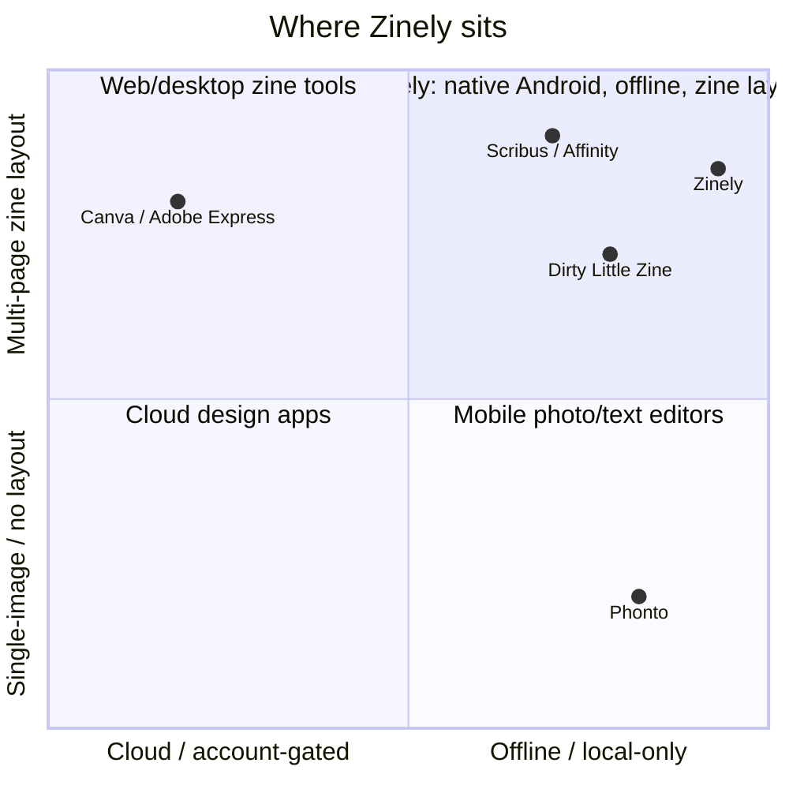
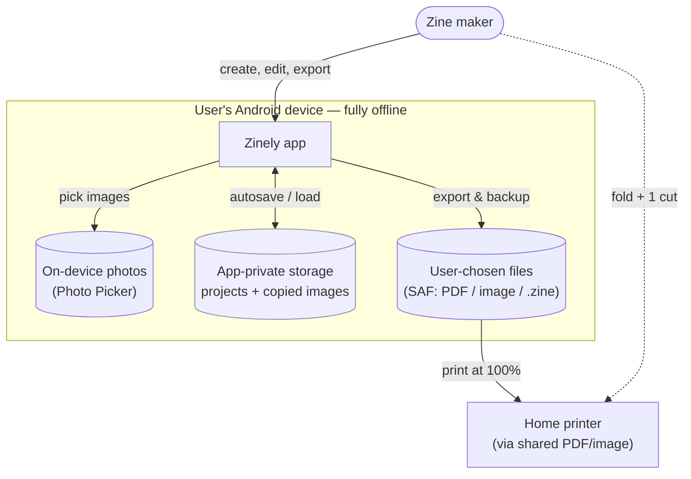
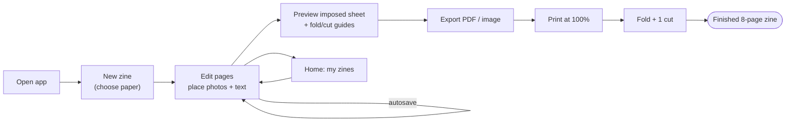
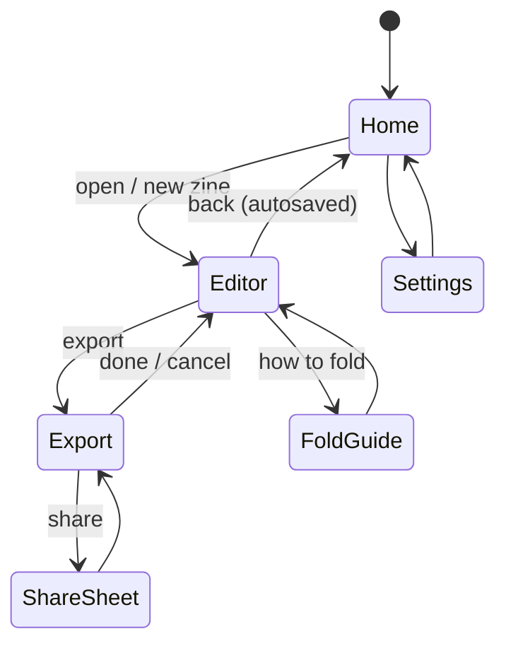

# Zinely — Product Requirements Document (PRD)

> **The single source of truth for product scope.** What we are building and why. *Every scope change is reflected here* (and any decision it implies is recorded in [DECISIONS.md](DECISIONS.md)). Technical "how" lives in [ARCHITECTURE.md](ARCHITECTURE.md); timing in [ROADMAP.md](ROADMAP.md); evidence in [RESEARCH.md](RESEARCH.md).

- **Status:** Draft v0.1 · 2026-06-19
- **Owner:** Architecture/Eng (Claude Code)
- **Platform:** Android · Kotlin · Jetpack Compose · Material 3

---

## 1. Vision

Zinely lets anyone turn photos and words into a **physical, printable zine** in minutes — entirely on their own device, with no account, no cloud, and no internet required. It pairs the zero-friction simplicity that makes mini-zines fun with a native, durable, privacy-first foundation that scales to serious zine-making.

> *Physical media instead of social media.*

## 2. Problem

Making a zine today forces a bad choice:
- **Web mini-zine tools** (e.g. Dirty Little Zine) are delightfully simple but web-bound: clumsy on mobile, no project persistence (a refresh can lose work), single format, no on-device editing. ([R3](RESEARCH.md#r3-comparable-products))
- **Desktop DTP** (Scribus, Affinity) is powerful but has a steep learning curve, no phone support, and is overkill for a casual zine. ([R3.2](RESEARCH.md#r32-landscape-summary))
- **Mobile design apps** (Canva, Adobe Express) are account-walled and cloud-first — your photos leave your device, and you often can't even start offline. ([R3.2](RESEARCH.md#r32-landscape-summary))

The core hard part of a zine — **imposition** (which panel goes where, at what rotation, so the folded sheet reads as a booklet) — is exactly what beginners can't do by hand and what these tools either hide or omit.

## 3. The opportunity (our wedge) — ✅ verified gap

No surveyed product occupies all four axes at once ([R3.3](RESEARCH.md#r33-synthesis--verified-gap--recommendation)):

**Zinely = offline-first + account-free/local-only + native Android phone + real zine layout.**

## 4. Target users

| Persona | Need | What Zinely gives them |
|---|---|---|
| Photographer | Hand out a little photo book | Fast photo→zine, print-ready export |
| Artist / illustrator | Physical art object | Layout + (later) on-device drawing |
| Writer / poet | Small-run printed words | Crisp vector text, typographic control |
| Student | Cheap, expressive project | Free, no account, works offline |
| Indie publisher | Repeatable small runs | Templates, durable projects, backup |
| Activist | Off-grid, private distribution | No cloud, no account, no tracking |

**MVP optimizes for the beginner first** (ADR-008) — everyone above benefits from a frictionless core; depth phases in.

## 5. Product principles (non-negotiable)

1. **Local-first / offline-first** — every core feature works in airplane mode.
2. **No account, ever, to create.**
3. **Photos never leave the device** — no upload, no remote processing.
4. **On-device PDF/image generation.**
5. **Durable by default** — autosave + crash recovery; user-owned backup ([DECISIONS ADR-009](DECISIONS.md#adr-009)).
6. **Honest claims** — "home-print-ready," not "commercial print-ready" ([ADR-002](DECISIONS.md#adr-002)).
7. **Simple first, powerful progressively** ([ADR-008](DECISIONS.md#adr-008)).

## 6. System context

**No node touches the network.** There is no backend.

## 7. Scope — MVP

### 7.1 In scope (MVP)
- **Format:** single-sheet **8-page** foldable mini-zine (one sheet, single-sided, one cut). ([R1](RESEARCH.md#r1-imposition-geometry--single-sheet-8-page-mini-zine))
- **Paper:** US **Letter** and **A4**.
- **Pages:** 8 logical pages; front/back cover + 6 interior.
- **Photo placement:** import via Photo Picker, place, move/resize/rotate, basic fit (fit/fill). Photos copied-in ([ADR-004](DECISIONS.md#adr-004)).
- **Text placement:** add/edit text, choose from bundled fonts, size/color/align.
- **Layouts:** per-page single / double / full options (à la DLZ).
- **Automatic imposition:** logical pages → correctly placed/rotated panels ([ADR-007](DECISIONS.md#adr-007)).
- **Export:** **PDF** (vector text) + **image** (PNG/JPG) at exact paper size; raster 300 DPI ([ADR-011](DECISIONS.md#adr-011)).
- **Print correctness:** safe-area, fold/cut guides, calibration ruler, "Actual size" guidance ([ADR-012](DECISIONS.md#adr-012)).
- **Projects:** create / open / duplicate / delete; thumbnails; autosave + crash recovery ([ADR-009](DECISIONS.md#adr-009)).
- **Undo/redo:** command-based, even in MVP ([ADR-005](DECISIONS.md#adr-005)).
- **Share:** via system share sheet (FileProvider).
- **Fold instructions:** in-app guide.

### 7.2 Explicitly OUT of MVP scope
Networking of any kind · accounts/auth · cloud/sync · commercial prepress (CMYK/ICC/PDF-X, bleed, crop marks) · multi-format impositions (16/32-page saddle-stitch) · drawing/stickers layer · custom font import · on-device filters/adjustments beyond crop · templates marketplace · analytics SDKs.
> These are deferred, not rejected — see [ROADMAP.md](ROADMAP.md). Any change here is a scope change and must update this section + an ADR.

## 8. Core user workflow (MVP)

## 9. Navigation map (MVP)

## 10. Functional requirements (MVP)

| ID | Requirement | Priority |
|---|---|---|
| FR-1 | Create a new zine choosing Letter or A4 | Must |
| FR-2 | Place, move, resize, rotate a photo on any page | Must |
| FR-3 | Add, edit, style text on any page | Must |
| FR-4 | Apply single/double/full layout per page | Should |
| FR-5 | Automatically impose 8 pages onto the sheet (correct order + rotation) | Must |
| FR-6 | Preview the imposed sheet with fold + cut guides + safe area | Must |
| FR-7 | Export a vector-text PDF at exact paper size | Must |
| FR-8 | Export a 300 DPI PNG/JPG | Must |
| FR-9 | Autosave continuously; recover after a crash | Must |
| FR-10 | List/open/duplicate/delete projects with thumbnails | Must |
| FR-11 | Undo/redo edits | Must |
| FR-12 | Share exported file via system share sheet | Must |
| FR-13 | Show fold/cut instructions + "print at 100%" guidance | Must |
| FR-14 | Operate fully offline with no account | Must |

## 11. Non-functional requirements

| ID | Requirement |
|---|---|
| NFR-1 | **Privacy:** no network calls; no photo leaves the device; no analytics in MVP |
| NFR-2 | **Offline:** all core features work in airplane mode |
| NFR-3 | **Performance:** editor interactions ≥ 60fps; export of one sheet completes without OOM on a 2 GB-heap device ([R2.6](RESEARCH.md#r26-raster-export-at-300-dpi--memory--verified)) |
| NFR-4 | **Durability:** no edit older than the autosave debounce is lost on crash; a crash never corrupts the last good save ([R4.3](RESEARCH.md#r43-crash-safety--verified)) |
| NFR-5 | **Fidelity:** preview matches export within tolerance (Roborazzi diff) ([ADR-006](DECISIONS.md#adr-006)) |
| NFR-6 | **Print accuracy:** at 100% scale, fold/cut geometry lands within tolerance on consumer printers ([ADR-012](DECISIONS.md#adr-012)) |
| NFR-7 | **Accessibility:** M3 touch targets, content descriptions, dynamic type (full pass in V1) |
| NFR-8 | **Min SDK 26** (assumption — confirm), target latest |

## 12. Success criteria (MVP)

- A first-time user produces a correctly-imposed, printed, folded 8-page zine in **under 10 minutes** without help.
- A printed test zine folds into correct reading order **1→8** every time (imposition correctness).
- Zero data-loss reports from crashes in dogfooding.
- Works with the network disabled end-to-end.

## 13. Open questions

| # | Question | Owner | Blocks |
|---|---|---|---|
| Q1 | minSdk 26 vs 24? | user | build setup |
| Q2 | Physical printer available for fold validation? (else rely on SVG proof sheet — [ADR-007](DECISIONS.md#adr-007)) | user | imposition validation |
| Q3 | Bundled font set (which OFL families)? | user/design | typography |
| Q4 | Brand/visual identity direction | user/design | UI theme |

> Resolving an open question that changes scope updates §7 and adds an ADR.
