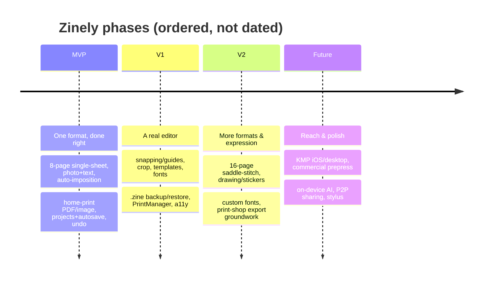
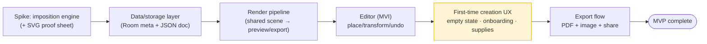

# Zinely — Roadmap

> **The single source of truth for phasing.** *Every roadmap change is reflected here.* Scope detail per phase lives in [PRD.md](PRD.md); the "how" in [ARCHITECTURE.md](ARCHITECTURE.md); rationale in [DECISIONS.md](DECISIONS.md). No dates are committed yet — phases are ordered, not scheduled.

- **Status:** Draft v0.1 · 2026-06-19

## Phase overview

## Guiding sequence

The build order inside every phase follows risk: **prove the riskiest, most isolatable thing first.** That is why the **imposition engine** (pure Kotlin, fully testable) is the first vertical spike — see [spikes/imposition-engine.md](spikes/imposition-engine.md) and [ADR-007](DECISIONS.md#adr-007).

> **Sequencing change (2026-06-28).** A repository UX audit confirmed the editor is
> *functionally* strong but *emotionally* intimidating for the beginner-first audience
> ([ADR-008](DECISIONS.md#adr-008)): it opens to a near-blank sheet, core actions hide behind
> gestures, and the chrome reads like generic productivity software. So a **first-time creation
> experience** milestone (`SUX`) is inserted **before** the export flow (S5): cozy empty state,
> contextual onboarding, a visible scrapbook supply tray, discoverable add-text/undo-redo, and
> "all 8 pages together." Rationale: export has no value if a first-time user never makes a page
> they want to print — *reduce intimidation before adding power*. The design SoT is
> [docs/design/DESIGN-LANGUAGE.md](design/DESIGN-LANGUAGE.md). S5 and the Room-backed project
> layer are unchanged in content, only resequenced after `SUX`.

### Journey-ordered build sequence (product design sprint, 2026-06-28)

A product design sprint produced the canonical blueprint — [DESIGN-LANGUAGE.md](design/DESIGN-LANGUAGE.md)
(hub), [VOICE.md](design/VOICE.md), [EXPERIENCE-MAP.md](design/EXPERIENCE-MAP.md),
[SCREEN-INVENTORY.md](design/SCREEN-INVENTORY.md), [DESIGN-RULES.md](design/DESIGN-RULES.md), and the
[HTML prototypes](design/mockups/index.html). Its core sequencing principle: **build the product in
the order a first-timer lives it** (the [emotional arc](design/EXPERIENCE-MAP.md#1-the-emotional-arc-target)),
not feature-by-feature, so each slice delivers a felt win that funds the next.

> **Why this order.** The two journey **peaks** are *first photo placed* (already unlocked) and
> *print & fold* (S5) — so `SUX` finishes making the *creation* moment delightful, then S5 delivers
> the *payoff*. **Welcome is decoupled** (Codex review): it is *not* Room-gated — it routes straight
> to the editor on the `"default"` project behind a local first-run flag, so it can ship early as
> part of the first-run experience. Only **Home/My-zines** is sequenced **with the Room project
> layer** (plus shelf thumbnails) — it has no value until there is more than one project to shelve,
> and it is off the critical path to the MVP "create **and** export one zine" exit.
> Stickers/templates remain V1 expression. Each screen's build readiness is tracked in
> [SCREEN-INVENTORY.md](design/SCREEN-INVENTORY.md#coverage-check-screen--milestone).
>
> ⚠️ **This is build *sequencing*; the Welcome-first first-run flow itself is a PRD-owned change
> that is *proposed, pending ratification* in [PRD §9](PRD.md#9-navigation-map-mvp)** (plus a
> navigation ADR amending [ADR-030](DECISIONS.md#adr-030)). The order here is what we build *if/when*
> that flow is approved; until then the [PRD navigation map](PRD.md#9-navigation-map-mvp) stays
> authoritative for the flow.

> **Status:** **S1–S4 are implemented and on `main`.** S1 imposition engine (pure-Kotlin `:core:model` + `:core:imposition`, 95 tests, milestone `v0.1.0-imposition-engine`); S2 persistence (`:core:data` contracts + pure-JVM `:core:data-storage` durability core/asset store + Android `:data-android` adapters); S3 render (`:core:render` pure tier + `:render-android` PDF/raster backends); S4 editor (`:core:editor` MVI core + `:feature:editor` interaction surface, now **mounted in `:app`** with interactive image import and autosave). Each was TDD'd and Codex-reviewed per increment.
>
> **What is NOT yet built**, despite the MVP scope below: production persistence is **file-only and single-project** — `data-android` ships a file-backed `DocumentRepository` writing `projects/<id>/document.json` on one fixed `"default"` project; **Room metadata, `ProjectRepository`, and the asset GC/sweeper are deferred** (no multi-project store yet). The render/**export backends exist** in `:render-android`, but there is **no user-facing export, share, print, or home/library flow** wired yet. **S5 (export flow) and the Room-backed project layer remain the next build steps.**

---

## MVP — "one great format, done right"
**Goal:** a beginner prints a correct 8-page zine in under 10 minutes, fully offline.

- 8-page single-sheet zine; Letter + A4.
- Photo placement (move/resize/rotate, fit/fill); text placement (bundled fonts, size/color/align).
- Single/double/full per-page layouts.
- Automatic imposition ([ADR-007](DECISIONS.md#adr-007)).
- Home-print-ready PDF (vector text) + 300 DPI image export ([ADR-001](DECISIONS.md#adr-001), [ADR-011](DECISIONS.md#adr-011)).
- Print correctness: safe area, fold/cut guides, calibration ruler, "Actual size" guidance ([ADR-012](DECISIONS.md#adr-012)).
- Projects: create/open/duplicate/delete, thumbnails.
- Autosave + crash recovery ([ADR-009](DECISIONS.md#adr-009)).
- Command-based undo/redo ([ADR-005](DECISIONS.md#adr-005)).
- Share via FileProvider; in-app fold instructions.

**Exit criteria:** all MVP functional requirements in [PRD §10](PRD.md#10-functional-requirements-mvp) pass; printed test zines fold to 1→8 reliably; no network calls; no crash data loss in dogfooding.

## V1 — "a real editor"
- Snapping / alignment guides ([R5.4](RESEARCH.md#r54-scene-model-hit-testing-snapping--verified--assumption)).
- On-device crop / rotate / basic adjustments (no remote processing).
- Templates & themes; richer typography; bundled font expansion.
- Page reorder / duplicate.
- **`.zine` backup & restore** via SAF ([ADR-009](DECISIONS.md#adr-009)).
- Android **PrintManager** in-app print path ([R2.3](RESEARCH.md#r23-system-print-framework--recommendation)).
- Calibration test sheet; thumbnails everywhere.
- Full accessibility pass; dark theme; Baseline Profile.

## V2 — "more formats & expression"
- Additional impositions: 4-page, **16-page saddle-stitch** (double-sided + binding guidance) — a distinct imposition family ([R1.7](RESEARCH.md#r17-variants--pitfalls--disputed--assumption)).
- Drawing / stickers / freehand layer.
- **Custom font import** (`.ttf`).
- **Print-shop export groundwork**: bleed, trim/crop marks, margins — still RGB ([ADR-002](DECISIONS.md#adr-002)).
- Multi-page spreads; batch export; grid/layers panel.
- Optional, explicit, user-initiated community sharing (network strictly opt-in).

## Future vision
- **KMP / Compose Multiplatform** (iOS + desktop) reusing the pure-Kotlin core.
- **Commercial prepress** (CMYK/ICC/PDF-X) via a real PDF engine — likely an off-device step, weighed against offline-first ([R2.7](RESEARCH.md#r27-third-party-pdf-libs--future)).
- On-device AI layout/auto-caption suggestions (privacy-preserving, no cloud).
- Peer-to-peer / Wi-Fi-Direct `.zine` sharing (no central server).
- Local template/plugin ecosystem; tablet + stylus first-class; print-shop partner export profiles.

---

## Change log
| Date | Change | Linked ADR / PRD |
|---|---|---|
| 2026-06-19 | Initial roadmap established | [PRD §7](PRD.md#7-scope--mvp) |
| 2026-06-19 | S1 imposition engine spike implemented (pure Kotlin, 95 tests, Codex-reviewed) | [ADR-007](DECISIONS.md#adr-007) |
| 2026-06-19 | S2 decision gate **cleared** — ADR-019…023 all Accepted (autosave, asset ownership/GC, fidelity); S2 implementation unblocked | [ADR-021](DECISIONS.md#adr-021), [ADR-022](DECISIONS.md#adr-022), [ADR-023](DECISIONS.md#adr-023) |
| 2026-06-19 | **S2A pure-Kotlin data core implemented** (`:core:data`: schema, serializer+migration, validation, repo/asset contracts; TDD, Codex-reviewed); ADR-015 resolved + ADR-020 amended | [ADR-015](DECISIONS.md#adr-015), [ADR-020](DECISIONS.md#adr-020), [spike §11](spikes/data-storage-layer.md#11-implementation-status--s2a-pure-kotlin-data-core-2026-06-19) |
| 2026-06-20 | **S2A merged** (PR #4); follow-ups: `minSdk 24` ratified, CI added (core JVM tests), S2B asset-GC race test plan documented | [ADR-024](DECISIONS.md#adr-024), [spike §9.1](spikes/data-storage-layer.md#91-mandatory-s2b-tests--asset-gc-race-closure-adr-022) |
| 2026-06-20 | **S2B kicked off** (PR #5 merged; ARCHITECTURE §15.5 drift reconciled). Layering set: pure-JVM `:core:data-storage` (durability/GC, CI-tested) + Android `:data-android` adapters; ADR-022 race closure re-anchored on pins+generation (mtime demoted to secondary guard) | [ADR-025](DECISIONS.md#adr-025), [ADR-022 amendment](DECISIONS.md#adr-022) |
| 2026-06-24 | **S3 `:core:render` design accepted + pure-JVM tier implemented** (Codex GO on design ×3 rounds and on code). Pure page→draw-command tape (only dep `:core:model`, 23 tests, TDD); image fit/crop via shared `computeImageBlit` with decoder-truth intrinsic (seam A); point-space shared `StaticLayout` text path. **Android parity backend tier (Roborazzi preview==export) still remains** — S3 not complete | [ADR-027](DECISIONS.md#adr-027), [spike](spikes/core-render.md) |
| 2026-06-24 | **S3 Android backend tier design accepted — ADR-028** (Codex GO-WITH-FIXES ×2, repo-validated, all reconciled). New gated `:render-android` module; one `CanvasReplayer` + two canvas providers; PDF draws in PostScript points (separate raster scale); crop-aware region decode; bundled self-covering MVP-charset fonts; Robolectric-NATIVE Roborazzi multi-scale **raw-`CanvasReplayer` raster/PDF parity goldens** (Compose preview-host parity owed by S4). **Design only — `:render-android` not scaffolded; S3 still incomplete until the G1–G6 build lands** | [ADR-028](DECISIONS.md#adr-028), [spike](spikes/core-render-android-backend.md) |
| 2026-06-25 | **S3 Android backend tier BUILT + MERGED** (`:render-android`, G1–G6): one `CanvasReplayer` + two export providers, point-space `SharedTextLayout`, crop-aware `ImageBlitter`, bundled **Inter** (MVP charset + cmap coverage guard). Roborazzi raster + text parity goldens are **headless-CI-gated**; image + PDF write/parity proofs run on-device (compile-checked in CI). Closes S3 raster+PDF parity (Compose preview-host parity proven in S4 Step 1). | [ADR-028](DECISIONS.md#adr-028), [spike](spikes/core-render-android-backend.md) |
| 2026-06-25 | **S4 Step 1 preview host + pure `:core:editor` MVI merged.** PR #19: stateless `PagePreview` Compose `drawIntoCanvas` host over the same `CanvasReplayer`, `preview == export` proven headless (discharges Codex Required-fix C). PR #20: pure **`:core:editor`** reducer — `EditorModel`/`Intent`/`EditorReducer`/`HitTest`/`Snap`/`Command`, 43 pure-JVM tests; **ADR-029 Accepted**. | [ADR-029](DECISIONS.md#adr-029), [spike](spikes/s4-editor-mvi.md) |
| 2026-06-26 | **S4 `:feature:editor` interaction surface MERGED** (PR #21 — 10 increments, each Codex-reviewed): store + effect runner, gesture pipeline, selection chrome + live document-order preview, opposite-anchor resize, live snap guides (preview==commit), a11y contextbar + element semantics (WCAG 2.5.7), race-safe text-edit session, host `EditorScreen`, and **selection-chrome Roborazzi goldens** (CI-gated). **Editor not yet wired into `:app` navigation** — that + `pageSizePt`/image-pipeline/autosave-binder at the app/DI layer is the next step. | [ADR-029](DECISIONS.md#adr-029), [spike §10.10–§10.11](spikes/s4-editor-mvi.md) |
| 2026-06-27 | **S4 editor mounted in `:app`** (PR #23): single-Activity `ZinelyNavHost` on a fixed `"default"` project, `EditorViewModel`/`EditorBootstrap` (seed-on-miss + imposition-derived page size), autosave binder, and content-addressed asset store + interactive image import. | [ADR-030](DECISIONS.md#adr-030), [ADR-031](DECISIONS.md#adr-031) |
| 2026-06-28 | **Doc-truthfulness reconciliation** (Codex onboarding review GO-WITH-FIXES): corrected stale "no app UI / S2B-next" status and persistence/export overstatement across `README.md`, `ARCHITECTURE.md`, `ROADMAP.md`; aligned `AssetStore`/`core:data-storage` GC comments with the deferred-sweeper reality. No code behavior changed. | [review](reviews/2026-06-27-onboarding-review-claude-brief.md) |
| 2026-06-28 | **Editor UI foundation** (`v0.4.0`): scrapbook page navigator (all 8 pages reachable, `Intent.GoToPage`) + zine "workbench" theme replacing the default template; design SoT seeded. | [ADR-008](DECISIONS.md#adr-008), [design](design/editor-visual-direction.md) |
| 2026-06-28 | **Sequencing change → first-time creation UX milestone (`SUX`)** inserted before export (S5), per a UX audit; project versioning adopted (SemVer 0.y per milestone) + `CHANGELOG.md` added. | [ADR-008](DECISIONS.md#adr-008), [DESIGN-LANGUAGE](design/DESIGN-LANGUAGE.md), [CHANGELOG](../CHANGELOG.md) |
| 2026-06-28 | **Product design sprint** — full set of design references authored (design hub + voice, experience map, screen inventory, design rules, 11 HTML prototypes); build resequenced **journey-order** within `SUX`/S5; **Welcome decoupled** (first-run flag, not Room-gated), **only Home/My-zines bound to the Room project layer**; architectural implications flagged for ADRs. No production UI changed. | [DESIGN-LANGUAGE](design/DESIGN-LANGUAGE.md), [EXPERIENCE-MAP](design/EXPERIENCE-MAP.md), [ARCHITECTURE §15.6](ARCHITECTURE.md) |

> When phase contents change, add a row here and update the affected phase section + any new [ADR](DECISIONS.md).

## Version milestones (SemVer)

Pre-1.0, the minor version tracks completed vertical-slice milestones; `1.0.0` ships at MVP
exit. Full history in [CHANGELOG.md](../CHANGELOG.md).

| Version | Milestone | State |
|---|---|---|
| `0.1.0` | S1 — imposition engine | ✅ tagged `v0.1.0-imposition-engine` |
| `0.2.0` | S2 — persistence (file-only) | ✅ on `main` |
| `0.3.0` | S3 — rendering pipeline | ✅ on `main` |
| `0.4.0` | S4 — editor foundation + UI foundation | ✅ on `main` — **tag the page-navigator/theme commit** (the foundation), not later `SUX` work |
| `0.5.0` | `SUX` — first-time creation experience (empty state shipped first) | 🔭 current milestone |
| `0.6.0`+ | S5 — export/share + Room project layer | 🔭 then |
| `1.0.0` | MVP — create **and** export a zine | 🔭 exit criteria |
