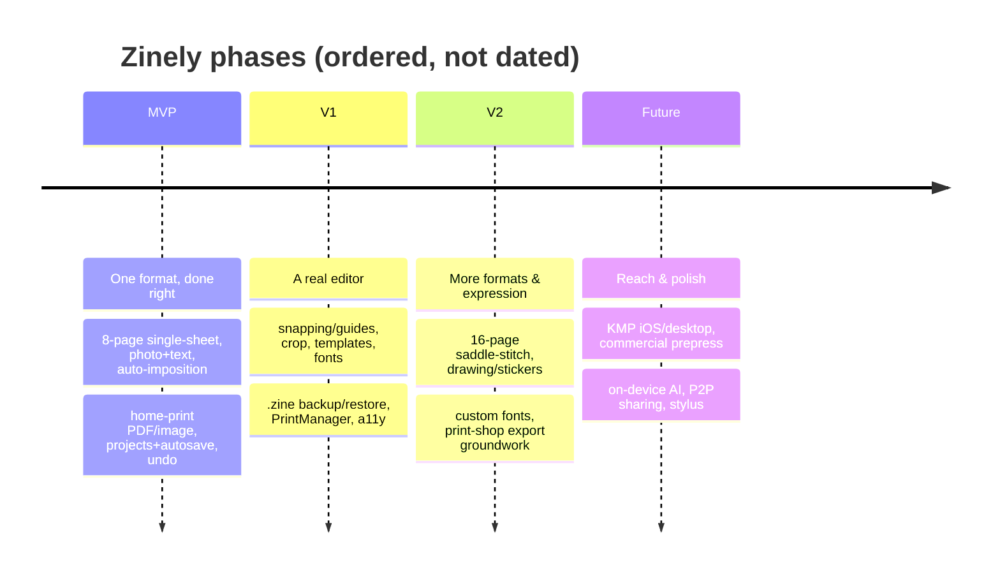
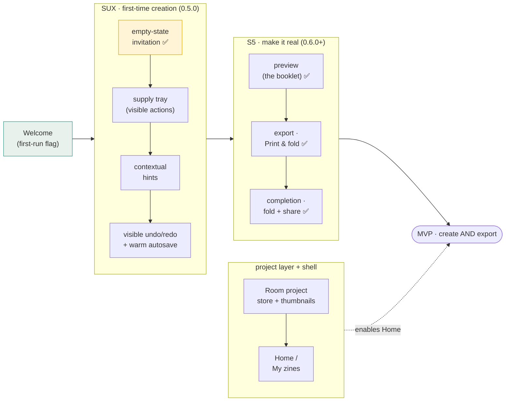

# Zinely — Roadmap

> **The single source of truth for phasing.** *Every roadmap change is reflected here.* Scope detail per phase lives in [PRD.md](PRD.md); the "how" in [ARCHITECTURE.md](ARCHITECTURE.md); rationale in [DECISIONS.md](DECISIONS.md). No dates are committed yet — phases are ordered, not scheduled.

- **Status:** Draft v0.1 · 2026-06-19

## Phase overview

## Guiding sequence

The build order inside every phase follows risk: **prove the riskiest, most isolatable thing first.** That is why the **imposition engine** (pure Kotlin, fully testable) is the first vertical spike — see [spikes/imposition-engine.md](spikes/imposition-engine.md) and [ADR-007](DECISIONS.md#adr-007).

> **Sequencing change (2026-06-28).** A repository UX audit confirmed the editor is
> *functionally* strong but *emotionally* intimidating for the beginner-first audience
> ([ADR-008](DECISIONS.md#adr-008)): it opens to a near-blank sheet, core actions hide behind
> gestures, and the chrome reads like generic productivity software. So a **first-time creation
> experience** milestone (`SUX`) is inserted **before** the export flow (S5): cozy empty state,
> contextual onboarding, a visible scrapbook supply tray, discoverable add-text/undo-redo, and
> "all 8 pages together." Rationale: export has no value if a first-time user never makes a page
> they want to print — *reduce intimidation before adding power*. The design references are anchored
> by [docs/design/DESIGN-LANGUAGE.md](design/DESIGN-LANGUAGE.md) (companion references under the
> canonical doc system in [CLAUDE.md](../CLAUDE.md)). S5 and the Room-backed project
> layer are unchanged in content, only resequenced after `SUX`.

### Journey-ordered build sequence (product design sprint, 2026-06-28)

A product design sprint produced the canonical blueprint — [DESIGN-LANGUAGE.md](design/DESIGN-LANGUAGE.md)
(hub), [VOICE.md](design/VOICE.md), [EXPERIENCE-MAP.md](design/EXPERIENCE-MAP.md),
[SCREEN-INVENTORY.md](design/SCREEN-INVENTORY.md), [DESIGN-RULES.md](design/DESIGN-RULES.md), and the
[HTML prototypes](design/mockups/index.html). Its core sequencing principle: **build the product in
the order a first-timer lives it** (the [emotional arc](design/EXPERIENCE-MAP.md#1-the-emotional-arc-target)),
not feature-by-feature, so each slice delivers a felt win that funds the next.

> **Why this order.** The two journey **peaks** are *first photo placed* (already unlocked) and
> *print & fold* (S5) — so `SUX` finishes making the *creation* moment delightful, then S5 delivers
> the *payoff*. **Welcome is decoupled** (Codex review): it is *not* Room-gated — it routes straight
> to the editor on the `"default"` project behind a local first-run flag, so it can ship early as
> part of the first-run experience. Only **Home/My-zines** is sequenced **with the Room project
> layer** (plus shelf thumbnails) — it has no value until there is more than one project to shelve,
> and it is off the critical path to the MVP "create **and** export one zine" exit.
> Stickers/templates remain V1 expression. Each screen's build readiness is tracked in
> [SCREEN-INVENTORY.md](design/SCREEN-INVENTORY.md#coverage-check-screen--milestone).
>
> ⚠️ **This is build *sequencing*; the Welcome-first first-run flow itself is a PRD-owned change
> that is *proposed, pending ratification* in [PRD §9](PRD.md#9-navigation-map-mvp)** (plus a
> navigation ADR amending [ADR-030](DECISIONS.md#adr-030)). The order here is what we build *if/when*
> that flow is approved; until then the [PRD navigation map](PRD.md#9-navigation-map-mvp) stays
> authoritative for the flow.

> **Status:** **S1–S4 are implemented and on `main`.** S1 imposition engine (pure-Kotlin `:core:model` + `:core:imposition`, 95 tests, milestone `v0.1.0-imposition-engine`); S2 persistence (`:core:data` contracts + pure-JVM `:core:data-storage` durability core/asset store + Android `:data-android` adapters); S3 render (`:core:render` pure tier + `:render-android` PDF/raster backends); S4 editor (`:core:editor` MVI core + `:feature:editor` interaction surface, now **mounted in `:app`** with interactive image import and autosave). Each was TDD'd and Codex-reviewed per increment.
>
> **Post-S4 tracks:** the S5 export/share flow is complete, and **S6.1 landed the Room-backed `ProjectRepository`** ([ADR-042](DECISIONS.md#adr-042)) — a real, observable multi-project metadata store in `:data-android` (files remain the source of truth; the S4 `"default"` seed is adopted as an ordinary row) — and **S6.2 built the read-only Home/My-zines shelf** ([ADR-043](DECISIONS.md#adr-043)) — `HomeScreen` + `HomeViewModel` over `observeProjects()`, fully tested — and **S6.3 added the shelf actions** ([ADR-044](DECISIONS.md#adr-044)): create/rename/duplicate/undoable-delete behind the ADR-042 open-editor exclusion, now enforced **inside the repository** (`ProjectSessionGate` → `DataError.Busy`). **S6.4 added page-1 card thumbnails** ([ADR-045](DECISIONS.md#adr-045)) through the shared render parity path, and **S6.5 wired Home in and re-rooted navigation** ([ADR-046](DECISIONS.md#adr-046)): `HomeRoute` is the start destination and single back-stack root, the `"default"` seed-on-miss is retired (first run lands on the Empty-shelf CTA; a missing project is an honest boot error), and a fast reopen awaits the single-writer release through the shared session-gate policy. **The S6 multi-project & Home track is complete.** The **asset GC/sweeper remains deferred** ([ADR-031](DECISIONS.md#adr-031) §2 — blocked until imports pin).
>
> **Compose V1 parity re-skin track (2026-07-08 →, branch `feat/m0-design-system`, not yet merged).** The three V1 surfaces are DESIGN-FROZEN as an HTML trilogy (Shelf/Bench/Proof) and are being re-skinned onto the shipped `v0.6.0-alpha.1` app — a **re-skin, not a rebuild**; behaviour (nav / MVI / ViewModels / Hilt / a11y mirror / render parity) is invariant. Execution order and shape live in [COMPOSE-V1-PARITY-PLAN.md](COMPOSE-V1-PARITY-PLAN.md) (a planning artifact, not scope authority). Milestones: **M0 design-system ✅** ([ADR-048](DECISIONS.md#adr-048)), **M1 shared components ✅** ([ADR-049](DECISIONS.md#adr-049)), **M2 Shelf ✅**, **M3 Bench ✅** (M2/M3 are pure reskins — no ADR); **M4 imposition-truth checkpoint** — reshaped by the [2026-07-11 reconciliation](reviews/2026-07-11-m0-m3-reconciliation.md) to **fold into M5** (its derive-and-guard core already shipped pre-plan in S7.2); **M5 Proof (the Fold) ✅ complete** — batched in [m5-proof-batching.md](spikes/m5-proof-batching.md) (B1→B5), all landed ([ADR-051](DECISIONS.md#adr-051)): the former Preview/Export/Completion triad collapses into one 3-act `ProofRoute`/`ProofScreen`, the reading-order reader-booklet is retired as superseded by the imposed-sheet-first Proof, Act 1 renders the engine-ordered imposed sheet (`decorativeImpositionRows` relocated into the Proof, drift guard extended — no raw imposition array in Compose), Act 2 is the honest print recipe with a two-action export row (the in-app Print action dropped, [ADR-052](DECISIONS.md#adr-052)), and Act 3 is the five-step fold guide + the staged finished-book climax (cover-close → settle → shelf-line → words → exits in timed beats, the `success` haptic, a reduced-motion path that jumps straight to the finished state). **B5 retired the three legacy screens/routes/tests** (only code proven unreachable) and sealed the surface with the recoverable export-error overlay + the ADR-041 "Fold now" post-export hand-off (loading-sweep/empty/toast overlays are documented deferrals — prototype-simulated states with no wired data signal). **M6 full-app sign-off** remains. The frozen Proof imposed-sheet illustration was corrected to the engine as a recorded freeze amendment ([ADR-050](DECISIONS.md#adr-050)). All of M0–M3 plus M5 is committed on `feat/m0-design-system` and **not yet on `main`**.

---

## MVP — "one great format, done right"
**Goal:** a beginner prints a correct 8-page zine in under 10 minutes, fully offline.

- 8-page single-sheet zine; Letter + A4.
- Photo placement (move/resize/rotate, fit/fill); text placement (bundled fonts, size/color/align).
- Single/double/full per-page layouts.
- Automatic imposition ([ADR-007](DECISIONS.md#adr-007)).
- Home-print-ready PDF (vector text) + 300 DPI image export ([ADR-001](DECISIONS.md#adr-001), [ADR-011](DECISIONS.md#adr-011)).
- Print correctness: safe area, fold/cut guides, calibration ruler, "Actual size" guidance ([ADR-012](DECISIONS.md#adr-012)).
- Projects: create/open/duplicate/delete, thumbnails.
- Autosave + crash recovery ([ADR-009](DECISIONS.md#adr-009)).
- Command-based undo/redo ([ADR-005](DECISIONS.md#adr-005)).
- Share via FileProvider; in-app fold instructions.

**Exit criteria:** all MVP functional requirements in [PRD §10](PRD.md#10-functional-requirements-mvp) pass; printed test zines fold to 1→8 reliably; no network calls; no crash data loss in dogfooding.

## V1 — "a real editor"
- Snapping / alignment guides ([R5.4](RESEARCH.md#r54-scene-model-hit-testing-snapping--verified--assumption)).
- On-device crop / rotate / basic adjustments (no remote processing).
- Templates & themes; richer typography; bundled font expansion.
- Page reorder / duplicate.
- **`.zine` backup & restore** via SAF ([ADR-009](DECISIONS.md#adr-009)).
- Android **PrintManager** in-app print path ([R2.3](RESEARCH.md#r23-system-print-framework--recommendation)).
- Calibration test sheet; thumbnails everywhere.
- Full accessibility pass; dark theme; Baseline Profile.

## V2 — "more formats & expression"
- Additional impositions: 4-page, **16-page saddle-stitch** (double-sided + binding guidance) — a distinct imposition family ([R1.7](RESEARCH.md#r17-variants--pitfalls--disputed--assumption)).
- Drawing / stickers / freehand layer.
- **Custom font import** (`.ttf`).
- **Print-shop export groundwork**: bleed, trim/crop marks, margins — still RGB ([ADR-002](DECISIONS.md#adr-002)).
- Multi-page spreads; batch export; grid/layers panel.
- Optional, explicit, user-initiated community sharing (network strictly opt-in).

## Future vision
- **KMP / Compose Multiplatform** (iOS + desktop) reusing the pure-Kotlin core.
- **Commercial prepress** (CMYK/ICC/PDF-X) via a real PDF engine — likely an off-device step, weighed against offline-first ([R2.7](RESEARCH.md#r27-third-party-pdf-libs--future)).
- On-device AI layout/auto-caption suggestions (privacy-preserving, no cloud).
- Peer-to-peer / Wi-Fi-Direct `.zine` sharing (no central server).
- Local template/plugin ecosystem; tablet + stylus first-class; print-shop partner export profiles.
- **First-class in-app print** (Android `PrintManager`) with an actual-size / no-fit-to-page path that honours the fold — deferred from V1 with its own ADR + batch ([ADR-052](DECISIONS.md#adr-052)); V1 ships Save PDF + Share instead.

---

## Change log
| Date | Change | Linked ADR / PRD |
|---|---|---|
| 2026-06-19 | Initial roadmap established | [PRD §7](PRD.md#7-scope--mvp) |
| 2026-06-19 | S1 imposition engine spike implemented (pure Kotlin, 95 tests, Codex-reviewed) | [ADR-007](DECISIONS.md#adr-007) |
| 2026-06-19 | S2 decision gate **cleared** — ADR-019…023 all Accepted (autosave, asset ownership/GC, fidelity); S2 implementation unblocked | [ADR-021](DECISIONS.md#adr-021), [ADR-022](DECISIONS.md#adr-022), [ADR-023](DECISIONS.md#adr-023) |
| 2026-06-19 | **S2A pure-Kotlin data core implemented** (`:core:data`: schema, serializer+migration, validation, repo/asset contracts; TDD, Codex-reviewed); ADR-015 resolved + ADR-020 amended | [ADR-015](DECISIONS.md#adr-015), [ADR-020](DECISIONS.md#adr-020), [spike §11](spikes/data-storage-layer.md#11-implementation-status--s2a-pure-kotlin-data-core-2026-06-19) |
| 2026-06-20 | **S2A merged** (PR #4); follow-ups: `minSdk 24` ratified, CI added (core JVM tests), S2B asset-GC race test plan documented | [ADR-024](DECISIONS.md#adr-024), [spike §9.1](spikes/data-storage-layer.md#91-mandatory-s2b-tests--asset-gc-race-closure-adr-022) |
| 2026-06-20 | **S2B kicked off** (PR #5 merged; ARCHITECTURE §15.5 drift reconciled). Layering set: pure-JVM `:core:data-storage` (durability/GC, CI-tested) + Android `:data-android` adapters; ADR-022 race closure re-anchored on pins+generation (mtime demoted to secondary guard) | [ADR-025](DECISIONS.md#adr-025), [ADR-022 amendment](DECISIONS.md#adr-022) |
| 2026-06-24 | **S3 `:core:render` design accepted + pure-JVM tier implemented** (Codex GO on design ×3 rounds and on code). Pure page→draw-command tape (only dep `:core:model`, 23 tests, TDD); image fit/crop via shared `computeImageBlit` with decoder-truth intrinsic (seam A); point-space shared `StaticLayout` text path. **Android parity backend tier (Roborazzi preview==export) still remains** — S3 not complete | [ADR-027](DECISIONS.md#adr-027), [spike](spikes/core-render.md) |
| 2026-06-24 | **S3 Android backend tier design accepted — ADR-028** (Codex GO-WITH-FIXES ×2, repo-validated, all reconciled). New gated `:render-android` module; one `CanvasReplayer` + two canvas providers; PDF draws in PostScript points (separate raster scale); crop-aware region decode; bundled self-covering MVP-charset fonts; Robolectric-NATIVE Roborazzi multi-scale **raw-`CanvasReplayer` raster/PDF parity goldens** (Compose preview-host parity owed by S4). **Design only — `:render-android` not scaffolded; S3 still incomplete until the G1–G6 build lands** | [ADR-028](DECISIONS.md#adr-028), [spike](spikes/core-render-android-backend.md) |
| 2026-06-25 | **S3 Android backend tier BUILT + MERGED** (`:render-android`, G1–G6): one `CanvasReplayer` + two export providers, point-space `SharedTextLayout`, crop-aware `ImageBlitter`, bundled **Inter** (MVP charset + cmap coverage guard). Roborazzi raster + text parity goldens are **headless-CI-gated**; image + PDF write/parity proofs run on-device (compile-checked in CI). Closes S3 raster+PDF parity (Compose preview-host parity proven in S4 Step 1). | [ADR-028](DECISIONS.md#adr-028), [spike](spikes/core-render-android-backend.md) |
| 2026-06-25 | **S4 Step 1 preview host + pure `:core:editor` MVI merged.** PR #19: stateless `PagePreview` Compose `drawIntoCanvas` host over the same `CanvasReplayer`, `preview == export` proven headless (discharges Codex Required-fix C). PR #20: pure **`:core:editor`** reducer — `EditorModel`/`Intent`/`EditorReducer`/`HitTest`/`Snap`/`Command`, 43 pure-JVM tests; **ADR-029 Accepted**. | [ADR-029](DECISIONS.md#adr-029), [spike](spikes/s4-editor-mvi.md) |
| 2026-06-26 | **S4 `:feature:editor` interaction surface MERGED** (PR #21 — 10 increments, each Codex-reviewed): store + effect runner, gesture pipeline, selection chrome + live document-order preview, opposite-anchor resize, live snap guides (preview==commit), a11y contextbar + element semantics (WCAG 2.5.7), race-safe text-edit session, host `EditorScreen`, and **selection-chrome Roborazzi goldens** (CI-gated). **Editor not yet wired into `:app` navigation** — that + `pageSizePt`/image-pipeline/autosave-binder at the app/DI layer is the next step. | [ADR-029](DECISIONS.md#adr-029), [spike §10.10–§10.11](spikes/s4-editor-mvi.md) |
| 2026-06-27 | **S4 editor mounted in `:app`** (PR #23): single-Activity `ZinelyNavHost` on a fixed `"default"` project, `EditorViewModel`/`EditorBootstrap` (seed-on-miss + imposition-derived page size), autosave binder, and content-addressed asset store + interactive image import. | [ADR-030](DECISIONS.md#adr-030), [ADR-031](DECISIONS.md#adr-031) |
| 2026-06-28 | **Doc-truthfulness reconciliation** (Codex onboarding review GO-WITH-FIXES): corrected stale "no app UI / S2B-next" status and persistence/export overstatement across `README.md`, `ARCHITECTURE.md`, `ROADMAP.md`; aligned `AssetStore`/`core:data-storage` GC comments with the deferred-sweeper reality. No code behavior changed. | [review](reviews/2026-06-27-onboarding-review-claude-brief.md) |
| 2026-06-28 | **Editor UI foundation** (`v0.4.0`): scrapbook page navigator (all 8 pages reachable, `Intent.GoToPage`) + zine "workbench" theme replacing the default template; design references seeded. | [ADR-008](DECISIONS.md#adr-008), [design](design/editor-visual-direction.md) |
| 2026-06-28 | **Sequencing change → first-time creation UX milestone (`SUX`)** inserted before export (S5), per a UX audit; project versioning adopted (SemVer 0.y per milestone) + `CHANGELOG.md` added. | [ADR-008](DECISIONS.md#adr-008), [DESIGN-LANGUAGE](design/DESIGN-LANGUAGE.md), [CHANGELOG](../CHANGELOG.md) |
| 2026-06-28 | **Product design sprint** — full set of design references authored (design hub + voice, experience map, screen inventory, design rules, 11 HTML prototypes); build resequenced **journey-order** within `SUX`/S5; **Welcome decoupled** (first-run flag, not Room-gated), **only Home/My-zines bound to the Room project layer**; architectural implications flagged for ADRs. No production UI changed. | [DESIGN-LANGUAGE](design/DESIGN-LANGUAGE.md), [EXPERIENCE-MAP](design/EXPERIENCE-MAP.md), [ARCHITECTURE §15.6](ARCHITECTURE.md) |
| 2026-06-29 | **`SUX` editor UI slices** (`:feature:editor`): cozy first-run **empty-state** invitation, then the scrapbook **supply tray** — Add a photo / Add words / Undo / Redo as visible thumb-zone supplies, undo/redo bound to `canUndo`/`canRedo`. The app-level lone "Add image" FAB removed from `ZinelyNavHost`. UI/UX only — no `:core`, schema, render, or export change. | [editor brief §6](design/editor-visual-direction.md), [DESIGN-RULES](design/DESIGN-RULES.md) |
| 2026-07-01 | **S5 step 1 — reader's-booklet Preview screen** (`:feature:editor` `PreviewScreen` + `:app` `PreviewRoute`/`PreviewDestination`): pages the document in **reading order** (not the imposition sheet) via the existing `SceneRenderer` → `PagePreview` path; prev/next + dots + "page N of M"; primary **Print & fold** (stubbed "coming soon" until export) + secondary back-to-editing. Reached from a top "Preview" entry on the editor; the preview host **shares the editor's `EditorViewModel`** (via its back-stack entry) so it never spins up a second single-writer VM. No `:core`/schema/render/export change. Codex-reviewed (1 Required Fix — preview `Error`-boot branch — reconciled). | [SCREEN-INVENTORY §Preview](design/SCREEN-INVENTORY.md#preview), [ADR-026](DECISIONS.md#adr-026), [ADR-030](DECISIONS.md#adr-030) |
| 2026-07-01 | **S5 step 2 — Export · Print & fold** (real export). New `:render-android` `SheetComposer` composites all 8 imposed panels onto ONE sheet over the shared `CanvasReplayer` (the multi-panel path ADR-028 implied) → a vector **PDF** + a 300 DPI **PNG**; a `:app` `ZineExporter` runs Imposer + `SceneRenderer` + composer off-main, writes a uniquely-named `cacheDir` file, and shares it as a `FileProvider` `content://` URI. `ExportScreen` (jargon-free, "Actual size" note, PDF-primary/PNG-secondary) replaces Preview's Print & fold stub via a new shared-VM `ExportRoute`; fold/cut guides drawn on the sheet. **On-sheet calibration ruler deferred with cause** (edge-to-edge tiling leaves no margin). Codex-reviewed (3 findings folded in: overlay seam for guides, unique filenames vs stale URIs, `OutputStream` streaming). | [ADR-039](DECISIONS.md#adr-039), [SCREEN-INVENTORY §Export](design/SCREEN-INVENTORY.md#export--print--fold) |
| 2026-07-01 | **S5 step 3 — Completion · fold-steps** (the payoff peak). New `:feature:editor` `CompletionScreen` (celebratory hero + four **static**, never-assumed fold diagrams + **Send to a friend** / **Open it** / **Keep editing**), hosted by `:app` `CompletionDestination` over the **shipped ADR-039 export seam** — no parallel path: both actions re-render the current document via the same `ExportViewModel`, and the host maps the one finished-file event to `ACTION_SEND` (chooser) or `ACTION_VIEW` (+`ClipData`, transient grant, `ActivityNotFoundException`→Toast). The VM's event is made **delivery-agnostic** (`ShareRequest`→`ExportReady`); the host owns share-vs-open. Replaces Export's fold-help Toast stub (`onFoldHelp` → `CompletionRoute`). **Auto post-export landing deferred** (would alter the green step-2 share flow); "Keep editing" is the honest "make another" until multi-project. Static → reduced-motion-safe. Codex-reviewed (neutral VM event, `ClipData`, honest offline copy, "Keep editing" rename — all folded in). | [ADR-040](DECISIONS.md#adr-040), [SCREEN-INVENTORY §Completion](design/SCREEN-INVENTORY.md#completion--fold-steps) |

| 2026-07-02 | **S5 step 4 — auto post-export landing** (flow-coherence gap closed). `ExportDestination`'s `ready` collector, after dispatching the ADR-039 share chooser, navigates to `CompletionRoute` (`launchSingleTop`) — **additive** to the shipped share flow (chooser still fires once; Completion's own `ExportViewModel` stays `Idle` until a tap, so no re-export/double-share). Resolves the ADR-040 "auto post-export landing" deferral; both the auto path and Export's manual "How do I fold it?" now converge on Completion. Host nav glue → **manual QA / instrumented back-stack test pending** (per ADR-039/040; no host-nav unit test in `:app`). Compile + `:app` unit tests green; Codex design-reviewed (`GO-WITH-FIXES`: testing wording narrowed to match actual coverage; `launchSingleTop` folded in). | [ADR-041](DECISIONS.md#adr-041) |
| 2026-07-02 | **S6.1 — Room-backed `ProjectRepository`** (data layer only; first slice of S6 multi-project & Home). New in `:data-android`: `projects` Room table (v1, schema exported) as a **rebuildable index** — the files are the source of truth (`document.json` per ADR-003 + a new per-project **`meta.json` sidecar** owning title/createdAt, atomic via `AtomicFileStore`); an idempotent **reconcile scan** adopts the S4 on-disk `"default"` seed as an ordinary row (no destructive migration — `EditorRoute("default")` unchanged) and drops rows without files; create/rename/duplicate/delete commit file state first and re-derive the row via one `syncRowFromDisk` path; recency = `max(row, document mtime)` at read; **GC live-roots by construction** (duplicate = new document over the same content hashes; delete = document removal releases roots; **no sweeper shipped** — ADR-031 §2 intact); shared `ProjectPaths` traversal chokepoint extracted from `DocumentRepositoryImpl`. No Home UI, no nav change, no thumbnails (S6.2–S6.5). TDD: Robolectric + in-memory Room against the real file stack (20 + 3 new tests, incl. fault-injected ADR-042 §5 failure paths — meta-write cleanup on create/duplicate, post-commit index-failure convergence; `:data-android` 125 green). Codex-reviewed (first pass NO-GO → 5 Required Fixes reconciled → **GO-WITH-FIXES**). Merged as [PR #42](https://github.com/aritr-codes/zinely-android/pull/42). | [ADR-042](DECISIONS.md#adr-042) |
| 2026-07-02 | **S6.2 — Home · "My zines" read-only shelf (built-but-unwired)**. New stateless `HomeScreen` in `:feature:editor` (paper-card list: title, "8-page mini · Letter/A4", warm "Edited …" recency computed by a pure `editedLabel`; CTA-less empty-state invitation — the Start-a-zine button IS the S6.3 create action, so its absence is a named temporary deviation from [SCREEN-INVENTORY §Home](design/SCREEN-INVENTORY.md#home--my-zines)) + MVVM `HomeViewModel` in `:app` over `ProjectRepository.observeProjects()` (order passed through — newest-first is the ADR-042 §7 contract). **No nav change** (Codex Required Fix): no Home route is registered — a Home route inside the editor-rooted graph would encode the `default → Home → default` second-VM path ADR-026 forbids; wiring lands with the S6.5 back-stack policy. Both ADR-042 hard invariants hold: start destination byte-for-byte unchanged, zero mutation affordances (asserted structurally by `hasClickAction()` counts). TDD: 9 `HomeViewModelTest` + 5 `HomeScreenTest`, plus full `:feature:editor` / `:app` suites green. Codex-reviewed (**GO-WITH-FIXES** → 2 Required Fixes reconciled). | [ADR-043](DECISIONS.md#adr-043) |
| 2026-07-03 | **S6.3 — Home shelf actions (testable-only until S6.5)**. The [SCREEN-INVENTORY §Home](design/SCREEN-INVENTORY.md#home--my-zines) actions land on the S6.2 shelf: **Start a zine** (empty-state CTA restored — the ADR-043 §5 deviation ends — plus a content-shelf FAB; one tap creates "My zine" · `SINGLE_SHEET_8` · `LETTER`, matching the bootstrap seed), per-card overflow **Rename** (gentle dialog, blank disabled, VM trims), **Duplicate**, and confirm-less **undoable Delete** (card hides instantly; a queued `HomeShelfEvent.DeletePrompt` drives one snackbar per delete — Undo unhides with no store call, dismissal commits `deleteProject`, a failed commit unhides + warm message; store-empty = `Empty`, pending-filtered = zero-card `Content`). The **ADR-042 open-editor exclusion is enforced inside `RoomProjectRepository`** (stronger than the shelf-layer assignment): a `ProjectSessionGate` over the autosave registry's new by-id `awaitReleased` (ADR-030 Rec1 realised) gates rename/delete targets + duplicate source before the mutex; a session live at the 5 s bound refuses with the new **`DataError.Busy`** ("still saving" copy, never a scary failure). **Nav untouched** — Home stays unwired; every action is reachable only in tests; S6.5 must move the start destination in the same change it wires Home (also retiring the `"default"` re-seed quirk); `"default"` delete is deliberately not special-cased. TDD: +10 `:data-android` (135 green), +14 `:app` (50 green), +9 `:feature:editor` (123 green); `appc` Hilt graph green. Codex-reviewed (4 Required Fixes reconciled: commit-failure rollback, queued prompt events, `Busy` over `Io`, title normalisation). | [ADR-044](DECISIONS.md#adr-044) |
| 2026-07-03 | **S6.4 — Home shelf thumbnails (built on the unwired shelf)**. Each card gains a page-1 miniature rendered through the proven parity path — `SceneRenderer` tape replayed by the shared `CanvasReplayer` via a new thin `:render-android` **`ThumbnailRenderer`** (paper-white, 320 px longest edge, export font/image stack) — so a thumbnail is a miniature of the export by construction (ADR-027/028 extended to the shelf). Production is pull-based on shelf observation (no autosave/mutation hooks): a `:app` `ShelfThumbnailProducer` (sequential on IO under one mutex, capped 24-entry `ImageBitmap` LRU) caches a **derived, never-authoritative** PNG at `cacheDir/thumbnails/<id>.png`, invalidated by one stamp — the PNG's mtime is set to `document.json`'s mtime, validity is exact equality. The document path comes through a **narrow new `:data-android` public seam** (`ProjectDocumentLayout.documentFile` over the internal `ProjectPaths` chokepoint). Any failure ⇒ warm paper placeholder on the card, never a broken shelf; ADR-031 no-sweeper intact (a thumbnail is never a GC root; the in-project-dir cache was rejected for a Codex-found delete race). Nav untouched — Home stays unwired until S6.5. TDD: +5 `:render-android` (49 green), +2 `:data-android` (137 green), +13 `:app` (63 green), +3 `:feature:editor` (126 green); `appc` Hilt graph green. Codex-reviewed (2 rounds: cache relocation, emitted-cards trigger, VM-delivered bitmaps, LRU cap — all reconciled). | [ADR-045](DECISIONS.md#adr-045) |
| 2026-07-04 | **S7.1 — A4 at create + honest alpha scope** (second S7 alpha-push slice). The Start-a-zine **paper chooser** ends the shelf's hardcoded Letter: both create affordances ask "What paper will you print on?" (Letter 8.5 × 11 in / A4 210 × 297 mm; tap = create, "Not now" backs out) and `HomeViewModel.startZine(paperSize)` hands the choice to `createProject` — every layer below (imposition, render, export, Room store, card labels) has carried `PaperSize` since S1, so this is the last missing link for [PRD FR-1](PRD.md#10-functional-requirements-mvp). The **v0.6.0-alpha.1 scope is recorded in one place** ([PRD §7.3](PRD.md#73-alpha-release-scope--v060-alpha1-adr-047) + ADR-047): text styling (FR-3 style clause) and per-page layout presets (FR-4) deferred post-alpha; calibration ruler deferred with cause (ADR-039); asset GC deferred with the storage-grows caveat (ADR-031 §2); FR-6 reconciled to the deliberate reader-booklet/imposed-sheet split. TDD: +1 `:app` `HomeViewModelTest` (suite 83 green), +3 `:feature:editor` `HomeScreenTest` (suite 130 green). | [ADR-047](DECISIONS.md#adr-047) |
| 2026-07-04 | **S7.0 — on-device photo import fixed** (first hardware-found defect; the [ADR-031](DECISIONS.md#adr-031) 2b "pending device smoke" debt come due). Every on-device import failed ("That image couldn't be added."): `ImportMasterDecoder.readBounds` null-guarded the result of an `inJustDecodeBounds` `BitmapFactory.decodeStream` — null **by contract** — instead of the stream, so bounds reading failed for every image; picker, Uri grant and delivery were all healthy (logcat: exactly one `MediaProvider` open, then silence). Minimal fix at the guard + the decoder's first headless regression suite (`ImportMasterDecoderTest`, Robolectric NATIVE real-Skia + shadow `ContentResolver` fresh-stream-per-open — correcting ADR-031's "not headless-testable" caveat); the suite reproduced the bug RED and passes GREEN post-fix, `:app` suite green (repo-verifiable). Hardware re-verification of the full pick → decode → store → render flow is recorded as **external manual evidence** in [ADR-031 §Review 2b](DECISIONS.md#adr-031), not provable from the diff. | [ADR-031 §Review 2b device smoke](DECISIONS.md#adr-031) |
| 2026-07-04 | **S7 checkpoint reconciliation** (pre-packaging slice; no behavior scope added). Export screen's decorative sheet order fixed to the canonical convention — it drifted to 5·4·3·6/8·1·2·7; now **derived from** `SingleSheet8.TOP_ROW_ROTATED` (5·4·3·2 flipped / 6·7·8·1) with a pure-JVM regression test, companion mockup corrected. Dark-mode desk contrast fixed across Home/Preview/Export/Completion (desk-level text moved to its pairing `onBackground` role; shared soft-desk role in `DeskText.kt` — Codex-widened from the Home finding) and the editor canvas gains a page-footprint **paper backing** (`surface` role — the page reads as paper like Preview/export/thumbnails; render contract untouched). Alpha-scope honesty: the FR-2 **fit/fill** clause recorded as deferred ([ADR-047 amendment](DECISIONS.md#adr-047), [PRD §7.3](PRD.md#73-alpha-release-scope--v060-alpha1-adr-047)); stale shipped/deferred wording cleaned (ARCHITECTURE §2 module split, §15.1 diagram, §15.2 S5/app rows, §6 calibration-ruler wording; SCREEN-INVENTORY Completion auto-landing + "Keep editing"; stale source kdoc in `HomeScreen`/`PreviewScreen`/`EditorRoute`/`ZinelyNavHost`). | [ADR-047](DECISIONS.md#adr-047), [ADR-041](DECISIONS.md#adr-041), [ADR-039](DECISIONS.md#adr-039) |
| 2026-07-03 | **S6.5 — nav re-root: Home wired, `HomeRoute` is the start destination** (final S6 slice; [ARCHITECTURE §15.6 item 1](ARCHITECTURE.md#156-architectural-implications-surfaced-by-the-design-sprint-2026-06-28) closes). `ZinelyNavHost` gains `composable<HomeRoute>` hosting the S6.2–6.4 shelf; Home is the **single back-stack root** — card tap / "Start a zine" push `EditorRoute(id)` (`launchSingleTop`), returning is only ever a pop, Completion "Keep editing" pop-to-existing unchanged. The fast **reopen race** against the [ADR-026](DECISIONS.md#adr-026) single-writer registry closes in the editor bootstrap ([ADR-030](DECISIONS.md#adr-030) Rec1 realised): `EditorAutosaveBinderFactory.awaitNoSession` — the same `AutosaveSessionGate` 5 s policy the repository mutations use — is awaited before binder creation; timeout ⇒ warm "still saving" boot error. The **ADR-030 §4 seed-on-miss is retired**: `NotFound` ⇒ honest boot error with a back-to-shelf action; first run lands on the Empty-shelf CTA; an existing on-disk `"default"` is already an adopted ordinary row (zero migration; deleting it now really deletes — [ADR-042](DECISIONS.md#adr-042) invariant #1 retired, [ADR-044](DECISIONS.md#adr-044) §3 honesty complete). Leaving the shelf **commits pending undoable deletes** (leaving = snackbar dismissal; a failed commit unhides + messages, never blocks). `startZine()` = single-flight create → one-shot open event → navigate; `HomeScreen` gains the honest `storeEmpty` signal (a pending-delete-filtered zero-card shelf is never the invitation). Shelf-return freshness: `WhileSubscribed(0)` re-reads the store on every return ([ADR-045](DECISIONS.md#adr-045) §6 staleness shrunk to the ms-scale flush race, recorded). TDD: +3 `:data-android` (140 green), `:app` 78 green incl. the graph's **first host-level nav tests** (Robolectric `TestNavHostController` + Hilt test activity), `:feature:editor` 127 green; `appc` Hilt graph green. Codex-reviewed (**GO-WITH-FIXES**, design ×2 + implementation rounds: orphaned pending deletes, error dead-end, create re-entrancy, stale-buffered-open drain, pending-id pruning — all reconciled). | [ADR-046](DECISIONS.md#adr-046) |

| 2026-07-07 | **S7 Step 4 — v0.6.0-alpha.1 packaged** (release prep only; no product code). Version bumped `0.6.0-alpha.0` → `0.6.0-alpha.1` (single-truth `zinelyVersionName`, version-derived APK naming, debug-keystore release signing for side-load — a real keystore gates store distribution); CHANGELOG release section cut with the **alpha known-limitations note** (export is share/open-only — no save-to-phone yet; bundled text is Latin-first MVP only; editor right-gap known). Gate evidence: physical print/fold test **passed**; the "text missing in preview" field report **triaged to the ADR-028 charset limitation** (full triage: [2026-07-04 release assessment](reviews/2026-07-04-alpha-release-assessment.md)). Tag/release await owner GO. | [ADR-047](DECISIONS.md#adr-047), [ADR-028](DECISIONS.md#adr-028), [CHANGELOG](../CHANGELOG.md) |
| 2026-07-08 | **Compose V1 parity plan authored + Proof-sheet freeze correction (F1)**. The frozen HTML trilogy is adopted as the canonical V1 design spec; [COMPOSE-V1-PARITY-PLAN.md](COMPOSE-V1-PARITY-PLAN.md) sequences the re-skin (M0–M6). Readiness review found the frozen `proof.html` Act-1 imposed sheet disagreed with the validated engine in 6/8 cells; a from-scratch fold re-derivation proved the **HTML wrong**, so the illustration was corrected to the engine (`[6,7,0,1,5,4,3,2]`→`[4,3,2,1,5,6,7,0]`) as a recorded freeze amendment. | [ADR-050](DECISIONS.md#adr-050), [ADR-007](DECISIONS.md#adr-007) |
| 2026-07-09 | **M0 — Compose design-system foundation** (branch `feat/m0-design-system`). The frozen `:root` token contract expressed once in Compose (palette, bundled Fraunces+Inter, motion, four-verb haptics), theme package moved `:app`→`:feature:editor`, `dynamicColor` deleted, no spacing/radius scale (frozen CSS has neither). `ZinelyTokensTest` 15 green; reviewed **GO**. Not merged. | [ADR-048](DECISIONS.md#adr-048) |
| 2026-07-10 | **M1 — shared `Z*` component library** (same branch). The patterns the trilogy shares across ≥2 surfaces: multi-layer shadow, focus ring, buttons+presets, custom Dialog-hosted `ZSheet` (Material3 `ModalBottomSheet` rejected), menu items, snackbar/toast, status pane, paper surface, text field. No `ZDialog`/`ZCard` (spec has neither). 164 tests green; reviewed **GO WITH FIXES** (reconciled). Not merged. | [ADR-049](DECISIONS.md#adr-049) |
| 2026-07-10 | **M2 Shelf ✅ + M3 Bench ✅ (code)** (same branch). Pure reskins of `HomeScreen` and `EditorScreen` (+~20 sub-composables) to the frozen Shelf/Bench; behaviour invariant (no route/reducer/DI change). M3 executed as batches B1–B4 (`77bb9b5`…`f1edf45`). No ADR (no architecture decision). Shelf goldens still untracked/misplaced (tracked in the reconciliation §8.3); branch unmerged. | [COMPOSE-V1-PARITY-PLAN](COMPOSE-V1-PARITY-PLAN.md) |
| 2026-07-11 | **M0–M3 reconciliation + doc reconciliation**. [Reconciliation report](reviews/2026-07-11-m0-m3-reconciliation.md) validated repo state vs the parity plan (Review Agent **GO**); the F1 correction was given an ADR home ([ADR-050](DECISIONS.md#adr-050)); **M4 reshaped** — its derive-and-guard core already shipped in S7.2, and the plan named the wrong artifact (`SvgProofSheetRenderer` emits non-renderable SVG), so M4 folds into M5 as a one-test engine-truth checkpoint. This ROADMAP + the parity plan updated to match. | [ADR-050](DECISIONS.md#adr-050) |
| 2026-07-11 | **M5 Proof — B1 scaffold + route collapse** (same branch). The frozen Proof is one 3-act surface, not three screens: `PreviewRoute`/`ExportRoute`/`CompletionRoute` collapse into one `ProofRoute`/`ProofScreen` (Sheet → Print → Fold state machine, shared top bar + 3 progress creases + one action bar + act-status live region), and the reading-order reader-booklet is retired as superseded by the imposed-sheet-first Proof. Empty act bodies (content is B2–B4). `ProofScreenTest` + host test green. | [ADR-051](DECISIONS.md#adr-051) |
| 2026-07-11 | **M5 Proof — B2 Act 1 "The Sheet"** (same branch). Act 1 renders the imposed landscape sheet exactly as it prints: the engine-ordered 8 cells with the top row flipped, three vertical + one horizontal fold crease, the one coral cut + "one cut" label, the calm "printer can't reach" dead-band, the honesty legend, and the front/back cover cards. `decorativeImpositionRows` relocated from `ExportScreen` into the Proof and its drift guard extended with the frozen-grid ↔ engine equivalence — **no raw imposition array in Compose** (the folded-in M4 engine-truth checkpoint). Sheet is one `role=img` node; decorative sub-parts cleared from the a11y tree. `ProofScreenTest` (+2) · `DecorativeImpositionOrderTest` (+1) · Act 1 golden (light/dark × phone/tablet) green. | [ADR-051](DECISIONS.md#adr-051), [ADR-050](DECISIONS.md#adr-050) |
| 2026-07-11 | **M5 Proof — B3 Act 2 "Print"** (same branch). The honest print recipe: four field rows (Scale `100% · Actual size`, Orientation `Landscape`, Paper + Change, single-sided), the single-sided note, and a **two-action** export row — Save PDF (→ `ACTION_VIEW`) and Share (→ `ACTION_SEND`). **Pre-code architecture gate:** the app has no `PrintManager` path and Android's system print dialog exposes no actual-size control, so the frozen third export action **Print was dropped** rather than faked — HTML-first (`proof.html` amended before Compose), recorded as [ADR-052](DECISIONS.md#adr-052) (in-app print is a documented Known Limitation / Future Enhancement, not a blocker). Reuses the shipped `ExportViewModel`/`ZineExporter` seam (ADR-039) — no second export backend; paper choice flows to export via a read-only `document.copy(paperSize=…)`, no single-writer store write (ADR-026 intact). `ProofScreenTest` (+5) · `ProofPrintGoldenTest` (light/dark × phone/tablet) green; independent Review Agent **GO** (no Required Fixes). | [ADR-052](DECISIONS.md#adr-052), [ADR-051](DECISIONS.md#adr-051) |
| 2026-07-11 | **M5 Proof — B4 Act 3 "The Fold"** (same branch). The signature climax, faithfully ported from the frozen `proof.html` `#act2`: a five-step, pausable fold guide (stepped 200×150 schematic diagrams in the Act 1 paper/crease/cut vocabulary, a live-region step caption, prev/dots/next nav also driven by ←/→ keys), then the staged finished-book reveal — cover-close → book settles → shelf-line draws → "Your zine is a book." + focus → coda → the "Back to bench" / "Make another" exits, delivered in the frozen timed beats (cumulative 980/1180/1440/1700/2000 ms) with the `success` haptic once and a `tick` at the shelf-line beat. Reduced motion collapses every beat to the finished static state (haptics silenced, cover swing skipped). Fold state hoisted so the shared action bar owns the single finish primary on the last step (RF-1 — no dead/duplicate primary). Reuses M0 tokens + M1 components (`ZPrimaryButton` stamp fill, `ZToolButton` step-nav) and keeps haptics caller-owned; B3 export behaviour untouched; "Make another" honestly returns to the bench for the single-project MVP (the retired `CompletionScreen.onKeepEditing` deferral). `ProofScreenTest` (+7, incl. a reduced-motion path) · `ProofFoldGoldenTest` (guide + finished, light/dark × phone/tablet). `:feature:editor` 245/0 · `:app` 86/0. | [ADR-051](DECISIONS.md#adr-051) |
| 2026-07-12 | **M5 Proof — B5 retirement + parity seal** (same branch; **M5 complete**). A repository-wide retirement audit confirmed the legacy triad was already unreferenced by the nav graph, then **`PreviewScreen`/`ExportScreen`/`CompletionScreen` + their three tests + the orphaned `PreviewRoute`/`ExportRoute`/`CompletionRoute` were deleted** (only code proven unreachable; `decorativeImpositionRows` already relocated in B2, `ExportViewModel`/export backend/shared-VM seam/ADR-026 untouched). Two behaviours the retired screens carried are preserved in the Proof so the retirement ships no regression: the **recoverable export-error overlay** (frozen `#errwrap` via `ZStatusPane` — a failed render is never silent; loss-safe back stays) and the **[ADR-041](DECISIONS.md#adr-041) post-export → fold hand-off**, now the intra-screen "Fold now" snackbar (per [ADR-051](DECISIONS.md#adr-051) Decision A). Frozen loading-sweep / empty / decorative-toast overlays are **documented deferrals** (prototype-simulated states with no wired data signal — see the batch spec / parity plan), not silent drops. `ProofScreenTest` (+2: error overlay + retry, the fold hand-off) · `:feature:editor` 232/0 · `:app` 86/0. | [ADR-051](DECISIONS.md#adr-051) |

> When phase contents change, add a row here and update the affected phase section + any new [ADR](DECISIONS.md).

## Version milestones (SemVer)

Pre-1.0, the minor version tracks completed vertical-slice milestones; `1.0.0` ships at MVP
exit. Full history in [CHANGELOG.md](../CHANGELOG.md).

| Version | Milestone | State |
|---|---|---|
| `0.1.0` | S1 — imposition engine | ✅ tagged `v0.1.0-imposition-engine` |
| `0.2.0` | S2 — persistence (file-only) | ✅ on `main` |
| `0.3.0` | S3 — rendering pipeline | ✅ on `main` |
| `0.4.0` | S4 — editor foundation + UI foundation | ✅ on `main` — **tag the page-navigator/theme commit** (the foundation), not later `SUX` work |
| `0.5.0` | `SUX` — first-time creation experience (empty state shipped first) | ✅ on `main` — empty-state invitation + supply tray (2026-06-29); since S6.5 first run lands on the Home shelf CTA ([ADR-046](DECISIONS.md#adr-046)) |
| `0.6.0`+ | S5 — export/share + Room project layer | ✅ on `main` — export/share screens (preview·export·completion + auto-landing, ADR-039/040/041) + Room project layer & Home shelf wired as nav root (S6.1–S6.5, ADR-042…046) |
| `0.6.0-alpha.1` | S7 — first installable alpha (early testers) | 📦 packaged (2026-07-07) — S7.0 import fix ✅, S7.1 A4-at-create + alpha scope record ([ADR-047](DECISIONS.md#adr-047)) ✅, S7.2 checkpoint reconciliation ✅; **physical print test passed** (100%, fold, 1→8 order/rotation/scale ✅); "text missing in preview" report triaged to the [ADR-028](DECISIONS.md#adr-028) Latin-first charset limitation (disclosed in [CHANGELOG](../CHANGELOG.md)); version bumped, release notes cut — **tag pending owner GO** |
| _TBD_ | Compose V1 parity re-skin — frozen HTML trilogy (Shelf/Bench/Proof) | 🚧 on `feat/m0-design-system` (unmerged): M0 ✅ [ADR-048](DECISIONS.md#adr-048) · M1 ✅ [ADR-049](DECISIONS.md#adr-049) · M2 ✅ · M3 ✅; M4 folds into M5 ([reconciliation 2026-07-11](reviews/2026-07-11-m0-m3-reconciliation.md)); **M5 ✅ B1–B5 landed** ([ADR-051](DECISIONS.md#adr-051), route collapse + scaffold + Act 1 imposed sheet + Act 2 honest print recipe (in-app Print button dropped per [ADR-052](DECISIONS.md#adr-052)) + Act 3 the five-step fold guide & staged finished-book climax; B5 retired the Preview/Export/Completion triad, 2026-07-12); **M6 🚧 in progress** — full-app parity sign-off (goldens must land on the pinned CI image + F3 device pass before merge). Version not yet assigned. |
| `1.0.0` | MVP — create **and** export a zine | 🔭 exit criteria |
