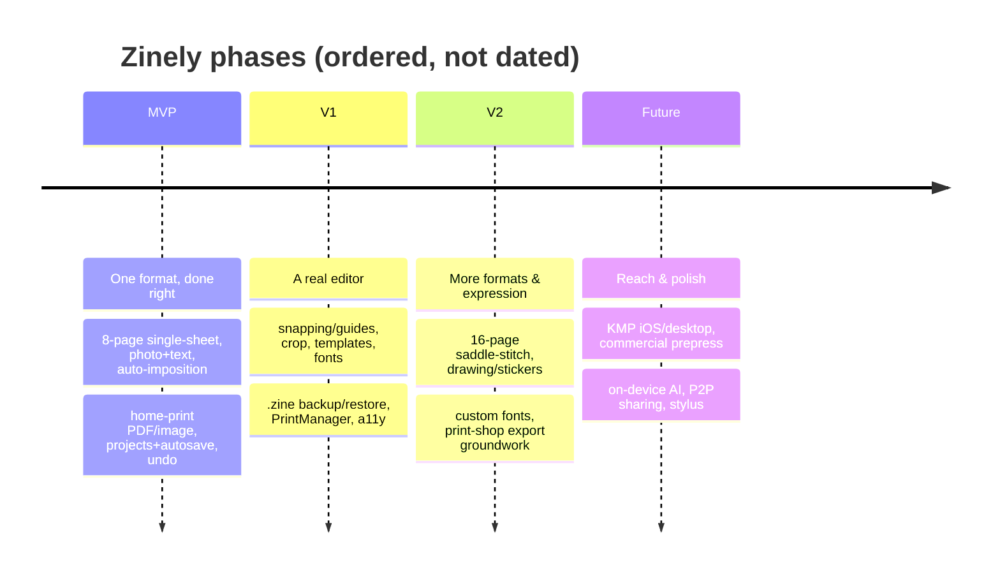
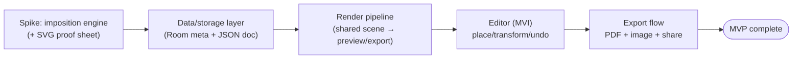

# Zinely — Roadmap

> **The single source of truth for phasing.** *Every roadmap change is reflected here.* Scope detail per phase lives in [PRD.md](PRD.md); the "how" in [ARCHITECTURE.md](ARCHITECTURE.md); rationale in [DECISIONS.md](DECISIONS.md). No dates are committed yet — phases are ordered, not scheduled.

- **Status:** Draft v0.1 · 2026-06-19

## Phase overview

## Guiding sequence

The build order inside every phase follows risk: **prove the riskiest, most isolatable thing first.** That is why the **imposition engine** (pure Kotlin, fully testable) is the first vertical spike — see [spikes/imposition-engine.md](spikes/imposition-engine.md) and [ADR-007](DECISIONS.md#adr-007).

> **Status:** S1 (imposition engine + SVG proof sheet) is ✅ **implemented and green** — pure-Kotlin `:core:model` + `:core:imposition`, 95 tests, Codex-reviewed per phase ([ADR-007 Implementation](DECISIONS.md#adr-007), [spike](spikes/imposition-engine.md)), shipped as milestone `v0.1.0-imposition-engine`. **S2 data/storage layer** is designed ([spikes/data-storage-layer.md](spikes/data-storage-layer.md)) and its decision gate is **cleared** — ADR-019…023 all Accepted ([ADR-021](DECISIONS.md#adr-021)/[ADR-022](DECISIONS.md#adr-022)/[ADR-023](DECISIONS.md#adr-023)); implementation is unblocked.

---

## MVP — "one great format, done right"
**Goal:** a beginner prints a correct 8-page zine in under 10 minutes, fully offline.

- 8-page single-sheet zine; Letter + A4.
- Photo placement (move/resize/rotate, fit/fill); text placement (bundled fonts, size/color/align).
- Single/double/full per-page layouts.
- Automatic imposition ([ADR-007](DECISIONS.md#adr-007)).
- Home-print-ready PDF (vector text) + 300 DPI image export ([ADR-001](DECISIONS.md#adr-001), [ADR-011](DECISIONS.md#adr-011)).
- Print correctness: safe area, fold/cut guides, calibration ruler, "Actual size" guidance ([ADR-012](DECISIONS.md#adr-012)).
- Projects: create/open/duplicate/delete, thumbnails.
- Autosave + crash recovery ([ADR-009](DECISIONS.md#adr-009)).
- Command-based undo/redo ([ADR-005](DECISIONS.md#adr-005)).
- Share via FileProvider; in-app fold instructions.

**Exit criteria:** all MVP functional requirements in [PRD §10](PRD.md#10-functional-requirements-mvp) pass; printed test zines fold to 1→8 reliably; no network calls; no crash data loss in dogfooding.

## V1 — "a real editor"
- Snapping / alignment guides ([R5.4](RESEARCH.md#r54-scene-model-hit-testing-snapping--verified--assumption)).
- On-device crop / rotate / basic adjustments (no remote processing).
- Templates & themes; richer typography; bundled font expansion.
- Page reorder / duplicate.
- **`.zine` backup & restore** via SAF ([ADR-009](DECISIONS.md#adr-009)).
- Android **PrintManager** in-app print path ([R2.3](RESEARCH.md#r23-system-print-framework--recommendation)).
- Calibration test sheet; thumbnails everywhere.
- Full accessibility pass; dark theme; Baseline Profile.

## V2 — "more formats & expression"
- Additional impositions: 4-page, **16-page saddle-stitch** (double-sided + binding guidance) — a distinct imposition family ([R1.7](RESEARCH.md#r17-variants--pitfalls--disputed--assumption)).
- Drawing / stickers / freehand layer.
- **Custom font import** (`.ttf`).
- **Print-shop export groundwork**: bleed, trim/crop marks, margins — still RGB ([ADR-002](DECISIONS.md#adr-002)).
- Multi-page spreads; batch export; grid/layers panel.
- Optional, explicit, user-initiated community sharing (network strictly opt-in).

## Future vision
- **KMP / Compose Multiplatform** (iOS + desktop) reusing the pure-Kotlin core.
- **Commercial prepress** (CMYK/ICC/PDF-X) via a real PDF engine — likely an off-device step, weighed against offline-first ([R2.7](RESEARCH.md#r27-third-party-pdf-libs--future)).
- On-device AI layout/auto-caption suggestions (privacy-preserving, no cloud).
- Peer-to-peer / Wi-Fi-Direct `.zine` sharing (no central server).
- Local template/plugin ecosystem; tablet + stylus first-class; print-shop partner export profiles.

---

## Change log
| Date | Change | Linked ADR / PRD |
|---|---|---|
| 2026-06-19 | Initial roadmap established | [PRD §7](PRD.md#7-scope--mvp) |
| 2026-06-19 | S1 imposition engine spike implemented (pure Kotlin, 95 tests, Codex-reviewed) | [ADR-007](DECISIONS.md#adr-007) |
| 2026-06-19 | S2 decision gate **cleared** — ADR-019…023 all Accepted (autosave, asset ownership/GC, fidelity); S2 implementation unblocked | [ADR-021](DECISIONS.md#adr-021), [ADR-022](DECISIONS.md#adr-022), [ADR-023](DECISIONS.md#adr-023) |

> When phase contents change, add a row here and update the affected phase section + any new [ADR](DECISIONS.md).
