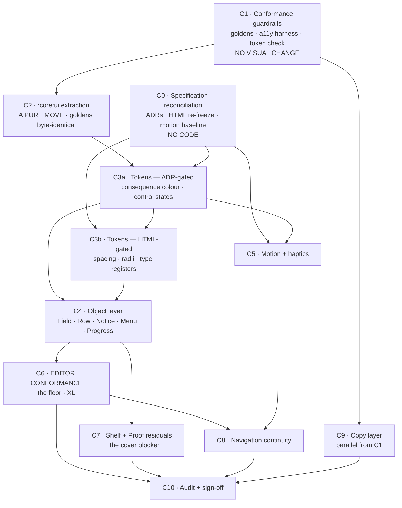

# V1 Implementation Roadmap — the conformance programme

> **What this is.** The bridge between the accepted design corpus and the repository. It sequences the
> work of making the shipped application conform to the corpus. It is a **planning artifact**: it
> decides *order and shape*, never *scope*, and it holds no authority of its own — every decision it
> depends on is named with its real owner below.
>
> **What this is not.** Not a redesign, not a feature plan, not an ADR, not a ticket list. No screen in
> here is designed. Nothing here authorises a visual change; §1.2 explains why that authority does not
> exist yet and what creates it.

**Baseline:** `main` @ `57f1e8b`, `0.9.0-beta.1` (`versionCode 3`), minSdk 24 / targetSdk 36,
AGP 9.2.1, Kotlin 2.2.10, Compose BOM 2026.02.01.

**Working tree, in full:** modified — `README.md`, `docs/RESEARCH.md`, `gradle.properties`;
untracked — `docs/V1-DESIGN-ELEVATION.md`, `docs/V1-DESIGN-DIRECTIONS.md`,
`docs/V1-DESIGN-REFINEMENT.md`, `docs/ZINELY-DESIGN-SYSTEM.md`,
`docs/ZINELY-DESIGN-SYSTEM-VALIDATION.md`, `docs/design/v1-critique-evidence/`, and this document.

Every count below was taken by command against that tree, with the command given wherever the number
is load-bearing. The design-corpus milestone taught that lesson three times, and the first draft of
*this* document proved it insufficient: an independent review found three counts inflated by
**comments matched as if they were code**, one of them the evidence for the argument that orders the
whole programme (§1.3). Those are corrected below and the correction is disclosed rather than
absorbed, because a number that survives into a plan is a number someone will schedule from.

---

## 0. Where this document sits

Four planning documents already exist on adjacent axes, and a fifth would be a duplicate source of
truth ([Documentation Rule](../CLAUDE.md#documentation-rule-mandatory)). Stated so nobody has to guess:

| Document | Owns | Relationship to this one |
|---|---|---|
| [zinely-v1.md](zinely-v1.md) | **What V1 *is*** — the Feature Tribunal, the Definition of Done, and **the ship-blocker list**. Outranks the execution plan; subordinate only to the Constitution | **Superior on scope and on what blocks a ship.** §7's blocker #3 is why real shelf covers are *not* an open question in this document (§2.8) |
| [zinely-v1-execution-plan.md](zinely-v1-execution-plan.md) | The V1 **feature** programme — foundations, work streams, critical path, gates G0–G5. "Adopted as the canonical execution reference" | **Superior on any collision about features or ship order.** This document sequences *conformance*, a different axis: it changes how existing things are drawn, not what exists. §9.3 lists the four places the axes touch |
| [COMPOSE-V1-PARITY-PLAN.md](COMPOSE-V1-PARITY-PLAN.md) | The M0–M6 re-skin of the frozen HTML trilogy onto the shipped app. **Complete and merged to `main`** | This document is the *next* layer, and in two places **reverses** a decision M0 deliberately took (§2.1, §2.3). Those are not defects in M0 — they are the design system disagreeing with the specification M0 implemented |
| [ROADMAP.md](ROADMAP.md) | Phasing, version milestones, the change log | Any conformance milestone that ships gets a row there and a change-log entry, in the same change |
| [ARCHITECTURE.md](ARCHITECTURE.md) | Technical source of truth — modules, pipelines, the planned `:core:ui` extraction | C2 below *executes* an extraction [ARCHITECTURE §2](ARCHITECTURE.md#2-module--package-structure) already plans as *planned, not realised*. It does not invent one |

**Scope of this document:** the order and shape of conformance work, its dependencies, its risks, and
the objective conditions under which conformance can be claimed. Nothing else.

---

## 1. The three facts that shape everything below

### 1.1 The app is not unfinished. It is finished against a different specification.

This is not a half-built UI awaiting a design system. M0–M6 landed a complete, tested,
golden-verified implementation of the DESIGN-FROZEN HTML trilogy — **61 committed golden PNGs**
(`git ls-files "*.png" | grep -c roborazzi`; 43 in `:feature:editor`, 18 in `:render-android`),
1,009 test methods across 138 test files, CI-verified on every push. The token layer exists
(`ZinelyColors`, `ZinelyElevation`, `ZinelyMotion`, `ZinelyHaptics`, `ZinelyTypography`), the theme
threads through `CompositionLocal`s that **error rather than default** when unprovided, and
`dynamicColor` was deleted rather than defaulted off.

**The conformance gap is therefore not "we never built it." It is "we built something else, well."**
That changes the risk profile completely: almost every gap below is a *regression risk against a
green suite*, not a blank to fill. It also means the honest unit of work is a **migration**, and
migrations need a net before they need a plan (C1).

### 1.2 The corpus is accepted as design. The repository has not recorded that acceptance.

The brief freezes the corpus for planning. Three things remain true in the repository regardless, and
pretending otherwise would repeat the rank error this milestone has now made six times:

1. **[CLAUDE.md's HTML-first workflow](../CLAUDE.md#html-first-ui-workflow-mandatory) is still in
   force.** *"Any UX change after freeze must first update the HTML specification, then be implemented
   in Compose — never the reverse."* The parity plan restates it as its prime directive. **Much of
   this roadmap is a UX change after freeze.**
2. **[ZINELY-DESIGN-SYSTEM §0.2](ZINELY-DESIGN-SYSTEM.md) declares itself subordinate** until an ADR
   adjudicates the hub collision — `DESIGN-LANGUAGE.md` self-declares as "the design system hub" and
   [README](../README.md) still indexes it as such.
3. **The validation's eight additions are explicitly not made by the validation.**
   [§7](ZINELY-DESIGN-SYSTEM-VALIDATION.md) says so in its own words: *"These are additions… for the
   owner to accept or reject. This document does not make them."* Accepting the validation therefore
   accepts a *finding that additions are needed* — it does not accept the additions. Two of them
   (A-5, A-8's scale clause) are **amendments that reverse accepted text**, and A-5's own entry says
   the opposite resolution is equally valid. **Both were subsequently ruled, and NEITHER amended
   anything:** A-5 was **rejected** ([ADR-065](DECISIONS.md#adr-065) — the owner took the opposite
   resolution this paragraph anticipated), and A-8's scale clause was accepted as a **derivation
   beneath §8.2** rather than a restatement ([ADR-066](DECISIONS.md#adr-066)). The design system
   carries **zero deletions** from either ruling.

**Consequence, and it is the single most important sentence in this document: C0 is not paperwork.
It is the milestone that creates the authority the token and surface milestones spend.** A
conformance programme that starts by changing drawn values is building against a specification that
does not yet say what the programme assumes it says.

### 1.3 The lowest-finish rule picks the order, and it picks the Editor.

[§1.3](ZINELY-DESIGN-SYSTEM.md) — *"perceived quality equals the finish of the least finished
surface… raising the floor beats raising the ceiling, every time."* Applied to the repository, the
floor is not ambiguous:

| Surface | Shared-component adoption | Material3 in production |
|---|---|---|
| **Proof** (5 files, 2,372 lines) | 8 distinct shared components | **zero M3 imports** |
| **Shelf** (7 files, 2,149 lines) | 12 distinct shared components/modifiers | one import (`material3.Text` in `ShelfCard.kt`) |
| **Editor** (14 files, 3,796 lines) | **zero** | 7 of 14 files read `MaterialTheme.*`; every surface uses `Text`, `Surface`, `Icon`, `IconButton` or `TextButton` |

> **Correction, disclosed.** The first draft claimed the Editor used *one* shared component,
> `zinelyControl` at `TypeBar.kt:479,502`. **Both lines are comments explaining why the Editor does
> *not* use it** — `:479` reads *"not the house `[zinelyControl]` helper"*, `:502` *"as
> `[zinelyControl]` does"*. The true figure is zero, the conclusion is stronger than the draft
> claimed, and `zinelyControl` is therefore a **second** piece of zero-call-site code alongside
> `ZStampButton` (§3.8). `grep -rn "zinelyControl" feature/editor/src/main` returns those two comments
> and the declaration, nothing else.

The Editor is the largest surface, the one users spend the most time in, the one answering the
product's central question — *"how do I change this page?"* — and it is the only one that never
adopted the design system its own module ships. **That is the floor, and it is where the programme's
weight belongs.**

---

## 2. The conflicts that must be resolved before code, not by code

These are not gaps. A gap is filled by implementing. Each of these is **two accepted documents
disagreeing**, and an engineer who "just implements the design system" resolves them silently, in
code, at the wrong rank. Every one is verifiable in the repository today.

### 2.1 Radii — three versus twenty-two

[§2.7](ZINELY-DESIGN-SYSTEM.md): *"Three radii exist. Nothing else does."* — paper square, chrome one
shared radius, pills fully round.

Measured in the frozen trilogy: **22 distinct `border-radius` values**
(`grep -oh "border-radius:[^;}]*" docs/design/v1/*.html | sed 's/border-radius://' | tr -d ' ' | sort -u | wc -l`).
Transcribed faithfully into Compose: **19 distinct `RoundedCornerShape` forms** across
`feature/editor` production sources.

> Note for whoever counts next: `ZinelyDimens.kt`'s own KDoc says *"sixteen distinct values"*. It was
> written on 2026-07-09; `proof.html` has been amended since ([ADR-050](DECISIONS.md#adr-050), and
> again 2026-07-22). The KDoc is not wrong so much as **dated**, which is exactly the class of drift a
> conformance programme exists to end.

`ZinelyDimens.kt:8-13` refuses a radius scale *on purpose*, and says why:

> *"There is deliberately no spacing scale and no radius scale here. The DESIGN-FROZEN trilogy does not
> define one… Inventing a scale would put a second, competing source of truth next to the HTML —
> exactly what the Documentation Rule and the HTML-first workflow forbid."*

**That refusal was correct under the rules in force, and it is now the obstacle.** Whoever adds a
radius family is overruling a documented decision that cites two standing rules. It needs an ADR, and
the ADR needs the HTML changed first.

### 2.2 The artifact has rounded corners, in the shipped build

[§5.1](ZINELY-DESIGN-SYSTEM.md) — Paper **"Never: … takes a corner radius."**
[§2.7](ZINELY-DESIGN-SYSTEM.md) — *"Paper, and anything representing paper: **Square**."*

| Site | Value |
|---|---|
| `ProofSheet.kt:156` | `RoundedCornerShape(3.dp)` — **the imposed sheet itself** |
| `ProofSheet.kt:194` | `RoundedCornerShape(6.dp)` — the sheet's inner face |
| `ShelfCover.kt:158` | `RoundedCornerShape(3, 5, 5, 3)` — the booklet |
| `ShelfCard.kt:245` | `RoundedCornerShape(9.dp)` — the card plate |

This is precisely [validation A-5](ZINELY-DESIGN-SYSTEM-VALIDATION.md), the report's *"most
reviewer-visible defect"*, sitting in production. A-5 proposes the artifact/representation
distinction; A-5 also says *"the alternative resolution — make every representation square too — is
equally valid and cheaper; the defect is the ambiguity, not the direction."* **Four files change
under one resolution and zero under the other.** No engineer should be the one to pick, and §10 must
not pre-empt the pick either — see §10.2.

### 2.3 Typography — eleven roles, zero implemented

[§6](ZINELY-DESIGN-SYSTEM.md) defines eleven roles by purpose; [§2.1](ZINELY-DESIGN-SYSTEM.md) requires
**five registers**; [§13](ZINELY-DESIGN-SYSTEM.md) requires *"No sizes invented for this screen."*

`ZinelyTypography` carries **two `FontFamily` values and no roles at all**. The Material3 `Typography`
at `Type.kt:68-76` defines exactly one style (`bodyLarge`, `FontFamily.Default`) and its KDoc says it
is *"deliberately unchanged… this scale retires with the last of them"* — a retirement that never
happened: **16 production `MaterialTheme.colorScheme`/`typography` reads remain**, in 7 Editor files
(`EditTextSession`, `EditorEmptyState`, `EditorMoveResizeHint`, `EditorPageStrip`,
`EditorSaveFailure`, `EditorSavedConfirmation`, `EditorSupplyTray`).

> **Correction, disclosed.** The first draft said *20 reads, "all in the Editor and the nav host."*
> Four of the twenty matches are comments (`Theme.kt:18,42,70`, `Type.kt:63`), and
> `grep -rnE "MaterialTheme\.(colorScheme|typography)" app/src/main` returns **nothing** — the nav
> host does not read the theme at all. 16, and the Editor only.

Measured type in production: **80 `.sp` literals across 25 distinct sizes** — `9.5, 10, 10.5, 11,
11.5, 12, 12.5, 13, 13.5, 14, 14.5, 15, 15.5, 16, 17, 19, 19.5, 20, 21, 22, 23, 24, 26` plus `0.sp`
and `0.5.sp` tracking. Eleven roles cannot be derived from twenty-five sizes without deciding which
sizes die, and every death is a visual change on a goldened surface.

### 2.4 Spacing — one unit, versus 591 literals

[§2.2](ZINELY-DESIGN-SYSTEM.md): *"One spacing unit; every gap is a multiple of it."*
[§13](ZINELY-DESIGN-SYSTEM.md): *"Every gap is a multiple of the spacing unit."*

Production carries **591 `.dp` literals across 61 distinct values**, and `ZinelyDimens` is referenced
**5 times in the entire application**. (61 is an upper bound on the spacing problem — it includes
sizes, stroke widths and radii — but no reading of it yields "one unit.")

### 2.5 Motion — the bands have no numbers, and may not get them yet

[§3.8](ZINELY-DESIGN-SYSTEM.md) defines three bands and then, in a block it marks **`> Open:`**,
states its own precondition:

> *"the existing durations and easings in DESIGN-LANGUAGE §10 remain the implementation of these bands
> **until a motion baseline is recorded on device. That recording is a precondition for changing any of
> them.**"*

[V1-DESIGN-REFINEMENT](V1-DESIGN-REFINEMENT.md), *"Where this document stops"*, agrees and gives the
order: **record the baseline → adjudicate the collisions → HTML → freeze → Compose → both device
passes.**

Three documents currently describe the timing, and they disagree three ways: DESIGN-LANGUAGE §10 says
~100–150 / ~200–300 / ~300–400 ms; the frozen HTML and `ZinelyMotion` say **two** values (`--fast`
130, `--base` 230) on one easing; the design system says three bands and
[validation A-4](ZINELY-DESIGN-SYSTEM-VALIDATION.md) proposes a fourth. **No implementation can be
correct against all three, and the tie-break is a measurement nobody has taken.**

*(Stated as a precondition, per §3.8's Open note — not as a prohibition. §3.8 sits in a document that
§1.2 declares subordinate until adjudicated; the operational weight is identical and the rank claim
is not.)*

### 2.6 The hub documents a palette the app deliberately does not use

`DESIGN-LANGUAGE.md:64` — indexed by the README as the design-system hub — specifies `desk #3A3A3C`,
and `:71` *"a friendly/marker face for chrome labels."* The shipped `ZinelyColors` has
`desk = #E7DECE` (light) / `#201F1E` (dark) and ships Inter + Fraunces. `#3A3A3C` survives in
`Theme.kt` only as `LegacyDesk`, in the pre-reskin scheme M0 preserved for un-migrated screens.

The same document's §10 still specifies *"a gentle confetti/sparkle at export"* — rejected by
[ADR-040](DECISIONS.md#adr-040) (*"a static payoff is calmer, testable, and reduced-motion-safe"*)
and retired by [ADR-051](DECISIONS.md#adr-051).

> **How much this actually outranks, stated carefully.** DESIGN-LANGUAGE's own front matter
> (`:3-11`) calls it *"a companion design reference… **not a parallel source of truth**"* and says
> *"where they touch product scope or technical decisions, the PRD / ARCHITECTURE / DECISIONS win."*
> So an accepted ADR beats it **by its own terms**, and the first draft of this document overstated
> the conflict by saying the stale copy *"formally outranks the shipped build."* It does not. What is
> true, and enough: **two canonical-by-index documents describe a rejected design**, a stranger
> reading the README will find them first, and correcting them is a C0 docs change
> ([§9.4](ZINELY-DESIGN-SYSTEM.md) discloses the same conflict without resolving it).

### 2.7 The specification an engineer will actually open is the wrong directory

[README](../README.md) indexes `docs/design/mockups/index.html` as *"Interactive HTML prototypes —
working design reference."* That directory holds the **pre-V1** prototypes, including
`completion.html`, `export.html` and `preview.html` — three screens **retired by
[ADR-051](DECISIONS.md#adr-051)/[ADR-052](DECISIONS.md#adr-052)**. The actual frozen specification is
`docs/design/v1/{shelf,bench,proof}.html`, which **the README does not link at all**
(`grep -n "design/v1" README.md` → no matches).

This is [D-27](ZINELY-DESIGN-SYSTEM-VALIDATION.md)'s location defect with a build consequence: an
engineer told "the HTML is the specification," following the repository's own index, arrives at
retired screens. It costs one README edit and it belongs in C0.

### 2.8 Real shelf covers are a ship blocker, not an open question

Included here because the first draft got its rank wrong in the other direction — it filed this as an
open owner decision.

[ADR-045](DECISIONS.md#adr-045)'s 2026-07-20 closure note is explicit: *"This is **not a new
tripwire.** [ZINELY V1](zinely-v1.md) §7 already carries it as ship blocker #3 ('Real shelf covers —
wire ADR-045 pipeline → DoD 3, 7'), **which outranks the Master Execution Plan's contrary baseline
claim**… Disposition therefore stands with blocker #3, not with this ADR."* Confirmed at
`docs/zinely-v1.md:123`.

And the pipeline is **not** dormant. The same note: *"`HomeModule` wires the full
`ThumbnailRenderer(CanvasReplayer(...))` stack into the production graph unconditionally… so the app
renders, encodes and caches a PNG per zine per document edit — plus a decode per zine per cold start
and up to 24 bitmaps in an LRU — **for output no surface displays**… It is dead weight either way:
wire it or delete it, but do not leave it running unread."*

So [§12.2](ZINELY-DESIGN-SYSTEM.md)'s *"the user's work is replaced by placeholder artwork"* is not a
conformance aspiration here — it coincides with a standing V1 blocker that is **already costing
battery and storage on every device running the beta**. What C0 must decide is *wire or delete*, not
*whether it matters*. (The imposed sheet's blank panels remain the separate
[ADR-058](DECISIONS.md#adr-058) Decision 7 deferral — a different ask with a different owner.)

---

## 3. Area-by-area conformance analysis

Twelve areas, by architecture. Complexity is S / M / L / XL relative to each other; there are no dates
in this document, matching the execution plan's law.

### 3.1 Theme plumbing — `ui/theme/Theme.kt`

- **Current:** five `staticCompositionLocalOf` locals that error when unprovided; `ZinelyTheme`
  resolves reduced motion once and threads it to motion *and* haptics; `dynamicColor` deleted. A
  `LegacyLightScheme`/`LegacyDarkScheme` M3 scheme is still provided for un-migrated screens, with
  documented role abuse (`background` is a slate grey absent from the frozen palette; `surface` is
  paper).
- **Required:** [§2.6](ZINELY-DESIGN-SYSTEM.md) two themes as equals; [§12.5](ZINELY-DESIGN-SYSTEM.md)
  no platform default accepted without a decision.
- **Gap:** the legacy scheme was scoped to retire "when the last screen migrates"; 16 production reads
  remain, all in the Editor.
- **Risk:** **low.** Deleting it is mechanical *after* C6; deleting it before is a mass visual
  regression.
- **Dependencies:** C6.  **Complexity:** S.  **Order:** the closing act of C6.

### 3.2 Colour — `ZinelyColors.kt`

- **Current:** 22 tokens, a byte-exact transcription of the frozen `:root`, pinned by
  `ZinelyColorsTest` so drift fails the build. Light/dark modelled as two rooms (`ink*` deliberately
  shared; `onDesk*` diverging) with the KDoc instruction *"Do not collapse them."*
- **Required:** [§7.1](ZINELY-DESIGN-SYSTEM.md) six jobs, one colour each, **"no third accent role."**
- **Gap:** **there is no colour whose job is consequence** — nothing to draw a delete, a failure or a
  destructive confirm. `ZButton.kt:313` and `ZMenuItem` already take a `danger` flag and colour it
  from the existing palette. This is [A-3](ZINELY-DESIGN-SYSTEM-VALIDATION.md), and A-3's own argument
  is that a consequence colour is *not* a third accent because it never marks a next action — so
  §7.1 survives.
- **Risk:** **low-medium.** One token; the pin test makes drift loud. The risk is a *second* token
  arriving with it ([§1.6](ZINELY-DESIGN-SYSTEM.md): *"every new token is a permanent tax"*).
- **Dependencies:** C0 (ADR only — **no HTML dependency**, see §3.13).  **Complexity:** S.
  **Order:** C3a.

### 3.3 Spacing, radii, dimension — `ZinelyDimens.kt`

- **Current:** four values — `MinTouchTarget` and three focus-ring values. No scale, by documented
  decision (§2.1). Referenced 5 times.
- **Required:** one spacing unit; a radius family; §13's two checklist boxes that cannot be checked
  without them.
- **Gap:** the whole scale, plus the migration of 591 literals and 19 shape forms.
- **Risk:** **the highest in the programme.** Every literal touched is a pixel moved on a goldened
  surface; 61 goldens re-record; and a re-record is exactly the operation that launders an unintended
  regression into a new baseline. Mitigation is C1, and it is not optional.
- **Dependencies:** C0 (**HTML re-freeze** + ADR), C1, C2.  **Complexity:** **XL.**
- **Order:** C3b, and it is the programme's long pole.

### 3.4 Typography — `Type.kt`

- **Current:** two families bundled locally (Inter 400/500/600/700, Fraunces 600, no italics — the
  prototypes' `fonts.googleapis.com` pulls are deliberately unreachable at `:18-22`, since a CDN font
  is a network request and the privacy invariant forbids one). One M3 `bodyLarge`. No roles.
- **Required:** eleven roles / five registers, plus [A-6](ZINELY-DESIGN-SYSTEM-VALIDATION.md)'s five
  more (Value, Input, Technical, Link, Section header) if accepted.
- **Gap:** the entire role layer, and the reduction of 25 sizes.
- **Risk:** **high**, and *different* from spacing: type changes reflow, and reflow changes clipping,
  ellipsis and line counts — failures a golden diff shows but a human must judge. Compounded by
  Fraunces shipping as the static 9pt optical cut, because `FontVariation`'s `opsz` is ignored below
  API 26 and minSdk is 24 (`Type.kt:38-45`).
- **Dependencies:** C0 (HTML re-freeze), C1, C2. **Collides with execution-plan F3** (§9.3).
  **Complexity:** **XL.**  **Order:** C3b, in parallel with radii, never in the same commit.

### 3.5 Elevation and light — `ZinelyElevation.kt`, `ZinelyShadow.kt`

- **Current:** exactly three tiers (`shadow1` / `shadow2` / `shadowLift`), re-tuned per theme
  (deeper and pure black in dark), one light source, no x-offset, no spread, drawn by
  `Modifier.zinelyShadow`.
- **Required:** [§2.4](ZINELY-DESIGN-SYSTEM.md) — three tiers, one immovable light, *"shadow does the
  work; tonal elevation does not exist here."*
- **Gap:** **none at the token layer. This area already conforms**, including the per-theme re-tune
  §2.6 demands. The only open question is [audit row 2](ZINELY-DESIGN-SYSTEM-VALIDATION.md) — which
  tier a *new* object belongs to — which no addition closes.
- **Risk:** low.  **Complexity:** S (documentation only).  **Order:** C3a, opportunistic.

### 3.6 Motion — `ZinelyMotion.kt`, `ReduceMotion.kt`

- **Current:** two durations, one easing, both collapsing to 0 under reduced motion, read from
  `LocalZinelyMotion` with *"never hardcode a duration at a call site."* `rememberReduceMotion` reads
  `ANIMATOR_DURATION_SCALE` (with a `ponytail` note that a `ContentObserver` would be needed for a
  live mid-session toggle).
- **Required:** three bands (§3.8), a fourth if A-4 is accepted; **interruptibility from current
  position and velocity** (§8.4, called *"the single reliable divider between physical and
  animated"*).
- **Gap:** one band; the Underway band and its truthful-progress rule; and interruptibility, which is
  a property of every call site rather than a token — `tween` is not interruptible from velocity.
- **Risk:** **medium, and gated** by the on-device baseline (§2.5).
- **Dependencies:** C0 (baseline), C3a.  **Complexity:** M for tokens, **L** for interruptibility.
  **Order:** C5.

### 3.7 Haptics — `ZinelyHaptics.kt`

- **Current:** four verbs (`Tick`/`Snap`/`Boundary`/`Success`), silenced under reduced motion,
  with the phase-alignment bug fixed and documented (`navigator.vibrate([8])` means *vibrate 8ms*;
  Android reads `timings[0]` as *wait*, so a verbatim copy would invert every pattern).
- **Required:** [§3.7](ZINELY-DESIGN-SYSTEM.md) — physical events only, never the sole signal.
- **Gap:** **none in the vocabulary.** Only a call-site audit: which of the four fire where, and
  whether any fires on a non-physical event.
- **Risk:** low.  **Complexity:** S.  **Order:** C5, with the baseline recording.

### 3.8 Object / component layer — `ui/components/` (12 files)

- **Current:** `ZAccessibleControl`, `ZButton` (4 composables, 2 metric families, `danger` flag),
  `ZFocusRing`, `ZMenuItem`, `ZPaperSurface`, `ZSheet` (a `ui.window.Dialog`, explicitly *not*
  `ModalBottomSheet`), `ZSnackbar`, `ZStatusPane`, `ZSweep`, `ZTextField`, `ZToast`, `ZinelyShadow`.
  Consumed entirely by Shelf and Proof (§1.3).
- **Required:** [§5](ZINELY-DESIGN-SYSTEM.md)'s twelve objects, plus
  [A-2](ZINELY-DESIGN-SYSTEM-VALIDATION.md)'s Field / Row / Notice / Menu / Sheet / popover, plus
  A-3's four control states.
- **Gaps, each verified:**
  - **`ZTextField` is not a Field.** No disabled, no error, no label, no supporting text, no
    placeholder, `singleLine` hardcoded true (`ZTextField.kt:56`). **One production call site**
    (`ShelfSheets.kt:221`).
  - **No Row primitive.** The settings/list row A-2 names does not exist; `PaperChoice`
    (`ShelfSheets.kt:110`) and `RecipeRow` (`ProofPrint.kt:246`) are two independent inventions of it.
  - **No Notice primitive.** `EditorSaveFailure`, `EditorMoveResizeHint` and `ProofErrorPane` are
    three separate implementations of one object.
  - **No progress primitive.** The only spinner in the app is a **Material3
    `CircularProgressIndicator`** in the nav host boot path (`ZinelyNavHost.kt:253,328`) — a platform
    default accepted without a decision ([§12.5](ZINELY-DESIGN-SYSTEM.md)) on the *first screen a
    cold-started user sees*. `ZSweep` is the design-system loading treatment and is used on exactly
    one Shelf site.
  - **States are partial:** pressed on `ZButton` only; disabled on `ZButton`/`zinelyControl` only;
    selected on `ZMenuItem` only; **no loading state anywhere.**
  - **Two zero-call-site components:** `ZStampButton` and `zinelyControl` (§1.3). Both are exercised
    by `ZComponentGoldenTest` (`:78`, `:98`), so deleting either also deletes golden cases — which is
    why the deletion is a *proposal to C0*, not a decision here (§11).
- **Risk:** **medium.** Additive work on the least-coupled layer; the risk is inventing objects the
  design system did not sanction ([§1.6](ZINELY-DESIGN-SYSTEM.md): a new object is a system change and
  needs an ADR).
- **Dependencies:** C0 (A-2/A-3 ADRs), C2, C3a.  **Complexity:** **L.**  **Order:** C4.

### 3.9 Module boundaries

- **Current:** the entire design system — theme *and* components — lives in **`:feature:editor`**.
  `:app` depends on it (`app/build.gradle.kts:202`). `ARCHITECTURE.md:88,91` already plans a
  `:core:ui` module and lists it as **planned, not realised**.
- **Required:** nothing in the design corpus. This is an architecture consequence: every screen the
  validation derived (Settings, About, Backup…) would have to depend on the editor feature module to
  draw a button.
- **Gap:** the extraction.
- **Risk:** **medium, and strictly increasing with time.** Moving files invalidates every Roborazzi
  golden path (`GOLDEN_DIR = "src/test/roborazzi"` resolves per module) and rewrites the import
  graph.
- **Dependencies:** **C1 only.** It has no token dependency and no design dependency — it is a pure
  move.
- **Complexity:** M.  **Order:** **C2 — before the token layer grows, not after.** §7.2 item 3
  explains why; the first draft of this document ordered it after C3 and contradicted itself doing so.

### 3.10 Navigation and transitions

- **Current:** three routes — `HomeRoute`, `EditorRoute(projectId)`, `ProofRoute(projectId)` — and
  **no transitions at all.** `NavHost` (`ZinelyNavHost.kt:64-68`) takes no `enterTransition`,
  `exitTransition`, `popEnterTransition` or `popExitTransition`; all three `composable<T>{}` blocks
  take none. Every navigation is the framework default fade. The only animated act-change in the app
  is `AnimatedContent` *inside* `ProofScreen` (`:321-336`).
- **Required:** [§3.6](ZINELY-DESIGN-SYSTEM.md) *"Continuity over replacement… when a thing exists on
  both sides of a navigation, it moves."* [§5.4](ZINELY-DESIGN-SYSTEM.md) — the Card *"**becomes** the
  editor rather than being replaced by it."*
- **Gap:** the entire continuity requirement. This is the largest *behavioural* gap in the programme
  and it is invisible in a screenshot — which is why it survived M6.
- **Risk:** **high.** Shared-element transitions interact with state restoration, predictive back, and
  `ProofScreen`'s `rememberSaveable` act ordinal. And a shared element animating the *card* into the
  *editor page* animates between two objects at different proportions — §5.1's *"holds its proportion
  truthfully"* constrains what is even legal here. **The mechanism is not decided by this document**:
  §5.4 states a requirement, and whether it is met by NavHost transitions, a shared-element scope, or
  a single-composable morph is a design-and-engineering choice C0 and the HTML must settle.
- **Dependencies:** C0 (HTML must specify it), C5, **C6** (the editor must be stable first).
  **Complexity:** **L.**  **Order:** **C8 — after the Editor, not inside C5.**

### 3.11 Copy

- **Current:** **there is no string layer.** One `strings.xml` entry in the repository
  (`app_name`), **zero** `stringResource` call sites, no `Strings.kt`. Copy is hardcoded literals
  inside composables. Scale, by command:
  `grep -rohE '"[^"]*[a-z] [a-z][^"]*"' --include=*.kt feature/editor/src/main | wc -l` → **274**
  prose-shaped literals (a lower bound — single-word labels and glyph strings are excluded by the
  two-words-lowercase filter); the nav host adds **12 distinct** more
  (`grep -ohE '"[A-Z][^"]{3,}"' app/.../ZinelyNavHost.kt | sort -u`), including a hardcoded
  `zineName = "Your zine"` (`:203`) and an Android platform `Toast` (`:181`), the only non-Compose
  modal in the app. The nearest thing to a copy object is two helpers: `homeDeletedMessage()` and
  `saveFailureText()`. `EditorA11y.kt` hardcodes 14 accessibility action labels.
- **Required:** [§13](ZINELY-DESIGN-SYSTEM.md) *"Copy is from VOICE; no placeholder, no system
  strings"*; [DESIGN-RULES R5](design/DESIGN-RULES.md) the same; [§2.1](ZINELY-DESIGN-SYSTEM.md)
  *"Set, don't type"* — typographic punctuation, one ellipsis character, non-breaking spaces before
  units.
- **Gap:** the layer itself. Today **"copy comes from VOICE" cannot be verified by any mechanical
  means**; it is hundreds of human comparisons per review.
- **Risk:** **low, and it is the programme's best parallel work** — a pure extraction with zero
  intended visual change, which makes it the ideal early exercise of C1's net. The punctuation sweep
  carries the one real trap: [§2.1](ZINELY-DESIGN-SYSTEM.md)'s exception — *"strings frozen by an
  accepted ADR change only when that ADR is superseded."*
- **Dependencies:** C1 only.  **Complexity:** M.  **Order:** C9 — startable the moment C1 is green.

### 3.12 Accessibility — a gate, not a milestone

- **Current, and stronger than most products:** `ElementSemanticsLayer` gives one semantics node per
  element with 14 custom actions; `ReframeA11yTest` (9 tests) covers announcements, refused keystrokes
  and limit states; `assertIsNotEnabled` in four suites; explicit touch-target assertions at
  48/52/56 dp; polite live regions on `ZSnackbar` and `ZToast`; focus moved to the snackbar action.
- **Required:** [§11](ZINELY-DESIGN-SYSTEM.md)'s seven product rules, in particular #1 *"the visible
  twin is designed, not merely present"* and #3 **"the platform's tree is the truth."**
- **Gaps, verified:**
  - **No test anywhere touches the platform `AccessibilityNodeInfo` tree.** The string occurs once in
    the repository, in a comment (`EditorEffects.kt:36`). The programme's most recent shipped defect —
    a zoom stepper that passed `assertIsNotEnabled` while telling the platform it was enabled
    (`f4faaa4`) — is precisely the defect a merged-semantics assertion cannot see.
  - **`stateDescription` is produced and never asserted** (`EditorContextBar.kt:169`,
    `EditorPageStrip.kt:152`).
  - **`Role` is asserted in exactly one file** (`TypeBarTest.kt:258-260`).
  - **No keyboard-focus-order test**, which A-8 notes §11 did not even require while Premium
    Checklist #64 does. *(§11 requires it as of [ADR-066](DECISIONS.md#adr-066) rule 8; the test is
    [CI-31](V1-CONFORMANCE-INVENTORY.md)'s keyboard half, now unblocked.)*
  - No contrast, font-scale, or traversal-order test.
- **Why it is not a milestone.** [§11.7](ZINELY-DESIGN-SYSTEM.md): *"Accessibility is a merge gate,
  not a backlog… a screen that fails it is not done."* A milestone node would be scheduled, and a
  scheduled gate is a backlog. **The harness is built in C1; the gate is an acceptance criterion on
  every surface milestone (C4, C6, C7, C8, C9).** There is deliberately no C-number for it, and the
  dependency graph deliberately has no node for it.
- **Risk:** medium.  **Complexity:** M (harness in C1) + S per surface.

### 3.13 What is ADR-gated versus HTML-gated

The single most useful distinction for scheduling, and the first draft missed it — it gated the whole
token layer behind the HTML re-freeze, serialising the programme unnecessarily.

[CLAUDE.md's HTML-first workflow](../CLAUDE.md#html-first-ui-workflow-mandatory) governs **UX
changes**. A token added with no consumer is not a UX change; nothing is drawn differently.

| Needs only an ADR (C3a) | Needs the HTML re-frozen first (C3b) |
|---|---|
| The consequence colour (A-3) | The spacing unit — it changes every gap |
| The four control-state values (A-3) | The radius family — §2.1, and the A-5 ruling |
| The Underway band's *existence* (A-4) — its **duration** is baseline-gated (§2.5) | The five type registers — they change every drawn size |
| Documenting the three elevation tiers (§3.5, already conformant) | |

---

## 4. The milestones

Eleven. Each leaves the app shippable — meaning: builds, CI green, no surface left half-migrated
across a milestone boundary.

---

### C0 — Specification reconciliation · **no code**

- **Goal:** turn the accepted design corpus into repository authority, and resolve every §2 conflict
  at its own rank, before any of them is resolved silently in Compose.
- **Files:** `docs/DECISIONS.md`, `docs/design/DESIGN-LANGUAGE.md`, `docs/design/VOICE.md`,
  `docs/design/v1/*.html`, `docs/ROADMAP.md`, `README.md`. **Zero files in any `src/main`.**
- **Justified by:** [CLAUDE.md HTML-first](../CLAUDE.md#html-first-ui-workflow-mandatory);
  [ZINELY-DESIGN-SYSTEM §0.2, §1.6, §15](ZINELY-DESIGN-SYSTEM.md);
  [validation §7 + §7.1](ZINELY-DESIGN-SYSTEM-VALIDATION.md);
  [V1-DESIGN-REFINEMENT *"Where this document stops"*](V1-DESIGN-REFINEMENT.md).
- **Contents:**
  1. **The §0.2 hub adjudication** — one ADR, one edit to DESIGN-LANGUAGE, one README row (§2.6).
  2. **The motion-and-haptics baseline, recorded on device** (§2.5). A precondition, not a task.
  3. **A ruling on each of the eight additions + the checklist relocation**, remembering that two are
     amendments and that A-5 has two equally-valid resolutions with a 4-file cost difference (§2.2).
  4. **The seven [§15](ZINELY-DESIGN-SYSTEM.md) open items** — a decision or an explicit deferral each,
     in particular the ADR-033 empty state, the ADR-034 optimistic *"Saved ✨"*, and the ADR-058 page
     turn.
  5. **Wire-or-delete on the shelf-cover pipeline** — ship blocker #3, currently costing work on every
     device (§2.8). Not a design preference.
  6. **A ruling on the two zero-call-site components** (§3.8) — delete or adopt, noting each deletion
     removes golden cases.
  7. **The HTML re-freeze.** Radii, type registers and spacing changed in
     `docs/design/v1/{shelf,bench,proof}.html` **first**, then re-frozen. This unblocks C3b and belongs
     to the designer, not to engineering.
  8. **Fix the specification pointer** — README indexes retired prototypes as the working reference
     (§2.7).
- **Visual impact:** **none.**  **Regression risk:** **none.**
- **Verification:** every §2 conflict has a dated ADR; `docs/design/v1/*.html` re-frozen with a date
  later than those ADRs; a device-recorded motion baseline exists; README links `docs/design/v1/`;
  Review Agent **GO**.
- **Complexity:** M (writing) — but it is the **critical path**, because the designer is the critical
  resource here exactly as [the execution plan](zinely-v1-execution-plan.md#4-critical-path) found on
  the feature axis.

---

### C1 — Conformance guardrails · **no visual change**

- **Goal:** build the net before the migration. Nothing here changes a pixel; everything here makes a
  changed pixel loud.
- **Files:** `.github/workflows/ci.yml`, `gradle/libs.versions.toml`, module `build.gradle.kts`,
  new tests under `feature/editor/src/test/`, `render-android/src/test/`.
- **Justified by:** §1.1 (this is a migration against a green suite);
  [§11.3](ZINELY-DESIGN-SYSTEM.md) *"the platform's tree is the truth"*;
  [ARCHITECTURE §11.1](ARCHITECTURE.md).
- **Contents:**
  1. **Golden coverage for the Editor.** 61 goldens exist; the Editor's share is
     `SelectionChromeGoldenTest` (3), `TypeBarGoldenTest` (2) and the `PagePreview` parity set. The
     largest surface in the app is the least goldened, and C6 will rewrite all of it.
  2. **A platform-accessibility-tree assertion harness** (§3.12) — the one class of defect the current
     suite structurally cannot see, and the one that most recently shipped.
  3. **A token-discipline check** — a test or lint that fails on a raw `.dp`/`.sp`/`Color(`/
     `RoundedCornerShape(` literal in an **enrolled** package (§10.2 defines enrolment). **The
     repository has no lint, no detekt, no ktlint, no spotless**; `explicitApi()` in 9 modules is the
     only static gate. Without this, §13's spacing and radius boxes are re-audited by hand forever.
  4. **`:app` and `:feature:editor` unit tests into CI as named tasks.** Today
     `:app:testDebugUnitTest` (97 tests) is **never invoked** by either workflow (`ci.yml` runs
     `:app:compileDebugKotlin` only), and `:feature:editor`'s 323 tests are reached only as a side
     effect of `verifyRoborazziDebug`.
  5. **`stateDescription`, `Role` and focus-order assertions** on the controls that already set them.
- **Visual impact:** **none — this is the milestone's acceptance criterion.**
- **Verification:** goldens byte-identical after C1 merges; an intentionally-injected literal fails
  CI; an intentionally-broken `enabled` state fails the a11y harness. *Demonstrating the net catches
  an injected divergence is the gate — a passing suite proves nothing about a net.*
- **Complexity:** **L.**  **Dependencies:** none. **C0 and C1 are fully independent.**

---

### C2 — The `:core:ui` extraction · **a pure move**

- **Goal:** the design system stops living inside a feature module, while it is still small.
- **Files:** all of `ui/theme/` and `ui/components/` → a new `core/ui/`; `settings.gradle.kts`;
  `app/build.gradle.kts`; `feature/editor/build.gradle.kts`; golden paths; the import graph.
- **Justified by:** [ARCHITECTURE §2](ARCHITECTURE.md#2-module--package-structure), which already
  lists `:core:ui` as planned; and [validation §6.1](ZINELY-DESIGN-SYSTEM-VALIDATION.md)'s prediction
  that new screens invent furniture — a screen cannot reuse what it cannot depend on.
- **Contents:** the move, and nothing else. **No new object, no new token, no renamed symbol.**
- **Visual impact:** **none.** Goldens must be byte-identical across this milestone; that is the whole
  point of doing it as a separate, mechanically-reviewable step.
- **Regression risk:** **low if it is only a move, medium the moment anything rides along.**
- **Verification:** `verifyRoborazziDebug` green in both modules after the golden files are re-homed;
  the diff contains renames and import lines only.
- **Complexity:** M.  **Dependencies:** **C1 only.**
- **Order:** **before C3.** Every token C3 adds is a symbol C2 would otherwise have to move later
  (§7.2 item 3).

---

### C3 — Token layer completion · split by gate

Two halves, because they have different preconditions (§3.13). They may be separate PRs or separate
milestones; they may **not** be one commit.

#### C3a — ADR-gated

- **Contents:** the consequence colour; the four control-state values; the Underway band's existence;
  documenting the already-conformant elevation tiers.
- **Dependencies:** C0 (items 3, 6), C1, C2. **No HTML dependency** — nothing is drawn differently.
- **Complexity:** M.

#### C3b — HTML-gated

- **Contents:** the spacing unit; the radius family, per the C0 A-5 ruling; the five type registers and
  the §6 roles.
- **Dependencies:** **C0 item 7 (the HTML re-freeze)**, plus C3a.
- **Complexity:** **XL.** This is the long pole.

- **Files (both):** `core/ui/.../ZinelyDimens.kt`, `Type.kt`, `ZinelyColors.kt`, `ZinelyMotion.kt`,
  `Theme.kt`; the pin tests.
- **Visual impact:** **none if done correctly**, and that is the tell: **tokens are added, call sites
  are not migrated.** A moved golden in C3 means something was migrated that should not have been.
- **Verification:** pin tests extended to every new token; goldens byte-identical; each token
  traceable to a C0 ADR; each C3b token traceable to a line in the re-frozen HTML.

---

### C4 — Object layer

- **Goal:** every object in [§5](ZINELY-DESIGN-SYSTEM.md) and A-2 exists once, in `:core:ui`.
- **Files:** `core/ui/.../components/`.
- **Justified by:** [§5](ZINELY-DESIGN-SYSTEM.md), [A-2, A-3](ZINELY-DESIGN-SYSTEM-VALIDATION.md).
- **Contents:** **Field** (the states `ZTextField` lacks), **Row**, **Notice**, **Menu**, and a
  **progress** primitive to replace the boot `CircularProgressIndicator`; pressed / focused /
  disabled / selected on every control; execute C0's ruling on the two zero-call-site components.
- **Visual impact:** **low and localised** — the boot spinner, and any component gaining a state it
  previously lacked.
- **Regression risk:** **medium.**
- **Verification:** `ZComponentGoldenTest` extended per new object, **light and dark**; every new
  object has a C0 ADR entry; the accessibility gate (§3.12) applies to every new control.
- **Complexity:** **L.**  **Dependencies:** C0, C2, C3a (C3b for spacing).

---

### C5 — Motion and haptics

- **Goal:** the product responds physically — immediate, continuous, **interruptible**.
- **Files:** `ZinelyMotion.kt`, `ZinelyHaptics.kt`, `EditorGestures.kt`, `ProofScreen.kt`, and every
  animated call site.
- **Justified by:** [§3.1, §3.8, §8.4, §8.6](ZINELY-DESIGN-SYSTEM.md),
  [A-4](ZINELY-DESIGN-SYSTEM-VALIDATION.md).
- **Contents:** the bands against the recorded baseline; interruptibility at every animated call site;
  the Underway band and truthful, cancellable progress; the haptic call-site audit.
- **Visual impact:** **high, and almost entirely invisible in a screenshot.**
- **Regression risk:** medium-high.
- **Verification:** **device only.** Screen recordings at the frozen beats; both device passes; a
  reduced-motion pass verifying the static state is already correct.
- **Complexity:** **L.**  **Dependencies:** C0 (baseline), C3a.

---

### C6 — Editor conformance · **the floor**

- **Goal:** the Editor is drawn from the same system as the rest of the product. This is the
  [§1.3](ZINELY-DESIGN-SYSTEM.md) milestone, and the reason the programme exists.
- **Files:** all 14 Editor sources — `EditorScreen.kt` (1,006 lines), `TypeBar.kt` (706),
  `ReframeControls.kt` (474), `EditorPageStrip.kt`, `EditorSupplyTray.kt`, `EditorContextBar.kt`,
  `EditorEmptyState.kt`, `EditorSavedConfirmation.kt`, `EditorSaveFailure.kt`,
  `EditorMoveResizeHint.kt`, `EditTextSession.kt`, `DeskText.kt`, `ResizeHandles.kt`,
  `SelectionChrome.kt`.
- **Subsystems:** `:feature:editor` UI. **The MVI core in `:core:editor` is untouched** — this is a
  re-skin, and `EditorStore`/`EditorReducer` are out of scope by design.
- **Justified by:** [§1.3](ZINELY-DESIGN-SYSTEM.md); [§5.5](ZINELY-DESIGN-SYSTEM.md) Tray;
  [§5.9](ZINELY-DESIGN-SYSTEM.md) Toolbar; [§5.10](ZINELY-DESIGN-SYSTEM.md) Thumbnail;
  [§4.7 / §8.2](ZINELY-DESIGN-SYSTEM.md) *the page is the fixed point*;
  [§12.3](ZINELY-DESIGN-SYSTEM.md) chrome must not compete.
- **Contents:** migrate every surface off raw Material3 onto the C3 tokens and C4 objects; adopt the
  Sheet object for the ad-hoc text-edit `Surface` (`EditorScreen.kt:845`); replace the three Notice
  implementations with one; retire the legacy M3 scheme as the closing act (§3.1); **and verify
  [§8.2](ZINELY-DESIGN-SYSTEM.md) — that the page does not resize when the type bar, reframe controls,
  tray or IME appear** (`EditorScreen.kt` uses `imePadding()` around the text panel; whether the *page*
  holds its size through that is the single highest-value check in the milestone, because §8.2 calls
  it *"the single most damaging violation available in this product"*).
- **Visual impact:** **the largest in the programme.**
- **Regression risk:** **the highest in the programme.** 3,796 lines, thin golden coverage until C1,
  and `EditorScreen` hoists seven local `remember` accumulators deliberately kept out of the reducer —
  a restructure that disturbs them breaks live transforms, resize overrides or reframe drafts in ways
  a screenshot will not show.
- **Verification:** the C1 Editor goldens, light and dark, phone and tablet; the 323
  `:feature:editor` tests green; **both device passes**; the accessibility gate, with the platform
  tree read on the Reframe and Type surfaces specifically.
- **Complexity:** **XL.** Decompose by surface, one surface per PR, never one Editor PR.
- **Dependencies:** C0, C1, C2, C3, C4.

---

### C7 — Shelf and Proof residuals

- **Goal:** close the gaps on the two surfaces that already largely conform.
- **Files:** `ShelfCard.kt`, `ShelfCover.kt`, `ShelfStates.kt`, `ShelfSheets.kt`, `ProofSheet.kt`,
  `ProofPrint.kt`, `ProofFold.kt`, `ProofRead.kt`, `ProofScreen.kt`; and, for the cover ruling,
  `HomeViewModel.kt`, `ShelfThumbnailProducer.kt`, `HomeModule.kt`.
- **Justified by:** [§2.7 / §5.1](ZINELY-DESIGN-SYSTEM.md), [§12.2](ZINELY-DESIGN-SYSTEM.md),
  [§5.3](ZINELY-DESIGN-SYSTEM.md), [A-5](ZINELY-DESIGN-SYSTEM-VALIDATION.md),
  and [zinely-v1.md §7 blocker #3](zinely-v1.md).
- **Contents:** apply C0's A-5 ruling to the four rounded-artifact sites (§2.2); adopt the C3 scale;
  **execute C0's wire-or-delete ruling on the shelf-cover pipeline** (§2.8) — note this is the one
  item in the programme with a *non-visual* cost today, since the pipeline renders and caches a PNG
  per zine per edit for output nothing displays.
- **Visual impact:** medium.  **Regression risk:** low-medium — well goldened (12 shelf, 16 proof).
- **Verification:** goldens re-recorded with **each diff reviewed individually**; the accessibility
  gate; **physical print validation** if anything in `ProofSheet`/`ProofPrint` geometry moves (§8.3).
- **Complexity:** M.  **Dependencies:** C0, C2, C3, C4. **May run in parallel with C6** — disjoint
  files.

---

### C8 — Navigation continuity

- **Goal:** things that exist on both sides of a navigation move, rather than being recreated.
- **Files:** `ZinelyNavHost.kt`, `EditorRoute.kt`, `ShelfCard.kt`, `EditorScreen.kt`.
- **Justified by:** [§3.6](ZINELY-DESIGN-SYSTEM.md), [§5.4](ZINELY-DESIGN-SYSTEM.md).
- **Contents:** the continuity requirement, by whatever mechanism C0 and the HTML settle (§3.10 —
  this document does not pick one).
- **Visual impact:** high, and invisible in a still.  **Regression risk:** **high** — state
  restoration, predictive back, `rememberSaveable`.
- **Verification:** device only; both passes; TalkBack unaffected by transitions; reduced motion
  loses no information ([§8.6](ZINELY-DESIGN-SYSTEM.md)).
- **Complexity:** **L.**  **Dependencies:** C0, C5, **C6** — it is separated from C5 precisely because
  it cannot land until the Editor is stable, and a milestone whose last item lands after a later
  milestone is not shippable.

---

### C9 — The copy layer · **parallel from C1**

- **Goal:** every user-facing string lives in one place, traceable to [VOICE](design/VOICE.md).
- **Files:** a new copy source in `:core:ui` or a sibling; all Editor, Shelf and Proof sources;
  `ZinelyNavHost.kt`; `EditorA11y.kt`.
- **Justified by:** [§13](ZINELY-DESIGN-SYSTEM.md), [§10](ZINELY-DESIGN-SYSTEM.md),
  [DESIGN-RULES R5](design/DESIGN-RULES.md), [§2.1](ZINELY-DESIGN-SYSTEM.md) *"Set, don't type."*
- **Contents:** extract the feature-module literals (≥274 by §3.11's filter, more once single-word
  labels are counted) and the nav host's 12; the punctuation sweep;
  **replace the platform `Toast`** (`ZinelyNavHost.kt:181`) with the house toast; **replace the
  hardcoded `zineName = "Your zine"`** (`:203`) — a placeholder in a share title, which §13's *"no
  placeholder"* box names directly.
- **Visual impact:** **none intended.** Any golden diff is a bug in the extraction.
- **Regression risk:** **low**, with one trap: [§2.1](ZINELY-DESIGN-SYSTEM.md)'s exception protects
  ADR-frozen strings, so the punctuation sweep must skip them.
- **Verification:** goldens byte-identical; a test asserting no prose literal survives in enrolled
  packages — this is what finally makes §13's copy box mechanically checkable.
- **Complexity:** M.  **Dependencies:** C1 only. **The best parallel work in the programme.**

---

### C10 — Conformance audit and sign-off

- **Goal:** establish, against §10's checklist, that the claim is true.
- **Files:** `docs/ROADMAP.md`, `CHANGELOG.md`, `docs/DECISIONS.md`, `README.md`, a review record.
- **Contents:** [§13](ZINELY-DESIGN-SYSTEM.md)'s 36 boxes per surface (29 mechanically checkable, 7
  recorded as judgements per [validation §3.11](ZINELY-DESIGN-SYSTEM-VALIDATION.md) — they are
  **labelled, not deleted**); [DESIGN-RULES](design/DESIGN-RULES.md) R1–R12 per screen; both device
  passes per surface; adversarial Review Agent.
- **Complexity:** M.  **Dependencies:** all.

---

## 5. Dependency graph

*Accessibility has no node, deliberately (§3.12): its harness is built in C1 and its gate is an
acceptance criterion on C4, C6, C7, C8 and C9. A scheduled gate is a backlog.*

| Milestone | Must happen after | May run in parallel with | Must happen before |
|---|---|---|---|
| **C0** | — | **C1, C2** (no shared files, no shared people) | C3a, C3b, C5 |
| **C1** | — | **C0** | C2, C9 |
| **C2** | C1 | C0, C9 | C3a |
| **C3a** | C0 (rulings), C2 | C9 | C3b, C4, C5 |
| **C3b** | **C0's HTML re-freeze**, C3a | C5, C9 | C4's spacing work |
| **C4** | C0, C2, C3a *(C3b for spacing)* | C5, C9 | C6, C7 |
| **C5** | C0 (baseline), C3a | C3b, C4, C9 | C8 |
| **C6** | C0, C1, C2, C3, C4 | **C7** (disjoint files), C9 | C8, C10 |
| **C7** | C0, C2, C3, C4 | **C6**, C9 | C10 |
| **C8** | C5, **C6** | C7, C9 | C10 |
| **C9** | C1 | everything | C10 |
| **C10** | all | — | — |

---

## 6. Critical path

**C0 → C3b → C4 → C6 → C10.**

**The critical resource is the designer, not any engineer** — the same finding
[the execution plan reached](zinely-v1-execution-plan.md#4-critical-path) on the feature axis, for the
same structural reason. C0 contains an HTML re-freeze, a device-recorded motion baseline, and rulings
on eight additions plus seven open items and a ship blocker. **Not one of those is engineering work,
and the longest chain in the programme waits on the HTML re-freeze specifically.**

C1 and C2 have **no dependency on C0 at all**, which makes them the correct first engineering acts —
and they happen to be the two milestones whose entire purpose is to make the rest survivable and
cheap. C9 joins them the moment C1 is green.

**The three things to start first:** C0's motion-baseline recording (a device task with a hard
precondition attached), C0's HTML re-freeze (the longest designer chain and the gate on C3b), and C1
(the longest engineering chain with zero design dependency).

---

## 7. Parallelisation, and the sequencing mistakes that cost most

### 7.1 Genuinely parallel

- **C0 ∥ C1 ∥ C2** — no shared files, no shared people, no shared gates.
- **C9 copy ∥ everything** — an extraction with no intended visual change, which is also what makes it
  the safest early exercise of C1's net.
- **C6 Editor ∥ C7 Shelf/Proof** — disjoint files, *provided* C3 and C4 have both landed. Before that
  they collide in the token and component layers.
- **Within C6, one surface per PR.** `EditorScreen.kt` is 1,006 lines and every sub-surface is
  mounted from it; two engineers in it at once is a standing merge conflict, exactly as the execution
  plan found for `EditorReducer`/`TypeBar`/`EditorContextBar`.

### 7.2 Dangerous sequencing — in descending cost

1. **Starting C3b before C0's HTML re-freeze.** Inverts the HTML-first workflow, makes Compose the
   specification, and — because `ZinelyDimens`'s refusal cites that same workflow — silently overrules
   a documented decision. **The single most expensive mistake available.**
2. **Migrating call sites before C1's net exists.** 591 dp literals and 25 type sizes move against 61
   goldens. Without a demonstrated net, `recordRoborazzi` **launders every unintended regression into
   the new baseline** — and the record/verify workflows are pinned to the same CI image precisely
   because golden truth is fragile.
3. **Growing the token layer before extracting `:core:ui`.** C3 adds a spacing unit, a radius family,
   five-to-sixteen type roles and the consequence colour to the theme package, and §10.2 requires
   `:core:ui` to hold the theme layer — so every symbol added first is import churn the extraction
   then has to rewrite. Extract while it is small: a pure move with byte-identical goldens is
   mechanically reviewable; a move tangled with new symbols is not. *(The first draft of this document
   ordered the extraction after the tokens and contradicted itself doing so — §3.9 said C1, the
   milestone table said C0+C1+C2. Corrected.)*
4. **Doing the extraction and the new objects in one PR.** A diff of moved files and changed files is
   unreviewable, and review is the only defence that has ever worked on this project.
5. **Scheduling accessibility as a milestone.** §11.7 makes it a merge gate; a node on the graph is a
   thing that gets moved to next quarter.
6. **Landing navigation continuity inside the motion milestone.** It cannot complete until the Editor
   is stable (§3.10), so a C5 that contains it is a C5 that cannot close — and "each milestone leaves
   the app shippable" stops being true.
7. **Changing motion timings before the baseline exists** (§2.5).
8. **Re-recording goldens in the same commit as the change that moved them.** The diff is then
   invisible to review. Record in a separate, reviewed commit, always.

### 7.3 Changes that must land together, and must never be split

**Together:**
- A token and its pin test — `ZinelyColorsTest` is what makes drift fail the build.
- A component's new state and its golden, light **and** dark.
- A production change and its `stateDescription`/`Role` assertion.
- A string change and its ADR check — §2.1's frozen-string exception is silent until violated.

**Never split:**
- **The A-5 ruling across the four artifact-radius sites** (§2.2). Rounding the sheet but not the
  cover is worse than either consistent answer, because the inconsistency *is* the defect A-5 names.
- **Light and dark for any surface.** §2.6 — *"two rooms, not one room inverted"*; a surface migrated
  in one theme only is exactly the *unfinished-Android* signal §2.6 warns about.
- **A gesture and its visible twin** ([§3.2](ZINELY-DESIGN-SYSTEM.md), R1) — shipping the gesture
  first means shipping the product's most instructive past defect again.
- **The `:core:ui` module move** — a partial extraction leaves two component homes, which is the
  duplicate-source-of-truth failure in code rather than docs.

### 7.4 Feature flags

**Recommended:** C8's navigation continuity and C6's Editor migration, per surface — both are large,
both are device-verified rather than golden-verified, and both need a way to ship the milestone with
one surface reverted.

**Not recommended:** tokens, components, copy. A flagged token means two live design systems, and
[§1.6](ZINELY-DESIGN-SYSTEM.md)'s tax argument applies with double force to a token that exists in two
states.

**Note:** no flag infrastructure exists in the repository today. Introducing one is itself a decision
with an ADR, and it is listed in §11 rather than assumed here.

### 7.5 Migration code

**No milestone in this programme needs data migration.** Every change is presentational;
`ZineDocument`, `CURRENT_SCHEMA_VERSION`, `DocumentMigrator` and the `.zine` package validator are
untouched.

**One exception to watch:** C7's wire-or-delete ruling on shelf covers (§2.8) touches
`ShelfThumbnailProducer`/`AndroidThumbnailRaster` and therefore the render stack, which puts it on the
execution plan's F1/F4 axis as well as this one (§9.3). It is still not a *schema* change — the cache
is `cacheDir/thumbnails/<id>.png`, explicitly *"derived like the Room index, never authoritative"*
([ADR-045](DECISIONS.md#adr-045) decision 3) — so deletion loses nothing a user owns.

---

## 8. What must be verified, and how

### 8.1 Screenshot regression required

**C2** and **C3** (both must show *zero* diff — that is their acceptance criterion), **C4**, **C6**,
**C7**, **C9** (zero diff). Tasks are `:render-android:verifyRoborazziDebug` and
`:feature:editor:verifyRoborazziDebug` (`--rerun-tasks`), with `record-goldens.yml`
(`workflow_dispatch`) as the only sanctioned recorder — it uploads an artifact and **never commits**,
which is the property that keeps a re-record reviewable.

### 8.2 Device verification required — screenshots cannot see it

**C5 and C8 entirely** (timing, interruptibility, continuity, haptics), **C6** (the page-does-not-
resize check, gesture tracking, IME behaviour), and the accessibility gate on every surface milestone
(the platform tree). Per [CLAUDE.md](../CLAUDE.md#device-verification-mandatory), **both passes**, and
Pass 2 by a reader who has not been told why the screen behaves as it does.

### 8.3 Physical print validation required

**Only C7, and only if `ProofSheet`/`ProofPrint` geometry moves.** The imposed sheet is the one place
where a spacing token can silently break a physical object: [ADR-050](DECISIONS.md#adr-050) exists
because the frozen HTML's imposed sheet disagreed with the validated engine in 6 of 8 cells, and *"an
independent from-scratch fold re-derivation proved the HTML illustration physically wrong."* Print at
100 %, one cut, one fold, check 1→8 order, rotation and scale.

### 8.4 What no automated check will ever cover

[Validation §3.11](ZINELY-DESIGN-SYSTEM-VALIDATION.md): 7 of §13's 36 boxes are judgement, including
*"the least-finished element is identified"* and *"someone who has never seen the screen has looked at
it."* They are **labelled as judgement, not deleted** — a checklist of only mechanical boxes passes
screens that are lifeless, which is the worse failure. They are listed apart, in §10.4.

---

## 9. Interfaces with the rest of the repository

### 9.1 What this programme does not touch

`:core:model`, `:core:imposition`, `:core:render`, `:core:data`, `:core:data-storage`,
`:core:editor` — 49 test files, 384 test methods, zero Android dependencies, and **zero design
surface.** The MVI reducer, the imposition engine and the render tape are invariant across every
milestone here. This is a re-skin, as M0–M6 was, and the same invariance held then.

### 9.2 Privacy and offline invariants

Unaffected and re-checked at C10: no network, no analytics, no account. Fonts stay bundled — the
prototypes' `fonts.googleapis.com` pulls are unreachable by construction (`Type.kt:18-22`), and
**any C3b typography work must preserve that**, since the most natural way to add weights or optical
sizes is the one that adds a network dependency.

### 9.3 Where this axis touches the feature axis

Four places. In each, [the execution plan](zinely-v1-execution-plan.md) is superior — except where
[zinely-v1.md](zinely-v1.md) outranks it, which is exactly the fourth row:

| Collision | Execution plan says | Consequence for this programme |
|---|---|---|
| **Typography** | F3 is a **Foundation**, on the critical path, and must close the two-font-homes split (UI fonts in `feature/editor/res/font/`, render fonts in `render-android/assets/`) | C3b's type work and F3 must share one registry, or Compose and PDF diverge. **Coordinate; do not duplicate** |
| **Dark theme** | *"Parallel · token-level · cut last per V1 law"* | [§2.6](ZINELY-DESIGN-SYSTEM.md) treats both themes as equal requirements. **This programme cannot cut dark**, and if the feature axis does, C10 cannot be claimed |
| **Settings / new screens** | Settings is Middle | Every new screen needs C4's Field/Row/Notice/Menu. **C4 before Settings, or Settings invents them** — which is exactly [the validation's central prediction](ZINELY-DESIGN-SYSTEM-VALIDATION.md#61-if-zinely-gained-50-new-screens-tomorrow-would-they-still-look-like-one-product) |
| **Real shelf covers** | E2, *"Early — verification only… already wired and shipped"* | **That baseline was falsified.** [ADR-045](DECISIONS.md#adr-045)'s V-03 verification found the shelf prints a title-hashed riso cover and nothing reads the thumbnail; disposition stands with [zinely-v1.md §7](zinely-v1.md) blocker #3. The execution plan's own row pre-authorises this (*"if verification fails, it re-becomes a feature"*). **Do not schedule from the plan's row; schedule from the blocker** |

---

## 10. Definition of Design Complete

The conditions under which *"the implementation now conforms to the accepted design corpus"* is a
true statement.

**§10.1–§10.3 contain only conditions that are repository-visible and mechanically checkable.**
Conditions that require human judgement are real, required, and **listed separately in §10.4** so
that neither category is mistaken for the other. §10.5 states what the definition does not claim.

**"Enrolled package" is a defined term.** A package is enrolled when it is listed in the token-check
configuration introduced in C1. The list is a committed file; a package joins it in the same commit
that migrates it. Every "enrolled" condition below is therefore checkable against a committed list,
not against a judgement about what has been migrated.

### 10.1 Specification and authority

- [ ] An ADR in [DECISIONS.md](DECISIONS.md) adjudicates the [§0.2](ZINELY-DESIGN-SYSTEM.md) hub
      collision, and `DESIGN-LANGUAGE.md` plus the [README](../README.md) index row are edited to match.
- [ ] Each of the eight additions and the checklist relocation has an ADR recording **accept or
      reject**. ~~with A-5 and A-8's scale clause recorded as amendments.~~ **Criterion corrected
      2026-07-24:** that clause presumed both would be *accepted as* amendments. A-5 was **rejected**
      ([ADR-065](DECISIONS.md#adr-065)) and A-8's scale clause was accepted as a **derivation**
      ([ADR-066](DECISIONS.md#adr-066)); neither amended accepted text, so **neither is recorded as an
      amendment** — and applying the original wording would fail both ADRs for doing exactly what the
      owner ruled.
- [ ] Each of [§15](ZINELY-DESIGN-SYSTEM.md)'s seven open items has an ADR or a dated deferral.
- [ ] Shelf covers: an ADR records **wire or delete**, and
      [zinely-v1.md §7](zinely-v1.md) blocker #3 is closed or explicitly re-scoped.
- [ ] `docs/design/v1/*.html` carries a re-freeze date **later than** the C0 ADRs.
- [ ] A device-recorded motion-and-haptics baseline is committed, dated, naming device and OS build,
      with a commit date **earlier than** any commit changing a duration constant.
- [ ] `grep -n "design/v1" README.md` returns at least one match, and no README row describes
      `docs/design/mockups/` as the working design reference.
- [ ] [ROADMAP.md](ROADMAP.md) carries the conformance track with a change-log row per milestone.

### 10.2 Implementation

- [ ] `grep -rE "MaterialTheme\.(colorScheme|typography)" app/src/main feature/*/src/main core/ui/src/main`
      returns no **non-comment** line; `LegacyLightScheme`/`LegacyDarkScheme` are deleted from
      `Theme.kt`.
- [ ] No `androidx.compose.material3` import in any production source outside `:core:ui` — scope
      includes **`app/**/src/main`**, which today carries `CircularProgressIndicator`, `Text` and two
      inline `androidx.compose.material3.TextButton` calls in `ZinelyNavHost.kt` (`:9,:10,:265,:338`).
- [ ] No raw `.dp` or `.sp` literal outside `:core:ui` in any **enrolled** package, enforced by the C1
      check in CI.
- [ ] Every enrolled package is in the committed enrolment list, and the list covers every production
      package containing a `@Composable`.
- [ ] The count of distinct `RoundedCornerShape` forms in production **equals the number the C0 A-5
      ruling specifies**, and every form resolves to a named token. *(The number is not fixed here:
      §2.2's two resolutions imply different counts, and this checklist may not pre-empt C0.)*
- [ ] Every `Color(0x…)` literal in production lives in `ZinelyColors.kt`, and every token's KDoc names
      its [§7.1](ZINELY-DESIGN-SYSTEM.md) job.
- [ ] Zero `.sp` literals outside `Type.kt` in enrolled packages — today the totals are **80
      occurrences across 25 distinct values**.
- [ ] No `tween(` with a literal duration in production; every animation reads from
      `LocalZinelyMotion`.
- [ ] `:core:ui` exists in `settings.gradle.kts`, contains the theme and component layers, and
      `:feature:editor` no longer exports them.
- [ ] Both zero-call-site components (`ZStampButton`, `zinelyControl`) are deleted or have a
      production call site — whichever C0 ruled — and `ZComponentGoldenTest` matches.
- [ ] No `android.widget.Toast` and no `CircularProgressIndicator` in production.
- [ ] Zero prose-shaped string literals in enrolled packages; `zineName = "Your zine"` is gone; the
      C9 no-prose-literal test is green in CI.
- [ ] `NavHost` satisfies [§5.4](ZINELY-DESIGN-SYSTEM.md)'s continuity requirement by the mechanism
      the C0 ADR names, and the ADR names one.

### 10.3 Verification

- [ ] `:render-android:verifyRoborazziDebug` and `:feature:editor:verifyRoborazziDebug` green in CI
      on `main`.
- [ ] A golden exists for every production `@Composable` screen entry point, in light **and** dark,
      at the smallest supported width and the largest text size.
- [ ] `:app:testDebugUnitTest` and `:feature:editor:testDebugUnitTest` appear as **named tasks** in
      `.github/workflows/ci.yml`.
- [ ] The platform-accessibility-tree harness exists and runs in CI, and a commit exists in which an
      injected defect made it fail.
- [ ] The C1 token check exists and runs in CI, and a commit exists in which an injected literal made
      it fail.
- [ ] `stateDescription`, `Role`, disabled state and focus order are asserted in tests wherever
      production sets them.
- [ ] A dated device-verification record exists per surface for **both** passes, naming device, OS
      build, APK version and TalkBack version, committed under `docs/reviews/`.
- [ ] If `ProofSheet`/`ProofPrint` geometry moved: a dated physical print record under
      `docs/reviews/`, ≥1 printer, 100 % scale, 1→8 order verified.
- [ ] A per-screen [DESIGN-RULES](design/DESIGN-RULES.md) R1–R12 record exists under `docs/reviews/`.
- [ ] A per-surface record exists for [§13](ZINELY-DESIGN-SYSTEM.md)'s **29 mechanically-checkable
      boxes**.
- [ ] A Review Agent verdict of **GO** against the whole corpus is committed under `docs/reviews/`,
      with no open Required Fixes.
- [ ] `git status` clean; every golden re-record is a separate commit from the change that moved it.

### 10.4 Required, but judgement — recorded, never ticked

These cannot be mechanically checked, and pretending they can is how a checklist starts passing
lifeless screens. Each must be **recorded with a named human and a date**; the record's existence is
checkable, its content is not.

- [§13](ZINELY-DESIGN-SYSTEM.md)'s **7 judgement boxes**, per surface — including *"the least-finished
  element on this screen is identified"* and *"someone who has never seen the screen has looked at
  it."*
- Every visual change in C3–C7 **traces to a line in the re-frozen HTML** — a human comparison.
- Every object drawn on any screen **has an entry in [§5](ZINELY-DESIGN-SYSTEM.md)** — requires
  judging what constitutes an object.
- **Pass 2** of device verification, by definition ([CLAUDE.md](../CLAUDE.md#device-verification-mandatory):
  *"knowing why a screen behaves as it does disqualifies you from judging whether it explains
  itself"*).
- Where the two device passes disagreed, **the disagreement and its resolution are written down**.

### 10.5 What this definition deliberately does not claim

- **It does not claim the product is good.** It claims it is *consistent with the corpus*.
  [§1.3](ZINELY-DESIGN-SYSTEM.md)'s lowest-finish rule is exactly the part no repository condition can
  carry, and [validation D-10](ZINELY-DESIGN-SYSTEM-VALIDATION.md) records that the lowest-finish rule
  **cannot fail a review** — nothing here fixes that.
- **It does not claim the design system is complete.**
  [Validation §7.2](ZINELY-DESIGN-SYSTEM-VALIDATION.md) names five defects and eight invention events
  that the eight additions do not close. A conforming implementation of an incomplete system is still
  conforming.
- **It does not cover screens that do not exist.** Zero of the validation's twelve screens exist as
  routes today. When they are built, they are built under this system — and C4 exists so that the
  first person to build one finds a Field and a Row rather than inventing them.

---

## 11. Open questions this document cannot answer

Each belongs to an owner, and each blocks a named milestone. Listed rather than resolved, because
resolving any of them here would be this document deciding above its rank.

| Question | Owner | Blocks |
|---|---|---|
| A-5 — is a representation of the artifact square, or chrome-radiused? **Four files versus zero** | Design, by ADR | C7, C3b's radius family, and §10.2's shape-count condition |
| Accept, reject or amend each of the eight additions | Owner, by ADR | C3a, C3b, C4, C5 |
| Where does the 140-item Premium Checklist live? | Docs, by the §0.2 adjudication | C0, and every control state in C4 |
| Shelf covers — **wire or delete** (ship blocker #3, currently running unread) | Owner, per [zinely-v1.md §7](zinely-v1.md) | C7 |
| Delete or adopt `ZStampButton` and `zinelyControl` (deleting removes golden cases) | Design + engineering, by ADR | C4 |
| By what mechanism does a card *become* the editor? | Design + engineering, via HTML then ADR | C8 |
| The ADR-033 empty state, the ADR-034 *"Saved ✨"*, the ADR-058 page turn | Superseding ADRs | C6, C7 |
| Does dark theme remain cuttable on the feature axis? §2.6 says no | Founder | C10 |
| Does a feature-flag mechanism get introduced at all? | Engineering, by ADR | C6, C8 |

---

*A planning artifact. It owns the order and shape of conformance work and nothing else. Scope stays
with [zinely-v1.md](zinely-v1.md)/[PRD](PRD.md)/[ROADMAP](ROADMAP.md); technical authority with
[ARCHITECTURE](ARCHITECTURE.md); feature order with the
[execution plan](zinely-v1-execution-plan.md); design with the corpus. The Constitution wins every
conflict.*
