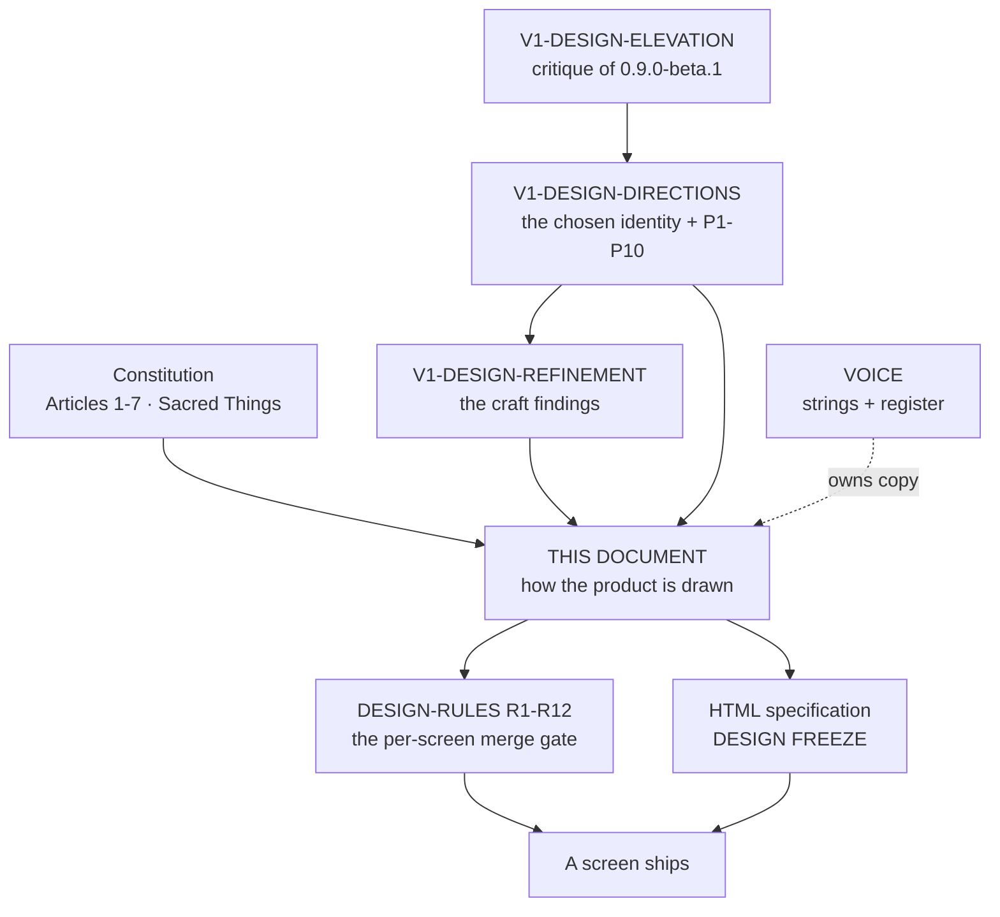
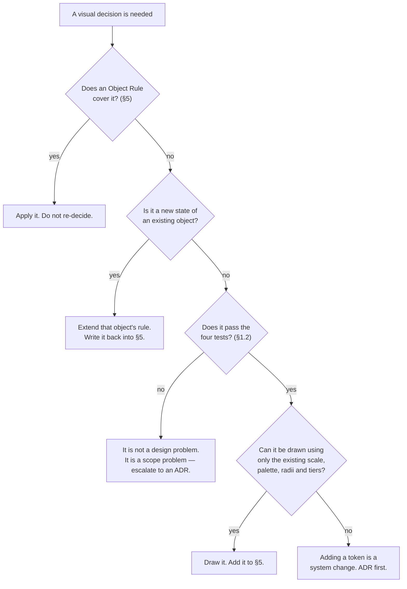
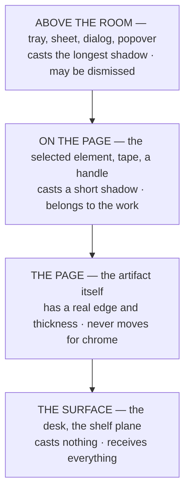

# The Zinely Design System

> **What this is.** The design specification for Zinely V1 — a *product-specific* design
> system, not a component library, not Material Design, not an Android style guide. Everything before
> this document explored. This document decides.
>
> **Its purpose is consistency, not discussion.** When implementation begins, every visual decision
> should be derivable from here. A future contributor should be able to design a screen this document
> has never seen, and arrive somewhere the rest of the product recognises. It is written **to become
> canonical** and is not canonical yet — see §0.2 and §0.3.
>
> **Status:** design-rank specification · 2026-07-22 · **proposed, pending the adjudication in §0.2.**
> Subordinate to [the constitution](zinely-constitution.md), which it may never contradict and never
> amends.

---

## 0. Before the rules

### 0.1 What is already decided, and is not reopened here

| Decided | Where |
|---|---|
| The job, the north star, the seven articles, the sacred things | [Constitution](zinely-constitution.md) |
| Tool identity: **Creative Workbench 2.0** · artifact identity: **DIY Zine Workshop** | [V1-DESIGN-DIRECTIONS](V1-DESIGN-DIRECTIONS.md), accepted |
| The information architecture: Library → Editor → Read → Print & fold → Completion | [ADR-058](DECISIONS.md#adr-058) |
| The palette — paper, paperEdge, desk, ink, inkSoft, and the four accents `tapeYellow` · `tapeCoral` · `tapeTeal` · `stampBlue` | [DESIGN-LANGUAGE §2](design/DESIGN-LANGUAGE.md) *(the palette's own home; an earlier draft credited [ADR-008](DECISIONS.md#adr-008), which is about beginner-first progressive disclosure and contains no colour)* |
| No dynamic colour — identity stays consistent and print-true | [ADR-048](DECISIONS.md#adr-048) |
| The voice, and every canonical string | [VOICE.md](design/VOICE.md) |
| The per-screen merge gate (R1–R12) | [DESIGN-RULES.md](design/DESIGN-RULES.md) |

This document does not re-pick colours, re-write strings, re-order screens, or re-argue the identity.
It specifies **how the decided product is drawn, composed, moved and worded** — and does so at the
level of intent, so that the specification outlives the toolkit implementing it.

### 0.2 The rank collision, stated rather than created

[DESIGN-LANGUAGE.md](design/DESIGN-LANGUAGE.md) currently self-describes as *"the design-system hub."*
This document claims the same ground for the visual and interaction layer. **Two hubs is precisely the
failure the [Documentation Rule](../CLAUDE.md#documentation-rule-mandatory) exists to prevent**, and I
am not going to resolve it by quietly writing a second one and leaving both standing.

The proposed resolution — **a docs-rank decision for the maintainer, not something this document may
enact:**

| Document | Keeps | Gives up |
|---|---|---|
| **This document** | Visual language, interaction language, composition, objects, motion, microinteraction, product-specific accessibility, anti-patterns | Nothing — it is new |
| [DESIGN-LANGUAGE.md](design/DESIGN-LANGUAGE.md) | §1 audience & emotional goals · §4 onboarding philosophy · §5 UX principles · §6 progressive disclosure · §8 first-time journey · §9 priorities · §12 sound · §13 brand personality *(itself a pointer to VOICE)* | §2 visual identity, §3 interaction philosophy, §7 accessibility, §10 motion, §11 haptics — these become pointers here |
| [DESIGN-RULES.md](design/DESIGN-RULES.md) | **Everything.** It remains the live per-screen merge gate | Nothing. §13 below *extends* it and never replaces a rule in it |
| [VOICE.md](design/VOICE.md) | **Every string, and the register.** Tone is architecture ([Sacred Thing 4](zinely-constitution.md#v-the-sacred-things-change--never)) | Nothing. §10 below governs *when the interface speaks*, never *what it says* |

Until that adjudication happens — by ADR, in one change that edits DESIGN-LANGUAGE — **the older
document is still canonical where the two overlap.** The most consequential overlap is motion: §10
there carries specific durations and easings; §8 here carries intent and no numbers. They are
compatible today because intent does not contradict a number. They will conflict the moment a motion
baseline is recorded, and that is the right moment to resolve it, with frames on the table.

### 0.3 Where these rules came from

Three of the sources are **proposals under review**, and this document inherits that status: it is
worth no more than its parents. It becomes canonical when the parents are accepted and §0.2 is
adjudicated — not by being written.

### 0.4 How to read it, and how to break it

- **No pixels, no dp, no milliseconds, no components.** Intent, relationships, principles. If a rule
  here can only be obeyed one way, it was written badly — say so and fix the rule.
- **Every rule states its reason.** A rule whose reason you cannot reconstruct is not enforceable; a
  reviewer must be able to say *"this violates X because Y,"* and a designer must be able to answer.
- **A rule loses only to an article, or to evidence.** Not to a deadline, not to a component library's
  default, not to a preference. Losing to evidence is normal and healthy: bring a measurement.
- **Amendment:** by a document of this rank, recorded as an [ADR](DECISIONS.md). Never by a feature that
  needs the exception — that is the constitution's own amendment rule and it applies downward.
- **Silence is not permission.** If the system does not cover a case, the case is designed *from the
  principles in §1*, and the resolution is written back into this document in the same change.

---

## 1. Design Philosophy

### 1.1 The one sentence

> **The tool is precise so that the artifact can be personal.**

Every difficulty in this product resolves through that sentence. Zinely is a workbench whose fit and
finish must be beyond question — because the thing made on it is a handmade object that should look
like a person made it, imperfections included. Precision in the chrome, the hand in the work. Confusing
the two produces both of this product's failure modes: a rough tool (which reads as a cheap app) or a
polished artifact (which reads as a template, and violates [Article 7](zinely-constitution.md)).

### 1.2 The four tests every decision passes

Applied in order. A decision that fails an earlier test does not get to argue the later ones.

1. **Does it help someone finish?** [§II, The North Star](zinely-constitution.md#ii-the-north-star) —
   FINISHING. *(A section, not an article: the constitution numbers its sections in roman and its
   articles in arabic, and they are not the same thing.)*
   A beautiful screen that adds a step is a worse screen. Time-in-app is a cost the user pays.
2. **Is the user's work the subject?** P1. If the composition's subject is chrome, a diagram, or an
   illustration of the idea of their work, the composition is wrong however well it is drawn.
3. **Is it the same as the last time we did it?** P2. A thing seen twice must be the same thing. New
   treatments are expensive in a way that is invisible per-screen and obvious across a product.
4. **Would it survive being handled?** The physicality test. Objects have edges, mass, one light
   source, and they do not change size when you reach for a tool. If the answer is "it's just UI," the
   *Creative Workbench* identity has quietly been abandoned.

### 1.3 The lowest-finish rule

**The perceived quality of the product equals the finish of its *least* finished surface, not the
average and never the best.** One misaligned tile makes a whole bathroom look badly laid; a row of
unlabelled circles four taps from a hand-drawn legend makes the legend look like an accident.

Operationally: **raising the floor beats raising the ceiling, every time.** Before adding craft
anywhere, find the least finished thing on the path a user actually walks, and bring it up to the
standard already set elsewhere in the product. The internal benchmark is the product's own best
drawing — currently the sheet diagram and its legend. When a surface is done, it should look like it
came from the same hand.

### 1.4 The governing metaphor, and its limit

**Physical paper on a lit surface.** The page is an object; the tray holds supplies; tape marks a
place; the sheet is a real sheet. This metaphor decides elevation, motion, radius, and most composition
questions without further argument.

Its limit, stated so it is not over-applied: **the metaphor governs behaviour, not ornament.** We do not
add drop-shadowed skeuomorphic textures because paper has them; we make things behave the way paper
behaves — settle, cast one shadow, keep their size, resist being in two places. Ornament that does not
also do a job is deleted ([R10](design/DESIGN-RULES.md)). Paper that behaves like paper is free;
paper that is *drawn* like paper costs contrast, performance, and taste.

### 1.5 The tool/artifact split, made operational

| | The tool (chrome) | The artifact (the user's zine) |
|---|---|---|
| Standard | Precise, quiet, consistent, invisible when not needed | Personal, imperfect, entirely theirs |
| Alignment | Exact, optically corrected | Whatever the user chose. Never corrected without them |
| Typography | One scale, applied without exception | The user's choice, including bad choices |
| Motion | Physical, interruptible, brief | The artifact does not animate itself |
| Who authors it | Us | **Them, always** ([Article 7](zinely-constitution.md)) |

The single most common way to violate this: improving the user's work on their behalf. Snapping,
alignment guides and fallback fonts *correct execution* and are permitted. Anything that changes intent
is authorship, and authorship is theirs.

### 1.6 The decision procedure

The load-bearing branch is the last one. **Every new token — a size, a radius, a colour, an elevation, an
easing — is a permanent tax on every future screen.** The system is small on purpose; growing it is a
decision, not a convenience.

---

## 2. Visual Language

### 2.1 Typography — scale and rhythm

Purpose defines the register; the register defines the treatment. See §6 for the full role table.

- **Five registers, not two.** The product currently has a display serif and a body sans with nothing
  between, so screens express *third-most-important* with bold and colour instead of size and space.
  There must be **one intermediate register** — a subhead — plus a metadata register and a caption
  register. Five is enough for every screen in the product; a sixth is a system change (§1.6).
- **Emphasis is carried by size, weight and space *before* colour.** Colour has no ordering: three
  emphasised words in three colours do not tell the reader which is first. Colour becomes
  meaning-bearing only where a legend exists.
- **Two families, each with one job.** A display serif carries identity and endings. A clean sans
  carries everything the user must read to act. A third face is a system change.
- **Rhythm is vertical and shared.** Line heights sit on one rhythm so that stacked blocks of different
  registers still align. Two labels beside each other share a baseline, or they are not beside each
  other.
- **Set, don't type.** Typographic apostrophes and quotes; deliberate en/em dashes; one ellipsis
  character; non-breaking spaces before units. This is a product about printed matter, and mixed
  punctuation is the cheapest possible evidence that nobody proofread the surface. *(Exception: strings
  frozen by an accepted ADR change only when that ADR is superseded.)*

### 2.2 Spacing and density

- **One spacing unit; every gap is a multiple of it.** Arbitrary spacing is the most common source of
  "sloppy" that never gets named as spacing.
- **Space encodes relatedness, and nothing else does.** Two elements closer together than their
  neighbours are claiming to be related. If they are not related, the spacing is a lie the user believes
  before they read anything.
- **Density is per-surface and consistent within it.** The Library is airy because it is a room. The
  editor tray is tight because it is a tray of supplies. What is forbidden is *drifting* density —
  three different rhythms inside one screen, which reads as three different authors.
- **Space is negotiated, not left over.** Emptiness reads as luxury only when something in the
  composition acknowledges it. Emptiness that is simply where the content stopped reads as *not loaded
  yet*.

### 2.3 Colour

Full rules in §7. Structurally: **the palette is fixed, the roles are few, and no colour is
decorative.** Dynamic colour stays off — identity must be consistent and print-true, not tinted by a
wallpaper ([ADR-048](DECISIONS.md#adr-048)).

### 2.4 Elevation, surfaces, and light

**There is one light source in this product. It is above, slightly forward, and it never moves.**
Inconsistent lighting is resolved by the eye as *collage*, not as depth — it is the difference between
a flat design that feels like a room and one that feels like slides.

**Exactly three tiers.** Not a ramp; three named places for a thing to be.

- **Shadow does the work; tonal elevation does not exist here.** Paper does not change colour when you
  lift it. A surface that indicates height by getting lighter is a toolkit convention, not a physical
  one, and it is the fastest way this product reads as generic.
- **The page always has an edge.** A rectangle of cream that runs off the screen is not a sheet; it is a
  background. Edge, hairline, cast shadow, surface beneath.
- **A shadow is a consequence, never a decoration.** If an element is not above something, it does not
  have one.

### 2.5 Paper

Paper is the artifact's material and the product's central object (§5.1). At the language level:

- Paper is **square-cornered.** This is a positive identity claim, not a missing radius (§2.7).
- Paper is **the brightest thing on screen** in both themes. Everything else is the room around it.
- Paper is **opaque.** Nothing shows through it; nothing tints it; chrome does not sit *on* it wearing
  a translucent scrim, because a scrim over the work is chrome winning (§12).
- Paper's **proportion is the truth of the artifact**: the folded booklet's proportion when we are
  showing a zine, the sheet's proportion when we are showing a sheet. Showing a sheet where the user
  expects a book is a manufacturing diagram in the place of their object.

### 2.6 Light theme and dark theme

**Two rooms, not one room inverted.** A theme derived by flipping values produces beige-on-beige, dark
system bars over cream, and a shadow ramp that was tuned on charcoal and disappears on paper. That
specific combination is the most recognisably *unfinished-Android* signal a product can emit.

Requirements, both themes equally:
- Real value separation between the surface and the paper — the page must read as the brightest object,
  not as a slightly different beige.
- System bars themed. Unthemed chrome is a port, visibly.
- The shadow ramp re-tuned per theme; a shadow is a value relationship, not a constant.
- Contrast verified over texture, not only over flat fill ([R8](design/DESIGN-RULES.md)).

Neither theme is the "real" one. Both are checked on a device, in daylight (§13).

### 2.7 Corners, borders, and hairlines

**Three radii exist. Nothing else does.**

| Thing | Corner | Why |
|---|---|---|
| Paper, and anything representing paper | **Square** | Paper does not have rounded corners. This is identity, not omission |
| Chrome — trays, dialogs, cards, sheets | **One shared radius** | Radius is a design system's signature; unrelated radii read as unrelated designers |
| Pills, chips, and round controls | **Fully rounded** | A separate category the eye reads as "a small stateful token," not a container |

**Borders are for the edges of materials, not for grouping.** A hairline says *this is where this
material ends*. Grouping is done with space (§2.2) and surface (§2.4). A box drawn around related things
is what a design does when it has not decided where things go.

### 2.8 Texture

Texture is permitted where it is **behind** content and costs nothing. Paper grain is a tint plus a
soft shadow, not a bitmap. Texture never sits under text at the expense of contrast
([R8](design/DESIGN-RULES.md)). If a texture must be dimmed to keep text legible, the texture has
already lost and should be removed rather than weakened — a barely-visible texture is a cost with no
benefit.

---

## 3. Interaction Language

> **Every interaction should feel physical, not animated.** The difference is not quality of animation.
> It is whether the thing responds *to you*, continuously, and can be caught mid-move.

### 3.1 The three properties that produce "physical"

1. **Immediacy.** The response begins on touch-down, not on gesture-recognition. Latency above the
   threshold where causation is perceived is read as *a request being processed*; no amount of
   subsequent animation quality recovers a late start.
2. **Continuity.** The thing tracks the finger 1:1 for the whole gesture. A gesture that plays a
   canned animation on release was a button all along.
3. **Interruptibility.** Any motion can be caught, reversed, or redirected mid-flight, from its current
   position and velocity — never from its start. **This is the single reliable divider between
   "physical" and "animated,"** and users never name it: they say the app feels slow, which it is not.

An interaction that has all three may be slower than one that has none and will feel faster.

### 3.2 Direct manipulation

- **You touch the thing you want to change.** Not a proxy, not a field, not a panel that represents it.
- **Preview equals commit.** What the gesture shows is what is committed — an
  [Article 2](zinely-constitution.md) obligation, applied at gesture scale.
- **The manipulated thing lifts.** Picking something up raises it one tier (§2.4) and it stays lifted
  until released. Depth is the state indicator; a coloured outline alone is a diagram of selection.
- **Every gesture has a visible twin, and the twin is *designed*.** This is the rule most often obeyed
  in letter and failed in spirit: shipping the accessible discrete controls, then giving them no design
  treatment, promotes an accessibility affordance to the primary interface for everyone and leaves it
  looking like debug UI. The twin is a first-class control ([R1](design/DESIGN-RULES.md),
  [R9](design/DESIGN-RULES.md), §11).

### 3.3 Selection

Selection is a **state of the object**, not a mode of the app. It raises the object, reveals the tools
belonging to it, and changes nothing else on the screen. Specifically: **selection never resizes the
page** (§8.2). Deselection is always available by touching away, and is never destructive.

### 3.4 Dragging

Follows the finger exactly, with no lag and no smoothing. Snapping assists at the end of the movement
and is felt (§3.7) rather than announced. A drag that is released outside a valid area **returns**
along a visible path rather than vanishing — the user must never wonder where their thing went.

### 3.5 Scrolling and containers

- **Anything that scrolls says so before it is scrolled.** A row whose second half is discovered by
  guessing is a design defect, not a discovery. Peek the next item, or don't scroll.
- Scroll position is preserved when returning to a surface. Losing it re-costs the user the navigation
  they already paid for.
- Nothing scrolls in two directions at once except the artifact itself when zoomed.

### 3.6 Transitions between surfaces

**Continuity over replacement.** When a thing exists on both sides of a navigation, it *moves*; it is
not destroyed and recreated at the destination. A cut asks the user to re-locate themselves; continuity
does not, and this is most of the difference between a product that feels *published* and one that feels
*functional*.

Where nothing is shared between two surfaces, a plain, quick, non-decorative transition is correct.
An elaborate transition between unrelated screens is the app performing.

### 3.7 Haptics

Haptics confirm **physical events only** — the snap into place, the pick-up, the press-on, the single
warm confirmation at the ending. Never routine taps, never navigation, never typing, never per-frame
during a drag: continuous haptics stop reading as craft and start reading as buzzing.

Haptics are **never the only signal** for anything, and always yield to the system setting. A haptic is
the second half of a feedback that is already complete visually.

### 3.8 Timing, without numbers

Three bands, named by what they are for:

| Band | For | Feels like |
|---|---|---|
| **Instant** | Acknowledgement of touch; state flips; anything the user is currently touching | Causation. Not perceived as animation at all |
| **Brief** | An element settling, a tray arriving, a control revealing | An object with a little weight coming to rest |
| **Deliberate** | Exactly one thing: the reveal at the ending (§9.4) | A moment, watched on purpose |

Rules that hold whatever the numbers turn out to be: **nothing in the Deliberate band exists outside
the ending**; a beginner must never wait on an animation to continue; and every band degrades to an
instant, already-correct static state under reduced motion (§11).

> **Open:** the existing durations and easings in [DESIGN-LANGUAGE §10](design/DESIGN-LANGUAGE.md)
> remain the implementation of these bands until a motion baseline is recorded on device. That
> recording is a **precondition** for changing any of them — see §0.2 and
> [V1-DESIGN-REFINEMENT](V1-DESIGN-REFINEMENT.md), *"Where this document stops."*

---

## 4. Composition Rules

### 4.1 Name the subject before composing

Every screen has exactly one subject, and on nearly every Zinely screen the subject is **the user's
work**. A composition whose subject is missing cannot be rescued by craft: spacing, type and colour
distribute attention, and there is nothing to distribute it toward. Before laying out a screen, finish
this sentence: *"the eye should land on ___, then ___, then ___."* Three stops. If there are five, the
screen has no hierarchy; if there is one, check that it is not chrome.

### 4.2 Hierarchy

- **One primary action per screen** ([R3](design/DESIGN-RULES.md)). Two primaries is zero primaries.
- Hierarchy is built from **size, weight, space and position** — colour last (§2.1).
- **Chrome never outranks content.** If the brightest, largest or most saturated thing on screen is
  ours rather than theirs, the hierarchy is inverted regardless of how good it looks.
- The next step is unmistakable to a stranger in under two seconds
  ([R2](design/DESIGN-RULES.md)).

### 4.3 Alignment, and optical alignment

- Everything aligns to something, and the thing it aligns to is nameable.
- **Optical over mathematical.** Centring is judged by visual mass, not by geometry: a page beside a
  heavy tray is centred against the tray's pull, not against the screen's midpoint. Round shapes overhang
  their optical bounds; punctuation hangs; icon and label align on the label's optical centre, not its
  box.
- Two typographic objects that touch must have a stated relationship — shared baseline, shared cap
  height, or deliberate separation. *Nearly* aligned is worse than obviously separate, because the eye
  detects the error without locating it.
- **The one place near-alignment is correct: things placed by a hand.** Tape, and the rotation of page
  cards, are hand-placed and must not be regularised. That is the artifact's register, not the tool's
  (§1.5), and it is codified in [R10](design/DESIGN-RULES.md) — *"a tape strip **is** the current-page
  marker."*

### 4.4 Negative space and visual silence

Silence is a design element with a job: it separates, it elevates by isolation, and it gives the eye
somewhere to rest between the three stops. **Silence must be composed** — bounded by a surface, an edge,
or a deliberate proportion. Unbounded emptiness is not silence; it is absence, and the user reads it as
something failing to load.

Corollary: **the interface says nothing when it has nothing to say.** No status where there is no
status, no reassurance nobody asked for, no label restating what the shape already communicates.

### 4.5 Reading order

The visual order and the accessibility order are **the same order**, and both match the order in which
the user needs the information ([R9](design/DESIGN-RULES.md)). If the screen reader's traversal
surprises you, the layout is wrong — not the traversal.

### 4.6 Subject placement and the thumb

Primary actions live in the thumb zone; nothing important lives in the top corners
([R7](design/DESIGN-RULES.md)). The work sits above the hand, not under it: chrome is placed so that
manipulating the work does not require covering it.

### 4.7 The page is the fixed point

The most important compositional rule in the product, stated once here and enforced in §8.2: **layout
changes move the chrome around the work, never the work around the chrome.** If space must be claimed,
the whole scene offsets as one rigid body; the artifact does not resize.

---

## 5. Object Rules

Each object: **what it represents · how it behaves · how it must never behave.** These are the
system's nouns. A new object is a system change (§1.6) and needs an ADR; a new *state* of an existing
object is written back into that object's entry in the same change.

### 5.1 Paper (the page)

- **Represents:** the artifact itself — one page of the user's zine. The most important object in the
  product.
- **Behaves:** square-cornered, opaque, brightest thing on screen; has an edge, a thickness and a cast
  shadow under the one light source; sits on a surface; is optically centred against the visual mass of
  the chrome; holds its proportion truthfully; is directly manipulable; is always present in the editor.
- **Never:** resizes because chrome appeared · takes a corner radius · is tinted by a theme accent ·
  is covered by a translucent scrim · is shown at the sheet's proportion when the user is thinking about
  a book · is animated for its own sake.

### 5.2 Booklet

- **Represents:** the finished thing — eight pages in reading order, the object the user set out to
  make.
- **Behaves:** a book proportion, a cover, a spine side and a fore-edge; belongs to the user, so its
  cover is *their* cover. ⚠️ **Turning rather than fading is a preference this document may not
  settle:** [ADR-058](DECISIONS.md#adr-058) lists *"page-turn animation"* under **Not decided here**,
  so it is an open decision, not a rule — recorded in §15.
- **Never:** is represented by a diagram of the sheet · is used as a decorative graphic where a real
  booklet could be shown · has pages the user cannot reach.

### 5.3 Shelf

- **Represents:** the room the user's finished and in-progress things live in. The answer to *"which
  zine do I want?"*
- **Behaves:** it is a **surface with an edge and a light source**, not a grid. One item on a shelf is a
  composition; one cell filled in a grid is a state. New zines come from a *place* on the shelf — an
  edge, a slot, a labelled surface — rather than from a floating button hovering over it.
- **Never:** reads as "not loaded yet" when nearly empty · sorts or regroups itself without the user ·
  presents a count as a score (§12.13).

### 5.4 Card

- **Represents:** one zine, standing in for it — the thing the user recognises theirs by.
- **Behaves:** it is a small paper object resting on the shelf; it shows the zine's own cover, at the
  booklet's proportion; it carries a name and quiet metadata in the product's metadata register; it
  **becomes** the editor rather than being replaced by it (§3.6); held, it lifts continuously under the
  finger before any menu commits.
- **Never:** shows generated artwork standing in for the user's work (§12.2) · shows the sheet's
  proportion · gives a destructive action the same rhythm and weight as a routine one.

### 5.5 Tray (Supplies)

- **Represents:** the supplies within reach on the workbench. Called **"Supplies"** — canonical in
  [VOICE](design/VOICE.md), and correct.
- **Behaves:** lives above the room (§2.4); arrives over the scene; holds a small, stable set of tools;
  its contents are drawn in one hand at one stroke weight on one optical grid; it is reachable by thumb.
- **Never:** grows merely because a tool was added — a tool joins the tray only by displacing or nesting
  another ([Article 1](zinely-constitution.md)) · shrinks the page to make room (§4.7) · uses the
  platform's emoji font to do icon work · presents its contents as an undifferentiated row.

### 5.6 Dialog

- **Represents:** a stop. The rarest object in the product, and its rarity is the point.
- **Behaves:** used only when a choice genuinely cannot be deferred or undone; states what happened and
  the way forward; offers a real exit, not only a retry ([Article 5](zinely-constitution.md)); names the
  safety net when there is one.
- **Never:** confirms something that could simply be undone · uses fear grammar ("cannot be undone") ·
  interrupts making · carries an error code · is the way the app asks a question it could have answered
  itself.

### 5.7 Chip

- **Represents:** one small, stateful token — a setting, a filter, a fact about the artifact.
- **Behaves:** fully rounded (§2.7); its state is legible **without colour** (§7.2); if its colour
  encodes meaning, a legend is present in the same view.
- **Never:** claims the screen's highest-status position for a low-status fact · encodes meaning
  through colour alone · appears twice saying the same thing on the same path.

### 5.8 Button

- **Represents:** an action the user can take now.
- **Behaves:** exactly one primary per screen, unmistakable; secondary actions visibly quieter;
  labelled with a verb from [VOICE](design/VOICE.md); hit area larger than its paint; disabled state
  legible above the contrast floor and distinguishable from both enabled and absent — **and matching
  what the platform accessibility tree actually reports**
  ([device verification](../CLAUDE.md#device-verification-mandatory)).
- **Never:** competes with another primary · says what it does in an emoji · is disabled without the
  reason being discoverable · looks broken when it merely is not available yet.

### 5.9 Toolbar

- **Represents:** the tools belonging to the currently held thing.
- **Behaves:** appears with selection, grouped by kind, with separators and labels; its groups have a
  stated order that does not change between sessions; it is a *designed* surface even though it exists
  to satisfy the visible-twin rule.
- **Never:** is a horizontally scrolling row of identical unlabelled circles · hides half its contents
  past an invisible scroll edge · reorders itself contextually · takes space from the page (§4.7).

### 5.10 Thumbnail (the page strip)

- **Represents:** the eight pages, all visible together, so the booklet's structure is obvious
  ([DESIGN-LANGUAGE §5](design/DESIGN-LANGUAGE.md)).
- **Behaves:** small paper cards, hand-placed with slight rotation; the current one carries tape, which
  **is** the marker ([R10](design/DESIGN-RULES.md)); each shows its page's real content.
- **Never:** is regularised, angle-tuned, or made consistent — that would delete the product's most
  zine-literate detail · is drawn at its hit size · marks the current page with chrome when the tape
  already does it.

### 5.11 Preview

- **Represents:** a promise about the body the artifact will take. Constitutionally load-bearing:
  **truth of preview** is a [Sacred Thing](zinely-constitution.md#v-the-sacred-things-change--never).
- **Behaves:** shows what will actually come out, including the bad news — a character that cannot
  render is announced, a margin the printer cannot reach is drawn; it is generated by the same path that
  generates the output, so parity is structural rather than maintained.
- **Never:** flatters · silently substitutes · shows an idealised render · is used as a decorative
  graphic. A preview that is prettier than the output is a lie the user discovers at the printer, and it
  spends trust that took the whole product to earn.

### 5.12 Tape

- **Represents:** a hand placing a marker. The artifact's register appearing inside the tool, on
  purpose.
- **Behaves:** hand-placed, slightly rotated, never identical twice; it is always *also* a state
  ([R10](design/DESIGN-RULES.md)).
- **Never:** appears purely as decoration · is applied to chrome that has no state to mark · is
  straightened.

---

## 6. Typography Rules

Roles, not sizes. The implementation derives the scale; the scale never derives the roles.

| Role | Its job | Rules |
|---|---|---|
| **Display** | Identity, and endings | Serif. Rare, therefore heavy when it lands. Reserved for the wordmark, the ending, and the one sentence per screen that carries the product's voice. Never used for a label |
| **Heading** | Names the surface the user is on | One per screen. Answers *where am I*, never *what should I do* |
| **Subhead** | The missing register — third-most-important | Carries emphasis that would otherwise be expressed with bold and colour. Groups content; introduces a step |
| **Body** | Everything the user reads to act | The clean sans, at comfortable measure. Never justified, never below the contrast floor, never grey-on-grey for "softness" |
| **Metadata** | Quiet facts about the artifact | Small caps, wide-tracked, on a baseline shared with what it describes. The product already has this right in its `8-PAGE MINI · A4` line — everything else matches *it* |
| **Caption** | A note attached to something visible | Adjacent, aligned to its subject, never floating |
| **Button** | The action | Verb-first, from [VOICE](design/VOICE.md). Sentence case. Never a glyph alone; never an emoji standing in for an icon |
| **Label** | Names a control | Shortest true noun or verb. If a label needs a qualifier, the control is wrong |
| **Instruction** | Tells the user what to do at the moment they need it | Present tense, second person, one idea per line. Appears at the moment of need and is dismissible. Shows before it says, and says before it instructs (P7) |
| **Warning** | Names something that will actually go wrong | Plain, specific, non-punitive; states the way forward in the same breath. Never carries an error code, never uses colour as its only signal |
| **Empty state** | Invites | An invitation, never a report of absence. The action lives where actions live — the empty state does not sprout its own buttons if a tray already owns them ([ADR-033](DECISIONS.md#adr-033)) |

Cross-cutting:
- **One idea per line.** Beginners scan. No paragraphs inside the interface.
- **Emoji are seasoning, never structure** ([VOICE §2](design/VOICE.md)). A glyph *inside* a button is
  structure and is forbidden; a single emoji punctuating a warm line is within the rule.
- **Numbers that name the artifact are set as metadata**, not as body text. "Page 3 of 8" is a fact
  about their object, and it should look like the fact on the card.

---

## 7. Colour Rules

### 7.1 Every colour has a job; every job has one colour

| Job | Which colour | Rule |
|---|---|---|
| **The artifact's surface** | Paper cream | Only the artifact and things standing in for it |
| **The room** | Desk charcoal (dark) / a lighter warm grey (light) | Everything that is not the artifact |
| **The artifact's ink** | Ink, ink-soft | Text the user reads. Two values, not four |
| **The user's next action** | The accent | **One accent, one meaning.** If it is orange, the user should be able to learn in a single session that orange means *this is your move* |
| **State that must be decoded** | The secondary accent | Permitted **only where a legend is present in the same view** |
| **The hand** | The tape colours | The artifact's register (§1.5). Chrome does not borrow them |

There is **no third accent role**, and no colour whose job is "to look nice here."

### 7.2 Where colour is forbidden

- **As emphasis in running text.** Emphasis is size, weight and space (§2.1).
- **As the sole carrier of any meaning** — state, category, validity, selection, or availability. There
  is always a second signal: a label, a shape, a position, an icon (P6, [R9](design/DESIGN-RULES.md)).
- **On the artifact's own surface**, unless the user put it there. Our accent never appears on their
  page.
- **As decoration.** A colour with no job is deleted, not muted ([R10](design/DESIGN-RULES.md)).
- **Encoding a distinction with no legend.** Two chips in one colour and two in another, meaning
  something, with nothing on screen to decode it, is a good idea rendered invisible — and it costs the
  user a low-grade, continuous "I am half-noticing a pattern I cannot resolve."

### 7.3 Contrast

AA at minimum for everything, **including over texture** ([R8](design/DESIGN-RULES.md)), in both
themes, verified on a device in daylight rather than in a simulator. Disabled states are held above the
floor: *unavailable* and *broken* must not look the same, because a user who reads a control as broken
generalises it to the app.

### 7.4 Colour and the artifact

The user's photos are the most saturated things in the product, and they should be. Chrome is
deliberately quieter than any content the user brings, on every screen, at all times. If a screen's
brightest area is ours, it is wrong.

---

## 8. Motion Rules

### 8.1 When things move

Motion has exactly three jobs, and a motion that does none of them is deleted:
1. **To show causation** — you did this, and this happened.
2. **To preserve continuity** — this thing is the same thing, moved (§3.6).
3. **To mark the ending** — once, at the end, on purpose (§9.4).

### 8.2 What never moves

- **The page never resizes.** Not for a tray, not for a keyboard, not for a selection, not for a
  toolbar. If space must be claimed, the whole scene **translates as one rigid body**. This is the
  single most damaging violation available in this product: physical objects do not change size when you
  pick up a tool near them, and almost every other physicality claim is downstream of this one being
  true.
- **The work never moves unless the user moves it** (P3). Auto-scroll, auto-centre, and helpful
  repositioning are all the same defect wearing different names.
- **The room does not move.** Backgrounds are still. Parallax on a workbench is the app performing.

### 8.3 What may stretch, rotate, or settle

| May | May not |
|---|---|
| Tape settles onto a card | The page rotates for effect |
| A card lifts and tilts a hair when held | The artifact scales to fit chrome |
| A dropped element settles with a small, single overshoot | Anything bounces more than once |
| A tray slides in over the scene | A screen zooms through another screen |
| A booklet page turns — *if* a turn is adopted (§5.2) | Text animates in per-character |

### 8.4 Interruption

**Every motion is interruptible, from its current position and velocity.** A half-committed navigation
that is abandoned returns; it does not complete and then reverse. An uninterruptible animation is
experienced as latency, and the user attributes it to the app being slow.

### 8.5 Settling

Things arrive by decelerating, the way objects with a little weight come to rest. A single, small
overshoot is permitted where something is *landing*; a spring large enough to be noticed as a spring is
toy-like and belongs to a different product.

### 8.6 Reduced motion

Motion is always decorative **on top of an already-correct static state** — never the only signal that
something happened. With reduced motion on, every animation degrades to an instant state change or a
plain cross-fade, and no information is lost. If disabling motion loses information, the design was
using motion as content.

---

## 9. Microinteraction Rules

> Nothing here should feel accidental. Each of these is a moment the user will meet dozens of times, and
> the cumulative impression of a product is mostly made of them.

### 9.1 Selection and deselection

Touch-down lifts the object immediately (§3.1); the tools belonging to it appear; nothing else on the
screen changes size or position. Deselection is available by touching away and costs nothing.
Multi-touch on the object continues to manipulate it — selection is not a mode you must exit.

### 9.2 Deletion and undo

- Deletion is **separated and slowed**, never given the same rhythm as a routine action beside it — a
  divider, a gap, a calmer target.
- Deletion is **undoable in place**, offered as an action rather than a modal, and the offer stays long
  enough to be read by someone who is surprised.
- **Undo is visible, trustworthy, and says so.** In a product with no cloud and no restore, undo and
  autosave are the entire safety net, and the interface's willingness to state that is what makes
  experimentation feel safe ([R6](design/DESIGN-RULES.md), [Article 3](zinely-constitution.md)).
- A true confirmation exists only where an action is genuinely unrecoverable, and it is kind, specific,
  and names what will be lost — never "are you sure."

### 9.3 Page turn

The page strip is the map; turning is the movement. The chosen card lifts, the tape settles onto it,
and the artifact changes. **The transition is between two states of one object, not between two
screens** — the user is turning a page in their book, not navigating.

### 9.4 Completion — the ending

The most protected moment in the product, because [finishing is the north
star](zinely-constitution.md#ii-the-north-star).

- **It is earned, brief, and singular.** One celebration, at the genuine ending, never as a lever
  ([Article 4](zinely-constitution.md)). If everything celebrates, nothing does.
- **It leaves an object behind.** An ending that plays and vanishes is entertainment; an ending that
  leaves the finished thing on screen — theirs, holdable, sitting on the shelf afterward — is proof.
  This is the difference users describe to other people.
- **The app does not congratulate itself.** The subject of the ending is their zine, not our export.
- **It is quiet.** The register is the display serif and a short sentence, not confetti. The product's
  own best line — *"Your zine is a book."* — is the standard.

> ⚠️ **Disclosed conflict, not resolved here.** [DESIGN-LANGUAGE §10](design/DESIGN-LANGUAGE.md) still
> specifies *"a gentle confetti/sparkle at export"* and [VOICE](design/VOICE.md) still carries
> *"Your zine is ready! 🎉"* as the canonical export string — and §0.2 above says the older documents
> win where they overlap. The build agrees with *this* section, not with those: confetti was
> explicitly rejected by [ADR-040](DECISIONS.md#adr-040) (*"a static payoff is calmer, testable, and
> reduced-motion-safe"*), and [ADR-051](DECISIONS.md#adr-051) retired that Completion surface into the
> quiet staged reveal. **The design documents are stale, not wrong-headed**, and correcting them is a
> docs change that belongs with the §0.2 adjudication — see §15. Until then this paragraph describes
> the shipped ending and the two references describe a rejected one.

### 9.5 Print

Print is where [Article 2](zinely-constitution.md) is either kept or broken in public.

- Show the sheet truthfully, including what the printer cannot reach.
- Say what will happen before it happens, in the user's terms — one sheet, one cut, folds.
- Settings that will damage the result are named as such, in words, not encoded in a colour.
- Failure offers an exit, not only a retry, and never blames the user or the printer.

### 9.6 Fold

Fold is instruction, and instruction obeys **show, then say, then instruct** (P7): the diagram carries
the information, the sentence names what the diagram shows, the instruction tells them what to do with
their hands. The product's existing fold copy is professional and is not a refinement target; the
composition around it is.

### 9.7 Success

Success is stated once, quietly, in the moment, and then gets out of the way. Transient confirmations
must be **true at the moment they appear** — a "saved" that fires when a save is *scheduled* is a small
dishonesty that becomes a large one exactly when it matters
([Article 5](zinely-constitution.md)).

⚠️ **The current build violates this by accepted decision, and the rule does not overturn it.**
[ADR-034](DECISIONS.md#adr-034) shipped the *"Saved ✨"* chip on mark-dirty as an explicitly accepted
limitation; [ADR-035](DECISIONS.md#adr-035) added the honest failure banner that suppresses it. That is
a live tension between a shipped decision and this rule, and closing it needs a superseding ADR — not
a design system asserting the rule harder. Recorded in §15.

### 9.8 Error

Name what happened in plain words, then the way out. Never a code, never blame, never a euphemism, and
**never a warm dead-end** — kindness is not a substitute for an exit. Where the safety net is real, say
so: for this audience, the fear is always *losing what they made*. Strings from
[VOICE](design/VOICE.md).

### 9.9 Loading

Zinely is offline and local, so most waits are short and should be *absent* rather than decorated. Where
a wait is real, the interface shows the thing arriving rather than a substitute for it, and it never
replaces already-correct content with a spinner. A skeleton that is prettier than the content is a
promise the content will break.

### 9.10 Empty

Emptiness is an invitation with a next step, never a report of absence
([R4](design/DESIGN-RULES.md)). It is a *composition* — a surface with one thing missing, not a void
where content stopped. And it does not duplicate an action that already lives somewhere permanent on
the same screen.

---

## 10. Writing Rules

> [VOICE.md](design/VOICE.md) owns **what the product says** — the register, the personality, and every
> canonical string. This section owns **when it speaks, how much, and when it should say nothing.**
> Where the two touch, VOICE wins: tone is architecture and survives redesigns
> ([Sacred Thing 4](zinely-constitution.md#v-the-sacred-things-change--never)).

- **Speak at the moment of need, not before.** Reassurance offered before the user has a worry is
  answering a question nobody asked, and it costs the screen's most valuable space. Say it **once**,
  warmly, where it lands — twice on one path is a rule violation, not emphasis.
- **Length is a decision.** Short is usually right; short is not always right. *"It looks scrambled on
  purpose — the fold puts every page in order"* is long because it names a fear before the user feels
  it, and tightening it would remove the work it does. Cut words that carry nothing; never cut words
  that carry reassurance.
- **Humour is dry, rare, and never at the moment of failure.** The voice is the crafty friend, not the
  comedian. A joke in an error message is the interface enjoying itself while the user is stuck.
- **Instructions are sequenced show → say → instruct** (P7). If the drawing is doing the work, the
  sentence names what the drawing shows rather than repeating it.
- **Warnings are honest before they are kind.** "This font can't print that character yet" beats a warm
  sentence that lets it print blank. Honesty is often ugly, and we ship it
  ([Article 5](zinely-constitution.md)).
- **Celebration only at genuine endings**, in the display register, one sentence
  ([Article 4](zinely-constitution.md), §9.4).
- **One name per thing, everywhere — including screen-reader labels.** Three names for two places is not
  a copy defect; it is a *model* defect, because the user builds their map of the product from its
  nouns. A good internal word that appears nowhere the user can learn it is either taught or retired,
  never kept as a synonym.
- **When there is nothing to say, say nothing.** Silence is a composition element (§4.4) and the
  quietest tool is the most trusted one ([Article 4](zinely-constitution.md)).

---

## 11. Accessibility Rules

> Platform guidance is not repeated here. These are the rules that are specific to *this* product, and
> they exist because accessibility in Zinely is not compliance — it is the same craft, applied where it
> is hardest to fake. The beginner audience *is* the accessibility audience
> ([Article 6](zinely-constitution.md)).

1. **The visible twin is designed, not merely present.** Every gesture has a discrete-control twin
   ([R1](design/DESIGN-RULES.md)) — and that twin is subject to every rule in this document. Shipping
   the twins undesigned promotes a compliance artifact to the primary interface for everyone. This is
   the product's most instructive past defect and the reason P6 is worded as a design principle rather
   than a task.
2. **Announce the artifact, not the chrome.** A screen reader user is making a zine, not operating a
   toolbar. The labels describe *their* content and *their* position in it — "page 3 of 8, your photo,
   centred" — before they describe our controls.
3. **The platform's tree is the truth.** A control can pass a framework semantics test while telling the
   platform it is enabled. Read the real accessibility tree on a real device
   ([device verification](../CLAUDE.md#device-verification-mandatory)); a green suite is not evidence.
4. **The static state is always already correct.** Motion, colour and haptics are each a *second*
   signal, never the first. Turn each off in turn: the interface still works and still tells the truth.
5. **Hit exceeds paint, always**, and adjacent destructive and non-destructive targets never share a hit
   boundary.
6. **Reading order is the design's order** (§4.5). Fixing traversal with an override is treating the
   symptom.
7. **Accessibility is a merge gate, not a backlog** ([Article 6](zinely-constitution.md)). A screen that
   fails it is not done, in the same sense that a screen with the wrong colours is not done.

Craft consequence worth stating plainly: **every one of these rules makes the product better for
everyone.** Bigger hit areas, honest states, a static state that already works, one name per thing —
these are the same details in §12's list of what makes an app feel expensive. There is no tradeoff
here to manage.

---

## 12. Anti-Patterns

Never allowed. Each with its reason, because a prohibition nobody can justify is a prohibition someone
will eventually route around.

### 12.1 The page resizes
**Why:** physical objects do not change size when you pick up a tool near them. It is invisible as a bug
because the app still "works," and it silently falsifies the entire workbench identity. (§8.2)

### 12.2 The user's work is replaced by placeholder artwork
**Why:** the product's job is *proof that you made a thing*. Showing a picture of the idea of their work
where their work should be is the fastest trust judgement in a creative tool, and it is made in the
first second on the first screen.

⚠️ **The current build violates this on the shelf card**, and the violation has two different
authorities that must not be blurred together:

- **The shelf card.** The card prints a generated riso cover hashed from the zine's *title*, while
  [ADR-045](DECISIONS.md#adr-045)'s page-1 thumbnail pipeline still exists and is deliberately unread
  — the producer, its ADR and its tests are untouched, and `HomeZineCard.thumbnail` documents this in
  its own KDoc. The blocker is therefore a **frozen-Shelf owner decision**, recorded in ADR-045's
  2026-07-20 closure note, **not an ADR deferral** — and reviving the pipeline is named there as an M6
  owner decision. The producing behaviour largely exists; what is missing is the owner's call.
- **The imposed sheet's panels.** *That* is the ADR deferral —
  [ADR-058](DECISIONS.md#adr-058) Decision 7, *"drawing eight rotated miniatures on the sheet is a
  separate change with its own parity question. Naming it here stops it being smuggled in."* It is a
  different surface from the shelf, and an earlier draft of this section cited it for both.

Both are admitted by the Feature Tribunal at **roadmap rank** (*"Real covers on the shelf — KEEP"*).
**This anti-pattern binds new work immediately and records the existing violation honestly; it does
not authorise either fix.**

### 12.3 Chrome competes with content
**Why:** if the brightest, largest or most saturated thing on screen is ours, we have made an app about
an app. P1 is not a preference; it is the composition's subject. (§4.2, §7.4)

### 12.4 The app congratulates itself
**Why:** the achievement is theirs. Celebration that praises the tool converts a moment of pride into
marketing, and [Article 4](zinely-constitution.md) forbids celebration used as a lever. (§9.4)

### 12.5 A platform default is accepted without a decision
**Why:** defaults are where "generic Android" actually lives — not in any one screen, but in the
inherited elevation, radius, ripple, dialog, and stock floating button that nobody chose. Every default
is either explicitly adopted with a reason or replaced. **Unchosen is not neutral.**

### 12.6 An accessibility affordance shipped undesigned
**Why:** it becomes the primary interface for everyone, and it looks like debug UI. Twelve unlabelled
identical circles are the clearest possible case of engineering surfaced as interface. (§11.1)

### 12.7 Meaning encoded in colour alone
**Why:** it is undecodable for some users and *half*-decodable for everyone else, which is a continuous,
low-grade cost most designs never diagnose. (§7.2)

### 12.8 Emoji doing icon work
**Why:** the platform emoji font is a foreign illustration style, a foreign palette, a foreign optical
weight, and a different render on every OEM skin — so the icon set is literally not the same design on
two devices. (§6, [VOICE §2](design/VOICE.md))

### 12.9 A preview that flatters
**Why:** truth of preview is a [Sacred Thing](zinely-constitution.md#v-the-sacred-things-change--never).
A preview prettier than the output is a lie discovered at the printer, and it spends trust that took the
whole product to earn. (§5.11)

### 12.10 A warm dead-end
**Why:** kindness as a substitute for an exit is the worst combination the voice can produce — a
friendly sentence that leaves the user stuck, from a product whose only asset is trust.
([Article 5](zinely-constitution.md), §9.8)

### 12.11 A setting added to solve a design disagreement
**Why:** "make it configurable" is a feature wearing a craft costume, and it moves our unmade decision
onto the user. The tray never merely grows ([Article 1](zinely-constitution.md)).

### 12.12 The tool authoring the user's content
**Why:** the IKEA effect is contingent on contribution; automate the authorship and you automate the
love away. Assistance may correct execution — snapping, alignment, fallback fonts. It may never touch
intent. ([Article 7](zinely-constitution.md))

### 12.13 A count presented as a score
**Why:** a finished zine may *look* finished — that is **state**; a number that accumulates is a
**score**, and scores are the beginning of the engagement machinery this product refuses. The
underlying prohibition on engagement mechanics is [Article 4](zinely-constitution.md) and is
constitutional; the sharper *"state, not score"* phrasing is the
[Feature Tribunal's](zinely-constitution.md#vii-the-feature-tribunal) — **roadmap rank**, per that
section's own note that the table *"is amendable at roadmap rank."* *(An earlier draft of this
document attributed the phrasing to the article. [P8](V1-DESIGN-DIRECTIONS.md) had already corrected
exactly that error; reintroducing it is this milestone's recurring defect, recorded here rather than
silently fixed.)*

### 12.14 The same thing said twice on one path
**Why:** the second time is not emphasis, it is evidence that no one owns the path. Reassurance in
particular is a gift given once; given twice it becomes a claim being pressed.

### 12.15 Near-alignment in tool chrome
**Why:** the eye detects the error without locating it, and produces "sloppy" without ever producing
"misaligned." *(Hand-placed elements in the artifact's register — tape, page-card rotation — are the
deliberate exception and are never regularised. §4.3)*

### 12.16 A defect that becomes intended behaviour by surviving
**Why:** this is how design systems actually die — not by being overruled, but by being outlived. File
it as a defect; a defect nobody fixed is still a defect.

---

## 13. Review Checklist

> **This is the *design* gate, and it sits alongside [DESIGN-RULES.md](design/DESIGN-RULES.md), which
> remains the per-screen merge gate.** Run R1–R12 first; a screen that fails there is not ready for this
> list. Nothing here overrides a rule there. Engineering review is elsewhere.
>
> Two boxes below (copy-from-VOICE, contrast-over-texture) **echo** items DESIGN-RULES already owns.
> They are repeated deliberately so this list is runnable in one pass, and they are owned there: if the
> two ever differ, DESIGN-RULES is right and this list is stale.

**Subject and hierarchy**
- [ ] The screen's subject is named, and it is the user's work unless there is a stated reason.
- [ ] The three-stop reading path is nameable, and the visual order matches the accessibility order.
- [ ] Exactly one primary action; secondaries visibly quieter.
- [ ] Nothing of ours is the brightest, largest or most saturated thing on screen.

**Type**
- [ ] Every text element maps to a role in §6. No sizes invented for this screen.
- [ ] Emphasis is size / weight / space before colour.
- [ ] Punctuation is set, not typed. Metadata matches the product's metadata style.
- [ ] Copy is from [VOICE](design/VOICE.md); no placeholder, no system strings.

**Colour**
- [ ] Every colour on screen has a job from §7.1. No decorative colour.
- [ ] No meaning is carried by colour alone; anything encoded is legended in place.
- [ ] Contrast verified over texture, in both themes, on a device, in daylight.
- [ ] Disabled reads as *unavailable*, not as *broken*.

**Shape, space, light**
- [ ] Radii come from the three-value family; anything representing paper is square-cornered.
- [ ] One light source; shadows consistent; elevation is one of the three tiers.
- [ ] Every gap is a multiple of the spacing unit; space encodes relatedness truthfully.
- [ ] Emptiness is composed and bounded, not left over.
- [ ] Optical alignment checked, not just mathematical.

**Objects**
- [ ] Every object on screen has an entry in §5, and obeys its "never" list.
- [ ] The page does not resize for anything on this screen.
- [ ] Any new object or token is backed by an ADR.

**Motion and touch** *(verified in motion, on a device — not from a still)*
- [ ] Response begins on touch-down; drags track 1:1.
- [ ] Every motion is interruptible from its current position.
- [ ] Anything shared across a transition moves rather than being recreated.
- [ ] Nothing in the Deliberate band outside the ending.
- [ ] Reduced motion loses no information.
- [ ] Hit exceeds paint everywhere; destructive and routine targets do not share a boundary.
- [ ] Haptics only on physical events, never as the sole signal.

**Truth**
- [ ] Every claim the screen makes is true at the moment it is made.
- [ ] Every failure path offers an exit, not only a retry.
- [ ] Any preview on this screen is generated by the output path.
- [ ] Nothing is said twice on one path.

**Craft discipline**
- [ ] Checked at the smallest supported width and the largest text size.
- [ ] The platform accessibility tree was read, not the framework's semantics.
- [ ] The least-finished element on this screen is identified — and it is not below the product's
      benchmark (§1.3).
- [ ] Someone who has never seen the screen has looked at it.
- [ ] Anything left deliberately unpolished is written down, with the reason (§1.3, and
      [V1-DESIGN-REFINEMENT](V1-DESIGN-REFINEMENT.md), *"Things I would leave exactly as they are"*).

---

## 14. The question this system answers

> *If Jony Ive, Dieter Rams, and a veteran independent zine maker all reviewed the same screen, what
> would all three agree on?*

Start with where they **disagree**, because it locates the agreement precisely. Ive would refine the
object until no gesture is left in it. Rams would remove until only the function remains and then check
whether the product should exist. The zine maker would say both of you are describing something too
precious to photocopy, and that the wobbliness is the *point* — a zine that looks manufactured has lost
the only thing zines have.

That disagreement is not a problem to average out. **It resolves exactly along the tool/artifact split
(§1.5): Ive and Rams are describing the workbench; the zine maker is describing the thing made on it.**
Precision in the tool is what makes roughness in the artifact a *choice* rather than a limitation. The
product needs both, in their own places, and the entire system above is the machinery for keeping them
there.

Where the three actually converge — and these seven, not the rest, are the design system:

1. **The work is the subject; the tool is the servant.** Rams's *"good design is as little design as
   possible."* Ive's deference of the interface to the content. The zine maker's entire craft, which has
   never once been about the photocopier. If a screen's subject is the tool, all three reject it, for
   three different reasons that arrive at the same place.
2. **Honesty about materials.** Rams: *"good design makes a product understandable."* Ive: a material
   should behave like itself. The zine maker: a fold is a fold, toner is toner, the margin your printer
   cannot reach exists whether or not you drew it. Nothing pretends to be a material it is not — which
   is why our preview may not flatter, and why tonal elevation is not paper.
3. **Constraint is generative.** Rams's *"less, but better."* Ive's insistence that removal is the hard
   work. The zine maker's one sheet, eight pages, one cut — the constraint that makes a zine finishable
   by anyone in an afternoon. All three regard "we added more" as an admission, not an achievement.
4. **Nothing arbitrary survives.** Every dimension, every radius, every colour is answerable. The zine
   maker's version is unsentimental and the most quotable: *if you can't say why it's there, it's
   wasting toner.*
5. **The made thing must exist in the world.** Rams designed objects. Ive: the moment of holding it.
   The zine maker: you hand it to someone. All three would fail a design whose output only exists on a
   screen inside the app that made it — which is [Article 2](zinely-constitution.md), arrived at from
   three unrelated directions.
6. **It must be understandable without instruction.** Rams's self-explanatory product; the
   Ive-era Apple position that a well-made object teaches you to use it by being handled *(that
   phrasing is the marketing's, not a sourced Ive statement — treat it as the idea, not a quotation)*;
   the zine maker's absolute test — could a fourteen-year-old with a
   library photocopier do this? A screen needing a tutorial has failed all three.
7. **Ornament must earn its place — and the hand is not ornament.** This is the subtlest agreement and
   the one most easily lost. Rams would delete decoration; the zine maker would defend the crooked tape.
   They are not in conflict, because the crooked tape *is the current-page marker* — it does a job. The
   rule that satisfies all three: **decoration must also be an affordance, a state, or the visible
   evidence of a human hand** ([R10](design/DESIGN-RULES.md),
   [Article 7](zinely-constitution.md)). Nothing else.

**Everything else is style.** Serif or sans, cream or white, orange or teal, this decade's paper
texture — all of it is contingent, all of it is replaceable, and none of it is what this document is
for. The seven above are what must still be true when the toolkit, the platform, and the texture are
gone.

---

## 15. What this document does not own

Stated so the next contributor does not look for it here, and so this document does not quietly grow
into a second constitution:

| Not owned here | Owner |
|---|---|
| Whether a feature exists at all | [Constitution §VII](zinely-constitution.md#vii-the-feature-tribunal) at roadmap rank, [PRD](PRD.md), [ROADMAP](ROADMAP.md) |
| The strings | [VOICE.md](design/VOICE.md) |
| The per-screen merge gate | [DESIGN-RULES.md](design/DESIGN-RULES.md) |
| Architecture, modules, rendering, export | [ARCHITECTURE.md](ARCHITECTURE.md) |
| Any decision with a consequence outside design | An [ADR](DECISIONS.md) |
| The specific findings against `0.9.0-beta.1` | [V1-DESIGN-REFINEMENT](V1-DESIGN-REFINEMENT.md) — this document is the *general* rules those findings implied; it is not their replacement and does not restate them |

**Open items this document deliberately leaves open**, because closing them here would be deciding
something at the wrong rank:

1. **The §0.2 hub adjudication.** Needs an ADR and one edit to DESIGN-LANGUAGE.
2. **The motion baseline.** §3.8's bands have no numbers until motion is recorded on a device. The
   existing durations stand until then.
3. **The editor empty state.** Frozen by [ADR-033](DECISIONS.md#adr-033) and disputed by the critique.
   It needs a superseding ADR or a withdrawal — not a design system quietly restyling it.
4. **Real covers, and the three other additions** named in
   [V1-DESIGN-REFINEMENT](V1-DESIGN-REFINEMENT.md)'s disclosure table. §12.2 binds new work and records
   the existing violation; it does not authorise the change. The shelf half is an **M6 owner
   decision** ([ADR-045](DECISIONS.md#adr-045) closure note), the sheet half an **ADR deferral**
   ([ADR-058](DECISIONS.md#adr-058) Decision 7) — two different asks.
5. **The stale celebration copy.** [DESIGN-LANGUAGE §10](design/DESIGN-LANGUAGE.md) and
   [VOICE](design/VOICE.md) still describe a confetti ending that [ADR-040](DECISIONS.md#adr-040)
   rejected and [ADR-051](DECISIONS.md#adr-051) replaced. §9.4 discloses the conflict; correcting the
   two documents rides with the §0.2 adjudication.
6. **The optimistic "Saved ✨".** §9.7's truth rule and [ADR-034](DECISIONS.md#adr-034)'s accepted
   limitation are in live tension. Needs a superseding ADR, or an explicit re-acceptance.
7. **The page turn in Read.** Left open by [ADR-058](DECISIONS.md#adr-058); §5.2 records a preference,
   not a rule.

---

*Written to be the canonical visual specification for the next five years. It earns that by being
amendable at its own rank and by refusing to decide anything above it.*
