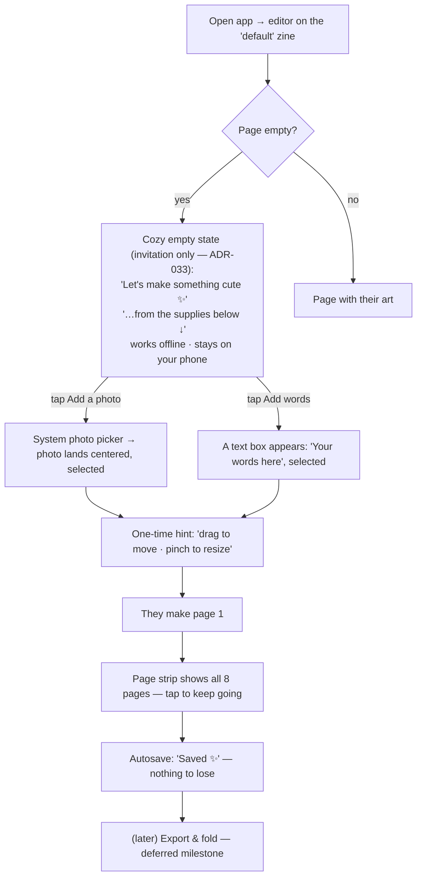

# Zinely — Design Language

> **The design-system hub — the companion design reference for how Zinely should *feel*.** Visual
> identity, interaction philosophy, onboarding, emotional goals, progressive disclosure,
> accessibility, motion, haptics, sound, and the first-time user journey. This is a **companion
> reference under the canonical doc system in [CLAUDE.md](../../CLAUDE.md)**, not a parallel
> source of truth: product scope (what & why) stays owned by [PRD.md](../PRD.md), the technical
> source of truth by [ARCHITECTURE.md](../ARCHITECTURE.md), and decisions by
> [DECISIONS.md](../DECISIONS.md) — this elaborates the *feel*, it does not redefine scope. The
> editor-surface specifics live in [editor-visual-direction.md](editor-visual-direction.md); the
> beginner-first decision in [ADR-008](../DECISIONS.md#adr-008). Status: design reference · 2026-06-28.

> **This document is the hub of the Zinely design references.** Focused companions each cover one
> area and are linked, not restated (per the [Documentation Rule](../../CLAUDE.md)). They are
> design references, not canonical owners — where they touch product scope or technical decisions,
> the [PRD](../PRD.md) / [ARCHITECTURE](../ARCHITECTURE.md) / [DECISIONS](../DECISIONS.md) win:
>
> | Companion | Covers |
> |---|---|
> | [VOICE.md](VOICE.md) | brand personality, tone rules, the microcopy library |
> | [EXPERIENCE-MAP.md](EXPERIENCE-MAP.md) | the emotional arc + end-to-end user journey |
> | [SCREEN-INVENTORY.md](SCREEN-INVENTORY.md) | every planned screen, its purpose + actions |
> | [DESIGN-RULES.md](DESIGN-RULES.md) | the non-negotiable per-screen review checklist |
> | [editor-visual-direction.md](editor-visual-direction.md) | the editor surface specifics |
> | [mockups/](mockups/) | the interactive HTML prototypes (working visual reference) |

---

## 1. Who this is for, and what they should feel

Zinely's primary audience is **beginners** — women, girls, kids, and creative hobbyists with
little or no design experience. Most creative tools are built for people who already know what
"layers," "canvas," and "export settings" mean. Zinely is built for someone who has never
opened a design app and just wants to make something with their photos and words.

The one feeling we are designing for, on the very first screen:

> **"Ooh — I want to make something cute."**
> *(not "I need to learn this editor.")*

Everything below is in service of that sentence. If a decision makes the app more powerful but
less inviting, the invitation wins (until [V1](../ROADMAP.md), where power can grow behind
[progressive disclosure](#6-progressive-disclosure)).

### Emotional design goals

| We want it to feel… | We avoid feeling… |
|---|---|
| cozy, warm, welcoming | clinical, corporate, "productivity" |
| cute, playful, handmade | precise, technical, intimidating |
| encouraging ("you can do this") | demanding ("learn these tools first") |
| like a craft table with supplies | like professional publishing software |
| forgiving (undo, autosave, no wrong moves) | punishing (lost work, dead ends, jargon) |

## 2. Visual identity

The metaphor is a **craft table**: a sheet of paper on a desk, with supplies (tape, stickers,
stamps, a glue stick) within reach. Chrome is "supplies," not "toolbars."

- **Palette — paper & ink + craft accents.** Implemented in the app theme
  ([ADR-008](../DECISIONS.md#adr-008)); dynamic color is **off** so the identity is consistent
  and print-true rather than tinted by the user's wallpaper.
  - `paper #F4EFE6` (sheet + cards), `paperEdge #E7DFD0` (edges/shadow)
  - `desk #3A3A3C` (the table behind the sheet — frames the bright page)
  - `ink #23201C` (text), `inkSoft #6B6358` (secondary)
  - accents: `tapeYellow #E9C46A`, `tapeCoral #E76F51`, `tapeTeal #2A9D8F`, `stampBlue #264653`
- **Handmade over precise.** Slight tilts, torn/taped edges, soft paper shadows, a little
  imperfection. Imperfection signals *"you made this,"* not *"a template made this."*
- **Texture, cheaply.** Paper grain via a tint + soft shadow + drawn tape/sticker shapes — no
  bundled bitmap assets for the MVP. Texture never costs contrast (see [accessibility](#7-accessibility)).
- **Type.** A friendly/marker face for chrome labels over a clean body face for editable
  content; a bundled marker font is a follow-up (export already bundles Inter,
  [ADR-028](../DECISIONS.md#adr-028)).
- **Microcopy is part of the identity.** Warm, first-person, encouraging, never error-shaped:
  *"Let's make something cute,"* *"Add a photo,"* *"Your words here,"* *"Saved ✨."* Never
  *"No elements,"* *"Empty document,"* *"Invalid state."*

## 3. Interaction philosophy

1. **Direct and physical.** You touch the thing you want to change. Drag to move, pinch to
   resize, two fingers to rotate — with visible handles. The page is an object on a table.
2. **Show the supplies; don't hide them in gestures.** Every core action has a *visible*
   affordance (a supply button, a tappable hint), not only a gesture. Gestures are a faster
   path for people who discover them, never the *only* path. (Audit: replace hidden
   double-tap-to-add-text with a visible control + a contextual hint.)
3. **One obvious next step.** On any screen, the single most useful action is the most
   prominent. No competing primary actions.
4. **Forgiving by default.** Autosave + undo/redo mean there is no "wrong" move; the UI should
   say so ("you can always undo"). Nothing is destructive without a gentle confirm.
5. **Reach-friendly.** Primary supplies sit in the thumb zone (bottom / lower-right); ≥48dp
   targets everywhere.

## 4. Onboarding philosophy

Research-backed ([research notes](editor-mockups/research-notes.md)): users skip long upfront
tutorials; **contextual, just-in-time guidance beats a front-loaded carousel**
([NN/g](https://www.nngroup.com/articles/mobile-app-onboarding/)).

- **No multi-slide tour.** The first run *is* the editor, with a warm empty state — not a
  walkthrough you dismiss before you can start.
- **The empty state is the onboarding.** One illustration-ish welcome + one-line value prop +
  the one or two actions that get you started ("add a photo," "add words"). Material 3
  [empty-state guidance](https://m3.material.io/foundations/content-design/empty-states).
- **Lead with the promise, gently.** Zinely's hook is *offline + no account + private*. A small,
  friendly line ("works offline · stays on your phone") turns the privacy constraint into
  reassurance without a legal wall.
- **Teach by doing.** After the first photo lands, a contextual hint reveals the next idea
  ("drag to move it · pinch to resize") — once, dismissible, never modal.
- **Celebrate progress.** Tiny positive feedback ("Saved ✨", a sticker pop) rewards action and
  reinforces that the user is *making* something.

## 5. UX principles (the checklist we hold ourselves to)

1. A first-time user can place their first photo/word **without reading anything**.
2. Every core action is reachable by a **visible control**, not only a gesture.
3. The screen is **never blank** — emptiness is an invitation, not a void.
4. Copy is **warm and human**, never system-error-shaped.
5. **Undo/redo and autosave are visible and trustworthy.**
6. All eight pages are **visible together** so the booklet structure is obvious.
7. Nothing intimidates: no jargon, no settings walls, no dead ends.
8. **Accessible to the same beginners** (large targets, screen-reader parity, AA contrast).

## 6. Progressive disclosure

Per [ADR-008](../DECISIONS.md#adr-008), the default surface is dead-simple; depth appears only
when asked for.

- **MVP surface:** add photo, add words, move/resize/rotate, switch pages, undo/redo. That's it.
- **Revealed on selection:** the context bar (nudge/scale/rotate/reorder/delete) only appears
  when something is selected — object-specific tools live next to the object.
- **Deferred behind intent:** templates, fonts, stickers, layers, crop, and export options are
  [V1+](../ROADMAP.md) and surface progressively, never crowding the first run.
- **Rule:** a control earns its place on the default surface only if a *first-time* user needs
  it to make their first zine. Everything else waits.

## 7. Accessibility

Accessibility is not a separate audience — it *is* the beginner-first audience (kids, varied
vision/motor ability). It is a first-class constraint, not a polish pass.

- **Touch targets ≥48dp**; primary actions in the thumb zone.
- **Screen-reader parity:** every visible control and on-canvas element has a meaningful
  semantic mirror; the editor already ships an element-semantics layer and an a11y context bar
  with single-pointer twins of every gesture (WCAG 2.5.7).
- **Contrast AA** on all text/controls, including over paper texture — texture never reduces
  legibility.
- **No gesture-only paths** (WCAG 2.5.1/2.5.7): everything doable by gesture is also doable by
  a discrete control.
- **Reduced-motion friendly:** playful animation is decorative and degrades gracefully.
- **Warm error states** are also accessible: announced, specific, and recoverable.

## 8. First-time user journey (target)

The **bolded leverage point** is step **C**: today the editor opens to a blank sheet with only
a small "Add image" button — functional, but it reads as a void, not an invitation. Turning that
first screen into a warm, encouraging empty state is the highest-impact, lowest-risk change
toward *"I want to make something cute."* It is the [chosen implementation slice](#9-implementation-priority).

## 9. Implementation priority

The next milestone is the **first-time creation experience**, not more editor power
([ROADMAP.md](../ROADMAP.md)). In rough priority:

1. **Empty-state invitation** (this slice) — cozy first-run surface + discoverable add-photo /
   add-words supplies. Highest leverage for reducing intimidation.
2. **Supply tray** — replace the lone FAB with a scrapbook-style tray (add photo, add words,
   undo, redo) so all primary actions are visible and on-brand.
3. **Contextual hints** — one-time, dismissible coach marks for move/resize, replacing reliance
   on hidden gestures.
4. **Page-strip polish** — richer paper-card thumbnails; reinforce "all 8 pages together."
5. **Visible undo/redo** + warm autosave feedback.

Out of scope for these slices (still deferred): home flow, library/project management, export
flow.

## 10. Motion

Animation in Zinely has one job: **make the app feel like handling paper and supplies, not
operating software.** Motion is physical, gentle, and brief — it reinforces craft, never shows off.

- **Philosophy — physical, not flashy.** Things move the way paper and stickers move: they settle,
  they have a little weight, they don't teleport. A photo *drops in* and settles; a sticker
  *presses on*; the current page *lifts* off the strip. Motion communicates a real-world
  action, so it teaches without words.
- **Easing.** Standard transitions use a gentle ease-out (decelerate — arrives softly, like
  something coming to rest). Playful "settle" moments add a *tiny* overshoot/spring (≈3–5%, one
  bounce) — enough to feel alive, never bouncy or cartoonish. Avoid linear (robotic) and avoid
  big springs (toy-like).
- **Duration.** Keep it quick so it never gates the user: micro-feedback ~100–150ms, standard
  element/transition ~200–300ms, a larger screen transition ~300–400ms. If a beginner ever waits
  on an animation, it's too long.
- **Page movement.** Switching pages: the chosen page card lifts, rotates a hair, and the tape
  settles onto it; the canvas cross-fades to the new page. The booklet feeling comes from cards
  that behave like real cards.
- **Card & paper interactions.** Selecting lifts an element slightly (shadow grows); dragging
  follows the finger 1:1 with no lag (use an ephemeral gesture frame); releasing settles with a
  soft ease-out. Resize handles track the pinch exactly — preview equals commit.
- **Delightful micro-animations (sparingly, earned).** A sticker-pop when the first element lands;
  a soft "Saved ✨" fade; a gentle confetti/sparkle at export ("Your zine is ready! 🎉"). Reserve
  the biggest celebration for the biggest win so it keeps meaning.
- **Reduced motion is first-class.** With the system reduced-motion setting on, every animation
  degrades to a simple cross-fade or an instant state change. Motion is always decorative on top
  of an already-correct static state — never the only signal that something happened
  ([accessibility](#7-accessibility)).

## 11. Haptics

Touch feedback makes the digital feel tactile — but overused it becomes noise. Use the lightest
appropriate effect, and only to confirm a *physical-feeling* event.

- **Yes, gently:** an element snaps to a guide (a light tick — the satisfying "it clicked into
  place"); an element is selected/picked up (a soft tap); a sticker presses on; export completes
  (one warm confirmation). These mirror real craft-table sensations.
- **No:** every drag frame, every scroll, routine button taps, typing, navigation. Continuous or
  ambient haptics drain battery and quickly feel like buzzing rather than craft.
- **Always optional & respectful.** Honor the system haptic setting; never the *only* feedback for
  anything (pair with a visual). A "Reduce haptics" affordance lives in
  [Settings](SCREEN-INVENTORY.md#settings) for the future.

## 12. Sound

Zinely is **silent by default.** Many users craft in quiet, shared, or public spaces, and
unexpected sound is the opposite of cozy.

- **Default: off.** No sound ships enabled. The app must be fully delightful muted.
- **Optional, opt-in, subtle.** *If* sound is ever added, it is a single opt-in toggle in
  [Settings](SCREEN-INVENTORY.md#settings), and limited to small, soft, organic craft sounds — a
  faint paper rustle, a soft sticker "tick," a gentle chime at export. Calm, never cute-loud,
  never UI-beepy.
- **Never required.** Sound is pure garnish on already-complete visual + haptic feedback; respect
  the silent/Do-Not-Disturb mode absolutely. Accessibility never depends on audio.

## 13. Brand personality

The voice that ties the visuals, motion, and copy together — *the crafty friend who makes you
feel talented* — is defined in **[VOICE.md](VOICE.md)**, alongside the reference microcopy library
every screen draws from. Visual identity (§2 above) and that voice are two halves of the same
personality; design them together.
