# Zinely — Experience Map

> **The single source of truth for the *emotional* arc and the end-to-end journey.** What the
> user feels at each step, where friction lives, and where to plant delight. The feelings
> themselves are defined in [DESIGN-LANGUAGE.md §1](DESIGN-LANGUAGE.md#1-who-this-is-for-and-what-they-should-feel);
> the screens in [SCREEN-INVENTORY.md](SCREEN-INVENTORY.md); the words in
> [VOICE.md](VOICE.md). Status: design SoT · 2026-06-28.

We are not designing screens; we are designing **momentum** — a sequence of small wins that each
make the next step feel worth taking. The risk for this audience is not confusion, it is
**discouragement**: one moment of "I don't get this" and they close the app and don't come back.
Every stage below is engineered so the user's confidence only goes up.

---

## 1. The emotional arc (target)

```mermaid
flowchart LR
    A["Open\ncurious"] --> B["Welcome\ninvited"]
    B --> C["First page\nsafe to try"]
    C --> D["First photo\n'oh, that was easy'"]
    D --> E["Add words\n'this is mine'"]
    E --> F["Decorate\nplayful flow"]
    F --> G["Mistake → undo\nrelieved, fearless"]
    G --> H["More pages\nmomentum"]
    H --> I["Preview\nproud"]
    I --> J["Print & fold\naccomplished"]
    J --> K["Share\nconnected"]
    classDef peak fill:#fff4d6,stroke:#e0a800;
    class D,J peak;
    classDef dip fill:#f6dcd2,stroke:#E76F51;
    class G dip;
```

The two **peaks** to protect at all costs: the **first photo landing** (proof it's easy) and
**export/fold** (proof it was worth it). The one designed **dip** is the first mistake — handled
well, it converts fear into fearlessness and is a turning point, not a low.

## 2. Stage-by-stage map

For each stage: the user's **goal**, the **UI** shown, target **emotion**, the **friction** to
remove, and the **delight** to add.

### Opening the app
- **Goal:** see what this is.
- **UI:** fast launch straight toward making (no splash marketing).
- **Emotion:** mild curiosity — *"what's this little craft app?"*
- **Friction to kill:** load spinners, account walls, permission prompts up front.
- **Delight:** warmth on the very first frame — paper, a soft accent, a friendly line.

### Welcome
- **Goal:** understand "I make a tiny printable book" in one glance.
- **UI:** [Welcome screen](SCREEN-INVENTORY.md#welcome) — headline, one-line value prop, one
  button ("Start making"), the privacy line.
- **Emotion:** invited, reassured.
- **Friction:** any second action competing with "Start"; jargon; a tour to dismiss.
- **Delight:** a tiny zine illustration that *folds* on entry (motion = the product's promise).

### First page (the empty editor)
- **Goal:** start without being told how.
- **UI:** [Editor](SCREEN-INVENTORY.md#editor) with the
  [empty-state invitation](SCREEN-INVENTORY.md#empty-state) — "Let's make something cute ✨",
  two visible supplies, the privacy line.
- **Emotion:** safe to try — *"I can't break this."*
- **Friction:** blank void, hidden gestures, no obvious first move. (This is the audit's #1 gap;
  the empty state is the fix.)
- **Delight:** the page looks like real paper on a desk; the supplies look pick-up-able.

### Adding the first photo — ★ peak
- **Goal:** see my photo in my zine.
- **UI:** system photo picker → the photo lands **centered and selected** with a soft pop.
- **Emotion:** *"oh — that was easy,"* the first real hit of ownership.
- **Friction:** tiny placement, unclear selection, no feedback. The photo must arrive big,
  obviously theirs, obviously movable.
- **Delight:** a gentle drop-in animation + a one-time hint "drag to move · pinch to resize."

### Adding words
- **Goal:** say something — a name, a date, a feeling.
- **UI:** "Add words" → an empty text box opens **straight into typing** (no placeholder to
  clear — see the [Add-text wiring](../DECISIONS.md#adr-008)).
- **Emotion:** *"this is mine now."*
- **Friction:** committed placeholder text, hidden double-tap, fiddly keyboard handoff.
- **Delight:** the cursor is already blinking; writing is the only thing to do.

### Decorating (stickers / tape — future)
- **Goal:** make it cute, play.
- **UI:** [Sticker picker](SCREEN-INVENTORY.md#sticker-picker) as a tray of supplies.
- **Emotion:** playful flow — the part that feels like crafting.
- **Friction:** too many options at once, a "library" that feels like work.
- **Delight:** stickers peel/stick with a little physicality; nothing is "wrong."

### Making a mistake → undo — ◆ designed dip → turn
- **Goal:** fix the thing I didn't mean to do.
- **UI:** a **visible** undo supply; "Removed — undo?" for deletes.
- **Emotion:** a flash of "oh no" → immediate relief → *"oh, I really can't break this."*
- **Friction:** undo hidden in a menu, destructive dialogs, lost work. Fatal if mishandled.
- **Delight:** undo is one obvious tap; the voice reassures ("you can always undo"). This is where
  a beginner becomes brave.

### More pages
- **Goal:** keep going; understand it's a booklet.
- **UI:** the [page strip](SCREEN-INVENTORY.md#page-navigator) — all 8 pages visible, current one
  taped.
- **Emotion:** momentum — *"I'm actually making a book."*
- **Friction:** pages hidden behind a pager; not knowing how many there are.
- **Delight:** tapping a page card lifts and tapes it; the booklet structure is tangible.

### Preview
- **Goal:** see the whole thing as a real object before committing paper.
- **UI:** [Preview](SCREEN-INVENTORY.md#preview) — the folded booklet, page through it.
- **Emotion:** proud — *"I made this."*
- **Friction:** a technical imposition sheet shown too early (that belongs at export).
- **Delight:** a booklet you can flip, at a believable size.

### Print & fold — ★ peak
- **Goal:** get it onto paper, correctly.
- **UI:** [Export](SCREEN-INVENTORY.md#export) — "Print & fold," plain format choices, then
  [fold instructions](SCREEN-INVENTORY.md#completion).
- **Emotion:** accomplished — the payoff the whole app exists for.
- **Friction:** export jargon, wrong scale, no fold guidance (the classic zine failure: prints at
  the wrong size and won't fold). "Actual size" guidance is essential.
- **Delight:** "Your zine is ready! 🎉" + clear, friendly fold steps.

### Sharing
- **Goal:** show someone / send the file.
- **UI:** [Completion](SCREEN-INVENTORY.md#completion) → "Send to a friend" via the system sheet
  (FileProvider, offline — no Zinely account or server).
- **Emotion:** connected, proud to show it.
- **Friction:** any hint of "upload to Zinely" (breaks the privacy promise and the trust built).
- **Delight:** sharing the *artifact* (PDF/PNG/photo of the folded zine), maker-to-friend.

## 3. Momentum rules (derived)

1. **Front-load the first win.** Photo-in-zine must happen within seconds and feel easy — it is
   the proof that funds every later step.
2. **Never let a low stay low.** The only negative beat (a mistake) must resolve into relief in
   one tap, on the same screen.
3. **Celebrate small, celebrate true.** Tiny rewards for real progress; save the big "🎉" for
   export so it still means something.
4. **End on connection.** The journey doesn't end at a saved file — it ends at "I showed someone,"
   which is what makes a maker come back to make another.

These feed the [implementation order in the roadmap](../ROADMAP.md): build the journey **in the
order the user lives it**, not feature-by-feature.
