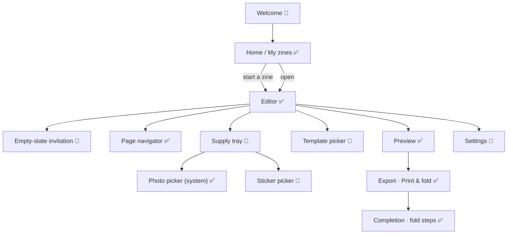

# Zinely — Screen Inventory

> **The companion design reference for *which screens exist* and what each one is for.** Every
> planned surface, its purpose, primary/secondary actions, and emotional goal — so screens are
> designed as one product, not in isolation. A design reference under the canonical doc system in
> [CLAUDE.md](../../CLAUDE.md), not a parallel source of truth: product scope is owned by
> [PRD.md](../PRD.md) and phasing/sequencing by [ROADMAP.md](../ROADMAP.md) — where this disagrees
> with them, they win. Feel: [DESIGN-LANGUAGE.md](DESIGN-LANGUAGE.md); words:
> [VOICE.md](VOICE.md); the arc that strings them together:
> [EXPERIENCE-MAP.md](EXPERIENCE-MAP.md). Status: design reference · 2026-06-28.

**Legend — build status:** ✅ shipped · 🔂 current milestone (`SUX`) · 🔭 designed, deferred.
Each surface maps to a milestone so the [roadmap](../ROADMAP.md) can sequence by journey, not by
feature.

---

## Navigation map

> **Note (MVP truth):** since the S6.5 re-root ([ADR-046](../DECISIONS.md#adr-046)) the app boots
> onto **Home / My zines** — the single back-stack root; first run lands on its empty-shelf
> **Start a zine** invitation. Welcome is still designed-but-deferred 🔭 (a local first-run flag
> routing to Home; see [ROADMAP status](../ROADMAP.md)). The inventory describes the *target*
> product so each screen is designed coherently; the roadmap controls what gets built when.

## The screens

### Welcome
- **Status:** 🔭 deferred (first-run only).
- **Purpose:** in one glance, communicate "I make a tiny printable book," and start.
- **Primary action:** **Start making** → Home (the shipped start destination, [ADR-046](../DECISIONS.md#adr-046)).
- **Secondary:** none (deliberately — one obvious next step).
- **Emotional goal:** invited, reassured ("works offline · stays on your phone").
- **Notes:** no carousel, no account, no permissions yet. A folding-zine illustration carries the
  promise. Shown once (a **local first-run flag**, not Room) and then routes to Home — whose
  empty-shelf **Start a zine** invitation is the first-run landing until Welcome ships.

### Home / My zines
- **Status:** ✅ shipped and **wired as the start destination / single back-stack root** (S6.2 read
  shelf [ADR-043](../DECISIONS.md#adr-043); S6.3 actions [ADR-044](../DECISIONS.md#adr-044); S6.4
  thumbnails [ADR-045](../DECISIONS.md#adr-045); S6.5 re-root [ADR-046](../DECISIONS.md#adr-046)):
  list + open (card tap → that project's editor; a fast reopen awaits the single-writer release) +
  **Start a zine** (empty-state CTA + content FAB; opens the [ADR-047](../DECISIONS.md#adr-047)
  **paper chooser** — "What paper will you print on?" Letter / A4, tap = create — then opens the
  new zine) + per-card
  rename/duplicate/**undoable delete** (snackbar undo window, no confirm dialog — leaving the shelf
  commits pending deletes) + **page-1 paper-card thumbnails** (shared render/export parity path;
  warm paper placeholder on any failure; refreshed on every shelf return). The open-editor exclusion
  is enforced in the data layer (`DataError.Busy`).
- **Purpose:** see and reopen the zines I've made; start a new one.
- **Primary action:** **Start a zine** (prominent, always reachable).
- **Secondary:** open / duplicate / delete a project (gentle, undoable); each as a paper-card
  thumbnail.
- **Emotional goal:** a cozy shelf of my own little books — pride and continuity.
- **Empty state:** "Nothing here yet — let's change that." / **[ Start a zine ]**.

### Editor
- **Status:** ✅ shipped (mounted on the `"default"` project, [ADR-030](../DECISIONS.md#adr-030)).
- **Purpose:** the craft table — place and arrange photos and words on the current page.
- **Primary action:** make something on this page (add photo / add words).
- **Secondary:** switch pages (navigator), transform/reorder/delete (on selection), undo/redo,
  preview, export entry.
- **Emotional goal:** a calm, forgiving worktable; "I can't break this."
- **Notes:** the spine of the app; [editor-visual-direction.md](editor-visual-direction.md) owns
  its surface specifics.

### Empty-state invitation
- **Status:** 🔂 current milestone (first implemented `SUX` slice; component shipped, being
  refined).
- **Purpose:** turn a blank page from a void into an invitation — *the* onboarding moment.
- **Primary action:** owned by the **supply tray** below, not the overlay — the empty state is an
  **invitation only** ([ADR-033](../DECISIONS.md#adr-033)): warm copy + ornament + privacy line, **no
  buttons**. The tray's **Add a photo** (coral primary) / **Add words** are the single, thumb-zone home
  for the add actions, so they're never duplicated on a blank page (DESIGN-RULES R3/R7).
- **Emotional goal:** "Let's make something cute ✨" — safe to try, no instructions needed; the subcopy
  points to the supplies below ("Grab a photo or a few words from the supplies below."). The headline
  follows the page position ([VOICE empty states](VOICE.md#empty-states)): the first page keeps that
  welcome; a later blank page uses the lighter "A fresh page. What goes here?" variant (same
  invitation-only rule, same subcopy/cue — only the headline changes).
- **Notes:** appears whenever the current page has no elements and no text session is open;
  disappears the instant the page gets content. Non-interactive (touches fall through to the canvas).
  Carries a subtle, decorative **downward cue** toward the supply tray (ADR-033 follow-up) — static
  (reduced-motion-safe) and cleared from the a11y tree, so the spoken orientation comes from the tray's
  "Supplies" heading instead.

### Page navigator
- **Status:** ✅ shipped (`EditorPageStrip`, `Intent.GoToPage`).
- **Purpose:** make all 8 pages reachable and the booklet structure obvious.
- **Primary action:** tap a page card → go to that page.
- **Secondary (future):** reorder / duplicate pages (V1).
- **Emotional goal:** "I'm making a real little book," momentum.
- **Notes:** the current page is lifted + taped; pages with content show an ink dot. Real
  mini-render thumbnails are a deferred polish.

### Supply tray
- **Status:** 🔭 next `SUX` slice (replaces the lone FAB).
- **Purpose:** make every primary action *visible* as a row of craft supplies.
- **Primary actions:** add photo, add words.
- **Secondary:** undo, redo (enabled by `canUndo`/`canRedo`); later stickers, templates.
- **Emotional goal:** supplies within reach, nothing hidden — discoverability over gestures.
- **Notes:** thumb-zone placement; ≥48dp; on-brand "supply" styling, not a toolbar. Titled with a quiet
  **"Supplies" `heading()`** so a screen reader gets section orientation before the four actions
  (ADR-033 follow-up); the heading adds a label only, no behavior, on every page.

### Photo picker
- **Status:** ✅ shipped (system picker via `Intent.RequestAddImage`,
  [ADR-031](../DECISIONS.md#adr-031)).
- **Purpose:** choose a photo from the device — offline, no upload.
- **Primary action:** pick a photo → lands centered + selected.
- **Emotional goal:** "that was easy" (the first peak).
- **Notes:** uses the OS picker (privacy-preserving, no broad storage permission).

### Sticker picker
- **Status:** 🔭 deferred (V1 expression).
- **Purpose:** a tray of cute supplies (stickers, tape, stamps) to decorate.
- **Primary action:** tap a sticker → it lands on the page, selected.
- **Secondary:** categories/scroll; "more" without overwhelming.
- **Emotional goal:** playful flow; the crafting feeling.
- **Notes:** small curated set first; bundled, offline. No store/IAP (free app, ADR-008).

### Template picker
- **Status:** 🔭 deferred (V1).
- **Purpose:** offer a gentle starting layout for people who freeze at a blank page.
- **Primary action:** pick a template → applies a layout to the page/zine.
- **Secondary:** "start blank" always present and equal — templates are help, not a requirement.
- **Emotional goal:** a head start, never a constraint; "I can still change everything."
- **Notes:** templates are scaffolding, not lock-in; everything stays editable.

### Preview
- **Status:** ✅ shipped (S5 step 1 — the reader's-booklet screen; **Print & fold** now navigates to the
  real [Export](#export--print--fold) screen, S5 step 2).
- **Purpose:** see the whole zine as a folded booklet before printing.
- **Primary action:** **Print & fold** → Export.
- **Secondary:** page through the booklet; back to editing.
- **Emotional goal:** pride — "I made this."
- **Notes:** shows the *reader's* booklet (`document.pages` in reading order), not the imposition sheet
  (that's an export detail). Renders each page through the **same** `SceneRenderer` → `PagePreview`
  path the editor canvas and page-strip use — no parallel rendering model. Reached via a top "Preview"
  entry on the editor; the preview host **shares the editor's `EditorViewModel`** (fetched from the
  editor's back-stack entry) so it reflects the live document and never constructs a second
  single-writer VM ([ADR-026](../DECISIONS.md#adr-026)/[ADR-030](../DECISIONS.md#adr-030)).

### Export · Print & fold
- **Status:** ✅ shipped (S5 step 2, [ADR-039](../DECISIONS.md#adr-039)). Real vector PDF + 300 DPI PNG of
  the imposed sheet, shared via the OS. On-sheet **calibration ruler deferred with cause** (the
  single-sheet-8 grid tiles edge-to-edge — no margin to hold one; the "Actual size" note carries the
  scaling guidance until a margin/bleed variant lands).
- **Purpose:** produce a correct, home-printable artifact.
- **Primary action:** **Print at home (PDF)** (vector text, [ADR-001](../DECISIONS.md#adr-001)).
- **Secondary:** **Save as image (PNG)** (ARGB @300 DPI, [ADR-011](../DECISIONS.md#adr-011)); "Actual size"
  print guidance; "How do I fold it?" now opens the real **Completion** screen ([ADR-040](../DECISIONS.md#adr-040)).
- **Emotional goal:** accomplished; confidence it will print right.
- **Notes:** this screen *is* about the imposition sheet (unlike Preview's reader booklet). It runs the
  imposition engine ([ADR-007](../DECISIONS.md#adr-007)) + the shared render path through a new
  `SheetComposer` that composites all 8 panels onto ONE sheet — no parallel rendering model, so
  `export == preview`. Fold/cut guides are drawn on the sheet; the file is shared as a scoped
  `FileProvider` `content://` URI. **No print jargon in the UI**; "Actual size" guidance is
  non-negotiable ([ADR-012](../DECISIONS.md#adr-012) — the classic prints-wrong-and-won't-fold failure).

### Completion · fold steps
- **Status:** ✅ shipped (S5 step 3, [ADR-040](../DECISIONS.md#adr-040)). Payoff hero + four **static**, never-assumed
  fold diagrams; **Send to a friend** / **Open it** / **Keep editing**. Hosted over the shipped export seam (no
  parallel path). **Auto post-export landing deferred** (would alter the shipped Export share flow); reached today from
  Export's "How do I fold it?".
- **Purpose:** celebrate, and get the printed sheet folded into a book.
- **Primary action:** **Send to a friend** (system share, offline — reuses the `ExportViewModel`; `ACTION_SEND`).
- **Secondary:** **Open it** (`ACTION_VIEW` the exported PDF); step-by-step fold instructions; **Keep editing** (the
  honest "make another" until the multi-project layer — [ADR-030 §4](../DECISIONS.md#adr-030)).
- **Emotional goal:** the payoff peak + connection; the reason to come back.
- **Notes:** "Your zine is ready! 🎉"; fold steps illustrated (static Canvas diagrams), never assumed known;
  no animation → reduced-motion-safe by construction. Honest offline copy (Zinely uploads nothing; the file leaves
  only when the user shares it).

### Settings
- **Status:** 🔭 deferred (minimal).
- **Purpose:** the few real toggles, kept tiny and unintimidating.
- **Primary action:** none — it's a quiet utility surface.
- **Secondary:** paper size (Letter/A4), theme (light/dark, V1), about/privacy, fold help.
- **Emotional goal:** calm and sparse; never a "configuration wall."
- **Notes:** no account, no sync, no analytics toggles (there's nothing to opt out of —
  [privacy invariant](../PRD.md#5-product-principles-non-negotiable)).

## Coverage check (screen ↔ milestone)

| Screen | Milestone | Status |
|---|---|---|
| Editor, Page navigator, Photo picker | S4 / `0.4.0` | ✅ |
| Empty-state, Supply tray | `SUX` / `0.5.0` | 🔂 / 🔭 |
| Preview | S5 / `0.6.0`+ | ✅ |
| Export · Print & fold | S5 / `0.6.0`+ | ✅ (calibration ruler deferred) |
| Completion · fold steps | S5 / `0.6.0`+ | ✅ (auto post-export landing deferred) |
| Welcome | needs only a **first-run flag** (local prefs) — *not* Room-gated | 🔭 |
| Home / My zines | shelf + actions + thumbnails + **nav re-root as start destination** (S6.1–S6.5, [ADR-046](../DECISIONS.md#adr-046)) | ✅ |
| Settings | needs only **local prefs** (DataStore) — *not* Room-gated | 🔭 |
| Sticker picker, Template picker | V1 | 🔭 |

The [HTML prototypes](mockups/) realize each of these as the working visual reference before any
Compose is written.
