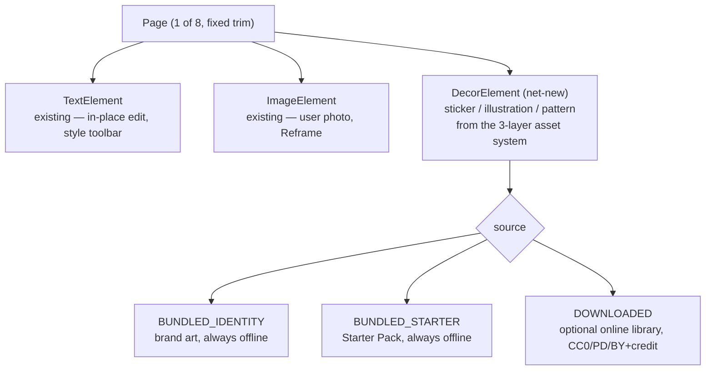

# V2-BENCH-IA-INTERACTION.md — the Bench: information architecture, journeys & interaction model

> **Status:** Phases **4** (information architecture), **6** (user journeys) and **7** (interaction model)
> of the [Bench initiative](V2-BENCH-RESEARCH.md). Inherits the [principles & editing philosophy](V2-BENCH-PRINCIPLES.md)
> ([BP-n]/[EP-n]), the [research](V2-BENCH-RESEARCH.md) ([BR§n]) and the [critique](V2-BENCH-CRITIQUE.md)
> ([BC§n]), and sits under the product-wide [IA & journeys](V2-IA-JOURNEYS.md) — the Bench is the
> document-scoped mode answering *"how do I change this page?"*. The **in-place editing + rigid page-pan**
> ruling is assumed throughout. This is the last upstream doc before the canonical **HTML prototype**
> (Phase 8): it defines what is on screen, how a maker moves through it, and the exact gesture/motion/a11y
> mechanics the prototype implements. Concrete decisions harden into reviewed ADRs when made.

---

## Part A — Phase 4: information architecture of the Bench

### A.1 The four states of the screen (chrome is a function of intent)
The Bench has **one canvas and four states**; chrome is present only to the degree the maker's current
intent needs it ([BP-1](V2-BENCH-PRINCIPLES.md)).

| State | The maker's intent | What's on screen |
|---|---|---|
| **Rest** | "let me look at / think about my page" | The page, maximised. A quiet **page ribbon** (below) + one **primary action**. Nothing else. |
| **Selected** | "change *this* thing" | Selection outline + handles on the element; a **contextual toolbar** of that element's verbs, edge-anchored, never over the element. |
| **Editing (text)** | "write here" | In-place caret in the real text; the page has **panned up as one rigid body**; a **style toolbar** above the keyboard. |
| **Adding** | "put something new on the page" | The **supply** surface (add text / add photo / add from assets) — a bottom sheet that is itself subject to the subtraction test. |

Rest is the default and the destination: every action returns the maker to Rest ([EP-2](V2-BENCH-PRINCIPLES.md)).

### A.2 The page element model (what a page can hold)
Today the model is `TextElement` + `ImageElement` only ([BC§3.5](V2-BENCH-CRITIQUE.md)). V2 introduces a
**third kind** to carry the asset system — kept deliberately small:



`DecorElement` is the smallest addition that lets the asset system exist without turning the Bench into a
clip-art app ([BR§7](V2-BENCH-RESEARCH.md)); it inherits the same direct-manipulation + a11y treatment as
the other two ([BP-6](V2-BENCH-PRINCIPLES.md)). **A user photo (`ImageElement`) and a bundled/downloaded
`DecorElement` are different things** and are never conflated — a photo is the maker's; decor is supplied.

### A.3 The page ribbon — orientation without a Pages panel
A persistent, quiet **8-page ribbon** answers "where am I?" ([BR§4](V2-BENCH-RESEARCH.md),
[BC§3.3](V2-BENCH-CRITIQUE.md)) at zero learning cost: eight small marks in **reader order**, current page
lit, **front cover (1)** and **back (8)** subtly differentiated. Tapping a mark moves there (a brief spatial
"where did it go" transition, [EP-5](V2-BENCH-PRINCIPLES.md)). The ribbon is orientation only — it is **not**
the finished-book reveal, which stays on Read ([BP-7](V2-BENCH-PRINCIPLES.md)).

### A.4 The keep-clear cue (print-correctness, felt)
A single soft **keep-clear inset** lives on the canvas ([BP-4](V2-BENCH-PRINCIPLES.md)): faint and warm at
rest, brightening *only* when text or a face crosses it, with a gentle "this may get trimmed when you fold"
nudge. Backgrounds bleed freely. The **fold** is not drawn on the per-page canvas — it belongs to the
whole-booklet/Print & Fold view — because the strongest zine rule ("no text across the gutter") applies at
assembly, not per-panel.

### A.5 Where the asset picker lives (and where the network line is)
"Add" opens the supply sheet with three entries: **Text**, **Photo** (the maker's own), and **Assets**. The
Assets picker shows **bundled Identity + Starter** items by default — always offline, no badge. A clearly
separate **"Search online"** section is dark until the maker opts in; enabling it shows the one honest
disclosure (*"only your search word leaves your phone; your zine and photos never do"*) and downloaded items
appear alongside bundled ones with a subtle **downloaded** badge (and a tappable **credit** affordance for
CC-BY) ([BR§7.4](V2-BENCH-RESEARCH.md)). This is the only place in the Bench with a network path, and it
sends a keyword — never content.

---

## Part B — Phase 6: user journeys (the emotional arc)

### B.1 The five-beat arc (the spine every journey rides)
Designed deliberately with peak-end + goal-gradient + Zeigarnik ([BR§6](V2-BENCH-RESEARCH.md)):

```mermaid
journey
    title Making one little book — the emotional arc
    section Open (defuse fear)
      Meet a page already holding one editable mark + one nudge: 4
    section First edit (build confidence)
      Change that mark; a small earned delight; nothing breaks: 5
    section Middle (sustain, teach in context)
      Add words/photos; move between pages; progress felt: 4
    section Peak (I made this) — on READ, not the Bench
      The finished 8-page book revealed: 5
    section End (land on pride)
      Hand off to Read / "safe on this device", never a tech screen: 5
```

The Bench owns beats 1–3 and the *hand-off* into 4; Read owns the peak ([BP-7](V2-BENCH-PRINCIPLES.md)).

### B.2 Core journeys (happy paths, grounded in the four states)

**J1 — First page, first mark (the anti-blank-page path).** Maker arrives from the Library's "Make a zine"
→ paper chooser → Bench opens on page 1 **already holding** a demonstrative editable title + one nudge
("Tap to make it yours"). Tapping enters in-place edit; typing replaces it. First interaction is *editing*,
not *originating* ([BP-3](V2-BENCH-PRINCIPLES.md)). Instantly clearable if unwanted.

**J2 — Write on the page (in-place).** Tap a text element → Selected → double-tap (or "Edit") → the caret
appears **in the real text**; the page pans up as one rigid body to clear the keyboard; the maker types and
sees the words in their real size/wrap; style toolbar above the keyboard tunes font/size/colour; "Done"
settles the page back **pixel-identical** ([EP-1](V2-BENCH-PRINCIPLES.md)). No words land anywhere unexpected.

**J3 — Place a photo.** "Add" → Photo → system picker (the maker's own image, stays on device) →
`ImageElement` drops in; drag to move, corner handles to resize, Reframe to crop/zoom. Keep-clear inset
brightens if a face crosses it.

**J4 — Add a sticker/illustration (net-new).** "Add" → Assets → pick a **bundled** decor item (offline).
Optionally enable **Search online**, read the one-line disclosure, search a keyword, download a CC0/PD item
that then behaves exactly like a bundled one (with a quiet downloaded badge). Content never leaves; a keyword
does ([BR§7.4](V2-BENCH-RESEARCH.md)).

**J5 — Move through the 8 pages.** Tap a ribbon mark → brief spatial move to that page → edit → the ribbon
keeps the maker oriented ("3 of 8"). The first cross-page move is where the fold/8-page structure is taught
in **one skippable contextual beat** ([BR§6](V2-BENCH-RESEARCH.md)) — never a tutorial wall.

**J6 — Leave / hand off.** Autosave has been silent-but-visible throughout ("Saved · on this device"). When
the maker is ready to see the whole thing, the Bench hands off to **Read** for the finished-book reveal —
ending on pride, not on imposition ([BP-7](V2-BENCH-PRINCIPLES.md)).

### B.3 The unhappy paths that must feel safe (felt-safety, [BP-5](V2-BENCH-PRINCIPLES.md))
- **Keyboard opens / closes:** the page leans and settles as one body — never "the app lost my page."
- **Accidental delete:** soft-delete + visible undo ("Deleted. Double-tap to undo."), no modal
  ([EP-4](V2-BENCH-PRINCIPLES.md)).
- **Backgrounding mid-edit:** the last autosaved document survives; the open question (does undo history
  survive a kill?) is decided deliberately ([BC§3.6](V2-BENCH-CRITIQUE.md)), never left to feel like loss.
- **Offline in the asset picker:** "You're offline — your assets and downloads are still here," never an
  error implying breakage ([BR§7.4](V2-BENCH-RESEARCH.md)).
- **Unprintable character typed:** the live, non-blocking coverage notice already handles this and never
  strips the character ([ADR-070](../DECISIONS.md#adr-070)) — kept.

---

## Part C — Phase 7: interaction model (the mechanics the HTML implements)

### C.1 Gesture vocabulary — every gesture has a visible twin ([BP-6](V2-BENCH-PRINCIPLES.md))
Gestures are accelerators; the twin is the contract ([BR§3](V2-BENCH-RESEARCH.md), [BR§5](V2-BENCH-RESEARCH.md)).

| Gesture | Meaning | Visible twin (required) | A11y custom action |
|---|---|---|---|
| Single tap on element | Select | — (self-evident) | node `onClick` "Select" |
| Tap empty margin | Deselect / commit | "Done" in bottom bar | (focus leaves node) |
| One-finger drag on selected | Move | nudge arrows on the toolbar | `Move up/down/left/right` (stepped) |
| Corner-handle drag | Resize (proportional) | the visible handle **is** the twin | `Make bigger/smaller` (stepped) |
| Rotate-handle drag | Rotate | visible rotate handle | `Rotate left/right` (stepped) |
| Double-tap text | Enter in-place edit | "Edit" in the text toolbar | `Edit text` |
| Two-finger pinch/drag | Zoom / pan the **page** (not the object) | page fits by default; zoom control optional | — |
| Long-press | Accelerator only (never required) | selection already exposes the toolbar | — |

**Disambiguation:** one finger acts on the thing under it; two fingers act on the page
([BR§3](V2-BENCH-RESEARCH.md)). Selection handles are drawn small/elegant but carry **≥48 dp** hit targets;
toolbar buttons are ≥48 dp with ≥8 dp spacing ([BR§5](V2-BENCH-RESEARCH.md)).

### C.2 The rigid-body in-place edit (the load-bearing mechanic)

```mermaid
sequenceDiagram
    participant M as Maker
    participant P as Page (rigid body)
    participant K as Keyboard (IME)
    M->>P: double-tap text element
    P->>P: caret appears in the real text (in place)
    K-->>P: IME animates up (WindowInsets.ime)
    P->>P: translate whole page up by min(clear caret) — as ONE body, no reflow
    M->>P: type; words appear in real size/wrap; style toolbar above IME
    M->>P: "Done" / tap margin
    K-->>P: IME animates down
    P->>P: translate back to PIXEL-IDENTICAL rest (paper-settle motion)
    Note over P: never resizes, never reflows, never desyncs — paper+render move together
```

The two proofs this owes ([BC§2](V2-BENCH-CRITIQUE.md), T2/T4) — pixel-identical return, and small-text
zoom-to-edit as a provably-reversible rigid move — are exactly what the HTML prototype and device Pass-2 are
built to test. If either fails, fall back to the hardened bottom sheet.

### C.3 Contextual chrome anchoring
- **Selected → contextual toolbar**: enters with a short standard-eased fade+slide (200–250 ms) from the
  edge it docks to, so its origin reads; carries only that element's verbs; **never overlaps the element**.
- **Editing → style toolbar**: sits **above the keyboard** (content in place, style in chrome —
  [EP-2](V2-BENCH-PRINCIPLES.md)).
- **Nothing selected → no chrome** but the ribbon + primary action (Rest).

### C.4 Accessibility model (inherits + extends what exists)
Each element (incl. the new `DecorElement`) is a focusable node with role + label + `selected` state +
rotated-AABB bounds, in reading-then-z traversal order; every manipulation has a stepped custom action;
edits announce **positionally** through a **Polite** live region ("Image placed, top of page 2"; Assertive
only for "Page full") ([BR§5](V2-BENCH-RESEARCH.md)). Selection handles use a dual-tone/halo stroke to hold
**3:1** over any user photo; text ≥ **4.5:1**, controls ≥ **3:1**, measured worst-case over the paper grain
(text/controls float on a quiet near-solid surface, not raw texture). **Acceptance = platform-tree dump +
on-device TalkBack + switch pass**, not a green Compose suite ([BP-6](V2-BENCH-PRINCIPLES.md)).

### C.5 Motion budget ([EP-5](V2-BENCH-PRINCIPLES.md))
| Moment | Motion | Rough token |
|---|---|---|
| Element/page settles into place | "paper settle", emphasised-decelerate | ~medium2 (300 ms) |
| Contextual toolbar enter/exit | fade+slide from edge, standard | ~short4–medium1 (200–250 ms) |
| Move between pages / reorder | brief spatial "where did it go" | ~medium (250–300 ms) |
| Select / toggle | near-instant state change | ~short1–2 (50–100 ms) |
| Idle / decorative | **none** | — |

Reduced motion replaces (not shortens) transitions with end-state cross-fades/cuts; the live-region
announcement carries any information a motion would have. Exact `cubic-bezier`/durations come from the pinned
`androidx.compose.material3` `MotionTokens`, verified before hardcoding ([BR§5](V2-BENCH-RESEARCH.md), T8).

### C.6 Thumb-zone layout
Persistent actions (Add, Undo, Done) live in a **bottom bar** within thumb reach; contextual toolbars favour
a near-bottom anchor; top corners avoid primary actions ([BR§3](V2-BENCH-RESEARCH.md)). One-handed use is the
default assumption.

---

## What the HTML prototype (Phase 8) must demonstrate
Per the [HTML-first workflow](../../CLAUDE.md), the prototype is the canonical spec and must communicate
interaction, motion, spacing, hierarchy, materiality, typography, rhythm, and emotional tone — not just
layout. Concretely it must show: the four states and their transitions (A.1); **in-place editing with the
rigid-body page-pan** (C.2) as the centrepiece to validate the ruling; the page ribbon (A.3); the keep-clear
cue (A.4); the supply/asset picker with the bundled-vs-online line and privacy disclosure (A.5); the
contextual toolbars (C.3); and the paper-settle motion (C.5) — all in the warm-paper V2 identity
([V2-TOKENS.md](V2-TOKENS.md)). Representative creative assets (fonts, icons, sample stickers, paper grain)
may stand in to express the vision; they are not shipping commitments ([BR§7](V2-BENCH-RESEARCH.md)).

*Phases 4, 6 & 7 of the Bench initiative. Structure, flows and mechanics — no code changed. Next: the
canonical HTML prototype (Phase 8), then internal critique → refinement → DESIGN FREEZE.*
