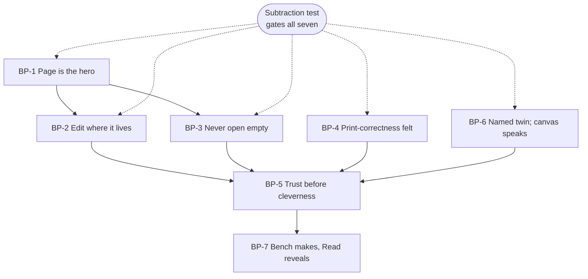
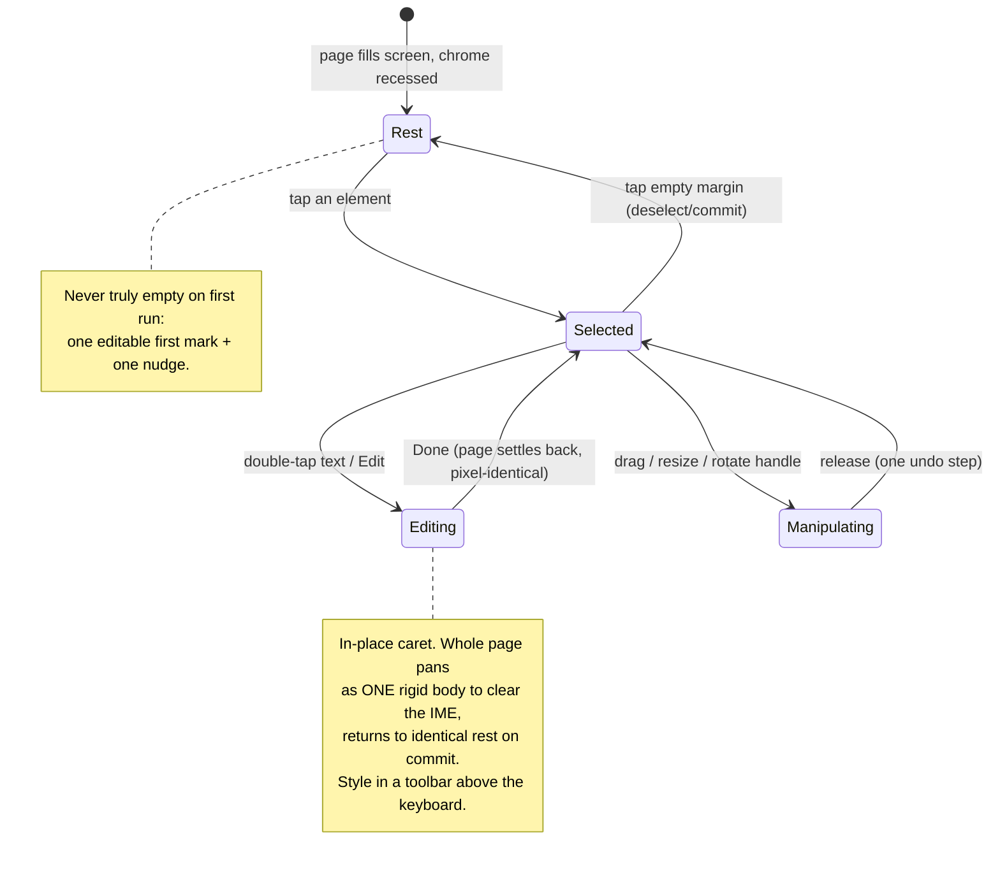

# V2-BENCH-PRINCIPLES.md — the Bench: design principles & editing philosophy

> **Status:** Phases **3** (design principles) and **5** (editing philosophy) of the
> [Bench initiative](V2-BENCH-RESEARCH.md). Built on the [Phase 1 research](V2-BENCH-RESEARCH.md)
> ([BR§n]) and the [Phase 2 critique](V2-BENCH-CRITIQUE.md) ([BC§n]), and inheriting the product-wide
> [ten V2 principles](V2-PRINCIPLES.md) and [identity](V2-PRINCIPLES.md) — this does **not** restate them;
> it specialises them for the one screen where making happens. The **owner ruling of 2026-07-28** is baked
> in: text editing pursues **in-place caret + rigid whole-page pan** ([BC§7](V2-BENCH-CRITIQUE.md)),
> conditioned on prototype + device proof. Upstream of pixels; feeds Phase 4 (IA) → 6 (journeys) → 7
> (interaction model) → 8 (HTML). Decisions harden into reviewed ADRs when made.

---

## Part A — Phase 3: the Bench's design principles

The Library's principles were about *recognition* ("which zine is mine?"). The Bench answers a different
question — **"how do I change this page?"** ([V2-IA-JOURNEYS §A.2](V2-IA-JOURNEYS.md)) — so its principles are
about *making*: keeping the maker's hand on the work, their eye on the page, and their trust intact. Seven
principles, each traceable to evidence and to the critique.

### BP-1 — The page is the hero; the tool is a guest
The page fills the screen at rest; chrome is recessed and returns on demand. This is not an aesthetic
preference — on a *phone specifically*, hiding chrome measurably improves the content-to-chrome ratio, the
exact tradeoff that fails on desktop ([BR§2](V2-BENCH-RESEARCH.md)). **Consequences:** one dead-simple,
invariant reveal (a tap; never an edge-swipe that fights Android system gestures); the tool palette **never
occludes the active element** (the GoodNotes floating-toolbar backlash); focus is signalled by *dimming the
rest of the page*, not by loud selection chrome. A guest that redecorates the room is not a guest.

### BP-2 — Edit where it lives
The maker types **on the page**, in the real text, at its real size and wrap — not in a panel that lands the
words somewhere else ([BC§2](V2-BENCH-CRITIQUE.md)). When the keyboard opens, the **whole page pans as one
rigid body** to clear it and settles back pixel-identical — the page *leans in so you can write, then
settles back*. This principle is the initiative's reason to exist; everything in the editing philosophy
(Part B) elaborates it.

### BP-3 — Never open empty
A blank page is a felt threat, not a neutral start ([BR§6](V2-BENCH-RESEARCH.md)). The Bench opens holding
**one editable first mark** + **one quiet invitation**, so the first interaction is *editing* (safe), not
*originating* (scary). The scaffold is an offer, not an imposition: it clears in one tap, and it uses **real,
demonstrative content, never lorem-ipsum** — the line between inviting and patronising is *realistic vs
generic*.

### BP-4 — Make print-correctness felt, not taught
The maker never learns the word "bleed." The three pro print boundaries collapse into **one soft keep-clear
inset** whose meaning is *behavioural* — a gentle nudge only when *text or faces* cross it, while backgrounds
bleed freely (the app owns the PDF) — and the **fold** is shown only where it matters, in the whole-booklet
view ([BR§4](V2-BENCH-RESEARCH.md)). Calm comes from *alignment the maker didn't have to think about*: an
invisible snapping grid, not a visible pro grid.

### BP-5 — Trust before cleverness; make the safety visible
Reliability *felt by the user* is the precondition for every delight ([BR§1.3](V2-BENCH-RESEARCH.md);
[BR§6](V2-BENCH-RESEARCH.md)). The Bench keeps and honours what already works — command-based undo, debounced
autosave, the "Saved · on this device" reassurance ([BC§1](V2-BENCH-CRITIQUE.md)) — and adds the felt-safety
test to *every* state: **could a nervous first-timer read this as having lost their book?** If yes, the
moment is redesigned regardless of technical correctness. This is the ADR-058 lesson as a standing rule.

### BP-6 — Every gesture has a named twin; the canvas speaks
No operation is gesture-only. Every drag/pinch/resize/reorder/delete ships a paired **custom accessibility
action**, every page element is its own focusable semantics node, and every edit **announces its outcome
positionally** ("Moved to page 3", "Deleted. Double-tap to undo.") ([BR§5](V2-BENCH-RESEARCH.md)). The editor
already does much of this ([BC§1](V2-BENCH-CRITIQUE.md)); the principle is that **new capability inherits it
by default**, and acceptance is a platform-tree dump + on-device TalkBack, never a green Compose-semantics
suite alone.

### BP-7 — The Bench makes; Read reveals
The Bench's job is the calm *making* of one page at a time. The emotional peak — the finished 8-page book,
"I made this" — belongs to the **Read** surface ([ADR-058](../DECISIONS.md#adr-058)), not here
([BC§4](V2-BENCH-CRITIQUE.md)). The Bench **hands off** to Read gracefully (ending on pride, not on a
technical screen) without absorbing Read's role. A screen that answers a good question at the wrong moment
reads as a malfunction.

> **Subtraction test for any Bench element** (the governing filter): *does this help the maker focus on
> making their little book?* If not, it is later, elsewhere, or gone. Delight must attach to an
> accomplishment (the paper-settle, the quiet save) or it is noise.

### How the seven relate

---

## Part B — Phase 5: editing philosophy

Principles say *what we believe*; the editing philosophy says *how editing itself should feel and behave*.
Five commitments, each resolving a tension the research flagged.

### EP-1 — The rigid-body page: one object that leans and settles
The page and everything on it move **together, always** — this is the generalisation of the editor's existing
anti-desync discipline (paper + render already lag as one; [BC§1](V2-BENCH-CRITIQUE.md)). In-place text
editing is safe *because* of this: to clear the keyboard, we translate the single rigid object by the minimum
amount, then return it to the **pixel-identical** resting position. The page **never reflows, never resizes,
never scrolls independently of its content** — it only slides as a body. This is the invariant that turns the
old "the app lost my page" reading into "the page leaned in for me."

- **The two proofs this philosophy owes** ([BC§2](V2-BENCH-CRITIQUE.md), T2/T4): the return position must be
  *provably* pixel-identical on device (edge-to-edge insets + IME animation are where it breaks), and small
  text must stay editable — if a block is smaller than a comfortable caret, a temporary **zoom-to-edit** may
  be needed, itself a rigid-body move that must be provably reversible. The HTML prototype exists partly to
  make these testable rather than assumed.

### EP-2 — Content in place, style in contextual chrome (the Canva split)
The *content* of a text block is edited on the page; its *styling* (font, size, colour, alignment) lives in a
contextual toolbar anchored above the keyboard ([BR§3](V2-BENCH-RESEARCH.md)). Selecting an element summons
only the verbs relevant to *that* element (text → font/size/colour/delete; image → replace/reframe/delete);
selecting nothing dismisses all chrome and returns the page to rest. Contextual, edge-anchored, never over
the active element — the direct mitigation of the floating-toolbar failure.

### EP-3 — Constraint is the confidence engine; the app owns the machinery
There is **no document-setup step** — a new zine is 8 blank reader-order pages with a fixed trim; the absence
of InDesign's page-size/margins/columns/bleed dialog is the beginner win, not a missing feature
([BR§4](V2-BENCH-RESEARCH.md)). The maker edits pages **1→8 in natural reading order**; the app owns 100% of
imposition (panel order, 180° rotations, the centre slit) and surfaces it only in the "Print & Fold" step,
never as the editing canvas. Fixed 8 pages is framed as *"your zine has 8 pages"* (a given), never "max 8".
Print-correct type defaults ship locked in (body ~10–12 pt, 120–145% leading, single column at a 45–90-char
measure sized to the tiny panel) so anything the maker types is already readable in print.

### EP-4 — Reversible by default; confirm only the irreversible
Direct manipulation is safe to explore *because* undo is visible and reliable ([BR§3](V2-BENCH-RESEARCH.md)).
Prefer **soft-delete + undo** over a confirmation modal (modals punish confident users; undo is also the
screen-reader-friendly alternative). Confirm only genuinely irreversible actions. Commit vs cancel of an edit
must be **explicit and distinct** — the ambiguity between them is where accidental loss lives. Open question
carried forward ([BC§3.6](V2-BENCH-CRITIQUE.md)): whether undo history should survive a process kill — decide
deliberately, don't inherit it by accident.

### EP-5 — Motion earns its place or it doesn't happen
One **"paper settle"** signature (emphasised-decelerate, ~300 ms) when a page or element lands; contextual
toolbar enter/exit (standard, 200–250 ms) so its origin reads; brief spatial "where did it go" moves on
reorder. Everything else is a near-instant state change (50–100 ms) or nothing — no idle ambient loops, no
decorative parallax, no bouncy overshoot ([BR§5](V2-BENCH-RESEARCH.md)). **Reduced motion is a first-class
branch:** replace transitions with end-state cross-fades/cuts, and any information a motion carries (the
"moved to page 3" cue) must survive via the live-region announcement — a state must never be discoverable
*only* through animation. (Exact M3 tokens come from the pinned `material3` `MotionTokens`, not doc prose.)

### The editing loop, as one picture

---

## Cross-references & what feeds Phase 4/6/7
- **Phase 4 (IA)** inherits EP-3 (reader-order, app-owns-imposition, 8-page structure) and BP-7 (Bench/Read
  boundary) → the page ribbon, the element model, the asset picker's place.
- **Phase 6 (journeys)** inherits BP-3/BP-5 (never-empty, felt safety) and BP-7 → the five-beat emotional arc
  from open to hand-off.
- **Phase 7 (interaction model)** inherits BP-2/EP-1/EP-2 (rigid-body in-place editing), BP-6 (named twins),
  EP-5 (motion budget) → the concrete gesture vocabulary + a11y actions + motion spec the HTML implements.

*Phases 3 & 5 of the Bench initiative. Beliefs, not pixels — no code changed. Next: Phase 4 (IA) + 6
(journeys) + 7 (interaction model), then the canonical HTML prototype.*
