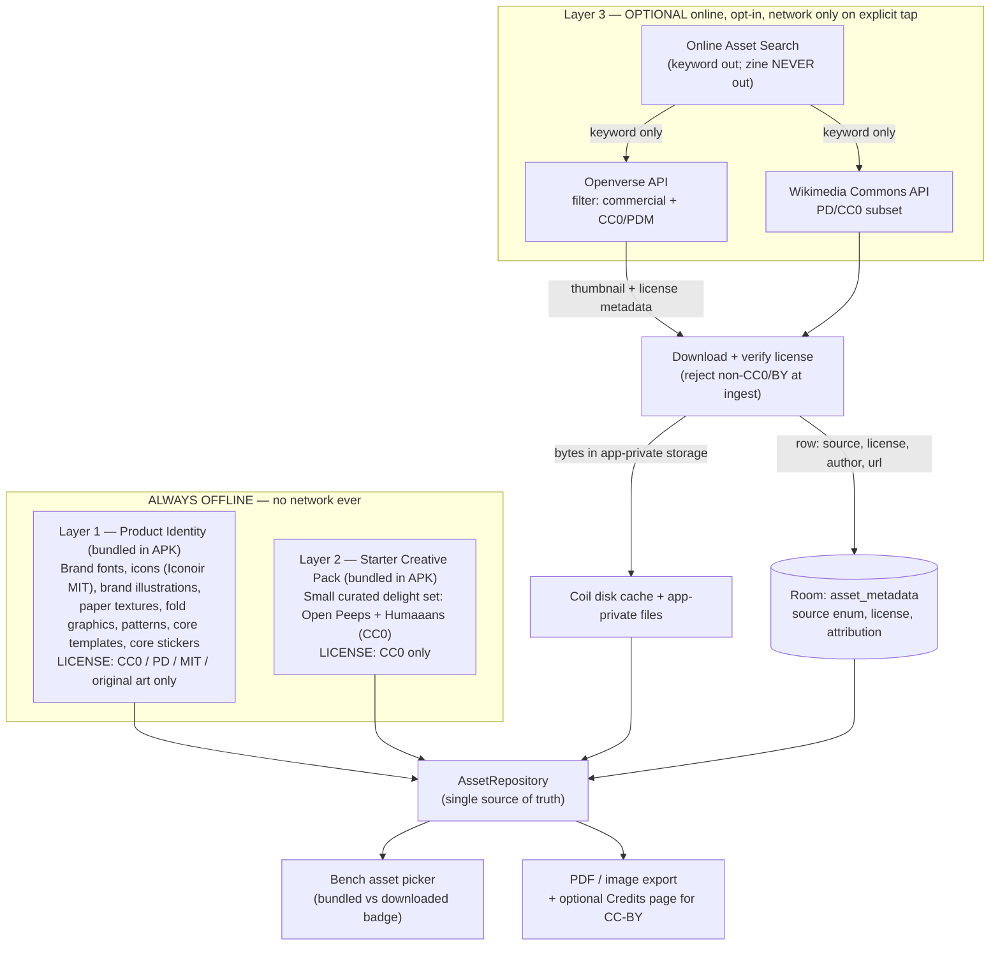

# V2-BENCH-RESEARCH.md — the Bench (Editor): UX research

> **Status:** Phase 1 deliverable of the **Bench** initiative — the second major V2 surface after the
> [Library freeze](V2-LIBRARY-CRITIQUE-2.md). This is evidence-gathering only; it does **not** decide the
> design. It feeds Phase 2 (critique) → 3 (principles) → 4 (IA) → 5 (editing philosophy) → 6 (journeys) →
> 7 (interaction model) → 8 (HTML prototype, canonical) → freeze → Compose. It builds on
> [V2-RESEARCH.md](V2-RESEARCH.md) (product-wide), [V2-PRINCIPLES.md](V2-PRINCIPLES.md) (the ten
> principles + identity), and the owner rulings in [V2-DIRECTION.md](V2-DIRECTION.md). Per the
> [Research standards](../../CLAUDE.md), it is a Research-Agent deliverable and is exempt from the
> independent Review-Agent gate; **any principle here that hardens into an ADR or a design ruling gets the
> standard Review pass first** — this is flagged for the asset-licensing conclusions especially.
>
> **The Bench** is the V2 name for the Editor — the one document-scoped mode that answers *"how do I
> change this page?"* ([V2-IA-JOURNEYS §A.2](V2-IA-JOURNEYS.md)). It is the most-used screen in the
> product; everything else exists to bring the maker here and to get their little book off the phone and
> onto paper.

## How to read this

Every claim is labelled per the [Research standards](../../CLAUDE.md): ✅ **VERIFIED** (sourced) ·
🟦 **RECOMMENDATION** · 🟨 **ASSUMPTION** · ⚠️ **DISPUTED** · 🔭 **FUTURE**. Six parallel research streams
fed this synthesis; the full agent transcripts live in the session log. Citations are inline as markdown
links and collected in [§9](#9-sources).

---

## 1. The load-bearing findings (read this if you read nothing else)

Six streams, five findings that should govern every later phase:

1. **The phone is exactly the form factor where hiding chrome *pays off*.** NN/g's counter-intuitive result:
   maximise the *content-to-chrome ratio*, and hiding chrome is justified specifically "on smartwatches and
   mobile devices where navigation bars consume over half the screen," while on large screens it hurts
   discoverability "with virtually no improvement to the ratio"
   ([NN/g](https://www.nngroup.com/articles/content-chrome-ratio/)). ✅ So an immersive, chrome-quiet Bench
   with the page maximised is **evidence-backed for Zinely's device class specifically** — the tradeoff that
   fails on desktop succeeds here. The precondition (NN/g): the reveal must be **one dead-simple, invariant
   gesture**, and the tool palette must **never occlude the active element** (the GoodNotes/Notability
   floating-toolbar backlash is the cautionary tale — a floating palette is not automatically "out of the
   way" [Paperlike](https://paperlike.com/blogs/paperlikers-insights/app-review-goodnotes-vs-notability)).

2. **The page-drift trust wound has a concrete, named fix: rigid page-pan on the keyboard.** The failure —
   the page appears to jump / edit happens on a separate surface, so the honest first-timer reading is *"it
   moved / lost my work"* — is the same order-of-questions defect as [ADR-058](../DECISIONS.md#adr-058)'s
   Preview. The fix pattern: edit text **in place** (caret in the real text at its real position/size), and
   when the IME opens, **translate the whole page as one rigid unit** by the minimum needed to clear the
   keyboard — driven off `WindowInsets.ime` / `imePadding()` so it moves *with* the animating keyboard —
   then slide back to the **pixel-identical** resting position on commit. The page never reflows or resizes;
   it only leans in and settles back
   ([Compose IME handling](https://medium.com/@mark.frelih_9464/how-to-handle-automatic-content-resizing-when-keyboard-is-visible-in-jetpack-compose-1c76e0e17c57)).
   ✅ mechanism / ⚠️ execution risk (return position must be provably identical). This turns a trust-breaking
   motion into a trust-*building* one.

3. **Reliability *felt by the user* is the prerequisite for every delight and every template.** Walter's
   hierarchy (functional → reliable → usable → pleasurable) and NN/g's delight theory agree: a product "can
   be delightful only if it is usable," and surface delight on an unreliable base reads as "gimmicky" and
   "tacky" ([NN/g Theory of User Delight](https://www.nngroup.com/articles/theory-user-delight/);
   [Walter](https://www.rubyslipper.com/designing-for-emotion-aarron-walter/)). Given Zinely's existing
   trust wound, **reliability is the delight strategy**: visible autosave ("Saved · on this device"),
   unbreakable undo, and — the Pass-2 test for every Bench state — *could a nervous first-timer read this as
   having lost their book?* If yes, redesign the moment regardless of technical correctness. ✅

4. **`preview == export` is a structural trust advantage Zinely holds that professional tools cannot.**
   Pro soft-proofing is only an *approximation* dependent on monitor/profile/lighting, and even Canva warns
   its "preview may not perfectly match" printed output because of RGB↔CMYK
   ([Cambridge in Colour](https://www.cambridgeincolour.com/tutorials/soft-proofing.htm)). Zinely renders a
   reproducible vector PDF for a home printer with **no** CMYK conversion — so "what you see is exactly what
   prints" is *true*, not hoped. ✅ The way to earn the trust: **render the Bench canvas from the same engine
   as the PDF** (parity is structural, not hand-maintained), make the canvas *be* the trimmed page, and
   confine the one honest caveat (home-printer scaling) to the Print & Fold step. This is an architectural
   invariant to protect, not a UI nicety.

5. **A canvas is invisible to a screen reader until you build a node tree over it — and every gesture needs
   a named twin.** This is Zinely's recurring failure class ([ADR-058](../DECISIONS.md#adr-058)
   `ReframeControls.ZoomButton`: green Compose-semantics suite, wrong platform state). Each page element must
   be its own focusable semantics node (role + label + state + bounds); every drag/pinch/resize must ship a
   paired **custom accessibility action** (WCAG 2.5.1 Pointer Gestures, Level A —
   [Deque](https://dequeuniversity.com/resources/wcag2.1/2.5.1-pointer-gestures)); and acceptance requires
   **dumping the platform `AccessibilityNodeInfo` tree**, not trusting the merged Compose tree. ✅

Everything below expands these and adds the detail each later phase will need.

---

## 2. Stream — Distraction-free / focus editors (keep the page the hero)

Principles (each → application to the Bench):

- **The tool disappears so the artifact becomes the whole screen.** iA Writer's founding premise; it takes
  over the screen so you focus on content "not on the fonts, the layout"
  ([Fast Company](https://www.fastcompany.com/90768236/ia-writer-is-a-minimalist-writing-tool-marie-kondo-would-adore)).
  ✅ → The Bench's *resting* state is the page maximised, chrome recessed. Chrome is a guest, not a frame.
- **Chrome-on-demand has two hard preconditions or it becomes "out of sight, out of mind."** NN/g: needs
  (a) a simple, reliable, accident-proof reveal — "don't use gestures that are obtuse," and (b) rock-solid
  consistency drilled into memory ([NN/g](https://www.nngroup.com/articles/browser-and-gui-chrome/)). ✅
  → One invariant reveal (a single tap is safest; **avoid edge-swipes that collide with Android system
  gestures** and immersive-mode exits [Android immersive](https://developer.android.com/develop/ui/views/layout/immersive)).
- **Focus is signalled by dimming the periphery, not spotlighting the centre.** iA greys everything but the
  active sentence — "a visual tunnel effect" ([iA](https://ia.net/writer/how-to/write-with-focus)). ✅
  → Editing one element gently *recedes the rest of the page* — subtraction as the focus mechanism, matching
  "the page is the hero."
- **Constraint is a feature; every tool you *don't* add is a distraction you needn't manage.** iA has zero
  Insert options where Docs has 17 ([Medium](https://medium.com/human-reference/ia-writer-review-978016d4b727)).
  ✅ — but Freewrite's *remove-editing* extreme is polarising ⚠️
  ([TechCrunch](https://techcrunch.com/2016/07/29/the-freewrite-is-the-ultimate-distraction-free-writing-tool/)):
  trim tinker-tools, **never** remove the ability to fix a mistake.
- **Progressive disclosure is the line between clutter and amputation.** Defer rare features to a second
  step; it improves learnability, efficiency *and* error rate at once
  ([NN/g](https://www.nngroup.com/articles/progressive-disclosure/)). ✅ → Two or three primary page verbs
  by default; secondary controls one deliberate step deeper.
- **Show the safety even when autosave is silent.** Users panic at no Save affordance; recovery must be
  "visible, consistent, and time-bound" ([LogRocket](https://blog.logrocket.com/ux-design/ux-reversible-actions-framework/);
  [UX Collective](https://uxdesign.cc/designing-a-user-friendly-autosave-functionality-439f2fe4222d)). ✅

**Open tension:** *tap-to-reveal-chrome* vs *tap-to-select-element* collide. Candidate resolution: tap an
element = edit it; tap the empty paper margin = toggle chrome / deselect. To be resolved in the prototype. ⚠️

---

## 3. Stream — Mobile gesture-driven editing (direct manipulation)

- **The object is the control surface.** Selection reveals a bounding box + handles *on the object*; drag
  moves, corner handles resize, a rotate handle rotates — no remote properties panel for basic transforms
  ([Lucid](https://lucid.co/techblog/2023/08/25/design-for-canvas-based-applications)). ✅
- **Selection is a visible, reversible state.** Tap selects; tap the paper margin deselects/commits — the
  universal "put it down" gesture that returns the page to rest. ✅
- **Contextual chrome per selection type, gone when nothing's selected.** Text → font/size/colour/delete;
  photo → replace/reframe/delete ([Adobe contextual bar](https://helpx.adobe.com/photoshop-elements/using/contextual-task-bar.html)). ✅
- **One finger acts on the object; two fingers act on the page.** Industry-standard disambiguation
  (Figma/Excalidraw/tldraw formalise a zoom/pan flag) ([Dan Burzo](https://danburzo.ro/dom-gestures/)). ✅
- **Never gesture-only.** Gestures are always hidden; perceptible affordances improve gesture success ~30%;
  every gesture needs a visible twin (button or handle) ([Smashing](https://www.smashingmagazine.com/2016/10/in-app-gestures-and-mobile-app-user-experience/)). ✅
- **Thumb-zone bottom bar; 48×48 dp targets, ≥8 dp spacing.** ~75% of touches are the thumb; the bottom-
  centre is the effortless reach ([Parachute](https://parachutedesign.ca/blog/thumb-zone-ux/);
  [Material touch target](https://m2.material.io/develop/web/supporting/touch-target)). ✅ **Selection
  handles are the classic offender** — draw them small/elegant but give them ≥48 dp hit areas.
- **Visible, persistent Undo is the backbone that makes direct manipulation safe to explore.** Procreate
  pairs gesture accelerators with a single-touch fallback — never gesture-only
  ([Procreate](https://help.procreate.com/articles/tvicQm-undo-and-redo)). ✅ Prefer **soft-delete + undo**
  over a confirmation modal every time (modals punish confident users). 🟨 validate on device.

**The in-place text-editing recommendation** (the drift fix, expanded from [§1.2](#1-the-load-bearing-findings-read-this-if-you-read-nothing-else)): 🟦
double-tap / tap-an-already-selected text block enters edit mode **on the block**; the page translates as one
rigid unit to clear the IME and returns to the identical resting position on commit; **styling** (font,
size, colour, alignment) lives in a contextual toolbar anchored above the keyboard (the Canva split:
*content edited in place, style in contextual chrome*
[Canva](https://www.canva.com/help/add-and-edit-text/)). ⚠️ Risk to resolve in the prototype: small text
blocks whose caret/handles fall below 48 dp may need a temporary "zoom to edit" — which *reintroduces a
motion that must be provably reversible* to avoid re-creating the drift problem.

---

## 4. Stream — Page-layout & print workflows (beginner-scale imposition)

- **No document-setup step is the headline beginner win.** Pro tools open with a page-size/count/margins/
  columns/bleed dialog; Zinely's fixed 8 pages + fixed trim **eliminate** it. Constraints are the confidence
  engine, not a limitation to apologise for ([Design Shack](https://designshack.net/articles/business-articles/designing-with-constraints/)).
  ✅ Frame it "your zine has 8 pages" (a given), never "max 8."
- **The app owns 100% of imposition; the author edits in reader order.** Pro workflow separates *reader
  spreads* (1,2,3…) from *printer spreads*; the single-sheet 8-page fold needs some panels rotated 180° and
  a centre slit — mechanical detail no author should see
  ([make-a-zine](https://make-a-zine.github.io/); [Wikibooks](https://en.wikibooks.org/wiki/Zine_Making/Putting_pages_together)).
  ✅ → Edit pages **1→8 in natural reading order**; the imposed sheet appears **only** in a "Print & Fold"
  step, never as the editing canvas.
- **Collapse the pro triad (bleed/trim/safe) into two calm cues.** One **soft keep-clear inset** per panel
  (a faint warm inset, not three coloured lines; behaviour over labels — a gentle nudge when *text/faces*
  cross it, while backgrounds bleed freely since the app owns the PDF), and **the fold**, shown only where
  it matters (the whole-booklet view — the strongest zine rule is "never put text across the gutter"
  [Blurb](https://www.blurb.com/blog/zine-layouts-dos-and-donts/)). ✅ Beginners never learn the word
  "bleed."
- **Ship print-correct type defaults; the beginner will not tune them.** Body 10–12 pt, leading 120–145%,
  measure 45–90 characters ([Butterick](https://practicaltypography.com/summary-of-key-rules.html);
  [Google Fonts](https://fonts.google.com/knowledge/using_type/understanding_measure_line_length)). ✅ A
  mini-zine panel is physically tiny (~2.75″×4.25″ from Letter), so default body sits near the larger end
  with generous leading; **single column, no gutter** (multi-column would drop the measure below 45 chars).
- **Invisible snapping grid, not a visible pro grid.** Calm comes from "alignment the user didn't have to
  think about," not from showing scaffolding ([IndesignPerfect](https://indesignperfect.com/2025/07/05/understanding-the-baseline-grid-why-it-matters-in-editorial-design/)). ✅
- **Answer "where am I in the 8 pages?" without a Pages panel** — a persistent 8-page **filmstrip/ribbon**
  ("3 of 8") + an optional whole-zine overview so the maker feels the physical object (the real zine ritual
  is "fold a blank booklet, number the pages, then make content"). 🟦

**Open ruling needed:** the exact keep-clear inset for a *hand* fold-and-cut (looser than a machine's 3–5 mm
safe area, but no true bleed requirement). 🟨 ~1/4″/5 mm is a reasonable start, unverified for hand folds.

---

## 5. Stream — Accessibility & motion (the ADR-058 class of defect)

**Accessible canvas editing:**
- **Model the page as a virtual node tree** — one focusable semantics node per element (role + label +
  state + bounds); the canvas is *not* one big node
  ([Android custom views](https://developer.android.com/guide/topics/ui/accessibility/custom-views)). ✅
- **Every gesture ships a paired custom accessibility action** in discrete steps — `Move up/down`,
  `Make bigger/smaller` (e.g. 5% steps), `Bring forward/send back`, `Delete`, `Move to page…` — implemented
  in the *same* component as the gesture (WCAG 2.5.1, Level A;
  [Compose semantics](https://developer.android.com/develop/ui/compose/accessibility/semantics)). ✅
- **State is announced first;** icon-only tools carry text labels; selection is conveyed by shape + label,
  **never colour alone** (WCAG 1.4.1). ✅
- **Speak every edit through a Polite live region, positionally** — "Image placed, top of page 2",
  "Moved to page 3", "Deleted. Double-tap to undo." Assertive reserved for blocking errors ("Page full").
  ✅
- **Acceptance = platform-tree dump + on-device TalkBack + switch pass**, not a green Compose-semantics
  suite. This is the specific control that would have caught ADR-058
  ([Herbst](https://bryanherbst.com/2020/11/03/compose-semantics-talkback/)). ✅

**Contrast over textured paper** (the warm aesthetic is the risk surface): text 4.5:1 / large 3:1
(WCAG 1.4.3); **controls, selection handles, focus rings 3:1** (WCAG 1.4.11); measure the **worst-case pixel**
over the grain ([W3C](https://www.w3.org/TR/UNDERSTANDING-WCAG20/visual-audio-contrast-contrast.html)). ✅
🟦 keep the paper texture *low-amplitude* and float text/controls on a quiet near-solid card/scrim rather
than directly on the grain — this is exactly what lets calm and contrast coexist. 🟦 selection handles need
a dual-tone/halo stroke so they hold 3:1 over *any* user photo.

**Motion budget** (M3 tokens — verify exact `cubic-bezier`/durations against `androidx.compose.material3`
`MotionTokens` in the pinned version before hardcoding ⚠️
[M3](https://m3.material.io/styles/motion/easing-and-duration/tokens-specs)):
- **Earns motion:** the single **"paper settle"** signature (emphasised-decelerate, ~300 ms) when a page/
  element lands; contextual toolbar enter/exit (standard, 200–250 ms) so its origin reads; "where did it go"
  reorder moves (motion conveying a spatial relationship — its legitimate job).
- **Doesn't earn motion:** idle ambient loops, decorative parallax, bouncy overshoot on every tap.
  Selection/toggle feedback is a near-instant state change (50–100 ms), not an animation.
- **Reduced motion is a first-class branch** (Android "Remove animations"; Compose honours it 1.2.0+):
  **replace, don't shorten** — cross-fade/cut to the end state; and information carried by motion (the
  "moved to page 3" cue) must survive via the live-region announcement. Never let a state be discoverable
  *only* through animation ([Panula](https://eevis.codes/blog/2022-12-12/android-animations-and-reduced-motion/)). ✅

---

## 6. Stream — Creative confidence, templates & delight (the emotional arc)

- **The blank page is a felt threat, not a neutral start** — physiological (stress hormones slow ideation),
  and for a first-timer it is the moment most likely to end the session
  ([WebDesignerDepot](https://webdesignerdepot.com/overcoming-blank-page-paralysis/)). ✅ → Treat "first
  thing you see" as a designed emotional intervention.
- **The antidote is a small first mark, not more freedom.** 🟦 The Bench should **never open truly empty**:
  a page already holding one editable element + one clear invitation ("Tap to add your title / a photo"), so
  the very first interaction is *editing* (safe), not *originating* (scary). Use **real, demonstrative sample
  content, never lorem-ipsum filler** — the line between helpful and patronising is *realistic vs generic*
  ([Userpilot](https://userpilot.com/blog/onboarding-ux-examples/)). Keep it to **one** nudge, instantly
  clearable so the scaffold is an offer, not an imposition.
- **Templates are scaffolding to overwrite, not a product to keep — the IKEA effect.** Self-made objects are
  valued ~5× higher, **but the effect collapses if the maker doesn't complete it**
  ([HBS](https://www.hbs.edu/faculty/Pages/item.aspx?num=41121); magnitude ⚠️ debated
  [Wiley 2026](https://onlinelibrary.wiley.com/doi/10.1002/mar.70064)). 🟦 → small, curated, demonstrative
  starters (a photo zine, a mini-comic, a list zine) that each *teach a move* and are **trivially
  finishable**; the maker's content stays load-bearing, the template's personality never outshouts theirs.
  Notion's pre-populated-example model, not a searchable store. (Count is a design call — prototype ~3 and
  test *invited vs shopping* 🟨.)
- **Teach in context, by doing — no tutorial wall.** Reveal the fold/8-page structure the first time the
  maker moves between pages, in one skippable beat ([NN/g empty states](https://www.nngroup.com/articles/empty-state-interface-design/)). ✅
- **Design the session as a deliberate arc** (peak-end + goal-gradient + Zeigarnik): open by defusing fear →
  first safe edit with a small *earned* delight → middle teaches in context with visible progress toward "a
  complete book" → **peak = the finished 8-page book revealed ("I made this")** → **end lands on that pride
  and "your book is safe on this device," not on a technical print/imposition screen**
  ([Maze — UX laws](https://maze.co/collections/ux-ui-design/ux-laws/)). ✅ This is the direct antidote to
  the ADR-058 "ended on the wrong screen" failure.
- **Delight must attach to an accomplishment or it is noise.** Spend it on the paper-settle, the finished-
  book reveal, the quiet "Saved on this device." Cut confetti/mascots/idle animation. Warmth here reads as
  *calm and paper-like*, not peppy; prefer **ambient** delight (things feel good as you touch them) over
  **modal** delight (things stop you to congratulate you) so flow is never broken
  ([NN/g pillars](https://www.nngroup.com/articles/pillars-user-delight/)). ✅

---

## 7. Asset architecture (the privacy-critical decision) — proposal, pending governed ADR

> ⚠️ **Legal-adjacent.** The licensing conclusions below (especially the CC-BY-SA exclusion and the
> Blush/unDraw/Streamline/Storyset print-restriction flags) must get a human/legal review before they
> harden into an ADR, per the note that closes this section. This is a *proposal grounded in primary-source
> license reading*, not a ruling.

### 7.1 The finding that reshapes the strategy
Zinely output is **printed and potentially sold**, and it has **three distribution surfaces** a license must
clear: (1) redistributed inside the APK, (2) placed into the user's document, (3) **printed / exported as a
PDF the user may share or sell.** Surface (3) is where most "free" asset licenses fail — so the strategy is
**CC0 / Public-Domain / MIT-first, provider-diverse.** ✅

- ✅ **CC0 / Public Domain** — no attribution, no ShareAlike, no merchandising limit. Safe to bundle, place,
  print, sell. *The gold standard for Layers 1–2.*
- ⚠️ **CC-BY-SA — excluded entirely.** ShareAlike is viral: a user's zine incorporating the asset is a
  derivative that would have to be relicensed CC-BY-SA — forcing makers to license *their own creative work*
  under copyleft. Unacceptable. Same logic excludes **CC-NC** (blocks selling) and **CC-ND** (blocks
  editing). Filter these at **both** query and ingest, with automated tests
  ([CC types](https://creativecommons.org/course/cc-cert-edu/unit-3-anatomy-of-a-cc-license/3-3-license-types/)).
- 🟦 **CC-BY — Layer 3 only, and only with attribution machinery** (store creator/title/license/URL with the
  asset; offer an auto-generated Credits page + in-app attribution list). Without that machinery, don't
  offer CC-BY.
- ✅ **MIT** (Iconoir) — satisfied by a bundled "Open-source licenses" screen; zero user-facing friction.

### 7.2 Provider verdicts (licenses checked at/near primary source)

| Provider | License | Verdict for Zinely |
|---|---|---|
| **Openverse** (~800M, aggregator) | mixed, per-item; **disclaims** license accuracy | ✅ Primary **online-search** backbone — but hard-filter to commercial **CC0/PDM only**; never surface CC-BY-SA. Verify license at ingest, store source URL for provenance. ([ToS](https://docs.openverse.org/terms_of_service.html)) |
| **Wikimedia Commons** (~100M) | mixed, per-file | 🟦 Secondary online source, **PD/CC0 subset only**. ([reuse](https://commons.wikimedia.org/wiki/Commons:Reusing_content_outside_Wikimedia)) |
| **Iconoir** (1,600+ icons) | **MIT** | ✅ **Best fit for the bundled Product-Identity icon set.** ([LICENSE](https://raw.githubusercontent.com/iconoir-icons/iconoir/main/LICENSE)) |
| **Open Peeps / Humaaans** (characters) | **CC0** (Humaaans 🟨 verify at source) | ✅ Ideal bundled Starter-Pack characters — CC0, print-safe. ([Open Peeps](https://www.openpeeps.com/)) |
| **SVGRepo** (aggregated) | mixed per-item | 🟦 **CC0/MIT subset only, hand-curated**; never treat as monolithic. ([licensing](https://www.svgrepo.com/page/licensing/)) |
| **unDraw** (vector scenes) | custom permissive | ⚠️ License forbids distributing assets "**in packs**" — bundling a curated set is arguably that. Prefer CC0; legal review if desired. ([license](https://undraw.co/license)) |
| **Streamline** (icons/illus.) | freemium | ⚠️ **Avoid free tier** — "not meant to integrate as assets that users can use in your application" (direct conflict). ([free license](https://help.streamlinehq.com/en/articles/5354376-streamline-free-license)) |
| **Storyset** (illustrations) | Freepik, attribution on free tier | ⚠️ Avoid bundling — attribution burden + redistribution ban. ([terms](https://storyset.com/terms)) |
| **Blush** (illustrations) | custom | ⚠️ **High risk for a print product** — forbids merchandising; a printed/sellable zine plausibly triggers it. Legal review first. ([license](https://blush.design/license)) |

**Provider diversity is non-negotiable:** a single provider is a legal single-point-of-failure, a business
risk (paid-tier / anti-competing-service clauses), and a **brand risk** — one provider's house style would
*become* Zinely's. The Product-Identity layer must be Zinely's own voice drawn from diverse CC0 sources +
original brand art.

### 7.3 The three-layer model

Follows [Android offline-first guidance](https://developer.android.com/topic/architecture/data-layer/offline-first):
the **local store is the canonical single source of truth**; the network is only fetch-and-cache. A **Room**
`asset_metadata` table keyed by a `source` enum (`BUNDLED_IDENTITY` / `BUNDLED_STARTER` / `DOWNLOADED`) plus
`license` / `author` / `sourceUrl` / `attributionRequired` drives a `Flow` into the picker; downloaded
assets appear the moment their row is written and are usable offline forever. **License verification at
ingest** (not just query), because Openverse disclaims accuracy.

### 7.4 Privacy UX (the invariant to protect)
🟦 **The only thing that ever leaves the device is the short keyword the user typed** ("cat", "flower"). The
zine, pages, text, and photos **never** leave — no code path uploads them, consistent with the hard privacy
invariant ([PRD principles](../PRD.md#5-product-principles-non-negotiable)).

1. **Opt-in, off by default.** Layer 3 is dark until "Search online assets" is enabled; first tap shows one
   honest disclosure: *"Zinely sends only your search word to open-image services. Your zine and your photos
   never leave your phone."*
2. **No background network** — requests fire only on an explicit search tap; no prefetch, no
   autocomplete-as-you-type beacon, no analytics (there is no analytics SDK).
3. **No identifiers** — no device ID, no account (there is none); anonymous OAuth for rate-limit headroom,
   not tracking; honour `429`/`Retry-After`.
4. **Honest offline failure** — "You're offline — bundled assets and your downloads are still here," never
   an error implying the app is broken.
5. **Bundled vs downloaded is legible** — the `source` enum is the single truth; downloaded items carry a
   subtle badge and (for CC-BY) a tappable credit affordance; both coexist in one picker so online is an
   *extension*, not a mode.

> **Note for the Implementer/Review chain:** this stream is Research-Agent output, **not** independently
> review-validated, and is legal-adjacent. Before any of §7 becomes an ADR (it should — it's a governed
> architecture + privacy decision under [V2-DIRECTION Q-B](V2-DIRECTION.md)), it needs the standard Review
> pass **and** a human/legal sign-off on the licensing conclusions.

---

## 8. Tensions to resolve in later phases (carried forward, not decided here)

| # | Tension | Where it resolves |
|---|---|---|
| T1 | Tap-to-reveal-chrome vs tap-to-select-element collide | Interaction model (Ph7) + prototype |
| T2 | In-place edit of *small* text may need "zoom to edit" — a motion that must be provably reversible or it re-creates the drift wound | Editing philosophy (Ph5) + prototype + device Pass 2 |
| T3 | Exact keep-clear inset for a *hand* fold/cut (no verified value) | Editing philosophy (Ph5); needs an owner/empirical ruling |
| T4 | Continuous resize/rotate has no natural non-visual analog → discrete stepped a11y actions; step size unproven | IA/interaction (Ph4/7) + device Pass 2 |
| T5 | Delete-without-confirm depends on Undo being genuinely discoverable on device | Interaction model (Ph7) + device Pass 2 |
| T6 | Starter-template count — "invited" vs "shopping" | Editing philosophy (Ph5); prototype ~3 and test |
| T7 | Asset licensing conclusions need human/legal sign-off before ADR | §7 → governed ADR |
| T8 | Exact M3 easing/duration tokens must come from the pinned `material3` `MotionTokens`, not doc prose | Interaction model (Ph7) / implementation |

## 8a. What feeds each subsequent phase
- **Ph2 critique** ← §1 (all five), grounded against the *actual* current editor (MVI editor, the page-drift
  wound, [ADR-069](../DECISIONS.md#adr-069) no-per-edit-render, [ADR-058](../DECISIONS.md#adr-058)).
- **Ph3 principles** ← §2 (chrome-quiet, focus-by-dimming, constraint-as-feature), §6 (reliability-before-
  delight, delight-must-be-earned).
- **Ph4 IA** ← §4 (reader-order editing, 8-page ribbon, app-owns-imposition), §5 (node-tree model).
- **Ph5 editing philosophy** ← §3 (in-place edit + rigid page-pan), §4 (print-correct defaults, keep-clear
  cue), §6 (never-open-empty, templates-as-scaffolding).
- **Ph6 journeys** ← §6 (the five-beat emotional arc), §1.3 (felt safety).
- **Ph7 interaction model** ← §3 (gesture vocabulary + visible twins), §5 (custom a11y actions, motion
  budget, reduced-motion).
- **Asset ADR** ← §7 in full.

---

## 9. Sources

**Focus / chrome / distraction-free:**
[NN/g Content-to-Chrome Ratio](https://www.nngroup.com/articles/content-chrome-ratio/) ·
[NN/g Browser & GUI Chrome](https://www.nngroup.com/articles/browser-and-gui-chrome/) ·
[NN/g Timing Hidden Content](https://www.nngroup.com/articles/timing-exposing-content/) ·
[NN/g Progressive Disclosure](https://www.nngroup.com/articles/progressive-disclosure/) ·
[iA Write With Focus](https://ia.net/writer/how-to/write-with-focus) ·
[iA Writer — Fast Company](https://www.fastcompany.com/90768236/ia-writer-is-a-minimalist-writing-tool-marie-kondo-would-adore) ·
[iA Writer review — Medium](https://medium.com/human-reference/ia-writer-review-978016d4b727) ·
[Freewrite — TechCrunch](https://techcrunch.com/2016/07/29/the-freewrite-is-the-ultimate-distraction-free-writing-tool/) ·
[Gizmodo minimal word processors](https://gizmodo.com/9-minimal-word-processor-apps-for-distraction-free-writ-1730016034) ·
[Paperlike GoodNotes vs Notability](https://paperlike.com/blogs/paperlikers-insights/app-review-goodnotes-vs-notability) ·
[Android immersive content](https://developer.android.com/design/ui/mobile/guides/layout-and-content/immersive-content) ·
[Android hide system bars](https://developer.android.com/develop/ui/views/layout/immersive)

**Mobile gesture / direct manipulation:**
[Lucid canvas apps](https://lucid.co/techblog/2023/08/25/design-for-canvas-based-applications) ·
[Konva select & transform](https://konvajs.org/docs/select_and_transform/Basic_demo.html) ·
[Adobe contextual task bar](https://helpx.adobe.com/photoshop-elements/using/contextual-task-bar.html) ·
[Material touch target](https://m2.material.io/develop/web/supporting/touch-target) ·
[Parachute thumb zone](https://parachutedesign.ca/blog/thumb-zone-ux/) ·
[Smashing in-app gestures](https://www.smashingmagazine.com/2016/10/in-app-gestures-and-mobile-app-user-experience/) ·
[Shittu gesture discoverability](https://medium.com/design-bootcamp/gesture-discoverability-a-core-component-of-interaction-design-4026c8e67d6d) ·
[Dan Burzo DOM gestures](https://danburzo.ro/dom-gestures/) ·
[Procreate undo/redo](https://help.procreate.com/articles/tvicQm-undo-and-redo) ·
[Canva add & edit text](https://www.canva.com/help/add-and-edit-text/) ·
[Compose IME resizing](https://medium.com/@mark.frelih_9464/how-to-handle-automatic-content-resizing-when-keyboard-is-visible-in-jetpack-compose-1c76e0e17c57)

**Page-layout / print:**
[Butterick key rules](https://practicaltypography.com/summary-of-key-rules.html) ·
[Butterick line length](https://practicaltypography.com/line-length.html) ·
[Google Fonts measure](https://fonts.google.com/knowledge/using_type/understanding_measure_line_length) ·
[Ballantine bleed/margin/trim](https://www.ballantine.com/understanding-bleeds-margins-and-trimming-in-print-production/) ·
[MadeGood bleed/trim/safe](https://madegooddesigns.com/bleed-trim-safe-area/) ·
[make-a-zine imposition](https://make-a-zine.github.io/) ·
[Wikibooks putting pages together](https://en.wikibooks.org/wiki/Zine_Making/Putting_pages_together) ·
[Blurb zine dos & don'ts](https://www.blurb.com/blog/zine-layouts-dos-and-donts/) ·
[IndesignPerfect baseline grid](https://indesignperfect.com/2025/07/05/understanding-the-baseline-grid-why-it-matters-in-editorial-design/) ·
[Design Shack constraints](https://designshack.net/articles/business-articles/designing-with-constraints/) ·
[Affinity pages & spreads](https://www.affinity.studio/help/pages-about-pages/) ·
[Cambridge in Colour soft proofing](https://www.cambridgeincolour.com/tutorials/soft-proofing.htm)

**Accessibility / motion:**
[W3C WCAG 2.2](https://www.w3.org/TR/WCAG22/) ·
[W3C Understanding 1.4.3](https://www.w3.org/TR/UNDERSTANDING-WCAG20/visual-audio-contrast-contrast.html) ·
[Deque 2.5.1 Pointer Gestures](https://dequeuniversity.com/resources/wcag2.1/2.5.1-pointer-gestures) ·
[Android custom-view a11y](https://developer.android.com/guide/topics/ui/accessibility/custom-views) ·
[Compose semantics](https://developer.android.com/develop/ui/compose/accessibility/semantics) ·
[Android touch target 48dp](https://support.google.com/accessibility/android/answer/7101858) ·
[Herbst Compose semantics & TalkBack](https://bryanherbst.com/2020/11/03/compose-semantics-talkback/) ·
[M3 easing & duration tokens](https://m3.material.io/styles/motion/easing-and-duration/tokens-specs) ·
[M3 motion how-it-works](https://m3.material.io/styles/motion/overview/how-it-works) ·
[Panula reduced motion](https://eevis.codes/blog/2022-12-12/android-animations-and-reduced-motion/) ·
[NZ Govt contrast over images](https://govtnz.github.io/web-a11y-guidance/ka/accessible-ux-best-practices/colour-and-contrast/design-with-colour-in-an-accessible-way/contrast-for-text-and-images-of-text.html)

**Creative confidence / delight:**
[NN/g empty states](https://www.nngroup.com/articles/empty-state-interface-design/) ·
[NN/g theory of user delight](https://www.nngroup.com/articles/theory-user-delight/) ·
[NN/g three pillars of delight](https://www.nngroup.com/articles/pillars-user-delight/) ·
[Walter Designing for Emotion](https://www.rubyslipper.com/designing-for-emotion-aarron-walter/) ·
[UX Planet error & forgiveness](https://uxplanet.org/design-principle-error-forgiveness-1495f7471113) ·
[Maze UX laws](https://maze.co/collections/ux-ui-design/ux-laws/) ·
[HBS IKEA effect](https://www.hbs.edu/faculty/Pages/item.aspx?num=41121) ·
[Wiley 2026 IKEA-effect meta-analysis](https://onlinelibrary.wiley.com/doi/10.1002/mar.70064) ·
[WebDesignerDepot blank-page paralysis](https://webdesignerdepot.com/overcoming-blank-page-paralysis/) ·
[Userpilot onboarding examples](https://userpilot.com/blog/onboarding-ux-examples/)

**Asset architecture / licensing:**
[Openverse ToS](https://docs.openverse.org/terms_of_service.html) ·
[Openverse auth & throttling](https://docs.openverse.org/api/reference/authentication_and_throttling.html) ·
[Wikimedia Commons reuse](https://commons.wikimedia.org/wiki/Commons:Reusing_content_outside_Wikimedia) ·
[Iconoir MIT LICENSE](https://raw.githubusercontent.com/iconoir-icons/iconoir/main/LICENSE) ·
[Open Peeps](https://www.openpeeps.com/) ·
[SVGRepo licensing](https://www.svgrepo.com/page/licensing/) ·
[unDraw license](https://undraw.co/license) ·
[Streamline free license](https://help.streamlinehq.com/en/articles/5354376-streamline-free-license) ·
[Storyset terms](https://storyset.com/terms) ·
[Blush license](https://blush.design/license) ·
[CC license types](https://creativecommons.org/course/cc-cert-edu/unit-3-anatomy-of-a-cc-license/3-3-license-types/) ·
[Android offline-first](https://developer.android.com/topic/architecture/data-layer/offline-first)

---

*Phase 1 of the Bench initiative. Evidence base only — no design decided, no code changed. Next: Phase 2
critique, grounded against the actual current editor in the repo.*
