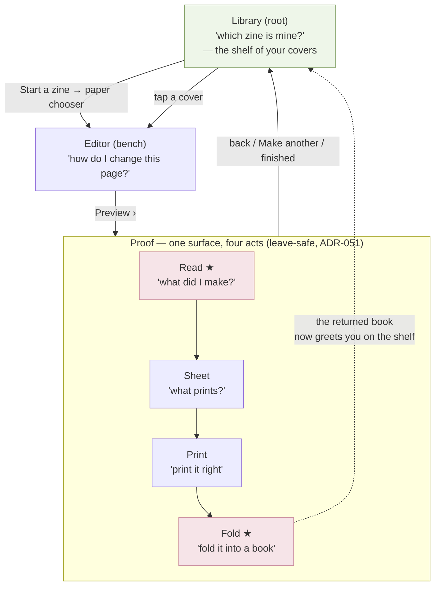

# V2-IA-JOURNEYS.md — information architecture & user journeys

> **Status:** Phases 5–6 deliverable of the V2 redesign. Builds on [V2-PRINCIPLES.md](V2-PRINCIPLES.md)
> (identity + the ten principles) and the owner rulings in [V2-DIRECTION.md](V2-DIRECTION.md). Still
> upstream of pixels: this defines *how the product is structured and how a person moves through it*,
> feeding Phase 7 (wireframes) → 8 (concepts) → 9 (HTML). The existing [EXPERIENCE-MAP](EXPERIENCE-MAP.md)
> and [SCREEN-INVENTORY](SCREEN-INVENTORY.md) remain the V1 references this evolves; where this supersedes
> them for V2 it says so. Concrete decisions become reviewed ADRs when made.

---

## Part A — Phase 5: information architecture

### A.1 The governing decision (owner-ruled)
Keep the **lean, leave-safe navigation spine** — single Activity, **no bottom bar, no tabs, no drawer**.
The only enrichment is closing the **Library ↔ Read loop** so finishing a zine returns you to a shelf that
now shows *your* cover. Destination count does **not** grow ([V2-DIRECTION §4](V2-DIRECTION.md);
[R§2.1](V2-RESEARCH.md): don't spend the nav budget; the research's own recommendation is already the
architecture).

### A.2 Two kinds of place — the load-bearing distinction
The five conceptual surfaces are **not peers** ([V2-CRITIQUE §2.6](V2-CRITIQUE.md)). V2 makes the split
explicit in structure:

| Kind | Surfaces | The question | Reached from |
|---|---|---|---|
| **Browse homes** (global) | **Library**, **Read** | "which zine is mine?" / "what did I make?" | Library is the root; Read is entered from a zine and is where you *arrive* |
| **Document-scoped modes** | **Editor**, **Print**, **Fold** | "how do I change / print / fold *this* zine?" | always entered *from a specific zine*, never as a global tab |

This is why a flat 5-tab bar is wrong: it would mix global homes with document modes and spend the whole
budget. The Proof surface already groups Read/Print/Fold under one document ([ADR-051](../DECISIONS.md#adr-051));
V2 keeps that and treats **Library** as the one true home.

### A.3 Navigation map (V2)

### A.4 The one enrichment: the Library ↔ Read return loop
Today the journey is forward-linear and *ends* at "back to bench/shelf." V2 makes the **return** the
emotional close: when a zine is finished (or reopened), the Library shows *its* maker-chosen cover
([C1 Maker's Cover](V2-PRINCIPLES.md)), so coming home *is* seeing your growing shelf of little books —
the local, cloud-free echo of Day One's "the artifact returns to greet its maker" ([R§1.3](V2-RESEARCH.md)).
No new destination; a richer *edge* between two existing homes.

### A.5 Object model (unchanged — structure, not identity)
`Zine` (title · paper A4/Letter · **coverChoice** [new, for C1] · timestamps) → 8 ordered `Page`s →
`Element`s (`TextElement` · `ImageElement`, each with transform/crop). One artifact type, on-device, no
folders/collections/tags in V2 (de-scoped) — the library is a flat, self-curating shelf sorted by
Recent/Name/Oldest ([R§2.6](V2-RESEARCH.md): at small scale, recency + a simple sort beats search).

### A.6 Progressive disclosure map (what each surface shows by default vs on demand)
Per [Principle 5](V2-PRINCIPLES.md) + [R§2.3](V2-RESEARCH.md) — default to the 2–3 things the current
question needs; everything else is one deliberate reach away.

| Surface | Default (answers the question) | On demand (a reach away) |
|---|---|---|
| **Library** | your covers · Start a zine | sort · per-card actions (rename/duplicate/delete) |
| **Editor** | the page · supply tray (photo/words/undo/redo) | selection → context bar; text → Type bar; photo → Reframe |
| **Read** | the finished pages, swipeable | Print & fold (advance) |
| **Print** | the four recipe settings + Save/Share | paper change · share targets |
| **Fold** | one crease at a time | prev/next · the finished-book reveal |

---

## Part B — Phase 6: user journeys

### B.1 The emotional arc (V2 — evolves [EXPERIENCE-MAP §1](EXPERIENCE-MAP.md))
Two peaks to protect: **first sight of the finished zine (Read)** and **it becomes a book in your hands
(Fold)**. One designed dip: the **first mistake → undo**, which converts fear into fearlessness. V2 adds a
third quiet warmth — **coming home to your shelf** — so the loop closes on belonging, not on a saved file.

```mermaid
flowchart LR
    A["Open\ncalm, warm first frame"] --> B["Blank page\nsafe to try"]
    B --> C["First photo\n'oh, that was easy'"]
    C --> D["Add words\n'this is mine'"]
    D --> G["Mistake → undo\nrelieved, fearless"]
    G --> H["More pages\nmomentum"]
    H --> I["Read ★\n'I made this'"]
    I --> J["Print & Fold ★\n'a real little book'"]
    J --> K["Home to the shelf\n'my collection grows'"]
    classDef peak fill:#f6e4e8,stroke:#c98a9b;
    class I,J,K peak;
    classDef dip fill:#efe6d8,stroke:#b79a6a;
    class G dip;
```

### B.2 Primary journey — first-time maker (the North Star)
*Goal: finish a zine in one sitting without asking anyone anything.*
1. **Open → Library empty state.** Warm cream room, one line, one button ("Start a zine"), the privacy
   reassurance where doubt lives. No account, no permission wall, no tour. *(Principle 3, 5; the container
   is the onboarding.)*
2. **Paper chooser → new zine → Editor.** One small decision (A4/Letter), then straight to a blank page.
3. **Blank page = invitation, not void.** Warm headline + the supply tray visible below (photo · words ·
   undo · redo). *(No hidden gestures; supplies over a FAB.)*
4. **Add a photo → lands big, centred, selected** with a gentle paper-drop. The first "that was easy" peak.
5. **Add words → straight into typing, caret already blinking**, edited **in place** on the page (V2 B2 —
   text is one object now). *(Principle 6.)*
6. **A mistake → one visible Undo → relief.** "You really can't break this."
7. **More pages** via the page strip; the booklet becomes tangible.
8. **Preview › → Read.** First sight of the finished thing. Pride peak — protect with the restrained
   paper-turn (C3).
9. **Print & fold → the honest recipe → Save/Share.** Plain words, "Actual size," no jargon.
10. **Fold, one crease at a time → the book reveal.** The signature climax.
11. **Home to the shelf**, now showing *this zine's* cover among (eventually) others. The loop closes on
    belonging.

### B.3 Returning maker
*Goal: reopen and continue, or start another.* Library shows a **self-curating shelf of recognizable
covers** (C1) — recognition, never recall ([R§1.4](V2-RESEARCH.md)). Tap a cover → straight back to the
bench, autosaved exactly as left. "Start a zine" is always the one prominent primary. *(No filing required;
Recent-first.)*

### B.4 The print-and-fold journey (the trust-critical stretch)
Read → Sheet ("looks scrambled on purpose") → Print (four settings, each with a plain reason) → Fold
(taught, gentle, illustrated). Every step is **leave-safe** ("your work is saved"); errors are honest and
recoverable in place ([Principle 7, 8](V2-PRINCIPLES.md)). This is where the app most earns or loses trust;
it stays exactly as strong as today, warmed by the new palette/material, never restructured.

### B.5 The night session
Same journeys, **Warm Night Desk** (C2): a warm-charcoal room (not blue-black), cream paper still reading
as paper, matcha/strawberry re-tuned to hold on the dark ground, the grain expressed on charcoal. *Cozy
after dark* — a journey no competitor makes pleasant.

### B.6 Accessibility as a parallel journey (not an afterthought)
Every journey above completes via TalkBack: the supply-tray "Supplies" heading orients before the actions;
the page render's silence is offloaded to captions ("page N of M"); the coverage/save notices are live
regions; controls are labelled and ≥48dp; motion is reduced-motion-safe with a correct static state.
Verified against the **platform** accessibility tree, not merged Compose semantics ([Principle 7](V2-PRINCIPLES.md);
the two-pass device gate). The soft palette's one risk — contrast on cream — is CI-gated (Principle 3).

---

## Part C — what this fixes vs the current journeys
- **"Which zine is mine?"** answered at the home the user returns to most (C1) — the biggest current gap.
- **The page never drifts** mid-edit (B1); **text is one object, in place** (B2) — the two remaining
  "the app is confused" moments removed before any polish lands.
- **The loop closes on belonging** (the Library↔Read return), not on a saved file — the research's
  come-back mechanic, reimplemented locally.
- Everything already strong — Read, the print recipe, the fold climax, leave-safe navigation, honest
  omission — is **kept and warmed**, never restructured.

---

## Cross-references
[V2-PRINCIPLES.md](V2-PRINCIPLES.md) · [V2-DIRECTION.md](V2-DIRECTION.md) · [V2-RESEARCH.md](V2-RESEARCH.md) ·
[EXPERIENCE-MAP.md](EXPERIENCE-MAP.md) · [SCREEN-INVENTORY.md](SCREEN-INVENTORY.md) ·
[ADR-051 Proof surface](../DECISIONS.md#adr-051).

*Compiled 2026-07-27. IA + journeys feeding wireframes → HTML and later independently-reviewed ADRs — not
itself a ratified decision.*
