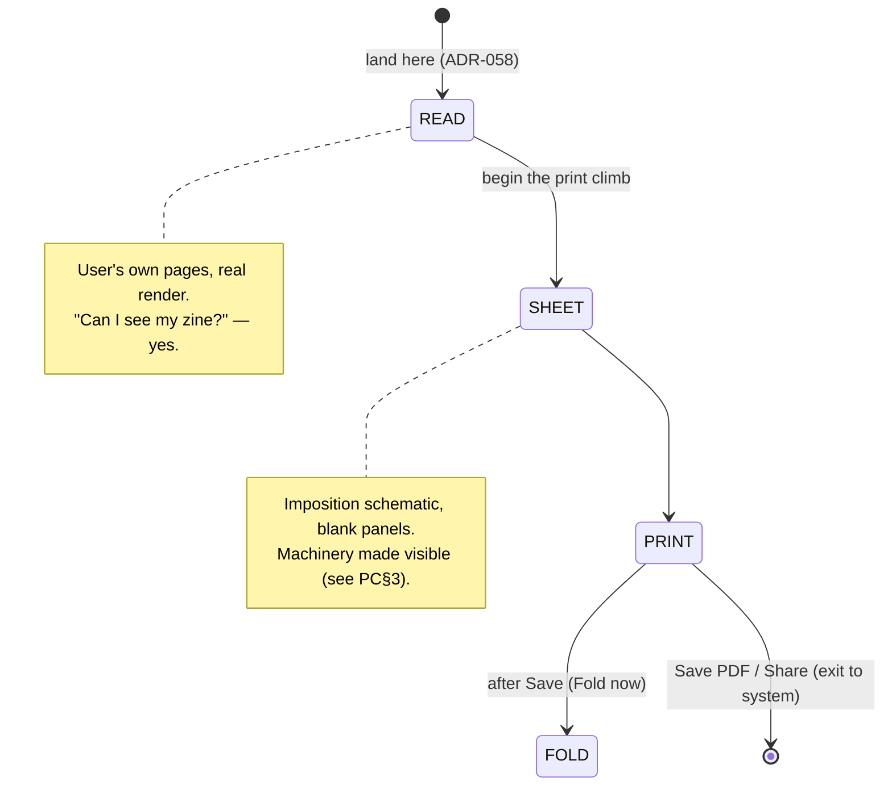

# V2-PROOF-CRITIQUE.md — the Proof: honest critique of what exists

> **Status:** Phase **2** (critique) of the [Proof initiative](V2-PROOF-RESEARCH.md). Grounded in a read-only
> recon of the **actual repository state** (file:line below), the [Phase 1 research](V2-PROOF-RESEARCH.md)
> (PR§n), and the relevant ADRs — never in a summary. It is analysis, not decision; it changes no code and
> freezes nothing. It carries the **owner scope ruling of 2026-07-28**: Proof is designed and frozen for the
> full **1→32 page** range the [Bench](mockups/v2-bench.html) already froze, with a **staged build**
> (single-sheet-8 first; saddle-stitch booklet + duplex as the V2-roadmap follow-up). Feeds Phase 3
> (principles) → 4 (IA) → 5 (journeys) → 6 (interaction) → 7 (HTML).

---

## Part A — what Proof is *today* (grounded map)

Unlike a greenfield surface, Proof already exists, already survived one hard device-gate lesson, and already
carries invariants that must not break. The map:

- **One screen, one forward exit.** The nav graph is `HomeRoute → EditorRoute → ProofRoute`
  ([`ZinelyNavHost.kt:65-98`](../../app/src/main/java/com/aritr/zinely/editor/ZinelyNavHost.kt)); the editor's
  only forward move is `onPreview → navigate(ProofRoute)`. The old `PreviewRoute`/`ExportRoute`/`CompletionRoute`
  are **gone** (retired by [ADR-051](../DECISIONS.md), executed B5 2026-07-12).
- **Four internal acts.** `enum ProofAct { READ, SHEET, PRINT, FOLD }`
  ([`ProofScreen.kt:91`](../../feature/editor/src/main/kotlin/com/aritr/zinely/feature/editor/ProofScreen.kt)).
  **READ is ordinal 0 and the landing** ([ADR-058](../DECISIONS.md#adr-058)); the "print climb" is
  `CLIMB_ACTS = [SHEET, PRINT, FOLD]`, captioned *"Step 1/2/3 of 3 · The sheet / Print / Fold"*
  ([`Copy.kt:290-310`](../../core/copy/src/main/kotlin/com/aritr/zinely/core/copy/Copy.kt)).
- **READ** renders the user's own pages in document order through the *same* `SceneRenderer → PagePreview`
  path as the editor — no second draw path. This is the ADR-058 fix for the beta "you cannot see your zine"
  wound.
- **SHEET** draws the imposition schematic — the landscape master sheet, safe area, fold lines, the one cut —
  with **blank panels** (per-panel artwork deferred, [ADR-058](../DECISIONS.md#adr-058) Decision 7).
- **PRINT** shows the print recipe (*100% / Actual size, not Fit-to-page; Landscape; match paper; single-sided*
  — [`Copy.ProofPrint`](../../core/copy/src/main/kotlin/com/aritr/zinely/core/copy/Copy.kt)) plus the export
  actions: **Save PDF** and **Share**. There is **no in-app OS "Print" button** — [ADR-052](../DECISIONS.md)
  deliberately dropped it (the system dialog has no actual-size control and would silently undermine the recipe).
- **FOLD** is a hand-drawn 5-step diagram engine (`FoldDiagramScope`, frozen 200×150 viewbox) — crease-into-8 →
  cut the slit → slot opens → fold to a strip → wrap to a book — ending on a `BookCoverFace` finished-book moment
  ([`ProofFold.kt`](../../feature/editor/src/main/kotlin/com/aritr/zinely/feature/editor/ProofFold.kt)). The
  post-save "Fold now" snackbar is the surviving [ADR-041](../DECISIONS.md) hand-off, converted by ADR-051 from
  a route into an intra-screen transition.
- **One engine, structurally.** Preview, raster, PDF, and the sheet composer all draw through the single
  `CanvasReplayer.replay(...)`
  ([`CanvasReplayer.kt:53-80`](../../render-android/src/main/kotlin/com/aritr/zinely/render/CanvasReplayer.kt),
  15 callers) — `read == preview == export` is **structural, not disciplinary** ([ADR-028](../DECISIONS.md),
  extended by ADR-058).
- **What it makes today.** `SingleSheet8Imposer` is the *only* imposer
  ([`SingleSheet8Imposer.kt:20-98`](../../core/imposition/src/main/kotlin/com/aritr/zinely/imposition/SingleSheet8Imposer.kt)):
  one **landscape**, **single-sided**, 8-panel sheet, top row rotated 180°, one horizontal centre slit. Paper is
  A4 or US Letter, chosen Proof-locally and threaded into export as a document copy (no store write). Export is
  PDF only from the UI (PNG exists in `ZineExporter` but is UI-unreachable).

---

## Part B — the honest headline

**Proof is the surface that already paid for its biggest mistake, and it is closer to the research target than
either the Library or the Bench was at Phase 2 — but it is built for a zine one-eighth the size the frozen Bench
now promises, and its middle act shows the user the machinery the research says to hide.**

Three things are already *right* and must be protected: (1) **READ-first** is exactly PR§2 (confidence from a
truthful preview of the user's own work) and is the scar tissue from [ADR-058](../DECISIONS.md#adr-058); (2)
**print honesty** — no fake "Print" button, the 100%/actual-size recipe, Save-PDF + Share — is exactly PR§3 and
PR§E9; (3) **never-silent failure + loss-safe back** is exactly PR§C1/C3's "keep undo/back alive until the
commit." The Proof did not arrive here by luck; it arrived by a device gate.

Two things are *wrong for where the product is going*: (1) the whole surface assumes a **single-sheet-8,
single-sided, one-cut** artifact, while the Bench froze **1→32 pages** — so a 16- or 32-page zine has *no Proof
that fits it*; and (2) the **SHEET act exposes the imposition schematic**, which PR§4 says is machinery the app
should own silently — and today it does so with **blank panels**, the exact texture of the ADR-058 wound, one
act deeper.

---

## Part C — critique findings (PC§n)

Each is classified **PROTECT** (already right, do not regress), **GAP** (missing for the target), or
**TENSION** (present but at odds with the research / the scope ruling), and traced to evidence.

### PC§1 — PROTECT: READ-first is the whole reason the Proof is trusted
The READ landing answers the held question *"can I see what I made?"* before anything else
([ADR-058](../DECISIONS.md#adr-058); PR§2, PR§A8). This is non-negotiable and predates delight. **Any Proof
redesign keeps READ as the emotional and literal entry**, and it keeps drawing through the one engine so
`read == preview == export` stays structural (PR§F, [ADR-028](../DECISIONS.md)). *Risk to watch:* the scope
expansion must not tempt a second "booklet preview" draw path — a 16-page saddle-stitch must still read through
`CanvasReplayer`.

### PC§2 — PROTECT: print honesty (no fake Print button; the actual-size recipe; Save + Share)
[ADR-052](../DECISIONS.md) is a hard-won correctness stance, not a limitation to "fix." The system print dialog
cannot promise 100%/actual-size, and a button that says "Print" while fit-to-page silently shrinks the zine is
the [PR§F#4] failure. **Keep Save-PDF as the primary, Share as its peer** (PR§E9); do **not** add an in-app OS
print button *unless* the staged booklet build resolves the actual-size conflict in its own ADR (Part E).

### PC§3 — TENSION: the SHEET act shows the machinery the research says to hide
PR§4 is blunt: imposition, printer's-pairs, panel rotation are **machinery the app owns silently; never show the
vocabulary**. The current SHEET act does the opposite — it presents the imposition schematic as *Step 1 of 3*,
and with **blank panels** ([ADR-058](../DECISIONS.md#adr-058) Decision 7) it is the same "diagram instead of your
work" texture that sank the beta Preview, moved one act later. Real community evidence (PR§F#2, PR§F1) is that
seeing pages "far apart on the same sheet, some upside-down" reads as *broken*, not as *educational*.
**This is the single most important design question for Proof V2:** does the maker need to *see* the imposed
sheet at all, or only to *trust that it's handled*? The research answer (PR§4, PR§A6 "confidence is the
approval, not the machinery") leans strongly toward **reassurance over schematic** — e.g. a filled, true-render
"here's your sheet, we arranged it for the fold" moment, or folding the sheet view into the fold guide rather
than standing it up as its own step. Phase 3 must rule on this; it is the Proof's version of the Bench's
"page-is-hero" test.

### PC§4 — GAP: there is no Proof for a booklet (the scope ruling's core work)
The engine is single-sheet-8 only ([`ModelEnums.kt:28-36`](../../core/model/src/main/kotlin/com/aritr/zinely/model/ModelEnums.kt);
PRD §7.1). The scope ruling puts **1→32 pages** in design scope, which means a **second production model** —
the **saddle-stitch booklet** (multiple nested double-sided sheets, folded and stapled) — that the current Proof
cannot represent. Every act changes shape by model (Part D). This is net-new design, not a re-skin, and it is
the reason the initiative exists rather than a quick token pass.

### PC§5 — GAP: duplex and the flip-edge truth are entirely absent (correct today, required for booklets)
Single-sided single-sheet-8 has **no duplex**, so the flip-edge saga (PR§B7, PR§F#1 — the #1 reported home-print
failure) simply does not arise today. The booklet model reintroduces it as a live surface. Per the Phase-1
resolution (PR§ Part 3): **request the likely-correct mode, guide in plain language, and bless a single test
sheet** — and treat the exact default as a **device-verification item**, never a freeze-time certainty. Proof V2
must design this *for the booklet path only*, and keep it invisible in the single-sheet path.

### PC§6 — GAP/TENSION: multiple-of-4 belongs to the Bench, not Proof — but Proof must not be the first place the user learns it
PR§F#3 and PR§A4: a saddle-stitch total must be a multiple of 4, and surprise blanks read as "broken." PR§B2/PR§4
say own it **at authoring time**. So the multiple-of-4 constraint is primarily a **Bench** responsibility (the
frozen Bench's 1→32 page-nav should keep the count valid and make added blanks *visible, placeable pages*), and
Proof's job is only to *confirm* it silently — not to surprise the user with padding at the print pause. **Flag
back to the Bench spec:** the frozen Bench must be checked for whether its page model enforces/visualises
multiple-of-4 for booklets; if not, that is a post-freeze spec clarification (bug/parity class, allowed) rather
than a Proof feature. *(Recorded as a cross-surface dependency, not a Proof design element.)*

### PC§7 — TENSION: the 3-step "climb" risks reading as a wizard, not "the final room"
The brief is explicit: Proof is *"not a confirmation dialog… the final room of the studio,"* calm and almost
ceremonial. A linear *Step 1/2/3 of 3* climb (SHEET→PRINT→FOLD) is defensible but leans **instructional**, and
PR§C8/PR§D7 warn that pushed, sequential instruction is the anti-pattern; help should be **pull, on demand,
invisible to the confident user**. Phase 3–5 should re-examine whether Proof is a *room you're in* (a calm
preview with the fold guide available on demand and one weighted commit) rather than a *staircase you climb*.
The FOLD content is excellent and must stay — the question is whether it is a forced step or a pulled drawer.

### PC§8 — PROTECT→EXTEND: the fold diagram is already close to the research ideal; keep it, key it to *this* zine
The existing 5-step `FoldDiagramScope` (hand-drawn, single viewbox, cut-stop shown) already embodies much of
PR§D — one action per step, a consistent frame, a marked cut. **Keep it.** Extend per PR§D/PR§F#6: make it
**keyed to the user's actual pages** (mark *which panel is the cover*, mark the cut's **stop point** so nobody
overcuts), hold **one camera angle**, put the caption **on** the diagram (spatial contiguity), offer an **opt-in
looping animation** with a **persistent static end-state**, and make the whole guide **pull, not push** (PR§C8,
PR§D4/D7). For the booklet model it becomes a *nest-and-staple* guide instead of *fold-and-cut* (Part D).
*(Also: the finished-book cover still uses a placeholder `zineName` — real ink is a known deferral to close.)*

### PC§9 — GAP: "stays on your phone" is invisible; the research says make it a felt feature
Zinely is already fully offline, so the privacy promise is *assumed* rather than *shown*. PR§E7 (ImpositionPDF/
BookletPro both lead with it) says the calm, reassuring line *"this stays on your phone"* is worth surfacing at
the print pause — precisely where a first-timer might wonder where their pages go. A quiet, one-line reassurance,
not a banner.

### PC§10 — GAP: completion is under-marked
The post-save "Fold now" snackbar is functional but is not the *felt completion event* PR§C9 (Zeigarnik) calls
for. The finished-book moment exists in FOLD; the question (PR§C10, flagged as a **Pass-2 hypothesis, not a
sourced truth**) is whether Proof should end on a small, earned closure that hands back to the Library/Read on
**pride**, not on a technical screen ([ADR-058](../DECISIONS.md#adr-058) boundary: the finished-book *reveal*
belongs to Read; Proof hands off gracefully without absorbing Read's role — mirrors the Bench's BP-7).

### PC§11 — OBSERVATION: doc/ADR debt the recon surfaced (not Proof-design, but must not be inherited silently)
The recon flagged stale docs that the Proof work will sit on top of and should reconcile *in the same change* per
the Documentation Rule: `ARCHITECTURE.md:5` still describes the retired Preview/Export/Completion triad;
[ADR-054](../DECISIONS.md) is titled **"Proposed"** though fully implemented and wired; PRD FR-6 and a
`DownloadsWriter` KDoc still describe the superseded `ACTION_VIEW` Save semantics. These are **Technical Debt /
documentation defects**, not Proof features — tracked here so they are fixed deliberately, not conflated with the
redesign.

---

## Part D — the two production models Proof V2 must hold (scope ruling)

The scope ruling means Proof is **one calm room that adapts to what the maker built**, across a range, not two
screens. The design must express both models through *one* coherent surface — the same way the Bench's H2 nav is
one component in three shapes.

| Act | Single-sheet mini-zine (**ships first**) | Saddle-stitch booklet (**staged follow-up**) |
|---|---|---|
| **READ** | User's pages, document order (unchanged) | Same — the one engine, N pages; no new draw path (PC§1) |
| **The sheet / reassurance** | One landscape sheet, one cut (PC§3 rules on schematic vs reassurance) | *N* nested sheets; "we arranged your pages across N sheets for folding" — never expose printer's-pairs |
| **Paper** | A4 / Letter switch (PR§E10) | Same |
| **Duplex** | **None** — single-sided (PC§5) | **Present** — request short-edge for landscape spreads + **test sheet** (PR§ Part 3) |
| **Save / Print** | Save PDF (primary) · Share (peer) (PC§2) | Same; OS-print hand-off only if its own ADR resolves actual-size (Part E) |
| **Fold guide** | Fold-and-**cut** (existing 5-step, keyed to this zine) | Fold-**nest-staple**-trim (PR§B8); one camera angle; pull-only |
| **Completion** | Felt closure → hand back on pride (PC§10) | Same |

**The unifying rule:** the maker never chooses "single-sheet vs saddle-stitch." **The page count (owned by the
Bench) determines the model; Proof silently adapts** and only ever surfaces the physical truths that model
forces (paper always; duplex + test sheet for booklets). This is the direct application of PR§4 to the scope
ruling.

---

## Part E — build-time debts the scope ruling creates (categorized, never conflated)

Per the [release-category discipline](../../CLAUDE.md#release-review-release-agent), the staged booklet build
incurs debts that are **not** freeze blockers but **must** be recorded now so scope is never expanded silently:

| Item | Category | Note |
|---|---|---|
| Booklet imposition engine (`SaddleStitchImposer`, multi-sheet) | **Future Enhancement** (V2 roadmap) | New `:core:imposition` work; ROADMAP already lists 16-page saddle-stitch as V2 |
| Duplex model + flip-edge request + test-sheet flow | **Future Enhancement** | Design now (frozen), build with the booklet stage; device-verify the default flip |
| OS-print hand-off (`PrintManager`) decision | **Future Enhancement**, gated | Only if it resolves the actual-size conflict [ADR-052](../DECISIONS.md) deferred; may stay Save+Share |
| PRD §7 scope + ROADMAP rows updated to reflect 1→32 design intent | **Documentation** (ship with the ADR) | Design freeze does not change PRD; the *build* stage does |
| New ADRs: booklet imposition; duplex/flip-edge; (maybe) OS-print | **Documentation / decision** | Authored + independently reviewed when the booklet stage starts, not at freeze |
| **ADR retiring the SHEET act + restructuring the act model** (room-with-drawers supersedes ADR-051's 3-act `Sheet→Print→Fold` and ADR-058's device-verified 4-act climb) | **Documentation / decision** | **Recorded, never silent** (the ADR-051/052 house precedent for frozen-element supersession); authored + independently reviewed when the Compose build starts. This supersedes a *device-gated* structure — it must be on the ledger, not only in PP-3/PC§3 prose |
| Multiple-of-4 page model in the (frozen) Bench | **Future Enhancement / precondition** | **Hard precondition for the booklet build** — the frozen Bench has *no* multiple-of-4 model (verified); Proof only *confirms* it (PC§6). Land as an allowed post-freeze Bench spec clarification before the booklet stage, never as a Proof-time surprise |
| ARCHITECTURE.md:5 triad text; ADR-054 Proposed→Accepted; ACTION_VIEW/KDoc staleness (PC§11) | **Technical Debt** | Reconcile in the first Proof change that touches those areas |

Design/freeze proceeds on the *full* design; **none of these block the freeze** — they are the honest build
ledger the freeze hands to implementation.

---

## Part F — invariants the redesign must not break

1. **One engine → `read == preview == export`** ([ADR-028](../DECISIONS.md)/ADR-058): no second page-drawing
   path, ever — including for booklet preview (PC§1).
2. **Single-writer / shared editor VM** ([ADR-026](../DECISIONS.md)): Proof resolves the editor's back-stack VM;
   the export VM never touches autosave.
3. **`export == preview`**: host passes the live document; destination chosen *after* render; Share and Save
   bytes identical ([ADR-054](../DECISIONS.md)).
4. **Never-silent export failure + loss-safe back** ([ADR-051](../DECISIONS.md)): the error overlay and
   "leaving never destroys work" must survive (PR§C1).
5. **Print honesty** ([ADR-052](../DECISIONS.md)): no control may claim to print while doing something else; the
   100%/actual-size recipe is the point (PC§2).
6. **READ-first** ([ADR-058](../DECISIONS.md#adr-058)): the user sees their own work before any machinery (PC§1).
7. **Bench/Read boundaries**: the finished-book *reveal* is Read's peak, not Proof's; the multiple-of-4 model is
   the Bench's to own (PC§6, PC§10).

---

## Part G — what feeds Phase 3

The design principles must resolve, in priority order:

1. **PC§3 — schematic vs reassurance** for the imposed sheet (the Proof's "page-is-hero" ruling).
2. **PC§7 — room vs wizard**: is Proof a calm room with a pulled fold-drawer and one weighted commit, or a
   3-step climb? Reconcile against "the final room" brief and PR§C8/D7.
3. **PC§4/D — one adaptive room across 1→32**, single-sheet and booklet, expressed through one surface.
4. **PC§5 — the duplex/test-sheet truth** for booklets, honest and device-conditioned.
5. **PC§8/PC§10 — the fold guide (keep + extend, pull-not-push) and a felt, boundary-respecting completion.**
6. **PC§9 — "stays on your phone" as a quiet felt feature.**

*Phase 2 of the Proof initiative. Analysis grounded in repository state (file:line) + PR§ research + ADRs; no
code changed, no design frozen. The critique will itself be checked by an independent Review Agent before the
Phase 7 prototype hardens, per the [multi-agent workflow](../../CLAUDE.md#multi-agent-workflow). Protected files
untouched. Next: Phase 3 (design principles).*
