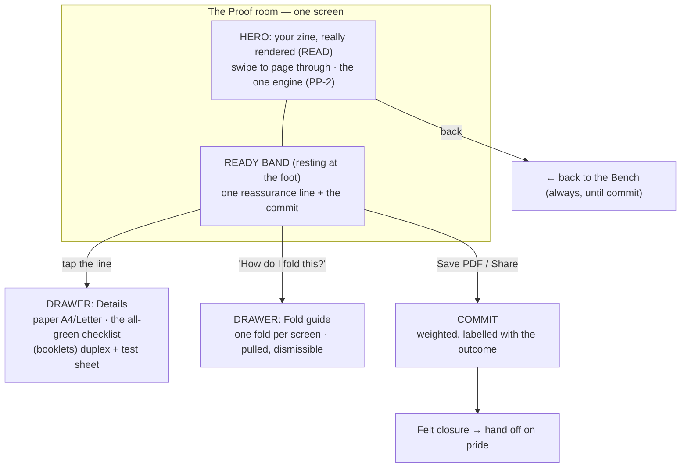
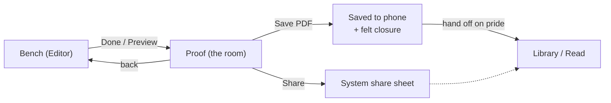
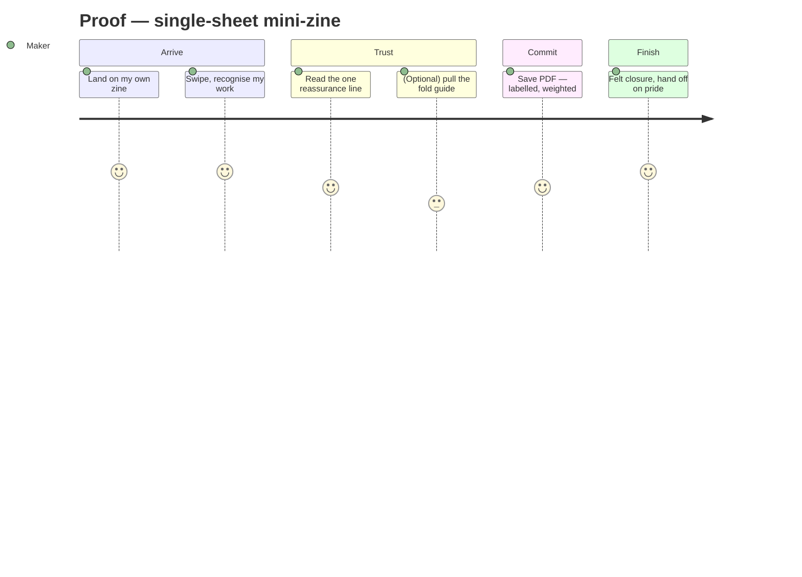

# V2-PROOF-IA-INTERACTION.md — the Proof: IA, journeys & interaction model

> **Status:** Phases **4** (information architecture), **5** (user journeys) and **6** (interaction model) of the
> [Proof initiative](V2-PROOF-RESEARCH.md). Built on the [research](V2-PROOF-RESEARCH.md) (PR§n),
> [critique](V2-PROOF-CRITIQUE.md) (PC§n) and [principles](V2-PROOF-PRINCIPLES.md) (PP-n / PF-n); inherits the
> frozen [tokens](V2-TOKENS.md) and the [Library](mockups/v2-library.html) + [Bench](mockups/v2-bench.html)
> language. Carries the owner scope ruling (full **1→32**, staged build). This is the last written specification
> before the canonical [HTML prototype](mockups/) (Phase 7). No code changes here.

---

## Part A — Phase 4: information architecture

### A.1 — The room is one screen; the zine is its hero

Per [PP-1](V2-PROOF-PRINCIPLES.md) (a room, not a wizard) and [PP-2](V2-PROOF-PRINCIPLES.md) (see your own work
first), Proof is **one screen** whose full surface is the maker's zine, readable, with a **quiet action zone**
resting at the foot and everything else **pulled on demand**. The retired structure was a linear `SHEET → PRINT
→ FOLD` climb ([PC§7](V2-PROOF-CRITIQUE.md)); the new structure is a **calm space with two drawers and one
commit**. Nothing numbered, nothing forced.

### A.2 — Component inventory (what is in the room, and what is *not*)

| Region | Holds | Rationale |
|---|---|---|
| **Hero (READ)** | The user's pages, real render, swipe/page-through | PP-2; [ADR-058](../DECISIONS.md#adr-058); the one engine (PC§1) |
| **Reassurance line** | One quiet line: *"8 pages · arranged for the fold · A4 · stays on your phone"* — adapts by model | PP-3 (reassurance not schematic), PP-4, PP-9 |
| **Commit zone** | **Save PDF** (primary, weighted) · **Share** (peer); back-to-Bench stays reachable | PP-7; ADR-052/054 |
| **Details drawer** *(pulled)* | Paper A4/Letter switch; the short all-green checklist; **(booklets only)** duplex guidance + the test-sheet nudge | PP-5, PF-2; progressive disclosure PR§C6 |
| **Fold drawer** *(pulled)* | The fold guide keyed to *this* zine — one fold per screen | PP-6; PR§D |
| **Completion** | A felt closure moment, then hand-off | PP-8; PF-1 |
| **NOT in the room** | The imposition schematic as a step; blank panels; "printer's-pairs/signatures" vocabulary; a fake "Print" button; any "Are you sure?" | PP-3, PP-7; PC§2/PC§3 |

### A.3 — The reassurance line is the room's spine (replaces the SHEET act)

The retired SHEET act's *job* — "your pages are arranged so this folds into a book" — survives, but as **one line
of plain-language reassurance**, not a schematic ([PP-3](V2-PROOF-PRINCIPLES.md)). It **adapts by model** and
states only what is true and reassuring:

- **Single-sheet mini-zine (≤8):** *"8 pages · one sheet, one cut · A4 · stays on your phone."*
- **Saddle-stitch booklet (>8):** *"16 pages · N sheets, folded & stapled · A4 · stays on your phone."*

Tapping the line opens the **Details drawer** for the maker who wants to check the machinery — where, if a sheet
is shown at all, it is a **filled, true-render** artifact ("here's your sheet"), never a blank diagram
([PP-3](V2-PROOF-PRINCIPLES.md)). The confident maker never opens it.

### A.4 — Model adaptation: one room, driven by page count

Per [PP-4](V2-PROOF-PRINCIPLES.md), the **Bench-owned page count silently selects the model**; the maker never
picks a format. What the room changes:

| Surface | Single-sheet (ships first) | Booklet (staged) |
|---|---|---|
| Reassurance line | "one sheet, one cut" | "N sheets, folded & stapled" |
| Details → duplex | absent (single-sided) | **present** — request short-edge + **test-sheet nudge** (PP-5) |
| Fold drawer | fold-and-**cut** (existing 5-step) | fold-**nest-staple**-trim (PR§B8) |
| Everything else | identical | identical |

### A.5 — Navigation & the whole-product seam

Proof keeps **one forward exit from the Bench and one graceful way back**, and adds no new routes
([ADR-051](../DECISIONS.md) collapsed the triad; do not re-expand). The commit exits to the **system** (share
sheet / saved file), then the felt closure hands the maker toward the **Library/Read** — never trapping them on
a technical screen ([PP-8](V2-PROOF-PRINCIPLES.md)).

---

## Part B — Phase 5: user journeys

### B.1 — The core journey (single-sheet mini-zine, ships first)

The felt arc from [PF-1..5](V2-PROOF-PRINCIPLES.md), made concrete:

1. **Arrive.** The maker taps Done in the Bench and lands on **their zine**, page 1, readable. First feeling:
   *"there it is."* (PP-2 / PF-1)
2. **Recognise.** They swipe through a page or two. The work is theirs, intact. No diagram, no blank panels.
3. **Trust.** One quiet line at the foot: *"8 pages · one sheet, one cut · A4 · stays on your phone."* The
   machinery is confirmed without being shown. (PP-3 / PP-9 / PF-4)
4. **(Optional) Learn.** If they wonder *"how do I fold this?"*, they pull the fold drawer — one fold per screen,
   their own cover marked, the cut stop-point marked. The confident maker skips it entirely. (PP-6 / PF-1)
5. **Commit.** **Save PDF** (weighted, primary) — labelled with the outcome, not "Are you sure?". Until this tap,
   back-to-the-Bench is always there. (PP-7 / PF-5)
6. **Finish.** A small felt closure — *"Saved · fold it up?"* — hands them onward on pride, toward the Library.
   The finished-book *reveal* stays Read's. (PP-8)

### B.2 — The booklet journey (staged) — where the physical world enters

Identical arc, with the two honest additions the booklet model forces (PP-5):

- **Trust** line reads *"16 pages · 4 sheets, folded & stapled · A4 · stays on your phone."*
- Pulling **Details** shows the **duplex** guidance: *"Print both sides · **usually** flip on short edge"* — the
  hedge word carries the "likely-correct, not certain" truth in the line itself, **paired with the test-sheet
  nudge**: *"New printer? Print one test sheet first and fold it — check the cover's on top."* This is the
  flip-edge safety net (PR§ Part 3, PC§5), and the exact default flip is a **device-verification item**, not
  asserted as certain.
- The **fold drawer** is the nest-and-staple guide (fold each sheet, nest, staple the spine, optional trim).

### B.3 — Whole-product review (the owner's one final objective)

Evaluated Shelf → Bench → Proof → Share/Print → Shelf for one coherent world; inconsistencies Proof must
**resolve, not introduce**:

| Seam | Consistency check | Verdict / action |
|---|---|---|
| **Shelf → Bench** | Warm paper, page-is-hero, subtraction, one-engine render | Frozen; consistent |
| **Bench → Proof** | The zine stays the hero; the same real render carries across; no cold "export" tone | **Proof must preserve** — READ uses the same engine; the transition is *"your work, ready,"* not a mode-switch (PP-2) |
| **Proof reassurance vs Bench making** | Same voice (Fraunces/Inter, calm, human copy), same colour restraint (interface palette quiet; content palette is the maker's) | **Proof inherits** — no new chrome colour; reassurance copy in the Bench's human register |
| **Multiple-of-4 (booklets)** | Owned at authoring time by the Bench, *confirmed* silently by Proof — never a surprise at the pause | **Cross-surface dependency (PC§6):** verify the frozen Bench's page model enforces/visualises multiple-of-4; if not, a post-freeze Bench spec clarification (bug/parity class), not a Proof feature |
| **Proof → Shelf/Read** | End on pride; the finished-book reveal is Read's peak, not Proof's | **Proof hands off** (PP-8; ADR-058 boundary) — no absorbing Read's role |
| **Privacy** | Offline everywhere; shown, not just assumed | **Proof surfaces the one felt line** (PP-9) at the pause where it matters |

**Emotional-break audit:** the one break the research names is the beta's — a technical screen answering the
wrong question at the wrong moment ([ADR-058](../DECISIONS.md#adr-058); PR§F1). Proof V2 removes it by design:
you always see your own work first, the machinery is never stood up as a step, and the commit is labelled with a
physical outcome. No new break is introduced.

---

## Part C — Phase 6: interaction model

Inherits the Bench's interaction discipline (named-twin a11y, the one paper-settle motion, reduced-motion as a
first-class branch) — this **does not restate it**, it specialises it for the room.

### C.1 — Gesture vocabulary (and every gesture's named twin)

| Gesture | Action | Named accessibility twin |
|---|---|---|
| **Swipe / tap page edge** on the hero | Page through the zine (READ) | "Next page" / "Previous page" custom actions; each page a focusable node announcing "Page n of N" (PR§5; the ADR-058 defect class) |
| **Tap the reassurance line** | Open the Details drawer | "Print details" button; drawer content in reading order |
| **Tap "How do I fold this?"** | Open the fold drawer | "How to fold" button; each step a focusable node, "Step n of N", with the on-diagram caption as its label |
| **Swipe within the fold drawer** | Next/previous fold step (self-paced) | "Next fold step" custom action; never auto-advances (PR§D4) |
| **Tap the animation toggle** | Play/pause the opt-in loop | "Play fold animation" / "Pause"; a **persistent static end-state** remains regardless (PR§D4) |
| **Tap Save PDF / Share** | Commit | Buttons labelled with the outcome ("Save PDF", "Share"); the commit is not gesture-only and never a swipe (PP-7) |
| **Back** | Return to the Bench | System back + a visible affordance; loss-safe, never destroys work (PP-7; ADR-051) |

No operation is gesture-only; the commit specifically is a **deliberate, weighted tap**, visually separated from
benign controls (PR§C5 proximity rule).

### C.2 — The commit affordance (the one place friction is a feature)

- **Save PDF** is the primary: larger, weighted, the warm accent — labelled with the physical outcome and, where
  useful, the count (*"Save PDF"*, sub-label *"8 pages · A4"*).
- **Share** is the calm peer, quieter weight.
- **No "Are you sure?"**, no fake "Print." Friction is exactly proportional to the irreversibility: a deliberate
  tap, not a modal interrogation (PR§C3-5, PC§2).
- **Never-silent failure:** an export error surfaces as the recoverable overlay with a retry, back stays
  loss-safe ([ADR-051](../DECISIONS.md); PC§2). Success raises the felt-closure moment, not a bare toast.

### C.3 — Motion budget (inherits the Bench; earns its place or doesn't happen)

- **One paper-settle** when the room arrives and when the fold guide's finished-book lands (emphasised-decelerate
  ~300 ms) — the shared signature, not a new motion language (PR§D; Bench EP-5).
- Drawer enter/exit: standard 200–250 ms so origin reads.
- The fold animation is **opt-in, looping, segmented**, and **never gates progress**; a static end-state is
  always present (PR§D4).
- **Reduced motion is a first-class branch:** the fold animation degrades to the static steps (which are already
  the default), the paper-settle to a cut/cross-fade, and any state a motion carries survives via a live-region
  announcement — never discoverable *only* through animation (Bench EP-5).

### C.4 — Accessibility acceptance (the ADR-058 standing rule)

Acceptance is a **platform-tree dump + on-device TalkBack**, never a green Compose-semantics suite alone
([ADR-058](../DECISIONS.md#adr-058); PR§5). Specifically: every page in READ is reachable and announces its
position; both drawers are reachable, self-paced, and dismissible by screen-reader users; the commit buttons
announce their physical outcome; the duplex/test-sheet guidance (booklets) is fully readable, not image-only
(PR§D6 — captions are real text on/beside the diagram). The fold guide's information must **not** live only in an
animation.

**Pass-2 watch item (from review OB-1):** the filled imposed-sheet reassurance keeps the top row rotated 180°
(true to the fold). With placeholder content this reads fine, but with *real* rendered artwork the rotated-but-
filled panels must be checked on device that they do not re-trigger the "some pages are upside-down = it's
broken" reaction (PR§F1) — the very reaction PP-3 exists to avoid. If they do, the reassurance sheet shows
upright thumbnails with the rotation implied, not applied.

---

## Cross-references & what feeds Phase 7 (the HTML prototype)

The canonical prototype must demonstrate, at minimum:
- **The room, not a wizard** — READ hero + resting action zone + two pulled drawers + one weighted commit (PP-1,
  A.1).
- **Reassurance line, model-adaptive** — the single-sheet and booklet strings, and the Details drawer that never
  shows blank panels (PP-3, A.3/A.4).
- **The fold guide** — one fold per screen, one camera angle, arrow + crease + on-diagram caption, marked cut
  stop-point + cover panel, opt-in animation with a persistent static end-state (PP-6, C.1).
- **The honest booklet additions** — duplex guidance + the test-sheet nudge, framed as reassurance and
  device-conditioned (PP-5, B.2).
- **The commit + felt closure + hand-off** — labelled outcome, reversible-until-the-button, end on pride (PP-7,
  PP-8).
- **Privacy as a felt line** (PP-9).

*Phases 4–6 of the Proof initiative. Specification, not pixels — no code changed. The critique + principles + this
spec will be checked by an independent Review Agent before the prototype hardens. Next: Phase 7 — the canonical
HTML prototype.*
