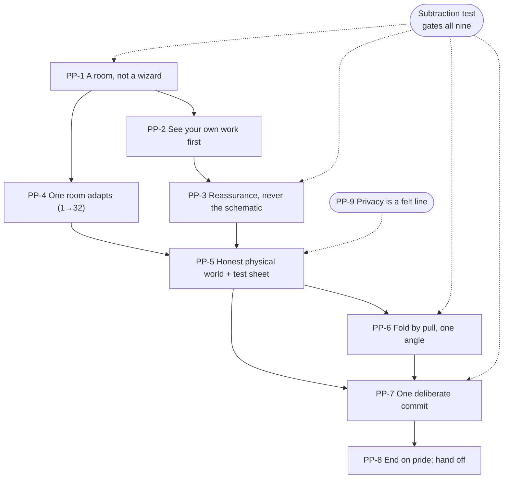
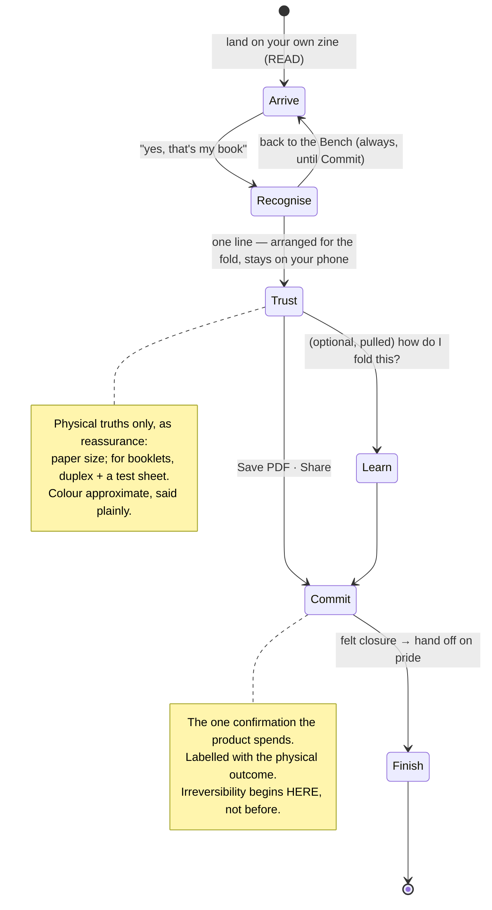

# V2-PROOF-PRINCIPLES.md — the Proof: design principles & proofing philosophy

> **Status:** Phase **3** of the [Proof initiative](V2-PROOF-RESEARCH.md). Built on the
> [Phase 1 research](V2-PROOF-RESEARCH.md) (PR§n) and the [Phase 2 critique](V2-PROOF-CRITIQUE.md) (PC§n), and
> inheriting the product-wide [ten V2 principles](V2-PRINCIPLES.md), the [tokens](V2-TOKENS.md), and the frozen
> [Library](mockups/v2-library.html) + [Bench](mockups/v2-bench.html) language — it does **not** restate them; it
> specialises them for the **final room**. Carries the owner scope ruling (full **1→32**, staged build). These
> are beliefs, not pixels — no code changes here. They **resolve the Part G rulings** the critique deferred, and
> feed Phase 4 (IA) → 5 (journeys) → 6 (interaction) → 7 (HTML). Decisions harden into reviewed ADRs when made.

---

## Part A — the Proof's design principles

The Library answered *"which zine is mine?"* (recognition); the Bench answered *"how do I change this page?"*
(making). The Proof answers the last question a maker holds: **"Is this ready — and do I know exactly what will
happen when I press Print?"** ([V2 product principle](../../CLAUDE.md)). Its principles are about *confidence*:
letting the maker slow down, see their own work, trust that the machinery is handled, and commit without fear.
Nine principles, each traceable to evidence and to the critique.

### PP-1 — Proof is a room you're in, not a wizard you climb
The brief is explicit: Proof is *"the final room of the studio… calm, intentional, almost ceremonial,"* **not**
a confirmation dialog and **not** a Step-1/2/3 staircase ([PC§7](V2-PROOF-CRITIQUE.md); PR§C8, PR§D7). So the
governing shape is a **single calm space** the maker arrives in already mostly-ready: their zine is present and
readable, one honest line confirms it's set for the fold, help is available *on demand*, and one weighted action
commits. Sequential instruction (the 3-act climb) is retired as the primary structure — its content is kept, but
offered as **pulled drawers**, not forced steps. *Consequences:* no numbered "of 3" progression as the spine;
the fold guide is a drawer you open, not a gate you pass; the room reads as *arrival*, not *assembly*.

### PP-2 — You see your own work first; the machinery is confirmed, never displayed
The maker lands on **their own pages, really rendered**, through the one engine — the ADR-058 scar made
principle ([PC§1](V2-PROOF-CRITIQUE.md); PR§2, PR§A8; [ADR-058](../DECISIONS.md#adr-058)). Confidence comes from
recognising the work, not from a diagram of how it's imposed. This is the Proof's version of the Bench's
"page-is-hero": **the finished zine is the hero of this room; print mechanics are a guest that only speaks when
spoken to.**

### PP-3 — Own the machinery; show reassurance, never the schematic *(resolves PC§3)*
The single most important Proof ruling. PR§4 is blunt — imposition, printer's-pairs, panel rotation are
**machinery the app owns silently; never show the vocabulary** — and the community evidence (PR§F#2, PR§F1) is
that an exposed imposed sheet, especially with **blank or upside-down panels**, reads as *broken*, not
*educational*. **Ruling: the standalone imposition schematic as a step is retired.** The maker is *reassured*
that their pages were arranged for the fold — in plain language, and, where a sheet is shown at all, as a
**filled, true-render** artifact ("here's your sheet — we laid your pages out so it folds into a booklet"),
folded into the fold guide's context rather than standing alone as a diagram of blanks. The test is the Bench's,
transposed: *does this help the maker trust their book is ready?* A schematic of the machinery fails it.

### PP-4 — One room adapts to what you made *(resolves PC§4 / Part D)*
Proof is **one surface across 1→32 pages**, not two screens. The **page count — owned by the Bench — silently
selects the production model** (single-sheet mini-zine for small counts; saddle-stitch booklet for larger); the
maker **never chooses a format** ([PC§4/Part D](V2-PROOF-CRITIQUE.md); PR§4). The room adapts what it surfaces:
the booklet model brings duplex + a test sheet (PP-5) and a nest-and-staple fold guide; the single-sheet model
stays single-sided with a fold-and-cut guide. Same room, same calm, different physical truths — the way the
Bench's one nav component takes three shapes. *(Staged build: single-sheet ships first; the booklet path is
designed and frozen now, built next — see [critique Part E](V2-PROOF-CRITIQUE.md).)*

### PP-5 — Honest about the physical world; the test sheet is the safety net *(resolves PC§5)*
The room promises only what it can keep. **Layout, order and completeness are exact; colour is approximate** on a
home printer, and this bound is stated quietly — never overpromised (PR§A7, PR§A9; the ADR-058 trust lesson).
Only the physical truths software genuinely cannot own are surfaced, as reassurance: **paper size** (one honest
A4/Letter switch, PR§E10) always; for booklets, the **duplex flip** — and because the correct flip is
landscape/printer-dependent and Android can only *request* a mode (PR§ Part 3, PR§E3), Proof does **not** assert
it as certain. It requests the likely-correct mode, guides in plain words, and **blesses a single test sheet** —
the cheap "hard proof" that neutralises every residual device unknown (PR§A7, PR§B7, PR§C11, PR§F#1). *The exact
default flip is a device-verification item, not a freeze-time truth.*

### PP-6 — Teach the fold by pull, one fold per screen, one camera angle
The fold guide is kept (it is already close to the research ideal) and made **pull, not push** — a dismissible,
recallable drawer invisible to anyone who already knows ([PC§8](V2-PROOF-CRITIQUE.md); PR§C8, PR§D7). Inside it:
**one action per step, one held camera angle** (perspective changes are the #1 reason fold diagrams confuse,
PR§D2), an **arrow + the crease line** rather than origami's dashed/dash-dot alphabet (PR§D5), the caption **on**
the diagram at the point of action (PR§D6), a marked **cut stop-point** and a marked **cover panel** so nobody
overcuts or mistakes the cover (PR§F#6), and an **opt-in looping animation** for the motion with a **persistent
static end-state** (PR§D4). For booklets it becomes fold-**nest-staple**-trim (PR§B8).

### PP-7 — One deliberate commit, labelled with the physical outcome; reversible until the button
Printing consumes paper and ink — genuinely irreversible — so it earns the **one** confirmation the product
spends, and it is spent *here* and nowhere upstream (so it never cries wolf; PR§C4). The commit is **weighted and
visually separate**, labelled with what will physically happen — **"Save PDF"** (the primary path — reprintable,
shareable, survives a bad print, PR§E9) and **"Share"** its calm peer — never *"Are you sure?"* (PR§C5). **Until
that action, everything is reversible**: a visible way back to the Bench, never-silent failure, loss-safe back
([PC§2](V2-PROOF-CRITIQUE.md); [ADR-051](../DECISIONS.md)/[ADR-052](../DECISIONS.md)/[ADR-054](../DECISIONS.md);
PR§C1/C3). No in-app OS "Print" button unless the staged booklet build resolves the actual-size conflict in its
own ADR.

### PP-8 — End on pride; hand off at the boundary
Proof marks completion as a **felt event** — discharging the open loop (PR§C9, Zeigarnik) — and then hands the
maker onward on **pride**, not on a technical screen. But the **finished-book reveal belongs to Read**, not Proof
(the Bench's BP-7 boundary; [ADR-058](../DECISIONS.md#adr-058)): Proof ends gracefully without absorbing Read's
peak. **"Ceremony" is a design hypothesis, validated in the mandatory Pass-2 first-time-user verification, not an
assumed truth** (PR§C10) — the room aims for calm closure and lets the device gate confirm whether it earns the
word.

### PP-9 — Privacy is a felt line, not an assumption
Zinely is already fully offline, so the promise is *assumed* — the research says **show it** at exactly the pause
where a first-timer wonders where their pages go: a quiet *"this stays on your phone"* line, a reassurance not a
banner ([PC§9](V2-PROOF-CRITIQUE.md); PR§E7). It costs one line and buys the calm the room is for.

> **Subtraction test for any Proof element** (the governing filter): *does this help the maker feel ready to
> press Print — to know exactly what will happen?* If it teaches the machinery, adds a step, or manufactures a
> worry the maker can't act on, it is hidden, deferred, or gone. Reassurance earns its place; a schematic does
> not.

### How the nine relate

---

## Part B — proofing philosophy: how the room should *feel*

Principles say what we believe; the proofing philosophy says how the act of proofing should feel and behave.
Five commitments, each resolving a tension the research or critique flagged.

### PF-1 — Arrival, not assembly
The maker should feel they have **walked into the last room** with the work nearly done — the goal-gradient is at
its steepest here (PR§C9). Nothing in the room says "now do these three things"; the room says "here it is —
ready when you are." Any progression is *the maker's pace*, pulled, never pushed.

### PF-2 — Confidence is engineered upstream and *confirmed* here
The room should hold **no surprises to discover** — like live pre-flight, the checking happened while making, so
Proof's job is to *confirm* readiness, not to find problems at the pause (PR§A3, PR§A10, PR§A16). If a real issue
exists (content in the trim/gutter, PR§F#7), it is a **gentle callout with a fix, not a blocking error**, and it
is the rare thing worth surfacing precisely because the maker can act on it.

### PF-3 — The soft proof is honest about being soft
The screen is a **soft proof** — layout, order, completeness — and it says so by never overpromising colour or
exact edges (PR§A7, PR§A9). It actively **blesses the hard proof**: printing one test sheet, folding it, checking
the cover is on top and the text upright, *before* committing the confident full run (PR§A8, PR§B7, PR§E6). The
test sheet is framed as *the smart thing makers do*, not as the app hedging.

### PF-4 — The machinery is a promise kept, not a lesson taught
Everywhere the app owns machinery (imposition, rotation, true-size, model selection), the maker feels the
**result** — "your pages are arranged so this folds into a book" — never the **mechanism** (PR§4, PC§3). The one
thing the maker is invited to understand is the **fold**, because their own hands must do it — and even that is
pulled, one step at a time (PP-6).

### PF-5 — Reversible until ink; irreversible only at the button
The whole room makes the **boundary of irreversibility obvious**: until the commit, back-to-the-Bench is always
there and losing work is impossible; at the commit, the label states the physical, spending act (PR§C1, PR§C3-5).
The maker crosses that line **knowingly and calmly**, which is the definition of confidence this room exists to
produce.

### The proofing arc, as one picture

---

## Cross-references & what feeds Phase 4/5/6
- **Phase 4 (IA)** inherits PP-1 (room not wizard), PP-3 (reassurance not schematic), PP-4 (one adaptive room) →
  the room's information layout, the pulled drawers, the model-adaptive surface, where paper/duplex/test-sheet
  live.
- **Phase 5 (journeys)** inherits PF-1..5 → the felt arc from arrival to hand-off, for both the single-sheet and
  booklet models, and the Shelf→Bench→Proof→Share/Print→Shelf whole-product review.
- **Phase 6 (interaction)** inherits PP-5/PP-6/PP-7 (test sheet, pulled fold guide, weighted commit), PP-2 (one
  engine, real render) → the concrete gesture vocabulary, the commit affordance, the fold-drawer interaction, the
  a11y named-twin coverage the Bench established.

*Phase 3 of the Proof initiative. Beliefs, not pixels — no code changed. The critique + these principles will be
checked by an independent Review Agent before the Phase 7 prototype hardens. Next: Phase 4 (IA) + 5 (journeys) +
6 (interaction), then the canonical HTML prototype.*
