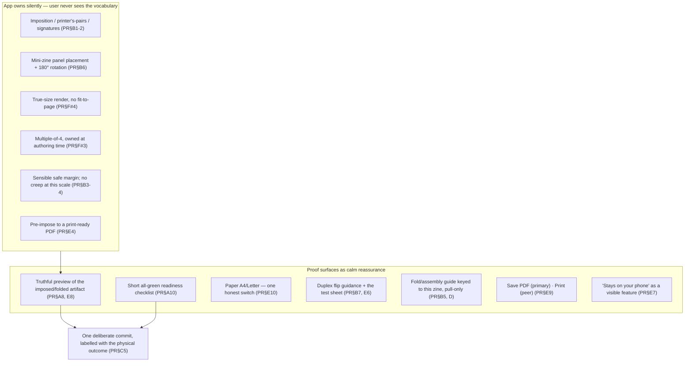

# V2-PROOF-RESEARCH.md — the Proof: cited evidence base

> **Status:** Phase **1** (research) of the **Proof initiative** — the third V2 surface, after the frozen
> [Library](mockups/v2-library.html) and the frozen [Bench](mockups/v2-bench.html). Proof is the calm final
> *room* of the studio where a maker slows down, checks their work, understands how it becomes a real folded
> object, and feels confident pressing Print. **Proof is not "Export." It is verification, not conversion.**
> This document is the evidence base only; it changes no code and freezes no design. It feeds Phase 2
> (critique), Phase 3 (principles), Phase 4 (IA), Phase 5 (journeys), Phase 6 (interaction), Phase 7 (HTML
> prototype). Findings are numbered **PR§n** for reference downstream. Every claim is labelled
> ✅ VERIFIED (sourced) · 🟦 RECOMMENDATION · 🟨 ASSUMPTION · ⚠️ DISPUTED, per the
> [Research standards](../../CLAUDE.md).

---

## Method

Six independent Research Agents ran in parallel, each a distinct lens, plus one read-only recon of the current
Proof/Print/Fold implementation (which feeds the Phase 2 critique, not this document). No agent saw another's
output; convergence across independent lenses is treated as signal, contradiction as a finding to resolve —
not to average.

| Stream | Lens |
|---|---|
| **PR-A** | Professional pre-flight & proofing workflows |
| **PR-B** | Imposition & folding mechanics (saddle-stitch, one-sheet mini-zine, duplex) |
| **PR-C** | Confidence, anxiety & irreversible-action UX |
| **PR-D** | Minimal-text instruction & wayfinding (IKEA, museum, origami, Mayer) |
| **PR-E** | Home/browser print realities + the Android print pipeline + privacy-first tools |
| **PR-F** | Real community beginner mistakes (forums, itch.io, library guides) |

---

## Part 1 — the six streams

### PR-A — Pre-flight & proofing is *verification*, not export

- **PR§A1 ✅** Pre-flight's canonical definition is a completeness/validity **gate** — "checking if the digital
  data required to print a job are all present and valid" — not an export step. The mental act is
  *verification*. ([Prepressure](https://www.prepressure.com/pdf/basics/preflight))
- **PR§A2 ✅** The professional check-list is a **fixed, small, knowable set** of recurring failure modes
  (missing fonts, overset/clipped text, low-res images, wrong colour space, bleed). Being finite is what makes
  a checklist possible. ([Adobe Preflight](https://helpx.adobe.com/indesign/using/preflighting-files-handoff.html))
- **PR§A3 ✅** InDesign runs preflight **live and continuously**, surfaced as one status indicator — not a
  terminal gate. By the time you reach the end there should be *nothing left to discover*.
  ([Adobe Preflight](https://helpx.adobe.com/indesign/using/preflighting-files-handoff.html))
- **PR§A4 🟦** For a **home-printed zine**, most pro checks are noise. The translatable subset: image
  resolution, text clipped/too close to the edge, unsupported characters (Zinely already ships
  [ADR-070](../DECISIONS.md) for this), and the zine-specific **page-count-multiple-of-4**.
  ([Foxit](https://www.foxit.com/blog/preflight-your-pdfs-compliance-with-pdf-standards-to-ensure-compatibility/))
- **PR§A5 ⚠️** CMYK/ICC/overprint/PDF-X/bleed dominate pro pre-flight but assume a commercial press. A home
  driver handles device colour itself; surfacing these to a beginner is **anxiety with no action attached**.
  Hide by default. ([Prepressure](https://www.prepressure.com/pdf/basics/preflight))
- **PR§A6 ✅** A "proof" is *a representation of the final product reviewed and explicitly **approved** before
  production*. The confidence comes from the **approval act itself** — a deliberate "yes, this is it" pause.
  ([UPrinting](https://www.uprinting.com/printing-101/what-is-proofing.html))
- **PR§A7 ✅** **Soft proof** = on-screen layout verification; **hard proof** = a physical sample for final
  certainty. Zinely's on-screen room is a *soft proof* and should be honest it verifies **layout, order and
  completeness — not exact colour**. The user's own first printed page is the hard proof.
  ([Printing.com.sg](https://www.printing.com.sg/knowledge-base/soft-proof-vs-hard-proof/))
- **PR§A8 ✅** A print preview earns trust by showing **exactly what will print** — the imposed, page-sequenced
  *output artifact*, not the editing view. ([Adobe Print Booklet](https://helpx.adobe.com/indesign/using/printing-booklets.html))
- **PR§A9 ✅** WYSIWYG fidelity is real but **bounded**, and honesty about the bound preserves trust: monitors
  emit light, printers lay ink; a preview that silently overpromises colour and then differs on paper *destroys*
  trust. ([KelbyOne](https://insider.kelbyone.com/the-challenge-of-wysiwyg-printing-by-lesa-snider/))
- **PR§A10 ✅** A checklist is a cognitive safety net that both prevents omissions **and gives the timid the
  confidence to proceed**, run "at natural pauses in a workflow." A short, all-green checklist at the Print
  pause converts "I hope this is right" into "I know this is right."
  ([Checklist Manifesto synthesis](https://www.businessofgovernment.org/blog/leadership-insights-checklist-manifesto-how-get-things-right))

### PR-B — Imposition is machinery the app owns; two physical facts it can't hide

- **PR§B1 ✅** Imposition = reordering reading-order pages into the physical left/right **printer's pairs** that
  sit on each sheet. Key beginner truth: *the page order on screen is not the page order on paper*. The two
  pages on any saddle-stitch spread always sum to (total + 1).
  ([Formax](https://www.formaxprinting.com/blog/why-saddle-stitched-booklets-require-the-page-count-to-be-a-multiple-of-4),
  [Adobe printer spreads](https://helpx.adobe.com/ca/indesign/using/printing-booklets.html))
- **PR§B2 ✅** Each folded sheet yields **4 pages**, so a saddle-stitch total is always a **multiple of 4**;
  short counts are padded with blanks. Adobe's "2-up Saddle Stitch" (8–80 pp, increments of 4, single
  signature) is *exactly* Zinely's booklet case.
  ([Adobe Booklet types](https://helpx.adobe.com/indesign/desktop/print/print-booklets/booklet-types.html))
- **PR§B3 🟦** **Creep** (inner sheets shingling past outer ones) scales with paper thickness × nested sheets.
  At ≤32 pages of office paper it is ~1–2 mm at the centre spread, and home users rarely trim flush — so it
  shows as slightly uneven edges, not clipped content. **Do not implement creep compensation for MVP**; Adobe
  itself disables creep control for single-signature 2-up saddle stitch.
  ([Color Vision Printing](https://www.colorvisionprinting.com/blog/saddle-stitch-binding-what-is-creep))
- **PR§B4 🟦** For a **home** zine the load-bearing concept is the **safe margin, not bleed** — most home
  printers can't bleed anyway. Keep important content inside a comfortable inset (~6–10 mm); treat edge-to-edge
  colour as "nice if you trim, expected white border if you don't."
  ([Ballantine](https://www.ballantine.com/understanding-bleeds-margins-and-trimming-in-print-production/),
  [Thomas Group](https://thomasgroupprinting.com/full-bleed-printing-instructions-designers/))
- **PR§B5 ✅** The one-sheet 8-page fold: fold-in-8, **cut a slit along the centre crease through only the
  middle two panels** (a slit, not a full cut), refold hotdog, push the ends together into a "+" and collapse
  into a booklet. ([exwhyzed](https://exwhyzed.com/how-to-fold-a-zine/),
  [Tahoe Trail Guide](https://tahoetrailguide.com/making-an-8-page-zine-from-a-single-sheet-of-paper/))
- **PR§B6 ✅** On the mini-zine master sheet the **front cover is the lower-far-right panel** and **all four
  top-row panels are placed upside-down**. This rotation is the single most confusing thing for beginners — and
  exactly the machinery Zinely must own so the user never sees an inverted panel.
  ([exwhyzed](https://exwhyzed.com/how-to-fold-a-zine/)) PocketMod productised precisely this: software
  pre-imposes content onto the sheet in the correct positions/rotations.
  ([PocketMod](https://alastairreid.github.io/pocketmod/))
- **PR§B7 ✅** **Duplex flip edge**: portrait pages → long edge keeps the back upright; landscape → short edge.
  For **booklet imposition the sheet is landscape** (two portrait pages side by side), so long-edge flips it
  top-to-bottom → back **upside-down**; the fix is **short-edge**. This is the #1 duplex failure and is
  *opposite* the intuitive "it's a book, use long edge" guess.
  ([PDF Press duplex](https://pdfpress.app/blog/duplex-printing-guide),
  [PDF Press Acrobat upside-down](https://pdfpress.app/blog/acrobat-booklet-printing-upside-down))
- **PR§B8 ✅** Assembly = fold each sheet, **nest** them (outermost = cover + last page), **staple through the
  spine**, optionally trim the fore-edge (home users usually skip trimming).
  ([Mimeo](https://www.mimeo.com/blog/what-is-a-saddle-stitched-booklet/))

### PR-C — Confidence comes from the preview, not the warning

- **PR§C1 ✅** User anxiety is fear of **irreversible error**; the antidote is felt **user control** — knowing
  actions can be reversed lets people explore fearlessly. ([IxDF](https://ixdf.org/literature/topics/user-control))
- **PR§C2 ✅** A **preview of the outcome** is a core error-prevention mechanism: seeing the result before
  committing removes the surprise that drives anxiety.
  ([NN/g](https://www.nngroup.com/articles/user-mistakes/))
- **PR§C3 ✅** NN/g rank order: **prevention > recovery**, and **undo is preferable to a confirmation dialog**.
  Reserve confirmations for actions with serious/irreversible consequences.
  ([NN/g Confirmation Dialogs](https://www.nngroup.com/articles/confirmation-dialog/))
- **PR§C4 ✅ (the "cry wolf" law)** Do **not** confirm routine actions — a dialog on everything trains
  click-through and the one confirmation that matters loses its power. This is why the Bench prefers undo over
  modals; it is *also* why Proof gets to spend the one confirmation on Print.
  ([NN/g](https://www.nngroup.com/articles/confirmation-dialog/))
- **PR§C5 ✅** When you do confirm: be **specific** (never "Are you sure?"), label buttons with the **outcome**
  ("Print 8 pages" / "Keep editing"), and give the committing button **visual separation and weight** so it is
  never a reflex tap next to a benign control.
  ([NN/g](https://www.nngroup.com/articles/confirmation-dialog/),
  [NN/g proximity](https://www.nngroup.com/articles/proximity-consequential-options/))
- **PR§C6 ✅** **Progressive disclosure** (Nielsen, 1995): show the few things a beginner needs, defer advanced
  settings behind "More options." Novices learn faster and err less; experts pay one click.
  ([IxDF](https://ixdf.org/literature/book/the-glossary-of-human-computer-interaction/progressive-disclosure))
- **PR§C7 ✅** **Mental models & no surprises**: the interface's "system image" is the only channel aligning the
  user's model with reality. Proof's preview *is* that system image of the printed page; every mismatch
  (margins, order, bleed) breaks trust. ([IxDF](https://ixdf.org/literature/topics/mental-models))
- **PR§C8 ✅** **Teach by pull, not push.** Upfront tutorials/modal walkthroughs ("push") interrupt, are
  skipped and forgotten; **contextual help surfaced on demand and easily dismissed/recalled** ("pull") is
  invisible to the expert by construction. A modal fold-tutorial is the Clippy anti-pattern.
  ([NN/g Onboarding vs Contextual](https://www.nngroup.com/articles/onboarding-tutorials/))
- **PR§C9 ✅** **Mark the completion.** The Zeigarnik effect: people carry tension for unfinished tasks and feel
  relief on completion — but only if completion is *shown*. Proof sits at the goal line; present it as the last,
  near-complete step, and give unmistakable closure feedback, not a drop back into ambiguity.
  ([LearningLoop](https://learningloop.io/plays/psychology/zeigarnik-effect))
- **PR§C10 🟨** "**Ceremony/ritual**" as a distinct driver of *calm creative* completion is under-documented in
  the UX literature (which frames closure via progress/engagement). It is a reasonable design **hypothesis** for
  Zinely — **validate in the mandatory Pass 2 first-time-user verification**, do not assume the literature backs
  it. ([synthesis](https://fastercapital.com/content/Task-Completion--Completion-Psychology--The-Psychology-Behind-Task-Completion.html))
- **PR§C11 ✅** **Preview-before-commit is an established pattern** ("dry run" / "draft mode"): show exactly what
  will happen, and what it will cost, before committing real resources. Print is the physical version — preview
  on glass is free; ink and paper are not. ([Draft Mode](https://www.shapeof.ai/patterns/draft-mode))

### PR-D — Teach the fold with minimal text and one camera angle

- **PR§D1 ✅** IKEA's two governing principles are **Clarity** (each step instantly understandable) and
  **Continuity** (consistent flow reduces new things to learn mid-task); **one step per page**, minimal clutter.
  ([Sketchboat](https://www.sketchboat.com/blog/the-ikea-manual-the-ux-of-building-furniture-and-why-it-works))
- **PR§D2 ✅** **Hold one viewing angle throughout.** Perspective changes between steps make the object
  unrecognisable — the single biggest reason 2-D fold instructions confuse. Rotate the paper *within* a step
  with a visible turn-over arrow, never silently between steps.
  ([The Broadcat](https://www.thebroadcat.com/blog/2016/08/why-are-ikea-instructions-so-hard))
- **PR§D3 ✅** Museum interpretive hierarchy: **one message per decision point**, big idea → key message →
  detail; calm grotesque sans-serif, generous spacing, blend-in chrome that never shouts.
  ([Canadian Museum for Human Rights](https://id.humanrights.ca/graphic-standards-for-exhibits/text-hierarchy-and-readability/))
- **PR§D4 ✅** **Animation's weakness is loss of learner pace control** (transient, can't dwell/re-inspect); its
  strength is **continuous change and manner-of-movement** — which a fold is. Therefore: **static self-paced
  steps as the default, a short segmented/looping animation as an opt-in aid, and a persistent static end-state
  always on screen.** Never gate progress on an un-pausable clip.
  ([Argüel & Jamet](https://tecfa.unige.ch/tecfa/teaching/methodo/ArguelJamet2009.pdf))
- **PR§D5 ✅ / ⚠️** Origami's **Yoshizawa–Randlett** notation (dashed = valley, dash-dot = mountain) is a
  *learned* convention experts themselves don't fully agree on — so **beginners won't read it**. Borrow only the
  intuitive primitives: **an arrow for which way the paper moves + the crease line where the fold lands**, not
  the dashed/dash-dot alphabet. ([Lang](https://langorigami.com/article/origami-diagramming-conventions/))
- **PR§D6 ✅ (Mayer)** Words **+** pictures beat words alone (Multimedia); place any label **on** the diagram at
  the point of action (Spatial Contiguity — 22/22 tests, median effect ~1.10); strip everything inessential
  (Coherence) and cue the one active fold (Signaling); let the learner control pace (Segmenting).
  ([Cambridge Handbook, ch.12](https://www.cambridge.org/core/books/abs/cambridge-handbook-of-multimedia-learning/principles-for-reducing-extraneous-processing-in-multimedia-learning-coherence-signaling-redundancy-spatial-contiguity-and-temporal-contiguity-principles/CD5B7AE1279A9AB81F8EEBB53DBEC86E))
- **PR§D7 🟦** Keep the whole fold guide **behind a dismissible layer** (progressive disclosure): the confident
  user prints and folds without ever opening it; help is deferred to a secondary, recallable surface. This is
  the museum "big idea → detail" layer and PR§C8's pull revelation, applied to folding.

### PR-E — The app pre-imposes; the OS owns the dialog; Save is the safer primary

- **PR§E1 ✅** Android printing hands a `PrintDocumentAdapter` to the system `PrintManager`; **the OS draws the
  dialog and the user picks the printer & options** — the app never draws it and never chooses the printer.
  ([Android custom docs](https://developer.android.com/training/printing/custom-docs))
- **PR§E2 ✅** The dialog's choices arrive as `PrintAttributes`: `getMediaSize` (paper), `getColorMode`,
  `getDuplexMode`, `getResolution`, `getMinMargins`; copies & page-range are framework-handled. OS owns paper
  size, colour, duplex, orientation, copies, range, target printer.
  ([Android PrintAttributes](https://developer.android.com/reference/android/print/PrintAttributes))
- **PR§E3 ✅** Duplex is three constants (`NONE` / `LONG_EDGE` "like a book" / `SHORT_EDGE` "like a notepad") —
  a **request gated by the printer's reported capability**, not a guarantee. An app cannot force a non-duplex
  printer to duplex. ([Android PrintAttributes](https://developer.android.com/reference/android/print/PrintAttributes))
- **PR§E4 ✅ (critical)** The Android print framework has **no concept of booklet imposition** — it renders
  your pages, in your order, onto sheets. **Reordering into signatures is application work.** The only reliable
  path: **Zinely pre-imposes into a signature-ordered print-ready PDF, then hands that finished PDF to the OS
  printer.** ([Android PrintDocumentAdapter](https://developer.android.com/reference/android/print/PrintDocumentAdapter),
  [PDF Press](https://pdfpress.app/blog/how-to-print-booklet-from-pdf))
- **PR§E5 ✅** `getMinMargins` exists because devices reserve **unprintable edges**; the OS won't let an app
  override a printer's hard margins. Most home lasers **cannot full-bleed at all**.
  ([Android Margins](https://developer.android.com/reference/android/print/PrintAttributes.Margins),
  [Printivity](https://www.printivity.com/insights/full-bleed-versus-no-bleed-printing))
- **PR§E6 ✅** Many home printers have **no auto-duplex** — the honest fallback is *manual* duplex (print odds,
  flip & reload, print evens), and the standard advice is **run one test sheet first** to learn the reload
  orientation. ([Adobe](https://helpx.adobe.com/indesign/using/printing-booklets.html))
- **PR§E7 ✅** Privacy-first tools (**ImpositionPDF**, **BookletPro**) lead with the privacy promise as a
  *feature* ("files never leave your device"). For Zinely (already fully offline) this validates making **"stays
  on your phone" a visible, calming line** in Proof. ([ImpositionPDF](https://impositionpdf.com/),
  [BookletPro](https://bookletpro.app/))
- **PR§E8 ✅** Those tools' **live preview is the cited confidence mechanism** — "see problems before I burn a
  plate" — and they frame output as a **finished artifact you can Save or Print**, the two paths side by side as
  peers, not a wizard. ([ImpositionPDF](https://impositionpdf.com/), [BookletPro](https://bookletpro.app/))
- **PR§E9 🟦** **"Save PDF" is the safer primary path**, "Print" the peer secondary: a saved imposed PDF is
  reprintable, shareable, and **survives a botched first print run** — and it matches existing
  [ADR-054](../DECISIONS.md) "Save PDF → Downloads." ([PDF Press](https://pdfpress.app/blog/how-to-print-booklet-from-pdf))
- **PR§E10 🟦** Paper size affects imposition, so it **cannot be a purely last-second OS-dialog choice**. Make
  it an **app-owned default with one honest switch (A4 ⇄ US Letter)**, defaulted by locale, decided at/just
  before Proof. Impose to the size you will tell the user to select, so the OS dialog can't silently rescale.
  ([Android MediaSize](https://developer.android.com/reference/android/print/PrintAttributes))

### PR-F — Every failure is invisible until paper is spent, and reads as "the app broke"

Real, sourced beginner failures, ranked most-common-first:

| # | Mistake (sourced) | What it implies for Proof |
|---|---|---|
| 1 | **Wrong duplex flip edge** → back pages upside-down; one user wasted ~2 h ([Adobe](https://community.adobe.com/t5/acrobat-discussions/booklet-printing-back-side-upside-down/m-p/12602997)) | App requests the correct flip for landscape spreads; **a test sheet is the safety net** (see ⚠️ contradiction below). |
| 2 | **Printed in reading order / exported spreads** → scrambled booklet ("page 9 then 19") ([itch.io](https://itch.io/post/8303947)) | App imposes from reading-order pages; **never** expose "spreads/signatures" or ask the user to reorder. |
| 3 | **Page count not a multiple of 4** → surprise blanks ([PrintReady](https://printreadyhq.com/en/guides/saddle-stitch-booklet)) | Own the constraint **at authoring time**; make added blanks *visible, placeable pages*, framed as done-for-you. |
| 4 | **"Fit to page" scaling** → zine silently shrinks ~5%, uneven margins ([Adobe](https://community.adobe.com/t5/acrobat/how-to-print-a-booklet-at-100/m-p/7371284)) | Own scale: render at true size for the target sheet; a shrunk zine reads as "broken." |
| 5 | **Single-sided by accident / botched manual duplex** ([Douglas College](https://guides.douglascollege.ca/zines/print)) | Explain the manual re-feed with a reload-direction diagram; recommend a test sheet. |
| 6 | **Folded/cut wrong** — overcut past the centre crease, wrong panel = cover ([exwhyzed](https://exwhyzed.com/how-to-fold-a-zine/)) | Ship a fold/cut diagram keyed to *this* zine, marking the cut line, its **stop point**, and the cover panel. |
| 7 | **No bleed / content in trim or gutter** → white slivers, swallowed text ([Irrelevant Press](https://www.irrelevantpress.com/home/2020/9/24/what-the-bleed)) | Gentle "this may get cut" callout, not a blocking error. |
| 8 | **Wrong paper size / orientation** ([Douglas College](https://guides.douglascollege.ca/zines/print)) | One explicit confirm: "Letter, landscape — is that what's in your printer?" |

- **PR§F1 🟨 (the emotional signature)** Across the upside-down / scrambled threads the tone is **confusion and
  defeat** ("nothing works. Idk what to do"), not diagnostic curiosity. Because the failure only appears *after*
  printing and folding, beginners burn paper and ink before they see the problem, and **blame the file or the
  app, not a setting**. This is precisely the failure mode [ADR-058](../DECISIONS.md#adr-058) documents for
  Zinely's own beta "Preview." ([wonderwise](https://wonderwise.substack.com/p/5-lessons-i-learned-making-my-first/comments))

---

## Part 2 — the governing split: what the app owns vs what Proof surfaces

The strongest convergence across all six streams is a single split. **Imposition and every mechanical decision
is machinery Zinely owns silently; only a tiny set of physical-world truths, which software genuinely cannot
control, are surfaced — and each is surfaced as reassurance, not as a lesson or a setting.**

---

## Part 3 — open contradiction requiring device verification

⚠️ **Duplex flip edge — do not assert with false confidence.** The streams disagreed, and the disagreement is
itself the finding:

- **PR§B7** (imposition mechanics): 2-up booklet sheets are **landscape** → **short-edge** flip keeps backs
  upright.
- **PR§E3 / general home-print advice**: a portrait "book" booklet → **long-edge** flip.
- **PR§F#1**: real users cannot predict which their printer needs and *guess*, wasting prints.

**Resolution (convergent across PR-A, PR-B, PR-C, PR-E, PR-F).** Because Zinely **pre-imposes landscape 2-up
spreads (PR§E4)**, short-edge is the *likely-correct* request — but the physical result is genuinely
printer/driver-dependent and Android can only *request* a duplex mode (PR§E3), not guarantee it. Therefore Proof
must **not** claim one answer as certain. It should (a) request the likely-correct mode, (b) give plain-language
guidance, and (c) **bless a single test sheet** — the "hard proof" (PR§A7), the "test copy" (PR§A8-of-A / A-F#5),
and the "draft-mode-before-you-spend" pattern (PR§C11) all point to the same cheap insurance. **The exact
default flip and whether it can be reliably auto-selected is a Pass-1 device-verification item**, not a
freeze-time assumption. This mirrors the Bench's discipline of conditioning a claim on device proof.

---

## Part 4 — consolidated principles (feed Phase 2/3)

Eleven principles the critique and the design principles inherit. Each traces to the evidence above.

1. **Proof is verification, not conversion.** Answer the held question — *"will this come out right?"* — as a
   soft proof of layout, order and completeness. Never dress up as an export/settings dialog. (PR§A1, A6, F1)
2. **Confidence comes from a truthful preview of the *output artifact*.** Show the imposed/folded zine exactly
   as it will print and assemble, with an optional page-by-page pass. Every mismatch is a trust-breaking
   surprise. This is the axis the beta "Preview" failed on. (PR§A8, C2, C7, E8, [ADR-058](../DECISIONS.md#adr-058))
3. **Scope the promise honestly.** Layout/content/order are exact; **colour is approximate** on a home printer.
   State the bound quietly; silent overpromising then a different sheet destroys trust. (PR§A7, A9)
4. **Own the machinery; never show the vocabulary.** Imposition, rotation, true-size, multiple-of-4, margins —
   all silent. The user arranges pages in reading order and nothing else. (PR§B1-6, E4, F#2-4)
5. **A short, finite, all-green readiness list — earned upstream.** Ideally every item is already resolved by
   the time the user arrives; the room *confirms* readiness, it does not discover problems. (PR§A2-3, A10, C9)
6. **Surface only the actionable physical truths, as reassurance.** Paper size (one A4/Letter switch), the
   duplex flip + test sheet, and a gentle edge/gutter callout — the few things software cannot own. Hide all
   pro-press noise. (PR§A4-5, B7, E5-6, E10, F#7-8)
7. **Save PDF is the primary path; Print is its calm peer.** Two exits side by side, Save first — a saved
   imposed PDF is reprintable, shareable, and survives a bad print. (PR§E9)
8. **Spend the one confirmation here, and label it with the physical outcome.** Printing is genuinely
   irreversible, so it earns a deliberate, weighted commit ("Print 8 pages" / "Save PDF"), never "Are you sure?"
   — and nowhere upstream, so it never cries wolf. (PR§C3-5)
9. **Teach the fold by pull, one fold per screen, one camera angle.** Static self-paced steps with an arrow +
   crease + on-diagram caption + before/after; opt-in looping animation for the motion; the whole guide behind a
   dismissible layer, invisible to anyone who already knows. No modal tutorial, no origami notation. (PR§C8, D1-7)
10. **Keep undo/back alive right up to the commit; make the boundary obvious.** Until ink hits paper everything
    is reversible and the user should feel it — a visible way back to the Bench is what lets them press Print
    without fear. Irreversibility begins *only* at the button. (PR§C1, C3)
11. **Mark the completion as a felt event.** Discharge the open loop with unmistakable closure and hand off to
    the Library/Read on pride, not on a technical screen — but **"ceremony" is a hypothesis to verify in Pass 2**,
    not an assumed truth. (PR§C9-10, [ADR-058](../DECISIONS.md#adr-058))

---

## Emotional target (the benchmark, restated)

> The user should finish Proof believing **"I know exactly what will happen when I press Print"** — not
> *"I'm exporting."* The benchmark is not an export dialog; it is the reassuring final room of a calm creative
> studio. Proof quietly answers every question a first-time maker would naturally have *before they think to
> ask it*, moves the moment of truth **before** the print (a truthful preview + a diagram + one test sheet)
> rather than after (a scrambled, upside-down, mis-scaled stack), and leaves the maker feeling *finished*.

---

## Cross-references & what feeds the next phases

- **Phase 2 (critique)** inherits Part 2's ownership split and PR§F's failure list, and is grounded against the
  **current Proof/Print/Fold implementation** (the read-only recon, feeding the critique directly) — including
  the retired Preview/Export/Completion triad ([ADR-051](../DECISIONS.md)/[ADR-052](../DECISIONS.md)), the
  one-engine preview==export property ([ADR-028](../DECISIONS.md)), and the fold hand-off ([ADR-041](../DECISIONS.md)).
- **Phase 3 (principles)** inherits Part 4's eleven consolidated principles and the frozen product-wide
  [V2 principles](V2-PRINCIPLES.md) + [tokens](V2-TOKENS.md), specialising them for the final room.
- **Phases 4–7** inherit the governing split, the duplex/test-sheet resolution, and the pull-only fold-guide
  stance → the IA, journeys, interaction model, and the canonical HTML prototype.

*Phase 1 of the Proof initiative. Evidence only — no code changed, no design frozen. Findings labelled per the
[Research standards](../../CLAUDE.md); RECOMMENDATION/ASSUMPTION/DISPUTED items are flagged for the owner and
the Phase 2 critique to ratify. Next: Phase 2 critique, grounded in the current repository state.*
