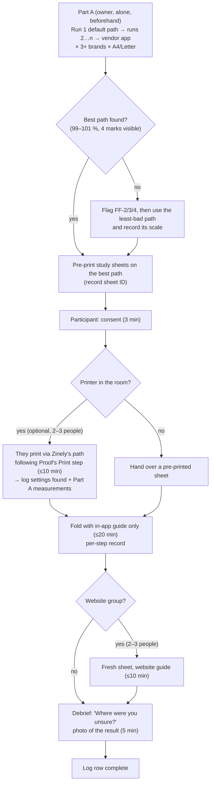

# Print and fold study: protocol

> **Status:** Protocol, approved to run (owner, 2026-09-26, decision gate Q5/Q7). **Not yet run.**
>
> **Owns:** how the combined print and fold study is run and recorded. It does **not** own the decisions it
> feeds. Those stay in [decision gate Q5](ZINELY-1X-DECISION-GATE.md#q5-fold-study-before-creative-work-o14)
> and [Q7](ZINELY-1X-DECISION-GATE.md#q7-print-o13--d3-stage-2), and the ADRs they touch
> ([ADR-012](../DECISIONS.md#adr-012), [ADR-039](../DECISIONS.md#adr-039), [ADR-052](../DECISIONS.md#adr-052)).
> This protocol merges and replaces the two protocol sketches in the readiness audit
> ([§4 fold-clarity study](ZINELY-1X-READINESS-AUDIT.md#4-wave-0-audit) and
> [§7 physical print protocol](ZINELY-1X-READINESS-AUDIT.md#7-d3-audit--printer-test-page)).
>
> You need no agent, no code and no network to run it: only a phone, printers, paper, a steel mm ruler,
> scissors and a notebook or spreadsheet.

---

## 1. Purpose and the decisions it feeds

The study answers two questions:

- **Print:** what really comes out of the printer when someone follows Zinely's print path on Android?
- **Fold:** can a first-time maker turn that sheet into a correct booklet using only the in-app guide?

| Decision | Owner | What this study supplies |
|---|---|---|
| **Q7(a)/(d): ship the print guidance, and its wording.** Stage-1 copy in Proof's Print step, and what the app may say about scale. | Owner | Real scale on each path; whether a 100 % control can be reached; which settings the dialog shows by default. |
| **Q7(c): keep one global inset, or change it.** 17 pt ≈ 6.0 mm, `Imposer.DEFAULT_SAFE_AREA_INSET_PT`. | Owner | Real printer reach on each edge, across 3 or more brands, on A4 and Letter. |
| **Is a render change needed?** For example, guides kept inside the inset, a sheet margin, or an in-app `PrintManager` with a pinned `MediaSize`. | Owner, through a new ADR | Whether any failure can be fixed with copy at all. |
| **Proof fold-caption and diagram fixes** (`Copy.ProofFold.STEP_CAPTIONS`) | Owner rules; the implementer drafts the `v21-proof.html` amendment | Where people fail and at which step. |
| **Q5: fold clarity** | Owner | **Evidence only.** Q5 no longer gates D2 or D5 (owner ruling, 2026-09-26). |

### Fundamental failure (the owner may reprioritise)

Any **one** of these is a fundamental product failure, not a caption fix. The report must say so on its first
line, and the owner may reprioritise the 1.x plan because of it.

| # | Failure | How it is measured |
|---|---|---|
| **FF-1** | **Half or more of the participants cannot produce a correct booklet** with the in-app guide and no help. That is 3 or more of 6, or 4 or more of 8. | Part B, "correct result" column. |
| **FF-2** | **The default print path shrinks the sheet enough that the folds miss**, on 2 or more of the 3 brands. That means a quarter-fold line more than 1.5 mm from its crease, which is roughly below 98 % on A4. | Part A, run 1. |
| **FF-3** | **The default path loses content**: the cut line, or an edge mark inside the safe area, is clipped on 2 or more brands. | Part A, run 1. |
| **FF-4** | **No print path the maker can reach produces 99–101 %** on a tested printer. The only way to actual size needs a computer or a paid app. | Part A, all runs for that printer. |

---

## 2. Before you start: materials and the study zine

- [ ] **Build:** the current release build, installed on the study phone. Record its exact `versionName` from
      About. At the time of writing that is `0.9.0-beta.5`.
- [ ] **Study zine.** Make one fresh zine on the study phone that contains only fictional content. **Never
      use a zine from the owner's own library, and never use personal photos.** Make it once for A4 and once
      for Letter. Each of the 8 pages carries:
  - a small page number ("1" … "8") and one line of text, so page order and upright text can be checked;
  - an **edge mark:** a thin shape or text strip placed flush against the Bench keep-clear line on every
    edge that touches the sheet edge. 🟨 ASSUMPTION: the keep-clear band lets you place it within
    about 1 mm of 17 pt. Measure where it really lands on the first print, and use that measurement, not
    17 pt.
  - Optional, if the page-background control is available: a coloured page background. The printer's
    unprinted border then shows as a white strip. 🟨 ASSUMPTION: the background fills the panel to the
    sheet edge. Check this on the first print.
- [ ] **Export** the zine through Proof, using **Save PDF**, which saves to Downloads. Keep these two PDFs
      for every run.
- [ ] **Expected geometry.** Guides are drawn edge to edge
      (`app/src/main/java/com/aritr/zinely/export/SheetGuides.kt`). The sheet is landscape.

| Paper | Sheet (landscape) | Quarter-fold spacing | **Outer quarter lines apart** (the ruler) | Half-height fold from top |
|---|---|---|---|---|
| A4 | 297 × 210 mm | 74.25 mm | **148.5 mm** | 105.0 mm |
| Letter | 279.4 × 215.9 mm | 69.85 mm | **139.7 mm** | 107.95 mm |

> **Why the outer quarter lines are the ruler.** When a sheet is shrunk and centred, the middle fold still
> lands on the middle crease, because you fold edge to edge. Only the quarter folds drift, by
> `(1 − scale) × width ÷ 4`: about 2.2 mm at 97 % on A4. So the middle line exposes **off-centring**, and the
> quarter lines expose **shrink**.

---

## 3. Part A: the print path (no participants)

### 3.1 Run order

**Run 1 is the real Zinely path, with nothing changed.** Every later run is a variation on it.

| Run | Path | Settings |
|---|---|---|
| **1** | Proof → Save PDF → open it from Downloads in the phone's **default** PDF viewer → Print → **Android Default Print Service**. On some phones this is called "Default Print Service" or "Mopria". Record the exact name. | **Change nothing**, including the orientation the dialog picks. Record every value shown. |
| 2 | The same path | Set Landscape, and paper to match the zine. Change nothing else. |
| 3…n | The same path | **Each scale or fit option the dialog or "More options" shows**, one per run: 100 %, Actual size, Fit to page, Shrink, and so on. Write down **where** each option was found, in taps. If no scale option exists, write **"none reachable"**. |
| V | The vendor's plug-in or app (HP Smart or HP Print Service Plugin, Canon PRINT, Epson iPrint or Epson Print Enabler, Mopria, Samsung Print Service Plugin) | Its defaults first, then its 100 % or actual-size option if it has one. |

**Printers:** at least **3 brands**: an HP inkjet, a Canon PIXMA, and a Brother laser or an Epson.
Letter on the Canon is the documented worst case (6.4 mm margin). Use **A4 and Letter** wherever you can
get the paper.

### 3.2 Record sheet (one row per printed sheet)

| Field | Example |
|---|---|
| Sheet ID | A-HP-A4-R1 |
| Phone model / Android version | |
| Zinely versionName | |
| PDF viewer app + version | |
| Print service + version (Settings → Printing) | |
| Printer model / connection | |
| Paper loaded / paper selected in dialog | |
| **Every setting shown**, as displayed (orientation, paper, scale, colour, two-sided, margins) | |
| Scale control reachable? Where? | "More options → Scaling → 100 %" / "none reachable" |
| Photo ID (sheet flat, ruler in shot) | |

### 3.3 Measurements (per sheet, with a steel mm ruler)

| # | Measure | Expected | Record |
|---|---|---|---|
| M1 | Distance between the outer quarter-fold lines | 148.5 mm A4 / 139.7 mm Letter | mm, then **scale % = measured ÷ expected** |
| M2 | Orientation printed | Landscape, whole sheet used | landscape / portrait-shrunk / rotated |
| M3 | Fold per captions 1–3, unfold, then measure the **gap between each printed guide and its crease** (3 vertical, 1 horizontal) | ≤ 0.5 mm | mm × 4 |
| M4 | Edge mark visible on **all four edges**? Distance from paper edge | ≈ 6 mm, all present | per edge: visible? mm |
| M5 | Unprinted border per edge: where the fold lines stop, or the white strip if a background is used | Report as measured | mm × 4 |
| M6 | Clipped content: cut line, text, edge marks | None | what, where |
| M7 | Sides | One side only | one / two |
| M8 | Fold into a booklet: order 1→8, cover on top, text upright | Correct | yes / no + why |

**A sheet passes** when M1 is within **99–101 %**, all four edge marks are visible (M4), and the booklet
order is correct (M8). **Report separately** every print path on which 100 % cannot be reached.

### 3.4 Hypothesis under test

> 🟨 **UNVERIFIED:** the AOSP `BuiltInPrintService` (Default Print Service) prints at 1:1 only when the
> PDF page size equals the selected paper **and** the printer's unprintable margin area is blank. Zinely's
> guides run to the sheet edge, so the default path may **fit to the printable area**, a shrink of about
> 2–5 %. [ADR-052](../DECISIONS.md#adr-052) also records as fact that the system dialog shows **no**
> actual-size control. Run 1 and runs 3…n test both claims on real hardware. Record which services agree
> with them and which do not.

### 3.5 What each outcome implies

| Outcome (across the brands tested) | Implication | Paperwork |
|---|---|---|
| Run 1 passes everywhere | **Copy only** (stage 1): a fold-line self-check plus orientation wording. The copy may describe the result only for the paths that were measured. | `v21-proof.html` amendment, then Compose |
| Run 1 shrinks, and a 100 % control can be reached on each service | **Conditional advice:** "If your print app has a Scale setting, choose 100 %", plus the fold-line check. Never unconditional. | as above |
| Scale is correct, but reach is worse than the inset on some edge (M4 or M5) | **One global inset change** (e.g. 18–20 pt), in its own session. No per-printer profile (Q7 lean). | **ADR-012 amendment**, `v21-bench.html` keep-clear amendment, goldens |
| Shrink cannot be fixed on some service, or guides and content are clipped (FF-2, FF-3 or FF-4) | **Render change**: guides inside the inset, a sheet margin, or an in-app print path that pins `MediaSize` | **New ADR** (supersedes part of ADR-039 or ADR-052) |

---

## 4. Part B: fold (6–8 first-time makers)

- **Who:** 6–8 people who have **never made a mini-zine**, of mixed age and handedness. Nobody who built
  the product. **2–3 of them** also try the website fold guide
  ([website/index.html](../../website/index.html), live at `aritr-codes.github.io/zinely-android`), after
  the in-app attempt and on a fresh sheet.
- **Sheet:** each person either prints their own sheet through Part A's best path, or receives a sheet
  printed through it. **Record which**, and the Part A sheet ID.
- **Guide:** the in-app Proof fold guide only (`Copy.ProofFold.STEP_CAPTIONS`, 8 steps). Say only
  *"Make the booklet."*
- **Correct result:** pages 1→8 in reading order, cover on top, text upright, one clean slit.

### 4.1 Per-step record (one row per step, per participant)

| P# | Step | Pause > 10 s | Wrong fold | Went back | Cut error (wrong crease / one layer / too long) | Asked for help | Notes (their words) |
|---|---|---|---|---|---|---|---|

Per participant: **total time**, **correct result (yes/no)**, **photo ID of the result**, and their answer to
*"Where were you unsure?"*

### 4.2 What counts as evidence

- **Finding:** the **same failure at the same step for 2 or more people**. Anything seen once is logged,
  not acted on.
- Five to eight users are enough to **find** problems, but not to measure error rates
  ([NN/g, 2000](https://www.nngroup.com/articles/why-you-only-need-to-test-with-5-users/)). Judge fixes
  qualitatively, and retest a fix with 3–5 new people.
- Check steps 1 and 5 especially. The shipped captions already contain the "wide way round" and "through
  both layers" fixes. The study tests **whether those fixes work**, not whether they are needed.

### 4.3 Consent and privacy (non-negotiable)

- [ ] Read aloud: *"We are testing the instructions, not you. You can stop at any time. We will photograph
      the paper and your hands only, never your face, and we will not record your name."*
- [ ] Get verbal consent and log it as "P3 consented, date". **No names anywhere**: use P1…P8.
- [ ] **Fictional study zine only.** Never the owner's device library.
- [ ] Photos: paper and hands only, with location turned off in the camera. Photos **stay local** on the
      owner's machine, outside the repo, and are never uploaded. The report cites them by photo ID. Any
      image committed later is cropped to the sheet.

---

## 5. Combined session script (about 30–40 min per participant)

| Minute | Step |
|---|---|
| 0–3 | Consent script, then participant ID |
| 3–13 | *Optional:* "Print this zine" on the room printer, following Proof's Print step. Log which settings they found, what they changed, and the Part A measurements for their sheet. This is the Q7 wording evidence. |
| 13–33 | "Make the booklet." Use the in-app guide only, and fill in the per-step record |
| 33–38 | Debrief question, then photograph the result |
| (+10) | Website group only: a fresh sheet and the website guide |

### Solo-run variant (owner alone)

- The owner runs **all of Part A** alone. It needs no participants.
- The owner **cannot be a Part B participant**, because they built the product. Folding a sheet alone gives
  M3/M8 measurements only, **not** fold-clarity evidence. If no participants can be found, report Part B as
  **not run** rather than substituting the owner's own fold.
- Minimum useful Part B: 3 helpers run through the script above, with the owner observing silently. Label
  this "partial, below 6", so it cannot confirm findings.

---

## 6. Outputs, and who rules

| Output | Where |
|---|---|
| Dated report: all record sheets, measurements, findings (≥2-person rule), FF verdicts, and the outcome row from §3.5 | `docs/reviews/YYYY-MM-DD-print-and-fold-study.md` |
| Durable evidence: print-path scale and reach per service and brand, and fold-clarity findings, labelled ✅/🟦/🟨 | A new entry at the next free R-number in [RESEARCH.md](../RESEARCH.md), linking the report and [R2.4](../RESEARCH.md) (§R2.4)/[R2.5](../RESEARCH.md) (§R2.5) |
| Photos | Stay local (§4.3), cited by ID |

**Who rules afterwards:** the **owner** rules Q7 (a)–(d) and the caption fixes, working from the report.
The implementer then drafts whatever the outcome row requires: the `v21-proof.html` amendment, an ADR-012
amendment, or a new ADR. A Review Agent reviews it before anything is merged. The study itself decides
nothing.

### Proposed "Print pass" section for DEVICE-VERIFICATION

*This is proposed text. It must not be applied from here. The implementer adds it as
[DEVICE-VERIFICATION.md](../DEVICE-VERIFICATION.md) §3.3 in the change that first relies on it.*

> ### 3.3 Print pass: what a print or export change owes paper
>
> **Required for** any change to export geometry, the safe inset, sheet guides, or print guidance copy.
> **Screens cannot close it.**
>
> 1. Export the fictional study zine (see the study protocol, `docs/planning/STUDY-PRINT-AND-FOLD-PROTOCOL.md` §2)
>    on A4 and Letter.
> 2. Print through **Zinely's real path**: Save PDF → default viewer → system print dialog → Default Print
>    Service, **settings untouched**. Then print once at 100 % if a scale control can be reached. Use at
>    least 3 brands.
> 3. Measure the outer quarter-fold lines (148.5 mm A4 / 139.7 mm Letter) → scale %. Measure the
>    guide-to-crease gaps, edge-mark visibility on all four edges, and fold order.
> 4. **Pass:** 99–101 %, all four marks visible, booklet correct. Record the phone, Android version, viewer,
>    print service and version, printer, paper, every setting shown, and a photo.
> 5. Any copy that mentions scale may promise only what this pass measured on the paths it names.

---

## 7. What this study must NOT be used to claim

- ❌ "Android preserves exact size", or "prints at 100 %", **unless it was measured on that exact path**
  (service and version, viewer, printer). A result on 3 brands is not a result for Android.
- ❌ "100 % / Actual size" advice without the condition that **the maker's own print app** exposes a scale
  control (owner ruling Q7). No study result removes that condition: tested services are not the maker's app. Note that `Copy.kt` already ships unconditional 100 % wording, and
  the study may show that wording is untrue.
- ❌ An error rate, or "X % of people can fold it". 6–8 people find problems; they do not measure how
  often they occur (§4.2).
- ❌ "The inset is safe for all printers." Only the measured printers are covered.
- ❌ Any result from Part B as a gate on D2 or D5 (owner ruling Q5), except through the FF-1 escalation
  above.
- ❌ Fold-clarity conclusions from the owner's own folding (§5 solo variant).
- ❌ A minimum print size for Fraunces. That needs its own physical test (owner ruling Q2).
