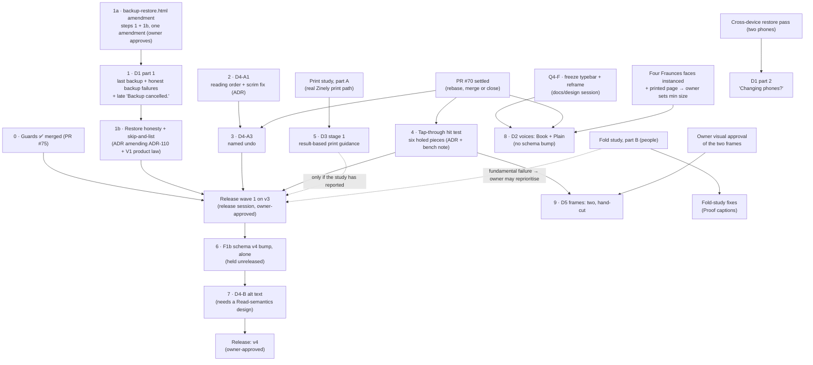

# Zinely 1.x — implementation plan

Status: **PLAN — direction approved by the owner on 2026-09-26** (rulings Q1–Q8 recorded in the
[decision gate](ZINELY-1X-DECISION-GATE.md)). Each step is still authorised one at a time: it opens only when
its readiness line in [§11](#11-implementation-readiness-after-owner-decisions) says READY, in a fresh session.
Date: 2026-09-25, revised the same day from the [readiness audit](ZINELY-1X-READINESS-AUDIT.md), and on
2026-09-26 for the owner's rulings ·
Author: research session (Claude) · Base: `origin/main` @ `0aa7a7d` (planning package merged, PR #76; Step 0
merged at `eb75cf7`; beta.5 released: tag
`v0.9.0-beta.5` at merge `32da280`, GitHub pre-release, APK only; website updated at `5f7707a`).
Code evidence was gathered at `5f7707a`. Step 0 changed no `src/main` file (it added tests, fixtures, one
Gradle task run in the existing CI step, a `.gitattributes` line and [ARCHITECTURE §4.1](../ARCHITECTURE.md)), so those `file:line` citations still hold at
`eb75cf7` except where re-cited below.

> **Implementation status** (this plan's one status record; the [§5](#5-sequencing) table repeats it per step).
>
> | Step | Status | Record |
> |---|---|---|
> | **0 · Guards** (F1a, F3, F4) | ✅ **COMPLETE — merged 2026-09-26** | PR #75 · merge `eb75cf7ae78a91c5df5c331ccb85ef19520ec87a` · commits `8ed6d29` (guards) and `f455cd9` (A1 hardening) · [ARCHITECTURE §4.1](../ARCHITECTURE.md) |
> | Owner rulings Q1–Q8 | ✅ **Recorded 2026-09-26** | [decision gate](ZINELY-1X-DECISION-GATE.md) (the ruling record) · [owner decision brief](ZINELY-1X-OWNER-DECISION-BRIEF.md) (one-page summary) |
> | 1 onward | Not started | readiness per step: [§11](#11-implementation-readiness-after-owner-decisions) |
>
> **Step 0 deferred advisories** (from its independent review; the owner deferred them; **not blockers** for
> any step):
> - **A2:** no minSdk-24 privacy case, so a permission declared with `maxSdkVersion` ≤ 27 is invisible to
>   `PrivacyManifestTest`.
> - **A3:** the allow-list admits `androidx` and `org.jetbrains` by prefix, so groups such as `androidx.browser`,
>   `androidx.credentials` or a `kotlinx-rpc` artifact would pass.
> - **A4:** `schema-shape-v3.txt` is not hash-pinned.
>
> **F6** (portability denylist) stays **deferred**: optional, the owner's call ([decision gate](ZINELY-1X-DECISION-GATE.md#decisions-that-can-wait)).
Inputs: [future-product research](../research/ZINELY-FUTURE-PRODUCT-RESEARCH.md) (proposal only), checked
against the repository. **Where the research and an authoritative record disagree, the record wins** and this
plan says so ([§2](#2-where-the-research-was-corrected-by-the-repository)).
Why a new `docs/planning/` folder: the owner asked for it, and it holds a cross-cutting plan plus briefs;
[`docs/proposals/`](../proposals/) holds single-surface design proposals. Neither folder overrides an ADR,
the constitution or a frozen spec.

> **The planning set, and which document does what.**
>
> ```
> research → readiness audit (evidence) → corrected brief (spec) → fresh implementation session
> ```
>
> | Document | Role |
> |---|---|
> | This plan | Directions, foundations, sequence |
> | [Readiness audit](ZINELY-1X-READINESS-AUDIT.md) | Evidence and corrections, already folded into this plan and the briefs |
> | [Decision gate](ZINELY-1X-DECISION-GATE.md) | The eight owner questions, their evidence, and **the owner's recorded rulings (2026-09-26)** |
> | [Owner decision brief](ZINELY-1X-OWNER-DECISION-BRIEF.md) | One-page summary of the rulings, the remaining owner decisions, and the HTML amendments awaiting approval |
> | [Print and fold study protocol](STUDY-PRINT-AND-FOLD-PROTOCOL.md) | The physical study the owner approved (Q5, Q7); not yet run |
> | [Handoff template](IMPLEMENTATION-HANDOFF-TEMPLATE.md) | The prompt that opens every implementation session |
> | Briefs 01–05 | One spec per direction; Brief 01 also holds step 1b's spec and ADR drafts, Brief 05 the hit-test ADR draft |
>
> A brief that still carries a "Corrections pending" banner is **not** ready to implement.
>
> **How to use this.**
> - Pick a step whose [§11](#11-implementation-readiness-after-owner-decisions) line says READY.
> - A fresh session then starts **one** step of [§5](#5-sequencing), opened with the
>   [handoff template](IMPLEMENTATION-HANDOFF-TEMPLATE.md).
> - Every UI item still follows the mandatory pipeline in
>   [CLAUDE.md](../../CLAUDE.md#html-first-ui-workflow-mandatory): HTML spec → freeze → Compose → pixel parity
>   → both device passes → review. That pipeline is most of the cost of every UI item below.
> - This plan decides nothing by itself. Each direction becomes an ADR (or a ROADMAP/PRD change) when started.

**Briefs:**
[01 Visible ownership](BRIEF-01-VISIBLE-OWNERSHIP.md) ·
[02 Three voices](BRIEF-02-THREE-VOICES.md) ·
[03 Printer test page](BRIEF-03-PRINTER-TEST-PAGE.md) ·
[04 Reading order and alt text](BRIEF-04-READING-ORDER-AND-ALT-TEXT.md) ·
[05 Materials: frames](BRIEF-05-MATERIALS-FRAMES.md)

---

## 1. The product today (re-read from the repository)

*Snapshot re-checked at `5f7707a`, with the Tests row updated at `eb75cf7`; **non-authoritative**: each row points at the record that owns the fact.*

| | What is true on `origin/main` | Evidence |
|---|---|---|
| **Identity** | A pocket press: photos, words and bundled Art made into one 8-page single-sheet zine, read on the phone, saved or shared as a PDF, printed and folded at home. Offline, no account, no network | [PRD](../PRD.md), [constitution](../zinely-constitution.md), [ADR-118](../DECISIONS.md#adr-118) |
| **Spine** | Shelf → Bench → Proof, each answering one question | [ADR-103](../DECISIONS.md#adr-103), [CLAUDE.md](../../CLAUDE.md#product-principle-every-screen-answers-the-users-current-question) |
| **Frozen design** | `v21-library`, `v21-bench` (incl. Add chooser and Art sheet), `v21-proof` (incl. fold guide), `v21-colophon`, `backup-restore`, `app-entry`, `theme-37596`. `v21-typebar` and `v21-reframe` headers say "proposal, not frozen"; ZINE-DIRECTION N2 is a **to-do** ("Freeze …", its ✅ sits in the Evidence column), not a claim that they are frozen. The owner ruled on 2026-09-26 that both freeze (Reframe as shipped; TypeBar after its recorded correction) — [step Q4-F](#5-sequencing) | `docs/design/mockups/*`, [V21-SPEC](../design/V21-SPEC.md) |
| **Document** | `ZineDocument` schema **v3**; `Page` has **no id** (index kept by `renumber()`); three element types (Image, Text, Decor); `ZineFormat` = `SINGLE_SHEET_8` only; the validator requires exactly 8 pages | `core/model/.../Document.kt:28,58-63,83-169`, `DefaultDocumentValidator.kt:33-54` |
| **Schema evolution** | Strict v*N*→v*N*+1 chain; a newer document is refused (`SchemaTooNew`); JSON uses `ignoreUnknownKeys = true`, so a field added **without** a version bump is silently dropped by an older build on save | `DocumentMigrations.kt:59-86`, `JsonDocumentSerializer.kt:38-54` |
| **Editor** | Pure MVI reducer; undo = in-memory list of field-level `Command` mementos, **unlabelled and uncapped**; `AddPage`/`DeletePage` exist but no UI dispatches them | `core/editor/.../EditorModel.kt:72-75`, `Command.kt`, `EditorReducer.kt:340-360,437-444` |
| **Render** | One draw tape (`FillRect`, `DrawImage`+copier flag, `DrawShape`, `DrawTextBox`) and **one** replayer (`CanvasReplayer`) serving Bench, page nav, Read and export. The Proof print sheet is a **schematic** (page numbers), not a render of the zine | `core/render/DrawCommand.kt`, `render-android/CanvasReplayer.kt:45`, `ProofSheet.kt:100-146` |
| **Text** | Line breaking by `StaticLayout` at render time; the document stores no line breaks and no layout version; **one document font family (Inter)**, any other name falls back to Inter | `SharedTextLayout.kt:38-60`, `DocumentFontRegistry.kt:88-113` |
| **Assets** | Import masters are **JPEG q90, ≤4096 px**, content-addressed; transparency is flattened (to white after beta.5); **no asset GC exists** (storage only grows — a published known limitation) | `ImportMasterDecoder.kt:28-161`, `FileAssetStore.kt:25-28` |
| **Art** | 32 bundled supplies in four frozen families; decor = one even-odd path tinted in one ink; Flip (ADR-113) already mirrors Art (`EditorReducer.kt:212`). **Six holed supplies already ship** (`paper.window`, `paper.hole`, `shape.ring`, `fix.grommet`, `mark.registration`, `fix.corner`), and the rectangle hit test makes a tap in a hole select the piece, not the photo beneath | `SupplyCatalog.kt:162-169,241-262,284-287,412-414,490,503-544`, `HitTest.kt:21-36` |
| **Accessibility** | Per-element semantics with 13–15 custom actions; TalkBack order = **list order** (see [§2](#2-where-the-research-was-corrected-by-the-repository)); Read mode clears page semantics, so TalkBack hears nothing of the zine there | `ElementSemanticsLayer.kt:80-132`, `EditorA11y.kt:109-186`, `ProofRead.kt:554,629,674` |
| **Ownership** | Files are truth, Room is an index (ADR-042); whole-library `.zine` v2 backup/restore (ADR-110); single-zine v1 manifest exists but nothing reads or writes it; every backup domain excluded from cloud **and** device transfer (ADR-030 §7) | `ZineLibraryBackup*`, `data_extraction_rules.xml` |
| **Export** | `SheetComposer` → one-page vector `PdfDocument`; Save to Downloads / Share; no in-app print (ADR-052) | `SheetComposer.kt:52-86`, `ZineExporter.kt` |
| **Tests** | 273 unit test files at `eb75cf7` (269 before Step 0; 117 in `feature:editor`), jqwik property tests in four core modules, 132 Roborazzi goldens verified in CI with `--rerun-tasks`; **no instrumented tests run in CI**. Since Step 0: frozen, SHA-pinned fixtures (document v1–v3 JSON and a `.zine` v2 library archive), a schema-shape snapshot, a privacy-manifest test and a CI dependency allow-list ([ARCHITECTURE §4.1](../ARCHITECTURE.md)) | `.github/workflows/ci.yml:44,121-146` (at `eb75cf7`) |
| **Roadmap** | Planned: Google Play. Exploring: fold clarity study; creative tools (fonts → Art pack and frames → transparency → preset cutouts → freehand/automatic). "No new app feature is committed for the next release" | [ROADMAP](../ROADMAP.md#current-priorities) |
| **Known limits (beta.5)** | As the release notes put it: transparent pictures show a white box on the cream page (exports print correctly); on Android 7–9, choosing "don't ask again" leaves Save PDF on its error until storage is allowed in Settings (emulator-verified only); replaced photo assets are retained; with TalkBack, About and its pages open on the Back button and Back returns to the top of the previous screen; the zine actions sheet's dimmed area is read as an unlabelled button; no font choice; printing happens in another app. **Addressed by this plan:** the scrim (step 2), font choice (step 8). **Not scheduled here** (ROADMAP engineering follow-ups): the 7–9 "don't ask again" dead end, a real-phone 7–9 check, retained assets (F5), TalkBack focus on About (Brief 04 keeps programmatic focus out of scope), About/ADR-116 parity | [beta.5 release notes](../releases/0.9.0-beta.5.md#known-limitations) |

## 2. Where the research was corrected by the repository

The [readiness audit §2](ZINELY-1X-READINESS-AUDIT.md#2-plan-accuracy) then found six wrong premises in the
first version of this plan (P1–P6). They are corrected in place below and in the briefs.

| Research said | Repository says | Consequence for this plan |
|---|---|---|
| TalkBack reads in **z-order** | It reads in **list** order. `ReorderCommand` changes `zIndex` only (`Command.kt:35-45`), so after *Bring forward* TalkBack order diverges from paint order, contradicting the layer's own comment (`ElementSemanticsLayer.kt:84-85`) | A latent a11y defect, not only an enhancement. Brief 04 part A fixes it |
| Ink lift/"paper scan" is a research idea | It is **EXPERIMENTAL** in ZINE-DIRECTION ("prove separately, touch nothing core") and P3 in PRODUCT-DIRECTION; the phrase "ink lift" exists only in the research | Stays Exploring; not in 1.x wave 1 or 2 |
| Page reorder needs stable page ids first | Reorder alone is a permutation plus `renumber()`; ids matter for the tray, page exchange and multi-format. But `MakeImageSpreadCommand` pairs neighbouring pages (ADR-109), so reorder must keep or break spreads **explicitly** | Page ids only when a feature needs them; spread handling is part of any reorder spec |
| Asset GC is an ADR-025 concern to protect | **No GC exists at all** | Anything that adds assets (ink lift, transparency, sample zine) grows storage; a GC is a real foundation before those, not before wave 1 |
| Starters are a Tribunal KEEP | They are, **and** ZINE-DIRECTION and BETA-DIRECTION say "Templates gallery — DO NOT BUILD / DO NOT IMPLEMENT". Two authoritative records conflict | Owner decision ([§9](#9-owner-decisions-needed-before-implementation)); not scheduled |
| Three voices need a schema change | `TextStyle.fontFamily` already exists as a string and is serialised (`Document.kt:189-196`); an older build keeps the string but renders Inter. Fraunces sets ~2 % narrower than Inter (✅ measured 2026-09-26; Averia ~8 %), so in an older build text re-wraps and may overflow a fixed box | **Ruled 2026-09-26 ([Q2](ZINELY-1X-DECISION-GATE.md#q2-typefaces-o12--o8)): no schema bump for document voices.** Older builds keep restoring and preserving the content and may draw an unknown voice as Inter; that is a layout change, not data loss, and D2 documents and tests its extent honestly |
| A portability guard is "days" | A real guard (a non-JVM compile target) *is* the multiplatform conversion. A text denylist is cheap but incomplete | Denylist test when the owner opts in (F6, optional, deferred); conversion only on iOS evidence ([§7](#7-ios-preparation-architecture-only)) |
| OWNER-CHECKLIST: "Mirror verb … `DecorElement.mirrored` has zero UI callers" | **Stale.** ADR-113 Flip toggles `mirrored` for Art (`EditorReducer.kt:212`, `FlipTray.kt:333`); the KDoc at `Intent.kt:52-53` is stale too | No Mirror work; close the checklist row as docs hygiene |
| Frames could be slot composites | **Withdrawn** by ADR-107 R3 (even-odd outlines turn overlaps into holes) | Frames = single authored outlines inside the frozen families |
| `ADR-030 §7` governs backups | Confirmed: §7 is the privacy invariant (`allowBackup=false`, D2D exclusions) | Phone migration amends ADR-030 §7 |

## 3. Post-beta directions

Eight directions. D1–D5 have briefs and a place in the [§5 sequence](#5-sequencing); D6–D8 are later.
Complexity is relative (S / M / L), including the HTML-first pipeline.

### D1 — Ownership you can see *(Shelf)* → [Brief 01](BRIEF-01-VISIBLE-OWNERSHIP.md)

- **User problem:**
  - Zines live only on the phone. Changing phones silently arrives at an empty Shelf.
  - The backup sheet claims "kept safe" before any backup exists.
  - A failed backup reads like a failed restore.
- **Opportunity:** make ownership a visible, *true* fact. Part 1: "last backup saved", plus honest backup
  failures. Part 2: a changing-phones line, once cross-device restore is verified. Part 3: device transfer
  (O1; research leans to no).
- **Fits Zinely:** constitution Article 3 ("including its survival"); Tribunal "backup/restore/migration —
  constitutional debt, overdue"; ADR-110.
- **UX:** one dated fact and honest wording on a sheet the maker opens on purpose. No nagging, no notifications.
- **Technical:** a last-backup record on the existing DataStore (not in documents); backup-failure copy
  separate from restore copy, including for a zine that is invisible because it can't be opened; deleting the
  partial file a failed backup leaves; the late "Backup cancelled." after a complete file (owner, 2026-09-26).
  No schema change.
- **Step 1b (approved 2026-09-26, [Q8](ZINELY-1X-DECISION-GATE.md#q8-the-next-release-and-the-backuprestore-defects)):**
  the three restore-honesty fixes, and **skip-and-list**: a backup that meets an unreadable zine saves the
  rest and says so. New product rule: *a backup may be complete or explicitly partial, but it must never be
  silently partial*, and the partial state stays discoverable at restore time. It amends ADR-110 and the V1
  product law it cites; the spec and drafts are in [Brief 01](BRIEF-01-VISIBLE-OWNERSHIP.md).
- **Dependencies:** one `backup-restore.html` amendment covering steps 1 and 1b (owner-approved, since it
  changes frozen copy); the physical cross-device pass for part 2.
- **Risk:** low for part 1; medium for 1b (it changes what a backup contains).
- **Complexity:** S (part 1) · S–M (1b).
- **Sequence:** steps 1 and 1b ([§5](#5-sequencing)).

### D2 — A voice for your words *(Bench typography)* → [Brief 02](BRIEF-02-THREE-VOICES.md)

- **User problem:** every Zinely zine is set in Inter, and a permanently disabled *Font* control sits on the
  Bench.
- **Opportunity:** two named voices chosen per text element, not a font picker.
- **Ruled 2026-09-26 ([Q2](ZINELY-1X-DECISION-GATE.md#q2-typefaces-o12--o8)):** **Book = Fraunces, Plain =
  Inter**; Hand (Averia) deferred as a document voice (it covers 12 of 128 Latin Extended-A letters, ✅
  measured); Averia stays the interface voice; a dated **scope ruling** that a document voice is not a UI
  typeface under V2-CONSTITUTION §III; **no schema bump**.
- **Not implementation-ready yet.** [Brief 02](BRIEF-02-THREE-VOICES.md) is prepared (rulings and measured
  assets recorded) but not rewritten. Remaining prerequisites:
  - the bundled Fraunces files are three static 9 pt **roman** chrome cuts (400/500/600) in `:core:ui`; D2
    needs four static document faces (Roman/Italic × Regular/Bold) instanced from upstream into
    `render-android` assets, and their widths measured;
  - the editing surface always draws chrome Inter and fakes italic;
  - the minimum print size — **owner decision after a printed page** (a separate physical test, not part of the
    print-and-fold study);
  - PR #70 settled; `v21-typebar.html` frozen ([step Q4-F](#5-sequencing)).
- **Technical (when unblocked):**
  - family-aware coverage in `core:model` (Fraunces has no Greek or Cyrillic);
  - an editing surface that uses the document's fonts;
  - four hash-pinned static instances, one registry row, the OFL file;
  - an ADR superseding ADR-055's exclusion and recording the older-build layout consequence.
- **Risk:** APK size (~0.4 MB estimated); small printed x-height (1.66 mm at 10 pt).
- **Complexity:** M.
- **Sequence:** step 8. It no longer depends on v4 (no bump), so it may run earlier if its prerequisites clear
  first (🟦); it then ships in the next release.

### D3 — A first print that works *(Proof)* → [Brief 03](BRIEF-03-PRINTER-TEST-PAGE.md) (⚠️ still "Corrections pending": blocked on the physical print study; see the [owner decision brief §3](ZINELY-1X-OWNER-DECISION-BRIEF.md#3-briefs))

- **User problem:** the first print fails (shrunk, clipped, wrong paper) and the maker blames themselves.
- **Opportunity, staged, stopping at the first stage that is enough:**
  1. Stage 1: informational guidance in Proof's Print step, which turns the fold lines already on every sheet
     into a scale check.
  2. Stage 2: an optional static, self-explaining test page.

  A per-device reach profile (O13) is research-recommended against. Any inset change is its own session with
  an ADR.
- **Prerequisite:** a **physical print study** that establishes what Android print paths actually do. The
  app must not promise "Actual size" until the study shows it can be reached.
- **Ruled 2026-09-26 ([Q7](ZINELY-1X-DECISION-GATE.md#q7-print-o13--d3-stage-2)):** design truthful,
  result-based guidance now; ship nothing until the [print study](STUDY-PRINT-AND-FOLD-PROTOCOL.md) has
  measured the real Zinely print path (actual scaling, reachable scale controls, printable margins, whether one
  global inset works, whether a render change is required). Any "100 %" advice is conditional on the print
  app exposing a scale control. 🟨 Hypothesis the study tests first: Android's default print service shrinks a
  sheet whose guides reach the paper edge.
- **Dependencies:** `v21-proof.html` amendment; ADR-039 (edge-to-edge tiling) is a constraint, not a defect.
- **Complexity:** S (stage 1).
- **Sequence:** step 5.

### D4 — Zines everyone can read *(accessibility)* → [Brief 04](BRIEF-04-READING-ORDER-AND-ALT-TEXT.md)

- **User problem:**
  - TalkBack order can disagree with what is drawn on top.
  - Read mode speaks nothing from the page.
  - Blind *readers* get nothing from photos.
  - Undo is silent about what it undid.
- **Opportunity:**
  - A1: spatial reading order, with a large-element guard so full-page pieces don't swallow the page.
  - A2: relative phrases, after a wording spec.
  - A3: named undo, with labels derived from commands.
  - B: maker-written alt text, which needs a Read-semantics design.
- **Technical:** A is pure ordering in core plus the semantics layer. B is a model field, so it rides the v4
  bump.
- **Verification:** `uiautomator dump` shows child order, not traversal order. Compose focus tests do not prove
  TalkBack behaviour. A device listen is the evidence.
- **Complexity:** A S · B M.
- **Sequence:** A1 step 2, A3 step 3, B step 7.

### D5 — Richer materials *(Art)* → [Brief 05](BRIEF-05-MATERIALS-FRAMES.md)

- **User problem:** there are few frames to put around a photo. The six holed pieces that ship can't be
  tapped through to the photo beneath. The library has ~19 more researched pieces waiting (ADR-107 R1
  backlog).
- **Opportunity:** decorative frames as single-outline overlay decor inside the frozen families. Composite
  frames are withdrawn (ADR-107 R3).
- **Ruled 2026-09-26 ([Q6](ZINELY-1X-DECISION-GATE.md#q6-frames-o9--stretch)):** start with **two** frames,
  hand-cut in character, no nine-slice, resize behaviour decided per piece, after the hit test. Their names
  and visuals are the **owner's visual approval**, not yet given.
- **Dependencies:**
  - the hole-aware hit test (step 4);
  - a `v21-bench.html` Art-set amendment (ADR-107 R1a) drawn for that approval;
  - the per-piece resize list closing D-100 ([Brief 05](BRIEF-05-MATERIALS-FRAMES.md)).
  - The fold study is **no longer a gate** (Q5, 2026-09-26).
- **Technical:** outlines in `SupplyCatalog`, names in `Copy.Supplies`. No schema bump. An older build keeps
  an unknown `supplyId` as an invisible, selectable box: a release-notes line.
- **Complexity:** S–M.
- **Sequence:** step 9.

### D6 — Photo looks, transparency, then paper-in *(images)*

- **User problem:** most disappointing Copier results come from poor input levels; see-through PNGs lose
  their transparency; hand-made marks can't get in.
- **Opportunity, in order:** (1) auto-levels in front of the existing Copier — no new control, no schema;
  (2) a `look` field generalising `copier` (named single-ink screens) in its own later bump (not v4, [F1b](#4-foundations--only-what-the-repository-actually-needs)); (3) an **asset-model
  ADR** deciding source alpha and derived assets; (4) ink lift only after (3) and an owner promotion.
- **Three different "transparencies" in the records — do not conflate:** (i) *source alpha* — a see-through
  PNG, flattened at import today (what (3) means); (ii) the ROADMAP's *Photo transparency* — a per-image
  **opacity** control ([creative-tools assessment](../ROADMAP.md#creative-tools-assessment-2026-09-12),
  "Medium"); (iii) ZINE-DIRECTION's *Transparency: DO NOT BUILD* — a transparent **export**. This plan does
  **not** schedule (ii): it stays a ROADMAP Exploring item the owner can swap in for D6-(1); it is not
  dropped by omission. Art never gets opacity either way (SUPPLIES-SPEC).
- **Fits Zinely:** ADR-106 pattern (render-time, flag on the tape); photocopier identity.
- **Technical:** pure functions beside `Photocopier.kt`; masters are JPEG-only, so transparency changes the
  import pipeline, the backup validator (`image/jpeg` only) and storage — and there is no GC.
- **Risk:** kitsch filters (V2-IDENTITY forbids a global "riso" filter); storage growth.
- **Complexity:** (1) S · (2) M · (3) decision · (4) M–L. **Architecture change first:** yes for (3)/(4).
  **Belongs:** (1) wave 2; (2) its own bump after v4; (3)/(4) later 1.x.

### D7 — Room to grow *(pages)*

- **User problem:** pages cannot be reordered or duplicated; eight pages are the ceiling.
- **Opportunity:** page reorder/duplicate (Tribunal KEEP, minor; ZINE-DIRECTION X8; the frozen page grid
  already says "drag to reorder"), then a 16-page booklet admitted *by procedure*.
- **Technical:** reorder = `ReorderPagesCommand` (permutation memento) + explicit spread handling. 16 pages =
  a second `Imposer`, `ZineFormat` value, validator change, two-sided Proof flow, D-030 ruling.
- **Risk:** spreads silently breaking; the 24-page-first-zine over-ambition.
- **Complexity:** reorder M · 16-page L. **Architecture change first:** 16-page yes (D-030, formats).
  **Belongs:** reorder 1.x wave 2–3; 16-page later.

### D8 — Permission to start *(first run)*

- **User problem:** a blank 8-page zine asks a first-timer for permission and ambition at once.
- **Opportunity:** a seeded sample zine designed to be printed unmodified, and a browsed prompt library.
- **Constraint if built:** constitution Article 7's starter bright line — *"a starter finished unmodified
  is a known failure"*; overwriting must be the path of least resistance.
- **Blocked:** records conflict (Tribunal KEEP vs ZINE-/BETA-DIRECTION DO NOT BUILD templates); content needs
  real photos by real people (never the owner's private photos); no first-run prototype exists.
- **Complexity:** prompts S, sample M (content). **Belongs:** later, after the owner rules.

**Not directions (named so they are not mistaken for omissions):** Clippings tray / X2 (D-029 Q1–Q3 open;
owner ruling O4); drawing layer (Tribunal "admissible someday"); in-app PrintManager (ADR-052; needs a 1:1
device test); import-PDF; background removal (ML Kit disqualified; a bundled-model spike only); localisation
(needs a resource layer); iOS ([§7](#7-ios-preparation-architecture-only)).

## 4. Foundations — only what the repository actually needs

*Stable numbering:* Step 0's tests and `app/build.gradle.kts` cite these rows as "1.x plan §4 F1a / F3 / F4", and
[ARCHITECTURE §4.1](../ARCHITECTURE.md) cites "1.x implementation plan, step 0". Keep this section's number and
the F-labels stable.

| # | Foundation | Why this repo needs it | Before | Size |
|---|---|---|---|---|
| **F1a** | **Schema shape guard, now, against v3.** A JVM test walks `ZineDocument.serializer().descriptor` recursively (`elementNames`, `getElementDescriptor`, `isElementOptional`, `kind`, every sealed subclass and enum) and compares it with a checked-in `schema-shape-v3.txt`. It fails when the shape changes without `CURRENT_SCHEMA_VERSION` changing. It **would** have caught ADR-106's copier field (a new field appears in the descriptor); it cannot see a changed *default value*, so it is paired with the F3 fixture corpus. No custom serializers exist, so the walk sees everything ([audit §4 F1](ZINELY-1X-READINESS-AUDIT.md#4-wave-0-audit)) | `ignoreUnknownKeys = true`: an unbumped field is silently lost when an older build saves (the ADR-113 failure mode) | ✅ **done in step 0** (PR #75): `DocumentSchemaShapeTest`, `schema-shape-v3.txt` | S |
| **F1b** | **One schema bump (v4), later, alone.** v4 adds exactly: `description` on `ImageElement` and `DecorElement` (D4-B's alt-text field, no UI), and a layout-engine marker ([§7](#7-ios-preparation-architecture-only)). The v3→v4 migrator is an identity step: the new fields default to absent. **`look` is not in v4**: D6-(2) is undesigned, so its values and its `copier: true` → look migrator come with their own later bump. Page ids only if a feature needs them. **Release boundary:** a version number guards only the fields released with it, because the serializer stamps `CURRENT_SCHEMA_VERSION` on every save (`JsonDocumentSerializer.kt:45-48`). So v4 is released together with step 7, its field's first user. D2 takes **no** bump (owner, 2026-09-26, [decision gate Q2](ZINELY-1X-DECISION-GATE.md#q2-typefaces-o12--o8)), so it is independent of v4. Add `explicitNulls = false` (experimental API; `core:model` has no nullable fields today, so no stored bytes change). Six readers key off the version, including `DefaultDocumentValidator.kt:25`; they need tests (v4 accepted, v5 refused), not edits. **Consequence:** once a library holds one v4 zine, its whole backup refuses to restore on any older build (`ZineLibraryBackupStager.kt:367-376`, `ZineLibraryBackupValidator.kt:80`). The release notes must say so | each bump pays the older-build and restore-matrix cost again, so bumps are few and deliberate | D4-B — **only after wave 1 is released** | M |
| **F2** | **Undo labels — corrected.** Every edit command already records what changed (before/after mementos, or the placed/deleted element or page itself, `Command.kt`), so a pure `Command.editLabel(doc)` derives the label (the document supplies the element's kind); no `History` or `committing()` change (23 call sites untouched). Three ambiguities remain: *duplicate vs add* (both `PlaceCommand`); *Reset framing vs a reframe ending at FULL/FILL* (`EditorReducer.kt:188-192`); and restack direction (an adjacent swap, `ZOrder.kt:39-43`). No cap is needed (mementos hold no bitmaps). Specified in [Brief 04 A3](BRIEF-04-READING-ORDER-AND-ALT-TEXT.md) | Named undo needs it | named undo (D4-A3) | S |
| **F3** | **Fixture corpus + format note** — one writer-produced library archive (see below; not a device export) and v1/v2/v3 `document.json` files, all **fictional content**, checked in under `core/data-storage/src/test/resources/` and `core/data/src/test/resources/`, restored by every build. Today the writer→stager round trip is built in memory, so a change to both sides passes every test. **Producing the archive:** it is writer-produced at `5f7707a` from test-built entries, not a device export (the Android repository assembles the manifest metadata on a device, `RoomProjectRepository.kt:456-470`); run the unchanged writer over fictional zines whose photos are real JPEG bytes (restore enforces `image/jpeg`, and the JVM tests fake photo metadata), in a JVM test run once, and check the bytes in; no device needed. The "spec" is a short section in ADR-110 or ARCHITECTURE, not a new document. Finishing or deleting the unused single-zine v1 package can wait | fixtures are what make F1 and any cross-device claim testable | ✅ **done in step 0** (PR #75): `DocumentFixtureCorpusTest`, `LibraryBackupFixtureTest`; the format note is ARCHITECTURE §4.1. The archive test stages only (the `:data-android` commit and Room reconcile are not exercised) | S |
| **F4** | **Privacy guard.** (1) A Robolectric `PrivacyManifestTest` asserting the exact requested-permission set and `allowBackup=false`. **Pin `@Config(sdk = [28])`**: Robolectric's real `PackageParser` drops a `maxSdkVersion="28"` permission when the test SDK is higher, so at SDK 29+ `WRITE_EXTERNAL_STORAGE` vanishes and the test fails; never "fix" that by deleting the assertion, because it is what proves the merged manifest was read. Unit tests see the **debug** merged manifest (test components added), so assert permissions and `allowBackup` only. Re-derive the release set with `processReleaseManifest` first. (2) Keep a **dependency allow-list**: the privacy invariant bans network and analytics *libraries*, not only their traffic. If O5 runs the IAP trial, Play Billing needs an allow-list entry **and an ADR** — the guard is never widened quietly | makes the constitution's promise mechanical; cheap | ✅ **done in step 0** (PR #75): `PrivacyManifestTest` at SDK 28 plus one SDK 34 case (at SDK 28 Robolectric also reports `READ_EXTERNAL_STORAGE`, a platform split permission of `WRITE_EXTERNAL_STORAGE`); `:app:checkDependencyAllowlist` in CI. Advisories A2/A3 deferred | S |
| **F5** | **Asset-model ADR + asset GC**: source-alpha/derived assets and a mark-and-sweep collector. The ROADMAP parks image GC behind import/undo/recovery safety ([Parked](../ROADMAP.md#engineering-follow-ups--not-extra-public-feature-promises)), and [ADR-031](../DECISIONS.md#adr-031) §2 requires import to pin a hash before any sweep — that pin comes first | masters are JPEG-only and storage never shrinks today | D6-(3)/(4), sample zine | M–L |
| **F6** | **Portability denylist test** for the five I/O-free core modules (optional). Use word-boundary regexes and strip comments first: a bare `Math.` matches `TransformMath.`/`FramingMath.`, and `Locale` matches a KDoc. Run once to see the real violation list, then allow-list those lines | keeps iOS open for almost nothing ([§7](#7-ios-preparation-architecture-only)) | nothing; owner's call whether now or later | S |

**Deliberately not recommended** (the repository does not need them): a new export abstraction (one replayer
already serves four surfaces — protect it); a layout representation change (StaticLayout at render time is
fine until a second platform exists); an undo architecture rewrite (Command mementos work); new module
boundaries; design-token evolution (tokens are frozen and sufficient for every wave-1 item).

## 5. Sequencing

Revised 2026-09-25 after the D1 deep audit, and 2026-09-26 for the owner's rulings (no step reordered; the
fold-study gate on D2/D5 removed by the owner; step 1b scheduled; a docs-only step Q4-F added). The ordering
rule is **reduce architectural risk and improve the actual maker experience**, not ship the most features.
Each step is **one fresh implementation session**, opened with the
[handoff template](IMPLEMENTATION-HANDOFF-TEMPLATE.md).



| Step | Why it comes here | What it unlocks | What it deliberately does **not** depend on |
|---|---|---|---|
| **0 · Guards — ✅ COMPLETE** (merged 2026-09-26: PR #75, merge `eb75cf7`, commits `8ed6d29` + `f455cd9`) — F4 `PrivacyManifestTest` (SDK-28 pin) + dependency allow-list; F1a schema-shape guard at v3; F3 fixture archive (writer-produced at `5f7707a`, v1–v3 JSON, fictional content). Deferred advisories A2/A3/A4 are not blockers | Cheapest step, and it protects everything after it. The D1 audit found that a symmetric writer+stager change passes every test while breaking the beta.4-r3/beta.5 backup files **already in makers' hands**. The fixture is the only thing that catches that | Safe work on the backup sheet (step 1), the v4 bump (step 6), and the D1 part 2 verification | Owner rulings, HTML, device, UI |
| **1 · D1 part 1** (after **1a**, the one `backup-restore.html` amendment for steps 1 and 1b) | Highest maker value per line of change. It gives every maker one true fact about their own backup, and it fixes words that mislead today: a safety title with no backup, backup errors in restore wording, a failure that points at nothing the maker can find, and "Backup cancelled." after a complete file was saved (owner, 2026-09-26). It is also the smallest visible change | D1 part 2, once the cross-device pass is done; step 1b | O1, F3 (already done in step 0), the schema, the fold study |
| **1b · Restore honesty + skip-and-list** (scheduled for wave 1 by [Q8](ZINELY-1X-DECISION-GATE.md#q8-the-next-release-and-the-backuprestore-defects), 2026-09-26; spec in [Brief 01 part 1b](BRIEF-01-VISIBLE-OWNERSHIP.md)) | Three shipped messages contradict what happened: a full disk during restore called "This backup looks damaged"; "Restore cancelled." after zines were committed; "Couldn't read that file" after a restore that committed. And one unreadable zine blocks every backup, permanently. New rule: *a backup may be complete or explicitly partial, but never silently partial*; the partial state is recorded so a later restore can say so. **ADR first:** an ADR amending ADR-110, landed with the V1 product-law amendment to [`zinely-v1.md:68`](../zinely-v1.md) (drafts in Brief 01). Same sheet and error mapping as step 1, so it follows it; its states are drawn in the same amendment (1a). A poisoned or unreadable photo is **skip-and-list**, never a whole-backup failure (supplementary owner ruling, 2026-09-26; [Brief 01](BRIEF-01-VISIBLE-OWNERSHIP.md#a-photo-that-fails-its-check)); the same defect met during **restore** stays out | Release wave 1 | Schema, O1, the cross-device pass |
| **2 · D4-A1 + `ZineActionScrim` fix** | Fixes two **shipped** accessibility defects: TalkBack order disagrees with what is drawn on top, and an unlabelled scrim button. No HTML step, no visual change, no owner ruling; the ordering rule is a ZINELY-DESIGN-SYSTEM §4.5 clause, which that document's amendment rule requires to be **recorded as an ADR** (next free number on `main`: 119). It can run **before** step 1 if 1a isn't frozen yet | Step 3 (named undo shares the one-speaker announcement decision); part B later | HTML amendments, schema, the fold study |
| **3 · D4-A3 named undo** | Makers can hear and see what Undo did. It replaces the hard-coded English "Changed page N". Its `v21-bench.html` amendment replaces a frozen post-undo "Put back" toast that Compose never built. It comes after step 2 because both touch the announcement channel and share one TalkBack listen pass | — | `History` / `committing()` changes (labels derive from commands), schema |
| **4 · Tap-through hit test** (scope ruled by [Q3](ZINELY-1X-DECISION-GATE.md#q3-tap-through-hit-testing-how-far-it-reaches), 2026-09-26) | **Moved up** from the last slot. Scope: the **six** holed pieces only (crop marks excluded); the drawn region wins, the empty region passes through to the element beneath, a small touch tolerance, and the piece stays selectable when nothing is beneath. TalkBack semantics unchanged. **ADR first** (draft in [Brief 05](BRIEF-05-MATERIALS-FRAMES.md)): it settles the `core:editor` module seam. Then the `v21-bench.html` behaviour note (owner approves). Pure logic plus tests; no golden changes expected. **After PR #70 is settled**, which amends the same frozen file | D5 | O9, the stretch ruling, the fold study |
| **5 · D3 stage 1** (after the **print study**, part A) | Ruled by [Q7](ZINELY-1X-DECISION-GATE.md#q7-print-o13--d3-stage-2): result-based guidance (fold one sheet; the grey lines should sit in the creases) is designed now and shipped only after the study has measured the real Zinely print path; "100 %" advice only where the print app exposes a scale control. A `v21-proof.html` amendment, shared with fold-caption fixes when timing allows. If the study shows the default path shrinks the sheet, the fix is a render change with its own ADR, not copy | Q7's follow-ons (test page, inset, render change) | O13, a test page, any inset change (its own later session with an HTML amendment and an ADR amending ADR-012, only if the study calls for it). **The release does not wait for this step** |
| **Release wave 1** | The v4 bump makes a whole library backup unrestorable on any older build. Makers first get a release on the **current v3** format (owner-approved, Q8, 2026-09-26), so the format change ships alone. A release session: steps 1, 1b, 2, 3 and 4; step 5 joins only if the print study has reported | Step 6 | The print study, step 5 |
| **6 · F1b schema v4, alone** | One bump, with nothing else in the session. **While v4 is held, no release is cut from `main`** between steps 6 and 7: the `description` field (no UI), the layout-engine marker, `explicitNulls=false`, an identity v3→v4 migrator, and tests for all six version readers against the fixtures. **Step 0 made this mechanical:** the build fails on purpose until the bump adds `schema-shape-v4.txt`, `document-v4.json` with its expected document and its `FIXTURE_SHA256` pin, and moves `WRITER_PINNED_VERSION` to 4 (`DocumentFixtureCorpusTest`). The v1–v3 fixtures and the v2 archive are frozen and are never regenerated. **v4 is held unreleased until step 7 lands**, so the field ships with its first user and no second v4 shape exists. Release notes must say backups made after it need this version or newer | Step 7 | Any feature UI; `look` (D6-(2) takes its own bump); D2 (no bump) |
| **7 · D4-B alt text** | Photos become describable to a blind reader, but only in Read on the maker's phone: `PdfDocument` has no alt-text API, so printed and exported zines gain nothing. It needs a Read-semantics design first, because Read mode speaks nothing from the page today | A reader's edition, later | D2 |
| **Q4-F · Freeze `v21-typebar` + `v21-reframe`** (docs/design only; any time before step 8) | Ruled by [Q4](ZINELY-1X-DECISION-GATE.md#q4-typebar--reframe-specs-o10). Spec: (1) apply the correction `TypeBar.kt:600-603` records — the `.tysize` −/+ step buttons use the `<svg>` glyph of the `.zoom` buttons they cite, not a text glyph with `font-family`/`font-size`/`font-weight`; (2) check each file against the shipped `TypeBar.kt` / `ReframeControls.kt`: Reframe resolves any divergence **toward shipped behaviour** (it freezes *as shipped*, including its 2026-08-15 amendment); a TypeBar divergence beyond the recorded correction is **reported to the owner**, not resolved silently; (3) correct `v21-typebar.html`'s stale header line "Three items need a device before it can be frozen" (its closing caption records those measurements as closed, 2026-08-15 / 2026-08-29); (4) flip both headers to "❄️ DESIGN FROZEN — <date>", citing the ruling; (5) mark ZINE-DIRECTION N2 done. **Scope line (final planning audit):** the file's recorded owner-open questions — how the panel closes, and the "Coral" swatch name — plus its recorded Teal `#2A9D8F` text-contrast failure **stay open under the frozen header**, listed as open; the implementer must not resolve them, and any other TypeBar divergence between the frozen spec and shipped behaviour comes back to the owner. **Must not:** change Compose or `Copy`, rename Coral, change Teal `#2A9D8F`, or change how the panel closes. Reviewed like any HTML amendment | Step 8's type-bar amendment | Everything else |
| **8 · D2 voices: Book + Plain** | Ruled by [Q2](ZINELY-1X-DECISION-GATE.md#q2-typefaces-o12--o8): two voices, no schema bump. The most visible creative gain, but the least ready: [Brief 02](BRIEF-02-THREE-VOICES.md) needs its rewrite, the four Fraunces document faces, an editing surface that draws the document's fonts, a coverage rule, and the owner's minimum print size after a printed page. After PR #70 and Q4-F | — | D4-B, v4 (🟦 it may run before step 6 if its prerequisites clear first) |
| **9 · D5 frames: two, hand-cut** | Ruled by [Q6](ZINELY-1X-DECISION-GATE.md#q6-frames-o9--stretch). Last, because it needs step 4 and the **owner's visual approval** of the two frames (names and look), drawn in the `v21-bench.html` Art-set amendment. Frames are content work (drawn outlines) on top of fixed mechanics | The Art backlog | Schema (frames are decor), the fold study |

**PR #70 acceptance before steps 3, 4 and 8** (added 2026-09-25 by the final planning review; the owner
confirmed on 2026-09-26 that it remains a separate prerequisite; the removal is already approved, so this is
sequencing, not a ruling). The draft branch `editor/remove-unavailable-font`
forks from `ad86586`, before beta.5, and changes `v21-bench.html`, `EditorScreen.kt` and `DECISIONS.md`
(ADR-115). Steps 3 and 4 amend the same frozen file, and step 3 changes `EditorScreen.kt`. Merging or closing
PR #70 first (after its TalkBack and HTML-parity acceptance) avoids two open amendments to one frozen spec and
an ADR-number collision. ✅ The branch no longer merges cleanly into `main` (conflicts in `CHANGELOG.md` and `DECISIONS.md`), so it needs a rebase first. If it can't be settled by then, step 3 rebases onto whichever lands first.

**Runs in parallel (people, not code), approved to start now** — one combined
[print and fold study protocol](STUDY-PRINT-AND-FOLD-PROTOCOL.md):
- the **print study** (part A): the real Zinely print path first, then every scale control, on at least three
  printer brands, A4 and Letter (gates step 5 and any inset or render change);
- the **fold-clarity study** (part B): **evidence for Proof's fold instructions, no longer a gate on steps 8–9**
  (owner, Q5, 2026-09-26). Its findings get their own small session, **fold-study fixes**, in one
  `v21-proof.html` amendment shared with step 5 where timing allows. If it uncovers a fundamental product
  failure, the owner may reprioritise on that evidence;
- one printed Fraunces page at 10, 12 and 14 pt (sets D2's minimum size — an owner decision), once its
  procedure is written ([§11](#11-implementation-readiness-after-owner-decisions));
- the **cross-device restore pass** (gates D1 part 2, a small session of its own afterwards).

**What changed on 2026-09-26 (owner rulings), and why:** step 1b is scheduled in wave 1 with skip-and-list;
the late "Backup cancelled." joined step 1; the fold study no longer gates D2 or D5; D2 no longer depends on
v4 (no bump); a docs-only freeze step Q4-F precedes D2; D5 starts with two frames and waits for the owner's
visual approval. **No step changed position.**

**What changed from the earlier order, and why:**
- **D1 moved ahead of D4-A1.** The D1 audit found concrete misleading states on the backup sheet, and every
  maker has a library to lose.
- **The hit test moved from sixth to fourth.** It fixes a shipped reach problem, needs only Q3 (decidable
  today), and every later frame depends on it.
- **The v4 bump is now its own step, after a release.** Previously it was bundled with features.
- **D2 moved out of wave 1.** It was blocked on three owner questions (ruled 2026-09-26), and still waits on
  PR #70's acceptance, the Q4-F freeze, its font assets, and the owner's minimum print size.
- **The release no longer waits for print guidance.** Step 5 depends on a people study; it joins wave 1
  only if the study has reported.

**Later 1.x:** D6-(1) auto-levels (no schema); D7 page reorder; F5 then transparency; ink lift (if promoted);
starters (if ruled); copy-shop card; reader's edition.
**2.x:** 16 pages, Clippings tray, page exchange, drawing, iOS.

## 6. Cross-cutting rules for every direction

- **HTML first.** Every UI change amends a frozen prototype before Compose; the amendment is reviewed and
  re-frozen. Where this plan needs a frozen spec to change, the brief names the decision instead of making it.
- **Old zines keep working; preview matches print** (ROADMAP creative-tools constraints). Honest current
  state:
  - An **older build silently renders an unknown font as Inter**; `isRegistered` has no production callers.
    Text re-wraps and may overflow a fixed box.
  - An older build draws **nothing** for an unknown `supplyId`, yet the invisible box is still selectable.
  - A newer zine reaches an older build only through a library-backup restore, or a downgrade.
  - So each direction that adds a font, look or supply either ships inside a schema bump (v4 only if it lands
    before v4 is released; otherwise the next number), or its release notes
    state the fallback. With the bump, the **whole backup** refuses to restore on older builds, not just that
    zine. Which failure to accept is an owner trade-off, never a default.
  - **Ruled for document voices (Q2, 2026-09-26):** no bump. Older builds must keep restoring and preserving
    the content and may fall back to Inter; call that a layout change, never data loss, and test and document
    its extent.
- **Backups are complete or explicitly partial, never silently partial** (owner rule, Q8, 2026-09-26; lands
  as an ADR amending ADR-110 in step 1b).
- **Schema v4 is not introduced casually.** It rides one planned bump (F1b), after wave 1 is released. A
  released version guards only the fields it shipped with; anything added later takes the next number.
- **Goldens:** read `*_compare.png` before any re-record; `bash tools/grun.sh gold` before claiming visual
  neutrality ([CLAUDE.md](../../CLAUDE.md)).
- **Both device passes** for every UI item. Read the platform tree (`uiautomator dump`) for semantics, but know
  that it shows child order, not TalkBack traversal. **Compose focus tests do not prove TalkBack behaviour**;
  only a listen on a real device does.
- **Step 0's guards stay green.** The fixtures and `schema-shape-v3.txt` are frozen (only the planned v4 bump,
  step 6, adds new ones); the dependency allow-list widens only by review ([§4](#4-foundations--only-what-the-repository-actually-needs) F4).
- **Public copy** moves an item to *Available* only when it is in a published tag ([ADR-118](../DECISIONS.md#adr-118)).

## 7. iOS preparation (architecture only)

**Findings (portability audit, re-checked at `5f7707a`).** The four-way classification (safe to share later /
Android-only by necessity / hard to port / things to avoid coupling further) and the eight coupling rules
every session must follow are in [audit §10](ZINELY-1X-READINESS-AUDIT.md#10-architecture--ios-implications).
Each brief has its own "iOS portability notes". The summary:

- The seven non-UI `core:*` modules (`core:ui` is Android Compose) are pure JVM (`kotlin.jvm`, JUnit 5 + jqwik) with **no `android.*` imports**.
  `model`, `render`, `editor` and `copy` have **zero** `java.*` imports; `imposition` has one (`BigDecimal`,
  `SvgProofSheetRenderer.kt:95`); `data` one (`MessageDigest`, `ContentHasher.kt:14`); `data-storage` has 46
  (java.nio, java.util.zip, MessageDigest) — it is the only module that needs real porting (okio/expect-actual).
- Import-free JVM calls: `codePointAt`/`Character.charCount` (`TextCoverage.kt:58-59`), `Math.addExact`
  (three data files), `"%02x".format` (two).
- **The Android seam is narrow:** one replayer (`CanvasReplayer`), one text layout (`SharedTextLayout`,
  StaticLayout), `PdfDocument`, `BitmapFactory` decoding (there is no Coil).
- **Pure files sit in Android modules.**
  - In `render-android`: `ExportScale`, `SelectionChromeGeometry`, `DocumentFontRegistry` and `CmapCoverage`.
    `CmapCoverage` uses one JVM `String(bytes, charset)` call.
  - In `feature:editor`: `EditorStore`, `EditorEffects`, `SupplyPlacement`, `FramingDraft` and `BenchState`.
  - Moving the `feature:editor` ones is not free: `EditorStore` and `EditorEffects` bring kotlinx.coroutines
    into `core:editor`, and `SupplyPlacement` and `EditorEffects` bring `core:copy`. Move a file only when a
    direction already touches it, and decide the dependency in that session.
- **1.x traps to avoid:**
  - D5's hit test belongs in `core:render` as a pure function, not in Compose pointer code.
  - D1's "last backed up" date belongs behind a small store interface, with DataStore in `data-android` only.
  - D2's coverage table belongs in `core:model`, verified against the font files by an Android test.
  - D4's spatial order belongs in `core:editor`.
- **Text is the real parity risk:** the document stores no line breaks and no layout version, so another
  platform could reflow a zine differently.

**Recommendation:**

| Question | Answer |
|---|---|
| Extract shared domain logic? | **It is already extracted.** Keep it that way: F6 denylist test if the owner opts in (optional, deferred); move the four pure files to core when next touched |
| Introduce KMP boundaries? | **Not yet.** Convert (`core:model` + `core:copy` first, then render/editor/imposition, data-storage last) only when iOS demand is evidenced. CI's `:core:*:test` becomes `jvmTest` then |
| Leave Android UI untouched? | **Yes.** Compose stays Android; nothing in 1.x should be designed around sharing UI |
| Native SwiftUI later? | **The likely answer** (KMP core + SwiftUI UI), decided by a 3–4-week spike whose exit criteria are in the [research §22.2](../research/ZINELY-FUTURE-PRODUCT-RESEARCH.md#222-recommendation): text parity, VoiceOver custom actions on the canvas, AirPrint duplex, HEIC import, privacy manifest |
| Cheap insurance now | (1) F6; (2) a **text-determinism decision** before any second platform: bundled fonts only (true today) and a layout-engine marker recorded in the document with the next schema bump (F1) so reflow is at least detectable; (3) never let `java.time`/`UUID`/`String.format` into core (F6 catches them) |

## 8. Website

**Done 2026-09-25.** The beta.5 website update was published (merge `5f7707a`, live-verified) under
[ADR-118](../DECISIONS.md#adr-118). From here on, the rule is the same for every direction: public copy moves an
item to *Available* only after it is in a tagged release. Nothing from this plan appears on the site until the
owner accepts a direction, and then only as Planned or Exploring.

## 9. Owner decisions needed before implementation

The [decision gate](ZINELY-1X-DECISION-GATE.md) reduced these to eight questions, and **the owner ruled all
eight on 2026-09-26**; the gate is the ruling record. This table is the full register, with each item's status.
Each is a row in [OWNER-CHECKLIST](../OWNER-CHECKLIST.md#15-product--design-authorship); the checklist is the
index, and the linked record owns the decision.

**Status after 2026-09-26:** ruled — O7 (earlier), O8 + O12 (Q2), O9 direction (Q6; the two frames' names and
visuals still await the owner's visual approval), O10 (Q4), O14 (Q5), O15 (Q1). O13 is answered after the
print study (Q7). Still open and deferrable: O1–O6, O11. O6 (Play App Signing) is a future release-planning
task; Q1 fixed its constraint: the existing signing identity must stay compatible with Play.

| # | Decision | Options | Blocks | Tracked at |
|---|---|---|---|---|
| O1 | **Phone migration** | A: allow device-to-device transfer (Android 12+ only); B: keep exclusions; show "last backup saved" (no reminder, Article 4); C: both | D1 scope (B is buildable without A) | [checklist §1.5](../OWNER-CHECKLIST.md#15-product--design-authorship) · ADR-030 §7 |
| O2 | **Starters** | Tribunal KEEP (sample zine, prompt library) vs ZINE-/BETA-DIRECTION "DO NOT BUILD templates". If built: Article 7's bright line — *a starter finished unmodified is a known failure* | D8 | [checklist §1.5](../OWNER-CHECKLIST.md#15-product--design-authorship) · [constitution Art. 7](../zinely-constitution.md#article-7--the-maker-makes-it) |
| O3 | **Ink lift** | promote from EXPERIMENTAL to Planned (after the asset-model ADR, F5) or leave | D6-(4) | [checklist §1.5](../OWNER-CHECKLIST.md#15-product--design-authorship) · research §14.2 |
| O4 | **Tray / X2 timing** | schedule X2 (answer D-029 Q1–Q3) or keep unscheduled | Clippings tray | [checklist §1.1 D-029](../OWNER-CHECKLIST.md#11-v2-spec-defects--designv2-spec-defectsmd) · OD-2 |
| O5 | **Paid-pack clock** | which build is the "first bundled-supplies release" (beta.2 / beta.3 / r3), and run, reshape or retire the IAP trial; not deciding ratifies free-forever | nothing in 1.x technically (F4 if run); the clock runs out ~Aug–Sep 2027 | [checklist §1.5](../OWNER-CHECKLIST.md#15-product--design-authorship) |
| O6 | **Play signing** | upload the existing release key as the app signing key (side-loaded users can update) vs a Google-generated key (they must reinstall and restore) | Play publication, the ROADMAP's only *Planned* item; irreversible, so decide with O15 ([gate](ZINELY-1X-DECISION-GATE.md#decisions-that-can-wait)) | [checklist §3 Play path](../OWNER-CHECKLIST.md#3-release--credentials) |
| O7 | **PR #70** | **Already approved** as a design judgment (ROADMAP In development); remaining is acceptance work (rebase, hands-on TalkBack, rendered HTML parity), not a decision | Steps 3 and 4 (owner, 2026-09-26); step 8 (planning review) | [checklist §1.5](../OWNER-CHECKLIST.md#15-product--design-authorship) · ROADMAP In development |
| O8 | **Font set** | ✅ **Ruled 2026-09-26 (Q2):** Book = Fraunces, Plain = Inter; Hand (Averia) deferred. Originally: confirm ZINE-DIRECTION's three voices | D2 | [checklist §1.5](../OWNER-CHECKLIST.md#15-product--design-authorship) (existing Q3 row) |
| O9 | **Art backlog selection** | which of the ~19 researched supplies (and which frames) ship, and who authors the outlines | D5 | [checklist §1.5](../OWNER-CHECKLIST.md#15-product--design-authorship) · ADR-107 R1 |
| O10 | **Typebar/Reframe freeze status** | ✅ **Ruled 2026-09-26 (Q4):** freeze TypeBar after its correction; freeze Reframe as shipped (step Q4-F). N2 was a to-do, not a conflict | D2's HTML amendment route | [checklist §1.5](../OWNER-CHECKLIST.md#15-product--design-authorship) · V21-SPEC |
| O11 | **Page count (D-030)** | fixed eight forever, or variable pages in a later phase | D7 16-page (not reorder) | [checklist §1.1 D-030](../OWNER-CHECKLIST.md#11-v2-spec-defects--designv2-spec-defectsmd) |
| O12 | **V2-CONSTITUTION Amendment 1 vs the Hand voice** | ✅ **Ruled 2026-09-26 (Q2):** scope ruling — a document voice is not a UI typeface; two voices (Book + Plain); no bump. Still owed: minimum print size | D2 | [checklist §1.5](../OWNER-CHECKLIST.md#15-product--design-authorship) · [Brief 02](BRIEF-02-THREE-VOICES.md#experience) |
| O13 | **Printer reach profile** | test page gives guidance only (part 1), or a remembered reach also widens the keep-clear warning (part 2; amends `v21-bench` and the keep-clear rulings) | D3 part 2 | [checklist §1.5](../OWNER-CHECKLIST.md#15-product--design-authorship) · [Brief 03](BRIEF-03-PRINTER-TEST-PAGE.md) |
| O14 | **Fold-study order** | ✅ **Ruled 2026-09-26 (Q5):** run the study now; it no longer gates D2 or D5 | Proof fold-caption fixes only | [checklist §1.5](../OWNER-CHECKLIST.md#15-product--design-authorship) · [ROADMAP](../ROADMAP.md#exploring--recommended-next-decisions-in-order) |
| O15 | **Android developer verification** | ✅ **Ruled 2026-09-26 (Q1):** the owner is registered as an individual Play Console developer; Play Console is the verification and package-registration home for both GitHub and future Play distribution. Google's phase from 30 Sep 2026 covers installs from named app stores in four countries, **not** side-loaded GitHub APKs; the global phase (2027, month unpublished) will. Registration is package name + signing-key ownership | GitHub APKs from the 2027 global phase; Play publication | [checklist §3](../OWNER-CHECKLIST.md#3-release--credentials) · [gate Q1](ZINELY-1X-DECISION-GATE.md#q1-developer-verification-o15) |

The gate also asks two questions this register did not have: **tap-through scope**
([Q3](ZINELY-1X-DECISION-GATE.md#q3-tap-through-hit-testing-how-far-it-reaches)) and **the next release and the
restore-honesty defects** ([Q8](ZINELY-1X-DECISION-GATE.md#q8-the-next-release-and-the-backuprestore-defects)).

## 10. Handoff

- **Owner rulings are recorded** (2026-09-26, [decision gate](ZINELY-1X-DECISION-GATE.md)). What the owner
  still decides is listed in [§11](#11-implementation-readiness-after-owner-decisions).
- **Starting a step:** open one fresh session with the
  [handoff template](IMPLEMENTATION-HANDOFF-TEMPLATE.md), filled in from the step's brief and the recorded
  rulings. One step per session.
- **Within a step:** the ADR comes first. Check the next free number in `DECISIONS.md`; ADR-115 is reserved by
  PR #70. Then the HTML amendment, then Compose.
- **Step 0 is complete** (PR #75). The next implementation step is 2 (READY now), or 1a → 1 → 1b once the
  one `backup-restore.html` amendment is approved.
- **Nothing in the planning set changed code, tests, frozen specs, ADRs, the website or any release branch.**
  ADR text for steps 1b and 4 exists only as **drafts** inside Briefs 01 and 05; each lands in `DECISIONS.md`
  in its implementation session, with review.

## 11. Implementation readiness after owner decisions

*As of 2026-09-26, on `origin/main` @ `0aa7a7d`. READY = a fresh session may open it with the
[handoff template](IMPLEMENTATION-HANDOFF-TEMPLATE.md) today.*

| Step | Readiness | What it still waits for |
|---|---|---|
| **2 · D4-A1 reading order + scrim** | ✅ **COMPLETE** (2026-09-26, PR #78: implementation `1587a40`; [ADR-119](../DECISIONS.md#adr-119)) | Nothing. Both device passes done, including the owner's TalkBack listen on SM-A176B |
| **Q4-F · freeze typebar + reframe** | ✅ **READY** (docs/design session) | Nothing; the ruling and the scope line are recorded ([§5](#5-sequencing)). Reviewed like any HTML amendment |
| **1a · `backup-restore.html` amendment** (steps 1 + 1b) | ✅ **READY to draw** | The poisoned-photo question is ruled (skip-and-list; its state is amendment item 10). The owner approves the drawn amendment before Compose ([Brief 01](BRIEF-01-VISIBLE-OWNERSHIP.md) specifies it) |
| **1 · D1 part 1** | ⏳ after 1a | 1a approved |
| **1b · restore honesty + skip-and-list** | ⏳ after 1a and step 1 | 1a approved; its ADR drafts (Brief 01) reviewed and landed in-session |
| **PR #70 acceptance** | ⏳ acceptance work | Rebase onto `main`, hands-on TalkBack, rendered HTML parity; then merge or close. Untouched by planning |
| **3 · D4-A3 named undo** | ⏳ | PR #70 settled; the `v21-bench.html` undo-snack amendment approved |
| **4 · tap-through hit test** | ⏳ | PR #70 settled; its ADR (draft in Brief 05); the `v21-bench.html` behaviour note approved |
| **5 · D3 stage 1 print guidance** | ⛔ blocked | The print study, part A; then the `v21-proof.html` amendment approved. Brief 03 is rewritten after the study |
| **Release wave 1** | ⏳ | Steps 1, 1b, 2, 3, 4 merged; a release session with the Release Agent |
| **6 · v4** / **7 · alt text** | ⏳ | Wave 1 released; step 7 also needs a Read-semantics design and the Describe amendment |
| **8 · D2 voices** | ⛔ blocked | Brief 02 rewrite (prepared, not done); four Fraunces faces instanced and measured; the owner's minimum print size after a printed page (procedure not yet written); a defined older-build fallback test; PR #70; Q4-F |
| **9 · D5 frames** | ⛔ blocked | Step 4 merged; the owner's visual approval of two frames |
| **D1 part 2** | ⛔ blocked | A completed two-phone restore procedure, then the pass itself |

🟦 **Wave-1 risk:** the release waits on step 4, which waits on PR #70. If PR #70 stalls, the owner may choose
to release wave 1 without step 4 rather than hold the restore-honesty fixes behind it. That is a release-time
call, not decided here.

**Remaining genuine owner decisions** (everything else is delegated to the sessions under the recorded
rulings):
1. **Approve each drawn HTML amendment:** `backup-restore.html` (1a), `v21-bench.html` undo snack (step 3),
   `v21-bench.html` tap-through note (step 4), `v21-proof.html` Print step (step 5, after the study), the D5
   Art-set amendment (step 9).
2. **The two frames' names, visuals, set membership and order** (Q6; ADR-107 R1a); a per-supply landing
   override only if a frame needs one (SUPPLIES-SPEC §5.2).
3. **Fraunces minimum print size**, after the physical printed page (Q2).
4. **After the print study:** whether guidance ships, a static test page, any inset change, and whether a
   render change is warranted (Q7); **after the fold study:** any reprioritisation if it finds a fundamental
   failure (Q5).
5. **Wave-1 release approval** (the release session's owner sign-off), including acknowledging that a partial
   backup restored on a build older than step 1b restores without the partial notice.
6. **Play launch** (future release planning): the launch date, the Play App Signing / key-migration execution
   (O6, irreversible; constraint: the existing signing identity stays compatible), and running the personal
   account's **closed test: at least 12 testers continuously opted in for 14 days** before production access.
   Not decided here.
7. Deferrable, unchanged: O1–O5, O11, the D4 accessibility calls, F6; and the questions `v21-typebar.html`
   records as the owner's (how the panel closes, the "Coral" name) plus its Teal contrast failure, which stay
   open under the Q4-F freeze.

**Research and device studies still required:**
1. **Print study, part A** — the real Zinely print path first ([protocol](STUDY-PRINT-AND-FOLD-PROTOCOL.md)).
   Gates step 5 and any inset or render change.
2. **Fold study, part B** — 6–8 first-time makers; evidence for Proof captions (not a gate).
3. **One printed Fraunces page** at 10/12/14 pt on a home inkjet — sets D2's minimum size. ⚠ Its procedure
   is **not yet written** (printer and paper, sample text, faces, a print path at exactly 100 %, an Inter
   comparison, what the owner judges, where it is recorded); write it before the page is printed.
4. **Measure the four Fraunces document faces** (width vs Inter per style) — in D2's session.
5. **Older-build voice fallback test** — ⚠ **not yet defined**: which older build(s), a Book-voice fixture
   delivered by library-backup restore, what is measured (re-wrap, overflow per box, whether the voice survives
   a save on the old build), where it is recorded. Gates step 8.
6. **Two-phone cross-device restore pass** — gates D1 part 2. ⚠ Its procedure is **incomplete** (phones and
   builds, transfer route, a pass rule, the debug build that `run-as` byte checks need, where results are
   recorded); complete it before the pass.
7. **PR #70 hands-on TalkBack + HTML parity** — acceptance, not research.
8. Before cutting wave 1: re-read Google's verification page for the 2027 global date.

## Change log

| Date | Change |
|---|---|
| 2026-09-26 | **Final planning audit fixes.** §11 table repaired (the wave-1 risk note moved below it). Supplementary Q8 ruling applied: a poisoned or unreadable photo is skip-and-list (1b row; 1a no longer waits on it). Q4-F gains its scope line (the file's recorded owner questions and the Teal defect stay open; must-not list; the stale "three items need a device" header line corrected). §11: frames decision names set membership and order; the TypeBar questions listed as deferrable; the Fraunces page procedure, the older-build fallback test and the two-phone procedure marked as not yet written, and step 8 / D1 part 2 rows say so. No step moved. |
| 2026-09-26 | **Owner rulings Q1–Q8 applied** (recorded in the decision gate). Status: direction approved, steps authorised one at a time via new §11 readiness. Q1 date framing corrected (the 30 Sep 2026 phase covers named stores, not GitHub APKs); Play Console chosen. D1 gains the late "Backup cancelled." and step 1b (restore honesty + skip-and-list, never silently partial). D2 = Book + Plain, no bump, measured assets recorded, no longer v4-bound. D3 guidance designed now, shipped after the print study. D5 = two frames after owner visual approval. Fold study no longer gates D2/D5. Q4-F freeze step added. N2 misreading corrected. No step changed position. Base `0aa7a7d`. |
| 2026-09-26 | Re-based onto `eb75cf7` after Step 0 merged (PR #75). Step 0 marked complete with its commits; F1a/F3/F4 marked done; deferred advisories A2/A3/A4 and F6 recorded as non-blocking (§2/§7 "F6 now" wording aligned); §6 adds the Step 0 guard rule; step 6 names the fixture moves Step 0 now enforces; Tests snapshot and CI line citations re-checked. No step reordered, no owner question decided. |
| 2026-09-25 | Plan and five briefs written at `5c40e7b`; two reviews reconciled. |
| 2026-09-25 | After two independent reviews (technical, product): v4 contents and release boundary fixed (v4 = alt-text field + marker, released with alt text; `look` later; D2 after that takes v5); tap-through made an owner-scoped interaction change (Q3); restore-honesty step 1b and Q8 added; release no longer waits for the print study; fold-study fixes, makers in the print study and the inset slot added; O1 reminder removed; O6 and O7 corrected; alt-text value stated honestly. |
| 2026-09-25 | Re-based onto `5f7707a` after the beta.5 release. Readiness-audit corrections folded in: foundations F1 split (guard now, bump later), F2 undo labels derived from commands, F3 not a D1 prerequisite, F4 SDK-28 pin and allow-list kept. Sequence revised after the D1 deep audit. Decision gate and handoff template added. |
