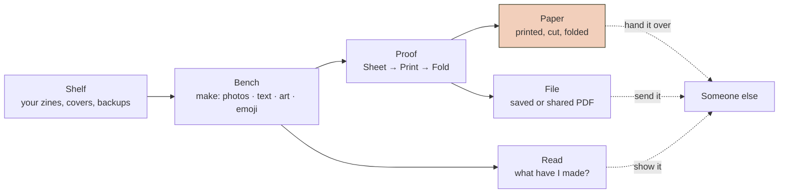
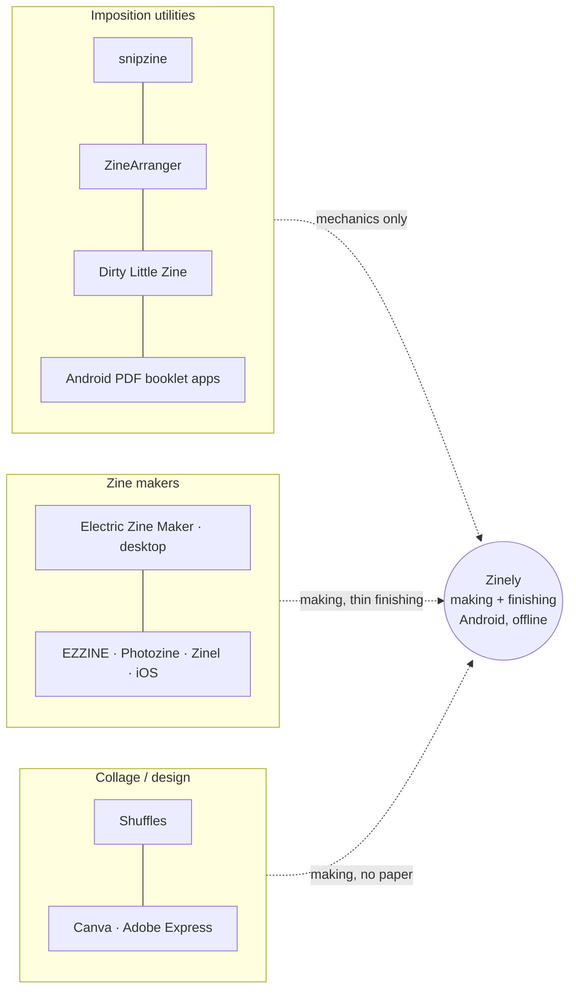
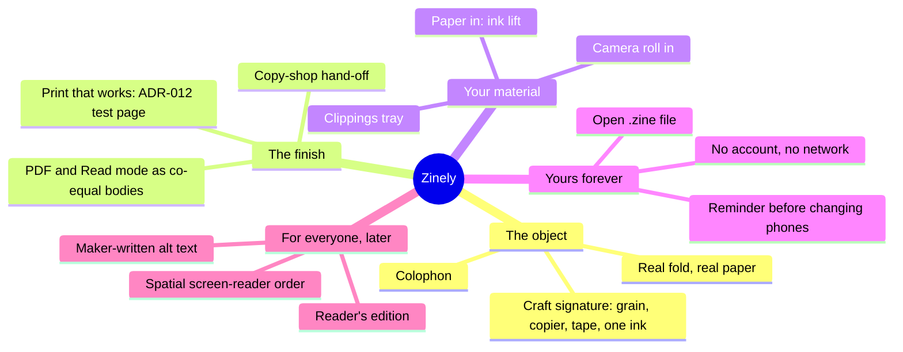
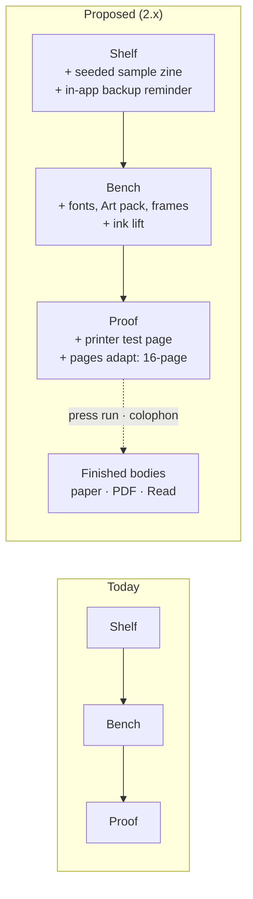
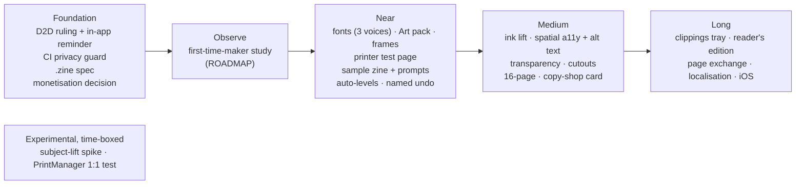
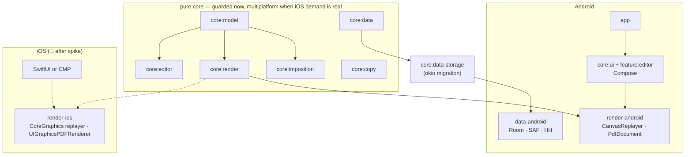
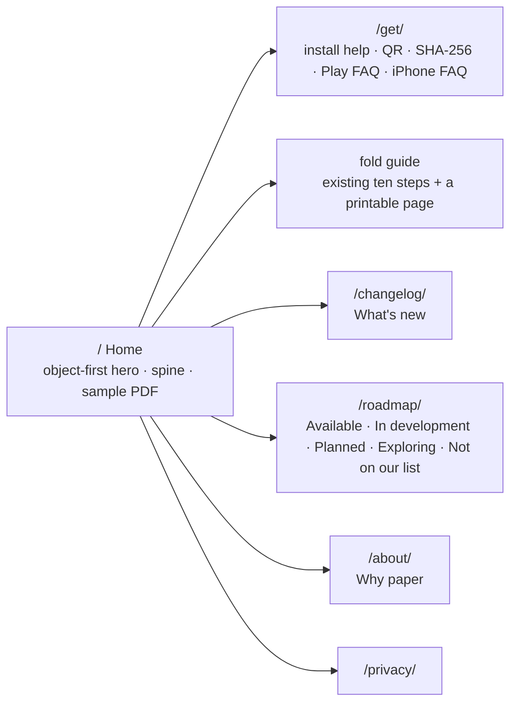
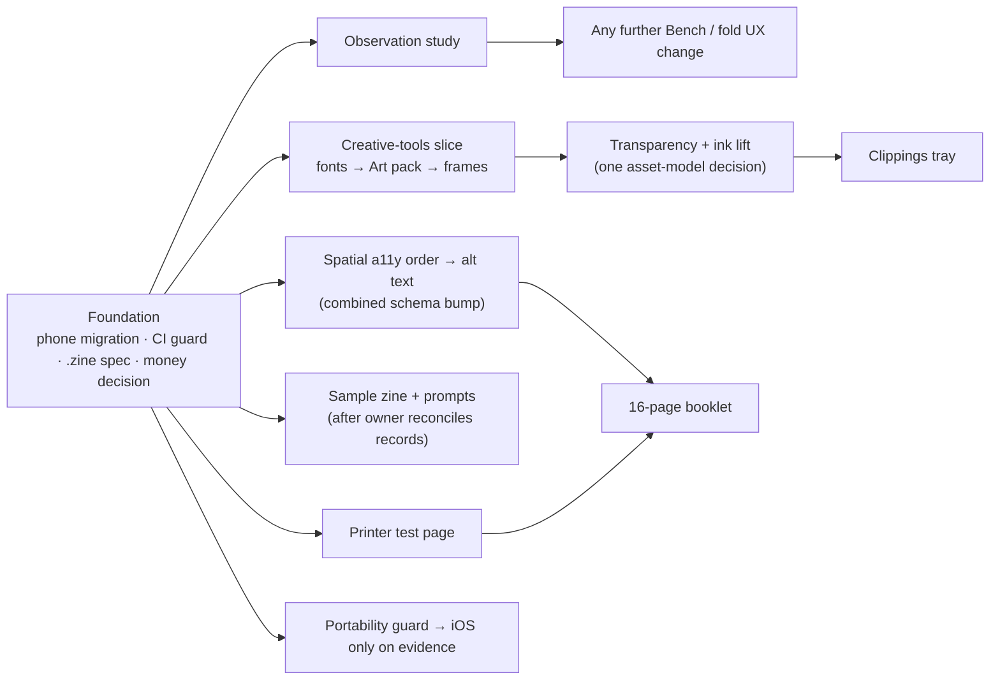

# Zinely — future product research (2026 → 2029)

Status: **RESEARCH — proposal only. Nothing in this document is decided.** Internal product-strategy document:
not public copy. The website states only what the published build does ([ADR-118](../DECISIONS.md#adr-118)).
Date: 2026-09-24 · Author: Implementer Agent (Claude), for the owner (Aastra)
Review: first draft reviewed by two independent Review Agents (both GO WITH FIXES); all findings reconciled in
this revision — see [Review record](#review-record). This revision has not been re-reviewed.
Snapshot: statements about builds, branches and pull requests describe the repository on 2026-09-24. On
2026-09-25 beta.5 was released (merge `32da280`, tag `v0.9.0-beta.5`, GitHub pre-release, versionCode 10,
APK only, not on Google Play); the few places that said otherwise are marked below, not rewritten.

> **How to read this.** This document recommends; it does not decide. Every decision it proposes must
> become an ADR in [DECISIONS.md](../DECISIONS.md) (or a PRD/ROADMAP change) before anyone builds it. It
> links rather than restates the documents that already govern Zinely — above all the
> [constitution](../zinely-constitution.md), the [V2 constitution](../design/V2-CONSTITUTION.md),
> [PRODUCT-DIRECTION](../design/PRODUCT-DIRECTION.md) and [ZINE-DIRECTION](../design/ZINE-DIRECTION.md).
> Where this document disagrees with one of them, it says so and names the conflict; it never silently
> overrides.
>
> **Evidence labels** (per [CLAUDE.md research standards](../../CLAUDE.md#research-standards)):
> ✅ **VERIFIED** (sourced, or read in this repository) · 🟦 **RECOMMENDATION** · 🟨 **ASSUMPTION** ·
> 🔭 **FUTURE** · ⚠️ **DISPUTED**. Repository claims cite `path:line`; web claims cite [§28](#28-sources).
>
> **Method.** Eight web-research briefs (creative-tool interaction, competitive landscape, printing and
> imposition, AI and authorship, ownership and accessibility, website, iOS/KMP, zine culture) plus two
> read-only repository audits (iOS portability, shipped-feature inventory), all run 2026-09-24. Several
> research agents hit a shared search cap; claims they could not source are marked 🟨. Reddit, Tate, V&A
> and MoMA pages could not be fetched.
>
> **Relation to [RESEARCH.md](../RESEARCH.md).** RESEARCH.md remains the canonical evidence base. This
> document overlaps and should be read with R2.4/R2.5 (fit-to-page, margins), R3.3 (comparable products),
> R10 (accessibility), R11 (reading vs printing), R12 (public-beta baseline), R16/R18 (website and fold
> motion — R18 rejected a general origami renderer) and R20 (creative-tools feasibility, including
> background removal). Where this document disagrees with an R-entry it says so. Durable findings land in
> RESEARCH.md only after owner acceptance ([§27](#27-open-questions), question 15).

---

## Contents

1. [Executive summary](#1-executive-summary)
2. [What Zinely is today](#2-what-zinely-is-today)
3. [Product identity](#3-product-identity)
4. [Personas and jobs to be done](#4-personas-and-jobs-to-be-done)
5. [Competitive landscape](#5-competitive-landscape)
6. [Zine culture research](#6-zine-culture-research)
7. [Creative-app research](#7-creative-app-research)
8. [Canva analysis](#8-canva-analysis)
9. [Patterns worth borrowing](#9-patterns-worth-borrowing)
10. [Patterns to avoid](#10-patterns-to-avoid)
11. [Differentiators](#11-differentiators)
12. [The "magic"](#12-the-magic)
13. [Shelf → Bench → Proof evolution](#13-shelf--bench--proof-evolution)
14. [Creative Workbench evolution](#14-creative-workbench-evolution)
15. [Printing and Proof experience](#15-printing-and-proof-experience)
16. [AI opportunities](#16-ai-opportunities)
17. [Accessibility as product design](#17-accessibility-as-product-design)
18. [Offline, ownership, privacy](#18-offline-ownership-privacy)
19. [Future feature landscape](#19-future-feature-landscape)
20. [Product horizons](#20-product-horizons)
21. [Architecture implications](#21-architecture-implications)
22. [iOS strategy](#22-ios-strategy)
23. [Website strategy](#23-website-strategy)
24. [Roadmap strategy](#24-roadmap-strategy)
25. [Things we should NOT build](#25-things-we-should-not-build)
26. [Foundational decisions to make now](#26-foundational-decisions-to-make-now)
27. [Open questions](#27-open-questions)
28. [Sources](#28-sources)
- [Final strategy — five answers](#final-strategy--five-answers)
- [Appendix A — website change proposal](#appendix-a--website-change-proposal)
- [Review record](#review-record)

---

## 1. Executive summary

**The question:** if Zinely were allowed to become an exceptional creative tool over two or three years,
what could it become?

**The short answer:** 🟦 Zinely should become **a pocket press** — the only thing on a phone that takes a
person from *"I have some photos and a feeling"* to *"here, I made you this"*. A press makes copies, and
under [constitution Article 2](../zinely-constitution.md) a finished zine has **two co-equal bodies**: a
physical one (paper, by whatever printing the maker has) and a portable digital one (a file and Read mode).
The Bench is the instrument; the finished, portable, printable zine is the point. Everything we add should
make the object better, make the path to a finished body surer, or make the zine more genuinely the
maker's own.

**Testing the owner's framing.** *"A creative instrument for making, experimenting with, and physically
publishing small pieces of personal expression"* is **mostly right, with two corrections**:

- "experimenting" with no pull toward an ending is the Canva/Freeform trap — an open canvas that never
  finishes — which the [constitution](../zinely-constitution.md) names as the enemy (North Star:
  FINISHING);
- "physically publishing" is narrower than the constitution. Article 2 refuses to choose between paper and
  the digital body, and the hostile review behind it "demolished 'print is the peak' (printer decline …)".
  Many makers — students, people who print at libraries or copy shops — have no printer at home.

> 🟦 **Proposed framing:** *Zinely is a pocket press: a small creative instrument for turning what is
> already on your phone into a finished little zine you can fold, hold, read, and hand to someone.*

And the design rule the research kept rediscovering: **imperfect surface, perfect mechanics** — the page
may be scrappy, grainy and taped; the fold, the page order, the margins and the export must be exactly
right, every time.

### 1.1 What is genuinely new here, and what is not

An honest scope statement, prompted by review: **much of what the research found valuable, Zinely's own
records already ratified.** Calibration and a safe inset are [ADR-012](../DECISIONS.md#adr-012) (Accepted);
finished-looking starters, a seeded first project and a browsable prompt library are KEEP rows in the
constitution's Feature Tribunal; paper scanning is EXPERIMENTAL in
[ZINE-DIRECTION](../design/ZINE-DIRECTION.md) and P2/P3 in [PRODUCT-DIRECTION](../design/PRODUCT-DIRECTION.md);
drawing is "ADMISSIBLE someday". Where this document recommends one of those, the contribution is the
**evidence and the priority**, not the idea.

The genuinely new findings are:

1. 🟨 **A phone-migration gap.** `data_extraction_rules.xml` excludes every domain from cloud backup *and*
   device-to-device transfer, and `allowBackup="false"`. A user who sets up a new phone with "Copy apps &
   data" probably arrives to an empty Shelf. The website warns about this
   (`website/privacy/index.html:64`); **the app does not.** Fixing it by rule change only helps Android 12+
   source phones, and restore of a side-loaded app is unverified ([§18.2](#182-the-device-transfer-finding-needs-an-owner-ruling)).
2. ✅ **ML Kit is not private enough for Zinely.** Its Android data disclosure says it sends device
   information, identifiers and usage data. That rules it out under the no-telemetry and no-network
   invariants ([§16](#16-ai-opportunities)).
3. ✅ **The website contradicts itself.** It loads Google Fonts (`website/index.html:16-18`) while its
   privacy page says it uses no third-party fonts (`website/privacy/index.html:70`). Its Bench demo shows a
   "Your shelf · 4 things kept / + keep" tray (`website/index.html:134-135`) that faithfully reproduces the
   frozen spec (`docs/design/mockups/v21-bench.html`) but **is not shipped** ([§23](#23-website-strategy)).
   *Fixed 2026-09-24 by [ADR-118](../DECISIONS.md#adr-118): fonts are self-hosted and the tray is hidden from
   the website. The frozen prototype keeps it, because OD-2 deferred the shelf rather than dropping it
   ([D-029](../design/V2-SPEC-DEFECTS.md#d-029)).*
4. ✅ **Android developer verification** starts 30 Sep 2026 in four countries and applies globally in 2027 *(corrected 2026-09-26: the 30 Sep phase covers installs from named app stores only, not side-loaded APKs; side-loaded apps are covered from the 2027 global phase — [decision gate Q1](../planning/ZINELY-1X-DECISION-GATE.md#q1-developer-verification-o15))*;
   side-loaded APKs will need a verified developer ([§23](#23-website-strategy)).
5. ✅ **The monetisation clock is running.** The Tribunal puts a one-time IAP experiment "ON TRIAL, with a
   trigger: decide within one year of the first bundled-supplies release"; supplies shipped with
   ADR-105/107. No plan in the repo addresses it ([§26](#26-foundational-decisions-to-make-now)).
   ✅ **The deadline is about 30 Aug to 9 Sep 2027.** Source: [constitution §VII](../zinely-constitution.md#vii-the-feature-tribunal),
   the *Monetization experiment* row. The supplies commit is `e8f2145` (2026-08-17); the first build after it is
   beta.3 (2026-08-30, [CHANGELOG](../../CHANGELOG.md)) and the first public tag containing it is
   `v0.9.0-beta.4-r3` (2026-09-09). Which of those counts as "release" is the owner's call. The earliest,
   weakest candidate is beta.2 (2026-08-16), which put supplies in the file format while saying *"Nothing
   appears on a page yet"*; counting it would move the deadline to mid-August 2027. Tracked in
   [OWNER-CHECKLIST §1.5](../OWNER-CHECKLIST.md#15-product--design-authorship); nothing about pricing goes on the website.
6. 🟦 **Ratified-but-dropped starters.** The Tribunal's KEEP rows for starters, a seeded first project and a
   browsable prompt library were not carried into later direction documents (`BETA-DIRECTION.md` says
   "Templates / starter layouts DO NOT IMPLEMENT"). The owner should reconcile which record governs
   ([§14.3](#143-starters-the-sample-zine-and-a-prompt-library)).

### 1.2 What the research says about the market

- ✅ **Imposition is a commodity.** Free, no-account web tools (snipzine, Dirty Little Zine, TypeKitty,
  ZineArranger; Zineroo needs an account to export) and new iOS apps (EZZINE, Photozine, Zinel) all arrange
  eight pages on a sheet. Zinely wins on **what happens either side of the maths**: a Bench that makes
  printable collage pleasant on a phone, and a finish — print, file, Read — that works
  ([§5](#5-competitive-landscape)).
- 🟨 **The Android native zine-studio field looked near-empty** in our searches (PDF booklet utilities, no
  zine studios; Electric Zine Maker is desktop-only, last feature update August 2021). Searches were capped;
  treat this as a window to verify, not a moat.
- ✅ **Zine culture's values are Zinely's values** — materiality, gifts, evidence of the hand, intimacy.
  Several zine and comic fests ban AI-generated work (Helsinki, Grid, Fresno; the SDCC art show), which
  🟦 suggests the audience is hostile to AI authorship ([§6](#6-zine-culture-research)).

### 1.3 Where I disagree with the current direction

- **With the website, not the app, on the object.** The hero shows the imposition diagram — the mechanism.
  There is no photo of a finished paper zine anywhere on the site ([§23](#23-website-strategy)).
- **With the ordering of later direction docs over the Tribunal** on starters (above).
- **With leaving paper-in as EXPERIMENTAL.** Photographing hand-made marks and lifting them into ink
  ("ink lift") gives Zinely evidence of the hand without a drawing engine. I argue for promoting it
  ([§14.2](#142-paper-in-ink-lift)) — an owner ruling, since ZINE-DIRECTION placed it in EXPERIMENTAL.
- **Not** with the Bench's discoverability decisions. An earlier draft of this document proposed crop
  handles and a long-press menu; review showed every stakeholder finding is recorded **Closed**
  ([feedback](../reviews/2026-08-26-stakeholder-feedback.md): D-109/OD-53 deliberately separates resize
  from Reframe; issue #54 was closed because no post-fix first-time round showed a discovery failure). The
  right next step is the **first-time-maker observation study already on the [ROADMAP](../ROADMAP.md)**,
  which should gate any further UX change.

### 1.4 Conflicts with governing records, named

Every place this document proposes something a governing record decided differently. Each needs the
route shown before it can proceed.

| Proposal | Governing record | Route |
|---|---|---|
| "Pocket press" framing in PRD §1 | constitution Article 2 (co-equal bodies) | framing already reconciled above; PRD edit needs owner approval |
| Promote ink lift from EXPERIMENTAL | ZINE-DIRECTION `:763-765`; PRODUCT-DIRECTION P2/P3 | owner ruling + ADR |
| Ink lift as a flag on `ImageElement` | ADR-105 (closed element set); ADR-106 (rejected import-time filtered assets) | ADR arguing the derived-asset question |
| Seeded sample zine + prompt library | Tribunal KEEP vs `BETA-DIRECTION.md:498` "DO NOT IMPLEMENT" | owner reconciles which record governs |
| Printer test page (ruler) | ADR-012 (Accepted) vs ADR-039 (ruler deferred: no sheet margin) | ADR amending ADR-039: ruler on a **separate** test page |
| Imposition-driven fold animation in Compose | ADR-114 §4 (fold replay HTML-only); RESEARCH R18 ("does not authorize porting animation to Compose"); ROADMAP fold clarity | only if the observation study shows comprehension gains |
| 16-page by folds "by name" | V2-CONSTITUTION: "the maker never picks a format"; Proof adapts by page count | proposal rewritten to follow the constitution ([F10](#f10--more-pages-16-page-booklet)) |
| Restore `/accessibility/` page | ADR-114 §2 (retired; statement lives site-wide) | dropped; propose refreshing the site-wide statement instead |
| Fonts | ZINE-DIRECTION: three named voices; ship statics **unmodified, no subsetting** | proposal rewritten to match |
| Stable page ids | PRODUCT-DIRECTION `:263` (no schema migration for a feature nobody asked for) | only alongside page reorder (a Tribunal KEEP), not alone |
| Named "moments" of delight | V2-CONSTITUTION I ("Not magical", "Confidence, not surprise"); §IV skeuomorphism ban on "torn paper" | §12 rewritten as material consequences; no glow, no torn-paper sound |
| Public roadmap buckets | ADR-114 §5 (no guarantees) | one label scheme, no "committed" bucket |

---

## 2. What Zinely is today

✅ Verified against the repository at `main` = `72e620e` (2026-09-24) unless noted.

**Product.** A free, account-free, offline Android app for making an 8-page single-sheet mini-zine and
printing it at home. No `INTERNET` permission in any module; declared permissions are
`WRITE_EXTERNAL_STORAGE` (capped at SDK 28, for Save PDF on old Android) and `VIBRATE` (from
`:feature:editor`). minSdk 24, targetSdk 36. English-only UI (all copy in `core:copy`'s `Copy.kt`).
At the time of this research snapshot (2026-09-24), `main` was `0.9.0-beta.4-r3` (versionCode 9) plus
unreleased work, and **beta.5** (versionCode 10) was prepared on the unmerged `release/0.9.0-beta.5` branch /
draft PR #74. *Since then: beta.5 was merged and published as the current public beta on 2026-09-25*
*(tag `v0.9.0-beta.5`).* Made by a team of two.

**Journey — Shelf → Bench → Proof** ([V2 constitution Amendment 2](../design/V2-CONSTITUTION.md),
[ADR-103](../DECISIONS.md#adr-103)):

**What a maker can do today** (feature inventory, verified in code):

| Area | Shipped | Authority |
|---|---|---|
| Format | 8-page single sheet only (`ZineFormat.SINGLE_SHEET_8`, `core/model/.../ModelEnums.kt:28-35`), A4 or US Letter; always exactly 8 pages (`AddPage`/`DeletePage` exist in the reducer, no UI sends them); no reorder | `ModelEnums.kt` |
| Elements | closed set of three: `ImageElement`, `TextElement`, `DecorElement`; no drawing, opacity, or page background UI (`Background.Solid` exists in the model, nothing creates it) | [ADR-105](../DECISIONS.md#adr-105) |
| Photos | system photo picker (one at a time) or share-in (several); EXIF-normalised, ≤4096 px, JPEG q90 (transparency flattened to white); Reframe with Fill / Whole photo; Replace Photo; photocopier filter (1-bit dither, non-destructive); flip; spreads across the fold | ADR-053, ADR-106, ADR-109, ADR-113 |
| Art ("supplies") | 32 authored single-ink vector pieces in 4 families (tape & fixings 8, stamps & marks 10, cut paper 9, cut shapes 5), with search, Recent and Favourites | ADR-105, ADR-107 |
| Text | edited in place; 10 sizes, alignment, bold/italic; Inter only (a disabled "Font" button is still on `main`, removal is draft PR #70); Latin/Greek/Cyrillic print, other scripts warned and kept; bundled emoji | ADR-070, ADR-112 |
| Editing | drag, pinch-scale, twist-rotate, 8 resize handles, snap guides to page and elements, button steps; visible Undo/Redo (MVI, command history); one-time hints ("Drag to move. Pull a handle to resize. Turn it with the arrows below."); long-press selects but opens no menu | [ADR-005](../DECISIONS.md#adr-005), ADR-091 |
| Inks | fixed maker palette in the ink popover (spot inks, paper tints, neutrals, starting palettes); no free colour picker. ⚠️ the Type bar offers Coral/Teal/Blue, which the ink popover does not — two text palettes | ADR-096 |
| Proof | band + two drawers (ADR-101): imposed sheet with legend ("printer can't reach here") and edge warnings; Print drawer says 100% / actual size / single-sided with a test-sheet tip; 8 static illustrated fold steps; Read flipbook; Save PDF to Downloads; Share; no in-app Print (by decision). PNG export code exists but no UI reaches it | ADR-051, ADR-052, ADR-054, ADR-058, ADR-101 |
| Library | Shelf of generated covers (not page thumbnails), newest first, no search/sort; rename, duplicate, delete-with-undo; whole-library `.zine` backup/restore through SAF (additive, fail-closed, v2) | ADR-042, ADR-110 |
| Accessibility | per-element TalkBack nodes in **paint order** with custom actions (up to 16 fixed plus conditional flips, varying by element type); reduced motion honoured; 4 haptic patterns (tick, snap, boundary, success); no sound | `ElementSemanticsLayer.kt`, `EditorA11y.kt` |
| Receive | share-sheet import of images from other apps | beta.2 |
| About | Colophon: maker's note, default paper, offline promise, licences, version — the only settings surface | ADR-114, ADR-116, ADR-117 |

**Engineering shape** (from the portability audit): ~49.9k main LOC across 12 modules, of which ~9.2k LOC
is a pure-JVM core (`core:model`, `imposition`, `render`, `editor`, `copy`, `data`, `data-storage`) with
~2,200 tests. The renderer produces a device-neutral **draw tape** (`FillRect`, `DrawImage`, `DrawShape`,
`DrawTextBox` — `core/render/.../DrawCommand.kt:23-111`) replayed by **one** `CanvasReplayer`
(`render-android/.../CanvasReplayer.kt:45`) for preview, PNG, PDF and the imposed sheet. That single
replayer is why "preview == export" holds, and it is Zinely's most valuable architectural asset. (One
qualification from ADR-106: editing chrome such as the Reframe overlay draws outside the tape.)

**What the documents already decided** (not re-litigated here): the seven Articles and the
"We Proudly Do Not Build" list ([constitution](../zinely-constitution.md)); the quiet-café principles and the
no-network invariant ([V2 constitution](../design/V2-CONSTITUTION.md), [ADR-104](../DECISIONS.md#adr-104));
the capability map and DO-NOT-BUILD list ([ZINE-DIRECTION](../design/ZINE-DIRECTION.md)); the six-swatch
chrome palette that colours the studio, never the zine ([THEME-37596-FREEZE](../design/THEME-37596-FREEZE.md)).

**Known gaps worth naming honestly:**

- ✅ Pages have no stable identity — `Page(index, role, background, elements)`
  (`core/model/.../Document.kt:58-63`); elements do have ids. Reordering, a per-page tray, or multi-format
  work all get harder without a page id.
- ✅ No alt text or reading-order data exists in the model (no `altText`/`description` field in
  `core:model`).
- ✅ Text line breaks are decided only at render time by Android `StaticLayout`
  (`render-android/.../SharedTextLayout.kt:33-60`); the document stores box + text + style. The in-place
  editor uses Compose `BasicTextField`, a different engine.
- ✅ The single-project `.zine` v1 (`ZinePackageManifest`) has a manifest type and validator but **no code
  that writes or reads it**; only the v2 *library* backup is live.
- ✅ The stale KDoc at `core/render/.../DrawCommand.kt:80-81` says twelve of sixteen supplies are
  unauthored; there are 32 authored outlines.
- ✅ TalkBack reads canvas elements in **paint (z) order**, not spatial order (`ElementSemanticsLayer.kt`) —
  exactly the failure the accessibility research names ([§17](#17-accessibility-as-product-design)).
- ✅ **Docs that disagree with code** (for a separate docs pass, not this change): SCREEN-INVENTORY is stale
  throughout (promises page-1 thumbnails, Settings, Welcome, a Completion screen, a deferred sticker picker
  that has since shipped); README and EXPERIENCE-MAP mention PNG export, which has no UI;
  EXPERIENCE-MAP's hint copy differs from the shipped hint; unused shelf action and sort
  sheets (`ShelfSheets.kt:334,646`, test-only callers) and unused search/sort copy remain.

---

## 3. Product identity

### 3.1 What the documents already say

| Layer | Identity | Source |
|---|---|---|
| North star | FINISHING | [constitution](../zinely-constitution.md) |
| Tool | Creative Workbench 2.0 — "the tool is precise so that the artifact can be personal" | [DESIGN-SYSTEM](../ZINELY-DESIGN-SYSTEM.md) |
| Artifact | DIY Zine Workshop — named print processes, one ink per zine, halftone, master copy | [V1-DESIGN-DIRECTIONS](../V1-DESIGN-DIRECTIONS.md) |
| World | "A small press that fits in one hand" — Shelf, Bench, press run, colophon | [ADR-103](../DECISIONS.md#adr-103) |
| Mood | quiet café; calm over clever; honest over magical | [V2 constitution](../design/V2-CONSTITUTION.md) |
| Promise | "the only thing on your phone that turns what is already on your phone into something you can hold" | [PRODUCT-DIRECTION](../design/PRODUCT-DIRECTION.md) (not ratified) |

These are **consistent with each other** and with the research. The research does not argue for a new
identity; it argues for **finishing the one we have**, and for sharpening one word in it.

### 3.2 Testing the owner's framing

*"A creative instrument for making, experimenting with, and physically publishing small pieces of personal
expression."*

| Phrase | Verdict | Why |
|---|---|---|
| "creative instrument" | ✅ keep | An instrument is played, has a feel, rewards practice, and is limited on purpose (Teenage Engineering: "limitations are OP-1's biggest feature"). That is the Bench. |
| "making" | ✅ keep | |
| "experimenting with" | ⚠️ soften | Experimentation without an ending is the Freeform/Milanote mode — a canvas you tend rather than a thing you finish. Zine culture experiments *inside a brief* (a fold, a page count, one ink). Say **playing**, and bound it. |
| "physically publishing" | ⚠️ widen | Publishing is the differentiator, and in zine culture it means *handing over*, not uploading. But constitution Article 2 makes the digital body (file, Read mode) co-equal with paper, and many makers have no home printer. Say **finished**, in either body. |
| "small pieces of personal expression" | ✅ keep | Barnard/Salford definitions (editions under ~100), Freedman's "content you wouldn't want to put online". |

🟦 **Proposed framing** (for the PRD, after owner approval):

> **Zinely is a pocket press.** A small creative instrument for turning what is already on your phone into
> a finished little zine you can fold, hold, read, and hand to someone.

And the internal design rule, which the research kept rediscovering:

> **Imperfect surface, perfect mechanics.** The page may be scrappy, crooked, grainy and taped. The fold,
> the page order, the margins and the export must be exactly right, every time.

### 3.3 Why "pocket press" and not "creative instrument"

- It **contains the ending.** A press exists to produce copies — on paper or as files. An instrument can
  be played forever.
- It **is already the world** of ADR-103 ("small press in one hand"); this is a compression, not a rebrand.
- It **explains the competitive position in two words**: Canva is a design studio, Procreate is an easel,
  Notes is a notebook — Zinely is the press.
- It **excludes the right things**: a press has no feed, no cloud, no AI author.

⚠️ Risk: "press" can read as *industrial* or *newspaper*. The warmth must come from the object (the maker's
pages), per [V2 constitution](../design/V2-CONSTITUTION.md) "creations carry the warmth". "Pocket" does the
softening.

---

## 4. Personas and jobs to be done

The [PRD](../PRD.md) personas (photographer, artist, writer/poet, student, indie publisher, activist) remain
valid. The brief asks about a wider first-timer set. The research suggests grouping them by **what they
bring to the Bench** rather than by occupation, because that is what changes the product:

| Group | Who | They bring | Their job to be done | Why Zinely rather than… |
|---|---|---|---|---|
| **Camera-roll makers** | trip documenter, gift-maker, photographer, parent | photos, screenshots | "Turn this trip / this year / this person into something I can give." | …a photo book service: no account, no wait, no cost, done tonight, feels hand-made |
| **Word makers** | writer, poet, student essayist, musician (lyrics, setlist, liner notes) | text, a few images | "Make my words into a small thing people will actually read." | …a notes app: it becomes an object; …DTP: no learning curve |
| **Hand makers** | illustrator, artist, punk/DIY, collage artist | drawings on paper, stickers, cut-outs | "Get my hand-made marks into a zine without a scanner and InDesign." | …Procreate: phone, and it ends in paper; …a photocopier: they can still use one, from Zinely's master |
| **Brief makers** | student in a class, workshop participant, teacher | an assignment and 40 minutes | "Make a zine about X in this session and leave with it." | …Canva: no login, no school account, works offline in a library |
| **Designers** | designer, typographer | taste and impatience | "Make something quick and physical that doesn't look like Canva." | …Figma/InDesign: speed, constraint, craft signature |

🟨 ASSUMPTION: the "hand makers" group is under-served by every tool reviewed and is the one most likely to
become evangelists at zine fests. It is also the group Zinely currently serves least well (no paper-in).

**Jobs across all groups** — the three moments that decide whether someone ever makes a second zine:

1. **Permission** — "Am I allowed to make this? Is it good enough?" (Herman's first-zine lessons; the
   "who the hell are you to decide that?" quote in the zine-culture brief). → a sample zine and a prompt
   library ([§14.3](#143-starters-the-sample-zine-and-a-prompt-library)).
2. **The first print** — "Why is my page upside down / cut off / tiny?" (Counterforce, Folio, ZineArranger
   comments). → finishing ADR-012 with a printer test page ([§15.2](#152-finishing-adr-012-a-printer-test-page)).
   🟨 Not every maker has a printer — students and people who print at libraries or copy shops meet this
   moment elsewhere, which is why the digital body and the copy-shop hand-off matter as much.
3. **The hand-over** — "Here, I made you this." → Read mode, the colophon, the object itself.

### 4.1 Why Zinely rather than scissors, a glue stick and a photocopier?

The culture's default tool is paper, and Sandhu's question — "What ever happened to the glue-stick?" — is
fair. The honest answer:

| Paper wins when… | Zinely wins when… |
|---|---|
| you have magazines, scissors, glue, a copier and an afternoon | your material is already on your phone (photos, screenshots, notes) |
| the texture of real paste-up *is* the point | you want to change your mind — undo, move, re-crop, without redoing the page |
| you are in a workshop with supplies to hand | you have ten minutes on a bus |
| you want one original master | you want many identical copies, a PDF to send, and the page order solved for you |

🟦 The two are allies, not rivals: a Zinely sheet can be printed, cut into, pasted over and photocopied;
and, if ink lift is accepted, paper marks come back *into* Zinely. The product should say so rather than
pretend the phone is better than the glue stick.

---

## 5. Competitive landscape

✅ All entries sourced in [§28](#28-sources) (competitive brief).

### 5.1 Map

### 5.2 Categories

| Category | Examples | What they do well | What they miss | Lesson for Zinely |
|---|---|---|---|---|
| Free web imposers | snipzine, Dirty Little Zine, TypeKitty, ZineArranger, Zineroo | free, no account, local; solve the fold maths | no making; no print guidance; desktop-first | the fold maths alone is not a product |
| Zine art toys | Electric Zine Maker (desktop, 4.9★, stale since 2021) | character, play, "destruction as fun as creation" | no mobile, dated, a11y complaints in comments | play is loved; EZM toned itself down to "less intense" — calm wins long-term |
| New iOS zine apps | EZZINE (free, collects no data), Photozine (offline, 4:5 carousel export), Zinel (social; PDF export paywalled, $3.99–7.99/mo) | mobile, recent | thin; Zinel monetises the one thing makers need | an iOS field is forming; paywalling export is the anti-pattern |
| Sticker/collage | ZINECORE (stickers + background removal, no imposition), Shuffles (1M+ installs, Pinterest login; review: "deleted all my collages (100+)") | cut-out collage feels magical | no paper; cloud-bound; data loss | collage is the draw; ownership is the differentiator |
| General design | Canva (+Offline, 14 days, desktop and Android), Adobe Express, Affinity (now Canva, free) | templates, reach | no home imposition verified; homogenisation; account; AI | see [§8](#8-canva-analysis) |
| Pro DTP | InDesign, Affinity Publisher, Scribus | exact imposition | steep, desktop | never compete here |
| Print services | Canva Print (8–24 pp saddle-stitch), Mixam, Lulu, Blurb | real binding | cost, wait, account, reading-order files | a hand-off, not a rival |
| Android PDF utilities | PDF & Images to Booklet, ImpoStack | booklet imposition | no making | 🟨 we found no Android zine studio |

### 5.3 Gaps we found no one filling (the opportunity list)

🟨 Searches were capped; these are gaps *in what we found*, not proven absences.

1. 🟨 **A guided first print at home** — no reviewed tool calibrates or tests the user's printer (Zinely's own
   [ADR-012](../DECISIONS.md#adr-012) already intends to).
2. ✅ **Android imposition + tactile editor** in one app.
3. 🟦 **Printable collage** — collage apps don't print; imposers don't collage.
4. 🟦 **Fold guidance using the user's own pages** — every fold guide uses a generic diagram.
5. 🟨 **Ownership + local library** — Shuffles and Zinel are account/cloud-bound.
6. 🟨 **Accessibility** — no reviewed zine tool addresses screen readers, described zines, or large print.
7. 🔭 **Multi-sheet booklets on Android** (16-page saddle-stitch).

🟦 Two ideas from the competitive brief that deserve an owner discussion, not a decision:
**"Import PDF → impose"** (a path for Canva refugees — commoditised, but a humane on-ramp) and
**"Remix yourself"** (start a new issue from an old one — the zine *series* is a real practice).

---

## 6. Zine culture research

✅ Sources in [§28](#28-sources) (zine-culture brief).

### 6.1 What a zine is, to the people who make them

- **Small editions, self-published, non-commercial in spirit** (Barnard, Library of Congress, Salford:
  "editions under 100").
- **Intimacy and vulnerability.** Jenna Freedman (Barnard): content "you wouldn't want to put online".
  Alison Piepmeier (*Girl Zines*, 2008): "materiality creates community … pleasure, affection, allegiance,
  and vulnerability"; zines are **gifts**, and they carry **evidence of the hand** and "scrappy messiness".
- **Collage as self-fashioning.** Janice Radway: magazines "torn up, cut up, re-arranged".
- **The digital shift is contested.** Sukhdev Sandhu (4Columns) on *Copy Machine Manifestos*:
  "click-and-drag replaced ripped-and-torn … What ever happened to the glue-stick?" "Zines are not blogs"
  is a recurring position. Canva shows up as a *stand-in for missing supplies*, not a preference.
- ⚠️ The widely-quoted "everyperson" line is usually attributed to Stephen Duncombe; the brief traced it to
  Amy Spencer. Don't quote it on the website without checking.

### 6.2 The physical process — where people actually struggle

| Friction | Evidence | What Zinely could do |
|---|---|---|
| Duplex confusion | Counterforce: "FLIP ON SHORT EDGE" is a whole guide | the test page back-side arrow and a manual two-sided flow, for a future 16-page format ([§15.4](#154-two-sided-formats)) |
| Margins eaten | To Distant Lands: 6.35 mm margin; printer specs 3–6.35 mm | a printer test page that tunes the edge warnings (ADR-012) |
| Page order / nesting | Herman: nesting was hard | Zinely already solves this for 8 pp; keep it perfect for 16 pp |
| Over-ambition | Herman: a 24-page first zine | the 8-page constraint is a *feature* — say so |
| Waste | Counterforce: "print one copy first" | a single test sheet; "print one, check, then print ten" |
| Collation, stapling | Counterforce, Folio | tips at the right moment, not a manual |
| Permission | first-timer quotes | a sample zine and a browsable prompt library |

### 6.3 The riso lesson: loved flaws vs hated flaws

Split Arrow's riso taxonomy separates **desirable** imperfections (grain, misregistration, texture) from
**unwanted** ones (needle strike, ghosting, streaks). Blanchette: "constraints force better decisions".

> 🟦 **Imperfect surface, perfect mechanics.** Zinely should *offer* the loved flaws (grain, copier, a
> little misregistration, tape) as deliberate choices, and *eliminate* the hated ones (wrong order, cut-off
> margins, tiny sheets, upside-down backs) as bugs. [V2-IDENTITY](../design/V2-IDENTITY.md) already says
> misregistration "never smudges" — this is the same rule, generalised.

### 6.4 Community forms Zinely could honour without a network

- **Amateur press associations** — members send pages to a "Central Mailer" who compiles and mails the
  bundle. 🔭 A `.zine` *page exchange* is the offline-first analogue ([§19](#19-future-feature-landscape)).
- **Workshops and classrooms** (LoC, Denver Zine Library, Barnard; SLJ's workshop tips) — constraints as a
  brief; a zine made and taken home in one session.
- **Zine fests** — the physical market where a Zinely zine would be judged. Several ban AI work (Helsinki,
  Grid, Fresno; SDCC art show; a TTRPG jam). Portland has no AI clause. 🟦 This is evidence the audience is
  hostile to AI-authored work, which suggests "no AI authorship" is an asset — not proof it is a feature
  people choose a tool for.

### 6.5 First-timers

Workshop literature consistently recommends handling real zines first. 🟦 Zinely's analogue is **a bundled
sample zine** the user can print and fold before making their own — it teaches the fold, proves the printer,
and shows what "good enough" looks like, all before the blank page. (This is a Proof experience, not a
template — the constitution's Feature Tribunal already rules KEEP on a seeded first project; see
[§14.3](#143-starters-the-sample-zine-and-a-prompt-library).)

---

## 7. Creative-app research

✅ Sources in [§28](#28-sources) (interaction brief). The brief studied **philosophies**, not feature lists.

### 7.1 The throughline

Across Procreate, Paper, Teenage Engineering, Halide, Kid Pix, Muse and the creativity-support-tools
literature, the same four ideas recur:

1. **Chrome off the work.** The canvas is the interface.
2. **Power lives in the object and the gesture**, not in panels.
3. **Mistakes are cheap.** Undo is fast, named and a little bit fun.
4. **Limit choices along one dimension.** Paper (FiftyThree) shipped 5 brushes and 9 colours;
   OP-1 has four knobs; Halide's Process Zero has one dial.

### 7.2 What each tool teaches

| Tool | Lesson | Zinely application |
|---|---|---|
| **Procreate** | two-finger undo; hold to rapid-undo with a named toast; QuickShape (hold to snap); "Creativity is made, not generated" pledge | named undo toast; hold-to-snap on edges and folds |
| **Paper (FiftyThree)** | no menus; a rewind dial; constraint on one axis | a history "tape" you scrub, not a list |
| **Muse** | gestures that tested well were "too hard to explain to new users" | ✅ **every gesture needs a visible twin** — the stakeholder "discoverability" finding, predicted |
| **Figma** | guides appear only while dragging; hold a key to suspend snapping | fold/margin guides only during a drag; long-press to suspend |
| **Kid Pix** | "destruction should be as fun as creation" | undo that is quick and a little generous; *not* torn-paper effects, which V2-CONSTITUTION §IV bans |
| **Electric Zine Maker** | playful art toy, later made "less intense" | delight must survive the 50th use |
| **Teenage Engineering** | limitations as the feature | 8 pages, one fold, a few inks — say it proudly |
| **Halide Process Zero, VSCO** | one dial; presets as identity | named print looks with one intensity dial |
| **Apple Lift Subject** | long-press → haptic → glow → the subject is yours | the gold standard for "lift"; can only be approximated offline on Android ([§16](#16-ai-opportunities)) |
| **Shuffles** | tap-to-cutout collage is magic; cloud loss is fatal | collage + ownership |
| **Freeform, Milanote** | infinite canvases make multi-object editing unpleasant | ✅ Zinely's fixed page is an advantage |
| **Are.na** | blocks reused in many channels; calm technology | the Clippings Tray as a personal scrap pile |
| **tldraw, Perfect Freehand** | stroke feel is everything | only relevant if drawing is ever added |
| **Kinopio** | no signup; "No ads or AI crap" | the tone of Zinely's honesty |
| **Zinnia, Goodnotes** | washi-tape pull points; save-as-sticker | tape as a supply; save your cut-out |

### 7.3 Research frame: low floor, high ceiling, wide walls

The creativity-support-tools literature (Resnick et al.; Shneiderman) asks for a **low floor** (easy start),
**high ceiling** (room to grow) and **wide walls** (many different kinds of result). Its warning is the one
Zinely should tape to the wall:

> "If the creations are all similar … something has gone wrong."

That is the case against templates, auto-layout and generative AI in one sentence.

---

## 8. Canva analysis

**What Canva is.** A design studio built on templates, a vast asset library, an account, a cloud, and —
since Magic Studio — generative AI. Canva Create 2026 added **Canva Offline** (14 days, desktop and Android,
not iOS) and expanded print services (8–24 page saddle-stitched booklets).

**Why people pick Canva for zines** (competitive and culture briefs): it's already installed, it has
supplies (fonts, stickers, photos), it has a template for everything, and it's free at the start. The
zine-culture brief found makers describing Canva as a **stand-in for missing supplies**, not as a tool
they love.

**Where Canva fails zine makers:**

| Failure | Evidence | Zinely's answer |
|---|---|---|
| No verified home imposition | Canva users are sent to ZineArranger (competitive brief) | imposition built in |
| Homogenisation | Westenberg, "The Canva-ification of everything"; Cravens, "nonprofit graphics all look the same"; Glastris, "the Canva aesthetic trap" | no templates; a craft signature; the maker's own material |
| Account and cloud | login required; Canva owns Affinity and the "Affinity pledge" backlash was about ownership | no account, local files |
| AI-driven pricing | Canva Teams price rise justified by AI (TechCrunch; Creative Bloq "AI isn't a valid reason to raise prices 300%") | free; no AI authoring |
| Print as upsell | print service costs money and time | home print is the default |

**What Canva does that zine makers want:** ✅ **Magic Grab / background removal** — pulling a subject out of a
photo. This is the one Canva feature collage makers explicitly envy. Zinely should answer it **the zine
way**: offline, deterministic where possible, and paper-in first ([§14](#14-creative-workbench-evolution),
[§16](#16-ai-opportunities)).

**What we should learn but not copy:** Canva's crop handles (stakeholders expected them —
[feedback](../reviews/2026-08-26-stakeholder-feedback.md)). Borrowing the *affordance* (a visible handle) is
fine; borrowing the *panel* is not.

> 🟦 **Positioning line for the website (draft):** *Canva is where you design something. Zinely is where you
> make something and hand it over.* Say it without naming Canva.

---

## 9. Patterns worth borrowing

| # | Pattern | From | Zinely form | Class |
|---|---|---|---|---|
| 1 | Named undo toast ("Undid: moved photo") + hold to rapid-undo | Procreate | a small toast naming the command already in `core:editor`'s `Command` | Proven |
| 2 | History as a scrubbable strip | Paper rewind; Chronicle (UIST 2010) | a "tape" of page thumbnails per step | Novel (in zines) |
| 3 | Guides only while dragging; snap with one haptic tick | Figma; Android haptics principles | Zinely already snaps edges/centres to the page and other elements with a haptic (`LiveSnap.kt`, `ZinelyHaptics.kt`); **extend** it to the fold lines and the printer-safe inset | Proven |
| 4 | Visible twin for every gesture | Muse retrospective | long-press menu and a "More" action for every gesture | Necessary |
| 5 | Object verbs on long-press | Apple Lift Subject; Procreate QuickMenu | long-press an element → lift, copier, tint, save to tray | Proven |
| 6 | One dial per look | Halide, VSCO | named print looks with one intensity slider | Proven |
| 7 | Haptics for material consequences | Apple HIG feedback; Android haptics principles | extend the existing four patterns only where a consequence has none (e.g. snapping to a fold); no sound | Proven |
| 8 | Scrap pile, reused anywhere | Are.na, Milanote | Clippings Tray across zines | Proven |
| 9 | Calibration page | Cricut Print-Then-Cut; sewing-pattern test square | a printer test page finishing ADR-012 | Proven |
| 10 | "What if we disappear" | Standard Notes | an offline-readable `.zine` + README | Necessary |
| 11 | Plain export format | Obsidian, Kinopio (JSON Canvas) | documented `.zine` spec | Necessary |
| 12 | Accessible descriptions per object | Apple Freeform | alt text per element | Necessary |
| 13 | Honest roadmap with "Not on our list" | Obsidian roadmap, Raycast | website roadmap | Proven |
| 14 | Constraint as brief | OP-1; workshop pedagogy | a browsable prompt library (Tribunal KEEP) | Proven |

## 10. Patterns to avoid

| Anti-pattern | Seen in | Why it's wrong for Zinely |
|---|---|---|
| Template gallery as the front door | Canva | homogenises; "if the creations are all similar, something has gone wrong" |
| Infinite canvas | Freeform, Milanote | never finishes; multi-object editing is unpleasant |
| Panels and inspectors | Figma, Affinity | chrome over the work; breaks "the tool is quiet" |
| Auto-layout, constraints, alignment/distribute | Figma, Canva | already DO-NOT-BUILD ([ZINE-DIRECTION](../design/ZINE-DIRECTION.md)); makes pages tidy and anonymous |
| Account for export | Zineroo, Zinel paywall | holds the maker's work hostage |
| Cloud as the only copy | Shuffles (100+ collages lost), Sidekick 2009 | ownership fantasy without mechanism |
| Backup without portability | Things | "backup" you can only read with the app |
| Promise without enforcement | Affinity/Canva pledge | trust needs a mechanism (CI guard, open format) |
| "AI" as a feature label | Canva Magic Studio, Adobe Express | market evidence the audience is hostile; also often a lie about what runs locally |
| Content treadmill (seasonal packs, marketplace) | CapCut, Canva | already rejected ([PRODUCT-DIRECTION](../design/PRODUCT-DIRECTION.md)) |
| Streaks, notifications, feeds | social apps | constitution |
| Gestures without twins | Muse | undiscoverable power (Zinely's stakeholder findings on this are recorded Closed; keep it that way) |
| Toy that stays loud | EZM (toned itself down) | delight must survive the 50th use |

---

## 11. Differentiators

What would make someone choose Zinely **and tell a friend**:

**Ranked by defensibility** (🟦):

1. **A finish that works** — print (ADR-012, finished), PDF, and Read. Hard to copy because it needs printer
   knowledge, device verification and care, not code.
2. **Paper-in** (if promoted) — turns Zinely from "photo layout" into "zine studio", and serves the hand
   makers.
3. **Accessibility** — 🟨 we found no zine tool doing it; it aligns with disability-justice zine practice
   (Wellcome's *Zines Forever!*, Critical Design Lab); it is hard to retrofit.
4. **Ownership** — credible only with mechanisms; cheap for us because we're already offline.
5. **Craft signature** — copier, halftone, one ink. Copyable, but taste isn't.
6. **Imposition** — table stakes. Keep it perfect; stop marketing it as the headline.

---

## 12. The "magic"

The brief asks for delight as "physical metaphor without skeuomorphic clutter". Zinely's own
[V2 constitution](../design/V2-CONSTITUTION.md) sets the limit: the tool is **"Not magical. It never hides
what will physically happen when you print and fold"**, and **"Confidence, not surprise, is the target
emotion."** Its §IV bans skeuomorphic torn paper, coffee stains and the like as chrome.

So the delight Zinely should pursue is **material consequence made visible** — a true physical fact,
shown honestly — not a glow, a flourish or a reward. The research points to four such moments:

| Moment | What happens | Why it lands | Guardrail |
|---|---|---|---|
| **The lift** (ink lift, [§14.2](#142-paper-in-ink-lift)) | a photographed drawing becomes an ink mark on the page, in the maker's ink | the maker's own hand, now printable | a preview with one dial; honest when the result is poor |
| **The sheet** | Proof shows the eight pages on one sheet (shipped) | the user *sees* the trick they would never have worked out | already shipped; any animation of it is subject to ADR-114 §4 and R18 |
| **The first print that works** ([§15.2](#152-finishing-adr-012-a-printer-test-page)) | the test page comes out and the next print is right | printers are the enemy; Zinely beat it | the test page is optional |
| **The hand-over** | Read mode, then the colophon — "made by ___" | the zine becomes a gift, on paper or on a screen | "make ten, give nine away" ([V1 directions](../V1-DESIGN-DIRECTIONS.md)) |

🟦 The rule: **delight is a consequence, never a reward.** No confetti, no streaks, no "Great job!". A haptic
tick when an element snaps to a fold line is a consequence; a badge for your fifth zine is a reward. This is
the V2 constitution's "material consequence" applied to delight.

---

## 13. Shelf → Bench → Proof evolution

The spine is right ([ADR-103](../DECISIONS.md#adr-103)); ADR-103's own ending vocabulary — the **press run**
and the **colophon** — already names the ending, so this document does **not** propose a fourth spine word.

### 13.1 Shelf — "Which zine do I want?"

- 🟦 **An in-app "changing phones?" reminder** beside Backups — the website already says it
  (`website/privacy/index.html:64`); the app should too ([§18.2](#182-the-device-transfer-finding-needs-an-owner-ruling)).
- 🟦 **"Last backed up"** on the Backups entry — ownership as a visible fact.
- 🔭 **A seeded sample zine** on a new user's Shelf — printable unmodified, removable in one action
  ([§14.3](#143-starters-the-sample-zine-and-a-prompt-library)).
- 🔭 **Series** ("start the next issue", carrying inks and colophon, not pages) — zines are often serial.
- ⚠️ **Naming inside the frozen spec.** `v21-bench.html` labels a Bench tray "Your shelf · 4 things kept".
  If the Clippings Tray ever ships it needs another name; the Shelf is the library. This is a spec note
  for the next HTML revision, not a change made here.

### 13.2 Bench — "How do I change this page?"

See [§14](#14-creative-workbench-evolution). Headline: the owner's open creative-tools list first; no
further discoverability changes without the observation study.

### 13.3 Proof — "How do I print it correctly?" / "How do I turn this into a booklet?"

See [§15](#15-printing-and-proof-experience). Headline: finish ADR-012 with a separate printer test page;
keep the fold guide as it is unless observation shows a comprehension failure.

---

## 14. Creative Workbench evolution

The Bench is the instrument. [PRODUCT-DIRECTION](../design/PRODUCT-DIRECTION.md)'s rule —
**"a collage tool with few, large, coarse elements — not a layout tool"** — is correct and should govern
everything here, with its two bright lines: **one user action places exactly one object**, and **the
variation axis must not be visible in the output**.

### 14.1 Discoverability: observe before changing

✅ The [stakeholder findings](../reviews/2026-08-26-stakeholder-feedback.md) are all recorded **Closed**:
resize and rotate are named on the selected-object toolbar (D-109/OD-53); edge handles deliberately resize
rather than crop, because Zinely separates element resize from non-destructive Reframe; issue #54 (a
long-press menu) was closed because no post-fix first-time round showed a discovery failure that justified
a duplicate hidden menu ([ROADMAP](../ROADMAP.md)).

🟦 So this document does **not** recommend crop handles or a long-press menu. It recommends:

- **Run the first-time-maker observation study already on the ROADMAP** (fold clarity item) and extend it
  to the Bench. Its results gate any further UX change here.
- **Named undo** (a short toast naming what was undone, from the existing `Command` history) — small and
  independent of the study. Procreate is the precedent.
- **Remove the permanently disabled Font control** (draft PR #70) — already approved for removal.

(The Type bar's Coral/Teal/Blue, absent from the ink popover, is deliberate: OD-11 keeps the frozen surface
additive and the Type bar is "the only place Coral, Teal and Blue remain reachable" —
`EditorScreen.kt:1748-1750`. Not a defect.)

### 14.2 Paper-in: ink lift

| Field | |
|---|---|
| **Idea** | Photograph something hand-made on paper — a drawing, handwriting, a stamp, a torn edge — and lift the marks into an **ink mark**: the paper is removed by thresholding and the marks print in one of the maker's inks. |
| **User problem** | Hand makers can't get hand-made marks into a phone zine without a scanner and desktop software; drawing on a phone suits few people. |
| **Proposed experience** | Bench → Add → "From paper". The system photo picker or camera intent opens; Zinely flattens the page (classical perspective correction), thresholds the marks, and shows a preview with one dial ("lighter ↔ bolder"). "Use" places **one** ink mark (bright line #1). Later: re-tint from the ink popover. |
| **Why it fits Zinely** | It is what a photocopier does to a drawing — the Copier idea (ADR-106) applied to a *mark*. It honours "evidence of the hand" (Piepmeier) and Sandhu's "What ever happened to the glue-stick?". Deterministic, offline, no ML. |
| **What we learn from others** | Adobe Capture (shapes from photos, but cloud/account); Goodnotes save-as-sticker; riso practice of one greyscale separation per ink. |
| **Complexity** | Medium. Thresholding and perspective correction are classical, pure Kotlin beside `Photocopier.kt`. The hard parts are capture UX and results on cheap phones. |
| **Dependencies** | ⚠️ **Asset model.** Masters are JPEG-only (transparency flattened to white on import), so a tintable transparent mark is either (a) derived at **render time** from the JPEG master, like the copier — honest to ADR-106 but repeated on every replay across four surfaces; or (b) an **import-time derived asset**, which is exactly the layer ADR-106 rejected ("mints a second content-addressed asset and is irreversible"). Either needs an ADR. 🟦 Prefer a flag on `ImageElement` over a fourth element (ADR-105's closed set). No camera permission if it uses the photo picker or `ACTION_IMAGE_CAPTURE`. |
| **Risks** | Poor lighting → muddy results (mitigate: one dial, honest preview); scope creep into a vector tracer (don't); confusion with the Copier (naming). |
| **Future value** | High: stamps, handwriting, magazine collage, found paper — and, with the Clippings Tray, a supply library made from the maker's own world. |
| **Status / class** | ⚠️ Currently EXPERIMENTAL ("prove separately, touch nothing core") in [ZINE-DIRECTION](../design/ZINE-DIRECTION.md) and P2/P3 in PRODUCT-DIRECTION. I recommend promoting it to **Planned after the creative-tools slice** — owner ruling. Class: **Novel**. |

### 14.3 Starters: the sample zine and a prompt library

| Field | |
|---|---|
| **Idea** | (a) One **seeded sample zine** on a new user's Shelf — a finished zine about making zines, made by the team with their own photos and marks, designed to be **printed unmodified**. (b) A small **prompt library, browsed not delivered** — constraint briefs such as "one photo per page, one word per page" or "eight things in your bag". |
| **User problem** | First-timers' hurdles are permission and over-ambition (Herman's 24-page first zine; "who am I to decide that?"). A blank 8-page zine asks for both at once. |
| **Proposed experience** | The sample sits on the Shelf of a fresh install; "Print it" goes straight to Proof, teaching the sheet and the fold and testing the printer before the user has made anything. Removing it is one action. Prompts sit beside Blank on "Start a zine" at the same size — which *is* "Blank is a peer" as defined (`template-picker.html:187`: Blank "sitting in the same grid at the same size"). |
| **Why it fits Zinely** | The constitution's Feature Tribunal already rules **KEEP** on "finished-looking starters", "first-run fold moment + seeded first project (skippable)" and "static prompt library, browsed not delivered". Article 6 asks that in the first minute a beginner has *made* something worth keeping. |
| **What we learn from others** | Workshops: "handle real zines first" (LoC, Denver Zine Library, SLJ); constraints as a brief (OP-1; zine teaching units). |
| **Complexity** | Low for prompts (copy in `core:copy`, one picker row); low–medium for the sample (a bundled document + assets; content work is the real cost). |
| **Dependencies** | Owner reconciliation: `BETA-DIRECTION.md:498` says "Templates / starter layouts DO NOT IMPLEMENT", while the Tribunal says KEEP. HTML spec update first (HTML-first rule). |
| **Risks** | ⚠️ Article 7's starter bright line: "a starter finished *unmodified* is a known failure". The sample is designed to be printed unmodified — as a *lesson*, not as the user's zine — so it must never be offered as a starting point to edit into "mine". Prompts must never place elements (else they become templates). No seasonal packs (Tribunal: DEAD). |
| **Future value** | High for first-zine completion — the constitution's North Star. |
| **Class / horizon** | **Proven** · near-term, after the owner reconciles the records. |

### 14.4 The Clippings Tray (personal materials)

Already proposed in PRODUCT-DIRECTION and DEFER in ZINE-DIRECTION. Research adds Are.na ("a block can live in
many channels") and Goodnotes save-as-sticker; "save this mark" after ink lift is its natural entry. Keep it
per-device, local and cross-zine, and give it a name that is not "shelf". **Proven** · medium, after ink
lift.

### 14.5 Looks: auto-levels, then named screens

| Field | |
|---|---|
| **Idea** | Put **auto-levels** in front of the existing Copier, then consider two named single-ink screens — **"quiet"** (blue-noise dither) and **"newsprint"** (AM halftone) — each with one intensity dial. |
| **User problem** | Most disappointing copier results come from poor input levels, not from the dither. |
| **Proposed experience** | No new control for auto-levels (it just makes Copier better). Named screens, if added, sit where Copier On/Off sits today. |
| **Why it fits Zinely** | Halftone and "named print processes" are part of the chosen artifact identity ([V1 directions](../V1-DESIGN-DIRECTIONS.md)); one dial is the Halide/VSCO lesson. |
| **What we learn from others** | Halide Process Zero; VSCO presets; Surma's *Ditherpunk*; Ulichney's void-and-cluster. |
| **Complexity** | Low–medium: pure functions in `core:render` next to `Photocopier.kt`, applied at render time (ADR-106's pattern). |
| **Dependencies** | A model field for the look (lives in `core:model`, generalising the `copier` boolean) → schema bump with a real migrator (`copier: true` → the copier look) ([§21](#21-architecture-implications)). |
| **Risks** | ⚠️ A seeded "messy misregistration" look was in the first draft and is **dropped**: [V2-IDENTITY](../design/V2-IDENTITY.md) says misregistration needs layers and "a single global 'riso filter' over a merged image is the kitsch tell"; V2-CONSTITUTION §IV rejects fake vintage filters; PRODUCT-DIRECTION bright line #2 says the variation axis must not be visible. |
| **Future value** | Medium; auto-levels alone is high value for low cost. |
| **Class / horizon** | **Proven** · near-term (auto-levels), medium (named screens). |

### 14.6 Drawing

The Tribunal rules **"Drawing / handwriting layer — ADMISSIBLE someday; sequenced after constitutional
debts are paid"**. This document agrees and adds only a sequencing argument: ink lift delivers the *hand*
at lower cost, so it should come first; a drawing layer, if ever, should be one marker with good stroke
feel (Perfect Freehand), one ink, no brushes. **Proven** · long-term.

### 14.7 Haptics

Four haptic patterns exist (tick, snap, boundary, success — `ZinelyHaptics.kt`), gated on reduced motion.
🟦 Add one only where a material consequence has none today — e.g. a snap tick at the fold lines if snapping
is extended to them. No sound (V2 calm; §IV skeuomorphism). **Proven** · near-term, small.

---

## 15. Printing and Proof experience

✅ Sources in [§28](#28-sources) (printing brief, including an AOSP source read). Overlaps
[RESEARCH R2.4 / R2.5](../RESEARCH.md) (fit-to-page, margins), which remain the authority.

### 15.1 What we know about Android printing

- ✅ The Default Print Service fit-scales documents longer than one page, and prints 1:1 only when the
  document is one page, not a photo, the size equals the paper, and hardware margins are blank.
  ⚠️ Zinely's edge-to-edge single sheet may not qualify — **needs a device test** before any PrintManager work.
- ✅ `getMinMargins()` reports 0 in the Default Print Service; the system cannot tell us the real margin.
- ✅ Duplex options are None / Long / Short, only if the printer supports it, never for `CONTENT_TYPE_PHOTO`;
  there is no manual-duplex path.
- ✅ Real unprintable margins: HP ~3–3.3 mm; Brother 4.2–6.35 mm; Canon recommended vs printable area (duplex
  ~2 mm more); Epson ~3 mm. ADR-012's ~6 mm (17 pt) inset covers them.
- ✅ A4 ↔ Letter fit factors 0.941 / 0.973 — "it printed slightly small" is usually this.
- ✅ Print shops want reading-order PDFs; home and copy-shop printing want imposed sheets; riso wants one
  greyscale file per ink. Creep is negligible below ~28 pages.

[ADR-052](../DECISIONS.md#adr-052) (no in-app Print; Save PDF + Share) remains correct until that device
test says otherwise.

### 15.2 Finishing ADR-012: a printer test page

✅ What is already decided: [ADR-012](../DECISIONS.md#adr-012) (Accepted) requires exact paper size, a ~6 mm
safe inset, a 50 mm calibration ruler and "Actual size, Fit-to-page OFF" guidance. The imposer already
takes the inset (`core/imposition/.../Imposer.kt:26,41-45`, `DEFAULT_SAFE_AREA_INSET_PT = 17.0`).
[ADR-039](../DECISIONS.md#adr-039) deferred the ruler **with cause**: `SINGLE_SHEET_8` tiles the sheet edge to
edge, so there is no sheet margin to hold it. The Tribunal rules KEEP on "test-fold sheet, calibration …
for those who take that body". Proof already says "100% · Actual size", "Single-sided", suggests a test
sheet, marks "printer can't reach here", and warns "Too close to the edge".

| Field | |
|---|---|
| **Idea** | Deliver ADR-012's ruler on a **separate one-page printer test** — a 50 mm ruler, edge bands at 3/5/8 mm ("tap the first band you can see"), and a folding dummy with panels numbered 1–8 — and keep a small local **per-printer note** of the result. |
| **User problem** | The first print fails in one of a few ways — shrunk, clipped, wrong paper, wrong order — and the user blames themselves or the app. |
| **Proposed experience** | Print act → "First time with this printer?" → save/share the test page → print it → answer two questions (did the ruler measure 50 mm? which band can you see?) → Proof's existing edge warning now uses *this* printer's reach. |
| **What the profile does — and does not** | ⚠️ It does **not** re-impose the sheet. Shrinking the grid inside a margin would move the panel edges off the physical folds. On the only shipped format the inset is a **content safe-zone inside each panel**: the profile only tunes where the existing "printer can't reach here" band and edge warnings fall, and confirms "print at 100%". Flip direction matters only for a future two-sided format. |
| **Why it fits Zinely** | Finishes an accepted ADR; "imperfect surface, perfect mechanics"; ZINE-DIRECTION's "the user never learns print". |
| **What we learn from others** | Cricut Print Then Cut calibration; sewing patterns' "print this test square first"; Counterforce's "print one copy first". |
| **Complexity** | Low–medium. The page is a render of existing commands (`FillRect`, `DrawTextBox`). Wiring a per-printer value into the existing `safeAreaInsetPt` warning logic plus a tiny local store. |
| **Dependencies** | An ADR amending ADR-039's deferral (ruler on a separate page); HTML spec update; device verification on at least three printer brands (a real cost for a two-person team). |
| **Risks** | Over-explaining (keep it optional); a printer-less maker never sees it (fine — the digital body is co-equal); stale notes (a printer can be renamed or replaced). |
| **Future value** | High for first-print success; foundation for a future two-sided format's flip test. |
| **Class / horizon** | **Proven** (Zinely's own ADR-012; Cricut) · near-term. |

### 15.3 The fold guide

Zinely's fold guide is 8 static illustrated steps (`ProofFold.kt`); the website has a ten-step guide and an
HTML-only fold replay. The governing records are firm: ADR-114 §4 keeps the replay HTML-only and says the
Compose guide doesn't change without comprehension evidence; RESEARCH R18 rejected a general origami
renderer and says the prototype "does not authorize porting animation to Compose"; the ROADMAP says "add
motion only if evidence identifies an improvement".

🟦 So: **run the observation study first.** If it shows a comprehension failure, the candidates are
(a) tap a panel on the sheet to see which reading page it becomes, and (b) self-sufficient text steps
(one action per step, a check per step, "step n of N" for TalkBack, never colour-only mountain/valley) —
the accessibility practice from Wellcome's *Zines Forever!* and Critical Design Lab. An imposition-driven
fold animation is last, and only with evidence. (Origami Simulator appears in the sources as a reference
R18 already rejected.) See [ADR-051](../DECISIONS.md#adr-051) and [ADR-101](../DECISIONS.md#adr-101) for
the current Proof.

### 15.4 Two-sided formats

For a future 16-page booklet: a two-job manual-duplex flow ("print these; put the stack back like *this*;
print these"), using the test page's back-side arrow to learn the flip direction. **Proven** (HP
manual-duplex guides) · medium, with [F10](#f10--more-pages-16-page-booklet).

### 15.5 Copy-shop hand-off

A one-page "print this for me" card plus correctly named files: the imposed sheet for a photocopier, a
reading-order PDF for a print service, and (🔭) one greyscale file per ink for riso. The Tribunal names a
"copy-shop preset" as KEEP. **Proven** · medium. This also serves makers without a printer.

### 15.6 Small wins

- "Print one, check, then print ten" — once, in the Print act.
- Staple and fold tips at the right moment.
- True size — Proof at actual size (already in [PRODUCT-DIRECTION](../design/PRODUCT-DIRECTION.md)).

---

## 16. AI opportunities

✅ Sources in [§28](#28-sources) (AI brief).

### 16.1 The line we already drew

The [constitution](../zinely-constitution.md) Article 7: *the maker makes it — tools may assist, never
author*. The research strongly supports keeping it:

- ✅ **Ownership comes from control.** The "AI Ghostwriter Effect" (Draxler et al., TOCHI 2024): people
  don't feel authorship of AI-generated text but still take credit; control restores ownership.
- ✅ **Generative ideas reduce collective diversity** (Doshi & Hauser) — "wide walls" in reverse.
- ✅ **Market hostility:** Adobe's ToS backlash; Canva's AI-justified price rise; Wacom's and Wizards of the
  Coast's AI-art incidents; Cara growing from 40k to 650k users in a week; Society of Authors: 26% of
  illustrators report lost work; zine and comic fests banning AI work.
- ✅ **Procreate** made "no generative AI" a brand pledge.

### 16.2 What "on-device" really means on Android

| Option | Status for Zinely | Why |
|---|---|---|
| ML Kit (subject segmentation, OCR, selfie, GenAI) | ❌ **reject** | ✅ the ML Kit data disclosure says it sends device info, identifiers and usage over HTTPS; subject segmentation also downloads its model via Play services. Conflicts with the no-telemetry and no-network invariants. |
| Gemini Nano / AICore | ❌ reject for now | API 26+ (Zinely is 24), flagship-only, first-use download, foreground-only |
| MediaPipe LLM Inference | ❌ reject | maintenance mode |
| Offline image generation | ❌ n/a | no viable on-device API; and it's authoring |
| **Bare LiteRT + U²-NetP** (Apache-2.0, ~4.7 MB) | 🟦 **spike only** | fully bundled, no network, licence-clean; quality unknown on cheap phones |
| RMBG-1.4 | ❌ reject | non-commercial licence |
| Classical algorithms (levels, dither, threshold, deskew) | ✅ **do first** | deterministic, tiny, testable, honest |

🟦 Add a **CI guard** that fails the build if the merged manifest contains `android.permission.INTERNET`,
and a dependency allow-list check for any ML/analytics artifact. This makes the privacy promise a
*mechanism* ([§18](#18-offline-ownership-privacy)).

### 16.3 Priority order for "intelligence"

1. **Auto-levels before the Copier** — Proven, tiny, fixes most bad copier results.
2. **Named deterministic screens** — "quiet" (blue noise), "newsprint" (AM screen); single-ink only (a
   seeded "messy" misregistration was dropped — see [§14.5](#145-looks-auto-levels-then-named-screens)).
3. **Fold and sequence lint** — warn-only checks: "text crosses the fold", "this is outside the printer's
   reach", "the back cover is empty" — Proven (preflight), gentle.
4. **Classical page auto-crop and deskew** for paper-in — Proven.
5. **Subject lift via a bundled LiteRT model** — spike with exit criteria (quality on a low-end device,
   APK size, no network in the merged manifest, licence) — Dangerous until proven.

**Never:** text rewriting, idea → structure by LLM, cover generation, outpainting, auto-compose, AI alt
text (alt text should be written by the maker — it's their voice), and **never the word "AI" in the
product.** A tool that removes a background is a *scissors*, not an AI.

---

## 17. Accessibility as product design

✅ Sources in [§28](#28-sources) (ownership & accessibility brief). Current baseline: PRD NFR-7 (WCAG AA);
per-element Compose semantics with custom actions (`feature/editor/.../ElementSemanticsLayer.kt:69-149`,
`EditorA11y.kt:77-186`).

### 17.1 Why this is a *product* opportunity, not compliance

- 🟨 **We found no zine tool that does it.** Procreate: "You cannot draw while VoiceOver is active." Freeform has
  accessible descriptions per item, which blind users on AppleVis praise.
- ✅ **Zine culture already does it.** Wellcome Collection's *Zines Forever! DIY Publishing and Disability
  Justice* (2025) showed tactile and audio-described zines; *Crip Wisdoms* has a Braille edition; Critical
  Design Lab's accessible-zines project practises collective image description; Veronica With Four Eyes
  writes on low-vision zines (tagged PDF, large print).
- ✅ **Research on accessible canvases:** Schaadhardt et al. (CHI 2021) found screen readers read objects in
  **z-order, not spatial order**, and users wanted **relative position and overlaps** described; one
  participant asked for a spoken "print preview". A11yBoard (CHI 2023) and AltCanvas (2024) prototype
  answers.

### 17.2 Proposals

| # | Proposal | Class | Horizon |
|---|---|---|---|
| A1 | **Spatial reading order** for element semantics (top-to-bottom, left-to-right on the page, not z-order), with a unit test | Necessary | near |
| A2 | **Relative descriptions** — a pure helper: "photo, top half, overlaps the title" | Novel | near |
| A3 | **Alt text per element**, written by the maker, stored in the model | Necessary | near (model) / medium (UI) |
| A4 | **"Describe this page"** in Read mode — speaks the page in spatial order with alt text | Novel | medium |
| A5 | **Reader's edition** — a text export (and 🟨 later a tagged PDF; `PdfDocument` cannot tag) of the whole zine with alt text, for screen-reader readers | Novel | medium |
| A6 | **Tap nudges** — single-pointer alternatives to every drag (WCAG 2.5.7) | Necessary | near (partly exists as custom actions) |
| A7 | **Large-print preset** — a zine format with bigger minimum type | Proven | medium (needs ADR) |
| A8 | **Reduced motion** respected everywhere, including the press and fold animations | Necessary | continuous |
| A9 | Document the invariant: **zine text does not scale with system font** (it's print), while all chrome does up to 200% (Android 14 nonlinear scaling) | Necessary | now |
| A10 | Fold guidance that passes the text-only test (one action per step, a check per step, never colour-only mountain/valley) | Necessary | medium |

🟦 **The story this could enable — once A3–A5 are Available, never before:** *"Zinely zines can be read
by people who can't see them."* 🟨 We found no zine tool that can say that today; neither can Zinely
(there is no alt-text field yet), so this sentence must not appear on the website or store listing until it
is true. It would be Article 5 (honest) and Article 6 (the first minute belongs to the beginner) applied to
readers as well as makers.

---

## 18. Offline, ownership, privacy

### 18.1 The principle and the gap

Zinely's privacy stance is unusually strong: no network permission, no analytics, no account, and a
constitution that forbids them. The research (Ink & Switch's local-first essay; Steph Ango's *File over
app*) warns that **a thick client does not earn ownership by itself** — longevity and control need
*mechanisms*: open files, documented formats, and survivable backups. The Tribunal already calls
"user-held backup / restore / migration" a "constitutional debt, overdue"; ADR-110 paid most of it.

| Ideal (Ink & Switch) | Zinely today | Gap |
|---|---|---|
| Fast | ✅ | — |
| Multi-device | ❌ by design | fine; `.zine` covers it |
| Offline | ✅ | — |
| Collaboration | ❌ by design | 🔭 offline page exchange |
| Longevity | ⚠️ | `.zine` has no published spec; no plain-reader path |
| Privacy | ✅ | — |
| User control | ⚠️ | phone migration relies on the user remembering a backup |

### 18.2 The device-transfer finding (needs an owner ruling)

✅ `app/src/main/res/xml/data_extraction_rules.xml` excludes `root`, `file`, `database`, `sharedpref` and
`external` from **both** `<cloud-backup>` and `<device-transfer>`; the manifest sets
`android:allowBackup="false"` with `fullBackupContent="@xml/backup_rules"`
([ADR-030](../DECISIONS.md#adr-030) §7; the file's own comment cites "Codex RF2"). On Android 12+ with
targetSdk 36, `allowBackup="false"` stops cloud backup but not D2D, which is why the D2D exclusions exist.

🟨 Consequence, not yet device-verified: a user who sets up a new phone with "Copy apps & data" gets Zinely
with **an empty Shelf**. The website warns about this (`website/privacy/index.html:64`: "Before
uninstalling or changing phones, create a fresh library backup"); **the app has no such warning** (no such
copy in `Copy.kt`'s backup strings). Article 3 says the user owns everything, "including its survival".

🟦 Options for the owner (an ADR amending ADR-030 §7):

| Option | Privacy | Survival | Coverage and caveats |
|---|---|---|---|
| A. Include `file` + `database` in `<device-transfer>`; keep `<cloud-backup>` all-excluded | ✅ local transfer only — but the target phone may not be the user's own (e.g. a shop technician's setup) | 🟨 | **Android 12+ source phones only.** On API ≤ 30 `allowBackup="false"` disables D2D too, and enabling it there (API 28–30 `requireFlags="deviceToDeviceTransfer"`; API 24–27 indistinguishable from cloud) would break the ADR-030 §7 invariant. 🟨 Restore of a **side-loaded** app's data is unverified — Pixel's copy flow reinstalls apps from Play. |
| B. Keep exclusions; add an in-app "Changing phones? Make a backup first" line beside Backups, plus "last backed up" | ✅ | ⚠️ depends on the user acting | covers **every** user, every Android version |
| **C. A + B** | ✅ | best available | 🟦 **recommended**; verify A on Samsung Smart Switch and a Pixel before relying on it |

### 18.3 Make `.zine` a "file over app" artifact

The v2 library `.zine` is already a sound, versioned, fail-closed ZIP (`ZineLibraryBackupManifest.kt`;
package version and document schema are independent axes). 🟦 Proposals:

| Field | |
|---|---|
| **Idea** | Publish the `.zine` format; put a ready-to-print PDF and a README inside each backed-up zine; decide the single-zine v1. |
| **User problem** | A backup readable only by Zinely is a hostage (the "Things" anti-pattern); a zine can't be handed to another Zinely user as one file. |
| **Proposed experience** | Nothing visible changes except: a `.zine` opened by any unzip tool in 2040 still yields a printable PDF and a text note explaining the contents; and (if v1 is finished) "Share this zine as a file" from the Shelf. |
| **Why it fits Zinely** | Article 3; Standard Notes' "what if we disappear"; Obsidian and Kinopio's plain formats. |
| **What we learn from others** | Things (backup without portability — avoid); Procreate (.procreate is a zip — a precedent); Kinopio (JSON Canvas). |
| **Complexity** | Low (spec + golden fixture archive in `core:data` tests); medium (PDF-in-backup: the export path is Android-side, so the backup writer needs a hook); medium (v1 share/import). |
| **Dependencies** | ADR-110 (which names "readable v1" in its title though no `src/main` code reads v1 — reconcile); export pipeline. |
| **Risks** | Backup size grows with a PDF per zine; the spec becomes a compatibility promise. |
| **Future value** | High — every later feature (iOS, page exchange) reads this format. |
| **Class / horizon** | **Necessary** · foundation (spec) / near (PDF inside, v1). |

Honest copy for phone loss (🟦 draft): *"Your zines live only on this phone. If you lose it, they're gone —
unless you've made a backup, or printed them."*

### 18.4 Enforce the promise

- 🟦 CI guard: fail if the merged manifest contains `android.permission.INTERNET`, with an allow-list for the
  androidx-generated `…DYNAMIC_RECEIVER_NOT_EXPORTED_PERMISSION`; plus a dependency allow-list (no
  analytics, crash reporters, ML Kit or Play-services ML).
- 🟦 The website: self-host its fonts, **unmodified** (ZINE-DIRECTION rules "ship the font statics
  unmodified. No subsetting" — Averia's Reserved Font Name makes a subset a Modified Version, and the same
  reasoning applies to web subsets) ([§23](#23-website-strategy)).

---

## 19. Future feature landscape

Classification uses exactly four classes: **Novel** (not found in the category in our research),
**Proven** (established elsewhere, or already ratified in Zinely's records), **Necessary** (a gap or
defect), **Dangerous** (tempting and likely harmful, or high risk). Features covered in full elsewhere link
there.

### Summary table

| # | Feature | Class | Horizon | Detail |
|---|---|---|---|---|
| F1 | Printer test page (finishing ADR-012) | Proven | near | [§15.2](#152-finishing-adr-012-a-printer-test-page) |
| F2 | Named undo; remove disabled Font control | Necessary | near | [§14.1](#141-discoverability-observe-before-changing) |
| F3 | Ink lift (paper-in) | Novel | medium (owner ruling) | [§14.2](#142-paper-in-ink-lift) |
| F4 | Sample zine + prompt library | Proven | near (owner reconciliation) | [§14.3](#143-starters-the-sample-zine-and-a-prompt-library) |
| F5 | Auto-levels; named screens | Proven | near / medium | [§14.5](#145-looks-auto-levels-then-named-screens) |
| F6 | Accessible zines (spatial order, alt text, reader's edition) | Necessary | medium | [F6 card](#f6--accessible-zines) |
| F7 | Ownership mechanics (D2D, in-app reminder, `.zine` spec) | Necessary | foundation | [§18](#18-offline-ownership-privacy) |
| F8 | Fold-guide changes | Proven | only with evidence | [§15.3](#153-the-fold-guide) |
| F9 | Clippings Tray | Proven | long | [§14.4](#144-the-clippings-tray-personal-materials) |
| F10 | 16-page booklet | Proven | medium | [F10 card](#f10--more-pages-16-page-booklet) |
| F11 | Fonts — three named voices | Proven | near | [F11 card](#f11--fonts-three-named-voices) |
| F12 | Series and colophon editions | Proven | long | below |
| F13 | Copy-shop card, reading-order PDF, riso separations | Proven | medium | [§15.5](#155-copy-shop-hand-off) |
| F14 | Offline page exchange (compilation zines) | Novel | long | below |
| F15 | Subject lift (bundled LiteRT model) | Dangerous | experimental | [§16.3](#163-priority-order-for-intelligence) |
| F16 | Import PDF → impose | Dangerous (commodity, pulls away from the Bench) | exploring | below |
| F17 | iOS app | Proven | long | [§22](#22-ios-strategy) |
| F18 | Drawing layer (one marker) | Proven (Tribunal: admissible someday) | long | [§14.6](#146-drawing) |
| F19 | Extra haptics | Proven | near, small | [§14.7](#147-haptics) |
| F20 | In-app PrintManager | Dangerous until the 1:1 device test passes | experimental | [§15.1](#151-what-we-know-about-android-printing) |
| F21 | Localised UI | Necessary | long | below |
| F22 | Share or import one zine as a file (`.zine` v1) | Necessary | near | [§18.3](#183-make-zine-a-file-over-app-artifact) |
| F23 | The owner's open creative-tools list (frames, transparency, cutouts, crop, Art pack) | Proven | near–medium | [§19.1](#191-the-owners-open-creative-tools-list) |

### 19.1 The owner's open creative-tools list

The [ROADMAP](../ROADMAP.md) (2026-09-12) records that the owner reopened **fonts, graphics/stickers, frames,
photo transparency, shaped cutouts and crop improvements**, with a recommended first slice of fonts, then a
curated Art pack, then decorative frames; transparency next; preset shape cutouts after. RESEARCH
[R20](../RESEARCH.md) holds the feasibility analysis. Item by item:

| Item | This research says | Agree with ROADMAP order? |
|---|---|---|
| Fonts | ✅ Paper's "limit along one dimension"; homogenisation critique of Inter-only zines. Three named voices, unmodified statics ([F11](#f11--fonts-three-named-voices)) | **Yes — first** |
| Art pack (graphics/stickers) | Curated, bundled, licence-verified ([ADR-104](../DECISIONS.md#adr-104), [ADR-107](../DECISIONS.md#adr-107)); packs *from the user's own photos* are the Tribunal's "supplies strategy" — which is ink lift | Yes; and ink lift is the personal-pack path |
| Decorative frames | Reuse an Art outline as an independent overlay (small); photo-attached frames are a different, larger feature (ROADMAP) | Yes |
| Photo transparency | Masters are JPEG-only today; transparency needs an asset-format decision, which **ink lift needs too** — decide them together | Yes, and bundle the decision with ink lift |
| Shaped cutouts (preset) | Proven (Canva shape masks); fits "few, large, coarse elements" | Yes |
| Crop improvements | D-109/OD-53 deliberately separates resize from Reframe; improve Reframe itself only on observation evidence ([§14.1](#141-discoverability-observe-before-changing)) | Yes, gated by the study |
| Background removal | RESEARCH R20 rated it "Large; investigate separately"; this research adds that ML Kit is disqualified, leaving only a bundled-model spike ([§16](#16-ai-opportunities)) | Agree it stays separate |

### F6 — Accessible zines

| Field | |
|---|---|
| **Idea** | (1) TalkBack reads canvas elements in **spatial** order, not paint order; (2) a relative-description helper ("photo, top half, overlaps the title"); (3) **alt text written by the maker** per element; later (4) "Describe this page" in Read and (5) a text **reader's edition** export. |
| **User problem** | Today TalkBack reads elements in paint (z) order (`ElementSemanticsLayer.kt`, traversal index = list index). Blind makers cannot tell where things are; zine *readers* who can't see get nothing. |
| **Proposed experience** | Invisible for sighted users except one optional "Describe" field on a selected photo or Art piece. |
| **Why it fits Zinely** | Articles 5 and 6; disability-justice zine practice (Wellcome's *Zines Forever!*, *Crip Wisdoms*, Critical Design Lab's collective image description). |
| **What we learn from others** | Schaadhardt et al. (CHI 2021): z-order reading and missing relative position are the main failures; Apple Freeform's per-item descriptions; A11yBoard. |
| **Complexity** | Low (spatial order + test); low (helper, pure Kotlin); medium (alt text: model field + UI); medium (reader's edition — text export; a tagged PDF is 🟨 not possible with `PdfDocument`). |
| **Dependencies** | Alt text is a new model field → schema bump (older builds would silently drop it on save — the ADR-113 failure mode) ([§21](#21-architecture-implications)). |
| **Risks** | Alt-text prompts nagging makers (make it optional, never a gate); overclaiming. ⚠️ Until (3)–(5) are **Available**, no website or store copy may say Zinely zines "can be read by people who can't see them". |
| **Future value** | High and distinctive: 🟨 we found no zine tool that does this. |
| **Class / horizon** | **Necessary** (1–2) · **Novel** (3–5) · near (1–2), medium (3), long (4–5). |

### F10 — More pages: 16-page booklet

| Field | |
|---|---|
| **Idea** | A 16-page, four-sheet saddle-stitched booklet, admitted **by procedure** (Tribunal: "visible ending + one-sitting reachability, proven on paper first"). |
| **User problem** | Makers outgrow 8 pages; poets and photographers want more room. |
| **Proposed experience** | Per [V2-CONSTITUTION](../design/V2-CONSTITUTION.md), **the maker never picks a format**: a zine grows past eight pages by adding pages, and the frozen Proof room *adapts by page count*, gaining a two-sided print flow ([§15.4](#154-two-sided-formats)) and collation help. |
| **Why it fits Zinely** | The ending stays visible; paper-first; Mini remains the default forever. |
| **What we learn from others** | Spectrolite and InDesign booklet imposition; creep negligible below ~28 pages; Counterforce's duplex guide. |
| **Complexity** | High. `ZineFormat` has one value; extend the existing `Imposer` seam (`supportedFormats`, `ConventionSpec` — `Imposer.kt:29-33`) rather than inventing a new abstraction; add page UI (`AddPage`/`DeletePage` exist in the reducer, unused); two-sided sheets in Proof. |
| **Dependencies** | Page reorder/duplicate (Tribunal KEEP, minor) → stable page ids → schema bump; printer test page for flip direction. |
| **Risks** | Over-ambition (the 24-page first zine); duplex failures at home; maintenance of two imposers. |
| **Future value** | High for retention. |
| **Class / horizon** | **Proven** · medium. |

### F11 — Fonts: three named voices

| Field | |
|---|---|
| **Idea** | Replace the dead Font control with **three named voices**, as [ZINE-DIRECTION](../design/ZINE-DIRECTION.md) already decided — shipped as **unmodified** static TTFs (no subsetting). |
| **User problem** | Inter-only zines look alike; a permanently disabled control is a launch blocker (ZINE-DIRECTION). |
| **Proposed experience** | A voice choice on a selected text element, each shown as a sample word. |
| **Why it fits Zinely** | Constraint along one dimension (Paper's 9 colours); craft signature; no free font picker (DO-NOT-BUILD). |
| **What we learn from others** | FiftyThree Paper; Teenage Engineering; the homogenisation critique of Canva. |
| **Complexity** | Medium — `DocumentFontRegistry.Bundled` has one family (`DocumentFontRegistry.kt:102-113`); script coverage per face (ADR-070, `CmapCoverage`). ZINE-DIRECTION notes ~8 static TTFs to source. |
| **Dependencies** | HTML spec update; licence review (OFL, Reserved Font Names); goldens. |
| **Risks** | APK size (unsubsetted statics); script coverage differs per face. |
| **Future value** | High, cheap relative to value — the ROADMAP's first creative slice. |
| **Class / horizon** | **Proven** · near. |

### F12 — Series and colophon editions

"Start the next issue" carries colophon, inks and cover recipe, not pages; the colophon can carry an edition
line **typed by the maker** ("an edition of 10, September 2026"). ⚠️ The Tribunal rules counters DEAD "as
mechanics" ("state, not score"); an edition is a printed fact the maker writes, never a number Zinely
tracks. **Proven** (small-press practice; ADR-103's colophon) · long.

### F14 — Offline page exchange (compilation zines)

A maker exports a page or a zine as a `.zine`; an editor collects them by any channel the makers choose and
composes a compilation — the amateur-press "Central Mailer", offline. Depends on `.zine` v1, page import,
asset merge and colophon credits. **Novel** · long.

### F16 — Import PDF → impose

Accepting an 8-page PDF (e.g. from Canva) is a humane on-ramp, but it is the commoditised part, it bypasses
the Bench, and `PdfRenderer` output is raster. 🟦 Not before Proof is excellent. **Dangerous** (strategic
drift) · exploring.

### F21 — Localised UI

Translate the interface, starting with languages whose scripts already print (ADR-070). All copy lives in
one `object Copy` (`core:copy`), which keeps the voice consistent but means translation needs a resource
layer — decide it together with any multiplatform resource decision. Never ship UI languages whose script
cannot print. **Necessary** · long.

---

## 20. Product horizons

**Cost basis.** Every UI item below follows the mandatory pipeline in [CLAUDE.md](../../CLAUDE.md#html-first-ui-workflow-mandatory):
HTML prototype → design freeze → Compose → pixel parity → **both** device-verification passes → review.
That process is most of the cost of any UI feature for a two-person team that was also shipping beta.5 (released 2026-09-25)
and still has Google Play ahead. Following the [ROADMAP](../ROADMAP.md)'s own practice, this document gives **relative effort,
no calendar dates**.

| Horizon | Theme | Relative effort | Exit test |
|---|---|---|---|
| Foundation | make the promises mechanical; decide the money question | small | CI guard green; D2D ruled; `.zine` spec merged; monetisation decision recorded |
| Observe | learn where first-timers actually fail | small (people, not code) | a written observation report with first-timers (≥5) |
| Near | the owner's creative-tools slice; a first print that works; permission to start | medium each | a first-timer finishes and prints (or saves) a zine in one sitting |
| Medium | Zinely becomes a zine *studio* | medium–large each | a hand maker can make a zine from paper-in only |
| Long | Zinely travels | large | the same `.zine` opens identically on another platform |

---

## 21. Architecture implications

✅ From the read-only portability audit (per-module table in the audit; summarised here).

### 21.1 What already scales

- **The draw tape + one replayer** — new looks (F5), the printer test page (F1) and ink lift (F3) are *new
  producers of the same commands* or *flags on existing ones*, not new renderers. Protect this.
- **Pure MVI reducer in `core:editor`** — named undo (F2) is a toast over the existing `Command` history.
- **Files as truth, Room as rebuildable index** ([ADR-042](../DECISIONS.md#adr-042)) — the `.zine` spec and
  iOS both benefit.
- **Closed element set** ([ADR-105](../DECISIONS.md#adr-105)) — forces good decisions (🟦 ink lift as a flag, not
  a fourth element — subject to the ADR-106 question in [§14.2](#142-paper-in-ink-lift)).

### 21.2 What will bite

| Future work | Constraint today | Proposed foundation |
|---|---|---|
| Reorder, tray, multi-format, page exchange | `Page` has no id (`Document.kt:58-63`); `renumber()` rewrites `index` on every add/delete | 🟦 only when page reorder (Tribunal KEEP, minor) is scheduled: `Page.id` with a real migrator assigning **deterministic** ids (e.g. from `index`), inside the one combined bump (D7). PRODUCT-DIRECTION warns against a migration for a feature nobody asked for |
| 16-page | `ZineFormat` single value; `SingleSheet8Imposer` | 🟦 extend the existing `Imposer` seam (`supportedFormats`, `ConventionSpec` — `Imposer.kt:29-33`) and `ZineFormat`; add sheet sides |
| Alt text, reader's edition | no field | 🟦 `description: String?` on elements — **needs the schema bump**: a defaulted field is silently dropped by older builds on save (the ADR-113 failure mode; `Document.kt:15-28`) |
| Printer test page | imposition already takes `safeAreaInsetPt` (ADR-012; `Imposer.kt:26,41-45`, fixed at 17 pt) as an intra-panel safe zone | 🟦 feed a per-printer value into the **warning** logic only (never re-impose); a tiny local profile store |
| Looks, ink lift | copier is a boolean flag (`Document.kt:107`) | 🟦 a `look` field in `core:model` (id + intensity) with a real migrator (`copier: true` → the copier look); the processing stays pure in `core:render` |
| iOS text parity | line breaks decided by `StaticLayout` at render time | 🟦 decide now: bundled fonts + a recorded layout engine/version in the document, detect reflow |
| iOS storage | `core:data-storage` on `java.nio`/`java.util.zip` (46 java imports) | 🟦 migrate behind `FileSystemOps` to okio, JVM first |
| iOS UI | `:feature:editor` has `api(project(":render-android"))` | 🟦 move pure files (`ExportScale`, `SelectionChromeGeometry`, `CmapCoverage`, `DocumentFontRegistry`) to core; a replayer interface |

### 21.3 Proposed module direction

---

## 22. iOS strategy

✅ Sources in [§28](#28-sources) (iOS brief, 2026-09-24) and the portability audit.

### 22.1 The options

| Option | What | Pros | Cons | Effort (🟨 two people) |
|---|---|---|---|---|
| **A. Native SwiftUI** | rewrite everything | best iOS feel; VoiceOver mature | two codebases; imposition/render re-implemented; parity drift | 9–15 months |
| **B. KMP core + SwiftUI UI** | share model/imposition/render/editor; native UI | shared correctness; native UI and a11y; proven (Google Docs, Netflix, Cash App) | SwiftUI UI still a full build; Swift export is Alpha; SKIE lags Kotlin | 6–10 months after foundation |
| **C. Compose Multiplatform** | share UI too | one UI codebase; CMP iOS stable since 1.8.0 (May 2025), now 1.12.1 | canvas VoiceOver custom actions/rotors undocumented; text input native only opt-in since 1.11; ~9 MB size (⚠️ disputed); feels non-native | 4–7 months after foundation |
| **D. Gradual KMP extraction, UI choice later** | first a CI guard; later convert pure core to multiplatform (`jvm()` target first) | low risk to Android consumers; keeps both B and C open | build/test/CI rewiring is real work; no iOS app yet | guard: days; conversion: weeks, incremental |

### 22.2 Recommendation

🟦 **D's guard now; D's conversion when iOS demand is evidenced; then a time-boxed spike; then B or C.** Stay
Android-first.

**Why not iOS now:** the Android product hasn't reached 1.0 or Google Play; the team is two people; the
biggest wins (ownership, the creative-tools slice, the printer test page) are platform-independent product work; and three iOS
risks are unproven (below). An iOS app would halve product velocity for at least six months.

**What D really costs.** About 7.5k of 9.2k core LOC is common-ready as-is or with trivial edits
(`core:render`, `core:editor`, `core:copy` as-is; `core:model` needs a codepoint helper for
`TextCoverage.kt:58-59`; `core:imposition` one `BigDecimal` use at `SvgProofSheetRenderer.kt:95`;
`core:data` `MessageDigest` at `ContentHasher.kt:14` and `Math.addExact` at
`ZineLibraryBackupValidator.kt:226`). Android modules can consume jvm-target KMP modules, so risk to the app
is low — but the conversion is not free: sources move out of `src/main`, every core build file drops
`java-library`/`tasks.test`, CI's `:core:*:test` becomes `jvmTest`, and JUnit5/jqwik move to `jvmTest`.
Convert in dependency order: `core:model` and `core:copy` first (render and editor depend on model).

**The guard that should come first.** An import scan ("no new `java.*`") misses import-free JVM calls such
as `Character.charCount`, `String.codePointAt` and `Math.addExact`; with only a `jvm()` target, common code
is not checked as common. The reliable guard is a compile-only non-JVM target (or metadata compilation) in
CI — which is also the first step of the conversion, so nothing is wasted.

**Spike exit criteria** (all must pass; ~3–4 weeks; 🔭 after 1.0):

1. **Text-layout parity** — the same `.zine` wraps identically (or detectably) on both platforms with
   bundled fonts.
2. **VoiceOver on the canvas** — per-element custom actions work (the Android equivalent is
   `ElementSemanticsLayer`).
3. **AirPrint duplex fold test** — a physical 16-page booklet prints correctly with `UIPrintInfo.duplex`.
4. **HEIC/EXIF import** — orientation and crop match Android (Coil 3/Skia can't decode HEIC; needs an
   ImageIO actual).
5. **Privacy manifest** — `PrivacyInfo.xcprivacy` complete; App Store "Data Not Collected" achievable.

If 2 fails → B (SwiftUI). If all pass → C is viable; choose by team preference.

### 22.3 Pitfalls checklist (for the foundation ADR)

`Math.round` vs `kotlin.math.round` drift · `String.format` / `"%02x".format` · `Double.toString` in
PDF/SVG output · `java.util.zip` · SHA-256 cross-platform test vector · `Regex` differences · `HashMap`
iteration order · `Math.addExact` · `java.util.UUID` (use `kotlin.uuid.Uuid`, stable) · `java.time` (use
`kotlin.time.Instant`, in stdlib) · macOS CI runners (~10× Linux cost) · Apple Developer Program $99/yr ·
`DocumentGroup` conflicts with the Shelf concept · iCloud Backup honesty ("we never upload" — but iCloud
device backup may include app data; say so).

---

## 23. Website strategy

✅ From the website audit of the live site (repo `website/` at commit `998b02a`). Full change list in
[Appendix A](#appendix-a--website-change-proposal).

### 23.1 What the site gets right

A distinct voice ("Apparently, we had to make it ourselves."; "Physical media instead of social media."),
a real fold guide, honest privacy, and a journal/roadmap in the product's own vocabulary.

### 23.2 What it gets wrong

| # | Problem | Evidence | Severity |
|---|---|---|---|
| W1 | **Loads Google Fonts while the privacy page says no third-party fonts** | `website/index.html:16-18` (the only page that loads them) vs `website/privacy/index.html:70` | ⚠️ Required fix — an honesty defect |
| W2 | **Freeze-vs-shipped gap** — the Bench demo shows a "Your shelf · 4 things kept / + keep" tray that is not in the app | `website/index.html:134-135` (HTML/CSS demo) and `assets/mockup-bench.webp`, both faithfully reproducing the frozen `docs/design/mockups/v21-bench.html`, as ADR-114 §1 intends | ⚠️ Required fix — but the route matters (A.1) |
| W3 | Hero shows the imposition diagram (mechanism), not a finished zine; **no photo of a paper zine anywhere** | hero | High |
| W4 | 404 page uses relative `assets/...` paths and relative `href="./"` links, broken on nested URLs | `website/404.html:9-11,17-18,32` | Medium |
| W5 | The journey is told three different ways | demo / "Eight pages" / fold guide | Medium |
| W6 | Version jargon (beta.4-r3) in visitor-facing copy | throughout | Medium |
| W7 | No install help: no QR, no "unknown sources" / Play Protect guidance, no checksum | download card | High for conversion |
| W8 | `og:image` is the logo; mockups are ~678 KB lossless WebP | head, assets | Low |
| W9 | Roadmap is thin and maintenance-flavoured; changelog led by website entries | `/roadmap/`, `/changelog/` | Medium |
| W10 | The site-wide accessibility statement (ADR-114 §2 retired the standalone page) should be checked against WCAG 2.2; the older review cites 2.0 | ADR-114 §2 | Medium |
| W11 | Android developer verification starts 30 Sep 2026 in BR/ID/SG/TH, globally 2027 — side-loaded APKs will need a verified developer *(corrected 2026-09-26: side-loaded APKs only from the 2027 global phase; see [gate Q1](../planning/ZINELY-1X-DECISION-GATE.md#q1-developer-verification-o15))* | [OWNER-CHECKLIST](../OWNER-CHECKLIST.md) item to add | High (distribution) |

### 23.3 Proposed story

**Spine:** **Shelf → Bench → Proof**, told once, ending with the press run: paper, PDF, or Read.
**Hero:** a photograph of a real folded paper zine *next to* the phone showing its page — the object first.
**Promise line (draft):** *"Make a little zine on your phone. Print it, fold it, or send it. Give it away."*
**Proof of honesty:** a free sample zine PDF to print *before installing* — the promise in one sheet of
paper.

### 23.4 Proposed information architecture

**Nav:** How it works · Fold guide · What's new · Roadmap · **[Get Zinely]**.

### 23.5 Status labels (mandatory on every feature mention)

One scheme for the whole site — the roadmap included.

| Label | Meaning | Examples today |
|---|---|---|
| **Available** | in the current public build | photos, text, 32 Art pieces, emoji, copier, Reframe, Save PDF, Share PDF, Read, fold guide (static steps), whole-library backup and restore |
| **In development** | on a branch or draft PR | at the time of this snapshot: beta.5 fixes (PR #74, *released 2026-09-25, now Available*); Font control removal (PR #70) |
| **Planned** | on the ROADMAP with owner agreement — intended, no date, not a promise (ADR-114 §5) | Google Play |
| **Exploring** | being researched; may never ship | anything from this document until an ADR accepts it |

**iOS presence:** an honest FAQ line only — *"Is there an iPhone version? Not yet. Zinely is Android-only
today, and there's no date for an iPhone version."* No "coming soon" badge.

---

## 24. Roadmap strategy

### 24.1 Shape

🟦 Give the public roadmap the same four labels as §23.5, plus **Recently available** and **Not on our
list** (Obsidian's pattern). There is no "committed" bucket: ADR-114 §5 forbids guarantees.
[ROADMAP.md](../ROADMAP.md) remains the single source of truth; the website is a view of it, and nothing
from this document appears there until the owner accepts it — and then only under Exploring or Planned.

### 24.2 Sequencing logic

Rationale: **promises before features** (ownership and money are foundations); **observe before
redesigning** (the stakeholder findings are closed; new UX changes need new evidence); **the owner's list
before this document's** (ROADMAP order for creative tools); **one schema bump, not three**.

---

## 25. Things we should NOT build

### 25.1 Already decided (this list adds evidence, not rulings)

| Don't build | Governing record | Evidence added |
|---|---|---|
| Accounts, login, cloud sync | constitution | Shuffles data loss; Affinity pledge backlash |
| Feeds, likes, public gallery in-app | constitution | "Zines are not blogs"; content "you wouldn't want to put online" |
| Generative AI that authors | constitution Article 7 | Ghostwriter effect; fest bans; diversity loss |
| Templates gallery | ZINE-DIRECTION; BETA-DIRECTION | homogenisation; "if the creations are all similar…" (prompts and a seeded sample are a separate question — [§14.3](#143-starters-the-sample-zine-and-a-prompt-library)) |
| Alignment/distribute, free colour/font pickers, opacity sliders | ZINE-DIRECTION DO-NOT-BUILD | Figma/Canva lessons |
| Seasonal packs, marketplace, remote asset search | PRODUCT-DIRECTION; ADR-104; Tribunal (DEAD) | CapCut/Canva treadmills |
| Subscriptions on creation, paywalled export | constitution | Zinel's paywall |
| Streaks, counters, notifications, "Great job!" | constitution; Tribunal | delight as consequence, not reward |
| Telemetry, crash reporters with network | constitution | CI guard proposed (D3) |
| In-app PrintManager print | ADR-052 | AOSP fit-scaling detail ([§15.1](#151-what-we-know-about-android-printing)) |
| Onboarding tour | ZINE-DIRECTION | contextual one-time hints instead (already shipped) |
| Fake global "riso" / vintage filters | V2-CONSTITUTION §IV; V2-IDENTITY | — |

### 25.2 Newly proposed (each needs owner acceptance)

| Don't build | Why |
|---|---|
| **ML Kit / Play-services ML** | ✅ its data disclosure says it sends identifiers and usage |
| The word "AI" in the product or on the site | audience hostility; honesty — a background remover is scissors |
| An infinite canvas, layers panel or inspectors | Freeform/Figma lessons; "the tool is quiet" (implied by existing docs, not listed) |
| A brush-based drawing engine | a different product; the Tribunal admits *a drawing layer someday*, and one marker is the ceiling proposed here |
| A web app version | dilutes Android-first; the web imposer space is saturated and free |
| A Compose Multiplatform rewrite now | [§22](#22-ios-strategy) |
| A PrintManager path **until** the 1:1 device test passes | AOSP fit-scaling |

---

## 26. Foundational decisions to make now

Cheap now, expensive later. Each becomes an ADR (numbers from ADR-118; ADR-115 is reserved by draft PR #70)
or an owner ruling. 🟦 Owner-blocked items should also be indexed in
[OWNER-CHECKLIST.md](../OWNER-CHECKLIST.md) once the owner accepts this document.

| # | Decision | Why now | Relative cost | Owner ruling? |
|---|---|---|---|---|
| D1 | **Phone migration** — Option C: allow D2D for file + database (Android 12+) **and** an in-app "changing phones" reminder + "last backed up" | probable silent data loss for app users who don't read the website | small | **Yes** (amends ADR-030 §7) |
| D2 | **`.zine` spec** — document v2, golden fixture archive, decide v1 (finish or delete), PDF + README inside | every later feature (iOS, exchange) reads it; ADR-110 names a v1 nothing reads | small–medium | light |
| D3 | **CI privacy guard** — no `INTERNET` in the merged manifest (allow-list the androidx dynamic-receiver permission); dependency allow-list | makes the promise mechanical | small | no |
| D4 | **Monetisation trial** — run, reshape or retire the one-time IAP experiment | the Tribunal's one-year trigger from the first bundled-supplies release is already running | small (decision) | **Yes** |
| D5 | **Starters** — reconcile Tribunal KEEP (starters, seeded project, prompt library) with BETA-DIRECTION "DO NOT IMPLEMENT" | two records disagree; the North Star depends on it | small (decision) | **Yes** |
| D6 | **Ink lift + transparency asset model** — render-time derivation vs an import-time derived asset (ADR-106's rejected layer) | both creative-tools items and ink lift need it | small (decision) | **Yes** (promotes an EXPERIMENTAL item) |
| D7 | **One combined schema bump** for alt text, the look field (with a real `copier` migrator) and — only when page reorder is scheduled — deterministic page ids | the strict v*N*→v*N*+1 chain (`DocumentMigrations.kt`) refuses newer documents, and a defaulted field is silently dropped by older builds on save (the ADR-113 failure mode); one bump beats three | medium | **Yes** (the bump policy was the owner's D-029 Q5 ruling) |
| D8 | **Text-layout determinism** — bundled fonts only; record the layout engine/version in the document so reflow is detectable | cheap now, essential for any second platform | small (decision) | yes |
| D9 | **Portability guard, not conversion** — a CI check against new JVM-only calls in core. The reliable form is a compile-only non-JVM target (or metadata compilation), because an import scan misses import-free calls such as `Character.charCount`, `String.codePointAt` and `Math.addExact` | keeps iOS possible without paying for it | small | light |
| D10 | **Printer test page** — amend ADR-039's ruler deferral: ruler on a separate test page | finishes ADR-012 | small–medium | light |
| D11 | **Website truth fixes** — self-host fonts unmodified; resolve the tray (freeze-vs-shipped); fix 404 paths | honesty | small | light (the tray touches a frozen spec) |
| D12 | **Android developer verification** plan for side-loaded APKs | distribution continuity before 2027 | small (admin) | **Yes** (owner account) |
| D13 | **Framing** — "pocket press" + "imperfect surface, perfect mechanics" into PRD §1 | aligns later decisions | small | **Yes** |

---

## 27. Open questions

For the owner — none of these can be answered by research alone.

1. **Framing.** Adopt "pocket press" (with co-equal bodies) and "imperfect surface, perfect mechanics"?
2. **Phone migration.** Option A, B or C in [§18.2](#182-the-device-transfer-finding-needs-an-owner-ruling)?
3. **Starters.** Which record governs — the Tribunal's KEEP rows or BETA-DIRECTION's "DO NOT IMPLEMENT"?
4. **Sample zine.** Who makes it, with whose photos and marks? (Real, not stock — and never the owner's
   private photos.)
5. **Ink lift.** Promote it from EXPERIMENTAL? If yes, before or after transparency?
6. **Money.** The IAP trial's one-year clock is running. Run it, reshape it, or retire it — and how does a
   free two-person app stay alive for the 2–3 years this document imagines?
7. **Printer access.** How many testers print at home vs at school, a library or a copy shop? The answer
   changes how much weight printing work deserves against the digital body.
8. **Observation study.** When, with whom, and does it cover the Bench as well as the fold?
9. **Printer study.** Can we borrow three printer brands for the test page and a PrintManager 1:1 test?
10. **Google Play timing** versus the creative-tools slice.
11. **iOS demand.** Is there evidence (tester requests, fest conversations), or is it hypothetical? (If
    hypothetical, D9's guard is enough for now.)
12. **Website hero photo.** Who photographs a real printed Zinely zine, with whose content?
13. **Developer verification.** Which account, and before which date?
14. **Accessibility ambition.** A headline promise (only once Available), or a quiet quality?
15. **RESEARCH.md.** Which findings here should land there as durable R-entries (candidates: D2D coverage,
    ML Kit disclosure, AOSP fit-scaling detail)?

---

## Final strategy — five answers

### 1. What should Zinely become?

**A pocket press** — the best way to turn what is on your phone (and, if ink lift is accepted, what is on
your desk) into a finished little zine with two co-equal bodies: a folded paper object and a portable file.
A creative instrument that always ends in a finished thing. Not a design studio, not a social app, not an
AI tool.

### 2. What should make it unmistakably Zinely?

- **Imperfect surface, perfect mechanics** — grain, tape, copier, crooked collage; flawless fold, order,
  margins and export.
- **Finishing** — every zine gets a body, and the first print or save works.
- **Your material, your hand** — camera roll in, nothing generated.
- **Yours forever** — no account, no network, an open file, and a reminder before you change phones.
- **Quiet** — a café, not a casino; confidence, not surprise.
- 🔭 **Readable by everyone** — an aspiration; it may only be claimed publicly once alt text and the
  reader's edition are Available.

### 3. The most important product directions (in priority order)

1. **Make ownership mechanical** — phone-migration ruling and in-app reminder, `.zine` spec, CI privacy
   guard.
2. **Decide the money question** — the Tribunal's IAP trial clock.
3. **Observe first-timers** — the ROADMAP study, extended to the Bench; it gates further UX change.
4. **The owner's creative-tools slice, in ROADMAP order** — three font voices, a curated Art pack,
   decorative frames; then transparency and preset cutouts.
5. **Finish ADR-012** — the printer test page.
6. **Permission to start** — the seeded sample zine and a browsable prompt library, once the owner
   reconciles the records.
7. **Ink lift** — hand-made marks without a drawing engine (owner ruling to promote it).
8. **Accessible zines** — spatial reading order first, then maker-written alt text.
9. **More pages by procedure** — the 16-page booklet, with Proof adapting by page count.
10. **Stay portable cheaply** — a CI guard now; multiplatform conversion only when iOS demand is real.

### 4. Architectural and design decisions to make now

D1–D13 in [§26](#26-foundational-decisions-to-make-now). The five that matter most: **D1** (phone
migration), **D4** (money), **D5** (starters), **D6** (asset model for ink lift and transparency), and
**D7** (one combined schema bump).

### 5. Android-first, iOS, a KMP foundation, or something else?

**Stay Android-first. Don't start iOS, and don't convert modules yet — add a guard.** A CI check that keeps
JVM-only calls out of the pure core (D9) and a text-determinism decision (D8) keep iOS possible at almost no
cost. Converting the core to `kotlin("multiplatform")` is low-risk for Android consumers but not free —
source sets move, `java-library`/`tasks.test` wiring and CI's `:core:*:test` change, JUnit5/jqwik move into
`jvmTest` — so do it when there is evidence of iPhone demand. Then run a 3–4-week spike with the five exit
criteria in [§22.2](#222-recommendation) and choose KMP + SwiftUI (safer default) or Compose Multiplatform
based on the VoiceOver result.

---

## Appendix A — website change proposal

**Proposal only.** Nothing here is implemented; per the brief, the website changes after the owner agrees
on direction. Grouped by priority.

### A.1 Truth fixes (do first; small)

| File | Change | Why |
|---|---|---|
| `website/index.html:16-18` | self-host Averia Sans Libre, Fraunces and Inter as **unmodified** font files with their OFL texts (ZINE-DIRECTION: "No subsetting"); remove `fonts.googleapis.com` | privacy page claims no third-party fonts (`website/privacy/index.html:70`) |
| `website/index.html:134-135`, `assets/mockup-bench.webp` | the tray is a **freeze-vs-shipped gap**. Two routes, owner's choice: (a) amend `v21-bench.html` (a frozen spec — HTML first, per the freeze rule) and re-render; or (b) keep the frozen render but caption the site's demo as a design reference, or crop it to shipped UI — a documented exception to ADR-114's render-from-canonical-HTML rule | a visitor reads the demo as the app |
| `website/404.html:9-11,17-18,32` | root-relative asset paths and links (`/zinely-android/...`) | broken on nested URLs |
| visitor copy | replace build jargon ("beta.4-r3") with plain language; keep versions on `/get/` and `/changelog/` | clarity |

### A.2 Story and structure

| Page | Proposed change | Label discipline |
|---|---|---|
| `/` hero | photo of a real printed zine + phone (content that is not anyone's private photos); promise line from §23.3; CTA → `/get/` (not straight to the APK) | only **Available** features pictured |
| `/` body | tell Shelf → Bench → Proof once; merge the three journey retellings; a "Print this sample zine" PDF | the sample must be made in the current build |
| `/get/` (new) | requirements (Android 7+), SHA-256, QR code, three install steps (download → allow install → open), Play Protect note, Google Play status ("Planned"), iPhone FAQ ("Not yet") | honest statuses |
| fold guide | keep the shipped ten-step guide; add a one-page **printable** version, so a maker can fold beside the paper without the phone | Available |
| `/roadmap/` | the four labels + Recently available + Not on our list | this research's ideas appear only under Exploring, and only after owner approval |
| `/changelog/` | story cards per release; tester builds grouped; website entries separated; Atom feed | — |
| `/about/` (new) | "Why paper" — the zine-culture case, cited | — |
| accessibility statement | refresh the site-wide statement against WCAG 2.2 (no standalone page — ADR-114 §2) | — |
| head/meta | `og:image` = the hero photo; compress mockups (lossy WebP/AVIF) | — |

### A.3 Future iOS presence

Only the FAQ line in [§23.5](#235-status-labels-mandatory-on-every-feature-mention). No waitlist (it would
need a network form and collects emails), no badge, no date.

---

## 28. Sources

Grouped by research brief. Repository evidence is cited inline as `path:line`.

### Creative-tool interaction
- [Procreate Handbook — Gestures](https://help.procreate.com/procreate/handbook/interface-gestures/gestures) ·
  [QuickMenu](https://help.procreate.com/procreate/handbook/interface-gestures/quickmenu) ·
  [Guides](https://help.procreate.com/procreate/handbook/guides)
- [Procreate — "AI is not our future"](https://procreate.com/ai) ·
  [TechCrunch on Procreate's AI pledge](https://techcrunch.com/2024/08/19/procreate-takes-a-stand-against-generative-ai-vows-to-never-incorporate-the-tech-into-its-products/)
- [Paper at 10 (FiftyThree founders)](https://notbor.ing/words/paper-at-10) ·
  [Petschnigg interview, Digital Trends](https://www.digitaltrends.com/phones/fiftythree-georg-petschnigg-pencil-paper-interview/)
- [Canva — Magic Studio](https://www.canva.com/newsroom/news/magic-studio/) ·
  [Westenberg — The Canva-ification of everything](https://medium.com/westenberg/the-canva-ification-of-everything-3cbfdb9abb2d) ·
  [Cravens — nonprofit graphics look the same](https://coyotecommunications.com/coyoteblog/2024/09/be-careful-using-canva-nonprofit-graphics-are-starting-to-all-look-the-same/) ·
  [Glastris — the Canva aesthetic trap](https://www.hopeglastriscreative.com/blog/templates-and-the-canva-aesthetic-trap)
- [Affinity (Wikipedia)](https://en.wikipedia.org/wiki/Affinity_(software)) ·
  [Affinity is Free! But at What Cost?](https://wilkinson.graphics/blog/2025-11-01-affinity-is-free/)
- [Figma — multiplayer](https://www.figma.com/blog/how-figmas-multiplayer-technology-works/) ·
  [Figma — alignment](https://help.figma.com/hc/en-us/articles/360039956914-Adjust-alignment-rotation-position-and-dimensions)
- [Are.na — About](https://www.are.na/about) · [Calm technology](https://en.wikipedia.org/wiki/Calm_technology) ·
  [Milanote](https://milanote.com/)
- [Pinterest Shuffles (TechCrunch)](https://techcrunch.com/2022/08/01/pinterest-debuts-a-new-app-shuffles-for-collage-making-and-moodboards/) ·
  [Apple Freeform review](https://beingpaperless.com/apple-freeform-everything-you-need-to-know/)
- [Ink & Switch — Muse](https://www.inkandswitch.com/muse/) ·
  [Adam Wiggins — Muse retrospective](https://adamwiggins.com/muse-retrospective/)
- [tldraw — Latent Space interview](https://www.latent.space/p/tldraw) · [Kinopio — About](https://kinopio.club/about)
- [Winograd — Kid Pix](https://hci.stanford.edu/publications/bds/3p-kidpix.html) ·
  [pketh — The Kid Pix Way](https://pketh.org/kid-pix.html)
- [Nathalie Lawhead — Electric Zine Maker retrospective](http://www.nathalielawhead.com/candybox/a-retrospective-on-the-electric-zine-maker-making-tools-sharing-the-numbers-and-some-thoughts)
- [SFMOMA — Teenage Engineering interview](https://www.sfmoma.org/read/stay-curious-stay-naive-an-interview-with-teenage-engineering-jesper-kouthoofd/) ·
  [OP-1 (Wikipedia)](https://en.wikipedia.org/wiki/Teenage_Engineering_OP-1)
- [Lux — Process Zero](https://www.lux.camera/introducing-process-zero-for-iphone/) ·
  [VSCO film filters](https://www.vsco.co/features/film-filters) ·
  [AppleInsider — Lift subject](https://appleinsider.com/articles/22/06/07/hands-on-how-to-lift-subjects-from-photos-in-ios-16-and-macos-ventura)
- [Spectrolite](https://spectrolite.app/) ·
  [Zinnia review (washi pull points)](https://markyourpages.com/2020/03/02/zinnia-journal-new-digital-journaling-app/) ·
  [Goodnotes — digital stickers](https://www.goodnotes.com/blog/digital-stickers)
- [Resnick et al. — Design principles for creativity support tools](http://www.cs.umd.edu/hcil/CST/Papers/designprinciples.htm) ·
  [Shneiderman — Creativity Support Tools (CACM)](https://cacm.acm.org/research/creativity-support-tools-accelerating-discovery-and-innovation/) ·
  [Shneiderman 1983 — Direct manipulation](https://dl.acm.org/doi/10.1109/MC.1983.1654471) ·
  [NN/g — Direct manipulation](https://www.nngroup.com/articles/direct-manipulation/)
- [Bret Victor — Inventing on Principle](https://jamesclear.com/great-speeches/inventing-on-principle-by-bret-victor) ·
  [Chronicle (UIST 2010)](https://dl.acm.org/doi/10.1145/1866029.1866054)
- [Android — Haptics design principles](https://developer.android.com/develop/ui/views/haptics/haptics-principles) ·
  [Apple HIG — Feedback](https://developer.apple.com/design/human-interface-guidelines/feedback)

### Competitive landscape
- [Electric Zine Maker (itch.io)](https://alienmelon.itch.io/electric-zine-maker) ·
  [devlog](https://alienmelon.itch.io/electric-zine-maker/devlog)
- [snipzine](https://snipzine.com/) · [Dirty Little Zine](https://dirtylittlezine.com/) ·
  [Zineroo](https://zineroo.com/) · [TypeKitty zine maker](https://typekitty.com/tools/zine) ·
  [ZineArranger](https://nashhigh.itch.io/zinearranger) ·
  [DH Now on ZineArranger (2026)](https://digitalhumanitiesnow.org/2026/01/the-zinearranger-by-nash-high/)
- [EZZINE](https://apps.apple.com/us/app/ezzine/id6758923332) ·
  [Photozine](https://apps.apple.com/us/app/photozine/id6770308723) ·
  [Zinel](https://apps.apple.com/us/app/zinel/id6760587635) ·
  [ZINECORE](https://apps.apple.com/us/app/zinecore/id6763522374)
- [PDF & Images to Booklet (Play)](https://play.google.com/store/apps/details?id=com.arzdrz.pdf_to_booklets&hl=en_US) ·
  [ImpoStack (Play)](https://play.google.com/store/apps/details?id=com.bytedz.printflow&hl=en_US)
- [Shuffles (Play)](https://play.google.com/store/apps/details?id=com.pinterest.shuffles&hl=en_US) ·
  [ThatPainter — Shuffles review](https://thatpainter.com/shuffles-collage-app-what-it-is-how-it-works-and-whether-its-worth-using/)
- [Canva Create 2026 — Canva Offline](https://www.canva.com/newsroom/news/canva-create-2026-launches/) ·
  [Canva booklets](https://www.canva.com/booklets/)
- [Mixam zines](https://mixam.com/zines) · [Lulu magazines](https://www.lulu.com/create/magazines) ·
  [Blurb magazines](https://www.blurb.com/magazines)
- [InDesign — printing booklets](https://helpx.adobe.com/indesign/using/printing-booklets.html) ·
  [Bindery.js](https://bindery.info/about/) ·
  [The Register — Glitch ends hosting](https://www.theregister.com/2025/05/23/glitch_app_hosting_gone/)

### Printing and imposition
- Android: [PrintAttributes](https://developer.android.com/reference/android/print/PrintAttributes) ·
  [PrinterCapabilitiesInfo](https://developer.android.com/reference/android/print/PrinterCapabilitiesInfo) ·
  [PrintDocumentAdapter](https://developer.android.com/reference/android/print/PrintDocumentAdapter) ·
  [Printing custom documents](https://developer.android.com/training/printing/custom-docs)
- AOSP: [BuiltInPrintService StartJobTask](https://android.googlesource.com/platform/packages/services/BuiltInPrintService/+/refs/heads/main/src/com/android/bips/ipp/StartJobTask.java) ·
  [LocalPrinterCapabilities](https://android.googlesource.com/platform/packages/services/BuiltInPrintService/+/refs/heads/main/src/com/android/bips/discovery/LocalPrinterCapabilities.java) ·
  [PrintSpooler strings](https://android.googlesource.com/platform/frameworks/base/+/master/packages/PrintSpooler/res/values/strings.xml)
- [Mopria — hidden features in the Android print dialog (2026)](https://blog.mopria.org/2026/01/07/five-hidden-features-android-print-dialog/)
- Margins: [HP OfficeJet Pro 8100](https://hp-officejet-pro-8100.printerdoc.net/en/technical-information/printer-specifications/media-specifications/set-minimum-margins/) ·
  [Brother HL-2240 guide](https://download.brother.com/welcome/doc002837/cv_hl2240d_usaeng_usr_c.pdf) ·
  [Canon PIXMA TS5100 print area](https://ij.manual.canon/ij/webmanual/Manual/All/TS5100%20series/EN/UG/ug_i_05_01.html) ·
  [Canon recommended print area](https://support.usa.canon.com/kb/s/article/ART157629) ·
  [Printer minimum margins overview](https://rasterbator.io/guides/printer-minimum-margins-borderless-printing) ·
  [HP manual duplex](https://support.hp.com/us-en/document/ish_2486604-2371616-16)
- [Counterforce — FLIP ON SHORT EDGE](https://the-counterforce.org/flip-on-short-edge-how-to-print-zines-for-distribution/) ·
  [Douglas College — how to print a zine](https://guides.douglascollege.ca/zines/print) ·
  [Printivity — creep](https://www.printivity.com/insights/what-is-creep-in-a-saddle-stitch-booklet) ·
  [Imposition (Wikipedia)](https://en.wikipedia.org/wiki/Imposition)
- Print shops: [Mixam file setup](https://mixam.com/support/filesetup) ·
  [Risolve file set-up](https://risolvestudio.com/pages/file-set-up) ·
  [Duplikat riso guide](https://www.duplikat.co.uk/riso-print-guide)
- Calibration analogues: [Cricut Print Then Cut calibration](https://help.cricut.com/hc/en-us/articles/360009424974-Calibrating-your-machine-for-Print-Then-Cut) ·
  [Treasurie — PDF pattern test square](https://blog.treasurie.com/how-to-print-pdf-patterns/)
- [Origami Simulator](https://origamisimulator.org/) ·
  [Fiona Barnacle — fold a mini-zine](https://fionabarnacle.com/2024/04/16/how-to-fold-a-mini-zine/)

### AI and authorship
- [Clip Studio Paint drops image-generation](https://www.clipstudio.net/en/news/202212/02_01/) ·
  [Adobe ToS clarification](https://blog.adobe.com/en/publish/2024/06/06/clarification-adobe-terms-of-use) ·
  [PetaPixel — Adobe terms outrage](https://petapixel.com/2024/06/06/photographers-outraged-by-adobes-new-privacy-and-content-terms/)
- [TechCrunch — Canva Teams price increase](https://techcrunch.com/2024/09/03/canva-has-increased-prices-for-its-teams-product) ·
  [Creative Bloq — AI isn't a reason to raise prices](https://www.creativebloq.com/design/graphic-design-software/canva-price)
- [PetaPixel — Wacom AI art](https://petapixel.com/2024/01/10/wacom-enraged-customers-by-using-ai-art-but-says-its-not-to-blame/) ·
  [PC Gamer — WotC AI promo](https://www.pcgamer.com/wizards-of-the-coast-reverses-course-admits-to-using-ai-in-promotional-image-well-we-made-a-mistake/) ·
  [TechCrunch — Cara 40k → 650k](https://techcrunch.com/2024/06/06/a-social-app-for-creatives-cara-grew-from-40k-to-650k-users-in-a-week-because-artists-are-fed-up-with-metas-ai-policies/)
- [Society of Authors AI survey 2024](https://europeanwriterscouncil.eu/soa-survey-uk-ai-2024/) ·
  [Authors Guild survey](https://authorsguild.org/news/ai-survey-90-percent-of-writers-believe-authors-should-be-compensated-for-ai-training-use/)
- [Draxler et al. — The AI Ghostwriter Effect (TOCHI 2024)](https://dl.acm.org/doi/10.1145/3637875) ·
  [Lovato et al. — Foregrounding artist opinions (AIES 2024)](https://ojs.aaai.org/index.php/AIES/article/view/31691) ·
  [Compton & Mateas — Casual Creators](https://computationalcreativity.net/iccc2015/proceedings/10_2Compton.pdf)
- ML Kit: [data disclosure](https://developers.google.com/ml-kit/android-data-disclosure) ·
  [subject segmentation](https://developers.google.com/ml-kit/vision/subject-segmentation/android) ·
  [installation paths](https://developers.google.com/ml-kit/tips/installation-paths) ·
  [GenAI](https://developers.google.com/ml-kit/genai)
- [Gemini Nano](https://developer.android.com/ai/gemini-nano) ·
  [MediaPipe LLM Inference](https://developers.google.com/edge/mediapipe/solutions/genai/llm_inference/android) ·
  [U²-Net (Apache-2.0)](https://github.com/xuebinqin/U-2-Net) ·
  [RMBG-1.4 (non-commercial)](https://huggingface.co/briaai/RMBG-1.4)
- Dithering: [Floyd–Steinberg](https://en.wikipedia.org/wiki/Floyd%E2%80%93Steinberg_dithering) ·
  [Atkinson](https://en.wikipedia.org/wiki/Atkinson_dithering) ·
  [Surma — Ditherpunk](https://surma.dev/things/ditherpunk/)

### Ownership and accessibility
- [Ink & Switch — Local-first software](https://www.inkandswitch.com/essay/local-first/) ·
  [Steph Ango — File over app](https://stephango.com/file-over-app) · [Obsidian — About](https://obsidian.md/about)
- [Procreate — backup](https://help.procreate.com/articles/zmppbd-back-up-artwork) ·
  [iCloud sync](https://help.procreate.com/articles/hwp9xy-sync-to-icloud) ·
  [Procreate accessibility](https://help.procreate.com/procreate/handbook/interface-gestures/accessibility)
- [Kinopio — JSON Canvas](https://kinopio.club/blog/posts/json-canvas/) ·
  [Standard Notes — if we disappear](https://standardnotes.com/help/4/what-happens-to-my-data-if-standard-notes-disappears) ·
  [Things — backups](https://culturedcode.com/things/support/articles/2803570/)
- [Canva — Affinity pledge](https://www.canva.com/newsroom/news/affinity-canva-pledge/) ·
  [2009 Sidekick data loss](https://en.wikipedia.org/wiki/2009_Sidekick_data_loss)
- Android: [Auto Backup](https://developer.android.com/identity/data/autobackup) ·
  [Android 12 backup changes](https://developer.android.com/about/versions/12/backup-restore) ·
  [Storage Access Framework](https://developer.android.com/training/data-storage/shared/documents-files) ·
  [Android 14 features (font scaling)](https://developer.android.com/about/versions/14/features) ·
  [Compose semantics](https://developer.android.com/develop/ui/compose/accessibility/semantics)
- WCAG 2.2: [2.5.7 Dragging](https://www.w3.org/WAI/WCAG22/Understanding/dragging-movements.html) ·
  [2.5.8 Target size](https://www.w3.org/WAI/WCAG22/Understanding/target-size-minimum.html) ·
  [1.4.1 Use of colour](https://www.w3.org/WAI/WCAG22/Understanding/use-of-color.html) ·
  [COGA](https://www.w3.org/TR/coga-usable/) · [Microsoft Inclusive Design](https://inclusive.microsoft.design/)
- [Apple — Freeform accessible descriptions](https://support.apple.com/guide/ipad/accessible-descriptions-ipadb3fa74b8/ipados) ·
  [A11yBoard (CHI 2023)](https://dl.acm.org/doi/10.1145/3544548.3580655) ·
  [Explore, Create, Annotate (CHI 2020)](https://dl.acm.org/doi/10.1145/3313831.3376349) ·
  [AltCanvas (2024)](https://arxiv.org/pdf/2408.10240)
- 🟨 Schaadhardt et al., CHI 2021, on screen readers and visual layouts — cited by the research brief; URL
  not captured.
- [Wellcome — Zines Forever!](https://wellcomecollection.org/exhibitions/zines-forever-diy-publishing-and-disability-justice) ·
  [WPR — Crip Wisdoms](https://www.wpr.org/news/wisconsin-friends-crip-wisdoms-disability-justice-zine) ·
  [Critical Design Lab — accessible zines](https://www.criticaldesignlab.com/project/accessible-zines) ·
  [Veronica With Four Eyes — zine accessibility](https://veroniiiica.com/zine-accessibility-and-low-vision/)

### Zine culture
- [Barnard — Zine basics](https://zines.barnard.edu/zine-basics) ·
  [Library of Congress — Zines guide](https://guides.loc.gov/zines) ·
  [Salford Zine Library — What's a zine?](https://salfordzinelibrary.co.uk/about-us/whats-a-zine/) ·
  [Denver Zine Library — workshops](https://denverzinelibrary.org/workshops/)
- [Radway — Girl Zine Networks](https://www.cambridge.org/core/journals/journal-of-american-studies/article/abs/girl-zine-networks-underground-itineraries-and-riot-grrrl-history/) ·
  [Kucsma — review of Duncombe](https://www.othervoices.org/1.2/jkucsma/notes.php)
- [Sandhu — Copy Machine Manifestos (4Columns)](https://www.4columns.org/sandhu-sukhdev/copy-machine-manifestos) ·
  [Brooklyn Rail review](https://brooklynrail.org/2023/12/artseen/Copy-Machine-Manifestos-Artists-Who-Make-Zines/) ·
  [Amateur press association](https://en.wikipedia.org/wiki/Amateur_press_association)
- AI policies: [Helsinki Comics Festival](https://sarjakuvafestivaalit.fi/en/zine-fest-tables/) ·
  [Grid Zine Fest](https://gridzinefest.org/about/) · [Fresno Zine Fest](https://www.fresnozinefest.com/p/faq) ·
  [404 Media — Comic-Con bans AI art](https://www.404media.co/comic-con-bans-ai-art-after-artist-pushback/) ·
  [Portland Zine Symposium](https://www.portlandzinesymposium.org/safety)
- Process: [To Distant Lands — How to not do zines wrong (2026)](https://todistantlands.github.io/2026/01/15/how-to-not-do-zines-wrong.html) ·
  [Herman — 5 lessons from my first zine](https://wonderwise.substack.com/p/5-lessons-i-learned-making-my-first) ·
  [Folio — print a zine at home](https://folioimposition.com/blog/print-zine-at-home) ·
  [Split Arrow — riso quirks](https://splitarrowprints.com/learn/risograph-printing-quirks-an-intro-into-risograph-imperfections-and-their-causes) ·
  [Blanchette — riso explained](https://blanchettepress.com/risograph-printing-explained/) ·
  [Commonplace — zine size guide](https://commonplacezines.substack.com/p/beyond-mini-zines-a-zine-size-guide) ·
  [Austin Kleon — one-sheet zine](https://austinkleon.com/2020/03/04/how-to-make-a-zine-from-a-single-sheet-of-paper/)
- Teaching: [SLJ — 9 tips for zine workshops](https://www.slj.com/story/9-Tips-for-Zine-Making-workshops-students-schools-libraries) ·
  [Jason Luther — zines](https://www.jasonluther.net/zines/) ·
  [Project CORA — zine workshop](https://www.projectcora.org/assignment/zine-workshop)
- 🟨 Piepmeier, *Girl Zines* (NYU Press, 2008) and Freedman quotations are via secondary sources in the brief.

### iOS / KMP
- [Compose Multiplatform 1.8.0 — iOS stable](https://blog.jetbrains.com/kotlin/2025/05/compose-multiplatform-1-8-0-released-compose-multiplatform-for-ios-is-stable-and-production-ready/) ·
  [CMP releases](https://github.com/JetBrains/compose-multiplatform/releases) ·
  [CMP 1.11](https://kotlinlang.org/docs/multiplatform/whats-new-compose-111.html) ·
  [CMP iOS accessibility](https://kotlinlang.org/docs/multiplatform/compose-ios-accessibility.html)
- [Kotlin 2.4.0](https://kotlinlang.org/docs/whatsnew24.html) ·
  [Kotlin 2.4.20](https://blog.jetbrains.com/kotlin/2026/09/kotlin-2-4-20-released/) ·
  [Jetpack KMP libraries](https://developer.android.com/kotlin/multiplatform) ·
  [Room for KMP](https://developer.android.com/kotlin/multiplatform/room)
- [KMP for iOS — myths](https://kotlinlang.org/docs/multiplatform/kmp-for-ios.html) ·
  [KMP use cases](https://kotlinlang.org/docs/multiplatform/use-cases-examples.html) ·
  [Bitkey](https://engineering.block.xyz/blog/how-bitkey-uses-cross-platform-development) ·
  [Netflix studio apps](https://netflixtechblog.com/netflix-android-and-ios-studio-apps-now-powered-by-kotlin-multiplatform-d6d4d8d25d23) ·
  [Cash App](https://code.cash.app/kotlin-multiplatform-summer)
- [Coil HEIC issue](https://github.com/coil-kt/coil/issues/2318) · [SKIE](https://skie.touchlab.co/intro) ·
  [Metro is stable](https://www.zacsweers.dev/metro-is-stable/) ·
  [KMP privacy manifest](https://kotlinlang.org/docs/multiplatform/multiplatform-privacy-manifest.html) ·
  [GitHub Actions billing](https://docs.github.com/billing/managing-billing-for-github-actions/about-billing-for-github-actions)
- Apple: [UIPrintInfo.duplex](https://developer.apple.com/documentation/uikit/uiprintinfo/duplex-swift.property) ·
  [UIGraphicsPDFRenderer](https://developer.apple.com/documentation/uikit/uigraphicspdfrenderer) ·
  [Photos picker](https://developer.apple.com/videos/play/wwdc2020/10652) ·
  [iCloud Backup data](https://developer.apple.com/documentation/foundation/optimizing-your-app-s-data-for-icloud-backup) ·
  [Custom rotors](https://developer.apple.com/documentation/uikit/uiaccessibilitycustomrotor) ·
  [DocumentGroup](https://developer.apple.com/documentation/swiftui/documentgroup) ·
  [App privacy details](https://developer.apple.com/app-store/app-privacy-details/)

### Website references
- [Zinely website](https://aritr-codes.github.io/zinely-android/) ·
  [Android alternative distribution](https://developer.android.com/distribute/marketing-tools/alternative-distribution) ·
  [Android developer verification](https://developer.android.com/developer-verification)
- [Obsidian roadmap](https://obsidian.md/roadmap/) · [Obsidian download](https://obsidian.md/download) ·
  [Linear Now](https://linear.app/now) · [Linear changelog](https://linear.app/changelog) ·
  [Raycast changelog](https://www.raycast.com/changelog) · [Raycast Windows](https://www.raycast.com/windows)
- [Procreate](https://procreate.com/) · [Panic](https://panic.com/) · [Playdate](https://play.date/) ·
  [Teenage Engineering](https://teenage.engineering/) · [Things](https://culturedcode.com/things/) ·
  [Are.na](https://www.are.na/) · [Glyphs](https://glyphsapp.com/) · [Halide](https://halide.cam/) ·
  [Kinopio](https://kinopio.club/) · [iA Writer](https://ia.net/writer) · [Risotto](https://www.risottostudio.com/)

---

## Review record

Two independent Review Agents reviewed the first draft on 2026-09-24, read-only, against the actual
repository (`main` @ `72e620e`). Both returned **GO WITH FIXES**. The Implementer reconciled every finding;
this revision is the result. It has **not** been re-reviewed.

**Reviewer A — repo truth and architecture.** 23 of 25 `path:line` citations and all 27 cited ADRs
verified; no invariant broken by any proposal.

| Finding | Class | Disposition |
|---|---|---|
| RF1 — "imposition has no inset parameter" is false (`Imposer.kt:26,41-45`) | Required Fix | **ACCEPTED** — §15.2, §21.2 corrected |
| RF2 — D2D Option A survival overstated: Android 12+ source phones only; side-loaded restore unverified | Required Fix | **ACCEPTED** — §18.2 rewritten; recommendation is now C |
| Schema consequences of alt text / look / page ids | Recommended | **ACCEPTED** — D7: one combined bump, owner ruling |
| KMP conversion "zero Android impact" understated; guard can't catch import-free JVM calls; conversion order | Recommended | **ACCEPTED** — D9 and final answer 5 rewritten; §22 corrected |
| Fold abstraction ignores the existing `Imposer`/`ConventionSpec` seam | Recommended | **ACCEPTED** — F10, §21.2 |
| Ink lift vs ADR-106 derived-asset tension | Recommended | **ACCEPTED** — §14.2, D6 |
| ADR misattributions (039, 041, 059) | Recommended | **ACCEPTED** — removed or re-pointed |
| Citation slips (`ShelfSheets.kt:334` is the action sheet; custom-action count varies by type; fonts only on `index.html`) | Recommended | **ACCEPTED** |
| New `docs/research/` unlinked; findings belong in RESEARCH.md; owner items belong in OWNER-CHECKLIST | Recommended | **PARTIALLY ACCEPTED** — linked from README and cross-linked to RESEARCH.md. Location kept because the owner named this path in the brief; moving findings into RESEARCH.md and OWNER-CHECKLIST waits for owner acceptance (open question 15) |
| Observations (Reframe overlay draws outside the tape; androidx dynamic-receiver permission; ADR-110 "readable v1") | Observation | noted in §2, §18.4, §18.3 |

**Reviewer B — product rigour, research honesty, governance.**

| Finding | Class | Disposition |
|---|---|---|
| R1 — "reveal pass" rests on stakeholder findings recorded Closed; crop handles reverse D-109/OD-53; long-press re-opens #54 | Required Fix | **ACCEPTED** — §14.1 rewritten; the observation study is now the gate |
| R2 — first print ignores ADR-012/ADR-039/Tribunal; re-imposing to an inset breaks the folds | Required Fix | **ACCEPTED** — §15.2 is now "finishing ADR-012"; no re-imposition |
| R3 — final answer 1 contradicts Article 2 (co-equal bodies); no printer-access risk | Required Fix | **ACCEPTED** — framing and answers restated; printer access is open question 7 |
| R4 — "challenge to Blank is a peer" misreads it; Tribunal already ratified starters | Required Fix | **ACCEPTED** — §14.3 rewritten; D5 |
| R5 — unnamed conflicts with governing docs | Required Fix | **ACCEPTED** — §1.4 conflicts table; F10, F11, fold guide, text palette, `/accessibility/`, drawing corrected |
| R6 — the tray reproduces the frozen spec; the fix touches a freeze | Required Fix | **ACCEPTED** — W2 and Appendix A restated as a freeze-vs-shipped gap |
| R7 — the owner's open creative-tools list not addressed | Required Fix | **ACCEPTED** — §19.1 |
| R8 — money and sustainability missing | Required Fix | **ACCEPTED** — D4, open question 6 |
| R9 — "why Zinely over paper" missing | Required Fix | **ACCEPTED** — §4.1 |
| R10 — per-feature template missing on most priorities | Required Fix | **ACCEPTED** — full cards for the priority features (§14.2, §14.3, §14.5, §15.2, §18.3, F6, F10, F11); ownership, money and observation are decisions, not features |
| R11 — "Reviewed by" claimed before review | Required Fix | **ACCEPTED** — this record |
| R12 — parallel evidence base; RESEARCH.md never linked | Required Fix | **ACCEPTED** — cross-links in the header note; landing findings is open question 15 |
| Universal negatives labelled ✅ | Recommended | **ACCEPTED** — relabelled 🟨 |
| Present-tense accessibility claims | Recommended | **ACCEPTED** — now 🔭 with a publication guard |
| "Zero Android risk" KMP | Recommended | **ACCEPTED** |
| Horizons ignore HTML-first and device-pass cost; dates not credible | Recommended | **ACCEPTED** — §20 uses relative effort, no dates |
| D2D "silently" half-wrong (website warns) | Recommended | **ACCEPTED** |
| §25 claims "no new rulings" but adds rows | Recommended | **ACCEPTED** — split |
| Two label schemes; "Next = committed" vs ADR-114 §5 | Recommended | **ACCEPTED** — one scheme |
| "Paper" as a fourth spine word | Recommended | **ACCEPTED** — dropped |
| "Messy" misregistration vs V2-IDENTITY / §IV / bright line #2 | Recommended | **ACCEPTED** — dropped |
| "Magic" / glow / torn-paper sound vs V2-CONSTITUTION I, §IV | Recommended | **ACCEPTED** — §12 rewritten |
| Appendix A inaccuracies | Recommended | **ACCEPTED** |
| Available list precision | Recommended | **ACCEPTED** |
| Observations (quadrant chart reads as a measurement; class-vocabulary drift; JPEG-only masters; ML Kit via merged manifest; doc unlinked; "the challenge mostly re-discovers ratified items") | Observation | chart removed; four classes enforced; JPEG note in §14.2; README link added; §1.1 states plainly what is and isn't new |

**Standing disagreement:** none. The one partial acceptance (document location) follows the owner's own
brief.
