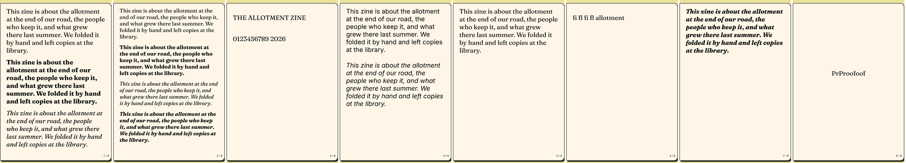
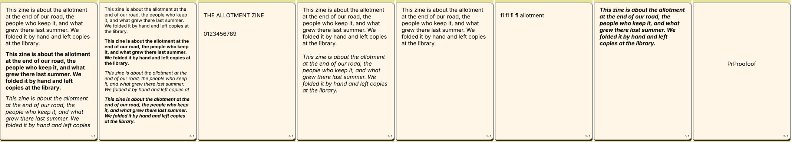
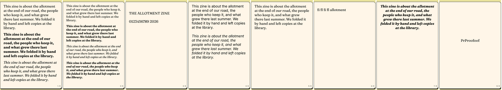
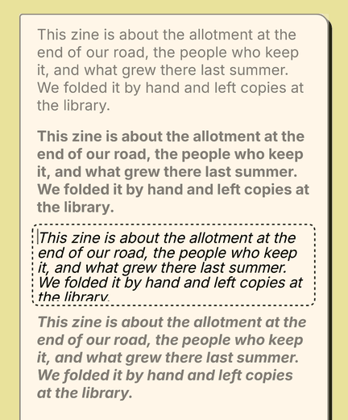
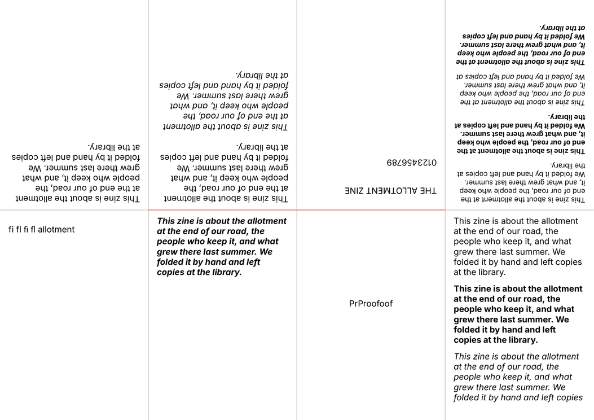
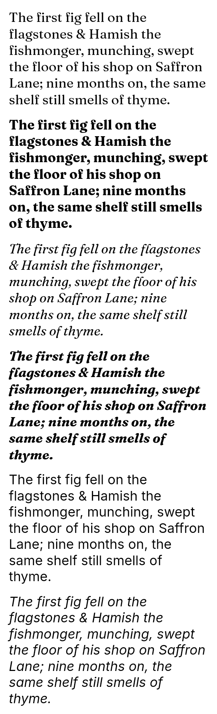
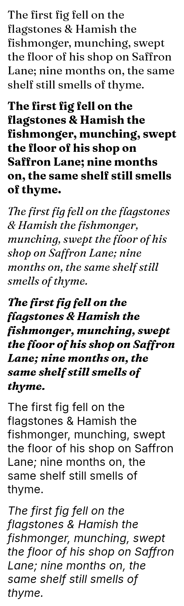
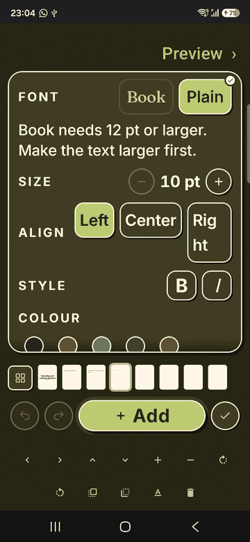
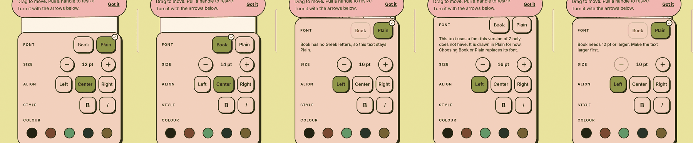
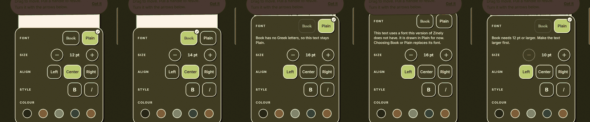

# Document voices: older-build test, Android 7 check, APK size and the phone pass

**Dates:** 2026-10-08 and 2026-10-09. **Branch:** `feat/document-voices`. **Decision:**
[ADR-126](../DECISIONS.md#adr-126) (Proposed). **Procedures:**
[Brief 02, Procedure B](../planning/BRIEF-02-THREE-VOICES.md#procedure-b-the-older-build-fallback-test).

Run by the Implementer Agent. Every screenshot holds made-up text. The owner's app and library were not
touched: the phone work used a side-by-side package (`com.aritr.zinely.voicesqa`), removed afterwards.

## 1. Older-build fallback test (Procedure B): PASS, with the layout change measured

### Builds and machine

| Role | Build | SHA-256 |
|---|---|---|
| Sender | debug build of this branch at `7da04a7`, package `com.aritr.zinely.voicesqa`, version name `0.9.0-beta.6`. Built before the review's fixes; none of them changes what is saved | `c52206af67d35c9a802ce2c6e80b9573cad9353242b3d4ac193789ab4180ad9a` |
| Receiver 1 | `0.9.0-beta.6`, the published APK | `3876215ee51ee5713f667cd1e20aa7c8327becd119e72b48447cf442ba6327a6`, as in its release notes |
| Receiver 2 | `0.9.0-beta.5`, the published APK | `ac18f4fab6162bef91d86ddc6b9f009044d1a4544f170a477e69dca76e7cf5bf`, as in its release notes |

All three ran on **one Android 7.0 emulator** (API 24, x86_64, 1080 × 2400), not on a phone. Receiver 3
(`0.9.0-beta.4-r3`, optional) was not run.

### Where this run differs from the written procedure

1. **The fixture was not made by hand in the app.** One text was made in the app and set to Book through
   the Font row; its stored `fontFamily` read `"Fraunces"`. The other fourteen boxes were then written into
   that zine's `document.json` on the debug sender. Each box got the width 186 pt and the exact height the
   app's own text layout measures for its text, so "just fits, no spare line" is exact where a finger would
   only be close. The fixture is not in the repository's fixture folders.
2. **Page 1 holds three boxes, not four.** Four 12 pt paragraphs do not fit one page. Bold italic is on
   page 7. Page 8 holds the text made in the app.
3. **No photo.** Check 9 moved a text box instead (the title on page 3, 12 pt down).
4. **Check 7 was done two ways.** Two cut-off Book texts were opened for editing and read by eye. All
   thirteen Book texts were also read to the end through the text each box reports to the accessibility
   tree, on both receivers. Not every box was opened for editing.

### Result, the same on both receivers

Receiver screenshots of `0.9.0-beta.5` and `0.9.0-beta.6` are the same picture: seven pages are identical
pixel for pixel, and page 2 differs in 12 pixels by one grey level.

| # | Check | `0.9.0-beta.6` | `0.9.0-beta.5` |
|---|---|---|---|
| 1 | Restore reports success | "1 zine added to your shelf" | the same |
| 2 | Zine opens, no crash | yes | yes |
| 3 | Control boxes (page 4) | identical to the sender, 6 and 6 lines | identical |
| 4 | Face drawn for a Book box | Inter, in the same regular, bold, italic or bold italic | the same |
| 5, 6 | Line counts and cut-off | table below | the same |
| 7 | Every word is there | yes: all thirteen Book texts report their full text (the paragraph is 166 characters in each) | yes |
| 8 | PDF against the screen | the same cut-offs; fonts in the PDF are four Inter faces and Roboto | the same |
| 9 | Edits kept after close and reopen | yes (one Book text centred, one text moved) | yes |
| 10 | Back on the sender | "1 zine added"; every Book box is Book; the edits are there; stored `fontFamily` is `"Fraunces"` for all 13 | the same; the eight pages match the beta.6 round trip pixel for pixel |
| 11 | Page 6 | below | the same |

**Checks 5 and 6: lines on the sender (Book) and on the receiver (Inter), in the same box.**

| Box | Sender | Receiver | Cut off on the receiver |
|---|---|---|---|
| 12 pt regular | 6 | 6 | nothing |
| 12 pt bold | 6 | 6 | nothing |
| 12 pt italic | 5 | 6 | **the last line** ("at the library.") |
| 12 pt bold italic | 6 | 6 | nothing |
| 10 pt regular | 5 | 5 | nothing |
| 10 pt bold | 5 | 5 | nothing |
| 10 pt italic | 4 | 5 | **the last line** ("the library.") |
| 10 pt bold italic | 5 | 5 | nothing |
| Title in capitals, one line | 1 | 1 | nothing |
| Digits "0123456789 2026", one line | 1 | 2 | **the second line** ("2026") |
| Paragraph with one spare line | 6 | 6 | nothing |

No line was sliced through: a line that does not fit is not drawn at all. Lines also break at different
words in every Book box, so the text sits differently even where nothing is lost.

**The worst case, in plain numbers:** an italic paragraph that just fitted lost its last line (one line of
six at 12 pt, one of five at 10 pt), and a one-line box of digits lost its last group of digits. The words
are still in the zine: they show when the text is opened for editing, and they are drawn again, in Book,
on a build that has voices. This was measured on one paragraph. A longer text, or a narrower box, can lose
more than one line.

**Check 7, by eye.** The 12 pt italic text opened for editing on `0.9.0-beta.6` shows all six lines. The
10 pt italic text opened on `0.9.0-beta.5` shows four lines and the top half of the fifth: the editing
field is as tall as the box. The words are there and can be reached with the cursor, but the last line is
hard to read until the box is made taller. This is how those builds edit any text that outgrows its box.

**Check 11.** On the sender, Book joins typed "fi" and "fl" and draws fi and fl from its own file. On both
receivers the line is drawn in Inter, and fi and fl come from **Roboto, a font on the device**: the PDF
embeds `Roboto-Regular` beside the Inter faces. The soft hyphens are not drawn and the word does not break.

**Not seen:** a refused restore, a crash, a missing word, a changed control box, a Book box that came back
Plain.

### Pictures

- Sender, pages 1 to 8: 
- `0.9.0-beta.6`: 
- `0.9.0-beta.5`: 
- Back on the sender after the round trip through `0.9.0-beta.6`, with the two edits:
  
- The half-shown last line while editing on `0.9.0-beta.5`:
  
- The PDF saved on `0.9.0-beta.6`: 

### Found on the way, not part of this change

On the sender, the fixture zine was deleted and the receiver's backup restored a few seconds later, in the
same run of the app. The restore said "1 zine added to your shelf" and the Shelf then showed "0 zines".
After the app was closed and opened again the zine was there. When the app was restarted between the
delete and the restore, the Shelf showed the zine at once. The restored zine has the id of the one just
deleted, and `HomeViewModel` keeps a list of ids whose delete is waiting; this branch changes no Shelf
code. Not investigated further. It needs its own issue.

## 2. Android 7: the four Book faces break lines as on a current phone

`BookLineBreakInstrumentedTest` lays one paragraph out at 12 pt in a 180 pt box, in the four Book faces
and in Plain regular and italic, and compares where each line ends with offsets recorded on the phone.

| Machine | Result |
|---|---|
| Samsung SM-A176B, Android 16 (API 36) | `OK (2 tests)`; the offsets in the test are the ones read here |
| Android 7.0 **emulator** (API 24, x86_64) | `OK (2 tests)`: every line of all six faces ends at the same character |

The same test draws the paragraphs to a picture on each machine. Read by eye: the same letter shapes, and
"fi" and "fl" joined on both. No real Android 7 phone was used.

- Android 7 emulator: 
- Phone, Android 16: 

## 3. APK size

Release builds of the same variant, signed with the debug key (`-PallowDebugSignedRelease`; neither file
can be given to anyone).

| Build | Bytes |
|---|---|
| `origin/main` @ `99a8f67` | 16,117,575 |
| This branch | 16,371,710 |
| **Change** | **+254,135 (about 0.24 MB)** |

The four Book files are 447,756 bytes before compression and 237,159 inside the APK. The APK asks for no
`INTERNET` permission.

## 4. The card at the largest text size (A29.11)

Measured in the Robolectric test `TypeBarFontRowTest`, font scale 2.0, the tallest state (unknown font,
with its line): on 360 × 800 dp the card is 336 × 538 dp; on 360 × 640 dp it is 336 × 378 dp.
On both it stays on the screen, scrolls inside itself, and every control is reached. On the phone at system font scale 2.0 the card
scrolls inside itself and the cut Colour row is the first sign.

What the maker sees when it scrolls is the golden `type_bar_font_scale2_unknown_scrolling` (the card in
the 378 dp the editor gives it: the Align row cut by the card's edge, and the shade) and this phone
picture, dark theme, system font scale 2.0:

Whether a maker notices a cut row is a question for the owner's first-time pass, as A29.11 says.

## 5. Phone, Pass 1 (developer): PASS

Samsung SM-A176B, Android 16, dark theme, 450 dpi; QA package, debug build of this branch. Read from
`uiautomator dump`, not from Compose.

- The row is a group named "Font" holding two radio buttons, "Book" and "Plain", 155 × 135 and
  150 × 135 px (48 dp is 135 px here).
- The chosen one is checked. An unavailable Book is **enabled and clickable**, not checked, and its
  description is the reason: "Book, unavailable. Book has no Greek letters, so this text stays Plain." or
  "Book, unavailable. Book needs 12 pt or larger. Make the text larger first." The same reason is on
  screen as a line of text. Tapping it changes nothing.
- A text with a font this build does not know: neither is checked, both can be tapped, the line about the
  unknown font shows.
- Book at 12 pt: "Smaller, unavailable. Book stops at 12 pt. Switch to Plain to go smaller." Tapping it
  leaves 12 pt.
- Undo shows "Font put back"; Redo shows "Font changed".
- The stored document reads `"fontFamily": "Fraunces"`, `schemaVersion` 3.
- Book bold italic is the same face on the Bench, in the editing field and in Read. The PDF embeds
  `Fraunces9pt-BoldItalic` and looks the same in three PDF readers.

**Parity with the frozen page.** The five states on the phone, light and dark (2026-10-09, a debug build
of the working tree with the review's fixes, SHA-256 `c823bd83c08cb031603a6bfc7adf42d48b3dbd39bd6be4288ffc9734b7af5cf6`).
Left to right: Plain chosen; Book chosen; Book unavailable for Greek; a font this build does not have;
Book unavailable below 12 pt.

Compared by eye with the goldens `type_bar_font_*`: the same row order, label, the two words in their
own faces, the corner tick on the chosen word, the flat quiet state of an unavailable Book, the reason
line under the row at the card's width, and neither word chosen for the unknown font. The comparison
with the HTML itself was made on the goldens, by the product reviewer, from the page's CSS and
tokens; the page was not rendered beside the phone. No difference was found. One thing in these
pictures is not the row's: no colour is ticked for a new text in the Colour row, which is the same on
`main`.

Seen and not changed:

| | What | Standing |
|---|---|---|
| a | A draft of several lines sits tighter than the result: the editing field uses a line height of 1 em, the page 1.21 em (Plain) or 1.233 em (Book) | older than this branch, both voices; a fix would move existing Plain editing pictures, so it is proposed separately |
| b | "Right" breaks across two lines in the Align row at font scale 2.0 | older than this branch; A29 V-6 names it |
| c | The card covers the text being changed, fully at the largest text size | known, A29 V-2 |
| d | A text that changes voice or grows can run out of its fixed box | the cut-off ADR-126 describes; out of scope |
| e | The label "Font" is a text and the group is also named "Font" | may be said twice; needs the listen |
| f | "Smaller" at the bottom of the ramp reports `clickable` with `enabled=false` | older than this branch |

## 6. Phone, Pass 2 (first-time user): done by the implementer, so the weaker pass

I wrote this screen, which is the wrong chair to judge it from. What I could still see:

- **Nothing on a selected text says "font".** The row is behind the button labelled **Size**. Someone
  looking for a typeface has no reason to tap "Size". RESEARCH R24 predicted this. Two ways out are put to
  the owner, and neither is made here, because the button belongs to the frozen page: put the **Font**
  action back on a selected text (the Bench page had one until A24 removed it, on the ground that no
  font could be chosen; that ground is gone), or rename "Size" ("Text"; not "Style", which is already a
  row inside the card).
- Once the card is open the row is first, the two words are drawn in their own faces, and one tap changes
  the text behind the card. That part reads at once.
- "Book" and "Plain" do not say "serif" or "sans". The faces carry it. Whether the words alone do is a
  question for someone who has not seen them.
- A quiet "Book" with its reason under it reads as "not now, and here is why". The reason for Greek is
  clear. "Book needs 12 pt or larger. Make the text larger first." asks the maker to find the Size row two
  rows down.
- Switching a long text to Book can push its last line out of the box with no sign. I knew why; a maker
  would see a sentence stop.

**For the owner to try,** on a build of this branch: make a text, then look for a way to change its
typeface without being told where it is; switch a paragraph that fills its box to Book; type a Greek
word and open the card; set a Book text to 12 pt and press Smaller.

## 7. Brief 02's acceptance criterion 3 is met in part

"Bold and italic use real faces in both voices. The draft while typing matches the result." The faces
match: the editing field draws the text's own four files. The line spacing does not: finding (a) above.
The `voice_editing_*` goldens hold one line of text, so they cannot show it. It is older than this
change and is put to the owner as a separate fix.

## 8. Review

Two independent Review Agents read the branch and the working tree on 2026-10-09, one for code
evidence, one for product and accessibility. Both were told that comments, documents and the
implementer's summary were claims to check. Neither ran Gradle, a phone or a screen reader. Both
returned **GO WITH FIXES**.

| Finding | Reviewer | Answer |
|---|---|---|
| The 12 pt block lived only in the card; two taps in one frame (Smaller and Book, either order) could commit Book at 10 pt | code, Required | **Accepted.** The reducer now refuses it (`EditorReducer.breaksBookRule`), with tests for both orders, for Greek and Cyrillic, and for an older Book text already below the minimum |
| ARCHITECTURE said a guard also catches a new `BundledFontResolver`; it scans `CanvasReplayer` only | code, Required | **Accepted.** The sentence says what the test does |
| No picture of the row on a phone; parity not recorded | product, Required | **Accepted.** Section 5, ten states. The HTML was compared through the goldens, not rendered beside the phone; said there |
| No picture of the card scrolling | product, Required | **Accepted.** One new golden and a phone picture, section 4 |
| CHANGELOG did not say a text can lose its last line when switched to Book on the current build | product, Required | **Accepted** |
| Acceptance criterion 3 is met for faces, not for line spacing, and nothing said so | product, Required | **Accepted.** Section 7, the brief, the owner's list; the CHANGELOG sentence is narrowed |
| Tests for the minimum under a burst of taps | code, Recommended | **Accepted**, as reducer tests |
| `assert` in the instrumented test does nothing on a phone | code, Recommended | **Accepted**: `assertTrue` |
| One coverage test could pass without its callback running | code, Recommended | **Accepted** |
| A comment pointed at ARCHITECTURE for a gap recorded in ADR-126 | code, Recommended | **Accepted** |
| The Latin letters Book lacks are more than the ADR's examples suggest | code, Recommended | **Partly accepted.** ADR-126 gains a count and examples. The count is mine (451 by Unicode name); the reviewer's 530 used the app's own script table and was not re-run |
| The rename proposal missed "put the Font action back" and offered "Style", which collides with a row | product, Recommended | **Accepted** |
| CHANGELOG did not say the card opens from "Size"; ROADMAP said "nothing is lost" beside a lost line; the Procedure B differences were not named in the ADR; "Font Book" was not in VOICE.md; the merge rule for gate 7 was unclear | product, Recommended | **Accepted**, all five |
| `v21-typebar.html` still says "Not built yet" | product, Recommended | **Not done here.** It is true until this branch merges, and the page is frozen: the sentence is changed with the merge, HTML first |

Left as observations: the reason is both in Book's spoken label and a line of its own, so a swipe may
hear it twice (the frozen page does the same; for the listen); the Bench and Read goldens allow a 2 %
difference, so the assertion beside them is what proves Book is not Plain there; a change of reason
line is not announced.

## 9. Not done

- **TalkBack was not listened to.** Everything above about speech is read from the tree.
- No real Android 7, 8 or 9 phone.
- The printed page (Procedure A).
- The new and re-recorded goldens were recorded on this Windows machine, not on the pinned CI image.
- The frozen HTML was not rendered beside the phone.

## 10. Addendum, 2026-10-09: the draft's line spacing

Finding (a) in section 5 and section 7 stand as written for the document-voices branch. This is what
happened next, in a separate change stacked on it (branch `fix/editing-draft-line-height`).

- **Cause.** `BenchEditingSurface` set `lineHeight = 1.em`, with a comment calling it the mirror of the
  renderer's `setLineSpacing(0f, 1f)`. That call multiplies the font's own line height by one; it does
  not set one em. Its own comment shows it was meant to match the renderer, not to differ from it.
- **Is it allowed after the freeze.** Yes, as a parity fix. In `v21-bench.html` the text being edited
  is the same node as the text at rest (`.t-title`, `.t-body`, lines 280 and 281); `edit()` only adds
  the class `editing` (line 781), and the only rule that reads it shows the caret (line 290). The
  frozen page gives the draft no line height of its own, and its caption says "You type on the page
  itself, at the size it will print."
- **Fix.** The field sets no line height. Compose then builds the font's own pitch from the same four
  files the page uses. No number is written down, so a third voice cannot drift.
- **Proof.** `EditingDraftLineParityTest` reads the composed field's layout and compares every
  baseline with `SharedTextLayout`'s: each registered family, four faces, the ten type-bar sizes,
  three scales, six lines with an empty one. Allowed: one device pixel per line, because each engine
  rounds a line's ascent and descent to whole pixels at its own scale, and that difference adds up
  down the box. Measured worst case: under 0.9 px per line, first baseline under 0.75 px. Before the
  fix the second line of a 24 pt Plain draft was 17 px high of the page's. Also held: the three
  alignments, tall accented capitals on the first line, and system font scale 2.0 (the draft does not
  move, because the page is in points).
- **Goldens.** New: `voice_editing_multiline_plain`, `voice_editing_multiline_book` (four lines each).
  None re-recorded: the golden gate passed with the fix before anything was recorded, because every
  existing editing golden holds one line and the first baseline did not change. Recorded on Windows;
  the CI recording is owed.
- **A draft taller than its box.** Not tested; read from the Compose source by the reviewer. The field
  clips to its box and scrolls to follow the caret, so with the caret at the end the first lines leave
  the box, where the page keeps the top and cuts the foot. That was so before this change. What is
  new: the draft used to be shorter than the page's text and is now the same height to within a pixel
  a line, so a text that only just fits can make the field scroll by a few pixels at its last line.
  The caret is drawn without the field's scroll offset (older than this change), so it may then sit
  off its line. For the phone.
- **The pixel a line adds up.** The rounding is the same on every line, so a draft of twenty lines
  can end 10 to 17 px from the page's last line at a dense phone's scale. Line metrics on Android are
  whole pixels in the field, so no line height given to it would remove this.
- **The caret on middle lines** of a draft sits about 0.04 em lower against the letters than before
  (3 px at 24 pt), because it hangs from the line's foot and the line is now taller. First and last
  lines are unchanged.
- **Review.** One independent Review Agent, told to treat the summary and comments as claims; it ran
  no tests. **GO WITH FIXES.** Required: these documents said an over-long draft "runs past the box",
  which the library contradicts; accepted and corrected here, in the CHANGELOG and in the owner's
  list. Recommended and accepted: say "about a pixel a line"; name the fallback-font, Android 7 to 8.1
  and scrolling limits where the code lives; test an empty draft and one ending in a new line; add
  the "only just fits" case to the phone pass. Partly accepted: the first-line test runs only at SDK
  34; it was not run below 28, and the limit is written down instead.
- **Not done.** No phone, no emulator, no TalkBack. Both device passes are owed for this fix. On
  Android 7 to 8.1 Compose pads the top of the field when the first line's ink rises above the ascent,
  which this test cannot see; it joins the older-Android debt. Where
  the two engines wrap a long line is unchanged and still a phone check. A draft holding an emoji or a
  letter the font lacks may still differ in line height from the page, because the field lets a
  fallback font's metrics widen a line and the page does not; not measured.
