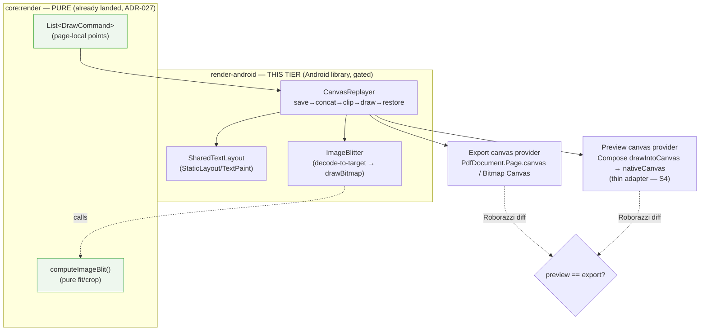
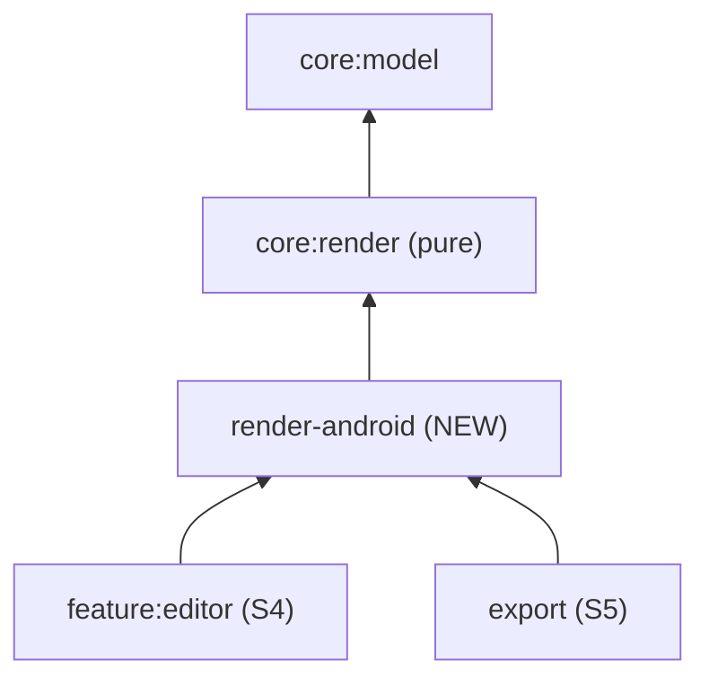

# Spike — S3 Android render backend + Roborazzi parity (ADR-027 §9.2)

> **Status:** ACCEPTED — recorded as [ADR-028](../DECISIONS.md#adr-028) (2026-06-24); design only. Codex **GO-WITH-FIXES** ×2, all Required + Recommended reconciled (§12, §12.1); Round 2 validated against repo HEAD `60f7344` and fixed 3 load-bearing correctness issues (PDF point-coordinate model, crop-aware decode, API-24–28 font fallback). Does **not** re-decide [ADR-027](../DECISIONS.md#adr-027) / [ADR-006](../DECISIONS.md#adr-006) / [ADR-001](../DECISIONS.md#adr-001) / [ADR-011](../DECISIONS.md#adr-011) / [ADR-023](../DECISIONS.md#adr-023). **No production code, no Gradle module, no Roborazzi** created — implementation is the G1–G6 gates (§9), not started.
> **Milestone:** closes **S3** — the visual-fidelity tier the pure-JVM `:core:render` core ([ADR-027](../DECISIONS.md#adr-027), [spike §9.2](core-render.md#92-visual-fidelity-proof-backend-module-android--the-part-jvm-cant-prove)) explicitly left open. JVM geometry tests do **not** close S3; this tier does.
> **Boundary it must preserve:** no Android dependency enters any `:core:*` module; `:core:render` stays pure. Preserves [ADR-027](../DECISIONS.md#adr-027), [ADR-006](../DECISIONS.md#adr-006), [ADR-001](../DECISIONS.md#adr-001), [ADR-011](../DECISIONS.md#adr-011), [ADR-012](../DECISIONS.md#adr-012), [ADR-023](../DECISIONS.md#adr-023).

---

## 1. Goal & what closes S3

`:core:render` emits an ordered, flat `List<DrawCommand>` in page-local points ([ADR-027](../DECISIONS.md#adr-027)). This tier builds the **Android replay layer** that rasterises that tape through one shared `CanvasReplayer`. **S3 proves raw-`CanvasReplayer` parity across the raster and PDF export paths** with Roborazzi golden diffs at multiple scales; the Compose **preview**-host parity test is owed by S4 (§2.4, [Q1](#10-open-questions--recommendations)) — see the scope-honest breakdown in the next paragraph. The destination that proof builds toward is the [ADR-006](../DECISIONS.md#adr-006) structural payoff — *preview == export by construction* — which closes risk #3 ([ARCHITECTURE §12](../ARCHITECTURE.md#12-major-technical-risks)) once S4 lands.

**What S3 proves (scope-honest, Codex Required-fix C):** S3 proves **raw `CanvasReplayer` parity** across the **raster** export path (Bitmap canvas) and the **PDF** export path (PDF rasterised back via `PdfRenderer`, §7.3) — at **multiple realistic scales**, not one. It does **not** fully prove the *Compose preview* path, because the Compose `drawIntoCanvas` host is deferred to S4 (§2.4): density, parent canvas state, layer transforms, and clipping can still differ. **S4 must add a real Compose-host Roborazzi parity test** — that obligation is recorded here and in [open question Q1](#10-open-questions--recommendations) so it is not lost. S3's promise is therefore "the shared replayer is scale- and canvas-implementation-invariant"; S4 closes "the Compose host introduces no drift."

**S3 is complete when:** (a) the replay layer exists; (b) `SharedTextLayout` + the image decode/blit helper exist and are shared by both draw paths; (c) Roborazzi parity diffs over the same tape pass in CI **at multiple scales** (screen-density, fractional zoom, **and** 300 DPI export) with every non-render variable pinned; (d) backend conformance tests pin the clip-replay order, the `computeImageBlit` routing, the PDF-vector-text guarantee, and the missing-asset placeholder.



---

## 2. Module placement — decision

**Decision: a new Android library module `:render-android`,** gated behind `ZINELY_CORE_ONLY` exactly like `:app` and `:data-android` (it needs the Android SDK). It is the **only** new module S3 requires.

### 2.1 Why not in `:core:render`
`:core:render` is pure-Kotlin, `:core:model`-only, enforced by the `core-tests` gate under `ZINELY_CORE_ONLY=true` ([ADR-027](../DECISIONS.md#adr-027) clause 1). Anything touching `StaticLayout`/`Paint`/`Canvas`/`Bitmap`/`PdfDocument` is `android.*` and would break that gate on the first import. The boundary is non-negotiable; the backend lives outside.

### 2.2 Why not folded into `:data-android`
`:data-android` is the **persistence** adapter (Room, WorkManager GC, SAF, Bitmap/EXIF import pipeline — [ADR-025](../DECISIONS.md#adr-025)). Rendering is an orthogonal concern. Folding the replayer in would force `feature:editor` and `export` to depend on the persistence module merely to draw, and would entangle Roborazzi config with Room/WorkManager test setup. A separate module keeps the dependency graph honest (below) and isolates the screenshot harness.

### 2.3 Dependencies (tight, by design)

```
:render-android  (com.android.library, minSdk 24 + core-library desugaring per ADR-024)
   api(project(":core:render"))            // → transitively :core:model; the tape + computeImageBlit
   // NO Compose, NO Coil, NO Room, NO :data-android
   // image bytes arrive through an injected AssetBytesSource seam (§5.3)
   testImplementation: robolectric, roborazzi, junit
```

`pageToDevice` for export composes `PanelPlacement.contentToSheet` ([imposition spike](imposition-engine.md)) with sheet-pt→px@300 DPI — but that composition happens in the **`export` (S5)** caller, which already depends on `:core:imposition`. `:render-android` only consumes a finished `pageToDevice: AffineTransform2D`, so it **does not** depend on `:core:imposition`. Resulting edges (extends [ARCHITECTURE §15.1](../ARCHITECTURE.md#151-dependency-graph)):



### 2.4 The Compose preview adapter — kept out of `:render-android` (recommendation, open Q1)
The preview "backend" is **not** a second renderer. It is a ~5-line bridge: Compose `drawIntoCanvas { canvas -> replayer.replay(canvas.nativeCanvas, tape, previewPageToDevice, pageClip) }`. `nativeCanvas` **is** an `android.graphics.Canvas` — the *same* object type the export path draws onto. So the recommendation is: **`:render-android` is Compose-free** and exposes the `CanvasReplayer` over a raw `android.graphics.Canvas`; the tiny Compose host lives in `feature:editor` (S4). This keeps `:render-android` dependencies minimal and lets S3's Roborazzi tests exercise the replayer with no Compose at all (§7.3).

> **Deferral has a cost S4 must pay (Codex Required-fix C).** With the Compose host outside S3, S3 *cannot* prove the **Compose preview** pixels — only that the raw replayer is canvas- and scale-invariant. Compose adds its own density handling, parent canvas matrix/clip state, and possible `graphicsLayer`/alpha compositing, any of which can still break preview==export. **S4 owes a real Compose-host parity test** (drive the host, rasterise the composable, diff against the export raster of the same tape).
>
> **✅ DONE (S4 Step 1, PR #19).** `:feature:editor` ships the stateless `PagePreview` host (a `drawIntoCanvas { replayer.replay(it.nativeCanvas, …) }` bridge over the **same** `CanvasReplayer`, injecting `BundledFontResolver`). `PagePreviewParityTest` (Robolectric NATIVE) renders the host and a direct `CanvasReplayer.replay` of the same tape and asserts pixel parity — **fills/placeholder EXACT** (`differing==0`), **AA edges ≤ 0.02**, **text routed through the bundled resolver** (host == bundled-direct **and** bundled ≠ Default). The derisk probe found `captureToImage()`/`captureRoboImage()` don't rasterise headless, so the host is read back via `View.draw(Canvas)` and cropped to the host's **actual** tagged bounds (density/placed-px asserted) — the gate is purely behavioural (no committed golden) and runs in the `android-graph` CI job. Recorded here and in [Q1](#10-open-questions--recommendations).

---

## 3. Backend architecture — "one replayer, two canvas providers"

The strongest possible form of [ADR-006](../DECISIONS.md#adr-006). Rather than two backends that *happen* to call shared helpers, the two backends **collapse into a single `CanvasReplayer`** invoked with two different `android.graphics.Canvas` sources and two different `pageToDevice` matrices. One code path draws every pixel; the "backends" differ only in (a) where the `Canvas` comes from and (b) the page→device matrix. Parity is then not a property to defend — it is the absence of a second path.

```kotlin
// :render-android — the single draw path (illustrative signature, not final code)
class CanvasReplayer(
    private val text: SharedTextLayout,
    private val images: ImageBlitter,        // wraps computeImageBlit + decode-to-target
) {
    /**
     * Replays [tape] onto [canvas]. [pageToDevice] is the VISUAL CTM (points→surface units —
     * pixels for bitmap/preview, PDF points for PDF; §3.2). [decodePxPerPt] is the SEPARATE
     * image-decode resolution (300/72 for both exports; screen scale for preview) — never
     * inferred from [pageToDevice], because the PDF canvas is in points (Required-fix #1).
     */
    fun replay(
        canvas: Canvas, tape: List<DrawCommand>,
        pageToDevice: AffineTransform2D, pageClip: PtRect,
        decodePxPerPt: Double,
    )
}
```

| Target | Canvas source | `pageToDevice` (visual CTM) | `decodePxPerPt` (image decode resolution, §5.1) |
|---|---|---|---|
| **Preview** (S4) | `drawIntoCanvas { it.nativeCanvas }` (Compose) | `contentToScreen` = uniform `screenPx/pt` at density + offset | `screenPx/pt` (= the CTM scale) |
| **Export image** (S5) | `Canvas(bitmap)` over an `ARGB_8888` sheet | `contentToSheet × (300/72)` — px @300 DPI ([ADR-011](../DECISIONS.md#adr-011)) | `300/72` |
| **Export PDF** (S5) | `PdfDocument.Page.canvas` | `contentToSheet` **in PDF points** (no DPI scale — see §3.2) | `300/72` (**separate** from the CTM) |

### 3.2 PDF draws in points, not pixels — the visual CTM and the decode resolution are decoupled (Codex Required-fix #1)

A `PdfDocument` page is a **PostScript-point** surface: `PdfDocument.PageInfo.Builder(widthPt, heightPt, …)` and the page `Canvas` are in **1/72-inch points**, *not* device pixels. So the earlier "PDF uses the same `sheetPt→px@300 DPI` matrix as the bitmap" was **wrong** — baking 300/72 into the PDF canvas would oversize every coordinate by ~4.17×. The fix separates two concerns the bitmap path happens to conflate:

- **Visual CTM** (`pageToDevice`, what the replayer concats):
  - *Bitmap export:* `contentToSheet × scale(300/72)` — points → pixels, because the bitmap surface is pixels.
  - *PDF export:* `contentToSheet` **only** — points → PDF points, because the PDF surface is already points. `PageInfo` is sized in paper points (Letter `612×792`, A4 `595×842`).
  - *Preview:* `screenPx/pt`.
- **Image decode resolution** (`decodePxPerPt`, passed to the `ImageBlitter`): the print/screen pixel density an image must be decoded at. For **both** exports this is `300/72` (print fidelity, [ADR-011](../DECISIONS.md#adr-011)/[ADR-023](../DECISIONS.md#adr-023)); for preview it equals the screen CTM scale. **For PDF it is supplied explicitly, never inferred from the (points-valued) PDF canvas CTM** — the bug Codex flagged. A vector `FillRect`/`DrawTextBox` needs no resolution; only the rasterised `DrawImage` body does, and it gets `decodePxPerPt` as a distinct input.

`replay(...)` therefore takes both `pageToDevice` (visual) **and** `decodePxPerPt` (image-decode); the table's last column is that second input.

### 3.1 Replay contract (per command) — pins [ADR-027](../DECISIONS.md#adr-027) clause 2 & [spike §9.2](core-render.md#92-visual-fidelity-proof-backend-module-android--the-part-jvm-cant-prove)

```
replay(canvas, tape, pageToDevice, pageClip):
    canvas.save()
    canvas.concat(pageToDevice.toMatrix())        // page-local pt → device px, set ONCE
    canvas.clipRect(pageClip)                       // page/panel bounds, in page-local pt
    for cmd in tape:                                // already z-sorted back-to-front by core:render
        canvas.save()
        canvas.concat(cmd.localToPage.toMatrix())   // element-local → page-local
        if (cmd.localClip != null) canvas.clipRect(cmd.localClip)   // LOCAL space → rotates with content
        draw(cmd)                                   // FillRect | DrawTextBox | DrawImage
        canvas.restore()
    canvas.restore()
```

- **Order is load-bearing.** `clip` is applied **after** `concat(localToPage)`, so a rotated element clips in its own rotated frame (a `FILL` image or overflowing text box clips correctly when rotated). This exact quad is asserted by a conformance test (§7.2).
- `AffineTransform2D` is column-vector (matches `android.graphics.Matrix`); `concat(pageToDevice) ; concat(localToPage)` yields CTM `= pageToDevice × localToPage`, satisfying ADR-027 clause 2.
- `core:render` already emits back-to-front; the replayer **never re-sorts** (single source of z-order truth).

---

## 4. `SharedTextLayout` — the parity-critical text path

The single most dangerous parity bug class ([ADR-006](../DECISIONS.md#adr-006), risk #3). One helper, fixed constants, layout in a **fixed internal scale** of point space; the canvas matrix does all device scaling so wrapping is identical in preview and export ([spike §6](core-render.md#6--text--the-shared-android-layout-path)).

**Why a fixed internal scale `K` (Codex Required-fix F).** Laying out at raw points (`textSize = sizePt`, `width = round(boxWidthPt)`) quantises wrap width and glyph advances to **whole points** *before* the matrix scales up — so it is deterministic but **not** truly resolution-independent: a 200.4 pt box and the integer width it rounds to behave identically at every DPI, but the rounding itself bakes in error that a high-DPI export would otherwise resolve finer. Fix: lay out at a **fixed internal scale `K` = 8** (points × 8), then have the replayer pre-concat a `scale(1/K)` so the device matrix is unchanged. Rounding error shrinks by 8× and is *identical* across preview and export because both divide by the same `K`. `K` is a committed constant; the round-at-`K` rule is an explicit, tested contract (§7.4), not an accident.

```kotlin
private const val LAYOUT_SCALE = 8   // fixed internal point→layout-unit scale (Required-fix F)

// Build ONCE per DrawTextBox; identical construction in every caller.
TextPaint().apply {
    isAntiAlias = true
    isSubpixelText = true            // pinned — see paint-flag table §4.1
    isLinearText = false
    hinting = Paint.HINTING_ON
    typeface = fontMap.resolve(style.family, bold = style.bold, italic = style.italic)
    textSize = (style.sizePt * LAYOUT_SCALE).toFloat()      // layout units, not raw points
    color = style.color.toAndroidColor()
}
StaticLayout.Builder
    .obtain(text, 0, text.length, paint, /*width=*/ (boxWidthPt * LAYOUT_SCALE).roundToInt())
    .setAlignment(style.align.toLayoutAlignment())
    .setIncludePad(false)
    .setLineSpacing(/*add=*/ 0f, /*mult=*/ 1f)
    .setBreakStrategy(LineBreaker.BREAK_STRATEGY_SIMPLE)
    .setHyphenationFrequency(LineBreaker.HYPHENATION_FREQUENCY_NONE)
    .setTextDirection(TextDirectionHeuristics.FIRSTSTRONG_LTR)
    // no ellipsize, no maxLines → overflow is clipped by localClip (= text box), not truncated
    .build()
// replay (text only): canvas at pageToDevice × localToPage, then concat(scale(1/K)); layout.draw(canvas)
//   localClip (= box, in points) is applied BEFORE the 1/K scale, so it still bounds in point space.
```

### 4.1 Fixed shared constants (not per-call — divergence-proof)

| Knob | Value | Why fixed |
|---|---|---|
| internal scale `K` | `8` (committed) | Layout at `sizePt×K` / `round(boxWidthPt×K)`; replayer divides by `K`. Shrinks point-quantisation 8× (Required-fix F) |
| `textSize` | `style.sizePt × K` (layout units) | Matrix + `1/K` scale do all device scaling; wrap resolution-stable |
| layout `width` | `round(boxWidthPt × K)` (layout units) | Wrap width quantised at `K`-resolution → same line breaks at any DPI; rounding rule is a tested contract |
| `includePad` | `false` | Deterministic vertical metrics across both paths |
| `lineSpacing` | `add=0, mult=1` | No platform-default spacing drift |
| `breakStrategy` | `SIMPLE` | Deterministic, greedy; avoids optimal-break variance across API levels |
| `hyphenationFrequency` | `NONE` | Hyphenation dictionaries are locale/version-variable → parity hazard |
| `textDirection` | `FIRSTSTRONG_LTR` | Fixed heuristic; MVP is LTR; no per-call ambiguity |
| `ellipsize` / `maxLines` | off / unbounded | Overflow clips to the box (`localClip`) identically in both paths |
| alignment | from `style.align` | The only per-call style knob; sourced from the model verbatim |

**Paint flags pinned (Codex Recommended — small defaults change output).** Both text and image Paints are constructed *inside* `CanvasReplayer` with an explicit, identical flag set so no canvas-provider default leaks in:

| Flag | Text Paint | Image Paint |
|---|---|---|
| `isAntiAlias` | `true` | `true` |
| `isSubpixelText` | `true` | — |
| `hinting` | `HINTING_ON` | — |
| `isLinearText` | `false` | — |
| `isFilterBitmap` | — | `true` |
| `isDither` | `false` | `false` |
| bitmap `Config` / sheet | — | `ARGB_8888` ([ADR-011](../DECISIONS.md#adr-011)) |
| color space | sRGB (default, asserted) | sRGB |

### 4.2 Font resolution, fallback chain & the glyph-coverage hazard
Family-name → `Typeface` comes from a **fixed bundled-font map** loaded from `assets/fonts/` ([ADR-010](../DECISIONS.md#adr-010): bundle only license-clear fonts; [ADR-001](../DECISIONS.md#adr-001): bundle TTFs for reproducible output). Bold/italic via `Typeface.create(base, style)`. The map is the same object in both paths, so a name resolves to the same TTF and the same metrics in preview, export, **and tests**. An **unknown family name maps to a single designated bundled default** (deterministic — never the system default, which is device-variable).

**Glyph-coverage policy (Codex Required-fix E, narrowed for minSdk 24).** Picking a primary bundled font does *not* stop Android: a character the chosen TTF lacks triggers **system fallback**, whose font (hence metrics, hence wrapping, hence the golden) varies by device/API. `Typeface.CustomFallbackBuilder` — the API that would let us *force* a bundled fallback — is **API 29+**, but Zinely is **minSdk 24** ([ADR-024](../DECISIONS.md#adr-024)). So on API 24–28 we **cannot** guarantee a missing glyph avoids system fallback. The contract is therefore honestly narrowed, not overstated:
- **Each bundled family is self-covering for the MVP character set** (Latin + common punctuation/symbols/currency) — the primary TTF alone contains every MVP glyph, so no fallback is *reached* for in-scope text on any API level.
- A **coverage test** asserts every MVP-charset character resolves within the bundled family by parsing the font's **`cmap` directly** (G6b: `CmapReader`/`FontCoverageTest`), failing the build if a bundled font regresses coverage. **Not** `Paint.hasGlyph` — it walks the whole system fallback chain, so it would falsely pass a glyph the bundled font lacks but a device font supplies (the very drift the guard exists to catch).
- **Characters outside the MVP charset are explicitly out of MVP scope** (extended scripts, emoji, CJK — custom-font import is V2, [ROADMAP](../ROADMAP.md)); their rendering is **not guaranteed deterministic on API 24–28** and is excluded from committed goldens.
- On API 29+ a bundled `CustomFallbackBuilder` chain *may* additionally be wired as defence-in-depth, but the milestone does **not** depend on it.
This converts "fonts mostly match" into "all *in-scope* text matches identically, by coverage rather than by intercepting fallback." Residual out-of-scope behaviour is tracked as risk R2.

### 4.3 PDF text stays vector — non-negotiable ([ADR-001](../DECISIONS.md#adr-001))
The export path draws text with `StaticLayout.draw(canvas)` onto the `PdfDocument.Page.canvas` — **never** rasterised into a bitmap. `PdfDocument`'s Skia backend emits true vector, selectable text with embedded subset fonts ([R2.2](../RESEARCH.md#r22-androidgraphicspdfpdfdocument--verified)). The raster image export path naturally rasterises (it is a bitmap), but the **PDF** path must keep glyphs vector. Conformance is asserted **on the actual generated PDF** (Codex Required-fix B / Recommended), two ways: (1) the PDF path issues text via `StaticLayout.draw`, not `drawBitmap` (recording-canvas spy); (2) a structural check on the written PDF bytes for a text-only page asserts **no image XObject is emitted for text** — catching a silent rasterisation regression that a spy alone would miss.

> **`K`-scale caveat for PDF:** the `1/K` text scale (§4) is applied as a `Canvas` matrix concat, which `PdfDocument`'s Skia backend records into the vector transform — glyphs stay vector at `1/K`. The scale must be a **matrix** op, never a re-rasterise; the structural check above guards this.

---

## 5. Image backend contract

### 5.1 One decode + one blit, shared
`DrawImage` is intent only ([ADR-027](../DECISIONS.md#adr-027) clause 3). The replayer's `ImageBlitter` is **one helper** used by every canvas provider, so there is no per-backend fit/crop math to diverge:

```
drawImage(cmd, canvas, decodePxPerPt /* §3.2 */, localScale /* scale part of localToPage */):
    intrinsic = decodeBounds(assetBytes, cmd.assetId)   // open #1 → inJustDecodeBounds → close (GROUND TRUTH, seam A)
    if (intrinsic == null) { drawMissingPlaceholder(canvas, cmd.box); return }   // §5.4
    blit = computeImageBlit(intrinsic.w, intrinsic.h, cmd.crop, cmd.fit,
                            cmd.box.width, cmd.box.height)        // PURE, from :core:render — ONLY fit/crop math
    // destination footprint in device px = destRect(pt) × decodePxPerPt × element local scale:
    destPx = blit.destRect.size * decodePxPerPt * localScale
    // CROP-AWARE source sizing (Required-fix #2): the visible source is only srcFraction of the master,
    // so the SOURCE region must carry destPx pixels ACROSS THAT FRACTION — inflate by 1/srcFraction:
    srcRegionPx = PtRect(srcFraction × intrinsic)                 // crop region in master pixels
    neededSrcPx = destPx / blit.srcFraction.size                 // px the source region must yield
    bmp = decodeRegionToTarget(assetBytes, cmd.assetId, srcRegionPx, neededSrcPx)  // open #2 → BitmapRegionDecoder
    if (bmp == null) { drawMissingPlaceholder(canvas, cmd.box); return }    // open #2 / decode fail = missing (§5.4)
    canvas.drawBitmap(bmp, /*src=*/ wholeOf(bmp), /*dest=*/ blit.destRect, imagePaint)
    bmp.recycle()
```

> **Decode must be crop-aware, sized off the print resolution — not the point box, not the whole image (Required-fix #2).** Two errors avoided:
> 1. **Resolution:** the destination footprint is `destRect(pt) × decodePxPerPt × localScale` — `300/72` for export, screen scale for preview (§3.2). A 4096 px master filling a 200 px preview box decodes small; the *same* master filling a 1650 px @300 DPI panel decodes large.
> 2. **Crop:** sizing the *whole-image* decode to the destination starves a small crop — a 10% crop filling 1000 px would leave the visible region only ~100 px of source detail. So the **source region** `srcFraction × intrinsic` is decoded (via `BitmapRegionDecoder`) to carry `destPx / srcFraction` pixels, i.e. inflated by `1/srcFraction`. The "tiny crop from a large master at 300 DPI" golden (§7.3) pins this. (`computeImageBlit` stays pure/DPI-agnostic — it returns fractions/point-rects; only the pixel decode is resolution- and crop-aware.)
>
> *Fallback when `BitmapRegionDecoder` is unsupported for a format:* decode the full image with `inSampleSize` chosen so the **full** decoded width ≥ `neededSrcPx / srcFraction.width` (same inflation), then sub-rect in `drawBitmap` — slower, more memory, but identical pixels.

### 5.2 No duplicate fit/crop math
`computeImageBlit` (in `:core:render`, JVM-tested) is the **sole** source of `(srcFraction, destRect)`. The backend computes pixels but never re-derives fit/crop. A conformance test (§7.2) asserts the blit goes through that function (seam/spy), satisfying [ADR-027 §9.2](core-render.md#92-visual-fidelity-proof-backend-module-android--the-part-jvm-cant-prove) clause 1.

### 5.3 Canonical bytes & the `AssetBytesSource` seam
Both paths **must** decode the **same canonical import-master bytes** ([ADR-023](../DECISIONS.md#adr-023)), never a thumbnail/proxy/Coil-cache entry — otherwise `inJustDecodeBounds` could report a different intrinsic in preview vs export and silently break parity ([ADR-027](../DECISIONS.md#adr-027) backend contract clause 2). `:render-android` does **not** know about Room/`AssetStore`; it takes an injected seam.

**The seam must support independent re-open (Codex Required-fix D).** A bounds pass (`inJustDecodeBounds`) **consumes** the stream, and many `InputStream`s (asset/content streams) cannot `reset()` or `mark()`. So the contract is *fresh stream per call*, decode pass opens again, and every stream is closed:

```kotlin
fun interface AssetBytesSource {
    /**
     * Returns a FRESH, fully independent stream positioned at byte 0 of the canonical
     * import-master (ADR-023) for [assetId], or null if absent. Called MORE THAN ONCE per
     * draw (bounds, then decode); each call MUST yield a new readable stream. The blitter
     * owns and closes each returned stream. A null on ANY call (incl. the 2nd open) ⇒ the
     * asset is treated as MISSING → placeholder (§5.4) — never a half-decoded draw.
     */
    fun open(assetId: String): InputStream?
}
```

`:data-android`'s `AssetStore` implements it in app wiring (Hilt) — a content-addressed master is a file, so reopening is cheap and reliable. The master is already EXIF-normalised at import ([ADR-023](../DECISIONS.md#adr-023)), so **no per-backend EXIF step** exists to diverge. The blitter wraps both opens in `use { }` so streams never leak even on decode failure.

### 5.4 Missing-asset placeholder ([ADR-027](../DECISIONS.md#adr-027) seam A; TOCTOU)
Render cannot detect absence (an asset present at scene-build can vanish before draw). On `open()==null` or decode failure the backend paints a **defined placeholder** — neutral fill + broken-image glyph, clipped to `cmd.box` — never crashing, never drawing nothing (aligns with the data layer's "never silently downgrade"). The placeholder is one shared function so preview and export show the *same* placeholder. Exact visual is an S4/S5 UX choice; the *contract* (defined, deterministic, in-box) is pinned here.

### 5.5 Decode-to-target / sampling policy ([ADR-011](../DECISIONS.md#adr-011) / [ADR-023](../DECISIONS.md#adr-023))
`inJustDecodeBounds` → `BitmapRegionDecoder` of the `srcFraction × intrinsic` region with `inSampleSize` (largest power of two keeping the decoded region ≥ the crop-aware `neededSrcPx` from §5.1, *not* the point box and *not* the whole image) → exact down-scale during `drawBitmap` with the pinned `imagePaint` (§4.1: `isFilterBitmap=true`, `isDither=false`, `ARGB_8888`). Because the **same `ImageBlitter`** runs for both paths, sized off the same `decodePxPerPt` + crop inflation, the sampling/filter policy is identical by construction at any scale. Memory: one sheet at a time, region+sampled decode to target, `recycle()` immediately ([ADR-011](../DECISIONS.md#adr-011)) — see risk R7.

---

## 6. Transform & clip replay order (rotated clips, page clips, panels, preview scale)

All four cases reduce to the §3.1 quad; this section pins each input.

- **Element rotation:** `localToPage = translate(x,y) × rotateAboutCenter(deg, w/2, h/2)` is emitted by `:core:render` ([ADR-027](../DECISIONS.md#adr-027) clause 2); the backend only `concat`s it. Never re-derived.
- **Rotated clips:** `localClip` is in element-local space and applied **after** `concat(localToPage)`, so it rotates with the element. A rotated `FILL` image / overflowing text box clips to its own rotated rect — verified by a Roborazzi rotation case (§7.3).
- **Page / panel clip:** `pageClip` is the page rect `(0,0,pageW,pageH)` for preview; for export it is the panel's `clipLocalBounds` from imposition (panel-local), applied under the panel's `pageToDevice` — so content never bleeds across the fold into the neighbouring panel ([ARCHITECTURE §6](../ARCHITECTURE.md#6-export-pipeline)). Supplied by the caller; `:render-android` just clips to it.
- **Export panel placement:** the `export` (S5) caller composes `pageToDevice = contentToSheet ∘ (sheetPt→px@300 DPI)` per panel and calls `replay` once per logical page into its panel region. `:render-android` is panel-agnostic.
- **Preview scale:** `pageToDevice = uniformScale(screenPx/pt) ∘ translate(pageOffset)`; the same tape, the same replayer, a different matrix.

---

## 7. Test strategy

Two-tier, matching [ADR-027](../DECISIONS.md#adr-027) clause 5: JVM geometry already covers `:core:render`; **this tier owns the Android fidelity proof.** All of it runs under **Robolectric (JVM, no emulator)**, so it fits the existing Android-SDK CI job — no device farm.

### 7.1 The Robolectric graphics prerequisite (load-bearing)
Robolectric's legacy graphics use placeholder glyphs and fake metrics — useless for a pixel diff. This tier **requires `robolectric.graphicsMode = NATIVE`** (Robolectric 4.10+), which routes `Canvas`/`StaticLayout`/`PdfDocument` through real native Skia, producing real text rasters and real vector PDF. Roborazzi is explicitly built for this mode. Pinned as a hard config; if a chosen Robolectric/Roborazzi version cannot do NATIVE text deterministically, S3 escalates to instrumented (emulator) Roborazzi — see risk R1.

### 7.2 Backend conformance (unit, Robolectric — fast, deterministic)
- **Clip-replay order:** replay a small tape onto a **recording/spy `Canvas`**; assert the op sequence `save → concat(localToPage) → clip(localClip) → draw → restore` per command, with `pageToDevice` set once at page scope (§3.1). *Verify the recording canvas actually works under `graphicsMode=NATIVE` (Codex Recommended);* if NATIVE bypasses the spy, fall back to the **pixel-based rotated-clip golden** below as the trustworthy proof.
- **Pixel rotated-clip golden:** a rotated `FILL` image / overflowing text box must show content clipped to its **rotated** local rect — a pixel diff that a recording spy can't fake (Codex Recommended).
- **Matrix conformance (Codex Recommended):** map sample points after `canvas.concat(pageToDevice); canvas.concat(localToPage)` and assert equality with `pageToDevice.times(localToPage)` applied to the same points — catches any `AffineTransform2D→Matrix` conversion or pre/post-concat inversion before it reaches a golden.
- **`computeImageBlit` routing:** assert `DrawImage` geometry is resolved through `:core:render`'s `computeImageBlit` (seam/spy), never hand-rolled ([ADR-027 §9.2](core-render.md#92-visual-fidelity-proof-backend-module-android--the-part-jvm-cant-prove)).
- **Missing-asset:** a `DrawImage` whose `assetId` fails on open #1, open #2, or decode (§5.1) paints the placeholder (no throw, no empty draw).
- **PDF vector text (on the real PDF):** generate a text-only PDF page; assert text went through `StaticLayout.draw` (spy) **and** the written PDF emits **no image XObject for text** (structural byte check, §4.3) ([ADR-001](../DECISIONS.md#adr-001)).

### 7.3 Roborazzi parity + golden diffs (the S3-closing proof)

The honest claim is "the shared replayer produces equivalent pixels across **canvas implementations and scales**," so the harness has three layers, not one (Codex Required-fix A & B):

1. **Cross-canvas replay parity (isolation layer).** Render the **same** tape through the **raster provider** (`Canvas(bitmap)`, visual CTM `contentToSheet × 300/72`) and the **PDF provider** (`PdfDocument`, visual CTM `contentToSheet` in **points**, `PageInfo` in paper points — §3.2 — then written and **rasterised back via `PdfRenderer` with an explicit points→pixels render matrix at 300/72**, Required-fix #1/B) onto equal-size `ARGB_8888` bitmaps; diff within PDF-aware tolerance. The two providers use *different* visual CTMs (pixels vs points) but the same `decodePxPerPt=300/72`, so equal output size isolates *canvas-implementation* divergence (Paint defaults, PDF Skia vs Bitmap Skia) from coordinate-model effects. **This is "raster vs PDF export parity," explicitly *not* a claim about the Compose preview** (deferred, §2.4).
2. **Multi-scale golden cases (the real promise).** The same cases rendered at **realistic** matrices — screen density (e.g. ~2–3 px/pt), a **fractional editor zoom**, **and** the **300 DPI export** scale ([ADR-011](../DECISIONS.md#adr-011)) — each with a committed golden. This is what catches scale-dependent divergence (`inSampleSize` steps, point-quantisation, AA at different sizes) that an identical-scale test *hides*. Image decode target is taken from the effective CTM (§5.1), so each scale exercises a real decode footprint.
3. **PDF-as-PDF check.** Beyond the rasterised diff, the structural no-image-XObject assertion (§7.2) proves the PDF stays vector — a pixel diff alone can't.

- **Golden cases** (committed PNG references; a diff fails CI): **text** (wrap, alignment, bold/italic, multi-line overflow clip) at each scale; **image** FIT, FILL, crop composition (incl. **tiny crop from a large master**, **fractional dest rects**), rotation, z-overlap — each at screen + 300 DPI; **missing-asset** placeholder.
- **Every non-render variable pinned** ([ADR-027 §9.2](core-render.md#92-visual-fidelity-proof-backend-module-android--the-part-jvm-cant-prove)): identical output **size** *per scale*, identical **`pageToDevice`** *per case*, identical **bundled fonts + fallback chain** (§4.2), identical **asset bytes** (a committed fixture import-master), identical **decode/sampling/paint policy** (the shared `ImageBlitter` + pinned Paints §4.1), and **deterministic tolerance** — `0` for exact-geometry fills; small **committed constants** for AA text/image edges and for PDF-rasterise resampling, each justified in-test on the pinned CI image (§7.5), **not** tuned to pass.

### 7.4 `SharedTextLayout` unit (Robolectric NATIVE)
Given `(text, style, box)`, assert line count and per-line break offsets are deterministic and stable across repeated builds, and that overflow exceeds `boxHeightPt` (so the box clip — not `maxLines` — bounds it). This catches font-map/constant regressions before they reach a golden diff.

### 7.5 CI — and the pinned-environment requirement (Codex Recommended)
- Roborazzi tasks (`recordRoborazzi*` to generate, `verifyRoborazzi*` to gate) run on the existing **Android-SDK CI job** (the one added for `:data-android` Hilt validation) — Robolectric needs the SDK but no emulator.
- **Goldens are environment-sensitive even under NATIVE.** Committed text/image goldens are only valid against a **pinned toolchain**: fixed CI OS image, JDK, Android Gradle plugin, **Robolectric version + SDK level**, **Roborazzi version**, **locale + timezone**, and the **bundled font assets** (§4.2). Pin all of these in the CI job and the `robolectric.properties`; record goldens *on that image only*. A toolchain bump that moves rasters is a deliberate `recordRoborazzi*` refresh, reviewed — never an ambient drift.
- Golden PNGs are committed; `verifyRoborazzi*` fails the build on any diff beyond the committed tolerance.
- `:core:render` stays in the pure `core-tests` gate untouched; `:render-android` is gated out of `ZINELY_CORE_ONLY` like `:app`/`:data-android`.
- **Escalation path:** if NATIVE text proves non-deterministic across CI runs despite pinning (risk R1), S3 moves these goldens to an **instrumented (emulator) Roborazzi** job on a pinned API image — slower infra, but the deterministic-raster fallback. Decided empirically at G6.

---

## 8. Risks

| # | Risk | Sev | Mitigation |
|---|---|---|---|
| R1 | **Text rasterisation under Robolectric** — legacy mode = placeholder glyphs, no real metrics | High | Pin `robolectric.graphicsMode=NATIVE` (real Skia text); escalate to instrumented Roborazzi if NATIVE text is non-deterministic on the runner (§7.1). **Confirmed at G5:** NATIVE rasterises `Bitmap`/`Canvas` (raster provider proven headless) but **does not support `PdfDocument` generation** (`document is closed!`) — the PDF write+rasterise proof is therefore an instrumented `androidTest` (compile-checked in the SDK job, executed on a device), per the pre-authorised escalation. **Confirmed at G6a:** the same boundary applies to **image decode** — Robolectric 4.16.1 `BitmapRegionDecoder.decodeRegion` returns a **blank** bitmap (no native region decode; the real shadow lands only on Robolectric `master`). `BitmapFactory.decodeStream` *does* decode under NATIVE, but the blitter's crop-aware region decode is the thing under test, so real-PNG image-fidelity goldens move to instrumented `androidTest` too; headless Roborazzi covers only Canvas-primitive cases (fills, z-overlap, rotated-clip, placeholder) |
| R2 | **Font mismatch / glyph fallback** — a name *or an uncovered glyph* falls back to a device/system font → metrics differ across paths/runs | High | Fixed bundled-font map + **bundled fallback chain** covering the MVP charset; uncovered glyph → bundled `.notdef`, never system; coverage test; same map in both paths and tests (§4.2) |
| R3 | **Compose Canvas vs `PdfDocument`/Bitmap Canvas defaults** — different Paint AA, color space, layer alpha; **Compose preview unproven in S3** | Med→High | One `CanvasReplayer` (no second path); all Paints pinned inside it (§4.1); raster-vs-PDF parity at identical scale (§7.3); **✅ closed in S4 (PR #19)** — `PagePreviewParityTest` proves the Compose host adds zero drift vs the raw replayer (§2.4, Required-fix C) |
| R4 | **Bitmap sampling differences** — `inSampleSize` rounding diverges, or decode sized off point-box not device px | Med | Single shared `ImageBlitter`, sized off the **effective CTM** (§5.1) → one sampling/filter policy at any scale ([ADR-011](../DECISIONS.md#adr-011)); multi-scale image goldens (§7.3) |
| R5 | **Tolerance / golden flake** — AA edges + PDF-rasterise resampling make exact-equality brittle; goldens drift across host toolchains | Med | Robolectric NATIVE rasters on a **pinned toolchain** (§7.5); committed tolerance constants (0 fills, small AA, small PDF-resample) justified in-test; toolchain bump = reviewed re-record, not drift |
| R9 | **PDF not pixel-comparable** to a Bitmap canvas (it's vector, **and in points not pixels**) | Med | PDF visual CTM = `contentToSheet` in points, `PageInfo` in paper points (§3.2); rasterise written PDF via `PdfRenderer` (explicit points→px@300/72) before diff + structural no-image-XObject check (§4.3, §7.2–7.3, Required-fix #1/B) — never bake 300/72 into the PDF canvas, never diff `PdfDocument.canvas` against a bitmap directly |
| R10 | **Point-space wrap quantisation** — `round(boxWidthPt)` bakes rounding before scale | Low | Fixed internal layout scale `K=8` (§4); explicit, tested round-at-`K` contract (§7.4) |
| R11 | **Crop under-sampling** — small `srcFraction` decoded to dest size starves the visible region; or decode sized off point box not print res | Med | Crop-aware region decode (`BitmapRegionDecoder`, inflate by `1/srcFraction`) sized off `decodePxPerPt` (§5.1); tiny-crop @300 DPI golden (§7.3) (Required-fix #2) |
| R12 | **Uncoverable glyphs on API 24–28** — `CustomFallbackBuilder` is API 29+, can't force bundled fallback below 29 | Med | Self-covering bundled families for the MVP charset (no fallback reached); coverage test; out-of-charset text out of MVP scope + excluded from goldens (§4.2) (Required-fix #3) |
| R6 | **Module dependency creep** — `:render-android` pulls Room/Coil/`:data-android` | Med | `AssetBytesSource` seam (no persistence dep); Compose host deferred to S4 (§2.4); only `api(:core:render)` + test deps (§2.3) |
| R7 | **Export memory / OOM at 300 DPI** — full sheet ARGB ≈ 34 MB + per-panel decode | Med | One sheet at a time, sampled/region decode to target, `recycle()` immediately, off-main ([ADR-011](../DECISIONS.md#adr-011)); surface OOM as recoverable in S5 ([ARCHITECTURE §9](../ARCHITECTURE.md#9-error-handling)) |
| R8 | **`StaticLayout`/`LineBreaker` cross-API variance** — break/metrics differ by API level | Med | `BREAK_STRATEGY_SIMPLE` + `HYPHENATION_NONE` + fixed direction (§4.1); point-space layout; goldens recorded on the pinned CI image |

---

## 9. Implementation sequence (review-gated, TDD)

Each step is test-first ([TDD](../../CLAUDE.md)) and Codex-reviewed; the design itself gates on **ADR-028** landing first.

| Gate | Step | Exit |
|---|---|---|
| **G0** | This design → Codex review → reconcile → record **ADR-028** (referencing ADR-027/006/001/011/023); update ARCHITECTURE §15 + ROADMAP in the same change | ADR Accepted |
| **G1** | Scaffold `:render-android` (gated in `settings.gradle.kts`); version-catalog Robolectric/Roborazzi; **add `:render-android:testDebugUnitTest` + `:render-android:verifyRoborazziDebug` to the Android-SDK CI job** (`:core:render` stays in the core-only job — Codex Recommended); **no logic** | module builds; both jobs green |
| **G2** | `CanvasReplayer` — `FillRect` + transform/clip quad; recording-Canvas conformance test (§7.2) | clip-order test green + Codex |
| **G3** | `SharedTextLayout` (constants §4.1) + `DrawTextBox` replay; PDF vector path; layout-determinism unit (§7.4) | text unit green; vector-text conformance green |
| **G4** | `ImageBlitter` — decode-bounds → `computeImageBlit` → **CTM-sized** decode-to-target → blit; two-open `AssetBytesSource` seam (§5.3); missing-asset placeholder; routing + placeholder conformance (§7.2) | conformance green + Codex |
| **G5** | Canvas providers — `PdfDocument` + `Bitmap` (export) + `PdfRenderer` rasterise harness (§7.3); raw-Canvas seam (`ExportScale.previewPageToDevice`) for the preview host (Compose host lands in S4). **Empirical (CI):** Robolectric `graphicsMode=NATIVE` rasterises `Bitmap`/`Canvas` but **cannot generate a `PdfDocument`** (`IllegalStateException: document is closed!` on a fresh page) — so the raster provider is proven headless (unit) while the PDF write+rasterise-back proof is an **instrumented `androidTest`** (real `android.graphics.pdf`, compile-checked in the SDK CI job, run on a device), the R1/Q3 escalation, same authored-not-headless-CI split as `:data-android`'s `Os.fsync` tests | raster provider renders a page headless; PDF provider write+rasterise-back proven instrumented (compile-checked in CI) |
| **G6a** | **Headless Roborazzi goldens** at **multiple scales** (screen 2.5 + fractional zoom 1.7 + 300 DPI) for the cases Robolectric `graphicsMode=NATIVE` can truly rasterise from `android.graphics` **primitives**: geometric fills, z-overlap, the **rotated-clip order** (a clipped+rotated `FillRect`, the §3.1 load-bearing claim), and the missing-asset placeholder. Each case = a behavioural pixel assertion + a committed golden. Goldens are recorded on the **pinned CI image** (`record-goldens.yml`, `workflow_dispatch`/branch-push — there is no local Android build) and gated by `:render-android:verifyRoborazziDebug --rerun-tasks`. **Empirical (CI):** Robolectric 4.16.1 `BitmapRegionDecoder.decodeRegion` returns a **blank** bitmap (no native region decode; the real shadow exists only on Robolectric `master`) — and the crop-aware region decode is the very thing under test — so **real-PNG image fidelity (FIT/FILL/crop/rotation) cannot run headless** and moves to an instrumented `androidTest` (`ImageReplayInstrumentedTest`, real codecs, compile-checked in CI, run on a device), the same authored-not-headless-CI split as the PDF write path (G5) and `:data-android`'s `Os.fsync`. | **DONE (2026-06-25):** 9 goldens green in CI; the non-image raster replay is gated. |
| **G6b** | **(a) DONE (2026-06-25):** bundled **Inter** (OFL, 4 static styles — variable font needs API 26+ > minSdk 24) in `assets/fonts/`; `BundledFontResolver` (the golden-grade replacement for `FontResolver.Default`); the §4.2 **self-covering glyph-coverage guard** = a direct **cmap** parse (`CmapReader`/`MvpCharset`/`FontCoverageTest`), **not** `Paint.hasGlyph` (which walks the system fallback chain and would falsely pass); a NATIVE **font-render probe** (confirmed Robolectric NATIVE *does* rasterise a bundled asset `Typeface`, unlike `BitmapRegionDecoder`/`PdfDocument`); and **headless text goldens** (wrap/align/bold/italic/overflow-clip) at screen+export. **(b) EXECUTED ON-DEVICE (2026-06-25):** `connectedDebugAndroidTest` ran the instrumented suite on real hardware (Samsung SM-A176B, API 36) — **7/7 green, 0 failures**: `ImageReplayInstrumentedTest` (FIT/FILL/tiny-crop@300dpi/rotation — the `BitmapRegionDecoder` gap) + `PdfExportInstrumentedTest` (`producesSinglePagePdfBytes`, **`rasterAndPdfPathsAgreeForGeometricFill`** = the raster/PDF parity proof, `pdfRasterisesBackToExportDimensions` — the `PdfDocument` gap). This is a **one-time local run**, not yet a CI gate; a hosted emulator/`connectedCheck` job would make it permanent (still future). | (a) **DONE** — coverage guard + text goldens green in CI. (b) **DONE (on-device)** — image + PDF instrumented proofs executed ⇒ **S3 raster+PDF parity COMPLETE** (Compose preview parity owed by S4, §2.4; CI emulator gate still future) |

S4 (editor) and S5 (export) then consume `:render-android`; S4 adds the Compose preview host (§2.4).

---

## 10. Open questions & recommendations

| # | Question | Recommendation |
|---|---|---|
| Q1 | Where does the **Compose preview host** live — `:render-android` or `feature:editor` (S4)? | **`feature:editor`.** Keep `:render-android` Compose-free; the host is a ~5-line `drawIntoCanvas` bridge over the same `CanvasReplayer`. Smaller deps; S3 parity needs no Compose. **Cost (binding):** S4 *must* add a Compose-host parity test — S3 proves raster+PDF only (§2.4, §7.3, Required-fix C). **✅ Resolved (S4 Step 1, PR #19):** `:feature:editor` ships `PagePreview` + `PagePreviewParityTest` (the binding cost paid). |
| Q2 | One module, or split export vs preview replay? | **One `:render-android`.** The whole point is a single `CanvasReplayer`; splitting re-introduces two paths and defeats structural parity (§3). |
| Q3 | Robolectric NATIVE sufficient, or instrumented (emulator) Roborazzi? | **Start Robolectric NATIVE** (no emulator, fits current CI). Escalate to instrumented only if NATIVE text proves non-deterministic on the runner (R1, §7.1). Decide empirically at G6. |
| Q4 | Pixel tolerance for AA text/image edges? | **0 for geometric fills; a small committed constant for AA edges**, justified per-test, recorded on the pinned CI image — not tuned to pass (§7.3, R5). Finalise values at G6 with real goldens. |
| Q5 | Decode via `BitmapFactory`/`BitmapRegionDecoder` vs Coil? | **Framework decoders in the shared `ImageBlitter`** (synchronous, target-sized, parity-controlled). Coil is an editor-preview *loading* concern (async, S4), not the parity draw path (§5.5, R4). |

---

## 11. Decision record (proposed)

This design feeds a new **ADR-028** — *S3 Android render backend & parity proof* — referencing [ADR-027](../DECISIONS.md#adr-027) (concrete pure contract), [ADR-006](../DECISIONS.md#adr-006) (principle), [ADR-001](../DECISIONS.md#adr-001) (PDF vector text), [ADR-011](../DECISIONS.md#adr-011) (decode-to-target/raster), [ADR-023](../DECISIONS.md#adr-023) (import-master bytes); it does **not** re-decide any of them. ADR-028 would capture: the `:render-android` module placement; the **one-replayer-two-canvas-providers** collapse; the `SharedTextLayout` fixed-constant set + bundled-font resolution; the `AssetBytesSource` seam + missing-asset contract; and the Robolectric-NATIVE Roborazzi exit bar. To be recorded **only after Codex review** of this spike, in the same change as the ARCHITECTURE §15 / ROADMAP updates.

## 12. Codex review — reconciliation (2026-06-24)

**Verdict: GO-WITH-FIXES.** Module boundary and the one-`CanvasReplayer` direction endorsed ("right shape, does not leak Android into `:core:render`"). Core critique: the *proof strategy* under-proved the product promise — "same replayer into the same kind of bitmap at one scale" ≠ "preview, raster, and PDF stay equivalent across canvas implementations and scales." All Required + Recommended reconciled into the design.

| # | Codex finding | Class | Disposition |
|---|---|---|---|
| A | Identical-`pageToDevice` parity overclaims; needs realistic screen/zoom/300-DPI matrices; decode target must follow the **effective transform**, not the point box | Required | **ACCEPTED** — multi-scale golden layer (§7.3 layer 2); `ImageBlitter` sized off the effective CTM (§5.1) |
| B | `PdfDocument.canvas` is not pixel-comparable to a Bitmap canvas — must rasterise the written PDF via `PdfRenderer` and diff with PDF tolerance | Required | **ACCEPTED** — PDF rasterised back before diff; bitmap-only test relabelled "raster replayer parity" (§7.3 layer 1/3, §7.2) |
| C | S3 can't prove **Compose preview** parity while the host is deferred; exit bar must say "raw replayer parity"; S4 owes a Compose-host test | Required | **ACCEPTED** — scope-honest exit bar (§1, §9 G6); S4 obligation recorded (§2.4, Q1). **✅ Discharged in S4 (PR #19):** `PagePreviewParityTest` proves Compose-host == export. |
| D | `AssetBytesSource.open: InputStream?` — bounds decode consumes the stream; many streams can't reset; needs independent reopen + close-every-stream; 2nd-open failure = missing | Required | **ACCEPTED** — fresh-stream-per-call contract, `use{}` close, 2nd-open-null ⇒ placeholder (§5.3, §5.1) |
| E | Primary bundled fonts don't stop **system glyph fallback** → metrics/goldens drift | Required | **ACCEPTED** — bundled fallback chain covering MVP charset; uncovered glyph → bundled `.notdef`; coverage test (§4.2) |
| F | `round(boxWidthPt)` deterministic but quantises layout to whole points pre-scale → not resolution-independent | Required | **ACCEPTED** — fixed internal layout scale `K=8`; replayer applies `1/K`; tested round-at-`K` contract (§4, §4.1, §7.4) |
| R1 | Pin the full CI toolchain (OS/JDK/AGP/Robolectric/Roborazzi/SDK/locale/TZ/fonts) for committed goldens | Recommended | **ACCEPTED** — pinned-environment requirement (§7.5) |
| R2 | Add real-scale image cases (300 DPI FIT/FILL/crop, tiny crop from large master, rotated, fractional dest) | Recommended | **ACCEPTED** — enumerated in golden cases (§7.3) |
| R3 | Don't trust a recording `Canvas` for clip-order under NATIVE without confirming; prefer a pixel rotated-clip test | Recommended | **ACCEPTED** — pixel rotated-clip golden added; NATIVE-spy caveat (§7.2) |
| R4 | Test PDF "vector text" on the actual PDF (no image XObjects for text) | Recommended | **ACCEPTED** — structural byte check (§4.3, §7.2) |
| R5 | Specify all Paint flags exactly (AA, subpixel, filter, dither, color config, includePad, spacing, hyphenation, break, direction) | Recommended | **ACCEPTED** — Paint-flag table + text-knob table (§4.1) |
| — | Clean separation from Compose/Coil/Room/`:data-android` is good | Observation | Noted — preserved (§2.3) |

### 12.1 Codex round 2 — repo-validated review (2026-06-24)

**Verdict: GO-WITH-FIXES; "not ADR-ready until the 3 Required are reconciled."** Validated against HEAD `60f7344`: `:core:render` confirmed pure (only `:core:model` + test deps, no `android.*` in `core/render/src/main`); the gated `:render-android` placement confirmed to preserve ADR-027 clause 1; the column-vector `AffineTransform2D.times()` confirmed (`this * other`, `other` applied first) so the documented replay order yields `pageToDevice × localToPage`; the one-replayer architecture and the scope-honest "S3 proves raw replay parity, Compose preview deferred to S4" both endorsed. Three load-bearing correctness fixes required before ADR-028:

| # | Codex finding | Class | Disposition |
|---|---|---|---|
| 1 | **PDF coordinate scale wrong** — `PdfDocument` page/canvas are PostScript **points** (1/72"), not 300-DPI px; applying `sheetPt→px@300` to the PDF canvas is incorrect. Split visual CTM from raster decode scale | Required | **ACCEPTED** (genuine bug) — §3.2: PDF visual CTM = `contentToSheet` in points, `PageInfo` in paper points; bitmap CTM = `contentToSheet×300/72`; image decode uses a **separate** `decodePxPerPt` (§3.1 signature, §5.1); PDF parity rasterises via `PdfRenderer` with explicit points→px matrix (§7.3) |
| 2 | **Image decode not crop-aware** — `targetPx = deviceExtentOf(destRect, ctm)` under-samples a small `srcFraction`; the "tiny crop from large master" case it claims to test would be starved | Required | **ACCEPTED** — §5.1: region decode (`BitmapRegionDecoder`) of `srcFraction×intrinsic`, inflated by `1/srcFraction`, sized off `decodePxPerPt`; full-image fallback; tiny-crop @300 DPI golden (§7.3) |
| 3 | **Fallback claim overstates API 24–28 control** — `CustomFallbackBuilder` is API 29+; minSdk 24 can't force bundled `.notdef` for uncovered glyphs | Required | **ACCEPTED** — §4.2 narrowed: self-covering bundled families for the MVP charset (no fallback reached) + coverage test; out-of-charset text out of MVP scope + excluded from goldens; 29+ chain optional defence-in-depth |
| R | Add an Android matrix-conformance test (`concat;concat` == `times`) | Recommended | **ACCEPTED** — §7.2 |
| R | Make G1 CI explicit: `:render-android` → Android-SDK job, `:core:render` stays core-only; name the Gradle task | Recommended | **ACCEPTED** — §9 G1, §7.5 |
| — | Robolectric NATIVE text determinism is empirical; record goldens only on the pinned env; toolchain bump = intentional re-record | Observation | Noted — already §7.5 |

**Result:** no open Required findings after round 2. Per Codex, the design is now **ADR-028-ready** on user approval; then implement under the G0–G6 gates (§9).
