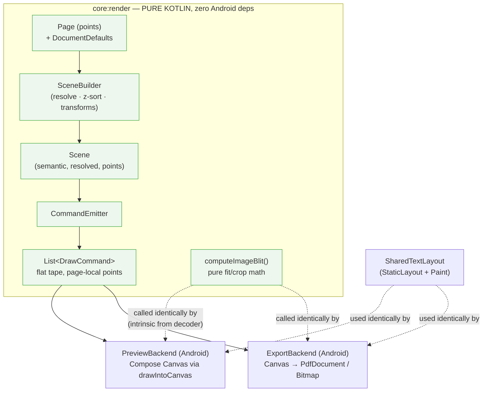
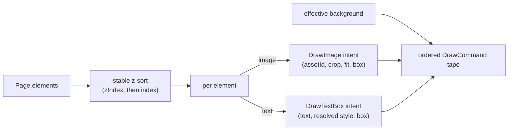
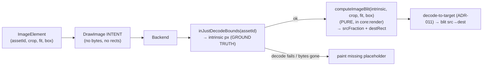
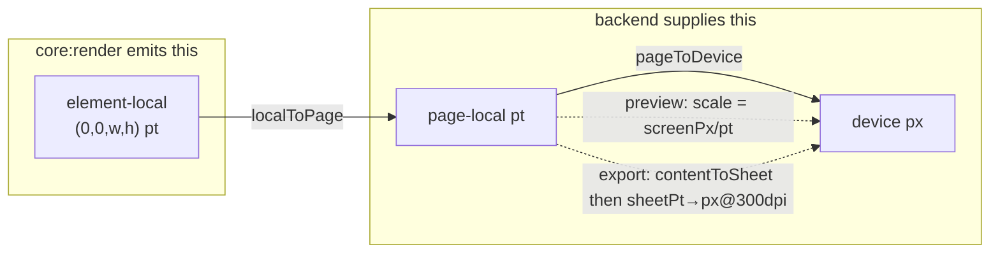

# Spike — `:core:render` (S3): one scene, two backends

> **Status:** ACCEPTED — recorded as [ADR-027](../DECISIONS.md#adr-027); Codex final verdict **GO** (3 review rounds, all reconciled — §11/§11.1/§12). Implementation may begin under TDD. (CLAUDE.md [review workflow](../../CLAUDE.md#review-workflow).)
> **Scope:** design only. Implementation follows after the ADR lands.
> **Owns nothing canonical** — this spike feeds a new ADR; it references [ADR-006](../DECISIONS.md#adr-006) (shared renderer) and does **not** re-decide it.
> **Milestone:** S3 in [ROADMAP](../ROADMAP.md#guiding-sequence); critical-path node per [ARCHITECTURE §15.4](../ARCHITECTURE.md#154-critical-path).

---

## 1. Goal & the one invariant

Introduce `:core:render` — a **pure-Kotlin** function turning a document `Page` into an **ordered, flat list of draw commands** that *both* the editor preview (S4) and the PDF/image export (S5) replay. One code path produces the geometry; two thin platform backends rasterise it. That is what makes **preview == export** true *by construction* rather than by luck ([ADR-006](../DECISIONS.md#adr-006), [ARCHITECTURE §5](../ARCHITECTURE.md#5-rendering-pipeline--one-scene-two-backends), risk #3 in [§12](../ARCHITECTURE.md#12-major-technical-risks)).



The backends and `SharedTextLayout` live **outside** `:core:render` (in a platform module, e.g. `:render-android` or `:data-android`'s render sibling — module placement is a Step-4 detail, not decided here).

---

## 2. The hard boundary (non-negotiable)

`:core:render` depends on **`:core:model` only**. It must not reference, import, or transitively pull: `android.*` (Bitmap/Canvas/Paint/Matrix/StaticLayout), Coil, Room, `AssetStore`, the filesystem, or any byte buffer. Enforced the same way the other `core:*` modules are — the `core-tests` CI gate builds `:core:render` under `ZINELY_CORE_ONLY=true` with no Android SDK; an Android import fails the build.

Two consequences drive the whole design — and **both are handled the same way**: render emits *intent*, a **pure shared helper in `:core:render`** does the math, the backend invokes it with the Android-only input it alone holds.

1. **No pixels, no bytes.** The module never decodes an image. It emits *image intent* keyed by content hash (`assetId, crop, fit, box`); the backend reads the intrinsic pixel size from its own decode (`inJustDecodeBounds`, the ground truth) and calls the pure `computeImageBlit()` (§5).
2. **No text measurement.** `Paint`/`StaticLayout` are Android. The module emits *layout intent* (string + resolved style + box); the backend lays out via the shared `SharedTextLayout` (§6).

Symmetry: **image fit/crop** and **text layout** are the two pieces of geometry that need an Android-only input (decoded size; `Paint` metrics). For both, the *math/intent* is pure and shared; only the Android input is supplied at the backend. That is what makes parity structural rather than disciplinary.

> **Privacy/offline invariant** ([PRD principles](../PRD.md#5-product-principles-non-negotiable)): a pure module with no I/O cannot touch the network. Trivially satisfied.

---

## 3. Scene model — `Page` → `Scene` → commands

Two stages, deliberately split for testability. The **Scene** is still *semantic* (typed, resolved, points); the **command list** is the flat backend tape.

### 3.1 Render unit = one `Page`

Both consumers render **one logical page at a time**:
- **Preview (S4):** the editor shows one page; the backend scales the page rect to the screen.
- **Export (S5):** the imposition places 8 pages on a sheet; the export backend draws each page into its panel via that panel's `contentToSheet` ([ARCHITECTURE §6](../ARCHITECTURE.md#6-export-pipeline)).

The public entry point is page-scoped and **a pure function of `(Page, defaults)` alone** — no asset side-channel, no resolver:

```kotlin
public object SceneRenderer {
    public fun buildScene(page: Page, pageSizePt: PtSize, defaults: DocumentDefaults): Scene
    public fun emit(scene: Scene): List<DrawCommand>
    /** Convenience: buildScene then emit. */
    public fun render(page: Page, pageSizePt: PtSize, defaults: DocumentDefaults): List<DrawCommand> =
        emit(buildScene(page, pageSizePt, defaults))
}

/** PURE fit/crop math, the shared parity contract for images. Lives in :core:render, JVM-tested. */
public data class ImageBlit(val srcFraction: PtRect, val destRect: PtRect)  // srcFraction in 0..1

public fun computeImageBlit(
    intrinsicWidthPx: Int,   // from the backend's own inJustDecodeBounds (ground truth)
    intrinsicHeightPx: Int,
    crop: Crop,
    fit: Fit,
    boxWidthPt: Double,
    boxHeightPt: Double,
): ImageBlit {
    require(intrinsicWidthPx > 0 && intrinsicHeightPx > 0)              // FIT/FILL divide by these
    require(boxWidthPt > 0.0 && boxHeightPt > 0.0 &&
            boxWidthPt.isFinite() && boxHeightPt.isFinite())            // br = w/h must be finite, non-zero
    /* §7.3 */
}
```

`pageSizePt` is the page's *content* size in points (panel-local for export; the same logical size the editor previews). It is supplied by the caller — `:core:render` does not depend on `:core:imposition` ([ARCHITECTURE §15.4](../ARCHITECTURE.md#154-critical-path): "imposition is composed at export").

> **Why no resolver (seam decision A, user-confirmed 2026-06-24).** The intrinsic pixel size is read from the **decoder both backends already run** (`inJustDecodeBounds` for ADR-011 decode-to-target) — the bytes are the single source of truth. Injecting intrinsic size from the `ASSET`/Room *record* instead would create a second source that can drift from the bytes. Render therefore needs no asset metadata at all; it emits image *intent* and the backend resolves geometry via the shared `computeImageBlit()`. See §5 / [§10.1](#10-open-decisions-for-review).

### 3.2 What `buildScene` resolves (the parity-critical work)

Everything order- and geometry-sensitive happens **once**, here, in pure Kotlin:

1. **Effective background** — page background, falling back to `DocumentDefaults.background` when the page is `Background.None`; emit a fill only for `Solid`.
2. **Effective text style** — in the *current* schema, `TextElement.style` is **fully resolved**: every `TextStyle` field is non-optional with a concrete default ([Document.kt](../../core/model/src/main/kotlin/com/aritr/zinely/core/model/Document.kt)), so render cannot distinguish "explicit `sans-serif`" from "inherit". Therefore **render uses `TextElement.style` verbatim** and does *not* fold `DocumentDefaults.textStyle` at draw time — defaults are applied at element-creation (editor, S4). Document-default inheritance at render would require a future model change (optional override fields); out of scope here. `DocumentDefaults.background` still participates (it is genuinely a fallback for `Background.None`, item 1).
3. **z-order** — sort elements by `(zIndex ASC, then page list index ASC)`. The list-index tie-break is the documented, stable rule (two equal `zIndex` keep author order). Emit **back-to-front**.
4. **Element transform** — each element's local→page affine (§7.1).
5. **Image intent** — emit `DrawImage(assetId, crop, fit, box, …)`. The fit/crop *math* is not run here (no intrinsic size at build); it is the pure `computeImageBlit()` the backend invokes with decoder-truth intrinsic (§5). Parity is preserved because there is exactly one such function, in `:core:render`.
6. **Missing assets** are resolved at the backend, not here — render cannot (and should not) detect them: an asset present at build can vanish before draw (TOCTOU), so the backend's decode is the only reliable detector. The backend paints a defined placeholder on decode failure (§5).



---

## 4. Draw-command vocabulary (pure data)

A flat, ordered `List<DrawCommand>`. **Self-contained commands** — each visual command carries its own transform and optional clip — *not* a `push/pop` stack.

> **Why flat, not a save/restore stack?** A push/pop tape has a balancing invariant (every push needs its pop) that is easy to break and annoying to fuzz-test. Self-contained commands are pure values with no ordering invariant beyond paint order; a backend replays each as one `save → concat → clip → draw → restore` quad. The transform and clip *information* the spec calls for is still first-class — it rides on each command as data. (Rejected alternative: `PushTransform`/`PopTransform`/`PushClip`/`PopClip` opcodes — more faithful to a Canvas but adds a stack-balance failure mode for no parity benefit.)

```kotlin
public sealed interface DrawCommand {
    /** Element-local → page-space affine (points → points). identity() for page-level fills. */
    public val localToPage: AffineTransform2D
    /** Clip in this command's LOCAL space, applied after localToPage. null ⇒ no clip. */
    public val localClip: PtRect?
}

/** Solid fill of [rect] (local space). Page background, element background. */
public data class FillRect(
    val rect: PtRect,
    val color: ColorRgba,
    override val localToPage: AffineTransform2D = AffineTransform2D.identity(),
    override val localClip: PtRect? = null,
) : DrawCommand

/**
 * A content-addressed image as INTENT — NO bytes, NO resolved pixel rects.
 * [box] = element-local placement (0,0,w,h). [crop]/[fit] are the model's semantics.
 * The backend decodes [assetId] (inJustDecodeBounds → intrinsic), calls the shared pure
 * computeImageBlit(intrinsic, crop, fit, box) → (srcFraction, destRect), decodes-to-target
 * (ADR-011), and blits. On decode failure it paints the missing-asset placeholder (§5).
 */
public data class DrawImage(
    val assetId: String,
    val crop: Crop,
    val fit: Fit,
    val box: PtRect,                    // element-local points
    override val localToPage: AffineTransform2D,
    override val localClip: PtRect?,    // = box for FILL/cover overflow
) : DrawCommand

/**
 * Text LAYOUT INTENT — not laid-out glyphs. The backend builds a StaticLayout from these fields
 * (§6). [boxWidthPt] is the wrap width; [boxHeightPt] the clip/overflow bound.
 */
public data class DrawTextBox(
    val text: String,
    val style: TextStyle,               // the model's TextStyle, verbatim (§3.2) — family, sizePt, color, align, bold, italic
    val boxWidthPt: Double,
    val boxHeightPt: Double,
    override val localToPage: AffineTransform2D,
    override val localClip: PtRect?,    // = text box; clips overflow identically in both backends
) : DrawCommand
```

`DrawTextBox` carries the model's [`TextStyle`](../../core/model/src/main/kotlin/com/aritr/zinely/core/model/Document.kt) **verbatim** (no separate `ResolvedTextStyle` type and no document-default fold — its fields are non-optional, §3.2). It holds no Android `Typeface` — just the family *name* string; the backend's `SharedTextLayout` maps name → `Typeface`.

> **Shapes:** `Element` today is only `image` / `text` (the sealed interface in `Document.kt`). `FillRect` covers solid backgrounds. A future `ShapeElement` adds `DrawPath`/`DrawShape` commands additively — out of scope for S3, noted so the vocabulary is known-extensible.

---

## 5. Images — the content-hash seam (seam decision A)

The boundary forbids decoding, and fit/crop geometry needs the intrinsic pixel size (aspect ratio). The seam (user-confirmed 2026-06-24, §10.1):

**Render emits image *intent*; the parity-critical fit/crop math is a pure `computeImageBlit()` in `:core:render`; the backend invokes it with the intrinsic size it reads from its own decode.** Bytes never enter `:core:render`; intrinsic size never enters either — the backend already has it.



**Why intrinsic comes from the decoder, not a record/resolver:** the bytes are the single source of truth. Pulling intrinsic from the `ASSET`/Room record ([ARCHITECTURE §4](../ARCHITECTURE.md#4-data-models--storage)) introduces a second source that can drift from the actual decoded bytes; the decoder cannot disagree with itself. The backend runs `inJustDecodeBounds` anyway for decode-to-target (ADR-011), so intrinsic is free exactly when needed.

**Why parity still holds (Codex's original concern):** the fit/crop math is **one pure function in `:core:render`** that *both* backends call — not hand-rolled per backend. Same function + same decoded bytes ⇒ same `(srcFraction, destRect)`. This is the structural guarantee ADR-006 requires; it is verified by Roborazzi (§9.2). (This is why "let each backend compute fit" was rejected, but "one shared pure helper invoked by both" is not — the difference is *shared code*, not *deferred timing*.)

> **Backend contract (two clauses, enforced by §9.2 tests):** (1) both backends MUST resolve image geometry through `computeImageBlit` — never hand-rolled; (2) both MUST decode the **same canonical import-master bytes** (ADR-023) for intrinsic size, *not* a thumbnail/proxy/cache entry — otherwise `inJustDecodeBounds` could report a different intrinsic in preview vs export and silently break parity.

**Fit semantics** (§7.3 for the math, which `computeImageBlit` implements):
- `Fit.FIT` — letterbox: scale to fit inside the box preserving aspect; `destRect` may be inset within the element box; `srcFraction` = the visible crop (default full).
- `Fit.FILL` — cover: `destRect` = full box, `srcFraction` cropped to the box aspect (centered), then intersected with the element `crop`; `localClip` = element box so overflow is clipped identically.

**Missing asset = a defined backend behaviour, not a render command.** Render cannot reliably detect absence (TOCTOU), so it never emits a "missing" variant. The backend paints a defined placeholder (neutral fill + broken-image glyph) on decode failure — aligning with the data layer's "never silently downgrade" stance (handoff §Step 2/3). The placeholder visual is an S4/S5 UX choice.

---

## 6. Text — the shared Android layout path

The single most dangerous parity bug is text ([ADR-006](../DECISIONS.md#adr-006), [R2.2](../RESEARCH.md#r22-androidgraphicspdfpdfdocument--verified)/[R5](../RESEARCH.md#r5-canvas--scene-graph-editor-architecture)). Compose's own text stack and a raw `Canvas.drawText` wrap differently. So:

- `:core:render` emits **`DrawTextBox` intent only** — string, resolved style, wrap width, box height. It performs **zero** measurement.
- A **single** `SharedTextLayout` helper (in the platform module, used by *both* backends) builds the `StaticLayout`.

**Layout happens in canonical POINT space — the canvas matrix does ALL device scaling** (resolves Codex's double-scale risk). The helper builds the `StaticLayout` with `textSize = sizePt` (points-as-pixels, no device scale) and `width = round(boxWidthPt)` points. The backend then draws it under `pageToDevice × localToPage` (§7.1), which scales the already-laid-out text to device pixels. Because wrapping is computed **once, in resolution-independent point units**, preview and export break lines identically regardless of screen density or 300-DPI export scale.

```
StaticLayout from (text,
                   TextPaint(family→Typeface, textSize = sizePt /* point space */, color, bold/italic),
                   width = round(boxWidthPt),          // points; NO ×pointsToPx
                   alignment = align)
// then: canvas.concat(pageToDevice × localToPage); layout.draw(canvas); — matrix does the scaling
```

These `StaticLayout` knobs are **fixed shared constants** in `SharedTextLayout` (not per-call), so the two backends cannot diverge: `includePad`, `breakStrategy`, `hyphenationFrequency`, `lineSpacing(add=0, mult=1)`, `textDirection`, ellipsize/`maxLines` (off — overflow clips to box), and the points→width rounding rule. Typeface (incl. fallback) comes from the fixed bundled-font map ([ADR-010](../DECISIONS.md#adr-010)).

- The **preview** backend draws that `StaticLayout` into Compose via `drawIntoCanvas { layout.draw(it.nativeCanvas) }`.
- The **export** backend draws the *same* `StaticLayout` construction into the `PdfDocument`/`Bitmap` canvas. **It draws text via `StaticLayout.draw(Canvas)`, never rasterised into a bitmap** — preserving ADR-001's true-vector, selectable PDF text.

Identical inputs + identical helper + point-space layout ⇒ identical line breaks, ascent/descent, and glyph positions. The render module guarantees *identical intent*; `SharedTextLayout` guarantees *identical layout*. Roborazzi diffs (§9) prove it.

> **Bundled fonts** ([ADR-010](../DECISIONS.md#adr-010)/[ADR-001](../DECISIONS.md#adr-001)): the family-name → `Typeface` map is fixed and offline, so the same name resolves to the same font file in both backends and across runs.

---

## 7. Transforms, units, z-order, clipping

### 7.1 Coordinate spaces & the points → device chain

`:core:render` works **entirely in page-local points**. The points→device scale is the **backend's** job — render emits none of it.



- **localToPage** (from render): element box placement + rotation (§7.2).
- **pageToDevice** (from backend):
  - *Preview:* uniform scale `screenPx per point` at display density, plus the page's on-screen offset.
  - *Export:* `PanelPlacement.contentToSheet` (points→sheet points, [imposition spike](imposition-engine.md)) **composed with** sheet-points→device-pixels at 300 DPI ([ADR-011](../DECISIONS.md#adr-011)). Using the model's column-vector `AffineTransform2D` (matches `android.graphics.Matrix`), the backend draws each command at `pageToDevice × command.localToPage`.

Because render never multiplies in a device scale, the *same* command list feeds both — the only difference is the matrix the backend pre-concats.

### 7.2 Element transform (the one rotation rule)

`Transform(xPt, yPt, widthPt, heightPt, rotationDegrees)` = clockwise rotation about the **box center** ([Document.kt](../../core/model/src/main/kotlin/com/aritr/zinely/core/model/Document.kt)). Content is authored in element-local space `(0,0)…(w,h)`; localToPage is:

```
localToPage = translate(x, y) × rotateAboutCenter(rotationDegrees, w/2, h/2)
            = T(x+cx, y+cy) × R(deg) × T(-cx, -cy)   with cx=w/2, cy=h/2
```

Built from `AffineTransform2D.translate` / `.rotateDeg` / `.times` already in `:core:model`. (The exact `halfTurnAbout` is an imposition optimisation; element rotation is arbitrary so it uses the general `rotateDeg`.) Emitting the matrix — not `(x,y,deg)` — means the backend "never re-derives rotation", the same contract imposition already adopted for `contentToSheet` ([ImpositionLayout.kt](../../core/imposition/src/main/kotlin/com/aritr/zinely/core/imposition/ImpositionLayout.kt)).

### 7.3 Fit / fill math — `computeImageBlit` (pure)

This is the body of the shared `computeImageBlit()` (§3.1): pure, in `:core:render`, JVM-tested, invoked by both backends. The aspect that matters is the **cropped** source, not the raw image (Codex fix): with crop fractions `cw = crop.right − crop.left`, `ch = crop.bottom − crop.top`, the effective source aspect is `ar = (cw·iw) / (ch·ih)`; box `(w, h)` pt → `br = w/h`:
- **FIT:** if `ar > br` width-bound: `destW=w, destH=w/ar`; else `destH=h, destW=h·ar`; center in box. `srcFraction` = element `crop` (default FULL).
- **FILL:** `destRect` = full box; sample a sub-rect *of the already-cropped region* whose aspect = `br`, centered (shrink the longer axis of the crop rect), then map back into 0..1 image space by offsetting/scaling within `crop`. `localClip` = box.

All in `Double` point/normalised space; the only pixel input is `(iw, ih)` from the backend's decode. Unit-tested against hand-computed oracles on the JVM (the function takes plain ints/doubles — no Android needed to test it).

### 7.4 z-order & clipping

- **z-order:** `(zIndex ASC, list-index ASC)`, emitted back-to-front (painter's algorithm). Documented tie-break = author order.
- **clipping:** page-level — the page is implicitly clipped to `pageSizePt` by the backend (panel clip on export is `clipLocalBounds` from imposition; preview clips to the page rect). Element-level — `localClip` on `DrawImage`(FILL)/`DrawTextBox` clips overflow in element-local space *before* `localToPage`, so a rotated box clips correctly.

---

## 8. What this is NOT (scope guard)

Out of scope for S3 ([per the milestone brief](../ROADMAP.md)): editor UI/MVI (S4), the export pipeline & guides/ruler (S5), the asset pipeline impl (S2B remainder), Room metadata. `:core:render` produces a command list; it does **not** open files, schedule work, or know about panels, sheets, DPI, or the screen. No new network/account/cloud dependency.

---

## 9. Test & exit strategy

The exit bar is explicitly **two-tier** — JVM geometry tests alone do **not** close S3.

### 9.1 Pure-JVM unit tests (`:core:render`, `core-tests` gate)
| Area | What is asserted |
|---|---|
| Scene build | background fold-in (page vs document default); text style used **verbatim** (no doc-default fold — §3.2); empty page |
| z-order | `(zIndex, index)` ordering; equal-zIndex keeps author order; emitted back-to-front |
| Element transform | localToPage corner-mapping (translate; rotate-about-center) vs. hand oracle |
| `computeImageBlit` | FIT letterbox dims; FILL cover src-fraction; crop ∘ fit composition; square/extreme aspects; `require(>0)` guard — all pure-JVM, no Android |
| Commands | one `DrawImage`/`DrawTextBox`/`FillRect` per element + background; field values exact; clip set where required |
| Boundary | (build-level) no Android import; compiles under `ZINELY_CORE_ONLY=true` |

### 9.2 Visual-fidelity proof (backend module, Android — the part JVM can't prove)
- **Roborazzi screenshot diffs** rendering the *same* command list through the preview backend and the export backend, asserting pixel-equivalence (within tolerance) for:
  - **text** — wrapping, alignment, bold/italic, multi-line overflow clip;
  - **image transforms** — FIT, FILL, crop, rotation, z-overlap.
- **Acceptance must pin every non-render variable** so a diff means a real divergence, not test noise (Codex fix): identical output **size**, identical **`pageToDevice`** transform, identical **fonts**, identical **asset bytes**, identical **decode/sampling policy** (share one decode-to-target/blit helper between backends, or accept a small documented bitmap-filter tolerance), and a **deterministic pixel tolerance** (text rounding vs exact). Two harnessed backends drawing the same tape with these pinned ⇒ any delta is a genuine parity bug.
- **Backend clip-order conformance** (unit, in the backend module): assert the replay quad is `save → concat(localToPage) → clip(localClip) → draw → restore` — matters for rotated text/image clips.
- **Shared-helper invocation** (backend module): both backends resolve image geometry via `:core:render`'s `computeImageBlit` (not hand-rolled), and a `DrawImage` whose `assetId` fails to decode paints the defined **missing-asset placeholder** rather than crashing or drawing nothing.
- Golden references committed; a diff fails CI. This is where "preview == export" is *proven*, satisfying [ARCHITECTURE §11](../ARCHITECTURE.md#11-testing-strategy) (Roborazzi) and closing risk #3.

> "Pure-Kotlin" covers the command model only. Fidelity (text layout, parity) is inherently Android and is proven in the backend module via Roborazzi — not asserted away by JVM geometry tests.

---

## 10. Open decisions for review

1. **Asset-metadata seam (load-bearing) — RESOLVED, decision A (user-confirmed 2026-06-24).** Render emits image *intent*; the pure `computeImageBlit()` lives in `:core:render` and is invoked by both backends with intrinsic size from their own decode (ground truth); missing assets handled backend-side. Alternatives rejected: **(B) injected `AssetResolver`** reading the `ASSET`/Room record — creates a second source of truth that can drift from the bytes, plus a metadata side-channel; **(C) intrinsic in the document model** — duplicates the `ASSET` record and puts pixel data in the points/normalized tree. *Note:* Codex's first-round review assumed (B) and endorsed it; the seam was subsequently revised to (A), which is strictly stronger on source-of-truth and keeps the same pure+shared parity guarantee (§5). Re-reviewed by Codex on the delta (see §11).
2. **Two stages vs one** (`buildScene`+`emit` vs a single `render`). Recommended: keep both for test seams; `render` is the convenience composite. Low-stakes.
3. **Module placement of backends + `SharedTextLayout`** — a new `:render-android` vs a folder in `:data-android`. Deferred to Step 4 (implementation); not a boundary question.
4. **Missing-asset visual** — **backend-only** (seam A): render neither detects nor flags absence; the backend paints the placeholder on decode failure. The placeholder visual is a backend/UX choice (defer to S4/S5).

---

## 11. Codex review — reconciliation (2026-06-24)

**Verdict: GO WITH FIXES.** Transform composition (`pageToDevice × localToPage`, element `localToPage = translate × rotateAboutCenter`), z-order, the flat self-contained command model, and the `AssetResolver` seam were all explicitly endorsed. No ADR-001/006/011/012 conflict once fixes land.

| # | Codex finding | Class | Disposition |
|---|---|---|---|
| 1 | `DrawImage` lacked intrinsic metadata (constraint #3) | Required | **SUPERSEDED** — seam revised to A (§5): `DrawImage` carries intent only; intrinsic comes from the backend decoder, not the command. Constraint #3 intentionally softened (intrinsic+missing resolved backend-side). Re-reviewed below. |
| 2 | Text could double-scale; layout space ambiguous | Required | **ACCEPTED** — pinned: layout in **point space**, canvas matrix does all scaling; wrapping resolution-independent (§6) |
| 3 | `TextStyle` fields are non-optional → can't infer inherit | Required | **ACCEPTED** — render uses `TextElement.style` verbatim; no doc-default fold at draw (§3.2) |
| 4 | `ARCHITECTURE.md §2` still says `core.render` has an "Android Canvas backend adapter" | Required | **ACCEPTED** — fixed with the ADR in the same change (§ below) |
| 5 | Roborazzi acceptance underspecified | Required | **ACCEPTED** — pinned size/transform/fonts/bytes/sampling/tolerance + clip-order conformance (§9.2) |
| R | `AssetInfo` divide-by-zero; `StaticLayout` knobs; sampling parity; clip-order test | Recommended | **ACCEPTED** — `require(>0)` guard (§3.1); knobs enumerated as shared constants (§6); sampling/clip pinned (§9.2) |
| — | PDF text must stay `StaticLayout.draw(Canvas)`, not rasterised (ADR-001) | Observation | **ACCEPTED** — stated explicitly (§6) |

### 11.1 Codex round 2 — image seam A delta (2026-06-24)

After the seam was revised to A, Codex re-reviewed the delta. **Verdict: GO WITH FIXES → now reconciled.** Codex agreed A is sound and "stronger than B on metadata correctness" (decoder truth vs drift-prone record), that softening constraint #3 is acceptable (render-side missing was never authoritative — TOCTOU), and that `:core:render` needs no asset metadata for z-order/transforms/clips/hit-testing.

| # | Finding | Class | Disposition |
|---|---|---|---|
| A1 | `computeImageBlit` used raw `iw/ih`; must use **cropped** aspect or FIT/FILL is wrong under crop | Required | **ACCEPTED** — `ar = (cw·iw)/(ch·ih)` (§7.3) |
| A2 | Missing box-dimension guards (`br=w/h` zero/NaN) | Required | **ACCEPTED** — `require(boxW/H > 0 && finite)` (§3.1) |
| A3 | Stale §9 test row ("text style fold-in") | Required | **ACCEPTED** — row now says style verbatim (§9.1) |
| A4 | Backends must decode the same canonical import-master bytes, not thumbnails/proxies | Recommended | **ACCEPTED** — backend contract clause 2 (§5) |

**Result: ADR recorded ([ADR-027](../DECISIONS.md#adr-027)); pure-JVM tier implemented.** No open Required findings.

## 12. Decision record — RECORDED

This design is recorded as **[ADR-027](../DECISIONS.md#adr-027) (Accepted, 2026-06-24)**, referencing [ADR-006](../DECISIONS.md#adr-006) (not re-deciding it). ADR-027 captures: the page-scoped pure entry point; the flat self-contained command vocabulary; **seam A** — intent-only `DrawImage` (no resolver) + backend decoder-truth intrinsic + the shared pure `computeImageBlit`; the point-space shared-text-layout seam; and the two-tier exit bar. Recorded in the same change: [ARCHITECTURE §2](../ARCHITECTURE.md#2-module--package-structure) leak fixed, [§5](../ARCHITECTURE.md#5-rendering-pipeline--one-scene-two-backends) + ADR-027 ref, [§15](../ARCHITECTURE.md#15-subsystem-dependency-map-build-order--critical-path) status ⬜→🚧; [ROADMAP](../ROADMAP.md) change-log row. **Codex final review: GO** (S3 implementation may begin under TDD).
