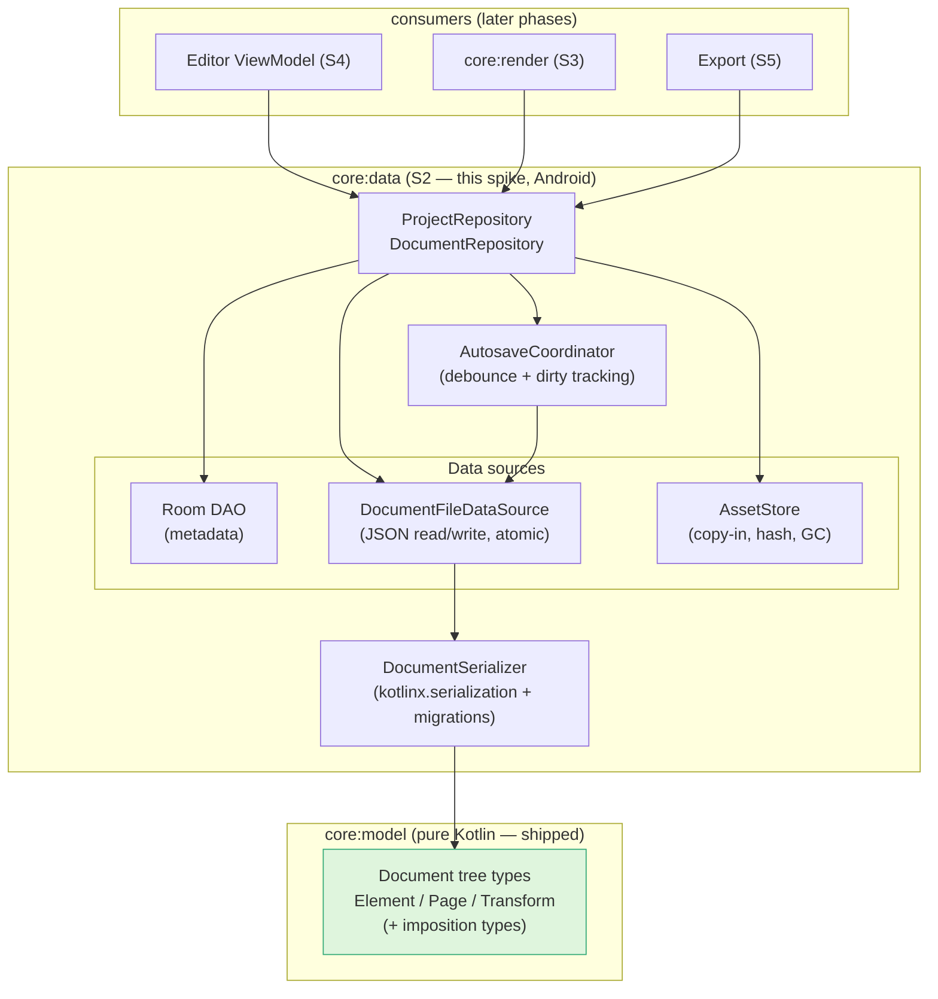
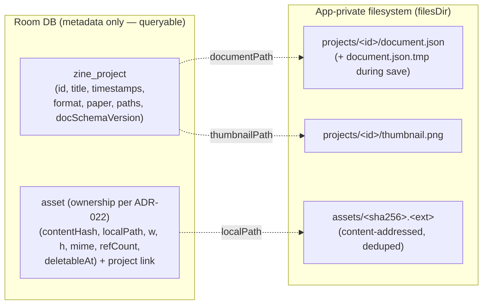
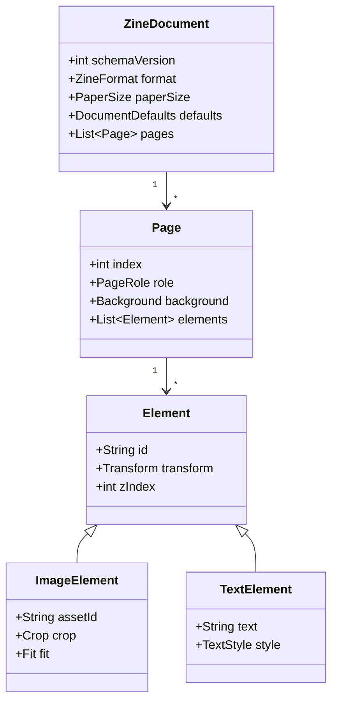
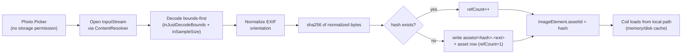
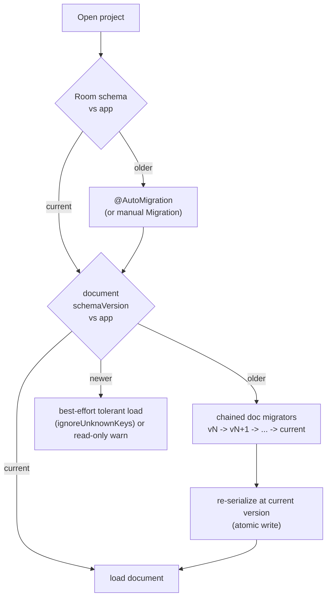

# Spike — Data & Storage Layer (`:core:data`) · S2

> **Implementation-planning design.** Turns the storage decisions ([ADR-003](../DECISIONS.md#adr-003) Room metadata + JSON document, [ADR-004](../DECISIONS.md#adr-004) copy-in images, [ADR-009](../DECISIONS.md#adr-009) autosave + atomic rename + `.zine`) and the logical model in [ARCHITECTURE §4](../ARCHITECTURE.md#4-data-models--storage) into a concrete, testable implementation plan — **before any code is written**, at the same rigor as the [imposition engine spike](imposition-engine.md).
>
> **No implementation code in this doc — types, schemas, strategies, and risks only.** This document does not re-decide anything in the ADRs; it links them and adds the execution detail.

- **Status:** Design (pre-implementation) · 2026-06-19
- **Phase:** S2 in the [roadmap guiding sequence](../ROADMAP.md#guiding-sequence) — the layer that **persists** the document the [imposition engine](imposition-engine.md) and (future) renderer consume.
- **Depends on:** `:core:model` (shipped, [v0.1.0](../DECISIONS.md#adr-007)). **Feeds:** S3 render, S4 editor, S5 export.

---

## 0. Objective & non-goals

**Objective:** define a crash-safe, offline-only persistence layer such that a beginner never loses work, projects open instantly, and the document format can evolve for years without breaking old files.

**In scope (S2)**
- Room database for **queryable project metadata** (list, sort, thumbnails).
- The serialized **zine document** (`kotlinx.serialization` JSON) — schema, versioning, migration.
- **Asset store** for copied-in images (content-addressed, reference-counted, orphan GC).
- **Autosave** (debounced, atomic, recoverable) and crash recovery.
- Repository + data-source interfaces with a sealed `Result<T>` boundary.
- The `.zine` **backup/restore** package format (V1 surface, designed now so the schema is forward-compatible).

**Out of scope (later phases)**
- The editor/ViewModels (S4), the render pipeline (S3), PDF/raster export (S5).
- SAF UI wiring for `.zine` (V1) — only the **package format + serializer** are designed here.
- Cloud/sync/networking — permanently excluded ([PRD principles](../PRD.md#5-product-principles-non-negotiable)).
- KMP storage (🔭 future; influences the format decision in §6 but not the MVP impl).

---

## 1. Architecture review — where S2 fits

S2 implements the **repository pattern** under clean architecture ([ADR-013](../DECISIONS.md#adr-013)): the editor (S4) talks to a `ProjectRepository`/`DocumentRepository`, never to Room, the filesystem, or the serializer directly. All Android-framework contact (Room, `Context`, files, `ContentResolver`) lives in `:core:data`; the document **model** stays pure in `:core:model`.



**Boundary rules**
- `:core:data` depends on `:core:model`; **never the reverse**. `:core:model` gains **zero** Android deps (invariant from [CLAUDE.md](../../CLAUDE.md)).
- Repositories return `Result<T>` (sealed) and map platform exceptions (`IOException`, `SQLiteException`, `SerializationException`) to domain errors at the boundary ([ARCHITECTURE §9](../ARCHITECTURE.md#9-error-handling)). No raw exception leaks past the repository.
- Inject `CoroutineDispatcher`s (IO) — no hard-coded `Dispatchers.IO` ([ARCHITECTURE §10](../ARCHITECTURE.md#10-concurrency)).
- **Open question O1:** is a separate `:core:domain` (use cases + repository interfaces) warranted at MVP, or do repository interfaces live in `:core:data` and graduate later? *Default: interfaces in `:core:data` for MVP; extract `:core:domain` when business logic outgrows repositories.*

---

## 2. Storage model — what lives where, and why

Three tiers, each chosen for what it is good at. The logical model is [ARCHITECTURE §4](../ARCHITECTURE.md#4-data-models--storage); this is the **physical** topology.



| Tier | Holds | Why this tier |
|---|---|---|
| **Room** (`zine_project`, `asset`) | small, **queryable** metadata: list/sort/search, thumbnails, asset bookkeeping & ref-counts | relational queries + `@AutoMigration` + WAL crash-safety ([R4.2](../RESEARCH.md#r42-recommendation--recommendation), [R4.3](../RESEARCH.md#r43-crash-safety--verified)); the document tree is **not** relational, so it doesn't belong here. **Asset ownership** (global content-addressed store + global ref-count/join table **vs** per-project store) is an open decision in [ADR-022](../DECISIONS.md#adr-022) — a per-project `refCount` over a *global* store would be unsafe for shared hashes. |
| **JSON file** per project (`document.json`) | the full **zine document tree** (pages, elements, transforms, styles) | a deep, evolving tree serializes naturally; one atomic file = one atomic save unit; schema versions independently of Room |
| **Asset store** (`assets/<hash>.<ext>`) | copied-in image **bytes** | binary blobs don't belong in SQLite or JSON; content-addressing dedupes and enables ref-counted GC |

**Key invariants**
- `document.json` is the **single source of truth** for content; Room metadata is a **derived cache** (title, updatedAt, schemaVersion) refreshed on save. If they disagree, the document wins; metadata is rebuildable.
- Assets are **immutable & content-addressed** (`sha256` of bytes). The same photo placed twice → one file, `refCount = 2`.
- All paths are **app-private** (`Context.filesDir`); no external storage, no `MediaStore` URIs persisted ([ADR-004](../DECISIONS.md#adr-004)).

---

## 3. Project document schema strategy

The document is a `@Serializable` sealed tree in `:core:model`, serialized with `kotlinx.serialization` JSON. It must be **forward- and backward-tolerant** so a document written by a newer app version is still loadable by an older one (best-effort) and vice-versa.



**Strategy**
- **`schemaVersion` is the first field** and is mandatory; it drives migration (§6). Room mirrors it as `documentSchemaVersion` so we can detect "needs migration" without opening the blob.
- **Sealed `Element` hierarchy** with a `@SerialName` discriminator (`type`), `classDiscriminator = "type"`. New element kinds (SHAPE, V2) are additive.
- **Tolerant decoding:** `ignoreUnknownKeys = true`, every non-essential field `@EncodeDefault`/nullable with a default → older readers skip unknown fields; newer readers fill missing ones ([ARCHITECTURE §4 schema evolution](../ARCHITECTURE.md#4-data-models--storage)).
- **Units = points** (1/72"), never pixels — the same invariant the imposition engine enforces; the renderer maps points→pixels at draw time.
- **Stable enum/string contracts:** `format`, `paperSize`, `role`, convention names — persisted as strings; renames are breaking ([ADR-018](../DECISIONS.md#adr-018) governs convention/guide-id stability). Use explicit `@SerialName` so a Kotlin rename never silently changes the wire value.
- **Decision to make (O2):** lock `kotlinx.serialization` JSON as the format, or design the serializer interface so Protobuf can replace it later if write-amplification hurts (🔭 future). *Default: JSON now, but route all (de)serialization through a single `DocumentSerializer` interface so the format is swappable.*

---

## 4. Autosave strategy

Goal ([ADR-009](../DECISIONS.md#adr-009)): **no lost work, no corrupt files, no main-thread jank.** The hard part is writing a possibly-large JSON file safely while the user keeps editing.

### Save path (atomic, never corrupts the good file)

```mermaid
sequenceDiagram
    participant ED as Editor (S4)
    participant AC as AutosaveCoordinator
    participant DS as DocumentFileDataSource
    participant FS as Filesystem
    participant DB as Room

    ED->>AC: onDocumentChanged(doc)  // every edit
    AC->>AC: markDirty(); debounce ~750ms (reset on each edit)
    Note over AC: also hard-flush on lifecycle STOP / onPause
    AC->>DS: save(doc) on IO dispatcher
    DS->>DS: serialize(doc) -> bytes
    DS->>FS: write document.json.tmp
    DS->>FS: fsync(tmp)              // durability before rename
    DS->>FS: atomic rename tmp -> document.json
    DS->>DB: update updatedAt, schemaVersion (single txn, WAL)
    DS-->>AC: Result.Success
    AC-->>ED: saved state (clean)
```

### Document lifecycle (dirty/clean + recovery)

```mermaid
stateDiagram-v2
    [*] --> Clean
    Clean --> Dirty: edit
    Dirty --> Saving: debounce elapsed / lifecycle stop
    Saving --> Clean: rename + metadata commit ok
    Saving --> Dirty: write failed (retry w/ backoff; keep dirty)
    Dirty --> Recover: process death
    Clean --> Recover: process death
    Recover --> Clean: last good document.json intact (tmp discarded)
    Recover --> Clean: prompt "restore unsaved?" if tmp newer & valid
```



**Rules**
- **Write-temp → fsync → atomic rename** guarantees `document.json` is always either the old good version or the new good version — never a half-written file ([R4.3](../RESEARCH.md#r43-crash-safety--verified)).
- **Debounce ~600ms** (tunable; [ADR-021](../DECISIONS.md#adr-021)) coalesces rapid edits; **force-flush** on `ON_STOP`/`onPause`. ⚠️ The honest loss bound is "since the **last completed save**" — `ON_STOP` is best-effort and does **not** survive a low-memory kill mid-flush. Whether "never lose work" needs a synchronous write-ahead op-log (vs debounce alone) is the open durability contract in [ADR-021](../DECISIONS.md#adr-021).
- **Single-writer:** autosave per project is serialized (a `Mutex`/conflated channel) so two saves never race on the tmp file.
- **Recovery:** on open, if a `.tmp` exists it is a crashed write → discard it (the good file is intact); only surface a "restore unsaved changes" prompt if we additionally keep a small journal indicating in-flight edits.
- **Interaction with MVI undo ([ADR-005](../DECISIONS.md#adr-005)):** autosave persists **document state**, not the undo stack. Undo history is in-memory/session-scoped for MVP; persisting it is 🔭 future. Saving must be decoupled from command application (save reads an immutable snapshot).
- **Thumbnails** are regenerated off-thread on save (debounced separately, lower frequency) to keep the project list fresh without per-keystroke cost.

---

## 5. Asset pipeline strategy

From Photo Picker to a safe, deduped, garbage-collected on-disk asset ([ADR-004](../DECISIONS.md#adr-004), [ADR-011](../DECISIONS.md#adr-011)).



**Strategy**
- **Copy-in, never reference** the picker URI — a referenced URI can be revoked/deleted, breaking the project. Copy bytes into app-private storage immediately ([ADR-004](../DECISIONS.md#adr-004)).
- **Content-addressed** (`sha256`) → automatic dedupe; immutable files are trivially cacheable by Coil.
- **Reference counting** in the `asset` table: placing an image `refCount++`, deleting an element/project `refCount--`.
- **Orphan GC (O4):** assets with `refCount == 0` are deleted by a **WorkManager** sweep (not inline), so deletion is crash-safe and off the hot path. A scrub also reconciles disk vs table (delete files with no row, null rows with no file).
- **Memory discipline:** never decode at full resolution for editing; decode to placement size; one bitmap at a time; recycle ([ADR-011](../DECISIONS.md#adr-011)).
- **Decision to make (O5):** store originals or downsampled-for-edit copies (or both)? Export needs the highest fidelity available (300 DPI), editing needs small. *Default: keep the imported original (bounded by a max edge) as the asset; derive edit/preview bitmaps on demand.*

---

## 6. Migration & versioning strategy

Two **independent** version axes, plus the package version. This separation is the whole point of ADR-003.



| Axis | Mechanism | Trigger | Notes |
|---|---|---|---|
| **Room metadata** | `@AutoMigration` (manual `Migration` for non-trivial) | app launch / first DB open | small table → cheap, well-trodden ([R4.2](../RESEARCH.md#r42-recommendation--recommendation)) |
| **Document JSON** | ordered chain of pure `DocumentMigrator` functions `vN→vN+1`, applied on open, then re-saved atomically at current version | project open when `documentSchemaVersion < current` | migrators are **pure & unit-tested** (golden old→new fixtures), mirroring the imposition test style |
| **`.zine` package** | `manifest.json` with `packageVersion` + embedded `documentSchemaVersion` | import/restore | designed now; SAF wiring is V1 |

**`.zine` package format (designed now, wired in V1):** a zip containing `manifest.json` (package version, app version, project metadata), `document.json`, `assets/`, `thumbnail.png`. Self-contained and portable; restore re-imports assets through the dedupe path (§5).

**Rules**
- **Never mutate a persisted field's meaning** — add a new field + bump `schemaVersion` + write a migrator. Same discipline as "never edit an Accepted ADR in place."
- **Newer-than-app documents:** load tolerantly (drop unknown keys) and, if structurally risky, open **read-only** with a clear message rather than silently dropping data.
- **Convention/guide-id stability** ([ADR-018](../DECISIONS.md#adr-018)) is a *migration* concern: a persisted `format`/convention name must remain resolvable forever or have a migrator.

---

## 7. Risks & mitigations

| # | Risk | Severity | Mitigation |
|---|---|---|---|
| R1 | **File corruption** on crash mid-write | High | write-temp → fsync → atomic rename; the good file is never touched until the new one is complete (§4) |
| R2 | **Room ↔ document drift** (metadata says one thing, blob another) | Med | document is source of truth; metadata is a rebuildable cache; refresh in the same save txn |
| R3 | **Orphaned / leaked assets** filling storage | Med | ref-counting + WorkManager GC + disk/table reconciliation sweep (§5) |
| R4 | **Schema drift breaks old files** | High | dual-axis versioning + tolerant decode + unit-tested migrators with golden fixtures (§6) |
| R5 | **Large document** write-amplification / jank | Med | debounce; off-main IO; measure; Protobuf is the 🔭 escape hatch behind the `DocumentSerializer` interface (O2) |
| R6 | **Autosave races** (concurrent saves, save-during-edit) | Med | per-project single-writer mutex; save operates on an immutable snapshot |
| R7 | **`.zine` restore integrity** (truncated/edited zip) | Med | validate manifest + schema versions + asset hashes on import; reject with a clear error, never partially import |
| R8 | **Data loss on uninstall/device loss** (no cloud) | Med (by design) | user-initiated `.zine` backup (V1); explicit in-app messaging that storage is local-only ([ADR-009](../DECISIONS.md#adr-009)) |
| R9 | **EXIF/orientation bugs** producing rotated images | Low | normalize EXIF at import; covered by the asset-pipeline tests ([ADR-011](../DECISIONS.md#adr-011)) |

---

## 8. Open questions → ADRs (resolved 2026-06-19, Codex-reviewed)

Each S2 open question is now recorded as an ADR with alternatives, tradeoffs, and a recommendation:

| Q | ADR | Status | Outcome |
|---|---|---|---|
| **O1** — `:core:domain` now or later? | [ADR-019](../DECISIONS.md#adr-019) | ✅ Accepted | No `:core:domain` for MVP; extract on cross-ViewModel duplication. |
| **O2** — serialization format lock-in | [ADR-020](../DECISIONS.md#adr-020) | ✅ Accepted | kotlinx JSON behind `DocumentSerializer`; migrators on canonical versions. |
| **O3** — autosave timing & durability | [ADR-021](../DECISIONS.md#adr-021) | ⏳ Proposed | Debounce+flush policy set; durability contract (op-log?) open before Accept. |
| **O4** — asset GC & ownership | [ADR-022](../DECISIONS.md#adr-022) | ⏳ Proposed | Ref-count + deferred undo-safe sweep; ownership model (global vs per-project) open. |
| **O5** — asset fidelity | [ADR-023](../DECISIONS.md#adr-023) | ⏳ Proposed | Cap-and-derive approach; measured cap + "import master" naming open. |

Also intersecting S2: [ADR-015](../DECISIONS.md#adr-015) (validation result) and [ADR-018](../DECISIONS.md#adr-018) (convention/id versioning).

> **Implementation gate:** ADR-021, ADR-022, ADR-023 must reach **Accepted** (their open contracts resolved + Codex-reviewed) before the corresponding S2 code is written. ADR-019/020 are settled.

---

## 9. Test strategy (test-first, mirroring S1)

- **Pure-JVM unit tests** for the `DocumentSerializer` and every `DocumentMigrator` (golden old→new JSON fixtures; round-trip stability) — no Android needed, like the imposition core.
- **Room** instrumented/Robolectric tests for DAOs and `@AutoMigration` (each migration has a fixture DB).
- **Repository tests** with fake data sources: save→reopen fidelity, crash-recovery (simulate leftover `.tmp`), ref-count transitions, error→`Result` mapping.
- **Atomic-write test:** inject a failure between tmp-write and rename; assert the prior good file survives.
- **`.zine` round-trip:** export→import equality; reject tampered manifest/hash.
- **Property tests (jqwik):** arbitrary documents survive serialize→deserialize→serialize unchanged; migrators are idempotent at the target version.

---

## 10. Pre-implementation review checklist

- [ ] Module boundaries: `:core:data → :core:model`, model stays Android-free.
- [ ] `Result<T>` boundary: no platform exception escapes a repository.
- [ ] Atomic-save contract specified and testable (tmp→fsync→rename).
- [ ] Dual-axis versioning + a written migrator-per-bump policy.
- [ ] Asset ref-counting + GC + disk/table reconciliation defined.
- [ ] `.zine` package format frozen enough to be forward-compatible.
- [ ] Serializer behind an interface (format swappability).
- [ ] Dispatchers injected; autosave single-writer; off-main IO.
- [ ] Open questions O1–O5 routed to ADRs with Codex review **before** coding.
- [ ] No networking, no cloud, no external-storage URIs persisted.

---

*This document defines S2 to the depth the [imposition engine](imposition-engine.md) was defined before implementation. Implementation does not begin until the open decisions are recorded as ADRs and Codex-reviewed.*
