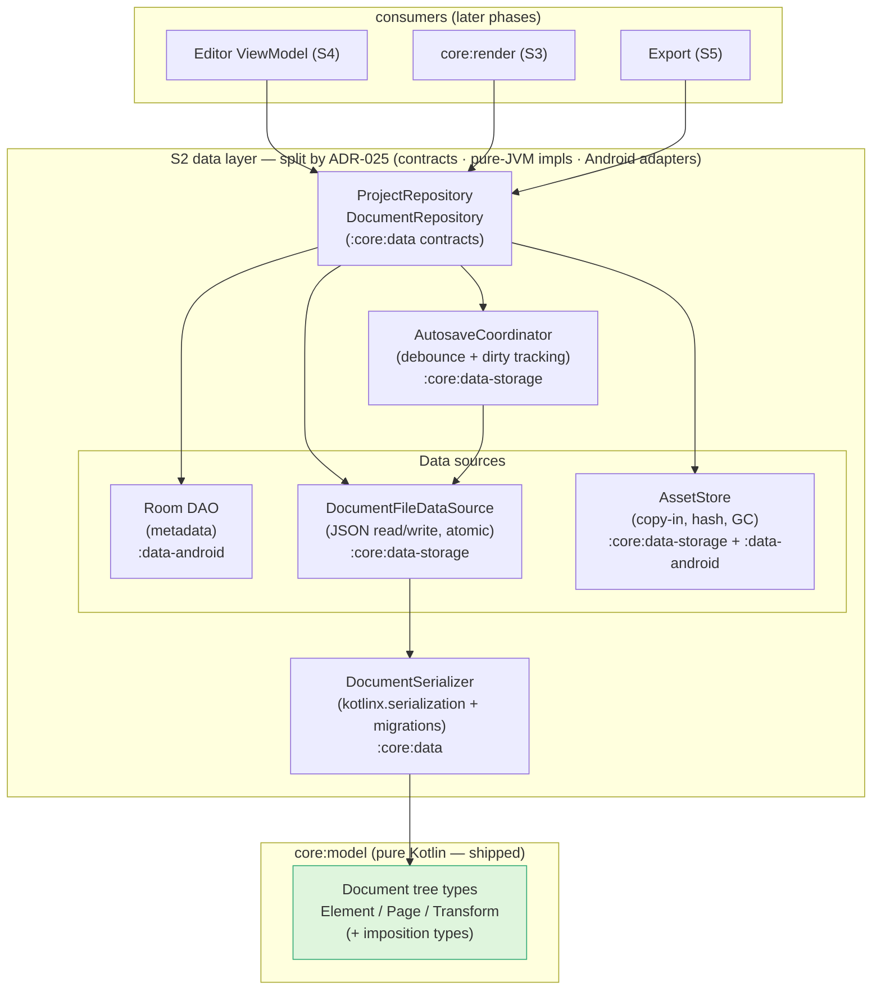
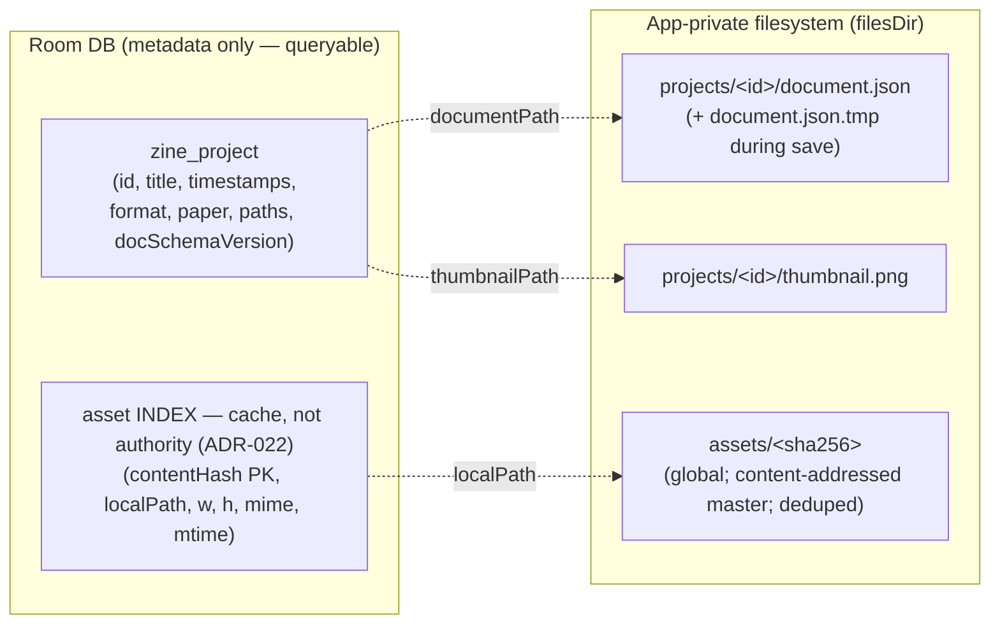
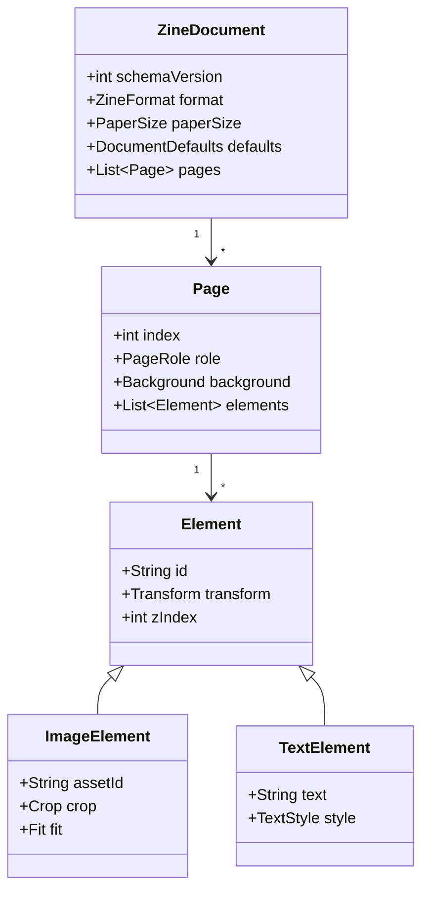
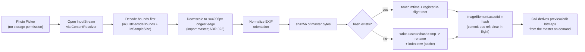
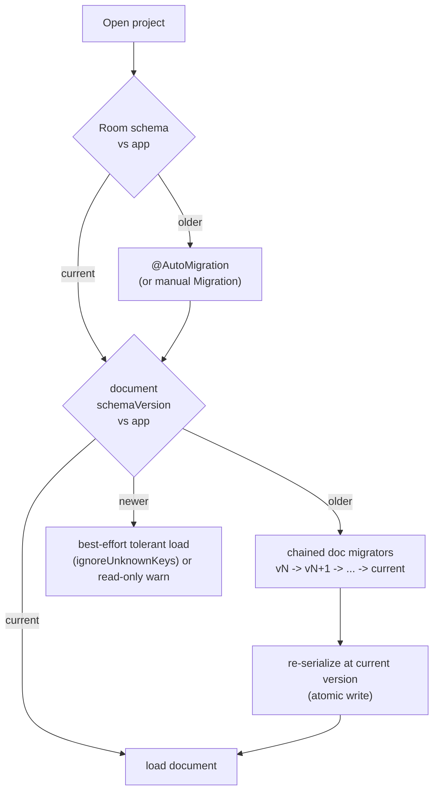

# Spike — Data & Storage Layer (`:core:data`) · S2

> **Implementation-planning design.** Turns the storage decisions ([ADR-003](../DECISIONS.md#adr-003) Room metadata + JSON document, [ADR-004](../DECISIONS.md#adr-004) copy-in images, [ADR-009](../DECISIONS.md#adr-009) autosave + atomic rename + `.zine`) and the logical model in [ARCHITECTURE §4](../ARCHITECTURE.md#4-data-models--storage) into a concrete, testable implementation plan — **before any code is written**, at the same rigor as the [imposition engine spike](imposition-engine.md).
>
> **No implementation code in this doc — types, schemas, strategies, and risks only.** This document does not re-decide anything in the ADRs; it links them and adds the execution detail.

- **Status:** Design (pre-implementation) · 2026-06-19
- **Phase:** S2 in the [roadmap guiding sequence](../ROADMAP.md#guiding-sequence) — the layer that **persists** the document the [imposition engine](imposition-engine.md) and (future) renderer consume.
- **Depends on:** `:core:model` (shipped, [v0.1.0](../DECISIONS.md#adr-007)). **Feeds:** S3 render, S4 editor, S5 export.

---

## 0. Objective & non-goals

**Objective:** define a crash-safe, offline-only persistence layer such that a beginner never loses work, projects open instantly, and the document format can evolve for years without breaking old files.

**In scope (S2)**
- Room database for **queryable project metadata** (list, sort, thumbnails).
- The serialized **zine document** (`kotlinx.serialization` JSON) — schema, versioning, migration.
- **Asset store** for copied-in images (global, content-addressed import masters; mark-and-sweep GC — [ADR-022](../DECISIONS.md#adr-022)/[ADR-023](../DECISIONS.md#adr-023)).
- **Autosave** (debounced, atomic, recoverable) and crash recovery.
- Repository + data-source interfaces with a sealed `Result<T>` boundary.
- The `.zine` **backup/restore** package format (V1 surface, designed now so the schema is forward-compatible).

**Out of scope (later phases)**
- The editor/ViewModels (S4), the render pipeline (S3), PDF/raster export (S5).
- SAF UI wiring for `.zine` (V1) — only the **package format + serializer** are designed here.
- Cloud/sync/networking — permanently excluded ([PRD principles](../PRD.md#5-product-principles-non-negotiable)).
- KMP storage (🔭 future; influences the format decision in §6 but not the MVP impl).

---

## 1. Architecture review — where S2 fits

S2 implements the **repository pattern** under clean architecture ([ADR-013](../DECISIONS.md#adr-013)): the editor (S4) talks to a `ProjectRepository`/`DocumentRepository`, never to Room, the filesystem, or the serializer directly. All Android-framework contact (Room, `Context`, files, `ContentResolver`) lives in `:core:data`; the document **model** stays pure in `:core:model`.



**Boundary rules**
- **Post-[ADR-025](../DECISIONS.md#adr-025) layering (this spike predates the split):** the single `:core:data` box above is now three layers — `:core:data` (pure-Kotlin *contracts*), `:core:data-storage` (pure-JVM atomic file source / autosave / asset byte-store / mark-and-sweep GC, java.nio only, CI-tested now), and `:data-android` (Room / WorkManager / Bitmap-EXIF / SAF adapters, deferred until Android-SDK CI). Node tags in the diagram show where each lands.
- `:core:data` depends on `:core:model`; **never the reverse**. `:core:model` gains **zero** Android deps (invariant from [CLAUDE.md](../../CLAUDE.md)).
- Repositories return `Result<T>` (sealed) and map platform exceptions (`IOException`, `SQLiteException`, `SerializationException`) to domain errors at the boundary ([ARCHITECTURE §9](../ARCHITECTURE.md#9-error-handling)). No raw exception leaks past the repository.
- Inject `CoroutineDispatcher`s (IO) — no hard-coded `Dispatchers.IO` ([ARCHITECTURE §10](../ARCHITECTURE.md#10-concurrency)).
- **Open question O1:** is a separate `:core:domain` (use cases + repository interfaces) warranted at MVP, or do repository interfaces live in `:core:data` and graduate later? *Default: interfaces in `:core:data` for MVP; extract `:core:domain` when business logic outgrows repositories.*

---

## 2. Storage model — what lives where, and why

Three tiers, each chosen for what it is good at. The logical model is [ARCHITECTURE §4](../ARCHITECTURE.md#4-data-models--storage); this is the **physical** topology.



| Tier | Holds | Why this tier |
|---|---|---|
| **Room** (`zine_project`, `asset`) | small, **queryable** metadata: list/sort/search, thumbnails, an asset **index** (cache) | relational queries + `@AutoMigration` + WAL crash-safety ([R4.2](../RESEARCH.md#r42-recommendation--recommendation), [R4.3](../RESEARCH.md#r43-crash-safety--verified)); the document tree is **not** relational, so it doesn't belong here. **Asset ownership is decided** ([ADR-022](../DECISIONS.md#adr-022), Accepted): a **global** content-addressed store with **mark-and-sweep** liveness from document roots — *not* a per-project or ref-counted table, which would be unsafe for shared hashes. The `asset` row is a derived index, never the deletion authority. |
| **JSON file** per project (`document.json`) | the full **zine document tree** (pages, elements, transforms, styles) | a deep, evolving tree serializes naturally; one atomic file = one atomic save unit; schema versions independently of Room |
| **Asset store** (`assets/<sha256>`) | copied-in image **master bytes** | binary blobs don't belong in SQLite or JSON; content-addressing dedupes; liveness is by mark-and-sweep over document roots ([ADR-022](../DECISIONS.md#adr-022)) |

**Key invariants**
- `document.json` is the **single source of truth** for content; Room metadata is a **derived cache** (title, updatedAt, schemaVersion) refreshed on save. If they disagree, the document wins; metadata is rebuildable.
- Assets are **immutable & content-addressed** (`sha256` of the master bytes). The same photo placed twice → **one file**, kept live as long as any document or undo stack references its hash (mark-and-sweep, [ADR-022](../DECISIONS.md#adr-022)).
- All paths are **app-private** (`Context.filesDir`); no external storage, no `MediaStore` URIs persisted ([ADR-004](../DECISIONS.md#adr-004)).

---

## 3. Project document schema strategy

The document is a `@Serializable` sealed tree in `:core:model`, serialized with `kotlinx.serialization` JSON. It must be **forward- and backward-tolerant** so a document written by a newer app version is still loadable by an older one (best-effort) and vice-versa.



**Strategy**
- **`schemaVersion` is the first field** and is mandatory; it drives migration (§6). Room mirrors it as `documentSchemaVersion` so we can detect "needs migration" without opening the blob.
- **Sealed `Element` hierarchy** with a `@SerialName` discriminator (`type`), `classDiscriminator = "type"`. New element kinds (SHAPE, V2) are additive.
- **Tolerant decoding:** `ignoreUnknownKeys = true`, every non-essential field `@EncodeDefault`/nullable with a default → older readers skip unknown fields; newer readers fill missing ones ([ARCHITECTURE §4 schema evolution](../ARCHITECTURE.md#4-data-models--storage)).
- **Units = points** (1/72"), never pixels — the same invariant the imposition engine enforces; the renderer maps points→pixels at draw time.
- **Stable enum/string contracts:** `format`, `paperSize`, `role`, convention names — persisted as strings; renames are breaking ([ADR-018](../DECISIONS.md#adr-018) governs convention/guide-id stability). Use explicit `@SerialName` so a Kotlin rename never silently changes the wire value.
- **Decision to make (O2):** lock `kotlinx.serialization` JSON as the format, or design the serializer interface so Protobuf can replace it later if write-amplification hurts (🔭 future). *Default: JSON now, but route all (de)serialization through a single `DocumentSerializer` interface so the format is swappable.*

---

## 4. Autosave strategy

Goal ([ADR-009](../DECISIONS.md#adr-009)): **no lost work, no corrupt files, no main-thread jank.** The hard part is writing a possibly-large JSON file safely while the user keeps editing.

### Save path (atomic, never corrupts the good file)

```mermaid
sequenceDiagram
    participant ED as Editor (S4)
    participant AC as AutosaveCoordinator
    participant DS as DocumentFileDataSource
    participant FS as Filesystem
    participant DB as Room

    ED->>AC: onDocumentChanged(doc)  // every edit
    AC->>AC: markDirty(); debounce ~1s (reset per edit; 5s max-latency cap)
    Note over AC: synchronous flush on ON_STOP / editor-exit (awaits in-flight save)
    AC->>DS: save(immutable snapshot) on IO dispatcher
    DS->>DS: serialize(doc) -> bytes
    DS->>FS: write document.json.tmp
    DS->>FS: fsync(tmp)                       // data durable before rename
    DS->>FS: keep prior good as document.json.bak
    DS->>FS: atomic rename tmp -> document.json
    DS->>FS: best-effort dir fsync            // make the rename durable
    DS->>DB: update updatedAt, schemaVersion (single txn, WAL)
    DS-->>AC: Result.Success
    AC-->>ED: saved state (clean)
```

### Document lifecycle (dirty/clean + recovery)

```mermaid
stateDiagram-v2
    [*] --> Clean
    Clean --> Dirty: edit
    Dirty --> Saving: debounce elapsed / lifecycle stop
    Saving --> Clean: rename + metadata commit ok
    Saving --> Dirty: write failed (retry w/ backoff; keep dirty)
    Dirty --> Recover: process death
    Clean --> Recover: process death
    Recover --> Clean: last good document.json intact (tmp discarded)
    Recover --> Clean: prompt "restore unsaved?" if tmp newer & valid
```



**Rules**
- **Write-temp → fsync → atomic rename** guarantees `document.json` is always either the old good version or the new good version — never a half-written file ([R4.3](../RESEARCH.md#r43-crash-safety--verified)).
- **Resolved contract ([ADR-021](../DECISIONS.md#adr-021), Accepted):** debounce **~1 s** (reset per edit) with a **5 s max-latency cap**; a **synchronous flush on `ON_STOP`/editor-exit** that awaits the in-flight save; keep one prior-good **`document.json.bak`**; **no op-log in the MVP.** Honest loss bound = "since the **last completed save**" (≈0 on clean exit). `ON_STOP` is best-effort and does **not** survive a low-memory kill mid-flush, so a crash in the un-saved window loses ≤ ~5 s — the accepted bound. [ADR-009](../DECISIONS.md#adr-009)'s "no lost work" = no loss of *committed* work + bounded in-flight loss.
- **Single-writer:** autosave per project is serialized (a `Mutex`/conflated channel) so two saves never race on the tmp file; each save reads an **immutable snapshot** decoupled from MVI command application.
- **Recovery:** on open, if `document.json` is missing/corrupt (interrupted rename / power loss), fall back to **`document.json.bak`**; a stray `.tmp` is a crashed write and is discarded (the good file or `.bak` is intact). A "restore unsaved changes" prompt would require the deferred op-log, which the MVP does not ship.
- **Interaction with MVI undo ([ADR-005](../DECISIONS.md#adr-005)):** autosave persists **document state**, not the undo stack. Undo history is in-memory/session-scoped for MVP; persisting it is 🔭 future. Saving must be decoupled from command application (save reads an immutable snapshot).
- **Thumbnails** are regenerated off-thread on save (debounced separately, lower frequency) to keep the project list fresh without per-keystroke cost.

---

## 5. Asset pipeline strategy

From Photo Picker to a safe, deduped, garbage-collected on-disk asset ([ADR-004](../DECISIONS.md#adr-004), [ADR-011](../DECISIONS.md#adr-011)).



**Strategy**
- **Copy-in, never reference** the picker URI — a referenced URI can be revoked/deleted, breaking the project. Copy bytes into app-private storage immediately ([ADR-004](../DECISIONS.md#adr-004)).
- **Import master ([ADR-023](../DECISIONS.md#adr-023), Accepted):** the stored bytes are a **4096 px-longest-edge master** (EXIF-normalised), not the camera original, which is **discarded**. The full sheet at 300 DPI needs ≤3508 px, so 4096 covers every print path with crop headroom; edit/preview/export bitmaps are derived on demand.
- **Content-addressed** (`sha256` of the **master** bytes) → automatic dedupe; immutable files are trivially cacheable.
- **Ownership & GC ([ADR-022](../DECISIONS.md#adr-022), Accepted):** one **global** `assets/<sha256>` store; liveness by **mark-and-sweep** over (all project documents' hashes) ∪ (live undo stacks) ∪ (in-flight imports), run by a deferred **WorkManager** sweep that deletes only orphans older than a **≥24 h grace window**, under a store mutex with an at-unlink mtime re-check. The Room `asset` table is a **cache/index, not the deletion authority** — only the documents are. **No reference counting** (it desyncs and can delete live bytes); a refcount may be added later only as a fast-path hint.
- **Reconciliation:** the sweep reconciles `assets/` against the document-derived live set; disk-vs-documents wins over the Room index, so a corrupt index can never delete a live blob.
- **Memory discipline:** never decode at full resolution for editing; decode to placement size; one bitmap at a time; recycle ([ADR-011](../DECISIONS.md#adr-011)).
- **Decision to make (O5):** store originals or downsampled-for-edit copies (or both)? Export needs the highest fidelity available (300 DPI), editing needs small. *Default: keep the imported original (bounded by a max edge) as the asset; derive edit/preview bitmaps on demand.*

---

## 6. Migration & versioning strategy

Two **independent** version axes, plus the package version. This separation is the whole point of ADR-003.



| Axis | Mechanism | Trigger | Notes |
|---|---|---|---|
| **Room metadata** | `@AutoMigration` (manual `Migration` for non-trivial) | app launch / first DB open | small table → cheap, well-trodden ([R4.2](../RESEARCH.md#r42-recommendation--recommendation)) |
| **Document JSON** | ordered chain of pure `DocumentMigrator` functions `vN→vN+1`, applied on open, then re-saved atomically at current version | project open when `documentSchemaVersion < current` | migrators are **pure & unit-tested** (golden old→new fixtures), mirroring the imposition test style |
| **`.zine` package** | `manifest.json` with `packageVersion` + embedded `documentSchemaVersion` | import/restore | designed now; SAF wiring is V1 |

**`.zine` package format (designed now, wired in V1):** a zip containing `manifest.json` (package version, app version, project metadata), `document.json`, `assets/`, `thumbnail.png`. Self-contained and portable; restore re-imports assets through the dedupe path (§5).

**Rules**
- **Never mutate a persisted field's meaning** — add a new field + bump `schemaVersion` + write a migrator. Same discipline as "never edit an Accepted ADR in place."
- **Newer-than-app documents:** the MVP **refuses** them (`NewerSchemaVersionException`) — a tolerant decode followed by a save would silently downgrade newer-only data ([ADR-021] durability). Read-only "open anyway" is a future enhancement that needs S4 UI to honour it (see §11).
- **Convention/guide-id stability** ([ADR-018](../DECISIONS.md#adr-018)) is a *migration* concern: a persisted `format`/convention name must remain resolvable forever or have a migrator.

---

## 7. Risks & mitigations

| # | Risk | Severity | Mitigation |
|---|---|---|---|
| R1 | **File corruption** on crash mid-write | High | write-temp → fsync → atomic rename; the good file is never touched until the new one is complete (§4) |
| R2 | **Room ↔ document drift** (metadata says one thing, blob another) | Med | document is source of truth; metadata is a rebuildable cache; refresh in the same save txn |
| R3 | **Orphaned / leaked assets** filling storage | Med | **mark-and-sweep** GC over (documents ∪ undo ∪ in-flight-import) roots + ≥24 h grace + disk/table reconciliation, under a store mutex with an at-unlink mtime re-check ([ADR-022](../DECISIONS.md#adr-022), §5). **Ref-counting was rejected** (desyncs, can delete live bytes). |
| R4 | **Schema drift breaks old files** | High | dual-axis versioning + tolerant decode + unit-tested migrators with golden fixtures (§6) |
| R5 | **Large document** write-amplification / jank | Med | debounce; off-main IO; measure; Protobuf is the 🔭 escape hatch behind the `DocumentSerializer` interface (O2) |
| R6 | **Autosave races** (concurrent saves, save-during-edit) | Med | per-project single-writer mutex; save operates on an immutable snapshot |
| R7 | **`.zine` restore integrity** (truncated/edited zip) | Med | validate manifest + schema versions + asset hashes on import; reject with a clear error, never partially import |
| R8 | **Data loss on uninstall/device loss** (no cloud) | Med (by design) | user-initiated `.zine` backup (V1); explicit in-app messaging that storage is local-only ([ADR-009](../DECISIONS.md#adr-009)) |
| R9 | **EXIF/orientation bugs** producing rotated images | Low | normalize EXIF at import; covered by the asset-pipeline tests ([ADR-011](../DECISIONS.md#adr-011)) |

---

## 8. Open questions → ADRs (resolved 2026-06-19, Codex-reviewed)

Each S2 open question is now recorded as an ADR with alternatives, tradeoffs, and a recommendation:

| Q | ADR | Status | Outcome |
|---|---|---|---|
| **O1** — `:core:domain` now or later? | [ADR-019](../DECISIONS.md#adr-019) | ✅ Accepted | No `:core:domain` for MVP; extract on cross-ViewModel duplication. |
| **O2** — serialization format lock-in | [ADR-020](../DECISIONS.md#adr-020) | ✅ Accepted | kotlinx JSON behind `DocumentSerializer`; migrators on canonical versions. |
| **O3** — autosave timing & durability | [ADR-021](../DECISIONS.md#adr-021) | ✅ Accepted | Single-writer debounced atomic save (temp→fsync→rename→dir-fsync) + `.bak` + synchronous `ON_STOP` flush; **no op-log** (MVP); loss bound = since last completed save. |
| **O4** — asset GC & ownership | [ADR-022](../DECISIONS.md#adr-022) | ✅ Accepted | **Global** content-addressed store + **mark-and-sweep** from document/undo/in-flight roots + ≥24 h grace; Room index is a cache; refcount rejected. |
| **O5** — asset fidelity | [ADR-023](../DECISIONS.md#adr-023) | ✅ Accepted | One **4096 px import master**, EXIF-normalised, camera original discarded; derive edit/preview/export on demand. |

Also intersecting S2: [ADR-015](../DECISIONS.md#adr-015) (validation result) and [ADR-018](../DECISIONS.md#adr-018) (convention/id versioning).

> **Implementation gate — CLEARED (2026-06-19):** ADR-019…023 are all **Accepted** (Codex-reviewed; 021 and 022 each took a second pass to close a durability/GC-race blocker). The data & asset foundations are decision-complete; **S2 implementation is unblocked.**

---

## 9. Test strategy (test-first, mirroring S1)

- **Pure-JVM unit tests** for the `DocumentSerializer` and every `DocumentMigrator` (golden old→new JSON fixtures; round-trip stability) — no Android needed, like the imposition core.
- **Room** instrumented/Robolectric tests for DAOs and `@AutoMigration` (each migration has a fixture DB).
- **Repository tests** with fake data sources: save→reopen fidelity, crash-recovery (simulate leftover `.tmp`), GC liveness transitions (mark-and-sweep, **not** ref-count — [ADR-022](../DECISIONS.md#adr-022)), error→`Result` mapping.
- **Atomic-write test:** inject a failure between tmp-write and rename; assert the prior good file survives.
- **`.zine` round-trip:** export→import equality; reject tampered manifest/hash; **byte-level integrity** — each blob's bytes hash to its `AssetEntry.hash` and match `byteCount` (the check the pure `ZinePackageManifestValidator` defers to restore).
- **Property tests (jqwik):** arbitrary documents survive serialize→deserialize→serialize unchanged; migrators are idempotent at the target version.

### 9.1 Mandatory S2B tests — asset GC race closure ([ADR-022](../DECISIONS.md#adr-022) + its 2026-06-20 amendment)

These guard the import↔sweep race the `AssetStore` KDoc names; all live in pure-JVM `:core:data-storage` ([ADR-025](../DECISIONS.md#adr-025)) and run on `java.nio` temp dirs. **The race-closure anchor is explicit pins + a generation counter, NOT mtime** (the [ADR-022 amendment](../DECISIONS.md#adr-022) demoted mtime to a secondary guard after Codex flagged coarse-granularity / tick-collapse / process-death holes). S2B must ship **all** of these green before the GC sweep is enabled:

**Primary closure (pins + generation + document roots):**

1. **In-flight import pin treated as live** — a hash with a pin file (`assets/.pins/<sha256>`) is live to a sweep that runs mid-import, even with no document reference yet; the pin is created *before* bytes are written and removed only *after* the document reference durably commits.
2. **Pin survives process death** — a pin written, then process restart simulated (drop in-memory state, reopen store), is still honoured by the next sweep until it commits or its TTL lapses — proving the registry is persistent, not in-memory.
3. **Generation counter aborts a revived unlink** — the sweep snapshots a per-hash generation at mark time; a concurrent `store()`/pin bumps it; the sweep, finding the generation advanced at unlink time, **aborts the delete** — independent of clock resolution.
4. **Store mutex shared by writes and unlink** — a write and the sweep's unlink cannot interleave; the sweep blocks while a write to the same hash is in flight (and vice-versa).
5. **Index never authorises deletion of live bytes** — a corrupt/stale `asset` index row does **not** cause deletion of a blob still referenced by any document/undo/pin root; liveness is decided by the document-derived set + pins, not the index (disk-vs-documents wins).

**Secondary guard + robustness (per the Codex amendment review):**

6. **mtime grace window is belt-and-suspenders only** — a freshly stored blob younger than the grace window is never swept even if (hypothetically) unpinned; assert the sweep treats mtime as a *conservative extra* guard and never as the sole liveness signal.
7. **Coarse mtime resolution does not break closure** — simulate whole-second (or collapsed-tick) mtime granularity where touch+sweep land in one tick; closure must still hold because it rests on pins/generation, not mtime ordering.
8. **Sweep after process death** — store + pin, simulate death, restart, run sweep: pinned/rooted bytes survive; only genuinely orphaned, unpinned, past-grace bytes are reclaimed.
9. **Same-hash concurrent store + sweep** — interleave a `store()` of hash H with a sweep targeting H; the blob is never left half-written and never wrongly deleted (temp→rename write + mutex).

> **Multi-process is a non-goal (MVP):** the store mutex is process-local; the app is single-process. Pins/generation are the cross-*restart* guard. A test asserts the documented single-process assumption (e.g. the lock strategy is process-local) so the boundary is explicit, not silent.

---

## 10. Pre-implementation review checklist

- [x] Module boundaries: `:core:data → :core:model`, model stays Android-free.
- [x] `Result<T>` boundary: no platform exception escapes a repository *(contract: `DataResult`/`DataError`; mapping lands with the S2B impls)*.
- [ ] Atomic-save contract specified and testable (tmp→fsync→rename) *(S2B — file data source)*.
- [x] Dual-axis versioning + a written migrator-per-bump policy.
- [x] Asset **mark-and-sweep** GC + disk/table reconciliation defined ([ADR-022]; sweep impl is S2B).
- [x] `.zine` package format frozen enough to be forward-compatible *(manifest + validator built; SAF wiring V1)*.
- [x] Serializer behind an interface (format swappability) *(+ explicit `_encoding` marker)*.
- [ ] Dispatchers injected; autosave single-writer; off-main IO *(S2B — autosave coordinator)*.
- [x] Open questions O1–O5 routed to ADRs with Codex review **before** coding.
- [x] No networking, no cloud, no external-storage URIs persisted.

---

## 11. Implementation status — S2A pure-Kotlin data core (2026-06-19)

**Built (TDD, Codex-reviewed, all green):** the Android-free half of `:core:data`.

| Deliverable | Where | Notes |
|---|---|---|
| Versioned `@Serializable` document schema | `:core:model` (`Document.kt`, enums) | `CURRENT_SCHEMA_VERSION = 1`; explicit `@SerialName` wire names; `type` discriminator |
| `DocumentSerializer` + JSON impl | `:core:data.serialization` | tolerant decode, `_encoding` format marker, serializer owns format/version detection |
| Migration framework | same | **internal** JSON-tree migrators, contiguous chain, **refuses newer** documents ([ADR-020] amendment) |
| Validation framework | `:core:data.validation` | `DocumentValidator` + structured `ValidationResult` (ERROR/WARNING, coded, `path`) — realises [ADR-015] |
| Repository + result contracts | `:core:data.repository` | `DataResult`/`DataError`, `DocumentRepository`/`ProjectRepository`, `ProjectSummary` ([ADR-019]) |
| Asset + manifest contracts | `:core:data.asset` | `ContentHash`/`ContentHasher`, `AssetStore` (no delete — GC owns it), `.zine` manifest + restore validator |

**Deferred to S2B (Android):** Room DAO + `@AutoMigration`; the atomic-write file data source (tmp→fsync→rename→dir-fsync + `.bak`/recovery, [ADR-021]); the autosave coordinator (debounce + single-writer); the `AssetStore` impl + EXIF/4096 px downscale ([ADR-023]); the WorkManager mark-and-sweep GC ([ADR-022]); SAF `.zine` import/export wiring (V1).

> **Newer-than-app documents (refinement of §6):** the MVP **refuses** a document whose `schemaVersion` exceeds the current build (`NewerSchemaVersionException`) rather than tolerantly decoding it — a tolerant read followed by a save would silently downgrade it. Read-only "open anyway" needs S4 UI and is deferred.

---

*This document defined S2 to the depth the [imposition engine](imposition-engine.md) was defined before implementation. S2A (the pure-Kotlin data core) is now implemented per §11; S2B (the Android-backed data sources) is the next build step.*
