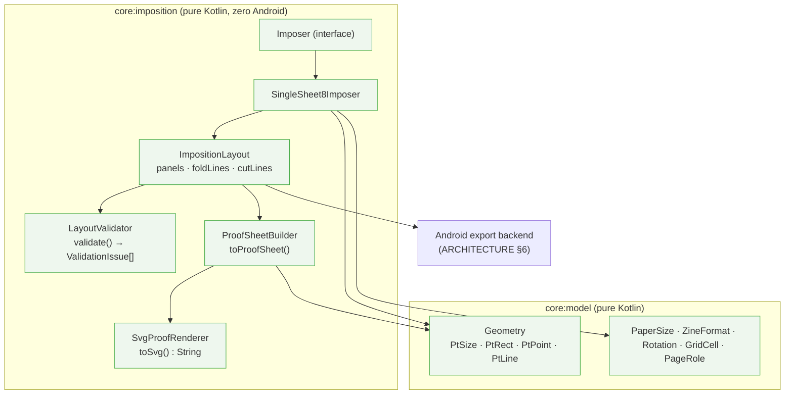
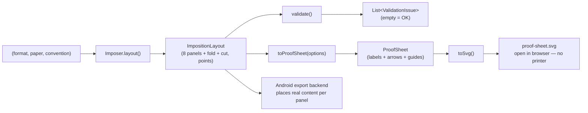
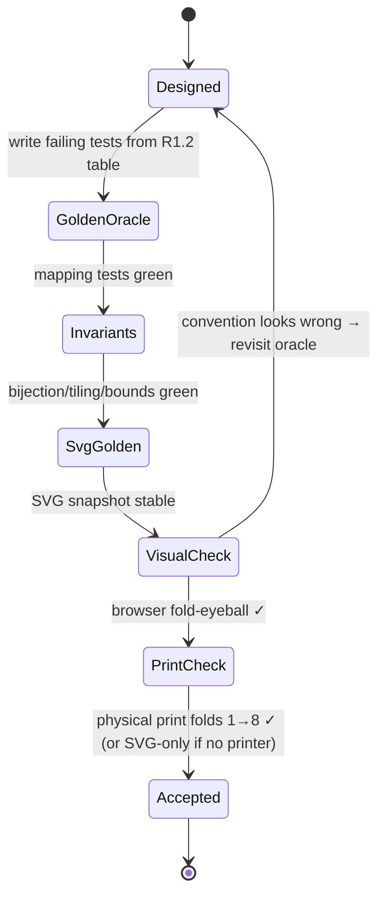
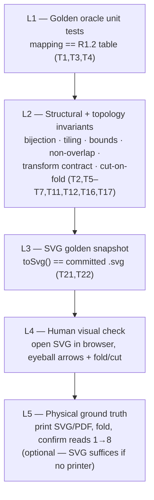

# Spike — Zine Imposition Engine (`core:imposition`)

> **Vertical spike design.** Pure-Kotlin, zero-Android, fully unit-testable engine that maps the 8 logical pages of a single-sheet mini-zine onto one physical sheet (panel rects + rotations) and emits fold guides, cut guides, and a **printer-free SVG proof sheet** for validation.
>
> Decision: [ADR-007](../DECISIONS.md#adr-007). Geometry evidence: [RESEARCH R1](../RESEARCH.md#r1-imposition-geometry--single-sheet-8-page-mini-zine). Consumed by the [export pipeline](../ARCHITECTURE.md#6-export-pipeline). **No implementation code in this doc — types & signatures only.**

- **Status:** ✅ **Implemented** · 2026-06-19 — built test-first on branch `feat/imposition-engine` as `:core:model` + `:core:imposition` (pure Kotlin, zero Android). 95 tests (unit + jqwik property + golden SVG), all green. Each of the 5 phases was Codex-reviewed and reconciled; see [ADR-007 Implementation](../DECISIONS.md#adr-007). Sample proof: `core/imposition/src/test/resources/golden/single-sheet-8-letter.svg`.
- **Why first:** it is the **#1 correctness risk** ([ARCHITECTURE §12](../ARCHITECTURE.md#12-major-technical-risks)) and the most isolatable — perfect for a test-first spike that retires risk before any UI exists.

---

## 0. Objective & non-goals

**Objective:** eliminate ambiguity so the engine can be implemented test-first with high confidence it is correct.

**In scope**
- Format: single-sheet mini-zine · **8 pages** · paper **Letter** and **A4**.
- Outputs: panel mappings, rotations, fold guides, cut guides, proof-sheet model + SVG.
- Pure Kotlin, no Android dependencies, deterministic, immutable, thread-safe.

**Non-goals (this spike)**
- Rendering user content (photos/text) — the engine is content-agnostic; it only knows page *numbers* and geometry. Content rendering is the [render pipeline](../ARCHITECTURE.md#5-rendering-pipeline--one-scene-two-backends).
- Multi-format impositions (16/32-page saddle-stitch) — [🔭 future](../ROADMAP.md#v2--more-formats--expression). The API is designed to *admit* them without rework (see §7.6).
- PDF/bitmap output — that's the Android export backend; the engine emits **SVG** (pure strings) only, for validation.

---

## 1. Technical design

### 1.1 Coordinate system & units
- Sheet is laid **landscape**. Origin **top-left**, **+x right, +y down** (matches Android/PDF screen space). Units are **points (1/72")** to match the document model and `PdfDocument` ([ARCHITECTURE §4](../ARCHITECTURE.md#4-data-models--storage)).
- Sheet sizes (landscape, points): **Letter `792 × 612`**, **A4 `841.89 × 595.28`**.
- Grid: **2 rows × 4 columns**. Panel `pw = W/4`, `ph = H/2`. Cell `(row,col)` → rect `(col·pw, row·ph, pw, ph)`. Panels exactly tile the sheet (no gaps/overlaps).

### 1.2 The mapping (the oracle) — from [R1.2](../RESEARCH.md#r12-page--cell-mapping-the-oracle--verified)
Canonical convention `TOP_ROW_ROTATED` (front cover bottom-right, top row printed upside-down):

| Booklet page | Cell (row,col) | Rotation | Role |
|---|---|---|---|
| 1 | (1,3) | 0° | FRONT_COVER |
| 2 | (0,3) | 180° | INTERIOR |
| 3 | (0,2) | 180° | INTERIOR |
| 4 | (0,1) | 180° | INTERIOR |
| 5 | (0,0) | 180° | INTERIOR |
| 6 | (1,0) | 0° | INTERIOR |
| 7 | (1,1) | 0° | INTERIOR |
| 8 | (1,2) | 0° | BACK_COVER |

Rule: **pages 2–5 → 180°; pages 1,6,7,8 → 0°.** A single `convention` flag can flip to `BOTTOM_ROW_ROTATED` (vertical mirror) — default canonical.

### 1.3 Fold & cut geometry — from [R1.4–R1.5](../RESEARCH.md#r14-cut-line--verified)
- **Fold lines:** horizontal `y = H/2` (full width); verticals `x = W/4, W/2, 3W/4` (full height).
- **Cut line:** single segment `(W/4, H/2) → (3W/4, H/2)` — the central horizontal fold across the middle two columns only.

### 1.4 Orientation arrows (proof sheet)
Each panel gets an arrow pointing in the direction the **top of the printed content** faces on the sheet: **north (−y)** for 0° panels, **south (+y)** for 180° panels. This makes "which panels are upside-down" visually obvious without folding.

### 1.5 Separation of concerns
`Imposer` (geometry) → `ImpositionLayout` (pure data) → three independent consumers: `validate()` (invariants), `toProofSheet()/toSvg()` (printer-free visual oracle), and the Android export backend (draws real content into each panel). The engine never imports Android and never touches content.

### 1.6 Transform contract (the single most important rule) — *added per Codex review*
A consumer must **never** re-derive rotation from `rotation + bounds` — that invites the classic rotate-about-origin-vs-center bug that silently lands content in the wrong cell. The engine therefore owns the math and emits an **explicit, authoritative transform per panel**:

- **Content authoring space:** each logical page's content is authored **upright**, origin **top-left**, in a local rect `panelLocalBounds = (0, 0, pw, ph)` (points).
- **`contentToSheet: AffineTransform2D`** maps *content-local* coordinates → *sheet* coordinates. Canonical composition (documented & tested): `translate(cellOrigin) ∘ rotateAboutPanelCenter(rotation)`. For a 0° panel it is a pure translate; for 180° it is translate + half-turn about the panel center, so content still fills the same cell.
- The consumer's only job: `canvas.concat(contentToSheet)`, clip to `clipLocalBounds`, draw upright content. `rotation`, `cell`, and `bounds` remain on the model for proof/debug/validation, but **`contentToSheet` is the contract.**

This makes the imposition impossible to interpret wrong downstream — the highest-value change from review.

---

## 2. Component diagram



## 3. Data-flow diagram



## 4. Sequence diagram — generate & validate (printer-free)

```mermaid
sequenceDiagram
    actor Dev as Dev / CI test
    participant Imp as SingleSheet8Imposer
    participant Lay as ImpositionLayout
    participant Val as LayoutValidator
    participant Pf as ProofSheetBuilder
    participant Svg as SvgProofRenderer

    Dev->>Imp: layout(SINGLE_SHEET_8, A4, TOP_ROW_ROTATED)
    Imp->>Imp: build 8 cells (row-major)
    Imp->>Imp: assign bookletPage + rotation per oracle
    Imp->>Imp: compute fold lines + cut line
    Imp-->>Lay: ImpositionLayout (immutable)
    Dev->>Val: layout.validate()
    Val-->>Dev: [] (bijection ✓ tiling ✓ bounds ✓ rotations ✓)
    Dev->>Pf: layout.toProofSheet(options)
    Pf-->>Dev: ProofSheet (panel labels + arrows)
    Dev->>Svg: proofSheet.toSvg()
    Svg-->>Dev: "&lt;svg&gt;…&lt;/svg&gt;"
    Note over Dev: assert against golden SVG;<br/>open in browser to eyeball fold logic
```

## 5. State diagram — correctness gates

The engine is a pure function (no runtime state machine), but its **risk-retirement lifecycle** is gated — each gate must pass before the next:



## 6. Domain model (types only — no logic)

> **Revised per Codex review:** added an explicit per-panel affine transform + panel-local rects (so consumers can't mis-rotate), modeled the cut as living *on* a fold (topology), replaced the under-specified two-mode convention enum with a single explicit `ConventionSpec`, and made the safe inset configurable.

```kotlin
// ---- core:model (geometry, in points = 1/72") ----
data class PtSize(val width: Double, val height: Double)
data class PtPoint(val x: Double, val y: Double)
data class PtRect(val x: Double, val y: Double, val width: Double, val height: Double)   // + derived right/bottom/center
data class PtLine(val start: PtPoint, val end: PtPoint)

/** 2D affine [a c e ; b d f ; 0 0 1]. Companions: identity, translate, rotateDegAbout(center). */
data class AffineTransform2D(
    val a: Double, val b: Double, val c: Double,
    val d: Double, val e: Double, val f: Double
)   // map(PtPoint), then(other) — declarations only

enum class PaperSize(val portrait: PtSize) {            // landscape() = swap(width,height)
    LETTER(PtSize(612.0, 792.0)),
    A4(PtSize(595.276, 841.890))
}
enum class ZineFormat(val pageCount: Int, val rows: Int, val cols: Int) {
    SINGLE_SHEET_8(pageCount = 8, rows = 2, cols = 4)
}
enum class Rotation(val degrees: Int) { NONE(0), HALF(180) }
enum class PageRole { FRONT_COVER, BACK_COVER, INTERIOR }
data class GridCell(val row: Int, val col: Int)

// ---- core:imposition ----
enum class FoldAxis { HORIZONTAL, VERTICAL }
enum class FoldType { VALLEY, MOUNTAIN, UNSPECIFIED }                      // advisory; refine after physical test

data class PanelPlacement(
    val panelIndex: Int,                 // stable physical id, row-major 0..7
    val bookletPage: Int,                // 1..8  (1 = front cover, 8 = back cover)
    val role: PageRole,
    val cell: GridCell,
    val bounds: PtRect,                  // cell rect on the flat sheet (proof/debug)
    val rotation: Rotation,              // proof/debug only — NOT the consumer contract
    // ▼ the authoritative consumer contract (Codex review):
    val panelLocalBounds: PtRect,        // (0,0,pw,ph) — content authoring space
    val safeLocalBounds: PtRect,         // inset by safe area, panel-local
    val clipLocalBounds: PtRect,         // content must not bleed past this (panel-local)
    val contentToSheet: AffineTransform2D // map content-local → sheet; consumer just concats this
)

data class FoldLine(
    val id: String,                      // e.g. "H-center", "V-quarter-1"
    val line: PtLine,
    val axis: FoldAxis,
    val type: FoldType = FoldType.UNSPECIFIED
)
data class CutLine(
    val line: PtLine,
    val onFoldId: String                 // the fold this cut lies on — topology link (Codex review)
)

/** One explicit, named convention = one golden table. v1 ships exactly one. */
data class ConventionSpec(
    val name: String,                    // "TOP_ROW_ROTATED"
    val cellOf: Map<Int, GridCell>,      // bookletPage → cell
    val rotationOf: Map<Int, Rotation>,  // bookletPage → rotation
    val roleOf: Map<Int, PageRole>
)   // Canonical instance lives in code as SingleSheet8.TOP_ROW_ROTATED

data class ImpositionLayout(
    val format: ZineFormat,
    val paper: PaperSize,
    val sheet: PtSize,                   // landscape sheet, points
    val conventionName: String,
    val panels: List<PanelPlacement>,    // size == format.pageCount
    val foldLines: List<FoldLine>,
    val cutLines: List<CutLine>,
    val safeAreaInsetPt: Double          // configurable; default ≈ 6 mm ≈ 17.0 pt (ADR-012)
)

// ---- proof sheet (printer-free validation) ----
data class OrientationArrow(val from: PtPoint, val to: PtPoint, val contentUpIsNorth: Boolean)
data class ProofPanel(
    val placement: PanelPlacement,
    val labelLines: List<String>,      // e.g. ["panel 1 (r0,c1)", "page 4", "INTERIOR"]
    val arrow: OrientationArrow
)
data class ProofSheetOptions(
    val showPanelIndex: Boolean = true,
    val showBookletPage: Boolean = true,
    val showRole: Boolean = false,
    val showOrientationArrows: Boolean = true,
    val showFoldLines: Boolean = true,
    val showCutLine: Boolean = true,
    val showSafeArea: Boolean = true,
    val showCalibrationRuler: Boolean = true,  // 1 in / 50 mm reference
    // SVG stroke/style metadata (Codex review): dashed fold, solid red cut, arrowheads.
    val rotatePageLabelWithPanel: Boolean = true  // top-row page numbers render upside-down → fold result is obvious
)
data class ProofSheet(
    val layout: ImpositionLayout,
    val panels: List<ProofPanel>,
    val options: ProofSheetOptions
)

// ---- validation (geometry AND topology — Codex review) ----
sealed interface ValidationIssue {
    // geometry
    data class MissingPage(val page: Int) : ValidationIssue
    data class DuplicatePage(val page: Int) : ValidationIssue
    data class PanelOutOfBounds(val panelIndex: Int) : ValidationIssue
    data class PanelOverlap(val a: Int, val b: Int) : ValidationIssue
    data class UncoveredArea(val approxFraction: Double) : ValidationIssue
    data class IllegalRotation(val panelIndex: Int, val degrees: Int) : ValidationIssue
    // topology
    data class CutNotOnFold(val onFoldId: String) : ValidationIssue            // cut must lie on its referenced fold
    data class CutEndpointsMisaligned(val expected: PtLine) : ValidationIssue  // endpoints at W/4 and 3W/4 fold intersections
    data class FoldNotOnCellBoundary(val foldId: String) : ValidationIssue     // every fold aligns with a grid boundary
    data class TransformInconsistent(val panelIndex: Int) : ValidationIssue    // contentToSheet ≠ cell+rotation
}
```

## 7. Public API proposal

```kotlin
// 7.1 Primary entry point — v1 ships exactly ONE convention (Codex review: no under-specified 2nd mode)
interface Imposer {
    val supportedFormats: Set<ZineFormat>
    val convention: ConventionSpec               // explicit, named, golden-tested
    /** Pure, deterministic. Throws IllegalArgumentException on an unsupported (format,paper). */
    fun layout(format: ZineFormat, paper: PaperSize, safeAreaInsetPt: Double = 17.0): ImpositionLayout
}

// 7.2 The single-sheet 8-page implementation (design target of this spike)
class SingleSheet8Imposer : Imposer   // supportedFormats = { SINGLE_SHEET_8 }; convention = TOP_ROW_ROTATED

// 7.3 Validation (pure) — geometry + topology
fun ImpositionLayout.validate(): List<ValidationIssue>   // empty ⇒ structurally & topologically correct

// 7.4 Proof sheet (pure)
fun ImpositionLayout.toProofSheet(options: ProofSheetOptions = ProofSheetOptions()): ProofSheet

// 7.5 SVG renderer — pure Kotlin, returns a self-contained SVG string (NO Android, NO file I/O)
//     Deterministic: fixed decimal precision, locale-independent '.' formatting, stable element order.
fun ProofSheet.toSvg(): String

// 7.6 Extensibility seam (future formats / conventions, no rework):
//   - add a ZineFormat entry (e.g. SADDLE_STITCH_16) + a new Imposer impl with its OWN ConventionSpec
//   - each new convention requires its own golden table + golden SVG snapshot before shipping
//   - an ImposerRegistry maps ZineFormat → Imposer; callers depend on the interface
//   - BOTTOM_ROW_ROTATED is intentionally NOT in v1 (needs its own spec + goldens — Codex review)
```

**API principles:** pure & deterministic (same inputs → byte-identical output, enabling golden tests); immutable outputs; engine throws only on programmer error (unsupported combo); validation is data, not exceptions; the per-panel `contentToSheet` transform is the consumer contract; file writing is the *caller's* job (engine returns a string) to keep it Android-free.

## 8. Test matrix

Built **test-first** ([android-skills:android-tdd](../CLAUDE.md#engineering-conventions-summary-authority-is-docsarchitecturemd)). `P` = paper ∈ {Letter, A4}.

| # | Category | Case | Assertion |
|---|---|---|---|
| T1 | Mapping (oracle) | each booklet page 1–8 | cell + rotation match [R1.2](../RESEARCH.md#r12-page--cell-mapping-the-oracle--verified) table, per `P` |
| T2 | Bijection | all panels | pages {1..8} appear exactly once; panelIndex {0..7} unique |
| T3 | Rotation set (convention-scoped) | all panels | for `TOP_ROW_ROTATED`: pages 2–5 = 180°, pages 1,6,7,8 = 0°; no other values. *Asserted against the convention spec, not as a format-universal rule* (Codex review) |
| T4 | Roles | covers | page 1 = FRONT_COVER, 8 = BACK_COVER, rest INTERIOR |
| T5 | Panel bounds | each panel, per `P` | `bounds == (col·W/4, row·H/2, W/4, H/2)` within ε |
| T6 | Tiling | union of panels | covers sheet with no gaps; Σ panel area == sheet area within ε |
| T7 | Non-overlap | all panel pairs | interiors disjoint |
| T8 | Sheet size | per `P` | landscape Letter 792×612, A4 841.89×595.28 within ε |
| T9 | Fold lines | geometry | 1 horizontal @ H/2 full width + 3 vertical @ W/4,W/2,3W/4 full height |
| T10 | Cut line | geometry | single segment (W/4,H/2)→(3W/4,H/2); length == W/2 within ε |
| T11 | **Transform contract** | each panel | mapping `panelLocalBounds` corners through `contentToSheet` yields `bounds`; for 180° the half-turn is **about the panel center** (top-left→bottom-right), so content still fills the same cell |
| T12 | **Transform = cell+rotation** | each panel | `contentToSheet` reconstructs `cell`+`rotation` (no divergence); `validate()` emits no `TransformInconsistent` |
| T13 | Determinism | repeat calls | byte-identical output (==) across invocations & threads |
| T14 | Validation happy path | valid layout | `validate()` == empty (geometry + topology) |
| T15 | Validation detects faults | hand-built bad layouts | each `ValidationIssue` type (incl. `CutNotOnFold`, `CutEndpointsMisaligned`, `FoldNotOnCellBoundary`, `TransformInconsistent`) is produced for its fault |
| T16 | **Cut topology** | cut vs fold | `cutLine.onFoldId == "H-center"`; cut lies on that fold; endpoints at the W/4 & 3W/4 vertical-fold intersections |
| T17 | **Fold–boundary alignment** | each fold | every fold coincides with a grid cell boundary |
| T18 | Proof labels | each ProofPanel | label contains panel index + booklet page (+ role when enabled) |
| T19 | Orientation arrows | each panel | `contentUpIsNorth == (rotation == NONE)`; arrow direction matches |
| T20 | Proof label rotation | top-row panels | when `rotatePageLabelWithPanel`, top-row page numbers are emitted rotated 180° (render upside-down) |
| T21 | SVG golden | toSvg() per `P` | equals committed golden `.svg` snapshot (geometry regression guard) |
| T22 | SVG validity & determinism | toSvg() | well-formed XML; root `<svg>` viewBox == sheet size; 8 page labels, 4 fold lines (dashed), 1 cut line (solid); fixed-precision, locale-independent numbers; stable element order |
| T23 | Safe area (configurable) | layout(inset) | default ≈ 17 pt; custom inset honored; `safeLocalBounds`/`clipLocalBounds` inside `panelLocalBounds` |
| T24 | Unsupported input | layout(SADDLE_STITCH_16, …) | throws IllegalArgumentException |

## 9. Edge cases

- **A4 irrational points** (210 mm = 595.276 pt) → all geometry comparisons use an epsilon; never test floats for exact equality. Define `ε` (e.g. 1e-6 pt) centrally.
- **Rotate-about-center, not origin** (Codex review) — the #1 latent bug. The 180° transform must be a half-turn **about the panel center**, baked into `contentToSheet`; the consumer never reconstructs it. T11/T12 lock this; `validate()` flags `TransformInconsistent`.
- **Transform order** — `contentToSheet = translate(cellOrigin) ∘ rotateAboutPanelCenter(rot)`; content authored upright in `panelLocalBounds`. Documented once, tested, never re-derived downstream.
- **Locale-independent formatting** — SVG numbers always use `.` decimal + fixed precision regardless of device locale (else Turkish/German locales emit `,` and break the SVG / golden snapshot).
- **Convention correctness risk** — the *oracle itself* could be the wrong mirror (research had a ⚠️ DISPUTED point on which row rotates, [R1.7](../RESEARCH.md#r17-variants--pitfalls--disputed--assumption)). Mitigation: the SVG proof sheet is the human/physical check; a *new* `ConventionSpec` (with its own golden table + SVG) is required to introduce any alternate — we do **not** ship an under-specified flip in v1.
- **Rounding for rendering** — engine stays in `Double` points; any pixel rounding happens in the Android backend, not here (keeps the engine exact).
- **Panel index vs booklet page confusion** — two distinct numbers shown on the proof sheet precisely to prevent this; tests assert both independently.
- **Back-cover labeling** — page 8 is the back cover but reads as "8"; proof label may annotate "(back)". Pure digits only in any number formatting (no locale).
- **Immutability / thread-safety** — all outputs are immutable `data class`es; the engine holds no mutable state → safe to call concurrently (T12).
- **Degenerate/again-future sizes** — extremely small sheets or future formats: API throws on unsupported format rather than silently producing a bad layout.
- **SVG injection / encoding** — labels are engine-generated (digits + fixed words) so no untrusted text; renderer still XML-escapes defensively.
- **Empty options** — disabling all proof options yields a valid SVG with panels only (no crash).

## 10. Validation strategy

Layered, cheap → authoritative. The **SVG proof sheet is the keystone**: it lets us validate fold correctness *before any Android code or printer exists*.



1. **L1 Golden oracle** — encode the [R1.2](../RESEARCH.md#r12-page--cell-mapping-the-oracle--verified) table as the test fixture; the implementation must reproduce it exactly for both papers.
2. **L2 Invariants (geometry + topology)** — properties that must hold for *any* correct imposition: bijection, exact tiling, in-bounds, disjoint, **the per-panel transform contract** (`contentToSheet` ↔ cell+rotation, half-turn about center), and **cut-on-fold topology** (cut lies on `H-center`, endpoints at the W/4 & 3W/4 fold intersections, folds align with cell boundaries). Catches geometry/index *and* transform/topology bugs the oracle table alone misses.
3. **L3 SVG golden snapshot** — commit a reference `proof-sheet-letter.svg` / `-a4.svg`; any geometry change diffs loudly in CI. Pure strings → deterministic, diffable, no Android/emulator.
4. **L4 Visual check (printer-free)** — render the SVG, open in a browser: confirm each panel shows the right page number, top-row arrows point **down**, bottom-row up, cut line spans the center only. This is the **printer-free fold validation the user requires.**
5. **L5 Physical ground truth (optional)** — once an Android export exists, print and fold once to confirm 1→8. If no printer is available, L1–L4 are sufficient confidence to proceed; L5 is a later confirmation, not a blocker ([PRD Q2](../PRD.md#13-open-questions)).

**Risk reduction summary:** the engine is small, pure, deterministic, and triple-checked (oracle + invariants + visual) with no Android or printer dependency — turning the project's #1 risk into the most thoroughly validated component before a single screen is built.

---

## Review — Codex critical review (reconciled 2026-06-19)

Per the [review workflow](../CLAUDE.md#review-workflow), this design was sent to **Codex** for an adversarial critical review before any code. Verdict: **the geometry and the page→cell→rotation mapping are correct** (top row `5 4 3 2` @180°, bottom row `6 7 8 1` @0°; cut on `y=H/2`, `x=W/4→3W/4` consistent with the mapping). Accepted changes (folded into this doc above):

| # | Codex finding | Resolution |
|---|---|---|
| 1 | Consumers must not re-derive rotation from `bounds+rotation` (rotate-about-origin vs center bug) | Added authoritative **`contentToSheet: AffineTransform2D`** + `panelLocalBounds`/`safeLocalBounds`/`clipLocalBounds`; documented transform order; §1.6 is now the contract (T11/T12) |
| 2 | Don't bake "pages 2–5 = 180°" as a format-universal invariant | Made it **convention-scoped** via `ConventionSpec`; T3 asserts against the spec, not globally |
| 3 | `BOTTOM_ROW_ROTATED` is underspecified/dangerous | **Removed from v1.** Any alternate convention needs its own `ConventionSpec` + golden table + golden SVG |
| 4 | Model the cut as living *on* a fold (topology), not a free line | `CutLine.onFoldId`; added topology `ValidationIssue`s + T16/T17 |
| 5 | Missing contracts: panel-local safe/clip rects, deterministic SVG, configurable inset, fold/cut stroke metadata, bleed scope | Added `safeLocalBounds`/`clipLocalBounds`; locale-independent fixed-precision SVG (T22); `safeAreaInsetPt` is a parameter; dashed-fold/solid-cut style; **bleed explicitly out of scope** ([🔭 future](../ROADMAP.md#future-vision)) |
| 6 | Validation should check topology, not just geometry | `validate()` now returns topology issues; L2 strengthened |

This outcome is recorded in [ADR-007](../DECISIONS.md#adr-007). No open disagreements remain; the design is ready to implement test-first.
