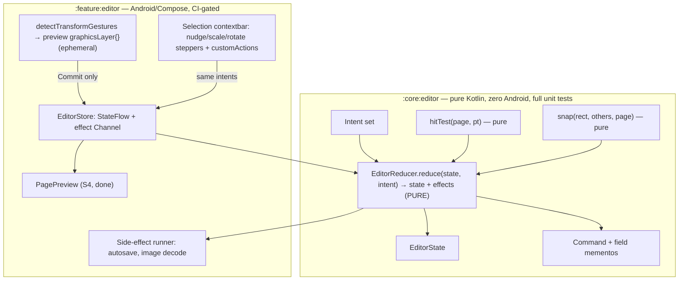
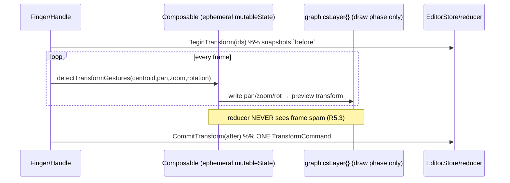

# Spike — S4 editor MVI (DESIGN)

> **Status: DESIGNED (Codex-reviewed GO WITH FIXES, all reconciled §9) — 2026-06-25.** Supersedes the SEED.
> This is the real state + interaction design for the editor on top of the stateless [`PagePreview`](../../feature/editor/src/main/kotlin/com/aritr/zinely/feature/editor/PagePreview.kt)
> host. Owns: `EditorState`, the intent set, the **pure** reducer, document-tree place/transform
> mutations, undo/redo, and the gesture→`AffineTransform2D` pipeline with its a11y-mandated
> non-gesture twin. Accepted decisions land as an ADR extending [ADR-005](../DECISIONS.md#adr-005) /
> [ADR-013](../DECISIONS.md#adr-013); durable evidence stays in [R5/R9/R10](../RESEARCH.md) — linked, not restated.
>
> **Out of scope:** rendering (done — [`SceneRenderer`](../../core/render/src/main/kotlin/com/aritr/zinely/core/render/SceneRenderer.kt)/`CanvasReplayer`/`PagePreview`),
> export/imposition (S5), persistence wiring (S2B autosave exists; the editor dispatches to it).

---

## 0. The decisive constraint: the document model already exists

The editor does **not** invent a model. [`:core:model`](../../core/model/src/main/kotlin/com/aritr/zinely/core/model/Document.kt)
already defines the persisted tree the reducer mutates, and [`SceneRenderer`](../../core/render/src/main/kotlin/com/aritr/zinely/core/render/SceneRenderer.kt)
already turns a `Page` into the `PagePreview` tape. Three facts from that code **pre-settle** open questions:

| Existing fact (code) | Settles |
|---|---|
| `Transform(xPt, yPt, widthPt, heightPt, rotationDegrees)` — **decomposed fields, points** | *Decomposed vs stored matrix* → **decomposed**. The model stores resolved geometry; the matrix is derived at render by `SceneRenderer.localToPage` ([R9.4](../RESEARCH.md#r94-recommendation)). No stored-matrix drift, by construction. |
| `SceneRenderer.localToPage` rotates **about the box centre** (`translate(c)·R·translate(-c)`) | *Scale/rotate anchor* → **element centre** is the natural pivot; gesture baking keeps the centre stable (§5). |
| `Element` is a **sealed interface** (`id`, `transform`, `zIndex`) with `TextElement`/`ImageElement` subtypes; integer `zIndex` | *Uniform `Element` + per-type properties* and *integer-zIndex reorder* ([R9.2/R9.3](../RESEARCH.md#r92-documentelement-model--the-transform-commit-pattern)) are **already realised**. The editor reuses them; it does not fork a parallel shape. |

So this design is purely **state + interaction wrapped around the existing tree** — exactly the spike boundary.

---

## 1. Module boundary — pure `:core:editor` + Android `:feature:editor`

Mirrors the project's pure-core / android-feature split (ADR-013), so the reducer, hit-test, and snap
are pure-JVM unit-tested with **zero Android deps** ([R5.2/R5.4](../RESEARCH.md#r52-mvi-for-the-editor)).



- **`:core:editor`** runs in the normal core CI lane (pure JVM, like `:core:render`). Not gated.
- **`:feature:editor`** stays CI-gated (Android), per the existing pattern.

---

## 2. `EditorState` + the intent set

### 2.1 State shape — internal model vs exposed UI state (Codex rec #1)

History is part of the immutable model (valid MVI) but is **not** public UI state — a large `undo`
stack must not ride every `StateFlow` emission or leak into UI diffing. So the reducer's unit is an
internal `EditorModel`; the store exposes a **derived** `EditorUiState` (model minus history) to Compose.

```kotlin
// :core:editor
public data class EditorModel(            // the reducer's immutable unit (internal to the store)
    val document: ZineDocument,           // THE source of truth; reducer .copy()s it
    val currentPageIndex: Int = 0,
    val selection: Set<String> = emptySet(), // element ids; Set ⇒ multi-select/groups additive (MVP picks 1)
    val view: ViewState = ViewState(),    // hoisted to PagePreview: screenPxPerPt (density×zoom), pageOffset (pan)
    val interaction: Interaction = Interaction.Idle, // marker; NO per-frame data (ephemeral, §5)
    val history: History = History(),     // undo/redo command stacks (field mementos, §4)
)

/** What the store exposes to Compose — model without the history stacks; `canUndo/canRedo` are derived flags. */
public data class EditorUiState(
    val document: ZineDocument, val currentPageIndex: Int, val selection: Set<String>,
    val view: ViewState, val interaction: Interaction, val canUndo: Boolean, val canRedo: Boolean,
)

public data class ViewState(val screenPxPerPt: Float = 1f, val pageOffset: PtPoint = PtPoint(0.0, 0.0))

public sealed interface Interaction {
    public data object Idle : Interaction
    /**
     * A gesture/handle session is open on [ids] of page [pageIndex]; the reducer owns the pre-gesture
     * [before] snapshot (single source of truth — Codex required-fix #1). [token] is a monotonic session
     * id so a stale `CommitTransform` after page-nav/selection-change/cancel is rejected (Codex rec #2).
     */
    public data class Transforming(
        val pageIndex: Int, val ids: Set<String>, val before: Map<String, Transform>, val token: Long,
    ) : Interaction
    public data class EditingText(val id: String, val token: Long) : Interaction
}
```

`document` is the **only** persisted part; everything else is session state. The composable derives the
`PagePreview` tape from `document.pages[currentPageIndex]` via `SceneRenderer.render` and hoists
`view.screenPxPerPt`/`view.pageOffset` — no geometry lives in the host (PagePreview contract).

**Snapshot ownership (Codex required-fix #1).** `BeginTransform(ids)` is a real reducer intent that
captures `before` into `Interaction.Transforming` *in the reducer*. The composable owns **only** ephemeral
per-frame deltas driving `graphicsLayer{}`; it never holds command/history state. `CommitTransform`
**validates** `interaction is Transforming`, that `pageIndex`/`ids`/`token` match, then builds the
`TransformCommand` from reducer-held `before` + committed `after`; a mismatch is a no-op (stale commit).

### 2.2 Intents (every one folds purely into a new `EditorState`)

| Intent | Effect on state | History | Side effect |
|---|---|---|---|
| `Select(id?)` / `SelectAt(pt)` / `ClearSelection` | sets `selection` (`SelectAt` runs pure `hitTest`) | — | announce selection (a11y) |
| `PlaceText(transform, text)` | append `TextElement`, select it | `PlaceCommand` | autosave |
| `RequestAddImage` | — (marker) | — | **decode pipeline** → emits `CommitAddImage` |
| `CommitAddImage(assetId, transform)` | append `ImageElement`, select it | `PlaceCommand` | autosave |
| `BeginTransform(ids)` | `interaction = Transforming(ids, snapshot)` | — | — |
| `UpdateTransform(...)` | *not an intent* — preview-only via `graphicsLayer{}` (§5) | — | — |
| `CommitTransform(after: Map<id,Transform>)` | write baked transforms; `interaction = Idle` | **one** `TransformCommand` | autosave |
| `CancelTransform` | `interaction = Idle` (preview discarded) | — | — |
| `Nudge(d)` / `ScaleBy(f)` / `RotateBy(deg)` | a11y single-pointer twins → compute `after`, same path as `CommitTransform` | `TransformCommand` | autosave |
| `Reorder(id, BringForward/SendBackward/ToFront/ToBack)` | re-rank integer `zIndex` | `ReorderCommand` | autosave |
| `Delete(ids)` | remove elements (remember index+element) | `DeleteCommand` | autosave |
| `CommitText(id, text, style)` | replace `TextElement` fields | `EditTextCommand` | autosave |
| `GoToPage(i)` / `AddPage` / `DeletePage(i)` | page-nav / page list edits | page commands | autosave |
| `Undo` / `Redo` | pop/replay command on `document` | moves between stacks | autosave |

**Reducer purity invariant:** `reduce(state, intent): Reduction(state, effects)` is pure and synchronous.
I/O (autosave write, image decode) is **returned as an effect**, never performed in the reducer ([R5.2](../RESEARCH.md#r52-mvi-for-the-editor)).
The store collects the new state into the `StateFlow` and forwards effects to a side-effect runner.

```kotlin
public data class Reduction(val model: EditorModel, val effects: List<Effect> = emptyList())
public sealed interface Effect {
    public data class Autosave(val document: ZineDocument) : Effect   // S2B binder consumes it (debounced in runner)
    public data object PickAndDecodeImage : Effect                    // runner → pick → decode → AssetStore → CommitAddImage
    public data class Announce(val text: String) : Effect            // a11y live-region
}
```

**Autosave emission rule (Codex required-fix #5).** `Autosave(document)` is returned **only** by intents
that mutate `document` (place/transform-commit/reorder/delete/edit-text/page edits/undo/redo) — **never**
by `Select`/`ClearSelection`/`GoToPage`/view-pan/zoom or pure history navigation that doesn't change the
tree. **Debounce, conflation, cancellation, and revision checks live in the effect runner/store**, not the
reducer; the reducer only *declares* "the document changed." This keeps the S2B autosave binder
([ADR-009](../DECISIONS.md#adr-009)) the single owner of write timing.

**Image pick/decode can fail (Codex rec #6).** `PickAndDecodeImage` does **not** imply success. The runner
dispatches `CommitAddImage` on success or surfaces a user-visible failure (cancelled pick, decode error,
unsupported type) via an `Announce` + transient UI — it never silently no-ops or commits a broken element.

---

## 3. Document-tree mutations (page-local points)

All mutations are `data class .copy()` on the existing tree — no new shapes, no mutable nodes.

- **Place:** append an `Element` to `pages[i].elements` with a fresh id and a `Transform` in **points**
  (drop position from the place gesture, mapped device→page via `view`). `zIndex = maxZ + 1`.
- **Transform:** replace the selected element(s)' `transform` with the baked `Transform` (§5).
- **Reorder (Codex required-fix #4 — z-order invariant).** A persisted/loaded document may carry
  **duplicate or sparse** `zIndex`, and ties are visually meaningful because `SceneRenderer`'s stable
  `sortedBy { zIndex }` breaks them by **list order** (later in list ⇒ drawn on top). To make reorder
  well-defined, the editor establishes a per-page invariant on **load into the editor**: derive the
  visual order as `(zIndex, listIndex)` and write back **dense, unique `0..n-1`**. Thereafter
  `BringForward` swaps adjacent ranks, `ToFront = n-1`, etc. The `ReorderCommand` memento captures the
  `zIndex` of **every element whose rank changed**, not just the selected one, so undo restores the full ranking.
- **Delete:** drop by id; the `DeleteCommand` memento stores `(element, listIndex)` for inverse.
- **Edit text:** replace `TextElement.text`/`style` (per-type `properties` live in the subtype already).

Helper lives in `:core:editor` as pure functions over `ZineDocument` (e.g. `ZineDocument.updateElement(pageIndex, id) { it.copy(...) }`).

---

## 4. Undo/redo — command objects with field-level mementos

Per [ADR-005](../DECISIONS.md#adr-005) / [R5.1](../RESEARCH.md#r51-undoredo): **not** per-frame snapshots,
**not** deep-clones ([R9.3 perf trap](../RESEARCH.md#r93-layering-undo-imposition)). Each command stores only the touched fields.

```kotlin
public sealed interface Command {
    public fun applyTo(doc: ZineDocument): ZineDocument   // redo
    public fun invertOn(doc: ZineDocument): ZineDocument  // undo
}
public data class TransformCommand(
    val pageIndex: Int,
    val before: Map<String, Transform>,   // memento: only the transforms that changed
    val after: Map<String, Transform>,
) : Command
public data class ReorderCommand(val pageIndex: Int, val beforeZ: Map<String, Int>, val afterZ: Map<String, Int>) : Command
public data class DeleteCommand(val pageIndex: Int, val removed: List<Pair<Int, Element>>) : Command  // index+element
public data class PlaceCommand(val pageIndex: Int, val element: Element) : Command  // generalises to Duplicate (Codex obs)
public data class EditTextCommand(val pageIndex: Int, val id: String, val before: TextElement, val after: TextElement) : Command
// Page commands are undoable too (Codex required-fix #8): carry full Page + index + selection-restore policy.
public data class AddPageCommand(val page: Page, val atIndex: Int) : Command
public data class DeletePageCommand(val page: Page, val atIndex: Int, val priorSelection: Set<String>) : Command

public data class History(val undo: List<Command> = emptyList(), val redo: List<Command> = emptyList())
```

`Undo` pops `undo`, runs `invertOn(document)`, pushes to `redo`. `Redo` mirrors. Any new committing
intent clears `redo`. Memory is O(touched fields), not O(doc). Page commands re-number `Page.index` on
apply/invert; `DeletePageCommand` restores the prior selection.

**Undo across page-nav is document-global (Codex obs).** Undo applies to whatever page the command
touched. If the command's `pageIndex != currentPageIndex`, the reducer **navigates to that page** (sets
`currentPageIndex`) and emits an `Announce` — never silently mutate an off-screen page.

**Asset GC respects history (Codex required-fix #7).** Deleting an `ImageElement` must **not** make its
content-addressed asset immediately collectible: the `DeleteCommand` memento still references the
`ImageElement` (hence its `assetId`) for undo. The reachability set for GC is therefore
**`document ∪ all assetIds referenced by history mementos`** — or GC is deferred to project close. The
editor never triggers eager asset deletion on element delete.

### 4.1 Gesture coalescing — begin/update/commit (one gesture = one step)

Per [R5.3](../RESEARCH.md#r53-coalescing-a-drag-into-one-undo-step):



The **a11y twins** (`Nudge`/`ScaleBy`/`RotateBy`) skip begin/update and go straight to a committed
`TransformCommand` — one tap = one undo step. 🔭 FUTURE: coalesce a rapid burst of same-kind nudges
within a short window into one command (R9.3 `beginBatch/endBatch`); MVP keeps them discrete.

---

## 5. Gesture → `AffineTransform2D` pipeline

### 5.1 Live (preview-only, off the reducer)

`Modifier.pointerInput { detectTransformGestures { centroid, pan, zoom, rotation -> … } }` yields **one**
callback. It accumulates ephemeral `{ panPt, zoom, rotationDeg }` in a `mutableStateOf` that a
`Modifier.graphicsLayer { translationX/Y; scaleX/Y; rotationZ }` reads → updates hit the **draw phase
only** ([R5.3](../RESEARCH.md#r53-coalescing-a-drag-into-one-undo-step)). A **single** logical
`TransformGesture` (not three racing intents) — the SEED §3 requirement.

### 5.2 Bake on commit (decomposed, centre-stable)

On gesture end, fold the accumulated delta into the committed `Transform` (points). Because
`SceneRenderer` rotates about the **box centre**, baking keeps the centre stable:

```
cx, cy   = old centre (xPt + w/2, yPt + h/2)
cx' , cy'= cx + panPt.x , cy + panPt.y          # translate — pan is in PAGE space (Codex required-fix #2)
w'  , h' = w * zoom , h * zoom                   # UNIFORM pinch scale (keeps aspect — beginner-first, no skew)
x'  , y' = cx' - w'/2 , cy' - h'/2               # re-anchor on the stable centre
rot'     = rot + rotationDeg
after    = Transform(x', y', w', h', rot')
```

Uniform scale and rotation about the **same** centre commute, so this is correct for `rotation ≠ 0`
(Codex confirmed required-fix #2). Pan is interpreted in **page space**, not the element's rotated local
frame. `:core:render` derives the `AffineTransform2D` from `after` — **no stored matrix** ([R9.4](../RESEARCH.md#r94-recommendation)).

**Anchored handle resize on a rotated element (Codex required-fix #2).** The simple centre formula above
holds only for the centre-anchored pinch/`ScaleBy`. A corner/edge handle must keep its **opposite anchor
fixed in page space**, so the box centre moves when the element is rotated. The bake is:
1. map the handle-drag delta into the element's **local axes** (rotate the page-space delta by `-rot`);
2. apply it to the local box to get new `w', h'` (corner = both axes; edge = one) with the opposite
   corner/edge held at local-fixed coordinates;
3. solve the **new centre** so that anchor's **page-space** position is unchanged: take the anchor's new
   local offset from the box centre, rotate it back by `+rot`, and set `centre' = anchorPage − rotatedOffset`;
4. emit `Transform(centre'−(w'/2,h'/2) …, w', h', rot)`.

This is the only place a rotation must be threaded through resize; pinch/`ScaleBy` avoid it by anchoring on the centre.

### 5.3 Anchors (open question resolved)

| Input | Anchor | Scale |
|---|---|---|
| Two-finger pinch | element **centre** (centre-stable, matches centre rotation) | **uniform** |
| Corner resize handle (1-finger) | **opposite corner** (projected onto the element's rotated axes) | uniform (corner) |
| Edge resize handle (1-finger) | opposite edge | 1-D (w **or** h) |
| a11y `ScaleBy(±step)` | element **centre** | uniform |

Centroid-vs-corner is thus **input-dependent**, not one global choice: gestures pivot on the element
centre; handles pivot on the opposite corner/edge so the dragged handle tracks the finger.

### 5.4 Hit-testing & snapping (pure, outside history)

- **Hit-test** ([R5.4](../RESEARCH.md#r54-scene-model-hit-testing-snapping)) — no matrix inverse needed
  (the model is decomposed): translate the touch to element-local by subtracting the centre, **un-rotate
  by `-rotationDeg`**, AABB-test against `±w/2, ±h/2`. This is **exactly** the inverse-transform for this
  decomposed, centre-rotated model (Codex confirmed required-fix #3), provided the rotation sign matches
  `SceneRenderer`. **Tie order must mirror the renderer's draw order:** the renderer draws by stable
  ascending `(zIndex, listIndex)`, so the topmost element has the **greatest `(zIndex, listIndex)`**.
  Hit-test iterates `(zIndex desc, listIndex desc)`, first hit wins — **not** `zIndex desc` alone. Pure
  `hitTest(page, pt): String?` in `:core:editor`.
- **Snapping** — candidate lines = other elements' edges/centres + page edges/centre; snap within a
  **zoom-adjusted threshold `≈ 8px / screenPxPerPt`** (px→points). Applied to the **preview** during
  update, **baked into the commit**; guide lines are render-only, never in history. Pure
  `snap(rect, others, pageSize, thresholdPt): SnapResult(adjustedRect, guides)`.

### 5.5 Group transforms (open question resolved)

`selection: Set<String>` is multi-ready now; **MVP UI selects one**. A group transform applies the same
pan/zoom/rot about the **group bounding-box centre** to each member, bakes each member's `Transform`,
and commits **one** `TransformCommand(ids, before, after)` over all ids. So enabling multi-select later is
additive — the reducer/commit already operate on `Map<id, Transform>`.

---

### 5.6 Text-edit session — race-safe (Codex required-fix #6)

`Interaction.EditingText(id, token)` marks an open session; the **draft text lives in feature-layer
ephemeral state** (a `TextFieldValue` in the editing sheet), mirroring how live gesture deltas stay out of
the reducer. The document `TextElement` is updated **only** on commit:

- **Commit triggers:** Done/keyboard-action, focus loss, or `ON_PAUSE`/`ON_STOP` (lifecycle) — whichever
  first. On backgrounding the editor **force-commits** the pending draft so autosave persists the latest
  intended text before the process can be killed ([ADR-009](../DECISIONS.md#adr-009) durability).
- **One undo step:** the whole session = one `EditTextCommand(before, after)`; intermediate keystrokes are
  never recorded (begin/update/commit, like a drag). An empty result either deletes a freshly-placed text
  box or restores the prior text (no empty `TextElement` leaks — matches the existing `text.empty` warning).
- **IME composition safety:** commit reads the *composed* string; the `token` rejects a late commit if the
  user already navigated/selected away. Autosave only fires from the `CommitText` reduction, so it can
  never race a half-composed string into the tree.

## 6. Accessibility — designed in, not retrofitted ([R10](../RESEARCH.md#r10-editor-accessibility--wcag-22-aa--androidmaterial-3-guidelines))

| Requirement (WCAG/M3) | How the design satisfies it |
|---|---|
| **2.5.7 Dragging alternative** (AA) | Every gesture transform has a single-pointer twin intent: contextbar **nudge** (`Nudge`), **scale stepper** (`ScaleBy`), **rotate stepper** (`RotateBy`) — dispatching the **same** `CommitTransform` machinery. Plus `Modifier.semantics { customActions = [...] }` per selected element (nudge ×4, scale ±, rotate ±, reorder, delete, edit). |
| **2.4.7 Focus visible** + Canvas semantics | A focusable semantic node per placed element as selection lands; page-level `contentDescription`; visible focus on every control. (`PagePreview` is silent today — the editor layer adds the semantics; Canvas marked decorative only if an accessible **layers list** mirrors it.) |
| **2.5.8 / M3 target ≥48dp** | Handles get a ≥48dp padded hit area (visual smaller); `IconButton`/`minimumInteractiveComponentSize()`; chips 48dp hit. |
| **1.4.11 non-text contrast ≥3:1** | Boundaries use `--md-outline`; selection/handle strokes at `primary`; handle halo over busy photos. |
| **1.3.1 semantics/structure** | Real `Role.Button`, list/collection semantics for layers/gallery, one heading/screen. |
| **Edge-to-edge / WindowInsets** | Bars/FAB/sheets pad `systemBars`/`navigationBars` (+ `imePadding` for the text sheet). |

The a11y twins are **why** `Nudge`/`ScaleBy`/`RotateBy` are first-class intents sharing the commit path —
the intent set is shaped by 2.5.7, exactly as the SEED demanded.

---

## 7. Open questions — resolved

| SEED §3 open question | Resolution |
|---|---|
| Decomposed fields vs stored matrix | **Decomposed** — already the persisted model; matrix derived at render (`SceneRenderer`). No drift. |
| Scale anchor (centroid vs corner) | **Input-dependent** (§5.3): pinch & a11y → element centre; handles → opposite corner/edge. |
| Snapping threshold | **`≈ 8px / screenPxPerPt`** (zoom-adjusted, converted to points); preview-applied, commit-baked, guides render-only. |
| Group transforms | Commit operates on `Map<id, Transform>` about the group-bbox centre; `selection: Set` ⇒ additive; MVP selects one. |

---

## 8. Test plan (TDD, pure-JVM first)

`:core:editor` (pure, no Android — runs in core CI):
1. **Reducer** — table-driven `(model, intent) → (model, effects)`: select/place/transform-commit/reorder/delete/edit/page-nav; purity (no I/O); `Autosave` emitted **only** by document-mutating intents (not select/view/nav — required-fix #5); stale `CommitTransform` rejected by `token` mismatch (required-fix #1, rec #2).
2. **Undo/redo** — each `Command` round-trips (`invertOn(applyTo(doc)) == doc`); gesture coalescing = one `TransformCommand`; text session = one `EditTextCommand`; redo cleared on new commit; undo on an off-current page navigates + announces (Codex obs).
3. **Bake math** — centre-stable pinch (centre fixed under uniform scale), rotation additive at `0/45/90/-90°` (required-fix #2 + rec #3); **rotated corner/edge resize keeps the opposite anchor fixed in page space** (required-fix #2); group transform about group-bbox centre.
4. **hitTest** — rotated AABB, iterate `(zIndex desc, listIndex desc)` first-hit (tie order mirrors renderer — required-fix #3); misses; rotation-sign agreement with `SceneRenderer` at `0/45/90/-90°`.
5. **z-order** — load-time dense `0..n-1` normalisation from `(zIndex, listIndex)`; `ReorderCommand` captures every changed rank; reorder keeps a total order (required-fix #4).
6. **snap** — threshold edges, page-centre/edge lines, guide output; purity.
7. **Property tests** (jqwik, as in `:core:imposition`) — undo/redo invariance; transform-commit idempotence; zIndex stays a total order under reorder.

`:feature:editor` (Android, gated): store wiring (`StateFlow<EditorUiState>` — history-free — + effect
channel), gesture→commit, contextbar intents == gesture intents, text-session force-commit on `ON_PAUSE`
(required-fix #6), semantics/customActions present. Roborazzi selection-chrome goldens recorded on CI only.

---

## 9. Codex review — reconciliation (2026-06-25)

Verdict **GO WITH FIXES**. All 8 Required Fixes and the Recommended items **accepted** and folded in above:

| # | Codex Required Fix | Where reconciled |
|---|---|---|
| 1 | Transform snapshot single-source; `BeginTransform` reducer-owned; `CommitTransform` validates | §2.1 (snapshot ownership), §5.1 |
| 2 | Rotated corner/edge resize must hold the opposite anchor fixed in page space; pan = page space | §5.2 (handle-resize math), §5.3 |
| 3 | Hit-test tie order = `(zIndex, listIndex)` desc to match stable renderer draw order | §5.4 |
| 4 | Normalise to dense unique `zIndex` on load; `ReorderCommand` captures all changed ranks | §3 (reorder) |
| 5 | Autosave only on document mutation; debounce/conflation in the runner, not the reducer | §2.2 (Effect rule) |
| 6 | Race-safe text-edit session (IME/focus/lifecycle); force-commit before backgrounding | §5.6 |
| 7 | Asset GC reachability = document ∪ history mementos (undo still references deleted image) | §4 |
| 8 | Page add/delete are undoable commands with full `Page` + index + selection-restore | §4 |

Recommended also folded: history split into internal `EditorModel` vs exposed `EditorUiState` (§2.1);
gesture `token` for stale-commit rejection (§2.1); rotation-sign goldens `0/45/90/-90°` (§8); explicit
image pick/decode-failure path (§2.2); group-transform precise definition (§5.5). Observations (duplicate
generalises `PlaceCommand`; document-global undo navigates to the affected page) noted in §4. No disagreements.

---

## 10. Workflow status

Draft → Codex review → **reconcile (done, §9)** → record accepted decisions as **ADR-029** extending
[ADR-005](../DECISIONS.md#adr-005)/[ADR-013](../DECISIONS.md#adr-013) (Codex outcome noted) → **implement TDD**
(pure `:core:editor` reducer/commands/hitTest/snap first). Durable evidence stays in [R5/R9/R10](../RESEARCH.md).
Status: **DESIGNED** — pure core implemented.

### 10.1 Implementation status (2026-06-25)

**Pure `:core:editor` landed, TDD (43 tests green: 39 unit + 4 jqwik properties; `explicitApi`):**

| File | What |
|---|---|
| `HitTest.kt` | rotated-AABB hit-test, no matrix inverse, `(zIndex desc, listIndex desc)` tie order (§5.4) |
| `TransformMath.kt` | centre-anchored bake + rotated corner/edge handle resize (§5.2) |
| `ZOrder.kt` | dense-unique `zIndex` normalise + single-step reorder (§3) |
| `Command.kt` | `Transform`/`Reorder`/`Delete`/`Place`/`EditText`/`AddPage`/`DeletePage` commands, field mementos, round-trip (§4) |
| `EditorModel.kt` | model + `EditorUiState` projection + `Interaction`/`History`/`ViewState` (§2.1) |
| `Intent.kt` | full intent set + `Effect` + `Reduction` (§2.2) |
| `EditorReducer.kt` | the pure reducer — token-validated commits, autosave only on doc mutation, document-global undo/redo (§2.2, §5) |
| `Snap.kt` | pure candidate-line snapping + render-only guides (§5.4) |

### 10.2 Post-merge review hardening (2026-06-25)

A max-effort review of the PR surfaced reducer-robustness gaps, all fixed TDD (10 new tests, 53 total green):
- **DeletePage index** — deleting a page at/before `currentPageIndex` now shifts current down one (was off-by-one, showed the wrong page).
- **Per-page selection/session** — `GoToPage`/`AddPage`/`DeletePage` clear `selection` and end any open `Transforming` session (a stale same-index/same-token commit could otherwise hit the wrong page).
- **Invertible commits** — `CommitTransform` keeps only ids from the begin snapshot; `CommitText` normalises the committed id to the target; `CommitAddImage` mints the id reducer-side (+`nextToken`) so it can't collide and make `PlaceCommand` undo delete two elements.
- **Degenerate size** — `TransformMath` clamps baked width/height to `MIN_SIZE_PT` (pinch/handle/`ScaleBy(≤0)` can't produce a zero/negative, un-hittable box or a `PtRect` `require` throw).
- **Snap input guard** — a non-finite `thresholdPt` (e.g. `8px / screenPxPerPt` at `screenPxPerPt == 0`) is a no-op, not a snap-to-everything.
- **Selection restore** — undo of `DeletePageCommand` restores the page's `priorSelection` (fulfils Codex fix #8 end-to-end).

**Next (gated `:feature:editor`, Android — needs Compose + CI goldens):** the `EditorStore`
(`StateFlow<EditorUiState>` + effect runner over the S2B autosave binder), `detectTransformGestures` →
`graphicsLayer{}` preview → `CommitTransform`, the selection contextbar (nudge/scale/rotate steppers +
`semantics{customActions}`), per-element focus semantics on the Canvas, and Roborazzi selection-chrome goldens.

### 10.3 Gated `:feature:editor` — store layer landed (2026-06-26)

The MVI **store spine** is implemented + unit-tested (pure-JVM, no Robolectric — `EditorStore` is a thin
serialising shell over the frozen reducer):

| File | What |
|---|---|
| `EditorStore.kt` | `StateFlow<EditorUiState>` over the reducer; main-thread FIFO **mailbox** dispatch; synchronous `BeginTransform`-token contract; debug Autosave-payload invariant |
| `EditorEffects.kt` | `EditorEffectRunner` + `DefaultEditorEffectRunner`; seams `AutosaveSink` (binder `markDirty()`), `Announcer`, `ImagePickDecodePipeline`/`ImagePickResult`; `UnavailableImagePipeline` placeholder (Failure → announce, no broken element) |

**Module boundary kept:** `:feature:editor` depends on `:core:editor` (api) + coroutines (api) but **not**
`:data-android` — the S2B [`EditorAutosaveBinder`](../../data-android/src/main/kotlin/com/aritr/zinely/data/android/EditorAutosaveBinder.kt)
`markDirty()` is adapted to the `AutosaveSink` seam at the DI/app layer; the image source stays the
`AssetBytesSource{null}` placeholder seam (real source = a later S4 step).

**Codex review of the new wiring (2026-06-26, GO WITH FIXES — all reconciled):**

| Codex finding | Reconciliation |
|---|---|
| D1 — main-thread confinement is enough for thread-safety but **not** re-entrancy ordering | dispatch serialised through a main-thread **FIFO mailbox** (`drain`): an effect re-entering via the store's synchronous `dispatch` is enqueued + drained after the current reduction — never a nested reduction. Background follow-ups use a main-confined `postDispatch`. |
| D2 — pull-based autosave makes the effect `document` payload redundant | runner ignores the payload, calls `markDirty()` (binder pulls latest); store keeps a **debug invariant** `check(effect.document === reduction.model.document)` so payload/state can't silently diverge. |
| D3 — on gesture end bake from the reducer-held `before`, not a re-read of current selection; cancel/replace the active gesture on selection/page change | the gesture layer (next increment) reads `before`/`token` from `uiState.interaction as Transforming`; the reducer already clears the session on page-nav. |
| D4 — image seam fine; reducer should mint id | `ImagePickResult.Success(element)` id is a placeholder — `Intent.CommitAddImage` re-mints reducer-side (already true). |
| D5 — **real race**: ON_PAUSE force-commit ordering must be explicit, not rely on observer order | the binder's lifecycle flush is async-on-io (posted off the main thread), so a **synchronous** main-thread `CommitText` in the editor's own ON_PAUSE handler always updates the model before the io flush coroutine pulls the snapshot. To be enforced + tested when the text-edit session lands (the editor screen owns the ON_PAUSE commit; flush is not relied on for ordering). |
| F1 — rotated-element snap | **skip snapping when `rotationDegrees != 0`** (Snap is AABB-only; snapping a rotated box's AABB would shift it misleadingly and guides wouldn't align to visible edges). |
| F2 — live min-size guard | preview clamps `w*zoom ≥ MIN_SIZE_PT` to mirror the commit-time clamp. |

**Still next:** gesture pipeline (`detectTransformGestures` → ephemeral `graphicsLayer{}` → `CommitTransform`),
selection chrome + handles, the a11y contextbar (`Nudge`/`ScaleBy`/`RotateBy` + `semantics{customActions}`),
the race-safe text-edit session (§5.6, D5), and Roborazzi selection-chrome goldens.

### 10.4 Gated `:feature:editor` — gesture pipeline landed (2026-06-26)

The §5 live-transform gesture layer is implemented + tested. The pure frame/bake math is pushed down into
`:core:editor` (unit-tested, no Compose); only event decoding lives in the Compose `Modifier`.

| File | Module | What |
|---|---|---|
| `LiveTransform.kt` | `:core:editor` | the off-reducer accumulator (§5.1): `accumulate(panPx,zoomFactor,rotΔ)` folds each frame into one ephemeral `{panXpx,panYpx,zoom,rotationDeg}`; `clampedZoom(before)` floors the live `graphicsLayer` scale at `MIN_SIZE_PT` (**F2**); `bake(before, screenPxPerPt)` → committed `Transform` via `TransformMath.bakeCentreAnchored` (px-pan → page-pt at bake). |
| `ExportScale.previewDeviceToPage` | `:render-android` | algebraic **inverse** of the preview seam (`pagePt = px/s − offset`), the px→pt map the gesture layer needs for `SelectAt`; kept beside its forward twin, round-trip unit-tested. |
| `EditorGestures.kt` | `:feature:editor` | `Modifier.editorTransformGestures(...)`: a tap layer (`detectTapGestures` → long-press `SelectAt` / double-tap edit seam) + a hand-rolled begin/update/commit transform loop. First real delta past **touch-slop** opens the session (`BeginTransform`, token read synchronously per the §5.1 mailbox contract), frames push `LiveTransform` to `onPreview` (drives the chrome `graphicsLayer`), lift **bakes** each member's snapshot `before` (§5.2) into one `CommitTransform` (one gesture = one undo step, R5.3). |

**D3 discharged:** the loop bakes from `(uiState.interaction as Transforming).before`, never a re-read of selection; an end-of-gesture token re-check commits only if our session is still live (else leaves a newer one untouched). **F2 discharged** via `clampedZoom`. Group transform bakes each member about its own centre — MVP selects one; the group-bbox-centre transform (§5.5) is the additive multi-select extension.

**Test tiers:** `LiveTransformTest` (`:core:editor`, pure-JVM — accumulation, F2 clamp, px→pt pan, centre-stability) + `ExportScaleTest` round-trip (`:render-android`) cover the math; `EditorGesturesTest` (`:feature:editor`, Robolectric NATIVE + compose-ui-test input injection) covers the **wiring** — a drag opens exactly one session and commits one baked move, a long-press emits `SelectAt`, a still finger never opens a session.

**Codex review of the gesture wiring (2026-06-26, GO WITH FIXES — reconciled):**

| Codex finding | Reconciliation |
|---|---|
| Ownership leak — ignoring **all** pre-session consumption let a long-press (which consumes) still cross slop and start a transform | ignore only the consumed **first down**; any *later* external consumption abandons a not-yet-started transform (`token == null` → `break`) or cancels a live one (`token != null` → `CancelTransform`). So *long-press = discrete select*, *drag-before-long-press = transform* — predictable, no flicker. |
| Transform target should be stable, not slop-cross selection | snapshot `selectionAtDown` right after `awaitFirstDown`; `BeginTransform(selectionAtDown)`. (Equal in practice — a transform can only begin before long-press fires — but makes the contract explicit.) |
| End-of-gesture token re-check | **kept** — guards against a newer interaction replacing the session before commit. |
| Pre-slop motion discarded (~`touchSlop` undercount) | **accepted** for MVP touch drag (small startup lag, matches platform `detectTransformGestures`); documented. Carry the slop residual into the first baked frame only if precision input demands it later. |

The pre-slop accumulation mirrors the platform detector (cumulative `{zoom,rotation,pan}` vs slop, not per-frame) — an interpolated swipe arrives as many sub-slop steps, so a per-frame test would never cross.

**Still next:** selection chrome + handles (consumes `onPreview` via `graphicsLayer`; `HitTest`/`Snap` guides, F1 skip-rotated), the a11y contextbar (`Nudge`/`ScaleBy`/`RotateBy` + `semantics{customActions}`), the race-safe text-edit session (§5.6, D5; supplies the `BeginEditText` intent the double-tap seam dispatches), and Roborazzi selection-chrome goldens.

### 10.5 Gated `:feature:editor` — selection chrome + live preview landed (2026-06-26)

The selection boundary + the visible live gesture preview are implemented + tested. **Note a deliberate
mechanism change vs §5.1:** the live preview is **not** a `graphicsLayer` over a cached layer — it is a
**document-order re-render** of the whole page each frame with the selected transforms baked through the
same `LiveTransform.bake` the commit uses. Codex (below) endorsed this as the strongest parity choice.

| File | Module | What |
|---|---|---|
| `SelectionChromeGeometry.kt` | `:render-android` | pure: a committed `Transform` → its four device-px corners `[TL,TR,BR,BL]`, rotating local `(±w/2,±h/2)` about the box centre by `+rot` (**same sign** as `SceneRenderer.localToPage`) then `ExportScale.previewPageToDevice`. JVM-unit-tested (axis-aligned, page-offset, CW-90°, non-square). |
| `LivePreview.kt` | `:core:editor` | pure `apply(page, before, live, screenPxPerPt)`: replaces each `before`-keyed element's transform with `live.bake(before[id], s)`, preserving list/z-order — the **same** mapping `Command.kt`'s `TransformCommand` applies at commit, so preview == commit by construction. |
| `SelectionChrome.kt` | `:feature:editor` | draw-only Compose overlay: strokes each (live-baked) box outline in **screen space at constant width** (theme `primary`, WCAG 1.4.11 ≥3:1) — never inside a scaling `graphicsLayer`. |
| `EditorPagePreview.kt` | `:feature:editor` | stateless host stacking `PagePreview` (live-effective tape) under `SelectionChrome`; bakes the live gesture for an open `Transforming` session only; tape `remember`ed on `(effectivePage, defaults, size)`. |

**Live-preview mechanism — Codex review (2026-06-26, GO WITH FIXES → adopted approach B):**

| Codex finding (re: the originally-drafted `graphicsLayer` two-layer split) | Reconciliation |
|---|---|
| Multi-select pivot diverges if `graphicsLayer` uses one group-centre pivot but bake is per-element | **dissolved** by approach B — live uses the *same per-element* `bake` as commit, so live == commit even for multi. |
| `transformOrigin` must be in the layer's measured local space, not assumed page-size px | **N/A** under B — no `graphicsLayer`, no origin math. |
| `graphicsLayer` scales a rasterised text/clip/stroke layer → not pixel-equal to a baked relayout | **N/A** under B — the live frame *is* the `SceneRenderer` → `PagePreview` render path (true parity). |
| Commit transition must be atomic (no stale-overlay / half-baked frame) | **holds** under B — baked transforms + `Idle` publish in one synchronous reduction; `onPreview(null)` runs after `CommitTransform` returns ⇒ live tape == commit tape at the swap, no flicker. |
| Z-order: a floated overlay loses the element's real z-slot | **correct** under B — rendered in document order (Codex's "best parity option"). |
| Chrome stroke fattens under zoom then snaps back if drawn inside the scaled layer | chrome drawn in **screen space, constant stroke**, from the live-baked box. |
| Don't re-decode images per frame / re-run render needlessly | tape `remember`ed; image bytes cached in the replayer by asset key. **Accepted follow-up:** per-frame whole-page re-render is pure point math + replay (text-first MVP fine); revisit decode caching if an image-drag janks. |

**Test tiers:** `SelectionChromeGeometryTest` (`:render-android`, pure-JVM) + `LivePreviewTest` (`:core:editor`, pure-JVM, incl. an explicit preview==commit-application assertion) prove the math; `EditorPagePreviewTest` (`:feature:editor`, Robolectric NATIVE) is a host smoke proof that both layers compose idle and mid-gesture.

**Still next:** resize **handles** + their opposite-anchor resize gesture (`TransformMath.bakeHandleResize`, §5.2/§5.3), live **snap guides** (`Snap` applied during update, render-only, **F1 skip-rotated**), the a11y contextbar (`Nudge`/`ScaleBy`/`RotateBy` + `semantics{customActions}`), the race-safe text-edit session (§5.6, D5), and Roborazzi selection-chrome goldens.

### 10.6 Gated `:feature:editor` — resize handles landed (2026-06-26)

The eight opposite-anchor resize handles (§5.2/§5.3) are implemented + tested.

| File | Module | What |
|---|---|---|
| `ResizeHandle.kt` | `:core:editor` | the 8-handle enum (local `(±1,±1)` unit frame) + `opposite` (mirror through centre, written `0.0 − v` so a 0-axis stays `+0.0`) + `TransformMath.resizeByHandle(before, handle, dragPagePt)` — a total adapter over `bakeHandleResize` wiring `anchor = handle.opposite`, `moving = handle.local`. |
| `SelectionChromeGeometry.handleDevicePx` | `:render-android` | a handle's device-px position (local `(±1,±1)` → `(±w/2,±h/2)`, rotate `+rot` about centre, `previewPageToDevice`) — shares the `outlineDevicePx` mapper. |
| `LivePreview.applyOverride` | `:core:editor` | the **directly-baked** preview path (resize computes a `Transform` per frame, not a `LiveTransform`); `apply` now delegates to it. |
| `ResizeHandles.kt` | `:feature:editor` | per-handle 48dp hit target (WCAG 2.5.8; 12dp dot) with its own `detectDragGestures` begin/update/commit loop: opens one session (`BeginTransform`, token read synchronously), bakes `resizeByHandle(before, handle, previewDeviceToPage(cur))` each frame into `resizeOverride`, commits one `CommitTransform` on release (one drag = one undo step). `EditorPagePreview` gained `resizeOverride` (wins over the pan/pinch `live` path). |

**Anchoring:** `cur` seeds at the handle's geometric device-px centre and accumulates post-slop drag deltas; `before` is read from the reducer-owned `Transforming.before` each frame (never a live element re-read). On a rotated element the **raw page-space** pointer (`previewDeviceToPage(cur)`, scale/offset inverse only) is fed to `bakeHandleResize`, which owns the projection into the rotated local frame — the correct boundary (Codex confirmed).

**Codex review of the resize gesture (2026-06-26, GO — no Required-fix):**

| Codex point | Outcome |
|---|---|
| onDrag should re-validate the session **token** before baking/preview (a concurrent interaction could replace ours) | **adopted** — `onDrag` bakes/`onResize`es only if `interaction is Transforming && token == myToken`; also covers nested-session preview from overlapping hit boxes. |
| Overlapping 48dp hit boxes for a tiny element | Compose dispatches a down to a single topmost target ⇒ one `BeginTransform`; the token guard + reducer single-session authority handle the multi-touch edge. **Observation** (handle spacing/collapse for tiny boxes is a later polish). |
| Begin while another session is live | reducer is authoritative; gesture relies on token validation. |
| Touch-slop lag (seed at centre, drop slop) / commit `last` / rotation parity | confirmed correct as-is. |

**Test tiers:** `ResizeHandleTest` (`:core:editor`, pure-JVM — opposite mirror, corner holds opposite fixed, edge resizes one axis, rotation invariant) + `SelectionChromeGeometryTest` handle-position cases (`:render-android`, pure-JVM); `ResizeHandlesTest` (`:feature:editor`, Robolectric NATIVE) drives a BR-corner drag → exactly one session, top-left held fixed in page space, box grows, one baked commit.

**Still next:** the a11y contextbar (`Nudge`/`ScaleBy`/`RotateBy` + `semantics{customActions}`), the race-safe text-edit session (§5.6, D5), and Roborazzi selection-chrome goldens.

### 10.7 Gated `:feature:editor` — live snap guides landed (2026-06-26)

Snapping (§5.4) is wired into the live transform path: applied to the **preview** during the drag and **baked into the commit**; guide lines are **render-only**.

| File | Module | What |
|---|---|---|
| `LiveSnap.kt` | `:core:editor` | the **single-source** resolver `resolve(page, selection, before, live, screenPxPerPt, pageSize, thresholdPt): LiveSnapResult(transforms, guides)` — bakes each member (§5.2) then, for the single-select non-rotated case, snaps the moving box via the pure `Snap`. `thresholdPt(screenPxPerPt) = 8px / screenPxPerPt` (shared so preview and commit agree). |
| `SnapGuides.kt` | `:feature:editor` | draw-only Canvas (testTag `snap-guides`), **screen-space constant 1dp stroke** (like `SelectionChrome`), each guide mapped through `previewPageToDevice` to a full-canvas line; defaults to theme `tertiary` to read distinctly from the `primary` chrome. |
| `EditorPagePreview.kt` | `:feature:editor` | the pan/pinch path now resolves through `LiveSnap` (was `LivePreview.apply`); renders `applyOverride(snap.transforms)` and the `SnapGuides(snap.guides)` layer. **Resize-override path is unchanged (no snap).** |
| `EditorGestures.kt` | `:feature:editor` | gained a `pageSizePt` param; the commit now calls the **same** `LiveSnap.resolve` (was `before.mapValues { live.bake }`) so the committed transform equals the last previewed one. |

**preview == commit by construction:** both layers call `LiveSnap.resolve` with identical inputs — same reducer-owned `before`, same final `live`, same `screenPxPerPt`/`pageSizePt`/threshold — so the snap is baked into the commit, never merely shown. The preview passes `interaction.ids` (the session id set, == commit's `tx.ids`), not ambient selection.

**MVP scope / invariants:** single-select snaps; **F1** skips snapping when the baked box is rotated (`|rotationDegrees| > 1e-6`); multi-select (§5.5) bakes without snapping. Candidate lines exclude rotated neighbours (their stored AABB no longer touches the rendered shape). Snap **translates only** (x/y), never resizes — correct after a pinch-zoom too. Reading the page via `tx.pageIndex` / live `page.elements` is sound because **no document-mutating intent runs during an open single-pointer `Transforming` session** (the gesture owns the surface; only `Begin`→`Commit` are dispatched).

**Codex review (2026-06-26, GO — no Required-fix):**

| Codex point | Outcome |
|---|---|
| F1 should use an epsilon, not exact `!= 0.0`, vs float bake noise | **adopted** — `abs(rotationDegrees) > 1e-6`. |
| Rotated *other* elements as un-rotated rects snap to invisible edges | **adopted** — rotated neighbours excluded from candidate lines. |
| `8/screenPxPerPt` → `Infinity`; `bake` may still divide by zero / spread NaN at `screenPxPerPt == 0` | **adopted** — `resolve` early-returns `before` unchanged + no guides when `screenPxPerPt` is non-finite/≤0 (never a poisoned commit). |
| `resolve` returned a singleton `mapOf(id to snapped)`, dropping other baked members | **adopted** — returns `baked + (id to snapped)`. |
| Preview should use the session ids, not ambient selection | **adopted** — preview passes `interaction.ids`. |
| Page identity / `pageIndex` stability mid-gesture; translate-only after pinch | **documented invariant** (no concurrent doc mutation during a session) / confirmed correct. |

**Test tiers:** `LiveSnapTest` (`:core:editor`, pure-JVM — pan snaps to page edge + guide, bake==commit, F1 rotated skip, multi-select no-snap, non-positive-scale degrade, rotated-neighbour excluded, candidates from others) on top of the existing `SnapTest`; `EditorPagePreviewTest` asserts the `snap-guides` layer composes idle + mid-gesture; `EditorGesturesTest.drag_towardPageEdge_commitsTheSnappedTransform` drives a deterministic `down`/`moveBy(76px)`/`up` and asserts the **committed** right edge snapped exactly to the page edge (x→80, vs un-snapped 78).

**Still next:** the a11y contextbar (`Nudge`/`ScaleBy`/`RotateBy` + `semantics{customActions}`), the race-safe text-edit session (§5.6, D5), and Roborazzi selection-chrome goldens.

### 10.8 Gated `:feature:editor` — a11y contextbar + element semantics landed (2026-06-26)

The WCAG 2.5.7 single-pointer surface (§6) is implemented — **no new reducer logic**; the pure `Nudge`/`ScaleBy`/`RotateBy` twins (one `TransformCommand` each = one undo step) already shipped, this wires their UI.

| File | Module | What |
|---|---|---|
| `EditorA11y.kt` | `:feature:editor` | shared vocabulary: step sizes (`NUDGE_STEP_PT=4.0`, `SCALE_STEP_FACTOR=1.1`, `ROTATE_STEP_DEGREES=15°`), `label(element)`, and `elementCustomActions(id, dispatch)` — 11 `CustomAccessibilityAction`s (move ×4, larger/smaller, rotate cw/ccw, bring-forward/send-backward, delete). Transform actions are **select-then-act** (`dispatch(Select(id))` then the twin) so a selection-scoped intent hits the right element even when TalkBack focus lands without a prior tap; `Select` mints no command ⇒ still one undo step. |
| `ElementSemanticsLayer.kt` | `:feature:editor` | the accessible **mirror** of the decorative `PagePreview` Canvas: one focusable semantic node per element (`element-node-<id>`), placed over the element's **rotated AABB** (bbox of `outlineDevicePx`'s 4 corners), inflated to a ≥48dp square centred on the element (2.5.8). **Semantics-ONLY** (no `clickable`/`selectable`) so it never consumes pointer input — touch falls through to `editorTransformGestures` beneath; TalkBack still activates via the `onClick` semantic action. Carries `contentDescription`/`Role.Button`/`selected`/custom actions. The container is a `isTraversalGroup` and each node sets `traversalIndex = listIndex` so focus order = document (back-to-front) order despite overlapping bounds. |
| `EditorContextBar.kt` | `:feature:editor` | the **visible** twin (`editor-context-bar`), shown only for a non-empty selection: a Row of ≥48dp Material3 `IconButton`s dispatching the **same** intents on the current selection (nudge/scale/rotate read `model.selection`; reorder/delete shown only for a single selected element). Glyphs decorative (`clearAndSetSemantics` sets the spoken label); pads `WindowInsets.navigationBars` (edge-to-edge). |

**One code path, three entries:** gesture commit, per-element custom action, and visible button all dispatch the identical reducer intents — they can't diverge, and each is one undo step.

**Codex review (2026-06-26, GO — no Required-fix):**

| Codex point | Outcome |
|---|---|
| `mergeDescendants=true` unnecessary/harmful on a childless node | **adopted** — plain `.semantics{}`. |
| Overlapping nodes → nondeterministic TalkBack focus order | **adopted** — `isTraversalGroup` + per-node `traversalIndex` from document order. |
| select-then-act = one undo step? | **confirmed** — `Select` mints no command; avoid firing selection announcements from `Select` so it reads as one op. |
| semantics-only fall-through; canvas-decorative + mirror; centred-48dp; `selected` sufficient (no `liveRegion`/`stateDescription`) | **confirmed correct as-is.** |
| Hardcoded English labels (no string-res infra); rotation-normalize + max-size clamp | **deferred debt** — i18n needs a `res/` setup; rotation-normalize/max-clamp touch the already-landed pure reducer, out of this feature increment's scope. Tracked. |

**Test tiers (Robolectric NATIVE):** `EditorContextBarTest` — Move-right nudges the selected element by one step; Make-larger then Rotate each commit one step (20→22pt centre-anchored, +15°); bar present for a selection, absent (recomposes) without. `ElementSemanticsLayerTest` — a node exists per element reporting `selected` + `contentDescription`; invoking the **Make larger** / **Delete** custom actions drives the same reducer intent against a real `EditorStore` (scales 20→22; removes the element).

**Still next:** the race-safe text-edit session (§5.6, D5) — also adds the `Edit text` custom action + the `BeginEditText` the double-tap seam dispatches; and Roborazzi selection-chrome goldens.

### 10.9 Gated `:feature:editor` + `:core:editor` — race-safe text-edit session landed (2026-06-26)

The text-edit session (§5.6, D5): begin/commit/cancel like a drag — one session = at most one command (one undo step); intermediate keystrokes never reach the store; the draft is **feature-ephemeral**.

| File | Module | What |
|---|---|---|
| `Intent.kt` / `EditorReducer.kt` | `:core:editor` | `BeginEditText(id)` (a11y) + `BeginEditTextAt(pagePoint)` (double-tap seam, hit-tests via the same pure `HitTest` as `SelectAt`) → `openTextSession` opens `EditingText(id, nextToken)` iff a `TextElement` is hit. `CommitText(id, after, token)` and `CancelText(id, token)` are **token-gated** (a stale commit/cancel after nav or a newer session is a no-op). `endTextSession` closes to `Idle` and resolves the result — see below. |
| `EditTextSession.kt` | `:feature:editor` | the IME overlay: a `BasicTextField` bound to a `remember(session.token)` `TextFieldValue` (draft never touches the document while typing). `commit()` (latched once) fires on keyboard **Done**, **focus-loss**, **`ON_PAUSE`** (the durability force-commit — synchronous so the reduction's autosave captures the draft before a process kill), and **`onDispose`** (tap-away never lost; token guard no-ops a duplicate). `EditorA11y` gained an **Edit text** custom action (text elements only) dispatching `BeginEditText`. |

**Empty-handling / one-undo (the load-bearing semantics).** The box is "blank" iff its **resulting** text is blank (`after?.text ?: before.text` — so *cancelling* a box that already has text is never a delete). A blank result removes the box; if its placement is the **last undo step and was a blank freshly-placed box**, that `PlaceCommand` is **coalesced away** (undone + popped) so "add text → type nothing → dismiss" leaves zero undo cruft; otherwise an existing box is removed via a `DeleteCommand` (one undo restores). A non-blank commit takes only `text`/`style` from `after` and keeps `before`'s geometry/zIndex (a malformed commit can't move the element); equal-to-`before` ⇒ no command/autosave.

**Codex review (2026-06-26, GO — no Required-fix; several adopted):**

| Codex point | Outcome |
|---|---|
| `CancelText` was un-tokened — a stale cancel could kill a newer session | **adopted** — `CancelText(id, token)`, token-gated like commit. |
| Empty existing box should **delete** (convention), not silently restore prior text | **adopted** — blank result deletes; *new empty cancels placement, existing empty deletes (undoable)*. |
| place-then-cancel as `[Place, Delete]` = awkward undo (resurrects empty box) | **adopted** — coalesce the trailing blank `PlaceCommand` for the id (undo + pop) ⇒ net-zero history. |
| Don't trust UI-supplied geometry/style in `after` if the edit should only change text | **adopted** — commit rebuilds from `before`, taking only `text`/`style`. |
| Opening a newer session while one is open can lose the old draft (token rejects the stale commit) | **documented host invariant** — the host must commit/cancel before beginning another edit; token guard prevents corruption (only an unreachable-in-MVP draft loss). |
| `ON_PAUSE` ordering vs a separate autosave binder that also observes `ON_PAUSE` | **documented** — relies on the `CommitText` reduction's own `Autosave` being durably enqueued; binder integration (flush-on-`ON_STOP` / explicit ordering) is the future host wiring. |
| IME composition (CJK) at pause; `remember(token)` reset semantics; `onDispose` not the sole durability path | **confirmed correct** (best-effort on pause; `ON_PAUSE` is the primary durability path, `onDispose` the backstop). |

**Deferred debt (tracked):** compose-ui `LocalLifecycleOwner` is used (deprecated → lifecycle-runtime-compose) to avoid a graph-wide lifecycle version bump; hardcoded English a11y/labels still pending a `res/` string setup.

**Test tiers:** `TextEditSessionTest` (`:core:editor`, pure-JVM — begin opens/selects/advances-token + no autosave; `BeginEditTextAt` hits text not image/miss; a full session = one `EditTextCommand` + one-undo restore; stale token rejected; no-op commit closes with no command; existing-empty deletes + undo restores; **place-then-cancel coalesces to empty history**; non-blank keeps before's geometry vs a malformed `after`; cancel keeps an existing box; stale/no-session cancel no-op); `EditTextSessionTest` (`:feature:editor`, Robolectric NATIVE — typing stays ephemeral until Done commits the whole draft as one edit; one undo fully restores ⇒ exactly one command despite the onDispose backstop also firing).

**Still next:** Roborazzi selection-chrome goldens; the host **EditorScreen** that owns `live`/`resizeOverride`/edit state and wires the gesture/handle/contextbar/edit layers together.

### 10.10 Host `EditorScreen` — the assembled interaction surface landed (2026-06-26)

The screen that wires every prior layer over one `EditorStore`, owning the **feature-ephemeral** gesture state (`live`/`resizeOverride` — never in the reducer) and feeding the measured canvas scale back into the model so all layers share one `ViewState` (preview == commit).

| File | Module | What |
|---|---|---|
| `Intent.kt` / `EditorReducer.kt` | `:core:editor` | new **display-only** `SetViewport(screenPxPerPt, pageOffset)` — every layer reads `uiState.view.screenPxPerPt` but nothing set it (model frozen at the `1f` default). Reducer: `model.copy(view = …)` with an equality guard; **no `Effect.Autosave`, never in history, selection/interaction untouched.** Also **tokenised `CancelTransform(token)`** (was a bare `data object`) so a stale cancel from a superseded session can't idle a newer one (Codex RF below). |
| `EditorScreen.kt` | `:feature:editor` | `BoxWithConstraints` fits the page (`min(wpx/wpt, hpx/hpt)`, pan = 0) and dispatches `SetViewport`. Layer stack (bottom→top, sized identically): `EditorPagePreview` (decorative) → gesture surface (`editorTransformGestures`; double-tap → `BeginEditTextAt`) → `ResizeHandles` → `ElementSemanticsLayer` (semantics-only) → `EditTextSession` overlay (IME-padded) when `EditingText`; `EditorContextBar` below. Collected with **`collectAsStateWithLifecycle`** (CLAUDE.md mandate); gesture/handle layers read the latest snapshot via `{ store.uiState.value }`. `pageSizePt` is hoisted — imposition owns the panel size. |

**Codex review (2026-06-26 — 3 Required-fixes, all host-boundary concurrency; reconciled):**

| Codex finding | Outcome |
|---|---|
| **RF1** — while the edit sheet is open the gesture layer stays live; a long-press/double-tap replaces `EditingText`, then `EditTextSession.onDispose` commits a now-stale token ⇒ **draft silently dropped**. | **adopted** — host gates the gesture surface **and** handles off while `interaction is EditingText` (`if (!editing) { … }`). A session can no longer be replaced out from under the overlay. Regression test added. |
| **RF2** — "at most one of `live`/`resizeOverride`" isn't guaranteed (finger-on-handle + second finger on the gesture sibling); and a stale handle `CancelTransform` could clear a newer session. | **adopted (two parts)** — (a) the persistent corruption (stale cancel wiping a live session) is killed by **tokenising `CancelTransform`**; (b) handles yield to an in-flight page drag (`if (live == null)`), so the common path never runs concurrent sessions. The pathological exact-simultaneous two-finger-down leaves a *transient* double-preview that self-heals on release (tokenised commit/cancel both no-op) — single-pointer is the MVP contract (§5.5). |
| **RF3** — a viewport change mid-drag re-keys `pointerInput(screenPxPerPt, …)`, restarting it with no cleanup ⇒ stranded `Transforming` + non-null `live`. | **adopted** — the `SetViewport` `LaunchedEffect` is gated on `interaction is Idle` (keyed `(scale, idle)`), so the viewport is **deferred until the gesture ends** and re-applied the instant it returns to Idle. The active `pointerInput` is never restarted mid-drag. |
| Rec — add a focused reducer test for the `SetViewport` guarantees (host test only proves a measured scale arrives). | **already done** — `ViewportTest` asserts no-autosave / no-history / selection+interaction preserved / idempotent. |
| Obs — semantics layer doesn't steal pointer input; the one-frame `1f` flash is MVP-acceptable; the delete-while-editing race is already handled. | **confirmed.** |

**Dep:** added `androidx-lifecycle-runtime-compose` at the **same 2.6.1** as `-ktx` ⇒ no graph-wide version bump (its `LocalLifecycleOwner`, which would need 2.7.0, is *not* used — the `EditTextSession` deprecation stays separately deferred).

**Test tiers:** `ViewportTest` + an extended `EditorReducerTest` case (`:core:editor`, pure-JVM — `SetViewport` is display-only & idempotent; `CancelTransform` idles its own session but a stale-token cancel is a no-op). `EditorScreenTest` (`:feature:editor`, Robolectric NATIVE — measuring the canvas pushes a real viewport (`screenPxPerPt > 1f`); the contextbar tracks selection; the accessible element mirror is wired; **opening a text session gates the canvas so resize handles disappear** (RF1 regression); an open session raises the edit overlay).

**Still next:** Deferred debt unchanged (compose-ui `LocalLifecycleOwner`; English labels; reducer rotation-normalize + max-size clamp). Follow-ups: real centring/zoom viewport (MVP is contain-fit, pan = 0); a host interaction-lock for the pathological multi-pointer case; wiring `pageSizePt` from imposition + a real image pipeline + autosave binder at the app/DI layer.

### 10.11 Selection-chrome Roborazzi goldens — the chrome's visual gate (2026-06-26)

The chrome layers (`SelectionChrome` rotated outline; `SnapGuides` alignment lines) draw in Compose **screen space**, NOT in the pure `:core:render` tape, so [`PagePreviewParityTest`](#) (host == raw replayer) structurally cannot cover their appearance — stroke width, theme colour, rotated-corner placement. Those are pinned by committed Roborazzi goldens instead, the **same two-proof shape** as `:render-android`'s `RasterGoldenTest` (ADR-028 §7.5): a behavioural pixel assertion that runs under a plain `testDebugUnitTest` (so the headless job is meaningful before any golden lands) **plus** a `captureRoboImage` golden that `recordRoborazziDebug` produces on the pinned CI image and `verifyRoborazziDebug` gates.

| File | Module | What |
|---|---|---|
| `SelectionChromeGoldenTest.kt` | `:feature:editor` | Robolectric NATIVE. Three goldens under `src/test/roborazzi/`: `selection_chrome_axis_aligned.png` (selected 32 pt box, rot 0°), `selection_chrome_rotated.png` (rot 30°), `selection_chrome_snap_guides.png` (V+H guides crossing the box centre). 72 pt sheet × 2.5 px/pt = 180 px. Capture path = the **same** `rasterizeToBitmap` + crop-to-`PagePreviewTestTag`-bounds contract as `PagePreviewParityTest.hostPageBitmap` (neither `captureToImage()` nor compose `captureRoboImage` works headless under NATIVE — see `ComposeCanvasProbeTest`). Behavioural proof: the theme colour is captured into a var inside composition (`MaterialTheme.colorScheme.primary`/`.tertiary`); the raster must carry > 50 px of it — **exact** match for the 2 dp chrome outline, **tolerance** (±48/channel) for the 1 dp AA guides. |
| `record-goldens.yml` | CI | record step now also runs `:feature:editor:recordRoborazziDebug`; the `roborazzi-goldens` artifact uploads both module trees. |
| `ci.yml` (android-graph) | CI | the verify step now runs `:feature:editor:verifyRoborazziDebug` alongside `:render-android` (it runs the NATIVE unit suite in verify mode, so the plain `:feature:editor:testDebugUnitTest` line was dropped — no coverage loss). Compare-images-on-failure also globs `feature/editor`. |

**Codex review (2026-06-26 — 1 Required-fix; reconciled):**

| Codex finding | Outcome |
|---|---|
| **RF** — the guides scene drew an explicit `SnapGuides` **on top of** a full `EditorPagePreview`, pinning a **non-production** layer order (guides *above* the chrome) where a guide can cover the selection outline. Production order is `PagePreview → SnapGuides → SelectionChrome` (guides *beneath* the chrome). | **adopted** — the guides scene now rebuilds the production stack explicitly in the correct order (`PagePreview` → injected `SnapGuides` → `SelectionChrome`), only because `EditorPagePreview` computes its guides internally with no inject seam and the golden needs a deterministic guide frame. |
| Rec — 1 dp guides land on an integer device-x (36 pt × 2.5 = 90 px) where AA is renderer-specific. | **accepted as-is** — record and verify run on the **same pinned image**, so the AA raster is identical (the 0.02 golden threshold absorbs any jitter); the behavioural assert already uses a tolerance match. Noted for re-record if it ever flakes. |
| Obs — plain captured `chromeArgb`/`guideArgb` vars are reliable here (initial composition runs before `waitForIdle`); exact `countColour > 50` for the 2 dp outline is low-risk; CI shape is correct for the merged state. | **confirmed.** |

**⚠️ Ordering (record-then-verify).** There is **no local Android build** (no SDK on dev machines), so the three PNGs cannot be produced locally. The `ci.yml` verify step is **RED until** they are recorded via `record-goldens.yml` (`workflow_dispatch` on the pushed branch) and committed under `feature/editor/src/test/roborazzi/` — the deliberate, reviewed golden-landing dance (ADR-028 §7.5), not drift. Do **not** merge this increment until those PNGs are committed.
