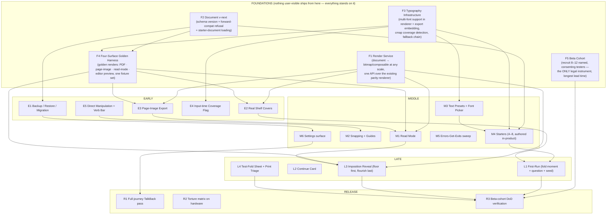

# ZINELY V1 MASTER EXECUTION PLAN

**Authority:** subordinate to THE CONSTITUTION OF ZINELY and ZINELY V1. This document decides *order*, never *scope* — if a sequencing choice would change scope, ZINELY V1 must be amended first.
**Team:** 1 founder · 5 engineers (E1–E5) · 1 designer (D). No dates in this document — it is a dependency graph; dates come from walking it.
**Baseline (verified against the repo, not docs):** more exists than the planning documents implied — real shelf covers are already wired and shipped (ADR-045/046: `ShelfThumbnails`/`ShelfThumbnailProducer`/`AndroidThumbnailRaster` live under `app/.../home/`); document versioning + a version-refusing `.zine` package validator exist (`CURRENT_SCHEMA_VERSION`, `DocumentMigrator`, `ZinePackageManifestValidator`); the verb bar (`EditorContextBar`), gesture layer (`EditorGestures`, `ResizeHandles`, `SelectionChrome`, `ReframeOverlay`) and `SnapGuides` partially exist; the render stack is already one `CanvasReplayer` behind three thin providers; extensive four-surface goldens exist (`PagePreviewParityTest`, `ProofPrintGoldenTest`, ADR-028 parity tests). **Rows below are scoped as deltas from this baseline.** First engineering act of every stream: verify its baseline claim in code; any baseline that proves weaker becomes a blocker automatically (V1 §7 tripwire).
**Process law honored:** every new user-facing surface passes the HTML-first pipeline (prototype → critique → freeze → Compose → parity). With one designer, **the freeze queue is a first-class dependency**, scheduled like engineering.

---

## 1. The Dependency Graph (what the plan is)

## 2. Foundations — the ones that don't look foundational

**F1 — Render Service.** *Why now:* three still-unbuilt REQUIRED features (page-image export, read mode, reveal) are all "render the document somewhere that isn't the editor or the PDF." The repo is ahead of the fear: one `CanvasReplayer` already sits behind three thin providers (raster, PDF, thumbnail) — so F1 is **not** a unification refactor; it is (a) adding the read-mode/reveal provider, (b) the cache + performance contract for on-screen scale, benchmarked on the worst supported device *before* the API freezes. *Impossible if delayed:* the reveal built against an ad-hoc path gets rebuilt.

**F2 — Document v-next (delta).** Versioning largely exists (`CURRENT_SCHEMA_VERSION`, `DocumentMigrator`, and a `.zine` package validator that already *refuses* newer versions rather than corrupting). The real delta: **starter-document loading** (starters, the first-run seed, and backup are all the same serializer — decide their packaging once) and whatever all-zines backup needs beyond the existing per-zine package. *Impossible if delayed:* starters and backup shipping on divergent packaging assumptions.

**F3 — Typography Infrastructure.** *Why now:* the hidden dependency is **starters use the new fonts**. If starters are authored before multi-font support and presets exist, every starter is authored twice. Coverage detection (the non-Latin flag) and the fallback chain live in the same code. *Scope must include closing the two-font-homes split:* UI fonts live in `feature/editor/res/font/` (Inter + Fraunces) while the render stack bundles only Inter in `render-android` assets — a latent parity divergence F3 ends by making the render-stack registry the single source of typographic truth. *Order within:* renderer + export embedding → coverage/fallback → picker UI (picker is Middle; infrastructure is Foundation).

**F4 — Four-Surface Golden Harness.** *Why now:* DoD 3 ("same display list, golden-verified, four surfaces") is a *test capability*, and it's the regression net every later feature walks on. Extends the existing Roborazzi/parity suites (`PagePreviewParityTest`, `ProofPrintGoldenTest`, ADR-028 multi-scale tests) — extension, not invention. **Sequencing rule (replaces any single edge in the graph):** the harness lands *first* on the existing surfaces, then extends per new surface and per new font *as each arrives* — every font is golden-verified on all four surfaces the day it's added; read mode is goldened the day M1 exists.

**F5 — Beta Cohort.** *Why now:* Article 3 makes consented humans the only measurement instrument, and recruiting 8–12 real beginners (plus scheduling them across the whole build) has the longest lead time and zero engineering cost. The founder starts this the day the plan is adopted. *Impossible if delayed:* DoD verification becomes a last-week scramble with friends-and-family bias — i.e., not verification.

**D's freeze queue is the sixth foundation.** Order of freezes, matched to when engineering needs them: (1) read mode + page-image share flow, (2) **starter designs + font/preset curation** *(content, not just screens — must precede first-run because the first-run seed IS a starter)*, (3) **reveal storyboard** (with the ZINELY-V1 degradation floor drawn explicitly — pulled early because it gates the plan's riskiest Late item and D is saturated later), (4) first-run trilogy (fold moment, question, seeded shelf — assembled from frozen starters), (5) settings + backup surfaces, (6) test-fold sheet + triage. Anything engineering touches before its freeze is throwaway by law.

## 3. Work Streams (parallelization)

| Stream | Owner | Sequence | Independent until |
|---|---|---|---|
| **S1 Rendering & Bodies** | E1 + E2 | F1 → E2 covers → E3 page-image export → M1 read mode → L3 reveal | SP-3 (reveal needs read-mode learnings + freeze 5) |
| **S2 Documents & Trust** | E3 | F2 → E1 backup/restore/migration → M6 settings (backup's home) → R2 torture matrix | fully independent to SP-2 |
| **S3 Typography (infra)** | E4 | F3 infra → E4 coverage flag → font registry handoff | **stops at the editor-surface boundary** — picker/preset *UI* is S4's to build |
| **S4 Editor Surface** | E5 | E5 direct-manipulation deltas + verb-bar completion → M2 snapping deltas → M3 preset/picker UI (on S3's infra) → M5 errors-get-exits | **sole owner of `EditorReducer`/`Intent`/`TypeBar`/`EditorContextBar`** — the current working tree proves one change spans all four files; two engineers in those files is a standing merge conflict. S3 and S4 meet at a typed API (font registry + coverage query), never in the same files. |
| **S5 Design & Content** | D (+founder) | freeze queue 1→6; starter authoring with S3's tools; font curation/licensing with founder | gates everyone; protected from meetings |
| **S6 Program** | Founder | F5 cohort · license vetting · copy/voice · gate keeping | — |

**Synchronization points:**
- **SP-1 (early):** F1 API frozen + F4 harness green on existing surfaces. S1 fans out.
- **SP-2 (early-middle):** F2 + F3 land → backup and starter authoring both unblocked. *First cohort touchpoint:* backup/restore tested by real users on real phones.
- **SP-3 (middle):** freezes 1–3 done; M1 read mode shipped internally → **the Finish-Loop Test** (see gates): cohort members finish a zine and share it, without print, without help. Everything after SP-3 is polish, theater, and print — the loop itself must already work.
- **SP-4 (late):** first-run assembled from finished parts (starters exist, covers real, fold moment frozen). L-items integrate.
- **SP-5 (release):** feature-freeze; R1–R3 only.

## 4. Critical Path

**The critical resource is D, not any engineer. The path: freeze 2 (starter designs + font curation) → M4 starter authoring → freeze 4 (first-run) → L1 first-run parity → R3 cohort DoD verification.**

Justification: with the re-baselined repo (covers shipped, versioning existing, editor surfaces partial), no engineering chain is longer than the designer chain — one person holds six freezes *and* starter authoring *and* every parity acceptance. F3 typography is the longest pure-engineering chain and feeds the designer chain (curation needs the infra to try fonts in-product), so it starts day 1; but slack lives in engineering, not in D. **Protect D structurally:** no meetings owed, freezes reviewed asynchronously, founder absorbs all license/copy work. The reveal is *risk*, not path: its degradation floor means it can shrink to fit; starters cannot (REQUIRED, quality-floored by V1 law).

**Corollary — the three things to start tomorrow:** F3 (longest engineering chain), D's freeze queue in the §2 order, and F5 recruiting (longest human chain).

## 5. Failure Analysis (per milestone)

| Milestone | What kills it | Assumption to validate before continuing |
|---|---|---|
| F1 Render Service | Performance: rendering 8 pages at shelf/read-mode scale on API-24-class hardware jank | Benchmark on the worst real device *before* freezing the API; if slow, the API grows a cache contract now, not later |
| F2/E1 Backup | Restore-merge semantics (duplicate IDs, newer-version files) turn "one file, any destination" into a corruption engine | Write the torture matrix *first*, as executable tests; SAF destination quirks validated on 3 OEMs |
| F3 Typography | A chosen font's cmap lies, or fallback rendering diverges between Compose preview and PDF embedding | Golden-verify every font on all four surfaces the day it's added; kill any font that fails, don't fix around it |
| M1 Read Mode | Scope creep toward a "reader app" (gestures, sharing from within, animations) | The freeze is the fence; read mode is flip-through + exit, nothing else |
| M4 Starters | The Article-7 failure: cohort finishes starters *unmodified* | SP-3 cohort session watches real beginners; if starters ship unmodified, redesign starters (V1 law), don't ship and hope |
| L1 First-Run | It quietly becomes a tutorial (skip-rate death) | Freeze review checks: skippable at every step, zero instruction screens, editor reachable in ≤3 taps from cold install |
| L3 Reveal | The flourish eats the schedule | Floor version built *first* and kept shippable; flourish is a separate, cuttable work item — never one PR |
| R3 DoD verification | Cohort is friends-and-family, confirms everything | Recruit strangers (zine fair, library, classroom contacts); founder owns adversarial session design |

## 6. Build Order (every V1 REQUIRED/OPTIONAL feature assigned)

| Feature (V1 tribunal) | Phase | Justification (why now / why not later) |
|---|---|---|
| Render Service (implied by 4 features) | **Foundation** | Four consumers; rework multiplier if late |
| Document v-next + starter loading | **Foundation** | Backup + starters + seed inherit it; migration semantics can't be retrofitted |
| Typography infra (fonts in renderer/export, coverage, fallback) | **Foundation** | Critical path head; starters are made of it |
| Four-surface golden harness | **Foundation** | DoD 3 is a capability; regression net for all streams |
| Beta cohort (instrument, not feature) | **Foundation** | Longest human lead; only legal measurement |
| Backup / restore / migration | **Early** | Trust debt #1; unlocks cohort's real-phone usage safely; settings needs its home later |
| Real shelf covers | **Early — verification only** | Re-baselined: ADR-045/046 pipeline is *already wired and shipped*. Task shrinks to verifying it against DoD 3/7 and goldening it in F4. If verification fails, it re-becomes a feature (tripwire). |
| Page-image export | **Early** | Second RS consumer; unlocks digital-body testing before read mode exists |
| Input-time coverage flag | **Early** | Standing Art-5 violation ends the week fallback lands |
| Direct manipulation + verb bar | **Early — delta scope** | `EditorContextBar`, `EditorGestures`, `ResizeHandles`, `SelectionChrome`, `SnapGuides` partially exist; first task is a gap audit (which gestures/twins/verbs are missing) then deltas only. Zero foundation dependencies — starts day 1; longest UX-iteration tail |
| Read mode | **Middle** | Needs RS + freeze 1; completes the digital body → enables SP-3 Finish-Loop Test |
| Snapping + guides | **Middle** | Builds on verb-bar selection model |
| Text presets + font picker | **Middle** | Needs F3; feeds starter authoring |
| Starters (4–8) | **Middle** | Needs presets/fonts/covers **and S4's manipulation deltas** (authoring quality depends on the editor being pleasant — an explicit DM→ST edge: if S4 slips, starter authoring visibly moves). Authored in-product: every starter authored is an editor test |
| Errors-get-exits sweep | **Middle** | Sweep after surfaces stabilize; earlier = re-sweep |
| Settings | **Middle** | Waits for backup (its tenant) and theme decision |
| First-run trilogy | **Late** | Assembly of finished parts; building it earlier = building it twice |
| Continue card | **Late** | Explicit edge FR → CONT: rides the first-run shelf changes (same surface, same freeze); trivial alone |
| Imposition reveal | **Late** (floor **Middle**-spiked) | Needs RS + read mode + freeze 5; the risk item with a legal shrink path |
| Test-fold sheet + print triage | **Late** | Static content + one screen; no dependencies, so it *can* be late — schedule filler for whoever frees up |
| Dark theme (follow system) | **Parallel** | Token-level; any stream, any time; cut last per V1 law |
| Prompt list · copy-shop guidance · share card | **Parallel / filler** | OPTIONAL by law: zero-dependency, first cut, never on the path |
| Full TalkBack pass · torture matrix · cohort DoD | **Release** | Gates, not features |

**"What never gets built before something else" (the hard orderings):** starters never before typography+presets · first-run never before starters+covers · reveal never before render service+read mode · backup never before document versioning · settings never before backup · snapping never before the verb-bar selection model · *nothing user-visible before its freeze*.

## 7. Ship Gates (evidence, not feelings)

- **G0 — Foundations Gate (per-dependency, not monolithic).** Each gate condition blocks only its dependents, so no human task ever blocks unrelated engineering: RS benchmark green on worst device → blocks S1 fan-out only. Golden harness demonstrably catching an injected divergence → blocks new-surface merges only. Torture matrix written-and-failing → blocks backup implementation only. Cohort ≥8 strangers confirmed → blocks G1/G2 sessions only. S4's day-1 editor work is gated by none of these.
- **G1 — Trust Gate.** Evidence: torture matrix green on 3 physical devices incl. API 24; backup→wipe→restore performed live by a cohort member on their own phone; coverage flag demonstrated with Cyrillic/Greek/emoji/CJK input (flag fires, nothing blanks); **APK-size check: font subsets within V1's single-digit-MB budget, enforced as a CI threshold from the first font onward.** *Unlocks: shipping anything to the cohort's daily phones.*
- **G2 — Finish-Loop Gate (SP-3).** Evidence: ≥3 cohort beginners, cold start to finished zine to sent digital body, one sitting, zero facilitator words, on video (with consent). Starters overwritten, not shipped as-is. *Stop rule: if <3 pass, everything Late pauses **except L4 test-fold (zero-dependency filler)**; the loop is the product.*
- **G3 — Theater Gate.** Evidence: reveal floor version passes reduced-motion + TalkBack narration; frame-time budget met on worst device; freeze-parity screenshots accepted. Flourish merges only after floor is release-branch-safe.
- **G4 — Print Gate.** Evidence: test-fold + full print executed on ≥3 printer models (inkjet/laser/OEM-app path); triage screen correctly diagnoses the two seeded failures (fit-to-page, portrait). |
- **G5 — Release Gate.** Evidence: all 10 DoD truths checked with artifacts (videos, matrix logs, golden runs, TalkBack session recordings); airplane-mode full-journey run; zero notifications verified by manifest audit; Release-Agent review of packaging/claims per repo law. *Ship.*

## 8. Where we stop

Feature ideas arriving mid-build go to a parking lot for post-v1 triage — ZINELY V1 §9 already pre-committed the winners (supplies + user packs first). The only mid-build scope changes permitted are *cuts*, and V1 law pre-approved the cut order: share card → copy-shop screen → prompt list → dark theme → starter count (8→4) → reveal flourish (floor stays). If cutting past that list is ever on the table, the ship date moves instead — those are the last things whose absence V1 can survive.

---

*Adopted as the canonical execution reference. Sequencing changes: edit this document. Scope changes: amend ZINELY V1 first. The Constitution wins every conflict.*
